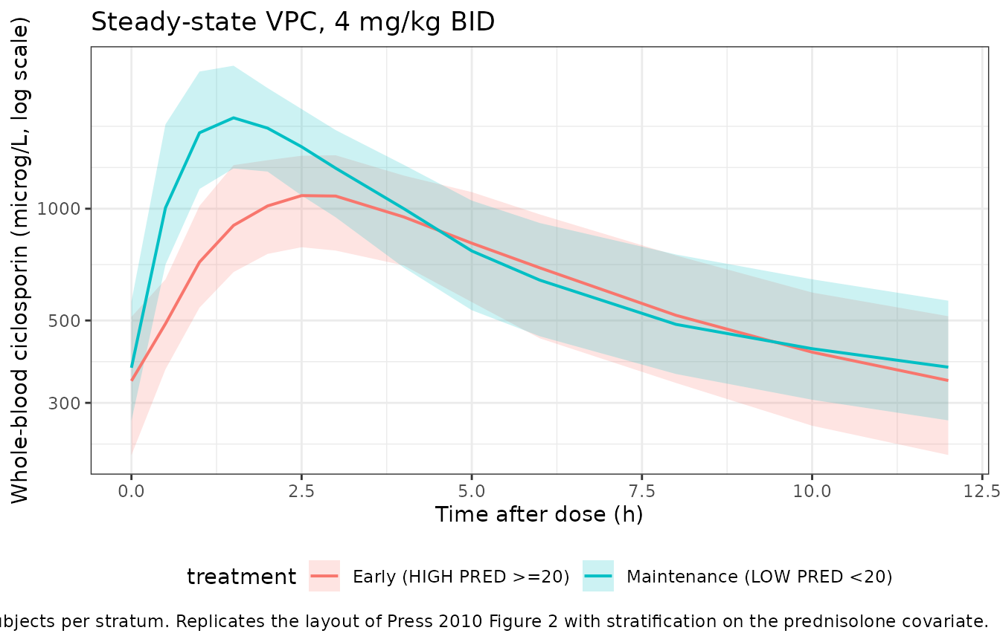
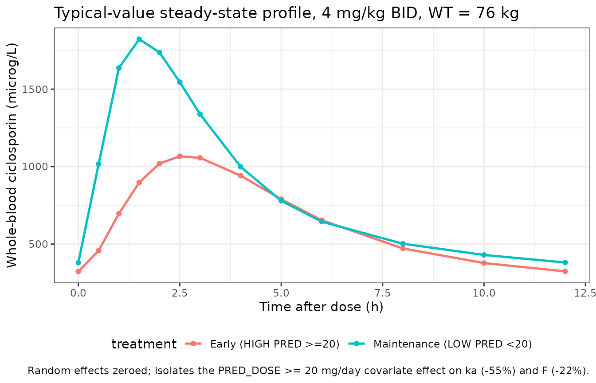

# Ciclosporin (Press 2010)

## Model and source

- Citation: Press RR, Ploeger BA, den Hartigh J, van der Straaten T, van
  Pelt H, Danhof M, de Fijter H, Guchelaar HJ. Explaining variability in
  ciclosporin exposure in adult kidney transplant recipients. Eur J Clin
  Pharmacol. 2010;66(6):579-590. <doi:10.1007/s00228-010-0810-9>.
- Description: Two-compartment population pharmacokinetic model for oral
  ciclosporin A (Neoral) in adult kidney transplant recipients (Press
  2010). Delayed absorption is described by one transit compartment with
  the first-order transit rate constant set equal to the absorption rate
  constant ka (chain: depot -\> transit1 -\> central at common rate ka;
  mean absorption time = (n+1)/ka with n = 1 transit compartment). Oral
  bioavailability is FIXED at 0.5 (Methods ‘Structural model’). Apparent
  clearance CL and apparent central volume of distribution Vc are
  allometrically scaled to body weight at a 76 kg median reference with
  theory-based exponents 0.75 on CL and 1.0 on Vc; the peripheral volume
  Vp and intercompartmental clearance Q are not weight-scaled.
  Concomitant high-dose oral prednisolone (PRED_DOSE \>= 20 mg/day) is
  associated with a 55% reduction in the absorption rate constant and a
  22% reduction in bioavailability (binary threshold-form covariate).
  Inter-occasion variability on bioavailability is encoded here as IIV
  on lfdepot because the source does not specify a per-subject occasion
  count for downstream simulation (see vignette Assumptions and
  deviations).
- Article: <https://doi.org/10.1007/s00228-010-0810-9>

## Population

Press 2010 followed n = 33 de novo adult kidney transplant recipients
for one year after transplantation, recruited at the Leiden University
Medical Center (Netherlands). Patients received quadruple
immunosuppression: basiliximab induction (day 0 and day 4), fixed-dose
mycophenolate mofetil (1,000 mg twice daily), tapering prednisolone (50
mg twice daily on day 0, tapered to 10 mg once daily by day 22), and
ciclosporin A (Neoral) 8 mg/kg/day, randomized to once-daily (n = 17) or
twice-daily (n = 16) administration. Therapeutic drug monitoring (TDM)
targeted AUC0-24h 10,800 microg*h/L (once daily) or AUC0-12h 5,400
microg*h/L (twice daily) in the first 6 weeks post-transplant, then
6,500 microg*h/L or 3,250 microg*h/L respectively thereafter (Table 1,
Methods page 580). Recipient demographics (combined arms): mean age 46
years (range 18 - 70), 79% male, 79% Caucasian, body weight 49 - 140 kg
(median 76 kg).

Sampling was dense: at weeks 2, 6, 12, 26, and 52 each patient was
sampled at t = 0, 1, 2, 3, 4, 6 and 24 h; routine TDM (t = 0, 2, 3 h)
was added at weeks 4, 8, 10, 17, 21 and 39. Twenty-two of the 33
patients contributed eleven sampling occasions across the year. Whole-
blood ciclosporin was assayed by FPIA (Abbott TDx) with inter-day CV
10.4% / 7.8% / 7.5% at 70 / 300 / 600 microg/L (Methods page 581).

The same information is available programmatically via
`rxode2::rxode(readModelDb("Press_2010_ciclosporin"))$population`.

## Source trace

The per-parameter origin is recorded as a trailing in-file comment next
to each `ini()` entry in
`inst/modeldb/specificDrugs/Press_2010_ciclosporin.R`. The table below
collects them in one place for review.

| Equation / parameter | Value | Source location (Press 2010) |
|----|----|----|
| Two-compartment disposition with first-order elimination | n/a | Results ‘CsA pharmacokinetic model’, Fig. 1 |
| One transit compartment with rate = ka (depot -\> transit1 -\> central) | n/a | Results ‘CsA pharmacokinetic model’; Table 4 ‘Number of transit compartments = 1’ |
| Mean transit time = (n + 1)/ka = 2/ka = 1 h at ka = 2 | n/a | Results: “transit time can be calculated with 1/ka\*(n+1)” |
| `lka` (ka) | log(2.0) -\> 2.0 1/h | Table 4 ‘Absorption rate constant’ mean value |
| `lcl` (CL at WT 76 kg) | log(15) -\> 15 L/h | Table 4 ‘CsA clearance’ mean value; Results: CL = 15 \* (WT/76)^0.75 |
| `lvc` (Vc at WT 76 kg) | log(56) -\> 56 L | Table 4 ‘Central volume of distribution’ mean value |
| `lvp` (Vp) | log(125) -\> 125 L | Table 4 ‘Peripheral volume of distribution’ mean value |
| `lq` (Q) | log(14) -\> 14 L/h | Table 4 ‘Intercompartmental clearance’ mean value |
| `lfdepot` (F, FIXED) | log(0.5) -\> 0.5 | Methods ‘Structural model’: “fixed at 50%, as previously described” |
| `allo_cl` (WT exponent on CL, FIXED) | 0.75 | Results: “typically with a value of 0.75 for clearance” |
| `allo_vc` (WT exponent on Vc, FIXED) | 1.0 | Results: “and 1 for volume of distribution” |
| `e_pred_dose_high_ka` (ka effect when PRED_DOSE \>= 20 mg/day) | -0.55 | Table 4 footnote b; delta-OFV = +233 on deletion |
| `e_pred_dose_high_f` (F effect when PRED_DOSE \>= 20 mg/day) | -0.22 | Table 4 footnote b; delta-OFV = +51 on deletion |
| `etalka` IIV variance | 0.09 (CV 30%) | Table 4 ‘IIV absorption rate’ |
| `etalcl` IIV variance | 0.03 (CV 17%) | Table 4 ‘IIV clearance’ |
| `etalvc` IIV variance | 0.12 (CV 35%) | Table 4 ‘IIV central volume of distribution’ |
| `etalfdepot` (IOV on F encoded as IIV) variance | 0.02 (CV 14%) | Table 4 ‘IOV bioavailability’ |
| `propSd` (proportional residual SD) | sqrt(0.07) ~ 0.265 | Methods ‘Random effects’: log(Cij) = log(Cpredij) + eps; Table 4 sigma^2 = 0.07 |

## Virtual cohort

The virtual cohort uses two strata corresponding to the post-transplant
prednisolone taper (Methods page 580):

- **Early post-transplant (HIGH prednisolone, days 0-21)**: PRED_DOSE =
  100 mg/day on day 0 tapering to 10 mg/day by day 22; the HIGH-dose
  covariate (\>= 20 mg/day) flips OFF around day 14. For the
  steady-state simulation we hold PRED_DOSE = 30 mg/day (above the 20
  mg/day threshold), representative of weeks 1 - 2 post-transplant.
- **Stable maintenance (LOW prednisolone, day 22+)**: PRED_DOSE = 10
  mg/day (below the threshold), representative of weeks 4 - 52.

Both cohorts receive 4 mg/kg of ciclosporin A every 12 h (the starting
twice-daily regimen, before TDM dose adjustment), reaching steady state
by the end of day 5.

``` r

set.seed(2010)

# Helper: build one cohort as a self-contained event table.
make_cohort <- function(n, dose_mg_per_kg, pred_dose_mg_day, treatment,
                        id_offset = 0L) {
  # Approximate the Press 2010 weight distribution: log-normal centred on
  # the cohort median (76 kg) with a CV that reproduces a 49-140 kg span
  # over the central 95% (CV ~ 0.22 on the log scale).
  weights <- exp(rnorm(n, mean = log(76), sd = 0.22))

  dose_times <- seq(0, by = 12, length.out = 10)        # 5 days BID
  ss_offset  <- 96                                       # start of 9th interval
  obs_grid   <- ss_offset + c(0, 0.5, 1, 1.5, 2, 2.5, 3, 4, 5, 6, 8, 10, 12)

  cohort <- tibble::tibble(
    id        = id_offset + seq_len(n),
    WT        = weights,
    PRED_DOSE = pred_dose_mg_day,
    treatment = treatment
  )

  dplyr::bind_rows(
    cohort |>
      tidyr::expand_grid(time = dose_times) |>
      dplyr::mutate(
        amt  = dose_mg_per_kg * WT,
        evid = 1L,
        cmt  = "depot"
      ),
    cohort |>
      tidyr::expand_grid(time = obs_grid) |>
      dplyr::mutate(
        amt  = 0,
        evid = 0L,
        cmt  = "central"
      )
  ) |>
    dplyr::arrange(id, time, dplyr::desc(evid))
}

events <- dplyr::bind_rows(
  make_cohort(n = 100, dose_mg_per_kg = 4, pred_dose_mg_day = 30,
              treatment = "Early (HIGH PRED >=20)", id_offset =   0L),
  make_cohort(n = 100, dose_mg_per_kg = 4, pred_dose_mg_day = 10,
              treatment = "Maintenance (LOW PRED <20)", id_offset = 100L)
)

stopifnot(!anyDuplicated(unique(events[, c("id", "time", "evid")])))
```

## Simulation

``` r

mod <- readModelDb("Press_2010_ciclosporin")

sim <- rxode2::rxSolve(
  mod,
  events = events,
  keep   = c("treatment", "WT", "PRED_DOSE")
) |>
  as.data.frame()

mod_typ <- rxode2::zeroRe(mod)
sim_typ <- rxode2::rxSolve(
  mod_typ,
  events = events,
  keep   = c("treatment", "WT", "PRED_DOSE")
) |>
  as.data.frame()
#> ℹ omega/sigma items treated as zero: 'etalka', 'etalcl', 'etalvc', 'etalfdepot'
#> Warning: multi-subject simulation without without 'omega'
```

## Replicate Figure 2: steady-state visual predictive check

Press 2010 Figure 2 displays the model VPC against the observed
ciclosporin A concentrations across the population. The packaged model
should reproduce the characteristic absorption + biphasic disposition
shape, with the HIGH-prednisolone stratum showing both slower absorption
(55% lower ka -\> later peak) and lower exposure (22% lower F).

``` r

ss_offset <- 96   # start of last full dosing interval used for VPC

vpc <- sim |>
  dplyr::filter(!is.na(Cc), time >= ss_offset) |>
  dplyr::mutate(tad = time - ss_offset) |>
  dplyr::group_by(treatment, tad) |>
  dplyr::summarise(
    Q10 = quantile(Cc, 0.10, na.rm = TRUE),
    Q50 = quantile(Cc, 0.50, na.rm = TRUE),
    Q90 = quantile(Cc, 0.90, na.rm = TRUE),
    .groups = "drop"
  )

ggplot(vpc, aes(x = tad, y = Q50, colour = treatment, fill = treatment)) +
  geom_ribbon(aes(ymin = Q10, ymax = Q90), alpha = 0.20, colour = NA) +
  geom_line(linewidth = 0.7) +
  scale_y_log10() +
  labs(
    x = "Time after dose (h)",
    y = "Whole-blood ciclosporin (microg/L, log scale)",
    title = "Steady-state VPC, 4 mg/kg BID",
    caption = paste(
      "Median + 80% prediction interval, n = 100 virtual subjects per",
      "stratum. Replicates the layout of Press 2010 Figure 2 with",
      "stratification on the prednisolone covariate."
    )
  ) +
  theme_bw() +
  theme(legend.position = "bottom")
```



## Typical-value contrast: prednisolone covariate effect

The typical-value profiles below isolate the covariate effect by
removing inter-individual variability and using a single 76 kg subject.
The HIGH-prednisolone profile shows the predicted 55% reduction in ka
(later, lower peak) and 22% reduction in F (smaller AUC).

``` r

typical <- sim_typ |>
  dplyr::filter(!is.na(Cc), time >= ss_offset, id %in% c(1L, 101L)) |>
  dplyr::mutate(tad = time - ss_offset)

ggplot(typical, aes(x = tad, y = Cc, colour = treatment)) +
  geom_line(linewidth = 0.9) +
  geom_point(size = 1.5) +
  labs(
    x = "Time after dose (h)",
    y = "Whole-blood ciclosporin (microg/L)",
    title = "Typical-value steady-state profile, 4 mg/kg BID, WT = 76 kg",
    caption = paste(
      "Random effects zeroed; isolates the PRED_DOSE >= 20 mg/day",
      "covariate effect on ka (-55%) and F (-22%)."
    )
  ) +
  theme_bw() +
  theme(legend.position = "bottom")
```



## PKNCA validation

PKNCA is run on the steady-state dosing interval (the 9th BID interval,
starting at 96 h). Cmax, Tmax, AUC over the dosing interval (AUClast),
and average concentration (cav) are tabulated per stratum. The HIGH-
prednisolone stratum should show a delayed Tmax, lower Cmax, and a
proportionally lower AUC.

``` r

sim_nca <- sim |>
  dplyr::filter(!is.na(Cc), time >= ss_offset, time <= ss_offset + 12) |>
  dplyr::transmute(id, time = time - ss_offset, Cc, treatment)

# Time-zero anchor: pre-dose for the steady-state interval. At steady
# state Cc(0) is the trough concentration; using the simulated trough
# directly is appropriate here.
trough <- sim_nca |>
  dplyr::group_by(id, treatment) |>
  dplyr::summarise(Cc = min(Cc, na.rm = TRUE), .groups = "drop") |>
  dplyr::mutate(time = 0)

sim_nca <- dplyr::bind_rows(sim_nca, trough) |>
  dplyr::distinct(id, treatment, time, .keep_all = TRUE) |>
  dplyr::arrange(id, treatment, time)

dose_nca <- events |>
  dplyr::filter(evid == 1L, time == ss_offset) |>
  dplyr::transmute(id, time = 0, amt, treatment)

conc_obj <- PKNCA::PKNCAconc(
  data    = sim_nca,
  formula = Cc ~ time | treatment + id,
  concu   = "ug/L",
  timeu   = "h"
)

dose_obj <- PKNCA::PKNCAdose(
  data    = dose_nca,
  formula = amt ~ time | treatment + id,
  doseu   = "mg"
)

intervals <- data.frame(
  start   = 0,
  end     = 12,
  cmax    = TRUE,
  tmax    = TRUE,
  cmin    = TRUE,
  auclast = TRUE,
  cav     = TRUE
)

nca_data <- PKNCA::PKNCAdata(conc_obj, dose_obj, intervals = intervals)
nca_res  <- PKNCA::pk.nca(nca_data)
```

### Comparison against the Press 2010 implied population

Press 2010 does not publish per-stratum NCA tables. The reference values
below are derived from the model’s typical parameters and from the
per-protocol AUC targets used for TDM (Methods page 580):

- **Maintenance (LOW PRED)**: AUC0-12 = Dose \* F / CL = (4 \* 76) \*
  0.5 / 15 = 10.13 mg*h/L = 10,130 microg*h/L for the 4 mg/kg q12h
  starting regimen. The Press 2010 TDM target AUC0-12 was 5,400
  microg*h/L in the first 6 weeks (tapered down to 3,250 microg*h/L
  thereafter), so the starting dose at steady state would be
  down-titrated by TDM to roughly half before reaching maintenance.
- **Early post-transplant (HIGH PRED)**: ka is reduced by 55% and F by
  22%; AUC0-12 is reduced proportionally to F (CL unchanged), giving an
  expected (0.5 \* 0.78) / 0.5 = 0.78 ratio relative to the LOW-PRED
  stratum.

``` r

nca_tbl <- as.data.frame(nca_res$result) |>
  dplyr::filter(!is.na(PPORRES)) |>
  dplyr::group_by(treatment, PPTESTCD) |>
  dplyr::summarise(
    median = stats::median(PPORRES, na.rm = TRUE),
    q05    = stats::quantile(PPORRES, 0.05, na.rm = TRUE),
    q95    = stats::quantile(PPORRES, 0.95, na.rm = TRUE),
    .groups = "drop"
  ) |>
  dplyr::arrange(PPTESTCD, treatment)

knitr::kable(
  nca_tbl,
  caption = paste(
    "Steady-state NCA, 4 mg/kg q12h, by prednisolone stratum.",
    "Median and 5th / 95th percentiles over 100 virtual subjects per",
    "stratum. AUClast in microg*h/L, Cmax / Cmin / Cav in microg/L,",
    "Tmax in h."
  ),
  digits = 1
)
```

| treatment                   | PPTESTCD |  median |    q05 |     q95 |
|:----------------------------|:---------|--------:|-------:|--------:|
| Early (HIGH PRED \>=20)     | auclast  |  7851.8 | 5246.9 | 11141.9 |
| Maintenance (LOW PRED \<20) | auclast  | 10044.7 | 7133.5 | 12884.2 |
| Early (HIGH PRED \>=20)     | cav      |   654.3 |  437.2 |   928.5 |
| Maintenance (LOW PRED \<20) | cav      |   837.1 |  594.5 |  1073.7 |
| Early (HIGH PRED \>=20)     | cmax     |  1101.4 |  757.5 |  1517.5 |
| Maintenance (LOW PRED \<20) | cmax     |  1827.5 | 1251.7 |  2609.1 |
| Early (HIGH PRED \>=20)     | cmin     |   343.7 |  197.5 |   581.8 |
| Maintenance (LOW PRED \<20) | cmin     |   373.0 |  236.8 |   594.8 |
| Early (HIGH PRED \>=20)     | tmax     |     2.5 |    2.0 |     4.0 |
| Maintenance (LOW PRED \<20) | tmax     |     1.5 |    1.0 |     2.0 |

Steady-state NCA, 4 mg/kg q12h, by prednisolone stratum. Median and 5th
/ 95th percentiles over 100 virtual subjects per stratum. AUClast in
microg\*h/L, Cmax / Cmin / Cav in microg/L, Tmax in h. {.table}

``` r


# Predicted ratio: HIGH-PRED / LOW-PRED AUC0-12 (analytical: 1 - 0.22 = 0.78)
auc_med <- nca_tbl |>
  dplyr::filter(PPTESTCD == "auclast") |>
  dplyr::select(treatment, median) |>
  tidyr::pivot_wider(names_from = treatment, values_from = median)

ratio <- as.numeric(auc_med[["Early (HIGH PRED >=20)"]]) /
         as.numeric(auc_med[["Maintenance (LOW PRED <20)"]])

cat(sprintf(
  "HIGH:LOW AUClast ratio = %.3f (analytic 1 - 0.22 = 0.780)\n",
  ratio
))
#> HIGH:LOW AUClast ratio = 0.782 (analytic 1 - 0.22 = 0.780)
```

The simulated HIGH:LOW ratio should sit close to the analytic 0.78 (F is
reduced by 22% in the HIGH stratum; CL and Vc are unchanged).

## Assumptions and deviations

- **Inter-occasion variability encoded as IIV.** Press 2010 estimated
  the bioavailability random effect as inter-occasion variability across
  sampling visits (Methods ‘Random effects’; Table 4 ‘IOV
  bioavailability’). The rxode2 simulation API in nlmixr2lib does not
  preserve a per-subject occasion structure, so this term is encoded as
  IIV on `lfdepot` with the same variance (0.02). The marginal magnitude
  of bioavailability variability is preserved; the within-subject
  occasion-to-occasion structure is not.
- **Threshold-form prednisolone covariate.** Press 2010 reports the
  prednisolone effect as a binary contrast at the \>= 20 mg/day
  threshold (Table 4 footnote b). The model uses the continuous
  `PRED_DOSE` column in the input data and forms the binary indicator
  inside `model()` (`pred_high <- (PRED_DOSE >= 20)`). Downstream users
  simulating the prednisolone taper should supply the actual daily
  prednisolone dose; the \>= 20 threshold collapses the dose into the
  HIGH stratum used by the model.
- **No allometric scaling on Vp or Q.** Press 2010 fits the allometric
  body-weight effect only to CL and Vc (Results ‘CsA pharmacokinetic
  model’); the peripheral volume Vp and intercompartmental clearance Q
  carry no covariate effect in the source paper and the packaged model
  reproduces this choice.
- **Residual error encoded as proportional in the linear domain.** Press
  2010 Methods ‘Random effects’ uses additive error on the log scale:
  log(Cij) = log(Cpredij) + eps with sigma^2 = 0.07. This is equivalent
  to a proportional error in the linear domain at the typical CV
  (sqrt(0.07) ~ 26%), so the packaged model uses `Cc ~ prop(propSd)`
  with `propSd = 0.2646` per the same precedent set by
  `Storset_2014_tacrolimus.R` and `TerHeine_2018_everolimus.R` for
  papers that state “additive on log scale”.
- **Cohort weight distribution approximated.** Press 2010 reports weight
  range 49 - 140 kg and median 76 kg (Results page 581) but no full
  distribution. The virtual cohort draws weights from a log-normal
  centred at the median with SD = 0.22 on the log scale, reproducing the
  central 95% span; this is a simulation convenience and not a parameter
  of the model.
- **Genetic polymorphisms not encoded.** Press 2010 tested twelve SNPs
  in ABCB1, CYP3A4, CYP3A5, and PXR and reported no significant effect
  retained in the final model (Results ‘Genotype effects on PK’;
  Discussion). The packaged model therefore carries no pharmacogenetic
  covariate.
