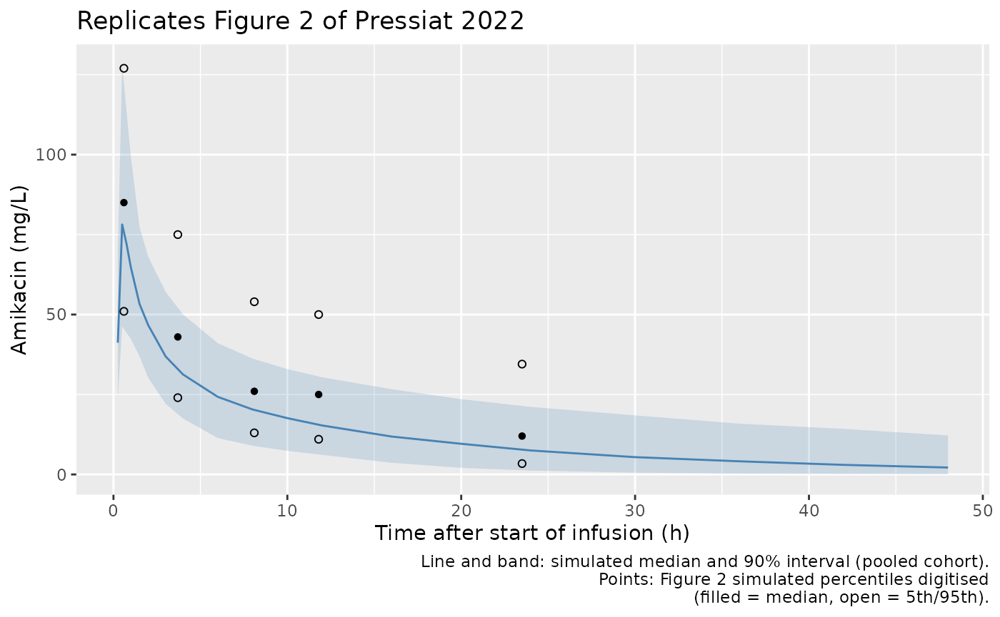
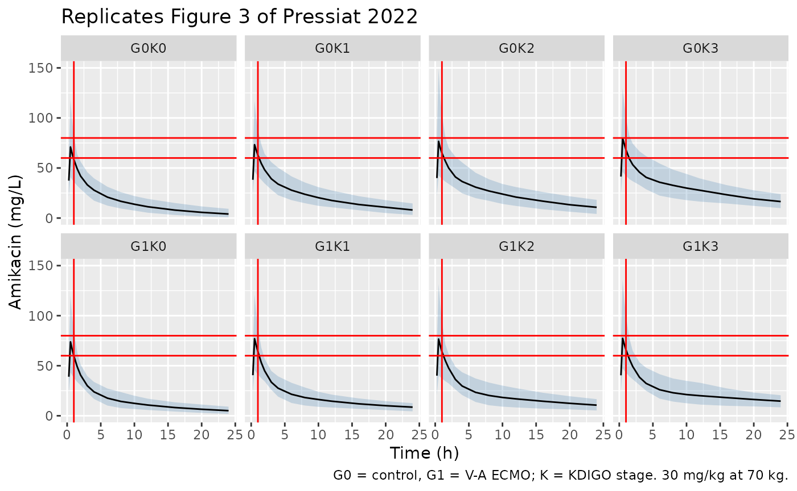

# Amikacin (Pressiat 2022)

## Model and source

- Citation: Pressiat C, Kudela A, De Roux Q, Khoudour N, Alessandri C,
  Haouache H, Vodovar D, Woerther PL, Hutin A, Ghaleh B, Hulin A,
  Mongardon N. Population Pharmacokinetics of Amikacin in Patients on
  Veno-Arterial Extracorporeal Membrane Oxygenation. Pharmaceutics.
  2022;14(2):289. <doi:10.3390/pharmaceutics14020289>. PMC8879580.
- Description: Two-compartment population PK model for a single
  30-minute intravenous infusion of amikacin in critically ill adults
  with nosocomial sepsis, with or without veno-arterial extracorporeal
  membrane oxygenation (V-A ECMO) (Pressiat 2022). KDIGO
  acute-kidney-injury stage (1, 2, 3 vs 0) lowers clearance, total body
  weight raises the central volume, and V-A ECMO support enlarges the
  peripheral volume; all three enter as Monolix exponential covariate
  effects. Proportional residual error.
- Article: <https://doi.org/10.3390/pharmaceutics14020289> (open access)

## Population

Pressiat 2022 prospectively enrolled 39 critically ill adults from the
surgical intensive care unit of Henri Mondor Hospital (Creteil, France)
between July 2013 and September 2015. All of them needed empirical
antimicrobial therapy that included amikacin for nosocomial sepsis.
Fifteen were controls and 24 were supported by veno-arterial
extracorporeal membrane oxygenation (V-A ECMO). Median (IQR) age was 62
(52-75) and 60 (51-64) years, total body weight 70 (65-84) and 75
(60-87) kg, and two thirds were men (Table 1). Most controls were
post-cardiac-surgery patients; the ECMO group was dominated by
cardiogenic shock. Measured creatinine clearance was 120 (86-191) mL/min
in controls and 18 (7-54) mL/min on ECMO. KDIGO acute-kidney-injury
stages 0/1/2/3 were 10/2/2/1 in controls and 11/3/6/5 in the ECMO group,
as printed. Patients on chronic dialysis or renal replacement therapy
were excluded.

Each patient contributed one studied dose: 30 mg/kg total body weight
infused over 30 min and rounded up to a multiple of 125 mg. The doses
actually received were 29 (24-33) and 32 (30-35) mg/kg. The 215
concentrations (5.5 per patient) were sampled at the end of infusion,
between 3 and 12 h, at 24 h, and every 12 h after that while the
concentration stayed above 2.5 mg/L.

The same information is available programmatically via
`readModelDb("Pressiat_2022_amikacin")()$population`.

## Source trace

| Equation / parameter | Value | Source location |
|----|----|----|
| Two-compartment model, first-order elimination, proportional error | n/a | Section 3.3, first paragraph |
| `lcl` (CL, KDIGO stage 0) | log(4.45 L/h) | Table 3 |
| `lvc` (V1 intercept at TBW = 0) | log(8.77 L) | Table 3; interpretation in the TBW section below |
| `lvp` (V2, control) | log(15.90 L) | Table 3 |
| `lq` (Q) | log(6.96 L/h) | Table 3 |
| `e_kdigo_aki_1_cl` | -0.41 | Table 3 ‘KDIGO stage 1/CL’ |
| `e_kdigo_aki_2_cl` | -0.59 | Table 3 ‘KDIGO stage 2/CL’ |
| `e_kdigo_aki_3_cl` | -0.93 | Table 3 ‘KDIGO stage 3/CL’ |
| `e_wt_vc` | 0.015 per kg | Table 3 ‘TBW/V1’ (printed equation: 0.014) |
| `e_ecmo_status_vp` | 0.76 | Table 3 ‘ECMO group/V2’ (printed equation: 0.79) |
| `etalcl` | 0.25^2 = 0.0625 | Table 3 omega CL |
| `etalvc` | 0.36^2 = 0.1296 | Table 3 omega V1 |
| `etalvp` | 0.63^2 = 0.3969 | Table 3 omega V2 |
| `propSd` | 0.16 | Table 3 Sigma prop |
| `CL = 4.45 * exp(beta_k)` for KDIGO stage k | n/a | Section 3.3 final covariate model (printed as powers of the betas; see below) |
| `V1 = 8.77 * exp(0.015 * TBW)` | n/a | Section 3.3 final covariate model, reinterpreted against Figure 2 |
| `V2 = 15.90 * exp(0.76 * ECMO)` | n/a | Section 3.3 final covariate model |

### Reading the printed covariate equations

Section 3.3 prints the final covariate model as

    Cl = 4.45 x (-0.41)^(KDIGO=1) x (-0.59)^(KDIGO=2) x (-0.93)^(KDIGO=3)
    V1 = 8.77 x (TBW/72)^0.014
    V2 = 15.90 x (0.79)^ECMO

Taken literally, the clearance line is impossible: a negative base
raised to an indicator makes clearance negative. The model was fitted in
Monolix 2020R1. By default, Monolix enters a categorical covariate as
`log(theta) = log(theta_pop) + beta`, and the Table 3 rows are those
betas. The same beta-as-base form is used on every line of the printed
block, so the model uses `exp(beta)` throughout: clearance multipliers
of 0.66, 0.55 and 0.39 for KDIGO stages 1, 2 and 3, and a 2.14-fold
larger V2 on ECMO. When the equation and Table 3 disagree (0.79 vs 0.76,
0.014 vs 0.015), the model uses Table 3, which is the table of estimates
with their standard errors.

The weight term needs more care. Read as printed, `(TBW/72)^0.015`
changes V1 by less than 1% across the whole cohort. Its reported BIC
drop of 35 units would then be implausible, and so would the model’s
predictions: they cannot match the paper’s own prediction-corrected VPC.
Monolix can also enter a continuous covariate *untransformed*,
`log(V1) = log(V1_pop) + beta * TBW`. With that parameterisation, the
reported `V1_pop` is the value at TBW = 0. The two readings make very
different predictions at the typical weight, so the paper’s Figure 2 can
decide between them.

The packaged model implements the uncentred reading. Setting `WT = 0` in
the packaged model gives V1 = 8.77 L, which reproduces the literal
reading at the reference weight of 72 kg. So both readings can be solved
from the shipped file without editing it.

``` r

mod <- readModelDb("Pressiat_2022_amikacin")
mod_typ <- mod |> rxode2::zeroRe()
#> ℹ parameter labels from comments will be replaced by 'label()'

typical_profile <- function(wt, kdigo = 0, ecmo = 0, mgkg = 30, dose_wt = 72) {
  amt <- mgkg * dose_wt
  ev <- rbind(
    data.frame(id = 1L, time = 0, evid = 1L, amt = amt, dur = 0.5, cmt = "central"),
    data.frame(id = 1L, time = c(0.5, 1, 2, 4, 8, 12, 24), evid = 0L, amt = 0,
               dur = 0, cmt = "central")
  )
  ev$WT <- wt
  ev$KDIGO_AKI_1 <- as.integer(kdigo == 1)
  ev$KDIGO_AKI_2 <- as.integer(kdigo == 2)
  ev$KDIGO_AKI_3 <- as.integer(kdigo == 3)
  ev$ECMO_STATUS <- ecmo
  as.data.frame(rxode2::rxSolve(mod_typ, events = ev))
}

uncentred <- typical_profile(wt = 72)
#> ℹ omega/sigma items treated as zero: 'etalcl', 'etalvc', 'etalvp'
literal   <- typical_profile(wt = 0)   # V1 = 8.77 L, i.e. (72/72)^0.015 * 8.77
#> ℹ omega/sigma items treated as zero: 'etalcl', 'etalvc', 'etalvp'

# Figure 2 (PC-VPC) predicted median at the first bin, digitised by the
# maintainers: about 85 mg/L at about 0.6 h. The highest observed point is
# about 122 mg/L.
vpc_first_bin_median <- 85

tbw_check <- data.frame(
  reading = c("Uncentred exp(0.015 * TBW) (packaged)", "Printed (TBW/72)^0.015"),
  V1_L_at_72kg = c(8.77 * exp(0.015 * 72), 8.77),
  Cc_end_infusion = c(uncentred$Cc[uncentred$time == 0.5], literal$Cc[literal$time == 0.5]),
  Cc_1h = c(uncentred$Cc[uncentred$time == 1], literal$Cc[literal$time == 1])
)
knitr::kable(tbw_check, digits = 1,
             caption = "Typical control patient, KDIGO 0, 72 kg, 30 mg/kg over 0.5 h.")
```

| reading                                | V1_L_at_72kg | Cc_end_infusion | Cc_1h |
|:---------------------------------------|-------------:|----------------:|------:|
| Uncentred exp(0.015 \* TBW) (packaged) |         25.8 |            75.4 |  62.2 |
| Printed (TBW/72)^0.015                 |          8.8 |           183.5 | 106.0 |

Typical control patient, KDIGO 0, 72 kg, 30 mg/kg over 0.5 h. {.table
style="width:100%;"}

``` r


# Deterministic typical-value solves. The packaged reading sits within 30% of
# the digitised VPC median; the literal reading is more than twice it and above
# every observed concentration.
stopifnot(
  abs(tbw_check$Cc_end_infusion[1] / vpc_first_bin_median - 1) < 0.30,
  tbw_check$Cc_end_infusion[2] > 150
)
```

## Virtual cohort

The simulated cohort reproduces the design of the study: a control arm
and a V-A ECMO arm, each with its KDIGO stage mix and dose from Table 1.
The observed data are not public. The arms are sized 125 and 200 so that
the pooled cohort keeps roughly the paper’s 15:24 split, and neither arm
exceeds 200 subjects.

``` r

set.seed(2022)

make_arm <- function(n, ecmo, kdigo_counts, mgkg, id_offset) {
  kd <- sample(0:3, n, replace = TRUE, prob = kdigo_counts / sum(kdigo_counts))
  # TBW: log-normal around the pooled median 72 kg with the Table 1 IQR
  # (about 60-87 kg), truncated to a plausible adult ICU range.
  wt <- pmin(pmax(exp(rnorm(n, log(72), log(87 / 60) / 1.349)), 45), 130)
  # 30 mg/kg rounded UP to a multiple of 125 mg (Section 2.2), scaled to the
  # dose actually received per arm.
  amt <- ceiling(mgkg * wt / 125) * 125
  data.frame(
    id = id_offset + seq_len(n), WT = wt, amt = amt, dose_mg = amt, ECMO_STATUS = ecmo,
    KDIGO = kd,
    arm = if (ecmo == 1) "V-A ECMO" else "Control"
  )
}

subjects <- bind_rows(
  make_arm(125, ecmo = 0, kdigo_counts = c(10, 2, 2, 1), mgkg = 29, id_offset = 0L),
  make_arm(200, ecmo = 1, kdigo_counts = c(11, 3, 6, 5), mgkg = 32, id_offset = 1000L)
) |>
  mutate(
    KDIGO_AKI_1 = as.integer(KDIGO == 1),
    KDIGO_AKI_2 = as.integer(KDIGO == 2),
    KDIGO_AKI_3 = as.integer(KDIGO == 3)
  )

obs_times <- sort(unique(c(0, 0.25, 0.5, 0.75, 1, 1.5, 2, 3, 4, 6, 8, 10, 12,
                           16, 20, 24, 30, 36, 42, 48)))

events <- bind_rows(
  subjects |> mutate(time = 0, evid = 1L, dur = 0.5, cmt = "central"),
  subjects |>
    select(-amt) |>
    tidyr::crossing(time = obs_times) |>
    mutate(evid = 0L, amt = 0, dur = 0, cmt = "central")
) |>
  arrange(id, time, desc(evid))

stopifnot(!anyDuplicated(unique(events[, c("id", "time", "evid")])))
```

## Simulation

``` r

rxode2::rxSetSeed(2022)
sim <- rxode2::rxSolve(mod, events = events,
                       keep = c("arm", "KDIGO", "WT", "dose_mg")) |>
  as.data.frame()
#> ℹ parameter labels from comments will be replaced by 'label()'
```

## Replicate published figures

### Figure 2: prediction-corrected VPC

The dashed lines in Figure 2 are the 5th, 50th and 95th percentiles of
the model’s own simulations, digitised below by the maintainers.
Pressiat 2022 prediction-corrected the data and binned it by nominal
sampling window. Late bins (after 24 h) contain only the patients whose
24 h concentration was still above 2.5 mg/L, so an unconditioned
simulation is expected to sit below Figure 2 there.

``` r

vpc_digitised <- tibble::tribble(
  ~time, ~q05, ~q50, ~q95,
  0.6,   51,   85,   127,
  3.7,   24,   43,    75,
  8.1,   13,   26,    54,
  11.8,  11,   25,    50,
  23.5,  3.4,  12,    34.5
)

sim_pct <- sim |>
  filter(time > 0) |>
  group_by(time) |>
  summarise(
    q05 = quantile(Cc, 0.05), q50 = quantile(Cc, 0.50), q95 = quantile(Cc, 0.95),
    .groups = "drop"
  )

ggplot(sim_pct, aes(time, q50)) +
  geom_ribbon(aes(ymin = q05, ymax = q95), alpha = 0.2, fill = "steelblue") +
  geom_line(colour = "steelblue") +
  geom_point(data = vpc_digitised, aes(time, q50), shape = 16) +
  geom_point(data = vpc_digitised, aes(time, q05), shape = 1) +
  geom_point(data = vpc_digitised, aes(time, q95), shape = 1) +
  labs(x = "Time after start of infusion (h)", y = "Amikacin (mg/L)",
       caption = paste("Line and band: simulated median and 90% interval (pooled cohort).",
                       "Points: Figure 2 simulated percentiles digitised",
                       "(filled = median, open = 5th/95th).",
                       sep = "\n"),
       title = "Replicates Figure 2 of Pressiat 2022")
```



``` r


sim_pct |>
  filter(time %in% vpc_digitised$time | time %in% c(0.5, 4, 8, 12, 24)) |>
  knitr::kable(digits = 1, caption = "Simulated percentiles at selected times (mg/L).")
```

| time |  q05 |  q50 |   q95 |
|-----:|-----:|-----:|------:|
|  0.5 | 46.3 | 78.2 | 128.1 |
|  4.0 | 17.5 | 31.3 |  50.0 |
|  8.0 |  9.0 | 20.3 |  36.2 |
| 12.0 |  6.1 | 15.3 |  30.4 |
| 24.0 |  1.2 |  7.5 |  21.1 |

Simulated percentiles at selected times (mg/L). {.table}

``` r


peak_median <- sim_pct$q50[sim_pct$time == 0.5]
# Centre of the cohort, not an extreme: the pooled simulated median at the end
# of infusion must lie within 30% of the digitised Figure 2 median (85 mg/L).
# The printed-equation reading gives about 180 mg/L and fails this at once.
stopifnot(abs(peak_median / 85 - 1) < 0.30)
```

### Figure 3: KDIGO stage by ECMO group at 70 kg

Figure 3 shows simulated profiles at a fixed 70 kg and 30 mg/kg for each
combination of ECMO group (rows) and KDIGO stage (columns). The grey
target lines mark 60-80 mg/L at t = 1 h.

``` r

grid <- tidyr::expand_grid(ECMO_STATUS = 0:1, KDIGO = 0:3) |>
  mutate(panel = paste0("G", ECMO_STATUS, "K", KDIGO), p = row_number())
n_panel <- 150
fig3_subj <- grid |>
  tidyr::crossing(k = seq_len(n_panel)) |>
  mutate(id = (p - 1L) * n_panel + k, WT = 70, amt = 30 * 70,
         KDIGO_AKI_1 = as.integer(KDIGO == 1),
         KDIGO_AKI_2 = as.integer(KDIGO == 2),
         KDIGO_AKI_3 = as.integer(KDIGO == 3))
fig3_times <- c(0, 0.25, 0.5, 0.75, 1, 1.5, 2, 3, 4, 6, 8, 10, 12, 16, 20, 24)
fig3_events <- bind_rows(
  fig3_subj |> mutate(time = 0, evid = 1L, dur = 0.5, cmt = "central"),
  fig3_subj |> select(-amt) |> tidyr::crossing(time = fig3_times) |>
    mutate(evid = 0L, amt = 0, dur = 0, cmt = "central")
) |>
  arrange(id, time, desc(evid))
stopifnot(!anyDuplicated(unique(fig3_events[, c("id", "time", "evid")])))

fig3 <- rxode2::rxSolve(mod, events = fig3_events, keep = c("panel")) |>
  as.data.frame()

fig3 |>
  filter(time > 0) |>
  group_by(panel, time) |>
  summarise(q05 = quantile(Cc, 0.05), q50 = median(Cc), q95 = quantile(Cc, 0.95),
            .groups = "drop") |>
  ggplot(aes(time, q50)) +
  geom_ribbon(aes(ymin = q05, ymax = q95), alpha = 0.25, fill = "steelblue") +
  geom_line() +
  geom_hline(yintercept = c(60, 80), colour = "red") +
  geom_vline(xintercept = 1, colour = "red") +
  facet_wrap(~panel, nrow = 2) +
  labs(x = "Time (h)", y = "Amikacin (mg/L)",
       title = "Replicates Figure 3 of Pressiat 2022",
       caption = "G0 = control, G1 = V-A ECMO; K = KDIGO stage. 30 mg/kg at 70 kg.")
```



Typical-value (no random effects) concentrations at the Figure 3
conditions:

``` r

typ_tab <- tidyr::expand_grid(ECMO_STATUS = 0:1, KDIGO = 0:3) |>
  rowwise() |>
  mutate(
    prof = list(typical_profile(wt = 70, kdigo = KDIGO, ecmo = ECMO_STATUS, dose_wt = 70)),
    C1h = prof$Cc[prof$time == 1],
    C24h = prof$Cc[prof$time == 24]
  ) |>
  ungroup() |>
  select(-prof)
#> ℹ omega/sigma items treated as zero: 'etalcl', 'etalvc', 'etalvp'
#> ℹ omega/sigma items treated as zero: 'etalcl', 'etalvc', 'etalvp'
#> ℹ omega/sigma items treated as zero: 'etalcl', 'etalvc', 'etalvp'
#> ℹ omega/sigma items treated as zero: 'etalcl', 'etalvc', 'etalvp'
#> ℹ omega/sigma items treated as zero: 'etalcl', 'etalvc', 'etalvp'
#> ℹ omega/sigma items treated as zero: 'etalcl', 'etalvc', 'etalvp'
#> ℹ omega/sigma items treated as zero: 'etalcl', 'etalvc', 'etalvp'
#> ℹ omega/sigma items treated as zero: 'etalcl', 'etalvc', 'etalvp'

typ_tab |>
  mutate(panel = paste0("G", ECMO_STATUS, "K", KDIGO)) |>
  select(panel, C1h, C24h) |>
  dplyr::rename("Panel" = panel, "C at 1 h (mg/L)" = C1h, "C at 24 h (mg/L)" = C24h) |>
  knitr::kable(digits = 1)
```

| Panel | C at 1 h (mg/L) | C at 24 h (mg/L) |
|:------|----------------:|-----------------:|
| G0K0  |            61.8 |              4.0 |
| G0K1  |            64.5 |              9.0 |
| G0K2  |            65.5 |             11.8 |
| G0K3  |            66.8 |             17.8 |
| G1K0  |            60.7 |              5.3 |
| G1K1  |            63.5 |              9.4 |
| G1K2  |            64.4 |             11.5 |
| G1K3  |            65.7 |             15.6 |

``` r


# Structural direction of the KDIGO effect: a 0.39-fold clearance at stage 3
# must roughly quadruple the 24 h concentration of stage 0. Deterministic.
c24 <- function(e, k) typ_tab$C24h[typ_tab$ECMO_STATUS == e & typ_tab$KDIGO == k]
stopifnot(c24(0, 3) / c24(0, 0) > 3, c24(0, 3) / c24(0, 0) < 6)
```

### Figure 4: dose adjustment at KDIGO stage 0 and stage 3

``` r

dose_grid <- tibble::tribble(
  ~KDIGO, ~mgkg,
  0, 30, 0, 35, 0, 40,
  3, 25, 3, 30
) |>
  tidyr::crossing(ECMO_STATUS = 0:1)

dose_tab <- dose_grid |>
  rowwise() |>
  mutate(
    prof = list(typical_profile(wt = 70, kdigo = KDIGO, ecmo = ECMO_STATUS,
                                mgkg = mgkg, dose_wt = 70)),
    C1h = prof$Cc[prof$time == 1]
  ) |>
  ungroup() |>
  select(-prof) |>
  mutate(group = ifelse(ECMO_STATUS == 1, "V-A ECMO", "Control"),
         in_target = C1h >= 60 & C1h <= 80)
#> ℹ omega/sigma items treated as zero: 'etalcl', 'etalvc', 'etalvp'
#> ℹ omega/sigma items treated as zero: 'etalcl', 'etalvc', 'etalvp'
#> ℹ omega/sigma items treated as zero: 'etalcl', 'etalvc', 'etalvp'
#> ℹ omega/sigma items treated as zero: 'etalcl', 'etalvc', 'etalvp'
#> ℹ omega/sigma items treated as zero: 'etalcl', 'etalvc', 'etalvp'
#> ℹ omega/sigma items treated as zero: 'etalcl', 'etalvc', 'etalvp'
#> ℹ omega/sigma items treated as zero: 'etalcl', 'etalvc', 'etalvp'
#> ℹ omega/sigma items treated as zero: 'etalcl', 'etalvc', 'etalvp'
#> ℹ omega/sigma items treated as zero: 'etalcl', 'etalvc', 'etalvp'
#> ℹ omega/sigma items treated as zero: 'etalcl', 'etalvc', 'etalvp'

dose_tab |>
  select(KDIGO, group, mgkg, C1h, in_target) |>
  dplyr::rename("KDIGO stage" = KDIGO, "Group" = group, "Dose (mg/kg)" = mgkg,
                "Typical C at 1 h (mg/L)" = C1h, "Within 60-80 mg/L" = in_target) |>
  knitr::kable(digits = 1,
               caption = "Typical 70 kg patient; compare Figure 4 of Pressiat 2022.")
```

| KDIGO stage | Group    | Dose (mg/kg) | Typical C at 1 h (mg/L) | Within 60-80 mg/L |
|------------:|:---------|-------------:|------------------------:|:------------------|
|           0 | Control  |           30 |                    61.8 | TRUE              |
|           0 | V-A ECMO |           30 |                    60.7 | TRUE              |
|           0 | Control  |           35 |                    72.1 | TRUE              |
|           0 | V-A ECMO |           35 |                    70.8 | TRUE              |
|           0 | Control  |           40 |                    82.4 | FALSE             |
|           0 | V-A ECMO |           40 |                    81.0 | FALSE             |
|           3 | Control  |           25 |                    55.7 | FALSE             |
|           3 | V-A ECMO |           25 |                    54.8 | FALSE             |
|           3 | Control  |           30 |                    66.8 | TRUE              |
|           3 | V-A ECMO |           30 |                    65.7 | TRUE              |

Typical 70 kg patient; compare Figure 4 of Pressiat 2022. {.table
style="width:100%;"}

The paper concludes that 40 mg/kg is needed at KDIGO stage 0 and that 25
mg/kg is enough at stage 3. At stage 0, the typical 1 h concentration
moves from the lower edge of the 60-80 mg/L window at 30 mg/kg (about 61
mg/L) to its middle at 35 mg/kg (about 71 mg/L) and just above it at 40
mg/kg (about 81 mg/L). The direction matches the paper, but the typical
values run about 10 mg/L above its description (“35 mg/kg brought the
Cmax to the lower end of the therapeutic range”). With between-subject
variability, the lower half of the stage-0 cohort at 30 mg/kg sits below
60 mg/L, which is the paper’s underdosing. At stage 3, the typical 1 h
concentration after 30 mg/kg is inside the window (about 67 mg/L) and 25
mg/kg lies below it, whereas Figure 3 shows the stage-3 panels above 80
mg/L at 1 h. See the deviations section.

## PKNCA validation

Pressiat 2022 reports no NCA table, so the non-compartmental check is a
self-consistency check. PKNCA runs on the simulated cohort by study arm,
and the cohort median AUC0-inf is compared with dose / CL for the same
subjects.

``` r

sim_nca <- sim |>
  filter(!is.na(Cc)) |>
  select(id, time, Cc, arm)
sim_nca <- bind_rows(
  sim_nca,
  sim_nca |> distinct(id, arm) |> mutate(time = 0, Cc = 0)
) |>
  distinct(id, arm, time, .keep_all = TRUE) |>
  arrange(id, arm, time)

dose_df <- events |>
  filter(evid == 1) |>
  select(id, time, amt, dur, arm)

conc_obj <- PKNCA::PKNCAconc(sim_nca, Cc ~ time | arm + id)
dose_obj <- PKNCA::PKNCAdose(dose_df, amt ~ time | arm + id,
                             route = "intravascular", duration = "dur")
intervals <- data.frame(start = 0, end = Inf, cmax = TRUE, tmax = TRUE,
                        aucinf.obs = TRUE, half.life = TRUE)
nca_res <- PKNCA::pk.nca(PKNCA::PKNCAdata(conc_obj, dose_obj, intervals = intervals))

nca_summary <- as.data.frame(nca_res$result) |>
  filter(PPTESTCD %in% c("cmax", "tmax", "aucinf.obs", "half.life")) |>
  group_by(arm, PPTESTCD) |>
  summarise(median = median(PPORRES, na.rm = TRUE), .groups = "drop") |>
  tidyr::pivot_wider(names_from = PPTESTCD, values_from = median)

nca_summary |>
  dplyr::rename("Arm" = arm, "Cmax (mg/L)" = cmax, "Tmax (h)" = tmax,
                "AUC0-inf (mg*h/L)" = aucinf.obs, "t1/2 (h)" = half.life) |>
  knitr::kable(digits = 1, caption = "Median simulated NCA parameters by arm.")
```

| Arm      | AUC0-inf (mg\*h/L) | Cmax (mg/L) | t1/2 (h) | Tmax (h) |
|:---------|-------------------:|------------:|---------:|---------:|
| Control  |              543.7 |        73.4 |      8.2 |      0.5 |
| V-A ECMO |              830.9 |        81.7 |     18.6 |      0.5 |

Median simulated NCA parameters by arm. {.table}

``` r


# AUC0-inf against dose / CL for each simulated subject.
indiv_cl <- sim |> group_by(id) |> summarise(cl = first(cl), dose_mg = first(dose_mg))
auc_chk <- as.data.frame(nca_res$result) |>
  filter(PPTESTCD == "aucinf.obs") |>
  select(id, auc = PPORRES) |>
  inner_join(indiv_cl, by = "id") |>
  mutate(pct_diff = 100 * (auc / (dose_mg / cl) - 1))
stopifnot(nrow(auc_chk) > 100)
# Same drawn parameters on both sides; the gap is trapezoidal and
# extrapolation error on a 48 h grid, dominated by slow-CL KDIGO-3 subjects.
stopifnot(
  abs(median(auc_chk$pct_diff)) < 5,
  quantile(abs(auc_chk$pct_diff), 0.9, na.rm = TRUE) < 20
)
```

### Observed peak concentrations

Pressiat 2022 reports (Discussion) that 40% of controls and 71% of V-A
ECMO patients had a peak concentration above 80 mg/L, and that 8% of
ECMO patients were within 60-80 mg/L. The simulated end-of-infusion
concentrations below include residual error, as observed data would.

``` r

peak <- sim |>
  filter(time == 0.5) |>
  mutate(obs = Cc * (1 + 0.16 * rnorm(n()))) |>
  group_by(arm) |>
  summarise(
    pct_above_80 = 100 * mean(obs > 80),
    pct_60_80 = 100 * mean(obs >= 60 & obs <= 80),
    .groups = "drop"
  ) |>
  mutate(paper_above_80 = ifelse(arm == "Control", 40, 71))
peak |>
  dplyr::rename("Arm" = arm, "Simulated % > 80 mg/L" = pct_above_80,
                "Simulated % 60-80 mg/L" = pct_60_80,
                "Paper % > 80 mg/L" = paper_above_80) |>
  knitr::kable(digits = 0)
```

| Arm      | Simulated % \> 80 mg/L | Simulated % 60-80 mg/L | Paper % \> 80 mg/L |
|:---------|-----------------------:|-----------------------:|-------------------:|
| Control  |                     37 |                     35 |                 40 |
| V-A ECMO |                     52 |                     26 |                 71 |

The simulated control fraction above 80 mg/L is close to the reported
40%. The simulated V-A ECMO fraction (about half) is lower than the
reported 71%. The simulated ECMO arm already carries the higher received
dose (32 mg/kg) and the worse KDIGO mix. In this model, ECMO acts only
on V2, and V2 barely changes the end-of-infusion concentration. So the
observed excess of high peaks on ECMO is not reproduced by the typical
structure, and is left to the V1 random effect in the fit.

## Assumptions and deviations

- **Weight on V1 (uncentred reading).** Section 3.3 prints
  `V1 = 8.77 x (TBW/72)^0.014`. As a power function with that exponent
  the weight effect is negligible, and the typical end-of-infusion
  concentration after 30 mg/kg would be about 190 mg/L. That is more
  than twice the median of the paper’s own PC-VPC (about 85 mg/L) and
  above every observed point (the maximum is about 122 mg/L). The
  packaged model therefore reads the Table 3 estimate as a Monolix
  untransformed-covariate coefficient, `V1 = 8.77 * exp(0.015 * TBW)`,
  which predicts about 80 mg/L and gives V1 = 25.8 L at 72 kg. To
  recover the printed centred reading for a reference patient, set
  `WT = 0` (V1 = 8.77 L).
- **Covariate betas are exponential.** The printed equations raise the
  Table 3 covariate estimates as bases (for example
  `(-0.41)^(KDIGO=1)`), which is impossible for negative values. All
  covariate effects are encoded as the Monolix default
  `exp(beta * indicator)`. Where the printed equation and Table 3 differ
  (ECMO on V2 0.79 vs 0.76, TBW on V1 0.014 vs 0.015), the Table 3
  values are used.
- **ECMO increases V2 2.14-fold.** Under the exponential reading, V-A
  ECMO enlarges the peripheral volume (15.9 to 34.0 L). The alternative,
  reading the printed 0.79 as a multiplier, would *shrink* V2 on ECMO.
  That contradicts the exponential convention of the other rows and the
  Discussion’s circuit-sequestration mechanism. Supplementary Figure S2
  (PC-VPC stratified by each covariate) would test this directly. It was
  not retrievable from the publisher when this model was added, and it
  contains no parameter values.
- **KDIGO stage coding.** The paper’s single ordinal KDIGO column (0-3)
  is decomposed into the mutually exclusive indicators `KDIGO_AKI_1`,
  `KDIGO_AKI_2` and `KDIGO_AKI_3`, with stage 0 as the reference.
- **Random effects.** Table 3 labels omega as a “coefficient of
  variation”. In Monolix, omega is the standard deviation of the
  log-normal random effect, so the variances are omega^2 (0.0625,
  0.1296, 0.3969). Reading them as CVs instead would change the
  variances by at most 16% (for V2) and would not affect any
  typical-value check.
- **Cohort.** Individual weights and KDIGO stages are not published. The
  virtual cohort draws weights log-normally around 72 kg with the Table
  1 IQR and draws KDIGO stages from the Table 1 counts. The printed ECMO
  KDIGO counts (11/3/6/5) sum to 25 for 24 patients and are used as
  proportions. Doses are 29 and 32 mg/kg (the medians actually
  received), rounded up to a multiple of 125 mg.
- **Known deviations.** (1) The simulated median matches Figure 2 at the
  end of infusion (about 78 vs 85 mg/L). From 4 h onward it runs about
  25-40% below Figure 2 (about 31 vs 43 mg/L at 4 h and 7.5 vs 12 mg/L
  at 24 h). Figure 2 is prediction-corrected, and its bins are the
  paper’s sampling windows rather than nominal times. The bins after 24
  h hold only patients whose concentration was still above 2.5 mg/L.
  Together these explain part of the gap, but not all of it. (2) At
  KDIGO stage 3, the typical 1 h concentration after 30 mg/kg is about
  67 mg/L. Figure 3 shows the stage-3 medians above 80 mg/L, and the
  paper describes stage-3 patients as overdosed. The paper labels Figure
  3 as “Bayesian estimates”, so it may reflect the individual estimates
  of the enrolled stage-3 patients rather than a population
  simulation. (3) The simulated share of V-A ECMO patients with a peak
  above 80 mg/L is about half, against the reported 71%.
- **No correction notice** for this article was found in Europe PMC as
  of 2026-09-30.
