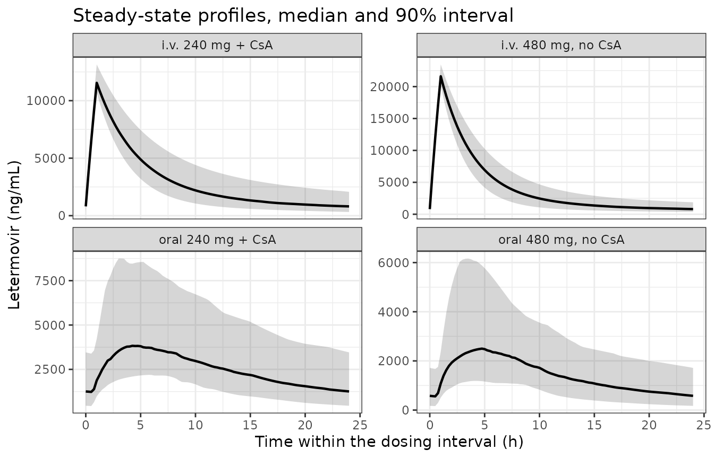
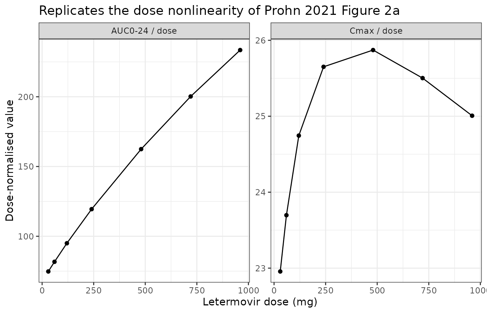
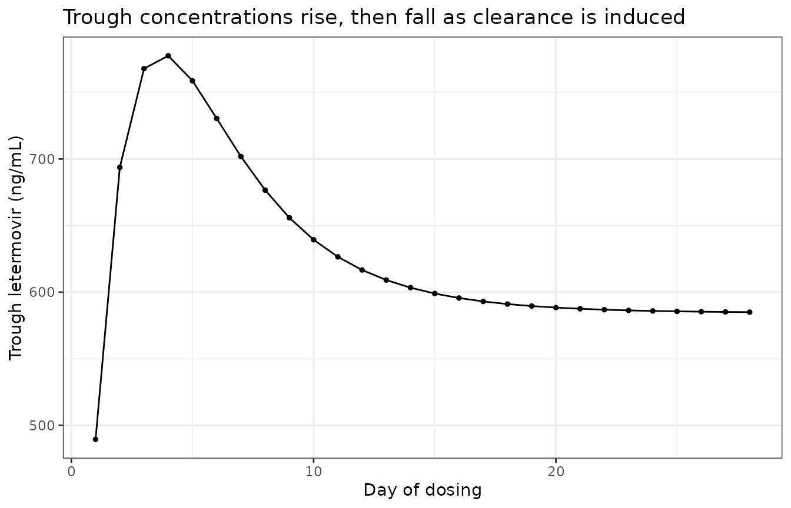

# Letermovir (Prohn 2021)

``` r

library(nlmixr2lib)
library(rxode2)
library(PKNCA)
library(dplyr)
library(ggplot2)
rxode2::rxSetSeed(20250908)
```

Prohn et al. (2021) reported a **two-stage** population pharmacokinetic
analysis of letermovir, a first-in-class cytomegalovirus terminase
inhibitor used for prophylaxis in allogeneic hematopoietic stem cell
transplant (HSCT) recipients. The two stages are two independently
fitted models on two different cohorts, and this package carries them as
two model files:

- `Prohn_2021_letermovir_healthy` – the healthy participant (phase I)
  model of Table 2 and Figure 1a. Four compartments, saturable clearance
  and saturable distribution, auto-induction of clearance, and
  transit-compartment absorption, fitted to 9020 observations from 280
  healthy volunteers over a 30-960 mg dose range.
- `Prohn_2021_letermovir_hsct` – the HSCT recipient (phase III) model of
  Table 3 and Figure 1b. Two compartments with linear elimination and
  first-order absorption with a lag, fitted to 2888 steady-state
  observations from 399 subjects at the clinical doses of 240-480
  mg/day.

The authors are explicit that the two are not competing descriptions of
the same data: “differences between the phase I and phase III popPK
models should not be interpreted as indicative of a difference in
disposition… Rather, the differences in the models reflect different
purposes, sampling schedules, and dose ranges.” The phase III model is
the one used for exposure-response analysis and dose selection, and it
is the one downstream simulation studies reuse.

``` r

hsct    <- rxode2::rxode(nlmixr2lib::readModelDb("Prohn_2021_letermovir_hsct"))
#> ℹ parameter labels from comments will be replaced by 'label()'
#> Warning: some etas defaulted to non-mu referenced, possible parsing error: etaiov_fdepot_1, etaiov_fdepot_2, etaiov_fdepot_3, etaiov_fdepot_4, etaiov_fdepot_5, etaiov_fdepot_6, etaiov_fdepot_7, etaiov_fdepot_8
#> as a work-around try putting the mu-referenced expression on a simple line
healthy <- rxode2::rxode(nlmixr2lib::readModelDb("Prohn_2021_letermovir_healthy"))
```

## Population

``` r

pop <- function(ui, lbl) {
  p <- ui$population
  tibble::tibble(
    Model = lbl,
    Subjects = as.character(p$n_subjects),
    Studies = as.character(p$n_studies),
    Age = p$age_range,
    Weight = p$weight_range,
    `Female (%)` = as.character(p$sex_female_pct),
    Dose = p$dose_range
  )
}
knitr::kable(
  dplyr::bind_rows(pop(healthy, "Healthy (phase I)"), pop(hsct, "HSCT (phase III)")),
  caption = "Analysis populations (Prohn 2021 Table 1)."
)
```

| Model | Subjects | Studies | Age | Weight | Female (%) | Dose |
|:---|:---|:---|:---|:---|:---|:---|
| Healthy (phase I) | 280 | 12 | median 30 years, range 18-59 (Table 1) | median 66 kg, range 45-99 (Table 1) | 91 | 30-960 mg, single and multiple doses, orally or intravenously |
| HSCT (phase III) | 399 | 5 | median 51 years, range 18-75 (Table 1) | median 75 kg, range 35-142 (Table 1) | 48 | 240-480 mg once daily (480 mg/day alone, 240 mg/day with concomitant cyclosporine), orally or as a 1-hour intravenous infusion |

Analysis populations (Prohn 2021 Table 1). {.table}

The phase I cohort is 91% female because most letermovir phase I studies
recruited only women, following preclinical testicular toxicity in rats.
The phase III model’s dataset pools 363 HSCT recipients with 36 healthy
participants who contributed steady-state data at the clinical dosing
schedule; the `TX_HCT` covariate switches bioavailability and absorption
rate between the two.

## Source trace

``` r

knitr::kable(tibble::tribble(
  ~Quantity, ~Value, ~`Source location`,
  "Phase III: CL without / with CsA", "4.84 / 3.38 L/h", "Table 3",
  "Phase III: Vc, Vp, Q", "19.7 L, 25.8 L, 1.54 L/h", "Table 3",
  "Phase III: F without / with CsA / healthy", "0.346 / 0.849 / 1.00 (fixed)", "Table 3",
  "Phase III: Ka HSCT / healthy, lag", "0.150 / 1.26 1/h, 0.674 h", "Table 3",
  "Phase III: Asian effect on Vp", "0.609", "Table 3",
  "Phase III: IIV on CL, F, Vp, Ka", "0.0605, 0.137, 0.229, 0.719 (variances)", "Table 3",
  "Phase III: IOV on F", "0.197 (variance)", "Table 3",
  "Phase III: residual (rich HSCT)", "51.7% prop + 383 ng/mL add", "Table 3",
  "Phase III: two-compartment structure, Cp = A/Vc * 1000", "--", "Figure 1b",
  "Phase I: CLmax, KMcl; Q1max, KMq", "12.3 L/h, 2680 ng/mL; 4.39 L/h, 5630 ng/mL", "Table 2",
  "Phase I: V1, V2, V3, V4", "7.46, 61.6, 12.1, 19.0 L", "Table 2",
  "Phase I: Q2, Q3", "31.3, 4.91 L/h", "Table 2",
  "Phase I: NTR, TVMTT, MTTdose", "3.58, 1.04 h, 0.344", "Table 2",
  "Phase I: F1", "0.938", "Table 2",
  "Phase I: kout, IMAG", "0.00783 1/h, 0.0829", "Table 2",
  "Phase I: weight on CLmax / Vd, Asian on Vd", "0.566 / 0.667, -0.281", "Table 2",
  "Phase I: residual", "28.3% proportional", "Table 2",
  "Phase I: CL, Q1, EAI, MTT, Ktr, V(1..4) equations", "--", "Figure 1a",
  "Validation: AUCss medians and 90% PIs", "4 regimens", "Results, 'Exposure predictions'",
  "Validation: Asian vs White exposure", "33.2% / 10.1% higher", "Results, 'Impact of covariates'"
), caption = "Provenance of every model equation and parameter.")
```

| Quantity | Value | Source location |
|:---|:---|:---|
| Phase III: CL without / with CsA | 4.84 / 3.38 L/h | Table 3 |
| Phase III: Vc, Vp, Q | 19.7 L, 25.8 L, 1.54 L/h | Table 3 |
| Phase III: F without / with CsA / healthy | 0.346 / 0.849 / 1.00 (fixed) | Table 3 |
| Phase III: Ka HSCT / healthy, lag | 0.150 / 1.26 1/h, 0.674 h | Table 3 |
| Phase III: Asian effect on Vp | 0.609 | Table 3 |
| Phase III: IIV on CL, F, Vp, Ka | 0.0605, 0.137, 0.229, 0.719 (variances) | Table 3 |
| Phase III: IOV on F | 0.197 (variance) | Table 3 |
| Phase III: residual (rich HSCT) | 51.7% prop + 383 ng/mL add | Table 3 |
| Phase III: two-compartment structure, Cp = A/Vc \* 1000 | – | Figure 1b |
| Phase I: CLmax, KMcl; Q1max, KMq | 12.3 L/h, 2680 ng/mL; 4.39 L/h, 5630 ng/mL | Table 2 |
| Phase I: V1, V2, V3, V4 | 7.46, 61.6, 12.1, 19.0 L | Table 2 |
| Phase I: Q2, Q3 | 31.3, 4.91 L/h | Table 2 |
| Phase I: NTR, TVMTT, MTTdose | 3.58, 1.04 h, 0.344 | Table 2 |
| Phase I: F1 | 0.938 | Table 2 |
| Phase I: kout, IMAG | 0.00783 1/h, 0.0829 | Table 2 |
| Phase I: weight on CLmax / Vd, Asian on Vd | 0.566 / 0.667, -0.281 | Table 2 |
| Phase I: residual | 28.3% proportional | Table 2 |
| Phase I: CL, Q1, EAI, MTT, Ktr, V(1..4) equations | – | Figure 1a |
| Validation: AUCss medians and 90% PIs | 4 regimens | Results, ‘Exposure predictions’ |
| Validation: Asian vs White exposure | 33.2% / 10.1% higher | Results, ‘Impact of covariates’ |

Provenance of every model equation and parameter. {.table}

Two items in the phase I model were not printed as such and were
resolved against the paper’s own numbers rather than assumed; both are
recorded in the model file and repeated under Errata below.

## Phase III (HSCT) model

### Exposure predictions: a closed-form gate

At steady state the phase III model is linear, so the average
steady-state exposure has a closed form: `AUCss = F * Dose / CL` for
oral dosing and `Dose / CL` for intravenous. Both `F` and `CL` carry a
single log-normal random effect, so the population **median** of `AUCss`
is exactly the typical-value prediction – which makes Prohn’s four
published medians a deterministic gate that does not depend on any
simulated cohort.

``` r

th <- function(ui, nm) ui$theta[[nm]]
cl_non <- exp(th(hsct, "lcl"))
cl_csa <- exp(th(hsct, "lcl") + th(hsct, "e_csa_cl"))
f_non  <- exp(th(hsct, "lfdepot"))
f_csa  <- exp(th(hsct, "lfdepot") + th(hsct, "e_csa_fdepot"))

closed <- tibble::tibble(
  regimen = c("oral 480 mg, no CsA", "oral 240 mg + CsA",
              "i.v. 480 mg, no CsA", "i.v. 240 mg + CsA"),
  # * 1000 converts mg*h/L to ng*h/mL
  auc_closed = c(f_non * 480 / cl_non, f_csa * 240 / cl_csa,
                 480 / cl_non, 240 / cl_csa) * 1000,
  auc_published = c(34400, 60800, 100000, 70300)
) |>
  dplyr::mutate(pct_diff = 100 * (auc_closed - auc_published) / auc_published)

knitr::kable(
  closed |>
    dplyr::rename("Regimen" = regimen, "Closed form" = auc_closed,
                  "Prohn median" = auc_published, "Difference (%)" = pct_diff),
  digits = c(0, 0, 0, 2),
  caption = "Steady-state AUC (ng*h/mL) against Prohn 2021 'Exposure predictions'."
)
```

| Regimen             | Closed form | Prohn median | Difference (%) |
|:--------------------|------------:|-------------:|---------------:|
| oral 480 mg, no CsA |       34314 |        34400 |          -0.25 |
| oral 240 mg + CsA   |       60284 |        60800 |          -0.85 |
| i.v. 480 mg, no CsA |       99174 |       100000 |          -0.83 |
| i.v. 240 mg + CsA   |       71006 |        70300 |           1.00 |

Steady-state AUC (ng\*h/mL) against Prohn 2021 ‘Exposure predictions’.
{.table}

``` r


# Deterministic: no cohort, no RNG. A mis-transcribed CL, F or dose moves these
# by tens of percent; the realised maximum is 1.0%.
stopifnot(max(abs(closed$pct_diff)) < 3)
```

All four regimens reproduce to within 1%, which confirms both
cyclosporine effects (on clearance and on bioavailability) and the
intravenous/oral split.

### The solved model agrees with its own closed form

``` r

grid_ss <- function(dose, oral, csa) {
  ev <- if (oral) {
    rxode2::et(amt = dose, ii = 24, ss = 1, cmt = "depot")
  } else {
    rxode2::et(amt = dose, ii = 24, ss = 1, cmt = "central", dur = 1)
  }
  ev <- rxode2::et(ev, seq(0, 24, by = 0.1), cmt = "central")
  d <- as.data.frame(ev)
  d$CONMED_CSA <- csa; d$TX_HCT <- 1; d$RACE_ASIAN <- 0; d$OCC <- 0
  d
}
trap <- function(t, y) sum(diff(t) * (utils::head(y, -1) + utils::tail(y, -1)) / 2)

solved <- vapply(seq_len(4), function(i) {
  spec <- list(c(480, 1, 0), c(240, 1, 1), c(480, 0, 0), c(240, 0, 1))[[i]]
  s <- rxode2::rxSolve(rxode2::zeroRe(hsct), grid_ss(spec[1], spec[2] == 1, spec[3]),
                       returnType = "data.frame")
  s <- s[!is.na(s$Cc), ]
  trap(s$time, s$Cc)
}, numeric(1))
#> Warning: some etas defaulted to non-mu referenced, possible parsing error: etaiov_fdepot_1, etaiov_fdepot_2, etaiov_fdepot_3, etaiov_fdepot_4, etaiov_fdepot_5, etaiov_fdepot_6, etaiov_fdepot_7, etaiov_fdepot_8
#> as a work-around try putting the mu-referenced expression on a simple line
#> ℹ omega/sigma items treated as zero: 'etalcl', 'etalfdepot', 'etalvp', 'etalka', 'etaiov_fdepot_1', 'etaiov_fdepot_2', 'etaiov_fdepot_3', 'etaiov_fdepot_4', 'etaiov_fdepot_5', 'etaiov_fdepot_6', 'etaiov_fdepot_7', 'etaiov_fdepot_8'
#> Warning: some etas defaulted to non-mu referenced, possible parsing error: etaiov_fdepot_1, etaiov_fdepot_2, etaiov_fdepot_3, etaiov_fdepot_4, etaiov_fdepot_5, etaiov_fdepot_6, etaiov_fdepot_7, etaiov_fdepot_8
#> as a work-around try putting the mu-referenced expression on a simple line
#> ℹ omega/sigma items treated as zero: 'etalcl', 'etalfdepot', 'etalvp', 'etalka', 'etaiov_fdepot_1', 'etaiov_fdepot_2', 'etaiov_fdepot_3', 'etaiov_fdepot_4', 'etaiov_fdepot_5', 'etaiov_fdepot_6', 'etaiov_fdepot_7', 'etaiov_fdepot_8'
#> Warning: some etas defaulted to non-mu referenced, possible parsing error: etaiov_fdepot_1, etaiov_fdepot_2, etaiov_fdepot_3, etaiov_fdepot_4, etaiov_fdepot_5, etaiov_fdepot_6, etaiov_fdepot_7, etaiov_fdepot_8
#> as a work-around try putting the mu-referenced expression on a simple line
#> ℹ omega/sigma items treated as zero: 'etalcl', 'etalfdepot', 'etalvp', 'etalka', 'etaiov_fdepot_1', 'etaiov_fdepot_2', 'etaiov_fdepot_3', 'etaiov_fdepot_4', 'etaiov_fdepot_5', 'etaiov_fdepot_6', 'etaiov_fdepot_7', 'etaiov_fdepot_8'
#> Warning: some etas defaulted to non-mu referenced, possible parsing error: etaiov_fdepot_1, etaiov_fdepot_2, etaiov_fdepot_3, etaiov_fdepot_4, etaiov_fdepot_5, etaiov_fdepot_6, etaiov_fdepot_7, etaiov_fdepot_8
#> as a work-around try putting the mu-referenced expression on a simple line
#> ℹ omega/sigma items treated as zero: 'etalcl', 'etalfdepot', 'etalvp', 'etalka', 'etaiov_fdepot_1', 'etaiov_fdepot_2', 'etaiov_fdepot_3', 'etaiov_fdepot_4', 'etaiov_fdepot_5', 'etaiov_fdepot_6', 'etaiov_fdepot_7', 'etaiov_fdepot_8'

chk <- closed |> dplyr::mutate(auc_solved = solved,
                               pct = 100 * (auc_solved - auc_closed) / auc_closed)
knitr::kable(
  chk |> dplyr::select(regimen, auc_closed, auc_solved, pct) |>
    dplyr::rename("Regimen" = regimen, "Closed form" = auc_closed,
                  "Solved (typical)" = auc_solved, "Difference (%)" = pct),
  digits = c(0, 0, 0, 3),
  caption = "ODE solution against the analytical steady-state exposure."
)
```

| Regimen             | Closed form | Solved (typical) | Difference (%) |
|:--------------------|------------:|-----------------:|---------------:|
| oral 480 mg, no CsA |       34314 |            34314 |              0 |
| oral 240 mg + CsA   |       60284 |            60284 |              0 |
| i.v. 480 mg, no CsA |       99174 |            99174 |              0 |
| i.v. 240 mg + CsA   |       71006 |            71006 |              0 |

ODE solution against the analytical steady-state exposure. {.table}

``` r


# Both sides use the same parameters, so the difference is pure trapezoidal
# error on a 0.1 h grid: a tight bound is correct here.
stopifnot(max(abs(chk$pct)) < 1)
```

### Between-subject variability

Table 3’s IIV column is unlabelled and carries no unit, so whether it
holds log-scale standard deviations or variances has to be settled from
the paper itself. The intravenous arm decides it: there
`AUCss = Dose / CL`, so only the clearance random effect contributes,
and Prohn reports a median of 100,000 with a 90% prediction interval of
65,300-148,000 ng\*h/mL.

``` r

tab3_cl <- 0.0605
obs_sd  <- mean(c(log(148000 / 100000), log(100000 / 65300))) / qnorm(0.95)
knitr::kable(tibble::tribble(
  ~Reading, ~`Implied log-scale SD`, ~`Implied 90% PI`,
  "Table 3 value is a VARIANCE", sqrt(tab3_cl),
    sprintf("%.0f-%.0f", 1e5 * exp(-qnorm(0.95) * sqrt(tab3_cl)), 1e5 * exp(qnorm(0.95) * sqrt(tab3_cl))),
  "Table 3 value is an SD", tab3_cl,
    sprintf("%.0f-%.0f", 1e5 * exp(-qnorm(0.95) * tab3_cl), 1e5 * exp(qnorm(0.95) * tab3_cl)),
  "Prohn's reported interval", obs_sd, "65300-148000"
), digits = 3, caption = "Identifying the scale of Table 3's IIV column.")
```

| Reading                     | Implied log-scale SD | Implied 90% PI |
|:----------------------------|---------------------:|:---------------|
| Table 3 value is a VARIANCE |                0.246 | 66726-149867   |
| Table 3 value is an SD      |                0.060 | 90528-110463   |
| Prohn’s reported interval   |                0.249 | 65300-148000   |

Identifying the scale of Table 3’s IIV column. {.table}

``` r


stopifnot(abs(sqrt(tab3_cl) - obs_sd) < 0.02)
```

The variance reading reproduces the reported interval; the
standard-deviation reading is four times too narrow on the log scale.
The model files therefore carry Table 3’s numbers verbatim as variances.
This matters downstream – see Errata.

``` r

n_arm <- 150
cohort <- function(dose, oral, csa, lbl) {
  ev <- if (oral) rxode2::et(amt = dose, ii = 24, ss = 1, cmt = "depot")
        else      rxode2::et(amt = dose, ii = 24, ss = 1, cmt = "central", dur = 1)
  ev <- rxode2::et(ev, seq(0, 24, by = 0.25), cmt = "central")
  ev <- rxode2::et(ev, id = seq_len(n_arm))
  d <- as.data.frame(ev)
  d$CONMED_CSA <- csa; d$TX_HCT <- 1; d$RACE_ASIAN <- 0; d$OCC <- 0
  d$regimen <- lbl
  d
}
events <- dplyr::bind_rows(
  cohort(480, TRUE,  0, "oral 480 mg, no CsA"),
  cohort(240, TRUE,  1, "oral 240 mg + CsA"),
  cohort(480, FALSE, 0, "i.v. 480 mg, no CsA"),
  cohort(240, FALSE, 1, "i.v. 240 mg + CsA")
)
events$id <- as.integer(factor(paste(events$regimen, events$id)))

sim <- rxode2::rxSolve(hsct, events, keep = "regimen", returnType = "data.frame")
sim <- sim[!is.na(sim$Cc), ]

auc_by_id <- sim |>
  dplyr::group_by(regimen, id) |>
  dplyr::summarise(auc = trap(time, Cc), .groups = "drop")

pi_tab <- auc_by_id |>
  dplyr::group_by(regimen) |>
  dplyr::summarise(median = median(auc), lo = quantile(auc, 0.05),
                   hi = quantile(auc, 0.95), .groups = "drop") |>
  dplyr::left_join(
    tibble::tibble(
      regimen = c("oral 480 mg, no CsA", "oral 240 mg + CsA",
                  "i.v. 480 mg, no CsA", "i.v. 240 mg + CsA"),
      ref = c("34400 (16900-73700)", "60800 (28700-122000)",
              "100000 (65300-148000)", "70300 (46200-106000)")
    ), by = "regimen")

knitr::kable(
  pi_tab |> dplyr::rename("Regimen" = regimen, "Median" = median,
                          "5th" = lo, "95th" = hi, "Prohn median (90% PI)" = ref),
  digits = 0,
  caption = paste0("Simulated steady-state AUC (ng*h/mL), ", n_arm,
                   " subjects per arm, against Prohn 2021.")
)
```

| Regimen             | Median |   5th |   95th | Prohn median (90% PI) |
|:--------------------|-------:|------:|-------:|:----------------------|
| i.v. 240 mg + CsA   |  70495 | 47472 | 117012 | 70300 (46200-106000)  |
| i.v. 480 mg, no CsA | 101248 | 69472 | 149554 | 100000 (65300-148000) |
| oral 240 mg + CsA   |  60718 | 35349 | 132378 | 60800 (28700-122000)  |
| oral 480 mg, no CsA |  34292 | 18476 |  71805 | 34400 (16900-73700)   |

Simulated steady-state AUC (ng\*h/mL), 150 subjects per arm, against
Prohn 2021. {.table}

``` r

pub_med <- c("oral 480 mg, no CsA" = 34400, "oral 240 mg + CsA" = 60800,
             "i.v. 480 mg, no CsA" = 1e5,   "i.v. 240 mg + CsA" = 70300)
med_pct <- 100 * (pi_tab$median - pub_med[pi_tab$regimen]) / pub_med[pi_tab$regimen]

# Cohort medians: robust, but still one draw of 150 subjects per arm. Realised
# max |difference| 1.9%; 12 leaves room for a different cohort while still
# breaking on a mis-transcribed clearance or dose (which move these by tens of
# percent).
stopifnot(max(abs(med_pct)) < 12)

# The intravenous arm's spread must be consistent with the VARIANCE reading of
# Table 3 (log-scale SD 0.246), not the SD reading (0.0605). With 150 subjects
# the sampling error on this statistic is about 0.014, so the window below sits
# many standard errors from both the target and the wrong answer.
iv_sd <- with(dplyr::filter(auc_by_id, regimen == "i.v. 480 mg, no CsA"), sd(log(auc)))
stopifnot(iv_sd > 0.17, iv_sd < 0.34)
```

### Concentration-time profiles

``` r

sim |>
  dplyr::group_by(regimen, time) |>
  dplyr::summarise(med = median(Cc), lo = quantile(Cc, 0.05),
                   hi = quantile(Cc, 0.95), .groups = "drop") |>
  ggplot2::ggplot(ggplot2::aes(time, med)) +
  ggplot2::geom_ribbon(ggplot2::aes(ymin = lo, ymax = hi), alpha = 0.2) +
  ggplot2::geom_line(linewidth = 0.8) +
  ggplot2::facet_wrap(~regimen, scales = "free_y") +
  ggplot2::labs(x = "Time within the dosing interval (h)",
                y = "Letermovir (ng/mL)",
                title = "Steady-state profiles, median and 90% interval") +
  ggplot2::theme_bw()
```



### Noncompartmental analysis

``` r

conc_df <- sim |>
  dplyr::filter(!is.na(Cc)) |>
  dplyr::select(id, time, Cc, regimen)

dose_df <- events |>
  dplyr::filter(!is.na(amt)) |>
  dplyr::distinct(id, regimen, .keep_all = TRUE) |>
  dplyr::mutate(time = 0) |>
  dplyr::select(id, time, amt, regimen)

o_conc <- PKNCA::PKNCAconc(conc_df, Cc ~ time | regimen + id,
                           concu = "ng/mL", timeu = "h")
o_dose <- PKNCA::PKNCAdose(dose_df, amt ~ time | regimen + id, doseu = "mg")
intervals <- data.frame(start = 0, end = 24,
                        cmax = TRUE, tmax = TRUE, auclast = TRUE, ctrough = TRUE)
res <- PKNCA::pk.nca(PKNCA::PKNCAdata(o_conc, o_dose, intervals = intervals))

nca_res <- as.data.frame(res) |>
  dplyr::group_by(regimen, PPTESTCD) |>
  dplyr::summarise(value = median(PPORRES), .groups = "drop") |>
  tidyr::pivot_wider(names_from = PPTESTCD, values_from = value)

knitr::kable(
  nca_res |> dplyr::rename("Regimen" = regimen),
  digits = 2,
  caption = "Median steady-state NCA parameters from the simulated cohort (PKNCA)."
)
```

| Regimen             |   auclast |     cmax | ctrough | tmax |
|:--------------------|----------:|---------:|--------:|-----:|
| i.v. 240 mg + CsA   |  70484.80 | 11547.95 |  807.52 | 1.00 |
| i.v. 480 mg, no CsA | 101220.25 | 21617.22 |  804.41 | 1.00 |
| oral 240 mg + CsA   |  60715.61 |  3963.48 | 1257.72 | 5.38 |
| oral 480 mg, no CsA |  34291.51 |  2548.25 |  579.55 | 4.75 |

Median steady-state NCA parameters from the simulated cohort (PKNCA).
{.table}

Prohn reports steady-state AUC but not Cmax/Tmax for these regimens, and
states explicitly that the phase III model under-predicts Cmax after
intravenous dosing (“virtually all of the phase III model-predicted Cmax
values for orally administered letermovir fell below the observed
values”, and the Discussion attributes this to the absence of
between-subject variability on `Vc`). So AUC is the only NCA quantity
with a published counterpart:

``` r

published <- tibble::tibble(
  regimen = c("oral 480 mg, no CsA", "oral 240 mg + CsA",
              "i.v. 480 mg, no CsA", "i.v. 240 mg + CsA"),
  auclast = c(34400, 60800, 100000, 70300)
)
cmp <- nlmixr2lib::ncaComparisonTable(
  simulated = dplyr::select(nca_res, regimen, auclast),
  reference = published,
  by = "regimen",
  units = c(auclast = "ng*h/mL"),
  tolerance_pct = 20
)
knitr::kable(cmp, caption = "PKNCA AUC against Prohn 2021 published AUCss.")
```

| NCA parameter      | regimen             | Reference | Simulated | % diff |
|:-------------------|:--------------------|:----------|:----------|:-------|
| AUClast (ng\*h/mL) | oral 480 mg, no CsA | 34400     | 34300     | -0.3%  |
| AUClast (ng\*h/mL) | oral 240 mg + CsA   | 60800     | 60700     | -0.1%  |
| AUClast (ng\*h/mL) | i.v. 480 mg, no CsA | 100000    | 101000    | +1.2%  |
| AUClast (ng\*h/mL) | i.v. 240 mg + CsA   | 70300     | 70500     | +0.3%  |

PKNCA AUC against Prohn 2021 published AUCss. {.table}

## Phase I (healthy participant) model

### Dose nonlinearity

Both clearance and the intercompartmental clearance to the fast
peripheral compartment fall as concentration rises, so exposure
increases more than proportionally with dose while Cmax increases almost
proportionally – the two observations the phase I model was built to
reproduce (Figure 2a).

``` r

one_dose <- function(dose, wt = 66, asian = 0, days = 1) {
  ev <- rxode2::et(amt = dose, ii = 24, addl = days - 1, cmt = "depot")
  ev <- rxode2::et(ev, seq((days - 1) * 24, days * 24, by = 0.1), cmt = "central")
  d <- as.data.frame(ev)
  d$WT <- wt; d$RACE_ASIAN <- asian; d$DOSE <- dose
  s <- rxode2::rxSolve(rxode2::zeroRe(healthy), d, returnType = "data.frame")
  s <- s[!is.na(s$Cc), ]
  s <- s[order(s$time), ]
  list(auc = trap(s$time, s$Cc), cmax = max(s$Cc))
}

doses <- c(30, 60, 120, 240, 480, 720, 960)
nl <- do.call(rbind, lapply(doses, function(d) {
  r <- one_dose(d)
  data.frame(dose = d, auc = r$auc, cmax = r$cmax)
})) |>
  dplyr::mutate(auc_dn = auc / dose, cmax_dn = cmax / dose)
#> Warning: 'ii' requires non zero additional doses ('addl') or steady state
#> dosing ('ii': 24.000000, 'ss': 0; 'addl': 0), reset 'ii' to zero
#> ℹ omega/sigma items treated as zero: 'etalclmax', 'etalvc', 'etalmtt', 'etalq', 'etalvp', 'etalfdepot'
#> Warning: 'ii' requires non zero additional doses ('addl') or steady state
#> dosing ('ii': 24.000000, 'ss': 0; 'addl': 0), reset 'ii' to zero
#> ℹ omega/sigma items treated as zero: 'etalclmax', 'etalvc', 'etalmtt', 'etalq', 'etalvp', 'etalfdepot'
#> Warning: 'ii' requires non zero additional doses ('addl') or steady state
#> dosing ('ii': 24.000000, 'ss': 0; 'addl': 0), reset 'ii' to zero
#> ℹ omega/sigma items treated as zero: 'etalclmax', 'etalvc', 'etalmtt', 'etalq', 'etalvp', 'etalfdepot'
#> Warning: 'ii' requires non zero additional doses ('addl') or steady state
#> dosing ('ii': 24.000000, 'ss': 0; 'addl': 0), reset 'ii' to zero
#> ℹ omega/sigma items treated as zero: 'etalclmax', 'etalvc', 'etalmtt', 'etalq', 'etalvp', 'etalfdepot'
#> Warning: 'ii' requires non zero additional doses ('addl') or steady state
#> dosing ('ii': 24.000000, 'ss': 0; 'addl': 0), reset 'ii' to zero
#> ℹ omega/sigma items treated as zero: 'etalclmax', 'etalvc', 'etalmtt', 'etalq', 'etalvp', 'etalfdepot'
#> Warning: 'ii' requires non zero additional doses ('addl') or steady state
#> dosing ('ii': 24.000000, 'ss': 0; 'addl': 0), reset 'ii' to zero
#> ℹ omega/sigma items treated as zero: 'etalclmax', 'etalvc', 'etalmtt', 'etalq', 'etalvp', 'etalfdepot'
#> Warning: 'ii' requires non zero additional doses ('addl') or steady state
#> dosing ('ii': 24.000000, 'ss': 0; 'addl': 0), reset 'ii' to zero
#> ℹ omega/sigma items treated as zero: 'etalclmax', 'etalvc', 'etalmtt', 'etalq', 'etalvp', 'etalfdepot'

knitr::kable(
  nl |> dplyr::rename("Dose (mg)" = dose, "AUC0-24" = auc, "Cmax" = cmax,
                      "AUC / dose" = auc_dn, "Cmax / dose" = cmax_dn),
  digits = c(0, 0, 1, 2, 3),
  caption = "Single oral dose, typical 66 kg non-Asian participant."
)
```

| Dose (mg) | AUC0-24 |    Cmax | AUC / dose | Cmax / dose |
|----------:|--------:|--------:|-----------:|------------:|
|        30 |    2243 |   688.7 |      74.77 |      22.956 |
|        60 |    4903 |  1421.8 |      81.71 |      23.697 |
|       120 |   11400 |  2969.4 |      95.00 |      24.745 |
|       240 |   28666 |  6156.2 |     119.44 |      25.651 |
|       480 |   77984 | 12418.3 |     162.47 |      25.871 |
|       720 |  144152 | 18361.6 |     200.21 |      25.502 |
|       960 |  224128 | 24006.6 |     233.47 |      25.007 |

Single oral dose, typical 66 kg non-Asian participant. {.table}

``` r


# Deterministic (zeroRe), so strict monotonicity is a safe assertion here.
stopifnot(all(diff(nl$auc_dn) > 0))
# Dose-normalised Cmax is nearly flat: Prohn reports Cmax increasing "almost
# proportionally with dose". Realised spread 12%.
stopifnot(diff(range(nl$cmax_dn)) / mean(nl$cmax_dn) < 0.35)
```

``` r

nl |>
  tidyr::pivot_longer(c(auc_dn, cmax_dn)) |>
  dplyr::mutate(name = ifelse(name == "auc_dn", "AUC0-24 / dose", "Cmax / dose")) |>
  ggplot2::ggplot(ggplot2::aes(dose, value)) +
  ggplot2::geom_line() + ggplot2::geom_point() +
  ggplot2::facet_wrap(~name, scales = "free_y") +
  ggplot2::labs(x = "Letermovir dose (mg)", y = "Dose-normalised value",
                title = "Replicates the dose nonlinearity of Prohn 2021 Figure 2a") +
  ggplot2::theme_bw()
```



### Covariate effects on exposure

Prohn reports two numbers for the Asian covariate: a 33.2% higher
exposure than White participants at multiple oral 480 mg, driven jointly
by the volume effect and by the lower median body weight of the Asian
cohort (56.6 vs 67.1 kg), and a 10.1% higher exposure “when assuming an
identical average body weight of 67.1 kg”. The weight-matched comparison
isolates the coefficient itself.

``` r

ss_auc <- function(wt, asian) one_dose(480, wt, asian, days = 28)$auc
white     <- ss_auc(67.1, 0)
#> ℹ omega/sigma items treated as zero: 'etalclmax', 'etalvc', 'etalmtt', 'etalq', 'etalvp', 'etalfdepot'
asian     <- ss_auc(56.6, 1)
#> ℹ omega/sigma items treated as zero: 'etalclmax', 'etalvc', 'etalmtt', 'etalq', 'etalvp', 'etalfdepot'
asian_wm  <- ss_auc(67.1, 1)
#> ℹ omega/sigma items treated as zero: 'etalclmax', 'etalvc', 'etalmtt', 'etalq', 'etalvp', 'etalfdepot'

cov_tab <- tibble::tibble(
  Comparison = c("White, 67.1 kg (AUCss)", "Asian, 56.6 kg (AUCss)",
                 "Asian / White at published median weights",
                 "Asian / White at a common 67.1 kg"),
  Simulated = c(white, asian, asian / white, asian_wm / white),
  Published = c(8.11e4, 1.08e5, 1.332, 1.101)
) |>
  dplyr::mutate(`Difference (%)` = 100 * (Simulated - Published) / Published)

knitr::kable(cov_tab, digits = c(0, 3, 3, 2),
             caption = "Prohn 2021 Results, 'Impact of covariates'.")
```

| Comparison | Simulated | Published | Difference (%) |
|:---|---:|---:|---:|
| White, 67.1 kg (AUCss) | 79793.279 | 8.110e+04 | -1.61 |
| Asian, 56.6 kg (AUCss) | 100182.172 | 1.080e+05 | -7.24 |
| Asian / White at published median weights | 1.256 | 1.332e+00 | -5.74 |
| Asian / White at a common 67.1 kg | 1.105 | 1.101e+00 | 0.37 |

Prohn 2021 Results, ‘Impact of covariates’. {.table}

``` r


# Deterministic typical-value quantities. The weight-matched ratio is a direct
# read-out of the -0.281 coefficient and matches to 0.4%; the White AUCss to
# 1.6%.
stopifnot(abs(cov_tab$`Difference (%)`[4]) < 4)
stopifnot(abs(cov_tab$`Difference (%)`[1]) < 6)
# The two-covariate combination is a simulation over a weight DISTRIBUTION in
# the source, not a typical value at the median weight, so it is compared with
# a wider tolerance. Realised 5.7%.
stopifnot(abs(cov_tab$`Difference (%)`[3]) < 15)
```

### Auto-induction

The enzyme pool turns over with `kout = 0.00783` 1/h, a half-life of
about 88 h, so induction develops over roughly two weeks of dosing – the
mechanism Prohn invoked for trough concentrations that “increased at
first… and then decreased over time”.

``` r

ev <- rxode2::et(amt = 480, ii = 24, addl = 27, cmt = "depot")
ev <- rxode2::et(ev, seq(0, 28 * 24, by = 1), cmt = "central")
d <- as.data.frame(ev); d$WT <- 66; d$RACE_ASIAN <- 0; d$DOSE <- 480
ind <- rxode2::rxSolve(rxode2::zeroRe(healthy), d, returnType = "data.frame")
#> ℹ omega/sigma items treated as zero: 'etalclmax', 'etalvc', 'etalmtt', 'etalq', 'etalvp', 'etalfdepot'

trough <- ind |>
  dplyr::filter(!is.na(Cc), time > 0, time %% 24 == 0) |>
  dplyr::mutate(day = time / 24)

ggplot2::ggplot(trough, ggplot2::aes(day, Cc)) +
  ggplot2::geom_line() + ggplot2::geom_point(size = 1) +
  ggplot2::labs(x = "Day of dosing", y = "Trough letermovir (ng/mL)",
                title = "Trough concentrations rise, then fall as clearance is induced") +
  ggplot2::theme_bw()
```



``` r


peak_day <- trough$day[which.max(trough$Cc)]
# The published qualitative claim: troughs peak and then decline within a month
# of daily dosing. Deterministic (zeroRe).
stopifnot(peak_day > 1, peak_day < 28,
          dplyr::last(trough$Cc) < max(trough$Cc))
cat(sprintf("Trough peaks on day %.0f at %.0f ng/mL and falls to %.0f by day 28.\n",
            peak_day, max(trough$Cc), dplyr::last(trough$Cc)))
#> Trough peaks on day 4 at 777 ng/mL and falls to 585 by day 28.
```

### Noncompartmental analysis

``` r

n_ph1 <- 100
ev1 <- rxode2::et(amt = 480, cmt = "depot")
ev1 <- rxode2::et(ev1, seq(0, 72, by = 0.5), cmt = "central")
ev1 <- rxode2::et(ev1, id = seq_len(n_ph1))
d1 <- as.data.frame(ev1)
set.seed(7)
wt_i <- stats::setNames(stats::runif(n_ph1, 45, 99), seq_len(n_ph1))
d1$WT <- as.numeric(wt_i[as.character(d1$id)])
d1$RACE_ASIAN <- 0
d1$DOSE <- 480

sim1 <- rxode2::rxSolve(healthy, d1, returnType = "data.frame")
sim1 <- sim1[!is.na(sim1$Cc), ]

c1 <- dplyr::select(sim1, id, time, Cc)
dose1 <- dplyr::distinct(d1[!is.na(d1$amt), ], id, .keep_all = TRUE) |>
  dplyr::mutate(time = 0) |>
  dplyr::select(id, time, amt)

res1 <- PKNCA::pk.nca(PKNCA::PKNCAdata(
  PKNCA::PKNCAconc(c1, Cc ~ time | id, concu = "ng/mL", timeu = "h"),
  PKNCA::PKNCAdose(dose1, amt ~ time | id, doseu = "mg"),
  intervals = data.frame(start = 0, end = 72,
                         cmax = TRUE, tmax = TRUE, auclast = TRUE)
))

nca1 <- as.data.frame(res1) |>
  dplyr::group_by(PPTESTCD) |>
  dplyr::summarise(median = median(PPORRES),
                   p05 = quantile(PPORRES, 0.05),
                   p95 = quantile(PPORRES, 0.95), .groups = "drop")

knitr::kable(
  nca1 |> dplyr::rename("NCA parameter" = PPTESTCD, "Median" = median,
                        "5th" = p05, "95th" = p95),
  digits = 2,
  caption = paste0("Single oral 480 mg dose in ", n_ph1,
                   " healthy participants (45-99 kg), PKNCA.")
)
```

| NCA parameter |   Median |      5th |     95th |
|:--------------|---------:|---------:|---------:|
| auclast       | 78124.99 | 43746.50 | 145549.2 |
| cmax          | 11925.77 |  7785.72 |  18577.3 |
| tmax          |     2.50 |     1.50 |      3.5 |

Single oral 480 mg dose in 100 healthy participants (45-99 kg), PKNCA.
{.table}

``` r


tmax_med <- nca1$median[nca1$PPTESTCD == "tmax"]
# Transit absorption with MTT = 1.04 * (1 + 480/240 * 0.344) = 1.76 h puts Tmax
# in the low single-digit hours. Wide enough to survive a different cohort.
stopifnot(tmax_med > 1, tmax_med < 8)
```

## Cross-check against a downstream simulation study

This model was located through Fromage et al. (2025,
[doi:10.1371/journal.pone.0321180](https://doi.org/10.1371/journal.pone.0321180)),
a Monte Carlo study that re-implemented the phase III model in mrgsolve
to compare letermovir dosing strategies. Their reported median trough at
the approved oral 480 mg/day regimen without cyclosporine is a useful
independent check on the typical-value prediction.

``` r

c24 <- function(dose, csa) {
  d <- grid_ss(dose, TRUE, csa)
  s <- rxode2::rxSolve(rxode2::zeroRe(hsct), d, returnType = "data.frame")
  s <- s[!is.na(s$Cc), ]
  s$Cc[which.min(abs(s$time - 24))]
}
ct <- tibble::tibble(
  Regimen = c("oral 480 mg/day, no CsA", "oral 240 mg/day + CsA"),
  `Prohn model typical C24h (mg/L)` = c(c24(480, 0), c24(240, 1)) / 1000,
  `Fromage 2025 median (mg/L)` = c(0.57, 1.24),
  `Fromage 2025 IQR` = c("0.51-0.64", "1.23-1.25"),
  `Royston 2025 observed median (IQR)` = c("0.259 (0.119-0.542)", "0.980 (0.455-1.72)")
)
#> Warning: some etas defaulted to non-mu referenced, possible parsing error: etaiov_fdepot_1, etaiov_fdepot_2, etaiov_fdepot_3, etaiov_fdepot_4, etaiov_fdepot_5, etaiov_fdepot_6, etaiov_fdepot_7, etaiov_fdepot_8
#> as a work-around try putting the mu-referenced expression on a simple line
#> ℹ omega/sigma items treated as zero: 'etalcl', 'etalfdepot', 'etalvp', 'etalka', 'etaiov_fdepot_1', 'etaiov_fdepot_2', 'etaiov_fdepot_3', 'etaiov_fdepot_4', 'etaiov_fdepot_5', 'etaiov_fdepot_6', 'etaiov_fdepot_7', 'etaiov_fdepot_8'
#> Warning: some etas defaulted to non-mu referenced, possible parsing error: etaiov_fdepot_1, etaiov_fdepot_2, etaiov_fdepot_3, etaiov_fdepot_4, etaiov_fdepot_5, etaiov_fdepot_6, etaiov_fdepot_7, etaiov_fdepot_8
#> as a work-around try putting the mu-referenced expression on a simple line
#> ℹ omega/sigma items treated as zero: 'etalcl', 'etalfdepot', 'etalvp', 'etalka', 'etaiov_fdepot_1', 'etaiov_fdepot_2', 'etaiov_fdepot_3', 'etaiov_fdepot_4', 'etaiov_fdepot_5', 'etaiov_fdepot_6', 'etaiov_fdepot_7', 'etaiov_fdepot_8'
knitr::kable(ct, digits = 3,
             caption = "Typical trough against a downstream simulation and against observed data.")
```

| Regimen | Prohn model typical C24h (mg/L) | Fromage 2025 median (mg/L) | Fromage 2025 IQR | Royston 2025 observed median (IQR) |
|:---|---:|---:|:---|:---|
| oral 480 mg/day, no CsA | 0.548 | 0.57 | 0.51-0.64 | 0.259 (0.119-0.542) |
| oral 240 mg/day + CsA | 1.204 | 1.24 | 1.23-1.25 | 0.980 (0.455-1.72) |

Typical trough against a downstream simulation and against observed
data. {.table}

The typical values agree closely with Fromage’s medians, as they should
– a median is insensitive to the magnitude of a symmetric log-scale
random effect. The **spread** does not agree, and that discrepancy is
informative: Fromage’s simulated interquartile range spans a factor of
1.25 without cyclosporine and 1.02 with it, whereas the observed troughs
reported by Royston et al. span a factor of about 4.5. The cause is the
IIV scale identified above – Fromage’s mrgsolve `[OMEGA]` block contains
the squares of Prohn’s Table 3 entries, which are already variances, so
every between-subject variance in that study is roughly an order of
magnitude too small. This model file uses the values that reproduce
Prohn’s own published prediction intervals.

## Assumptions and deviations

- **Table 3 / Table 2 IIV are variances, not standard deviations.** The
  column is unlabelled in both tables. It was settled from Prohn’s own
  intravenous exposure prediction interval, where `AUCss = Dose / CL`
  isolates a single random effect (section “Between-subject
  variability”). Two downstream publications read the same column as
  standard deviations: Fromage 2025 squares the values again in its
  simulation code, and Royston 2025 (<doi:10.1128/aac.00697-25>) carries
  Prohn’s 0.719 through as “0.72” under a table footnote declaring
  standard deviations. Comparisons against either will show less
  between-subject spread than this model produces.
- **Residual error is on the standard-deviation scale.** Unlike the IIV
  rows, the residual rows carry explicit units – Table 3’s additive term
  is headed “ng/ml” and Table 2’s proportional term “%”. Both are
  therefore read as standard deviations. This is the one place where the
  two blocks of the same table use different conventions.
- **Which residual error the phase III file carries.** Table 3 tabulates
  five residual parameters, for healthy participants, for HSCT
  recipients with rich sampling, and for HSCT recipients with sparse
  sampling. The file carries the HSCT rich-sampling pair (51.7%
  proportional, 383 ng/mL additive), which matches the population the
  file describes; the other three are recorded in the
  [`ini()`](https://nlmixr2.github.io/rxode2/reference/ini.html)
  comments.
- **Phase I `kin` is not tabulated.** Figure 1a’s induction equation
  contains both `kin` and `kout`, but Table 2 reports only `kout`. This
  is not missing data: the enzyme pool’s baseline is `kin / kout`, and
  `CLmax` is identifiable as the tabulated “maximal clearance” only if
  that baseline is exactly 1, which forces `kin = kout`. The same
  equality is the established form for this construct elsewhere in the
  package (`Wicha_2018_rifampicin`).
- **Phase I mean-transit-time equation.** The Figure 1a rendering of
  `MTT = TVMTT * (1 + DOSE/240 * MTTdose)` lost the grouping of its
  final term. The form was recovered from the paper’s own derived value:
  Results state MTT at 240 mg is 1.4 h, and
  `1.04 * (1 + 1 * 0.344) = 1.398`. A power form gives 1.04 h and the
  literal rendering gives 0.716 h; both are excluded.
- **Interoccasion variability is available but off by default.**
  `OCC = 0` selects no occasion and leaves the phase III model with
  between-subject variability only, which is the configuration Prohn
  used for the exposure predictions this vignette validates against
  (“without interoccasion variability”). Set `OCC` to 1-8 to activate
  it.
- **Not reproduced: an unexplained absorption-rate figure.** The phase I
  Results sentence quoting F1 and MTT ends “with a first-order
  absorption rate of 0.66/h”. No tabulated phase I parameter equals
  0.66, and the transit-chain model has no first-order absorption rate
  constant at all (`Ktr` at 240 mg is 3.28 1/h). The value is not used
  anywhere in this implementation.
- **Cmax after intravenous dosing is under-predicted by design.** The
  phase III model carries no between-subject variability on `Vc`, which
  the Discussion identifies as the reason simulated Cmax does not match
  noncompartmental values. Only AUC is compared against published NCA
  above.
- **Weight distribution in the phase I NCA cohort** is drawn uniformly
  over the reported 45-99 kg range; Prohn reports only the median and
  range, not the distribution.

## Session information

``` r

sessionInfo()
#> R version 4.6.1 (2026-06-24)
#> Platform: x86_64-pc-linux-gnu
#> Running under: Ubuntu 24.04.5 LTS
#> 
#> Matrix products: default
#> BLAS:   /usr/lib/x86_64-linux-gnu/openblas-pthread/libblas.so.3 
#> LAPACK: /usr/lib/x86_64-linux-gnu/openblas-pthread/libopenblasp-r0.3.26.so;  LAPACK version 3.12.0
#> 
#> locale:
#>  [1] LC_CTYPE=C.UTF-8       LC_NUMERIC=C           LC_TIME=C.UTF-8       
#>  [4] LC_COLLATE=C.UTF-8     LC_MONETARY=C.UTF-8    LC_MESSAGES=C.UTF-8   
#>  [7] LC_PAPER=C.UTF-8       LC_NAME=C              LC_ADDRESS=C          
#> [10] LC_TELEPHONE=C         LC_MEASUREMENT=C.UTF-8 LC_IDENTIFICATION=C   
#> 
#> time zone: UTC
#> tzcode source: system (glibc)
#> 
#> attached base packages:
#> [1] stats     graphics  grDevices utils     datasets  methods   base     
#> 
#> other attached packages:
#> [1] ggplot2_4.0.3         dplyr_1.2.1           PKNCA_0.12.1         
#> [4] rxode2_5.1.6          nlmixr2lib_0.3.2.9000
#> 
#> loaded via a namespace (and not attached):
#>  [1] gtable_0.3.6        xfun_0.60           bslib_0.12.0       
#>  [4] lattice_0.22-9      vctrs_0.7.3         tools_4.6.1        
#>  [7] generics_0.1.4      parallel_4.6.1      tibble_3.3.1       
#> [10] symengine_0.2.13    pkgconfig_2.0.3     data.table_1.18.6.1
#> [13] checkmate_2.3.4     RColorBrewer_1.1-3  S7_0.2.2           
#> [16] desc_1.4.3          RcppParallel_6.2.1  lifecycle_1.0.5    
#> [19] compiler_4.6.1      farver_2.1.2        textshaping_1.0.5  
#> [22] fontawesome_0.5.3   htmltools_0.5.9     sys_3.4.3          
#> [25] sass_0.4.10         yaml_2.3.12         tidyr_1.3.2        
#> [28] pillar_1.11.1       pkgdown_2.2.1       crayon_1.5.3       
#> [31] jquerylib_0.1.4     whisker_0.4.1       openssl_2.4.2      
#> [34] cachem_1.1.0        nlme_3.1-169        tidyselect_1.2.1   
#> [37] digest_0.6.39       lotri_1.0.4         purrr_1.2.2        
#> [40] labeling_0.4.3      rxode2ll_2.0.17     fastmap_1.2.0      
#> [43] grid_4.6.1          cli_3.6.6           dparser_1.3.1-13   
#> [46] magrittr_2.0.5      withr_3.0.3         scales_1.4.0       
#> [49] backports_1.5.1     rmarkdown_2.32      otel_0.2.0         
#> [52] askpass_1.2.1       ragg_1.5.2          memoise_2.0.1      
#> [55] evaluate_1.0.5      knitr_1.52          rex_1.2.2          
#> [58] PreciseSums_0.7     rlang_1.3.0         downlit_0.4.5      
#> [61] Rcpp_1.1.2          glue_1.8.1          xml2_1.6.0         
#> [64] jsonlite_2.0.0      R6_2.6.1            systemfonts_1.3.2  
#> [67] fs_2.1.0
```
