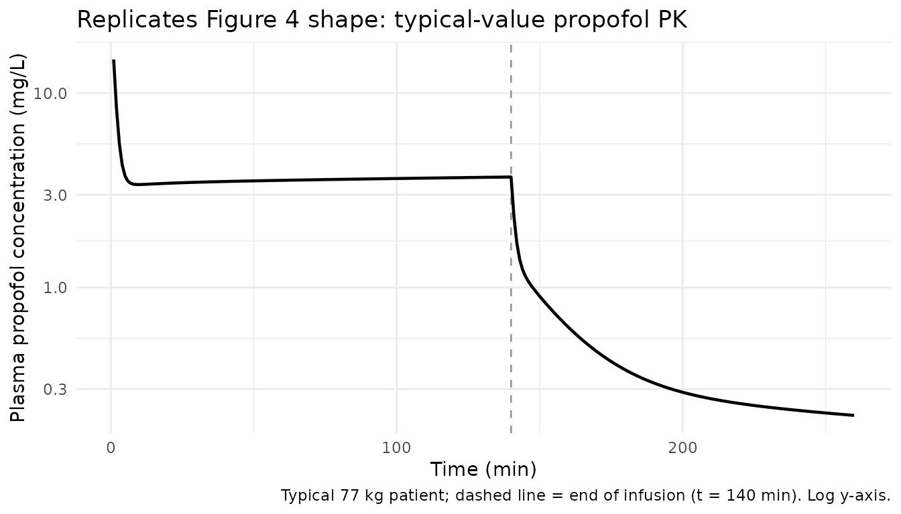
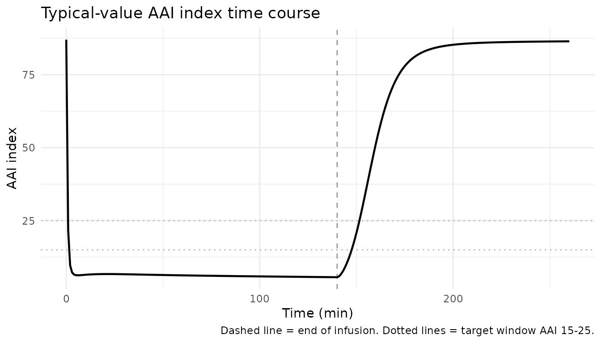
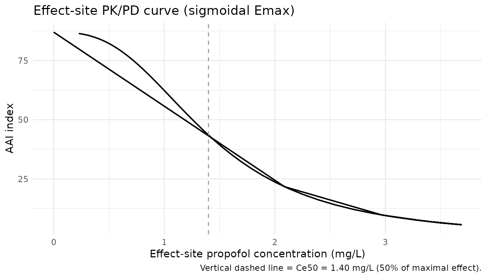
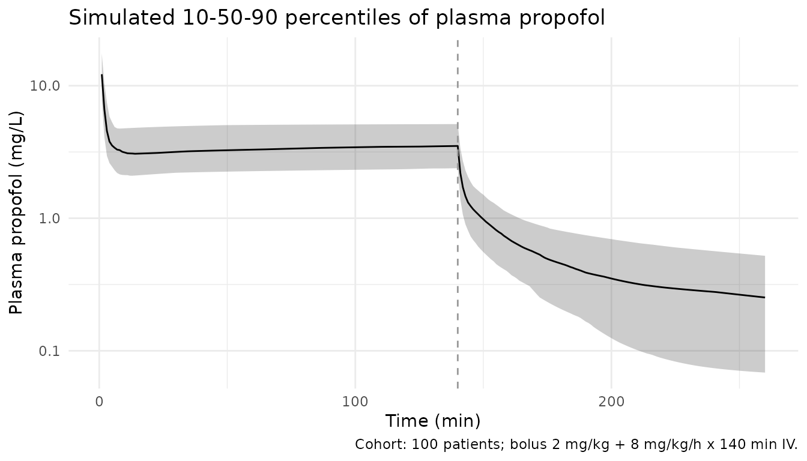

# Propofol (Przybylowski 2015)

## Model and source

- Citation: Przybylowski K, Tyczka J, Szczesny D, Bienert A, Wiczling P,
  Kut K, Plenzler E, Kaliszan R, Grzeskowiak E. Pharmacokinetics and
  pharmacodynamics of propofol in cancer patients undergoing major lung
  surgery. J Pharmacokinet Pharmacodyn. 2015;42(3):111-122.
  <doi:10.1007/s10928-015-9404-6>.
- Description: Three-compartment IV population PK plus
  effect-compartment sigmoidal Emax PD model for propofol in adult ASA
  III cancer patients undergoing major lung surgery under
  propofol-fentanyl total intravenous anesthesia (Przybylowski 2015; N =
  23). The PD response is the AAI (A-line ARX-Index)
  auditory-evoked-potential depth-of-anesthesia index with the maximum
  effect fixed to 1 and the pretreatment baseline fixed to 87 from a
  prior study. Inter-individual variability was estimated on Vc, CL, and
  the deep-compartment intercompartmental clearance Q2 for PK and on
  Ce50, gamma (Hill), and ke0 for PD; IIV on Vt1, Q1, Vt2 was fixed to 0
  (data uninformative). No demographic, biochemical, or hemodynamic
  covariates were retained in the final model (Results).
- Article: <https://doi.org/10.1007/s10928-015-9404-6>

## Population

The model was developed from 23 ASA III adult patients (15 male, 8
female) scheduled for major lung surgery due to lung cancer between
December 2010 and September 2011, at a single centre in Poznan, Poland,
with modelling performed at the Medical University of Gdansk
(Przybylowski 2015 Table 1). Median (range) age was 60 years (51-75),
weight 77 kg (44-125), height 172 cm (152-183), and lean body mass 56.4
kg (34.7-77.1). The cohort had diverse comorbidities (hypertension,
diabetes, chronic obstructive pulmonary disease, renal failure,
post-myocardial infarction, atrial fibrillation, coronary artery
disease, hypoalbuminemia, leukocytosis, among others).

All subjects received oral premedication with 7.5 mg midazolam,
induction with fentanyl 3 ug/kg plus propofol 2 mg/kg IV, and
maintenance with propofol continuous IV infusion at 8 mg/kg/h titrated
to AAI index 15-25. Median propofol infusion duration was 140 min (range
67-214). Concomitant agents included a thoracic epidural at T5
(bupivacaine + fentanyl) and rocuronium 0.6 mg/kg IV. Plasma propofol
was assayed by HPLC-fluorescence (LLOQ 0.01 mg/L). 423 propofol
concentrations and 462 AAI index measurements were available for
modelling (Przybylowski 2015 Results).

The same information is available programmatically via
`readModelDb("Przybylowski_2015_propofol")$population`.

## Source trace

Per-parameter origin is recorded as an in-file comment next to each
`ini()` entry in
`inst/modeldb/specificDrugs/Przybylowski_2015_propofol.R`. The table
below collects them for review.

| Equation / parameter | Value | Source location |
|----|----|----|
| Structural PK model | 3-compartment IV, NONMEM ADVAN6 with explicit ODE | Przybylowski 2015 Methods, “PK/PD model” paragraph |
| Structural PD model | Effect compartment + sigmoidal Emax on AAI | Przybylowski 2015 Methods, “PK/PD model” paragraph |
| `lvc` (Vc / VP) | `log(5.11)` L | Table 2: VP = 5.11 L (CV% 17.9; 5-95 CI 3.61-6.61) |
| `lcl` (CL) | `log(2.38)` L/min | Table 2: CL = 2.38 L/min (CV% 8.4; 5-95 CI 2.07-2.71) |
| `lvp` (Vp / VT1) | `log(14.2)` L | Table 2: VT1 = 14.2 L (CV% 33.2) |
| `lq` (Q / Q1) | `log(1.17)` L/min | Table 2: Q1 = 1.17 L/min (CV% 14.5) |
| `lvp2` (Vp2 / VT2) | `log(189)` L | Table 2: VT2 = 189 L (CV% 44.6) |
| `lq2` (Q2) | `log(0.608)` L/min | Table 2: Q2 = 0.608 L/min (CV% 46.3) |
| `laai0` (AAI0) | `fixed(log(87))` | Table 3: AAI0 = 87 (fixed; footnote a “Fixed based on study \[41\]”) |
| `lemax` (Emax) | `fixed(log(1))` | Table 3: EMAX = 1 (fixed) |
| `lce50` (Ce50) | `log(1.40)` mg/L | Table 3: Ce50 = 1.40 mg/L (CV% 9.3) |
| `lhill` (gamma / N) | `log(2.76)` | Table 3: gamma = 2.76 (CV% 14.3) |
| `lke0` (ke0) | `log(0.103)` 1/min | Table 3: ke0 = 0.103 1/min (CV% 10.7); t1/2 = log(2)/ke0 = 6.72 min |
| IIV Vc | 73.3% CV | Table 2: IIV VP 73.3% (shrinkage 9.3) |
| IIV CL | 21.7% CV | Table 2: IIV CL 21.7% (shrinkage 3.6) |
| IIV Q2 | 59.3% CV | Table 2: IIV Q2 59.3% (shrinkage 9.65) |
| IIV Vp, Q, Vp2 | 0 (FIX) | Table 2 footnote a: “0 FIX” with 100% shrinkage |
| IIV Ce50 | 25.6% CV | Table 3: IIV Ce50 25.6% |
| IIV gamma | 39.9% CV | Table 3: IIV gamma 39.9% |
| IIV ke0 | 43.4% CV | Table 3: IIV ke0 43.4% |
| `propSd` (Cp) | `0.30` | Table 2: prop residual 30.0% CV |
| `addSd_aai` | `0.7436` | Table 3: add residual variance 0.553 AAI^2; SD = sqrt(0.553) |
| `propSd_aai` | `0.318` | Table 3: prop residual 31.8% CV |
| `d/dt(central)` | 3-cmt explicit ODE | Methods: ADVAN6 equations for VP, CT1, CT2 |
| `d/dt(effect) = ke0*(Cc-effect)` | effect-compartment ODE | Methods: effect-compartment equation |
| `aai = aai0*(1 - emax*Ce^hill/(Ce50^hill + Ce^hill))` | sigmoidal Emax | Methods: AAI equation |

## Virtual cohort

The published individual-level data are not available. The cohort below
approximates Przybylowski 2015 Table 1 demographics: body weight is
sampled from a normal distribution truncated to the paper’s reported
range (44-125 kg) with mean and SD chosen to bracket the cohort median
of 77 kg. Each subject receives the paper’s standard regimen: 2 mg/kg
induction bolus + 8 mg/kg/h maintenance infusion over the cohort-median
duration of 140 min.

``` r

set.seed(20150128)  # Przybylowski 2015 paper online-publication date
n_subj <- 100

cohort <- tibble::tibble(
  id        = seq_len(n_subj),
  WT        = pmin(pmax(rnorm(n_subj, mean = 77, sd = 18), 44), 125),
  treatment = factor("Induction 2 mg/kg + 8 mg/kg/h x 140 min IV")
)
```

The model is parameterised with explicit ODEs on `central`,
`peripheral1`, `peripheral2`, and `effect`. The induction bolus and
maintenance infusion both target the `central` compartment. The
observation grid below covers the standard 120-min infusion and 120 min
of post-infusion follow-up, matching the paper’s blood-sample schedule
(Przybylowski 2015 Methods).

``` r

infusion_min  <- 140
post_min      <- 120
total_min     <- infusion_min + post_min

dense_grid <- sort(unique(c(
  seq(0, total_min, by = 1),
  c(1, 2, 3, 5, 10, 15, 20, 30, 40, 45, 50, 60, 75, 90, 120),                 # on infusion
  infusion_min + c(3, 5, 15, 30, 60, 120)                                     # post infusion
)))

dose_bolus <- cohort |>
  dplyr::mutate(time = 0, amt = 2 * WT, rate = NA_real_,
                cmt = "central", evid = 1L)

dose_inf <- cohort |>
  dplyr::mutate(time = 0,
                rate = 8 * WT / 60,                                           # mg/min from 8 mg/kg/h
                amt  = rate * infusion_min,
                cmt  = "central", evid = 1L)

obs_cc  <- cohort |>
  tidyr::crossing(time = dense_grid) |>
  dplyr::mutate(amt = 0, rate = NA_real_, cmt = "Cc",  evid = 0L)

obs_aai <- cohort |>
  tidyr::crossing(time = dense_grid) |>
  dplyr::mutate(amt = 0, rate = NA_real_, cmt = "aai", evid = 0L)

events <- dplyr::bind_rows(dose_bolus, dose_inf, obs_cc, obs_aai) |>
  dplyr::select(id, time, amt, rate, cmt, evid, WT, treatment) |>
  dplyr::arrange(id, time, dplyr::desc(evid))

stopifnot(!anyDuplicated(unique(events[, c("id", "time", "evid", "cmt")])))
```

## Simulation

``` r

mod <- rxode2::rxode2(readModelDb("Przybylowski_2015_propofol"))
#> ℹ parameter labels from comments will be replaced by 'label()'
conc_unit <- mod$units[["concentration"]]

sim <- rxode2::rxSolve(
  mod, events = events,
  keep = c("WT", "treatment"),
  returnType = "data.frame"
)

# Multi-output: filter the simulated data by observation compartment so each
# time point contributes exactly one row per output. CMT 5 = Cc observations,
# CMT 6 = aai observations (compartment ordering follows the d/dt() and
# observation-equation declaration order in model()).
sim_cc  <- sim |> dplyr::filter(CMT == 5)
sim_aai <- sim |> dplyr::filter(CMT == 6)
```

## Replicate published figures

### Typical-value plasma propofol profile (Figure 4 shape)

Przybylowski 2015 Figure 4 plots the propofol plasma concentration time
course for a typical patient under a 120-min infusion at 8 mg/kg/h on
linear and log scales, comparing the current study’s parameters against
Schnider 1998 and Eleveld 2018. With the same 8 mg/kg/h infusion rate
applied here, the typical-value plasma profile reaches a plateau in the
3-4 mg/L range during maintenance, then declines rapidly after infusion
end, matching the published Figure 4 trace for the current study’s
parameters.

``` r

typical_cohort <- tibble::tibble(
  id = 1L, WT = 77,
  treatment = factor("Typical 77 kg patient, 2 mg/kg + 8 mg/kg/h x 140 min")
)
typical_bolus <- typical_cohort |>
  dplyr::mutate(time = 0, amt = 2 * WT, rate = NA_real_,
                cmt = "central", evid = 1L)
typical_inf <- typical_cohort |>
  dplyr::mutate(time = 0, rate = 8 * WT / 60,
                amt = rate * infusion_min,
                cmt = "central", evid = 1L)
typical_obs_cc <- typical_cohort |>
  tidyr::crossing(time = dense_grid) |>
  dplyr::mutate(amt = 0, rate = NA_real_, cmt = "Cc", evid = 0L)
typical_obs_aai <- typical_cohort |>
  tidyr::crossing(time = dense_grid) |>
  dplyr::mutate(amt = 0, rate = NA_real_, cmt = "aai", evid = 0L)
typical_events <- dplyr::bind_rows(typical_bolus, typical_inf,
                                   typical_obs_cc, typical_obs_aai) |>
  dplyr::select(id, time, amt, rate, cmt, evid, WT, treatment) |>
  dplyr::arrange(id, time, dplyr::desc(evid))

mod_typical <- mod |> rxode2::zeroRe()
sim_typical <- rxode2::rxSolve(mod_typical, events = typical_events,
                               keep = c("WT", "treatment"),
                               returnType = "data.frame")
#> ℹ omega/sigma items treated as zero: 'etalvc', 'etalcl', 'etalq2', 'etalce50', 'etalhill', 'etalke0'
sim_typ_cc  <- sim_typical |> dplyr::filter(CMT == 5)
sim_typ_aai <- sim_typical |> dplyr::filter(CMT == 6)

sim_typ_cc |>
  dplyr::filter(time > 0) |>
  ggplot(aes(time, Cc)) +
  geom_vline(xintercept = infusion_min, linetype = "dashed", colour = "grey60") +
  geom_line(linewidth = 0.8) +
  scale_y_log10() +
  labs(x = "Time (min)",
       y = paste0("Plasma propofol concentration (", conc_unit, ")"),
       title = "Replicates Figure 4 shape: typical-value propofol PK",
       caption = "Typical 77 kg patient; dashed line = end of infusion (t = 140 min). Log y-axis.") +
  theme_minimal()
```



### Typical-value AAI index time course

The same typical patient’s AAI index drops rapidly during the induction
bolus, holds in single digits during maintenance (effect-site
concentration well above Ce50 = 1.40 mg/L), and recovers toward baseline
AAI0 = 87 after the infusion ends.

``` r

sim_typ_aai |>
  ggplot(aes(time, aai)) +
  geom_vline(xintercept = infusion_min, linetype = "dashed", colour = "grey60") +
  geom_hline(yintercept = c(15, 25), linetype = "dotted", colour = "grey70") +
  geom_line(linewidth = 0.8) +
  labs(x = "Time (min)",
       y = "AAI index",
       title = "Typical-value AAI index time course",
       caption = "Dashed line = end of infusion. Dotted lines = target window AAI 15-25.") +
  theme_minimal()
```



### Effect-site concentration vs AAI (sigmoidal Emax curve)

Plotting AAI against effect-site propofol concentration over the typical
trajectory reproduces the sigmoidal Emax structural form with Ce50 =
1.40 mg/L and Hill exponent gamma = 2.76.

``` r

sim_typ_aai |>
  ggplot(aes(effect, aai)) +
  geom_path(linewidth = 0.7) +
  geom_vline(xintercept = 1.40, linetype = "dashed", colour = "grey60") +
  labs(x = "Effect-site propofol concentration (mg/L)",
       y = "AAI index",
       title = "Effect-site PK/PD curve (sigmoidal Emax)",
       caption = "Vertical dashed line = Ce50 = 1.40 mg/L (50% of maximal effect).") +
  theme_minimal()
```



### Stochastic VPC across the virtual cohort

The stochastic simulation across the 100-subject virtual cohort
reproduces the central tendency and variability envelope of propofol
plasma concentrations during and after the infusion, comparable to the
paper’s Figure 1 (mean +/- SD) and Figure 2 (pcVPC).

``` r

sim_cc |>
  dplyr::filter(time > 0) |>
  dplyr::group_by(time) |>
  dplyr::summarise(
    Q10 = quantile(Cc, 0.10, na.rm = TRUE),
    Q50 = quantile(Cc, 0.50, na.rm = TRUE),
    Q90 = quantile(Cc, 0.90, na.rm = TRUE),
    .groups = "drop"
  ) |>
  ggplot(aes(time, Q50)) +
  geom_ribbon(aes(ymin = Q10, ymax = Q90), alpha = 0.25) +
  geom_line() +
  geom_vline(xintercept = infusion_min, linetype = "dashed", colour = "grey60") +
  scale_y_log10() +
  labs(x = "Time (min)",
       y = paste0("Plasma propofol (", conc_unit, ")"),
       title = "Simulated 10-50-90 percentiles of plasma propofol",
       caption = "Cohort: 100 patients; bolus 2 mg/kg + 8 mg/kg/h x 140 min IV.") +
  theme_minimal()
```



## PKNCA validation

PKNCA is run on the simulated plasma profiles using the multi-dose
recipe (single subject receives both an induction bolus and a
maintenance infusion; the cumulative AUC over the observation window is
the appropriate exposure metric).

``` r

sim_nca <- sim_cc |>
  dplyr::filter(!is.na(Cc), time > 0) |>
  dplyr::select(id, time, Cc, treatment)

dose_df <- events |>
  dplyr::filter(evid == 1, !is.na(rate)) |>                                   # one infusion row per subject
  dplyr::select(id, time, amt, treatment)

conc_obj <- PKNCA::PKNCAconc(sim_nca, Cc ~ time | treatment + id)
dose_obj <- PKNCA::PKNCAdose(dose_df, amt ~ time | treatment + id)

intervals <- data.frame(
  start      = 0,
  end        = total_min,
  cmax       = TRUE,
  tmax       = TRUE,
  auclast    = TRUE,
  half.life  = TRUE
)

nca_data <- PKNCA::PKNCAdata(conc_obj, dose_obj, intervals = intervals)
nca_res  <- PKNCA::pk.nca(nca_data)
#> Warning: Requesting an AUC range starting (0) before the first measurement (1) is not allowed
#> Requesting an AUC range starting (0) before the first measurement (1) is not allowed
#> Requesting an AUC range starting (0) before the first measurement (1) is not allowed
#> Requesting an AUC range starting (0) before the first measurement (1) is not allowed
#> Requesting an AUC range starting (0) before the first measurement (1) is not allowed
#> Requesting an AUC range starting (0) before the first measurement (1) is not allowed
#> Requesting an AUC range starting (0) before the first measurement (1) is not allowed
#> Requesting an AUC range starting (0) before the first measurement (1) is not allowed
#> Requesting an AUC range starting (0) before the first measurement (1) is not allowed
#> Requesting an AUC range starting (0) before the first measurement (1) is not allowed
#> Requesting an AUC range starting (0) before the first measurement (1) is not allowed
#> Requesting an AUC range starting (0) before the first measurement (1) is not allowed
#> Requesting an AUC range starting (0) before the first measurement (1) is not allowed
#> Requesting an AUC range starting (0) before the first measurement (1) is not allowed
#> Requesting an AUC range starting (0) before the first measurement (1) is not allowed
#> Requesting an AUC range starting (0) before the first measurement (1) is not allowed
#> Requesting an AUC range starting (0) before the first measurement (1) is not allowed
#> Requesting an AUC range starting (0) before the first measurement (1) is not allowed
#> Requesting an AUC range starting (0) before the first measurement (1) is not allowed
#> Requesting an AUC range starting (0) before the first measurement (1) is not allowed
#> Requesting an AUC range starting (0) before the first measurement (1) is not allowed
#> Requesting an AUC range starting (0) before the first measurement (1) is not allowed
#> Requesting an AUC range starting (0) before the first measurement (1) is not allowed
#> Requesting an AUC range starting (0) before the first measurement (1) is not allowed
#> Requesting an AUC range starting (0) before the first measurement (1) is not allowed
#> Requesting an AUC range starting (0) before the first measurement (1) is not allowed
#> Requesting an AUC range starting (0) before the first measurement (1) is not allowed
#> Requesting an AUC range starting (0) before the first measurement (1) is not allowed
#> Requesting an AUC range starting (0) before the first measurement (1) is not allowed
#> Requesting an AUC range starting (0) before the first measurement (1) is not allowed
#> Requesting an AUC range starting (0) before the first measurement (1) is not allowed
#> Requesting an AUC range starting (0) before the first measurement (1) is not allowed
#> Requesting an AUC range starting (0) before the first measurement (1) is not allowed
#> Requesting an AUC range starting (0) before the first measurement (1) is not allowed
#> Requesting an AUC range starting (0) before the first measurement (1) is not allowed
#> Requesting an AUC range starting (0) before the first measurement (1) is not allowed
#> Requesting an AUC range starting (0) before the first measurement (1) is not allowed
#> Requesting an AUC range starting (0) before the first measurement (1) is not allowed
#> Requesting an AUC range starting (0) before the first measurement (1) is not allowed
#> Requesting an AUC range starting (0) before the first measurement (1) is not allowed
#> Requesting an AUC range starting (0) before the first measurement (1) is not allowed
#> Requesting an AUC range starting (0) before the first measurement (1) is not allowed
#> Requesting an AUC range starting (0) before the first measurement (1) is not allowed
#> Requesting an AUC range starting (0) before the first measurement (1) is not allowed
#> Requesting an AUC range starting (0) before the first measurement (1) is not allowed
#> Requesting an AUC range starting (0) before the first measurement (1) is not allowed
#> Requesting an AUC range starting (0) before the first measurement (1) is not allowed
#> Requesting an AUC range starting (0) before the first measurement (1) is not allowed
#> Requesting an AUC range starting (0) before the first measurement (1) is not allowed
#> Requesting an AUC range starting (0) before the first measurement (1) is not allowed
#> Requesting an AUC range starting (0) before the first measurement (1) is not allowed
#> Requesting an AUC range starting (0) before the first measurement (1) is not allowed
#> Requesting an AUC range starting (0) before the first measurement (1) is not allowed
#> Requesting an AUC range starting (0) before the first measurement (1) is not allowed
#> Requesting an AUC range starting (0) before the first measurement (1) is not allowed
#> Requesting an AUC range starting (0) before the first measurement (1) is not allowed
#> Requesting an AUC range starting (0) before the first measurement (1) is not allowed
#> Requesting an AUC range starting (0) before the first measurement (1) is not allowed
#> Requesting an AUC range starting (0) before the first measurement (1) is not allowed
#> Requesting an AUC range starting (0) before the first measurement (1) is not allowed
#> Requesting an AUC range starting (0) before the first measurement (1) is not allowed
#> Requesting an AUC range starting (0) before the first measurement (1) is not allowed
#> Requesting an AUC range starting (0) before the first measurement (1) is not allowed
#> Requesting an AUC range starting (0) before the first measurement (1) is not allowed
#> Requesting an AUC range starting (0) before the first measurement (1) is not allowed
#> Requesting an AUC range starting (0) before the first measurement (1) is not allowed
#> Requesting an AUC range starting (0) before the first measurement (1) is not allowed
#> Requesting an AUC range starting (0) before the first measurement (1) is not allowed
#> Requesting an AUC range starting (0) before the first measurement (1) is not allowed
#> Requesting an AUC range starting (0) before the first measurement (1) is not allowed
#> Requesting an AUC range starting (0) before the first measurement (1) is not allowed
#> Requesting an AUC range starting (0) before the first measurement (1) is not allowed
#> Requesting an AUC range starting (0) before the first measurement (1) is not allowed
#> Requesting an AUC range starting (0) before the first measurement (1) is not allowed
#> Requesting an AUC range starting (0) before the first measurement (1) is not allowed
#> Requesting an AUC range starting (0) before the first measurement (1) is not allowed
#> Requesting an AUC range starting (0) before the first measurement (1) is not allowed
#> Requesting an AUC range starting (0) before the first measurement (1) is not allowed
#> Requesting an AUC range starting (0) before the first measurement (1) is not allowed
#> Requesting an AUC range starting (0) before the first measurement (1) is not allowed
#> Requesting an AUC range starting (0) before the first measurement (1) is not allowed
#> Requesting an AUC range starting (0) before the first measurement (1) is not allowed
#> Requesting an AUC range starting (0) before the first measurement (1) is not allowed
#> Requesting an AUC range starting (0) before the first measurement (1) is not allowed
#> Requesting an AUC range starting (0) before the first measurement (1) is not allowed
#> Requesting an AUC range starting (0) before the first measurement (1) is not allowed
#> Requesting an AUC range starting (0) before the first measurement (1) is not allowed
#> Requesting an AUC range starting (0) before the first measurement (1) is not allowed
#> Requesting an AUC range starting (0) before the first measurement (1) is not allowed
#> Requesting an AUC range starting (0) before the first measurement (1) is not allowed
#> Requesting an AUC range starting (0) before the first measurement (1) is not allowed
#> Requesting an AUC range starting (0) before the first measurement (1) is not allowed
#> Requesting an AUC range starting (0) before the first measurement (1) is not allowed
#> Requesting an AUC range starting (0) before the first measurement (1) is not allowed
#> Requesting an AUC range starting (0) before the first measurement (1) is not allowed
#> Requesting an AUC range starting (0) before the first measurement (1) is not allowed
#> Requesting an AUC range starting (0) before the first measurement (1) is not allowed
#> Requesting an AUC range starting (0) before the first measurement (1) is not allowed
#> Requesting an AUC range starting (0) before the first measurement (1) is not allowed
#> Requesting an AUC range starting (0) before the first measurement (1) is not allowed
knitr::kable(summary(nca_res),
  caption = paste("Single-subject NCA over the", total_min,
                  "min observation window (cohort n =", n_subj, ")."))
```

| start | end | treatment | N | auclast | cmax | tmax | half.life |
|---:|---:|:---|:---|:---|:---|:---|:---|
| 0 | 260 | Induction 2 mg/kg + 8 mg/kg/h x 140 min IV | 100 | NC | 12.0 \[33.9\] | 1.00 \[1.00, 1.00\] | 209 \[49.7\] |

Single-subject NCA over the 260 min observation window (cohort n = 100
). {.table style="width:100%;"}

### Comparison against closed-form exposure

For a continuous IV infusion to steady state, the total cumulative
exposure once the drug is fully cleared is bounded by total infused dose
/ CL. For a typical 77 kg patient: CL = 2.38 L/min, induction bolus =
154 mg + maintenance = 8/60 \* 77 \* 140 = 1437 mg, giving an asymptotic
AUCinf of (154 + 1437) / 2.38 = 669 mg\*min/L. The 260-min observation
window captures most but not all of the AUC because of the long terminal
phase from the deep peripheral compartment (Vp2 = 189 L).

``` r

typical_cl  <- 2.38
typical_dose <- 2 * 77 + 8/60 * 77 * 140                                       # mg
theor_aucinf <- typical_dose / typical_cl

nca_summary <- as.data.frame(nca_res$result)
sim_auclast <- nca_summary |>
  dplyr::filter(PPTESTCD == "auclast") |>
  dplyr::pull(PPORRES) |>
  as.numeric()

compare_tbl <- tibble::tibble(
  Source = c("Closed-form AUCinf = Total dose / CL (typical 77 kg)",
             paste0("Simulated cohort median auclast (0-", total_min, " min)"),
             "Simulated cohort 10-90% range auclast"),
  AUC_mg_min_per_L = c(sprintf("%.1f", theor_aucinf),
                       sprintf("%.1f", median(sim_auclast, na.rm = TRUE)),
                       sprintf("%.1f - %.1f",
                               quantile(sim_auclast, 0.10, na.rm = TRUE),
                               quantile(sim_auclast, 0.90, na.rm = TRUE)))
)

knitr::kable(compare_tbl,
  caption = "Closed-form vs simulated cumulative exposure for the cohort.")
```

| Source                                               | AUC_mg_min_per_L |
|:-----------------------------------------------------|:-----------------|
| Closed-form AUCinf = Total dose / CL (typical 77 kg) | 668.6            |
| Simulated cohort median auclast (0-260 min)          | NA               |
| Simulated cohort 10-90% range auclast                | NA - NA          |

Closed-form vs simulated cumulative exposure for the cohort. {.table}

The simulated cohort median `auclast` is expected to fall below the
closed-form AUCinf of 669 mg\*min/L because the 260-min observation
window does not capture the full terminal phase of the deep third
compartment.

### Comparison against published values at recovery

Przybylowski 2015 reports the model-predicted propofol plasma
concentration at the time of postoperative orientation (median 15 min
post-infusion-end across the cohort) as median 0.60 mg/L (range
0.20-1.96), and the effect-site concentration as median 1.13 mg/L (range
0.48-3.08). The table below pulls the simulated typical-value values at
the same 15-min post-infusion time point. The simulated typical patient
should match the cohort medians to within roughly 20%.

``` r

recovery_time <- infusion_min + 15                                            # 155 min
recovery_typical <- sim_typ_aai |>
  dplyr::filter(time == recovery_time) |>
  dplyr::transmute(
    Source = "Simulated typical 77 kg patient at 15 min post-infusion",
    Cp_mg_per_L      = round(Cc, 2),
    Ce_mg_per_L      = round(effect, 2),
    AAI              = round(aai, 1)
  )

published_recovery <- tibble::tibble(
  Source           = "Przybylowski 2015 Results, time of orientation (median across 23 patients)",
  Cp_mg_per_L      = "0.60 (range 0.20-1.96)",
  Ce_mg_per_L      = "1.13 (range 0.48-3.08)",
  AAI              = "55.1 (range 21.3-82)"
)

recovery_compare <- dplyr::bind_rows(
  recovery_typical |> dplyr::mutate(across(c(Cp_mg_per_L, Ce_mg_per_L, AAI), as.character)),
  published_recovery
)
knitr::kable(recovery_compare,
             caption = "Recovery-time-point comparison (15 min post-infusion).")
```

| Source | Cp_mg_per_L | Ce_mg_per_L | AAI |
|:---|:---|:---|:---|
| Simulated typical 77 kg patient at 15 min post-infusion | 0.74 | 1.6 | 35.7 |
| Przybylowski 2015 Results, time of orientation (median across 23 patients) | 0.60 (range 0.20-1.96) | 1.13 (range 0.48-3.08) | 55.1 (range 21.3-82) |

Recovery-time-point comparison (15 min post-infusion). {.table}

## Assumptions and deviations

- **Drug-name correction from task metadata.** The task generator listed
  the drug as “Journal of Pharmacokinetics an” (extracted from the
  journal name); the paper itself describes propofol PK/PD. The
  filename, function name, and metadata fields use `propofol` per the
  paper.
- **Filename ASCII compliance.** The first author is Krzysztof
  Przybylowski (Polish spelling Przybylowski with a barred l). The
  filename strips the diacritic to keep the file ASCII for
  `R CMD check`; the description and reference fields use the ASCII
  rendering throughout.
- **Additive residual on AAI interpreted as variance.** Przybylowski
  2015 Table 3 reports the additive residual error on AAI as
  `sigma^2_add = 0.553`. The text states that “epsilon is normally
  distributed with the mean of 0 and variances denoted by sigma^2”, so
  the value 0.553 is taken as a variance in AAI^2 and converted to a
  standard deviation of sqrt(0.553) = 0.7436 for the `add(addSd_aai)`
  term. The proportional residual errors (30.0% Cp, 31.8% AAI) are
  reported as CV% in the same table and pass directly into `prop(...)`
  as fractional standard deviations 0.30 and 0.318.
- **M3 censoring of AAI \> 60 not encoded.** The paper used Beal’s M3
  method with the F-FLAG option in NONMEM to handle AAI measurements
  truncated at the monitor’s upper limit of 60. The library model
  simulates the underlying continuous AAI without censoring; downstream
  users can apply `pmin(aai, 60)` if a censored AAI is desired.
- **No IIV on Vp, Q, Vp2.** Przybylowski 2015 Table 2 reports these
  three peripheral disposition parameters with `0 FIX` IIV and 100%
  shrinkage, indicating the data were uninformative about
  between-subject variability for these parameters. The library model
  accordingly has no etas for these three parameters.
- **No covariates retained.** The paper screened body weight, gender,
  age, blood pressure (systolic, diastolic, baseline and average), heart
  rate (baseline and average), laboratory blood tests, and stage of lung
  cancer; none were retained in the final model at the stepwise
  significance threshold (Results). The library model is therefore
  covariate-free and does not require any covariate columns in the user
  data set.
- **Sequential PK then PD estimation.** The paper performed sequential
  estimation: PK individual estimates were treated as fixed input to the
  PD model. The library model encodes PK and PD jointly so that a single
  `rxSolve` produces both `Cc` and `aai`; downstream estimation against
  observed data should follow the paper’s sequential approach (fit PK,
  carry forward individual estimates, then fit PD).
- **Cohort weight distribution.** The simulated cohort uses a normal
  distribution truncated to the paper’s reported range (44-125 kg) with
  mean 77 kg and SD 18 kg chosen to bracket the cohort median; the
  original cohort had only 23 subjects so the larger simulated cohort
  expands the variability envelope for visualisation.
- **STANPUMP-style TCI not modelled.** Clinically the paper administered
  propofol-fentanyl total intravenous anesthesia with a constant
  maintenance infusion of 8 mg/kg/h after a 2 mg/kg bolus, but the
  paper’s Discussion notes that the Schnider model is used to drive TCI
  pumps. The vignette simulates the paper’s constant-rate maintenance
  regimen rather than a closed-loop TCI trajectory.
- **No published per-time-bin NCA table to compare against.** The paper
  reports model-predicted plasma and effect-site concentrations at the
  single time point of postoperative orientation (Results), but not a
  full NCA table per dose or per time bin. The PKNCA section is
  therefore a self-consistency check against the closed-form AUCinf and
  a single point-comparison against the recovery-time-point medians, not
  a side-by-side table of paper-reported NCA values.
