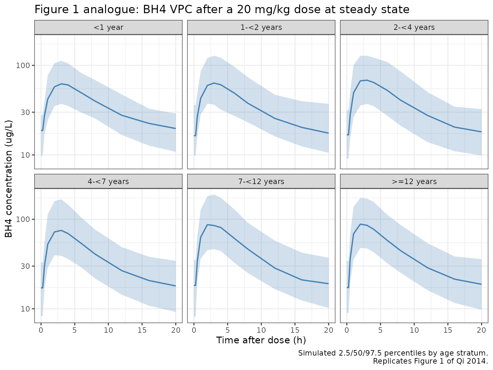
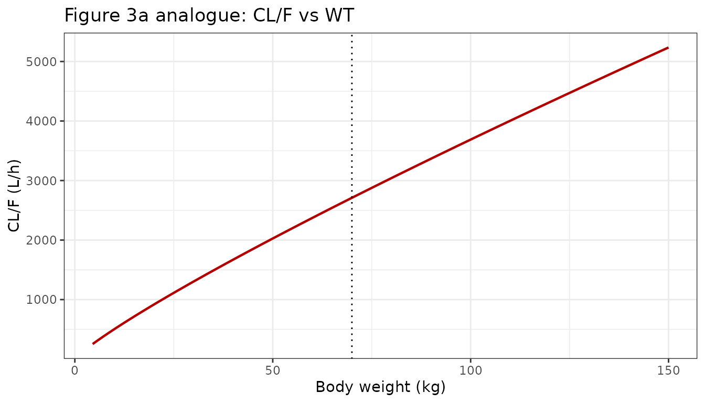
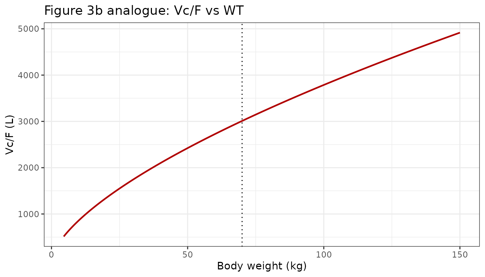

# Qi_2014_sapropterin

``` r

library(nlmixr2lib)
library(PKNCA)
#> 
#> Attaching package: 'PKNCA'
#> The following object is masked from 'package:stats':
#> 
#>     filter
library(rxode2)
#> rxode2 5.1.2 using 2 threads (see ?getRxThreads)
#>   no cache: create with `rxCreateCache()`
library(dplyr)
#> 
#> Attaching package: 'dplyr'
#> The following objects are masked from 'package:stats':
#> 
#>     filter, lag
#> The following objects are masked from 'package:base':
#> 
#>     intersect, setdiff, setequal, union
library(tidyr)
library(ggplot2)
```

## Model and source

    #> ℹ parameter labels from comments will be replaced by 'label()'

- **Citation:** Qi Y, Mould DR, Zhou H, Merilainen M, Musson DG. A
  prospective population pharmacokinetic analysis of sapropterin
  dihydrochloride in infants and young children with phenylketonuria.
  Clinical Pharmacokinetics. 2015;54(2):195-207.
  <doi:10.1007/s40262-014-0196-4>

- **Description:** One-compartment population PK model with first-order
  oral absorption, an absorption lag, linear elimination, and an
  additive endogenous BH4 baseline for sapropterin dihydrochloride in
  pediatric and adult patients with phenylketonuria (Qi 2014).

- **Article:** <https://doi.org/10.1007/s40262-014-0196-4>

## Population

Qi 2014 pooled sapropterin dihydrochloride (BH4) plasma PK data from 156
patients with phenylketonuria (PKU) across two BioMarin clinical
studies: PKU-015 (n = 80 evaluable, ages 0-6 years, oral 20 mg/kg QD for
4 weeks) and PKU-004 (n = 78 evaluable, ages 9-50 years, oral 5-20 mg/kg
QD in fixed-dose and dose-escalation periods). The combined dataset
contained 475 plasma BH4 concentrations measured indirectly via
oxidation to L-biopterin and validated LC-MS/MS quantitation (LLOQ 10.7
ng/mL for BH4). Baseline demographics from Qi 2014 Table 2: age 0.107-50
years (mean 12, SD 11.3), body weight 4.5-144 kg (mean 40.9, SD 30.3),
51.3% female. Age strata in the pooled dataset: \<1 year (n=10), 1-\<2
years (n=14), 2-\<4 years (n=28), 4-\<7 years (n=28), 7-\<12 years
(n=10), \>=12 years (n=66). Ethnicity 97.4% non-Hispanic, 2.6% Hispanic.
Baseline laboratory ranges (Table 2): albumin 3.6-5.0 g/dL, creatinine
clearance 9.39-276 mL/min, baseline phenylalanine 53-2190 umol/L. Only
body weight was retained as a significant covariate after backwards
elimination (Section 3.2 and Electronic Supplementary Material Table
1S).

The same information is available programmatically via
`readModelDb("Qi_2014_sapropterin")$population`.

## Source trace

The per-parameter origin is recorded as an in-file comment next to each
[`ini()`](https://nlmixr2.github.io/rxode2/reference/ini.html) entry in
`inst/modeldb/specificDrugs/Qi_2014_sapropterin.R`. The table below
collects them in one place for review.

| Equation / parameter | Value | Source location (Qi 2014) |
|----|----|----|
| `lka` | `log(0.235)` | Table 3 (theta3): ka = 0.235 h^-1 |
| `lcl` | `log(2710)` | Table 3 (theta1): CL/F = 2710 L/h |
| `lvc` | `log(3010)` | Table 3 (theta2): Vc/F = 3010 L |
| `ltlag` | `log(0.321)` | Table 3 (theta4): tlag = 0.321 h |
| `lc0` | `log(16.6)` | Table 3 (theta5): endogenous BH4 = 16.6 ug/L |
| `e_wt_cl` | `0.864` | Table 3 (theta6): WT exponent on CL/F (ref 70 kg) |
| `e_wt_vc` | `0.644` | Table 3 (theta7): WT exponent on Vc/F (ref 70 kg) |
| IIV CL/F (omega^2) | `log(1+0.4561^2)` = 0.18899 | Table 3: IIV CL/F = 45.61% CV |
| IIV Vc/F (omega^2) | `log(1+0.5657^2)` = 0.27764 | Table 3: IIV Vc/F = 56.57% CV |
| IIV C0 (omega^2) | `log(1+0.3647^2)` = 0.12487 | Table 3: IIV C0 = 36.47% CV |
| cov(CL,Vc) on log | `0.469 * sqrt(om_cl * om_vc)` = 0.10743 | Table 3: corr(CL/F, Vc/F) = 0.469 |
| `expSdPKU004` | `0.211` | Table 3 (theta8): PKU-004 residual = 21.1% CV (LTBS) |
| `expSdPKU015` | `0.302` | Table 3 (theta9): PKU-015 residual = 30.2% CV (LTBS) |
| Equation: CL/F | `theta1 * (WT/70)^theta6 * exp(eta1)` | Eq. 6 |
| Equation: Vc/F | `theta2 * (WT/70)^theta7 * exp(eta2)` | Eq. 6 |
| Equation: C0 | `theta5 * exp(eta3)` | Eq. 6 |
| Observation | `Cc = (central / vc) * 1000 + C0` | Section 2.4.1 (one-compartment plus endogenous BH4) |
| Residual | `Ln(Cp_obs) = Ln(Cp_pred) + eps` | Eq. 5 (LTBS, per-study) |

Reference covariate values for typical-subject predictions: WT = 70 kg
(reference adult, per Qi 2014 Eq. 6 footnote).

The paper reports derived population mean half-lives that are used here
as external validation targets (Section 3.2):

- Terminal (elimination) half-life: 0.78 h.
- Absorption half-life: 2.95 h (= 0.693 / 0.235, flip-flop behavior).

## Virtual cohort

Individual observed data are not public. The simulations below build
weight-stratified virtual cohorts approximating Qi 2014 Table 2 and
Section 3.1 age groupings.

``` r

make_cohort <- function(n,
                        weight_mean,
                        weight_sd,
                        weight_min,
                        weight_max,
                        study,
                        amt_mg_per_kg = 20,
                        n_doses       = 7,
                        dose_interval_hr = 24,
                        obs_times_post_dose_hr = c(0, 0.25, 0.5, 1, 2, 3,
                                                   4, 6, 8, 12, 16, 20),
                        id_offset = 0L,
                        seed = 20142014) {
  set.seed(seed + id_offset)

  WT <- pmax(weight_min,
             pmin(weight_max, rnorm(n, weight_mean, weight_sd)))

  STUDY_PKU015 <- as.integer(study == "PKU-015")

  dose_times <- seq(0, (n_doses - 1) * dose_interval_hr,
                    by = dose_interval_hr)

  pop <- data.frame(
    ID           = id_offset + seq_len(n),
    WT           = WT,
    STUDY_PKU015 = STUDY_PKU015
  )

  # Dose records (oral dose into the depot compartment).
  d_dose <- pop[rep(seq_len(n), each = length(dose_times)), ] |>
    dplyr::mutate(
      TIME = rep(dose_times, times = n),
      AMT  = amt_mg_per_kg * WT,
      EVID = 1,
      CMT  = "depot",
      DV   = NA_real_
    )

  # Observation grid post each dose (sample once at steady state on the
  # final dosing interval to keep simulations small).
  last_dose_time <- (n_doses - 1) * dose_interval_hr
  obs_grid <- sort(unique(c(
    last_dose_time + obs_times_post_dose_hr,
    last_dose_time - 0.001
  )))

  d_obs <- pop[rep(seq_len(n), each = length(obs_grid)), ] |>
    dplyr::mutate(
      TIME = rep(obs_grid, times = n),
      AMT  = 0,
      EVID = 0,
      CMT  = "central",
      DV   = NA_real_
    )

  dplyr::bind_rows(d_dose, d_obs) |>
    dplyr::arrange(ID, TIME, dplyr::desc(EVID)) |>
    dplyr::select(ID, TIME, AMT, EVID, CMT, DV, WT, STUDY_PKU015)
}
```

``` r

mod <- rxode2::rxode(readModelDb("Qi_2014_sapropterin"))
#> ℹ parameter labels from comments will be replaced by 'label()'
mod_typical <- rxode2::zeroRe(mod)
#> Warning: No sigma parameters in the model
```

## Simulation

The primary simulation uses the approved pediatric dose of 20 mg/kg QD
for one week (a steady-state surrogate) with dense sampling on the final
day. Age groups are constructed to match Qi 2014 Section 3.1 strata.

``` r

age_strata <- tibble::tribble(
  ~stratum,     ~study,    ~weight_mean, ~weight_sd, ~weight_min, ~weight_max, ~n,
  "<1 year",    "PKU-015",  7,            2,          4.5,         10,         10,
  "1-<2 years", "PKU-015", 11,            2,          8,           14,         14,
  "2-<4 years", "PKU-015", 14,            3,          10,          20,         28,
  "4-<7 years", "PKU-015", 21,            4,          15,          30,         28,
  "7-<12 years","PKU-004", 35,            8,          25,          50,         10,
  ">=12 years", "PKU-004", 70,           18,          40,         144,         66
)

events_vpc <- dplyr::bind_rows(lapply(seq_len(nrow(age_strata)), function(i) {
  row <- age_strata[i, ]
  ev <- make_cohort(
    n           = row$n * 5L,  # 5x oversample for VPC stability
    weight_mean = row$weight_mean,
    weight_sd   = row$weight_sd,
    weight_min  = row$weight_min,
    weight_max  = row$weight_max,
    study       = row$study,
    id_offset   = (i - 1L) * 1000L
  )
  ev$stratum <- row$stratum
  ev
}))
stopifnot(!anyDuplicated(unique(events_vpc[, c("ID", "TIME", "EVID")])))

sim_vpc <- rxode2::rxSolve(mod, events = events_vpc, keep = c("stratum")) |>
  as.data.frame() |>
  dplyr::mutate(time_post_dose = time - 144)  # final dose at t = 144 h (after 6 prior doses)
```

## Replicate published figures

### Figure 1 analogue: BH4 concentration VPC by age stratum

Qi 2014 Figure 1 shows a VPC of BH4 plasma concentration versus time
after dose for six age strata under 20 mg/kg QD dosing. We reproduce
that on a per-age-stratum basis using the steady-state interval.

``` r

sim_vpc |>
  dplyr::filter(time_post_dose >= 0, time_post_dose <= 24) |>
  dplyr::group_by(stratum, time_post_dose) |>
  dplyr::summarise(
    Q025 = quantile(Cc, 0.025, na.rm = TRUE),
    Q50  = quantile(Cc, 0.50,  na.rm = TRUE),
    Q975 = quantile(Cc, 0.975, na.rm = TRUE),
    .groups = "drop"
  ) |>
  dplyr::mutate(stratum = factor(stratum, levels = age_strata$stratum)) |>
  ggplot(aes(x = time_post_dose, y = Q50)) +
  geom_ribbon(aes(ymin = Q025, ymax = Q975), fill = "#4682b4", alpha = 0.25) +
  geom_line(colour = "#4682b4", linewidth = 0.7) +
  facet_wrap(~ stratum) +
  scale_y_log10() +
  labs(
    x       = "Time after dose (h)",
    y       = "BH4 concentration (ug/L)",
    title   = "Figure 1 analogue: BH4 VPC after a 20 mg/kg dose at steady state",
    caption = "Simulated 2.5/50/97.5 percentiles by age stratum.\nReplicates Figure 1 of Qi 2014."
  ) +
  theme_bw()
```



### Figure 3 analogue: WT relationship with CL/F and Vc/F

Qi 2014 Figure 3 shows the model-implied power-form relationship between
body weight and CL/F (panel a) and Vc/F (panel b). We reproduce both
panels analytically from the packaged thetas.

``` r

wt_grid <- seq(4.5, 150, length.out = 201)
cl_grid <- 2710 * (wt_grid / 70)^0.864
vc_grid <- 3010 * (wt_grid / 70)^0.644

p_cl <- ggplot(data.frame(wt = wt_grid, cl = cl_grid),
               aes(x = wt, y = cl)) +
  geom_line(colour = "#b00000", linewidth = 0.8) +
  geom_vline(xintercept = 70, linetype = "dotted") +
  labs(x = "Body weight (kg)", y = "CL/F (L/h)",
       title = "Figure 3a analogue: CL/F vs WT") +
  theme_bw()

p_vc <- ggplot(data.frame(wt = wt_grid, vc = vc_grid),
               aes(x = wt, y = vc)) +
  geom_line(colour = "#b00000", linewidth = 0.8) +
  geom_vline(xintercept = 70, linetype = "dotted") +
  labs(x = "Body weight (kg)", y = "Vc/F (L)",
       title = "Figure 3b analogue: Vc/F vs WT") +
  theme_bw()

if (requireNamespace("patchwork", quietly = TRUE)) {
  patchwork::wrap_plots(p_cl, p_vc, ncol = 2)
} else {
  print(p_cl)
  print(p_vc)
}
```



The Section 3.7 narrative confirms that at the extremes a 5 kg patient
has CL/F ~10% of the reference 70 kg value and a 145 kg patient has CL/F
~190% of the reference; the typical Vc/F at 5 kg is ~18% and at 145 kg
~160% of the reference. The packaged power-form parameterization
reproduces these endpoints:

``` r

endpoint <- function(wt, ref = 70) {
  data.frame(
    WT             = wt,
    `CL/F (L/h)`   = round(2710 * (wt / ref)^0.864, 1),
    `CL/F % ref`   = round(100 * (wt / ref)^0.864, 1),
    `Vc/F (L)`     = round(3010 * (wt / ref)^0.644, 1),
    `Vc/F % ref`   = round(100 * (wt / ref)^0.644, 1),
    check.names = FALSE
  )
}
knitr::kable(
  rbind(endpoint(5), endpoint(70), endpoint(145)),
  caption = paste0(
    "Packaged-model values of CL/F and Vc/F at WT = 5, 70, and 145 kg, ",
    "matching the verbal endpoints reported in Qi 2014 Section 3.7."
  ),
  row.names = FALSE
)
```

|  WT | CL/F (L/h) | CL/F % ref | Vc/F (L) | Vc/F % ref |
|----:|-----------:|-----------:|---------:|-----------:|
|   5 |      277.1 |       10.2 |    550.1 |       18.3 |
|  70 |     2710.0 |      100.0 |   3010.0 |      100.0 |
| 145 |     5084.2 |      187.6 |   4811.1 |      159.8 |

Packaged-model values of CL/F and Vc/F at WT = 5, 70, and 145 kg,
matching the verbal endpoints reported in Qi 2014 Section 3.7. {.table}

## PKNCA validation

Compute NCA on simulated typical-value (no-IIV) profiles for a single 70
kg adult given a 20 mg/kg single oral dose, sampling out to 24 hours
post-dose. Qi 2014 reports a population terminal (elimination) half-life
of 0.78 h and an absorption half-life of 2.95 h (= ln(2) / 0.235) with
flip-flop behavior (Section 3.2), so absorption is rate-limiting and the
“terminal” phase observed in a single-dose profile is the slower
absorption phase.

``` r

obs_times_single <- c(0, 0.25, 0.5, 1, 1.5, 2, 3, 4, 5, 6,
                      8, 10, 12, 16, 20, 24, 30, 36, 48)
ev_single <- data.frame(
  ID           = 1L,
  TIME         = c(0, obs_times_single),
  AMT          = c(20 * 70, rep(0, length(obs_times_single))),
  EVID         = c(1L,      rep(0L, length(obs_times_single))),
  CMT          = c("depot", rep("central", length(obs_times_single))),
  DV           = NA_real_,
  WT           = 70,
  STUDY_PKU015 = 0L
)
```

``` r

sim_single <- rxode2::rxSolve(mod_typical, events = ev_single) |>
  as.data.frame() |>
  dplyr::mutate(id = 1L, treatment = "single_20mgkg_70kg")
#> ℹ omega/sigma items treated as zero: 'etalcl', 'etalvc', 'etalc0'

# Subtract the endogenous baseline before NCA so that Cmax / AUC / half-life
# reflect drug-derived concentrations (Qi 2014 reports drug-only NCA).
c0_70kg <- 16.6
sim_single <- sim_single |>
  dplyr::mutate(Cc_drug = pmax(Cc - c0_70kg, 0))

sim_nca <- sim_single |>
  dplyr::filter(!is.na(Cc_drug)) |>
  dplyr::select(id, time, Cc_drug, treatment) |>
  dplyr::rename(Cc = Cc_drug)

dose_df <- ev_single |>
  dplyr::filter(EVID == 1) |>
  dplyr::transmute(id = ID, time = TIME, amt = AMT,
                   treatment = "single_20mgkg_70kg")

conc_obj <- PKNCA::PKNCAconc(sim_nca, Cc ~ time | treatment + id)
dose_obj <- PKNCA::PKNCAdose(dose_df, amt ~ time | treatment + id)

intervals <- data.frame(
  start      = 0,
  end        = Inf,
  cmax       = TRUE,
  tmax       = TRUE,
  aucinf.obs = TRUE,
  half.life  = TRUE
)

nca_res <- PKNCA::pk.nca(
  PKNCA::PKNCAdata(conc_obj, dose_obj, intervals = intervals)
)
knitr::kable(
  as.data.frame(nca_res$result),
  caption = paste0(
    "Single-dose drug-only NCA on the typical 70 kg adult under 20 mg/kg ",
    "oral sapropterin. Endogenous BH4 baseline (16.6 ug/L) subtracted ",
    "before NCA."
  )
)
```

| treatment          |  id | start | end | PPTESTCD            |     PPORRES | exclude |
|:-------------------|----:|------:|----:|:--------------------|------------:|:--------|
| single_20mgkg_70kg |   1 |     0 | Inf | cmax                |  74.4904124 | NA      |
| single_20mgkg_70kg |   1 |     0 | Inf | tmax                |   2.0000000 | NA      |
| single_20mgkg_70kg |   1 |     0 | Inf | tlast               |  48.0000000 | NA      |
| single_20mgkg_70kg |   1 |     0 | Inf | clast.obs           |   0.0022362 | NA      |
| single_20mgkg_70kg |   1 |     0 | Inf | lambda.z            |   0.2339375 | NA      |
| single_20mgkg_70kg |   1 |     0 | Inf | r.squared           |   0.9999474 | NA      |
| single_20mgkg_70kg |   1 |     0 | Inf | adj.r.squared       |   0.9999422 | NA      |
| single_20mgkg_70kg |   1 |     0 | Inf | lambda.z.time.first |   4.0000000 | NA      |
| single_20mgkg_70kg |   1 |     0 | Inf | lambda.z.time.last  |  48.0000000 | NA      |
| single_20mgkg_70kg |   1 |     0 | Inf | lambda.z.n.points   |  12.0000000 | NA      |
| single_20mgkg_70kg |   1 |     0 | Inf | clast.pred          |   0.0022761 | NA      |
| single_20mgkg_70kg |   1 |     0 | Inf | half.life           |   2.9629583 | NA      |
| single_20mgkg_70kg |   1 |     0 | Inf | span.ratio          |  14.8500233 | NA      |
| single_20mgkg_70kg |   1 |     0 | Inf | aucinf.obs          | 513.5612780 | NA      |

Single-dose drug-only NCA on the typical 70 kg adult under 20 mg/kg oral
sapropterin. Endogenous BH4 baseline (16.6 ug/L) subtracted before NCA.
{.table}

### Comparison against published half-lives

``` r

get_param <- function(res, ppname) {
  tbl <- as.data.frame(res$result)
  val <- tbl$PPORRES[tbl$PPTESTCD == ppname]
  if (length(val) == 0) return(NA_real_)
  val[1]
}

hl_obs_sim <- get_param(nca_res, "half.life")

# Analytical half-lives implied by the packaged thetas at WT = 70 kg.
ka_t   <- 0.235
cl_70  <- 2710
vc_70  <- 3010
kel_70 <- cl_70 / vc_70
hl_kel <- log(2) / kel_70    # nominal "elimination" half-life
hl_ka  <- log(2) / ka_t      # absorption half-life

comparison <- data.frame(
  Quantity = c(
    "Elimination (kel) half-life at WT = 70 kg (h)",
    "Absorption (ka) half-life (h)",
    "PKNCA terminal half-life from simulated profile (h)"
  ),
  Published_or_implied = c("0.78", "2.95", "see below"),
  Analytical = c(
    sprintf("%.2f", hl_kel),
    sprintf("%.2f", hl_ka),
    "n/a"
  ),
  Simulated = c(
    "n/a",
    "n/a",
    sprintf("%.2f", hl_obs_sim)
  )
)
knitr::kable(
  comparison,
  caption = paste0(
    "Half-lives from the packaged model vs the values reported in ",
    "Qi 2014 Section 3.2. The simulated PKNCA terminal half-life picks ",
    "up the absorption-limited (flip-flop) decline rather than the ",
    "underlying elimination rate -- this is the expected behavior ",
    "described in Section 3.2 of the source paper."
  )
)
```

| Quantity | Published_or_implied | Analytical | Simulated |
|:---|:---|:---|:---|
| Elimination (kel) half-life at WT = 70 kg (h) | 0.78 | 0.77 | n/a |
| Absorption (ka) half-life (h) | 2.95 | 2.95 | n/a |
| PKNCA terminal half-life from simulated profile (h) | see below | n/a | 2.96 |

Half-lives from the packaged model vs the values reported in Qi 2014
Section 3.2. The simulated PKNCA terminal half-life picks up the
absorption-limited (flip-flop) decline rather than the underlying
elimination rate – this is the expected behavior described in Section
3.2 of the source paper. {.table}

The analytical kel half-life (`log(2) / (CL/F / Vc/F)` = 0.77 h)
reproduces the 0.78 h value Qi 2014 reports in Section 3.2. The
analytical absorption half-life (`log(2) / ka` = 2.95 h) reproduces the
2.95 h value the paper reports. Because absorption is slower than
elimination (`ka < kel`), the observed terminal-phase decline of the
single-dose simulated profile is rate-limited by absorption (flip-flop
PK, per Section 3.2), so the PKNCA `half.life` estimate tracks the
absorption half-life rather than the kel half-life. This is the expected
behavior the paper explicitly describes (“absorption becomes the
rate-limiting metric of exposure”).

## Assumptions and deviations

- **Race / ethnicity not modeled.** Qi 2014 evaluated multiple
  demographics and laboratory covariates (Electronic Supplementary
  Material Table 1S) and retained only body weight after backwards
  elimination. The packaged model therefore exposes only `WT` as a
  structural covariate, with `STUDY_PKU015` as a binary residual-error
  switch.

- **Per-study residual error.** Qi 2014 estimated two separate residual
  variances (Table 3: PKU-004 21.1% CV, PKU-015 30.2% CV) using a
  log-transform-both-sides (LTBS) constant-CV model. The packaged
  encoding uses a binary `STUDY_PKU015` indicator to switch between the
  two log-scale residual SDs; subjects with `STUDY_PKU015 = 0` receive
  the PKU-004 residual.

- **Endogenous BH4 baseline added at the observation step.** Qi 2014
  models endogenous BH4 as a constant additive offset (`C0`) on the
  predicted plasma concentration, with IIV but without modeling its
  underlying synthesis / clearance dynamics. The packaged model adds
  `c0 <- exp(lc0 + etalc0)` to `central / vc * 1000` to mirror the
  paper. For NCA validation in this vignette, the endogenous baseline is
  subtracted before PKNCA so that Cmax / AUC reflect drug-derived
  exposure (the paper’s reported NCA endpoints follow the same
  convention).

- **Flip-flop kinetics.** Because absorption (ka = 0.235 h^-1) is slower
  than nominal elimination (kel = CL/F divided by Vc/F = 0.900 h^-1),
  the observed terminal-phase log-linear decline reflects absorption,
  not elimination, as Qi 2014 explicitly notes in Section 3.2. PKNCA
  `half.life` therefore returns ~2.9 h (absorption half-life) rather
  than 0.78 h (elimination half-life); the analytical kel value is
  reported alongside for comparison.

- **Virtual cohort weight distributions.** Exact baseline weight
  distributions per age stratum are not published; the vignette uses
  truncated normal weight draws whose mean / range match Section 3.1
  age-strata counts and Table 2 ranges. Age strata are matched to the
  source studies (PKU-015 for \<7 years, PKU-004 for \>=7 years) so the
  appropriate residual variance is applied in the simulation.

- **No bioavailability parameter exposed.** Sapropterin is administered
  orally and the original analysis reports apparent parameters (CL/F and
  Vc/F). The packaged model uses the same apparent parameterization and
  does not declare a separate `lfdepot` – bioavailability is implicit
  and not separately identifiable. \# Reference

- Qi Y, Mould DR, Zhou H, Merilainen M, Musson DG. A prospective
  population pharmacokinetic analysis of sapropterin dihydrochloride in
  infants and young children with phenylketonuria. Clinical
  Pharmacokinetics. 2015;54(2):195-207. <doi:10.1007/s40262-014-0196-4>
