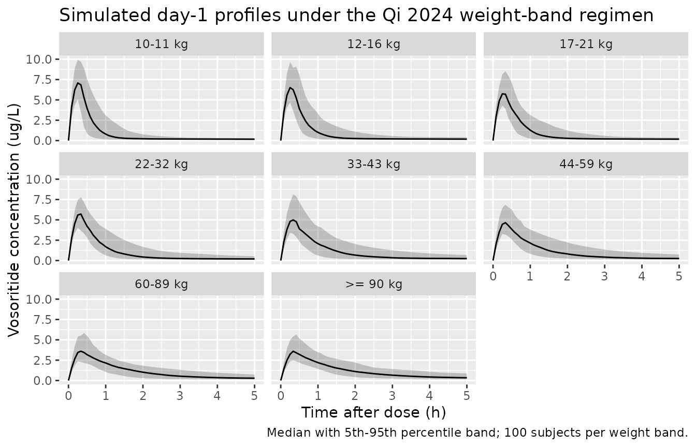
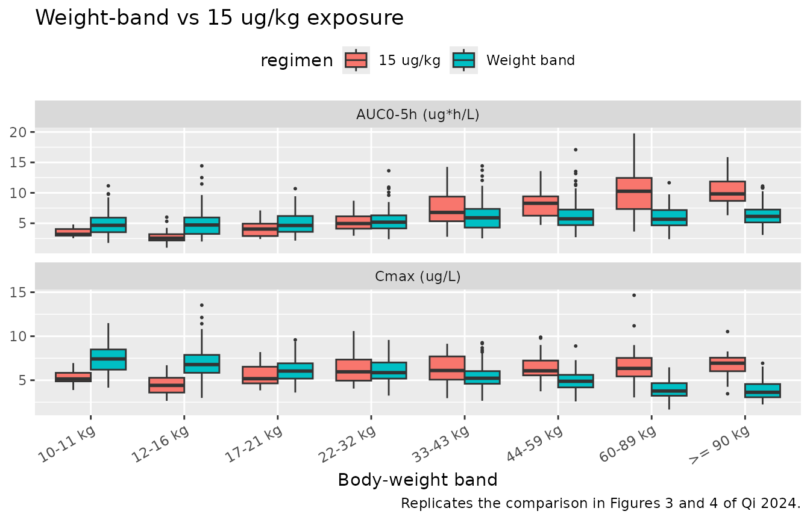

# Vosoritide (Qi 2024)

## Model and source

    #> ℹ parameter labels from comments will be replaced by 'label()'

- Citation: Qi Y, Chan ML, Mould DR, Larimore K, Fisheleva E, Cherukuri
  A, Day J, Savarirayan R, Irving M, Bacino CA, Hoover-Fong J, Ozono K,
  Mohnike K, Wilcox WR, Bober MB, Henshaw J. Development of a
  weight-band dosing approach for vosoritide in children with
  achondroplasia using a population pharmacokinetic model. Clin
  Pharmacokinet. 2024;63(5):707-719. <doi:10.1007/s40262-024-01371-6>

- Description: One-compartment population PK model with first-order
  elimination and change-point first-order absorption (the absorption
  rate constant switches from Ka1 to Ka2 at an estimated time after each
  dose) for subcutaneous vosoritide (BMN 111, a C-type natriuretic
  peptide analog) in children with achondroplasia aged 0.95-15 years,
  pooled from five clinical trials (Qi 2024). Body weight is a power
  covariate on CL/F (exponent 0.356) and on V/F (exponent 1.09), both
  referenced to 20 kg. Relative bioavailability rises exponentially with
  time on treatment and is 56% higher for the 0.2 mg/mL dosing solution
  used only in study 111-202. Study-level random effects nested inside
  the subject-level IIV on CL/F and V/F reproduce the paper’s secondary
  study identity number (SIDN) hierarchy, and separate log-scale
  residual errors are carried for the ELISA and the
  electrochemiluminescence assays. The model was used to derive the
  eight-band weight-band dosing regimen of Qi 2024 Table 6.

- Article: <https://doi.org/10.1007/s40262-024-01371-6>

Vosoritide (BMN 111) is a modified C-type natriuretic peptide analog
approved for children with achondroplasia who have open epiphyses. Qi
2024 pooled the plasma PK from five BioMarin trials to build a
population PK model and used it to replace the original 15 ug/kg
weight-based regimen (17 dose levels between 10 and 83 kg) with an
eight-band fixed-dose regimen.

The structural model is one compartment with first-order elimination and
a **change-point first-order absorption**: the absorption rate constant
is `ka1` (2.21 1/h) while time after dose is below the change-point
(0.31 h) and drops to `ka2` (0.06 1/h) afterwards. NONMEM implemented
the switch with `MTIME`.

### Simulation requirements for this model

Two things are different from a typical `nlmixr2lib` model and both are
consequences of the study-level (nested) random effects:

1.  The event table must carry a `SIDN` column and **at least two
    distinct `SIDN` values**. `rxode2` expands nested random effects
    into per-level terms; with a single level present the expansion
    degenerates and `rxSolve()` fails with
    `The following parameter(s) are required for solving: THETA[1]`.
2.  `omega` must be passed explicitly (`omega = mod$omega`), both
    because `rxSolve()` otherwise reuses the previous solve’s `omega`
    and because the nested `omega` is a *list* of matrices keyed by
    level.

Independently, every `rxSolve()` call here passes `useLinCmt = FALSE`.
`rxode2`’s automatic ODE-to-`linCmt()` conversion would replace the
change-point ODE system with an analytic one-compartment solution
evaluated at record level, which reintroduces the observation-grid
dependence the inline switch exists to avoid.

``` r

mod <- mod_ui
mod_typical <- rxode2::zeroRe(mod)
#> Warning: No sigma parameters in the model

#' Solve an event table with the conventions this model requires.
solve_voso <- function(model, events, keep = character()) {
  stopifnot("SIDN" %in% names(events))
  stopifnot(dplyr::n_distinct(events$SIDN) >= 2L)
  rxode2::rxSolve(
    model,
    events = events,
    keep = keep,
    omega = model$omega,
    useLinCmt = FALSE
  ) |>
    as.data.frame()
}

#' Build dosing + observation records for one subject profile.
#' `cmt = "depot"` for the dose and `cmt = "central"` for observations: both
#' are declared ODE states, so `Cc` is returned as a column at the
#' observation rows without triggering compartment renumbering.
make_profile <- function(id, wt, dose_ug, sidn, times = seq(0, 5, by = 1 / 12),
                         soln02 = 0, elisa = 0) {
  dplyr::bind_rows(
    tibble::tibble(time = 0, amt = dose_ug, evid = 1L, cmt = "depot"),
    tibble::tibble(time = times, amt = NA_real_, evid = 0L, cmt = "central")
  ) |>
    dplyr::mutate(
      id = id, WT = wt, SIDN = sidn,
      FORM_VOSO_SOLN02 = soln02, ELISA = elisa
    ) |>
    dplyr::arrange(time, dplyr::desc(evid))
}
```

## Population

The analysis dataset held 4741 plasma vosoritide concentrations from 158
children with achondroplasia enrolled in five trials (Qi 2024 Table 1):
study 111-202 (NCT02055157, phase II dose-finding, 2.5 / 7.5 / 15 / 30
ug/kg), its extension 111-205 (NCT02724228), the phase III trial 111-301
(NCT03197766, 15 ug/kg), its extension 111-302 (NCT03424018), and the
phase II study 111-206 (NCT03583697) in children 5 years and younger,
which contributed interim data from sentinel patients only.

Children were 0.95-15 years old (mean 8.43) and weighed 9-74.5 kg (mean
23.8, median 22.2). 84 were male and 74 female; 114 White, 28 Asian, 6
Black and 10 Other. Doses actually administered were 2.5 ug/kg/day (6
patients), 7.5 ug/kg/day (12), 15 ug/kg/day (151) and 30 ug/kg/day (11).
Of the initial 6181 observations, 23.3% were excluded, mostly pre-dose
samples that were expected to be non-measurable because vosoritide’s
half-life is short relative to once-daily dosing.

The same information is available programmatically through the model’s
`population` metadata
(`readModelDb("Qi_2024_vosoritide")()$population`).

## Source trace

Every `ini()` entry in `inst/modeldb/specificDrugs/Qi_2024_vosoritide.R`
carries an in-file comment pointing at its source. They are collected
here for review.

| Equation / parameter | Value | Source location |
|----|----|----|
| `CL/F = exp(theta1 + eta1 + eta6) * (WT/20)^theta14` | n/a | Qi 2024 Sect. 2.4 covariate equations |
| `V/F = exp(theta2 + eta2 + eta7) * (WT/20)^theta15` | n/a | Qi 2024 Sect. 2.4 covariate equations |
| `Ka1 = exp(theta5 + eta5)`, `Ka2 = exp(theta6 + eta8)` | n/a | Qi 2024 Sect. 2.4 |
| `Change-point = theta7 + eta9`; Ka = Ka1 if time after dose \< change-point, else Ka2 | n/a | Qi 2024 Sect. 2.4 (NONMEM `MTIME`) |
| `F = exp(theta16 * Time/10000)`, Time = h after starting dose | n/a | Qi 2024 Sect. 2.4 |
| `SD1 = theta8`, `SD2 = theta9` (log-transform-both-sides residual) | n/a | Qi 2024 Sect. 2.4 |
| Reference body weight | 20 kg | Qi 2024 Sect. 2.4 |
| `lcl` (CL/F) | 47.47 L/h | Qi 2024 Table 5 (%SE 1.8); Table 2 reference row |
| `lvc` (V/F) | 17.99 L | Qi 2024 Table 5 (%SE 3.3); Table 2 reference row |
| `lka1` (Ka1) | 2.21 1/h | Qi 2024 Table 5 (%SE 14.7) |
| `lka2` (Ka2) | 0.06 1/h | Qi 2024 Table 5 (%SE 3.8) |
| `lmtime` (change-point) | 0.31 h | Qi 2024 Table 5 (%SE 7.3) |
| `e_wt_cl` | 0.356 | Qi 2024 Table 5 (%SE 25.1); verified against Table 2 |
| `e_wt_vc` | 1.09 | Qi 2024 Table 5 (%SE 8.1); verified against Table 2 |
| `e_form_voso_soln02_fdepot` | log(1.56) | Qi 2024 Table 5 (%SE 15.3); Table 3 |
| `e_time_fdepot` | 0.21 | Qi 2024 Table 5 (%SE 8.1); verified against Table 4 |
| `etalcl` | 0.336^2 = 0.112896 | Qi 2024 Table 5 IIV CL = 33.6 (CV, %) |
| `etalvc` | 0.242^2 = 0.058564 | Qi 2024 Table 5 IIV V = 24.2 (CV, %) |
| `etalmtime` | `fixed(0.05)` | Qi 2024 Table 5 IIV change-point (fixed) = 22.4 |
| `etalcl_study` | 0.257^2 = 0.066049 | Qi 2024 Table 5 IIV study CL = 25.7 (CV, %) |
| `etalvc_study` | 0.012^2 = 0.000144 | Qi 2024 Table 5 IIV study V = 1.2 (CV, %) |
| `expSdElisa` | 0.665 | Qi 2024 Table 5 Residual error 1 = 66.5, footnote a |
| `expSdEcl` | 0.610 | Qi 2024 Table 5 Residual error 2 = 61, footnote b |

## Replicating Qi 2024 Table 2 (weight effect on CL/F and V/F)

Table 2 tabulates the typical CL/F and V/F at 9, 20, 40, 60 and 74.5 kg,
both as absolute values and as a percentage of the 20 kg reference. This
is an exact deterministic check of the two power covariates.

``` r

t2_events <- dplyr::bind_rows(lapply(
  seq_along(c(9, 20, 40, 60, 74.5)),
  function(i) {
    wt <- c(9, 20, 40, 60, 74.5)[i]
    # Two SIDN levels per weight so the nested-eta expansion resolves; with
    # zeroRe() both subjects are identical, and only the first is used.
    dplyr::bind_rows(
      make_profile(2L * i - 1L, wt, 15 * wt, sidn = 1L, times = c(0, 1)),
      make_profile(2L * i, wt, 15 * wt, sidn = 2L, times = c(0, 1))
    ) |>
      dplyr::mutate(WTgroup = wt)
  }
))

t2_sim <- solve_voso(mod_typical, t2_events, keep = "WTgroup")

t2_model <- t2_sim |>
  dplyr::group_by(WTgroup) |>
  dplyr::summarise(cl = dplyr::first(cl), vc = dplyr::first(vc), .groups = "drop") |>
  dplyr::mutate(
    cl_pct = 100 * cl / cl[WTgroup == 20],
    vc_pct = 100 * vc / vc[WTgroup == 20]
  )

t2_published <- tibble::tribble(
  ~WTgroup, ~cl_pub, ~cl_pct_pub, ~vc_pub, ~vc_pct_pub,
  9,        35.72,   75.26,       7.54,    41.88,
  20,       47.47,   100.00,      17.99,   100.00,
  40,       60.75,   127.99,      38.30,   212.87,
  60,       70.18,   147.86,      59.59,   331.18,
  74.5,     75.80,   159.71,      75.45,   419.30
)

t2_published |>
  dplyr::left_join(t2_model, by = "WTgroup") |>
  dplyr::transmute(
    "Body weight (kg)"       = WTgroup,
    "CL/F published (L/h)"   = cl_pub,
    "CL/F model (L/h)"       = round(cl, 2),
    "CL/F published (% ref)" = cl_pct_pub,
    "CL/F model (% ref)"     = round(cl_pct, 2),
    "V/F published (L)"      = vc_pub,
    "V/F model (L)"          = round(vc, 2),
    "V/F published (% ref)"  = vc_pct_pub,
    "V/F model (% ref)"      = round(vc_pct, 2)
  ) |>
  knitr::kable(caption = "Replicates Table 2 of Qi 2024.")
```

| Body weight (kg) | CL/F published (L/h) | CL/F model (L/h) | CL/F published (% ref) | CL/F model (% ref) | V/F published (L) | V/F model (L) | V/F published (% ref) | V/F model (% ref) |
|---:|---:|---:|---:|---:|---:|---:|---:|---:|
| 9.0 | 35.72 | 35.72 | 75.26 | 75.26 | 7.54 | 7.53 | 41.88 | 41.88 |
| 20.0 | 47.47 | 47.47 | 100.00 | 100.00 | 17.99 | 17.99 | 100.00 | 100.00 |
| 40.0 | 60.75 | 60.76 | 127.99 | 127.99 | 38.30 | 38.30 | 212.87 | 212.87 |
| 60.0 | 70.18 | 70.19 | 147.86 | 147.86 | 59.59 | 59.58 | 331.18 | 331.18 |
| 74.5 | 75.80 | 75.81 | 159.71 | 159.71 | 75.45 | 75.43 | 419.30 | 419.30 |

Replicates Table 2 of Qi 2024. {.table}

``` r

# Percentages of the 20 kg reference must reproduce Table 2 to two decimals.
stopifnot(
  all(abs(round(t2_model$cl_pct, 2) - t2_published$cl_pct_pub) < 0.02),
  all(abs(round(t2_model$vc_pct, 2) - t2_published$vc_pct_pub) < 0.02)
)
```

## Replicating Qi 2024 Tables 3 and 4 (relative bioavailability)

Relative bioavailability rises with time on treatment,
`F = exp(0.21 * Time / 10000)` with `Time` in hours since the first dose
(Table 4), and is multiplied by 1.56 when the 0.2 mg/mL dosing solution
is used (Table 3). Both are evaluated directly from the packaged
parameters.

``` r

f_time <- c(0, 1000, 5000, 10000, 15000, 20000, 25000)
theta <- mod$theta

f_tbl <- tibble::tibble(
  "Time after starting dose (h)"     = f_time,
  "Time after starting dose (years)" = round(f_time / 8766, 2),
  "F, model"                         = round(exp(theta[["e_time_fdepot"]] * f_time / 10000), 2),
  "F, Qi 2024 Table 4"               = c(1.00, 1.02, 1.11, 1.23, 1.37, 1.52, 1.69),
  "F at SOLNC 0.2 mg/mL, model"      = round(
    exp(theta[["e_form_voso_soln02_fdepot"]] + theta[["e_time_fdepot"]] * f_time / 10000), 2
  ),
  "F at SOLNC 0.2 mg/mL, Qi 2024 Table 3" = c(1.56, 1.59, 1.73, 1.92, 2.14, 2.37, 2.64)
)

knitr::kable(f_tbl, caption = "Replicates Tables 3 and 4 of Qi 2024.")
```

| Time after starting dose (h) | Time after starting dose (years) | F, model | F, Qi 2024 Table 4 | F at SOLNC 0.2 mg/mL, model | F at SOLNC 0.2 mg/mL, Qi 2024 Table 3 |
|---:|---:|---:|---:|---:|---:|
| 0 | 0.00 | 1.00 | 1.00 | 1.56 | 1.56 |
| 1000 | 0.11 | 1.02 | 1.02 | 1.59 | 1.59 |
| 5000 | 0.57 | 1.11 | 1.11 | 1.73 | 1.73 |
| 10000 | 1.14 | 1.23 | 1.23 | 1.92 | 1.92 |
| 15000 | 1.71 | 1.37 | 1.37 | 2.14 | 2.14 |
| 20000 | 2.28 | 1.52 | 1.52 | 2.37 | 2.37 |
| 25000 | 2.85 | 1.69 | 1.69 | 2.64 | 2.64 |

Replicates Tables 3 and 4 of Qi 2024. {.table}

``` r


stopifnot(
  all(abs(f_tbl[["F, model"]] - f_tbl[["F, Qi 2024 Table 4"]]) <= 0.01),
  all(abs(f_tbl[["F at SOLNC 0.2 mg/mL, model"]] -
            f_tbl[["F at SOLNC 0.2 mg/mL, Qi 2024 Table 3"]]) <= 0.01)
)
```

## Virtual cohort

Individual patient data are not public. Two virtual cohorts are built
over the 10-100 kg range of Qi 2024’s simulation:

- the **weight-band** regimen of Qi 2024 Table 6 (eight fixed doses),
  and
- the **15 ug/kg** per-kg regimen it replaces.

Each of the eight weight bands carries 100 subjects and the 15 ug/kg arm
carries 200, all below the 200-per-arm cap. Body weights are drawn
uniformly inside each band. `SIDN` cycles over the model’s three study
levels.

``` r

set.seed(20240423)

bands <- tibble::tribble(
  ~band,      ~wt_lo, ~wt_hi, ~dose_mg,
  "10-11 kg",  10,     11,     0.24,
  "12-16 kg",  12,     16,     0.28,
  "17-21 kg",  17,     21,     0.32,
  "22-32 kg",  22,     32,     0.40,
  "33-43 kg",  33,     43,     0.50,
  "44-59 kg",  44,     59,     0.60,
  "60-89 kg",  60,     89,     0.70,
  ">= 90 kg",  90,     100,    0.80
)

n_band <- 100L
n_perkg <- 200L

band_events <- dplyr::bind_rows(lapply(seq_len(nrow(bands)), function(i) {
  b <- bands[i, ]
  wts <- stats::runif(n_band, b$wt_lo, b$wt_hi)
  ids <- (i - 1L) * n_band + seq_len(n_band)
  dplyr::bind_rows(lapply(seq_len(n_band), function(j) {
    make_profile(ids[j], wts[j], b$dose_mg * 1000, sidn = (ids[j] %% 3L) + 1L)
  })) |>
    dplyr::mutate(band = b$band, regimen = "Weight band")
}))

#' Which Table 6 weight band does a weight fall into?
band_of <- function(wt) {
  bands$band[max(which(bands$wt_lo <= wt))]
}

perkg_events <- {
  ids <- 10000L + seq_len(n_perkg)
  wts <- stats::runif(n_perkg, 10, 100)
  dplyr::bind_rows(lapply(seq_len(n_perkg), function(j) {
    make_profile(ids[j], wts[j], 15 * wts[j], sidn = (ids[j] %% 3L) + 1L) |>
      dplyr::mutate(band = band_of(wts[j]))
  })) |>
    dplyr::mutate(regimen = "15 ug/kg")
}

events <- dplyr::bind_rows(band_events, perkg_events)
stopifnot(!anyDuplicated(unique(events[, c("id", "time", "evid")])))
stopifnot(dplyr::n_distinct(events$SIDN) >= 2L)
```

## Simulation

``` r

sim <- solve_voso(mod, events, keep = c("band", "regimen", "WT"))
stopifnot(dplyr::n_distinct(sim$id) == dplyr::n_distinct(events$id))
```

The subject-count assertion is deliberate: `rxSolve()` has been observed
to drop subjects silently on large population solves.

## Concentration-time profiles

``` r

sim |>
  dplyr::filter(!is.na(Cc), regimen == "Weight band") |>
  dplyr::mutate(band = factor(band, levels = bands$band)) |>
  dplyr::group_by(band, time) |>
  dplyr::summarise(
    Q05 = stats::quantile(Cc, 0.05),
    Q50 = stats::quantile(Cc, 0.50),
    Q95 = stats::quantile(Cc, 0.95),
    .groups = "drop"
  ) |>
  ggplot(aes(time, Q50)) +
  geom_ribbon(aes(ymin = Q05, ymax = Q95), alpha = 0.25) +
  geom_line() +
  facet_wrap(~band) +
  labs(
    x = "Time after dose (h)", y = "Vosoritide concentration (ug/L)",
    title = "Simulated day-1 profiles under the Qi 2024 weight-band regimen",
    caption = "Median with 5th-95th percentile band; 100 subjects per weight band."
  )
```



The absorption change-point at 0.31 h is visible as the kink at the
peak: below it absorption runs at 2.21 1/h, above it at 0.06 1/h, so the
profile turns over sharply and then declines under the slow-absorption
(flip-flop) tail.

## PKNCA validation

``` r

sim_nca <- sim |>
  dplyr::filter(!is.na(Cc)) |>
  dplyr::select(id, time, Cc, band, regimen)

# Guarantee a time = 0 record per subject; vosoritide is given
# subcutaneously, so the pre-dose concentration is 0.
sim_nca <- dplyr::bind_rows(
  sim_nca,
  sim_nca |>
    dplyr::distinct(id, band, regimen) |>
    dplyr::mutate(time = 0, Cc = 0)
) |>
  dplyr::distinct(id, time, .keep_all = TRUE) |>
  dplyr::arrange(regimen, band, id, time)

conc_obj <- PKNCA::PKNCAconc(sim_nca, Cc ~ time | regimen + band + id)

dose_df <- events |>
  dplyr::filter(evid == 1) |>
  dplyr::select(id, time, amt, band, regimen)

dose_obj <- PKNCA::PKNCAdose(dose_df, amt ~ time | regimen + band + id)

intervals <- data.frame(
  start = 0, end = 5,
  cmax = TRUE, tmax = TRUE, auclast = TRUE
)

nca_res <- PKNCA::pk.nca(
  PKNCA::PKNCAdata(conc_obj, dose_obj, intervals = intervals)
)
```

### Exposure consistency across the weight range

Qi 2024 Figures 3 and 4 make the case for the weight-band regimen by
showing that its simulated AUC and Cmax sit inside the range observed at
15 ug/kg while being more consistent across body weight. The same
contrast is reproduced here.

``` r

nca_df <- as.data.frame(nca_res) |>
  dplyr::filter(PPTESTCD %in% c("cmax", "auclast")) |>
  dplyr::mutate(
    band = factor(band, levels = bands$band),
    PPTESTCD = dplyr::recode(
      PPTESTCD,
      cmax = "Cmax (ug/L)", auclast = "AUC0-5h (ug*h/L)"
    )
  )

ggplot(nca_df, aes(band, PPORRES, fill = regimen)) +
  geom_boxplot(outlier.size = 0.4, position = position_dodge(preserve = "single")) +
  facet_wrap(~PPTESTCD, scales = "free_y", ncol = 1) +
  labs(
    x = "Body-weight band", y = NULL,
    title = "Weight-band vs 15 ug/kg exposure",
    caption = "Replicates the comparison in Figures 3 and 4 of Qi 2024."
  ) +
  theme(axis.text.x = element_text(angle = 30, hjust = 1),
        legend.position = "top")
```



``` r

nca_df |>
  dplyr::group_by(regimen, PPTESTCD) |>
  dplyr::summarise(
    median = stats::median(PPORRES),
    p05 = stats::quantile(PPORRES, 0.05),
    p95 = stats::quantile(PPORRES, 0.95),
    .groups = "drop"
  ) |>
  dplyr::mutate(fold_5_95 = round(p95 / p05, 2)) |>
  dplyr::transmute(
    Regimen = regimen,
    "NCA parameter" = PPTESTCD,
    Median = round(median, 3),
    "5th pctile" = round(p05, 3),
    "95th pctile" = round(p95, 3),
    "95th / 5th" = fold_5_95
  ) |>
  knitr::kable(
    caption = paste(
      "Spread of simulated exposure across the whole 10-100 kg range.",
      "A smaller 95th/5th ratio means more consistent exposure."
    )
  )
```

| Regimen     | NCA parameter     | Median | 5th pctile | 95th pctile | 95th / 5th |
|:------------|:------------------|-------:|-----------:|------------:|-----------:|
| 15 ug/kg    | AUC0-5h (ug\*h/L) |  7.603 |      2.539 |      15.219 |       5.99 |
| 15 ug/kg    | Cmax (ug/L)       |  6.121 |      3.754 |       8.996 |       2.40 |
| Weight band | AUC0-5h (ug\*h/L) |  5.383 |      2.799 |       9.605 |       3.43 |
| Weight band | Cmax (ug/L)       |  5.468 |      2.979 |       8.864 |       2.98 |

Spread of simulated exposure across the whole 10-100 kg range. A smaller
95th/5th ratio means more consistent exposure. {.table
style="width:100%;"}

### Comparison against published NCA

Qi 2024’s Introduction reports the non-compartmental parameters observed
after a single subcutaneous 15 ug/kg dose across two of the pooled
trials: Cmax 4750-7180 pg/mL, AUC from time 0 to the last measurable
concentration 175,000-290,000 pg*min/mL, terminal half-life 21.0-27.9
min, and Tmax 13.8-16.8 min. Converted to this model’s units (1 pg/mL =
0.001 ug/L, 1 pg*min/mL = 1.667e-5 ug*h/L) those become Cmax 4.75-7.18
ug/L, AUClast 2.92-4.83 ug*h/L and Tmax 0.23-0.28 h. The midpoint of
each published range is used as the reference value.

The comparator is the typical-value profile of a 20 kg child (the
model’s reference weight) given 15 ug/kg = 300 ug.

``` r

typ_events <- dplyr::bind_rows(
  make_profile(1L, 20, 300, sidn = 1L, times = seq(0, 5, by = 1 / 60)),
  make_profile(2L, 20, 300, sidn = 2L, times = seq(0, 5, by = 1 / 60))
) |>
  dplyr::mutate(regimen = "15 ug/kg, 20 kg child")

typ_sim <- solve_voso(mod_typical, typ_events, keep = "regimen") |>
  dplyr::filter(id == 1)

typ_nca_conc <- typ_sim |>
  dplyr::filter(!is.na(Cc)) |>
  dplyr::select(id, time, Cc, regimen)

typ_nca_conc <- dplyr::bind_rows(
  typ_nca_conc,
  typ_nca_conc |>
    dplyr::distinct(id, regimen) |>
    dplyr::mutate(time = 0, Cc = 0)
) |>
  dplyr::distinct(id, time, .keep_all = TRUE) |>
  dplyr::arrange(id, time)

typ_dose <- typ_events |>
  dplyr::filter(evid == 1, id == 1) |>
  dplyr::select(id, time, amt, regimen)

typ_nca <- PKNCA::pk.nca(PKNCA::PKNCAdata(
  PKNCA::PKNCAconc(typ_nca_conc, Cc ~ time | regimen + id),
  PKNCA::PKNCAdose(typ_dose, amt ~ time | regimen + id),
  intervals = data.frame(start = 0, end = 5, cmax = TRUE, tmax = TRUE, auclast = TRUE)
))
```

``` r

published <- tibble::tribble(
  ~regimen,                 ~cmax,               ~tmax,               ~auclast,
  "15 ug/kg, 20 kg child",  mean(c(4.75, 7.18)), mean(c(0.23, 0.28)), mean(c(2.92, 4.83))
)

nlmixr2lib::ncaComparisonTable(
  simulated = typ_nca,
  reference = published,
  by = "regimen",
  units = c(cmax = "ug/L", tmax = "h", auclast = "ug*h/L"),
  tolerance_pct = 20
) |>
  knitr::kable(
    caption = paste(
      "Simulated typical-value NCA vs the midpoint of the single-dose",
      "15 ug/kg ranges reported in Qi 2024's Introduction.",
      "* marks a difference greater than 20%."
    ),
    align = c("l", "l", "r", "r", "r")
  )
```

| NCA parameter     | regimen               | Reference | Simulated | % diff |
|:------------------|:----------------------|----------:|----------:|-------:|
| Cmax (ug/L)       | 15 ug/kg, 20 kg child |      5.96 |      5.35 | -10.4% |
| Tmax (h)          | 15 ug/kg, 20 kg child |     0.255 |       0.3 | +17.6% |
| AUClast (ug\*h/L) | 15 ug/kg, 20 kg child |      3.88 |      3.86 |  -0.4% |

Simulated typical-value NCA vs the midpoint of the single-dose 15 ug/kg
ranges reported in Qi 2024’s Introduction. \* marks a difference greater
than 20%. {.table}

Cmax and AUClast fall inside the published ranges. Tmax is pinned at the
absorption change-point (0.31 h), a little later than the observed
0.23-0.28 h window; the paper itself notes that the model underestimates
Cmax relative to the observed data (Sect. 3.4 and Discussion
limitations), which is the same structural feature seen from the other
side.

Terminal half-life is deliberately not compared. With `ka2` (0.06 1/h)
far below `kel` (`CL/F / (V/F)` = 2.64 1/h at 20 kg) the model is in
flip-flop, so a terminal slope taken from the model’s tail reflects the
slow absorption phase (t-half about 11.6 h) rather than the 21-28 min
disposition half-life that the sampling window of the source studies
captured.

## Assumptions and deviations

- **Scale of the Table 5 “(CV, %)” column.** Table 5 reports every
  variability term under one “(CV, %)” heading without saying whether
  the number is `100 * sqrt(omega^2)` or an exact log-normal CV. The
  change-point row settles it: it is the only *fixed* variance in the
  table (22.4, %SE 0, bootstrap NE), and `100 * sqrt(0.05) = 22.36`
  rounds to 22.4 for a round fixed `omega^2` of 0.05, whereas the exact
  log-normal back-transform `100 * sqrt(exp(0.05) - 1) = 22.6` does not
  match. Every percentage in Table 5 is therefore read here as
  `100 x SD` on the parameter’s own scale, so `omega^2 = (CV/100)^2` and
  the residual SDs are `CV/100`. That reading also agrees with the
  paper’s own equations, which name the residual quantities standard
  deviations (`SD1 = theta8`, `SD2 = theta9`) rather than CVs. Under the
  alternative `omega^2 = log(1 + CV^2)` convention the IIV variances
  would be up to 6% smaller and the residual SDs would be 0.605 and
  0.562.
- **Change-point parameterisation.** Qi 2024 prints
  `Change-point = theta7 + eta9`, i.e. an additive random effect. Taken
  literally together with the fixed 22.4% variability that is an
  additive SD of 0.224 h on a 0.31 h change-point, a 72% relative spread
  that would be negative for roughly 8% of subjects. The model file
  encodes the change-point log-normally (`lmtime` with
  `etalmtime ~ fixed(0.05)`), which reproduces the reported 22.4% spread
  (SD 0.0693 h vs 0.0694 h for the additive reading), guarantees
  positivity, and matches the log-scale parameterisation used for every
  other structural parameter in the paper.
- **SOLNC effect is not in the printed F equation.** The Sect. 2.4
  equation gives only `F = exp(theta16 * Time/10000)`. The 1.56
  multiplier for the 0.2 mg/mL solution comes from Table 5 and is
  confirmed by Table 3, whose 0.2 mg/mL column is exactly 1.56 times the
  Table 4 time-only column at every tabulated time.
- **IIV on Ka1 and Ka2 is not carried.** The Sect. 2.4 equations show
  `eta5` on Ka1 and `eta8` on Ka2, but Sect. 3.2 states the model
  “accounted for the IIV in CL/F, V/F, and change-point” and Table 5 has
  no Ka IIV rows, so those two etas were not estimated. Ka1 and Ka2 are
  typical-value only here.
- **Study-level random effects.** `SIDN` is deliberately an opaque
  integer grouping column. Qi 2024 states there were only three SIDN
  values in the database but does not say which trials map to which
  value, so no mapping from study identifier to SIDN level is asserted.
  Note that Qi 2024’s own simulations were run “with only one SIDN
  instead of the three SIDNs present in the model” (Sect. 3.4), which
  the paper offers as one explanation for the simulated Cmax percentiles
  being narrower than observed.
- **Baseline vs time-varying weight.** Qi 2024 tested both baseline and
  time-varying weight. The paper does not state which the final model
  used, so `WT` is supplied as a single per-subject value in this
  vignette; either can be passed.
- **Bioavailability grows without bound.**
  `F = exp(0.21 * Time / 10000)` has no plateau, so long simulations
  produce increasingly large relative bioavailability (1.69 at 2.85
  years, Table 4). This is faithful to the published model. Qi 2024
  cautions in the Discussion that this relationship was informed by a
  single study (111-205) and that “additional analysis is needed to
  fully evaluate the relationship between treatment duration and F”.
- **Virtual cohort.** Body weights are drawn uniformly inside each Table
  6 weight band rather than from the trial weight distribution, which is
  not published at that granularity. The \>= 90 kg band is capped at 100
  kg, matching the 10-90 kg range Qi 2024 simulated.
- **Assay indicator.** All simulations here use `ELISA = 0` (the
  electrochemiluminescence assay used in studies 111-206, 111-301 and
  111-302, and the one relevant to the weight-band simulation).
