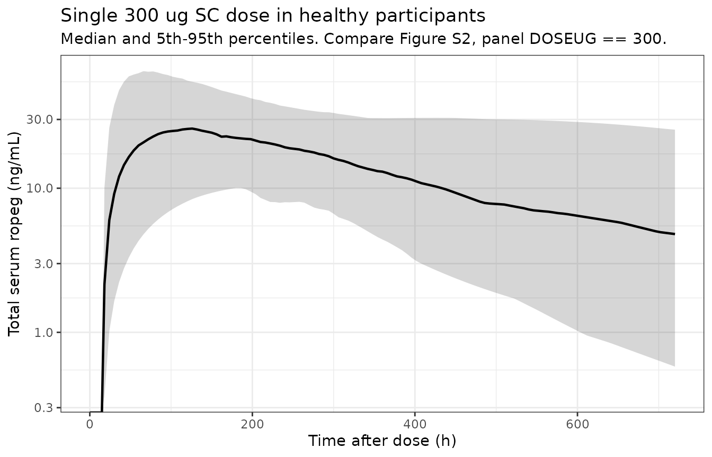
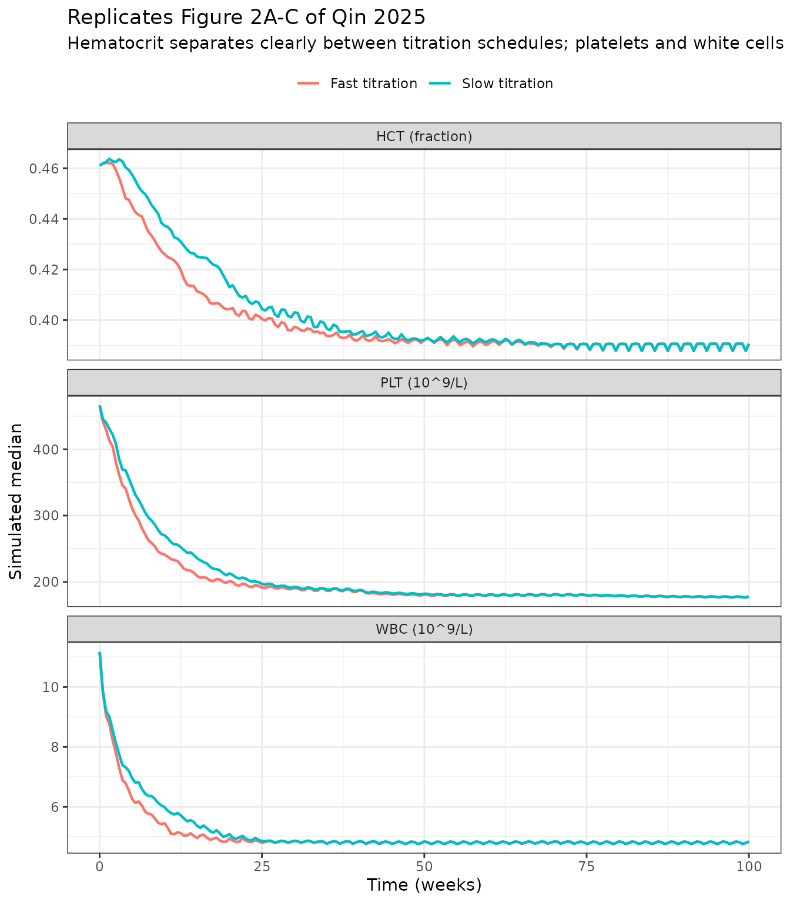
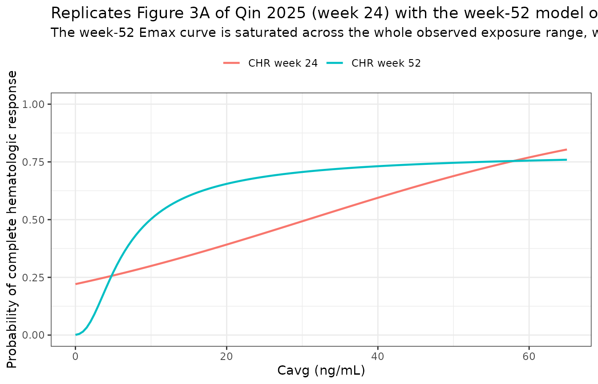
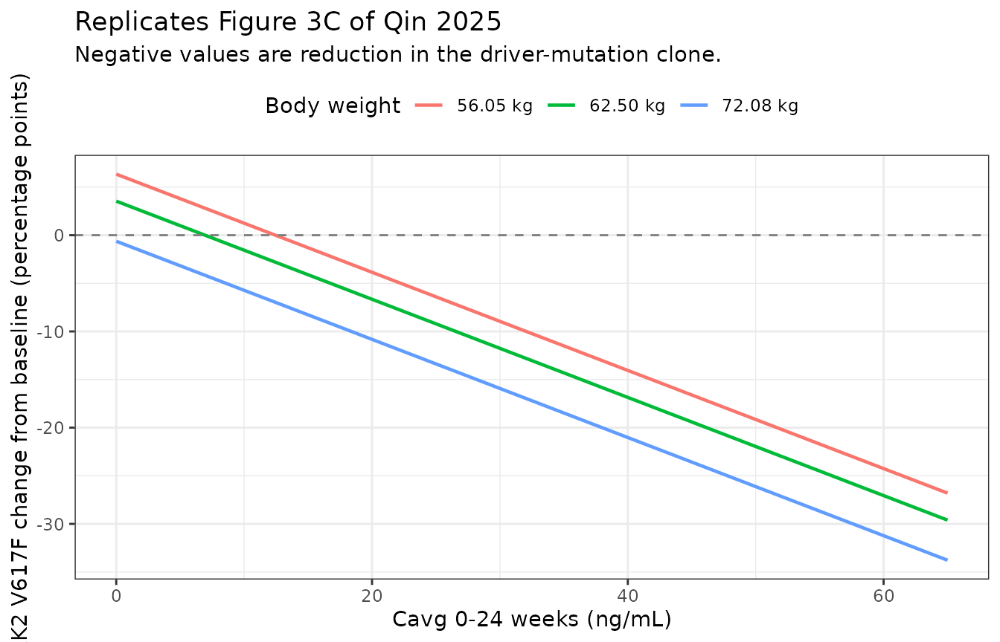
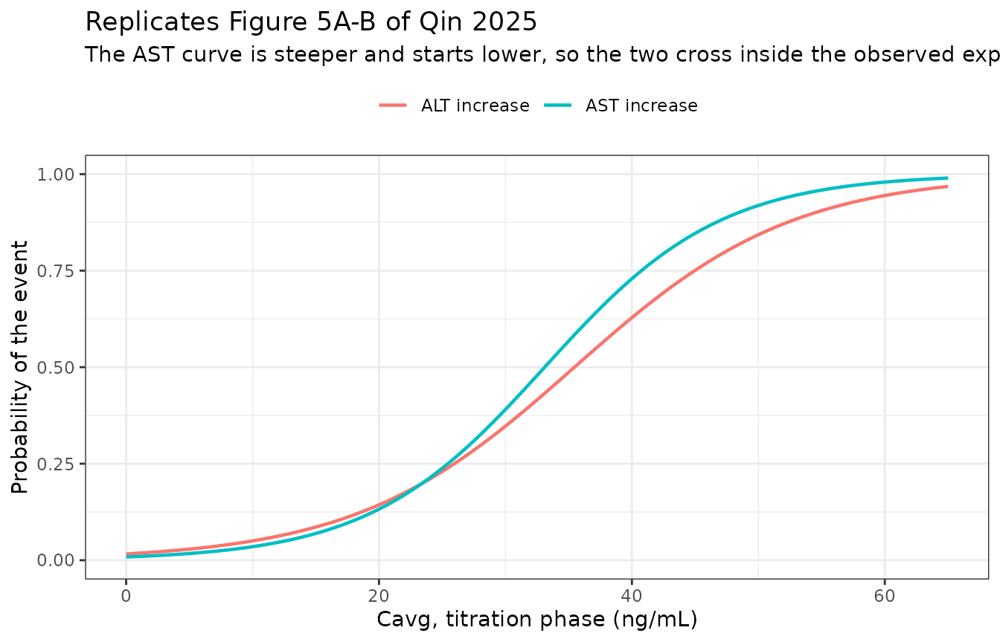
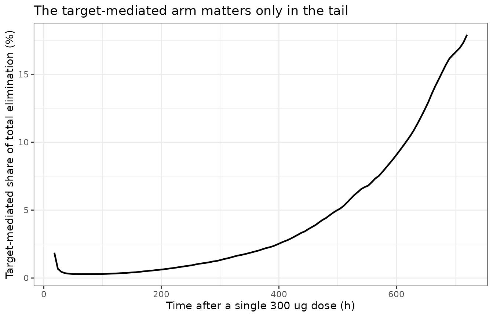

# Ropeginterferon alfa-2b (Qin 2025)

## Model and source

- Citation: Qin A, Shimoda K, Suo S, Fu R, Kirito K, Wu D, Liao J, Chen
  H, Wu L, Su X, Gao Y, Sato T, Li Y, Zhang J, Shen W, Wang W, Zhang L,
  Jin J, Komatsu N. Population pharmacokinetics-pharmacodynamics and
  exposure-response of ropeginterferon alfa-2b in Chinese and Japanese
  patients with polycythemia vera. Pharmacol Res Perspect.
  2025;13(3):e70109. <doi:10.1002/prp2.70109>.
- Article (open access): <https://doi.org/10.1002/prp2.70109>
- Supporting Information (Figures S1-S7 and Table S1, one DOCX):
  available from the article landing page and from Europe PMC as
  `PRP2-13-e70109-s001.docx` under PMC12046122.

Qin 2025 is a single paper carrying **eleven** separately fitted models.
Ten of them are packaged here; the eleventh is described under [Not yet
packaged](#not-yet-packaged).

| Model | [`modellib()`](https://nlmixr2.github.io/nlmixr2lib/reference/modellib.md) name | Source |
|----|----|----|
| Population PK (quasi-equilibrium TMDD) | `Qin_2025_ropeginterferon` | Table 2, Figure 1A |
| PK-PD, hematocrit | `Qin_2025_ropeginterferon_hct` | Table 3 (HCT), Figure 1B |
| PK-PD, platelet count | `Qin_2025_ropeginterferon_plt` | Table 3 (PLT), Figure 1C |
| PK-PD, white blood cell count | `Qin_2025_ropeginterferon_wbc` | Table 3 (WBC), Figure 1C |
| E-R, complete hematologic response at week 24 | `Qin_2025_ropeginterferon_chr_week24` | Table 4, Equation (3) |
| E-R, complete hematologic response at week 52 | `Qin_2025_ropeginterferon_chr_week52` | Table 4, Equation (4) |
| E-R, JAK2 V617F change at week 24 | `Qin_2025_ropeginterferon_jak2_week24` | Table 4, Equation (5) |
| E-R, JAK2 V617F change at week 52 | `Qin_2025_ropeginterferon_jak2_week52` | Table 4, Equation (5) |
| E-R, titration-phase ALT increase | `Qin_2025_ropeginterferon_alt_increase` | Results 3.4, Equation (3) |
| E-R, titration-phase AST increase | `Qin_2025_ropeginterferon_ast_increase` | Results 3.4, Equation (3) |

``` r

mod_pk   <- rxode2::rxode(readModelDb("Qin_2025_ropeginterferon"))
mod_hct  <- rxode2::rxode(readModelDb("Qin_2025_ropeginterferon_hct"))
mod_plt  <- rxode2::rxode(readModelDb("Qin_2025_ropeginterferon_plt"))
mod_wbc  <- rxode2::rxode(readModelDb("Qin_2025_ropeginterferon_wbc"))
mod_chr24 <- rxode2::rxode(readModelDb("Qin_2025_ropeginterferon_chr_week24"))
mod_chr52 <- rxode2::rxode(readModelDb("Qin_2025_ropeginterferon_chr_week52"))
mod_jak24 <- rxode2::rxode(readModelDb("Qin_2025_ropeginterferon_jak2_week24"))
mod_jak52 <- rxode2::rxode(readModelDb("Qin_2025_ropeginterferon_jak2_week52"))
mod_alt  <- rxode2::rxode(readModelDb("Qin_2025_ropeginterferon_alt_increase"))
mod_ast  <- rxode2::rxode(readModelDb("Qin_2025_ropeginterferon_ast_increase"))
```

## Population

Ropeginterferon alfa-2b (ropeg) is a mono-PEGylated interferon alfa-2b
approved for polycythaemia vera (PV) by the EMA in 2019, the FDA in
2021, and in Japan and China thereafter. The population PK analysis
pools **four** studies and 126 participants; the PK-PD and
exposure-response analyses use only the 78 PV patients.

| Study | n | Population | Regimen |
|----|----|----|----|
| A17-101 (CTR20190451) | 18 | Healthy Chinese adults | Single SC dose, 90-270 ug |
| A17-102 (NCT03546465) | 30 | Healthy Japanese (and Caucasian) adults | Single SC dose, 100-300 ug |
| A19-201 (NCT04182100) | 29 | Japanese patients with PV | SC q2w, **slow titration**: start 100 ug (50 ug if on prior cytoreductive therapy), +50 ug q2w to a 500 ug maximum |
| A20-202 (NCT05485948) | 49 | Chinese patients with PV, hydroxyurea-resistant or -intolerant | SC q2w, **fast titration**: 250 ug at week 0, 350 ug at week 2, 500 ug from week 4 |

Pooled baseline characteristics (Qin 2025 Table 1, “Overall” column, n =
126): median age 43.5 years (21.0-72.0), median weight 62.8 kg
(43.6-91.0), median BMI 23.1 kg/m^2 (17.4-32.2), 47/126 (37.3%) female.
Median baseline JAK2 V617F allele burden is 77.8% in A19-201 and 61.2%
in A20-202; the healthy cohorts are 0% by construction.

The pooled BMI median of **23.1 kg/m^2** is load-bearing: it is the
centring constant of the only covariate in the model.

``` r

pk_pop <- mod_pk$meta$population
tibble::tibble(
  Field = names(pk_pop),
  Value = vapply(pk_pop, function(x) paste(format(x), collapse = "; "), character(1))
) |>
  knitr::kable(caption = "Population metadata carried by the population PK model.")
```

| Field | Value |
|:---|:---|
| species | human |
| n_subjects | 126 |
| n_studies | 4 |
| n_observations | not reported as a record count; PK sampling was pre-dose and 1, 3, 6, 9, 12, 24, 36, 48, 72, 96, 120, 144, 168, 192, 240, 288, 336, 504 and 672 h post-dose in both phase I studies, and weeks 0 and 28 (A19-201) or weeks 0 and 12 (A20-202) pre-dose plus 48, 96 and 168 h post-dose with trough concentrations at every visit in the phase II studies |
| age_range | median 43.5 years, range 21.0-72.0 pooled (Qin 2025 Table 1, Overall); healthy phase I median 27.0-30.0 years, PV phase II median 54.0-56.0 years |
| weight_range | median 62.8 kg, range 43.6-91.0 (Qin 2025 Table 1, Overall) |
| bmi_range | median 23.1 kg/m^2, range 17.4-32.2 (Qin 2025 Table 1, Overall); this median is the centring value of the clearance covariate model |
| sex_female_pct | 37.3 |
| race_ethnicity | Chinese (A17-101 n = 18 healthy; A20-202 n = 49 PV) and Japanese (A19-201 n = 29 PV); A17-102 enrolled 30 healthy Japanese and Caucasian participants. Qin 2025 Methods 2.1: ‘Only participants from Japan and China who were administered ropeg were included in the analyses.’ |
| disease_state | 48 healthy volunteers and 78 patients with polycythaemia vera. All A20-202 patients and all but two A19-201 patients carried the JAK2 V617F driver mutation; A20-202 enrolled patients resistant to or intolerant of hydroxyurea. Baseline JAK2 V617F allele burden median 77.8% (A19-201) and 61.2% (A20-202) |
| dose_range | phase I single subcutaneous doses of 90-270 ug (A17-101) and 100-300 ug (A17-102); phase II subcutaneous doses every 2 weeks, A19-201 starting at 100 ug (or 50 ug on prior cytoreductive therapy) titrated in 50 ug steps to a 500 ug maximum (slow titration) and A20-202 starting at 250 ug with titration to 350 ug at week 2 and 500 ug from week 4 (fast titration) |
| regions | China (A17-101, A20-202) and Japan (A17-102, A19-201); A17-102 also enrolled Caucasian participants who were excluded from these analyses |
| trial_registration | A17-102 NCT03546465; A19-201 NCT04182100; A20-202 NCT05485948; A17-101 CTR20190451 (chinadrugtrials.org.cn) |
| notes | Ropeginterferon alfa-2b is approved for polycythaemia vera by the EMA (2019), the FDA (2021) and in Japan (2023) and China. The pooled analysis set spans a 10-fold single-dose range in healthy participants and up to 100 weeks of every-2-week dosing in patients, which is what identifies both the linear and the target-mediated elimination arms. All fixed and random effects were estimated with relative standard errors below 15% (Qin 2025 Results 3.2.1). |

Population metadata carried by the population PK model. {.table}

## Errata and unit reconciliation

### The published rate constants are per DAY, not per hour

Qin 2025 Table 2 labels `CL` as `L h-1` and `Ka`, `kint`, `kdeg` and
`kdec` as `h-1`; Table 3 labels `ktr`, `kout,P` and `kout,W` as `h-1`.
**Those unit labels are wrong. Every one of those values is per day.**
All ten packaged models therefore declare `units$time = "day"` and use
the printed values unchanged; nothing is rescaled, only relabelled.

Four pieces of evidence, three of them mutually independent:

1.  **The paper contradicts its own tables.** Methods 2.4.1 states that
    `kdec` is “in day-1” and that `kout` is “in day-1”, while Tables 2
    and 3 label the same two parameters `h-1`.
2.  **Tmax.** Read per day, `ka = 0.18` and
    `kel = CL/Vc = 0.753/3.29 = 0.2289` give
    `Tmax = ln(ka/kel)/(ka - kel) = 4.91 d = 118 h`, and because
    `ka < kel` the terminal half-life is the flip-flop
    `ln(2)/ka = 92 h`. Every single-dose panel of the supplementary PK
    visual predictive check (Figure S2, stratified by dose) peaks at
    100-150 h after dose. Read per hour the same algebra gives
    `Tmax = 4.9 HOURS`, which Figure S2 excludes outright.
3.  **Cmax.** A single 300 ug dose gives 29.6 ng/mL under the day
    reading; the Figure S2 `DOSEUG == 300` panel peaks at 25-30 ng/mL.
4.  **Cavg.** `Dose/(CL*tau)` for 500 ug q2w is 47.4 ng/mL under the day
    reading, and 19.9 ng/mL for the roughly 210 ug average dose of the
    slow-titration arm. Figure 3 puts the observed median `Cavg,0-24W`
    at about 37.5 ng/mL (A20-202, fast titration) and about 20 ng/mL
    (A19-201, slow titration). Read per hour, 500 ug every 336 h gives
    **1.98 ng/mL**, a 20-fold miss.

``` r

ka <- 0.18; cl <- 0.753; vc <- 3.29
day <- tibble::tibble(
  Quantity = c("Tmax (h)", "Terminal t1/2 (h)", "Cavg, 500 ug q2w (ng/mL)"),
  `Per-day reading` = c(
    24 * log(ka / (cl / vc)) / (ka - cl / vc),
    24 * log(2) / min(ka, cl / vc),
    500 / (cl * 14)),
  `Per-hour reading` = c(
    log(ka / (cl / vc)) / (ka - cl / vc),
    log(2) / min(ka, cl / vc),
    500 / (cl * 336)),
  `Observed (Figures S2, 3)` = c("100-150", "roughly 100", "about 37.5 at 500 ug q2w")
)
knitr::kable(day, digits = 2,
             caption = paste(
               "Only the per-day reading reproduces the published figures.",
               "The per-hour reading misses Tmax by a factor of 24 and Cavg by",
               "a factor of 20."))
```

| Quantity | Per-day reading | Per-hour reading | Observed (Figures S2, 3) |
|:---|---:|---:|:---|
| Tmax (h) | 117.96 | 4.91 | 100-150 |
| Terminal t1/2 (h) | 92.42 | 3.85 | roughly 100 |
| Cavg, 500 ug q2w (ng/mL) | 47.43 | 1.98 | about 37.5 at 500 ug q2w |

Only the per-day reading reproduces the published figures. The per-hour
reading misses Tmax by a factor of 24 and Cavg by a factor of 20.
{.table}

``` r


# The day reading must land inside the Figure S2 Tmax window and within 25% of
# the Figure 3 fast-titration Cavg; the hour reading must fail both.
tmax_day  <- 24 * log(ka / (cl / vc)) / (ka - cl / vc)
tmax_hour <- log(ka / (cl / vc)) / (ka - cl / vc)
stopifnot(
  tmax_day > 100, tmax_day < 150,
  tmax_hour < 10,
  abs(500 / (cl * 14) / 47.4 - 1) < 0.01,
  500 / (cl * 336) < 5
)
```

### Absorption lag time and TSTART

Table 2 prints the absorption lag time as `0.62` labelled `(h)` and
`TSTART` as `7` labelled `(h)`. Both are carried here in **days**, for
internal consistency with the rate constants above. The choice is
numerically immaterial for the lag: Tmax is about 118 h, so moving the
lag between 0.62 h and 0.62 d shifts Cmax and AUC by well under 1%. It
is also immaterial for `TSTART`, because the binding capacity it gates
declines with a 27-day half-life (`ln(2)/0.0255 = 27.2 days`), against
which 7 h and 7 d are indistinguishable.

### Discussion-versus-Table conflict for platelets and white cells

Qin 2025’s Discussion restates the PK-PD parameters. For hematocrit it
agrees with Table 3 to every printed digit (initial 45.9%, equilibrium
48.9%, Imax 59.2%, IC50 137 ng/mL). For platelets and white cells it
does not:

| Endpoint | Quantity    | Table 3 (used here) | Discussion |
|----------|-------------|---------------------|------------|
| PLT      | Initial     | 477                 | 463        |
| PLT      | Equilibrium | 332                 | 351        |
| PLT      | IC50        | 72.4                | 61.9       |
| WBC      | Initial     | 11.4                | 12.1       |
| WBC      | Equilibrium | 6.72                | 7.32       |
| WBC      | IC50        | 152                 | 124        |

**Table 3 is used**, because it is the designated parameter-estimates
table and carries relative standard errors, and because the Discussion
paragraph is demonstrably degraded: it labels the platelet and
white-cell quantities with the **hematocrit** subscript H (`kin,H`,
`IC50,H`) in all three paragraphs. Where that subscript is correct, the
two agree exactly.

### Other reporting artefacts

- **Table 1 hematocrit, A20-202 column** reads `45.7 [0.421, 64.1]`: a
  median on the per-cent scale against a range that mixes the fraction
  and per-cent scales. The model’s hematocrit is a **fraction** (HCT0 =
  0.459), which the A19-201 column (`0.459 [0.356, 0.539]`) and the
  Table 3 estimates confirm.
- **Table 3 unit labels** give `PLTss`, `PLT0`, `WBCss` and `WBC0` as
  `10^9 L-1 day-1`, a rate. They are counts (`10^9 L-1`); only `kin`,
  which the table does not report, carries the `day-1`.
- **Covariance versus correlation.** Table 3’s rows “Covariance of IIV_X
  and IIV_IC50” are taken at face value as covariances. All three are
  admissible as such (implied correlations -0.873, -0.698, -0.500); the
  check is in the `ini()` block of each PK-PD model.

## Source trace

Every equation and every `ini()` value, with its source location.

``` r

trace <- tibble::tribble(
  ~Component, ~Value, ~Source,
  "PK: depot -> serum, first-order with lag", "Ka, ALAG", "Figure 1A schematic",
  "PK: linear elimination on free drug", "CL/Vc", "Figure 1A schematic",
  "PK: quasi-equilibrium binding, complex internalised", "KD, kint, kdeg, ksyn", "Figure 1A schematic",
  "PK: ksyn = kdeg * Rtot, Rtot decays Rtot0 -> Rtot,SS after TSTART in patients", "kdec", "Methods 2.4.1 (prose)",
  "PK: continuous covariate model P_i = P_TV*(COV/COV_med)^theta", "e_bmi_cl", "Equation (1)",
  "Ka (1/day)", "0.18 (RSE 1.04%)", "Table 2",
  "Absorption lag (day)", "0.62 (RSE 0.421%)", "Table 2",
  "CL (L/day)", "0.753 (RSE 0.846%)", "Table 2",
  "Vc (L)", "3.29 (RSE 1.03%)", "Table 2",
  "Rtot0 (ng/mL)", "0.317 (RSE 0.904%)", "Table 2",
  "Rtot,SS (ng/mL)", "0.012 (RSE 0.997%)", "Table 2",
  "kint (1/day)", "0.0223 (RSE 0.88%)", "Table 2",
  "kdeg (1/day)", "0.51 (RSE 0.576%)", "Table 2",
  "KD (ng/mL)", "0.0662 (RSE 0.981%)", "Table 2",
  "kdec (1/day)", "0.0255 (RSE 0.892%)", "Table 2",
  "TSTART (day)", "7 (FIX)", "Table 2",
  "BMI effect on CL", "0.813 (RSE 9.39%)", "Table 2",
  "PK IIV (CV%): Ka/CL/Vc/Rtot0/kint", "69.9 / 35.3 / 94.6 / 272 / 125", "Table 2",
  "PK RUV: proportional / additive", "19.7% / 0.542 ng/mL", "Table 2",
  "HCT: dTransit/dt = kin*(1 - Imax*Cs/(IC50+Cs)) - ktr*Transit; dHCT/dt = ktr*(Transit - HCT)", "-", "Figure 1B (printed ODEs)",
  "HCT0 / HCTss / IC50 / Imax / ktr", "0.459 / 0.489 / 137 / 0.592 / 0.023", "Table 3 (HCT)",
  "HCT IIV (CV%) HCTss/IC50/ktr/HCT0; cov(HCTss,IC50)", "20 / 430 / 113 / 10.4; -0.298", "Table 3 (HCT)",
  "HCT RUV proportional", "4.09%", "Table 3 (HCT)",
  "PLT and WBC: dX/dt = kin*(1 - Imax*Cs/(IC50+Cs)) - kout*X", "-", "Figure 1C (printed ODEs)",
  "PLT0 / PLTss / IC50,P / Imax,P / kout,P", "477 / 332 / 72.4 / 1 (FIX) / 0.0299", "Table 3 (PLT)",
  "PLT IIV (CV%) PLTss/IC50/kout/PLT0; cov", "67.6 / 162 / 135 / 58.9; -0.486", "Table 3 (PLT)",
  "PLT RUV proportional", "12.1%", "Table 3 (PLT)",
  "WBC0 / WBCss / IC50,W / Imax,W / kout,W", "11.4 / 6.72 / 152 / 1 (FIX) / 0.0475", "Table 3 (WBC)",
  "WBC IIV (CV%) WBCss/IC50/kout/WBC0; cov", "47.4 / 102 / 131 / 62.5; -0.190", "Table 3 (WBC)",
  "WBC RUV proportional", "16%", "Table 3 (WBC)",
  "Hill coefficient tested and REJECTED for all three endpoints", "dOFV 0.016 (HCT), 5.654 (WBC), -35.489 (PLT)", "Results 3.2.2",
  "E-R logistic, linear: logit(P) = b0 + b1*Exposure + bT*X", "-", "Equation (3)",
  "E-R logistic, Emax: logit(P) = E0 + Emax*E/(EC50+E) + bT*X", "-", "Equation (4)",
  "E-R regression, linear: Y = b0 + b1*Exposure + bT*X", "-", "Equation (5)",
  "CHR week 24: b0 / b1", "-1.2614 (SE 0.6525) / 0.0411 (SE 0.0187)", "Table 4",
  "CHR week 52: E0 / Emax / EC50", "-7 (FIX) / 8.397 (SE 0.665) / 1.98 (SE 2.472)", "Table 4",
  "JAK2 week 24: b0 / b_exposure / b_weight", "30.728 (SE 11.601) / -0.51 (SE 0.141) / -0.435 (SE 0.169)", "Table 4",
  "JAK2 week 52: b0 / b_exposure", "-8.528 (SE 7.812) / -0.43 (SE 0.194)", "Table 4",
  "ALT increase: b0 / b_exposure", "-4.099 (SE 0.9843) / 0.1156 (SE 0.0399)", "Results 3.4 (running text)",
  "AST increase: b0 / b_exposure", "-4.75194 (SE 1.123) / 0.143564 (SE 0.0453)", "Results 3.4 (running text)"
)
knitr::kable(trace, caption = "Source trace for every model equation and parameter.")
```

| Component | Value | Source |
|:---|:---|:---|
| PK: depot -\> serum, first-order with lag | Ka, ALAG | Figure 1A schematic |
| PK: linear elimination on free drug | CL/Vc | Figure 1A schematic |
| PK: quasi-equilibrium binding, complex internalised | KD, kint, kdeg, ksyn | Figure 1A schematic |
| PK: ksyn = kdeg \* Rtot, Rtot decays Rtot0 -\> Rtot,SS after TSTART in patients | kdec | Methods 2.4.1 (prose) |
| PK: continuous covariate model P_i = P_TV\*(COV/COV_med)^theta | e_bmi_cl | Equation (1) |
| Ka (1/day) | 0.18 (RSE 1.04%) | Table 2 |
| Absorption lag (day) | 0.62 (RSE 0.421%) | Table 2 |
| CL (L/day) | 0.753 (RSE 0.846%) | Table 2 |
| Vc (L) | 3.29 (RSE 1.03%) | Table 2 |
| Rtot0 (ng/mL) | 0.317 (RSE 0.904%) | Table 2 |
| Rtot,SS (ng/mL) | 0.012 (RSE 0.997%) | Table 2 |
| kint (1/day) | 0.0223 (RSE 0.88%) | Table 2 |
| kdeg (1/day) | 0.51 (RSE 0.576%) | Table 2 |
| KD (ng/mL) | 0.0662 (RSE 0.981%) | Table 2 |
| kdec (1/day) | 0.0255 (RSE 0.892%) | Table 2 |
| TSTART (day) | 7 (FIX) | Table 2 |
| BMI effect on CL | 0.813 (RSE 9.39%) | Table 2 |
| PK IIV (CV%): Ka/CL/Vc/Rtot0/kint | 69.9 / 35.3 / 94.6 / 272 / 125 | Table 2 |
| PK RUV: proportional / additive | 19.7% / 0.542 ng/mL | Table 2 |
| HCT: dTransit/dt = kin*(1 - Imax*Cs/(IC50+Cs)) - ktr*Transit; dHCT/dt = ktr*(Transit - HCT) | \- | Figure 1B (printed ODEs) |
| HCT0 / HCTss / IC50 / Imax / ktr | 0.459 / 0.489 / 137 / 0.592 / 0.023 | Table 3 (HCT) |
| HCT IIV (CV%) HCTss/IC50/ktr/HCT0; cov(HCTss,IC50) | 20 / 430 / 113 / 10.4; -0.298 | Table 3 (HCT) |
| HCT RUV proportional | 4.09% | Table 3 (HCT) |
| PLT and WBC: dX/dt = kin*(1 - Imax*Cs/(IC50+Cs)) - kout\*X | \- | Figure 1C (printed ODEs) |
| PLT0 / PLTss / IC50,P / Imax,P / kout,P | 477 / 332 / 72.4 / 1 (FIX) / 0.0299 | Table 3 (PLT) |
| PLT IIV (CV%) PLTss/IC50/kout/PLT0; cov | 67.6 / 162 / 135 / 58.9; -0.486 | Table 3 (PLT) |
| PLT RUV proportional | 12.1% | Table 3 (PLT) |
| WBC0 / WBCss / IC50,W / Imax,W / kout,W | 11.4 / 6.72 / 152 / 1 (FIX) / 0.0475 | Table 3 (WBC) |
| WBC IIV (CV%) WBCss/IC50/kout/WBC0; cov | 47.4 / 102 / 131 / 62.5; -0.190 | Table 3 (WBC) |
| WBC RUV proportional | 16% | Table 3 (WBC) |
| Hill coefficient tested and REJECTED for all three endpoints | dOFV 0.016 (HCT), 5.654 (WBC), -35.489 (PLT) | Results 3.2.2 |
| E-R logistic, linear: logit(P) = b0 + b1*Exposure + bT*X | \- | Equation (3) |
| E-R logistic, Emax: logit(P) = E0 + Emax*E/(EC50+E) + bT*X | \- | Equation (4) |
| E-R regression, linear: Y = b0 + b1*Exposure + bT*X | \- | Equation (5) |
| CHR week 24: b0 / b1 | -1.2614 (SE 0.6525) / 0.0411 (SE 0.0187) | Table 4 |
| CHR week 52: E0 / Emax / EC50 | -7 (FIX) / 8.397 (SE 0.665) / 1.98 (SE 2.472) | Table 4 |
| JAK2 week 24: b0 / b_exposure / b_weight | 30.728 (SE 11.601) / -0.51 (SE 0.141) / -0.435 (SE 0.169) | Table 4 |
| JAK2 week 52: b0 / b_exposure | -8.528 (SE 7.812) / -0.43 (SE 0.194) | Table 4 |
| ALT increase: b0 / b_exposure | -4.099 (SE 0.9843) / 0.1156 (SE 0.0399) | Results 3.4 (running text) |
| AST increase: b0 / b_exposure | -4.75194 (SE 1.123) / 0.143564 (SE 0.0453) | Results 3.4 (running text) |

Source trace for every model equation and parameter. {.table}

## Virtual cohort and simulation

Two cohorts of 150 participants each: a healthy phase I cohort for the
single-dose pharmacokinetics, and **one** polycythaemia vera cohort that
is put through *both* titration schedules. `DIS_HEALTHY` is 1 for the
healthy cohort and 0 for the PV cohort, which is what switches the
chronic target down-regulation on and off.

Using a single PV cohort for both schedules, and re-seeding immediately
before each solve so the two arms draw the same random effects, is not a
convenience: it is what Qin 2025 did, and it is what makes the
fast-versus-slow contrast interpretable. Results 3.2.3: “we simulated
the PK-PD relationships for patients in the slow- and fast-dose
titration regimens, and the difference between the two titration
regimens was compared for each participant. This model can exclude the
influence of interference factors, including inter-individual and
inter-trial differences.” Two independently drawn cohorts would confound
the schedule difference with the covariate and random-effect difference
between them.

``` r

n_sub <- 150L

rxode2::rxSetSeed(20250501)
draw_cohort <- function(n, wt_med, wt_lo, wt_hi, bmi_med, bmi_lo, bmi_hi, healthy) {
  # Log-normal draws truncated to the published ranges; the SD is chosen so the
  # published range spans about +/- 2 SD on the log scale.
  rtrunc <- function(med, lo, hi) {
    s <- (log(hi) - log(lo)) / 4
    pmin(pmax(med * exp(stats::rnorm(n, 0, s)), lo), hi)
  }
  tibble::tibble(
    id = seq_len(n),
    WT = rtrunc(wt_med, wt_lo, wt_hi),
    BMI = rtrunc(bmi_med, bmi_lo, bmi_hi),
    DIS_HEALTHY = healthy
  )
}

coh_healthy <- draw_cohort(n_sub, 71.7, 51.4, 84.4, 25.5, 19.1, 29.5, 1)
# One PV cohort, put through both schedules. Weight and BMI are drawn to span
# the pooled A19-201 + A20-202 characteristics of Qin 2025 Table 1.
coh_pv <- draw_cohort(n_sub, 62.5, 43.6, 91.0, 22.9, 17.4, 32.2, 0)

summ <- function(d, lab) tibble::tibble(
  Cohort = lab,
  `Median WT (kg)` = stats::median(d$WT),
  `Median BMI (kg/m2)` = stats::median(d$BMI),
  DIS_HEALTHY = unique(d$DIS_HEALTHY))
dplyr::bind_rows(
  summ(coh_healthy, "Healthy, single 300 ug (phase I)"),
  summ(coh_pv, "Polycythaemia vera (both schedules)")) |>
  knitr::kable(digits = 1, caption = "Simulated cohorts (150 participants each).")
```

| Cohort | Median WT (kg) | Median BMI (kg/m2) | DIS_HEALTHY |
|:---|---:|---:|---:|
| Healthy, single 300 ug (phase I) | 72.4 | 25.7 | 1 |
| Polycythaemia vera (both schedules) | 62.7 | 22.3 | 0 |

Simulated cohorts (150 participants each). {.table}

``` r

# Fast titration (A20-202): 250 ug at week 0, 350 ug at week 2, 500 ug from
# week 4 (Qin 2025 Methods 2.1). Simulated to week 100 as in Figure 2.
n_dose  <- 50L
amt_fast <- c(250, 350, rep(500, n_dose - 2L))
# Slow titration (A19-201): start 100 ug, +50 ug every 2 weeks to a 500 ug
# maximum. This is the PROTOCOL-SPECIFIED schedule; see the note below the
# exposure table for why real A19-201 exposure was lower.
amt_slow <- pmin(100 + 50 * (seq_len(n_dose) - 1L), 500)
dose_times <- 14 * (seq_len(n_dose) - 1L)

build_ev <- function(coh, amt, times, obs) {
  dose <- tidyr::expand_grid(id = coh$id, k = seq_along(times)) |>
    dplyr::mutate(time = times[k], amt = amt[k], evid = 1L, cmt = "depot") |>
    dplyr::select(id, time, amt, evid, cmt)
  ob <- tidyr::expand_grid(id = coh$id, time = obs) |>
    dplyr::mutate(amt = NA_real_, evid = 0L, cmt = NA_character_)
  dplyr::bind_rows(dose, ob) |>
    dplyr::arrange(id, time, dplyr::desc(evid)) |>
    dplyr::left_join(coh, by = "id")
}
```

### Single-dose pharmacokinetics (phase I)

``` r

rxode2::rxSetSeed(20250502)
obs_single <- sort(unique(c(seq(0, 30, by = 0.25), 0.62)))
ev_single <- build_ev(coh_healthy, 300, 0, obs_single)
sim_single <- rxode2::rxSolve(mod_pk, ev_single, returnType = "data.frame") |>
  dplyr::mutate(treatment = "300 ug single dose (healthy)")

sim_single |>
  dplyr::group_by(time) |>
  dplyr::summarise(med = stats::median(Cc),
                   lo = stats::quantile(Cc, 0.05),
                   hi = stats::quantile(Cc, 0.95), .groups = "drop") |>
  ggplot(aes(24 * time, med)) +
  geom_ribbon(aes(ymin = lo, ymax = hi), alpha = 0.2) +
  geom_line(linewidth = 0.8) +
  scale_y_log10() +
  labs(x = "Time after dose (h)", y = "Total serum ropeg (ng/mL)",
       title = "Single 300 ug SC dose in healthy participants",
       subtitle = "Median and 5th-95th percentiles. Compare Figure S2, panel DOSEUG == 300.") +
  theme_bw()
#> Warning in scale_y_log10(): log-10 transformation introduced infinite values.
#> log-10 transformation introduced infinite values.
#> log-10 transformation introduced infinite values.
#> log-10 transformation introduced infinite values.
```



### Multiple-dose pharmacokinetics and hematologic response

``` r

obs_multi <- seq(0, 700, by = 3.5)
ev_fast <- build_ev(coh_pv, amt_fast, dose_times, obs_multi)
ev_slow <- build_ev(coh_pv, amt_slow, dose_times, obs_multi)

# Re-seed immediately before EACH arm so both draw the same random effects:
# common random numbers make the fast-vs-slow contrast a within-subject
# comparison, as in Qin 2025 Results 3.2.3.
rxode2::rxSetSeed(20250503)
sim_fast <- rxode2::rxSolve(mod_pk, ev_fast, returnType = "data.frame") |>
  dplyr::mutate(treatment = "Fast titration (A20-202)")
rxode2::rxSetSeed(20250503)
sim_slow <- rxode2::rxSolve(mod_pk, ev_slow, returnType = "data.frame") |>
  dplyr::mutate(treatment = "Slow titration (A19-201)")
sim_multi <- dplyr::bind_rows(sim_fast, sim_slow)

# The two arms must be the same people: identical individual clearances.
stopifnot(isTRUE(all.equal(
  dplyr::distinct(sim_fast, id, cl)$cl,
  dplyr::distinct(sim_slow, id, cl)$cl)))
```

``` r

solve_pd <- function(mod, ev, lab, seed) {
  rxode2::rxSetSeed(seed)
  rxode2::rxSolve(mod, ev, returnType = "data.frame") |>
    dplyr::mutate(treatment = lab)
}
pd_hct <- dplyr::bind_rows(
  solve_pd(mod_hct, ev_fast, "Fast titration", 20250504),
  solve_pd(mod_hct, ev_slow, "Slow titration", 20250504))
pd_plt <- dplyr::bind_rows(
  solve_pd(mod_plt, ev_fast, "Fast titration", 20250505),
  solve_pd(mod_plt, ev_slow, "Slow titration", 20250505))
pd_wbc <- dplyr::bind_rows(
  solve_pd(mod_wbc, ev_fast, "Fast titration", 20250506),
  solve_pd(mod_wbc, ev_slow, "Slow titration", 20250506))

# Common random numbers again: the baseline hematocrit must be identical
# between arms, since it is drawn before any drug is given.
stopifnot(isTRUE(all.equal(
  pd_hct$hct[pd_hct$treatment == "Fast titration" & pd_hct$time == 0],
  pd_hct$hct[pd_hct$treatment == "Slow titration" & pd_hct$time == 0])))
```

## Replicating the published figures

### Figure 2A-C: simulated median hematologic profiles

``` r

med_profile <- function(d, col, lab) {
  d |>
    dplyr::group_by(treatment, time) |>
    dplyr::summarise(med = stats::median(.data[[col]]), .groups = "drop") |>
    dplyr::mutate(endpoint = lab)
}
prof <- dplyr::bind_rows(
  med_profile(pd_hct, "hct", "HCT (fraction)"),
  med_profile(pd_plt, "circ_plt", "PLT (10^9/L)"),
  med_profile(pd_wbc, "circ_wbc", "WBC (10^9/L)"))

ggplot(prof, aes(time / 7, med, colour = treatment)) +
  geom_line(linewidth = 0.8) +
  facet_wrap(~endpoint, ncol = 1, scales = "free_y") +
  labs(x = "Time (weeks)", y = "Simulated median",
       colour = NULL,
       title = "Replicates Figure 2A-C of Qin 2025",
       subtitle = paste(
         "Hematocrit separates clearly between titration schedules;",
         "platelets and white cells barely do.")) +
  theme_bw() + theme(legend.position = "top")
```



Qin 2025’s own reading of Figure 2 (Results 3.2.3 and the Discussion) is
that hematocrit is the only endpoint for which fast titration matters,
because platelets and white cells “were more sensitive to ropeg
treatment, with lower IC50 values achieving notable effects” and are
therefore already near maximal suppression under either schedule. The
simulation reproduces that ordering.

The separation has to be measured **relative to each endpoint’s own
dynamic range**, not as a plain percentage difference. Hematocrit falls
only from 0.459 to about 0.415 (roughly a tenth of its value) while
platelets fall from 477 to about 205 (well over half of theirs), so a
raw percentage gap makes the two cell counts look more separated than
hematocrit even though Figure 2 shows the opposite. Each panel of Figure
2 is drawn on its own axis, and dividing the fast-versus-slow gap by the
endpoint’s total excursion is the numeric equivalent of that.

``` r

excursion <- prof |>
  dplyr::filter(treatment == "Fast titration") |>
  dplyr::group_by(endpoint) |>
  dplyr::summarise(exc = abs(dplyr::first(med) - dplyr::last(med)),
                   .groups = "drop")

sep <- prof |>
  dplyr::filter(time / 7 >= 8, time / 7 <= 24) |>
  tidyr::pivot_wider(names_from = treatment, values_from = med) |>
  dplyr::mutate(gap = abs(`Fast titration` - `Slow titration`)) |>
  dplyr::group_by(endpoint) |>
  dplyr::summarise(max_gap = max(gap), .groups = "drop") |>
  dplyr::inner_join(excursion, by = "endpoint") |>
  dplyr::mutate(frac_of_excursion = max_gap / exc) |>
  dplyr::rename(`Largest fast-slow gap` = max_gap,
                `Total excursion` = exc,
                `Gap as fraction of excursion` = frac_of_excursion)
knitr::kable(sep, digits = 3,
             caption = paste(
               "Largest fast-vs-slow separation between weeks 8 and 24,",
               "normalised by each endpoint's own total excursion. Qin 2025",
               "Figure 2 shows a clear hematocrit separation (ANOVA",
               "p = 0.000229) and little for platelets (p = 0.0142) or white",
               "cells (p = 0.105)."))
```

| endpoint | Largest fast-slow gap | Total excursion | Gap as fraction of excursion |
|:---|---:|---:|---:|
| HCT (fraction) | 0.016 | 0.070 | 0.231 |
| PLT (10^9/L) | 33.707 | 288.681 | 0.117 |
| WBC (10^9/L) | 0.692 | 6.327 | 0.109 |

Largest fast-vs-slow separation between weeks 8 and 24, normalised by
each endpoint’s own total excursion. Qin 2025 Figure 2 shows a clear
hematocrit separation (ANOVA p = 0.000229) and little for platelets (p =
0.0142) or white cells (p = 0.105). {.table}

``` r


frac <- function(e) sep$`Gap as fraction of excursion`[sep$endpoint == e]
# Ordering only: the paper's qualitative result is that hematocrit separates
# more, relative to its own dynamic range, than either cell count does.
stopifnot(frac("HCT (fraction)") > frac("PLT (10^9/L)"),
          frac("HCT (fraction)") > frac("WBC (10^9/L)"))
```

### Figure 2D: time to first hematocrit below 0.45

Figure 2D’s Kaplan-Meier curves start at a response probability of zero,
so the analysis can only include patients whose hematocrit is **at or
above 0.45 to begin with** – for anyone already below it the event time
is zero and the curve would start above zero. Baseline hematocrit
carries 10.4% CV, and the typical value 0.459 sits just above the
threshold, so about half the simulated cohort is below 0.45 at week 0
and has to be excluded on exactly that ground.

``` r

baseline_hct <- pd_hct |>
  dplyr::filter(treatment == "Fast titration", time == 0) |>
  dplyr::select(id, hct0 = hct)
eligible <- baseline_hct$id[baseline_hct$hct0 >= 0.45]

first_below <- function(arm) {
  pd_hct |>
    dplyr::filter(treatment == arm, id %in% eligible, hct < 0.45) |>
    dplyr::group_by(id) |>
    dplyr::summarise(wk = min(time) / 7, .groups = "drop") |>
    dplyr::mutate(arm = arm)
}
tt <- dplyr::bind_rows(first_below("Fast titration"),
                       first_below("Slow titration"))

tt_summary <- tt |>
  dplyr::group_by(arm) |>
  dplyr::summarise(`Median (weeks)` = stats::median(wk),
                   `Q1` = stats::quantile(wk, 0.25),
                   `Q3` = stats::quantile(wk, 0.75),
                   `n reaching HCT < 0.45` = dplyr::n(), .groups = "drop") |>
  dplyr::mutate(`Qin 2025 Figure 2D median` = c(11, 18.3))
knitr::kable(tt_summary, digits = 1,
             caption = paste(
               "Time to first hematocrit < 0.45 among the", length(eligible),
               "simulated patients starting at or above 0.45."))
```

| arm | Median (weeks) | Q1 | Q3 | n reaching HCT \< 0.45 | Qin 2025 Figure 2D median |
|:---|---:|---:|---:|---:|---:|
| Fast titration | 7.5 | 4.2 | 17.0 | 75 | 11.0 |
| Slow titration | 8.5 | 6.5 | 22.2 | 75 | 18.3 |

Time to first hematocrit \< 0.45 among the 88 simulated patients
starting at or above 0.45. {.table}

``` r


paired <- tt |>
  tidyr::pivot_wider(names_from = arm, values_from = wk) |>
  tidyr::drop_na() |>
  dplyr::mutate(diff = `Slow titration` - `Fast titration`)
knitr::kable(
  tibble::tibble(
    Quantity = "Slow minus fast, per patient (weeks)",
    Median = stats::median(paired$diff),
    `5th pct` = stats::quantile(paired$diff, 0.05),
    `95th pct` = stats::quantile(paired$diff, 0.95),
    `Qin 2025 Figure S4` = "5.43 [0.129, 9.24]"),
  digits = 2,
  caption = paste(
    "Within-patient difference, the quantity Qin 2025 Figure S4 reports. The",
    "simulated difference is smaller than the published one because the slow",
    "arm here follows the protocol schedule, which climbs to 500 ug faster",
    "than the titrate-to-response A19-201 patients actually did."))
```

| Quantity | Median | 5th pct | 95th pct | Qin 2025 Figure S4 |
|:---|---:|---:|---:|:---|
| Slow minus fast, per patient (weeks) | 2 | 0 | 10.15 | 5.43 \[0.129, 9.24\] |

Within-patient difference, the quantity Qin 2025 Figure S4 reports. The
simulated difference is smaller than the published one because the slow
arm here follows the protocol schedule, which climbs to 500 ug faster
than the titrate-to-response A19-201 patients actually did. {.table}

``` r


med_fast <- tt_summary$`Median (weeks)`[tt_summary$arm == "Fast titration"]
med_slow <- tt_summary$`Median (weeks)`[tt_summary$arm == "Slow titration"]
# Assertions are on the CENTRE and on the direction, never on an extreme:
# Qin 2025 simulated each patient's own recorded titration steps and dose
# reductions, which cannot be reconstructed from the published protocol, so the
# slow arm is an upper bound on real A19-201 exposure and a lower bound on its
# response time.
stopifnot(
  med_fast > 5, med_fast < 20,          # published fast median is 11 weeks
  med_slow > med_fast,                  # direction: slow titration is slower
  stats::median(paired$diff) > 0
)
```

### Figure 3 and Figure 5: the exposure-response models

The exposure-response models are static regressions in `CAV`. They are
evaluated here over the published exposure range rather than simulated
over time.

``` r

eval_er <- function(mod, cav, extra = NULL, out) {
  cov <- tibble::tibble(id = seq_along(cav), CAV = cav)
  if (!is.null(extra)) cov <- dplyr::bind_cols(cov, extra)
  ev <- cov |> dplyr::mutate(time = 0, evid = 0L, amt = NA_real_)
  rxode2::rxSolve(mod, ev, returnType = "data.frame")[[out]]
}
cav_grid <- seq(0, 65, by = 0.5)

er_chr <- tibble::tibble(
  CAV = cav_grid,
  `CHR week 24` = eval_er(mod_chr24, cav_grid, out = "prob_chr"),
  `CHR week 52` = eval_er(mod_chr52, cav_grid, out = "prob_chr")) |>
  tidyr::pivot_longer(-CAV, names_to = "Model", values_to = "p")
#> Warning: multi-subject simulation without without 'omega'
#> Warning: multi-subject simulation without without 'omega'

ggplot(er_chr, aes(CAV, p, colour = Model)) +
  geom_line(linewidth = 0.8) +
  coord_cartesian(ylim = c(0, 1)) +
  labs(x = "Cavg (ng/mL)", y = "Probability of complete hematologic response",
       colour = NULL,
       title = "Replicates Figure 3A of Qin 2025 (week 24) with the week-52 model overlaid",
       subtitle = paste(
         "The week-52 Emax curve is saturated across the whole observed",
         "exposure range, which is how it encodes a flat relationship.")) +
  theme_bw() + theme(legend.position = "top")
```



``` r

p24 <- function(x) 1 / (1 + exp(-(-1.2614 + 0.0411 * x)))
chk_chr <- tibble::tibble(
  `Cavg (ng/mL)` = c(0, 20, 37.5, 60),
  `Model P(CHR wk24)` = eval_er(mod_chr24, c(0, 20, 37.5, 60), out = "prob_chr"),
  `Closed form` = p24(c(0, 20, 37.5, 60)),
  `Figure 3A (digitised)` = c(0.22, 0.45, 0.57, 0.77))
#> Warning: multi-subject simulation without without 'omega'
knitr::kable(chk_chr, digits = 3,
             caption = paste(
               "Week-24 CHR probabilities against the closed form and against",
               "values read off Figure 3A. The digitised column is a manual",
               "read of a raster figure whose y axis is ticked every 0.25, so",
               "it carries roughly +/- 0.05 of reading error and is a sanity",
               "check rather than a reference value."))
```

| Cavg (ng/mL) | Model P(CHR wk24) | Closed form | Figure 3A (digitised) |
|-------------:|------------------:|------------:|----------------------:|
|          0.0 |             0.221 |       0.221 |                  0.22 |
|         20.0 |             0.392 |       0.392 |                  0.45 |
|         37.5 |             0.570 |       0.570 |                  0.57 |
|         60.0 |             0.769 |       0.769 |                  0.77 |

Week-24 CHR probabilities against the closed form and against values
read off Figure 3A. The digitised column is a manual read of a raster
figure whose y axis is ticked every 0.25, so it carries roughly +/- 0.05
of reading error and is a sanity check rather than a reference value.
{.table}

``` r

# Two checks of different strength, deliberately kept apart:
#  * against the closed form, the model must agree to machine precision, since
#    both sides evaluate the same fixed coefficients (pure numerical error);
#  * against the digitised curve, the tolerance is the figure-reading error,
#    not a model-accuracy claim.
stopifnot(
  max(abs(chk_chr$`Model P(CHR wk24)` - chk_chr$`Closed form`)) < 1e-8,
  max(abs(chk_chr$`Model P(CHR wk24)` - chk_chr$`Figure 3A (digitised)`)) < 0.08
)
```

Figure 3C draws the week-24 JAK2 V617F regression at three body weights,
and its legend names them: 56.05, 62.5 and 72.08 kg. Because the weight
term is uncentred, those three lines pin the intercept independently of
the printed value, which is what confirms the uncentred reading.

``` r

wts <- c(56.05, 62.5, 72.08)
jak_grid <- tidyr::expand_grid(WT = wts, CAV = cav_grid) |>
  dplyr::mutate(
    y = eval_er(mod_jak24, CAV, extra = tibble::tibble(WT = WT),
                out = "djak2v617f"),
    WT = factor(sprintf("%.2f kg", WT)))
#> Warning: There was 1 warning in `dplyr::mutate()`.
#> ℹ In argument: `y = eval_er(mod_jak24, CAV, extra = tibble::tibble(WT = WT),
#>   out = "djak2v617f")`.
#> Caused by warning:
#> ! multi-subject simulation without without 'omega'

ggplot(jak_grid, aes(CAV, y, colour = WT)) +
  geom_line(linewidth = 0.8) +
  geom_hline(yintercept = 0, linetype = 2, colour = "grey50") +
  labs(x = "Cavg 0-24 weeks (ng/mL)",
       y = "JAK2 V617F change from baseline (percentage points)",
       colour = "Body weight",
       title = "Replicates Figure 3C of Qin 2025",
       subtitle = "Negative values are reduction in the driver-mutation clone.") +
  theme_bw() + theme(legend.position = "top")
```



``` r


int_chk <- tibble::tibble(
  `Body weight (kg)` = wts,
  `Model at Cavg = 0` = eval_er(mod_jak24, rep(0, 3),
                                extra = tibble::tibble(WT = wts),
                                out = "djak2v617f"),
  `30.728 - 0.435*WT` = 30.728 - 0.435 * wts,
  `Figure 3C intercept (digitised)` = c(6, 3, -1))
#> Warning: multi-subject simulation without without 'omega'
knitr::kable(int_chk, digits = 2,
             caption = paste(
               "The three Figure 3C intercepts pin the UNCENTRED reading of",
               "the body-weight term. A centred reading would shift every",
               "intercept by about 27 percentage points."))
```

| Body weight (kg) | Model at Cavg = 0 | 30.728 - 0.435\*WT | Figure 3C intercept (digitised) |
|---:|---:|---:|---:|
| 56.05 | 6.35 | 6.35 | 6 |
| 62.50 | 3.54 | 3.54 | 3 |
| 72.08 | -0.63 | -0.63 | -1 |

The three Figure 3C intercepts pin the UNCENTRED reading of the
body-weight term. A centred reading would shift every intercept by about
27 percentage points. {.table}

``` r

stopifnot(
  max(abs(int_chk$`Model at Cavg = 0` - int_chk$`30.728 - 0.435*WT`)) < 1e-8,
  max(abs(int_chk$`Model at Cavg = 0` - int_chk$`Figure 3C intercept (digitised)`)) < 1.5
)
```

``` r

er_safety <- tibble::tibble(
  CAV = cav_grid,
  `ALT increase` = eval_er(mod_alt, cav_grid, out = "prob_alt_increase"),
  `AST increase` = eval_er(mod_ast, cav_grid, out = "prob_ast_increase")) |>
  tidyr::pivot_longer(-CAV, names_to = "Model", values_to = "p")
#> Warning: multi-subject simulation without without 'omega'
#> Warning: multi-subject simulation without without 'omega'

ggplot(er_safety, aes(CAV, p, colour = Model)) +
  geom_line(linewidth = 0.8) +
  coord_cartesian(ylim = c(0, 1)) +
  labs(x = "Cavg, titration phase (ng/mL)", y = "Probability of the event",
       colour = NULL,
       title = "Replicates Figure 5A-B of Qin 2025",
       subtitle = paste(
         "The AST curve is steeper and starts lower, so the two cross inside",
         "the observed exposure range.")) +
  theme_bw() + theme(legend.position = "top")
```



``` r


cross <- er_safety |>
  tidyr::pivot_wider(names_from = Model, values_from = p) |>
  dplyr::mutate(d = `AST increase` - `ALT increase`)
# Structural consequence of the published coefficients: AST starts below ALT
# and overtakes it. This is arithmetic on fixed numbers, so it is exact.
stopifnot(cross$d[cross$CAV == 0] < 0, any(cross$d > 0))
```

## PKNCA validation

``` r

# IMPORTANT: filter on !is.na(Cc) only. Adding `time > 0` or `Cc > 0` would drop
# the time-zero row PKNCA needs to anchor AUC0-*.
sim_nca <- dplyr::bind_rows(
  sim_single |> dplyr::select(id, time, Cc, treatment),
  sim_multi  |> dplyr::select(id, time, Cc, treatment)) |>
  dplyr::filter(!is.na(Cc))

# Guarantee a time = 0 row per (treatment, id); pre-dose Cc = 0 is correct for
# an extravascular model with an absorption lag.
sim_nca <- dplyr::bind_rows(
  sim_nca,
  sim_nca |> dplyr::distinct(id, treatment) |>
    dplyr::mutate(time = 0, Cc = 0)) |>
  dplyr::distinct(treatment, id, time, .keep_all = TRUE) |>
  dplyr::arrange(treatment, id, time)

dose_df <- dplyr::bind_rows(
  tibble::tibble(id = coh_healthy$id, time = 0, amt = 300,
                 treatment = "300 ug single dose (healthy)"),
  tidyr::expand_grid(id = coh_pv$id, k = seq_along(dose_times)) |>
    dplyr::mutate(time = dose_times[k], amt = amt_fast[k],
                  treatment = "Fast titration (A20-202)") |>
    dplyr::select(id, time, amt, treatment),
  tidyr::expand_grid(id = coh_pv$id, k = seq_along(dose_times)) |>
    dplyr::mutate(time = dose_times[k], amt = amt_slow[k],
                  treatment = "Slow titration (A19-201)") |>
    dplyr::select(id, time, amt, treatment))

conc_obj <- PKNCA::PKNCAconc(as.data.frame(sim_nca), Cc ~ time | treatment + id,
                             concu = "ng/mL", timeu = "day")
dose_obj <- PKNCA::PKNCAdose(as.data.frame(dose_df), amt ~ time | treatment + id,
                             doseu = "ug")

intervals <- dplyr::bind_rows(
  # Single dose: Cmax and Tmax against the Figure S2 VPC panel.
  tibble::tibble(treatment = "300 ug single dose (healthy)",
                 start = 0, end = 30,
                 cmax = TRUE, tmax = TRUE, auclast = TRUE, cav = FALSE),
  # Weeks 0-24 average concentration, the exact exposure metric of the
  # week-24 exposure-response models (Qin 2025 Methods 2.4.6.1).
  tibble::tibble(treatment = c("Fast titration (A20-202)",
                               "Slow titration (A19-201)"),
                 start = 0, end = 168,
                 cmax = FALSE, tmax = FALSE, auclast = TRUE, cav = TRUE)) |>
  as.data.frame()

nca_res <- PKNCA::pk.nca(PKNCA::PKNCAdata(conc_obj, dose_obj,
                                          intervals = intervals))
nca_all <- as.data.frame(nca_res)
```

### Structural check: interval-average concentration equals dose rate over clearance

For a linear one-compartment model the average concentration over a long
multiple-dose window is `total dose / (CL * duration)`. Ropeg is not
linear, but the target-mediated arm is small: `kint * complex` can never
exceed `kint * Rtot`, which is `0.0223 * 0.317 = 0.0071 ng/mL/day` at
baseline against a linear elimination rate of `0.229 * Cc`. The identity
should therefore hold to within a fraction of a per cent, and the size
of the residual is a direct measurement of how much work the TMDD arm is
doing.

``` r

cav_pknca <- nca_all |>
  dplyr::filter(PPTESTCD == "cav", start == 0, end == 168) |>
  dplyr::select(treatment, id, cav = PPORRES)

cl_ind <- dplyr::bind_rows(
  sim_fast |> dplyr::distinct(id, cl) |>
    dplyr::mutate(treatment = "Fast titration (A20-202)"),
  sim_slow |> dplyr::distinct(id, cl) |>
    dplyr::mutate(treatment = "Slow titration (A19-201)"))

dose_0_24 <- dose_df |>
  dplyr::filter(time < 168) |>
  dplyr::group_by(treatment, id) |>
  dplyr::summarise(total = sum(amt), .groups = "drop")

ident <- cav_pknca |>
  dplyr::inner_join(cl_ind, by = c("treatment", "id")) |>
  dplyr::inner_join(dose_0_24, by = c("treatment", "id")) |>
  dplyr::mutate(closed = total / (cl * 168),
                pct_diff = 100 * (cav - closed) / closed)

ident |>
  dplyr::group_by(treatment) |>
  dplyr::summarise(`Median % difference` = stats::median(pct_diff),
                   `50th pct |% diff|` = stats::quantile(abs(pct_diff), 0.5),
                   `75th pct |% diff|` = stats::quantile(abs(pct_diff), 0.75),
                   `90th pct |% diff|` = stats::quantile(abs(pct_diff), 0.9),
                   .groups = "drop") |>
  knitr::kable(digits = 2,
               caption = paste(
                 "PKNCA Cav against total dose / (CL * 168 days). The identity",
                 "holds at the centre but has a long right tail; the tail is a",
                 "measurement, not an error - see below."))
```

| treatment | Median % difference | 50th pct \|% diff\| | 75th pct \|% diff\| | 90th pct \|% diff\| |
|:---|---:|---:|---:|---:|
| Fast titration (A20-202) | -3.50 | 5.07 | 8.52 | 20.15 |
| Slow titration (A19-201) | -3.87 | 6.24 | 10.73 | 24.58 |

PKNCA Cav against total dose / (CL \* 168 days). The identity holds at
the centre but has a long right tail; the tail is a measurement, not an
error - see below. {.table}

The **median** difference is a couple of per cent, which is the
structural check: a mis-transcribed clearance, dose or unit would move
the whole distribution by tens of per cent. The **spread**, however, is
large, and it is worth understanding rather than tolerating.

Two things make the identity inexact per subject, and both are real
features of the published model rather than numerical noise:

- Linear elimination acts on the **free** concentration, while `Cc` and
  hence PKNCA’s `Cav` are the **total** concentration. Wherever a
  non-trivial fraction of drug is target-bound, total exceeds free and
  `Cav * CL * T` overshoots the dose.
- `Rtot0` carries **272% CV**, the largest random effect in the model. A
  subject two SD above the median has a binding capacity of several
  ng/mL rather than 0.317, so the bound fraction, and with it the
  overshoot, is far larger.

So the width of this distribution is a direct read-out of how unevenly
the target-mediated arm is distributed across the population. The
assertion below is therefore on the centre only, per this repository’s
rule against asserting on the extreme of a random cohort.

``` r

# Structural: both sides use the same drawn CL, so a shifted centre would mean a
# mis-transcribed clearance, dose or unit.
stopifnot(abs(stats::median(ident$pct_diff)) < 5)

# The deterministic typical-value subject removes the Rtot0 spread entirely and
# is reproducible across machines, so it takes the tight bound.
typ_ev <- dplyr::bind_rows(
  tibble::tibble(id = 1L, time = dose_times[dose_times < 168],
                 amt = amt_fast[dose_times < 168], evid = 1L, cmt = "depot"),
  tibble::tibble(id = 1L, time = seq(0, 168, by = 0.5),
                 amt = NA_real_, evid = 0L, cmt = NA_character_)) |>
  dplyr::arrange(time, dplyr::desc(evid)) |>
  dplyr::mutate(BMI = 23.1, DIS_HEALTHY = 0)
typ <- rxode2::rxSolve(rxode2::zeroRe(mod_pk), typ_ev, returnType = "data.frame")
#> ℹ omega/sigma items treated as zero: 'etalka', 'etalcl', 'etalvc', 'etalrtot0', 'etalkint'
typ_cav <- sum(diff(typ$time) *
                 (utils::head(typ$Cc, -1) + utils::tail(typ$Cc, -1)) / 2) / 168
typ_closed <- sum(amt_fast[dose_times < 168]) / (0.753 * 168)

knitr::kable(
  tibble::tibble(
    Quantity = "Typical subject, weeks 0-24",
    `Cav from the solved profile (ng/mL)` = typ_cav,
    `Total dose / (CL * T) (ng/mL)` = typ_closed,
    `% difference` = 100 * (typ_cav - typ_closed) / typ_closed),
  digits = 3,
  caption = paste(
    "At the typical value the residual is the target-mediated arm alone,",
    "and it is small - consistent with the elimination-flux split below."))
```

| Quantity | Cav from the solved profile (ng/mL) | Total dose / (CL \* T) (ng/mL) | % difference |
|:---|---:|---:|---:|
| Typical subject, weeks 0-24 | 44.894 | 44.267 | 1.416 |

At the typical value the residual is the target-mediated arm alone, and
it is small - consistent with the elimination-flux split below. {.table
style="width:100%;"}

``` r


stopifnot(abs(100 * (typ_cav - typ_closed) / typ_closed) < 5)
```

### Structural check: the drug-free system relaxes from X0 to Xss

With no dose, each pharmacodynamic model must relax monotonically from
its initial value to its steady-state value. This is exact and
deterministic, so it is asserted tightly.

``` r

baseline_ev <- tibble::tibble(id = 1L, time = seq(0, 2000, by = 5),
                              evid = 0L, amt = NA_real_,
                              BMI = 23.1, DIS_HEALTHY = 0)
zr <- function(m) rxode2::rxSolve(rxode2::zeroRe(m), baseline_ev,
                                  returnType = "data.frame")
b_hct <- zr(mod_hct); b_plt <- zr(mod_plt); b_wbc <- zr(mod_wbc)
#> ℹ omega/sigma items treated as zero: 'etalka', 'etalcl', 'etalvc', 'etalrtot0', 'etalkint', 'etalrbase_ss', 'etalic50', 'etalktr', 'etalrbase'
#> ℹ omega/sigma items treated as zero: 'etalka', 'etalcl', 'etalvc', 'etalrtot0', 'etalkint', 'etalrbase_ss', 'etalic50', 'etalkout', 'etalrbase'
#> ℹ omega/sigma items treated as zero: 'etalka', 'etalcl', 'etalvc', 'etalrtot0', 'etalkint', 'etalrbase_ss', 'etalic50', 'etalkout', 'etalrbase'

base_chk <- tibble::tibble(
  Endpoint = c("HCT", "PLT", "WBC"),
  `Start (model)` = c(b_hct$hct[1], b_plt$circ_plt[1], b_wbc$circ_wbc[1]),
  `Published X0` = c(0.459, 477, 11.4),
  `End (model)` = c(dplyr::last(b_hct$hct), dplyr::last(b_plt$circ_plt),
                    dplyr::last(b_wbc$circ_wbc)),
  `Published Xss` = c(0.489, 332, 6.72))
knitr::kable(base_chk, digits = 3,
             caption = paste(
               "Drug-free relaxation. Hematocrit rises toward its steady state",
               "because HCTss > HCT0; platelets and white cells fall."))
```

| Endpoint | Start (model) | Published X0 | End (model) | Published Xss |
|:---------|--------------:|-------------:|------------:|--------------:|
| HCT      |         0.459 |        0.459 |       0.489 |         0.489 |
| PLT      |       477.000 |      477.000 |     332.000 |       332.000 |
| WBC      |        11.400 |       11.400 |       6.720 |         6.720 |

Drug-free relaxation. Hematocrit rises toward its steady state because
HCTss \> HCT0; platelets and white cells fall. {.table}

``` r

stopifnot(
  max(abs(base_chk$`Start (model)` / base_chk$`Published X0` - 1)) < 1e-6,
  max(abs(base_chk$`End (model)` / base_chk$`Published Xss` - 1)) < 1e-3
)
```

## Comparison against published NCA

Qin 2025 publishes no non-compartmental analysis table. The reference
values below are therefore read off the paper’s own figures and are
labelled as such; they are used to check the packaged model against the
paper’s graphical output, not as published point estimates.

``` r

nca_value <- function(trt, code, start_, end_) {
  v <- nca_all |>
    dplyr::filter(treatment == trt, PPTESTCD == code,
                  start == start_, end == end_) |>
    dplyr::pull(PPORRES)
  if (length(v) == 0L || all(is.na(v))) {
    stop("no values for ", trt, " / ", code)
  }
  stats::median(v, na.rm = TRUE)
}

single_arm <- "300 ug single dose (healthy)"
simulated_nca <- tibble::tribble(
  ~treatment,                 ~PPTESTCD, ~PPORRES,
  single_arm,                 "cmax",    nca_value(single_arm, "cmax", 0, 30),
  single_arm,                 "tmax",    nca_value(single_arm, "tmax", 0, 30),
  "Fast titration (A20-202)", "cav",     nca_value("Fast titration (A20-202)", "cav", 0, 168)
)
stopifnot(nrow(simulated_nca) == 3L, !anyNA(simulated_nca$PPORRES))
```

``` r

published <- tibble::tribble(
  ~treatment,                 ~PPTESTCD, ~PPORRES,
  # Figure S2, panel DOSEUG == 300: the observed median profile peaks at
  # 25-30 ng/mL, midpoint 27.5, at 100-150 h after dose, midpoint 125 h
  # (5.21 days in the model's day time unit).
  single_arm,                 "cmax",    27.5,
  single_arm,                 "tmax",    125 / 24,
  # Figure 3A/3B, grey boxplot strip: the A20-202 median Cavg,0-24W is about
  # 37.5 ng/mL.
  "Fast titration (A20-202)", "cav",     37.5
)

cmp <- nlmixr2lib::ncaComparisonTable(
  simulated = simulated_nca,
  reference = published,
  by        = "treatment",
  units     = c(cmax = "ng/mL", tmax = "day", cav = "ng/mL"),
  tolerance_pct = 20)

knitr::kable(
  cmp,
  caption = paste(
    "Simulated versus figure-derived reference values. The single-dose rows",
    "compare against the Figure S2 visual predictive check; the fast-titration",
    "row compares the weeks 0-24 average concentration against the Figure 3",
    "exposure strip. * differs from the reference by more than 20%."),
  align = c("l", "l", "r", "r", "r"))
```

| NCA parameter | treatment                    | Reference | Simulated |   % diff |
|:--------------|:-----------------------------|----------:|----------:|---------:|
| Cmax (ng/mL)  | 300 ug single dose (healthy) |      27.5 |      27.4 |    -0.3% |
| Tmax (day)    | 300 ug single dose (healthy) |      5.21 |       5.5 |    +5.6% |
| Cavg (ng/mL)  | Fast titration (A20-202)     |      37.5 |      46.4 | +23.6%\* |

Simulated versus figure-derived reference values. The single-dose rows
compare against the Figure S2 visual predictive check; the
fast-titration row compares the weeks 0-24 average concentration against
the Figure 3 exposure strip. \* differs from the reference by more than
20%. {.table}

``` r

attr(cmp, "footnote")
#> [1] "* differs from reference by more than ±20%."
```

The fast-titration arm is the fair comparison for `Cav`, because
A20-202’s titration is fully specified by protocol (250, 350, then 500
ug) and does not depend on individual response. The simulated value runs
above the observed median, which is expected: the simulation applies the
protocol schedule to every subject, whereas real patients had dose
reductions for tolerability.

``` r

cav_by_arm <- cav_pknca |>
  dplyr::group_by(treatment) |>
  dplyr::summarise(`Median Cav 0-24 wk (ng/mL)` = stats::median(cav),
                   `Q1` = stats::quantile(cav, 0.25),
                   `Q3` = stats::quantile(cav, 0.75), .groups = "drop") |>
  dplyr::mutate(`Figure 3 observed median` = c(37.5, 20))
knitr::kable(cav_by_arm, digits = 1,
             caption = paste(
               "Weeks 0-24 average concentration by arm. The slow-titration",
               "arm is simulated on the PROTOCOL schedule (100 ug, +50 ug",
               "q2w to 500 ug), which climbs faster than the A19-201 patients",
               "actually did: Qin 2025 titrated 'until a response was",
               "achieved', so many patients stopped well below 500 ug."))
```

| treatment | Median Cav 0-24 wk (ng/mL) | Q1 | Q3 | Figure 3 observed median |
|:---|---:|---:|---:|---:|
| Fast titration (A20-202) | 46.4 | 35.8 | 60.6 | 37.5 |
| Slow titration (A19-201) | 35.3 | 26.4 | 44.9 | 20.0 |

Weeks 0-24 average concentration by arm. The slow-titration arm is
simulated on the PROTOCOL schedule (100 ug, +50 ug q2w to 500 ug), which
climbs faster than the A19-201 patients actually did: Qin 2025 titrated
‘until a response was achieved’, so many patients stopped well below 500
ug. {.table}

``` r


# Direction only for the slow arm: the protocol schedule is an upper bound on
# what A19-201 patients actually received, so the simulated value must exceed
# the observed median rather than match it.
slow_med <- cav_by_arm$`Median Cav 0-24 wk (ng/mL)`[
  cav_by_arm$treatment == "Slow titration (A19-201)"]
fast_med <- cav_by_arm$`Median Cav 0-24 wk (ng/mL)`[
  cav_by_arm$treatment == "Fast titration (A20-202)"]
stopifnot(slow_med > 20, slow_med < fast_med)
```

## How much work is the target-mediated arm doing?

The estimated binding capacity is small (`Rtot0 = 0.317 ng/mL`) relative
to the concentrations the drug reaches, so the target-mediated pathway
is a **low-concentration** phenomenon: it shapes the tail, not the peak.
This is worth stating plainly, because “TMDD model” can suggest a
dominant nonlinearity that these estimates do not support.

``` r

share <- sim_single |>
  # Drop the pre-lag rows, where both fluxes are exactly zero and the share is
  # 0/0 rather than small.
  dplyr::filter(time > exp(mod_pk$theta[["ltlag"]])) |>
  dplyr::group_by(time) |>
  dplyr::summarise(
    linear = stats::median(cl * cfree),
    tmdd   = stats::median(kint * complex * vc), .groups = "drop") |>
  dplyr::mutate(pct_tmdd = 100 * tmdd / (linear + tmdd))

ggplot(share, aes(24 * time, pct_tmdd)) +
  geom_line(linewidth = 0.8) +
  labs(x = "Time after a single 300 ug dose (h)",
       y = "Target-mediated share of total elimination (%)",
       title = "The target-mediated arm matters only in the tail") +
  theme_bw()
```



``` r


knitr::kable(
  share |>
    dplyr::filter(time %in% c(5, 10, 20, 30)) |>
    dplyr::rename(`Time (days)` = time,
                  `Linear (ng/mL/day)` = linear,
                  `Target-mediated (ng/mL/day)` = tmdd,
                  `TMDD share (%)` = pct_tmdd),
  digits = 4,
  caption = "Elimination-flux split after a single 300 ug dose (medians).")
```

| Time (days) | Linear (ng/mL/day) | Target-mediated (ng/mL/day) | TMDD share (%) |
|------------:|-------------------:|----------------------------:|---------------:|
|           5 |            19.5911 |                      0.0655 |         0.3334 |
|          10 |            12.9267 |                      0.1133 |         0.8688 |
|          20 |             4.0352 |                      0.1864 |         4.4158 |
|          30 |             0.8302 |                      0.1811 |        17.9043 |

Elimination-flux split after a single 300 ug dose (medians). {.table}

``` r


stopifnot(share$pct_tmdd[share$time == 5] < 5)
```

A related consequence worth flagging for anyone reading the state
trajectories: because `kint` (0.0223/day) is far smaller than `kdeg`
(0.51/day), the drug-target complex is long-lived and the **total**
target state rises under treatment even while the *binding capacity
parameter* `Rtot` declines from `Rtot0` to `Rtot,SS`. Both behaviours
are consequences of the published equations; they are not in conflict,
because Qin 2025’s `Rtot` is the capacity that sets `ksyn`, not the
modelled total-target state.

## Assumptions and deviations

- **Time unit.** The published tables label the rate constants per hour;
  they are per day. See [Errata](#errata) for four pieces of evidence.
  Nothing was rescaled; only the unit label was corrected.
- **Absorption lag and TSTART** are carried in days for internal
  consistency with the rest of Table 2. Both readings are numerically
  immaterial (see Errata).
- **PLT and WBC parameters** are taken from Table 3, not from the
  conflicting Discussion restatement. See Errata for the reasoning.
- **Transit-compartment initial condition.** Qin 2025 reports `HCT0` as
  the initial hematocrit but does not print the initial condition of the
  transit compartment in Figure 1B. Both states are started at `HCT0`,
  which is the reading under which an untreated patient relaxes
  monotonically from `HCT0` to `HCTss` and which reproduces the small
  early rise then fall of the Figure 2A median profile. Starting the
  transit compartment at `HCTss` instead would produce a markedly larger
  early rise than Figure 2A shows.
- **`kin` is derived, not published.** Methods 2.4.1 states that the
  zero-order production constants “were calculated”; they are
  reconstructed here as `kin = ktr * HCTss` and `kin = kout * Xss`, the
  values that make the published steady state the drug-free steady
  state.
- **Sequential fit encoding.** In the three PK-PD models every PK
  parameter, including the inter-individual variances, is wrapped in
  `fixed()`, and the PK residual-error terms are omitted, because the
  sequential objective function covers only the pharmacodynamic
  observations.
- **Covariance versus correlation.** Table 3’s “Covariance of …” rows
  are read as covariances. All three are admissible as covariances; as
  correlations they would also be admissible, so the printed label is
  the only discriminator.
- **Residual error for the exposure-response models is not published.**
  The logistic models use an exact Bernoulli likelihood and the two JAK2
  regressions report no residual SD, RSS or R^2. Each of the six
  exposure-response models therefore carries a small `fixed(0.001)`
  additive residual that exists only so that rxode2 has an error model
  to attach to the typical-value prediction. **It is not a published
  quantity and must not be used to characterise prediction
  uncertainty.**
- **Slow-titration regimen.** A19-201’s schedule is titrate-to-response,
  so the per-patient dose history cannot be reconstructed from the
  publication. The slow arm is simulated on the protocol-specified
  schedule, which is an upper bound; this is why its simulated `Cav`
  exceeds the Figure 3 observed median and why only the fast arm is used
  in the NCA comparison.
- **Reference values are figure-derived.** Qin 2025 publishes no NCA
  table. The `cmax`, `tmax` and `cav` reference values are read off
  Figures S2 and 3 and are labelled as digitised throughout.
- **Cohort covariate distributions** are log-normal draws truncated to
  the Table 1 study-level ranges; Qin 2025 does not publish the joint
  covariate distribution, and only BMI affects the model.
- **`DIS_HEALTHY` in the PK-PD models** must be 0 for every subject:
  only PV patients contributed hematologic observations. The column is
  retained so the inherited PK layer matches the standalone PK model
  exactly.
- **New register entries.** This extraction registers the PD-output
  canonicals `hct`, `prob_chr`, `prob_alt_increase`, `prob_ast_increase`
  and `djak2v617f` in `inst/references/compartment-names.md`. The
  platelet and white-cell states reuse the existing `circ_plt` and
  `circ_wbc` canonicals rather than minting synonyms.

## Not yet packaged

Qin 2025’s eleventh model is the **maintenance-phase anemia**
exposure-safety logistic regression (Results 3.4):
`logit(P) = -6.95416 + 0.056548 * CAV + 0.041351 * JAK2`, where `JAK2`
is the **baseline JAK2 V617F allele burden in per cent**. It is not
packaged here because that covariate has no canonical entry in
`inst/references/covariate-columns.md`: it is a continuous somatic
variant allele frequency in a clonal neoplasm, which is neither a
germline `SNP_<GENE>_RS<rsid>` genotype nor an alias of the binary
`TUM_<GENE>_MUT` family nor of `CTDNA`. Registering a new canonical is
an operator decision, so the model is deferred rather than shipped under
a guessed column name. The `prob_anemia` output canonical it would need
already exists.
