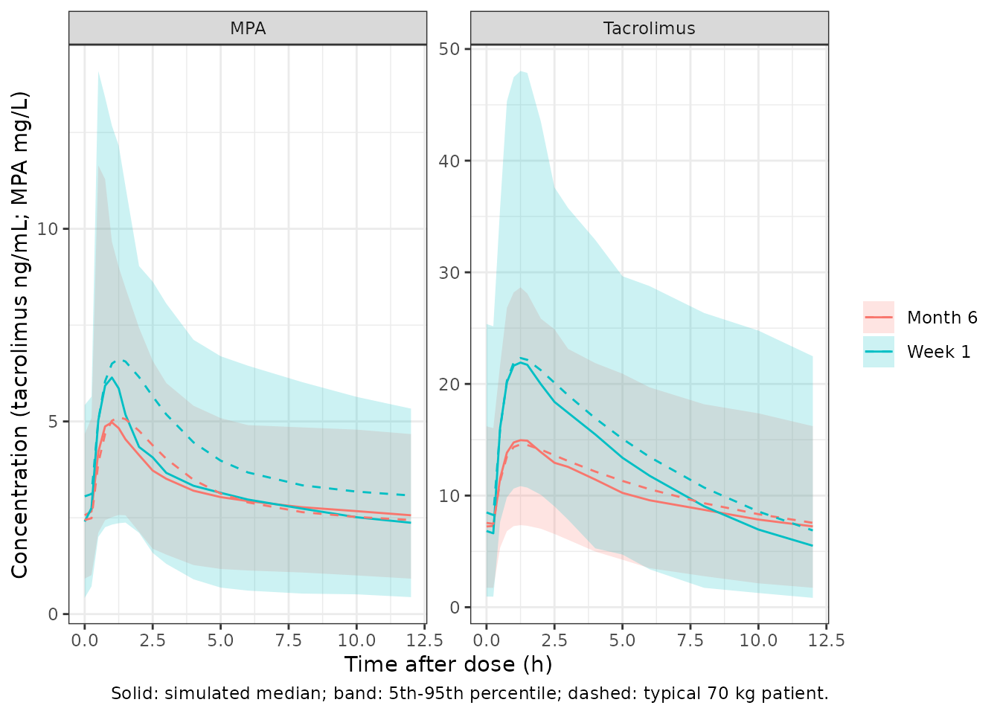
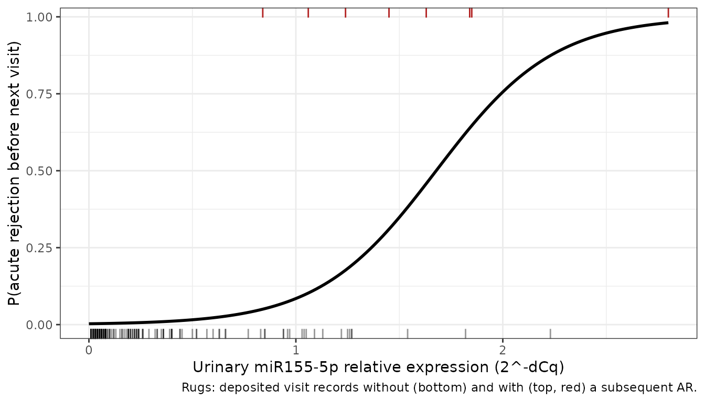

# Tacrolimus and mycophenolic acid in kidney transplantation (Quintairos 2021)

## Model and source

Quintairos 2021 built two population PK models, one for tacrolimus and
one for mycophenolic acid (MPA), in the same cohort of adult de novo
kidney transplant recipients. It then used the individual exposures
predicted by these models, together with two urinary biomarkers, as
candidate predictors in a logistic regression of acute rejection. The
three models were fitted separately, so they are packaged as three model
files:

- `Quintairos_2021_tacrolimus`: Two-compartment population PK model for
  whole-blood tacrolimus after oral twice-daily dosing in adult de novo
  kidney transplant recipients during the first 6 months post-transplant
  (Quintairos 2021). First-order absorption with an absorption lag time
  and first-order elimination; fixed-exponent allometric scaling on body
  weight (0.75 on CL/F and Q/F; 1 on Vc/F and Vp/F); no other covariates
  retained. Between-subject variability on CL/F, Q/F and Vc/F, small
  fixed-variance random effects on ka, Vp/F and the lag time, and an
  additive residual error on log-transformed concentrations
  (log-normal).
- `Quintairos_2021_mycophenolic_acid`: Two-compartment population PK
  model for mycophenolic acid (MPA) after oral mycophenolate mofetil
  (doses entered as MPA molar equivalents) in adult de novo kidney
  transplant recipients during the first 6 months post-transplant
  (Quintairos 2021). First-order absorption with an absorption lag time
  and first-order elimination; fixed-exponent allometric scaling on body
  weight (0.75 on CL/F and Q/F; 1 on Vc/F and Vp/F; and, as in the
  published control stream, a linear weight scaling on ka). Vp/F is
  fixed at 800 L. Correlated between-subject variability on CL/F, Vc/F
  and Vp/F, small fixed-variance random effects on Q/F, ka and the lag
  time, and proportional residual error.
- `Quintairos_2021_kidneyTransplantRejection`: Logistic regression of
  the risk of biopsy-proven acute rejection (AR) on urinary-pellet
  miR155-5p relative expression in adult de novo kidney transplant
  recipients during the first 6 months post-transplant (Quintairos
  2021). logit(P) = -5.89 + 3.51 \* MIR155_URINE, where MIR155_URINE is
  the 2^-dCq relative expression measured at a study visit and P is the
  probability that AR is diagnosed before the next visit (rejection
  events were attributed to the visit preceding their occurrence). No
  tacrolimus or mycophenolic acid exposure term is present: individual
  cumulative AUC and mean trough concentrations from the companion popPK
  models, and urinary CXCL-10, were tested and not retained. No
  between-subject variability (the control stream fixes the only omega
  at 0) and no residual error (Bernoulli likelihood).
- Citation: Quintairos L, Colom H, Millan O, Fortuna V, Espinosa C,
  Guirado L, Budde K, Sommerer C, Lizana A, Lopez-Pua Y, Brunet M. Early
  prognostic performance of miR155-5p monitoring for the risk of
  rejection: Logistic regression with a population pharmacokinetic
  approach in adult kidney transplant patients. PLoS ONE.
  2021;16(1):e0245880. <doi:10.1371/journal.pone.0245880>. Parameter
  values from Table 4; random-effect and residual-error structure from
  the S1 Appendix NONMEM control stream (‘Tacrolimus PK model’).
- Article: <https://doi.org/10.1371/journal.pone.0245880> (open access).
  The supporting information includes the NONMEM control streams (S1
  Appendix) and the analysis datasets (S1-S3 Tables).

The PK models are validated first. The logistic regression is covered in
its own section at the end.

## Population

The PK sub-study included 58 of the 80 adult de novo kidney recipients
enrolled at three European centres: Charite Berlin and Heidelberg in
Germany, and Fundacio Puigvert in Barcelona, Spain (EudraCT
2013-001817-33). The recipients had deceased (28) or living (30) donors.
Median age was 48 years (IQR 38-58), and 20 of 58 were female. Median
weight was 73 kg (IQR 62.9-86.8) and median GFR 44 mL/min (IQR 15-55)
(Table 1). All patients were Caucasian. Eight patients (14%) had
biopsy-proven acute rejection.

All patients received twice-daily oral tacrolimus (Prograf) and
mycophenolate mofetil (Myfenax), methylprednisolone, and basiliximab
induction. Doses were adjusted by therapeutic drug monitoring. Sampling
was intensive at week 1 (0 to 12 h post-dose) and at 0, 1.5, 2 and 4 h
post-dose at months 1, 2, 3 and 6. The tacrolimus model used 1102
whole-blood concentrations and the MPA model 1071 plasma concentrations.

The same information is available programmatically through the
`population` element of each model, for example
`readModelDb("Quintairos_2021_tacrolimus")()$population`.

## Source trace

PK parameter values come from Table 4 and the logistic-regression values
from Table 5. The model structure comes from the S1 Appendix NONMEM
control streams. The PK streams are ADVAN4/TRANS4 two-compartment models
with first-order absorption and `ALAG1`, MU-referenced exponential
random effects, and the error models transcribed below. The stream
`$THETA` records are initial estimates (for example, the MPA V2 initial
value is 46 L against the final 106 L), so no value is taken from them.

| Model | Parameter / equation | Value | Source |
|----|----|----|----|
| Tacrolimus | CL/F (`lcl`) | 16.5 L/h/70 kg | Table 4 |
| Tacrolimus | Vc/F (`lvc`) | 311 L/70 kg | Table 4 |
| Tacrolimus | Q/F (`lq`) | 20.5 L/h/70 kg | Table 4 |
| Tacrolimus | Vp/F (`lvp`) | 56300 L/70 kg | Table 4 |
| Tacrolimus | ka (`lka`) | 3.08 1/h | Table 4 |
| Tacrolimus | tlag (`ltlag`) | 0.295 h | Table 4 |
| Tacrolimus | BSV CL, Q, Vc | 57.6%, 68.9%, 55.6% -\> omega 0.3318, 0.4747, 0.3091 | Table 4 |
| Tacrolimus | Residual error (`expSd`, log-normal) | 0.366 | Table 4; control stream `Y = LOG(F) + EPS(1)` |
| Tacrolimus | `Cc = central / vc * 1000` (ng/mL from mg and L) | n/a | control stream `S2 = V2/1000` |
| MPA | CL/F (`lcl`) | 11.8 L/h/70 kg | Table 4 |
| MPA | Vc/F (`lvc`) | 106 L/70 kg | Table 4 |
| MPA | Q/F (`lq`) | 37.1 L/h/70 kg | Table 4 |
| MPA | Vp/F (`lvp`) | 800 L/70 kg, fixed | Table 4; control stream `800 FIX` |
| MPA | ka (`lka`) | 1.79 1/h | Table 4 |
| MPA | tlag (`ltlag`) | 0.243 h | Table 4 |
| MPA | BSV CL, Vc, Vp | 34.9%, 133.8%, 164.6% -\> omega 0.1218, 1.790, 2.709 | Table 4 |
| MPA | Residual error (`propSd`) | 0.553 | Table 4; control stream `Y = F + F*EPS(1)` |
| MPA | ka multiplied by `WT/70` | exponent 1, fixed | control stream `KA = EXP(MU_5+ETA(5)) * DCOV` |
| Both | Allometry `(WT/70)^0.75` on CL/F and Q/F, `(WT/70)^1` on Vc/F and Vp/F | fixed | Methods, Pharmacokinetic models; MPA control stream `ECOV`, `DCOV` |
| Both | Fixed random effects `omega = 0.01` (tacrolimus ka, Vp, tlag; MPA Q, ka, tlag) | fixed | control stream `$OMEGA 0.01 FIX` |
| Acute rejection | Intercept (`logit_ref`) | -5.89 | Table 5, beta0 |
| Acute rejection | miR155-5p slope (`e_mir155_urine_logit`) | 3.51 per 2^-dCq unit | Table 5, beta1 |
| Acute rejection | `logit = logit_ref + e_mir155_urine_logit * MIR155_URINE`; `prob = expit(logit)` | n/a | Table 5 equation; control stream `$PRED` |
| Acute rejection | No between-subject variability | omega 0 | control stream `$OMEGA 0 FIX` |

### Reading of the BSV column

Table 4 prints BSV as a percentage without stating the transformation.
The packaged models read it as `sqrt(omega) x 100`. The MPA control
stream supports this. Its initial `$OMEGA` values (0.123, 1.85, 2.41)
are close to the squares of the printed percentages (0.1218, 1.790,
2.709). They are far from the log-normal CV reading `log(1 + CV^2)`
(0.115, 1.03, 1.31), which would halve the Vc and Vp variances.

``` r

mpa_bsv <- c(CL = 34.9, VC = 133.8, VP = 164.6) / 100
stream_init <- c(CL = 0.123, VC = 1.85, VP = 2.41)
omega_check <- data.frame(
  parameter = names(mpa_bsv),
  stream_initial = stream_init,
  sqrt_reading = mpa_bsv^2,
  cv_reading = log(1 + mpa_bsv^2)
)
knitr::kable(omega_check, digits = 3, row.names = FALSE)
```

| parameter | stream_initial | sqrt_reading | cv_reading |
|:----------|---------------:|-------------:|-----------:|
| CL        |          0.123 |        0.122 |      0.115 |
| VC        |          1.850 |        1.790 |      1.026 |
| VP        |          2.410 |        2.709 |      1.311 |

``` r

# The square-root reading is within 13% of every stream value; the CV reading
# is off by more than 40% for Vc and Vp.
stopifnot(
  all(abs(omega_check$sqrt_reading / omega_check$stream_initial - 1) < 0.15),
  all(abs(omega_check$cv_reading / omega_check$stream_initial - 1)[2:3] > 0.4)
)
```

## Virtual cohort

The simulation follows the study’s visit schedule: week 1 (day 7) and
months 1, 2, 3 and 6 (days 30, 60, 90, 180). Doses are given every 12 h.
Table 2 pairs each visit’s mean trough with that visit’s mean dose (it
reports Ctrough/Dose per visit), so the dose leading up to each visit is
the Table 2 mean dose for that visit, and the month-6 dose continues
after the last visit. Table 2 reports doses per day. They are halved to
twice-daily amounts here, matching the per-administration amounts in the
S1 and S2 Table datasets (for example, tacrolimus 7.5 mg per dose at
week 1). Mycophenolate mofetil doses are converted to MPA molar
equivalents by the molecular-weight ratio 320.34 / 433.49; 1000 mg of
MMF gives the 738.96 mg of MPA carried in the S2 Table dataset.

Body weight is log-normal with a median of 73 kg and a log-scale SD of
0.24, which reproduces the Table 1 IQR of 62.9-86.8 kg. Each drug has
one arm of 200 subjects.

``` r

set.seed(20210122)
rxode2::rxSetSeed(20210122)
n_sub <- 200
visit_day <- c(7, 30, 60, 90, 180)
visit_lab <- c("Week 1", "Month 1", "Month 2", "Month 3", "Month 6")
end_day <- 184

mmf_to_mpa <- 320.34 / 433.49
daily_dose <- list(
  tacrolimus = c(14.60, 10.63, 7.78, 6.79, 5.29), # Table 2, mg/day
  mpa = c(1875.91, 1655.41, 1552.02, 1402.64, 1238.67) * mmf_to_mpa # Table 2 MMF mg/day -> MPA
)

# Dense sampling over the week-1 and month-6 dosing intervals (for the profile
# figure and NCA), plus a pre-dose trough at every visit.
profile_hours <- c(0, 0.25, 0.5, 0.75, 1, 1.25, 1.5, 2, 2.5, 3, 4, 5, 6, 8, 10, 12)
obs_times <- sort(unique(c(
  visit_day * 24 - 0.05,
  visit_day[1] * 24 + profile_hours,
  visit_day[5] * 24 + profile_hours
)))

make_cohort <- function(daily, drug, id_offset) {
  wt <- exp(rnorm(n_sub, log(73), 0.24))
  # Dose k is given from the previous visit up to visit k, so the trough
  # sampled just before visit k reflects dose k; the month-6 dose continues
  # over the month-6 profile interval.
  starts <- c(0, visit_day) * 24
  ends <- c(visit_day, end_day) * 24
  daily <- c(daily, daily[5])
  doses <- data.frame(
    time = starts,
    amt = daily / 2,
    ii = 12,
    addl = (ends - starts) / 12 - 1
  )
  bind_rows(lapply(seq_len(n_sub), function(i) {
    bind_rows(
      doses |> mutate(evid = 1L, cmt = "depot"),
      data.frame(time = obs_times, amt = 0, ii = 0, addl = 0, evid = 0L, cmt = "central")
    ) |>
      mutate(id = id_offset + i, WT = wt[i], drug = drug)
  })) |>
    arrange(id, time, desc(evid))
}

events_tac <- make_cohort(daily_dose$tacrolimus, "Tacrolimus", 0L)
events_mpa <- make_cohort(daily_dose$mpa, "MPA", n_sub)
stopifnot(
  length(unique(events_tac$id)) == n_sub,
  length(unique(events_mpa$id)) == n_sub,
  !any(unique(events_tac$id) %in% unique(events_mpa$id))
)
```

## Simulation

``` r

mod_tac <- readModelDb("Quintairos_2021_tacrolimus")
mod_mpa <- readModelDb("Quintairos_2021_mycophenolic_acid")

sim_tac <- rxSolve(mod_tac, events_tac, keep = c("drug", "WT"), returnType = "data.frame")
#> ℹ parameter labels from comments will be replaced by 'label()'
sim_mpa <- rxSolve(mod_mpa, events_mpa, keep = c("drug", "WT"), returnType = "data.frame")
#> ℹ parameter labels from comments will be replaced by 'label()'

typ_tac <- rxSolve(zeroRe(mod_tac), events_tac |> filter(id == 1) |> mutate(WT = 70),
  returnType = "data.frame"
)
#> ℹ parameter labels from comments will be replaced by 'label()'
#> ℹ omega/sigma items treated as zero: 'etalcl', 'etalq', 'etalvc', 'etalka', 'etalvp', 'etaltlag'
typ_mpa <- rxSolve(zeroRe(mod_mpa), events_mpa |> filter(id == n_sub + 1) |> mutate(WT = 70),
  returnType = "data.frame"
)
#> ℹ parameter labels from comments will be replaced by 'label()'
#> ℹ omega/sigma items treated as zero: 'etalcl', 'etalvc', 'etalvp', 'etalq', 'etalka', 'etaltlag'
```

### Trough concentrations by visit (Table 2)

Table 2 gives the mean observed trough at each visit. The table below
compares it with the simulated mean pre-dose concentration under the
Table 2 dose schedule. The comparison uses the individual prediction
`Cc`, without residual error.

``` r

trough_times <- visit_day * 24 - 0.05
obs_trough <- data.frame(
  drug = rep(c("Tacrolimus", "MPA"), each = 5),
  visit = rep(visit_lab, 2),
  observed = c(8.85, 11.15, 8.92, 9.11, 8.35, 2.37, 2.93, 2.70, 2.90, 2.37) # Table 2
)
sim_trough <- bind_rows(sim_tac, sim_mpa) |>
  filter(time %in% trough_times) |>
  mutate(visit = visit_lab[match(time, trough_times)]) |>
  group_by(drug, visit) |>
  summarise(simulated_mean = mean(Cc), simulated_median = median(Cc), .groups = "drop")
trough_cmp <- obs_trough |>
  left_join(sim_trough, by = c("drug", "visit")) |>
  mutate(pct_diff = 100 * (simulated_mean - observed) / observed)

trough_cmp |>
  dplyr::rename(
    Drug = drug, Visit = visit, `Observed mean (Table 2)` = observed,
    `Simulated mean` = simulated_mean, `Simulated median` = simulated_median,
    `Difference (%)` = pct_diff
  ) |>
  knitr::kable(digits = 2, caption = "Tacrolimus in ng/mL, MPA in mg/L.")
```

| Drug | Visit | Observed mean (Table 2) | Simulated mean | Simulated median | Difference (%) |
|:---|:---|---:|---:|---:|---:|
| Tacrolimus | Week 1 | 8.85 | 8.83 | 6.87 | -0.23 |
| Tacrolimus | Month 1 | 11.15 | 7.92 | 6.42 | -28.96 |
| Tacrolimus | Month 2 | 8.92 | 7.35 | 6.72 | -17.63 |
| Tacrolimus | Month 3 | 9.11 | 7.56 | 7.07 | -17.03 |
| Tacrolimus | Month 6 | 8.35 | 7.94 | 7.25 | -4.94 |
| MPA | Week 1 | 2.37 | 2.62 | 2.41 | 10.68 |
| MPA | Month 1 | 2.93 | 3.10 | 2.99 | 5.90 |
| MPA | Month 2 | 2.70 | 3.09 | 3.03 | 14.53 |
| MPA | Month 3 | 2.90 | 2.87 | 2.77 | -1.00 |
| MPA | Month 6 | 2.37 | 2.58 | 2.57 | 8.70 |

Tacrolimus in ng/mL, MPA in mg/L. {.table style="width:100%;"}

The models have no time-varying clearance. The paper reports that
dose-normalised troughs rose steadily over the 6 months, and Table 2
shows tacrolimus C/D rising from 0.61 at week 1 to 1.63 at month 6. The
per-visit comparison is therefore expected to drift by some tens of
percent. The gate below is on the centre of the comparison across
visits. A mis-transcribed clearance, volume or unit conversion would
move every visit together by far more.

``` r

chk <- trough_cmp |>
  group_by(drug) |>
  summarise(mean_pct = mean(pct_diff), max_abs_pct = max(abs(pct_diff)))
knitr::kable(chk, digits = 1)
```

| drug       | mean_pct | max_abs_pct |
|:-----------|---------:|------------:|
| MPA        |      7.8 |        14.5 |
| Tacrolimus |    -13.8 |        29.0 |

``` r

# Realised centres: tacrolimus -10.9% / -13.8% and MPA +5.8% / +7.8% on a
# 16-thread / 1-2-thread solve (largest single visit 27-29%). Moving each dose
# to the period AFTER its visit instead gives about +9% and +15%, so the
# dose-schedule assumption alone moves the centre by about 20 points. 25%
# admits that plus the cohort noise. A mis-transcribed CL/F, a volume or the
# ng/mL scaling moves every visit by 50% or more and still fails here.
stopifnot(
  all(abs(chk$mean_pct) < 25),
  all(chk$max_abs_pct < 45)
)
```

### Week-1 and month-6 dosing-interval profiles

The figure shows the simulated concentrations over one 12-h dosing
interval at week 1 and at month 6: the median, the 5th-95th percentile
band, and the typical 70 kg patient. The shape (tmax near 1-1.5 h after
the lag time) is the one the paper’s prediction-corrected VPCs show
(Figures 1 and 2).

``` r

prof <- bind_rows(sim_tac, sim_mpa) |>
  mutate(
    visit = case_when(
      time >= visit_day[1] * 24 & time <= visit_day[1] * 24 + 12 ~ "Week 1",
      time >= visit_day[5] * 24 & time <= visit_day[5] * 24 + 12 ~ "Month 6"
    ),
    tad = time - ifelse(visit == "Week 1", visit_day[1], visit_day[5]) * 24
  ) |>
  filter(!is.na(visit)) |>
  group_by(drug, visit, tad) |>
  summarise(
    med = median(Cc), lo = quantile(Cc, 0.05), hi = quantile(Cc, 0.95),
    .groups = "drop"
  )
typ_prof <- bind_rows(
  typ_tac |> mutate(drug = "Tacrolimus"),
  typ_mpa |> mutate(drug = "MPA")
) |>
  mutate(
    visit = case_when(
      time >= visit_day[1] * 24 & time <= visit_day[1] * 24 + 12 ~ "Week 1",
      time >= visit_day[5] * 24 & time <= visit_day[5] * 24 + 12 ~ "Month 6"
    ),
    tad = time - ifelse(visit == "Week 1", visit_day[1], visit_day[5]) * 24
  ) |>
  filter(!is.na(visit))

ggplot(prof, aes(tad, med, colour = visit, fill = visit)) +
  geom_ribbon(aes(ymin = lo, ymax = hi), alpha = 0.2, colour = NA) +
  geom_line() +
  geom_line(data = typ_prof, aes(tad, Cc, colour = visit), linetype = "dashed", inherit.aes = FALSE) +
  facet_wrap(~drug, scales = "free_y") +
  labs(
    x = "Time after dose (h)", y = "Concentration (tacrolimus ng/mL; MPA mg/L)",
    colour = NULL, fill = NULL,
    caption = "Solid: simulated median; band: 5th-95th percentile; dashed: typical 70 kg patient."
  ) +
  theme_bw()
```



## NCA of the week-1 and month-6 dosing intervals

The paper reports no NCA. PKNCA is run over the week-1 and month-6
dosing intervals of the simulated cohort, one drug at a time because the
concentration units differ. The results summarise the exposures the
models imply.

``` r

run_nca <- function(sim, events, conc_unit) {
  conc <- sim |>
    filter(!is.na(Cc)) |>
    mutate(treatment = drug) |>
    select(id, time, Cc, treatment)
  dose <- events |>
    filter(evid == 1) |>
    mutate(treatment = drug) |>
    select(id, time, amt, treatment)
  starts <- c(visit_day[1], visit_day[5]) * 24
  # Dose records carry ADDL; add explicit dose rows at the start of each NCA
  # interval so PKNCA sees the dose that opens it.
  dose_int <- dose |>
    group_by(id, treatment) |>
    reframe(time = starts, amt = amt[findInterval(starts, time)])
  intervals <- data.frame(
    start = starts, end = starts + 12,
    cmax = TRUE, tmax = TRUE, cmin = TRUE, auclast = TRUE
  )
  conc_obj <- PKNCA::PKNCAconc(conc, Cc ~ time | treatment + id, concu = conc_unit, timeu = "h")
  dose_obj <- PKNCA::PKNCAdose(dose_int, amt ~ time | treatment + id, doseu = "mg")
  PKNCA::pk.nca(PKNCA::PKNCAdata(conc_obj, dose_obj, intervals = intervals))
}
nca_tac <- run_nca(sim_tac, events_tac, "ng/mL")
nca_mpa <- run_nca(sim_mpa, events_mpa, "mg/L")
summary(nca_tac)
#>  Interval Start Interval End  treatment   N AUClast (h*ng/mL) Cmax (ng/mL)
#>             168          180 Tacrolimus 200        147 [55.1]  22.4 [45.8]
#>            4320         4332 Tacrolimus 200        118 [50.2]  14.6 [44.5]
#>  Cmin (ng/mL)           Tmax (h)
#>    4.92 [132] 1.25 [0.750, 1.50]
#>   6.42 [80.3] 1.25 [0.750, 1.50]
#> 
#> Caption: AUClast, Cmax, Cmin: geometric mean and geometric coefficient of variation; Tmax: median and range; N: number of subjects
summary(nca_mpa)
#>  Interval Start Interval End treatment   N AUClast (h*mg/L) Cmax (mg/L)
#>             168          180       MPA 200      37.4 [56.0] 6.20 [61.2]
#>            4320         4332       MPA 200      36.5 [41.2] 5.38 [50.2]
#>  Cmin (mg/L)           Tmax (h)
#>  2.01 [92.0] 1.25 [0.500, 2.50]
#>  2.29 [54.1] 1.25 [0.500, 2.50]
#> 
#> Caption: AUClast, Cmax, Cmin: geometric mean and geometric coefficient of variation; Tmax: median and range; N: number of subjects
```

As a consistency check, the median MPA AUC over the week-1 dosing
interval is compared with the MPA target range of 30-60 mg\*h/L that is
used for therapeutic drug monitoring. The simulated median should fall
near that range, because the doses were adjusted to reach it.

``` r

auc_mpa <- as.data.frame(nca_mpa) |>
  filter(PPTESTCD == "auclast", start == visit_day[1] * 24)
med_auc_mpa <- median(auc_mpa$PPORRES)
med_auc_mpa
#> [1] 38.27639
stopifnot(med_auc_mpa > 20, med_auc_mpa < 80)
```

## Acute-rejection logistic regression

The paper’s final logistic model links a single predictor, the
urinary-pellet miR155-5p relative expression measured at a visit
(`MIR155_URINE`, 2^-dCq), to the probability of biopsy-proven acute
rejection (AR):

logit(P) = -5.89 + 3.51 x `MIR155_URINE` (Table 5).

Each rejection was attributed to the visit *before* it occurred, so P is
the probability that AR is diagnosed before the next visit. The
predicted tacrolimus and MPA exposures (cumulative AUC and mean troughs
from the two PK models above) and urinary CXCL-10 were tested and not
retained. The model therefore has no drug input, and the PK models are
not needed to use it.

### Refit of the deposited dataset

The S3 Table dataset holds the analysis data for this model. After the
control stream’s `IGNORE` filters (visits with a missing or zero
miR155-5p value are dropped), 183 visit records from 58 patients remain,
with 8 AR events, matching the Results text. The miR155-5p values of
those 183 records, in dataset order, and the positions of the 8 AR
records are reproduced below. An ordinary maximum-likelihood logistic
regression on them (`glm`) is equivalent to the NONMEM Laplacian fit
with its only omega fixed at 0, so it should return the Table 5
estimates.

``` r

# S3 Table (Quintairos 2021), column M155, after the control stream filters
# IGNORE = (M155.EQ.9999) and IGNORE = (M155.EQ.0).
mir155 <- c(
  0.08, 0.32, 0.63, 0.11, 0.24, 0.36, 0.40, 0.66, 0.01, 0.03, 0.26, 0.03, 0.03, 0.24,
  0.44, 0.21, 0.33, 0.03, 0.03, 0.16, 0.18, 0.22, 0.06, 1.03, 0.22, 0.09, 0.03, 0.02,
  0.04, 0.97, 0.17, 0.05, 0.57, 1.09, 0.07, 0.24, 0.08, 0.04, 0.19, 0.29, 0.94, 0.16,
  0.23, 0.35, 0.19, 0.05, 0.03, 0.01, 0.10, 0.02, 0.01, 0.01, 0.01, 0.06, 0.06, 0.01,
  0.26, 0.03, 0.04, 0.02, 0.07, 0.03, 0.09, 1.13, 0.01, 0.50, 0.07, 0.52, 0.20, 0.20,
  0.23, 0.20, 0.36, 0.03, 0.05, 0.05, 0.52, 0.06, 0.08, 0.04, 0.02, 0.02, 0.01, 0.45,
  0.12, 0.06, 1.54, 0.02, 0.19, 0.08, 1.27, 0.04, 0.04, 0.01, 0.01, 0.19, 0.40, 1.85,
  0.02, 0.22, 1.25, 0.33, 0.96, 0.02, 0.03, 0.03, 0.04, 0.04, 0.85, 1.05, 1.27, 0.01,
  0.03, 0.44, 0.23, 1.24, 0.04, 0.08, 0.12, 0.08, 0.03, 0.01, 1.26, 0.83, 0.02, 0.08,
  0.03, 0.19, 0.13, 0.26, 0.03, 0.07, 0.63, 0.06, 0.07, 0.01, 2.23, 0.40, 0.66, 0.60,
  1.82, 0.05, 0.02, 0.39, 0.21, 0.02, 0.04, 0.01, 0.36, 0.40, 0.24, 0.01, 0.01, 0.05,
  0.01, 0.01, 0.02, 0.03, 0.03, 0.85, 0.01, 0.01, 0.01, 1.04, 1.06, 0.94, 1.63, 0.84,
  0.10, 0.77, 1.22, 1.45, 0.08, 0.06, 0.03, 0.02, 2.80, 1.84, 0.06, 0.15, 0.05, 0.10,
  0.08
)
ar_rows <- c(98, 116, 165, 167, 168, 172, 177, 178)
ar_data <- data.frame(mir155 = mir155, ar = 0L)
ar_data$ar[ar_rows] <- 1L
c(records = nrow(ar_data), events = sum(ar_data$ar))
#> records  events 
#>     183       8
stopifnot(nrow(ar_data) == 183, sum(ar_data$ar) == 8)
```

``` r

refit <- glm(ar ~ mir155, family = binomial(), data = ar_data)
refit_tab <- data.frame(
  parameter = c("beta0 (logit_ref)", "beta1 (e_mir155_urine_logit)"),
  table5 = c(-5.89, 3.51),
  table5_rse_pct = c(15, 24),
  refit = unname(coef(refit)),
  refit_rse_pct = unname(100 * sqrt(diag(vcov(refit))) / abs(coef(refit)))
)
knitr::kable(refit_tab, digits = c(0, 2, 0, 3, 1), row.names = FALSE)
```

| parameter                    | table5 | table5_rse_pct |  refit | refit_rse_pct |
|:-----------------------------|-------:|---------------:|-------:|--------------:|
| beta0 (logit_ref)            |  -5.89 |             15 | -5.891 |          18.9 |
| beta1 (e_mir155_urine_logit) |   3.51 |             24 |  3.506 |          24.5 |

``` r

# glm is deterministic, so a tight bound holds on every platform: a misread
# coefficient or a wrong data filter moves the refit by far more than 0.01.
stopifnot(all(abs(refit_tab$refit - refit_tab$table5) < 0.01))
```

The refit reproduces both coefficients to the printed precision, and the
slope RSE (24.5% against the printed 24%). The intercept RSE is about
19% against the printed 15%. That difference most likely comes from the
two covariance estimators (the `glm` Wald standard error against the
NONMEM covariance step), and it does not affect the point estimates.

### Packaged model against the deposited data

The packaged model is solved at the 183 observed miR155-5p values. Its
probabilities must equal the closed form
`expit(-5.89 + 3.51 x MIR155_URINE)`. A maximum-likelihood logistic fit
with an intercept also has the property that its fitted probabilities
sum to the observed number of events, so the packaged (rounded)
coefficients should predict very nearly 8 events over these visits.

``` r

mod_ar <- readModelDb("Quintairos_2021_kidneyTransplantRejection")
ev_ar <- data.frame(
  id = seq_len(nrow(ar_data)), time = 0, amt = 0, evid = 0L,
  MIR155_URINE = ar_data$mir155
)
sim_ar <- as.data.frame(rxode2::rxSolve(mod_ar, events = ev_ar, returnType = "data.frame"))
#> Warning: multi-subject simulation without without 'omega'
ar_data$prob <- sim_ar$prob_acute_rejection
closed_form <- plogis(-5.89 + 3.51 * ar_data$mir155)
expected_events <- sum(ar_data$prob)
expected_events
#> [1] 8.022628
stopifnot(
  # Same parameters on both sides: the difference is numerical only.
  all(abs(ar_data$prob - closed_form) < 1e-8),
  abs(expected_events - 8) < 0.25
)
```

### Predicted risk against miR155-5p (Figures 3 and 4)

``` r

grid_ar <- data.frame(
  id = 1L, time = seq_len(141), amt = 0, evid = 0L,
  MIR155_URINE = seq(0, 2.8, by = 0.02)
)
curve_ar <- as.data.frame(rxode2::rxSolve(mod_ar, events = grid_ar, returnType = "data.frame"))
curve_ar$MIR155_URINE <- grid_ar$MIR155_URINE
ggplot(curve_ar, aes(MIR155_URINE, prob_acute_rejection)) +
  geom_line(linewidth = 1) +
  geom_rug(data = filter(ar_data, ar == 0), aes(x = mir155), inherit.aes = FALSE,
           sides = "b", alpha = 0.4) +
  geom_rug(data = filter(ar_data, ar == 1), aes(x = mir155), inherit.aes = FALSE,
           sides = "t", colour = "firebrick") +
  labs(
    x = "Urinary miR155-5p relative expression (2^-dCq)",
    y = "P(acute rejection before next visit)",
    caption = "Rugs: deposited visit records without (bottom) and with (top, red) a subsequent AR."
  ) +
  theme_bw()
```



The probability stays below 1% up to an expression of about 0.37 (75% of
the visits), rises to 8.5% at 1.0 and passes 50% at 1.68.

Figure 4 of the paper compares observed and predicted AR proportions
across 10 bins of miR155-5p expression. The same comparison is made
below with 10 equal-count bins of the deposited records. The predicted
column is the mean probability from the packaged model, and the interval
is the 2.5th to 97.5th percentile of the number of events in 1000
Bernoulli replicates of each bin.

``` r

set.seed(20210122)
reps <- matrix(rbinom(1000 * nrow(ar_data), 1, rep(ar_data$prob, 1000)), nrow = nrow(ar_data))
bins <- ar_data |>
  mutate(bin = dplyr::ntile(mir155, 10), row = dplyr::row_number()) |>
  group_by(bin) |>
  summarise(
    mir155_range = sprintf("%.2f-%.2f", min(mir155), max(mir155)),
    n = n(),
    observed_events = sum(ar),
    predicted_events = sum(prob),
    pi_low = unname(quantile(colSums(reps[row, , drop = FALSE]), 0.025)),
    pi_high = unname(quantile(colSums(reps[row, , drop = FALSE]), 0.975)),
    .groups = "drop"
  )
bins |>
  dplyr::rename(
    "Bin" = bin, "miR155-5p range" = mir155_range, "Visits" = n,
    "Observed AR" = observed_events, "Predicted AR" = predicted_events,
    "95% PI low" = pi_low, "95% PI high" = pi_high
  ) |>
  knitr::kable(digits = 2)
```

| Bin | miR155-5p range | Visits | Observed AR | Predicted AR | 95% PI low | 95% PI high |
|----:|:----------------|-------:|------------:|-------------:|-----------:|------------:|
|   1 | 0.01-0.01       |     19 |           0 |         0.05 |          0 |           1 |
|   2 | 0.01-0.03       |     19 |           0 |         0.06 |          0 |           1 |
|   3 | 0.03-0.04       |     19 |           0 |         0.06 |          0 |           1 |
|   4 | 0.04-0.06       |     18 |           0 |         0.06 |          0 |           1 |
|   5 | 0.06-0.09       |     18 |           0 |         0.06 |          0 |           1 |
|   6 | 0.09-0.19       |     18 |           0 |         0.08 |          0 |           1 |
|   7 | 0.20-0.26       |     18 |           0 |         0.11 |          0 |           1 |
|   8 | 0.29-0.52       |     18 |           0 |         0.20 |          0 |           1 |
|   9 | 0.52-1.04       |     18 |           1 |         0.89 |          0 |           3 |
|  10 | 1.05-2.80       |     18 |           7 |         6.45 |          3 |          10 |

``` r

# Seven of the eight events fall in the top bin, where the model also places
# most of its predicted events; every bin's observed count lies inside its
# replicate interval.
stopifnot(all(bins$observed_events >= bins$pi_low & bins$observed_events <= bins$pi_high))
```

## Assumptions and deviations

- **Weight scaling on tacrolimus.** The S1 Appendix tacrolimus control
  stream has no weight scaling. The article states that all disposition
  parameters were scaled a priori with fixed exponents of 0.75 (flows)
  and 1 (volumes). Table 4 gives the tacrolimus estimates per 70 kg, and
  the Discussion says the fixed-exponent scaling improved the model
  predictions. The packaged tacrolimus model therefore includes the
  scaling. The deposited dataset supports this choice. With every Table
  4 value fixed and only the individual random effects estimated (FOCEi,
  diagonal omega), the objective function was 7.4 points lower with the
  scaling than without it. The stream’s `$THETA` records are initial
  estimates, so it is not the run that produced Table 4.
- **Weight scaling on MPA ka.** The MPA control stream multiplies ka by
  `WT/70`. The article describes scaling of the disposition parameters
  only, and Table 4 prints ka in 1/h. The packaged model keeps the
  executed form. The same fixed-estimate check on the S2 Table dataset
  favoured ka *without* weight scaling by 5.7 objective-function points.
  Both forms give the same ka at 70 kg and differ by a factor of about
  0.7 to 1.5 across the 49-108 kg cohort weight range.
- **Omega block off-diagonals.** Both control streams estimate a 3 x 3
  omega block: tacrolimus CL, Q and Vc; MPA CL, Vc and Vp. The paper
  reports only the variances, so the covariances are set to zero.
  Simulated marginal variability matches the paper. Joint behaviour,
  such as a CL-Vc correlation, does not.
- **Fixed random effects.** Both control streams carry `$OMEGA 0.01 FIX`
  on the parameters without estimated BSV. Table 4 lists those
  parameters as “not estimated”. They are kept as `fixed(0.01)`, which
  is part of the executed model and adds about 10% variability to those
  parameters.
- **Tacrolimus residual error** is additive on the log scale in the
  control stream and printed as “Proportional 36.6%” in Table 4. It is
  encoded as log-normal (`lnorm`) with SD 0.366.
- **MMF dosing** is entered as MPA molar equivalents, as in the paper. A
  user simulating an MMF dose must multiply it by 320.34 / 433.49 =
  0.739.
- **Virtual dose schedule.** Real doses were individualised by
  therapeutic drug monitoring. The simulation gives the Table 2 mean
  dose for each visit over the period leading up to that visit, at the
  nominal visit days.
- **Logistic model: miR155-5p scale.** Table 2 and Figures 3 and 4 label
  the miR155-5p unit ‘dCt’. The Methods define the reported value as the
  relative expression 2^-dCq, and the deposited values (all positive,
  0.01-2.80) are on that scale, so `MIR155_URINE` holds 2^-dCq. A user
  with raw dCq values must convert them with `2^(-dCq)` first.
- **Logistic model: random effect and residual error.** The control
  stream carries `ETA(1)` on the logit with `$OMEGA 0 FIX`, so the model
  has no between-subject variability and the zero-variance eta is
  omitted. A Bernoulli outcome has no residual error. The packaged model
  returns the probability and attaches a placeholder additive error (SD
  0.001, fixed) only so that rxode2 has an observation model. To
  simulate events, draw `rbinom(n, 1, prob_acute_rejection)` from the
  solved probabilities.
- **Logistic model: prediction window.** Because each rejection was
  attributed to the preceding visit, the probability refers to the
  interval up to the next scheduled visit (about 3 weeks after week 1, 1
  month after months 1 and 2, and 3 months after month 3). It is not a
  probability over a fixed duration. In the deposited dataset seven of
  the eight events are recorded on the first-occasion (week-1) record,
  so most of the information behind the slope comes from the first
  post-transplant month.
