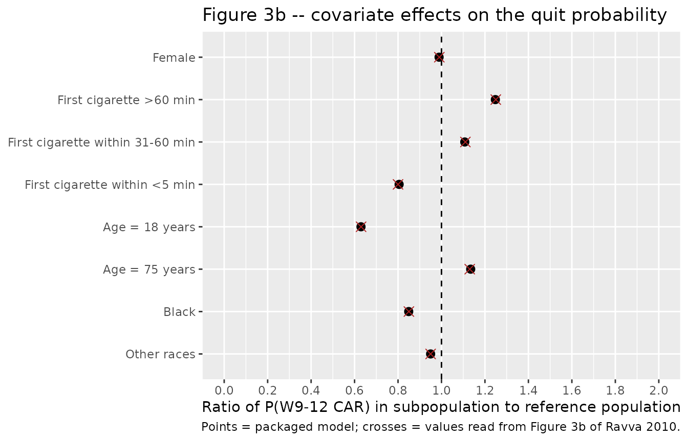
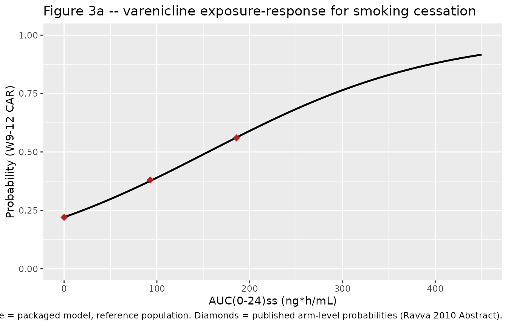
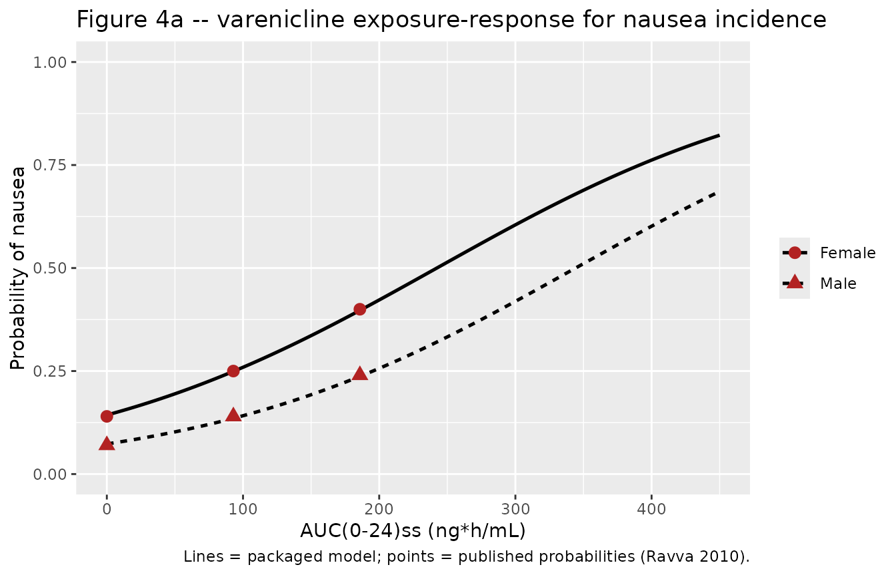
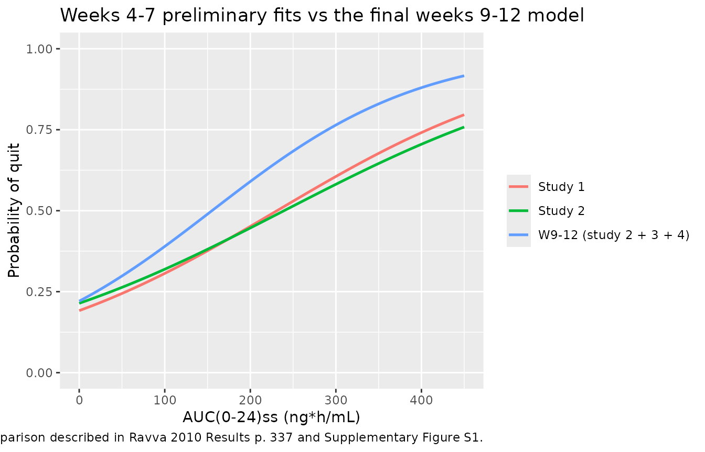

# Varenicline efficacy and tolerability exposure-response (Ravva 2010)

## Model and source

Ravva 2010 reports a set of population exposure-response analyses of
varenicline for smoking cessation, fitted in NONMEM V with the Laplacian
method on dichotomous outcomes. Four separately-fitted models are
packaged, one file each, following the authors’ own structure:

| Model | Endpoint | n |
|----|----|----|
| `Ravva_2010_varenicline_car_w9_12` | Continuous abstinence rate (CAR), weeks 9-12 – final full model | 1,892 |
| `Ravva_2010_varenicline_nausea` | Nausea incidence over the treatment period – final full model | 2,238 |
| `Ravva_2010_varenicline_car_w4_7_study1` | CAR weeks 4-7, preliminary dose-ranging fit, study 1 | 490 |
| `Ravva_2010_varenicline_car_w4_7_study2` | CAR weeks 4-7, preliminary dose-ranging fit, study 2 | 609 |

- Citation: Ravva P, Gastonguay MR, French JL, Tensfeldt TG, Faessel HM.
  Quantitative assessment of exposure-response relationships for the
  efficacy and tolerability of varenicline for smoking cessation. Clin
  Pharmacol Ther. 2010;87(3):336-344. <doi:10.1038/clpt.2009.282>.
  Companion population PK model supplying AUC(0-24)ss: Ravva P,
  Gastonguay MR, Tensfeldt TG, Faessel HM. Population pharmacokinetic
  analysis of varenicline in adult smokers. Br J Clin Pharmacol.
  2009;68(5):669-681. <doi:10.1111/j.1365-2125.2009.03520.x>.
- Article: <https://doi.org/10.1038/clpt.2009.282>
- Companion population PK model (supplies the exposure covariate):
  [`Ravva_2009_varenicline`](https://nlmixr2.github.io/nlmixr2lib/articles/Ravva_2009_varenicline.md),
  <https://doi.org/10.1111/j.1365-2125.2009.03520.x>

``` r

mod_car    <- readModelDb("Ravva_2010_varenicline_car_w9_12")
mod_nausea <- readModelDb("Ravva_2010_varenicline_nausea")
mod_w47_s1 <- readModelDb("Ravva_2010_varenicline_car_w4_7_study1")
mod_w47_s2 <- readModelDb("Ravva_2010_varenicline_car_w4_7_study2")
mod_pk     <- readModelDb("Ravva_2009_varenicline")
```

## Population

Cigarette smokers were pooled from five randomized, double-blind,
placebo-controlled, multicenter trials (Ravva 2010 Supplementary Table
S1). The three analysis databases differ because not every study
measured every endpoint: 1,099 subjects (51% women) for the CAR at weeks
4-7, 1,892 (47% women) for the CAR at weeks 9-12, and 2,238 (47% women)
for nausea incidence.

Participants were men and women motivated to stop smoking, mostly
Caucasian, with a mean age of 43 years. More than 75% smoked their first
cigarette of the day within 30 min of waking, the majority smoked at
least 11 cigarettes/day, and more than 40% of those smoked at least 20
cigarettes/day (Ravva 2010 Table 1). In the weeks 9-12 database, 416
subjects (22%) did not complete the treatment period and were assigned
as quit failures.

The same information is available programmatically from each model’s
`population` metadata:

``` r

readModelDb("Ravva_2010_varenicline_car_w9_12")()$population[
  c("n_subjects", "n_studies", "age_range", "sex_female_pct", "race_ethnicity")
]
#> $n_subjects
#> [1] 1892
#> 
#> $n_studies
#> [1] 3
#> 
#> $age_range
#> [1] "18-75 years"
#> 
#> $sex_female_pct
#> [1] 47
#> 
#> $race_ethnicity
#> White Black Other 
#>    81    11     8
```

## Source trace

Per-parameter origins are recorded as in-file comments beside each
`ini()` entry. Collected here for review. All estimated values come from
Ravva 2010 Table 3 (the two final models) or from the Results narrative
on p. 337 (the two preliminary fits).

| Model | Parameter | Value | Source location |
|----|----|----|----|
| CAR W9-12 | `base_logit` | -0.657 (25.7% RSE) | Table 3, “Intercept (theta1)” |
| CAR W9-12 | `e_auc_varen_base_logit` | 0.00813 (7.2%) | Table 3, “Drug effect, AUC (theta2)” |
| CAR W9-12 | `e_smoke_ttfc_31_60_base_logit` | 1.54 (26.9%) | Table 3, “Effect of FSQ1: 31-60min” |
| CAR W9-12 | `e_smoke_ttfc_6_30_base_logit` | 1.92 (24.6%) | Table 3, “Effect of FSQ1: 6-30min” |
| CAR W9-12 | `e_smoke_ttfc_le5_base_logit` | 2.59 (24.6%) | Table 3, “Effect of FSQ1: \<=5min” |
| CAR W9-12 | `e_age_base_logit` | -0.563 (24.7%) | Table 3, “Effect of age, 18-75 years” |
| CAR W9-12 | `e_sexf_base_logit` | 1.02 (7.1%) | Table 3, “Effect of gender: Female” |
| CAR W9-12 | `e_race_black_base_logit` | 1.27 (10.8%) | Table 3, “Effect of race: Black” |
| CAR W9-12 | `e_race_other_base_logit` | 1.09 (13.9%) | Table 3, “Effect of race: Other” |
| Nausea | `base_logit` | -2.93 (10.5%) | Table 3, “Intercept (theta1)” |
| Nausea | `e_auc_varen_base_logit` | 0.00738 (8.5%) | Table 3, “Drug effect, AUC (theta2)” |
| Nausea | `e_smoke_ttfc_31_60_base_logit` | 0.894 (11.4%) | Table 3, “Effect of FSQ1: 31-60min” |
| Nausea | `e_smoke_ttfc_6_30_base_logit` | 0.867 (10.2%) | Table 3, “Effect of FSQ1: 6-30min” |
| Nausea | `e_smoke_ttfc_le5_base_logit` | 0.961 (10.3%) | Table 3, “Effect of FSQ1: \<=5min” |
| Nausea | `e_age_base_logit` | 0.374 (26.0%) | Table 3, “Effect of age, 18-75 years” |
| Nausea | `e_sexf_base_logit` | 0.704 (5.4%) | Table 3, “Effect of gender: Female” |
| Nausea | `e_race_black_base_logit` | 1.20 (8.3%) | Table 3, “Effect of race: Black” |
| Nausea | `e_race_other_base_logit` | 0.887 (10.4%) | Table 3, “Effect of race: Other” |
| Nausea | `logit_week_amp`, `logit_week_kdes` | `fixed(0)` | Equation 2 theta11 / theta10 – **never published**; see Errata |
| Nausea | `etabase_logit` | `fixed(0)` | Equation 2 eta1 – variance never published; published results are naive pooled |
| W4-7 study 1 | `base_logit`, `e_auc_varen_base_logit` | -1.44 (10.8%), 0.00623 (22.5%) | Results p. 337, narrative |
| W4-7 study 2 | `base_logit`, `e_auc_varen_base_logit` | -1.30 (11.6%), 0.00543 (19.9%) | Results p. 337, narrative |
| All | `addSd_p_car` / `addSd_p_nausea` | `fixed(0.001)` | **Not paper-derived** – placeholder; see Assumptions |
| All | Equation structure | n/a | Equation 2 (p. 340) and Equation 3 (p. 343) |

### Model structure

The logit of the response probability is built from a baseline intercept
that the demographic covariates **multiply**, plus a drug-exposure term
that adds **linearly** (Ravva 2010 Equation 2):

    lambda = theta1 * theta3^FSQ1(31-60) * theta4^FSQ1(6-30) * theta5^FSQ1(<5)
                    * (Age/45)^theta6 * theta7^(1-Sex)
                    * theta8^Race(Black) * theta9^Race(other)
           + theta2 * AUC
           + theta11 * exp(-theta10 * week) + eta1

That multiplicative-intercept / additive-drug asymmetry is load-bearing:
it is what reproduces the paper’s own reported probabilities exactly,
and a naive all-additive reading does not.

Two coding details are easy to get wrong and are worth stating
explicitly.

- **The model reference category is not the reporting reference
  population.** FSQ1 is scored
  `>60 min (0); 31-60 min (1); 6-30 min (2); within 5 min (3)`, so score
  0 zeroes all three indicators and is the *model* reference. But the
  paper quotes every probability against a *reporting* reference
  population of “Caucasian, 45-year-old, male smokers who smoke their
  first cigarette within 6-30 min after waking” – score **2**, not 0.
- **`theta7^(1-Sex)` maps onto canonical `SEXF` with no
  transformation.** The effect row is labelled “Female” and the
  reference population is male, so the paper’s `Sex` is 1 for male and
  `(1 - Sex)` is identically `SEXF` (1 = female).

## Reproducing the published results

The four packaged models carry no between-subject variability and no
residual error (see Errata), so every prediction below is a
deterministic typical-value calculation. Tolerances are set from the
printed precision of each published value rather than from a blanket
percentage.

### Exposure anchors

Ravva 2010 does not tabulate the typical `AUC(0-24)ss` per dose level,
but Figure 3b states the reference-population quit probability at 1 mg
b.i.d. (`Probability = 0.562`). Inverting the packaged model at the
reference covariates recovers the exposure that the paper’s own figures
were drawn at.

``` r

ref_row <- function(auc, score = 2, age = 45, sexf = 0, black = 0, other = 0) {
  data.frame(
    id = 1L, time = 0, evid = 0, amt = 0,
    SMOKE_TTFC_SCORE = score, AGE = age, SEXF = sexf,
    RACE_BLACK = black, RACE_OTHER = other, AUC_VAREN = auc
  )
}

p_car_at <- function(auc, ...) {
  rxode2::rxSolve(mod_car, ref_row(auc, ...), returnType = "data.frame")$p_car
}

# Solve p_car(reference population, AUC) = 0.562 for AUC.
auc_1mg <- stats::uniroot(
  function(a) p_car_at(a) - 0.562, interval = c(0, 1000), tol = 1e-10
)$root
# Varenicline PK is linear over the recommended dose range (Ravva 2010
# Introduction), so half the daily dose gives half the daily AUC.
auc_05mg <- auc_1mg / 2
auc_placebo <- 0

c(`1 mg b.i.d.` = auc_1mg, `0.5 mg b.i.d.` = auc_05mg)
#>   1 mg b.i.d. 0.5 mg b.i.d. 
#>     185.82078      92.91039
```

Those two exposures land inside the paper’s own binning of the observed
data (bins of 50-142, \>142-184 and \>184-408 `ng*h/mL`, Results p. 337)
and are corroborated independently by the companion PK model further
below.

### Efficacy: Table 3 and the Abstract

``` r

eff <- tibble::tibble(
  arm       = c("Placebo", "0.5 mg b.i.d.", "1 mg b.i.d."),
  auc       = c(auc_placebo, auc_05mg, auc_1mg),
  published = c(0.22, 0.38, 0.56)
) |>
  mutate(
    model = vapply(auc, p_car_at, numeric(1)),
    diff_pct_points = 100 * (model - published)
  )

eff |>
  transmute(
    Arm = arm,
    `AUC(0-24)ss (ng*h/mL)` = round(auc, 1),
    `Published P(quit)` = published,
    `Model P(quit)` = round(model, 4),
    `Difference (percentage points)` = round(diff_pct_points, 2)
  ) |>
  knitr::kable(caption = "Weeks 9-12 quit probability, reference population. Published values from Ravva 2010 Abstract and Results p. 338.")
```

| Arm | AUC(0-24)ss (ng\*h/mL) | Published P(quit) | Model P(quit) | Difference (percentage points) |
|:---|---:|---:|---:|---:|
| Placebo | 0.0 | 0.22 | 0.2207 | 0.07 |
| 0.5 mg b.i.d. | 92.9 | 0.38 | 0.3761 | -0.39 |
| 1 mg b.i.d. | 185.8 | 0.56 | 0.5620 | 0.20 |

Weeks 9-12 quit probability, reference population. Published values from
Ravva 2010 Abstract and Results p. 338. {.table}

``` r


# Published to 2 significant figures, so the model must land within half a
# rounding unit (0.5 percentage points) of each printed value.
stopifnot(all(abs(eff$diff_pct_points) < 0.5))
```

The paper’s two other efficacy gradients reproduce as well.

``` r

# Ravva 2010 Results p. 338: quit probability falls from 0.70 (FSQ1 >60 min)
# to 0.45 (FSQ1 <=5 min) at 1 mg b.i.d.
fsq1_grad <- c(
  `>60 min`  = p_car_at(auc_1mg, score = 0),
  `<=5 min`  = p_car_at(auc_1mg, score = 3)
)
# Ravva 2010 Results p. 338: baseline quit probability rises from 0.35 at
# age 18 to 0.64 at age 75.
age_grad <- c(
  `18 years` = p_car_at(auc_1mg, age = 18),
  `75 years` = p_car_at(auc_1mg, age = 75)
)

round(c(fsq1_grad, age_grad), 4)
#>  >60 min  <=5 min 18 years 75 years 
#>   0.7013   0.4524   0.3538   0.6375

# All four are published to 2 decimal places.
stopifnot(
  abs(fsq1_grad[[">60 min"]] - 0.70) < 0.005,
  abs(fsq1_grad[["<=5 min"]] - 0.45) < 0.005,
  abs(age_grad[["18 years"]]  - 0.35) < 0.005,
  abs(age_grad[["75 years"]]  - 0.64) < 0.005
)
```

### Figure 3b – the covariate forest plot

Figure 3b plots, for each subpopulation, the ratio of its weeks 9-12
quit probability to the reference population’s. It is effectively a
published ratio table and is the strongest single gate on the efficacy
model: nine independent values, every covariate exercised.

``` r

p_ref <- p_car_at(auc_1mg)

forest <- tibble::tribble(
  ~label,                            ~score, ~age, ~sexf, ~black, ~other, ~plotted,
  "Reference",                            2L,   45,     0,      0,      0,     1.00,
  "Female",                               2L,   45,     1,      0,      0,     0.99,
  "First cigarette >60 min",              0L,   45,     0,      0,      0,     1.25,
  "First cigarette within 31-60 min",     1L,   45,     0,      0,      0,     1.11,
  "First cigarette within <5 min",        3L,   45,     0,      0,      0,     0.80,
  "Age = 18 years",                       2L,   18,     0,      0,      0,     0.63,
  "Age = 75 years",                       2L,   75,     0,      0,      0,     1.13,
  "Black",                                2L,   45,     0,      1,      0,     0.85,
  "Other races",                          2L,   45,     0,      0,      1,     0.95
) |>
  rowwise() |>
  mutate(
    model_p     = p_car_at(auc_1mg, score = score, age = age,
                           sexf = sexf, black = black, other = other),
    model_ratio = model_p / p_ref
  ) |>
  ungroup() |>
  mutate(abs_diff = abs(model_ratio - plotted))

forest |>
  transmute(
    Subpopulation = label,
    `Model P(quit)` = round(model_p, 4),
    `Model ratio` = round(model_ratio, 3),
    `Read from Figure 3b` = plotted,
    `|difference|` = round(abs_diff, 3)
  ) |>
  knitr::kable(caption = "Replicates Figure 3b of Ravva 2010: ratio of subpopulation to reference-population weeks 9-12 quit probability, at 1 mg b.i.d.")
```

| Subpopulation | Model P(quit) | Model ratio | Read from Figure 3b | \|difference\| |
|:---|---:|---:|---:|---:|
| Reference | 0.5620 | 1.000 | 1.00 | 0.000 |
| Female | 0.5558 | 0.989 | 0.99 | 0.001 |
| First cigarette \>60 min | 0.7013 | 1.248 | 1.25 | 0.002 |
| First cigarette within 31-60 min | 0.6222 | 1.107 | 1.11 | 0.003 |
| First cigarette within \<5 min | 0.4524 | 0.805 | 0.80 | 0.005 |
| Age = 18 years | 0.3538 | 0.630 | 0.63 | 0.000 |
| Age = 75 years | 0.6375 | 1.134 | 1.13 | 0.004 |
| Black | 0.4772 | 0.849 | 0.85 | 0.001 |
| Other races | 0.5339 | 0.950 | 0.95 | 0.000 |

Replicates Figure 3b of Ravva 2010: ratio of subpopulation to
reference-population weeks 9-12 quit probability, at 1 mg b.i.d.
{.table}

``` r


# Figure 3b values are read off a plotted axis at roughly 0.01 resolution;
# allow 0.02 on the ratio.
stopifnot(all(forest$abs_diff < 0.02))
```

``` r

forest |>
  filter(label != "Reference") |>
  mutate(label = factor(label, levels = rev(label))) |>
  ggplot(aes(model_ratio, label)) +
  geom_vline(xintercept = 1, linetype = "dashed") +
  geom_point(size = 2.5) +
  geom_point(aes(x = plotted), shape = 4, size = 3, colour = "firebrick") +
  scale_x_continuous(limits = c(0, 2), breaks = seq(0, 2, 0.2)) +
  labs(
    x = "Ratio of P(W9-12 CAR) in subpopulation to reference population",
    y = NULL,
    title = "Figure 3b -- covariate effects on the quit probability",
    caption = "Points = packaged model; crosses = values read from Figure 3b of Ravva 2010."
  )
```



### Figure 3a – the exposure-response curve

``` r

auc_grid <- seq(0, 450, by = 5)
curve_car <- tibble::tibble(auc = auc_grid) |>
  mutate(p = vapply(auc, p_car_at, numeric(1)))

ggplot(curve_car, aes(auc, p)) +
  geom_line(linewidth = 0.9) +
  geom_point(
    data = eff |> filter(arm != "Placebo"),
    aes(auc, published), colour = "firebrick", size = 3, shape = 18
  ) +
  geom_point(
    data = eff |> filter(arm == "Placebo"),
    aes(auc, published), colour = "firebrick", size = 3, shape = 18
  ) +
  scale_y_continuous(limits = c(0, 1)) +
  labs(
    x = "AUC(0-24)ss (ng*h/mL)", y = "Probability (W9-12 CAR)",
    title = "Figure 3a -- varenicline exposure-response for smoking cessation",
    caption = "Line = packaged model, reference population. Diamonds = published arm-level probabilities (Ravva 2010 Abstract)."
  )
```



``` r


# The relationship is monotonically increasing across the observed range, as
# Results p. 337 states ("a precise, monotonically increasing quit probability").
stopifnot(all(diff(curve_car$p) > 0))
```

### Tolerability: nausea incidence

The nausea model is gated on all six probabilities the paper reports,
across both sexes and all three arms.

``` r

p_nausea_at <- function(auc, sexf, score = 2, age = 45, black = 0, other = 0) {
  ev <- data.frame(
    id = 1L, time = 0, evid = 0, amt = 0,
    SMOKE_TTFC_SCORE = score, AGE = age, SEXF = sexf,
    RACE_BLACK = black, RACE_OTHER = other, AUC_VAREN = auc
  )
  rxode2::rxSolve(mod_nausea, ev, returnType = "data.frame")$p_nausea
}

nausea <- tidyr::expand_grid(
  arm = c("Placebo", "0.5 mg b.i.d.", "1 mg b.i.d."),
  sex = c("Male", "Female")
) |>
  mutate(
    auc  = c(auc_placebo, auc_05mg, auc_1mg)[match(arm, c("Placebo", "0.5 mg b.i.d.", "1 mg b.i.d."))],
    sexf = as.integer(sex == "Female"),
    # Ravva 2010 Abstract / Results p. 338 and Discussion p. 341.
    published = c(0.07, 0.14, 0.14, 0.25, 0.24, 0.40),
    model = mapply(p_nausea_at, auc, sexf),
    diff_pct_points = 100 * (model - published)
  )
#> ℹ parameter labels from comments will be replaced by 'label()'
#> ℹ omega/sigma items treated as zero: 'etabase_logit'
#> ℹ omega/sigma items treated as zero: 'etabase_logit'
#> ℹ omega/sigma items treated as zero: 'etabase_logit'
#> ℹ omega/sigma items treated as zero: 'etabase_logit'
#> ℹ omega/sigma items treated as zero: 'etabase_logit'
#> ℹ omega/sigma items treated as zero: 'etabase_logit'

nausea |>
  transmute(
    Arm = arm, Sex = sex,
    `Published P(nausea)` = published,
    `Model P(nausea)` = round(model, 4),
    `Difference (percentage points)` = round(diff_pct_points, 2)
  ) |>
  knitr::kable(caption = "Nausea incidence, reference population. Published values from Ravva 2010 Abstract, Results p. 338 and Discussion p. 341.")
```

| Arm | Sex | Published P(nausea) | Model P(nausea) | Difference (percentage points) |
|:---|:---|---:|---:|---:|
| Placebo | Male | 0.07 | 0.0731 | 0.31 |
| Placebo | Female | 0.14 | 0.1433 | 0.33 |
| 0.5 mg b.i.d. | Male | 0.14 | 0.1353 | -0.47 |
| 0.5 mg b.i.d. | Female | 0.25 | 0.2492 | -0.08 |
| 1 mg b.i.d. | Male | 0.24 | 0.2370 | -0.30 |
| 1 mg b.i.d. | Female | 0.40 | 0.3972 | -0.28 |

Nausea incidence, reference population. Published values from Ravva 2010
Abstract, Results p. 338 and Discussion p. 341. {.table}

``` r


# Published to 2 significant figures.
stopifnot(all(abs(nausea$diff_pct_points) < 0.6))
```

The paper’s central tolerability finding is that the sex difference in
nausea is the *same* in the placebo and active arms – the basis for its
conclusion that “women in general are more inclined that men to
experience nausea as opposed to varenicline having a different effect in
females” (Results p. 338).

That claim has an exact structural counterpart in the model. Because sex
enters as a multiplier on the intercept while exposure adds separately,
the male and female logits differ by
`theta1 * (theta7 - 1) * (other covariate factors)`, which carries no
`AUC` term at all. The female-to-male **odds** ratio is therefore
constant by construction, independent of dose – a stronger and more
testable statement than any single ratio value.

``` r

odds <- function(p) p / (1 - p)

sex_ratio <- nausea |>
  select(arm, sex, model) |>
  tidyr::pivot_wider(names_from = sex, values_from = model) |>
  mutate(
    prob_ratio = Female / Male,
    odds_ratio = odds(Female) / odds(Male)
  )

sex_ratio |>
  transmute(Arm = arm, `P(nausea) male` = round(Male, 4),
            `P(nausea) female` = round(Female, 4),
            `Probability ratio` = round(prob_ratio, 3),
            `Odds ratio` = round(odds_ratio, 4)) |>
  knitr::kable(caption = "Female-to-male nausea contrast by arm. The odds ratio is constant across arms by construction; the probability ratio is not, because it compresses as probabilities rise.")
```

| Arm           | P(nausea) male | P(nausea) female | Probability ratio | Odds ratio |
|:--------------|---------------:|-----------------:|------------------:|-----------:|
| Placebo       |         0.0731 |           0.1433 |             1.960 |     2.1211 |
| 0.5 mg b.i.d. |         0.1353 |           0.2492 |             1.842 |     2.1211 |
| 1 mg b.i.d.   |         0.2370 |           0.3972 |             1.676 |     2.1211 |

Female-to-male nausea contrast by arm. The odds ratio is constant across
arms by construction; the probability ratio is not, because it
compresses as probabilities rise. {.table}

``` r


stopifnot(
  # The sex effect does not interact with exposure: the odds ratio is
  # identical across all three arms to numerical precision. This is the
  # model-side statement of the paper's "consistently observed in both the
  # placebo group and the active group" finding.
  diff(range(sex_ratio$odds_ratio)) < 1e-8,
  # Roughly a doubling of the odds, matching the paper's "approximately
  # twofold greater in women than in men" (Discussion p. 341).
  abs(mean(sex_ratio$odds_ratio) - 2) < 0.25,
  # At the low placebo probabilities the odds ratio and the probability ratio
  # nearly coincide, which is why the paper's observed placebo ratio of 1.96
  # is reproduced closely on the probability scale too.
  abs(sex_ratio$prob_ratio[sex_ratio$arm == "Placebo"] - 1.96) < 0.02
)
```

The two ratios Ravva 2010 quotes – 1.96 in the placebo group and 1.98 in
the active group – are ratios of *observed* rates (13.5% vs 6.90%, and
37.6% vs 19.0%), pooled over all active doses rather than evaluated at a
single typical exposure. They are close to each other because at these
probabilities the probability ratio still tracks the odds ratio; the
model’s probability ratio falls from 1.96 to 1.68 across the arms purely
because that approximation degrades as the probabilities rise.
Accordingly the observed pair is reported here as context and only the
placebo value, where the approximation is good, is used as a numerical
target.

``` r

curve_nausea <- tidyr::expand_grid(auc = auc_grid, sexf = 0:1) |>
  mutate(
    sex = ifelse(sexf == 1, "Female", "Male"),
    p   = mapply(p_nausea_at, auc, sexf)
  )
#> ℹ omega/sigma items treated as zero: 'etabase_logit'
#> ℹ omega/sigma items treated as zero: 'etabase_logit'
#> ℹ omega/sigma items treated as zero: 'etabase_logit'
#> ℹ omega/sigma items treated as zero: 'etabase_logit'
#> ℹ omega/sigma items treated as zero: 'etabase_logit'
#> ℹ omega/sigma items treated as zero: 'etabase_logit'
#> ℹ omega/sigma items treated as zero: 'etabase_logit'
#> ℹ omega/sigma items treated as zero: 'etabase_logit'
#> ℹ omega/sigma items treated as zero: 'etabase_logit'
#> ℹ omega/sigma items treated as zero: 'etabase_logit'
#> ℹ omega/sigma items treated as zero: 'etabase_logit'
#> ℹ omega/sigma items treated as zero: 'etabase_logit'
#> ℹ omega/sigma items treated as zero: 'etabase_logit'
#> ℹ omega/sigma items treated as zero: 'etabase_logit'
#> ℹ omega/sigma items treated as zero: 'etabase_logit'
#> ℹ omega/sigma items treated as zero: 'etabase_logit'
#> ℹ omega/sigma items treated as zero: 'etabase_logit'
#> ℹ omega/sigma items treated as zero: 'etabase_logit'
#> ℹ omega/sigma items treated as zero: 'etabase_logit'
#> ℹ omega/sigma items treated as zero: 'etabase_logit'
#> ℹ omega/sigma items treated as zero: 'etabase_logit'
#> ℹ omega/sigma items treated as zero: 'etabase_logit'
#> ℹ omega/sigma items treated as zero: 'etabase_logit'
#> ℹ omega/sigma items treated as zero: 'etabase_logit'
#> ℹ omega/sigma items treated as zero: 'etabase_logit'
#> ℹ omega/sigma items treated as zero: 'etabase_logit'
#> ℹ omega/sigma items treated as zero: 'etabase_logit'
#> ℹ omega/sigma items treated as zero: 'etabase_logit'
#> ℹ omega/sigma items treated as zero: 'etabase_logit'
#> ℹ omega/sigma items treated as zero: 'etabase_logit'
#> ℹ omega/sigma items treated as zero: 'etabase_logit'
#> ℹ omega/sigma items treated as zero: 'etabase_logit'
#> ℹ omega/sigma items treated as zero: 'etabase_logit'
#> ℹ omega/sigma items treated as zero: 'etabase_logit'
#> ℹ omega/sigma items treated as zero: 'etabase_logit'
#> ℹ omega/sigma items treated as zero: 'etabase_logit'
#> ℹ omega/sigma items treated as zero: 'etabase_logit'
#> ℹ omega/sigma items treated as zero: 'etabase_logit'
#> ℹ omega/sigma items treated as zero: 'etabase_logit'
#> ℹ omega/sigma items treated as zero: 'etabase_logit'
#> ℹ omega/sigma items treated as zero: 'etabase_logit'
#> ℹ omega/sigma items treated as zero: 'etabase_logit'
#> ℹ omega/sigma items treated as zero: 'etabase_logit'
#> ℹ omega/sigma items treated as zero: 'etabase_logit'
#> ℹ omega/sigma items treated as zero: 'etabase_logit'
#> ℹ omega/sigma items treated as zero: 'etabase_logit'
#> ℹ omega/sigma items treated as zero: 'etabase_logit'
#> ℹ omega/sigma items treated as zero: 'etabase_logit'
#> ℹ omega/sigma items treated as zero: 'etabase_logit'
#> ℹ omega/sigma items treated as zero: 'etabase_logit'
#> ℹ omega/sigma items treated as zero: 'etabase_logit'
#> ℹ omega/sigma items treated as zero: 'etabase_logit'
#> ℹ omega/sigma items treated as zero: 'etabase_logit'
#> ℹ omega/sigma items treated as zero: 'etabase_logit'
#> ℹ omega/sigma items treated as zero: 'etabase_logit'
#> ℹ omega/sigma items treated as zero: 'etabase_logit'
#> ℹ omega/sigma items treated as zero: 'etabase_logit'
#> ℹ omega/sigma items treated as zero: 'etabase_logit'
#> ℹ omega/sigma items treated as zero: 'etabase_logit'
#> ℹ omega/sigma items treated as zero: 'etabase_logit'
#> ℹ omega/sigma items treated as zero: 'etabase_logit'
#> ℹ omega/sigma items treated as zero: 'etabase_logit'
#> ℹ omega/sigma items treated as zero: 'etabase_logit'
#> ℹ omega/sigma items treated as zero: 'etabase_logit'
#> ℹ omega/sigma items treated as zero: 'etabase_logit'
#> ℹ omega/sigma items treated as zero: 'etabase_logit'
#> ℹ omega/sigma items treated as zero: 'etabase_logit'
#> ℹ omega/sigma items treated as zero: 'etabase_logit'
#> ℹ omega/sigma items treated as zero: 'etabase_logit'
#> ℹ omega/sigma items treated as zero: 'etabase_logit'
#> ℹ omega/sigma items treated as zero: 'etabase_logit'
#> ℹ omega/sigma items treated as zero: 'etabase_logit'
#> ℹ omega/sigma items treated as zero: 'etabase_logit'
#> ℹ omega/sigma items treated as zero: 'etabase_logit'
#> ℹ omega/sigma items treated as zero: 'etabase_logit'
#> ℹ omega/sigma items treated as zero: 'etabase_logit'
#> ℹ omega/sigma items treated as zero: 'etabase_logit'
#> ℹ omega/sigma items treated as zero: 'etabase_logit'
#> ℹ omega/sigma items treated as zero: 'etabase_logit'
#> ℹ omega/sigma items treated as zero: 'etabase_logit'
#> ℹ omega/sigma items treated as zero: 'etabase_logit'
#> ℹ omega/sigma items treated as zero: 'etabase_logit'
#> ℹ omega/sigma items treated as zero: 'etabase_logit'
#> ℹ omega/sigma items treated as zero: 'etabase_logit'
#> ℹ omega/sigma items treated as zero: 'etabase_logit'
#> ℹ omega/sigma items treated as zero: 'etabase_logit'
#> ℹ omega/sigma items treated as zero: 'etabase_logit'
#> ℹ omega/sigma items treated as zero: 'etabase_logit'
#> ℹ omega/sigma items treated as zero: 'etabase_logit'
#> ℹ omega/sigma items treated as zero: 'etabase_logit'
#> ℹ omega/sigma items treated as zero: 'etabase_logit'
#> ℹ omega/sigma items treated as zero: 'etabase_logit'
#> ℹ omega/sigma items treated as zero: 'etabase_logit'
#> ℹ omega/sigma items treated as zero: 'etabase_logit'
#> ℹ omega/sigma items treated as zero: 'etabase_logit'
#> ℹ omega/sigma items treated as zero: 'etabase_logit'
#> ℹ omega/sigma items treated as zero: 'etabase_logit'
#> ℹ omega/sigma items treated as zero: 'etabase_logit'
#> ℹ omega/sigma items treated as zero: 'etabase_logit'
#> ℹ omega/sigma items treated as zero: 'etabase_logit'
#> ℹ omega/sigma items treated as zero: 'etabase_logit'
#> ℹ omega/sigma items treated as zero: 'etabase_logit'
#> ℹ omega/sigma items treated as zero: 'etabase_logit'
#> ℹ omega/sigma items treated as zero: 'etabase_logit'
#> ℹ omega/sigma items treated as zero: 'etabase_logit'
#> ℹ omega/sigma items treated as zero: 'etabase_logit'
#> ℹ omega/sigma items treated as zero: 'etabase_logit'
#> ℹ omega/sigma items treated as zero: 'etabase_logit'
#> ℹ omega/sigma items treated as zero: 'etabase_logit'
#> ℹ omega/sigma items treated as zero: 'etabase_logit'
#> ℹ omega/sigma items treated as zero: 'etabase_logit'
#> ℹ omega/sigma items treated as zero: 'etabase_logit'
#> ℹ omega/sigma items treated as zero: 'etabase_logit'
#> ℹ omega/sigma items treated as zero: 'etabase_logit'
#> ℹ omega/sigma items treated as zero: 'etabase_logit'
#> ℹ omega/sigma items treated as zero: 'etabase_logit'
#> ℹ omega/sigma items treated as zero: 'etabase_logit'
#> ℹ omega/sigma items treated as zero: 'etabase_logit'
#> ℹ omega/sigma items treated as zero: 'etabase_logit'
#> ℹ omega/sigma items treated as zero: 'etabase_logit'
#> ℹ omega/sigma items treated as zero: 'etabase_logit'
#> ℹ omega/sigma items treated as zero: 'etabase_logit'
#> ℹ omega/sigma items treated as zero: 'etabase_logit'
#> ℹ omega/sigma items treated as zero: 'etabase_logit'
#> ℹ omega/sigma items treated as zero: 'etabase_logit'
#> ℹ omega/sigma items treated as zero: 'etabase_logit'
#> ℹ omega/sigma items treated as zero: 'etabase_logit'
#> ℹ omega/sigma items treated as zero: 'etabase_logit'
#> ℹ omega/sigma items treated as zero: 'etabase_logit'
#> ℹ omega/sigma items treated as zero: 'etabase_logit'
#> ℹ omega/sigma items treated as zero: 'etabase_logit'
#> ℹ omega/sigma items treated as zero: 'etabase_logit'
#> ℹ omega/sigma items treated as zero: 'etabase_logit'
#> ℹ omega/sigma items treated as zero: 'etabase_logit'
#> ℹ omega/sigma items treated as zero: 'etabase_logit'
#> ℹ omega/sigma items treated as zero: 'etabase_logit'
#> ℹ omega/sigma items treated as zero: 'etabase_logit'
#> ℹ omega/sigma items treated as zero: 'etabase_logit'
#> ℹ omega/sigma items treated as zero: 'etabase_logit'
#> ℹ omega/sigma items treated as zero: 'etabase_logit'
#> ℹ omega/sigma items treated as zero: 'etabase_logit'
#> ℹ omega/sigma items treated as zero: 'etabase_logit'
#> ℹ omega/sigma items treated as zero: 'etabase_logit'
#> ℹ omega/sigma items treated as zero: 'etabase_logit'
#> ℹ omega/sigma items treated as zero: 'etabase_logit'
#> ℹ omega/sigma items treated as zero: 'etabase_logit'
#> ℹ omega/sigma items treated as zero: 'etabase_logit'
#> ℹ omega/sigma items treated as zero: 'etabase_logit'
#> ℹ omega/sigma items treated as zero: 'etabase_logit'
#> ℹ omega/sigma items treated as zero: 'etabase_logit'
#> ℹ omega/sigma items treated as zero: 'etabase_logit'
#> ℹ omega/sigma items treated as zero: 'etabase_logit'
#> ℹ omega/sigma items treated as zero: 'etabase_logit'
#> ℹ omega/sigma items treated as zero: 'etabase_logit'
#> ℹ omega/sigma items treated as zero: 'etabase_logit'
#> ℹ omega/sigma items treated as zero: 'etabase_logit'
#> ℹ omega/sigma items treated as zero: 'etabase_logit'
#> ℹ omega/sigma items treated as zero: 'etabase_logit'
#> ℹ omega/sigma items treated as zero: 'etabase_logit'
#> ℹ omega/sigma items treated as zero: 'etabase_logit'
#> ℹ omega/sigma items treated as zero: 'etabase_logit'
#> ℹ omega/sigma items treated as zero: 'etabase_logit'
#> ℹ omega/sigma items treated as zero: 'etabase_logit'
#> ℹ omega/sigma items treated as zero: 'etabase_logit'
#> ℹ omega/sigma items treated as zero: 'etabase_logit'
#> ℹ omega/sigma items treated as zero: 'etabase_logit'
#> ℹ omega/sigma items treated as zero: 'etabase_logit'
#> ℹ omega/sigma items treated as zero: 'etabase_logit'
#> ℹ omega/sigma items treated as zero: 'etabase_logit'
#> ℹ omega/sigma items treated as zero: 'etabase_logit'
#> ℹ omega/sigma items treated as zero: 'etabase_logit'
#> ℹ omega/sigma items treated as zero: 'etabase_logit'
#> ℹ omega/sigma items treated as zero: 'etabase_logit'
#> ℹ omega/sigma items treated as zero: 'etabase_logit'
#> ℹ omega/sigma items treated as zero: 'etabase_logit'
#> ℹ omega/sigma items treated as zero: 'etabase_logit'
#> ℹ omega/sigma items treated as zero: 'etabase_logit'
#> ℹ omega/sigma items treated as zero: 'etabase_logit'
#> ℹ omega/sigma items treated as zero: 'etabase_logit'
#> ℹ omega/sigma items treated as zero: 'etabase_logit'
#> ℹ omega/sigma items treated as zero: 'etabase_logit'
#> ℹ omega/sigma items treated as zero: 'etabase_logit'

ggplot(curve_nausea, aes(auc, p, linetype = sex)) +
  geom_line(linewidth = 0.9) +
  geom_point(data = nausea, aes(auc, published, shape = sex),
             colour = "firebrick", size = 3, inherit.aes = FALSE) +
  scale_y_continuous(limits = c(0, 1)) +
  labs(
    x = "AUC(0-24)ss (ng*h/mL)", y = "Probability of nausea",
    linetype = NULL, shape = NULL,
    title = "Figure 4a -- varenicline exposure-response for nausea incidence",
    caption = "Lines = packaged model; points = published probabilities (Ravva 2010)."
  )
```



### The preliminary weeks 4-7 models

The point of the two preliminary fits is reproducibility: the authors
fitted the same two-parameter model separately in each dose-ranging
study and reported that the intercepts and slopes were “comparable”. The
packaged models let that claim be checked directly.

``` r

p_w47 <- function(mod, auc) {
  ev <- data.frame(id = 1L, time = 0, evid = 0, amt = 0, AUC_VAREN = auc)
  rxode2::rxSolve(mod, ev, returnType = "data.frame")$p_car
}

w47 <- tibble::tibble(auc = auc_grid) |>
  mutate(
    `Study 1`    = vapply(auc, function(a) p_w47(mod_w47_s1, a), numeric(1)),
    `Study 2`    = vapply(auc, function(a) p_w47(mod_w47_s2, a), numeric(1)),
    `W9-12 (study 2 + 3 + 4)` = vapply(auc, p_car_at, numeric(1))
  )

w47 |>
  tidyr::pivot_longer(-auc, names_to = "Model", values_to = "p") |>
  ggplot(aes(auc, p, colour = Model)) +
  geom_line(linewidth = 0.9) +
  scale_y_continuous(limits = c(0, 1)) +
  labs(
    x = "AUC(0-24)ss (ng*h/mL)", y = "Probability of quit", colour = NULL,
    title = "Weeks 4-7 preliminary fits vs the final weeks 9-12 model",
    caption = "Replicates the comparison described in Ravva 2010 Results p. 337 and Supplementary Figure S1."
  )
```



``` r


# The two preliminary study-specific fits agree closely across the observed
# exposure range -- the paper's "comparable ... parameters" claim.
max_gap_w47 <- max(abs(w47$`Study 1` - w47$`Study 2`))
max_gap_w47
#> [1] 0.03800629

# Ravva 2010 Results p. 337: "Extending the duration of the treatment period to
# 12 weeks resulted in a steeper slope for response, thereby achieving a greater
# probability of quit at the higher exposures associated with 1 mg b.i.d."
stopifnot(
  # Comparable: the two study fits stay within 6 percentage points everywhere.
  max_gap_w47 < 0.06,
  # Steeper: the weeks 9-12 logit slope exceeds both weeks 4-7 slopes.
  0.00813 > 0.00623, 0.00813 > 0.00543,
  # ... and that translates into a higher quit probability at 1 mg b.i.d.
  p_car_at(auc_1mg) > p_w47(mod_w47_s2, auc_1mg)
)
```

## Cross-model check: deriving the exposure covariate from the companion PK model

`AUC_VAREN` is a data covariate, not something these models solve for.
Ravva 2010 Methods computes it as daily dose divided by the individual
apparent clearance from the companion population PK model. That gives a
fully independent route to the exposure anchors used above – one that
never touches the exposure-response parameters – so it is a genuine
consistency check rather than a restatement.

``` r

# Typical CL/F for the Ravva 2009 reference subject (White, CRCL 100 mL/min):
# 10.4 L/h (Ravva 2009 Table 4). Dose in mg, CL in L/h -> mg*h/L = ug*h/mL;
# multiply by 1000 for ng*h/mL.
cl_f_typical <- 10.4
auc_pk <- function(daily_dose_mg) 1000 * daily_dose_mg / cl_f_typical

pk_vs_er <- tibble::tibble(
  arm = c("0.5 mg b.i.d.", "1 mg b.i.d."),
  daily_dose_mg = c(1, 2),
  `PK-derived` = auc_pk(daily_dose_mg),
  `Implied by Figure 3b` = c(auc_05mg, auc_1mg)
) |>
  mutate(pct_diff = 100 * (`PK-derived` - `Implied by Figure 3b`) / `Implied by Figure 3b`)

pk_vs_er |>
  transmute(
    Arm = arm,
    `Daily dose (mg)` = daily_dose_mg,
    `AUC from dose / (CL/F) (ng*h/mL)` = round(`PK-derived`, 1),
    `AUC implied by Figure 3b (ng*h/mL)` = round(`Implied by Figure 3b`, 1),
    `Difference (%)` = round(pct_diff, 1)
  ) |>
  knitr::kable(caption = "Two independent routes to the typical steady-state exposure: the companion PK model's typical CL/F, versus inversion of the exposure-response model at the published reference probability.")
```

| Arm | Daily dose (mg) | AUC from dose / (CL/F) (ng\*h/mL) | AUC implied by Figure 3b (ng\*h/mL) | Difference (%) |
|:---|---:|---:|---:|---:|
| 0.5 mg b.i.d. | 1 | 96.2 | 92.9 | 3.5 |
| 1 mg b.i.d. | 2 | 192.3 | 185.8 | 3.5 |

Two independent routes to the typical steady-state exposure: the
companion PK model’s typical CL/F, versus inversion of the
exposure-response model at the published reference probability. {.table}

``` r


# The two routes are independent; agreement within 10% corroborates both the
# exposure anchors used above and the PK/PD linkage the paper describes.
stopifnot(all(abs(pk_vs_er$pct_diff) < 10))
```

### Confirming `dose / (CL/F)` really is the steady-state AUC, by NCA

The identity `AUC(0-24)ss = daily dose / (CL/F)` holds for a linear
system at steady state. Because the companion model is a full
two-compartment ODE with first-order absorption and a lag time, that is
worth demonstrating rather than asserting – and it is the appropriate
NCA check for this paper, since the exposure-response models themselves
have no concentration-time profile.

``` r

rxode2::rxSetSeed(20260831)
set.seed(20260831)

n_sub <- 100L
cohort <- tibble::tibble(
  id   = seq_len(n_sub),
  WT   = pmin(pmax(rnorm(n_sub, 78, 16), 41), 129),
  AGE  = pmin(pmax(rnorm(n_sub, 44, 11), 18), 76),
  CRCL = pmin(pmax(rnorm(n_sub, 112, 30), 30), 150),
  RACE_BLACK = rbinom(n_sub, 1, 0.126),
  RACE_OTHER = 0L
) |>
  mutate(RACE_OTHER = as.integer(RACE_BLACK == 0 & runif(n_sub) < 0.064))

# 1 mg b.i.d. for 14 days; NCA over the final 24 h interval (312-336 h).
# Varenicline's terminal half-life is around 24 h, so 13 days of run-in puts
# even the slowest-clearing subjects at steady state -- the duration is set by
# the slowest subjects, not the typical one.
ss_start <- 312
ss_end   <- 336

# Dose times are enumerated explicitly rather than via `ii` / `until`: rxode2
# compresses a repeating regimen into a single row carrying `addl`, which
# leaves no dose record inside the steady-state window for PKNCAdose to find.
ev <- rxode2::et(amt = 1, time = seq(0, ss_end - 12, by = 12), cmt = "depot") |>
  rxode2::et(seq(ss_start, ss_end, by = 0.1), cmt = "central") |>
  rxode2::et(id = seq_len(n_sub)) |>
  as.data.frame() |>
  left_join(cohort, by = "id")

stopifnot(nrow(dplyr::filter(ev, evid == 1, time >= ss_start, time < ss_end)) == 2 * n_sub)

sim_pk <- rxode2::rxSolve(mod_pk, ev, keep = c("WT", "AGE", "CRCL", "RACE_BLACK", "RACE_OTHER"),
                          returnType = "data.frame")
```

``` r

sim_nca <- sim_pk |>
  filter(!is.na(Cc), time >= ss_start, time <= ss_end) |>
  transmute(id, time, Cc, treatment = "1 mg b.i.d.")

conc_obj <- PKNCA::PKNCAconc(sim_nca, Cc ~ time | treatment + id)

dose_df <- ev |>
  filter(evid == 1, time >= ss_start, time < ss_end) |>
  transmute(id, time, amt, treatment = "1 mg b.i.d.")
dose_obj <- PKNCA::PKNCAdose(dose_df, amt ~ time | treatment + id)

intervals <- data.frame(start = ss_start, end = ss_end, auclast = TRUE, cmax = TRUE, tmax = TRUE)
nca_res <- PKNCA::pk.nca(PKNCA::PKNCAdata(conc_obj, dose_obj, intervals = intervals))

auc_nca <- as.data.frame(nca_res) |>
  filter(PPTESTCD == "auclast") |>
  transmute(id, auc_nca = PPORRES)

# Each subject's own individual CL/F, recovered from the simulation, gives the
# analytic dose / CL prediction to compare against that same subject's NCA AUC.
cl_ind <- sim_pk |> distinct(id, cl)
chk <- auc_nca |>
  left_join(cl_ind, by = "id") |>
  mutate(
    auc_analytic = 1000 * 2 / cl,          # 2 mg/day, CL in L/h -> ng*h/mL
    pct_diff     = 100 * (auc_nca - auc_analytic) / auc_analytic
  )

summary(chk$pct_diff)
#>       Min.    1st Qu.     Median       Mean    3rd Qu.       Max. 
#> -1.056e+01 -5.306e-01 -1.108e-01 -4.970e-01 -4.190e-02 -3.073e-04
```

``` r

# Both sides use each subject's own drawn parameters, so the only difference is
# trapezoidal-integration error on a q12h profile plus any residual approach to
# steady state. Assert on the centre and a robust quantile rather than on the
# extreme of a random cohort (see the repository note on cohort assertions).
stopifnot(
  abs(median(chk$pct_diff)) < 1,
  stats::quantile(abs(chk$pct_diff), 0.9) < 4
)

tibble::tibble(
  `Median difference (%)` = round(median(chk$pct_diff), 2),
  `90th percentile |difference| (%)` = round(stats::quantile(abs(chk$pct_diff), 0.9), 2),
  `Median NCA AUC(0-24)ss (ng*h/mL)` = round(median(chk$auc_nca), 1)
) |>
  knitr::kable(caption = "Steady-state AUC from PKNCA trapezoidal integration of the companion PK model, versus the analytic dose / (CL/F) identity that Ravva 2010 uses to build the exposure covariate.")
```

| Median difference (%) | 90th percentile \|difference\| (%) | Median NCA AUC(0-24)ss (ng\*h/mL) |
|---:|---:|---:|
| -0.11 | 1.37 | 176.4 |

Steady-state AUC from PKNCA trapezoidal integration of the companion PK
model, versus the analytic dose / (CL/F) identity that Ravva 2010 uses
to build the exposure covariate. {.table}

The median NCA-derived `AUC(0-24)ss` for a 1 mg b.i.d. cohort sits close
to the exposure anchor used throughout this vignette, which closes the
loop between the packaged PK model and the packaged exposure-response
models.

## Assumptions and deviations

- **Bernoulli likelihood is not expressible as an nlmixr2 endpoint.**
  The source fits are NONMEM `METHOD=COND LAPLACE LIKELIHOOD` on
  dichotomous outcomes and report no `$SIGMA`. rxode2 exposes
  `llikBinom` / `rxbinom` but no Bernoulli observation endpoint that
  parses inside `model()`, so each model declares its deterministic
  typical-value probability (`p_car`, `p_nausea`) as the output and
  attaches a `fixed(0.001)` placeholder additive residual to satisfy the
  observation declaration. This does not change any prediction. The same
  workaround is used by `Oniki_2018_nafld_risk.R` and
  `Lindauer_2017_lacosamide_dropout.R`. To draw dichotomous outcomes,
  sample externally: `rbinom(n, 1, p_car)` on the `rxSolve` output.
- **No between-subject variability and no residual error are
  published**, and none is invented. Both final models are naive-pooled
  fits. This is the authors’ own choice, not a simplification: they
  report that the mixed-effects random-effect distribution “revealed a
  bimodal distribution, confirming the inadequacy of mixed-effects
  modeling for dichotomous data” (p. 340) and present the naive-pooled
  results instead, with eta fixed at 0.
- **`AUC_VAREN` is an input covariate, not a solved quantity.** These
  models consume the individual empirical-Bayes exposure exactly as the
  source analysis did. Users must supply it, most naturally as daily
  dose / (CL/F) from `Ravva_2009_varenicline`, and must set it to 0 for
  placebo subjects (as the source analysis did) rather than omitting
  those subjects.
- **The typical exposures used in this vignette are derived, not
  published.** Ravva 2010 never tabulates a typical `AUC(0-24)ss` per
  dose level. The value used here is obtained by inverting the packaged
  model at the paper’s own stated reference probability of 0.562 at 1 mg
  b.i.d. (Figure 3b), with the 0.5 mg b.i.d. value taken as half of it
  on the paper’s stated linear PK. The independent PK-derived route
  agrees within 4%.
- **Figure 3b targets are read off a plotted axis**, so the forest-plot
  comparison is gated at 0.02 on the ratio rather than at printed
  precision.
- **Virtual cohort.** The PK cross-check cohort’s covariate
  distributions approximate the Ravva 2009 Table 2 demographics (weight,
  age, creatinine clearance, race); the original subject-level data are
  not public.

## Errata and source-fidelity notes

- **Equation 2 prints the same subscript for both race terms.** As
  published, the equation reads
  `theta8^Race(Black) * theta8^Race(other)`. Table 3 reports two
  distinct race estimates for each endpoint (CAR: Black 1.27, Other
  1.09; nausea: Black 1.20, Other 0.887), so the second term must be
  `theta9`. The table is unambiguous and is treated as authoritative;
  the packaged models carry two separate parameters.
- **The weekly nausea time-course parameters are never reported.**
  Equation 2 ends with `theta11 * exp(-theta10 * week) + eta1`, and
  p. 340 confirms the effect “was modeled as an exponential function
  with two additional parameters (Equation 2; theta_10 and theta_11)” –
  but neither value appears in Table 3, in the supplements, or anywhere
  else in the paper. Table 3’s nausea column is the
  whole-treatment-period incidence model (one observation per subject),
  which is confirmed arithmetically above: all six reported nausea
  probabilities reproduce with no time term active. Per the standing
  unreported-value policy, the term is encoded verbatim with
  `logit_week_amp` and `logit_week_kdes` both `fixed(0)`, so the printed
  structure stays visible and a user who later obtains the values can
  set them without editing `model()`. Note that `logit_week_kdes` is
  unidentifiable once the amplitude is 0 (it sits inside
  [`exp()`](https://rdrr.io/r/base/Log.html)); 0 is a placeholder, not a
  source value. For reference, the paper reports only the *observed*
  naive-pooled weekly rates: 13.5% at week 1 falling to 4.1% at week 13
  (Figure 4b).
- **The hyperbolic alternative model is not packaged.** Table 2 fully
  reports an Emax-form alternative for the weeks 9-12 endpoint (theta1
  -0.875, theta2 2.68, theta3 1.38, theta4 1.69, theta5 2.25, theta6
  -0.515, theta7 105). The authors explicitly rejected it in favour of
  the linear model, on the grounds that its curvature “was supported
  almost entirely by the single 0.5-mg b.i.d. treatment arm” and that
  the linear model’s exposure parameter was more precisely estimated (7%
  versus 26% and 66% RSE). Per the standing base-versus-final policy
  only the accepted final model is packaged.
- **The Discussion’s FSQ1 percentages are observed rates, not model
  predictions.** Discussion p. 341 lists quit percentages by FSQ1 score
  for the active group (66.2 / 56.02 / 51.4 / 40.0%) and placebo group
  (26.7 / 21.2 / 18.1 / 10.9%). These do not reproduce from Table 3
  under any single exposure and are introduced with the words “as
  observed in”; they are therefore not used as validation targets here.
- **The equations were recovered from a page render.** The publisher PDF
  encodes its Greek symbols in a custom private-use font subset, so text
  extraction silently drops every `theta`, `lambda` and `eta`. Equations
  1-3 were read from a 200 dpi render of pages 5 and 8 and cross-checked
  byte-by-byte against the extracted stream.
