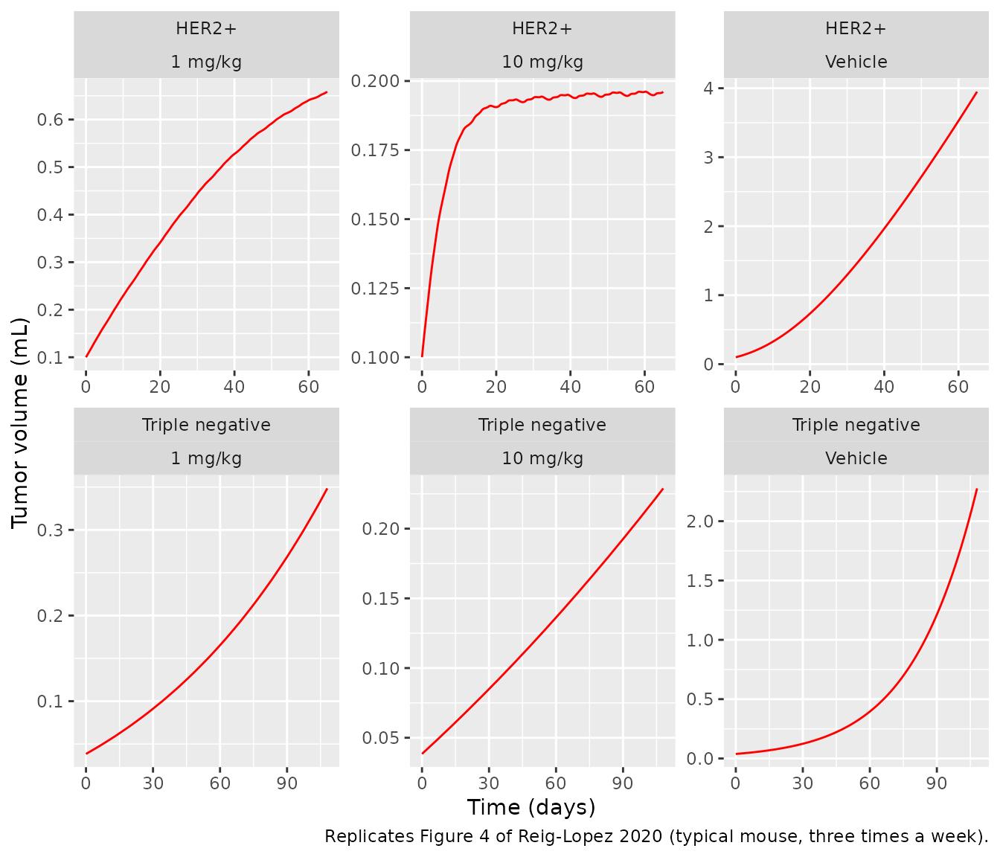
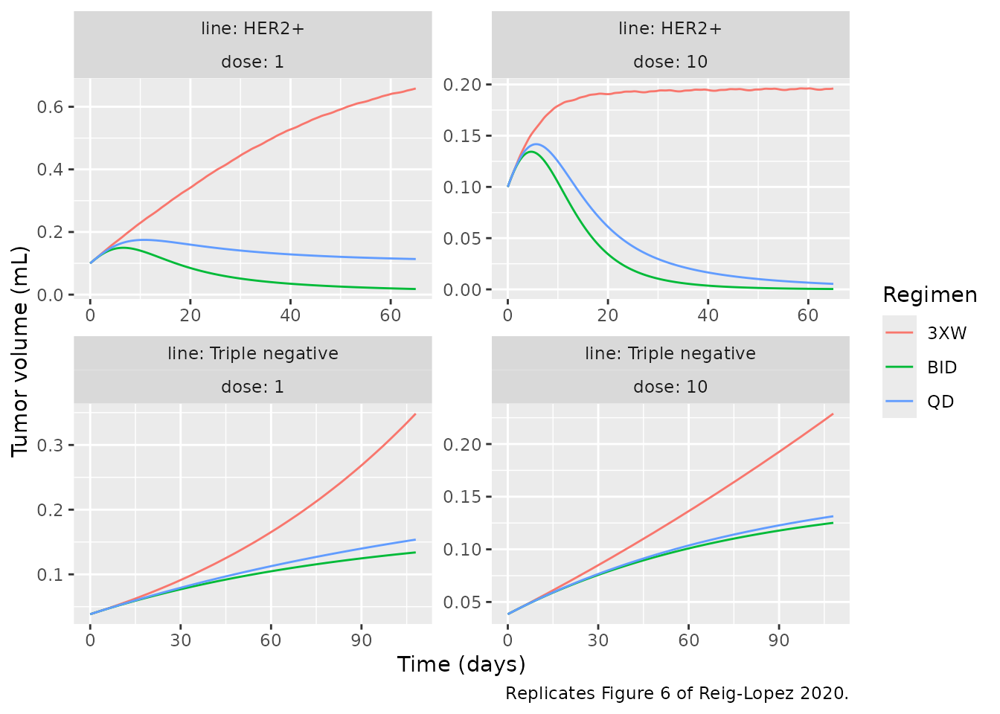

# MBQ-167 tumor growth inhibition in HER2+ and triple-negative xenografts (Reig-Lopez 2020)

## Models and source

Reig-Lopez 2020 built a physiologically based PK/PD model of MBQ-167, a
dual Rac/Cdc42 GTPase inhibitor, in mice. The PK half is a whole-body
PBPK model built in the Simcyp Animal Simulator V19; the PD half is a
Simeoni 2004 tumor growth inhibition (TGI) model, fitted separately to
two orthotopic human breast cancer xenografts (HER2+ MDA-MB-435 and
triple-negative MDA-MB-231) with different parameter values and a
different number of damaged-cell transit compartments. The paper
therefore contributes two model files and this one vignette.

``` r

modHer2 <- rxode2::rxode2(readModelDb("ReigLopez_2020_mbq167_her2_mouse_tgi"))
modTnbc <- rxode2::rxode2(readModelDb("ReigLopez_2020_mbq167_tnbc_mouse_tgi"))
```

- Citation: Reig-Lopez J, Maldonado MdM, Merino-Sanjuan M, Cruz-Collazo
  AM, Ruiz-Calderon JF, Mangas-Sanjuan V, Dharmawardhane S, Duconge J.
  Physiologically-Based Pharmacokinetic/Pharmacodynamic Model of MBQ-167
  to Predict Tumor Growth Inhibition in Mice. Pharmaceutics.
  2020;12(10):975. <doi:10.3390/pharmaceutics12100975>. Parameter values
  from Table 2 and the drug-effect equation from Figure 1. Structural
  TGI formulation from Simeoni M, Magni P, Cammia C, De Nicolao G, Croci
  V, Pesenti E, Germani M, Poggesi I, Rocchetti M. Predictive
  pharmacokinetic-pharmacodynamic modeling of tumor growth kinetics in
  xenograft models after administration of anticancer agents. Cancer
  Res. 2004;64(3):1094-1101. <doi:10.1158/0008-5472.CAN-03-2524>.
- Article (open access): <https://doi.org/10.3390/pharmaceutics12100975>

| File | What it is |
|----|----|
| `ReigLopez_2020_mbq167_her2_mouse_tgi` | Simeoni TGI, HER2+ xenograft, 3 transit compartments |
| `ReigLopez_2020_mbq167_tnbc_mouse_tgi` | Simeoni TGI, triple-negative xenograft, 4 transit compartments |

**Why there is no PK in either file.** The whole-body PBPK layer is not
reproducible outside the Simcyp platform: Table 1 prints only the
compound inputs (fu, B/P, five optimized tissue Kp values, a Kp scalar,
hepatocyte intrinsic clearance, the tumor permeability-limited
parameters and the IP absorption), while the mouse organ volumes, blood
flows and tissue composition used by the Rodgers and Rowland
partitioning method (method 2) were Simcyp’s own mouse physiology
“modified to reproduce the mice population used” (Methods 2.8.7) and are
not printed. A one-compartment reduction also fails: the predicted Cmax
of 833 ng/mL is well above the dose / Vss ceiling of 0.2 mg / 0.404 L =
495 ng/mL. The PD half, by contrast, is fully printed (Table 2 and the
drug-effect equation in Figure 1), and its only input is the total
plasma concentration Cp(t). Both files therefore take the plasma
concentration as the time-varying covariate `CP_MBQ167_NGML` (ng/mL). No
MBQ-167 PK model exists in `nlmixr2lib` to chain with; this vignette
builds the driver from the paper’s own predicted plasma profile (next
section).

## Population

Female athymic nude (nu/nu) mice, 4 to 5 weeks old, bearing orthotopic
mammary fat pad tumors of GFP-tagged MDA-MB-435 (HER2+, described as
HER2++) or GFP-MDA-MB-231 (triple-negative) cells (Methods 2.6). After
tumor establishment (1 week post-inoculation) mice were randomised to
vehicle or MBQ-167 1, 5 or 10 mg/kg by IP injection every other day,
three times a week, n = 10 per group, until sacrifice at day 65 (HER2+)
or day 108 (triple negative). The tumor data were first published by
Humphries-Bickley 2017 (reference 18 of the paper). The model was fitted
to the vehicle, 1 and 10 mg/kg groups; the 5 mg/kg group is not
modelled. Tumor growth was measured as GFP fluorescence integrated
density and is reported as tumor volume in mL.

The plasma PK that drives the PD comes from a separate experiment in
female BALB/c mice given a single 10 mg/kg IP dose (0.2 mg for a 20 g
mouse; Table 1 and Methods 2.2).

The fit is a typical-mouse fit (Simcyp parameter estimation, weighted
least squares; Methods 2.8.1); no inter-individual or residual
variability is reported, so the simulations below are deterministic.

## Source trace

| Quantity | HER2+ | Triple negative | Source |
|----|----|----|----|
| Initial tumor volume (mL), `lrbase_tumor` | 0.1 (assumed, fixed) | 0.0384 | Table 2 |
| lambda0 (1/day), `ltumorExpGrowth` | 0.2 | 0.0393 | Table 2 |
| lambda1 (g/day, read as mL/day), `ltumorLinGrowth` | 0.12 | 0.5457 | Table 2 |
| Psi, `psi` | 0.7 | 0.9985 | Table 2 |
| Number of transit compartments | 3 | 4 | Table 2; Figure 1; Results 3.2 |
| k1 (1/day), `ldamageTransit` | 0.39 | 0.0007 | Table 2 |
| IC50 (uM), `lic50` | 0.0187 | 0.0001 | Table 2 |
| Kmax (1/day), `lkmax` | 0.3683 | 0.0533 | Table 2 |
| Hill coefficient, `lhill` | 0.5 | 0.5 | Table 2 |
| Drug input | total plasma concentration | total plasma concentration | Table 2; Figure 1 |
| Drug effect `Kmax * Cp^H / (IC50^H + Cp^H)` |  |  | Figure 1 |
| Molecular weight 338.414 g/mol (ng/mL to uM) |  |  | Table 1 |
| Simeoni growth and transit-chain equations |  |  | Simeoni 2004 (reference 10 of the paper); Figure 1 |
| Residual error `propSd_tumor_vol` | fixed(0) | fixed(0) | not reported |

The paper’s own consistency check reproduces from these values: the “net
effect” Kmax / IC50 is 0.3683 / 0.0187 = 19.7 for HER2+ and 0.0533 /
0.0001 = 533 for triple negative (Results 3.2).

``` r

netEffect <- c(her2 = 0.3683 / 0.0187, tnbc = 0.0533 / 0.0001)
netEffect
#>      her2      tnbc 
#>  19.69519 533.00000
stopifnot(abs(netEffect[["her2"]] - 19.7) < 0.05, abs(netEffect[["tnbc"]] - 533) < 0.5)
```

## The exposure driver

The TGI model needs Cp(t) under repeated IP dosing. The paper’s
predicted typical plasma profile after a single 10 mg/kg IP dose (red
line of Figure 2) was digitised by the maintainers from the figure
raster over 0.3-11.9 h. The rising limb is represented by the lag time
(0.17 h, Table 1) and the printed Cmax (833.31 ng/mL, Table 3) at the
printed Tmax (0.26 h, Discussion), and the profile beyond 11.9 h is
extrapolated mono-exponentially with the printed terminal half-life
(2.98 h, Discussion). The whole-body PBPK model is linear (first-order
absorption, linear clearances, no saturable process), so 1 mg/kg is the
10 mg/kg profile scaled by 0.1, and repeated doses superpose.

``` r

cpDigitised <- tibble::tribble(
  ~time_h, ~cp_ngml,
  0,     0,
  0.17,  0,
  0.26,  833.31,
  0.3,   815.1,
  0.35,  792.4,
  0.4,   767.6,
  0.45,  729.5,
  0.5,   678.2,
  0.6,   613.7,
  0.7,   546.2,
  0.8,   485.8,
  0.9,   432.5,
  1,     405.7,
  1.25,  313.4,
  1.5,   264.9,
  1.75,  232.3,
  2,     209.6,
  2.5,   178.0,
  3,     160.0,
  3.5,   137.3,
  4,     122.2,
  5,     96.5,
  6,     77.0,
  7,     60.8,
  8,     48.2,
  9,     38.2,
  10,    30.2,
  11,    24.5,
  11.9,  19.4
)
tHalfTerminal <- 2.98 # h, Discussion

# Single 10 mg/kg IP dose, total plasma concentration (ng/mL) at hours after dose.
cpSingle10 <- function(th) {
  out <- stats::approx(cpDigitised$time_h, cpDigitised$cp_ngml, xout = th, rule = 2)$y
  lastT <- max(cpDigitised$time_h)
  lastC <- cpDigitised$cp_ngml[nrow(cpDigitised)]
  tail <- th > lastT
  out[tail] <- lastC * exp(-log(2) / tHalfTerminal * (th[tail] - lastT))
  out[th < 0] <- 0
  out
}

# Superposed trajectory (ng/mL) at times in days for doses at doseDays.
cpTrajectory <- function(timeDay, doseMgKg, doseDays) {
  if (doseMgKg == 0) {
    return(rep(0, length(timeDay)))
  }
  lagH <- outer(timeDay, doseDays, "-") * 24
  contrib <- matrix(cpSingle10(as.vector(lagH)), nrow = length(timeDay))
  rowSums(contrib) * doseMgKg / 10
}
```

### PKNCA check of the driver against the paper’s predicted profile

A PKNCA analysis of the single-dose driver confirms that the digitised
curve reproduces the paper’s reported predicted exposure: Cmax and
AUC0-t (0-12 h) from Table 3, Tmax and the terminal half-life from the
Discussion.

``` r

tGrid <- sort(unique(c(0, 0.17, seq(0.2, 12, by = 0.02))))
driverConc <- data.frame(
  id = 1L, treatment = "10 mg/kg IP",
  time = tGrid, Cc = cpSingle10(tGrid)
) |>
  dplyr::filter(!is.na(Cc))
driverDose <- data.frame(id = 1L, treatment = "10 mg/kg IP", time = 0, dose = 0.2)

concObj <- PKNCA::PKNCAconc(driverConc, Cc ~ time | treatment + id, concu = "ng/mL", timeu = "h")
doseObj <- PKNCA::PKNCAdose(driverDose, dose ~ time | treatment + id, doseu = "mg")
intervals <- data.frame(
  start = 0, end = 12,
  cmax = TRUE, tmax = TRUE, auclast = TRUE, half.life = TRUE
)
ncaRes <- PKNCA::pk.nca(PKNCA::PKNCAdata(concObj, doseObj, intervals = intervals))

simulatedNca <- as.data.frame(ncaRes) |>
  dplyr::filter(PPTESTCD %in% c("cmax", "tmax", "auclast", "half.life")) |>
  dplyr::select(treatment, PPTESTCD, PPORRES)

publishedNca <- data.frame(
  treatment = "10 mg/kg IP",
  cmax = 833.31, tmax = 0.26, auclast = 1549.1, half.life = 2.98
)

cmpNca <- nlmixr2lib::ncaComparisonTable(
  simulated = simulatedNca,
  reference = publishedNca,
  by = "treatment",
  units = c(cmax = "ng/mL", tmax = "h", auclast = "ng*h/mL", half.life = "h"),
  tolerance_pct = 20
)
cmpNca |>
  dplyr::rename("Regimen" = treatment) |>
  knitr::kable(
    caption = paste(
      "Digitised driver versus the paper's predicted single-dose plasma exposure",
      "(Table 3 Cmax and AUC0-t over 0-12 h; Discussion Tmax and t1/2).",
      "* differs by more than 20%."
    ),
    digits = 3
  )
```

| NCA parameter      | Regimen     | Reference | Simulated | % diff |
|:-------------------|:------------|:----------|:----------|:-------|
| Cmax (ng/mL)       | 10 mg/kg IP | 833       | 833       | +0.0%  |
| Tmax (h)           | 10 mg/kg IP | 0.26      | 0.26      | +0.0%  |
| AUClast (ng\*h/mL) | 10 mg/kg IP | 1550      | 1530      | -1.2%  |
| t½ (h)             | 10 mg/kg IP | 2.98      | 2.99      | +0.3%  |

Digitised driver versus the paper’s predicted single-dose plasma
exposure (Table 3 Cmax and AUC0-t over 0-12 h; Discussion Tmax and
t1/2). \* differs by more than 20%. {.table}

``` r

ncaVal <- stats::setNames(simulatedNca$PPORRES, simulatedNca$PPTESTCD)
stopifnot(
  abs(ncaVal[["cmax"]] / 833.31 - 1) < 0.01,
  abs(ncaVal[["auclast"]] / 1549.1 - 1) < 0.05,
  abs(ncaVal[["half.life"]] / 2.98 - 1) < 0.10
)
```

## Replicating Figure 4: vehicle, 1 and 10 mg/kg three times a week

“Every other day, three times a week” is encoded as dosing on days 0, 2
and 4 of every week (Monday, Wednesday, Friday), starting at time 0. The
covariate is supplied every 30 minutes with linear interpolation.

``` r

threeTimesWeekly <- function(endDay) {
  d <- as.vector(outer(c(0, 2, 4), seq(0, endDay, by = 7), "+"))
  sort(d[d < endDay])
}

solveTgi <- function(mod, doseMgKg, doseDays, endDay, arm) {
  tDay <- seq(0, endDay, by = 1 / 48)
  ev <- data.frame(
    id = 1L, time = tDay, evid = 0L,
    CP_MBQ167_NGML = cpTrajectory(tDay, doseMgKg, doseDays)
  )
  sim <- rxode2::rxSolve(mod, ev, covsInterpolation = "linear", returnType = "data.frame")
  data.frame(arm = arm, time = sim$time, tumor_vol = sim$tumor_vol)
}

arms <- tibble::tribble(
  ~line,             ~dose, ~end,
  "HER2+",           0,     65,
  "HER2+",           1,     65,
  "HER2+",           10,    65,
  "Triple negative", 0,     108,
  "Triple negative", 1,     108,
  "Triple negative", 10,    108
)

fig4 <- lapply(seq_len(nrow(arms)), function(i) {
  a <- arms[i, ]
  mod <- if (a$line == "HER2+") modHer2 else modTnbc
  armLabel <- if (a$dose == 0) "Vehicle" else paste(a$dose, "mg/kg")
  out <- solveTgi(mod, a$dose, threeTimesWeekly(a$end), a$end, armLabel)
  out$line <- a$line
  out$dose <- a$dose
  out
}) |>
  dplyr::bind_rows()
```

``` r

ggplot(fig4, aes(time, tumor_vol)) +
  geom_line(colour = "red") +
  facet_wrap(~ line + arm, scales = "free", ncol = 3) +
  labs(
    x = "Time (days)", y = "Tumor volume (mL)",
    caption = "Replicates Figure 4 of Reig-Lopez 2020 (typical mouse, three times a week)."
  )
```



The end-of-study predicted tumor volumes below were read by the
maintainers off the red typical-prediction lines of Figure 4 (to about
+/- 0.02 mL at the treated arms and +/- 0.1 mL at the vehicle arms). The
paper also prints the relative tumor size reduction at 10 mg/kg versus
vehicle: 94.3% for HER2+ (Discussion 4.2) and a predicted 89.6% for
triple negative (Discussion 4.2).

``` r

fig4End <- fig4 |>
  dplyr::group_by(line, arm, dose) |>
  dplyr::filter(time == max(time)) |>
  dplyr::ungroup() |>
  dplyr::select(line, arm, dose, day = time, simulated = tumor_vol)

fig4Published <- tibble::tribble(
  ~line,             ~dose, ~published,
  "HER2+",           0,     3.95,
  "HER2+",           1,     0.80,
  "HER2+",           10,    0.22,
  "Triple negative", 0,     2.20,
  "Triple negative", 1,     0.35,
  "Triple negative", 10,    0.23
)

fig4Cmp <- fig4End |>
  dplyr::left_join(fig4Published, by = c("line", "dose")) |>
  dplyr::mutate(pct_diff = 100 * (simulated / published - 1))

fig4Cmp |>
  dplyr::select(-dose) |>
  dplyr::rename(
    "Cell line" = line, "Arm" = arm, "Day" = day,
    "Simulated (mL)" = simulated, "Figure 4 (mL)" = published, "% diff" = pct_diff
  ) |>
  knitr::kable(digits = 3, caption = "End-of-study tumor volume, simulated versus Figure 4.")
```

| Cell line       | Arm      | Day | Simulated (mL) | Figure 4 (mL) |  % diff |
|:----------------|:---------|----:|---------------:|--------------:|--------:|
| HER2+           | Vehicle  |  65 |          3.950 |          3.95 |  -0.007 |
| HER2+           | 1 mg/kg  |  65 |          0.659 |          0.80 | -17.677 |
| HER2+           | 10 mg/kg |  65 |          0.196 |          0.22 | -10.874 |
| Triple negative | Vehicle  | 108 |          2.276 |          2.20 |   3.474 |
| Triple negative | 1 mg/kg  | 108 |          0.349 |          0.35 |  -0.428 |
| Triple negative | 10 mg/kg | 108 |          0.229 |          0.23 |  -0.474 |

End-of-study tumor volume, simulated versus Figure 4. {.table}

``` r


reduction <- fig4End |>
  dplyr::group_by(line) |>
  dplyr::summarise(
    reduction_pct = 100 * (1 - simulated[dose == 10] / simulated[dose == 0]),
    .groups = "drop"
  ) |>
  dplyr::mutate(published_pct = c(94.3, 89.6))
knitr::kable(
  reduction |>
    dplyr::rename(
      "Cell line" = line, "Simulated reduction (%)" = reduction_pct,
      "Published reduction (%)" = published_pct
    ),
  digits = 1,
  caption = "Relative reduction of the final tumor volume at 10 mg/kg versus vehicle."
)
```

| Cell line       | Simulated reduction (%) | Published reduction (%) |
|:----------------|------------------------:|------------------------:|
| HER2+           |                    95.0 |                    94.3 |
| Triple negative |                    89.9 |                    89.6 |

Relative reduction of the final tumor volume at 10 mg/kg versus vehicle.
{.table}

``` r

getCmp <- function(l, d) fig4Cmp$pct_diff[fig4Cmp$line == l & fig4Cmp$dose == d]
stopifnot(
  # Vehicle arms are drug-free: a pure check of the growth parameters.
  abs(getCmp("HER2+", 0)) < 5,
  abs(getCmp("Triple negative", 0)) < 8,
  # Triple-negative treated arms.
  abs(getCmp("Triple negative", 1)) < 10,
  abs(getCmp("Triple negative", 10)) < 10,
  # HER2+ treated arms: see the discussion of the driver tail below.
  abs(getCmp("HER2+", 1)) < 25,
  abs(getCmp("HER2+", 10)) < 25,
  # Relative reduction at 10 mg/kg.
  all(abs(reduction$reduction_pct - reduction$published_pct) < 2)
)
```

The vehicle arms (a drug-free test of lambda0, lambda1, Psi and the
initial volume) and both triple-negative treated arms reproduce Figure 4
closely, as does the relative tumor size reduction at 10 mg/kg in both
cell lines. The HER2+ treated arms end about 10-20% below the figure.
That gap belongs to the exposure driver rather than to the TGI
parameters. With a Hill coefficient of 0.5 and an IC50 of 6.3 ng/mL, the
HER2+ kill rate stays substantial well into the low-concentration tail
of each 48-72 h dosing interval, which is exactly the part of the
profile that Figure 2 does not show (it stops at 12 h) and that the
driver extrapolates from the printed half-life. The next chunk shows how
strongly the result depends on that tail.

``` r

cpNoTail <- function(timeDay, doseMgKg, doseDays) {
  lagH <- outer(timeDay, doseDays, "-") * 24
  v <- cpSingle10(as.vector(lagH))
  v[as.vector(lagH) > max(cpDigitised$time_h)] <- 0
  rowSums(matrix(v, nrow = length(timeDay))) * doseMgKg / 10
}
tDay <- seq(0, 65, by = 1 / 48)
evNoTail <- data.frame(
  id = 1L, time = tDay, evid = 0L,
  CP_MBQ167_NGML = cpNoTail(tDay, 1, threeTimesWeekly(65))
)
noTail <- rxode2::rxSolve(modHer2, evNoTail, covsInterpolation = "linear", returnType = "data.frame")
data.frame(
  driver = c("with half-life tail (default)", "truncated at 12 h"),
  HER2_1mgkg_day65_mL = c(
    fig4End$simulated[fig4End$line == "HER2+" & fig4End$dose == 1],
    utils::tail(noTail$tumor_vol, 1)
  )
) |>
  dplyr::rename("Driver" = driver, "Day-65 tumor volume (mL)" = HER2_1mgkg_day65_mL) |>
  knitr::kable(digits = 3, caption = "HER2+ 1 mg/kg day-65 tumor volume versus the driver tail (Figure 4: 0.80 mL).")
```

| Driver                        | Day-65 tumor volume (mL) |
|:------------------------------|-------------------------:|
| with half-life tail (default) |                    0.659 |
| truncated at 12 h             |                    1.213 |

HER2+ 1 mg/kg day-65 tumor volume versus the driver tail (Figure 4: 0.80
mL). {.table}

``` r

stopifnot(
  fig4End$simulated[fig4End$line == "HER2+" & fig4End$dose == 1] < 0.80,
  utils::tail(noTail$tumor_vol, 1) > 0.80
)
```

The two drivers bracket the published 0.80 mL, so the published line
lies between a driver that decays with the printed 2.98 h half-life and
one with no concentration past 12 h. Users driving these models from
their own MBQ-167 PK should supply the full profile, including the tail.

## Replicating Figure 6: intensive dosing regimens

Figure 6 compares three times a week (3XW) with once daily (QD) and
twice daily (BID) dosing for each cell line and dose. The maintainers
read the end-of-study predicted tumor volumes off the figure.

``` r

regimens <- list(
  "3XW" = threeTimesWeekly,
  "QD"  = function(endDay) seq(0, endDay - 1, by = 1),
  "BID" = function(endDay) seq(0, endDay - 0.5, by = 0.5)
)
fig6Arms <- expand.grid(
  line = c("HER2+", "Triple negative"), dose = c(1, 10),
  regimen = names(regimens), stringsAsFactors = FALSE
)
fig6 <- lapply(seq_len(nrow(fig6Arms)), function(i) {
  a <- fig6Arms[i, ]
  endDay <- if (a$line == "HER2+") 65 else 108
  mod <- if (a$line == "HER2+") modHer2 else modTnbc
  out <- solveTgi(mod, a$dose, regimens[[a$regimen]](endDay), endDay, a$regimen)
  out$line <- a$line
  out$dose <- a$dose
  out
}) |>
  dplyr::bind_rows()

ggplot(fig6, aes(time, tumor_vol, colour = arm)) +
  geom_line() +
  facet_wrap(~ line + dose, scales = "free", labeller = label_both) +
  labs(
    x = "Time (days)", y = "Tumor volume (mL)", colour = "Regimen",
    caption = "Replicates Figure 6 of Reig-Lopez 2020."
  )
```



``` r

fig6End <- fig6 |>
  dplyr::group_by(line, dose, arm) |>
  dplyr::filter(time == max(time)) |>
  dplyr::ungroup() |>
  dplyr::select(line, dose, regimen = arm, simulated = tumor_vol)

fig6Published <- tibble::tribble(
  ~line,             ~dose, ~regimen, ~published,
  "HER2+",           1,     "QD",     0.13,
  "HER2+",           1,     "BID",    0.02,
  "HER2+",           10,    "QD",     0.007,
  "HER2+",           10,    "BID",    0.001,
  "Triple negative", 1,     "QD",     0.155,
  "Triple negative", 1,     "BID",    0.135,
  "Triple negative", 10,    "QD",     0.130,
  "Triple negative", 10,    "BID",    0.125
)
fig6Cmp <- fig6End |>
  dplyr::inner_join(fig6Published, by = c("line", "dose", "regimen"))
fig6Cmp |>
  dplyr::rename(
    "Cell line" = line, "Dose (mg/kg)" = dose, "Regimen" = regimen,
    "Simulated (mL)" = simulated, "Figure 6 (approx., mL)" = published
  ) |>
  knitr::kable(digits = 4, caption = "End-of-study tumor volume under intensive regimens.")
```

| Cell line       | Dose (mg/kg) | Regimen | Simulated (mL) | Figure 6 (approx., mL) |
|:----------------|-------------:|:--------|---------------:|-----------------------:|
| HER2+           |            1 | QD      |         0.1137 |                  0.130 |
| Triple negative |            1 | QD      |         0.1537 |                  0.155 |
| HER2+           |           10 | QD      |         0.0054 |                  0.007 |
| Triple negative |           10 | QD      |         0.1314 |                  0.130 |
| HER2+           |            1 | BID     |         0.0179 |                  0.020 |
| Triple negative |            1 | BID     |         0.1339 |                  0.135 |
| HER2+           |           10 | BID     |         0.0004 |                  0.001 |
| Triple negative |           10 | BID     |         0.1252 |                  0.125 |

End-of-study tumor volume under intensive regimens. {.table}

``` r

end6 <- function(l, d, r) fig6End$simulated[fig6End$line == l & fig6End$dose == d & fig6End$regimen == r]
tn6 <- fig6Cmp |> dplyr::filter(line == "Triple negative")
stopifnot(
  # Triple negative: values read off the figure to about +/- 0.005 mL.
  all(abs(tn6$simulated / tn6$published - 1) < 0.08),
  # HER2+: the paper's qualitative claims -- near-eradication at 1 mg/kg BID
  # and at 10 mg/kg QD or BID, and BID < QD < 3XW at both doses.
  end6("HER2+", 1, "BID") < 0.05,
  end6("HER2+", 10, "QD") < 0.02,
  end6("HER2+", 10, "BID") < 0.005,
  end6("HER2+", 1, "BID") < end6("HER2+", 1, "QD"),
  end6("HER2+", 1, "QD") < end6("HER2+", 1, "3XW"),
  end6("HER2+", 10, "QD") < end6("HER2+", 10, "3XW"),
  # Triple negative: QD and BID stabilise the tumor well below 3XW.
  end6("Triple negative", 1, "QD") < 0.6 * end6("Triple negative", 1, "3XW"),
  end6("Triple negative", 10, "QD") < 0.7 * end6("Triple negative", 10, "3XW")
)
```

The triple-negative QD and BID curves match Figure 6 closely, including
the near-overlap of QD and BID (the kill rate is close to Kmax all day
at either frequency because the IC50 is 0.034 ng/mL). The HER2+ ordering
and the predicted eradication at 1 mg/kg BID and 10 mg/kg QD/BID are
reproduced.

## Assumptions and deviations

- **PD-only extraction.** The Simcyp Animal V19 whole-body PBPK model
  (plasma, five tissues and a permeability-limited tumor) is not
  reproducible outside the platform, because the modified mouse
  physiology it runs on is not printed. The plasma concentration
  therefore enters as the covariate `CP_MBQ167_NGML`. The tissue and
  tumor PK in Figures 2-3 and Table 3 are not modelled.
- **Exposure driver for validation.** The plasma trajectory used in this
  vignette is the paper’s own predicted single-dose profile digitised by
  the maintainers from Figure 2 (0.3-11.9 h), with the printed lag time,
  Cmax and Tmax anchoring the rising limb and the printed 2.98 h
  half-life extrapolating past 12 h, superposed across doses. It
  reproduces Table 3’s predicted Cmax and AUC0-t within a few percent.
  It is a validation device, not part of either model file. The PK mice
  (BALB/c) and the TGI mice (athymic nude) differ, as in the paper.
- **Dosing calendar.** “Every other day, three times a week” is encoded
  as days 0, 2 and 4 of each week starting at time 0. The paper does not
  state which weekdays were used or whether the simulation started on
  day 0 or day 1 (Figure 4’s HER2+ curves start at day 1).
- **Simeoni growth term.** The paper cites Simeoni 2004 for the growth
  and transit equations and prints only the drug-effect equation (Figure
  1). The files use the Simeoni 2004 form, in which the growth
  saturation depends on total tumor volume (cycling plus damaged cells),
  with the shape factor Psi taken from Table 2 instead of Simeoni’s
  fixed 20. Using the cycling compartment alone in the saturation term
  was checked by the maintainers and overshoots the HER2+ treated arms
  of Figure 4 by 15-55%, so the standard form was kept.
- **Transit-compartment count.** Table 2’s “Number of transit
  compartments” (3 for HER2+, 4 for triple negative) is read as the
  number of damaged-cell states between the cycling compartment and
  death, matching TS1-TS3 in Figure 1.
- **Units.** Table 2 prints lambda1 in g/day while tumor volume is in
  mL; tumor tissue is taken as 1 g/mL, so lambda1 is mL/day. IC50 is in
  uM and the plasma concentration is converted from ng/mL with the Table
  1 molecular weight (338.414 g/mol). The Results text gives the net
  effect Kmax / IC50 in “mL/ng day-1”, but the numbers (19.7 and 533)
  are Kmax (1/day) divided by IC50 in uM.
- **Fixed and estimated parameters.** Only the HER2+ initial tumor
  volume is marked “assumed” in Table 2 and is encoded with `fixed()`.
  The values marked “optimized to best fit the observed data” are final
  fitted values, so they are not fixed.
- **No variability.** Simcyp’s mouse simulator fits a typical mouse only
  (Discussion); no inter-individual or residual variability is reported.
  The proportional residual error is carried as `fixed(0)`.
- **5 mg/kg arm.** Methods 2.6 lists a 5 mg/kg group, but the paper
  models only vehicle, 1 and 10 mg/kg.
