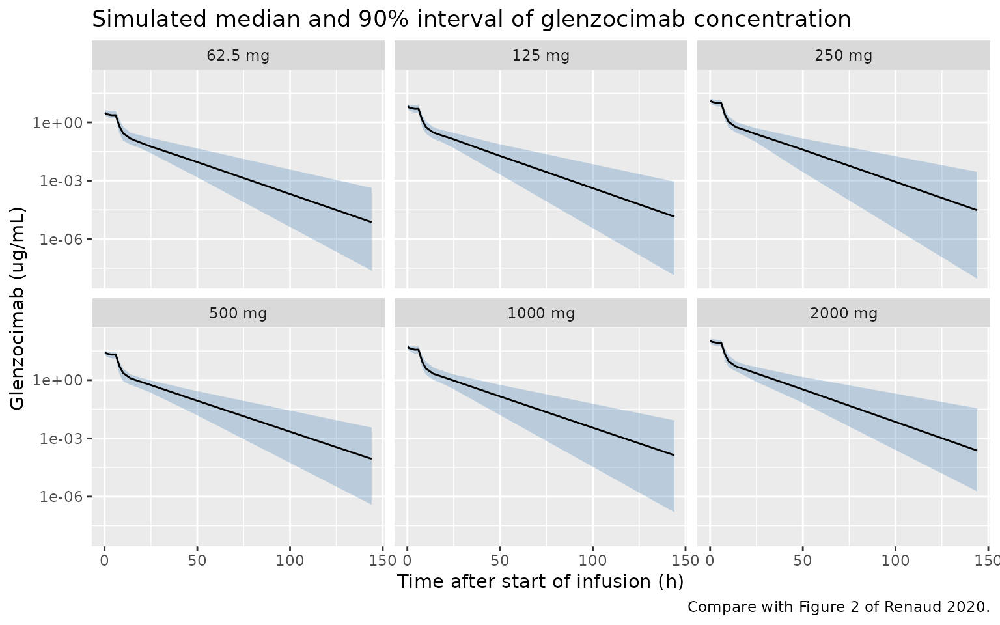
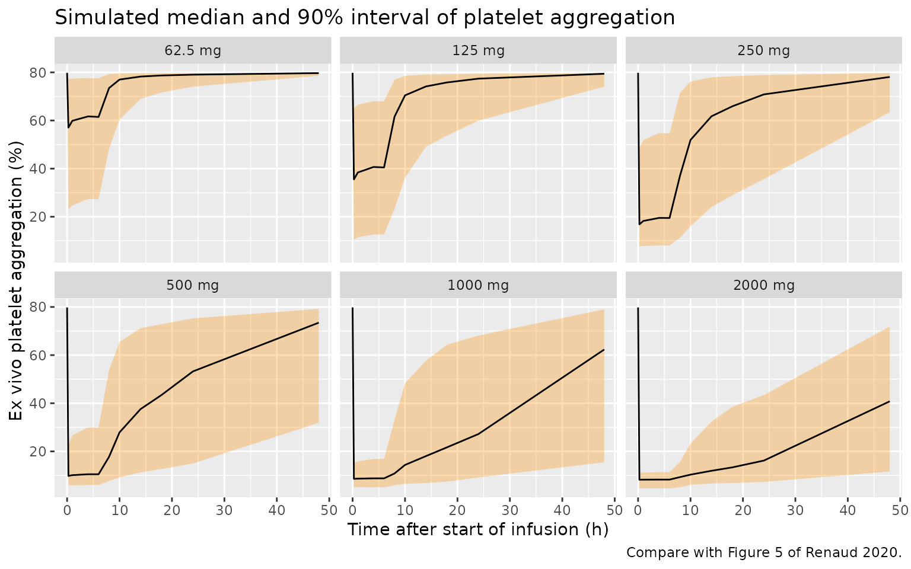
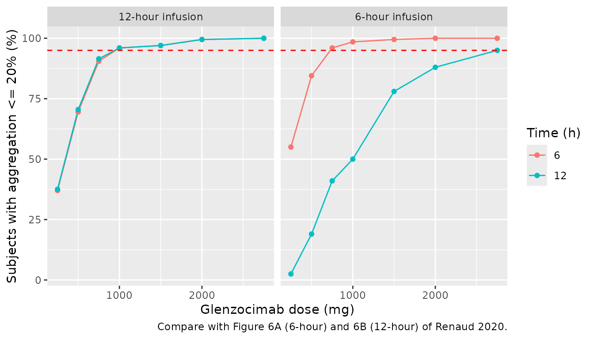

# Glenzocimab (Renaud 2020)

## Model and source

- Citation: Renaud L, Lebozec K, Voors-Pette C, Dogterom P, Billiald P,
  Jandrot Perrus M, Pletan Y, Machacek M. Population
  Pharmacokinetic/Pharmacodynamic Modeling of Glenzocimab (ACT017) a
  Glycoprotein VI Inhibitor of Collagen-Induced Platelet Aggregation. J
  Clin Pharmacol. 2020;60(9):1198-1208. <doi:10.1002/jcph.1616>
- Description: Two-compartment population PK model with a direct
  (immediate) Imax model of ex vivo collagen-induced platelet
  aggregation for glenzocimab (ACT017), an anti-GPVI Fab, in healthy
  volunteers (Renaud 2020)
- Article: <https://doi.org/10.1002/jcph.1616> (open access, PMC7496554)

Glenzocimab (ACT017) is a humanized Fab directed against platelet
glycoprotein VI (GPVI). Renaud 2020 fit a joint population PK/PD model
in Monolix 2018R1 to plasma glenzocimab concentrations and ex vivo
collagen-induced platelet aggregation (light-transmission aggregometry,
% aggregation) from the phase I single-ascending-dose study.

## Population

36 healthy volunteers received glenzocimab (6 per dose group at 62.5,
125, 250, 500, 1000 and 2000 mg; 12 further placebo subjects did not
contribute to the model). 36.1% were female, 91.7% White; median age 56
years (22-63), median body weight 74 kg (52-107), median creatinine 0.77
mg/dL (0.46-1.2), median platelet count 207 x 10^9/L (159-323); 19% had
mild renal impairment by eGFR (Renaud 2020 Table 1). Every dose was a
6-hour IV infusion with 25% of the dose in the first 15 minutes and 75%
over the remaining 5 h 45 min. 390 PK and 404 PD observations were
analysed.

The same information is available programmatically via
`readModelDb("Renaud_2020_glenzocimab")()$population`.

## Source trace

| Equation / parameter | Value | Source location |
|----|----|----|
| Two-compartment linear PK, central elimination | – | Methods, ‘Population PK and PD Base Structural Model’ |
| Two-rate infusion (25% over 15 min, 75% over 5.75 h) | – | Methods, same section |
| `PPA = Base_PPA - Imax * C / (IC50 + C)` | – | Eq. 1 |
| Power covariate model `phi_pop * (cov/ref)^beta * exp(eta)` | – | Eq. 3 and Table 2 footnotes c-j |
| Combined error `yobs = ypred + (a1 + b1 * ypred) * eps` | – | Eq. 5 |
| Logit-normal PD error on 0-100% | – | Eq. 6 |
| `lcl` | log(2.67) L/h | Table 2 |
| `lvc` | log(4.1) L | Table 2 |
| `lq` | log(0.626) L/h | Table 2 |
| `lvp` | log(6.89) L | Table 2 |
| `lrbase` (Base_PPA) | log(79.8) % | Table 2 |
| `lic50` | log(0.924) ug/mL | Table 2 |
| `limax` | log(72.9) % | Table 2 |
| `e_age_cl`, `e_wt_cl`, `e_creat_cl` | -0.304, 1.09, -0.566 | Table 2 (footnotes c, d, e) |
| `e_wt_vc` | 0.694 | Table 2 (footnote f) |
| `e_age_q`, `e_wt_q` | -0.318, 0.812 | Table 2 (footnotes g, h) |
| `e_dose_ic50` | -0.989 | Table 2 (footnote i, reference 500 mg) |
| `e_plt_imax` | 0.17 | Table 2 (footnote j, reference 220 x 10^9/L) |
| omega CL, V1, Q, V2, IC50 (SD) | 0.182, 0.148, 0.144, 0.265, 1.35 | Table 2 |
| r V1-CL, Q-CL, V1-Q | 0.626, 0.796, 0.84 | Table 2 |
| `addSd`, `propSd` | 0.0869 ug/mL, 0.0514 | Table 2 (a1, b1) |
| `addSd_PPA` | 0.778 (logit scale) | Table 2 (a2) |
| Covariate references 70 kg, 50 y, 0.79 mg/dL, 220 x 10^9/L | – | Methods, ‘Population PK/PD Stochastic Model’ |

## Deterministic checks against the paper’s derived values

The paper derives an initial half-life of 0.84 h and a terminal
half-life of 9.6 h from the typical parameters, an IC50 of 0.47 ug/mL
for a 1000 mg dose, and an Imax that varies from 69% to 78% over the
observed platelet-count range (159-323 x 10^9/L). All four follow in
closed form from the packaged parameters.

``` r

mod <- rxode2::rxode(readModelDb("Renaud_2020_glenzocimab"))
#> ℹ parameter labels from comments will be replaced by 'label()'
p <- mod$theta
cl <- exp(p[["lcl"]])
vc <- exp(p[["lvc"]])
q <- exp(p[["lq"]])
vp <- exp(p[["lvp"]])
k10 <- cl / vc
k12 <- q / vc
k21 <- q / vp
s <- k10 + k12 + k21
lambda <- (s + c(1, -1) * sqrt(s^2 - 4 * k10 * k21)) / 2
thalf <- log(2) / lambda
ic50_1000 <- exp(p[["lic50"]]) * (1000 / 500)^p[["e_dose_ic50"]]
imax_range <- exp(p[["limax"]]) * (c(159, 323) / 220)^p[["e_plt_imax"]]

knitr::kable(
  data.frame(
    Quantity = c(
      "Initial half-life (h)", "Terminal half-life (h)",
      "IC50 at 1000 mg (ug/mL)", "Imax at PLT 159 (%)", "Imax at PLT 323 (%)"
    ),
    Packaged = signif(c(thalf, ic50_1000, imax_range), 3),
    Paper = c(0.84, 9.6, 0.47, 69, 78)
  )
)
```

| Quantity                | Packaged | Paper |
|:------------------------|---------:|------:|
| Initial half-life (h)   |    0.842 |  0.84 |
| Terminal half-life (h)  |    9.640 |  9.60 |
| IC50 at 1000 mg (ug/mL) |    0.466 |  0.47 |
| Imax at PLT 159 (%)     |   69.000 | 69.00 |
| Imax at PLT 323 (%)     |   77.800 | 78.00 |

``` r


# Closed-form: the difference is only the paper's rounding.
stopifnot(
  abs(thalf[1] - 0.84) < 0.01,
  abs(thalf[2] - 9.6) < 0.1,
  abs(ic50_1000 - 0.47) < 0.01,
  abs(imax_range[1] - 69) < 0.5,
  abs(imax_range[2] - 78) < 0.5
)
```

## Dosing helper

The phase I regimen is two consecutive zero-order infusions into
`central`. Observation rows carry `dvid = 1`: the model has two error
endpoints (`Cc` and `PPA`), and with `dvid = 1` on every observation row
the solve returns both as columns. The `DOSE` covariate is the subject’s
total dose (mg).

``` r

make_events <- function(ids, dose, obs_times, inf_h = 6, first_frac = 0.25) {
  one <- function(i) {
    doses <- data.frame(
      id = i, time = c(0, 0.25),
      amt = dose * c(first_frac, 1 - first_frac),
      rate = dose * c(first_frac / 0.25, (1 - first_frac) / (inf_h - 0.25)),
      evid = 1L, cmt = "central", dvid = NA_integer_
    )
    obs <- data.frame(
      id = i, time = obs_times, amt = 0, rate = 0,
      evid = 0L, cmt = NA_character_, dvid = 1L
    )
    dplyr::bind_rows(doses, obs)
  }
  ev <- dplyr::bind_rows(lapply(ids, one))
  ev$DOSE <- dose
  ev
}

# Truncated-normal covariate draw (reject and redraw), centred on the Table 1
# medians with SD = range / 4; the paper sampled from the phase I means and SDs
# truncated at the observed extremes but printed only medians and ranges.
draw_trunc <- function(n, centre, lo, hi) {
  x <- rnorm(n, centre, (hi - lo) / 4)
  bad <- x < lo | x > hi
  while (any(bad)) {
    x[bad] <- rnorm(sum(bad), centre, (hi - lo) / 4)
    bad <- x < lo | x > hi
  }
  x
}

make_cohort <- function(ids) {
  n <- length(ids)
  data.frame(
    id = ids,
    WT = draw_trunc(n, 74, 52, 107),
    AGE = draw_trunc(n, 56, 22, 63),
    CREAT = draw_trunc(n, 0.77, 0.46, 1.2),
    PLT = draw_trunc(n, 207, 159, 323)
  )
}
```

## Virtual phase I cohort and VPC-style profiles

100 virtual subjects per phase I dose group, sampled at the phase I
PK/PD schedule (pre-dose, 0.25, 1, 4, 6, 8, 10, 14, 18, 24, 48 and 144
h).

``` r

set.seed(20200901) # covariate draws (base R)
rxode2::rxSetSeed(20200901) # etas
doses_p1 <- c(62.5, 125, 250, 500, 1000, 2000)
n_arm <- 100
obs_p1 <- c(0, 0.25, 1, 4, 6, 8, 10, 14, 18, 24, 48, 144)

ev_p1 <- dplyr::bind_rows(lapply(seq_along(doses_p1), function(k) {
  ids <- (k - 1) * n_arm + seq_len(n_arm)
  make_events(ids, doses_p1[k], obs_p1)
}))
cov_p1 <- make_cohort(unique(ev_p1$id))
ev_p1 <- dplyr::left_join(ev_p1, cov_p1, by = "id")

# Tight tolerances: at 144 h a fast-clearing subject is ~15 half-lives out, and
# default-tolerance ODE noise can turn a ~1e-6 ug/mL value slightly negative.
sim_p1 <- rxode2::rxSolve(mod, ev_p1, returnType = "data.frame", atol = 1e-12, rtol = 1e-10) |>
  dplyr::mutate(id = as.integer(as.character(id))) |>
  dplyr::mutate(dose_group = factor(paste(DOSE, "mg"), levels = paste(doses_p1, "mg")))
```

The concentration and aggregation profiles are summarised from the
individual predictions `Cc` and `PPA` (no residual error).

``` r

prof <- sim_p1 |>
  dplyr::select(dose_group, id, time, Cc, PPA) |>
  tidyr::pivot_longer(c(Cc, PPA), names_to = "endpoint") |>
  dplyr::group_by(dose_group, endpoint, time) |>
  dplyr::summarise(
    q05 = quantile(value, 0.05), q50 = median(value), q95 = quantile(value, 0.95),
    .groups = "drop"
  )

ggplot(dplyr::filter(prof, endpoint == "Cc", time > 0), aes(time, q50)) +
  geom_ribbon(aes(ymin = q05, ymax = q95), alpha = 0.3, fill = "steelblue") +
  geom_line() +
  scale_y_log10() +
  facet_wrap(~dose_group) +
  labs(
    x = "Time after start of infusion (h)", y = "Glenzocimab (ug/mL)",
    title = "Simulated median and 90% interval of glenzocimab concentration",
    caption = "Compare with Figure 2 of Renaud 2020."
  )
```



``` r


ggplot(dplyr::filter(prof, endpoint == "PPA", time <= 48), aes(time, q50)) +
  geom_ribbon(aes(ymin = q05, ymax = q95), alpha = 0.3, fill = "darkorange") +
  geom_line() +
  facet_wrap(~dose_group) +
  labs(
    x = "Time after start of infusion (h)", y = "Ex vivo platelet aggregation (%)",
    title = "Simulated median and 90% interval of platelet aggregation",
    caption = "Compare with Figure 5 of Renaud 2020."
  )
```



## PKNCA validation

Renaud 2020 does not print an NCA table. The checks are therefore (i)
that the simulated terminal half-life of a reference subject (70 kg, 50
years, creatinine 0.79 mg/dL) reproduces the paper’s 9.6 h and its
AUC(0-inf) reproduces Dose / CL = Dose / 2.67 L/h, and (ii) that
exposure in the virtual phase I cohort is dose proportional, as the
paper reports (Figure S1).

``` r

obs_dense <- sort(unique(c(0, 0.25, seq(0.5, 12, by = 0.5), seq(13, 48, by = 1), seq(52, 144, by = 4))))
ev_typ <- dplyr::bind_rows(lapply(seq_along(doses_p1), function(k) {
  make_events(k, doses_p1[k], obs_dense)
})) |>
  dplyr::mutate(WT = 70, AGE = 50, CREAT = 0.79, PLT = 220)

sim_typ <- rxode2::rxSolve(rxode2::zeroRe(mod), ev_typ, returnType = "data.frame") |>
  dplyr::mutate(id = as.integer(as.character(id))) |>
  dplyr::mutate(treatment = paste(DOSE, "mg"))
#> ℹ omega/sigma items treated as zero: 'etalcl', 'etalvc', 'etalq', 'etalvp', 'etalic50'
#> Warning: multi-subject simulation without without 'omega'

conc_typ <- sim_typ |>
  dplyr::filter(!is.na(Cc)) |>
  dplyr::select(id, time, Cc, treatment)
dose_typ <- ev_typ |>
  dplyr::filter(evid == 1, time == 0) |>
  dplyr::transmute(id, time, dose = DOSE, treatment = paste(DOSE, "mg"))

conc_obj <- PKNCA::PKNCAconc(conc_typ, Cc ~ time | treatment + id, concu = "ug/mL", timeu = "h")
dose_obj <- PKNCA::PKNCAdose(dose_typ, dose ~ time | treatment + id, doseu = "mg")
intervals <- data.frame(
  start = 0, end = Inf, cmax = TRUE, tmax = TRUE,
  aucinf.obs = TRUE, half.life = TRUE
)
nca_typ <- PKNCA::pk.nca(PKNCA::PKNCAdata(conc_obj, dose_obj, intervals = intervals))

sim_nca <- as.data.frame(nca_typ$result) |>
  dplyr::filter(PPTESTCD %in% c("aucinf.obs", "half.life")) |>
  dplyr::select(id, treatment, PPTESTCD, PPORRES)

reference <- data.frame(
  treatment = paste(doses_p1, "mg"),
  aucinf.obs = doses_p1 / 2.67,
  half.life = 9.6
)

cmp <- nlmixr2lib::ncaComparisonTable(
  simulated = sim_nca,
  reference = reference,
  by = "treatment",
  units = c(aucinf.obs = "h*ug/mL", half.life = "h"),
  tolerance_pct = 20
)
knitr::kable(cmp, caption = "Reference subject: simulated NCA vs the paper's typical CL (Dose / 2.67) and terminal half-life (9.6 h).")
```

| NCA parameter           | treatment | Reference | Simulated | % diff |
|:------------------------|:----------|:----------|:----------|:-------|
| AUC0-∞ (obs) (h\*ug/mL) | 62.5 mg   | 23.4      | 23.4      | +0.0%  |
| AUC0-∞ (obs) (h\*ug/mL) | 125 mg    | 46.8      | 46.8      | +0.0%  |
| AUC0-∞ (obs) (h\*ug/mL) | 250 mg    | 93.6      | 93.7      | +0.0%  |
| AUC0-∞ (obs) (h\*ug/mL) | 500 mg    | 187       | 187       | +0.0%  |
| AUC0-∞ (obs) (h\*ug/mL) | 1000 mg   | 375       | 375       | +0.0%  |
| AUC0-∞ (obs) (h\*ug/mL) | 2000 mg   | 749       | 749       | +0.0%  |
| t½ (h)                  | 62.5 mg   | 9.6       | 9.61      | +0.1%  |
| t½ (h)                  | 125 mg    | 9.6       | 9.61      | +0.1%  |
| t½ (h)                  | 250 mg    | 9.6       | 9.61      | +0.1%  |
| t½ (h)                  | 500 mg    | 9.6       | 9.61      | +0.1%  |
| t½ (h)                  | 1000 mg   | 9.6       | 9.61      | +0.1%  |
| t½ (h)                  | 2000 mg   | 9.6       | 9.61      | +0.1%  |

Reference subject: simulated NCA vs the paper’s typical CL (Dose / 2.67)
and terminal half-life (9.6 h). {.table}

``` r


chk <- sim_nca |>
  dplyr::left_join(
    tidyr::pivot_longer(reference, -treatment, names_to = "PPTESTCD", values_to = "ref"),
    by = c("treatment", "PPTESTCD")
  )
# Same drawn (typical) parameters on both sides: only lambda-z fitting and
# trapezoidal error separate them.
stopifnot(all(abs(chk$PPORRES / chk$ref - 1) < 0.03))
```

``` r

conc_p1 <- sim_p1 |>
  dplyr::filter(!is.na(Cc)) |>
  dplyr::mutate(treatment = as.character(dose_group)) |>
  dplyr::select(id, time, Cc, treatment)
dose_p1 <- ev_p1 |>
  dplyr::filter(evid == 1, time == 0) |>
  dplyr::transmute(id, time, dose = DOSE, treatment = paste(DOSE, "mg"))
intervals_p1 <- data.frame(start = 0, end = 144, cmax = TRUE, auclast = TRUE)
nca_p1 <- PKNCA::pk.nca(PKNCA::PKNCAdata(
  PKNCA::PKNCAconc(conc_p1, Cc ~ time | treatment + id, concu = "ug/mL", timeu = "h"),
  PKNCA::PKNCAdose(dose_p1, dose ~ time | treatment + id, doseu = "mg"),
  intervals = intervals_p1
))

dn <- as.data.frame(nca_p1$result) |>
  dplyr::filter(PPTESTCD %in% c("cmax", "auclast")) |>
  dplyr::mutate(dose = as.numeric(sub(" mg", "", treatment))) |>
  dplyr::group_by(treatment, dose, PPTESTCD) |>
  dplyr::summarise(median_dn = median(PPORRES / dose), .groups = "drop") |>
  tidyr::pivot_wider(names_from = PPTESTCD, values_from = median_dn) |>
  dplyr::arrange(dose)

dn |>
  dplyr::select(treatment, cmax, auclast) |>
  dplyr::rename(
    "Dose group" = treatment,
    "Median Cmax / Dose (ug/mL/mg)" = cmax,
    "Median AUC0-144 / Dose (h*ug/mL/mg)" = auclast
  ) |>
  knitr::kable(digits = 4, caption = "Dose-normalised exposure in the virtual phase I cohort.")
```

| Dose group | Median Cmax / Dose (ug/mL/mg) | Median AUC0-144 / Dose (h\*ug/mL/mg) |
|:---|---:|---:|
| 62.5 mg | 0.0501 | 0.3335 |
| 125 mg | 0.0552 | 0.3600 |
| 250 mg | 0.0537 | 0.3578 |
| 500 mg | 0.0551 | 0.3699 |
| 1000 mg | 0.0520 | 0.3310 |
| 2000 mg | 0.0552 | 0.3753 |

Dose-normalised exposure in the virtual phase I cohort. {.table}

``` r


# Each arm is an independent 100-subject cohort, so the arm medians scatter by
# sampling noise (about 3% SE each, up to ~15% across six arms). Exact linearity
# is already gated on the reference subject above; this envelope only catches a
# dose-dependent structure (a saturable pathway would move the extreme arms by
# far more than 30%).
stopifnot(
  max(dn$auclast) / min(dn$auclast) < 1.3,
  max(dn$cmax) / min(dn$cmax) < 1.3
)
```

## Replicating the dose-selection simulations

Renaud 2020 simulated 1000 individuals per scenario with IIV and
covariates and without residual error, and reported the percentage
reaching \<= 20% aggregation at 6 and 12 hours (Figure 6A, 6B) and the
aggregation remaining at 24 hours (Figure S10). The replication below
uses 200 individuals per dose. The PD model is evaluated through the
`PPA` prediction column, which excludes residual error.

``` r

set.seed(20200902)
rxode2::rxSetSeed(20200902)
n_sc <- 200
scen <- expand.grid(
  dose = c(250, 500, 750, 1000, 1500, 2000, 2750),
  inf_h = c(6, 12),
  stringsAsFactors = FALSE
)
ev_sc <- dplyr::bind_rows(lapply(seq_len(nrow(scen)), function(k) {
  ids <- (k - 1) * n_sc + seq_len(n_sc)
  make_events(ids, scen$dose[k], c(6, 12, 24), inf_h = scen$inf_h[k]) |>
    dplyr::mutate(inf_h = scen$inf_h[k])
}))
ev_sc <- dplyr::left_join(ev_sc, make_cohort(unique(ev_sc$id)), by = "id")

sim_sc <- rxode2::rxSolve(mod, dplyr::select(ev_sc, -inf_h), returnType = "data.frame") |>
  dplyr::mutate(id = as.integer(as.character(id))) |>
  dplyr::left_join(dplyr::distinct(ev_sc, id, inf_h), by = "id")

resp <- sim_sc |>
  dplyr::group_by(inf_h, DOSE, time) |>
  dplyr::summarise(
    pct_le20 = 100 * mean(PPA <= 20),
    median_ppa = median(PPA),
    .groups = "drop"
  )
```

``` r

ggplot(dplyr::filter(resp, time %in% c(6, 12)), aes(DOSE, pct_le20, colour = factor(time))) +
  geom_line() +
  geom_point() +
  geom_hline(yintercept = 95, linetype = "dashed", colour = "red") +
  facet_wrap(~ paste0(inf_h, "-hour infusion")) +
  labs(
    x = "Glenzocimab dose (mg)", y = "Subjects with aggregation <= 20% (%)",
    colour = "Time (h)",
    caption = "Compare with Figure 6A (6-hour) and 6B (12-hour) of Renaud 2020."
  )
```



``` r

resp |>
  dplyr::filter(DOSE %in% c(500, 750, 1000, 2750)) |>
  tidyr::pivot_wider(
    id_cols = c(inf_h, DOSE),
    names_from = time, values_from = c(pct_le20, median_ppa)
  ) |>
  dplyr::select(inf_h, DOSE, pct_le20_6, pct_le20_12, median_ppa_24) |>
  dplyr::rename(
    "Infusion (h)" = inf_h, "Dose (mg)" = DOSE,
    "% <= 20% at 6 h" = pct_le20_6, "% <= 20% at 12 h" = pct_le20_12,
    "Median aggregation at 24 h (%)" = median_ppa_24
  ) |>
  knitr::kable(digits = 1)
```

| Infusion (h) | Dose (mg) | % \<= 20% at 6 h | % \<= 20% at 12 h | Median aggregation at 24 h (%) |
|---:|---:|---:|---:|---:|
| 6 | 500 | 84.5 | 19.0 | 55.7 |
| 6 | 750 | 96.0 | 41.0 | 39.6 |
| 6 | 1000 | 98.5 | 50.0 | 34.4 |
| 6 | 2750 | 100.0 | 95.0 | 11.0 |
| 12 | 500 | 69.5 | 70.5 | 50.7 |
| 12 | 750 | 90.5 | 91.5 | 36.9 |
| 12 | 1000 | 96.0 | 96.0 | 24.1 |
| 12 | 2750 | 100.0 | 100.0 | 11.5 |

The paper reports, for the 6-hour phase I infusion: about 95% of
individuals at \<= 20% at 6 hours with 750 mg; nearly 100% at 6 hours
and about 60% at 12 hours with 1000 mg; about 2750 mg needed for 95% at
12 hours; and residual aggregation at 24 hours of 55%, 40% and 30% for
500, 750 and 1000 mg (50%, 35% and 25% with a 12-hour infusion).

``` r

get_med24 <- function(inf, d) resp$median_ppa[resp$inf_h == inf & resp$DOSE == d & resp$time == 24]
get_pct <- function(inf, d, t) resp$pct_le20[resp$inf_h == inf & resp$DOSE == d & resp$time == t]
med24 <- c(
  get_med24(6, 500), get_med24(6, 750), get_med24(6, 1000),
  get_med24(12, 500), get_med24(12, 750), get_med24(12, 1000)
)
paper24 <- c(55, 40, 30, 50, 35, 25)
knitr::kable(data.frame(
  Infusion = rep(c("6 h", "12 h"), each = 3),
  Dose = rep(c(500, 750, 1000), 2),
  Simulated = round(med24, 1),
  Paper = paper24
))
```

| Infusion | Dose | Simulated | Paper |
|:---------|-----:|----------:|------:|
| 6 h      |  500 |      55.7 |    55 |
| 6 h      |  750 |      39.6 |    40 |
| 6 h      | 1000 |      34.4 |    30 |
| 12 h     |  500 |      50.7 |    50 |
| 12 h     |  750 |      36.9 |    35 |
| 12 h     | 1000 |      24.1 |    25 |

``` r


stopifnot(
  # Centre of the distribution: robust to which subjects land in the tails.
  all(abs(med24 - paper24) < 10),
  # Near-saturated responder fractions, far from the 20% threshold.
  get_pct(6, 1000, 6) > 85,
  get_pct(6, 2750, 12) > 80
)
```

The replication lands on the paper’s dose-selection results: 750 mg is
the lowest simulated 6-hour-infusion dose with at least 95% of subjects
at \<= 20% aggregation at 6 hours, 2750 mg is needed for 95% at 12
hours, and a 12-hour infusion reaches 95% at 12 hours with 1000 mg. The
simulated 24-hour medians are within 5 percentage points of the paper’s
values, which are rounded to 5%; the fraction at \<= 20% at 12 hours
after 1000 mg (about 50%) is somewhat below the paper’s 60%. The virtual
cohort’s covariate distribution is an approximation (see below), and
responder fractions near the 20% threshold are sensitive to it.

## Assumptions and deviations

- **Covariate distribution for the virtual cohort.** Renaud 2020 sampled
  covariates from normal distributions using the phase I means and SDs,
  truncated at the observed extremes, but printed only medians and
  ranges (Table 1). The vignette centres each normal on the median with
  SD = range / 4 and redraws values outside the range.
- **12-hour infusion scheme.** The paper does not state how the 12-hour
  infusion was split. The vignette keeps the phase I loading (25% of the
  dose in the first 15 minutes) and gives the remaining 75% over 11 h 45
  min.
- **BLQ handling.** The paper fit below-quantification concentrations
  with the M3 method; this does not affect simulation from the packaged
  model.
- **Imax covariate range.** `Imax` increases with platelet count; for a
  platelet count above about 350 x 10^9/L the typical `Imax` exceeds
  `Base_PPA` and predicted aggregation can fall below 0%, where the
  logit residual model is undefined. The model is supported for the
  phase I range of 159-323 x 10^9/L.
- **Dose covariate.** `DOSE` is the total glenzocimab dose (mg) and must
  be supplied on every record. The authors found no mechanism for the
  dose-dependent potency; extrapolation beyond 2000 mg (the highest dose
  studied) relies on this empirical relationship.
- **Residual error.** Monolix’s `combined1` concentration error (SD =
  a1 + b1 \* prediction, Eq. 5) is encoded with rxode2’s `combined1()`;
  the aggregation error is a constant SD on the logit of aggregation /
  100 (Eq. 6), encoded as `logitNorm(addSd_PPA, 0, 100)`.
- **Observation name.** The aggregation endpoint is named `PPA` after
  the paper’s `PPA(t)`; there is no other percent-aggregation model in
  the library yet to establish a shared name.
