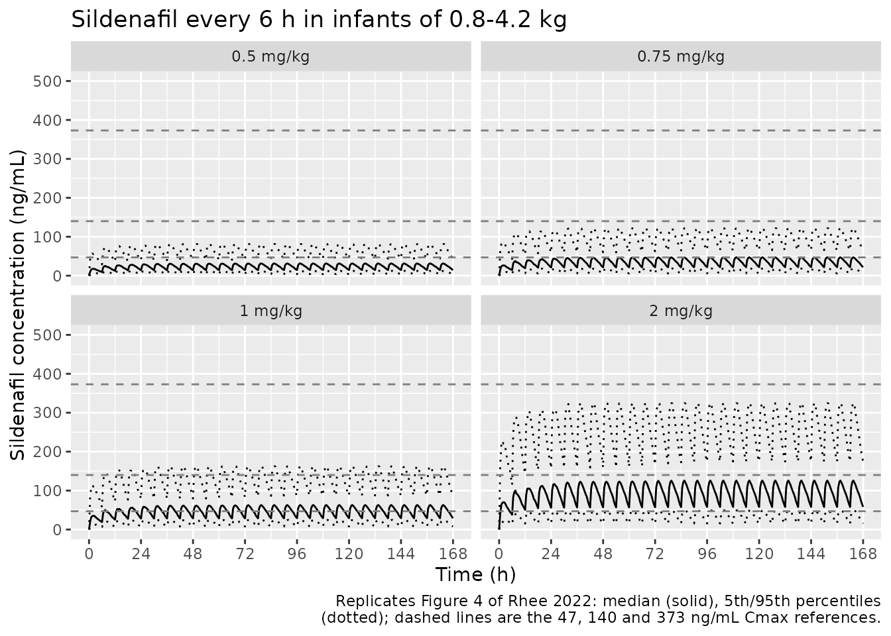
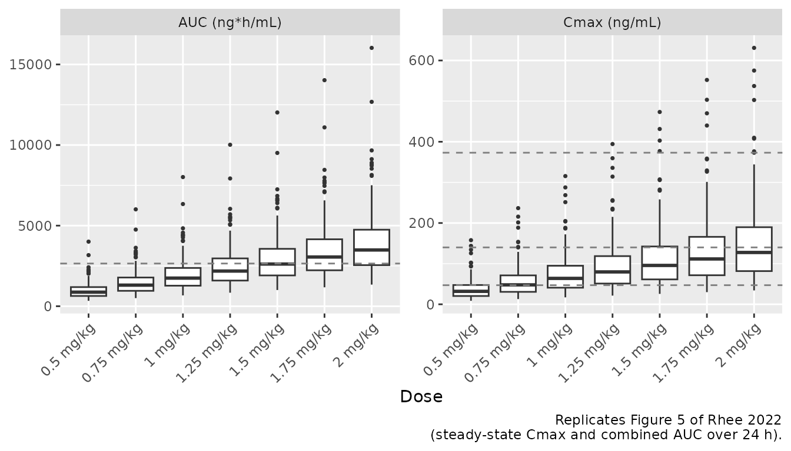

# Sildenafil (Rhee 2022)

## Model and source

- Citation: Rhee SJ, Shin SH, Oh J, Jung YH, Choi CW, Kim HS, Yu KS.
  Population pharmacokinetic analysis of sildenafil in term and preterm
  infants with pulmonary arterial hypertension. Sci Rep. 2022;12:7393.
  <doi:10.1038/s41598-022-11038-6>.
- Description: Joint parent + metabolite population PK model for oral
  sildenafil and its active metabolite N-desmethyl sildenafil (DMS) in
  19 term and preterm infants with pulmonary arterial hypertension (Rhee
  2022). Sildenafil is described by a one-compartment disposition with
  first-order absorption; its whole apparent clearance is assumed to
  form DMS (complete conversion, molar basis), which has its own
  one-compartment disposition. Current body weight enters both apparent
  clearances through power functions referenced to 3.14 kg. Correlated
  IIV on sildenafil V/F, sildenafil CL/F and DMS CL/F’; separate
  log-scale additive (exponential) residual errors per analyte.
- Article: <https://doi.org/10.1038/s41598-022-11038-6> (open access)

The paper fitted sildenafil and its metabolite N-desmethyl sildenafil
(DMS) simultaneously on a molar scale: doses were converted to
micromoles and both concentrations to nmol/L using molecular weights of
474.6 g/mol (sildenafil) and 460.6 g/mol (DMS), and all eliminated
sildenafil was assumed to form DMS. The packaged model keeps the dose in
mg of sildenafil and multiplies the sildenafil elimination flux by 460.6
/ 474.6 when it enters the DMS compartment. That is the same molar mass
balance, and both `Cc` (sildenafil) and `Cc_ndmsil` (DMS) come out in
ng/mL.

## Population

Nineteen term and preterm neonates with pulmonary arterial hypertension
(10 male, 9 female) were enrolled in the neonatal intensive care units
of Seoul National University Hospital and Seoul National University
Bundang Hospital between February 2015 and July 2016 (NCT02244528).
Gestational age was 24-41 weeks (median 36), postnatal age 5-98 days
(median 11) and current body weight 0.79-4.09 kg (median 3.18).
Indications were persistent pulmonary hypertension of the newborn (7),
congenital heart disease (4), bronchopulmonary dysplasia (6) and other
(2). Oral sildenafil was started at 0.5 mg/kg four times daily and
increased to 0.75 mg/kg four times daily after 2 weeks if the
echocardiogram did not improve. In total, 99 samples were collected
opportunistically during routine blood draws, after at least four doses
(paper Table 1 and Results).

The same information is available programmatically via
`readModelDb("Rhee_2022_sildenafil")()$population`.

## Source trace

| Equation / parameter | Value | Source location |
|----|----|----|
| `lka` | log(0.414) 1/h | Table 2, KA, final model |
| `lvc` | log(19.8) L | Table 2, V_Sil/F |
| `lcl` | log(10.1) L/h | Table 2, theta_CL(Sil) |
| `e_wt_cl` | 0.899 | Table 2, theta_weight (sildenafil CL) |
| `lvc_ndmsil` | log(1.78) L | Table 2, V_DMS/F’ |
| `lcl_ndmsil` | log(14.3) L/h | Table 2, theta_CL(DMS) |
| `e_wt_cl_ndmsil` | 1.34 | Table 2, theta_weight (DMS CL) |
| `etalvc`, `etalcl`, `etalcl_ndmsil` variances | log(1 + CV^2) of 143.7%, 63.5%, 49.2% | Table 2, interindividual variability (%CV) |
| eta covariances | r = 0.295, 0.178, 0.0606 times the product of the two SDs | Table 2, correlation between etas |
| `expSd` | 0.553 | Table 2, residual variability (SD), sildenafil |
| `expSd_ndmsil` | 0.472 | Table 2, residual variability (SD), DMS |
| `CL = theta * (WT / 3.14)^theta_weight` | n/a | Table 2 covariate equations (both clearances) |
| One-compartment sildenafil with first-order absorption, complete conversion to a one-compartment DMS | n/a | Methods ‘Population pharmacokinetic analysis’; Results ‘Final population pharmacokinetic model’ |
| Molecular weights 474.6 and 460.6 g/mol | n/a | Methods ‘Population pharmacokinetic analysis’ |
| Additive error on log-transformed concentrations (`lnorm`) | n/a | Methods ‘Population pharmacokinetic analysis’ |

## Virtual cohort

The paper’s dose-finding simulation (Methods ‘Simulation to investigate
an optimal sildenafil dose’) generated virtual infants with body weights
from 0.8 to 4.2 kg and gave 0.5-2 mg/kg sildenafil four times daily for
2 weeks. The paper does not state the weight distribution; here the 200
infants’ weights are evenly spaced over that range, which removes
weight-sampling noise from the comparisons below.

To make the cohort identical on every machine, the random effects are
drawn with R’s random number generator from the model’s own `omega`
matrix, adjusted so that their sample mean and covariance match the
model exactly, and passed to `rxSolve()` as event-table columns with
`omega = NA`. Every dose arm reuses the same 200 infants, so differences
between arms are due to dose alone. Concentrations are individual
predictions without residual error, which is what the paper’s NCA
summaries describe.

``` r

mod <- readModelDb("Rhee_2022_sildenafil")
ui <- rxode2::rxode2(mod)
omega <- ui$omega

set.seed(20220505)
n_sub <- 200
z <- matrix(rnorm(n_sub * nrow(omega)), n_sub)
# Moment-match the draw: centre it and rescale it so the sample mean is
# exactly zero and the sample covariance is exactly `omega`. With 200 infants
# an unadjusted draw can sit 2-3 standard errors off zero on CL, which would
# move every exposure median by several percent for reasons unrelated to the
# model.
z <- scale(z, center = TRUE, scale = FALSE)
z <- z %*% solve(chol(cov(z)))
eta <- z %*% chol(omega)
colnames(eta) <- colnames(omega)
infants <- tibble(
  subj = seq_len(n_sub),
  WT = seq(0.8, 4.2, length.out = n_sub)
) |>
  bind_cols(as_tibble(eta))

dose_levels <- c(0.5, 0.75, 1, 1.25, 1.5, 1.75, 2)

# One arm: q6h dosing for `n_dose` doses, observations at `obs_times`.
# `id_offset` keeps subject ids disjoint across arms. The model has two
# endpoints (Cc and Cc_ndmsil), so observation rows name an ODE state AND
# carry `dvid`; both concentrations are returned as columns on every row.
make_arm <- function(dose_mgkg, n_dose, obs_times, id_offset) {
  base <- infants |>
    mutate(id = id_offset + subj, treatment = paste(dose_mgkg, "mg/kg"))
  doses <- base |>
    mutate(
      time = 0, evid = 1L, cmt = "depot", amt = dose_mgkg * WT,
      ii = 6, addl = n_dose - 1L
    )
  obs <- base |>
    tidyr::crossing(time = obs_times) |>
    mutate(evid = 0L, cmt = "central", dvid = 1L, amt = NA_real_, ii = 0, addl = 0L)
  bind_rows(doses, obs)
}

solve_arms <- function(events) {
  events <- events |>
    arrange(id, time, desc(evid)) |>
    relocate(id, time, evid, cmt, amt, ii, addl)
  stopifnot(!anyDuplicated(unique(events[, c("id", "time", "evid")])))
  out <- rxode2::rxSolve(
    mod, events,
    omega = NA, sigma = NA,
    keep = c("treatment", "WT"),
    returnType = "data.frame"
  )
  # rxSolve drops the id column when only one subject is solved.
  if (!"id" %in% names(out)) {
    out$id <- events$id[1]
  }
  out
}
```

## Typical-value mass balance

At steady state, the AUC over one dosing interval equals dose / CL for
sildenafil and dose x (460.6 / 474.6) / CL’ for DMS, because the model
assumes complete conversion. The check below gives a 3.14 kg infant (the
covariate reference weight, so each clearance equals its typical value)
1 mg/kg every 6 hours for 2 weeks and compares the PKNCA AUC over the
last interval with those closed forms. Both sides use the same
parameters, so the tolerance is tight.

``` r

typ_events <- tibble(
  id = 1L, WT = 3.14, treatment = "typical",
  etalcl = 0, etalvc = 0, etalcl_ndmsil = 0
) |>
  (\(b) bind_rows(
    b |> mutate(time = 0, evid = 1L, cmt = "depot", amt = 3.14, ii = 6, addl = 55L),
    b |> tidyr::crossing(time = c(0, seq(330, 336, by = 0.02))) |>
      mutate(evid = 0L, cmt = "central", dvid = 1L, amt = NA_real_, ii = 0, addl = 0L)
  ))()
typ <- solve_arms(typ_events)

typ_long <- typ |>
  select(id, time, Cc, Cc_ndmsil) |>
  pivot_longer(c(Cc, Cc_ndmsil), names_to = "analyte", values_to = "conc")
typ_nca <- PKNCA::pk.nca(PKNCA::PKNCAdata(
  PKNCA::PKNCAconc(typ_long, conc ~ time | analyte + id),
  PKNCA::PKNCAdose(
    typ_events |> filter(evid == 1) |> select(id, time, amt),
    amt ~ time | id
  ),
  intervals = data.frame(start = 330, end = 336, auclast = TRUE)
))
typ_auc <- as.data.frame(typ_nca) |>
  filter(PPTESTCD == "auclast") |>
  select(analyte, simulated = PPORRES)

ini_val <- ui$theta
closed <- tibble(
  analyte = c("Cc", "Cc_ndmsil"),
  closed_form = 1000 * 3.14 * c(1, 460.6 / 474.6) /
    exp(c(ini_val[["lcl"]], ini_val[["lcl_ndmsil"]]))
)
mb <- left_join(typ_auc, closed, by = "analyte") |>
  mutate(pct_diff = 100 * (simulated / closed_form - 1))
mb |>
  rename(
    "Analyte" = analyte,
    "PKNCA AUC0-6 (ng*h/mL)" = simulated,
    "Closed form (ng*h/mL)" = closed_form,
    "% difference" = pct_diff
  ) |>
  knitr::kable(digits = 2)
```

| Analyte   | PKNCA AUC0-6 (ng\*h/mL) | Closed form (ng\*h/mL) | % difference |
|:----------|------------------------:|-----------------------:|-------------:|
| Cc        |                  310.89 |                 310.89 |            0 |
| Cc_ndmsil |                  213.10 |                 213.10 |            0 |

``` r

# Linear-trapezoid error on a 0.02 h grid is far below 0.5%; a wrong
# molecular-weight ratio, clearance or unit factor moves this by >= 3%.
stopifnot(all(abs(mb$pct_diff) < 0.5))
```

## Simulated profiles (Figure 4)

``` r

fig4_doses <- c(0.5, 0.75, 1, 2)
fig4 <- solve_arms(bind_rows(lapply(seq_along(fig4_doses), function(i) {
  make_arm(fig4_doses[i], n_dose = 28L, obs_times = seq(0, 168, by = 0.5),
           id_offset = 1000L * i)
}))) |>
  mutate(treatment = factor(treatment, levels = paste(fig4_doses, "mg/kg")))

fig4 |>
  group_by(treatment, time) |>
  summarise(
    Q05 = quantile(Cc, 0.05), Q50 = median(Cc), Q95 = quantile(Cc, 0.95),
    .groups = "drop"
  ) |>
  ggplot(aes(time, Q50)) +
  geom_line(aes(y = Q05), linetype = "dotted") +
  geom_line(aes(y = Q95), linetype = "dotted") +
  geom_line() +
  geom_hline(yintercept = c(47, 140, 373), linetype = "dashed", colour = "grey50") +
  facet_wrap(~treatment) +
  scale_x_continuous(breaks = seq(0, 168, by = 24)) +
  coord_cartesian(ylim = c(0, 500)) +
  labs(
    x = "Time (h)", y = "Sildenafil concentration (ng/mL)",
    title = "Sildenafil every 6 h in infants of 0.8-4.2 kg",
    caption = paste0(
      "Replicates Figure 4 of Rhee 2022: median (solid), 5th/95th percentiles\n",
      "(dotted); dashed lines are the 47, 140 and 373 ng/mL Cmax references."
    )
  )
```



## Steady-state exposure by dose (Figures 5 and 6)

Exposure is computed by PKNCA over the last 24 hours of the 2-week
course (312-336 h). Following the paper, the exposure AUC is the
sildenafil AUC plus half the DMS AUC, and the Cmax target is attained
when the sildenafil Cmax is between 47 and 373 ng/mL.

``` r

ss <- solve_arms(bind_rows(lapply(seq_along(dose_levels), function(i) {
  make_arm(dose_levels[i], n_dose = 56L,
           obs_times = c(0, seq(312, 336, by = 0.25)), id_offset = 1000L * i)
}))) |>
  mutate(treatment = factor(treatment, levels = paste(dose_levels, "mg/kg")))
```

``` r

ss_long <- ss |>
  select(id, treatment, time, Cc, Cc_ndmsil) |>
  pivot_longer(c(Cc, Cc_ndmsil), names_to = "analyte", values_to = "conc") |>
  filter(!is.na(conc))

dose_df <- ss |>
  distinct(id, treatment, WT) |>
  mutate(
    time = 0,
    amt = as.numeric(sub(" mg/kg", "", as.character(treatment))) * WT
  ) |>
  select(id, treatment, time, amt)

nca_ss <- PKNCA::pk.nca(PKNCA::PKNCAdata(
  PKNCA::PKNCAconc(ss_long, conc ~ time | treatment + analyte + id),
  PKNCA::PKNCAdose(dose_df, amt ~ time | treatment + id),
  intervals = data.frame(start = 312, end = 336, cmax = TRUE, auclast = TRUE)
))

exposure <- as.data.frame(nca_ss) |>
  filter(PPTESTCD %in% c("cmax", "auclast")) |>
  select(id, treatment, analyte, PPTESTCD, PPORRES) |>
  pivot_wider(names_from = c(PPTESTCD, analyte), values_from = PPORRES) |>
  mutate(
    cmax = cmax_Cc,
    auc_combined = auclast_Cc + 0.5 * auclast_Cc_ndmsil
  )
```

``` r

exposure |>
  select(treatment, `Cmax (ng/mL)` = cmax, `AUC (ng*h/mL)` = auc_combined) |>
  pivot_longer(-treatment) |>
  ggplot(aes(treatment, value)) +
  geom_boxplot(outlier.size = 0.6) +
  geom_hline(
    data = tibble(
      name = c(rep("Cmax (ng/mL)", 3), "AUC (ng*h/mL)"),
      ref = c(47, 140, 373, 2650)
    ),
    aes(yintercept = ref), linetype = "dashed", colour = "grey50"
  ) +
  facet_wrap(~name, scales = "free_y") +
  labs(
    x = "Dose", y = NULL,
    caption = paste0(
      "Replicates Figure 5 of Rhee 2022\n",
      "(steady-state Cmax and combined AUC over 24 h)."
    )
  ) +
  theme(axis.text.x = element_text(angle = 45, hjust = 1))
```



The published medians below were digitised by the maintainers from the
box plots of Figure 5 (about +/- 5 ng/mL for Cmax and +/- 100 ng\*h/mL
for AUC).

``` r

published_fig5 <- tibble(
  treatment = paste(dose_levels, "mg/kg"),
  cmax = c(32, 48, 64, 78, 99, 115, 131),
  auclast = c(850, 1220, 1630, 2070, 2520, 2930, 3410)
)
sim_fig5 <- exposure |>
  transmute(treatment = as.character(treatment), cmax, auclast = auc_combined) |>
  pivot_longer(c(cmax, auclast), names_to = "PPTESTCD", values_to = "PPORRES")

cmp <- nlmixr2lib::ncaComparisonTable(
  simulated = sim_fig5,
  reference = published_fig5,
  by = "treatment",
  units = c(cmax = "ng/mL", auclast = "ng*h/mL"),
  tolerance_pct = 20
)
knitr::kable(
  cmp,
  caption = paste(
    "Median steady-state sildenafil Cmax and combined AUC (sildenafil + 0.5 x DMS,",
    "24 h) versus Figure 5 of Rhee 2022. * differs from reference by >20%."
  )
)
```

| NCA parameter      | treatment  | Reference | Simulated | % diff |
|:-------------------|:-----------|:----------|:----------|:-------|
| Cmax (ng/mL)       | 0.5 mg/kg  | 32        | 31.9      | -0.4%  |
| Cmax (ng/mL)       | 0.75 mg/kg | 48        | 47.8      | -0.4%  |
| Cmax (ng/mL)       | 1 mg/kg    | 64        | 63.8      | -0.4%  |
| Cmax (ng/mL)       | 1.25 mg/kg | 78        | 79.7      | +2.2%  |
| Cmax (ng/mL)       | 1.5 mg/kg  | 99        | 95.6      | -3.4%  |
| Cmax (ng/mL)       | 1.75 mg/kg | 115       | 112       | -3.0%  |
| Cmax (ng/mL)       | 2 mg/kg    | 131       | 128       | -2.7%  |
| AUClast (ng\*h/mL) | 0.5 mg/kg  | 850       | 872       | +2.6%  |
| AUClast (ng\*h/mL) | 0.75 mg/kg | 1220      | 1310      | +7.3%  |
| AUClast (ng\*h/mL) | 1 mg/kg    | 1630      | 1740      | +7.0%  |
| AUClast (ng\*h/mL) | 1.25 mg/kg | 2070      | 2180      | +5.4%  |
| AUClast (ng\*h/mL) | 1.5 mg/kg  | 2520      | 2620      | +3.9%  |
| AUClast (ng\*h/mL) | 1.75 mg/kg | 2930      | 3050      | +4.2%  |
| AUClast (ng\*h/mL) | 2 mg/kg    | 3410      | 3490      | +2.3%  |

Median steady-state sildenafil Cmax and combined AUC (sildenafil + 0.5 x
DMS, 24 h) versus Figure 5 of Rhee 2022. \* differs from reference by
\>20%. {.table}

``` r

published_fig6 <- tibble(
  treatment = paste(dose_levels, "mg/kg"),
  cmax_pub = c(26.5, 51.5, 69, 80.5, 87, 90.5, 91.5),
  auc_pub = c(1, 7.5, 19.5, 33.5, 47, 58.3, 69)
)
attain <- exposure |>
  group_by(treatment) |>
  summarise(
    cmax_sim = 100 * mean(cmax >= 47 & cmax <= 373),
    auc_sim = 100 * mean(auc_combined > 2650),
    .groups = "drop"
  ) |>
  mutate(treatment = as.character(treatment)) |>
  left_join(published_fig6, by = "treatment")

attain |>
  select(treatment, cmax_pub, cmax_sim, auc_pub, auc_sim) |>
  rename(
    "Dose" = treatment,
    "Cmax target, paper (%)" = cmax_pub,
    "Cmax target, simulated (%)" = cmax_sim,
    "AUC target, paper (%)" = auc_pub,
    "AUC target, simulated (%)" = auc_sim
  ) |>
  knitr::kable(
    digits = 1,
    caption = paste(
      "Percentage of infants reaching the Cmax (47-373 ng/mL) and AUC",
      "(> 2650 ng*h/mL) targets. Paper values were digitised by the",
      "maintainers from Figure 6 (1.75 mg/kg AUC value quoted in the text)."
    )
  )
```

| Dose | Cmax target, paper (%) | Cmax target, simulated (%) | AUC target, paper (%) | AUC target, simulated (%) |
|:---|---:|---:|---:|---:|
| 0.5 mg/kg | 26.5 | 26.0 | 1.0 | 1.0 |
| 0.75 mg/kg | 51.5 | 50.5 | 7.5 | 7.5 |
| 1 mg/kg | 69.0 | 67.5 | 19.5 | 19.5 |
| 1.25 mg/kg | 80.5 | 80.5 | 33.5 | 33.5 |
| 1.5 mg/kg | 87.0 | 90.5 | 47.0 | 49.5 |
| 1.75 mg/kg | 90.5 | 92.0 | 58.3 | 61.0 |
| 2 mg/kg | 91.5 | 93.5 | 69.0 | 69.5 |

Percentage of infants reaching the Cmax (47-373 ng/mL) and AUC (\> 2650
ng\*h/mL) targets. Paper values were digitised by the maintainers from
Figure 6 (1.75 mg/kg AUC value quoted in the text). {.table}

``` r

fig5_cmp <- exposure |>
  group_by(treatment) |>
  summarise(cmax = median(cmax), auc = median(auc_combined), .groups = "drop") |>
  mutate(treatment = as.character(treatment)) |>
  left_join(published_fig5, by = "treatment") |>
  mutate(
    cmax_pct = 100 * (cmax.x / cmax.y - 1),
    auc_pct = 100 * (auc / auclast - 1)
  )

# The cohort is deterministic (R's RNG, moment-matched etas, omega = NA), so
# these values do not move between machines or rxode2 builds. Realised:
# median Cmax -0.4%, median AUC +4.2%, worst attainment differences 3.5
# (Cmax) and 2.7 (AUC) points. A 10% error in sildenafil CL/F, or a wrong
# molecular-weight ratio or unit factor, breaks the median bounds. The
# attainment bounds are there to catch a gross change in the between-subject
# spread; they cannot separate the two plausible IIV scales (see
# Assumptions and deviations).
stopifnot(
  abs(median(fig5_cmp$cmax_pct)) < 5,
  abs(median(fig5_cmp$auc_pct)) < 10,
  max(abs(attain$cmax_sim - attain$cmax_pub)) < 7,
  max(abs(attain$auc_sim - attain$auc_pub)) < 7
)
```

## Assumptions and deviations

- **IIV scale.** Table 2 reports the between-subject variability only as
  %CV for exponential random effects. The variances use the exact
  log-normal relation `omega^2 = log(1 + CV^2)`. The alternative reading
  (`omega^2 = CV^2`) gives a much larger variance for V/F (2.06 versus
  1.12), because that CV is 143.7%. In a closed-form check by the
  maintainers (20000 infants, weight uniform on 0.8-4.2 kg), the exact
  reading reproduced the Figure 6 Cmax attainment better (mean absolute
  difference about 1.3 percentage points versus about 1.9; worst case
  2.3 versus 3.2 points). The evidence is modest, because only the V/F
  variability differs much between the two readings; the exact relation
  is also the library’s usual convention.
- **Correlations.** Table 2 reports correlation coefficients between the
  three etas. The covariances in the model are
  `cov = r * omega_i * omega_j`.
- **Reference weight.** The covariate equations in Table 2 normalise
  body weight to 3.14 kg, while Table 1 reports a median of 3.18 kg. The
  model uses 3.14 kg, the value printed in the equations.
- **Units.** The paper fitted the model in micromoles and nmol/L. The
  packaged model doses in mg and returns ng/mL; see the ‘Model and
  source’ section for why the two are equivalent.
- **Residual error.** The paper used an additive error on
  log-transformed concentrations, coded here as `lnorm()` with the Table
  2 SDs. The validation above uses individual predictions without
  residual error.
- **Virtual-cohort weight distribution.** The paper gives only the
  0.8-4.2 kg range for its simulated infants; weights evenly spaced over
  that range are used.
- **Exposure versus Figures 5 and 6.** In this 200-infant cohort the
  median Cmax is -3 to +2% and the median combined AUC +2 to +7%
  different from the values digitised from Figure 5, in line with a
  closed-form check by the maintainers with 20000 infants (-1 to +5% for
  Cmax, +3 to +8% for AUC). The small, consistent AUC excess is
  therefore not cohort noise; it may come from NCA settings the paper
  does not describe (for example the AUC method or which 24 h it used),
  or from the digitisation. The target attainment percentages follow
  from the same exposures and differ from Figure 6 by at most 3.5 (Cmax)
  and 2.7 (AUC) percentage points.
- **Covariates screened but not retained.** Sex (theta_female = 1.78 on
  sildenafil CL/F) and postnatal-age maturation (theta = 4.28) were in
  the full model but not the final one. Postmenstrual age was
  significant but dropped in favour of body weight, with which it was
  strongly correlated (r = 0.803). These and the other screened
  covariates are listed in `covariatesDataExcluded`.
- No erratum or correction notice for this article was found as of
  2026-10-01.
