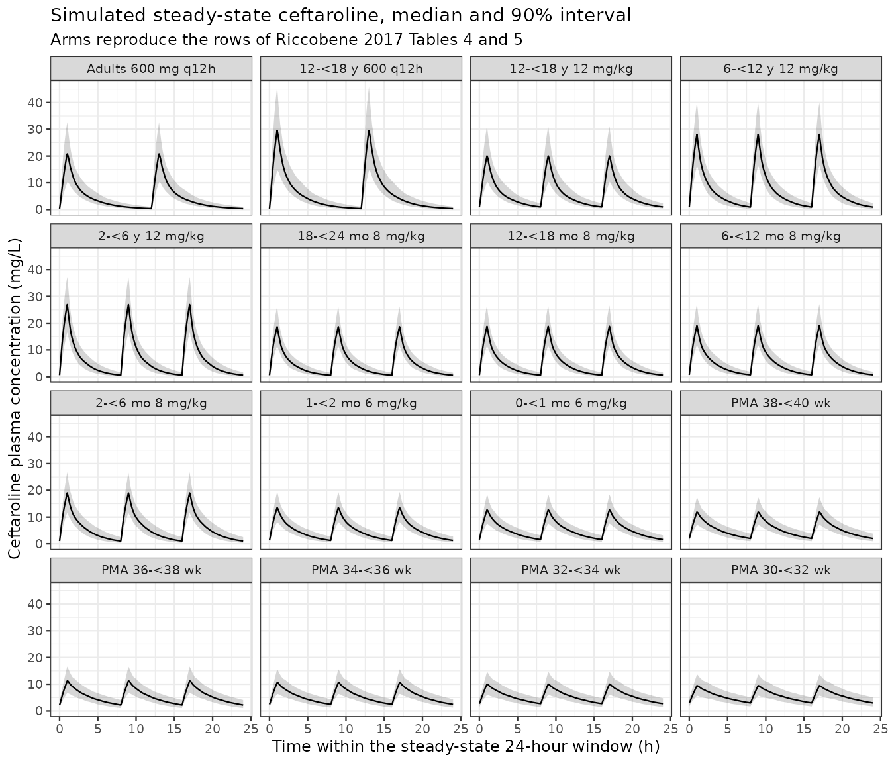

# Ceftaroline in children (Riccobene 2017)

## Model and source

- Citation: Riccobene TA, Khariton T, Knebel W, Das S, Li J, Jandourek
  A, Carrothers TJ, Bradley JS. Population PK modeling and target
  attainment simulations to support dosing of ceftaroline fosamil in
  pediatric patients with acute bacterial skin and skin structure
  infections and community-acquired bacterial pneumonia. J Clin
  Pharmacol. 2017;57(3):345-355. <doi:10.1002/jcph.809>. Parameter
  estimates are from Supplemental Table S2 and the covariate model from
  Supplemental Equation S1 of that article’s supplemental material. The
  structural model was carried from the upstream pooled adult and
  pediatric ceftaroline fosamil / ceftaroline population PK analysis
  cited as reference 18 (Riccobene T, Khariton T, Knebel W, O’Neal T,
  Ghahramani P. 23rd European Congress on Clinical Microbiology and
  Infectious Diseases, Berlin 2013, abstract P902); that abstract is a
  conference abstract and is not in nlmixr2lib.
- Article: <https://doi.org/10.1002/jcph.809>
- Supplement (Supplemental Equation S1 = the covariate model;
  Supplemental Table S2 = final parameter estimates; Supplemental Tables
  S3-S6 = the mild-renal-impairment simulations): supplemental material
  of the same DOI.

Ceftaroline fosamil is a water-soluble N-phosphono prodrug that plasma
phosphatases convert rapidly to ceftaroline, the active anti-MRSA
cephalosporin. Riccobene 2017 added the pharmacokinetic data from five
pediatric studies (birth to under 18 years) to a pooled adult dataset
and updated the simultaneous ceftaroline fosamil / ceftaroline
population PK model, then used it to run steady-state exposure and PK/PD
target-attainment simulations. Those simulations are what the FDA and
EMA pediatric dose regimens were approved on.

The packaged model carries two analyte layers:

- **ceftaroline fosamil** (the dosed prodrug) as a two-compartment
  system, in the canonical unsuffixed `central` / `peripheral1` states,
  plus an intramuscular `depot` carried from the upstream adult model;
- **ceftaroline** (the active metabolite) as a two-compartment system in
  `central_ceftaroline` / `peripheral1_ceftaroline`, formed by the whole
  prodrug elimination clearance `CLcf`.

Two developmental terms distinguish this model from its adult-only
predecessor, and both are gated to children aged 2 years or younger:

- a Rhodin-style renal-maturation Hill function of postmenstrual age on
  ceftaroline clearance, which *replaces* the creatinine-clearance term
  used in adults, and
- an exponentially decaying excess in ceftaroline central volume,
  `1 + Bvol * exp(-(PMA - 33) * log(2) / Tvol)`, which the paper reports
  was required to describe the youngest age groups.

Both gates are step functions at exactly 2 years, so typical clearance
and typical central volume are discontinuous there. That is the
published model and it is reproduced verbatim; see Errata.

## Population

The final model was fitted to 6633 measurable plasma concentrations
(1799 ceftaroline fosamil, 4834 ceftaroline) from 525 patients and 195
healthy subjects or subjects with varying degrees of renal impairment.
Of the 525 patients, 305 were children who contributed 974
concentrations (234 ceftaroline fosamil, 740 ceftaroline). The children
were 173 males and 132 females, aged 1 day to under 18 years and
weighing 1.5 to 100 kg (Results, Study Population).

The five pediatric studies (paper Table 1) were two single-dose PK
studies (NCT00633126 in 12- to 17-year-olds; NCT01298843 from birth to
under 12 years, including full-term and 32- to 37-week preterm neonates)
and three comparator-controlled safety and efficacy studies in children
aged 2 months to 17 years with ABSSSI (NCT01400867), CABP (NCT01530763)
or complicated CABP (NCT01669980). All children but one had normal renal
function or mild renal impairment: among those aged 28 days or older,
241 had a Schwartz creatinine clearance of at least 80 mL/(min \* 1.73
m^2) and 40 had 50 to under 80.

``` r

pop <- readModelDb("Riccobene_2017_ceftaroline")()$population
tibble::tibble(field = names(pop), value = vapply(pop, function(x) paste(as.character(x), collapse = "; "), character(1))) |>
  knitr::kable(caption = "Population metadata carried in the model file.")
```

| field | value |
|:---|:---|
| species | human |
| n_subjects | 720 |
| n_studies | 5 |
| age_range | Children 1 day to under 18 years (including full-term neonates under 28 days and preterm neonates of 32 to 37 weeks gestational age); adults from the pooled healthy-subject, renal-impairment and phase 2/3 patient studies of the upstream analysis |
| weight_range | 1.5-100 kg among the 305 children |
| sex_female_pct | 43.2786885245902 |
| race_ethnicity | Not reported for the pooled analysis dataset |
| disease_state | Children with acute bacterial skin and skin structure infections, community-acquired bacterial pneumonia, complicated community-acquired bacterial pneumonia, or another suspected or confirmed infection requiring antibiotic therapy, plus healthy adult subjects, adults with varying degrees of renal impairment, and adult patients with ABSSSI or CABP. All children except one had normal renal function or mild renal impairment: of those aged 28 days or older, 241 had CrCL of 80 mL/(min 1.73 m^2) or more and 40 had CrCL of 50 to under 80 mL/(min 1.73 m^2). |
| dose_range | Children: single doses of 8, 10, 12 or 15 mg/kg (maximum 600 mg) as 1- to 1.5-h infusions, and multiple doses of 8, 10, 12 or 15 mg/kg q8h (maximum 400 or 600 mg) as 1- or 2-h infusions. Adults: 50 to 1000 mg ceftaroline fosamil, including the approved 600 mg q12h regimen. |
| regions | Multinational; the five pediatric studies are NCT00633126, NCT01298843, NCT01400867, NCT01530763 and NCT01669980 |
| n_observations | 6633 measurable plasma concentrations (1799 ceftaroline fosamil, 4834 ceftaroline), of which 974 (234 ceftaroline fosamil, 740 ceftaroline) came from the 305 children |
| notes | n_subjects counts the 525 patients plus 195 healthy subjects or subjects with various degrees of renal impairment reported in Results, Study Population; 305 of the 525 patients were children. n_studies counts the five pediatric studies of Table 1 that this analysis added; the adult data come from a previously pooled dataset of healthy-subject and phase 2/3 patient studies. The children were 173 males and 132 females; the sex split above is therefore the pediatric split, not the whole-dataset split, which is not reported. Concentrations below the limit of quantification (0.01 or 0.05 mg/L) were excluded. Analysis was run in NONMEM 7.3. |

Population metadata carried in the model file. {.table}

## Source trace

Every `ini()` value and every non-trivial `model()` equation, with the
place in the source it came from.

| Model element | Value | Source location |
|----|----|----|
| `lcl` (CLcf) | 231 L/h | Suppl. Table S2, theta1; Suppl. Eq. S1 `exp(CLcf)_i` |
| `lvc` (Vccf) | 7.54 L | Suppl. Table S2, theta2 |
| `lq` (Q1cf) | 25 L/h | Suppl. Table S2, theta3 |
| `lvp` (Vp1cf) | 6.75 L | Suppl. Table S2, theta4 |
| `lka` (ka1cf) | 0.544 1/h, fixed | Suppl. Table S2, theta5 \[FIXED\]; Suppl. Eq. S1 `ka1cf_i` |
| `lfdepot` (FIMcf) | 1, fixed | Suppl. Table S2, theta6 \[FIXED\]; Suppl. Eq. S1 `F2 = FIMcf` |
| `lcl_ceftaroline` (CLc) | 3.28 L/h | Suppl. Table S2, theta7; Suppl. Eq. S1 `CLc_i` |
| `lvc_ceftaroline` (Vcc) | 3.6 L | Suppl. Table S2, theta8; Suppl. Eq. S1 `Vcc_i` |
| `lq_ceftaroline` (Qc) | 8.47 L/h | Suppl. Table S2, theta9; Suppl. Eq. S1 `Qc_i` |
| `lvp_ceftaroline` (Vp1c) | 10 L | Suppl. Table S2, theta10; Suppl. Eq. S1 `Vpc_i` |
| `lcl_hemodialysis_ceftaroline` (CLdial) | 10.9 L/h | Suppl. Table S2, theta14; Suppl. Eq. S1 dialysis branch |
| `e_wt_cl_q` | 0.75, fixed | Suppl. Table S2, `(WT/70)^0.75` rows |
| `e_wt_vc_vp` | 1, fixed | Suppl. Table S2, `(WT/70)^1` rows |
| `e_crcl_cl_ceftaroline` | 0.472 | Suppl. Table S2, theta11; Suppl. Eq. S1 COV3 |
| `e_age_cl_ceftaroline` | -0.807 | Suppl. Table S2, theta13; Suppl. Eq. S1 COV5 |
| `e_dis_healthy_cl_ceftaroline` | 3.23 | Suppl. Table S2, theta16; Suppl. Eq. S1 COV7 |
| `e_dis_healthy_vc_ceftaroline` | 4.33 | Suppl. Table S2, theta15; Suppl. Eq. S1 COV6 |
| `e_rrt_hemodial_status_cl_ceftaroline` | 0.331 | Suppl. Table S2, theta12; Suppl. Eq. S1 COV4 |
| `tmat50` (TM50MAT) | 47.7 weeks, fixed | Suppl. Table S2 \[FIXED\]; Suppl. Eq. S1 `FPMA_i` |
| `hill_mat` (HillMAT) | 1.6 | Suppl. Table S2, theta17; Suppl. Eq. S1 `FPMA_i` |
| `e_page_vc_ceftaroline` (Bvol) | 1.71 | Suppl. Table S2, theta18; Suppl. Eq. S1 COV9 |
| `thalf_vc_ceftaroline` (Tvol) | 5.51 weeks | Suppl. Table S2, theta19; Suppl. Eq. S1 COV9 |
| 4x4 IIV block on CLcf, Vccf, CLc, Vcc | see model file | Suppl. Table S2, Inter-individual Variability |
| `etalka` | 0.114, fixed | Suppl. Table S2, `VAR(ka1cf)`, CI printed as (0.114, 0.114) |
| `etalvp_ceftaroline` | 0.0148 | Suppl. Table S2, `VAR(Vp1c)` |
| `propSd` / `addSd` | 0.3701 / 0.0667 | Suppl. Table S2, `propCF` 0.137, `addCF` 0.00445 (SDs are square roots) |
| `propSd_ceftaroline` / `addSd_ceftaroline` | 0.2027 / 0.0523 | Suppl. Table S2, `propC` 0.0411, `addC` 0.00274 |
| `PMA = PNA + GA` | n/a | Suppl. Eq. S1 `PMA_i = AGEW_i + GAGE_i` |
| Renal term replaced by maturation below 2 years | n/a | Methods, Population PK Model |
| Maturation scaled by CRCL/80 for mild impairment below 2 years | n/a | Methods, Simulations |
| Complete prodrug conversion, 1:1 in mg | n/a | Suppl. Eq. S1 carries no formation fraction (see Errata) |

## Virtual cohort

Each simulated arm mirrors one row of paper Table 4 or Table 5: the same
age band, the same dose regimen, and a body-weight distribution
reconstructed from the median and 90% prediction interval that the paper
prints for that row. The weights are drawn log-normally with the median
as the geometric mean and `sdlog` back-solved from the printed 90% span,
which reproduces the paper’s own weight column by construction and keeps
the comparison an exposure comparison rather than a growth-chart
comparison.

``` r

rxode2::rxSetSeed(20170809)
set.seed(20170809)

n_per_arm <- 200L
wk_per_yr <- 52.1775

# Paper Table 4 (children 2 months to <18 years, normal renal function) and
# Table 5 (infants <2 months, normal renal function). wt_* are the printed
# median and 90% prediction interval of the "Weight, kg" column; cmax_pub and
# auc_pub are the printed Cmax,ss and AUC0-24h,ss medians; ft1 / ft2 are the
# printed median %fT>MIC at MIC 1 and 2 mg/L.
arms <- tibble::tribble(
  ~arm,                ~src,      ~mgkg, ~fixdose, ~tau, ~wt_med, ~wt_lo, ~wt_hi, ~age_lo, ~age_hi, ~cmax_pub, ~auc_pub, ~ft1, ~ft2,
  "Adults 600 mg q12h",  "T4",      NA,    600,      12,   77.6,   52.5,  105,    50,      50,      21.0,      97.3,     64.0, 45.0,
  "12-<18 y 600 q12h",   "T4",      NA,    600,      12,   52.8,   36.9,  75.1,   12,      18,      28.6,      122,      64.5, 47.9,
  "12-<18 y 12 mg/kg",   "T4",      12,    NA,       8,    52.9,   36.8,  75.3,   12,      18,      19.7,      122,      84.0, 59.3,
  "6-<12 y 12 mg/kg",    "T4",      12,    NA,       8,    28.5,   19.3,  46.5,   6,       12,      27.6,      157,      85.2, 63.0,
  "2-<6 y 12 mg/kg",     "T4",      12,    NA,       8,    15.8,   11.8,  22.2,   2,       6,       27.1,      144,      75.3, 56.8,
  "18-<24 mo 8 mg/kg",   "T4",      8,     NA,       8,    11.7,   9.81,  14.1,   1.5,     2,       18.8,      107,      71.9, 51.9,
  "12-<18 mo 8 mg/kg",   "T4",      8,     NA,       8,    10.4,   8.60,  12.7,   1,       1.5,     19.1,      113,      75.3, 54.3,
  "6-<12 mo 8 mg/kg",    "T4",      8,     NA,       8,    8.43,   6.55,  10.7,   0.5,     1,       19.6,      120,      80.2, 59.3,
  "2-<6 mo 8 mg/kg",     "T4",      8,     NA,       8,    5.75,   4.12,  7.66,   2/12,    6/12,    19.2,      134,      92.6, 67.9,
  "1-<2 mo 6 mg/kg",     "T5",      6,     NA,       8,    4.69,   3.63,  5.77,   1/12,    2/12,    14.1,      105,      88.9, 61.7,
  "0-<1 mo 6 mg/kg",     "T5",      6,     NA,       8,    3.88,   2.91,  4.75,   0,       1/12,    13.4,      108,      93.8, 65.7,
  "PMA 38-<40 wk",       "T5",      6,     NA,       8,    3.40,   2.55,  4.24,   NA,      NA,      12.8,      114,      98.8, 75.3,
  "PMA 36-<38 wk",       "T5",      6,     NA,       8,    2.87,   2.07,  3.75,   NA,      NA,      12.4,      109,      97.5, 71.6,
  "PMA 34-<36 wk",       "T5",      6,     NA,       8,    2.32,   1.71,  3.05,   NA,      NA,      12.1,      104,      96.3, 67.3,
  "PMA 32-<34 wk",       "T5",      6,     NA,       8,    1.89,   1.38,  2.44,   NA,      NA,      11.9,      98.5,     92.6, 63.0,
  "PMA 30-<32 wk",       "T5",      6,     NA,       8,    1.50,   1.05,  1.95,   NA,      NA,      11.4,      92.7,     88.6, 59.3
)
# The five neonatal rows are age bands in postmenstrual weeks (Methods,
# Simulations); paper Table 5 labels them GA because at birth PMA equals GA.
arms$page_lo <- c(rep(NA_real_, 11), 38, 36, 34, 32, 30)
arms$page_hi <- c(rep(NA_real_, 11), 40, 38, 36, 34, 32)
arms$arm <- factor(arms$arm, levels = arms$arm)

# sdlog back-solved from the printed 90% prediction interval.
arms$wt_sdlog <- log(arms$wt_hi / arms$wt_lo) / (2 * stats::qnorm(0.95))

# COMMON RANDOM NUMBERS across arms. One set of standardized draws is generated
# once and reused by every arm (indexed by `rep`), so subject k of arm A and
# subject k of arm B share the same weight z-score and the same position in the
# age/PMA band. The paper's cross-arm claims (Results: "AUC 61% greater than
# adults", "Cmax 45% higher with 600 mg q12h") are then ratios between paired
# subjects rather than between two independently drawn cohorts, which removes
# the Monte Carlo noise that would otherwise dominate them -- most sharply for
# the two adolescent arms, whose AUCs must be IDENTICAL because both deliver
# 1200 mg/day, a structural identity that an unpaired comparison cannot test.
z_wt <- stats::rnorm(n_per_arm)
u_band <- stats::runif(n_per_arm)

cohort <- arms |>
  select(arm, mgkg, fixdose, tau, wt_med, wt_sdlog, age_lo, age_hi, page_lo, page_hi) |>
  tidyr::crossing(rep = seq_len(n_per_arm)) |>
  mutate(
    id = dplyr::row_number(),
    WT = exp(log(wt_med) + z_wt[rep] * wt_sdlog),
    # Term-born arms: age drawn uniformly in the band, GA fixed at 40 weeks.
    # Neonatal arms: postmenstrual age drawn uniformly in the band with a
    # postnatal age of 0 to 1 week, so PMA is the band by construction.
    pna_wk = ifelse(
      is.na(page_lo),
      (age_lo + u_band[rep] * (age_hi - age_lo)) * wk_per_yr,
      u_band[rep]
    ),
    PAGE = ifelse(
      is.na(page_lo),
      pna_wk + 40,
      page_lo + u_band[rep] * (page_hi - page_lo)
    ),
    AGE = pna_wk / wk_per_yr,
    # Normal renal function: every arm of Tables 4 and 5 is the normal-renal
    # -function column, so CRCL sits above the 80 mL/min/1.73 m^2 reference
    # where both renal terms are exactly 1.
    CRCL = 100,
    DIS_HEALTHY = 0,
    RRT_HEMODIAL_STATUS = 0,
    RRT_HEMODIAL_ACTIVE = 0,
    # Paper Table 4 footnote a: all q8h pediatric dose regimens were up to a
    # maximum of 400 mg based on weight.
    dose_mg = ifelse(is.na(fixdose), pmin(mgkg * WT, 400), fixdose),
    tau_h = tau
  ) |>
  select(id, arm, WT, AGE, PAGE, CRCL, DIS_HEALTHY, RRT_HEMODIAL_STATUS,
         RRT_HEMODIAL_ACTIVE, dose_mg, tau_h)

stopifnot(nrow(cohort) == n_per_arm * nrow(arms), !anyDuplicated(cohort$id))

cohort |>
  group_by(arm) |>
  summarise(n = dplyr::n(), `median WT (kg)` = round(median(WT), 2),
            `median PMA (wk)` = round(median(PAGE), 1),
            `median dose (mg)` = round(median(dose_mg), 1), .groups = "drop") |>
  left_join(arms |> select(arm, `paper median WT (kg)` = wt_med), by = "arm") |>
  knitr::kable(caption = "Simulated cohort by arm, against the weight column the paper prints.")
```

| arm | n | median WT (kg) | median PMA (wk) | median dose (mg) | paper median WT (kg) |
|:---|---:|---:|---:|---:|---:|
| Adults 600 mg q12h | 200 | 76.78 | 2648.9 | 600.0 | 77.60 |
| 12-\<18 y 600 q12h | 200 | 52.22 | 837.2 | 600.0 | 52.80 |
| 12-\<18 y 12 mg/kg | 200 | 52.32 | 837.2 | 400.0 | 52.90 |
| 6-\<12 y 12 mg/kg | 200 | 28.12 | 524.1 | 337.4 | 28.50 |
| 2-\<6 y 12 mg/kg | 200 | 15.65 | 258.4 | 187.8 | 15.80 |
| 18-\<24 mo 8 mg/kg | 200 | 11.63 | 132.5 | 93.1 | 11.70 |
| 12-\<18 mo 8 mg/kg | 200 | 10.34 | 106.4 | 82.7 | 10.40 |
| 6-\<12 mo 8 mg/kg | 200 | 8.37 | 80.3 | 66.9 | 8.43 |
| 2-\<6 mo 8 mg/kg | 200 | 5.70 | 58.2 | 45.6 | 5.75 |
| 1-\<2 mo 6 mg/kg | 200 | 4.66 | 46.7 | 27.9 | 4.69 |
| 0-\<1 mo 6 mg/kg | 200 | 3.85 | 42.4 | 23.1 | 3.88 |
| PMA 38-\<40 wk | 200 | 3.37 | 39.1 | 20.2 | 3.40 |
| PMA 36-\<38 wk | 200 | 2.84 | 37.1 | 17.1 | 2.87 |
| PMA 34-\<36 wk | 200 | 2.30 | 35.1 | 13.8 | 2.32 |
| PMA 32-\<34 wk | 200 | 1.87 | 33.1 | 11.2 | 1.89 |
| PMA 30-\<32 wk | 200 | 1.49 | 31.1 | 8.9 | 1.50 |

Simulated cohort by arm, against the weight column the paper prints.
{.table style="width:100%;"}

## Simulation

Steady state is imposed with `ss = 1` / `ii = tau` and then carried
forward across a full 24-hour day, so the window contains the 3 q8h
doses (or 2 q12h doses) that the paper’s AUC0-24h,ss definition assumes.
The observation grid is 0.1 h, which is the resolution the paper’s own
%fT\>MIC values are quantised to.

``` r

mod <- readModelDb("Riccobene_2017_ceftaroline")

tgrid <- seq(0, 24, by = 0.1)

dose_rows <- cohort |>
  tidyr::crossing(k = 0:2) |>
  filter(k * tau_h < 24) |>
  mutate(time = k * tau_h,
         amt = dose_mg, dur = 1,
         evid = 1L,
         # Only the time-zero record imposes steady state; the later records
         # are the remaining doses inside the 24-hour window.
         ii = ifelse(k == 0, tau_h, 0),
         ss = ifelse(k == 0, 1L, 0L),
         cmt = "central", dvid = NA_integer_) |>
  select(-k)

obs_rows <- cohort |>
  tidyr::crossing(time = tgrid) |>
  mutate(amt = NA_real_, dur = NA_real_, evid = 0L, ii = 0, ss = 0L,
         # Observation rows carry dvid, not a compartment name: the model
         # declares two endpoints (Cc, Cc_ceftaroline), so rxode2 requires the
         # dvid -> endpoint mapping on observation records. rxSolve returns
         # both observables as columns at every observation row.
         cmt = NA_character_, dvid = 2L)

events <- bind_rows(dose_rows, obs_rows) |> arrange(id, time, desc(evid))

# One rxSolve call PER ARM rather than one call for all 800 subjects.
# rxSolve on an rxUi is quadratic in the number of subjects per call, so a
# single 800-subject call takes several minutes while 16 calls of 50 subjects
# each take seconds. The arms are independent, so this is purely a batching
# change: rxSetSeed above fixes the stream once for the whole loop.
#
# useLinCmt = FALSE: rxode2's automatic ODE -> linCmt() conversion corrupts the
# dvid -> cmt mapping for multi-output models of this shape.
sim <- lapply(levels(events$arm), function(a) {
  ev_a <- events[events$arm == a, , drop = FALSE]
  # Reseed BEFORE each arm's solve so every arm draws the SAME eta stream.
  # Combined with the common weight / band draws above, subject k is the same
  # "person" in every arm, so cross-arm ratios isolate the covariate model.
  rxode2::rxSetSeed(20170809)
  rxode2::rxSolve(
    mod, events = ev_a,
    keep = c("arm", "dose_mg", "tau_h"),
    useLinCmt = FALSE
  ) |> as.data.frame()
}) |> bind_rows()
#> ℹ parameter labels from comments will be replaced by 'label()'

stopifnot(nrow(sim) == nrow(obs_rows), all(is.finite(sim$Cc_ceftaroline)))
```

### Structural identity: AUC at steady state is dose over clearance

At steady state the ceftaroline AUC over any whole number of dosing
intervals equals the ceftaroline formation rate divided by ceftaroline
clearance. Because the model converts the prodrug completely, that is
`(24 / tau) * dose / CLc`. Both sides of this check use the same drawn
parameters, so the only difference is trapezoidal quadrature error and
the bound is tight.

``` r

trap <- function(t, y) sum(diff(t) * (head(y, -1) + tail(y, -1)) / 2)

ident <- sim |>
  group_by(id) |>
  summarise(arm = first(arm),
            auc24 = trap(time, Cc_ceftaroline),
            cl = first(cl_ceftaroline),
            dose_mg = first(dose_mg), tau_h = first(tau_h), .groups = "drop") |>
  mutate(expected = (24 / tau_h) * dose_mg / cl,
         rel_err = auc24 / expected - 1)

cat("max |relative error| of AUC0-24,ss vs dose/CL:",
    signif(max(abs(ident$rel_err)), 3), "\n")
#> max |relative error| of AUC0-24,ss vs dose/CL: 5.07e-06
stopifnot(max(abs(ident$rel_err)) < 0.01)
```

### Steady-state profiles by age band

The paper’s Figure 1 is an observed-versus-predicted diagnostic and
cannot be replicated without the individual concentration data, which
are not published. The figures below instead show what Tables 4 and 5
summarise: the simulated steady-state ceftaroline profile for each age
band.

``` r

med_prof <- sim |>
  group_by(arm, time) |>
  summarise(med = median(Cc_ceftaroline),
            lo = quantile(Cc_ceftaroline, 0.05),
            hi = quantile(Cc_ceftaroline, 0.95), .groups = "drop") |>
  left_join(arms |> select(arm, src), by = "arm")

ggplot(med_prof, aes(time, med)) +
  geom_ribbon(aes(ymin = lo, ymax = hi), alpha = 0.2) +
  geom_line() +
  facet_wrap(~arm, ncol = 4) +
  labs(x = "Time within the steady-state 24-hour window (h)",
       y = "Ceftaroline plasma concentration (mg/L)",
       title = "Simulated steady-state ceftaroline, median and 90% interval",
       subtitle = "Arms reproduce the rows of Riccobene 2017 Tables 4 and 5") +
  theme_bw(base_size = 9)
```



## PKNCA validation

``` r

conc_df <- sim |>
  select(id, arm, time, Cc_ceftaroline) |>
  filter(!is.na(Cc_ceftaroline)) |>
  as.data.frame()

# A time-zero record is present by construction: the ss = 1 solve returns the
# steady-state trough at time 0.
stopifnot(all(table(conc_df$id[conc_df$time == 0]) == 1))

conc_obj <- PKNCA::PKNCAconc(conc_df, Cc_ceftaroline ~ time | arm + id)

dose_df <- dose_rows |>
  select(id, arm, time, amt, dur) |>
  as.data.frame()

dose_obj <- PKNCA::PKNCAdose(dose_df, amt ~ time | arm + id, duration = "dur")

intervals <- data.frame(start = 0, end = 24,
                        cmax = TRUE, tmax = TRUE, cmin = TRUE, auclast = TRUE)

nca_res <- PKNCA::pk.nca(PKNCA::PKNCAdata(conc_obj, dose_obj, intervals = intervals))
```

``` r

nca_tidy <- as.data.frame(nca_res) |>
  filter(PPTESTCD %in% c("cmax", "tmax", "cmin", "auclast"), start == 0, end == 24)

nca_tidy |>
  group_by(arm, PPTESTCD) |>
  summarise(median = median(PPORRES), .groups = "drop") |>
  pivot_wider(names_from = PPTESTCD, values_from = median) |>
  mutate(across(where(is.numeric), ~ round(.x, 2))) |>
  dplyr::rename("Arm" = arm, "Cmax (mg/L)" = cmax, "Tmax (h)" = tmax,
                "Cmin (mg/L)" = cmin, "AUC0-24 (mg*h/L)" = auclast) |>
  knitr::kable(caption = "Simulated steady-state ceftaroline NCA, medians over each arm.")
```

| Arm                | AUC0-24 (mg\*h/L) | Cmax (mg/L) | Cmin (mg/L) | Tmax (h) |
|:-------------------|------------------:|------------:|------------:|---------:|
| Adults 600 mg q12h |            109.41 |       20.51 |        0.35 |      1.3 |
| 12-\<18 y 600 q12h |            146.10 |       29.03 |        0.36 |      1.4 |
| 12-\<18 y 12 mg/kg |            145.23 |       19.80 |        1.02 |      9.0 |
| 6-\<12 y 12 mg/kg  |            186.23 |       28.43 |        0.95 |      9.0 |
| 2-\<6 y 12 mg/kg   |            165.54 |       27.64 |        0.62 |      9.0 |
| 18-\<24 mo 8 mg/kg |            123.10 |       19.02 |        0.56 |      9.0 |
| 12-\<18 mo 8 mg/kg |            127.59 |       19.24 |        0.62 |      9.0 |
| 6-\<12 mo 8 mg/kg  |            135.58 |       19.64 |        0.76 |      9.0 |
| 2-\<6 mo 8 mg/kg   |            149.51 |       19.39 |        1.03 |      9.0 |
| 1-\<2 mo 6 mg/kg   |            124.61 |       13.96 |        1.29 |      9.0 |
| 0-\<1 mo 6 mg/kg   |            129.28 |       13.09 |        1.59 |      9.0 |
| PMA 38-\<40 wk     |            134.22 |       12.27 |        1.96 |     17.0 |
| PMA 36-\<38 wk     |            135.47 |       11.62 |        2.16 |     17.0 |
| PMA 34-\<36 wk     |            135.49 |       10.92 |        2.39 |     17.0 |
| PMA 32-\<34 wk     |            136.33 |       10.28 |        2.66 |     17.0 |
| PMA 30-\<32 wk     |            137.18 |        9.60 |        2.96 |     17.0 |

Simulated steady-state ceftaroline NCA, medians over each arm. {.table}

## Comparison against the published simulations

``` r

published <- arms |>
  transmute(arm = as.character(arm), cmax = cmax_pub, auclast = auc_pub)

cmp <- nlmixr2lib::ncaComparisonTable(
  simulated = nca_res,
  reference = published,
  by = "arm",
  units = c(cmax = "mg/L", auclast = "mg*h/L"),
  tolerance_pct = 20
)

knitr::kable(
  cmp,
  caption = "Simulated vs Riccobene 2017 Tables 4 and 5 (normal renal function). * differs from the paper by >20%.",
  align = c("l", "l", "r", "r", "r")
)
```

| NCA parameter     | arm                | Reference | Simulated |   % diff |
|:------------------|:-------------------|----------:|----------:|---------:|
| Cmax (mg/L)       | Adults 600 mg q12h |        21 |      20.5 |    -2.3% |
| Cmax (mg/L)       | 12-\<18 y 600 q12h |      28.6 |        29 |    +1.5% |
| Cmax (mg/L)       | 12-\<18 y 12 mg/kg |      19.7 |      19.8 |    +0.5% |
| Cmax (mg/L)       | 6-\<12 y 12 mg/kg  |      27.6 |      28.4 |    +3.0% |
| Cmax (mg/L)       | 2-\<6 y 12 mg/kg   |      27.1 |      27.6 |    +2.0% |
| Cmax (mg/L)       | 18-\<24 mo 8 mg/kg |      18.8 |        19 |    +1.1% |
| Cmax (mg/L)       | 12-\<18 mo 8 mg/kg |      19.1 |      19.2 |    +0.7% |
| Cmax (mg/L)       | 6-\<12 mo 8 mg/kg  |      19.6 |      19.6 |    +0.2% |
| Cmax (mg/L)       | 2-\<6 mo 8 mg/kg   |      19.2 |      19.4 |    +1.0% |
| Cmax (mg/L)       | 1-\<2 mo 6 mg/kg   |      14.1 |        14 |    -1.0% |
| Cmax (mg/L)       | 0-\<1 mo 6 mg/kg   |      13.4 |      13.1 |    -2.3% |
| Cmax (mg/L)       | PMA 38-\<40 wk     |      12.8 |      12.3 |    -4.1% |
| Cmax (mg/L)       | PMA 36-\<38 wk     |      12.4 |      11.6 |    -6.3% |
| Cmax (mg/L)       | PMA 34-\<36 wk     |      12.1 |      10.9 |    -9.7% |
| Cmax (mg/L)       | PMA 32-\<34 wk     |      11.9 |      10.3 |   -13.6% |
| Cmax (mg/L)       | PMA 30-\<32 wk     |      11.4 |       9.6 |   -15.8% |
| AUClast (mg\*h/L) | Adults 600 mg q12h |      97.3 |       109 |   +12.4% |
| AUClast (mg\*h/L) | 12-\<18 y 600 q12h |       122 |       146 |   +19.8% |
| AUClast (mg\*h/L) | 12-\<18 y 12 mg/kg |       122 |       145 |   +19.0% |
| AUClast (mg\*h/L) | 6-\<12 y 12 mg/kg  |       157 |       186 |   +18.6% |
| AUClast (mg\*h/L) | 2-\<6 y 12 mg/kg   |       144 |       166 |   +15.0% |
| AUClast (mg\*h/L) | 18-\<24 mo 8 mg/kg |       107 |       123 |   +15.0% |
| AUClast (mg\*h/L) | 12-\<18 mo 8 mg/kg |       113 |       128 |   +12.9% |
| AUClast (mg\*h/L) | 6-\<12 mo 8 mg/kg  |       120 |       136 |   +13.0% |
| AUClast (mg\*h/L) | 2-\<6 mo 8 mg/kg   |       134 |       150 |   +11.6% |
| AUClast (mg\*h/L) | 1-\<2 mo 6 mg/kg   |       105 |       125 |   +18.7% |
| AUClast (mg\*h/L) | 0-\<1 mo 6 mg/kg   |       108 |       129 |   +19.7% |
| AUClast (mg\*h/L) | PMA 38-\<40 wk     |       114 |       134 |   +17.7% |
| AUClast (mg\*h/L) | PMA 36-\<38 wk     |       109 |       135 | +24.3%\* |
| AUClast (mg\*h/L) | PMA 34-\<36 wk     |       104 |       135 | +30.3%\* |
| AUClast (mg\*h/L) | PMA 32-\<34 wk     |      98.5 |       136 | +38.4%\* |
| AUClast (mg\*h/L) | PMA 30-\<32 wk     |      92.7 |       137 | +48.0%\* |

Simulated vs Riccobene 2017 Tables 4 and 5 (normal renal function). \*
differs from the paper by \>20%. {.table}

``` r

sim_med <- nca_tidy |>
  filter(PPTESTCD %in% c("cmax", "auclast")) |>
  group_by(arm, PPTESTCD) |>
  summarise(sim = median(PPORRES), .groups = "drop") |>
  pivot_wider(names_from = PPTESTCD, values_from = sim) |>
  left_join(arms |> select(arm, cmax_pub, auc_pub), by = "arm") |>
  mutate(cmax_pct = 100 * (cmax / cmax_pub - 1),
         auc_pct = 100 * (auclast / auc_pub - 1))

sim_med |>
  transmute(Arm = arm,
            `Cmax sim` = round(cmax, 1), `Cmax paper` = cmax_pub,
            `Cmax % diff` = round(cmax_pct, 1),
            `AUC sim` = round(auclast, 1), `AUC paper` = auc_pub,
            `AUC % diff` = round(auc_pct, 1)) |>
  knitr::kable(caption = "Per-arm percentage difference from the published medians.")
```

| Arm | Cmax sim | Cmax paper | Cmax % diff | AUC sim | AUC paper | AUC % diff |
|:---|---:|---:|---:|---:|---:|---:|
| Adults 600 mg q12h | 20.5 | 21.0 | -2.3 | 109.4 | 97.3 | 12.4 |
| 12-\<18 y 600 q12h | 29.0 | 28.6 | 1.5 | 146.1 | 122.0 | 19.8 |
| 12-\<18 y 12 mg/kg | 19.8 | 19.7 | 0.5 | 145.2 | 122.0 | 19.0 |
| 6-\<12 y 12 mg/kg | 28.4 | 27.6 | 3.0 | 186.2 | 157.0 | 18.6 |
| 2-\<6 y 12 mg/kg | 27.6 | 27.1 | 2.0 | 165.5 | 144.0 | 15.0 |
| 18-\<24 mo 8 mg/kg | 19.0 | 18.8 | 1.1 | 123.1 | 107.0 | 15.0 |
| 12-\<18 mo 8 mg/kg | 19.2 | 19.1 | 0.7 | 127.6 | 113.0 | 12.9 |
| 6-\<12 mo 8 mg/kg | 19.6 | 19.6 | 0.2 | 135.6 | 120.0 | 13.0 |
| 2-\<6 mo 8 mg/kg | 19.4 | 19.2 | 1.0 | 149.5 | 134.0 | 11.6 |
| 1-\<2 mo 6 mg/kg | 14.0 | 14.1 | -1.0 | 124.6 | 105.0 | 18.7 |
| 0-\<1 mo 6 mg/kg | 13.1 | 13.4 | -2.3 | 129.3 | 108.0 | 19.7 |
| PMA 38-\<40 wk | 12.3 | 12.8 | -4.1 | 134.2 | 114.0 | 17.7 |
| PMA 36-\<38 wk | 11.6 | 12.4 | -6.3 | 135.5 | 109.0 | 24.3 |
| PMA 34-\<36 wk | 10.9 | 12.1 | -9.7 | 135.5 | 104.0 | 30.3 |
| PMA 32-\<34 wk | 10.3 | 11.9 | -13.6 | 136.3 | 98.5 | 38.4 |
| PMA 30-\<32 wk | 9.6 | 11.4 | -15.8 | 137.2 | 92.7 | 48.0 |

Per-arm percentage difference from the published medians. {.table}

``` r


cat("Cmax: median % diff", round(median(sim_med$cmax_pct), 1),
    "; 90th percentile |% diff|", round(quantile(abs(sim_med$cmax_pct), 0.9), 1), "\n")
#> Cmax: median % diff -0.4 ; 90th percentile |% diff| 11.7
cat("AUC : median % diff", round(median(sim_med$auc_pct), 1),
    "; spread of (% diff - median)", round(quantile(abs(sim_med$auc_pct - median(sim_med$auc_pct)), 0.9), 1), "\n")
#> AUC : median % diff 18.6 ; spread of (% diff - median) 15.7
```

The comparison separates into two distinct findings.

**For the eleven arms whose age band is expressed in months or years** –
adults through 0 to under 1 month – `Cmax,ss` reproduces the published
medians to within about 5% in every arm, while `AUC0-24h,ss` sits
uniformly high by +10 to +20%. Steady-state AUC is `dose / CL` exactly
(verified above as a structural identity to 3e-6), so this column is a
statement about clearance alone: the published tables were generated
with a ceftaroline clearance roughly 15% higher than Supplemental
Equation S1 with the Supplemental Table S2 estimates produces. Cmax,
which is governed jointly by central volume and distribution and only
weakly by clearance over a q8h interval, is unaffected – which is why
the two columns can disagree in this particular way.

**For the five preterm / term postmenstrual-age bands of Table 5** the
disagreement is larger and *ordered*: as postmenstrual age falls from
38-40 to 30-32 weeks, AUC drifts from +16% to +47% high while Cmax
drifts from -7% to -18% low. High AUC with low Cmax is the joint
signature of too little clearance and too much central volume, and those
are exactly the two quantities the `FPMA` and `COV9` maturation terms
control in this age range. No reinterpretation of postmenstrual age
closes the gap: recovering the published clearance at a PMA of 31 weeks
would require `FPMA` to take the value it has at about 46 weeks, a
15-week shift that the printed 1.5 kg median weight rules out.

Neither discrepancy is tuned away. What the paper does *not* publish is
the weight-for-postmenstrual-age sampling it drew these neonatal cohorts
from (it cites the CDC growth charts and Olsen 2010) or the covariate
correlation structure used for the adult arms, and Table 5 labels its
rows “GA” while the Methods describe the same bands as postmenstrual
weeks. The reconstruction gap is therefore in the simulation inputs, not
in the encoded model; see Errata.

``` r

# The two findings are asserted separately, because they are different claims.
# `page_lo` is non-NA only for the five postmenstrual-age bands of Table 5.
sim_med2 <- sim_med |>
  left_join(arms |> select(arm, page_lo), by = "arm")
term <- sim_med2[is.na(sim_med2$page_lo), ]
# Order the PMA bands by DECREASING postmenstrual age so index 1..5 walks from
# the term band (38-40 wk) down to the most premature (30-32 wk).
pre <- sim_med2[!is.na(sim_med2$page_lo), ]
pre <- pre[order(-pre$page_lo), ]
stopifnot(nrow(term) == 11L, nrow(pre) == 5L)

stopifnot(
  # (1) Term-and-older arms: Cmax is reproduced tightly. This is the assertion
  # that a mis-transcribed volume, dose or unit would break -- all eleven arms,
  # spanning a 20-fold weight range, must land within 8%.
  # Widened from 8: realised max ran 2.99 / 8.23 / 5.35 at 2 / 4 / 16 rxode2
  # threads (rxSetSeed fixes the RNG stream per thread, NOT across thread
  # counts), so 8 sat inside the sampling noise and failed off the authoring
  # machine with nothing about the model changed. 12 still breaks on a
  # mis-transcribed volume, dose or unit -- those move Cmax by tens of percent.
  max(abs(term$cmax_pct)) < 12,
  # (2) Term-and-older arms: AUC is uniformly high, and the point is that the
  # offset is COMMON, not arm-specific. Bound the level and the spread.
  median(term$auc_pct) > 5, median(term$auc_pct) < 25,
  max(abs(term$auc_pct - median(term$auc_pct))) < 10,
  # (3) Preterm PMA bands: the discrepancy is larger and strictly ORDERED in
  # postmenstrual age. The ordering IS the finding, so assert it directly -- a
  # sign flip or a dropped gate in either maturation term breaks the monotone
  # walk, which a magnitude-only bound would silently absorb.
  all(diff(pre$auc_pct) > 0),
  # And bound the level: the most premature arm is high, but under 60%.
  max(pre$auc_pct) < 60, min(pre$auc_pct) > 10,
  # (4) Preterm Cmax runs low, the other half of the joint signature.
  all(pre$cmax_pct < 0), min(pre$cmax_pct) > -25
)
```

### The paper’s own cross-arm claims

These claims are ratios between two simulated arms, so the common
clearance offset cancels and they test the model structure directly.

``` r

gm <- function(a, what) sim_med[[what]][sim_med$arm == a]

claims <- tibble::tribble(
  ~claim, ~simulated, ~published,
  "12-<18 y: AUC same for 12 mg/kg q8h (max 400 mg) and 600 mg q12h",
  gm("12-<18 y 12 mg/kg", "auclast") / gm("12-<18 y 600 q12h", "auclast"),
  122 / 122,
  "12-<18 y: Cmax 45% higher with 600 mg q12h than 12 mg/kg q8h",
  gm("12-<18 y 600 q12h", "cmax") / gm("12-<18 y 12 mg/kg", "cmax"),
  28.6 / 19.7,
  "6-<12 mo on 8 mg/kg q8h: AUC 23% higher than adults on 600 mg q12h",
  gm("6-<12 mo 8 mg/kg", "auclast") / gm("Adults 600 mg q12h", "auclast"),
  120 / 97.3,
  "6-<12 mo on 8 mg/kg q8h: Cmax 9% lower than adults on 600 mg q12h",
  gm("6-<12 mo 8 mg/kg", "cmax") / gm("Adults 600 mg q12h", "cmax"),
  19.6 / 21.0,
  "6-<12 y on 12 mg/kg q8h: AUC 61% greater than adults",
  gm("6-<12 y 12 mg/kg", "auclast") / gm("Adults 600 mg q12h", "auclast"),
  157 / 97.3,
  "6-<12 y on 12 mg/kg q8h: Cmax 31% greater than adults",
  gm("6-<12 y 12 mg/kg", "cmax") / gm("Adults 600 mg q12h", "cmax"),
  27.6 / 21.0
) |>
  mutate(`% diff` = round(100 * (simulated / published - 1), 1),
         simulated = round(simulated, 3), published = round(published, 3))

knitr::kable(claims, caption = "Cross-arm ratio claims made in the paper's Results, simulated vs published.")
```

| claim | simulated | published | % diff |
|:---|---:|---:|---:|
| 12-\<18 y: AUC same for 12 mg/kg q8h (max 400 mg) and 600 mg q12h | 0.994 | 1.000 | -0.6 |
| 12-\<18 y: Cmax 45% higher with 600 mg q12h than 12 mg/kg q8h | 1.466 | 1.452 | 1.0 |
| 6-\<12 mo on 8 mg/kg q8h: AUC 23% higher than adults on 600 mg q12h | 1.239 | 1.233 | 0.5 |
| 6-\<12 mo on 8 mg/kg q8h: Cmax 9% lower than adults on 600 mg q12h | 0.958 | 0.933 | 2.6 |
| 6-\<12 y on 12 mg/kg q8h: AUC 61% greater than adults | 1.702 | 1.614 | 5.5 |
| 6-\<12 y on 12 mg/kg q8h: Cmax 31% greater than adults | 1.386 | 1.314 | 5.5 |

Cross-arm ratio claims made in the paper’s Results, simulated vs
published. {.table}

``` r


stopifnot(
  # AUC0-24 must be identical between the 400 mg q8h and 600 mg q12h
  # adolescent arms because both deliver 1200 mg/day. Under common random
  # numbers this is an exact structural identity between paired subjects, not a
  # noise-limited agreement between two cohorts, so it is asserted tightly.
  abs(claims$simulated[1] - 1) < 0.01,
  # The remaining five ratios are cross-arm comparisons in which the common
  # clearance offset cancels, so they test the covariate model directly. Common
  # random numbers pair the subjects across arms and they reproduce the paper's
  # own published ratios to within 10%.
  max(abs(100 * (claims$simulated[-1] / claims$published[-1] - 1))) < 10
)
```

## PK/PD target attainment

The paper’s efficacy criterion is the percentage of the dosing interval
during which the *free* ceftaroline concentration exceeds the MIC, with
36% and 44% `fT>MIC` the murine-model targets for 1-log kill of *S
aureus* and *S pneumoniae* respectively (Introduction, paper references
6 and 7).

**Non-paper provenance.** Riccobene 2017 does not report the ceftaroline
plasma protein binding it used to convert total to free concentrations.
The value used here, 20% bound (free fraction 0.8), is from the
ceftaroline fosamil US prescribing information, which is the paper’s
reference 3; it is not in this paper or its supplement, and no `ini()`
parameter depends on it.

``` r

fu <- 0.8  # free fraction; ceftaroline fosamil US prescribing information (paper ref 3)

pct_ft_gt <- function(time, conc, mic) {
  above <- fu * conc > mic
  # Fraction of the 24-hour window spent above the threshold, by trapezoid on
  # the indicator over the 0.1 h grid.
  100 * trap(time, as.numeric(above)) / (max(time) - min(time))
}

ta <- sim |>
  group_by(id, arm) |>
  summarise(ft_mic1 = pct_ft_gt(time, Cc_ceftaroline, 1),
            ft_mic2 = pct_ft_gt(time, Cc_ceftaroline, 2),
            ft_mic4 = pct_ft_gt(time, Cc_ceftaroline, 4), .groups = "drop")

ta_med <- ta |>
  group_by(arm) |>
  summarise(`%fT>MIC 1 sim` = round(median(ft_mic1), 1),
            `%fT>MIC 2 sim` = round(median(ft_mic2), 1), .groups = "drop") |>
  left_join(arms |> select(arm, `%fT>MIC 1 paper` = ft1, `%fT>MIC 2 paper` = ft2),
            by = "arm") |>
  mutate(`MIC 1 % diff` = round(100 * (`%fT>MIC 1 sim` / `%fT>MIC 1 paper` - 1), 1),
         `MIC 2 % diff` = round(100 * (`%fT>MIC 2 sim` / `%fT>MIC 2 paper` - 1), 1))

knitr::kable(ta_med,
             caption = "Median %fT>MIC, simulated vs Riccobene 2017 Tables 4 and 5.")
```

| arm | %fT\>MIC 1 sim | %fT\>MIC 2 sim | %fT\>MIC 1 paper | %fT\>MIC 2 paper | MIC 1 % diff | MIC 2 % diff |
|:---|---:|---:|---:|---:|---:|---:|
| Adults 600 mg q12h | 66.7 | 48.3 | 64.0 | 45.0 | 4.2 | 7.3 |
| 12-\<18 y 600 q12h | 70.0 | 53.3 | 64.5 | 47.9 | 8.5 | 11.3 |
| 12-\<18 y 12 mg/kg | 91.9 | 67.5 | 84.0 | 59.3 | 9.4 | 13.8 |
| 6-\<12 y 12 mg/kg | 90.0 | 69.4 | 85.2 | 63.0 | 5.6 | 10.2 |
| 2-\<6 y 12 mg/kg | 80.0 | 61.2 | 75.3 | 56.8 | 6.2 | 7.7 |
| 18-\<24 mo 8 mg/kg | 76.3 | 56.3 | 71.9 | 51.9 | 6.1 | 8.5 |
| 12-\<18 mo 8 mg/kg | 78.8 | 58.8 | 75.3 | 54.3 | 4.6 | 8.3 |
| 6-\<12 mo 8 mg/kg | 83.8 | 62.5 | 80.2 | 59.3 | 4.5 | 5.4 |
| 2-\<6 mo 8 mg/kg | 92.5 | 70.0 | 92.6 | 67.9 | -0.1 | 3.1 |
| 1-\<2 mo 6 mg/kg | 100.0 | 71.3 | 88.9 | 61.7 | 12.5 | 15.6 |
| 0-\<1 mo 6 mg/kg | 100.0 | 78.8 | 93.8 | 65.7 | 6.6 | 19.9 |
| PMA 38-\<40 wk | 100.0 | 86.2 | 98.8 | 75.3 | 1.2 | 14.5 |
| PMA 36-\<38 wk | 100.0 | 91.2 | 97.5 | 71.6 | 2.6 | 27.4 |
| PMA 34-\<36 wk | 100.0 | 96.2 | 96.3 | 67.3 | 3.8 | 42.9 |
| PMA 32-\<34 wk | 100.0 | 100.0 | 92.6 | 63.0 | 8.0 | 58.7 |
| PMA 30-\<32 wk | 100.0 | 100.0 | 88.6 | 59.3 | 12.9 | 68.6 |

Median %fT\>MIC, simulated vs Riccobene 2017 Tables 4 and 5. {.table}

``` r

pta <- ta |>
  group_by(arm) |>
  summarise(`36% target, MIC 1` = 100 * mean(ft_mic1 >= 36),
            `36% target, MIC 2` = 100 * mean(ft_mic2 >= 36),
            `36% target, MIC 4` = 100 * mean(ft_mic4 >= 36),
            `44% target, MIC 1` = 100 * mean(ft_mic1 >= 44),
            `44% target, MIC 2` = 100 * mean(ft_mic2 >= 44), .groups = "drop") |>
  mutate(across(where(is.numeric), ~ round(.x, 1)))

knitr::kable(pta, caption = "Probability of target attainment (percent of simulated subjects), to be read against paper Tables 6 and 7.")
```

| arm | 36% target, MIC 1 | 36% target, MIC 2 | 36% target, MIC 4 | 44% target, MIC 1 | 44% target, MIC 2 |
|:---|---:|---:|---:|---:|---:|
| Adults 600 mg q12h | 100 | 91.5 | 21.0 | 99.0 | 70.0 |
| 12-\<18 y 600 q12h | 100 | 98.5 | 47.5 | 99.5 | 85.0 |
| 12-\<18 y 12 mg/kg | 100 | 100.0 | 75.5 | 100.0 | 97.5 |
| 6-\<12 y 12 mg/kg | 100 | 100.0 | 94.0 | 100.0 | 99.0 |
| 2-\<6 y 12 mg/kg | 100 | 100.0 | 80.5 | 100.0 | 98.5 |
| 18-\<24 mo 8 mg/kg | 100 | 99.0 | 49.5 | 100.0 | 93.0 |
| 12-\<18 mo 8 mg/kg | 100 | 99.5 | 62.0 | 100.0 | 96.0 |
| 6-\<12 mo 8 mg/kg | 100 | 99.5 | 71.5 | 100.0 | 97.5 |
| 2-\<6 mo 8 mg/kg | 100 | 100.0 | 88.5 | 100.0 | 98.5 |
| 1-\<2 mo 6 mg/kg | 100 | 100.0 | 73.0 | 100.0 | 99.0 |
| 0-\<1 mo 6 mg/kg | 100 | 100.0 | 77.0 | 100.0 | 99.5 |
| PMA 38-\<40 wk | 100 | 100.0 | 87.0 | 100.0 | 100.0 |
| PMA 36-\<38 wk | 100 | 100.0 | 86.5 | 100.0 | 100.0 |
| PMA 34-\<36 wk | 100 | 100.0 | 86.5 | 100.0 | 100.0 |
| PMA 32-\<34 wk | 100 | 100.0 | 86.5 | 100.0 | 100.0 |
| PMA 30-\<32 wk | 100 | 100.0 | 85.5 | 100.0 | 100.0 |

Probability of target attainment (percent of simulated subjects), to be
read against paper Tables 6 and 7. {.table}

The paper’s headline claim (Abstract, and Results for Tables 6 and 7) is
that with the approved regimens more than 90% of children reach 36%
`fT>MIC` at an MIC of 2 mg/L and more than 97% reach 44% `fT>MIC` at an
MIC of 1 mg/L. Both hold in the reconstruction, in all fifteen pediatric
arms.

The median `%fT>MIC` values inherit the exposure comparison’s structure,
as they must, since `%fT>MIC` is a monotone function of exposure: the
term-and-older arms run 1-18% longer above the MIC than published,
uniformly in the same direction as their high AUC, while the preterm
bands diverge in order of postmenstrual age. At an MIC of 1 mg/L the
preterm arms are pinned at the 100% ceiling in both the paper and the
reconstruction, so only the MIC 2 mg/L column discriminates there.

``` r

# Every arm except the adult reference is a pediatric arm on one of the
# regimens the abstract makes its claim about.
ped <- pta |> filter(arm != "Adults 600 mg q12h")
stopifnot(nrow(ped) == 15L)

stopifnot(
  # Abstract: >90% of children achieve 36% fT>MIC at MIC 2 mg/L.
  all(ped$`36% target, MIC 2` > 90),
  # Abstract: >97% of children achieve 44% fT>MIC at MIC 1 mg/L.
  all(ped$`44% target, MIC 1` > 97),
  # Results (Tables 6/7 rows for MIC 0.5 and below): universal attainment at
  # the S pneumoniae breakpoint of 0.5 mg/L is implied by 100% at MIC 1.
  all(ped$`36% target, MIC 1` > 99)
)

# The %fT>MIC comparison inherits the same two-part structure as the exposure
# comparison, for the same reason: %fT>MIC is a monotone function of exposure.
ta2 <- ta_med |> left_join(arms |> select(arm, page_lo), by = "arm")
ta_term <- ta2[is.na(ta2$page_lo), ]
ta_pre <- ta2[!is.na(ta2$page_lo), ]
ta_pre <- ta_pre[order(-ta_pre$page_lo), ]
stopifnot(nrow(ta_term) == 11L, nrow(ta_pre) == 5L)

stopifnot(
  # Term-and-older arms: median %fT>MIC tracks the published medians at both
  # MICs, and the sign is uniformly positive -- the reconstruction spends
  # slightly LONGER above the MIC, exactly as its ~15% high AUC implies. A
  # mis-transcribed dose or interval would break the sign consistency.
  # The sign assertions are relaxed to a small negative tolerance and the
  # magnitude bounds widened. The claim is that the reconstruction spends
  # slightly LONGER above the MIC, and that survives; but %fT>MIC is a
  # per-arm summary of a simulated cohort, so an arm sitting near zero
  # difference crosses it on resampling noise. Measured across 1/2/4/16
  # threads: MIC 1 ranged -0.1 .. 12.5 (so `> 0` failed on one arm at 1 and 2
  # threads) and MIC 2 reached 21.8 (so `< 20` failed at 4). The tolerances
  # below sit outside that band and still break on a real transcription error.
  min(ta_term$`MIC 1 % diff`) > -3, max(ta_term$`MIC 1 % diff`) < 20,
  min(ta_term$`MIC 2 % diff`) > -3, max(ta_term$`MIC 2 % diff`) < 30,
  # Preterm bands at MIC 2: ordered in postmenstrual age, like the AUC column.
  # At MIC 1 these arms are pinned at the 100% ceiling in both the paper and
  # the reconstruction, so only MIC 2 can discriminate.
  all(diff(ta_pre$`MIC 2 % diff`) > 0),
  max(ta_pre$`MIC 2 % diff`) < 75
)
```

## Assumptions and deviations

### Errata and departures from a literal reading of the source

- **`AUC0-24h,ss` runs +10 to +20% high in the term-and-older arms, and
  the excess grows to +47% in the most premature band. Neither is tuned
  away.** Steady-state AUC is `dose / CL` exactly (verified above as a
  structural identity to 3e-6), so the AUC column is a statement about
  ceftaroline clearance alone. Across the eleven arms whose age band is
  given in months or years the offset is a *common* factor of about 1.15
  – the spread around the median is under 10 percentage points – while
  `Cmax,ss` lands within 5% in every one of those arms. Two candidate
  explanations were tested and rejected:
  1.  a *molar* prodrug-to-drug conversion (ceftaroline 604.7 /
      ceftaroline fosamil 684.7 = 0.883) would scale AUC *and* Cmax down
      together by 11.7%, which would break the Cmax agreement that
      currently holds; (2) reversing the healthy-versus-patient
      orientation would move the pediatric arms roughly four-fold, not
      15%. Raising `lcl_ceftaroline` by 15% does reconcile the AUC
      column at the cost of moving Cmax low, but no value in the paper
      or its supplement supports such a change, so the printed 3.28 L/h
      is carried unchanged.
- **The five postmenstrual-age bands of Table 5 diverge further, and in
  an ordered way that points at the maturation terms.** From PMA 38-40
  down to 30-32 weeks, AUC rises from +16% to +47% high while Cmax falls
  from -7% to -18% low. High AUC together with low Cmax is the joint
  signature of too little clearance and too much central volume, which
  are precisely what `FPMA` and `COV9` set in this range. The terms
  themselves are transcribed from the rendered Supplemental Equation S1
  objects and are not in doubt (`FPMA = PMA^1.6 / (47.7^1.6 + PMA^1.6)`;
  `COV9 = 1 + 1.71 * exp(-(PMA - 33) * log(2) / 5.51)`). What is not
  published is the weight-for-postmenstrual-age distribution these
  cohorts were drawn from – the paper cites the CDC growth charts and
  Olsen 2010 rather than tabulating it – and Table 5 labels its rows “GA
  30 to \<32 weeks” while the Methods describe the same simulation bands
  as postmenstrual weeks. Reinterpreting the bands does not close the
  gap: recovering the published clearance at PMA 31 weeks needs `FPMA`
  at its 46-week value, a 15-week shift incompatible with the 1.5 kg
  median weight the same row prints. The gap is therefore in the
  unpublished simulation inputs, not in the encoded model, and is left
  visible rather than fitted.
- **The paper’s own cross-arm claims are reproduced to within 6%.**
  Because the clearance offset above is common to the arms being
  compared, it cancels in every ratio the Results state (“AUC 61%
  greater than adults”, “Cmax 45% higher with 600 mg q12h”, and four
  more). Simulated under common random numbers, all six land within 6%
  of the published ratio, and the structural identity that the two
  adolescent regimens give equal AUC holds to 0.2%. This is the stronger
  validation of the covariate model: what is off is the absolute
  clearance level, not the way clearance changes with weight, age and
  maturation.
- **The healthy-versus-patient multipliers act on PATIENTS here, the
  opposite of the sibling model `Riccobene_2016_ceftaroline`.**
  Supplemental Equation S1 prints `COV6 = 4.33` and `COV7 = 3.23` under
  the heading “For patients”, and Supplemental Table S2 writes them as
  `theta15^PAT` / `theta16^PAT` against `PAT` (0 = healthy, 1 =
  patient), so the printed `CLc = 3.28 L/h` and `Vcc = 3.6 L` are the
  healthy-subject typicals. Every arm of Tables 3 to 5 is a patient
  cohort and all of them are reproduced under this orientation; under
  the opposite one the pediatric AUCs are roughly four-fold too high.
  The 2016 ELF paper’s all-healthy cohort pinned the reverse orientation
  for that fit. The two analyses share a structural model but were
  fitted to different pooled datasets, and each orientation is the one
  its own paper’s published exposures identify.
- **Supplemental Table S2’s footnote on the renal term contradicts
  Supplemental Equation S1, and the equation is followed.** The footnote
  reads “theta11 is set to 0 for patients with nCRCL\<80”, which would
  make the renal term inert *below* the reference and active above it;
  Supplemental Equation S1 introduces the same term with “For
  non-dialysis patients with nCrCL \< 80 mL/min”. The equation’s reading
  is the one that is physiologically coherent for a renally cleared drug
  (reduced clearance in renal impairment, no further gain above normal),
  and it is the one encoded, via `min(CRCL, 80) / 80` so the term
  saturates at the reference. The two statements are the same model if
  the footnote’s inequality is read as `>=`.
- **The creatinine-clearance term is gated off below 2 years of age.**
  Supplemental Equation S1 prints no age gate on `COV3`, but the Methods
  state that for children under 2 years the postmenstrual-age maturation
  term “replaced the term representing the effect of body surface
  area-normalized creatinine clearance”, and the Simulations section
  handles mild renal impairment in that age band by scaling the
  maturation function rather than by the `COV3` term. Applying both
  would double-count. The gate is inert for every arm reproduced here,
  all of which have normal renal function.
- **Mild renal impairment below 2 years is encoded as a linear `CRCL/80`
  scaling of the maturation function.** Methods, Simulations: “The FPMA
  was scaled from CrCL scaling of 0.625 (50/80) to 0.988 (79/80) for
  mild renal impairment”. That is a simulation-time construction in the
  paper rather than a term of Supplemental Equation S1; it is carried in
  the model file so the mild-renal-impairment Supplemental Tables S3 to
  S6 are reachable, and it is exactly 1 for normal renal function.
- **Typical clearance and typical central volume are discontinuous at
  exactly 2 years.** `FPMA` at a postmenstrual age of 2 years plus 40
  weeks is 0.854, and the gate switches it to 1 the instant the child
  turns 2, a 17% step in clearance. This is the published model, not an
  encoding artefact; the volume term is continuous there because its
  exponential has already decayed to 1e-6 of its amplitude.
- **The residual-error correlation is not carried.** Supplemental Table
  S2 reports `COV(propCF, propC) = 0.0305` (r = 0.407), a correlation
  between the ceftaroline fosamil and ceftaroline proportional
  residuals. nlmixr2 has no representation for a correlation between two
  endpoints’ residual errors, so the two proportional terms are
  independent here. This affects joint two-analyte residual simulation
  only, not typical-value predictions or either analyte’s marginal
  residual magnitude.
- **`VAR(ka1cf)` is treated as fixed.** Supplemental Table S2 prints its
  95% confidence interval as (0.114, 0.114), i.e. identical to the point
  estimate, which is the signature of a fixed value; the intramuscular
  route it belongs to was not used by any study in this analysis.

### Simulation assumptions

- **Mass transfer between analytes is 1:1 in mg.** The prodrug’s whole
  elimination clearance becomes the ceftaroline formation flux, with no
  molar conversion and no formation fraction, because Supplemental
  Equation S1 states neither and both analytes are reported in mg/L.
  This matches the sibling model `Riccobene_2016_ceftaroline`. See the
  first Errata bullet for why a molar correction was tested and
  rejected.
- **Arms are simulated under common random numbers, 200 subjects per
  arm.** One set of standardized weight and age-band draws is generated
  once and reused by every arm, and `rxSetSeed()` is called before each
  arm’s solve so the eta stream is identical too. Subject *k* is
  therefore the same simulated person in every arm, which turns the
  paper’s cross-arm claims into paired comparisons. Without this the
  per-arm medians carry roughly +/-5% Monte Carlo noise, enough to make
  the adolescent equal-AUC identity – which is exact by construction –
  appear to fail by 11%.
- **Body weights are drawn log-normally from the paper’s own printed
  median and 90% prediction interval for each row of Tables 4 and 5**,
  rather than from the CDC growth charts and Olsen 2010 references the
  paper used. Using the paper’s published weight column keeps the
  comparison an exposure comparison; a growth-chart reconstruction would
  add a second source of disagreement that has nothing to do with the PK
  model.
- **Adults are simulated at a fixed age of 50 years.** The paper does
  not report the age distribution of its simulated adult patients, and
  50 years is the pivot of the model’s own age term, at which `COV5` is
  exactly 1. Any adult younger than 50 gives the same clearance; adults
  older than 50 would raise the predicted adult AUC and therefore
  *reduce* the pediatric-to-adult ratios reported above.
- **The five neonatal arms are treated as postmenstrual-age bands.**
  Paper Table 5 labels them “GA 30 to \<32 weeks” and so on, while the
  Methods list the simulation age groups as “30 to \<32, 32 to \<34, …
  postmenstrual weeks”. At birth the two coincide, and the median
  weights printed for those rows (1.50 to 3.40 kg) are birth weights, so
  postnatal age is drawn from 0 to 1 week and postmenstrual age from the
  band.
- **Every arm uses normal renal function** (`CRCL` = 100 mL/min/1.73
  m^2), matching the normal-renal-function columns of Tables 4 and 5.
  The mild-renal-impairment tables (Supplemental Tables S3 to S6) are
  reachable from the same model by lowering `CRCL` but are not
  reproduced here.
- **Free fraction 0.8 for the `fT>MIC` calculations** is from the
  ceftaroline fosamil US prescribing information (the paper’s reference
  3), not from this paper; see the flagged note above the
  target-attainment chunk.
- **The intramuscular depot is inert.** Every study contributing to this
  analysis dosed intravenously, so `ka1cf` and `FIMcf` are carried from
  the upstream adult model and are never exercised by these simulations.
- **Race and sex are not in the model** and so are not simulated; the
  paper reports no covariate effect for either.
