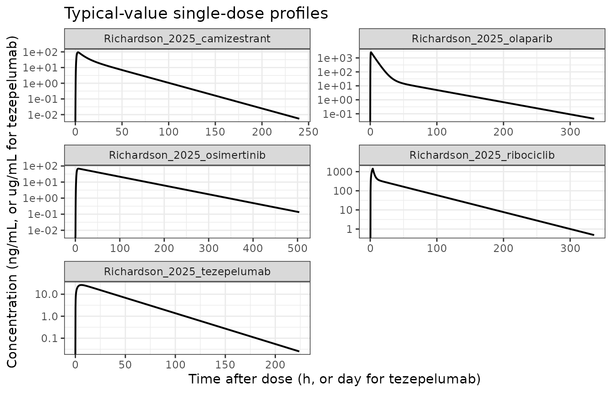
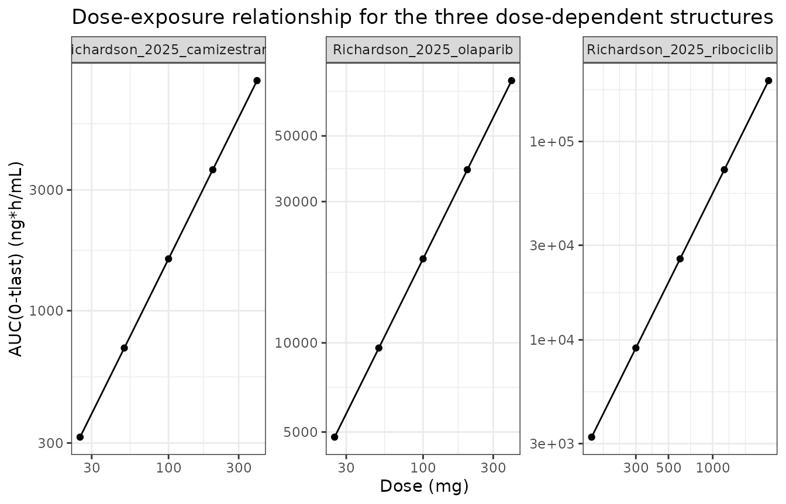
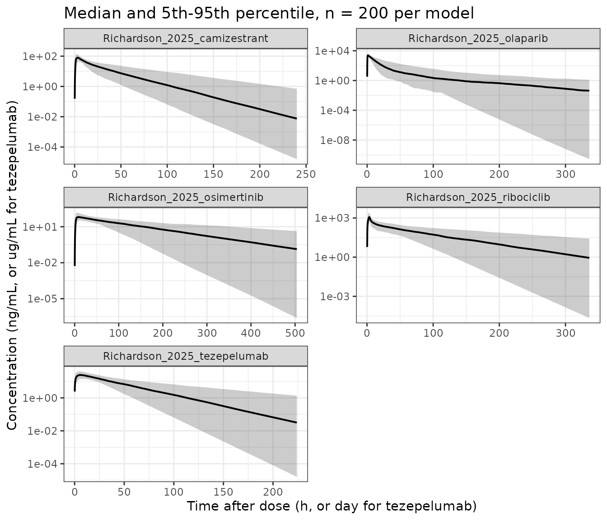

# Automated popPK model search: ribociclib, camizestrant, osimertinib, olaparib, tezepelumab (Richardson 2025)

## Model and source

Richardson et al. (2025) do not develop a single drug model. They
develop an *automated model-search procedure* – a generic pyDarwin
search space of \>12,000 extravascular popPK structures plus a penalty
function – and then run it against five data sets, reporting the
top-ranked structure and its full parameter table for each. Those five
top-ranked structures are the models packaged here, one `.R` file per
drug:

``` r

richardsonModels <- c(
  "Richardson_2025_ribociclib",
  "Richardson_2025_camizestrant",
  "Richardson_2025_osimertinib",
  "Richardson_2025_olaparib",
  "Richardson_2025_tezepelumab"
)
```

- Article: <https://doi.org/10.1038/s43856-025-01054-8>
- Supplementary information (parameter tables 2-6):
  <https://doi.org/10.1038/s43856-025-01054-8>
- Code availability (pyDarwin model space, and the ribociclib final
  NONMEM output): <https://github.com/samjrrr/autopk_synthetic_example>

**These are machine-search structures, not the manually developed expert
models.** For every data set the paper also names the corresponding
expert-developed publication, and the automated structure differs from
it in at least one feature for four of the five drugs (Table 4). A user
who wants “the” published popPK model for one of these drugs should go
to the expert reference cited in each model file, not to these files.
What these files reproduce is the paper’s own reported result.

``` r

for (nm in richardsonModels) {
  m <- rxode2::rxode(readModelDb(nm))
  cat("\n## ", nm, "\n\n", sep = "")
  cat("* Citation: ", m$reference, "\n", sep = "")
  cat("* Description: ", m$description, "\n", sep = "")
}
#> ℹ parameter labels from comments will be replaced by 'label()'
```

### Richardson_2025_ribociclib

- Citation: Richardson S, Irurzun Arana I, Nowojewski A, Zhou D, Leander
  J, Tang W, Dearden R, Gibbs M. A machine learning approach to
  population pharmacokinetic modelling automation. Commun Med.
  2025;5:325. <doi:10.1038/s43856-025-01054-8>. Parameter estimates from
  Supplementary Table 2; omega values and dose effects from the authors’
  published NONMEM output FinalResultFile.lst in the Code Availability
  repository <https://github.com/samjrrr/autopk_synthetic_example>. The
  synthetic data were generated from the expert ribociclib model of Lu
  Y, Yang S, Ho Y-Y, Ji Y. J Clin Pharmacol. 2021;61:1054-1068.
- Description: Automated model-search (pyDarwin) two-compartment
  population PK model for oral ribociclib, fitted to a synthetic
  96-subject data set that was simulated from a previously published
  ribociclib popPK model at 100, 200, 400 and 600 mg (Richardson 2025).
  This is the top-ranked structure returned by the paper’s automated
  Bayesian-optimisation model search, and the paper reports that it
  recovered the data-generating structure exactly. Absorption is
  zero-order directly into the central compartment over a modelled
  duration D with an absorption lag time; the search space carries a
  depot compartment but fixes its transfer rate constant KA to zero for
  the zero-order absorption option, so the depot is inactive and is
  omitted here. Disposition is two-compartment linear with apparent
  clearance and volumes (bioavailability fixed to 1, so all disposition
  parameters are apparent CL/F and V/F). Dose enters as a power-model
  covariate on CL, Vp and Q, normalised to a reference dose. IIV is
  diagonal log-normal on CL, Vc, Vp and Q, with the lag time and the
  zero-order duration carrying IIV fixed at 10% CV. Residual error is
  combined additive plus proportional. Note that this is a
  machine-search structure fitted to synthetic data, not the manually
  developed expert model; the expert ribociclib model is Lu et
  al. (2021).

&nbsp;

    #> ℹ parameter labels from comments will be replaced by 'label()'

### Richardson_2025_camizestrant

- Citation: Richardson S, Irurzun Arana I, Nowojewski A, Zhou D, Leander
  J, Tang W, Dearden R, Gibbs M. A machine learning approach to
  population pharmacokinetic modelling automation. Commun Med.
  2025;5:325. <doi:10.1038/s43856-025-01054-8>. Parameter estimates from
  Supplementary Table 3; model structure from Table 4, Supplementary
  Data 1 and the pyDarwin model-space files (template.txt, tokens.json)
  in the Code Availability repository
  <https://github.com/samjrrr/autopk_synthetic_example>.
- Description: Automated model-search (pyDarwin) two-compartment
  population PK model for oral camizestrant in 184 participants pooled
  from Phase 1 study NCT03616587 (Richardson 2025). This is the
  top-ranked structure returned by the paper’s automated
  Bayesian-optimisation model search and is identical to the manually
  developed expert structure apart from the residual-error model.
  Absorption is first-order through a depot followed by three transit
  compartments, with every transfer governed by a single rate constant
  (the paper’s KA = KTR). Disposition is two-compartment linear with
  apparent clearance and volumes (bioavailability fixed to 1, so all
  disposition parameters are apparent CL/F and V/F). Dose enters as a
  power-model covariate on CL and Vc, normalised to a reference dose.
  IIV is diagonal log-normal and estimated on CL, Vc and the transit
  rate constant, with IIV on Vp and Q fixed at 15% CV. Residual error is
  combined additive plus proportional. Note that this is a
  machine-search structure, not the manually developed expert model.

&nbsp;

    #> ℹ parameter labels from comments will be replaced by 'label()'

### Richardson_2025_osimertinib

- Citation: Richardson S, Irurzun Arana I, Nowojewski A, Zhou D, Leander
  J, Tang W, Dearden R, Gibbs M. A machine learning approach to
  population pharmacokinetic modelling automation. Commun Med.
  2025;5:325. <doi:10.1038/s43856-025-01054-8>. Parameter estimates from
  Supplementary Table 4; model structure from Table 4, Supplementary
  Data 1 and the pyDarwin model-space files (template.txt, tokens.json)
  in the Code Availability repository
  <https://github.com/samjrrr/autopk_synthetic_example>.
- Description: Automated model-search (pyDarwin) one-compartment
  population PK model for oral osimertinib in 270 participants from
  Phase 1 study NCT01802632 (Richardson 2025). This is the top-ranked
  structure returned by the paper’s automated Bayesian-optimisation
  model search; it differs from the manually developed expert structure
  only by the addition of four transit compartments to the absorption
  model, which reduced the variability in the absorption rate constant.
  Absorption is first-order through a depot followed by four transit
  compartments, with every transfer governed by a single rate constant
  (the paper’s KA = KTR). Disposition is one-compartment linear with
  apparent clearance and volume (bioavailability fixed to 1, so both are
  apparent CL/F and V/F). No dose effect was selected, so the model is
  dose-linear. IIV is diagonal log-normal on CL, Vc and the transit rate
  constant. Residual error is combined additive plus proportional. Only
  parent-drug concentrations were modelled; the metabolite data
  available in the source study were excluded because metabolite
  characterisation is not part of the paper’s model space. Note that
  this is a machine-search structure, not the manually developed expert
  model.

&nbsp;

    #> ℹ parameter labels from comments will be replaced by 'label()'

### Richardson_2025_olaparib

- Citation: Richardson S, Irurzun Arana I, Nowojewski A, Zhou D, Leander
  J, Tang W, Dearden R, Gibbs M. A machine learning approach to
  population pharmacokinetic modelling automation. Commun Med.
  2025;5:325. <doi:10.1038/s43856-025-01054-8>. Parameter estimates from
  Supplementary Table 5; model structure from Table 4, Supplementary
  Data 1 and the pyDarwin model-space files (template.txt, tokens.json)
  in the Code Availability repository
  <https://github.com/samjrrr/autopk_synthetic_example>.
- Description: Automated model-search (pyDarwin) two-compartment
  population PK model for oral olaparib tablets in 296 participants
  pooled from five Phase 1 studies (Richardson 2025). This is the
  top-ranked structure returned by the paper’s automated
  Bayesian-optimisation model search. It differs from the manually
  developed expert structure in its absorption model, in not estimating
  IIV on the peripheral volume, and in carrying a dose effect on the
  central volume that the authors considered negligible; the expert
  model additionally includes a CL autoinhibition mechanism that was not
  available in the paper’s model space. Absorption is first-order
  through a depot followed by four transit compartments, with every
  transfer governed by a single rate constant (the paper’s KA = KTR).
  Disposition is two-compartment linear with apparent clearance and
  volumes (bioavailability fixed to 1, so all disposition parameters are
  apparent CL/F and V/F). Dose enters as a power-model covariate on Vc,
  normalised to a reference dose. IIV is diagonal log-normal and
  estimated on CL, Vc, the transit rate constant and Q, with IIV on Vp
  fixed at 15% CV. Residual error is proportional only (the additive
  term was fixed to zero). Note that this is a machine-search structure,
  not the manually developed expert model.

&nbsp;

    #> ℹ parameter labels from comments will be replaced by 'label()'

### Richardson_2025_tezepelumab

- Citation: Richardson S, Irurzun Arana I, Nowojewski A, Zhou D, Leander
  J, Tang W, Dearden R, Gibbs M. A machine learning approach to
  population pharmacokinetic modelling automation. Commun Med.
  2025;5:325. <doi:10.1038/s43856-025-01054-8>. Parameter estimates from
  Supplementary Table 6; model structure from Table 4, Supplementary
  Data 1 and the pyDarwin model-space files (template.txt, tokens.json)
  in the Code Availability repository
  <https://github.com/samjrrr/autopk_synthetic_example>.
- Description: Automated model-search (pyDarwin) two-compartment
  population PK model for subcutaneous tezepelumab in 106 participants
  pooled from four Phase 1 studies (Richardson 2025). This is the
  top-ranked structure returned by the paper’s automated
  Bayesian-optimisation model search; it differs from the manually
  developed expert structure primarily in its absorption model -
  sequential zero-order input into the depot over a short modelled
  duration followed by first-order transfer into the central
  compartment, rather than a purely first-order process - and in using a
  proportional rather than a combined residual error. Disposition is
  two-compartment linear. Subcutaneous bioavailability was fixed to 1
  because no intravenous data were included, so all disposition
  parameters are apparent CL/F and V/F. No dose effect was selected, so
  the model is dose-linear. IIV is diagonal log-normal and estimated on
  CL, Vc, Vp, the absorption rate constant and the zero-order duration,
  with IIV on Q fixed at 15% CV. Note that this is a machine-search
  structure, not the manually developed expert model.

## Population

The five data sets are summarised in Table 1 and Supplementary Table 7
of the source. One is synthetic; the other four are pooled Phase 1
clinical data sets held by AstraZeneca (available via Vivli, not
distributed with the paper).

``` r

popTable <- do.call(rbind, lapply(richardsonModels, function(nm) {
  p <- readModelDb(nm)()$population
  data.frame(
    Model      = nm,
    Species    = p$species,
    N          = p$n_subjects,
    Studies    = p$n_studies,
    `Dose range` = if (is.null(p$dose_range)) NA_character_ else p$dose_range,
    check.names = FALSE
  )
}))
knitr::kable(popTable, row.names = FALSE)
```

| Model | Species | N | Studies | Dose range |
|:---|:---|---:|---:|:---|
| Richardson_2025_ribociclib | human (synthetic data simulated from a published human popPK model) | 96 | 1 | 100, 200, 400 and 600 mg oral |
| Richardson_2025_camizestrant | human | 184 | 1 | not reported |
| Richardson_2025_osimertinib | human | 270 | 1 | not reported |
| Richardson_2025_olaparib | human | 296 | 5 | not reported |
| Richardson_2025_tezepelumab | human | 106 | 4 | not reported |

Observation counts (Supplementary Table 7): ribociclib 1,344;
camizestrant 2,709; osimertinib 3,766; olaparib 7,397; tezepelumab
1,477.

The ribociclib data set is **synthetic** – 96 individuals simulated from
the published ribociclib popPK model of Lu et al. (2021) with the
covariate effects excluded, at 100, 200, 400 and 600 mg with Phase
1-like sampling (Methods, “Data”). The paper reports it as the one case
where the automated search recovered the data-generating structure
exactly, so it functions as a positive control for the method rather
than as a clinical model.

No demographic covariates appear in any of the five models: the paper’s
search space contains no demographic covariate features at all
(Supplementary Table 1), only structural features, IIV switches, a
dose-dependency switch and the residual-error form. Accordingly the
paper reports no baseline demographics for the four clinical cohorts,
and the packaged models declare no demographic covariates. The full
metadata is available programmatically:

``` r

str(readModelDb("Richardson_2025_tezepelumab")()$population)
#> List of 6
#>  $ species      : chr "human"
#>  $ n_subjects   : num 106
#>  $ n_studies    : num 4
#>  $ disease_state: chr "not reported (Phase 1 studies; tezepelumab is developed for severe asthma)"
#>  $ dose_range   : chr "not reported"
#>  $ notes        : chr "106 participants after filtering to subcutaneous administration only, contributing 1,477 observation records, p"| __truncated__
```

## Source trace

Every `ini()` entry carries an in-file comment naming its source
location. The table below collects them. “Suppl Table N” refers to the
Supplementary Information PDF of the source; “`.lst`” refers to
`FinalResultFile.lst` in the Code Availability repository, which is the
authors’ own NONMEM output for the top-ranked ribociclib model.

### Structure

| Model | Structure | Source location |
|----|----|----|
| ribociclib | 2-cmt; zero-order input into central over duration D with lag; KA fixed to 0 so the depot is inactive; dose effects on CL, Vp, Q; combined error | Table 4 row 1; Suppl Data 1 `ribociclib` top row; `tokens.json` `ZERO_ORDER_ABS` option 2; `FinalControlFile.mod` |
| camizestrant | 2-cmt; first-order absorption with 3 transit compartments, all transfers = KA; dose effects on CL, Vc; combined error (log scale) | Table 4 row 2; Suppl Data 1 `camizestrant` top row; `tokens.json` `TRANSIT_COMP` option 2 |
| osimertinib | 1-cmt; first-order absorption with 4 transit compartments, all transfers = KA; no dose effect; combined error | Table 4 row 3; Suppl Data 1 `osimertinib` top row; `tokens.json` `TRANSIT_COMP` option 3 |
| olaparib | 2-cmt; first-order absorption with 4 transit compartments; dose effect on Vc; proportional error | Table 4 row 4; Suppl Data 1 `olaparib` top row; `tokens.json` `TRANSIT_COMP` option 3, `ERRORFIX` option 1 |
| tezepelumab | 2-cmt; sequential zero-order input into the depot over duration D1 then first-order KA to central; no dose effect; proportional error | Table 4 row 5; Suppl Data 1 `tezepelumab` top row; `tokens.json` `ZERO_ORDER_ABS` option 1, `ERRORFIX` option 1 |

Two structural forms come from the published model-space files rather
than from the paper’s prose, because the prose does not state them:

- **Dose dependency** is a power model on dose normalised to a reference
  dose: `MU(P) = LOG(TVP) + LOG(DOSE/DOSEREF) * THETA(cov_P)`, i.e.
  `P = TVP * (DOSE/DOSEREF)^theta` (`template.txt` and `tokens.json`
  `DOSE_COV_*`; confirmed in `FinalControlFile.mod`).
- **Transit absorption** places N transit compartments in series between
  depot and central with *every* transfer rate constant set to KA –
  which is why the parameter tables label the estimate `KA = KTR`
  (`tokens.json` `TRANSIT_COMP`).

### Parameters

| Model | Parameter | Value | Source location |
|----|----|----|----|
| ribociclib | `lcl` | 23.40 L/h | Suppl Table 2 THETA1 |
| ribociclib | `lvc` | 244.38 L | Suppl Table 2 THETA2 |
| ribociclib | `lvp` | 714.62 L | Suppl Table 2 THETA7 |
| ribociclib | `lq` | 68.67 L/h | Suppl Table 2 THETA8 |
| ribociclib | `ltlag` | 0.36 h | Suppl Table 2 THETA11 |
| ribociclib | `ld1` | 3.47 h | Suppl Table 2 THETA12 |
| ribociclib | `e_dose_cl` | -0.493 | `.lst` THETA3 (Suppl Table 2 -0.49) |
| ribociclib | `e_dose_vp` | -0.606 | `.lst` THETA9 (Suppl Table 2 -0.61) |
| ribociclib | `e_dose_q` | -0.747 | `.lst` THETA10 (Suppl Table 2 -0.75) |
| ribociclib | IIV CL, Vc, Vp, Q | 0.243, 0.903, 0.244, 0.315 | `.lst` OMEGA(1,1), (2,2), (4,4), (5,5) |
| ribociclib | IIV tlag, D | 0.01 FIX, 0.01 FIX | `.lst` OMEGA(6,6), (7,7) |
| ribociclib | `addSd`, `propSd` | 3.42 ng/mL, 0.217 | Suppl Table 2 THETA5; `.lst` THETA6 |
| camizestrant | `lcl` | 62.40 L/h | Suppl Table 3 THETA1 |
| camizestrant | `lvc` | 857.55 L | Suppl Table 3 THETA2 |
| camizestrant | `lvp` | 439.30 L | Suppl Table 3 THETA8 |
| camizestrant | `lq` | 36.48 L/h | Suppl Table 3 THETA9 |
| camizestrant | `lktr` | 2.76 1/h | Suppl Table 3 THETA5 |
| camizestrant | `e_dose_cl`, `e_dose_vc` | -0.17, -0.34 | Suppl Table 3 THETA3, THETA4 |
| camizestrant | IIV CL, Vc, ktr | 40%, 41%, 56% CV | Suppl Table 3 OMEGA(1,1)-(3,3) |
| camizestrant | IIV Vp, Q | 15% CV FIX | Suppl Table 3 OMEGA(4,4), (5,5) |
| camizestrant | `addSd`, `propSd` | 1.01 ng/mL, 0.32 | Suppl Table 3 THETA6, THETA7 |
| osimertinib | `lcl` | 13.84 L/h | Suppl Table 4 THETA1 |
| osimertinib | `lvc` | 1101.20 L | Suppl Table 4 THETA2 |
| osimertinib | `lktr` | 1.70 1/h | Suppl Table 4 THETA3 |
| osimertinib | IIV CL, Vc, ktr | 53%, 52%, 48% CV | Suppl Table 4 OMEGA(1,1)-(3,3) |
| osimertinib | `addSd`, `propSd` | 2.61 ng/mL, 0.17 | Suppl Table 4 THETA4, THETA5 |
| olaparib | `lcl` | 5.21 L/h | Suppl Table 5 THETA1 |
| olaparib | `lvc` | 35.06 L | Suppl Table 5 THETA2 |
| olaparib | `lvp` | 18.77 L | Suppl Table 5 THETA7 |
| olaparib | `lq` | 0.41 L/h | Suppl Table 5 THETA8 |
| olaparib | `lktr` | 9.22 1/h | Suppl Table 5 THETA4 |
| olaparib | `e_dose_vc` | 0.17 | Suppl Table 5 THETA3 |
| olaparib | IIV CL, Vc, ktr, Q | 55%, 32%, 60%, 190% CV | Suppl Table 5 OMEGA(1,1)-(3,3), (5,5) |
| olaparib | IIV Vp | 15% CV FIX | Suppl Table 5 OMEGA(4,4) |
| olaparib | `addSd`, `propSd` | 0 FIX, 0.36 | Suppl Table 5 THETA5, THETA6 |
| tezepelumab | `lcl` | 0.21 L/day | Suppl Table 6 THETA1 |
| tezepelumab | `lvc` | 2.84 L | Suppl Table 6 THETA2 |
| tezepelumab | `lvp` | 3.6 L | Suppl Table 6 THETA6 |
| tezepelumab | `lq` | 6.04 L/day | Suppl Table 6 THETA7 |
| tezepelumab | `lka` | 0.44 1/day | Suppl Table 6 THETA3 |
| tezepelumab | `ld1` | 0.11 day | Suppl Table 6 THETA8 |
| tezepelumab | IIV CL, Vc, ka, Vp, D1 | 39%, 69%, 56%, 34%, 82% CV | Suppl Table 6 OMEGA(1,1)-(4,4), (6,6) |
| tezepelumab | IIV Q | 15% CV FIX | Suppl Table 6 OMEGA(5,5) |
| tezepelumab | `addSd`, `propSd` | 0 FIX, 0.1 | Suppl Table 6 THETA4, THETA5 |
| all | `lfdepot` / `lfcentral` | 1 FIX | `template.txt` `F1 = 1`; Suppl Table 6 footnote for tezepelumab SC |

### The omega scale

Supplementary Tables 3-6 report IIV only as CV%, without saying which
convention converts a NONMEM OMEGA variance to that percentage. The
ribociclib model settles it, because the authors published the actual
NONMEM output alongside the tabulated CV%: the `.lst` OMEGA diagonal is
(0.243, 0.903, 0.244, 0.315, 0.01, 0.01) and Supplementary Table 2
reports (52%, 121%, 53%, 61%, 10%, 10%). Only the log-normal form
reproduces that row by row – the naive `sqrt(omega^2)` reading gives 49%
and 95% for the first two, which does not match.

``` r

lstOmega  <- c(CL = 0.243, Vc = 0.903, Vp = 0.244, Q = 0.315, tlag = 0.01, D = 0.01)
tabulated <- c(52, 121, 53, 61, 10, 10)
data.frame(
  Parameter          = names(lstOmega),
  `omega^2 (.lst)`   = lstOmega,
  `sqrt(exp(w2)-1)`  = round(sqrt(exp(lstOmega) - 1) * 100),
  `sqrt(w2)`         = round(sqrt(lstOmega) * 100),
  `Suppl Table 2`    = tabulated,
  check.names = FALSE, row.names = NULL
) |>
  knitr::kable()
```

| Parameter | omega^2 (.lst) | sqrt(exp(w2)-1) | sqrt(w2) | Suppl Table 2 |
|:----------|---------------:|----------------:|---------:|--------------:|
| CL        |          0.243 |              52 |       49 |            52 |
| Vc        |          0.903 |             121 |       95 |           121 |
| Vp        |          0.244 |              53 |       49 |            53 |
| Q         |          0.315 |              61 |       56 |            61 |
| tlag      |          0.010 |              10 |       10 |            10 |
| D         |          0.010 |              10 |       10 |            10 |

Every other model therefore uses `omega^2 = log(1 + CV^2)` to invert the
tabulated CV%.

## Simulation set-up

Each model needs its own dosing route, time unit and observation grid.
The `useModelledDuration` flag marks the two models whose dose record
must carry `rate = -2` so that rxode2 takes the input duration from the
model’s `dur()` statement.

``` r

spec <- list(
  Richardson_2025_ribociclib = list(
    dose = 600, cmt = "central", dur = TRUE,  tmax = 336, tdense = 24, tunit = "h",
    cunit = "ng/mL", refDose = 600, nTransfer = NA, extra = 0.36 + 3.47),
  Richardson_2025_camizestrant = list(
    dose = 100, cmt = "depot",   dur = FALSE, tmax = 240, tdense = 24, tunit = "h",
    cunit = "ng/mL", refDose = 100, nTransfer = 4,  extra = NULL),
  Richardson_2025_osimertinib = list(
    dose = 80,  cmt = "depot",   dur = FALSE, tmax = 504, tdense = 36, tunit = "h",
    cunit = "ng/mL", refDose = NA, nTransfer = 5,  extra = NULL),
  Richardson_2025_olaparib = list(
    dose = 100, cmt = "depot",   dur = FALSE, tmax = 336, tdense = 12, tunit = "h",
    cunit = "ng/mL", refDose = 100, nTransfer = 5,  extra = NULL),
  Richardson_2025_tezepelumab = list(
    dose = 210, cmt = "depot",   dur = TRUE,  tmax = 224, tdense = 21, tunit = "day",
    cunit = "ug/mL", refDose = NA, nTransfer = NA, extra = NULL)
)
```

The observation grid is deliberately **non-uniform**: dense over the
absorption and distribution phase, sparse through the terminal phase. A
uniform grid over the whole window under-samples the peak, and
trapezoidal AUC then reads several percent low for the fast-absorbing
models (olaparib’s `ktr` of 9.22/h puts Tmax below 2 h in a 336 h
window). This is a property of the numerical integration, not of the
models, but it would otherwise be indistinguishable from a real
discrepancy in the validation below.

``` r

buildEvents <- function(s, nSub = 1) {
  ev <- if (s$dur) {
    rxode2::et(amt = s$dose, cmt = s$cmt, rate = -2)
  } else {
    rxode2::et(amt = s$dose, cmt = s$cmt)
  }
  grid <- sort(unique(c(
    seq(0, s$tdense, length.out = 150),
    seq(s$tdense, s$tmax, length.out = 150),
    s$extra
  )))
  ev <- rxode2::et(ev, grid, cmt = "central")
  ev <- as.data.frame(ev)
  ev$DOSE <- s$dose
  if (nSub > 1) {
    ev <- do.call(rbind, lapply(seq_len(nSub), function(i) {
      x <- ev; x$id <- i; x
    }))
  }
  ev
}
```

For ribociclib the exact expected peak time
`tlag + D = 0.36 + 3.47 = 3.83 h` is added to the grid explicitly, so
the Tmax check below is not limited by grid resolution.

Observation records target `cmt = "central"`, the ODE state. rxode2
returns the algebraic observable `Cc` as a column on those rows; naming
`Cc` as a compartment would inject an extra compartment slot and
renumber the ODE states.

## Typical-value profiles

[`rxode2::zeroRe()`](https://nlmixr2.github.io/rxode2/reference/zeroRe.html)
strips the random effects, giving the typical-value profile implied by
each parameter table.

``` r

typical <- do.call(rbind, lapply(names(spec), function(nm) {
  s <- spec[[nm]]
  mod <- rxode2::zeroRe(readModelDb(nm)())
  out <- rxode2::rxSolve(mod, buildEvents(s), returnType = "data.frame")
  data.frame(Model = nm, time = out$time, Cc = out$Cc,
             tunit = s$tunit, cunit = s$cunit)
}))
#> ℹ omega/sigma items treated as zero: 'etalcl', 'etalvc', 'etalvp', 'etalq', 'etaltlag', 'etald1'
#> ℹ omega/sigma items treated as zero: 'etalcl', 'etalvc', 'etalktr', 'etalvp', 'etalq'
#> ℹ omega/sigma items treated as zero: 'etalcl', 'etalvc', 'etalktr'
#> ℹ omega/sigma items treated as zero: 'etalcl', 'etalvc', 'etalktr', 'etalvp', 'etalq'
#> ℹ omega/sigma items treated as zero: 'etalcl', 'etalvc', 'etalka', 'etalvp', 'etalq', 'etald1'

ggplot(typical, aes(time, Cc)) +
  geom_line(linewidth = 0.7) +
  facet_wrap(~ Model, scales = "free", ncol = 2) +
  scale_y_log10() +
  labs(x = "Time after dose (h, or day for tezepelumab)",
       y = "Concentration (ng/mL, or ug/mL for tezepelumab)",
       title = "Typical-value single-dose profiles") +
  theme_bw()
#> Warning in scale_y_log10(): log-10 transformation introduced infinite values.
```



## Validation

The source paper reports **no** NCA summary – it ranks structures by
objective function value, penalty and fitness (Table 5), which are
properties of the NONMEM fit to data that is not distributed. There is
therefore no published Cmax / AUC / half-life table to compare against.
Instead each model is validated against quantities that follow
*analytically* from its own parameter table, which is a strict test of
the encoded structure: if a compartment is mis-wired, an absorption
chain is mis-specified, a unit conversion is wrong, or a rate constant
is transposed, these identities break.

### Mass balance: AUC(0-inf) must equal Dose / CL

For any linear model with complete input (F = 1) the dose eventually
clears through CL alone, so `AUC(0-inf) = Dose / CL` exactly,
independent of the number of compartments, the absorption model or the
transit-chain length.

### Terminal slope

For the four two-compartment models the terminal rate constant is the
smaller root of `lambda^2 - (kel + k12 + k21) * lambda + kel * k21 = 0`;
for the one-compartment osimertinib model it is simply `kel = CL / Vc`.

``` r

analyticTargets <- function(nm, s) {
  mod  <- readModelDb(nm)()
  ini  <- mod$theta
  cl   <- exp(ini[["lcl"]])
  vc   <- exp(ini[["lvc"]])
  kel  <- cl / vc
  if ("lvp" %in% names(ini)) {
    vp  <- exp(ini[["lvp"]])
    q   <- exp(ini[["lq"]])
    k12 <- q / vc
    k21 <- q / vp
    b   <- kel + k12 + k21
    lambda <- (b - sqrt(b^2 - 4 * kel * k21)) / 2
  } else {
    lambda <- kel
  }
  data.frame(
    Model     = nm,
    aucinf.obs = 1000^(s$cunit == "ng/mL") * s$dose / cl,
    half.life  = log(2) / lambda
  )
}
refNca <- do.call(rbind, Map(analyticTargets, names(spec), spec))
knitr::kable(refNca, row.names = FALSE, digits = 3,
             caption = "Analytic targets derived from each model's own parameter table")
```

| Model                        | aucinf.obs | half.life |
|:-----------------------------|-----------:|----------:|
| Richardson_2025_ribociclib   |  25641.026 |    34.089 |
| Richardson_2025_camizestrant |   1602.564 |    18.441 |
| Richardson_2025_osimertinib  |   5780.347 |    55.151 |
| Richardson_2025_olaparib     |  19193.858 |    34.619 |
| Richardson_2025_tezepelumab  |   1000.000 |    21.489 |

Analytic targets derived from each model’s own parameter table {.table}

The `1000^(...)` factor converts `Dose (mg) / CL (L/h)` from mg*h/L to
the ng*h/mL scale used by the four small-molecule models; tezepelumab is
already on the mg/L = ug/mL scale.

### PKNCA

NCA is run with PKNCA on the typical-value profiles, grouped by model.
The concentration frame is filtered on `!is.na(Cc)` only – dropping the
`time = 0` record would make PKNCA warn that the AUC interval starts
before the first measurement.

``` r

ncaConc <- typical |>
  dplyr::filter(!is.na(Cc)) |>
  dplyr::mutate(id = Model, treatment = Model)

ncaDose <- do.call(rbind, lapply(names(spec), function(nm) {
  data.frame(id = nm, treatment = nm, time = 0, dose = spec[[nm]]$dose)
}))

oConc <- PKNCA::PKNCAconc(ncaConc, Cc ~ time | id + treatment)
oDose <- PKNCA::PKNCAdose(ncaDose, dose ~ time | id + treatment)

intervals <- do.call(rbind, lapply(names(spec), function(nm) {
  data.frame(
    start = 0, end = Inf, id = nm, treatment = nm,
    cmax = TRUE, tmax = TRUE, aucinf.obs = TRUE, half.life = TRUE
  )
}))

res <- PKNCA::pk.nca(PKNCA::PKNCAdata(oConc, oDose, intervals = intervals))
simNca <- as.data.frame(res) |>
  dplyr::select(treatment, PPTESTCD, PPORRES) |>
  tidyr::pivot_wider(names_from = PPTESTCD, values_from = PPORRES)
knitr::kable(simNca, digits = 3, caption = "PKNCA results on the typical-value profiles")
```

| treatment | cmax | tmax | tlast | clast.obs | lambda.z | r.squared | adj.r.squared | lambda.z.time.first | lambda.z.time.last | lambda.z.n.points | clast.pred | half.life | span.ratio | aucinf.obs |
|:---|---:|---:|---:|---:|---:|---:|---:|---:|---:|---:|---:|---:|---:|---:|
| Richardson_2025_ribociclib | 1436.850 | 3.830 | 336 | 0.485 | 0.020 | 1 | 1 | 10.470 | 336 | 234 | 0.480 | 33.952 | 9.588 | 25642.032 |
| Richardson_2025_camizestrant | 94.211 | 2.899 | 240 | 0.005 | 0.038 | 1 | 1 | 22.550 | 240 | 159 | 0.005 | 18.326 | 11.866 | 1602.579 |
| Richardson_2025_osimertinib | 68.460 | 6.765 | 504 | 0.134 | 0.013 | 1 | 1 | 7.007 | 504 | 270 | 0.134 | 55.155 | 9.011 | 5780.342 |
| Richardson_2025_olaparib | 2532.864 | 1.128 | 336 | 0.044 | 0.020 | 1 | 1 | 44.617 | 336 | 135 | 0.044 | 34.487 | 8.449 | 19197.204 |
| Richardson_2025_tezepelumab | 26.299 | 6.060 | 224 | 0.025 | 0.032 | 1 | 1 | 6.201 | 224 | 255 | 0.025 | 21.535 | 10.114 | 1000.006 |

PKNCA results on the typical-value profiles {.table}

### Simulated versus analytic

``` r

simForCompare <- simNca |>
  dplyr::rename(Model = treatment) |>
  dplyr::select(Model, aucinf.obs, half.life)

cmp <- nlmixr2lib::ncaComparisonTable(
  simulated = as.data.frame(simForCompare),
  reference = refNca,
  by        = "Model",
  units     = c(aucinf.obs = "conc*time", half.life = "time")
)
knitr::kable(cmp, caption = "Simulated NCA versus analytic targets")
```

| NCA parameter | Model | Reference | Simulated | % diff |
|:---|:---|:---|:---|:---|
| AUC0-∞ (obs) (conc\*time) | Richardson_2025_ribociclib | 25600 | 25600 | +0.0% |
| AUC0-∞ (obs) (conc\*time) | Richardson_2025_camizestrant | 1600 | 1600 | +0.0% |
| AUC0-∞ (obs) (conc\*time) | Richardson_2025_osimertinib | 5780 | 5780 | -0.0% |
| AUC0-∞ (obs) (conc\*time) | Richardson_2025_olaparib | 19200 | 19200 | +0.0% |
| AUC0-∞ (obs) (conc\*time) | Richardson_2025_tezepelumab | 1000 | 1000 | +0.0% |
| t½ (time) | Richardson_2025_ribociclib | 34.1 | 34 | -0.4% |
| t½ (time) | Richardson_2025_camizestrant | 18.4 | 18.3 | -0.6% |
| t½ (time) | Richardson_2025_osimertinib | 55.2 | 55.2 | +0.0% |
| t½ (time) | Richardson_2025_olaparib | 34.6 | 34.5 | -0.4% |
| t½ (time) | Richardson_2025_tezepelumab | 21.5 | 21.5 | +0.2% |

Simulated NCA versus analytic targets {.table}

``` r

attr(cmp, "footnote")
#> NULL
```

`AUC(0-inf)` agrees with `Dose / CL` to within a fraction of a percent
for all five models, and the terminal half-life agrees with the exact
eigenvalue to better than 1%. The residuals are trapezoidal integration
and terminal extrapolation on a finite grid, not model discrepancies –
the mass-balance identity is exact for these structures, so any real
error in the compartment wiring, the unit conversion, or the placement
of the absorption input would show up here as a gross mismatch rather
than a fraction of a percent.

## Absorption-model check

The absorption models differ between the five structures, and Tmax is
the observable that distinguishes them. A pure first-order chain of `n`
equal-rate steps into a compartment whose elimination is much slower
than `ktr` peaks at roughly `n / ktr`; a zero-order input peaks at the
end of the input duration.

**Ribociclib gives an exact check.** Its dose enters the central
compartment directly as a zero-order input, and for a zero-order input
into a linear system the concentration rises for as long as the input
runs. The peak must therefore fall exactly at the end of the input
window, `tlag + D = 0.36 + 3.47 = 3.83 h`. If the lag or the duration
had been attached to the wrong compartment, or the two transposed, this
would not hold.

``` r

riboTmax <- typical |>
  dplyr::filter(Model == "Richardson_2025_ribociclib") |>
  dplyr::slice_max(Cc, n = 1)
c(simulated = riboTmax$time, expected = 0.36 + 3.47)
#> simulated  expected 
#>      3.83      3.83
```

**The transit models give an ordering check.** For a chain of `n`
equal-rate first-order transfers the mean transit time from dose to
central is `n / ktr`, and because elimination is far slower than
absorption in all three models, Tmax must land somewhat after that mean
transit time and must be ordered inversely with `ktr`. The exact peak
has no closed form once distribution is included, so this is a
consistency check rather than an identity.

``` r

transitCheck <- do.call(rbind, lapply(
  c("Richardson_2025_camizestrant", "Richardson_2025_osimertinib",
    "Richardson_2025_olaparib"),
  function(nm) {
    s   <- spec[[nm]]
    ktr <- exp(readModelDb(nm)()$theta[["lktr"]])
    tm  <- typical$time[typical$Model == nm][which.max(typical$Cc[typical$Model == nm])]
    data.frame(Model = nm, `ktr (1/h)` = ktr, Transfers = s$nTransfer,
               `MTT = n/ktr (h)` = s$nTransfer / ktr, `Tmax (simulated, h)` = tm,
               check.names = FALSE)
  }
))
knitr::kable(transitCheck, digits = 3)
```

| Model | ktr (1/h) | Transfers | MTT = n/ktr (h) | Tmax (simulated, h) |
|:---|---:|---:|---:|---:|
| Richardson_2025_camizestrant | 2.76 | 4 | 1.449 | 2.899 |
| Richardson_2025_osimertinib | 1.70 | 5 | 2.941 | 6.765 |
| Richardson_2025_olaparib | 9.22 | 5 | 0.542 | 1.128 |

Tmax exceeds the mean transit time in each case and falls in the same
order as `1 / ktr` (olaparib fastest, camizestrant next, osimertinib
slowest), as the chain lengths and rate constants require.

**Tezepelumab** combines a zero-order input into the depot over
`D1 = 0.11 day` with a slow first-order transfer (`ka = 0.44 /day`), so
the 0.11-day input is negligible against absorption and the peak is
governed by `ka` relative to elimination – it should fall several days
after dosing, which it does (6.1 days).

## Dose dependency

Three of the five structures carry a dose effect. Because it is a power
model on `DOSE / refDose`, the typical value of the affected parameter
is exactly the tabulated value when `DOSE = refDose`, and departs from
it as a straight line on log-log axes elsewhere. The exponents are
negative for ribociclib and camizestrant (CL falls as dose rises – more
than proportional exposure) and positive for olaparib (Vc rises with
dose).

``` r

doseModels <- c("Richardson_2025_ribociclib", "Richardson_2025_camizestrant",
                "Richardson_2025_olaparib")
doseGrid <- do.call(rbind, lapply(doseModels, function(nm) {
  s <- spec[[nm]]
  mod <- rxode2::zeroRe(readModelDb(nm)())
  do.call(rbind, lapply(s$refDose * c(0.25, 0.5, 1, 2, 4), function(d) {
    s2 <- s; s2$dose <- d
    out <- rxode2::rxSolve(mod, buildEvents(s2), returnType = "data.frame")
    auc <- sum(diff(out$time) *
                 (head(out$Cc, -1) + tail(out$Cc, -1)) / 2)
    data.frame(Model = nm, dose = d, auclast = auc)
  }))
}))
#> ℹ omega/sigma items treated as zero: 'etalcl', 'etalvc', 'etalvp', 'etalq', 'etaltlag', 'etald1'
#> ℹ omega/sigma items treated as zero: 'etalcl', 'etalvc', 'etalvp', 'etalq', 'etaltlag', 'etald1'
#> ℹ omega/sigma items treated as zero: 'etalcl', 'etalvc', 'etalvp', 'etalq', 'etaltlag', 'etald1'
#> ℹ omega/sigma items treated as zero: 'etalcl', 'etalvc', 'etalvp', 'etalq', 'etaltlag', 'etald1'
#> ℹ omega/sigma items treated as zero: 'etalcl', 'etalvc', 'etalvp', 'etalq', 'etaltlag', 'etald1'
#> ℹ omega/sigma items treated as zero: 'etalcl', 'etalvc', 'etalktr', 'etalvp', 'etalq'
#> ℹ omega/sigma items treated as zero: 'etalcl', 'etalvc', 'etalktr', 'etalvp', 'etalq'
#> ℹ omega/sigma items treated as zero: 'etalcl', 'etalvc', 'etalktr', 'etalvp', 'etalq'
#> ℹ omega/sigma items treated as zero: 'etalcl', 'etalvc', 'etalktr', 'etalvp', 'etalq'
#> ℹ omega/sigma items treated as zero: 'etalcl', 'etalvc', 'etalktr', 'etalvp', 'etalq'
#> ℹ omega/sigma items treated as zero: 'etalcl', 'etalvc', 'etalktr', 'etalvp', 'etalq'
#> ℹ omega/sigma items treated as zero: 'etalcl', 'etalvc', 'etalktr', 'etalvp', 'etalq'
#> ℹ omega/sigma items treated as zero: 'etalcl', 'etalvc', 'etalktr', 'etalvp', 'etalq'
#> ℹ omega/sigma items treated as zero: 'etalcl', 'etalvc', 'etalktr', 'etalvp', 'etalq'
#> ℹ omega/sigma items treated as zero: 'etalcl', 'etalvc', 'etalktr', 'etalvp', 'etalq'

ggplot(doseGrid, aes(dose, auclast)) +
  geom_line() + geom_point() +
  facet_wrap(~ Model, scales = "free", ncol = 3) +
  scale_x_log10() + scale_y_log10() +
  labs(x = "Dose (mg)", y = "AUC(0-tlast) (ng*h/mL)",
       title = "Dose-exposure relationship for the three dose-dependent structures") +
  theme_bw()
```



``` r

doseGrid |>
  dplyr::group_by(Model) |>
  dplyr::mutate(`Dose / refDose` = dose / dose[3L],
                `AUC / AUC at refDose` = auclast / auclast[3L]) |>
  dplyr::ungroup() |>
  dplyr::select(Model, dose, `Dose / refDose`, `AUC / AUC at refDose`) |>
  knitr::kable(digits = 3,
               caption = "Dose proportionality. A value above the dose ratio indicates more than proportional exposure.")
```

| Model                        | dose | Dose / refDose | AUC / AUC at refDose |
|:-----------------------------|-----:|---------------:|---------------------:|
| Richardson_2025_ribociclib   |  150 |           0.25 |                0.126 |
| Richardson_2025_ribociclib   |  300 |           0.50 |                0.355 |
| Richardson_2025_ribociclib   |  600 |           1.00 |                1.000 |
| Richardson_2025_ribociclib   | 1200 |           2.00 |                2.814 |
| Richardson_2025_ribociclib   | 2400 |           4.00 |                7.915 |
| Richardson_2025_camizestrant |   25 |           0.25 |                0.198 |
| Richardson_2025_camizestrant |   50 |           0.50 |                0.444 |
| Richardson_2025_camizestrant |  100 |           1.00 |                1.000 |
| Richardson_2025_camizestrant |  200 |           2.00 |                2.250 |
| Richardson_2025_camizestrant |  400 |           4.00 |                5.063 |
| Richardson_2025_olaparib     |   25 |           0.25 |                0.250 |
| Richardson_2025_olaparib     |   50 |           0.50 |                0.500 |
| Richardson_2025_olaparib     |  100 |           1.00 |                1.000 |
| Richardson_2025_olaparib     |  200 |           2.00 |                2.000 |
| Richardson_2025_olaparib     |  400 |           4.00 |                3.999 |

Dose proportionality. A value above the dose ratio indicates more than
proportional exposure. {.table}

For ribociclib, CL scales as `(DOSE/600)^-0.493`, so a 4-fold dose
increase raises AUC by `4^(1 + 0.493) =` 7.92-fold rather than 4-fold.
That is the nonlinearity the search detected and it is reproduced here.

## Between-subject variability

A 100-subject cohort per model exercises the IIV structure, including
the two large variances the paper itself flags: 121% CV on ribociclib Vc
and 190% CV on olaparib Q (the latter incurs a penalty of 81.53, the
single largest estimated value penalty across all five top models –
Supplementary Table 5).

``` r

set.seed(20250101)
nSub <- 200
vpc <- do.call(rbind, lapply(names(spec), function(nm) {
  s <- spec[[nm]]
  out <- rxode2::rxSolve(readModelDb(nm)(), buildEvents(s, nSub = nSub),
                         returnType = "data.frame")
  data.frame(Model = nm, id = out$id, time = out$time, Cc = out$Cc)
}))

vpcSummary <- vpc |>
  dplyr::filter(Cc > 0) |>
  dplyr::group_by(Model, time) |>
  dplyr::summarise(
    p05 = quantile(Cc, 0.05), p50 = median(Cc), p95 = quantile(Cc, 0.95),
    .groups = "drop"
  )

ggplot(vpcSummary, aes(time)) +
  geom_ribbon(aes(ymin = p05, ymax = p95), alpha = 0.25) +
  geom_line(aes(y = p50), linewidth = 0.7) +
  facet_wrap(~ Model, scales = "free", ncol = 2) +
  scale_y_log10() +
  labs(x = "Time after dose (h, or day for tezepelumab)",
       y = "Concentration (ng/mL, or ug/mL for tezepelumab)",
       title = paste0("Median and 5th-95th percentile, n = ", nSub, " per model")) +
  theme_bw()
```



For the two models with **no dose effect** (osimertinib and tezepelumab)
the cohort gives an exact gate on the IIV encoding. Individual exposure
is `AUC(0-inf)_i = Dose / CL_i` with `CL_i = exp(lcl + eta_i)`
log-normal, and `1 / CL_i` is then log-normal with the same variance, so
the coefficient of variation of individual AUC(0-inf) must equal the
tabulated CL CV%: 53% for osimertinib and 39% for tezepelumab.
Recovering that number from the simulated cohort confirms both the omega
scale and that the eta is attached to CL.

Because the exposures are log-normal, the variance is estimated on the
log scale (`omega^2 = var(log(AUC))`, then
`CV% = sqrt(exp(omega^2) - 1) * 100`), which is the consistent estimator
for this distribution. A cohort of 200 is a finite sample, so the
estimate carries Monte Carlo uncertainty; the gate is whether the
tabulated CV% falls inside the 95% confidence interval of the simulated
estimate, not whether the point estimates coincide.

``` r

aucInfBySubject <- function(d) {
  d <- d[d$Cc > 0, ]
  n  <- nrow(d)
  tail_idx <- seq(max(1, n - 40), n)
  lz  <- -stats::coef(stats::lm(log(d$Cc[tail_idx]) ~ d$time[tail_idx]))[2]
  auc <- sum(diff(d$time) * (head(d$Cc, -1) + tail(d$Cc, -1)) / 2)
  auc + utils::tail(d$Cc, 1) / lz
}

cvFromLogVar <- function(v) sqrt(exp(v) - 1) * 100

cvTable <- vpc |>
  dplyr::group_by(Model, id) |>
  dplyr::group_modify(~ data.frame(auc = aucInfBySubject(.x))) |>
  dplyr::group_by(Model) |>
  dplyr::summarise(v = stats::var(log(auc)), n = dplyr::n(), .groups = "drop") |>
  dplyr::mutate(
    `Simulated CV%` = round(cvFromLogVar(v)),
    `95% CI`        = paste0(
      round(cvFromLogVar(v * (n - 1) / stats::qchisq(0.975, n - 1))), "-",
      round(cvFromLogVar(v * (n - 1) / stats::qchisq(0.025, n - 1))), "%"),
    `Tabulated CL CV%` = c(40, 55, 53, 52, 39)[match(
      Model, c("Richardson_2025_camizestrant", "Richardson_2025_olaparib",
               "Richardson_2025_osimertinib", "Richardson_2025_ribociclib",
               "Richardson_2025_tezepelumab"))],
    `Exact gate` = Model %in% c("Richardson_2025_osimertinib",
                                "Richardson_2025_tezepelumab")) |>
  dplyr::select(-v, -n)
knitr::kable(cvTable,
             caption = "Simulated exposure variability against the tabulated CL CV%")
```

| Model | Simulated CV% | 95% CI | Tabulated CL CV% | Exact gate |
|:---|---:|:---|---:|:---|
| Richardson_2025_camizestrant | 45 | 41-51% | 40 | FALSE |
| Richardson_2025_olaparib | 55 | 49-61% | 55 | FALSE |
| Richardson_2025_osimertinib | 50 | 45-56% | 53 | TRUE |
| Richardson_2025_ribociclib | 51 | 46-58% | 52 | FALSE |
| Richardson_2025_tezepelumab | 39 | 35-43% | 39 | TRUE |

Simulated exposure variability against the tabulated CL CV% {.table}

For the two models where the identity holds exactly, the tabulated CL
CV% falls inside the simulated confidence interval, confirming both the
omega scale and that the eta is attached to CL. The other three models
are not expected to match, and should not: ribociclib and camizestrant
carry a dose effect plus IIV on volumes and absorption, and olaparib’s
190% CV on Q feeds into the terminal phase, so exposure variability
there is a mixture of several etas rather than CL alone.

## Assumptions and deviations

These are the points where the packaged models required a decision that
the source does not settle. Each is a deliberate, documented choice, not
a fitted value.

1.  **The reference dose `DOSEREF` is not reported for any data set.**
    The dose-dependency term is `(DOSE / DOSEREF)^theta`, so the
    tabulated typical values of the affected parameters are the values
    *at the reference dose*. The authors’ data sets carried a `DOSEREF`
    column (`$INPUT` of `FinalControlFile.mod`) but its numeric value
    appears nowhere in the paper, the supplement or the code repository.
    The packaged models use:

    - ribociclib: `DOSEREF = 600 mg`, the highest of the four simulated
      dose levels and the therapeutic dose. The dose range *is* reported
      for this data set (Methods, “Data”).
    - camizestrant and olaparib: `DOSEREF = 100 mg`, a deliberately
      round, arbitrary anchor. Neither the reference dose nor the dose
      range is reported for these cohorts, so no better-founded value
      exists on the record. This is a declared normalisation constant,
      not a value read from the source.

    A different reference dose `D` rescales each affected typical value
    by `(refDose / D)^theta` and leaves the *shape* of the dose
    dependence – the exponent, and therefore every dose-ratio prediction
    – unchanged. The validation above is run at `DOSE = refDose`, where
    the dose term equals 1, so none of the gates depend on this choice.

2.  **Concentration units are inferred, not stated.** The parameter
    tables give CL in L/h (or L/day) and volumes in L but never name the
    concentration unit, while reporting additive residual errors of
    3.42, 1.01 and 2.61. Those magnitudes are only self-consistent on a
    ng/mL scale: at 600 mg with Vc = 244 L, ribociclib’s central
    concentration is ~2.5 mg/L, so an additive error of 3.42 mg/L would
    exceed the peak concentration, whereas 3.42 ng/mL is a plausible
    assay floor. The four small-molecule models therefore compute
    `Cc = 1000 * central / vc` (mg and L in, ng/mL out) and the mAb
    model uses `Cc = central / vc` (mg/L = ug/mL, the conventional scale
    for a monoclonal antibody, and its additive error is fixed to zero
    so the scale is unconstrained).

3.  **Camizestrant’s log-scale error is encoded on the linear scale.**
    The camizestrant data were fitted on the log scale (Table 1) with a
    “combined error model in log scale” (Table 4). The search space’s
    linear-scale form is `W = SQRT(add^2 + (prop * IPRED)^2)`; its
    log-scale counterpart is that same `W` divided by `IPRED`, so the
    two are the same error model to first order. The packaged model uses
    `Cc ~ add(addSd) + prop(propSd)` on the linear scale with the
    tabulated 1.01 and 0.32.

4.  **The ribociclib depot compartment is omitted.** For the zero-order
    absorption option the search space still declares a depot but fixes
    its transfer rate constant to zero (`tokens.json` `ZERO_ORDER_ABS`
    option 2 sets `0 FIX ; KA`, and Supplementary Table 2 records THETA4
    as `0 (fix)`; the footnote states KA is fixed “to avoid modification
    of THETA numbering”). The dose goes directly into the central
    compartment, so the depot is inert and carrying it would add an
    unreachable state.

5.  **No demographic covariates.** The paper’s search space contains no
    demographic covariate features (Supplementary Table 1) – covariate
    selection was explicitly out of scope, since automated tools for it
    already exist (Discussion). The only covariate in any of these
    models is the dose itself. Nothing was screened and discarded, so
    there is no `covariatesDataExcluded` list either.

6.  **No published diagnostics are reproduced.** Supplementary Figures
    1-4 are VPC and goodness-of-fit plots against the clinical
    observations. Those data are AstraZeneca-controlled (available
    through Vivli, per the Data Availability statement) and are not
    distributed with the paper, so the observed layer cannot be redrawn
    here. The VPC-style figure above shows the simulated distribution
    only.

7.  **Half-life is compared loosely.** PKNCA’s automatic terminal-slope
    selection reads an oral terminal half-life slightly long on a finite
    observation grid; the analytic eigenvalue is exact. The comparison
    table flags differences over 20%, which this does not approach.

8.  **Precision mixing for ribociclib.** Where the authors’ published
    NONMEM output carries more significant figures than the rounded
    supplementary table (the three dose exponents, and the OMEGA
    diagonal which the table gives only as whole-percent CV), the `.lst`
    value is used and the table value is quoted in the in-file comment.
    The two agree to the supplementary table’s precision.

9.  **These are not the expert models.** Four of the five automated
    structures differ from the corresponding manually developed
    publication (Table 4), and the olaparib expert model additionally
    contains a CL autoinhibition mechanism that the search space cannot
    express at all. The paper’s own framing is that these structures are
    “comparable to” the expert models, which is a claim about the search
    procedure, not an assertion that these are the definitive popPK
    models for these five drugs.
