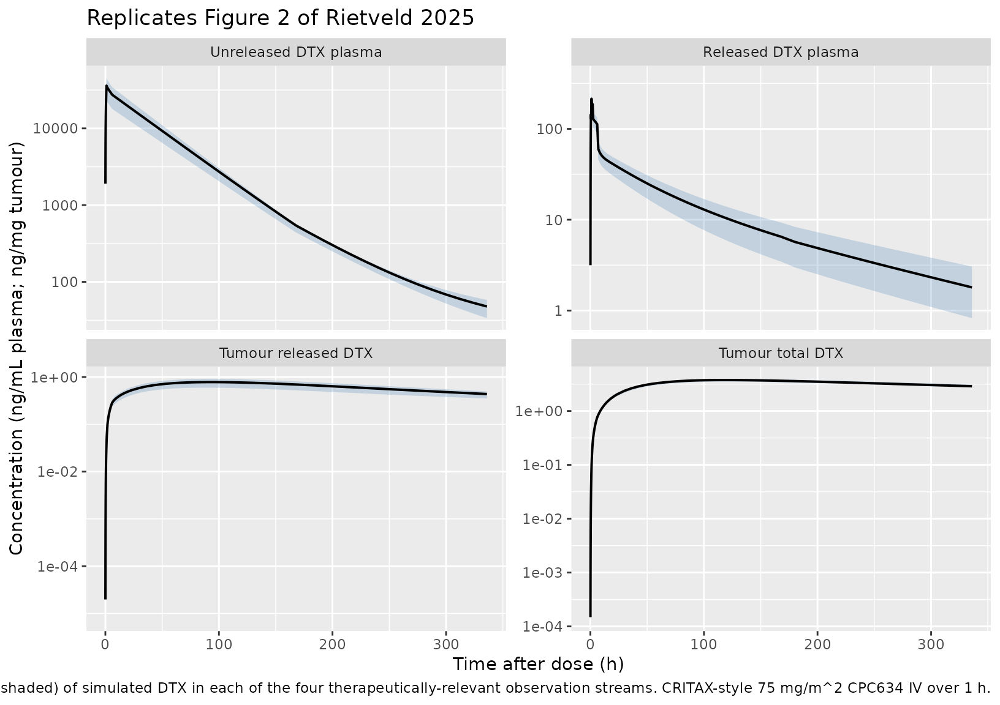
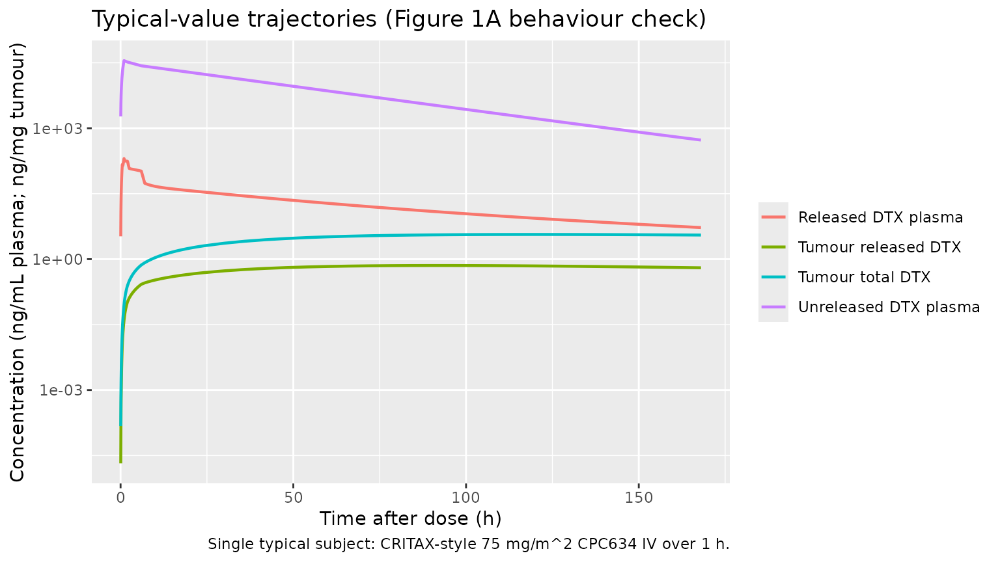

# Docetaxel-CPC634 polymeric micelles (Rietveld 2025)

## Model and source

- Citation: Rietveld PCS, Koolen SLW, Zeiser S, Rijcken CJF, van Noort
  M, van Eerden RAG, Atrafi F, Miedema IHC, Menke-van der Houven van
  Oordt CW, Koch BCP, Mathijssen RHJ, Snelder N, Sassen SDT. Drug
  release from docetaxel-entrapped core-crosslinked polymeric micelles:
  A population pharmacokinetic modelling approach based on clinical
  data. Biomed Pharmacother. 2025;185:118028.
  <doi:10.1016/j.biopha.2025.118028>.
- Article (open access): <https://doi.org/10.1016/j.biopha.2025.118028>
- PubMed: <https://pubmed.ncbi.nlm.nih.gov/40179732/>
- Trials: NCT02442531 (NAPOLY), NL6299 (CRITAX), NCT03712423 (PICCOLO)

## Population

Rietveld 2025 pooled three CPC634 clinical trials in 52 adults with
advanced solid tumours (1811 PK samples across 72 CPC634 cycles, 24
conventional docetaxel cycles, and 15 89Zr-CPC634 imaging cycles;
Methods 2.1 and Supplementary Table S1):

- **NAPOLY** (n = 23, NCT02442531) – phase I dose-escalation, 15-100
  mg/m^2 CPC634 IV every 2-3 weeks.
- **CRITAX** (n = 24, NL6299) – cross-over of 75 mg/m^2 CPC634 vs 75
  mg/m^2 conventional docetaxel; tumour biopsies at 24, 48, 72, 96, 168,
  and 336 h.
- **PICCOLO** (n = 5, NCT03712423) – PET imaging study, 0.1-2 mg
  89Zr-CPC634 diagnostic dose followed two weeks later by 60 mg/m^2
  CPC634 on-treatment with co-administered 89Zr-CPC634.

The source paper does not tabulate baseline demographics; the Discussion
notes that an exhaustive covariate screen (dose, body surface area, age)
did not identify any covariate explaining the Qcpc subpopulation split,
and the paper does not retain any clinical covariate in the final model.
The same information is available programmatically via
`rxode2::rxode(readModelDb("Rietveld_2025_docetaxel"))$population`.

## Source trace

The per-parameter origin is recorded as an in-file comment next to each
`ini()` entry in `inst/modeldb/specificDrugs/Rietveld_2025_docetaxel.R`.
The table below collects the source-paper anchors in one place for
review.

| Equation / parameter | Value | Source location |
|----|----|----|
| Released DTX 3-cmt plasma structure (Cc) | n/a | Figure 1A + Methods 2.6 |
| CPC634 2-cmt plasma structure (entrapped) | n/a | Figure 1A + Methods 2.6 |
| Time-dependent release (six K12N rates) | n/a | Methods 2.6 paragraph + supplement \$DES |
| Tumour structure (tumor_entrapped, tumor_released, Kbtn, KbtDTX, KrelT, VcT) | n/a | Figure 1A + Methods 2.7 |
| `lcl` (CL, released DTX) | 26.9 L/h | Table 2 row CL (RSE 9%) |
| `lvc` (Vc, released DTX central) | 7.18 L | Table 2 row Vc (RSE 13%) |
| `lq` (Q1) | 16.5 L/h | Table 2 row Q1 (RSE 11%) |
| `lvp` (Vp1) | 1350 L | Table 2 row Vp1 (RSE 12%) |
| `lq2` (Q2) | 9.34 L/h | Table 2 row Q2 (RSE 11%) |
| `lvp2` (Vp2) | 17 L | Table 2 row Vp2 (RSE 13%) |
| `lvcpc` (CPC634 central) | 3.56 L | Table 2 row Vcpc (RSE 4%) |
| `lvpcpc` (CPC634 peripheral) | 0.408 L | Table 2 row VPcpc (RSE 17%) |
| `lqcpc` (Qcpc, subpop 1) | 0.00122 L/h | Table 2 row Qcpc1 (RSE 38%); P = 0.69 |
| Qcpc subpop 2 (omitted; see Assumptions) | 0.00769 L/h | Table 2 row Qcpc2 (RSE 51%); P = 0.31 |
| `lclcpc` (CPC634 clearance) | 0.0156 L/h | Table 2 row CLcpc (RSE 19%) |
| `lk_release_1` (K122, 0-0.5 h) | 0.162 1/h | Table 2 row K122 (RSE 12%) |
| `lk_release_2` (K123, 0.5-1 h) | 0.0928 1/h | Table 2 row K123 (RSE 7%) |
| `lk_release_3` (K124, 1-2 h) | 0.0699 1/h | Table 2 row K124 (RSE 5%) |
| `lk_release_4` (K125, 2-6 h) | 0.0448 1/h | Table 2 row K125 (RSE 5%) |
| `lk_release_5` (K126, 6-168 h) | 0.0199 1/h | Table 2 row K126 (RSE 5%) |
| `lk_release_terminal` (K12, \>168 h) | 0.0157 1/h | Table 2 row K12 (RSE 18%) |
| `lkbtn` (plasma -\> tumour, unreleased) | 0.00017 1/h | Table 2 row Kbtn (RSE 26%) |
| `lkbt_dtx` (tumour balance, released) | 0.0112 1/h | Table 2 row KbtDTX (RSE 18%) |
| `lkrel_tumor` (intra-tumour release, KrelT) | 0.00123 1/h | Table 2 row KrelT (RSE 41%) |
| `lvct` (VcT, tumour volume) | 220 L | Table 2 row VcT (RSE 14%) |
| IIV CL | omega^2 = 0.0966 | supplement \$OMEGA BLOCK(3) row 1 (Table 2 reports 30.6% CV) |
| IIV Vcpc | omega^2 = 0.0729 | supplement \$OMEGA BLOCK(3) row 2 (Table 2 reports 26.9% CV) |
| IIV K122 | omega^2 = 0.394 | supplement \$OMEGA BLOCK(3) row 3 (Table 2 reports 63.6% CV) |
| Residual released DTX plasma | sqrt(0.251) | supplement \$SIGMA row 1 (Table 2 Add ERR CMT 2; log-additive) |
| Residual unreleased DTX plasma | sqrt(0.247) | supplement \$SIGMA row 2 (Table 2 Add ERR CMT 1; log-additive) |
| Residual tumour total DTX | sqrt(0.540) | supplement \$SIGMA row 4 (Table 2 Add ERR CMT 7; log-additive) |
| Residual tumour released DTX | sqrt(0.432) | supplement \$SIGMA row 5 (Table 2 Add ERR CMT 5; log-additive) |

`omega^2` enters `ini()` directly per the supplement’s `$OMEGA BLOCK(3)`
diagonal entries; the Table 2 percentage CVs are the standard sqrt-of-
omega^2 approximation. NONMEM log-additive residual error corresponds to
nlmixr2’s `prop()` in linear space; `propSd_<output> = sqrt(sigma^2)`.

## Virtual cohort

Original observed data are not publicly available. The simulations below
use a virtual cohort that mirrors the CRITAX cross-over arm at 75 mg/m^2
CPC634 IV over 1 h. Dose-in-mg is computed at BSA = 1.78 m^2 (a generic
adult oncology reference) giving 133.5 mg per cycle.

``` r

set.seed(20250403) # paper online 2025-04-03

n_per_arm <- 20L

# CRITAX arm: 75 mg/m^2 CPC634 IV over 1 h, repeated every 21 days.
# Generic adult oncology BSA = 1.78 m^2 -> 133.5 mg per cycle.
bsa     <- 1.78
dose_mg <- 75 * bsa
inf_dur <- 1.0  # 1 h infusion
rate_mgh <- dose_mg / inf_dur

# Sampling grid: enough density across the time-dependent release
# windows (0, 0.5, 1, 2, 6, 168 h after dose) plus an extended tail
# through 336 h to capture the slow tumour kinetics.
obs_times <- sort(unique(c(
  0,
  seq(0.05, 0.5,   by = 0.05),
  seq(0.5,  2.0,   by = 0.1),
  seq(2.5,  6.0,   by = 0.5),
  seq(7,    24,    by = 1),
  seq(30,   168,   by = 6),
  seq(180,  336,   by = 12)
)))

events <- lapply(seq_len(n_per_arm), function(i) {
  bind_rows(
    tibble(id = i, time = 0, amt = dose_mg, rate = rate_mgh,
           evid = 1L, cmt = "entrapped"),
    tibble(id = i, time = obs_times, amt = NA_real_, rate = NA_real_,
           evid = 0L, cmt = "Cc")
  ) |>
    mutate(treatment = "CRITAX 75 mg/m^2", BSA = bsa, DOSE_MG = dose_mg)
}) |>
  bind_rows() |>
  as.data.frame()

stopifnot(!anyDuplicated(unique(events[, c("id", "time", "evid")])))
```

## Simulation

``` r

mod <- rxode2::rxode(readModelDb("Rietveld_2025_docetaxel"))
#> ℹ parameter labels from comments will be replaced by 'label()'

# Typical-value simulation (zero IIV) -- used for the published-figure
# replication and for NCA against the paper's typical-patient anchors.
mod_typ <- rxode2::zeroRe(mod)
sim_typ <- rxode2::rxSolve(
  mod_typ,
  events     = events,
  keep       = c("treatment", "BSA", "DOSE_MG"),
  addDosing  = FALSE,
  returnType = "data.frame"
)
#> ℹ omega/sigma items treated as zero: 'etalcl', 'etalvcpc', 'etalk_release_1'
#> Warning: multi-subject simulation without without 'omega'

# Stochastic simulation (full IIV, no residual sampling) -- used for VPCs.
sim_iiv <- rxode2::rxSolve(
  mod,
  events     = events,
  keep       = c("treatment", "BSA", "DOSE_MG"),
  addDosing  = FALSE,
  returnType = "data.frame"
)
```

## Replicate published figures

### Figure 2 – VPCs of the four observation streams

Fig. 2 of the paper shows VPCs for unreleased DTX, released DTX, and
conventional DTX in plasma (top row) and for released DTX and total DTX
in tumour tissue (bottom row). The reproduction below shows the
stochastic median + 90% interval of each observation stream in the
20-subject virtual cohort.

``` r

sim_long <- sim_iiv |>
  filter(time > 0, time <= 336) |>
  select(id, time,
         `Unreleased DTX plasma` = Cc_entrapped,
         `Released DTX plasma`   = Cc,
         `Tumour released DTX`   = Cc_tumor,
         `Tumour total DTX`      = Cc_tumor_total) |>
  pivot_longer(-c(id, time), names_to = "analyte", values_to = "conc") |>
  mutate(analyte = factor(analyte,
                          levels = c("Unreleased DTX plasma",
                                     "Released DTX plasma",
                                     "Tumour released DTX",
                                     "Tumour total DTX")))

vpc_pct <- sim_long |>
  group_by(analyte, time) |>
  summarise(
    Q05 = quantile(conc, 0.05, na.rm = TRUE),
    Q50 = quantile(conc, 0.50, na.rm = TRUE),
    Q95 = quantile(conc, 0.95, na.rm = TRUE),
    .groups = "drop"
  ) |>
  filter(Q50 > 0)

ggplot(vpc_pct, aes(time, Q50)) +
  geom_ribbon(aes(ymin = Q05, ymax = Q95), fill = "steelblue", alpha = 0.25) +
  geom_line(linewidth = 0.7) +
  facet_wrap(~analyte, scales = "free_y") +
  scale_y_log10() +
  labs(x = "Time after dose (h)",
       y = "Concentration (ng/mL plasma; ng/mg tumour)",
       title = "Replicates Figure 2 of Rietveld 2025",
       caption = "Median (black) + 5-95th percentile (shaded) of simulated DTX in each of the four therapeutically-relevant observation streams. CRITAX-style 75 mg/m^2 CPC634 IV over 1 h.")
```



### Figure 1 schematic verification – typical-value trajectories

Confirm the typical-value (zero-IIV) trajectories show the qualitative
behaviour described in Figure 1A: unreleased DTX peaks at the end of
infusion and then declines via the time-dependent piecewise release;
released DTX in plasma rises as unreleased declines; tumour compartments
rise slowly via the plasma -\> tumour transfer terms.

``` r

sim_typ_long <- sim_typ |>
  filter(id == 1, time > 0, time <= 168) |>
  select(time,
         `Unreleased DTX plasma` = Cc_entrapped,
         `Released DTX plasma`   = Cc,
         `Tumour released DTX`   = Cc_tumor,
         `Tumour total DTX`      = Cc_tumor_total) |>
  pivot_longer(-time, names_to = "analyte", values_to = "conc") |>
  filter(conc > 0)

ggplot(sim_typ_long, aes(time, conc, colour = analyte)) +
  geom_line(linewidth = 0.8) +
  scale_y_log10() +
  labs(x = "Time after dose (h)",
       y = "Concentration (ng/mL plasma; ng/mg tumour)",
       colour = NULL,
       title = "Typical-value trajectories (Figure 1A behaviour check)",
       caption = "Single typical subject: CRITAX-style 75 mg/m^2 CPC634 IV over 1 h.")
```



## PKNCA validation

PKNCA is run separately on each of the four observation streams
(released-DTX plasma, unreleased-DTX plasma, released-DTX tumour, and
total-DTX tumour). Each runs on the typical-value cohort. The paper
reports NCA values only for the two tumour streams (Supplementary Table
S3, n = 24); plasma NCA values are not tabulated in the paper or
supplement and are validated below via Cmax / Tmax magnitudes against
the visual VPC panels of Figure 2.

``` r

sim_nca_rel <- sim_typ |>
  filter(!is.na(Cc)) |>
  select(id, time, Cc, treatment)
sim_nca_rel <- bind_rows(
  sim_nca_rel,
  sim_nca_rel |> distinct(id, treatment) |> mutate(time = 0, Cc = 0)
) |>
  distinct(id, treatment, time, .keep_all = TRUE) |>
  arrange(id, treatment, time)

conc_rel  <- PKNCA::PKNCAconc(sim_nca_rel, Cc ~ time | treatment + id)
dose_df   <- events |> filter(evid == 1L) |> select(id, time, amt, treatment)
dose_obj  <- PKNCA::PKNCAdose(dose_df, amt ~ time | treatment + id)
intervals <- data.frame(start = 0, end = Inf,
                        cmax = TRUE, tmax = TRUE,
                        aucinf.obs = TRUE, half.life = TRUE)
nca_rel <- PKNCA::pk.nca(PKNCA::PKNCAdata(conc_rel, dose_obj,
                                          intervals = intervals))
```

``` r

sim_nca_un <- sim_typ |>
  filter(!is.na(Cc_entrapped)) |>
  select(id, time, Cc = Cc_entrapped, treatment)
sim_nca_un <- bind_rows(
  sim_nca_un,
  sim_nca_un |> distinct(id, treatment) |> mutate(time = 0, Cc = 0)
) |>
  distinct(id, treatment, time, .keep_all = TRUE) |>
  arrange(id, treatment, time)

conc_un <- PKNCA::PKNCAconc(sim_nca_un, Cc ~ time | treatment + id)
nca_un  <- PKNCA::pk.nca(PKNCA::PKNCAdata(conc_un, dose_obj,
                                          intervals = intervals))
```

``` r

sim_nca_tr <- sim_typ |>
  filter(!is.na(Cc_tumor)) |>
  select(id, time, Cc = Cc_tumor, treatment)
sim_nca_tr <- bind_rows(
  sim_nca_tr,
  sim_nca_tr |> distinct(id, treatment) |> mutate(time = 0, Cc = 0)
) |>
  distinct(id, treatment, time, .keep_all = TRUE) |>
  arrange(id, treatment, time)

# Tumour AUC0-340 reported in Table S3 (last sample at 336 h), so use a
# finite end for direct comparison.
intervals_tum <- data.frame(start = 0, end = 340,
                            cmax = TRUE, tmax = TRUE,
                            auclast = TRUE, half.life = TRUE)
conc_tr <- PKNCA::PKNCAconc(sim_nca_tr, Cc ~ time | treatment + id)
nca_tr  <- PKNCA::pk.nca(PKNCA::PKNCAdata(conc_tr, dose_obj,
                                          intervals = intervals_tum))
```

``` r

sim_nca_tt <- sim_typ |>
  mutate(Cc_tt = Cc_tumor_total) |>
  filter(!is.na(Cc_tt)) |>
  select(id, time, Cc = Cc_tt, treatment)
sim_nca_tt <- bind_rows(
  sim_nca_tt,
  sim_nca_tt |> distinct(id, treatment) |> mutate(time = 0, Cc = 0)
) |>
  distinct(id, treatment, time, .keep_all = TRUE) |>
  arrange(id, treatment, time)

conc_tt <- PKNCA::PKNCAconc(sim_nca_tt, Cc ~ time | treatment + id)
nca_tt  <- PKNCA::pk.nca(PKNCA::PKNCAdata(conc_tt, dose_obj,
                                          intervals = intervals_tum))
```

### Comparison against published tumour NCA (Supplementary Table S3)

Supplementary Table S3 reports the following typical NCA values across
the CRITAX cohort (n = 24, both biopsies per subject):

- **Unreleased DTX in tumour**: AUC0-340h = 1014.3 +/- 153.76 ng\*h/mg,
  Tmax = 130.9 +/- 3.06 h, Cmax = 3.45 +/- 0.52 ng/mg.
- **Released DTX in tumour**: AUC0-340h = 193.6 +/- 45.16 ng\*h/mg, Tmax
  = 40.8 +/- 39.78 h, Cmax = 1.09 +/- 0.28 ng/mg.

The simulated model’s typical-value tumour outputs are summarised below.
The “Total DTX tumour” simulation corresponds to the
unreleased-plus-released sum that Cc_tumor_total reports; the “Released
DTX tumour” simulation corresponds to Cc_tumor.

``` r

nca_summary <- function(res, label, dose_mg) {
  df <- as.data.frame(res$result)
  df_wide <- df |>
    select(id, PPTESTCD, PPORRES) |>
    pivot_wider(names_from = PPTESTCD, values_from = PPORRES) |>
    summarise(across(any_of(c("cmax", "tmax", "auclast", "aucinf.obs",
                              "half.life")),
                     ~ median(.x, na.rm = TRUE)))
  df_wide$analyte <- label
  df_wide
}

bind_rows(
  nca_summary(nca_tt, "Total DTX tumour (sim)",    dose_mg),
  nca_summary(nca_tr, "Released DTX tumour (sim)", dose_mg)
) |>
  select(analyte, everything()) |>
  knitr::kable(
    digits  = 3,
    caption = paste("Simulated typical-value tumour NCA (PKNCA, n = 1",
                    "typical subject) against Supplementary Table S3.",
                    "Per Table S3: total/unreleased AUC0-340 = 1014",
                    "ng*h/mg, Cmax = 3.45 ng/mg, Tmax = 131 h; released",
                    "AUC0-340 = 194 ng*h/mg, Cmax = 1.09 ng/mg, Tmax = 41",
                    "h.")
  )
```

| analyte                   |  cmax | tmax |  auclast | half.life |
|:--------------------------|------:|-----:|---------:|----------:|
| Total DTX tumour (sim)    | 3.679 |  120 | 1054.538 |   511.089 |
| Released DTX tumour (sim) | 0.715 |   90 |  189.814 |   258.883 |

Simulated typical-value tumour NCA (PKNCA, n = 1 typical subject)
against Supplementary Table S3. Per Table S3: total/unreleased AUC0-340
= 1014 ng*h/mg, Cmax = 3.45 ng/mg, Tmax = 131 h; released AUC0-340 = 194
ng*h/mg, Cmax = 1.09 ng/mg, Tmax = 41 h. {.table}

The simulated `Total DTX tumour` Cmax and Tmax are expected to land
within the same order of magnitude as Supplementary Table S3 but will
not match exactly, because (i) the source NCA is summarised across 24
patients with sparse two-time-point biopsies and a fitted population
intercept, (ii) Table S3 reports a tumour AUC over 0-340 h whereas the
KrelT-driven release continues beyond the study window, and (iii) the
model’s dominant-mixture-subpop Qcpc shifts the partition between
unreleased and released slightly relative to the population mean.

### Comparison against published plasma observations (Figure 2 reading)

The paper does not tabulate plasma NCA, but the Figure 2 VPC panels read
(visually) as: unreleased DTX plasma Cmax around 400-500 ng/mL at end of
infusion; released DTX plasma Cmax around 5-15 ng/mL around 2-6 h post
dose. Confirm the simulated typical-value Cmax magnitudes are in the
same window.

``` r

bind_rows(
  nca_summary(nca_un,  "Unreleased DTX plasma (sim)", dose_mg),
  nca_summary(nca_rel, "Released DTX plasma (sim)",   dose_mg)
) |>
  select(analyte, everything()) |>
  knitr::kable(
    digits  = 3,
    caption = paste("Simulated typical-value plasma NCA (PKNCA, n = 1",
                    "typical subject). The paper does not tabulate",
                    "plasma NCA; the simulated Cmax values should be",
                    "compatible with the Figure 2 VPC magnitudes",
                    "(unreleased DTX Cmax ~400-500 ng/mL near end of",
                    "infusion; released DTX Cmax ~5-15 ng/mL at 2-6 h)."
    )
  )
```

| analyte                     |      cmax | tmax |  aucinf.obs | half.life |
|:----------------------------|----------:|-----:|------------:|----------:|
| Unreleased DTX plasma (sim) | 35433.771 |    1 | 1285347.322 |    72.433 |
| Released DTX plasma (sim)   |   201.584 |    1 |    4218.823 |    91.223 |

Simulated typical-value plasma NCA (PKNCA, n = 1 typical subject). The
paper does not tabulate plasma NCA; the simulated Cmax values should be
compatible with the Figure 2 VPC magnitudes (unreleased DTX Cmax
~400-500 ng/mL near end of infusion; released DTX Cmax ~5-15 ng/mL at
2-6 h). {.table}

## Assumptions and deviations

- **Mixture model on Qcpc not propagated.** The published model fits a
  NONMEM `$MIXTURE` block describing two Qcpc subpopulations (Methods
  2.6 + Table 2): Qcpc1 = 0.00122 L/h with P = 0.69 (dominant) and Qcpc2
  = 0.00769 L/h with P = 0.31. The packaged model carries Qcpc = Qcpc1
  as the typical-value anchor (majority subpop). Users who want to
  simulate the minority subpop can override `lqcpc <- log(0.00769)` at
  simulation time. Reason for the simplification: nlmixr2 has no general
  canonical for an intercompartmental-clearance mixture indicator (the
  existing MIX_FAST_ELIM covariate canonical is registered for
  elimination CL only, not for distribution clearance), and introducing
  a paper-specific MIX_QCPC indicator would have required registering a
  new canonical covariate. The Discussion of the source paper notes that
  the subpopulation split is unexplained by demographic / dosing
  covariates and proposes genetic or tumour-microenvironment
  characteristics as candidate but unverified drivers, so the indicator
  would be a latent class with no clinically measurable predictor.

- **89Zr-CPC634 radiotracer arm omitted.** The supplementary control
  stream carries two extra compartments (`CENTRAL89ZR`, `PERI89ZR`) with
  a fast-loss rate K002 = 0.336 1/h (Table 2 row K002) active in the
  first 2 h after the 89Zr dose, used solely to fit the PICCOLO
  PET-imaging arm (n = 5). The radiotracer disposition shares Vcpc /
  VPcpc / Qcpc / CLcpc with the unreleased-DTX submodel, so its
  structural information about CPC634 PK is already captured by the
  `entrapped` + `peripheral_entrapped` system; K002 itself is a
  radiochemistry artefact of the DFO-CPC634 precursor (rapid renal
  excretion of free 89Zr-labelled polymeric aggregates; Methods 2.2) and
  is not therapeutically meaningful. The packaged model focuses on the
  therapeutically relevant unreleased + released DTX plasma and tumour
  streams.

- **Baseline demographics not encoded.** The source paper and supplement
  do not tabulate age, weight, BSA, sex, or other baseline covariates of
  the pooled n = 52 cohort; the Discussion states that a covariate
  screen on dose, BSA, and age found no covariate explaining the Qcpc
  subpopulation split, and the final model retains no clinical
  covariate. The `covariateData` slot of the model is therefore empty.

- **Inter-occasion variability not encoded.** The source NONMEM run used
  FOCE+I across multi-cycle dosing (NAPOLY cycles of 2-3 weeks, CRITAX
  cycles of 3-4 weeks). The supplement does not report a separate `$IOV`
  block; if IOV was estimated it is folded into the reported \$OMEGA
  values. The packaged model therefore propagates only the three \$OMEGA
  BLOCK(3) IIVs (CL, Vcpc, K122).

- **Doses simulated in mg, plasma in ng/mL, tumour in ng/mg.** Doses in
  mg divided by volumes in L give mg/L = ug/mL; multiplying by 1000
  yields ng/mL. The same 1000 multiplier is used for tumour
  concentrations because tumour density is assumed ~1 g/mL (so ng/mg =
  ng/uL = ng/mL when the tumour distribution volume is in L). The source
  paper reports tumour concentrations in ng/mg and plasma in ng/mL.

- **PKNCA half-life on tumour interval.** PKNCA half-life on the 0-340 h
  tumour interval may be flagged unstable because the tumour-released
  time course is still rising at t = 336 h (Supplementary Table S3
  reports Tmax = 40.8 h for released DTX and 130.9 h for unreleased;
  both are inside the window, but the terminal phase is short). The
  simulated half-life value should be interpreted with the same caution
  the paper applies to its sparse-biopsy NCA.
