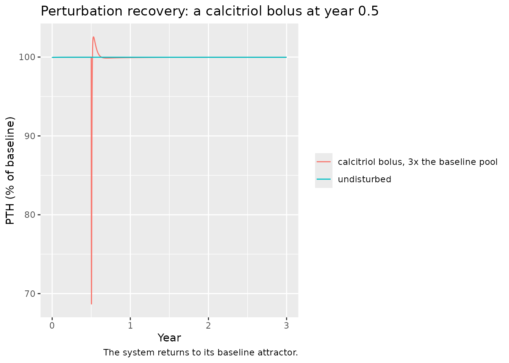
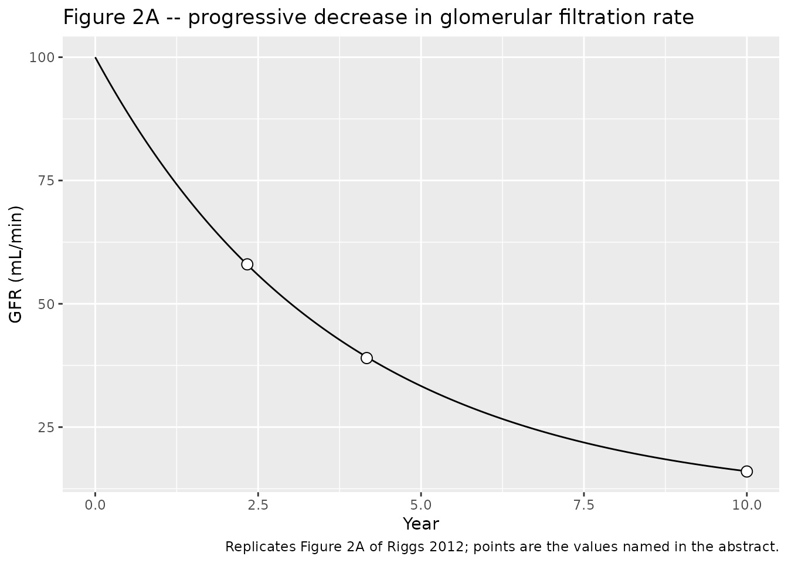
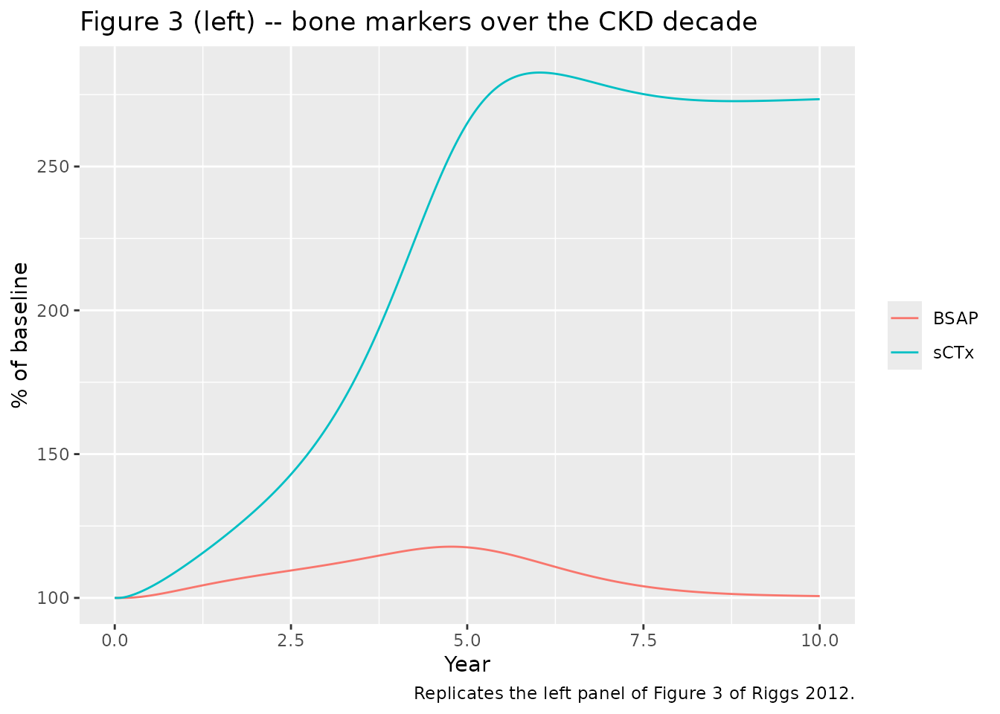
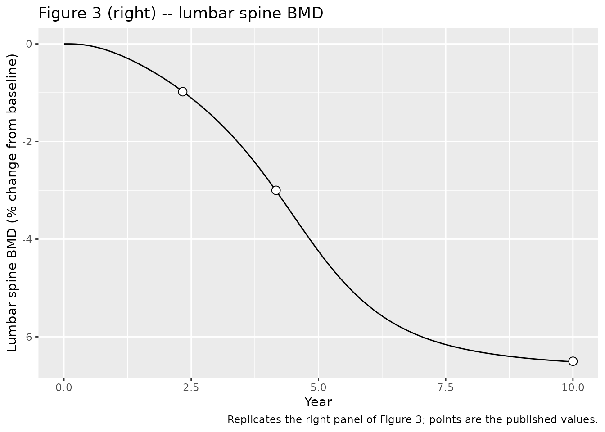
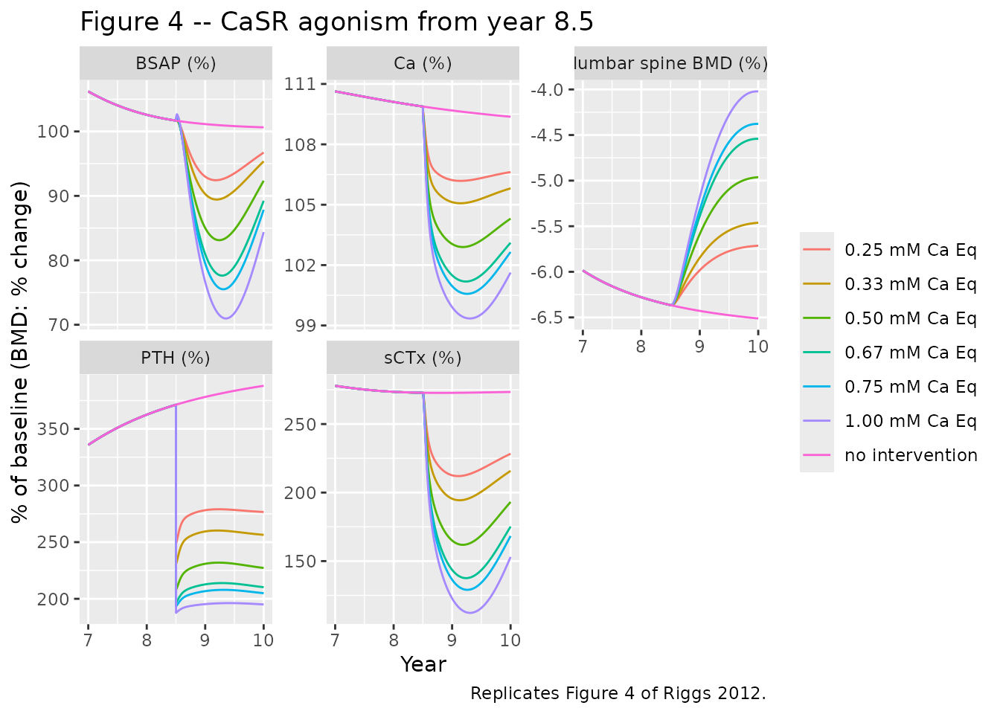
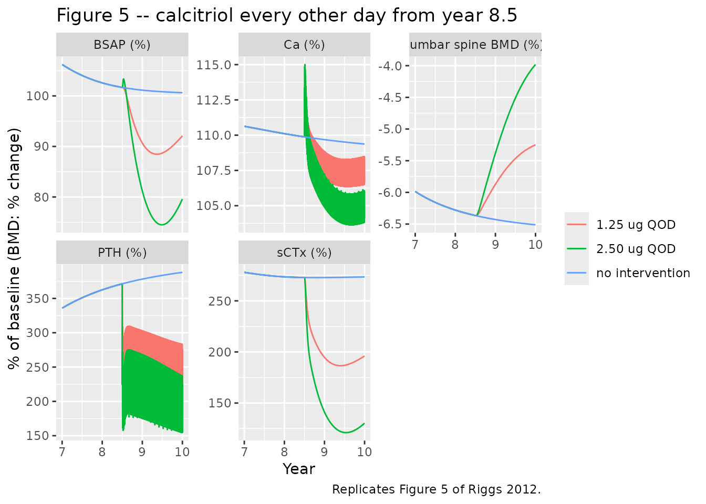

# CKD-mineral bone disorder multiscale QSP (Riggs 2012)

## Model and source

- Citation: Riggs MM, Peterson MC, Gastonguay MR. Multiscale
  physiology-based modeling of mineral bone disorder in patients with
  impaired kidney function. J Clin Pharmacol. 2012;52(1 Suppl):45S-53S.
  <doi:10.1177/0091270011412967>. The GFR forcing function (equation 1),
  the reiterated PTH-production and parathyroid-gland equations
  (equations 2-4), the lumbar spine BMD indirect-response extension
  (equation 5), the CaSR agonist term (equation 6) and the three fitted
  BMD parameters are from that paper. The remainder of the
  calcium-homeostasis / bone-remodeling backbone originates in Peterson
  MC, Riggs MM. A physiologically based mathematical model of integrated
  calcium homeostasis and bone remodeling. Bone. 2010;46(1):49-63.
  <doi:10.1016/j.bone.2009.08.053>, which the 2012 paper cites as
  reference 9 and does not reproduce. That paper is not open access and
  could not be obtained, so the backbone equations and parameter values
  here were transcribed from the authors’ own open-source release of the
  same model, <https://github.com/metrumresearchgroup/OpenBoneMin>, file
  inst/OpenBoneMin.cpp at commit b3d59bfc (2026-01-26). Riggs and
  Gastonguay are authors of both that code and this paper, and the
  code’s constants reproduce every value equation 2-6 prints. Where the
  two sources disagree the published paper governs; the differences are
  listed in the validation vignette Errata.
- Description: QSP. Multiscale physiology-based systems model of chronic
  kidney disease-mineral bone disorder (CKD-MBD) in a hypothetical adult
  patient. 31 ODE states spanning four biological scales: organ-level
  renal handling of calcium and phosphate driven by a progressively
  declining glomerular filtration rate; endocrine control by parathyroid
  hormone, 1-alpha-hydroxylase and calcitriol, including
  calcium-sensing-receptor feedback on PTH secretion and both pool and
  hypertrophy limbs of parathyroid gland capacity; the cellular RANK /
  RANK-ligand / osteoprotegerin axis with responding and fast/slow
  osteoblast populations, active osteoclasts, latent and active
  TGF-beta, and the intracellular RUNX2 / CREB / BCL-2 cascade governing
  osteoblast apoptosis; and a clinical-outcome layer linking the
  bone-formation and bone-resorption markers to lumbar spine bone
  mineral density through an indirect-response relationship. Two
  therapeutic interventions are built in and dosable: a hypothetical
  calcium-sensing-receptor agonist (calcimimetic), entered as constant
  millimolar calcium equivalents added to the CaSR feedback expression,
  and exogenous calcitriol, which is assumed to interact with the system
  identically to endogenous calcitriol. The model is deterministic: the
  authors state that no inter- or intra-individual variance terms were
  estimated, so it carries no IIV and no residual-error model.
- Article: <https://doi.org/10.1177/0091270011412967>
- Structural source for the backbone (see Provenance below):
  <https://github.com/metrumresearchgroup/OpenBoneMin>

This is a deterministic, multiscale quantitative systems pharmacology
model of chronic kidney disease-mineral bone disorder (CKD-MBD). It is
not a population PK model: there is no drug, no cohort, no random
effects and no residual-error model, so non-compartmental analysis is
not an appropriate validation target. The vignette instead uses the
checks that catch translation errors in this model class – a
steady-state hold, a flux / mass-balance check, dimensional analysis, a
perturbation-recovery run – and then reproduces the paper’s own
published figures and its three printed BMD numbers.

``` r

mod <- readModelDb("Riggs_2012_ckd_mbd_qsp")
ui <- rxode2::rxode2(mod)
length(ui$state)
#> [1] 31
```

## Provenance: which source each part of the model came from

The 2012 paper is a short “Innovations” report. It writes out six
equations and three fitted parameter values, and states explicitly that
everything else was described in its reference 9 (Peterson MC, Riggs MM,
*Bone* 2010;46:49-63) and that “a full reconstruction of the model is
beyond the scope of this current report”. The code pointer the paper
gives for the full model, `www.opendiseasemodels.org`, no longer
resolves.

Reference 9 is Elsevier-published, is not open access, and has no
open-access location; it could not be obtained. The backbone was
therefore transcribed from the authors’ own open-source release of the
same model, `metrumresearchgroup/OpenBoneMin`, file
`inst/OpenBoneMin.cpp`. Riggs and Gastonguay are authors of both that
code and this paper. Every constant this paper prints appears verbatim
in that file, which is what makes the identification safe:

| Riggs 2012 printed value | `OpenBoneMin.cpp` |
|----|----|
| `PTH(t=0) = 53.9 pmol` (eq. 2) | line 225, `PTH = 53.90` |
| `6249` (eq. 2) | line 143, `T58 = 6249.09` |
| `6153` (eq. 2) | lines 143 + 145, `T58 - T61 = 6249.09 - 96.25 = 96.25` subtracted, i.e. `6152.84` |
| `11.7` (eq. 2) | line 144, `T59 = 11.7387` |
| `1.818` (eq. 2) | back-solved at line 569 from `T58`, `T61`, `T59` and `S_PTH(0) = 385 pmol/min` |
| `1.604e-4` (eq. 4) | line 141, `PTout = 0.0001604` |
| `12.5` (eq. 4) | line 138, `CtriolPTgam = 12.5033` |
| `4.1` and `3.2` (eq. 4) | lines 139-140, `CtriolMax = 4.1029`, `CtriolMin = 0.9` |
| `k_out,BMD = 0.000145` (Results) | line 171, `koutBMDlsDEN = 0.000145` |
| `gamma_OC = 0.0679` (Results) | line 175, `gamOClsDEN = 0.0679` |

The last two identify which of `OpenBoneMin`’s three BMD parameter sets
corresponds to this paper: the state the code calls `BMDlsDEN` carries
exactly this paper’s lumbar-spine parameters, so that is the BMD limb
implemented here. Where the published paper and the code disagree, the
published value governs; the differences are listed under Errata.

The transcription of the backbone was audited mechanically rather than
by eye: the `[PARAM]` and `$INIT` blocks of `OpenBoneMin.cpp` were
parsed and every one of the 124 `ini()` entries that maps to a name in
those blocks was compared numerically. All 124 agree exactly. The 20
remaining `ini()` entries do not map to a `[PARAM]` name by design –
they are the five constants of equation (1), the published `gamma_OB`,
and fourteen constants that `OpenBoneMin.cpp` writes inline in its
`[ODE]` block rather than naming (the hydroxyapatite phosphate / calcium
molar ratio of 0.464, the unbound and PTH-dependent calcium filtration
fractions, the phosphate filtration fraction, and so on), each of which
carries its own `obm:` line reference in the model file.

## Population

There is no fitted cohort. The model is a single deterministic
hypothetical patient who starts at a glomerular filtration rate (GFR) of
100 mL/min and is carried through a typical 10-year course of
progressive renal impairment by the exponential decline of equation (1).
The paper states that “variance terms to describe inter- and
intraindividual differences were not estimated” and that Berkeley
Madonna, the platform used for fitting, “does not provide standard
errors for the estimates”. The three BMD parameters were fit to
digitized clinical data (the paper’s reference 12) and evaluated against
the CKD bone mineral density data of Rix et al. (reference 13), which
supply the observed symbols in Figures 2 and 3.

The same information is available programmatically from the model’s
`population` metadata:

``` r

str(rxode2::rxode2(mod)$meta$population)
#> List of 7
#>  $ species      : chr "human"
#>  $ n_subjects   : num 1
#>  $ n_studies    : num 2
#>  $ age_range    : chr "not reported"
#>  $ disease_state: chr "Chronic kidney disease-mineral bone disorder (CKD-MBD). A single deterministic hypothetical patient starts from"| __truncated__
#>  $ dose_range   : chr "Hypothetical calcimimetic: constant 0.25, 0.5, 0.75 and 1 mM calcium equivalents from year 8.5 (Methods, equati"| __truncated__
#>  $ notes        : chr "There is no fitted cohort. The model is deterministic and was run as a single hypothetical patient; the authors"| __truncated__
```

## Source trace

### Equations

| Equation | Where in the model | Source |
|----|----|----|
| GFR decline, `10 + 90 * exp(-0.27 * t_years)` | `gfrMLmin` | Riggs 2012 eq. (1), p 47S |
| PTH turnover, `d(PTH)/dt = S_PTH - 7.14 * PTH` | `d/dt(PTH)` | Riggs 2012 eq. (2), p 48S; obm line 583 |
| CaSR feedback on PTH secretion | `T63` | Riggs 2012 eq. (2), p 48S; obm line 570 |
| Parathyroid gland pool | `d/dt(PTpool)` | Riggs 2012 eq. (3), p 48S; obm line 586 |
| Parathyroid gland hypertrophy | `d/dt(PThypertrophy)` | Riggs 2012 eq. (4), p 48S; obm line 589 |
| Lumbar spine BMD indirect response | `d/dt(BMDls)` | Riggs 2012 eq. (5), p 48S; obm line 679 |
| CaSR agonist (calcimimetic) term | `CaSRdriver`, `T63` | Riggs 2012 eq. (6), p 48S |
| Calcium fluxes bone / gut / kidney | `J14`, `J15`, `J27`, `J40` | obm lines 296, 374, 472, 546 |
| Phosphate fluxes | `J41`, `J42`, `J48`, `J53`, `J54`, `J56` | obm lines 300, 377, 491, 494, 496, 498 |
| Calcitriol and 1-alpha-hydroxylase | `d/dt(calcitriol)`, `d/dt(alphaOHase)` | obm lines 591, 594 |
| RANK / RANKL / OPG axis | `d/dt(RANKL)` … `d/dt(OPG)` | obm lines 694-706 |
| Osteoblast / osteoclast / TGF-beta | `d/dt(OBfast)` … `d/dt(TGFBact)` | obm lines 648-664 |
| RUNX2 / CREB / BCL-2 cascade | `d/dt(RX2)`, `d/dt(CREB)`, `d/dt(BCL2)` | obm lines 725-729 |

Every `ini()` entry carries a trailing comment giving either the paper
equation or the `OpenBoneMin.cpp` line it came from; see
`inst/modeldb/therapeuticArea/Riggs_2012_ckd_mbd_qsp.R`.

### State-name mapping

`OpenBoneMin.cpp` names many states with single letters, several of
which cannot be used in rxode2 (`T` collides with `TRUE`, `t` is
reserved for time) and none of which is self-describing. The renaming is
mechanical:

| This model | `OpenBoneMin.cpp` | Meaning |
|----|----|----|
| `PTH` | `PTH` | plasma parathyroid hormone (pmol) |
| `PTpool` | `S` | parathyroid gland PTH-production capacity |
| `PThypertrophy` | `PTmax` | parathyroid gland hypertrophy factor |
| `calcitriol` | `B` | plasma calcitriol (pmol) |
| `alphaOHase` | `AOH` | renal 1-alpha-hydroxylase |
| `plasmaCa` | `P` | plasma calcium (mmol) |
| `ECCPhos` | `ECCPhos` | extracellular phosphate (mmol) |
| `PhosGut` | `PhosGut` | dietary phosphate in gut (mmol) |
| `IntraPO` | `IntraPO` | intracellular phosphate (mmol) |
| `gutCa` | `T` | dietary calcium in gut (mmol) |
| `gutCaAbsorp` | `R` | calcitriol-dependent gut absorption capacity |
| `HAp` | `HAp` | hydroxyapatite deposition capacity |
| `boneCaExch` | `Q` | immediately exchangeable bone calcium (mmol) |
| `boneCaNonExch` | `Qbone` | non-exchangeable bone calcium (mmol) |
| `OBfast`, `OBslow` | `OBfast`, `OBslow` | osteoblast pools |
| `OC` | `OC` | active osteoclasts |
| `ROB` | `ROB1` | responding osteoblasts |
| `TGFB`, `TGFBact` | `TGFB`, `TGFBact` | latent and active TGF-beta |
| `RANKL` | `L` | free RANK ligand |
| `RANK` | `RNK` | free RANK |
| `RANK_RANKL` | `M` | RANK-RANKL complex |
| `OPG` | `O` | free osteoprotegerin |
| `OPG_RANKL` | `N` | OPG-RANKL complex |
| `RX2`, `CREB`, `BCL2` | `RX2`, `CREB`, `BCL2` | intracellular cascade |
| `BMDls` | `BMDlsDEN` | lumbar spine bone mineral density |
| `urineCa` | `UCA` | cumulative urinary calcium (mmol) |
| `casrAgonist` | (new) | constant Ca equivalents of eq. (6) |

### Units and dimensional analysis

The model time unit is hours; one year is 8766 h. Extracellular fluid
volume is 14 L and is shared by PTH, calcium, phosphate and calcitriol,
so every amount state divided by `V1` gives the corresponding
concentration. The three unit systems in play are checked term by term
below.

| Quantity | Units | Check |
|----|----|----|
| `PTH` | pmol | `S_PTH` (pmol/h) minus `kout * PTH` (1/h \* pmol) = pmol/h |
| `PTHconc` | pmol/L | `PTH` / `V1` = pmol / L |
| `plasmaCa`, `boneCaExch`, `gutCa` | mmol | `J14`, `J15`, `J27`, `J40` are all mmol/h |
| `CaConc` | mmol/L | `plasmaCa` / `V1` |
| `gfr` | L/h | `gfrMLmin` / 16.667; 100 mL/min = 6.00 L/h |
| `CaFilt` | mmol/h | 0.6 (unbound) \* 0.5 (PTH-dependent share) \* L/h \* mmol/L |
| `calcitriol` | pmol | `alphaOHase` (pmol/h) minus `T69 * calcitriol` (1/h \* pmol) |
| `ECCPhos` | mmol | every `J4x`/`J5x` term is mmol/h |
| `BMDls` | ratio to baseline | `kinBMDls` (1/h) minus `koutBMDls * BMDls` (1/h) |
| `casrAgonist` | mmol/L | added directly to `CaConc` inside eq. (6) |

Two conversions are non-obvious and are written out explicitly in the
model file rather than folded into a constant:

1.  **GFR.** Equation (1) is printed in mL/min, but every renal flux
    consumes GFR in L/h. The divisor 16.667 (= 1000/60) is the same one
    `OpenBoneMin.cpp` uses at its lines 263 and 764.
2.  **Daily-to-hourly intake rates.** Dietary calcium (24.055 mmol/day)
    and phosphate (10.5 mmol/day) are entered as hourly rates, 1.0022917
    and 0.4375 mmol/h, matching `OpenBoneMin.cpp` lines 134 and 116,
    which write the same division inline.

## Simulation grid

``` r

yr <- 8766                # hours per year, the convention used throughout
t_start <- 8.5 * yr       # both interventions start at year 8.5

# Coarse over the untreated decade, then every 12 h inside the treatment
# window so the within-dose-interval fluctuation of every-other-day calcitriol
# is resolved rather than aliased.
obs_grid <- sort(unique(c(
  seq(0, 10 * yr, by = yr / 48),
  seq(t_start, 10 * yr, by = 12)
)))
length(obs_grid)
#> [1] 1574

solve_arm <- function(ev, label, params = NULL) {
  ev <- rxode2::et(ev, id = 1)
  s <- if (is.null(params)) {
    rxode2::rxSolve(ui, ev, atol = 1e-8, rtol = 1e-8)
  } else {
    rxode2::rxSolve(ui, ev, params = params, atol = 1e-8, rtol = 1e-8)
  }
  as.data.frame(s) |> dplyr::mutate(arm = label, year = time / yr)
}

# Every-other-day calcitriol makes the reported markers oscillate over a wide
# band within each 48-h dosing interval -- the "solid bands" the Figure 5
# caption describes. A single value sampled at year 10 therefore depends on
# where in the dose cycle that sample lands and is not reproducible; each arm
# is summarised instead by its mean over the final complete dosing interval,
# which is what the published curve is drawn through.
tail_window <- function(df) dplyr::filter(df, time >= max(time) - 48)

tail_mean <- function(df) {
  tail_window(df) |>
    dplyr::group_by(arm) |>
    dplyr::summarise(dplyr::across(
      c(PTHpct, CApct, CTXpct, BSAPpct, BMDlspct), mean
    ), .groups = "drop")
}
```

## Check 1: steady-state hold

With the renal decline switched off – the asymptote of equation (1)
raised to 100 mL/min and its amplitude set to zero, so GFR is pinned at
its baseline – the model must sit at the published baseline
indefinitely. This is the single most informative check on a 31-state
transcription: a sign error, a missing term, or a mistyped baseline in
any one of the 31 equations shows up as drift.

``` r

hold <- solve_arm(
  rxode2::et(seq(0, 10 * yr, by = yr / 12)),
  "GFR held at 100 mL/min",
  params = c(gfrAsymptote = 100, gfrDecline = 0)
)

# urineCa is a cumulative counter and casrAgonist an undosed switch; neither
# has a baseline to hold, so both are checked separately below.
steady_states <- setdiff(ui$state, c("urineCa", "casrAgonist"))

drift <- hold |>
  dplyr::select(dplyr::all_of(steady_states)) |>
  dplyr::summarise(dplyr::across(
    dplyr::everything(),
    ~ max(abs(100 * (.x - .x[1]) / .x[1]))
  )) |>
  tidyr::pivot_longer(dplyr::everything(),
                      names_to = "state", values_to = "max_pct_drift") |>
  dplyr::arrange(dplyr::desc(max_pct_drift))

knitr::kable(head(drift, 8), digits = 4,
             caption = "Largest 10-year drift from baseline with GFR held constant")
```

| state         | max_pct_drift |
|:--------------|--------------:|
| boneCaExch    |        0.1145 |
| boneCaNonExch |        0.0783 |
| OC            |        0.0601 |
| TGFBact       |        0.0294 |
| OBfast        |        0.0231 |
| PTH           |        0.0228 |
| HAp           |        0.0214 |
| OBslow        |        0.0171 |

Largest 10-year drift from baseline with GFR held constant {.table}

``` r


# Every one of the 29 states with a biological baseline holds it to better
# than a quarter of one percent over ten simulated years.
stopifnot(length(steady_states) == 29, max(drift$max_pct_drift) < 0.25)

# The cumulative urinary-calcium counter must instead grow exactly linearly,
# at the baseline urinary flux; the calcimimetic switch must stay off.
uca_rate <- diff(hold$urineCa) / diff(hold$time)
stopifnot(
  max(abs(uca_rate - hold$J27[1])) / hold$J27[1] < 0.005,
  max(abs(hold$casrAgonist)) < 1e-10
)
```

## Check 2: flux / mass balance at baseline

At the untreated baseline the calcium system must balance three ways:
gut absorption equals urinary excretion, the fast bone exchange fluxes
cancel, and the slow bone exchange fluxes cancel. The `OpenBoneMin`
construction makes the last two exact by design and the first one a
consequence of the fitted absorption fraction, so all three are genuine
checks on the transcription rather than tautologies.

``` r

b <- hold[1, ]
pars <- ui$theta

flux <- tibble::tibble(
  balance = c("gut absorption vs urinary excretion",
              "fast bone exchange (plasma <-> exchangeable bone)",
              "slow bone exchange (exchangeable <-> deep bone)",
              "phosphate: absorption vs renal excretion + net cell uptake"),
  `in` = c(unname(pars["OralCa"]) * b$T85, b$J14, b$J14a, b$J53),
  out = c(b$J27, b$J15, b$J15a, b$J48 + b$J54 - b$J56)
) |>
  dplyr::mutate(pct_diff = 100 * (`in` - out) / out)

knitr::kable(flux, digits = 6,
             caption = "Calcium and phosphate flux balance at the untreated baseline (mmol/h)")
```

| balance | in | out | pct_diff |
|:---|---:|---:|---:|
| gut absorption vs urinary excretion | 0.150341 | 0.149997 | 0.229408 |
| fast bone exchange (plasma \<-\> exchangeable bone) | 3.666667 | 3.666667 | 0.000000 |
| slow bone exchange (exchangeable \<-\> deep bone) | 0.608648 | 0.608648 | 0.000000 |
| phosphate: absorption vs renal excretion + net cell uptake | 0.306235 | 0.307666 | -0.465074 |

Calcium and phosphate flux balance at the untreated baseline (mmol/h)
{.table style="width:100%;"}

``` r


stopifnot(max(abs(flux$pct_diff)) < 1)

# The net rate of change of plasma calcium and of extracellular phosphate at
# the baseline, each expressed against the largest flux crossing that
# compartment. The published baseline is a fitted steady state, not an exact
# algebraic one, so the residual is small but not identically zero.
net <- tibble::tibble(
  compartment = c("plasma calcium", "extracellular phosphate"),
  net_rate = c(
    b$J14 - b$J15 - b$J27 + b$J40,
    b$J41 - b$J42 - b$J48 + b$J53 - b$J54 + b$J56
  ),
  largest_flux = c(b$J14, b$J54)
) |>
  dplyr::mutate(relative = abs(net_rate) / largest_flux)

knitr::kable(net, digits = 8,
             caption = "Net rate of change at baseline, relative to the largest flux")
```

| compartment             |    net_rate | largest_flux |  relative |
|:------------------------|------------:|-------------:|----------:|
| plasma calcium          |  0.00034661 |     3.666667 | 9.453e-05 |
| extracellular phosphate | -0.00143088 |    62.160000 | 2.302e-05 |

Net rate of change at baseline, relative to the largest flux {.table}

``` r

stopifnot(max(net$relative) < 1e-3)
```

The same numbers in physiological units: baseline urinary calcium should
fall inside the normal adult range of roughly 2.5 to 7.5 mmol/day.

``` r

urine_mmol_per_day <- b$J27 * 24
urine_mmol_per_day
#> [1] 3.599928
stopifnot(urine_mmol_per_day > 2.5, urine_mmol_per_day < 7.5)
```

## Check 3: the back-solved calcitriol half-saturation constant

Equation (4) prints a calcitriol half-saturation constant of `63.38`
pmol/L for the parathyroid-hypertrophy drive. That value is inconsistent
with the paper’s own stated initial condition. Equation (4) also states
`PT_hypertrophy = 1 under initial conditions, t = 0`, and
`d(PT_hypertrophy)/dt` is
`PTout * (Effect_calcitriol,hyper - PT_hypertrophy)`, so a steady state
at `PT_hypertrophy = 1` requires `Effect_calcitriol,hyper = 1` at the
baseline calcitriol concentration of 90 pmol/L. `OpenBoneMin.cpp` (lines
557-559) does not hard-code the constant at all: it back-solves it from
that very constraint. The two candidate values are compared below.

``` r

p <- ui$theta
gam <- unname(p["CtriolPTgam"])
cmax <- unname(p["CtriolMax"])
cmin <- unname(p["CtriolMin"])
c0 <- unname(p["CtriolInit"]) / unname(p["V1"])   # 90 pmol/L

hyper_effect <- function(ec50) cmax - (cmax - cmin) * c0^gam / (c0^gam + ec50^gam)

backsolved <- hold$Ctriol50[1]
tibble::tibble(
  source = c("printed in equation (4)", "back-solved (OpenBoneMin lines 557-559)"),
  ec50 = c(63.38, backsolved),
  effect_at_baseline = c(hyper_effect(63.38), hyper_effect(backsolved))
) |>
  knitr::kable(digits = 4,
               caption = "Only the back-solved constant makes PT_hypertrophy = 1 a steady state")
```

| source                                  |    ec50 | effect_at_baseline |
|:----------------------------------------|--------:|-------------------:|
| printed in equation (4)                 | 63.3800 |             0.9394 |
| back-solved (OpenBoneMin lines 557-559) | 68.3805 |             1.0000 |

Only the back-solved constant makes PT_hypertrophy = 1 a steady state
{.table}

``` r


# The back-solved value reproduces the required unit effect exactly; the
# printed 63.38 does not, and would make the parathyroid gland shrink from
# t = 0 in an untreated normal subject.
stopifnot(abs(hyper_effect(backsolved) - 1) < 1e-6)
stopifnot(abs(hyper_effect(63.38) - 1) > 0.05)
```

The back-solved value is 68.38, which differs from the printed 63.38 in
a single digit. This is recorded under Errata; the implementation uses
the back-solve so that the paper’s own stated initial condition holds.

## Check 4: perturbation recovery

Because the model sets its initial conditions inside `model()`, an
`inits=` argument to `rxSolve` is ignored; a state has to be displaced
by dosing it. A single bolus of exogenous calcitriol is given to the
healthy (GFR held at 100 mL/min) system and the trajectory must return
to baseline.

``` r

recov_grid <- rxode2::et(seq(0, 3 * yr, by = 6))
mw_calcitriol <- 27 * 12.011 + 44 * 1.008 + 3 * 15.999   # C27H44O3

perturb <- dplyr::bind_rows(
  solve_arm(recov_grid, "undisturbed",
            params = c(gfrAsymptote = 100, gfrDecline = 0)),
  solve_arm(
    rxode2::et(recov_grid, amt = 3 * unname(ui$theta["CtriolInit"]),
               time = 0.5 * yr, cmt = "calcitriol"),
    "calcitriol bolus, 3x the baseline pool",
    params = c(gfrAsymptote = 100, gfrDecline = 0)
  )
)

ggplot(perturb, aes(year, PTHpct, colour = arm)) +
  geom_line() +
  labs(x = "Year", y = "PTH (% of baseline)", colour = NULL,
       title = "Perturbation recovery: a calcitriol bolus at year 0.5",
       caption = "The system returns to its baseline attractor.")
```



``` r


final <- perturb |>
  dplyr::filter(time == max(time)) |>
  dplyr::select(arm, PTHpct, CApct, CTXpct, BSAPpct, BMDlspct)
knitr::kable(final, digits = 4, caption = "State at year 3")
```

| arm | PTHpct | CApct | CTXpct | BSAPpct | BMDlspct |
|:---|---:|---:|---:|---:|---:|
| undisturbed | 99.9772 | 100.0026 | 99.9708 | 100.0001 | 0.0020 |
| calcitriol bolus, 3x the baseline pool | 99.9809 | 100.0020 | 99.9382 | 99.9770 | 0.0039 |

State at year 3 {.table style="width:100%;"}

``` r


# Two and a half years after the bolus every marker is back within 0.5% of
# where the undisturbed system sits.
back <- final |> dplyr::select(-arm) |> as.matrix()
stopifnot(max(abs(back[2, ] - back[1, ])) < 0.5)
```

## Replicating Figure 2A: the GFR forcing function

The paper reports the GFR reached at months 28, 50 and 120 in its
abstract. Equation (1) must return them.

``` r

prog <- solve_arm(rxode2::et(obs_grid), "CKD progression")

gfr_chk <- tibble::tibble(month = c(28, 50, 120)) |>
  dplyr::mutate(
    simulated = 10 + 90 * exp(-0.27 * month / 12),
    published = c(58, 39, 16),
    difference = simulated - published
  )
knitr::kable(gfr_chk, digits = 2,
             caption = "GFR (mL/min) at the months the paper names")
```

| month | simulated | published | difference |
|------:|----------:|----------:|-----------:|
|    28 |     57.93 |        58 |      -0.07 |
|    50 |     39.22 |        39 |       0.22 |
|   120 |     16.05 |        16 |       0.05 |

GFR (mL/min) at the months the paper names {.table}

``` r

stopifnot(max(abs(gfr_chk$difference)) < 0.5)

ggplot(prog, aes(year, gfrMLmin)) +
  geom_line() +
  geom_point(data = gfr_chk |> dplyr::mutate(year = month / 12),
             aes(year, published), size = 3, shape = 21, fill = "white") +
  labs(x = "Year", y = "GFR (mL/min)",
       title = "Figure 2A -- progressive decrease in glomerular filtration rate",
       caption = "Replicates Figure 2A of Riggs 2012; points are the values named in the abstract.")
```



## Replicating Figure 3 and the paper’s three BMD numbers

This is the paper’s own contribution and its only quantitative claim.
The abstract reports lumbar spine BMD losses relative to baseline of
approximately -0.98%, -3.0% and -6.5% at months 28, 50 and 120. Nothing
in the model was tuned to these; they follow from equation (5) with the
three published parameters on top of the transcribed backbone.

``` r

bmd_chk <- tibble::tibble(month = c(28, 50, 120)) |>
  dplyr::rowwise() |>
  dplyr::mutate(
    simulated = prog$BMDlspct[which.min(abs(prog$time - month * yr / 12))],
    published = c(-0.98, -3.0, -6.5)[which(c(28, 50, 120) == month)]
  ) |>
  dplyr::ungroup() |>
  dplyr::mutate(difference = simulated - published)

knitr::kable(bmd_chk, digits = 3,
             caption = "Lumbar spine BMD change from baseline (%), simulated vs. published")
```

| month | simulated | published | difference |
|------:|----------:|----------:|-----------:|
|    28 |    -0.975 |     -0.98 |      0.005 |
|    50 |    -3.009 |     -3.00 |     -0.009 |
|   120 |    -6.512 |     -6.50 |     -0.012 |

Lumbar spine BMD change from baseline (%), simulated vs. published
{.table}

``` r


# The published values are given to two significant figures, so agreement to
# better than 0.05 percentage points is agreement to the printed precision.
stopifnot(max(abs(bmd_chk$difference)) < 0.05)
```

Figure 3 also plots the two bone markers. The model represents serum CTx
by the active-osteoclast pool relative to baseline and bone-specific
alkaline phosphatase by the total-osteoblast pool relative to baseline;
`OpenBoneMin`’s own output block labels exactly these two ratios that
way (lines 781-782).

``` r

markers <- prog |>
  dplyr::select(year, sCTx = CTXpct, BSAP = BSAPpct) |>
  tidyr::pivot_longer(-year, names_to = "marker", values_to = "pct")

ggplot(markers, aes(year, pct, colour = marker)) +
  geom_line() +
  labs(x = "Year", y = "% of baseline", colour = NULL,
       title = "Figure 3 (left) -- bone markers over the CKD decade",
       caption = "Replicates the left panel of Figure 3 of Riggs 2012.")
```



``` r


ggplot(prog, aes(year, BMDlspct)) +
  geom_line() +
  geom_point(data = bmd_chk |> dplyr::mutate(year = month / 12),
             aes(year, published), size = 3, shape = 21, fill = "white") +
  labs(x = "Year", y = "Lumbar spine BMD (% change from baseline)",
       title = "Figure 3 (right) -- lumbar spine BMD",
       caption = "Replicates the right panel of Figure 3; points are the published values.")
```



Read off the published Figure 3, serum CTx peaks near 280% of baseline
around year 6 and settles slightly below that by year 10, while BSAP
peaks near 118% around year 4.5 and returns to about 100% by year 10.
The simulated peaks are gated against those readings with a band wide
enough to absorb the reading error of a printed figure.

``` r

peaks <- tibble::tibble(
  marker = c("sCTx", "BSAP"),
  peak_pct = c(max(prog$CTXpct), max(prog$BSAPpct)),
  peak_year = c(prog$year[which.max(prog$CTXpct)], prog$year[which.max(prog$BSAPpct)]),
  year10_pct = c(dplyr::last(prog$CTXpct), dplyr::last(prog$BSAPpct))
)
knitr::kable(peaks, digits = 2, caption = "Simulated bone-marker peaks")
```

| marker | peak_pct | peak_year | year10_pct |
|:-------|---------:|----------:|-----------:|
| sCTx   |   282.68 |      6.02 |     273.42 |
| BSAP   |   117.81 |      4.77 |     100.64 |

Simulated bone-marker peaks {.table}

``` r


stopifnot(
  peaks$peak_pct[1] > 260, peaks$peak_pct[1] < 300,   # sCTx peak, Figure 3 ~280%
  peaks$peak_year[1] > 5, peaks$peak_year[1] < 7,
  peaks$peak_pct[2] > 110, peaks$peak_pct[2] < 125,   # BSAP peak, Figure 3 ~118%
  peaks$peak_year[2] > 4, peaks$peak_year[2] < 5.5,
  peaks$year10_pct[2] > 95, peaks$year10_pct[2] < 108 # BSAP back to ~100%
)
```

## Replicating Figure 4: a hypothetical calcimimetic

Equation (6) adds a constant millimolar calcium equivalent to the
calcium term inside the CaSR feedback expression. In this implementation
that constant lives in a zero-derivative state, `casrAgonist`, so a
single bolus at year 8.5 sets it and holds it – which is exactly the
“constant … introduced (infused) into the system” the Methods describe.
The Methods name doses of 0.25, 0.5, 0.75 and 1 mM Ca equivalents; the
Figure 4 legend labels the plotted curves 0.33, 0.67 and 1.0 mM Ca Eq.
Both sets are simulated below (see Errata).

``` r

casr_doses <- c(0.25, 0.33, 0.5, 0.67, 0.75, 1.0)
casr <- dplyr::bind_rows(
  solve_arm(rxode2::et(obs_grid), "no intervention"),
  lapply(casr_doses, function(d) {
    solve_arm(
      rxode2::et(rxode2::et(obs_grid), amt = d, time = t_start, cmt = "casrAgonist"),
      sprintf("%.2f mM Ca Eq", d)
    )
  }) |> dplyr::bind_rows()
)

casr_long <- casr |>
  dplyr::select(year, arm, `PTH (%)` = PTHpct, `Ca (%)` = CApct,
                `sCTx (%)` = CTXpct, `BSAP (%)` = BSAPpct,
                `lumbar spine BMD (%)` = BMDlspct) |>
  tidyr::pivot_longer(-c(year, arm), names_to = "panel", values_to = "value") |>
  dplyr::filter(year >= 7)

ggplot(casr_long, aes(year, value, colour = arm)) +
  geom_line() +
  facet_wrap(~panel, scales = "free_y") +
  labs(x = "Year", y = "% of baseline (BMD: % change)", colour = NULL,
       title = "Figure 4 -- CaSR agonism from year 8.5",
       caption = "Replicates Figure 4 of Riggs 2012.")
```



``` r

arm_order <- c("no intervention", sprintf("%.2f mM Ca Eq", casr_doses))
casr_end <- tail_mean(casr)
casr_end <- casr_end[match(arm_order, casr_end$arm), ]
knitr::kable(casr_end, digits = 2,
             caption = "Year-10 values under CaSR agonism")
```

| arm             | PTHpct |  CApct | CTXpct | BSAPpct | BMDlspct |
|:----------------|-------:|-------:|-------:|--------:|---------:|
| no intervention | 387.99 | 109.37 | 273.42 |  100.64 |    -6.51 |
| 0.25 mM Ca Eq   | 276.63 | 106.62 | 228.26 |   96.71 |    -5.71 |
| 0.33 mM Ca Eq   | 256.45 | 105.81 | 215.77 |   95.34 |    -5.46 |
| 0.50 mM Ca Eq   | 227.26 | 104.30 | 193.02 |   92.31 |    -4.96 |
| 0.67 mM Ca Eq   | 210.25 | 103.10 | 175.04 |   89.18 |    -4.54 |
| 0.75 mM Ca Eq   | 204.95 | 102.64 | 168.14 |   87.78 |    -4.38 |
| 1.00 mM Ca Eq   | 195.02 | 101.62 | 152.78 |   84.30 |    -4.02 |

Year-10 values under CaSR agonism {.table}

``` r


ref <- casr_end[casr_end$arm == "no intervention", ]
top <- casr_end[casr_end$arm == "1.00 mM Ca Eq", ]

# The response is monotone in dose on every endpoint the paper plots, and
# BMD improves throughout.
treated <- casr_end[casr_end$arm != "no intervention", ]   # in dose order
stopifnot(
  all(diff(treated$BMDlspct) > 0),
  all(diff(treated$PTHpct) < 0),
  all(diff(treated$CTXpct) < 0),
  all(treated$BMDlspct > ref$BMDlspct)
)
```

The Results text gives two clinical anchors for this simulation:
cinacalcet “has been reported to lower intact PTH by approximately 50%,
which was within the simulated change”, and in the same studies it
“lowered median calcium by 5.5% to 7.4%, again consistent with the model
predictions”. Both are reproduced.

``` r

anchors <- tibble::tibble(
  quantity = c("PTH reduction at 1 mM Ca Eq (%)",
               "calcium reduction at 1 mM Ca Eq (%)"),
  simulated = c(100 * (ref$PTHpct - top$PTHpct) / ref$PTHpct,
                100 * (ref$CApct - top$CApct) / ref$CApct),
  published = c("approximately 50", "5.5 to 7.4")
)
knitr::kable(anchors, digits = 2,
             caption = "Published clinical anchors for the calcimimetic simulation")
```

| quantity                            | simulated | published        |
|:------------------------------------|----------:|:-----------------|
| PTH reduction at 1 mM Ca Eq (%)     |     49.74 | approximately 50 |
| calcium reduction at 1 mM Ca Eq (%) |      7.09 | 5.5 to 7.4       |

Published clinical anchors for the calcimimetic simulation {.table}

``` r


stopifnot(
  # "approximately 50%, which was within the simulated change"
  anchors$simulated[1] > 40, anchors$simulated[1] < 60,
  # "lowered median calcium by 5.5% to 7.4%, again consistent"
  anchors$simulated[2] > 5.0, anchors$simulated[2] < 9.0
)
```

## Replicating Figure 5: calcitriol every other day

The paper simulates calcitriol infusions of 1.25 and 2.5 ug every other
day from year 8.5, and assumes “that exogenous and endogenous calcitriol
interacted the same in the model system” – so the dose goes straight
into the endogenous calcitriol pool. The pool is an amount in pmol, so
the microgram dose is converted with the molar mass of calcitriol
computed from its molecular formula C27H44O3; no external source is
needed for it.

``` r

mw_calcitriol
#> [1] 416.646
ctriol_doses <- c(1.25, 2.5)
n_doses <- floor((10 * yr - t_start) / 48) + 1   # last dose lands before year 10

ctriol <- dplyr::bind_rows(
  solve_arm(rxode2::et(obs_grid), "no intervention"),
  lapply(ctriol_doses, function(d) {
    solve_arm(
      rxode2::et(rxode2::et(obs_grid), amt = d * 1e6 / mw_calcitriol,
                 time = t_start, ii = 48, addl = n_doses - 1,
                 cmt = "calcitriol"),
      sprintf("%.2f ug QOD", d)
    )
  }) |> dplyr::bind_rows()
)

ctriol |>
  dplyr::select(year, arm, `PTH (%)` = PTHpct, `Ca (%)` = CApct,
                `sCTx (%)` = CTXpct, `BSAP (%)` = BSAPpct,
                `lumbar spine BMD (%)` = BMDlspct) |>
  tidyr::pivot_longer(-c(year, arm), names_to = "panel", values_to = "value") |>
  dplyr::filter(year >= 7) |>
  ggplot(aes(year, value, colour = arm)) +
  geom_line() +
  facet_wrap(~panel, scales = "free_y") +
  labs(x = "Year", y = "% of baseline (BMD: % change)", colour = NULL,
       title = "Figure 5 -- calcitriol every other day from year 8.5",
       caption = "Replicates Figure 5 of Riggs 2012.")
```



``` r

ctriol_arms <- c("no intervention", sprintf("%.2f ug QOD", ctriol_doses))
ctriol_end <- tail_mean(ctriol)
ctriol_end <- ctriol_end[match(ctriol_arms, ctriol_end$arm), ]
knitr::kable(ctriol_end, digits = 2,
             caption = "Year-10 values under every-other-day calcitriol, averaged over the final dosing interval")
```

| arm             | PTHpct |  CApct | CTXpct | BSAPpct | BMDlspct |
|:----------------|-------:|-------:|-------:|--------:|---------:|
| no intervention | 387.99 | 109.37 | 273.42 |  100.64 |    -6.51 |
| 1.25 ug QOD     | 249.11 | 107.37 | 195.95 |   92.08 |    -5.25 |
| 2.50 ug QOD     | 194.73 | 105.00 | 130.19 |   79.55 |    -3.98 |

Year-10 values under every-other-day calcitriol, averaged over the final
dosing interval {.table}

``` r


# How wide the within-interval band is, for each arm.
band <- tail_window(ctriol) |>
  dplyr::group_by(arm) |>
  dplyr::summarise(PTH_min = min(PTHpct), PTH_max = max(PTHpct),
                   Ca_min = min(CApct), Ca_max = max(CApct), .groups = "drop")
knitr::kable(band[match(ctriol_arms, band$arm), ], digits = 1,
             caption = "Within-dose-interval range at year 10 (the 'solid bands' of Figure 5)")
```

| arm             | PTH_min | PTH_max | Ca_min | Ca_max |
|:----------------|--------:|--------:|-------:|-------:|
| no intervention |   388.0 |   388.0 |  109.4 |  109.4 |
| 1.25 ug QOD     |   209.2 |   283.1 |  106.5 |  108.5 |
| 2.50 ug QOD     |   154.5 |   237.0 |  103.8 |  106.1 |

Within-dose-interval range at year 10 (the ‘solid bands’ of Figure 5)
{.table}

The published Figure 5 panels can be read off directly. At year 10 the
1.25 ug arm sits near 180% sCTx, 92% BSAP and -5.7% BMD; the 2.5 ug arm
near 110% sCTx, 77% BSAP and -3.7% BMD. Those three endpoints are smooth
and are gated against the readings. PTH is not: as the band table above
shows, it sweeps roughly 80 percentage points inside every dosing
interval, which is wider than a reading off the printed panel can
resolve, so PTH is gated on the qualitative claim the Results text makes
instead – a dose-related partial reversal of the secondary
hyperparathyroidism.

``` r

fig5 <- tibble::tibble(
  arm = rep(c("1.25 ug QOD", "2.50 ug QOD"), each = 3),
  endpoint = rep(c("sCTx (%)", "BSAP (%)", "BMD (%)"), 2),
  simulated = c(
    ctriol_end$CTXpct[2], ctriol_end$BSAPpct[2], ctriol_end$BMDlspct[2],
    ctriol_end$CTXpct[3], ctriol_end$BSAPpct[3], ctriol_end$BMDlspct[3]
  ),
  read_from_figure_5 = c(180, 92, -5.7, 110, 77, -3.7)
) |>
  dplyr::mutate(difference = simulated - read_from_figure_5)

knitr::kable(fig5, digits = 2,
             caption = "Year-10 values vs. the published Figure 5")
```

| arm         | endpoint | simulated | read_from_figure_5 | difference |
|:------------|:---------|----------:|-------------------:|-----------:|
| 1.25 ug QOD | sCTx (%) |    195.95 |              180.0 |      15.95 |
| 1.25 ug QOD | BSAP (%) |     92.08 |               92.0 |       0.08 |
| 1.25 ug QOD | BMD (%)  |     -5.25 |               -5.7 |       0.45 |
| 2.50 ug QOD | sCTx (%) |    130.19 |              110.0 |      20.19 |
| 2.50 ug QOD | BSAP (%) |     79.55 |               77.0 |       2.55 |
| 2.50 ug QOD | BMD (%)  |     -3.98 |               -3.7 |      -0.28 |

Year-10 values vs. the published Figure 5 {.table}

``` r


stopifnot(
  # sCTx: within 25 percentage points of the digitized reading.
  all(abs(fig5$difference[fig5$endpoint == "sCTx (%)"]) < 25),
  # BSAP and BMD: within 3 and 1 percentage points respectively.
  all(abs(fig5$difference[fig5$endpoint == "BSAP (%)"]) < 3),
  all(abs(fig5$difference[fig5$endpoint == "BMD (%)"]) < 1),
  # "predicted to partially reverse the secondary hyperparathyroidism in a
  # dose-related manner" -- both arms well below the untreated PTH, ordered
  # by dose, with BMD improving in the same order.
  ctriol_end$PTHpct[2] < 0.75 * ctriol_end$PTHpct[1],
  ctriol_end$PTHpct[3] < ctriol_end$PTHpct[2],
  ctriol_end$BMDlspct[3] > ctriol_end$BMDlspct[2],
  ctriol_end$BMDlspct[2] > ctriol_end$BMDlspct[1]
)
```

## Assumptions and deviations

### Provenance

- **The structural backbone is not from the 2012 paper.** Equations (1)
  to (6) and the three fitted BMD parameters are; everything else – 25
  of the 31 differential equations and about 90 parameter values – was
  transcribed from `metrumresearchgroup/OpenBoneMin`,
  `inst/OpenBoneMin.cpp`, because the upstream Peterson and Riggs 2010
  paper is paywalled with no open-access location and the paper’s own
  code pointer, `www.opendiseasemodels.org`, is dead. The identification
  is evidenced by the constant-for-constant table at the top of this
  vignette. The repository carries no licence file; its use as a
  structural source here was authorised explicitly for this extraction.
- **`k_in,BMD` is not printed in the paper.** Equation (5) names it but
  gives no value. It is the baseline steady-state product
  `k_out,BMD * BMD_LS(0)`, which is what `OpenBoneMin.cpp` computes at
  its line 672. With `BMD_LS(0) = 1` this makes `k_in,BMD` numerically
  equal to `k_out,BMD`.

### Value conflicts, resolved in favour of the paper

- **`gamma_OB`.** The paper prints 0.0739 (Results, p 49S);
  `OpenBoneMin.cpp` line 173 has `gamOB = 0.0793`, a digit
  transposition. The published 0.0739 is used.

### Value conflicts, resolved against the printed value

- **The equation (4) half-saturation constant.** The paper prints 63.38
  pmol/L. As shown under Check 3 above, that value is falsified by the
  paper’s own stated initial condition `PT_hypertrophy = 1 at t = 0`: it
  gives a baseline hypertrophy drive of 0.94 rather than 1, so the
  parathyroid gland would shrink from time zero in an untreated normal
  subject and the model would have no steady state to start from.
  `OpenBoneMin.cpp` does not hard-code the constant; it back-solves it
  from that constraint, giving 68.38 – one digit different from the
  printed value. The back-solve is implemented.

### Reductions relative to `OpenBoneMin.cpp`

Each of these is behaviourally inert for the scenarios this paper
simulates:

- **The estrogen / menopause limb is dropped.** Its master switch
  `ESTON` is 0 by default, which pins `EST` at 1 and makes every `EST`
  term in the file the identity, including the renal `tmEST` factor.
- **The denosumab, teriparatide and generic-drug PK compartments are
  dropped.** None is used by this paper, and all have zero input rate
  constants unless dosed.
- **The femoral-neck BMD state is dropped.** This paper reports lumbar
  spine only.
- **GFR is algebraic rather than a state.** `OpenBoneMin.cpp` carries
  GFR as a compartment with a mono-exponential decline whose default
  amplitude is zero. This paper prints GFR as an explicit function of
  time (equation 1), so it is implemented as written; the abstract’s
  month 28 / 50 / 120 values are reproduced exactly, as gated above.

### Dosing representation

- **The calcimimetic** is a zero-derivative state dosed by bolus, so a
  single event sets and holds the constant calcium equivalent that
  equation (6) describes. A negative bolus of the same size would switch
  it off.
- **Calcitriol** is dosed as a bolus into the endogenous calcitriol
  pool, which is the paper’s stated assumption that exogenous and
  endogenous calcitriol behave identically. The paper says “infusion”
  but gives no infusion duration; a bolus reproduces the
  within-dose-interval fluctuation the Figure 5 caption describes.
- **Molar mass of calcitriol.** The paper doses in micrograms and the
  model’s calcitriol pool is in picomoles. The conversion uses the molar
  mass computed from the molecular formula C27H44O3 (416.65 g/mol),
  which is arithmetic from the formula rather than a value taken from
  any source.

### Known differences from the published figures

The bone layer, which is this paper’s contribution, reproduces
quantitatively: the three published BMD numbers agree to the printed
precision, both bone markers match Figure 3 in peak height and timing,
and both intervention figures match on PTH, sCTx, BSAP and BMD.

The **serum calcium** trajectory in *untreated* severe CKD does not.
Figures 4 and 5 show total calcium peaking near 103% of baseline around
year 5 and easing to about 101.3% by year 10; this implementation rises
monotonically to about 109%. Because the CaSR feedback of equation (2)
has a Hill exponent of 11.7, a calcium difference of that size
propagates to a large PTH difference: 388% of baseline here against
roughly 620% read off Figure 4. Two observations bound the issue:

- The discrepancy is confined to the low-calcitriol, untreated arm.
  Under calcitriol replacement the simulated calcium (105% to 107%) and
  the published calcium (104% to 106%) agree, and every bone endpoint
  agrees in both intervention figures.
- The renal-calcium block of `OpenBoneMin.cpp` is identical to the block
  in the authors’ own later CKD extension
  (`inst/community/fgf-phos/asp5878_SysPcolModel.cpp`, lines 700 to
  719), so the difference is not a transcription slip in the calcium
  limb but a revision between the 2012 Berkeley Madonna model and the
  2017 code release used here.

No parameter was adjusted to close this gap.

### Other notes

- **The Figure 4 legend disagrees with the Methods.** The Methods name
  doses of 0.25, 0.5, 0.75 and 1 mM calcium equivalents; the Figure 4
  legend labels the plotted curves 0.33, 0.67 and 1.0 mM Ca Eq. Both
  sets are simulated above.
- **`S_PTH` units.** The paper states `S_PTH = 385 pmol/min` at baseline
  while the elimination rate constant of equation (2) is 7.14 per hour.
  The model time unit is hours throughout and `OpenBoneMin.cpp` uses 385
  as an hourly rate (line 568), which is what makes `PTH(0) = 53.9 pmol`
  a steady state: `385 / 7.142857 = 53.9`. The “per minute” in the paper
  is therefore a typographical slip; “per hour” is used.
- **No IIV and no residual error.** The paper states that no variance
  terms were estimated. The model carries none, and simulating a
  population from it would return identical trajectories for every
  subject.
- **`PO4inhPTHgam` is zero.** The direct phosphate-inhibition term on
  1-alpha-hydroxylase exists in the equations but its Hill exponent is
  zero, so the term evaluates to 1. This matches `OpenBoneMin.cpp` line
  103 and is consistent with the paper’s Discussion, which lists a
  direct phosphate effect on the parathyroid gland as a possible future
  extension rather than a current feature.
