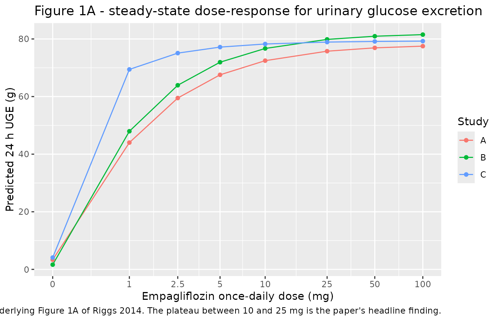
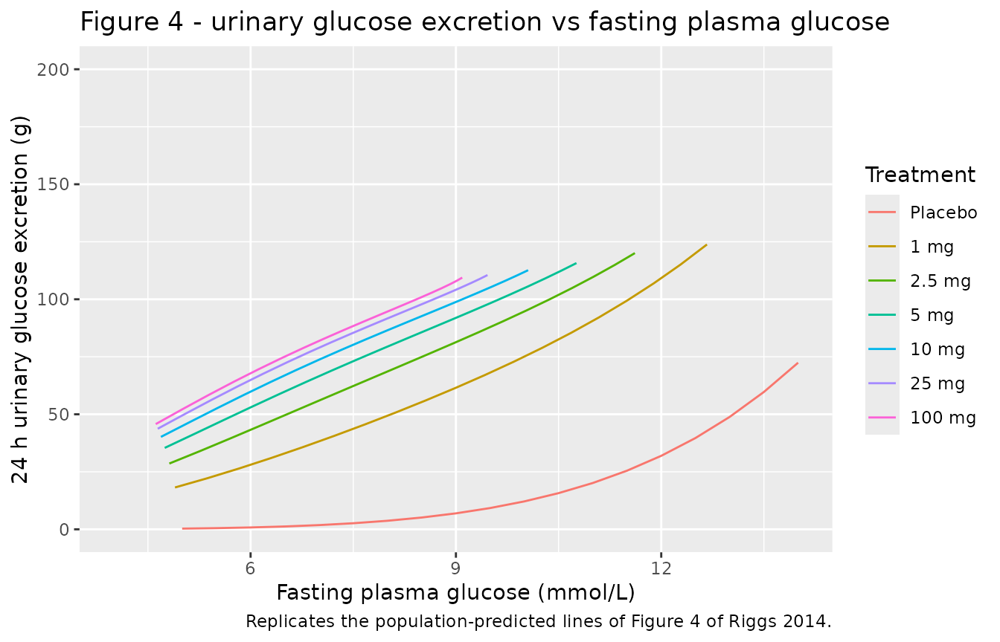
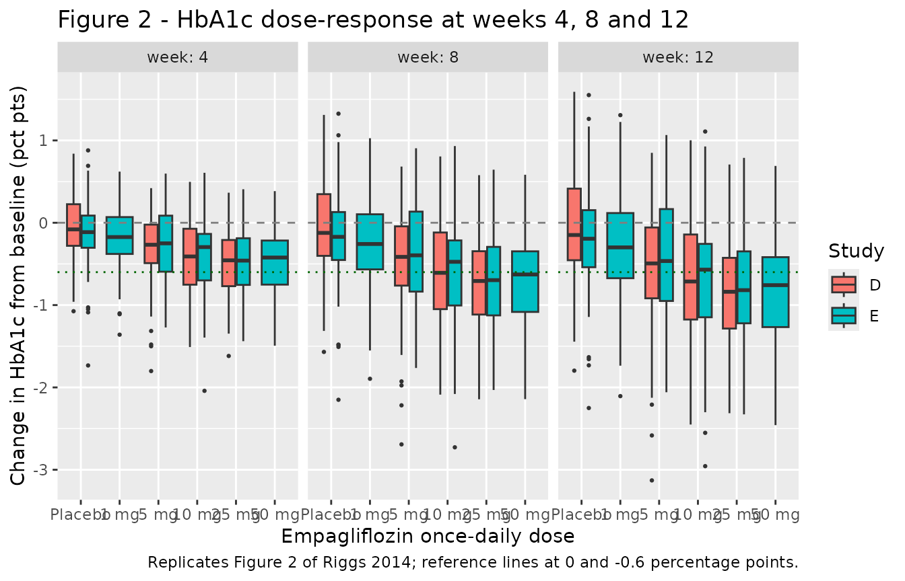
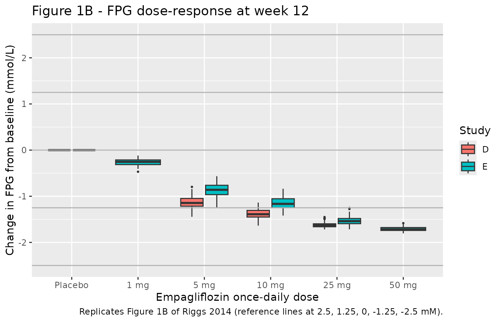

# Empagliflozin exposure-response (Riggs 2014)

## Model and source

- Citation: Riggs MM, Seman LJ, Staab A, MacGregor TR, Gillespie W,
  Gastonguay MR, Woerle HJ, Macha S. Exposure-response modelling for
  empagliflozin, a sodium glucose cotransporter 2 (SGLT2) inhibitor, in
  patients with type 2 diabetes. Br J Clin Pharmacol.
  2014;78(6):1407-1418. <doi:10.1111/bcp.12453>. The allometric
  exponents and the 70 kg reference weight of the PK layer are not
  printed in Riggs 2014 (which states only that ‘weight was included
  allometrically on each of these parameters’); they are taken from the
  companion population PK paper whose model Riggs 2014 uses: Riggs MM,
  Staab A, Seman L, MacGregor TR, Bergsma TT, Gastonguay MR, Macha S.
  Population pharmacokinetics of empagliflozin, a sodium glucose
  cotransporter 2 inhibitor, in patients with type 2 diabetes. J Clin
  Pharmacol. 2013;53(10):1028-1038. <doi:10.1002/jcph.147> (Table 3:
  CL/F and Q/F scale as (WT/70)^0.75 FIXED; V2/F and V3/F as (WT/70)^1
  FIXED).
- Description: Exposure-response (E-R) model for empagliflozin in
  patients with type 2 diabetes mellitus (T2DM), linking steady-state
  exposure to 24 h urinary glucose excretion (UGE), fasting plasma
  glucose (FPG) and HbA1c (Riggs 2014 Br J Clin Pharmacol). The PK layer
  is the two-compartment, lagged-first-order-absorption population PK
  model whose parameter values Riggs 2014 restates in Results, with an
  imposed allometric body-weight effect. The dosing-interval AUC (AUCss
  = DOSE_EMPA_MGD \* 1e6 / MW / CL) drives a single stimulation function
  STIM that simultaneously lowers FPG and raises UGE. UGE is an
  algebraic sum of an exponential baseline in FPG and a saturable drug
  term (Umax, Ustim50); FPG is a turnover state whose removal is
  enhanced by STIM; FPG in turn drives first-order HbA1c production
  against a physiologic-limit boundary. Study-specific baselines and
  study-specific UGE / potency factors are carried for all five
  contributing studies (A-E). Data: 974 T2DM patients, 1-100 mg once
  daily, up to 12 weeks, from five randomised placebo-controlled trials.
- Article: <https://doi.org/10.1111/bcp.12453>
- Companion population PK paper (source of the allometric exponents and
  the 70 kg reference weight): <https://doi.org/10.1002/jcph.147>

Riggs 2014 links empagliflozin exposure to three glycaemic endpoints
through a single stimulation function `STIM`. `STIM` rises
hyperbolically with the dosing-interval AUC, is amplified by the
patient’s baseline fasting plasma glucose (FPG), and simultaneously (a)
enhances the removal of FPG and (b) drives a saturable increase in 24 h
urinary glucose excretion (UGE). FPG in turn drives first-order HbA1c
production against a physiologic-limit boundary.

## Population

The exposure-response analysis pooled 974 patients with type 2 diabetes
from five randomised, placebo-controlled, once-daily trials (Riggs 2014
Table 1): two phase I studies in Germany (study A, n = 48, 8 days; study
B, n = 78, 4 weeks), one phase II study in Japan enrolling only Japanese
patients (study C, n = 100, 4 weeks), and two 12-week multinational
phase IIb studies (study D, n = 324 analysed, empagliflozin monotherapy;
study E, n = 424, on background metformin). Open-label metformin (study
D) and open-label sitagliptin (study E) arms were excluded. Doses
spanned 1 to 100 mg once daily.

Patients were 41 % female with a mean age of 57 to 58 years by study.
Body weight differed markedly across studies: the Japanese cohort of
study C averaged 67.9 kg against 81.4 to 94.6 kg elsewhere, which Riggs
2014 cites as a partial explanation for that study’s greater low-dose
response. Baseline FPG study means were 8.3 to 9.7 mmol/L (overall range
2.8 to 21.0) and baseline HbA1c study means 7.1 to 8.1 % (range 5.6 to
10.4). Renal function was largely preserved: creatinine clearance study
means were 94 to 117 mL/min and fewer than 1.5 % of patients had a value
below 50 mL/min.

The same information is available programmatically via
`readModelDb("Riggs_2014_empagliflozin")()$population`.

## Source trace

Every `ini()` entry carries an in-file comment naming its origin; the
table collects them for review. “Table 2” and “Results” refer to Riggs
2014 unless noted.

| Equation / parameter | Value | Source location |
|----|----|----|
| `d/dt(depot)`, `d/dt(central)`, `d/dt(peripheral1)`, `alag(depot)` | n/a | Results, “Empagliflozin exposures were estimated from a population PK model that included two compartmental disposition with lagged first order absorption and first order elimination (Figure 3)” |
| `lcl` | 9.87 L/h | Results, PK paragraph |
| `lvc` | 3.02 L | Results, PK paragraph |
| `lvp` | 60.4 L | Results, PK paragraph |
| `lq` | 5.16 L/h | Results, PK paragraph |
| `lka` | 0.224 1/h | Results, PK paragraph |
| `lalag` | 0.5 h, FIXED | Results, “Following a 0.5 h lag”; FIXED per Riggs 2013 Table 3 |
| `e_wt_cl`, `e_wt_q` | 0.75, FIXED | **Not in Riggs 2014** (which says only “weight was included allometrically on each of these parameters”); Riggs 2013 Table 3 rows `CL/F (WT/70)^theta_20` and `Q/F (WT/70)^theta_22`, both FIXED |
| `e_wt_vc`, `e_wt_vp` | 1, FIXED | **Not in Riggs 2014**; Riggs 2013 Table 3 rows `V2/F (WT/70)^theta_21` and `V3/F (WT/70)^theta_23`, both FIXED |
| `etalcl`, `etalvp`, `etalka` | CV 26.9 %, 30.8 %, 15.2 % | Results, PK paragraph; back-transformed as `omega^2 = log(1 + CV^2)` |
| `auc` (exposure driver) | n/a | Methods, “AUC_i,j (AUC of the dosing interval for each individual following each dose time in each study) was used for efficacy E-R evaluation”; MW 450.9 g/mol from Results |
| `uge` (Equation 1) | n/a | Equation 1, p. 1411 |
| `luge_base` | 3.71 g/24 h | Table 2 theta_12 |
| `lf_uge_base_b`, `lf_uge_base_c` | 0.320, 0.632 | Table 2 theta_20, theta_16 |
| `lgamma_base`, `lf_gamma_base_c` | 5.31, 1.16 | Table 2 theta_13, theta_17 |
| `lumax`, `lf_umax_c` | 121 g/24 h, 1.11 | Table 2 theta_10, theta_14 |
| `lustim50`, `lf_ustim50_c` | 0.590, 1.58 | Table 2 theta_11, theta_15 |
| `etaluge_base` | CV 158.4 % | Results, “IIV for baseline UGE (CV%) was estimated to be 158.4%” |
| `stim` (Equation 2) | n/a | Equation 2, p. 1411 |
| `emax_trunc`, `beta_fpg`, `gamma_fpg` | 0.0701, 0.795, 1.47 | Table 2 theta_6, theta_8, theta_9 |
| `lc50star` | 498, FIXED | Table 2 theta_7 (RSE column reads FIXED) |
| `lf_c50star_c`, `lf_c50star_e` | 0.169, 1.93 | Table 2 theta_19, theta_21 |
| `d/dt(glucose)` (Equation 3) | n/a | Equation 3, p. 1412 – **sign corrected, see Errata** |
| `lkfpgout` | 0.0407 1/h | Table 2 theta_5 |
| `fpg_base_a` .. `fpg_base_e` | 7.85, 8.50, 8.76, 9.30, 9.49 mmol/L | Table 2 theta_1, theta_2, theta_18, theta_3, theta_4 |
| `d/dt(hba1c)` (Equation 4) | n/a | Equation 4, p. 1412 |
| `lkhba1cout` | 0.167 /week -\> /168 | Table 2 theta_26 |
| `lkhba1cin` | 0.078 %/week/mmol/L -\> /168 | Table 2 theta_27 |
| `hba1c_limit` | 3.34 % | Table 2 theta_22 |
| `eta_share` | 2.7 | Table 2 theta_29 (`eta_kHbA1c,out = theta_29 * eta_kHbA1c,in`) |
| `lhba1c_base`, `lhba1c_base_c`, `lhba1c_base_d`, `lhba1c_base_e` | 7.18, 7.85, 7.85, 7.89 % | Table 2 theta_23, theta_28, theta_24, theta_25 |
| `etalhba1c_base`, `etalkhba1cin`, covariance | CV 9.53 %, CV 8.23 %, rho = -0.310 | Results, HbA1c paragraph |
| `expSd_uge`, `expSd_glucose`, `expSd_hba1c` | sqrt(0.380), sqrt(0.01461), sqrt(0.001287) | Table 2 “Residual variance” block |
| `WT` allometric reference 70 kg | 70 kg | Riggs 2013 Table 3 and Figure 3 legend (“body weight of 70 kg”) |
| `ref_fpg` = 8 mmol/L | 8 mmol/L | Equations 1 and 2; Results, “normalized to a FPG value of 8 mM (144 mg dl-1)” |
| `mw_empa` = 450.9 g/mol | 450.9 | Results, “(molecular weight = 450.9 g mol-1)” |

## Reparameterisation identities

Riggs 2014 estimated the FPG stimulation in an estimation-stable
reparameterisation and reported the interpretable pair in the Table 2
“Calculated parameters” block. Both identities are reproduced exactly by
the packaged model, which is the first check that the transcription is
right.

``` r

mod  <- readModelDb("Riggs_2014_empagliflozin")
mod0 <- rxode2::zeroRe(mod)
#> ℹ parameter labels from comments will be replaced by 'label()'

# One typical subject, one study, one dose level, run to steady state.
solve_typical <- function(dose_mg, fpg_base, study = "A", wt = 70,
                          days = 220, obs_by = 24, extra = NULL) {
  ind <- c(A = 0, B = 0, C = 0, D = 0, E = 0)
  ind[study] <- 1
  ev <-
    rxode2::et(amt = dose_mg, ii = 24, until = days * 24, cmt = "depot") |>
    rxode2::et(seq(0, days * 24, by = obs_by), cmt = "glucose")
  ev <- as.data.frame(ev)
  ev$WT <- wt
  ev$DOSE_EMPA_MGD <- dose_mg
  ev$STUDY_EMPA_A <- ind[["A"]]
  ev$STUDY_EMPA_B <- ind[["B"]]
  ev$STUDY_EMPA_C <- ind[["C"]]
  ev$STUDY_EMPA_D <- ind[["D"]]
  ev$STUDY_EMPA_E <- ind[["E"]]
  # Riggs 2014 reports typical-subject predictions as a function of BASELINE
  # FPG, which in the model is a study-specific fixed effect. Overriding the
  # study A theta is the transparent way to evaluate the published model at an
  # arbitrary baseline; nothing else in the model changes.
  rxode2::rxSolve(
    mod0, ev,
    params = c(fpg_base_a = fpg_base, extra),
    returnType = "data.frame", omega = NA, sigma = NA
  )
}

ss <- function(...) {
  out <- solve_typical(...)
  out[nrow(out), ]
}

reparam <- tibble::tibble(
  Quantity = c("Emax (FPG maximal decrease, proportional)",
               "AUC50, studies A + B + D (nmol*h/L)",
               "AUC50, study C (nmol*h/L)",
               "AUC50, study E (nmol*h/L)",
               "HbA1c change per 1 mmol/L FPG at steady state (%)"),
  Model = c(ss(10, 7.85)$emax_fpg,
            ss(10, 7.85)$auc50,
            ss(10, 8.76, "C")$auc50,
            ss(10, 9.49, "E")$auc50,
            0.078 / 0.167),
  Published = c(0.158, 626, 106, 1210, 0.47),
  Source = c("Table 2, Calculated parameters", "Table 2, Calculated parameters",
             "Table 2, Calculated parameters", "Table 2, Calculated parameters",
             "Discussion, Samtani-style steady-state slope")
)

knitr::kable(reparam, digits = 4,
             caption = "Reparameterisation identities reproduced from the packaged model.")
```

| Quantity | Model | Published | Source |
|:---|---:|---:|:---|
| Emax (FPG maximal decrease, proportional) | 0.1583 | 0.158 | Table 2, Calculated parameters |
| AUC50, studies A + B + D (nmol\*h/L) | 626.4151 | 626.000 | Table 2, Calculated parameters |
| AUC50, study C (nmol\*h/L) | 105.8642 | 106.000 | Table 2, Calculated parameters |
| AUC50, study E (nmol\*h/L) | 1208.9811 | 1210.000 | Table 2, Calculated parameters |
| HbA1c change per 1 mmol/L FPG at steady state (%) | 0.4671 | 0.470 | Discussion, Samtani-style steady-state slope |

Reparameterisation identities reproduced from the packaged model.
{.table}

``` r


# Deterministic typical-value identities: these must be tight.
stopifnot(
  abs(reparam$Model[1] - 0.158) < 5e-4,
  abs(reparam$Model[2] - 626) < 1,
  abs(reparam$Model[3] - 106) < 1,
  abs(reparam$Model[4] - 1210) < 2,
  abs(reparam$Model[5] - 0.47) < 5e-3
)
```

An independent structural check on the PK layer: the four disposition
parameters imply a terminal half-life that the paper states only as
“approximately 12 h” (Results, sourced to data on file).

``` r

k10 <- 9.87 / 3.02
k12 <- 5.16 / 3.02
k21 <- 5.16 / 60.4
lambda_z <- 0.5 * ((k10 + k12 + k21) - sqrt((k10 + k12 + k21)^2 - 4 * k10 * k21))
t_half_terminal <- log(2) / lambda_z
t_half_terminal
#> [1] 12.42897
stopifnot(abs(t_half_terminal - 12) < 1)
```

## Virtual cohort

The original patient-level data are not public. Two cohorts are used
below.

The **typical-subject cohort** is a grid of doses, studies and baseline
FPG values solved with the random effects zeroed
([`rxode2::zeroRe()`](https://nlmixr2.github.io/rxode2/reference/zeroRe.html));
it is used to reproduce the exact numbers Riggs 2014 prints for a
typical patient.

The **stochastic cohort** below draws 100 subjects per treatment arm for
the two 12-week studies (D and E), with body weight sampled to match the
Table 1 means and standard deviations, and is used for the dose-response
figures.

``` r

# set.seed() seeds R's RNG only. rxode2's simulation RNG is partitioned per
# solver thread, so the drawn cohort differs between a 2-core CI runner and a
# 16-thread workstation. Every assertion below is written on the centre or a
# robust quantile of the cohort, never on its extremes.
set.seed(20140626)

n_per_arm <- 100L

make_arm <- function(study, dose_mg, wt_mean, wt_sd, id_offset) {
  ind <- c(A = 0, B = 0, C = 0, D = 0, E = 0)
  ind[study] <- 1
  subj <- tibble::tibble(
    id = id_offset + seq_len(n_per_arm),
    WT = pmax(45, pmin(150, stats::rnorm(n_per_arm, wt_mean, wt_sd)))
  )
  # One compressed dose record per subject (ii = 24 h, 84 doses = 12 weeks)
  doses <- subj |>
    dplyr::mutate(time = 0, amt = dose_mg, evid = 1L, ii = 24, addl = 83L,
                  cmt = "depot")
  obs <- tidyr::expand_grid(
    subj,
    time = seq(0, 12 * 7 * 24, by = 7 * 24)   # weekly, 12 weeks
  ) |>
    dplyr::mutate(amt = 0, evid = 0L, ii = 0, addl = 0L, cmt = "glucose")
  dplyr::bind_rows(doses, obs) |>
    dplyr::mutate(
      study = study,
      arm = if (dose_mg == 0) "Placebo" else paste0(dose_mg, " mg"),
      DOSE_EMPA_MGD = dose_mg,
      STUDY_EMPA_A = ind[["A"]], STUDY_EMPA_B = ind[["B"]],
      STUDY_EMPA_C = ind[["C"]], STUDY_EMPA_D = ind[["D"]],
      STUDY_EMPA_E = ind[["E"]]
    ) |>
    dplyr::arrange(id, time, dplyr::desc(evid))
}

arms <- dplyr::bind_rows(
  # Study D: empagliflozin monotherapy, 5 / 10 / 25 mg or placebo (Methods)
  make_arm("D",  0, 81.4, 17, id_offset =    0L),
  make_arm("D",  5, 81.4, 17, id_offset =  100L),
  make_arm("D", 10, 81.4, 17, id_offset =  200L),
  make_arm("D", 25, 81.4, 17, id_offset =  300L),
  # Study E: on background metformin, 1 / 5 / 10 / 25 / 50 mg or placebo
  make_arm("E",  0, 89.2, 16, id_offset =  400L),
  make_arm("E",  1, 89.2, 16, id_offset =  500L),
  make_arm("E",  5, 89.2, 16, id_offset =  600L),
  make_arm("E", 10, 89.2, 16, id_offset =  700L),
  make_arm("E", 25, 89.2, 16, id_offset =  800L),
  make_arm("E", 50, 89.2, 16, id_offset =  900L)
)

stopifnot(
  !anyDuplicated(dplyr::distinct(arms[arms$evid == 0, c("id", "time")])),
  dplyr::n_distinct(arms$id) == 10L * n_per_arm
)
```

## Simulation

``` r

sim <- rxode2::rxSolve(
  mod, arms,
  keep = c("study", "arm", "DOSE_EMPA_MGD"),
  returnType = "data.frame"
)
#> ℹ parameter labels from comments will be replaced by 'label()'
```

## Replicate published figures

### Figure 1A - dose-response for urinary glucose excretion

Riggs 2014 Figure 1A shows observed 24 h UGE on study days 1 and 27 for
the three studies that collected urine (A, B and C). The model
reproduction below is the typical-subject prediction at each study’s own
baseline FPG and its own UGE parameter set. Study C carries its own
value for all four UGE parameters and for `C*50`, which is what makes
its low-dose response so much steeper.

``` r

uge_grid <- tidyr::expand_grid(
  study = c("A", "B", "C"),
  dose = c(0, 1, 2.5, 5, 10, 25, 50, 100)
) |>
  dplyr::mutate(fpg_base = dplyr::recode(study, A = 7.85, B = 8.50, C = 8.76))
uge_grid$uge <- NA_real_
uge_grid$fpg_ss <- NA_real_
for (i in seq_len(nrow(uge_grid))) {
  r <- ss(uge_grid$dose[i], uge_grid$fpg_base[i], uge_grid$study[i])
  uge_grid$uge[i] <- r$uge
  uge_grid$fpg_ss[i] <- r$glucose
}
```

``` r

ggplot(uge_grid, aes(dose + 0.5, uge, colour = study)) +
  geom_line() +
  geom_point() +
  scale_x_log10(breaks = c(0.5, 1.5, 3, 5.5, 10.5, 25.5, 50.5, 100.5),
                labels = c("0", "1", "2.5", "5", "10", "25", "50", "100")) +
  labs(x = "Empagliflozin once-daily dose (mg)",
       y = "Predicted 24 h UGE (g)", colour = "Study",
       title = "Figure 1A - steady-state dose-response for urinary glucose excretion",
       caption = paste("Replicates the model prediction underlying Figure 1A of Riggs 2014.",
                       "The plateau between 10 and 25 mg is the paper's headline finding."))
```



The paper reports the plateau in words: “An increase in UGE appeared to
occur with the lowest dose of empagliflozin, with a dose-dependent
increase in UGE thereafter, reaching a plateau at approximately 10 to 25
mg.”

``` r

plateau <- uge_grid |>
  dplyr::group_by(study) |>
  dplyr::summarise(
    monotone = all(diff(uge[order(dose)]) > 0),
    `10 mg as pct of 100 mg` = 100 * uge[dose == 10] / uge[dose == 100],
    `25 mg as pct of 100 mg` = 100 * uge[dose == 25] / uge[dose == 100],
    .groups = "drop"
  )
knitr::kable(plateau, digits = 1,
             caption = "Approach to the UGE plateau by study.")
```

| study | monotone | 10 mg as pct of 100 mg | 25 mg as pct of 100 mg |
|:------|:---------|-----------------------:|-----------------------:|
| A     | TRUE     |                   93.5 |                   97.7 |
| B     | TRUE     |                   94.1 |                   98.0 |
| C     | TRUE     |                   98.7 |                   99.6 |

Approach to the UGE plateau by study. {.table}

``` r

stopifnot(
  # UGE is monotone increasing in dose in every study.
  all(plateau$monotone),
  # "reaching a plateau at approximately 10 to 25 mg": 10 mg is already
  # within 10 pct of the 100 mg response and 25 mg within 5 pct.
  all(plateau$`10 mg as pct of 100 mg` > 90),
  all(plateau$`25 mg as pct of 100 mg` > 95)
)
```

### Results-text predictions for UGE

Riggs 2014 quotes several typical-subject UGE *increases*. Those are the
drug-related term of Equation 1 alone, which the packaged model exposes
as `uge_drug`.

``` r

uge_pred <- tibble::tibble(
  Scenario = c("3 mg, baseline FPG 8 mmol/L",
               "10 mg, baseline FPG 8 mmol/L",
               "25 mg, baseline FPG 8 mmol/L",
               "3 mg, baseline FPG 10.5 mmol/L"),
  Model = c(ss(3, 8)$uge_drug, ss(10, 8)$uge_drug,
            ss(25, 8)$uge_drug, ss(3, 10.5)$uge_drug),
  Published = c(60, 72, 75, 80),
  Source = "Results, UGE paragraph"
)
knitr::kable(uge_pred, digits = 2,
             caption = "Drug-related increase in 24 h UGE (g), typical subject, study A.")
```

| Scenario                       | Model | Published | Source                 |
|:-------------------------------|------:|----------:|:-----------------------|
| 3 mg, baseline FPG 8 mmol/L    | 61.13 |        60 | Results, UGE paragraph |
| 10 mg, baseline FPG 8 mmol/L   | 72.02 |        72 | Results, UGE paragraph |
| 25 mg, baseline FPG 8 mmol/L   | 75.44 |        75 | Results, UGE paragraph |
| 3 mg, baseline FPG 10.5 mmol/L | 79.44 |        80 | Results, UGE paragraph |

Drug-related increase in 24 h UGE (g), typical subject, study A.
{.table}

``` r


stopifnot(
  # The two two-significant-figure values are exact to the printed precision;
  # the "approximately 60" and "approximately 80" claims carry one.
  abs(uge_pred$Model[2] - 72) < 0.5,
  abs(uge_pred$Model[3] - 75) < 0.5,
  abs(uge_pred$Model[1] - 60) < 2,
  abs(uge_pred$Model[4] - 80) < 2,
  # Half of Umax (121 g/24 h) is reached at about the 3 mg exposure, which is
  # the paper's stated interpretation of the 626 nmol*h/L AUC50.
  abs(uge_pred$Model[1] / 121 - 0.5) < 0.06
)
```

The placebo baseline term is reported separately: UGE “was approximately
doubled (e.g. from 2 to 4 to 8 to 16 g day-1) with baseline FPG
increases from 8 mM to 9.1 mM, 10.4 mM and 11.8 mM”, and reaches
“approximately 32 g day-1 for an FPG of 12 mM”.

``` r

base_fpg <- c(8, 9.1, 10.4, 11.8, 12)
base_uge <- vapply(base_fpg, function(b) ss(0, b)$uge, numeric(1))
baseline_tbl <- tibble::tibble(
  `Baseline FPG (mmol/L)` = base_fpg,
  `Predicted UGE (g/24 h)` = base_uge,
  `Fold vs 8 mmol/L` = base_uge / base_uge[1]
)
knitr::kable(baseline_tbl, digits = 2,
             caption = "Placebo UGE baseline as a function of FPG, study A.")
```

| Baseline FPG (mmol/L) | Predicted UGE (g/24 h) | Fold vs 8 mmol/L |
|----------------------:|-----------------------:|-----------------:|
|                   8.0 |                   3.71 |             1.00 |
|                   9.1 |                   7.35 |             1.98 |
|                  10.4 |                  14.94 |             4.03 |
|                  11.8 |                  29.22 |             7.88 |
|                  12.0 |                  31.95 |             8.61 |

Placebo UGE baseline as a function of FPG, study A. {.table}

``` r


stopifnot(
  # Successive doublings (paper: 2x, 4x, 8x).
  abs(baseline_tbl$`Fold vs 8 mmol/L`[2] - 2) < 0.1,
  abs(baseline_tbl$`Fold vs 8 mmol/L`[3] - 4) < 0.2,
  abs(baseline_tbl$`Fold vs 8 mmol/L`[4] - 8) < 0.4,
  # 32 g/day at FPG 12 mmol/L.
  abs(base_uge[5] - 32) < 1
)
```

### Figure 4 - relationship of UGE with FPG

Figure 4 plots 24 h UGE against FPG with one predicted line per
treatment. The reproduction sweeps baseline FPG across the observed
range and reads the steady-state FPG and UGE for each dose level.

``` r

fig4_grid <- tidyr::expand_grid(
  fpg_base = seq(5, 14, by = 0.5),
  dose = c(0, 1, 2.5, 5, 10, 25, 100)
)
fig4_grid$fpg <- NA_real_
fig4_grid$uge <- NA_real_
for (i in seq_len(nrow(fig4_grid))) {
  r <- ss(fig4_grid$dose[i], fig4_grid$fpg_base[i])
  fig4_grid$fpg[i] <- r$glucose
  fig4_grid$uge[i] <- r$uge
}
fig4_grid$treatment <- factor(
  ifelse(fig4_grid$dose == 0, "Placebo", paste0(fig4_grid$dose, " mg")),
  levels = c("Placebo", "1 mg", "2.5 mg", "5 mg", "10 mg", "25 mg", "100 mg")
)

ggplot(fig4_grid, aes(fpg, uge, colour = treatment)) +
  geom_line() +
  coord_cartesian(xlim = c(4, 14), ylim = c(0, 200)) +
  labs(x = "Fasting plasma glucose (mmol/L)", y = "24 h urinary glucose excretion (g)",
       colour = "Treatment",
       title = "Figure 4 - urinary glucose excretion vs fasting plasma glucose",
       caption = "Replicates the population-predicted lines of Figure 4 of Riggs 2014.")
```



The paper’s reading of this figure is that “the relationship with FPG is
retained with empagliflozin treatment, such that the magnitude of
glucose removal (UGE) decreased as FPG decreased, thereby providing a
degree of self-correction against hypoglycaemia”: every line rises with
FPG, and the drug lines sit above placebo at every FPG.

``` r

by_trt <- split(fig4_grid, fig4_grid$treatment)
stopifnot(
  # Every treatment line is monotone increasing in FPG.
  all(vapply(by_trt, function(d) all(diff(d$uge[order(d$fpg)]) > 0), logical(1))),
  # Every drug line lies above placebo at matched baseline FPG.
  all(vapply(by_trt[-1], function(d) all(d$uge > by_trt[["Placebo"]]$uge), logical(1)))
)
```

### Maximal steady-state FPG and HbA1c decreases

This is the paper’s most quantitative typical-subject claim and the
strongest transcription check available: four baseline FPG values, each
with a published maximal FPG decrease and a published maximal HbA1c
decrease (Results, FPG / HbA1c paragraph). A very large dose is used to
drive `STIM` to its asymptote.

``` r

maxdose <- 1e4  # far beyond the studied range; drives AUC >> AUC50
base_vals <- c(8, 7.4, 9.1, 10)
maxdec <- tibble::tibble(
  `Baseline FPG (mmol/L)` = base_vals,
  `FPG decrease, model (mmol/L)` =
    vapply(base_vals, function(b) ss(0, b)$glucose - ss(maxdose, b)$glucose, numeric(1)),
  `FPG decrease, published` = c(1.3, 1.0, 1.7, 2.2),
  `HbA1c decrease, model (pct pts)` =
    vapply(base_vals, function(b) ss(0, b)$hba1c - ss(maxdose, b)$hba1c, numeric(1)),
  `HbA1c decrease, published` = c(0.6, 0.5, 0.81, 1.0)
)
knitr::kable(maxdec, digits = 3,
             caption = "Maximal steady-state decreases; published values from Riggs 2014 Results.")
```

| Baseline FPG (mmol/L) | FPG decrease, model (mmol/L) | FPG decrease, published | HbA1c decrease, model (pct pts) | HbA1c decrease, published |
|---:|---:|---:|---:|---:|
| 8.0 | 1.266 | 1.3 | 0.588 | 0.60 |
| 7.4 | 1.044 | 1.0 | 0.485 | 0.50 |
| 9.1 | 1.740 | 1.7 | 0.808 | 0.81 |
| 10.0 | 2.197 | 2.2 | 1.020 | 1.00 |

Maximal steady-state decreases; published values from Riggs 2014
Results. {.table style="width:100%;"}

``` r


stopifnot(
  # Each model value rounds to the published value at the precision printed.
  all(abs(maxdec$`FPG decrease, model (mmol/L)` -
            maxdec$`FPG decrease, published`) < 0.05),
  all(abs(maxdec$`HbA1c decrease, model (pct pts)` -
            maxdec$`HbA1c decrease, published`) < 0.025),
  # 16 pct maximal proportional decrease at the 8 mmol/L reference.
  abs(maxdec$`FPG decrease, model (mmol/L)`[1] / 8 - 0.158) < 0.002
)
```

### Figures 1B and 2 - dose-response for FPG and HbA1c

Figure 1B (FPG) and Figure 2 (HbA1c at weeks 4, 8 and 12) show the
observed change from baseline by dose. The stochastic cohort reproduces
the dose-response and the time course.

``` r

chg <- sim |>
  dplyr::filter(!is.na(glucose)) |>
  dplyr::group_by(id) |>
  dplyr::mutate(dfpg = glucose - dplyr::first(glucose),
                dhba1c = hba1c - dplyr::first(hba1c)) |>
  dplyr::ungroup() |>
  dplyr::mutate(week = time / (7 * 24),
                arm = factor(arm, levels = c("Placebo", "1 mg", "5 mg",
                                             "10 mg", "25 mg", "50 mg")))

chg |>
  dplyr::filter(week %in% c(4, 8, 12)) |>
  ggplot(aes(arm, dhba1c, fill = study)) +
  geom_boxplot(outlier.size = 0.5) +
  geom_hline(yintercept = 0, linetype = "dashed", colour = "grey50") +
  geom_hline(yintercept = -0.6, linetype = "dotted", colour = "darkgreen") +
  facet_wrap(~week, labeller = label_both) +
  labs(x = "Empagliflozin once-daily dose", y = "Change in HbA1c from baseline (pct pts)",
       fill = "Study",
       title = "Figure 2 - HbA1c dose-response at weeks 4, 8 and 12",
       caption = paste("Replicates Figure 2 of Riggs 2014;",
                       "reference lines at 0 and -0.6 percentage points."))
```



``` r

chg |>
  dplyr::filter(week == 12) |>
  ggplot(aes(arm, dfpg, fill = study)) +
  geom_boxplot(outlier.size = 0.5) +
  geom_hline(yintercept = c(2.5, 1.25, 0, -1.25, -2.5), colour = "grey70") +
  labs(x = "Empagliflozin once-daily dose", y = "Change in FPG from baseline (mmol/L)",
       fill = "Study",
       title = "Figure 1B - FPG dose-response at week 12",
       caption = "Replicates Figure 1B of Riggs 2014 (reference lines at 2.5, 1.25, 0, -1.25, -2.5 mM).")
```



``` r

med12 <- chg |>
  dplyr::filter(week == 12) |>
  dplyr::group_by(study, arm) |>
  dplyr::summarise(dfpg = median(dfpg), dhba1c = median(dhba1c), .groups = "drop")
knitr::kable(med12, digits = 3,
             caption = "Median change from baseline at week 12 by study and arm.")
```

| study | arm     |   dfpg | dhba1c |
|:------|:--------|-------:|-------:|
| D     | Placebo |  0.000 | -0.149 |
| D     | 5 mg    | -1.146 | -0.494 |
| D     | 10 mg   | -1.390 | -0.713 |
| D     | 25 mg   | -1.628 | -0.838 |
| E     | Placebo |  0.000 | -0.194 |
| E     | 1 mg    | -0.254 | -0.299 |
| E     | 5 mg    | -0.861 | -0.465 |
| E     | 10 mg   | -1.165 | -0.570 |
| E     | 25 mg   | -1.539 | -0.819 |
| E     | 50 mg   | -1.717 | -0.758 |

Median change from baseline at week 12 by study and arm. {.table}

``` r


pbo <- med12[med12$arm == "Placebo", c("study", "dfpg", "dhba1c")]
names(pbo) <- c("study", "dfpg_pbo", "dhba1c_pbo")
drug <- merge(med12[med12$arm != "Placebo", ], pbo, by = "study")

stopifnot(
  # The FPG system starts at its own steady state, so a placebo arm does not
  # move. Asserted on the median, not on any subject's extreme.
  all(abs(med12$dfpg[med12$arm == "Placebo"]) < 0.05),
  # Every drug arm lowers FPG; the smallest effect is study E at 1 mg, whose
  # AUC50 is roughly twice the pooled estimate.
  all(drug$dfpg < -0.15),
  # Every drug arm lowers HbA1c beyond its own study's placebo drift.
  all(drug$dhba1c - drug$dhba1c_pbo < -0.05),
  # Monotone FPG dose-response within each study (arm is an ordered factor).
  all(diff(med12$dfpg[med12$study == "D"]) < 0),
  all(diff(med12$dfpg[med12$study == "E"]) < 0)
)
```

The HbA1c medians are *not* asserted to be monotone in dose: HbA1c
change depends on the subject-level `kHbA1c,in` and `kHbA1c,out` draws
as well as on the FPG change, and each arm is an independent draw, so
the study E 25 and 50 mg medians can cross. The FPG medians, which
depend only on clearance, are monotone.

Riggs 2014 reports that the 10 and 25 mg doses reach 80 % and 90 % of
the maximal response on the pooled studies A + B + D `AUC50`, but only
65 % and 82 % on the study E `AUC50` - the paper’s central sensitivity
analysis.

``` r

pct_of_max <- function(dose_mg, study, fpg_base) {
  full <- ss(0, fpg_base, study)$glucose - ss(maxdose, fpg_base, study)$glucose
  100 * (ss(0, fpg_base, study)$glucose - ss(dose_mg, fpg_base, study)$glucose) / full
}
pom <- tibble::tibble(
  `AUC50 source` = c("Studies A + B + D", "Studies A + B + D",
                     "Study E", "Study E"),
  Dose = c("10 mg", "25 mg", "10 mg", "25 mg"),
  `Model (pct of maximum)` = c(pct_of_max(10, "D", 9.30), pct_of_max(25, "D", 9.30),
                               pct_of_max(10, "E", 9.30), pct_of_max(25, "E", 9.30)),
  `Published (pct)` = c(80, 90, 65, 82)
)
knitr::kable(pom, digits = 1,
             caption = "Fraction of the maximal FPG response achieved, by AUC50 estimate.")
```

| AUC50 source      | Dose  | Model (pct of maximum) | Published (pct) |
|:------------------|:------|-----------------------:|----------------:|
| Studies A + B + D | 10 mg |                   78.2 |              80 |
| Studies A + B + D | 25 mg |                   90.0 |              90 |
| Study E           | 10 mg |                   65.1 |              65 |
| Study E           | 25 mg |                   82.3 |              82 |

Fraction of the maximal FPG response achieved, by AUC50 estimate.
{.table}

``` r

stopifnot(all(abs(pom$`Model (pct of maximum)` - pom$`Published (pct)`) < 3))
```

## PKNCA validation

Riggs 2014 states the typical steady-state dosing-interval AUC for four
dose levels (“The typical calculated steady-state AUC values for once
daily doses of 1, 3, 10 and 25 mg were 225, 674, 2250 and 5620 nmol l-1
h”). Those values are the paper’s own `Dose / (CL/F)` calculation;
running non-compartmental analysis over the simulated steady-state
dosing interval therefore checks that the two-compartment ODE, the
absorption lag and the unit conversion in the packaged model actually
deliver that exposure, rather than re-stating the identity.

``` r

nca_doses <- c(1, 3, 10, 25)
tau <- 24
n_days <- 30
start_ss <- n_days * 24   # time of the final dose

# Hourly through the accumulation phase, then dense over the steady-state
# dosing interval that the NCA is computed on.
obs_times <- sort(unique(c(
  seq(0, start_ss, by = 1),
  seq(start_ss, start_ss + tau, by = 0.02)
)))

nca_sim <- dplyr::bind_rows(lapply(seq_along(nca_doses), function(i) {
  d <- nca_doses[i]
  ev <- rxode2::et(amt = d, ii = tau, until = start_ss, cmt = "depot") |>
    rxode2::et(obs_times, cmt = "glucose")
  ev <- as.data.frame(ev)
  ev$WT <- 70
  ev$DOSE_EMPA_MGD <- d
  ev$STUDY_EMPA_A <- 1
  ev$STUDY_EMPA_B <- 0
  ev$STUDY_EMPA_C <- 0
  ev$STUDY_EMPA_D <- 0
  ev$STUDY_EMPA_E <- 0
  s <- rxode2::rxSolve(mod0, ev, returnType = "data.frame",
                       omega = NA, sigma = NA)
  s$id <- i
  s$treatment <- paste0(d, " mg")
  s
}))

# rxSolve output carries no evid column, so the dose records are rebuilt from
# the known schedule rather than filtered out of the simulation.
dose_df <- tidyr::expand_grid(
  id = seq_along(nca_doses),
  time = seq(0, start_ss, by = tau)
) |>
  dplyr::mutate(amt = nca_doses[id], treatment = paste0(nca_doses[id], " mg"))
```

``` r

sim_nca <- nca_sim |>
  dplyr::filter(!is.na(Cc)) |>
  dplyr::select(id, time, Cc, treatment)

# Guarantee a time = 0 record per subject; empagliflozin is extravascular, so
# the pre-dose concentration is 0.
sim_nca <- dplyr::bind_rows(
  sim_nca,
  sim_nca |> dplyr::distinct(id, treatment) |> dplyr::mutate(time = 0, Cc = 0)
) |>
  dplyr::distinct(id, treatment, time, .keep_all = TRUE) |>
  dplyr::arrange(id, treatment, time)

conc_obj <- PKNCA::PKNCAconc(sim_nca, Cc ~ time | treatment + id)
dose_obj <- PKNCA::PKNCAdose(dose_df, amt ~ time | treatment + id)

intervals <- data.frame(
  start = start_ss, end = start_ss + tau,
  cmax = TRUE, tmax = TRUE, auclast = TRUE, cav = TRUE
)

nca_res <- PKNCA::pk.nca(PKNCA::PKNCAdata(conc_obj, dose_obj, intervals = intervals))
```

``` r

published <- tibble::tribble(
  ~treatment, ~auclast,
  "1 mg",     225,
  "3 mg",     674,
  "10 mg",    2250,
  "25 mg",    5620
)

cmp <- nlmixr2lib::ncaComparisonTable(
  simulated = nca_res,
  reference = published,
  by = "treatment",
  params = "auclast",
  units = c(auclast = "nmol*h/L"),
  tolerance_pct = 20
)
knitr::kable(
  cmp,
  caption = paste("Simulated steady-state AUC0-24 against the typical values",
                  "reported in Riggs 2014 Results. * differs by >20%."),
  align = c("l", "l", "r", "r", "r")
)
```

| NCA parameter       | treatment | Reference | Simulated | % diff |
|:--------------------|:----------|----------:|----------:|-------:|
| AUClast (nmol\*h/L) | 1 mg      |       225 |       225 |  -0.1% |
| AUClast (nmol\*h/L) | 3 mg      |       674 |       674 |  +0.0% |
| AUClast (nmol\*h/L) | 10 mg     |      2250 |      2250 |  -0.1% |
| AUClast (nmol\*h/L) | 25 mg     |      5620 |      5620 |  -0.0% |

Simulated steady-state AUC0-24 against the typical values reported in
Riggs 2014 Results. \* differs by \>20%. {.table}

``` r

auc_sim <- as.data.frame(nca_res)
auc_sim <- auc_sim[auc_sim$PPTESTCD == "auclast", ]
auc_sim <- auc_sim[match(published$treatment, auc_sim$treatment), ]
rel_err <- abs(auc_sim$PPORRES - published$auclast) / published$auclast
rel_err
#> [1] 0.0013594419 0.0001222366 0.0013594152 0.0004709451
stopifnot(
  # Deterministic typical-value NCA on a dense grid: the only error is
  # trapezoidal, so 1 pct is generous.
  all(rel_err < 0.01),
  # Dose proportionality of the linear PK model.
  max(abs(auc_sim$PPORRES / nca_doses - auc_sim$PPORRES[1] / nca_doses[1])) < 1
)
```

Riggs 2014 Table 1 also reports the observed mean steady-state AUC
normalised to a 10 mg dose, by study (1970, 1830, 2480, 2280 and 2130
nmol*h/L for studies A to E). Those are cohort means carrying the full
covariate model of the companion population PK paper (age, sex, race,
total protein, serum creatinine), of which only the allometric weight
term is retained here, so they are not a target this model can
reproduce; the qualitative ordering it* can\* reproduce is that the
lightest cohort (study C, 67.9 kg) has the highest exposure.

``` r

wt_by_study <- c(A = 94.6, B = 93.2, C = 67.9, D = 81.4, E = 89.2)
auc_by_wt <- vapply(names(wt_by_study),
                    function(s) ss(10, 8, "A", wt = wt_by_study[[s]])$auc,
                    numeric(1))
tibble::tibble(Study = names(wt_by_study),
               `Mean weight (kg)` = as.numeric(wt_by_study),
               `Model AUC at 10 mg (nmol*h/L)` = auc_by_wt,
               `Table 1 observed mean` = c(1970, 1830, 2480, 2280, 2130)) |>
  knitr::kable(digits = 0,
               caption = "Weight-driven exposure ordering against Riggs 2014 Table 1.")
```

| Study | Mean weight (kg) | Model AUC at 10 mg (nmol\*h/L) | Table 1 observed mean |
|:------|-----------------:|-------------------------------:|----------------------:|
| A     |               95 |                           1793 |                  1970 |
| B     |               93 |                           1813 |                  1830 |
| C     |               68 |                           2299 |                  2480 |
| D     |               81 |                           2007 |                  2280 |
| E     |               89 |                           1873 |                  2130 |

Weight-driven exposure ordering against Riggs 2014 Table 1. {.table}

``` r

stopifnot(
  # Study C (the lightest cohort) has the highest model exposure, matching the
  # highest observed mean in Table 1.
  which.max(auc_by_wt) == which(names(wt_by_study) == "C"),
  which.max(c(1970, 1830, 2480, 2280, 2130)) == 3L
)
```

## Assumptions and deviations

### Errata and corrections to the published equations

- **Equation 3 (FPG turnover) is printed with a sign that contradicts
  the rest of the paper.** As typeset on p. 1412 it reads
  `d(FPG)/dt = kFPGin - kFPGout * FPG * (1 - STIM)`, which *reduces* FPG
  removal as `STIM` rises and therefore makes empagliflozin *raise* FPG.
  That contradicts the Figure 3 schematic (where the `STIM` node sits on
  the `kFPG,out` arrow leaving the FPG box), the narrative (“this STIM
  function directly affected the removal rate of FPG”; “stimulation
  (STIM) lowered FPG”), and every number the paper reports. The packaged
  model uses `d(FPG)/dt = kFPGin - kFPGout * FPG / (1 - STIM)`, which
  keeps `STIM` on the removal arm and gives a steady state of
  `FPG_base * (1 - STIM)`, i.e. a maximal *proportional* decrease equal
  to `STIM` itself. That is exactly how Table 2 labels its calculated
  0.158 (“FPG maximal decrease (proportional)”), and it reproduces all
  four published maximal FPG decreases and all four published maximal
  HbA1c decreases to the printed precision (see the “Maximal
  steady-state FPG and HbA1c decreases” table above, including the
  two-significant-figure 0.81 percentage-point value). The alternative
  reading `kFPGout * FPG * (1 + STIM)` - which the successor analysis
  (Baron 2016, same group, same `kFPGout` of 0.0407 1/h) does use -
  reproduces none of the eight.
- **Equation 2’s hyperbolic denominator is missing its `beta` factor.**
  As typeset the drug term is
  `(beta + 1) * Emax_truncated * AUC / (C*50 + AUC)`, whose asymptote is
  `(beta + 1) * Emax_truncated = 0.126` and whose half-maximal exposure
  is `C*50 = 498`. Table 2’s own “Calculated parameters” block reports
  0.158 and 626 instead, and both follow from
  `(beta + 1) * Emax_truncated * AUC / (C*50 + beta * AUC)`:
  `Emax = (beta + 1) / beta * Emax_truncated = 1.795 / 0.795 * 0.0701 = 0.1583`
  and `AUC50 = C*50 / beta = 498 / 0.795 = 626.4`. The same identity
  reproduces the study C (106) and study E (1210) `AUC50` values. The
  packaged model uses the corrected form and exposes `emax_fpg` and
  `auc50` as named intermediates so both can be read straight out of a
  solve.
- **Equation 1 labels UGE in mg but every reported value is in g.**
  Table 2 gives baseline UGE as “3.71 (g per 24 h)” and `Umax` as “121
  (g 24 h-1)”, and the narrative works in g/day throughout. The model
  uses g.
- **One Results sentence appears to shift its own numbers by one dose
  level.** Riggs 2014 states that the 72 and 75 g/day UGE increases
  predicted at 10 and 25 mg for a baseline FPG of 8 mmol/L “increase to
  80 and 88 g day-1 … for an FPG of 10.5 mM”. The model reproduces 72.0
  and 75.4 g at FPG 8 mmol/L exactly, and at 10.5 mmol/L it gives 79.4 g
  for **3 mg** (the dose discussed in the preceding sentence) and 88.1 g
  for 10 mg - so the paper’s “80 and 88” match the 3 mg and 10 mg
  predictions rather than the 10 mg and 25 mg ones. No parameter was
  tuned; the discrepancy is recorded rather than resolved.
- **The reported HbA1c half-life is 4.3 weeks; `theta_26` gives 4.15
  weeks.** `log(2) / 0.167 week-1 = 4.15` weeks. The packaged model uses
  the `theta_26` point estimate.

### Non-paper-derived parameter values

- `e_wt_cl`, `e_wt_q`, `e_wt_vc`, `e_wt_vp` and the 70 kg reference
  weight are **not printed in Riggs 2014**, which says only that “weight
  was included allometrically on each of these parameters”. They are
  taken from the companion population PK publication whose model Riggs
  2014 uses (Riggs 2013, *J Clin Pharmacol* 53:1028-1038, Table 3),
  where all four rows are flagged FIXED: `(WT/70)^0.75` on CL/F and Q/F,
  `(WT/70)^1` on V2/F and V3/F. Each is annotated inline in the model
  file.

### Structural assumptions

- **Exposure driver.** Riggs 2014 carried the individual dosing-interval
  AUC as a data item generated by the companion population PK model. The
  packaged model recomputes it as `DOSE_EMPA_MGD * 1e6 / 450.9 / cl`,
  which is exact for a linear disposition model at steady state under
  once-daily dosing and reproduces the four typical AUC values the paper
  prints. Consequently the drug effect is driven by the dose level and
  the individual clearance, not by the simulated concentration profile;
  a simulation that changes the dose must update `DOSE_EMPA_MGD` as well
  as `amt`. The PK ODEs are retained so that `Cc` is available and so
  the NCA check above can be run.
- **Baseline FPG is a study-level fixed effect with no IIV.** Riggs 2014
  Table 2 reports one baseline FPG theta per study and no `omega` for
  it. This vignette evaluates the paper’s baseline-FPG-conditional
  predictions by overriding the study A theta through
  `rxSolve(params = )`; that is a presentation device, not a model
  change.
- **Study A has no baseline HbA1c.** Table 1 footnotes study A’s HbA1c
  as “Not included in the E-R analyses”, so no `theta` exists for it.
  The model gives a study A subject the study B baseline (the other
  short phase I cohort) purely so that the HbA1c state has a defined
  initial condition. HbA1c *changes* are unaffected because the drug
  enters HbA1c only through FPG.
- **The HbA1c system is not at steady state at time zero.** The
  estimated baseline HbA1c thetas do not equal
  `HbA1c_limit + (kHbA1cin / kHbA1cout) * FPG_baseline` for any study
  (7.18 vs 7.31 for study B, 7.85 vs 7.68 for study D, and so on), so a
  placebo arm drifts by roughly 0.1 to 0.2 percentage points over 12
  weeks. This is a property of the published parameter set, not of the
  transcription, and is visible in the study D and E placebo boxes
  above.
- **No residual error is attached to `Cc`.** Riggs 2014 reports residual
  variance for UGE, FPG and HbA1c only; the PK residual belongs to the
  companion population PK paper. `Cc` is returned as a derived quantity.
- **Residual errors are log-normal, not proportional.** Table 2 reports
  a variance and a CV% for each endpoint, and the two are related by
  `CV = sqrt(exp(variance) - 1)` for all three (0.380 -\> 68.0 % against
  a printed 67.9 %; 0.01461 -\> 12.13 % against 12.1 %; 0.001287 -\>
  3.589 % against 3.59 %), which is the exponential-error relationship.
  The model therefore uses `~ lnorm(...)` rather than `~ prop(...)`.
- **Model domain.** `STIM` must stay below 1 for the FPG equation to be
  defined. `STIM` reaches 1 only at a baseline FPG of about 28 mmol/L,
  well above the highest baseline observed in the pooled cohort (21.0
  mmol/L, study D).

### Not modelled

- **Tolerability exposure-response.** Riggs 2014 evaluated hypoglycaemia
  (n = 4), urinary tract infection (n = 17) and genital / vulvovaginal
  events (n = 16) in studies D and E using non-parametric generalised
  additive model smooths (Figure 6) rather than a parametric model, and
  reported no increase in event probability with exposure up to 50 mg.
  There are no coefficients to transcribe, so no tolerability sub-model
  is carried; sex, which was screened in that analysis, is recorded in
  `covariatesDataExcluded`.
- **Renal function.** The influence of creatinine clearance on the FPG
  and HbA1c responses was investigated graphically only (Supplementary
  Figures S1 and S2) and none was found down to about 50 mL/min. `CRCL`
  is recorded in `covariatesDataExcluded`.
- **Cohort demographics.** The virtual cohorts above sample body weight
  from a normal distribution matched to the Table 1 study means and
  standard deviations, truncated to 45 to 150 kg. No other covariate
  distribution is needed because weight is the only covariate the
  retained model uses.
