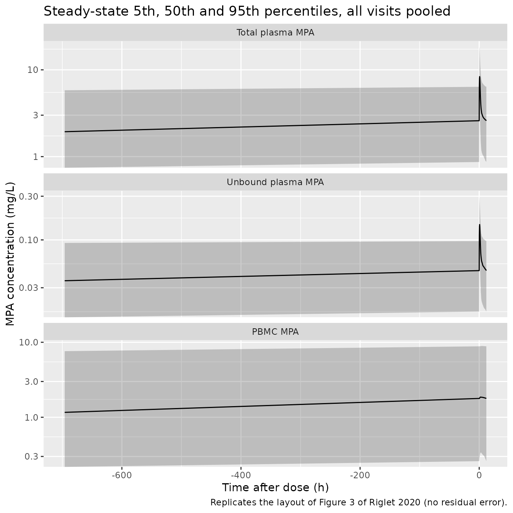

# Mycophenolic acid in plasma and PBMC (Riglet 2020)

## Model and source

- Citation: Riglet F, Bertrand J, Barrail-Tran A, Verstuyft C, Michelon
  H, Benech H, Durrbach A, Furlan V, Barau C. Population Pharmacokinetic
  Model of Plasma and Cellular Mycophenolic Acid in Kidney Transplant
  Patients from the CIMTRE Study. Drugs R D. 2020;20(4):331-342.
  <doi:10.1007/s40268-020-00319-y>
- Description: Population PK model for plasma total, plasma unbound and
  intracellular (peripheral blood mononuclear cell, PBMC) mycophenolic
  acid (MPA) after oral mycophenolate mofetil in adult kidney transplant
  recipients of the CIMTRE study (Riglet 2020). Unbound MPA follows a
  two-compartment disposition with zero-order absorption into the
  central compartment and first-order unbound clearance; total plasma
  MPA is the unbound concentration times (1 + kns), a linear
  (non-saturable) protein-binding ratio; a third compartment holds PBMC
  MPA, exchanging with the unbound central concentration through an
  influx and an efflux clearance. Covariates: Cockcroft-Gault creatinine
  clearance on unbound clearance and peripheral volume, baseline serum
  albumin on the binding ratio, and ABCB1 3435C\>T (rs1045642) TT
  homozygosity on the PBMC efflux clearance. Inter-individual and
  inter-occasion (visit) variability, proportional residual error on
  each of the three concentrations. All clearances and volumes are
  apparent (divided by the unestimated bioavailability F).
- Article: <https://doi.org/10.1007/s40268-020-00319-y> (open access)

Riglet et al. modelled three mycophenolic acid (MPA) concentrations at
once in kidney transplant recipients of the CIMTRE study: total plasma
MPA, unbound plasma MPA and MPA inside peripheral blood mononuclear
cells (PBMC), the cells in which MPA inhibits inosine monophosphate
dehydrogenase. The model was fitted in Monolix 2016 with SAEM.

The central compartment holds *unbound* MPA (Figure 2 of the paper).
Elimination (`CLu/F`), distribution to a peripheral compartment (`Qu/F`,
`Vpu/F`) and uptake into PBMC (`CLin/F`) are all driven by the unbound
concentration. Total plasma MPA is obtained from a linear binding
equation (Eq. 1),

`MPAt = (1 + theta_pb) * MPAu`,

so the unbound fraction is `fu = 1 / (1 + theta_pb)` (Eq. 2) and the
apparent total clearance is `CLt/F = CLu/F / (1 + theta_pb)` (Eq. 3). In
the packaged model `theta_pb` is `kns`, the register’s name for a linear
non-saturable binding ratio.

## Population

78 adult kidney transplant recipients (45 men, 57%) from the Nephrology
Department of Bicetre Hospital, Paris, enrolled 2005-2008 (Table 1).
Median age 50 years (21-78), median weight 66.5 kg (36-125). All
received mycophenolate mofetil (MMF, CellCept) starting at 1000 mg twice
daily, with tacrolimus (target trough 5-15 ng/mL) and prednisone.
Pharmacokinetic samples were taken at four visits after transplantation:
day 15 (D15), month 1 (M1), month 2 (M2) and month 6 (M6), with 71, 73,
70 and 57 patients respectively. Creatinine clearance (Cockcroft-Gault)
and serum albumin by visit are in Table 2. ABCB1 3435C\>T genotypes were
CC/CT/TT = 30/28/11 among 69 genotyped patients; the 9 without a
genotype were imputed to CC. In total 925 total-plasma, 560
unbound-plasma and 446 PBMC concentrations were analysed. PBMC
concentrations, assayed in ng per 10^6 cells, were converted to mg/L
with an average cell volume of 0.2 pL.

The same information is available programmatically via
`readModelDb("Riglet_2020_mycophenolic_acid")()$population`.

## Source trace

Every value below is from Table 3 of Riglet 2020 (“Covariate model”
columns) unless stated otherwise. The same trace is recorded as a
comment next to each `ini()` entry in
`inst/modeldb/specificDrugs/Riglet_2020_mycophenolic_acid.R`.

| Parameter | Value | Source location |
|----|----|----|
| `ld1` (Tk0, zero-order absorption duration) | 1.29 h | Table 3 |
| `lvc` (Vcu/F) | 1620 L | Table 3 |
| `lcl` (CLu/F) | 900 L/h | Table 3 |
| `lq` (Qu/F) | 2040 L/h | Table 3 |
| `lvp` (Vpu/F) | 19,400 L | Table 3 |
| `lkns` (theta_pb) | 56.5 | Table 3 |
| `lclin` (CLin/F) | 1200 L/h | Table 3 |
| `lclef` (CLout/F) | 43.8 L/h | Table 3 |
| `lvpbmc` (Vcell/F) | 1980 L | Table 3 |
| `e_crcl_cl` | 0.38 | Table 3; power form Eq. 5 |
| `e_crcl_vp` | -1.03 | Table 3; power form Eq. 5 |
| `e_alb_kns` | 1.46 | Table 3; power form Eq. 5 |
| `e_snp_abcb1_rs1045642_hom_clef` | -0.64 | Table 3; recessive model, Results section 3.2.2; Eq. 6 (see Assumptions) |
| CrCL reference | 54.81 mL/min | Results section 3.1 (study median) |
| Albumin reference | 37 g/L | Back-solved from Results section 3.2.2 (see Assumptions) |
| IIV Tk0 / CLu / Vpu / theta_pb / CLout | 44 / 30 / 70 / 16 / 70 % | Table 3; `omega^2 = log(CV^2 + 1)` |
| IOV Tk0 / CLu / Qu / Vpu / CLout / Vcell | 60 / 23 / 153 / 89 / 91 / 33 % | Table 3; `omega^2 = log(CV^2 + 1)` |
| `propSd` (total), `propSd_Cu`, `propSd_Cpbmc` | 0.29, 0.28, 0.39 | Table 3 sigma_t, sigma_u, sigma_cell |
| Unbound-central structure, PBMC exchange | n/a | Figure 2; Methods section 2.4.1 |
| `Cc <- (1 + kns) * Cu` | n/a | Eq. 1 |
| `phi = mu * exp(eta) * exp(kappa)` | n/a | Eq. 4 |

## Deterministic checks

The typical patient below has the reference covariates (CrCL 54.81
mL/min, baseline albumin 37 g/L, ABCB1 3435 CC or CT). Doses are
expressed in mg of MPA: 1000 mg MMF is 739 mg MPA (molecular weights
433.5 and 320.3 g/mol). The choice of dose unit is discussed under
Assumptions.

``` r

mod <- readModelDb("Riglet_2020_mycophenolic_acid")
mw_ratio <- 320.3 / 433.5          # MPA / MMF molecular weights
dose_mpa <- 1000 * mw_ratio        # 1000 mg MMF expressed as mg MPA
tau <- 12

# Typical-value parameters on the natural scale, read from the packaged model
ini_df <- rxode2::rxode(mod)$iniDf
#> ℹ parameter labels from comments will be replaced by 'label()'
#> Warning: some etas defaulted to non-mu referenced, possible parsing error: etaiov_d1_1, etaiov_d1_2, etaiov_d1_3, etaiov_d1_4, etaiov_cl_1, etaiov_cl_2, etaiov_cl_3, etaiov_cl_4, etaiov_q_1, etaiov_q_2, etaiov_q_3, etaiov_q_4, etaiov_vp_1, etaiov_vp_2, etaiov_vp_3, etaiov_vp_4, etaiov_clef_1, etaiov_clef_2, etaiov_clef_3, etaiov_clef_4, etaiov_vpbmc_1, etaiov_vpbmc_2, etaiov_vpbmc_3, etaiov_vpbmc_4
#> as a work-around try putting the mu-referenced expression on a simple line
th <- setNames(ini_df$est, ini_df$name)
p <- list(
  cl = exp(th[["lcl"]]), kns = exp(th[["lkns"]]),
  clin = exp(th[["lclin"]]), clef = exp(th[["lclef"]]),
  e_alb = th[["e_alb_kns"]], e_tt = th[["e_snp_abcb1_rs1045642_hom_clef"]]
)
```

The paper states several derived quantities that follow from Table 3
alone:

``` r

fu_at_alb <- function(alb) 1 / (1 + p$kns * (alb / 37)^p$e_alb)
derived <- tibble::tribble(
  ~Quantity, ~Paper, ~Model,
  "CLt/F = CLu/F / (1 + theta_pb) (L/h), Discussion", 15.65, p$cl / (1 + p$kns),
  "fu (%) at albumin 45.8 g/L, Results 3.2.2", 1.3, 100 * fu_at_alb(45.8),
  "fu (%) at albumin 24.7 g/L, Results 3.2.2", 3.1, 100 * fu_at_alb(24.7),
  "CLin/F / CLout/F, Discussion ('30-fold')", 30, p$clin / p$clef
)
knitr::kable(derived, digits = 3, caption = "Derived quantities stated in the text of Riglet 2020.")
```

| Quantity                                         | Paper |  Model |
|:-------------------------------------------------|------:|-------:|
| CLt/F = CLu/F / (1 + theta_pb) (L/h), Discussion | 15.65 | 15.652 |
| fu (%) at albumin 45.8 g/L, Results 3.2.2        |  1.30 |  1.280 |
| fu (%) at albumin 24.7 g/L, Results 3.2.2        |  3.10 |  3.094 |
| CLin/F / CLout/F, Discussion (‘30-fold’)         | 30.00 | 27.397 |

Derived quantities stated in the text of Riglet 2020. {.table}

``` r


stopifnot(
  abs(p$cl / (1 + p$kns) - 15.65) < 0.005,
  round(100 * fu_at_alb(45.8), 1) == 1.3,
  round(100 * fu_at_alb(24.7), 1) == 3.1
)
```

The CLin/CLout ratio of 27.4 is what the Discussion rounds to “30-fold”.

At steady state the model obeys three exact identities over a dosing
interval: `AUCu = Dose / CLu`, `AUCt = (1 + theta_pb) * AUCu` and
`AUCcell = (CLin / CLout) * AUCu`. The third one only holds if the PBMC
compartment is actually integrated, so it also confirms the explicit ODE
system is being solved.

``` r

# One subject, explicit twice-daily dosing for 60 days, observations over the
# last dosing interval. Doses carry rate = -2 so the modelled Tk0 applies.
make_ss_events <- function(dose, occ = 1L, crcl = 54.81, alb = 37, tt = 0L) {
  obs_t <- 60 * 24 - tau + seq(0, tau, by = 0.05)
  bind_rows(
    tibble(time = 0, amt = dose, evid = 1L, cmt = "central", rate = -2,
           ii = tau, addl = 60 * 24 / tau - 1, dvid = NA_integer_),
    tibble(time = obs_t, amt = 0, evid = 0L, cmt = NA_character_, rate = 0,
           ii = 0, addl = 0, dvid = 1L)
  ) |>
    mutate(id = 1L, OCC = occ, CRCL = crcl, ALB = alb,
           SNP_ABCB1_RS1045642_HOM = tt)
}
trap <- function(t, y) sum(diff(t) * (head(y, -1) + tail(y, -1)) / 2)

typ <- rxode2::rxSolve(
  rxode2::zeroRe(mod), make_ss_events(dose_mpa),
  rtol = 1e-10, atol = 1e-12, maxsteps = 1e6, returnType = "data.frame"
)
#> ℹ parameter labels from comments will be replaced by 'label()'
#> Warning: some etas defaulted to non-mu referenced, possible parsing error: etaiov_d1_1, etaiov_d1_2, etaiov_d1_3, etaiov_d1_4, etaiov_cl_1, etaiov_cl_2, etaiov_cl_3, etaiov_cl_4, etaiov_q_1, etaiov_q_2, etaiov_q_3, etaiov_q_4, etaiov_vp_1, etaiov_vp_2, etaiov_vp_3, etaiov_vp_4, etaiov_clef_1, etaiov_clef_2, etaiov_clef_3, etaiov_clef_4, etaiov_vpbmc_1, etaiov_vpbmc_2, etaiov_vpbmc_3, etaiov_vpbmc_4
#> as a work-around try putting the mu-referenced expression on a simple line
#> Warning: some etas defaulted to non-mu referenced, possible parsing error: etaiov_d1_1, etaiov_d1_2, etaiov_d1_3, etaiov_d1_4, etaiov_cl_1, etaiov_cl_2, etaiov_cl_3, etaiov_cl_4, etaiov_q_1, etaiov_q_2, etaiov_q_3, etaiov_q_4, etaiov_vp_1, etaiov_vp_2, etaiov_vp_3, etaiov_vp_4, etaiov_clef_1, etaiov_clef_2, etaiov_clef_3, etaiov_clef_4, etaiov_vpbmc_1, etaiov_vpbmc_2, etaiov_vpbmc_3, etaiov_vpbmc_4
#> as a work-around try putting the mu-referenced expression on a simple line
#> ℹ omega/sigma items treated as zero: 'etald1', 'etalcl', 'etalvp', 'etalkns', 'etalclef', 'etaiov_d1_1', 'etaiov_d1_2', 'etaiov_d1_3', 'etaiov_d1_4', 'etaiov_cl_1', 'etaiov_cl_2', 'etaiov_cl_3', 'etaiov_cl_4', 'etaiov_q_1', 'etaiov_q_2', 'etaiov_q_3', 'etaiov_q_4', 'etaiov_vp_1', 'etaiov_vp_2', 'etaiov_vp_3', 'etaiov_vp_4', 'etaiov_clef_1', 'etaiov_clef_2', 'etaiov_clef_3', 'etaiov_clef_4', 'etaiov_vpbmc_1', 'etaiov_vpbmc_2', 'etaiov_vpbmc_3', 'etaiov_vpbmc_4'
ss_auc <- c(
  u = trap(typ$time, typ$Cu), t = trap(typ$time, typ$Cc),
  cell = trap(typ$time, typ$Cpbmc)
)
ss_expected <- c(
  u = dose_mpa / p$cl, t = (1 + p$kns) * dose_mpa / p$cl,
  cell = p$clin / p$clef * dose_mpa / p$cl
)
rel_err <- ss_auc / ss_expected - 1
print(signif(rbind(simulated = ss_auc, closed_form = ss_expected, rel_err = rel_err), 5))
#>                       u           t        cell
#> simulated    8.2089e-01  4.7201e+01  2.2492e+01
#> closed_form  8.2097e-01  4.7206e+01  2.2492e+01
#> rel_err     -9.1928e-05 -9.1928e-05 -7.5061e-06
# Trapezoid error on a 0.05 h grid over a 12 h interval is about 1e-5; any
# structural error (a missing PBMC arm, a clearance applied to the total
# concentration) would move one of these by tens of percent.
stopifnot(all(abs(rel_err) < 1e-3))
```

## Dose unit: Table 4 at the typical value

Table 3 does not say whether the dose in the estimation dataset was the
MMF amount or its MPA equivalent. Because the model is linear, the
steady-state median AUC over a dosing interval is close to the
typical-value AUC, which depends only on CLu/F, theta_pb and CLin/CLout.
The table below evaluates it at each visit’s median CrCL (Table 2),
albumin 37 g/L and a CC/CT genotype, for a 1000 mg MMF dose entered
either as 739 mg (MPA equivalent) or 1000 mg.

``` r

table4 <- tibble::tribble(
  ~occasion, ~crcl_med, ~t_pub, ~u_pub, ~cell_pub,
  "D15", 47.4, 47.9, 0.9, 27.33,
  "M1",  54.6, 48.9, 0.9, 19.7,
  "M2",  59.0, 54.6, 1.0, 24.2,
  "M6",  60.7, 40.2, 0.7, 18.9
)
e_crcl_cl <- th[["e_crcl_cl"]]
dose_unit <- table4 |>
  mutate(
    cl_occ = p$cl * (crcl_med / 54.81)^e_crcl_cl,
    u_739 = dose_mpa / cl_occ, u_1000 = 1000 / cl_occ,
    t_739 = (1 + p$kns) * u_739, t_1000 = (1 + p$kns) * u_1000
  )
dose_unit |>
  select(occasion, t_pub, t_739, t_1000, u_pub, u_739, u_1000) |>
  dplyr::rename(
    "Visit" = occasion,
    "AUCt Table 4" = t_pub, "AUCt, 739 mg MPA" = t_739, "AUCt, 1000 mg" = t_1000,
    "AUCu Table 4" = u_pub, "AUCu, 739 mg MPA" = u_739, "AUCu, 1000 mg" = u_1000
  ) |>
  knitr::kable(digits = 2, caption = "Typical-value AUC0-12h (mg*h/L) against the Table 4 medians.")
```

| Visit | AUCt Table 4 | AUCt, 739 mg MPA | AUCt, 1000 mg | AUCu Table 4 | AUCu, 739 mg MPA | AUCu, 1000 mg |
|:---|---:|---:|---:|---:|---:|---:|
| D15 | 47.9 | 49.88 | 67.51 | 0.9 | 0.87 | 1.17 |
| M1 | 48.9 | 47.27 | 63.98 | 0.9 | 0.82 | 1.11 |
| M2 | 54.6 | 45.90 | 62.13 | 1.0 | 0.80 | 1.08 |
| M6 | 40.2 | 45.41 | 61.46 | 0.7 | 0.79 | 1.07 |

Typical-value AUC0-12h (mg\*h/L) against the Table 4 medians. {.table}

``` r


log_err <- dose_unit |>
  summarise(
    mpa = mean(abs(log(c(t_739 / t_pub, u_739 / u_pub)))),
    mmf = mean(abs(log(c(t_1000 / t_pub, u_1000 / u_pub))))
  )
log_err
#> # A tibble: 1 × 2
#>     mpa   mmf
#>   <dbl> <dbl>
#> 1 0.105 0.268
# Averaged over the eight cells the MPA-equivalent reading is much closer
# (mean absolute log error about 0.1 against about 0.27). This is a
# deterministic comparison, so the assertion cannot flip between machines.
stopifnot(log_err$mpa < 0.5 * log_err$mmf)
```

The MPA-equivalent dose lands within 20% of all eight Table 4 medians
(for example 49.9 vs 47.9 mg\*h/L for total MPA at D15). Entering 1000
mg overshoots all eight, by 8-53%, and by more than 20% in six of them.
The one visit where the 1000 mg reading is closer is M2, where the
published AUCs are the highest of the four visits even though creatinine
clearance has risen. The package therefore expects doses in mg of MPA.

## Virtual cohort

Observed data are not publicly available. The virtual cohort below
follows each patient through the four PK visits. To reproduce Table 4,
which reports steady-state AUC0-12h at each visit, each visit is
represented by a 30-day block of twice-daily dosing with that visit’s
creatinine clearance and occasion index, and the AUC is taken over the
second-last dosing interval of the block. The inter-occasion random
effects switch at the start of each block, while the inter-individual
ones persist across blocks.

``` r

set.seed(20201006)
n_sub <- 150L
block <- 30 * 24

# Creatinine clearance per visit: log-normal around the Table 2 median, with a
# spread chosen so that the 1st-99th percentiles roughly span the printed range.
crcl_tab <- tibble::tribble(
  ~OCC, ~med, ~lo, ~hi,
  1L, 47.4, 7.3, 132.4,
  2L, 54.6, 10.9, 122.2,
  3L, 59.0, 18.2, 133.4,
  4L, 60.7, 17.4, 110.3
) |>
  mutate(sdlog = log(hi / lo) / (2 * qnorm(0.99)))

# Baseline albumin (D0) is not tabulated; draw it around the 37 g/L model
# reference within the 24.7-45.8 g/L span quoted in Results section 3.2.2,
# rejecting and redrawing out-of-range values rather than clamping them.
draw_alb <- function(n) {
  out <- rnorm(n, 37, 4.5)
  bad <- out < 24.7 | out > 45.8
  while (any(bad)) {
    out[bad] <- rnorm(sum(bad), 37, 4.5)
    bad <- out < 24.7 | out > 45.8
  }
  out
}

subjects <- tibble(
  id = seq_len(n_sub),
  ALB = draw_alb(n_sub),
  # TT homozygotes: 11 of 78 patients (Table 1, imputed patients counted as CC)
  SNP_ABCB1_RS1045642_HOM = rbinom(n_sub, 1, 11 / 78)
)
subj_occ <- tidyr::crossing(subjects, OCC = 1:4) |>
  left_join(crcl_tab, by = "OCC") |>
  mutate(CRCL = exp(log(med) + sdlog * rnorm(n()))) |>
  select(id, OCC, CRCL, ALB, SNP_ABCB1_RS1045642_HOM)

# Covariate-change records open each block so the occasion index and CrCL
# switch at the block boundary (rxode2 carries covariates forward).
cov_rows <- subj_occ |>
  mutate(time = (OCC - 1) * block, evid = 2L, amt = 0, cmt = "central",
         rate = 0, ii = 0, addl = 0, dvid = NA_integer_)
obs_rows <- subj_occ |>
  tidyr::crossing(tad = seq(0, tau, by = 0.25)) |>
  mutate(time = OCC * block - 2 * tau + tad, evid = 0L, amt = 0,
         cmt = NA_character_, rate = 0, ii = 0, addl = 0, dvid = 1L) |>
  select(-tad)
dose_rows <- subjects |>
  mutate(time = 0, evid = 1L, amt = dose_mpa, cmt = "central", rate = -2,
         ii = tau, addl = 4 * block / tau - 1, dvid = NA_integer_, OCC = 1L,
         CRCL = crcl_tab$med[1])
events <- bind_rows(dose_rows, cov_rows, obs_rows) |>
  arrange(id, time, desc(evid == 2L), desc(evid == 1L))
stopifnot(!anyDuplicated(events[events$evid == 0L, c("id", "time")]))
```

## Simulation

``` r

sim <- rxode2::rxSolve(
  mod, events = events,
  keep = c("OCC"), maxsteps = 1e6, returnType = "data.frame"
) |>
  mutate(
    occasion = factor(c("D15", "M1", "M2", "M6")[OCC], levels = c("D15", "M1", "M2", "M6")),
    tad = time - (OCC * block - 2 * tau)
  )
#> ℹ parameter labels from comments will be replaced by 'label()'
#> Warning: some etas defaulted to non-mu referenced, possible parsing error: etaiov_d1_1, etaiov_d1_2, etaiov_d1_3, etaiov_d1_4, etaiov_cl_1, etaiov_cl_2, etaiov_cl_3, etaiov_cl_4, etaiov_q_1, etaiov_q_2, etaiov_q_3, etaiov_q_4, etaiov_vp_1, etaiov_vp_2, etaiov_vp_3, etaiov_vp_4, etaiov_clef_1, etaiov_clef_2, etaiov_clef_3, etaiov_clef_4, etaiov_vpbmc_1, etaiov_vpbmc_2, etaiov_vpbmc_3, etaiov_vpbmc_4
#> as a work-around try putting the mu-referenced expression on a simple line
stopifnot(!anyNA(sim$Cc), !anyNA(sim$Cu), !anyNA(sim$Cpbmc))
```

The observation rows carry all three model predictions (`Cc`, `Cu`,
`Cpbmc`) for every subject. They are individual predictions including
inter-individual and inter-occasion variability but not residual error.

## Replicate published figures

``` r

# Replicates the shape of Figure 3 of Riglet 2020 (prediction intervals of the
# three MPA concentrations against time after dose), with all four visits
# pooled.
sim |>
  select(id, occasion, tad, Cc, Cu, Cpbmc) |>
  pivot_longer(c(Cc, Cu, Cpbmc), names_to = "analyte", values_to = "conc") |>
  mutate(analyte = factor(analyte, levels = c("Cc", "Cu", "Cpbmc"),
                          labels = c("Total plasma MPA", "Unbound plasma MPA", "PBMC MPA"))) |>
  group_by(analyte, tad) |>
  summarise(
    Q05 = quantile(conc, 0.05), Q50 = quantile(conc, 0.50),
    Q95 = quantile(conc, 0.95), .groups = "drop"
  ) |>
  ggplot(aes(tad, Q50)) +
  geom_ribbon(aes(ymin = Q05, ymax = Q95), alpha = 0.25) +
  geom_line() +
  facet_wrap(~analyte, ncol = 1, scales = "free_y") +
  scale_y_log10() +
  labs(x = "Time after dose (h)", y = "MPA concentration (mg/L)",
       title = "Steady-state 5th, 50th and 95th percentiles, all visits pooled",
       caption = "Replicates the layout of Figure 3 of Riglet 2020 (no residual error).")
#> Warning in scale_y_log10(): log-10 transformation introduced infinite values.
```



For the typical patient at steady state, total and unbound MPA peak at
the end of the zero-order input (Tk0 = 1.29 h) and fall about four-fold
by the end of the interval. PBMC MPA varies by only about 5% over the
interval, because MPA leaves the cells slowly (CLout/F = 43.8 L/h
against a cell volume of 1980 L). The paper’s Figure 3 shows the same
contrast between a peaked plasma profile and a nearly flat cellular one.

## PKNCA validation

Steady-state AUC over the dosing interval for each analyte and visit,
computed with PKNCA and compared with the Table 4 medians.

``` r

# PKNCA on time after dose within the steady-state interval analysed.
nca_one <- function(col) {
  conc <- sim |>
    filter(!is.na(.data[[col]])) |>
    transmute(id, occasion, time = tad, conc = .data[[col]])
  dose <- conc |> distinct(id, occasion) |> mutate(time = 0, amt = dose_mpa)
  res <- PKNCA::pk.nca(PKNCA::PKNCAdata(
    PKNCA::PKNCAconc(conc, conc ~ time | occasion + id),
    PKNCA::PKNCAdose(dose, amt ~ time | occasion + id),
    intervals = data.frame(start = 0, end = tau, auclast = TRUE)
  ))
  as.data.frame(res) |> mutate(analyte = col)
}
nca_long <- bind_rows(nca_one("Cc"), nca_one("Cu"), nca_one("Cpbmc"))

sim_summary <- nca_long |>
  filter(PPTESTCD == "auclast") |>
  group_by(analyte, occasion, PPTESTCD) |>
  summarise(PPORRES = median(PPORRES), .groups = "drop")

published <- table4 |>
  select(occasion, Cc = t_pub, Cu = u_pub, Cpbmc = cell_pub) |>
  pivot_longer(-occasion, names_to = "analyte", values_to = "auclast")

cmp <- nlmixr2lib::ncaComparisonTable(
  simulated = sim_summary |> mutate(occasion = as.character(occasion)),
  reference = published,
  by = c("analyte", "occasion"),
  units = c(auclast = "mg*h/L"),
  tolerance_pct = 20
)
knitr::kable(
  cmp,
  caption = "Median steady-state AUC0-12h: simulated vs. Riglet 2020 Table 4. * differs by >20%."
)
```

| NCA parameter     | analyte | occasion | Reference | Simulated | % diff   |
|:------------------|:--------|:---------|:----------|:----------|:---------|
| AUClast (mg\*h/L) | Cc      | D15      | 47.9      | 45.8      | -4.4%    |
| AUClast (mg\*h/L) | Cc      | M1       | 48.9      | 43.3      | -11.4%   |
| AUClast (mg\*h/L) | Cc      | M2       | 54.6      | 45.3      | -17.0%   |
| AUClast (mg\*h/L) | Cc      | M6       | 40.2      | 44.9      | +11.7%   |
| AUClast (mg\*h/L) | Cu      | D15      | 0.9       | 0.826     | -8.2%    |
| AUClast (mg\*h/L) | Cu      | M1       | 0.9       | 0.769     | -14.6%   |
| AUClast (mg\*h/L) | Cu      | M2       | 1         | 0.768     | -23.2%\* |
| AUClast (mg\*h/L) | Cu      | M6       | 0.7       | 0.786     | +12.3%   |
| AUClast (mg\*h/L) | Cpbmc   | D15      | 27.3      | 23.3      | -14.8%   |
| AUClast (mg\*h/L) | Cpbmc   | M1       | 19.7      | 22.7      | +15.4%   |
| AUClast (mg\*h/L) | Cpbmc   | M2       | 24.2      | 22.2      | -8.3%    |
| AUClast (mg\*h/L) | Cpbmc   | M6       | 18.9      | 19.6      | +3.6%    |

Median steady-state AUC0-12h: simulated vs. Riglet 2020 Table 4. \*
differs by \>20%. {.table}

``` r

chk <- sim_summary |>
  mutate(occasion = as.character(occasion)) |>
  inner_join(published, by = c("analyte", "occasion")) |>
  mutate(ratio = PPORRES / auclast)
# The medians of a 150-subject cohort carry a sampling error of a few percent;
# a dose-unit, binding or PBMC-exchange error would move every ratio by 25% or
# more (compare the 1000 mg column of the dose-unit table). Table 4 medians
# are empirical Bayes estimates for patients whose MMF doses were adjusted, so
# single visits can legitimately differ by up to about 20%.
stopifnot(
  nrow(chk) == 12L,
  abs(median(log(chk$ratio))) < log(1.15),
  all(abs(log(chk$ratio)) < log(1.4))
)
```

The simulated medians agree with Table 4 to within 25% for all three
concentrations at every visit. Only unbound MPA at M2 falls outside 20%
(-23%). The model predicts nearly flat exposure across visits, because
creatinine clearance changes little between the visit medians and enters
clearance with an exponent of only 0.38. The published medians rise at
M2 and fall at M6 (total MPA 54.6 and then 40.2 mg\*h/L). The model can
follow such swings only through dose. The paper notes that MMF doses
were reduced for adverse effects, and the simulation does not reproduce
those adjustments.

The ratio of cellular to unbound AUC is `CLin / CLout` at steady state.
The simulated median ratio is compared below with the Results section
3.2.4 medians (30.2, 19.4, 27.1 and 26.8 at D15, M1, M2 and M6).

``` r

nca_long |>
  filter(PPTESTCD == "auclast", analyte %in% c("Cu", "Cpbmc")) |>
  select(id, occasion, analyte, PPORRES) |>
  pivot_wider(names_from = analyte, values_from = PPORRES) |>
  group_by(occasion) |>
  summarise(simulated_median_ratio = median(Cpbmc / Cu), .groups = "drop") |>
  mutate(published_median_ratio = c(30.2, 19.4, 27.1, 26.8)) |>
  dplyr::rename(
    "Visit" = occasion,
    "Simulated median ratio" = simulated_median_ratio,
    "Published median ratio" = published_median_ratio
  ) |>
  knitr::kable(digits = 1, caption = "Cellular-to-unbound MPA AUC0-12h ratio.")
```

| Visit | Simulated median ratio | Published median ratio |
|:------|-----------------------:|-----------------------:|
| D15   |                   28.5 |                   30.2 |
| M1    |                   28.0 |                   19.4 |
| M2    |                   28.0 |                   27.1 |
| M6    |                   25.5 |                   26.8 |

Cellular-to-unbound MPA AUC0-12h ratio. {.table}

The simulated ratio stays close to the typical `CLin / CLout` of 27.4 at
every visit, with the 3435TT patients (lower efflux) pushing individual
ratios upwards. The published medians are close to it at D15, M2 and M6.
At M1 the published ratio is lower (19.4 vs 28.0). The model has no
visit-specific term that could produce that dip, since the
inter-occasion variance on CLout/F is the same at every visit.

## Assumptions and deviations

- **Dose in mg of MPA.** Neither the Methods nor Table 3 states whether
  doses entered the model as MMF or as MPA mass. Entering 1000 mg MMF as
  its MPA equivalent (739 mg) lands within 20% of all eight Table 4 AUC
  medians at the typical value, while entering 1000 mg overshoots all
  eight, by 8-53% (see the dose-unit table). The packaged model
  therefore takes MPA-equivalent doses. The Results paragraph on AUC
  mentions “a fixed dose of 200 mg once daily (96% of patients)”, which
  matches neither the 1000 mg twice-daily starting regimen in the
  Methods nor the published AUCs, and is taken as a typographical error.
- **Variability scale.** Table 3 gives IIV and IOV as CV%. They are
  converted to log-normal variances with `omega^2 = log(CV^2 + 1)`. The
  paper prints no omega or variance column that would allow the reading
  `CV = 100 * omega` to be excluded. The two readings differ most for
  the largest terms (Qu/F IOV 153%: variance 1.21 against 2.34 under the
  other reading).
- **Categorical covariate form.** Eq. 6 is printed as the indicator
  raised to the power beta. Read literally, that sets the parameter to
  zero for every patient in the reference group. It is implemented as
  the standard Monolix log-additive form
  `CLout/F = 43.8 * exp(-0.64 * TT)`, giving 23.1 L/h for 3435TT
  patients. The Results text quotes 36.6 vs 58.5 L/h for TT vs C-allele
  carriers, a ratio of 0.63 against exp(-0.64) = 0.53. Those are
  summaries of individual (empirical Bayes) estimates rather than
  typical values, which also explains why the non-TT figure lies above
  the 43.8 L/h typical value.
- **Albumin reference 37 g/L.** The Methods centre continuous covariates
  on the “study median”, but the baseline (D0) albumin median is not
  printed. The Results give fu = 1.3% at 45.8 g/L and 3.1% at 24.7 g/L.
  With theta_pb = 56.5 and exponent 1.46, both are reproduced to the
  printed digit only for a centre between 36.6 and 37.5 g/L. The ratio
  of the two fu values also confirms the power form independently of the
  centre. 37 g/L is used.
- **Baseline albumin, time-varying CrCL.** The Methods state that
  baseline covariate values were used when the parameter had no IOV.
  theta_pb has no IOV, so the albumin column should hold each patient’s
  D0 value. CLu/F and Vpu/F have IOV, so CrCL is applied per visit.
- **Occasions.** Four occasions (D15, M1, M2, M6) carry IOV. The paper
  does not state whether D0 samples entered the fit. Its Results list PK
  data only at the four later visits, so D0 is not given an occasion.
- **Virtual cohort.** CrCL per visit is log-normal around the Table 2
  medians. Baseline albumin is drawn around 37 g/L because the D0
  distribution is not published. Every subject takes 1000 mg MMF twice
  daily, with no dose adjustment. Each visit is simulated at its own
  steady state.
- **Not modelled.** Enterohepatic recirculation was not identifiable
  from the sparse design (Discussion) and is not part of the published
  model. The PBMC concentration in mg/L depends on the 0.2 pL mean cell
  volume used to convert the assay, so it is not comparable with studies
  reporting ng per 10^6 cells without the same conversion.
