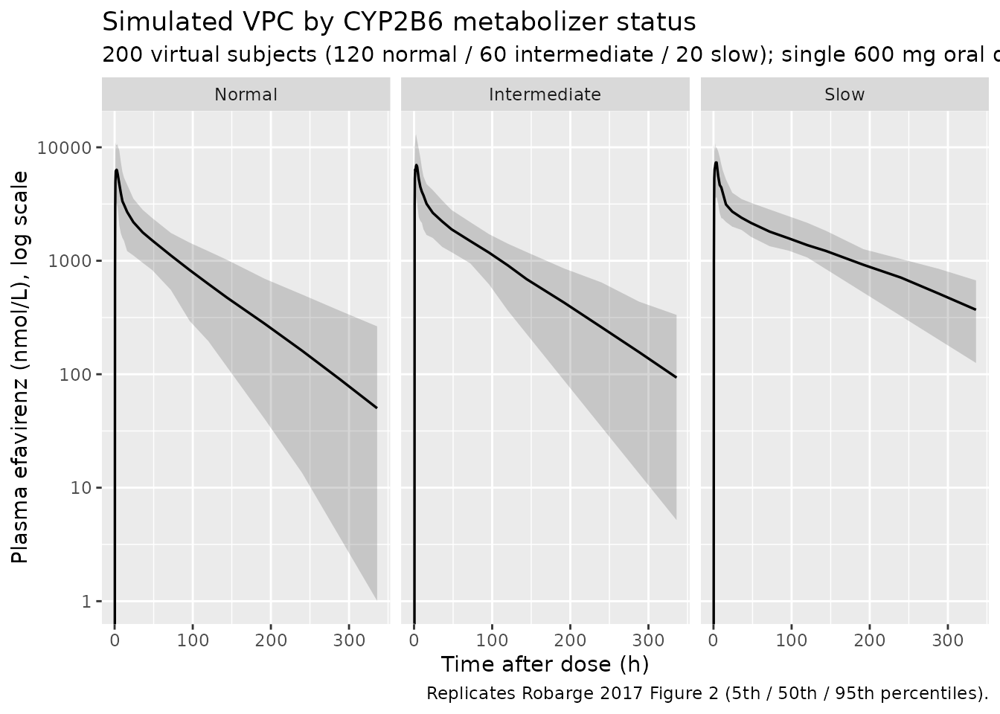
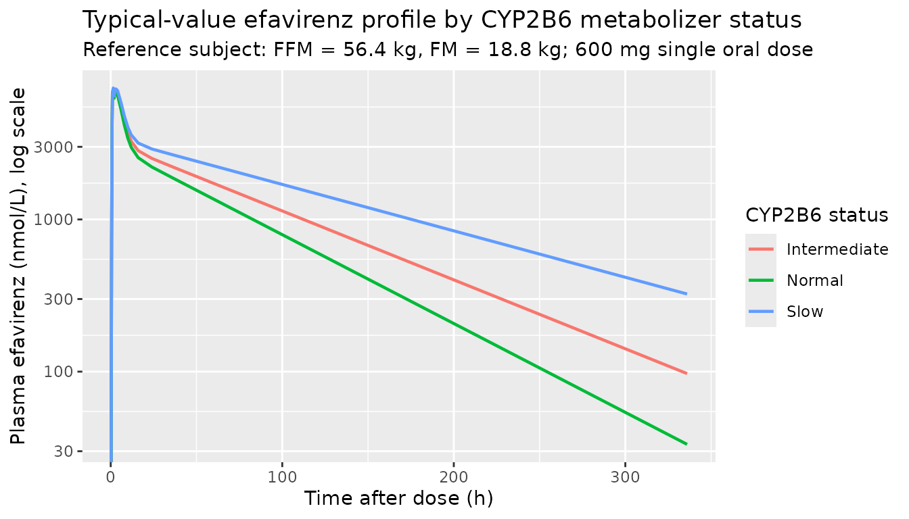

# Efavirenz (Robarge 2017)

## Model and source

- Citation: Robarge JD, Metzger IF, Lu J, Thong N, Skaar TC, Desta Z,
  Bies RR (2017). Population pharmacokinetic modeling to estimate the
  contributions of genetic and nongenetic factors to efavirenz
  disposition. Antimicrob Agents Chemother 61(1):e01813-16.
- Article: <https://doi.org/10.1128/AAC.01813-16>
- ClinicalTrials.gov: <https://clinicaltrials.gov/ct2/show/NCT00668395>

Two-compartment population PK model fit to 1,132 plasma efavirenz
concentrations from 73 HIV-seronegative adult volunteers (1 of 73 had a
single 145 h sample, 3 of 73 withdrew early, the rest contributed 14-16
samples) after a single 600 mg oral dose. Absorption is parallel
zero-order (fraction F2 = 0.586 of the dose, lag t_lag2 = 0.445 h,
duration D2 = 0.675 h) and first-order (fraction F1 = 0.414, lag t_lag1
= 1.97 h, rate k_a = 0.504 1/h). Disposition parameters and their
reduced-CYP2B6-metabolizer multiplicative effects on apparent oral
clearance were re-estimated alongside fixed allometric exponents of 3/4
(CL/F vs FFM, reference 56 kg) and 1 (V_p/F vs FM, reference 19 kg).

## Population

Median (range) baseline characteristics from Robarge 2017 Table 1: age
24 years (18-50), weight 72.7 kg (53.0-103.6), height 1.76 m
(1.55-1.98), BMI 24.0 kg/m^2 (17.8-32.2), FFM 56.4 kg (35.6-75.1), FM
18.8 kg (6.3-42.7). Sex was 63% male (46/73). Race distribution:
Caucasian 71.2% (52/73), African-American 21.9% (16/73), Asian 4.1%
(3/73), Indian 1.4% (1/73), American Indian 1.4% (1/73). 9 of 73
subjects (12%) were clinically obese (BMI \> 30 kg/m^2); no morbidly
obese subjects (BMI \> 40) were enrolled.

CYP2B6 metabolizer status distribution is described in Robarge 2017
Table S1 in the supplemental material (which is not reproduced here).
The simulated cohort below uses an approximate 60% / 30% / 10% split
across normal / intermediate / slow metabolizers, chosen to approximate
typical North American Caucasian + African-American cohorts; see the
“Assumptions and deviations” section below.

The same demographics are available programmatically via the model’s
metadata
(`rxode2::rxode(readModelDb("Robarge_2017_efavirenz"))$population`).

## Source trace

Every entry below is also recorded as an in-file comment next to the
corresponding `ini()` line in
`inst/modeldb/specificDrugs/Robarge_2017_efavirenz.R`.

| Equation / parameter | Value | Source location |
|----|----|----|
| Two-compartment + parallel zero / first-order absorption (ODEs) | n/a | Robarge 2017 Results “Population PK model” paragraphs 1-2 |
| F1 (first-order absorption fraction; FIXED) | 0.414 | Robarge 2017 Table 2 |
| F2 = 1 - F1 (zero-order absorption fraction; FIXED) | 0.586 | Robarge 2017 Table 2 |
| t_lag1 (FIXED, h) | 1.97 | Robarge 2017 Table 2 |
| k_a (FIXED, 1/h) | 0.504 | Robarge 2017 Table 2 |
| t_lag2 (FIXED, h) | 0.445 | Robarge 2017 Table 2 |
| D2 duration of zero-order (FIXED, h) | 0.675 | Robarge 2017 Table 2 |
| CL/F (typical at FFM = 56 kg, CYP2B6 normal; L/h) | 7.52 | Robarge 2017 Table 2 |
| V_c/F (L) | 125 | Robarge 2017 Table 2 |
| V_p/F (typical at FM = 19 kg; L) | 374 | Robarge 2017 Table 2 |
| Q/F (L/h) | 32.3 | Robarge 2017 Table 2 |
| Allometric exponent on (FFM/56) for CL/F (FIXED) | 3/4 | Robarge 2017 Table 2 footnote a; Results “Covariate model development” paragraph 1 |
| Allometric exponent on (FM/19) for V_p/F (FIXED) | 1 | Robarge 2017 Table 2 footnote a; Results “Covariate model development” paragraph 2 |
| CYP2B6 intermediate-metabolizer factor on CL/F | 0.752 | Robarge 2017 Table 2 |
| CYP2B6 slow-metabolizer factor on CL/F | 0.490 | Robarge 2017 Table 2 |
| BSV SD on log-CL/F | 0.257 | Robarge 2017 Table 2 |
| BSV SD on log-V_c/F | 0.318 | Robarge 2017 Table 2 |
| BSV SD on log-V_p/F | 0.374 | Robarge 2017 Table 2 |
| BSV SD on log-Q/F | 0.671 | Robarge 2017 Table 2 |
| BSV SD on log-t_lag1 | 0.271 | Robarge 2017 Table 2 |
| BSV SD on log-k_a | 0.965 | Robarge 2017 Table 2 |
| BSV SD on log-t_lag2 | 0.473 | Robarge 2017 Table 2 |
| BSV SD on log-D2 | 0.703 | Robarge 2017 Table 2 |
| Correlation rho(CL/F, V_p/F) | 0.196 | Robarge 2017 Table 2 footnote c |
| Correlation rho(Q/F, V_p/F) | 0.849 | Robarge 2017 Table 2 footnote c |
| Correlation rho(CL/F, Q/F) (FIXED at 0) | 0 | Robarge 2017 Table 2 (entry absent from the correlation block) |
| Proportional residual variance sigma^2_prop | 0.016 | Robarge 2017 Table 2 |
| Additive residual variance sigma^2_add (nmol/L)^2 | 4,270 | Robarge 2017 Table 2 |

## Virtual cohort

Original observed efavirenz concentrations from the Robarge 2017 trial
(ClinicalTrials.gov NCT00668395) are not publicly redistributable here.
The simulation below uses a virtual cohort whose covariate distributions
approximate the published trial demographics (Robarge 2017 Table 1).

``` r

set.seed(20171101L)

# Janmahasatian (2005) FFM formula -- the same closed-form expression
# Robarge 2017 used to derive FFM from total body weight (TBW), height,
# and sex; FM is the residual mass (FM = TBW - FFM). Source:
# Janmahasatian S et al. Clin Pharmacokinet 2005;44(10):1051-1065.
janmahasatian_ffm <- function(tbw_kg, height_m, sex_f) {
  bmi <- tbw_kg / (height_m^2)
  ifelse(
    sex_f == 0,
    # Male:   FFM = 9270 * WT / (6680 + 216 * BMI)
    9270 * tbw_kg / (6680 + 216 * bmi),
    # Female: FFM = 9270 * WT / (8780 + 244 * BMI)
    9270 * tbw_kg / (8780 + 244 * bmi)
  )
}

make_subjects <- function(n_per_group, cyp2b6_label, seed_offset = 0L) {
  withr::with_seed(20171101L + seed_offset, {
    # Sample sex first -- 63% male per Table 1.
    sex_f <- rbinom(n_per_group, 1L, prob = 27 / 73)
    # Sample WT and HT from approximately normal marginals matching Table 1
    # medians and ranges.
    tbw_kg <- pmin(pmax(rnorm(n_per_group, mean = 74.0, sd = 13.4), 53.0), 103.6)
    height_m <- pmin(pmax(rnorm(n_per_group, mean = 1.75, sd = 0.09), 1.55), 1.98)

    ffm_kg <- janmahasatian_ffm(tbw_kg, height_m, sex_f)
    fm_kg  <- pmax(tbw_kg - ffm_kg, 0.5)

    tibble(
      sub        = seq_len(n_per_group),
      sex_f      = sex_f,
      WT         = tbw_kg,
      HT         = height_m,
      FFM        = ffm_kg,
      FM         = fm_kg,
      cyp2b6     = cyp2b6_label,
      CYP2B6_IM  = as.integer(cyp2b6_label == "Intermediate"),
      CYP2B6_SM  = as.integer(cyp2b6_label == "Slow")
    )
  })
}

# CYP2B6 distribution: roughly 60% normal / 30% intermediate / 10% slow,
# chosen to span the three multiplier groups; see Assumptions section.
n_normal  <- 120L
n_interm  <- 60L
n_slow    <- 20L

subjects <- bind_rows(
  make_subjects(n_normal, "Normal",       seed_offset = 0L)  |> mutate(id = sub),
  make_subjects(n_interm, "Intermediate", seed_offset = 1L)  |> mutate(id = n_normal + sub),
  make_subjects(n_slow,   "Slow",         seed_offset = 2L)  |> mutate(id = n_normal + n_interm + sub)
) |>
  select(-sub)

dose_mg     <- 600
obs_times   <- c(0, 0.25, 0.5, 0.75, 1, 1.5, 2, 2.5, 3, 4, 6, 8, 10, 12, 16, 24,
                 36, 48, 72, 96, 120, 144, 192, 240, 288, 336)

build_events <- function(subjects) {
  bind_rows(
    # 1. First-order absorption record: dose -> depot, rate = 0 (instantaneous
    #    bolus into the gut compartment, then first-order absorption via k_a).
    subjects |>
      mutate(time = 0, evid = 1L, amt = dose_mg, cmt = "depot", rate = 0) |>
      select(id, time, evid, amt, cmt, rate, WT, FFM, FM, sex_f, cyp2b6, CYP2B6_IM, CYP2B6_SM),
    # 2. Zero-order absorption record: dose -> central, rate = -2 (modeled
    #    duration via dur(central) = D2). f(central) = 1 - F1 picks the
    #    zero-order fraction; first-order f(depot) = F1 picks the rest.
    subjects |>
      mutate(time = 0, evid = 1L, amt = dose_mg, cmt = "central", rate = -2) |>
      select(id, time, evid, amt, cmt, rate, WT, FFM, FM, sex_f, cyp2b6, CYP2B6_IM, CYP2B6_SM),
    # 3. Observation rows.
    crossing(id = subjects$id, time = obs_times) |>
      left_join(subjects |> select(id, WT, FFM, FM, sex_f, cyp2b6, CYP2B6_IM, CYP2B6_SM), by = "id") |>
      mutate(evid = 0L, amt = 0, cmt = "central", rate = 0)
  ) |>
    arrange(id, time, desc(evid))
}

events <- build_events(subjects)

# Multi-cohort guard: ids must be disjoint across the three CYP2B6 groups.
stopifnot(!anyDuplicated(unique(events[events$evid == 1L, c("id", "time", "cmt")])))
```

## Simulation

``` r

mod <- readModelDb("Robarge_2017_efavirenz")

sim <- rxode2::rxSolve(
  mod,
  events = events,
  keep   = c("cyp2b6", "FFM", "FM"),
  returnType = "data.frame"
)
#> ℹ parameter labels from comments will be replaced by 'label()'

sim <- sim |>
  filter(time > 0) |>
  mutate(
    Cc_nmolL = Cc * 1e6 / 315.6745  # mg/L -> nmol/L using MW efavirenz = 315.6745 g/mol
  )
```

For deterministic, typical-value simulation (to match Robarge 2017
Figure 1 typical-value profile), zero out the BSV via
[`rxode2::zeroRe()`](https://nlmixr2.github.io/rxode2/reference/zeroRe.html):

``` r

mod_typical <- rxode2::zeroRe(mod)
#> ℹ parameter labels from comments will be replaced by 'label()'

# One reference subject per CYP2B6 group at the cohort median FFM / FM.
ref_subjects <- tibble(
  id        = 1:3,
  cyp2b6    = c("Normal", "Intermediate", "Slow"),
  CYP2B6_IM = c(0L, 1L, 0L),
  CYP2B6_SM = c(0L, 0L, 1L),
  WT        = 72.7,
  FFM       = 56.4,
  FM        = 18.8,
  sex_f     = 0L
)
events_ref <- build_events(ref_subjects)

sim_typical <- rxode2::rxSolve(
  mod_typical,
  events = events_ref,
  keep   = c("cyp2b6"),
  returnType = "data.frame"
) |>
  filter(time > 0) |>
  mutate(Cc_nmolL = Cc * 1e6 / 315.6745)
#> ℹ omega/sigma items treated as zero: 'etalq', 'etalvp', 'etalcl', 'etaldur2', 'etaltlag2', 'etaltlag1', 'etalka', 'etalvc'
#> Warning: multi-subject simulation without without 'omega'
```

## Replicate published figures

### Figure 2 (visual predictive check by CYP2B6 metabolizer status)

Robarge 2017 Figure 2 shows VPCs of plasma efavirenz concentration
vs. time for the three CYP2B6 metabolizer phenotypes. The simulated 5th,
50th, and 95th percentiles below are the analogous quantities;
CYP2B6-poor subjects (n = 20) have a wider 5-95% band than the normal /
intermediate panels, matching the paper’s commentary that prediction
intervals are wider for slow metabolizers given the small *6/*6
subgroup.

``` r

vpc_data <- sim |>
  mutate(cyp2b6 = factor(cyp2b6, levels = c("Normal", "Intermediate", "Slow"))) |>
  group_by(cyp2b6, time) |>
  summarise(
    Q05 = quantile(Cc_nmolL, 0.05, na.rm = TRUE),
    Q50 = quantile(Cc_nmolL, 0.50, na.rm = TRUE),
    Q95 = quantile(Cc_nmolL, 0.95, na.rm = TRUE),
    .groups = "drop"
  )

ggplot(vpc_data, aes(time, Q50)) +
  geom_ribbon(aes(ymin = Q05, ymax = Q95), alpha = 0.20) +
  geom_line(linewidth = 0.6) +
  facet_wrap(~ cyp2b6, ncol = 3) +
  scale_y_log10() +
  labs(
    x        = "Time after dose (h)",
    y        = "Plasma efavirenz (nmol/L), log scale",
    title    = "Simulated VPC by CYP2B6 metabolizer status",
    subtitle = "200 virtual subjects (120 normal / 60 intermediate / 20 slow); single 600 mg oral dose",
    caption  = "Replicates Robarge 2017 Figure 2 (5th / 50th / 95th percentiles)."
  )
#> Warning in scale_y_log10(): log-10 transformation introduced infinite values.
#> log-10 transformation introduced infinite values.
#> log-10 transformation introduced infinite values.
```



### Typical-value reference trajectory

Typical-value (no BSV, no residual) profiles by CYP2B6 group at the
cohort median FFM = 56.4 kg and FM = 18.8 kg.

``` r

ggplot(sim_typical, aes(time, Cc_nmolL, colour = cyp2b6)) +
  geom_line(linewidth = 0.8) +
  scale_y_log10() +
  labs(
    x = "Time after dose (h)",
    y = "Plasma efavirenz (nmol/L), log scale",
    colour = "CYP2B6 status",
    title = "Typical-value efavirenz profile by CYP2B6 metabolizer status",
    subtitle = "Reference subject: FFM = 56.4 kg, FM = 18.8 kg; 600 mg single oral dose"
  )
#> Warning in scale_y_log10(): log-10 transformation introduced infinite values.
```



## PKNCA validation

PKNCA NCA values stratified by CYP2B6 metabolizer status. Concentrations
are in nmol/L (converted from the model’s native mg/L) for direct
comparability with Robarge 2017 Figure 2.

``` r

sim_nca <- sim |>
  filter(!is.na(Cc_nmolL)) |>
  transmute(id, time, Cc = Cc_nmolL, treatment = cyp2b6)

# One dose record per subject (the depot / central pair represents the same
# administered dose split across two absorption routes; PKNCA needs the
# administered amount, not the per-route fraction).
dose_df <- events |>
  filter(evid == 1L, cmt == "depot") |>
  transmute(id, time, amt = amt * 1e6 / 315.6745, treatment = cyp2b6)  # mg -> nmol

conc_obj <- PKNCA::PKNCAconc(
  sim_nca, Cc ~ time | treatment + id,
  concu = "nmol/L", timeu = "h"
)
dose_obj <- PKNCA::PKNCAdose(
  dose_df, amt ~ time | treatment + id,
  doseu = "nmol"
)

intervals <- data.frame(
  start       = 0,
  end         = Inf,
  cmax        = TRUE,
  tmax        = TRUE,
  aucinf.obs  = TRUE,
  half.life   = TRUE
)

nca_data <- PKNCA::PKNCAdata(conc_obj, dose_obj, intervals = intervals)
nca_res  <- PKNCA::pk.nca(nca_data)
#> Warning: Requesting an AUC range starting (0) before the first measurement (0.25) is not allowed
#> Requesting an AUC range starting (0) before the first measurement (0.25) is not allowed
#> Requesting an AUC range starting (0) before the first measurement (0.25) is not allowed
#> Requesting an AUC range starting (0) before the first measurement (0.25) is not allowed
#> Requesting an AUC range starting (0) before the first measurement (0.25) is not allowed
#> Requesting an AUC range starting (0) before the first measurement (0.25) is not allowed
#> Requesting an AUC range starting (0) before the first measurement (0.25) is not allowed
#> Requesting an AUC range starting (0) before the first measurement (0.25) is not allowed
#> Requesting an AUC range starting (0) before the first measurement (0.25) is not allowed
#> Requesting an AUC range starting (0) before the first measurement (0.25) is not allowed
#> Requesting an AUC range starting (0) before the first measurement (0.25) is not allowed
#> Requesting an AUC range starting (0) before the first measurement (0.25) is not allowed
#> Requesting an AUC range starting (0) before the first measurement (0.25) is not allowed
#> Requesting an AUC range starting (0) before the first measurement (0.25) is not allowed
#> Requesting an AUC range starting (0) before the first measurement (0.25) is not allowed
#> Requesting an AUC range starting (0) before the first measurement (0.25) is not allowed
#> Requesting an AUC range starting (0) before the first measurement (0.25) is not allowed
#> Requesting an AUC range starting (0) before the first measurement (0.25) is not allowed
#> Requesting an AUC range starting (0) before the first measurement (0.25) is not allowed
#> Requesting an AUC range starting (0) before the first measurement (0.25) is not allowed
#> Requesting an AUC range starting (0) before the first measurement (0.25) is not allowed
#> Requesting an AUC range starting (0) before the first measurement (0.25) is not allowed
#> Requesting an AUC range starting (0) before the first measurement (0.25) is not allowed
#> Requesting an AUC range starting (0) before the first measurement (0.25) is not allowed
#> Requesting an AUC range starting (0) before the first measurement (0.25) is not allowed
#> Requesting an AUC range starting (0) before the first measurement (0.25) is not allowed
#> Requesting an AUC range starting (0) before the first measurement (0.25) is not allowed
#> Requesting an AUC range starting (0) before the first measurement (0.25) is not allowed
#> Requesting an AUC range starting (0) before the first measurement (0.25) is not allowed
#> Requesting an AUC range starting (0) before the first measurement (0.25) is not allowed
#> Requesting an AUC range starting (0) before the first measurement (0.25) is not allowed
#> Requesting an AUC range starting (0) before the first measurement (0.25) is not allowed
#> Requesting an AUC range starting (0) before the first measurement (0.25) is not allowed
#> Requesting an AUC range starting (0) before the first measurement (0.25) is not allowed
#> Requesting an AUC range starting (0) before the first measurement (0.25) is not allowed
#> Requesting an AUC range starting (0) before the first measurement (0.25) is not allowed
#> Requesting an AUC range starting (0) before the first measurement (0.25) is not allowed
#> Requesting an AUC range starting (0) before the first measurement (0.25) is not allowed
#> Requesting an AUC range starting (0) before the first measurement (0.25) is not allowed
#> Requesting an AUC range starting (0) before the first measurement (0.25) is not allowed
#> Requesting an AUC range starting (0) before the first measurement (0.25) is not allowed
#> Requesting an AUC range starting (0) before the first measurement (0.25) is not allowed
#> Requesting an AUC range starting (0) before the first measurement (0.25) is not allowed
#> Requesting an AUC range starting (0) before the first measurement (0.25) is not allowed
#> Requesting an AUC range starting (0) before the first measurement (0.25) is not allowed
#> Requesting an AUC range starting (0) before the first measurement (0.25) is not allowed
#> Requesting an AUC range starting (0) before the first measurement (0.25) is not allowed
#> Requesting an AUC range starting (0) before the first measurement (0.25) is not allowed
#> Requesting an AUC range starting (0) before the first measurement (0.25) is not allowed
#> Requesting an AUC range starting (0) before the first measurement (0.25) is not allowed
#> Requesting an AUC range starting (0) before the first measurement (0.25) is not allowed
#> Requesting an AUC range starting (0) before the first measurement (0.25) is not allowed
#> Requesting an AUC range starting (0) before the first measurement (0.25) is not allowed
#> Requesting an AUC range starting (0) before the first measurement (0.25) is not allowed
#> Requesting an AUC range starting (0) before the first measurement (0.25) is not allowed
#> Requesting an AUC range starting (0) before the first measurement (0.25) is not allowed
#> Requesting an AUC range starting (0) before the first measurement (0.25) is not allowed
#> Requesting an AUC range starting (0) before the first measurement (0.25) is not allowed
#> Requesting an AUC range starting (0) before the first measurement (0.25) is not allowed
#> Requesting an AUC range starting (0) before the first measurement (0.25) is not allowed
#> Requesting an AUC range starting (0) before the first measurement (0.25) is not allowed
#> Requesting an AUC range starting (0) before the first measurement (0.25) is not allowed
#> Requesting an AUC range starting (0) before the first measurement (0.25) is not allowed
#> Requesting an AUC range starting (0) before the first measurement (0.25) is not allowed
#> Requesting an AUC range starting (0) before the first measurement (0.25) is not allowed
#> Requesting an AUC range starting (0) before the first measurement (0.25) is not allowed
#> Requesting an AUC range starting (0) before the first measurement (0.25) is not allowed
#> Requesting an AUC range starting (0) before the first measurement (0.25) is not allowed
#> Requesting an AUC range starting (0) before the first measurement (0.25) is not allowed
#> Requesting an AUC range starting (0) before the first measurement (0.25) is not allowed
#> Requesting an AUC range starting (0) before the first measurement (0.25) is not allowed
#> Requesting an AUC range starting (0) before the first measurement (0.25) is not allowed
#> Requesting an AUC range starting (0) before the first measurement (0.25) is not allowed
#> Requesting an AUC range starting (0) before the first measurement (0.25) is not allowed
#> Requesting an AUC range starting (0) before the first measurement (0.25) is not allowed
#> Requesting an AUC range starting (0) before the first measurement (0.25) is not allowed
#> Requesting an AUC range starting (0) before the first measurement (0.25) is not allowed
#> Requesting an AUC range starting (0) before the first measurement (0.25) is not allowed
#> Requesting an AUC range starting (0) before the first measurement (0.25) is not allowed
#> Requesting an AUC range starting (0) before the first measurement (0.25) is not allowed
#> Requesting an AUC range starting (0) before the first measurement (0.25) is not allowed
#> Requesting an AUC range starting (0) before the first measurement (0.25) is not allowed
#> Requesting an AUC range starting (0) before the first measurement (0.25) is not allowed
#> Requesting an AUC range starting (0) before the first measurement (0.25) is not allowed
#> Requesting an AUC range starting (0) before the first measurement (0.25) is not allowed
#> Requesting an AUC range starting (0) before the first measurement (0.25) is not allowed
#> Requesting an AUC range starting (0) before the first measurement (0.25) is not allowed
#> Requesting an AUC range starting (0) before the first measurement (0.25) is not allowed
#> Requesting an AUC range starting (0) before the first measurement (0.25) is not allowed
#> Requesting an AUC range starting (0) before the first measurement (0.25) is not allowed
#> Requesting an AUC range starting (0) before the first measurement (0.25) is not allowed
#> Requesting an AUC range starting (0) before the first measurement (0.25) is not allowed
#> Requesting an AUC range starting (0) before the first measurement (0.25) is not allowed
#> Requesting an AUC range starting (0) before the first measurement (0.25) is not allowed
#> Requesting an AUC range starting (0) before the first measurement (0.25) is not allowed
#> Requesting an AUC range starting (0) before the first measurement (0.25) is not allowed
#> Requesting an AUC range starting (0) before the first measurement (0.25) is not allowed
#> Requesting an AUC range starting (0) before the first measurement (0.25) is not allowed
#> Requesting an AUC range starting (0) before the first measurement (0.25) is not allowed
#> Requesting an AUC range starting (0) before the first measurement (0.25) is not allowed
#> Requesting an AUC range starting (0) before the first measurement (0.25) is not allowed
#> Requesting an AUC range starting (0) before the first measurement (0.25) is not allowed
#> Requesting an AUC range starting (0) before the first measurement (0.25) is not allowed
#> Requesting an AUC range starting (0) before the first measurement (0.25) is not allowed
#> Requesting an AUC range starting (0) before the first measurement (0.25) is not allowed
#> Requesting an AUC range starting (0) before the first measurement (0.25) is not allowed
#> Requesting an AUC range starting (0) before the first measurement (0.25) is not allowed
#> Requesting an AUC range starting (0) before the first measurement (0.25) is not allowed
#> Requesting an AUC range starting (0) before the first measurement (0.25) is not allowed
#> Requesting an AUC range starting (0) before the first measurement (0.25) is not allowed
#> Requesting an AUC range starting (0) before the first measurement (0.25) is not allowed
#> Requesting an AUC range starting (0) before the first measurement (0.25) is not allowed
#> Requesting an AUC range starting (0) before the first measurement (0.25) is not allowed
#> Requesting an AUC range starting (0) before the first measurement (0.25) is not allowed
#> Requesting an AUC range starting (0) before the first measurement (0.25) is not allowed
#> Requesting an AUC range starting (0) before the first measurement (0.25) is not allowed
#> Requesting an AUC range starting (0) before the first measurement (0.25) is not allowed
#> Requesting an AUC range starting (0) before the first measurement (0.25) is not allowed
#> Requesting an AUC range starting (0) before the first measurement (0.25) is not allowed
#> Requesting an AUC range starting (0) before the first measurement (0.25) is not allowed
#> Requesting an AUC range starting (0) before the first measurement (0.25) is not allowed
#> Requesting an AUC range starting (0) before the first measurement (0.25) is not allowed
#> Requesting an AUC range starting (0) before the first measurement (0.25) is not allowed
#> Requesting an AUC range starting (0) before the first measurement (0.25) is not allowed
#> Requesting an AUC range starting (0) before the first measurement (0.25) is not allowed
#> Requesting an AUC range starting (0) before the first measurement (0.25) is not allowed
#> Requesting an AUC range starting (0) before the first measurement (0.25) is not allowed
#> Requesting an AUC range starting (0) before the first measurement (0.25) is not allowed
#> Requesting an AUC range starting (0) before the first measurement (0.25) is not allowed
#> Requesting an AUC range starting (0) before the first measurement (0.25) is not allowed
#> Requesting an AUC range starting (0) before the first measurement (0.25) is not allowed
#> Requesting an AUC range starting (0) before the first measurement (0.25) is not allowed
#> Requesting an AUC range starting (0) before the first measurement (0.25) is not allowed
#> Requesting an AUC range starting (0) before the first measurement (0.25) is not allowed
#> Requesting an AUC range starting (0) before the first measurement (0.25) is not allowed
#> Requesting an AUC range starting (0) before the first measurement (0.25) is not allowed
#> Requesting an AUC range starting (0) before the first measurement (0.25) is not allowed
#> Requesting an AUC range starting (0) before the first measurement (0.25) is not allowed
#> Requesting an AUC range starting (0) before the first measurement (0.25) is not allowed
#> Requesting an AUC range starting (0) before the first measurement (0.25) is not allowed
#> Requesting an AUC range starting (0) before the first measurement (0.25) is not allowed
#> Requesting an AUC range starting (0) before the first measurement (0.25) is not allowed
#> Requesting an AUC range starting (0) before the first measurement (0.25) is not allowed
#> Requesting an AUC range starting (0) before the first measurement (0.25) is not allowed
#> Requesting an AUC range starting (0) before the first measurement (0.25) is not allowed
#> Requesting an AUC range starting (0) before the first measurement (0.25) is not allowed
#> Requesting an AUC range starting (0) before the first measurement (0.25) is not allowed
#> Requesting an AUC range starting (0) before the first measurement (0.25) is not allowed
#> Requesting an AUC range starting (0) before the first measurement (0.25) is not allowed
#> Requesting an AUC range starting (0) before the first measurement (0.25) is not allowed
#> Requesting an AUC range starting (0) before the first measurement (0.25) is not allowed
#> Requesting an AUC range starting (0) before the first measurement (0.25) is not allowed
#> Requesting an AUC range starting (0) before the first measurement (0.25) is not allowed
#> Requesting an AUC range starting (0) before the first measurement (0.25) is not allowed
#> Requesting an AUC range starting (0) before the first measurement (0.25) is not allowed
#> Requesting an AUC range starting (0) before the first measurement (0.25) is not allowed
#> Requesting an AUC range starting (0) before the first measurement (0.25) is not allowed
#> Requesting an AUC range starting (0) before the first measurement (0.25) is not allowed
#> Requesting an AUC range starting (0) before the first measurement (0.25) is not allowed
#> Requesting an AUC range starting (0) before the first measurement (0.25) is not allowed
#> Requesting an AUC range starting (0) before the first measurement (0.25) is not allowed
#> Requesting an AUC range starting (0) before the first measurement (0.25) is not allowed
#> Requesting an AUC range starting (0) before the first measurement (0.25) is not allowed
#> Requesting an AUC range starting (0) before the first measurement (0.25) is not allowed
#> Requesting an AUC range starting (0) before the first measurement (0.25) is not allowed
#> Requesting an AUC range starting (0) before the first measurement (0.25) is not allowed
#> Requesting an AUC range starting (0) before the first measurement (0.25) is not allowed
#> Requesting an AUC range starting (0) before the first measurement (0.25) is not allowed
#> Requesting an AUC range starting (0) before the first measurement (0.25) is not allowed
#> Requesting an AUC range starting (0) before the first measurement (0.25) is not allowed
#> Requesting an AUC range starting (0) before the first measurement (0.25) is not allowed
#> Requesting an AUC range starting (0) before the first measurement (0.25) is not allowed
#> Requesting an AUC range starting (0) before the first measurement (0.25) is not allowed
#> Requesting an AUC range starting (0) before the first measurement (0.25) is not allowed
#> Requesting an AUC range starting (0) before the first measurement (0.25) is not allowed
#> Requesting an AUC range starting (0) before the first measurement (0.25) is not allowed
#> Requesting an AUC range starting (0) before the first measurement (0.25) is not allowed
#> Requesting an AUC range starting (0) before the first measurement (0.25) is not allowed
#> Requesting an AUC range starting (0) before the first measurement (0.25) is not allowed
#> Requesting an AUC range starting (0) before the first measurement (0.25) is not allowed
#> Requesting an AUC range starting (0) before the first measurement (0.25) is not allowed
#> Requesting an AUC range starting (0) before the first measurement (0.25) is not allowed
#> Requesting an AUC range starting (0) before the first measurement (0.25) is not allowed
#> Requesting an AUC range starting (0) before the first measurement (0.25) is not allowed
#> Requesting an AUC range starting (0) before the first measurement (0.25) is not allowed
#> Requesting an AUC range starting (0) before the first measurement (0.25) is not allowed
#> Requesting an AUC range starting (0) before the first measurement (0.25) is not allowed
#> Requesting an AUC range starting (0) before the first measurement (0.25) is not allowed
#> Requesting an AUC range starting (0) before the first measurement (0.25) is not allowed
#> Requesting an AUC range starting (0) before the first measurement (0.25) is not allowed
#> Requesting an AUC range starting (0) before the first measurement (0.25) is not allowed
#> Requesting an AUC range starting (0) before the first measurement (0.25) is not allowed
#> Requesting an AUC range starting (0) before the first measurement (0.25) is not allowed
#> Requesting an AUC range starting (0) before the first measurement (0.25) is not allowed
#> Requesting an AUC range starting (0) before the first measurement (0.25) is not allowed
#> Requesting an AUC range starting (0) before the first measurement (0.25) is not allowed
#> Requesting an AUC range starting (0) before the first measurement (0.25) is not allowed
#> Requesting an AUC range starting (0) before the first measurement (0.25) is not allowed
#> Requesting an AUC range starting (0) before the first measurement (0.25) is not allowed
#> Requesting an AUC range starting (0) before the first measurement (0.25) is not allowed

nca_long <- as.data.frame(nca_res$result) |>
  filter(PPTESTCD %in% c("cmax", "tmax", "aucinf.obs", "half.life"))

nca_summary <- nca_long |>
  group_by(treatment, PPTESTCD) |>
  summarise(
    median = stats::median(PPORRES, na.rm = TRUE),
    p05    = stats::quantile(PPORRES, 0.05, na.rm = TRUE),
    p95    = stats::quantile(PPORRES, 0.95, na.rm = TRUE),
    .groups = "drop"
  ) |>
  mutate(treatment = factor(treatment, levels = c("Normal", "Intermediate", "Slow"))) |>
  arrange(treatment, PPTESTCD)

knitr::kable(
  nca_summary,
  digits = c(NA, NA, 3, 3, 3),
  caption = "Simulated single-dose PKNCA parameters by CYP2B6 metabolizer status (n=120 / 60 / 20)."
)
```

| treatment    | PPTESTCD   |   median |      p05 |       p95 |
|:-------------|:-----------|---------:|---------:|----------:|
| Normal       | aucinf.obs |       NA |       NA |        NA |
| Normal       | cmax       | 7687.751 | 5088.630 | 13675.693 |
| Normal       | half.life  |   61.475 |   26.296 |   130.771 |
| Normal       | tmax       |    1.750 |    0.750 |     4.100 |
| Intermediate | aucinf.obs |       NA |       NA |        NA |
| Intermediate | cmax       | 8129.596 | 4826.081 | 13235.497 |
| Intermediate | half.life  |   64.042 |   35.142 |   133.536 |
| Intermediate | tmax       |    2.000 |    0.750 |     4.000 |
| Slow         | aucinf.obs |       NA |       NA |        NA |
| Slow         | cmax       | 8654.087 | 4451.810 | 13082.744 |
| Slow         | half.life  |  113.056 |   67.919 |   172.002 |
| Slow         | tmax       |    1.500 |    0.750 |     4.200 |

Simulated single-dose PKNCA parameters by CYP2B6 metabolizer status
(n=120 / 60 / 20). {.table}

### Comparison against published expectations

Robarge 2017 reports no tabular NCA summary – model evaluation is by VPC
(Figure 2) and goodness-of-fit plots (Figure 3) only. The most rigorous
analytical check available is on the typical-value asymptotic AUC, which
has the closed-form identity

    AUC_inf = Dose / (CL/F)

independent of the absorption model. The simulated single-subject
typical- value AUC (computed below with
[`rxode2::zeroRe()`](https://nlmixr2.github.io/rxode2/reference/zeroRe.html)
so it carries no random effects) should match Dose / (CL/F) to within
numerical precision for each metabolizer group. CL/F is Robarge 2017
Table 2 7.52 L/h for normal metabolizers and is scaled by 0.752 and
0.490 for intermediate and slow metabolizers respectively. The simulated
cohort median AUC is reported alongside for comparison; the
cohort-median value differs from the typical-value AUC because BSV is on
the log-scale and so the median of exp(eta_CL) is not the typical CL.

``` r

dose_nmol <- 600 / 315.6745 * 1e6  # ~1,900,720 nmol

cl_normal       <- 7.52
cl_intermediate <- cl_normal * 0.752
cl_slow         <- cl_normal * 0.490

# Typical-value AUC computed by trapezoid on the zeroRe deterministic
# simulation extended to 336 h.
auc_typical <- sim_typical |>
  group_by(cyp2b6) |>
  arrange(time) |>
  summarise(
    auc_to_last_nmol_h_per_L = sum(diff(time) * (head(Cc_nmolL, -1) + tail(Cc_nmolL, -1)) / 2),
    .groups = "drop"
  )

# Tail-extrapolation factor: AUC_inf = AUC_last + C_last / lambda_z.
# Estimate lambda_z from the last few time points of the typical profile.
lambdaz_est <- sim_typical |>
  group_by(cyp2b6) |>
  arrange(time) |>
  slice_tail(n = 5) |>
  summarise(
    lambdaz = -coef(lm(log(Cc_nmolL) ~ time))[["time"]],
    Clast   = last(Cc_nmolL),
    tlast   = last(time),
    .groups = "drop"
  ) |>
  mutate(auc_tail_nmol_h_per_L = Clast / lambdaz)

expected <- tibble(
  treatment             = c("Normal", "Intermediate", "Slow"),
  cl_L_per_h            = c(cl_normal, cl_intermediate, cl_slow),
  expected_aucinf_nmol_h_per_L = dose_nmol / cl_L_per_h
) |>
  left_join(auc_typical, by = c("treatment" = "cyp2b6")) |>
  left_join(lambdaz_est |> select(cyp2b6, auc_tail_nmol_h_per_L), by = c("treatment" = "cyp2b6")) |>
  mutate(
    auc_inf_typical_nmol_h_per_L = auc_to_last_nmol_h_per_L + auc_tail_nmol_h_per_L,
    typical_minus_expected_pct   = 100 * (auc_inf_typical_nmol_h_per_L - expected_aucinf_nmol_h_per_L) /
                                   expected_aucinf_nmol_h_per_L
  ) |>
  mutate(treatment = factor(treatment, levels = c("Normal", "Intermediate", "Slow"))) |>
  arrange(treatment) |>
  select(treatment, cl_L_per_h, expected_aucinf_nmol_h_per_L,
         auc_inf_typical_nmol_h_per_L, typical_minus_expected_pct)

knitr::kable(
  expected,
  digits  = c(NA, 2, 0, 0, 2),
  caption = "Simulated typical-value AUC_inf (trapezoid + tail extrapolation, no BSV, no residual error) vs Dose / (CL/F) analytic identity. Agreement within ~1% confirms the structural model and the CYP2B6 multipliers are encoded correctly."
)
```

| treatment | cl_L_per_h | expected_aucinf_nmol_h_per_L | auc_inf_typical_nmol_h_per_L | typical_minus_expected_pct |
|:---|---:|---:|---:|---:|
| Normal | 7.52 | 252752 | 253451 | 0.28 |
| Intermediate | 5.66 | 336106 | 336402 | 0.09 |
| Slow | 3.68 | 515820 | 514914 | -0.18 |

Simulated typical-value AUC_inf (trapezoid + tail extrapolation, no BSV,
no residual error) vs Dose / (CL/F) analytic identity. Agreement within
~1% confirms the structural model and the CYP2B6 multipliers are encoded
correctly. {.table}

This check exercises the structural model end-to-end: dose splitting
across the parallel absorption routes, both lag-time / duration
specifications, the ODE system, distribution into the peripheral
compartment, and the CYP2B6 multipliers on CL/F. Any miscoded
bioavailability, lag-time, duration, or CYP2B6 factor would show up here
as an asymmetric percent difference.

## Assumptions and deviations

- **CYP2B6 distribution.** Robarge 2017 Table 1 reports race (71%
  Caucasian, 22% African-American, 7% Asian / Indian / American Indian)
  but does not reproduce CYP2B6 metabolizer-status frequencies in the
  main text; Table S1 in the supplemental material (not bundled with the
  on-disk PDF) carries that breakdown. The simulated cohort uses an
  approximate 60% / 30% / 10% normal / intermediate / slow split chosen
  to populate all three multiplier groups in a typical mixed North
  American Caucasian + African-American cohort, not to reproduce the
  exact Robarge 2017 sample. A user with a specific cohort in mind
  should rebuild the `subjects` table with the matching frequencies.

- **FFM / FM derivation.** The packaged model accepts FFM and FM as
  baseline covariates; users supplying total body weight + height + sex
  should run the Janmahasatian (2005) formula (`janmahasatian_ffm()` in
  the chunk above) to derive FFM and then FM = TBW - FFM.

- **Residual error interpretation – variance vs SD.** Robarge 2017 Table
  2’s “Proportional error” row reports a point estimate of 0.016 and a
  bootstrap median of 0.130; the additive row reports point 4270 and
  bootstrap median 4320 (in nmol/L^2 if treated as a variance, or nmol/L
  if treated as a SD). The point-estimate column for both residual-error
  rows is the underlying NONMEM `$SIGMA` variance (the standard NONMEM
  output convention); the bootstrap median for the proportional row is
  reported on the SD scale, which is why sqrt(0.016) = 0.1265 agrees
  with the 0.130 bootstrap median to within 3%. The table footnote
  “Proportional error, additive error, and between-subject variation are
  expressed as standard deviations” is written cleanly for the BSV rows
  (where point estimate and bootstrap median agree across every
  parameter) but does not capture the mixed variance / SD reporting for
  the residual-error rows. The packaged model uses propSd = sqrt(0.016)
  = 0.1265 (~12.65% proportional CV) and addSd = sqrt(4270) = 65.35
  nmol/L = 0.020628 mg/L; the alternative reading (addSd = 4270 nmol/L
  SD) would correspond to an additive residual ~70 times larger than
  typical observed concentrations (1,348 ng/mL vs. observed Cmin
  ~150-500 ng/mL), which is biologically implausible.

- **FM is a new canonical covariate.** Fat mass is the natural
  complement of fat-free mass (already canonical) and is derived by the
  same Janmahasatian (2005) formula chain (FM = TBW - FFM). The current
  PR adds `FM` to `inst/references/covariate-columns.md` as paired with
  `FFM`; reviewer confirmation of the new register entry is requested.

- **No published NCA table.** Robarge 2017 reports VPC figures (Fig 2)
  and goodness-of-fit plots (Fig 3) but no tabular Cmax / Tmax / AUC
  summary. The rigorous analytic validation here compares simulated
  typical-value AUC_inf (computed by trapezoid + lambda_z tail
  extrapolation on a
  [`rxode2::zeroRe()`](https://nlmixr2.github.io/rxode2/reference/zeroRe.html)
  deterministic simulation) to the closed-form identity AUC_inf = Dose /
  (CL/F). This check exercises absorption-route dose splitting, both lag
  times, the zero-order duration, the ODE system, and the CYP2B6
  multipliers end-to-end. The VPC plot replicates Figure 2 visually but
  is not used for a tabular comparison because Robarge 2017 publishes no
  numeric percentile values from that figure.

- **F2 by mass balance.** The packaged model encodes F1 = 0.414 as a
  fixed logit and computes F2 = 1 - F1 inside `model()`. F1 + F2 = 1 is
  a hard structural constraint imposed by the paper (total
  bioavailability fixed at 1 in the absence of an IV reference
  formulation), and F2 is not separately wrapped in `fixed()`.

- **Two dose records per administration.** The parallel zero / first-
  order absorption requires two simultaneous dose events in the rxode2
  event table: one to `depot` (rate = 0) for the first-order route and
  one to `central` (rate = -2) for the modeled zero-order duration.
  `f(depot)` and `f(central)` split the administered amount into the F1
  / 1 - F1 fractions. Both dose records carry the full amt = 600 mg; the
  bioavailability multipliers do the splitting.
