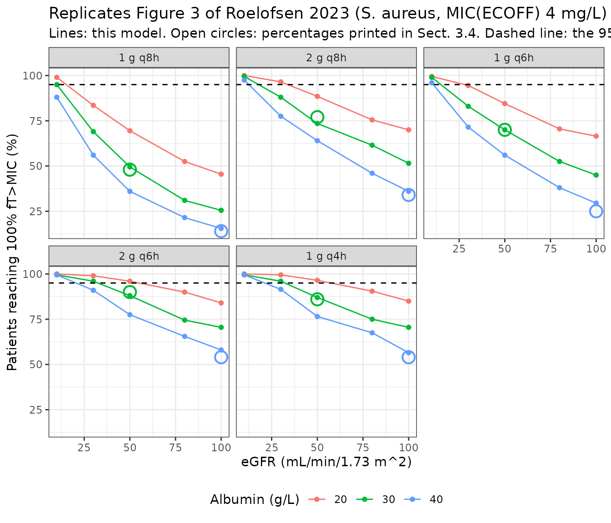
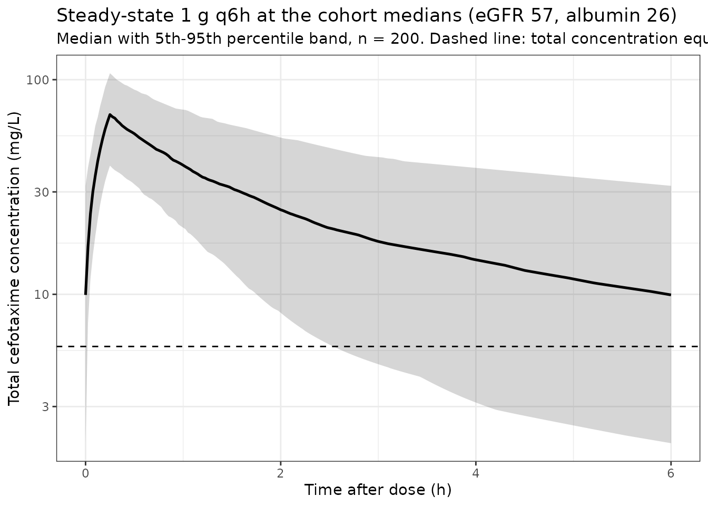

# Cefotaxime (Roelofsen 2023)

## Model and source

- Citation: Roelofsen EE, Abdulla A, Muller AE, Endeman H, Gommers D,
  Dijkstra A, Hunfeld NGM, de Winter BCM, Koch BCP. Dose optimization of
  cefotaxime as pre-emptive treatment in critically ill adult patients:
  A population pharmacokinetic study. Br J Clin Pharmacol.
  2023;89(2):705-713. <doi:10.1111/bcp.15487>
- Description: Two-compartment intravenous population PK model for
  cefotaxime given as pre-emptive treatment (selective digestive
  decontamination) in critically ill adult ICU patients (Roelofsen
  2023). Clearance scales as a power function of CKD-EPI estimated
  glomerular filtration rate (exponent 0.477, reference 57 mL/min/1.73
  m^2) and of serum albumin (exponent 0.640, reference 26 g/L); together
  the two covariates explain 48% of the between-subject variability in
  clearance. Between-subject variability is carried on clearance,
  central volume and intercompartmental clearance, and residual
  variability is a combined additive-plus-proportional error model.
- Article: <https://doi.org/10.1111/bcp.15487>
- Supplement (S1 NONMEM control stream, S2 NPDE figure):
  <https://www.ncbi.nlm.nih.gov/pmc/articles/PMC10087439/>

``` r

mod <- rxode2::rxode(readModelDb("Roelofsen_2023_cefotaxime"))
#> ℹ parameter labels from comments will be replaced by 'label()'
mod
#>  ── rxode2-based free-form 2-cmt ODE model ────────────────────────────────────── 
#>  ── Initalization: ──  
#> Fixed Effects ($theta): 
#>       lcl       lvc       lvp        lq e_crcl_cl  e_alb_cl     addSd    propSd 
#>  1.957274  2.753661  3.218876  1.570697  0.477000  0.640000  0.617000  0.191000 
#> 
#> Omega ($omega): 
#>          etalcl   etalvc    etalq
#> etalcl 0.253009 0.000000 0.000000
#> etalvc 0.000000 0.121801 0.000000
#> etalq  0.000000 0.000000 0.848241
#> attr(,"lotriLabels")
#> [1] "0.503^2; Roelofsen 2023 Table 2 final model: variability on CL 50.3% (RSE 11.8%, shrinkage 2.2%)" 
#> [2] "0.349^2; Roelofsen 2023 Table 2 final model: variability on V1 34.9% (RSE 16.1%, shrinkage 13.3%)"
#> [3] "0.921^2; Roelofsen 2023 Table 2 final model: variability on Q  92.1% (RSE 13.8%, shrinkage 17.3%)"
#> attr(,"lotriFix")
#>        etalcl etalvc etalq
#> etalcl  FALSE  FALSE FALSE
#> etalvc  FALSE  FALSE FALSE
#> etalq   FALSE  FALSE FALSE
#> 
#> States ($state or $stateDf): 
#>   Compartment Number Compartment Name
#> 1                  1          central
#> 2                  2      peripheral1
#>  ── μ-referencing ($muRefTable): ──  
#>   theta    eta level
#> 1   lcl etalcl    id
#> 2   lvc etalvc    id
#> 3    lq  etalq    id
#> 
#>  ── Model (Normalized Syntax): ── 
#> function() {
#>     compartmentData <- list(central = list(analyte = "cefotaxime", 
#>         units = "mg", specimen = "plasma", verified = TRUE), 
#>         peripheral1 = list(analyte = "cefotaxime", units = "mg", 
#>             specimen = "plasma", verified = FALSE))
#>     covariateData <- list(CRCL = list(description = "Estimated glomerular filtration rate calculated with the Chronic Kidney Disease Epidemiology Collaboration (CKD-EPI) equation, BSA-normalized", 
#>         units = "mL/min/1.73 m^2", type = "continuous", reference_category = NULL, 
#>         notes = "Roelofsen 2023 Sect. 2.3 names the CKD-EPI equation as the estimating formula. Table 1 reports the cohort median 57 mL/min/1.73 m^2 (range 4-347), and 57 is exactly the normalizing constant printed in the Sect. 3.2 clearance equation, consistent with Sect. 2.6 ('Continuous covariates were normalized to the population median'). The cohort spans severe renal impairment through augmented renal clearance. One patient had an eGFR above 300 mL/min/1.73 m^2; the Discussion reports that capping that subject at 141 (the second-highest value) did not markedly change the estimates. The Sect. 2.7 Monte Carlo simulations evaluated only 10, 30, 50, 80 and 100 mL/min/1.73 m^2, explicitly to avoid extrapolating beyond the range in which the covariate predominantly occurred. Stored under canonical CRCL, which covers BSA-normalized creatinine-based GFR estimates; the assay form here is the creatinine-based CKD-EPI estimate. Note that the paper's abstract glosses eGFR as '(creatinine clearance)', but Sect. 2.3 is the authority and specifies CKD-EPI.", 
#>         source_name = "eGFR"), ALB = list(description = "Serum albumin concentration", 
#>         units = "g/L", type = "continuous", reference_category = NULL, 
#>         notes = "Roelofsen 2023 Table 1 reports the cohort median 26 g/L (range 11-47), and 26 is exactly the normalizing constant printed in the Sect. 3.2 clearance equation. The paper reports albumin in SI g/L, which is already the canonical unit, so no conversion is applied in model(). The effect is POSITIVE (higher albumin gives higher clearance), which the Discussion notes is the opposite of the direction expected from protein-binding displacement for a drug with only ~30% protein binding; the authors' preferred interpretation is that higher albumin marks less severe illness and therefore fewer physiological changes affecting PK, while noting that SOFA and APACHE II scores did not themselves reach significance on clearance. The Sect. 2.7 simulations evaluated only 20, 30 and 40 g/L, to avoid extrapolating beyond the range in which the covariate predominantly occurred.", 
#>         source_name = "albumin"))
#>     covariatesDataExcluded <- list(AGE = list(description = "Subject age", 
#>         units = "years", type = "continuous", reference_category = NULL, 
#>         notes = "Screened per Sect. 2.3/2.6; not retained. Table 1 median 64 years (range 23-85).", 
#>         source_name = "AGE"), SEXF = list(description = "Female sex indicator", 
#>         units = "(binary)", type = "binary", reference_category = "male", 
#>         notes = "Screened per Sect. 2.3/2.6 (supplementary control stream column `GEN`); not retained. Table 1 reports 57 male / 35 female.", 
#>         source_name = "GEN"), WT = list(description = "Body weight", 
#>         units = "kg", type = "continuous", reference_category = NULL, 
#>         notes = "Screened per Sect. 2.3/2.6 (supplementary control stream column `WGT`); not retained. Table 1 median 76 kg (range 45-150). The final model therefore carries NO body-size term, so clearance and volumes are absolute values for a typical ICU adult rather than weight-normalized.", 
#>         source_name = "WGT"), BMI = list(description = "Body mass index", 
#>         units = "kg/m^2", type = "continuous", reference_category = NULL, 
#>         notes = "Screened per Sect. 2.6 (supplementary control stream column `BMI`); not retained. Table 1 median 26 kg/m^2 (range 17.8-46.3).", 
#>         source_name = "BMI"), CREAT = list(description = "Serum creatinine", 
#>         units = "umol/L", type = "continuous", reference_category = NULL, 
#>         notes = "Screened per Sect. 2.3/2.6 (supplementary control stream column `CRE`); not retained as a standalone covariate, the CKD-EPI eGFR built from it having entered instead. Table 1 median 98 umol/L (range 5-913).", 
#>         source_name = "CRE"), UREA = list(description = "Serum urea", 
#>         units = "mmol/L", type = "continuous", reference_category = NULL, 
#>         notes = "Screened per Sect. 2.3/2.6 (supplementary control stream column `URE`); not retained. No summary value is tabulated.", 
#>         source_name = "URE"), CRP = list(description = "C-reactive protein", 
#>         units = "mg/L", type = "continuous", reference_category = NULL, 
#>         notes = "Screened per Sect. 2.3/2.6; not retained. Table 1 median 127 mg/L (range 0-488).", 
#>         source_name = "CRP"), WBC = list(description = "White blood cell (leucocyte) count", 
#>         units = "10^9 cells/L", type = "continuous", reference_category = NULL, 
#>         notes = "Screened per Sect. 2.3/2.6; not retained. Table 1 median 13 x 10^9 cells/L (range 0.9-100).", 
#>         source_name = "WBC"), TEMP = list(description = "Body temperature", 
#>         units = "degC", type = "continuous", reference_category = NULL, 
#>         notes = "Screened per Sect. 2.3/2.6; not retained. No summary value is tabulated.", 
#>         source_name = "TEMP"), SOFA = list(description = "Sequential Organ Failure Assessment score", 
#>         units = "(score)", type = "continuous", reference_category = NULL, 
#>         notes = "Screened per Sect. 2.3/2.6; not retained. The Discussion states explicitly that SOFA showed NO change in objective function value during forward covariate analysis. Table 1 median 13 (range 1-21).", 
#>         source_name = "SOF"), APACHE2 = list(description = "Acute Physiology and Chronic Health Evaluation II score", 
#>         units = "(score)", type = "continuous", reference_category = NULL, 
#>         notes = "Screened per Sect. 2.3/2.6; not retained. The Discussion states explicitly that APACHE II produced an INCREASE in objective function value during forward covariate analysis. Table 1 median 23 (range 7-71).", 
#>         source_name = "APA"), RRT_CRRT_STATUS = list(description = "Continuous renal replacement therapy status indicator", 
#>         units = "(binary)", type = "binary", reference_category = "0 (not on CRRT)", 
#>         notes = "Screened per Sect. 2.3/2.6 as a binary covariate; not retained. Table 1 reports 5 of 92 patients (5.4%) on CRRT. The Discussion records two important caveats: CRRT was registered only at BASELINE because duration and continuation during sampling were not captured, and excluding the 5 CRRT patients did not markedly influence the PK estimates. The authors state the effect of CRRT on cefotaxime PK needs further investigation, so this model should not be used to describe patients on renal replacement therapy.", 
#>         source_name = "EPI"), FLUIDBAL = list(description = "Cumulative fluid balance", 
#>         units = "L", type = "continuous", reference_category = NULL, 
#>         notes = "Screened per Sect. 2.3/2.6 (supplementary control stream column `VBL`); not retained. No summary value is tabulated.", 
#>         source_name = "VBL"))
#>     description <- "Two-compartment intravenous population PK model for cefotaxime given as pre-emptive treatment (selective digestive decontamination) in critically ill adult ICU patients (Roelofsen 2023). Clearance scales as a power function of CKD-EPI estimated glomerular filtration rate (exponent 0.477, reference 57 mL/min/1.73 m^2) and of serum albumin (exponent 0.640, reference 26 g/L); together the two covariates explain 48% of the between-subject variability in clearance. Between-subject variability is carried on clearance, central volume and intercompartmental clearance, and residual variability is a combined additive-plus-proportional error model."
#>     population <- list(species = "human", n_subjects = 92L, n_studies = 1L, 
#>         n_sites = 2L, n_concentrations = 437L, age_range = "23-85 years (Table 1 median 64)", 
#>         age_median = "64 years (range 23-85)", weight_range = "45-150 kg", 
#>         weight_median = "76 kg (range 45-150)", sex_female_pct = 38, 
#>         disease_state = "Critically ill adults admitted to the intensive care unit with an expected stay of more than 72 hours, receiving intravenous cefotaxime as the systemic component of selective digestive decontamination (SDD) with or without additional treatment. The cohort is deliberately heterogeneous (general ICU plus trauma). Excluded: patients under 18 years, admission for burn wounds, cefotaxime discontinued before sampling, and absence of written informed consent. Table 1 severity: APACHE II median 23 (range 7-71); SOFA median 13 (range 1-21); C-reactive protein median 127 mg/L (range 0-488); leucocytes median 13 x 10^9 cells/L (range 0.9-100). Five patients (5.4%) were on CRRT at baseline.", 
#>         dose_range = "Cefotaxime 1 g intravenously every 6 h (80 patients) or every 4 h (12 patients), per the SDD protocol and at the discretion of the attending physician. Infusion durations in the study ranged from 1 minute to 1 hour.", 
#>         regions = "Netherlands (Erasmus University Medical Center and Maasstad Hospital, Rotterdam)", 
#>         renal_function = "CKD-EPI eGFR median 57 mL/min/1.73 m^2 (range 4-347); serum creatinine median 98 umol/L (range 5-913). The cohort spans severe renal impairment through augmented renal clearance.", 
#>         notes = "Prospective observational PK/PD sub-study of the EXPAT trial (Netherlands Trial Registry NTR 5632), enrolling January 2016 to June 2017. 93 patients were enrolled and 1 was excluded for a physiologically impossible concentration-time profile, leaving 92. Five samples per patient were drawn within a single dosing interval on day 2 of therapy (15-30 min pre-dose, 15-30 min post-administration, 1 h and 3 h after end of infusion, and immediately pre-next-dose); of 453 analysed samples, 16 were excluded and 7 were not drawn, giving 437 observations. Total (not free) plasma cefotaxime was assayed by validated UPLC-MS/MS with a calibration range of 0.25-12.5 mg/L. Two samples (0.5%) were below the limit of quantification and were dropped rather than imputed. Model fit in NONMEM 7.4.2 with FOCE-INTERACTION on untransformed data (supplementary control stream S1 uses ADVAN5). Covariate selection by forward inclusion at p < 0.05 (dOFV 3.84) then backward elimination at p < 0.001 (dOFV 10.83). Reported eta shrinkage in the final model: 2.2% on CL, 13.3% on Vc, 17.3% on Q. The desacetylcefotaxime metabolite was NOT measured; the authors argue its contribution is about 5% of cefotaxime's antimicrobial activity. A protein binding of 30% was assumed for the target-attainment simulations (taken from Aardema et al.), so free concentrations are 0.70 times the total concentrations this model predicts.")
#>     reference <- "Roelofsen EE, Abdulla A, Muller AE, Endeman H, Gommers D, Dijkstra A, Hunfeld NGM, de Winter BCM, Koch BCP. Dose optimization of cefotaxime as pre-emptive treatment in critically ill adult patients: A population pharmacokinetic study. Br J Clin Pharmacol. 2023;89(2):705-713. doi:10.1111/bcp.15487"
#>     units <- list(time = "h", dosing = "mg", concentration = "mg/L")
#>     vignette <- "Roelofsen_2023_cefotaxime"
#>     ini({
#>         lcl <- 1.95727390770563
#>         label("Clearance at CRCL=57 mL/min/1.73 m^2 and ALB=26 g/L (L/h)")
#>         lvc <- 2.75366071235426
#>         label("Central volume of distribution (L)")
#>         lvp <- 3.2188758248682
#>         label("Peripheral volume of distribution (L)")
#>         lq <- 1.57069708411767
#>         label("Intercompartmental clearance (L/h)")
#>         e_crcl_cl <- 0.477
#>         label("Power exponent on (CRCL/57) for CL (unitless)")
#>         e_alb_cl <- 0.64
#>         label("Power exponent on (ALB/26) for CL (unitless)")
#>         addSd <- c(0, 0.617)
#>         label("Additive residual SD (mg/L)")
#>         propSd <- c(0, 0.191)
#>         label("Proportional residual SD (fraction)")
#>         etalcl ~ 0.253009
#>         label("0.503^2; Roelofsen 2023 Table 2 final model: variability on CL 50.3% (RSE 11.8%, shrinkage 2.2%)")
#>         etalvc ~ 0.121801
#>         label("0.349^2; Roelofsen 2023 Table 2 final model: variability on V1 34.9% (RSE 16.1%, shrinkage 13.3%)")
#>         etalq ~ 0.848241
#>         label("0.921^2; Roelofsen 2023 Table 2 final model: variability on Q  92.1% (RSE 13.8%, shrinkage 17.3%)")
#>     })
#>     model({
#>         cl <- exp(lcl + etalcl) * (CRCL/57)^e_crcl_cl * (ALB/26)^e_alb_cl
#>         vc <- exp(lvc + etalvc)
#>         q <- exp(lq + etalq)
#>         vp <- exp(lvp)
#>         kel <- cl/vc
#>         k12 <- q/vc
#>         k21 <- q/vp
#>         d/dt(central) <- -kel * central - k12 * central + k21 * 
#>             peripheral1
#>         d/dt(peripheral1) <- k12 * central - k21 * peripheral1
#>         Cc <- central/vc
#>         Cc ~ add(addSd) + prop(propSd)
#>     })
#> }
```

## Population

Roelofsen 2023 is a prospective observational population-PK sub-study of
the EXPAT trial (Netherlands Trial Registry NTR 5632) conducted in the
intensive care units of the Erasmus University Medical Center and the
Maasstad Hospital in Rotterdam between January 2016 and June 2017.
Ninety-three critically ill adults receiving intravenous cefotaxime as
the systemic component of selective digestive decontamination were
enrolled; one was excluded for a physiologically impossible
concentration-time profile, leaving **92 patients contributing 437
concentration records**. Eighty patients received 1 g every 6 h and
twelve received 1 g every 4 h; study infusions ran from 1 minute to 1
hour.

The cohort (Table 1) is deliberately heterogeneous: median age 64 years
(range 23-85), median weight 76 kg (range 45-150), 57 male / 35 female,
APACHE II median 23 (range 7-71) and SOFA median 13 (range 1-21). The
two covariates that entered the final model span very wide ranges -
**CKD-EPI eGFR median 57 mL/min/1.73 m^2 (range 4-347)**, so the cohort
covers severe renal impairment through augmented renal clearance, and
**serum albumin median 26 g/L (range 11-47)**, i.e. mostly
hypoalbuminaemic. Five patients (5.4%) were on CRRT at baseline. Five
samples per patient were drawn within one dosing interval on day 2 of
therapy, and total (not free) plasma cefotaxime was assayed by validated
UPLC-MS/MS.

The same information is available programmatically via the model’s
`population` metadata:

``` r

str(readModelDb("Roelofsen_2023_cefotaxime")()$population)
#> List of 15
#>  $ species         : chr "human"
#>  $ n_subjects      : int 92
#>  $ n_studies       : int 1
#>  $ n_sites         : int 2
#>  $ n_concentrations: int 437
#>  $ age_range       : chr "23-85 years (Table 1 median 64)"
#>  $ age_median      : chr "64 years (range 23-85)"
#>  $ weight_range    : chr "45-150 kg"
#>  $ weight_median   : chr "76 kg (range 45-150)"
#>  $ sex_female_pct  : num 38
#>  $ disease_state   : chr "Critically ill adults admitted to the intensive care unit with an expected stay of more than 72 hours, receivin"| __truncated__
#>  $ dose_range      : chr "Cefotaxime 1 g intravenously every 6 h (80 patients) or every 4 h (12 patients), per the SDD protocol and at th"| __truncated__
#>  $ regions         : chr "Netherlands (Erasmus University Medical Center and Maasstad Hospital, Rotterdam)"
#>  $ renal_function  : chr "CKD-EPI eGFR median 57 mL/min/1.73 m^2 (range 4-347); serum creatinine median 98 umol/L (range 5-913). The coho"| __truncated__
#>  $ notes           : chr "Prospective observational PK/PD sub-study of the EXPAT trial (Netherlands Trial Registry NTR 5632), enrolling J"| __truncated__
```

## Source trace

The per-parameter origin is recorded as an in-file comment next to each
`ini()` entry in
`inst/modeldb/specificDrugs/Roelofsen_2023_cefotaxime.R`. The table
below collects them in one place for review. All values are from the
**“Final model including covariates”** column of Table 2 unless noted.

| Equation / parameter | Value | Source location |
|----|----|----|
| Two-compartment IV structure | `central` + `peripheral1` | Sect. 3.2 (“a 2-compartment model”); supplementary control stream S1 `ADVAN5`, `COMP=(CENTRAL, DEFOBS)`, `COMP=(PERIPH1)` |
| `lcl` (CL) | 7.08 L/h (RSE 5.4%) | Table 2 |
| `lvc` (V1) | 15.70 L (RSE 6.2%) | Table 2 |
| `lvp` (V2) | 25.00 L (RSE 37.0%) | Table 2 |
| `lq` (Q) | 4.81 L/h (RSE 15.2%) | Table 2 |
| `e_crcl_cl` | 0.477 (RSE 15.7%) | Table 2 “Covariate eGFR on CL”; Sect. 3.2 equation |
| `e_alb_cl` | 0.640 (RSE 24.8%) | Table 2 “Covariate albumin concentration on CL”; Sect. 3.2 equation prints 0.64 |
| CL covariate equation | `CL = 7.08 * (eGFR/57)^0.477 * (albumin/26)^0.64` | Sect. 3.2, printed in full |
| eGFR reference 57 | median | Table 1 (eGFR median 57); Sect. 2.6 “normalized to the population median” |
| Albumin reference 26 | median | Table 1 (albumin median 26); Sect. 2.6 |
| `etalcl` | variance 0.253009 = 0.503^2 | Table 2 “Variability on CL” 50.3% (RSE 11.8%, shrinkage 2.2%) |
| `etalvc` | variance 0.121801 = 0.349^2 | Table 2 “Variability on V1” 34.9% (RSE 16.1%, shrinkage 13.3%) |
| `etalq` | variance 0.848241 = 0.921^2 | Table 2 “Variability on Q” 92.1% (RSE 13.8%, shrinkage 17.3%) |
| Exponential BSV on CL, V1, Q only | \- | Sect. 3.2; control stream S1 `CL=THETA(1)*EXP(ETA(1))`, `V1=THETA(2)*EXP(ETA(2))`, `Q=THETA(4)*EXP(ETA(3))`, `V2=THETA(3)` (no eta) |
| `addSd` | 0.617 mg/L (RSE 25.9%) | Table 2 “Additive error” |
| `propSd` | 0.191 (RSE 8.6%) | Table 2 “Proportional error” |
| Combined additive + proportional error | \- | Sect. 2.5; control stream S1 `Y=F+THETA(5)*EPS(1)+F*THETA(6)*EPS(2)` with both `$SIGMA` `1 FIX` |
| Protein binding 30% (free = 0.70 x total) | \- | Sect. 2.7 |
| MIC(ECOFF) 0.25 mg/L (Enterobacterales), 4 mg/L (*S. aureus*) | \- | Sect. 2.7 |
| Published PTA percentages used as gates | 14/34/25/54/54 and 48/77/70/90/86 | Sect. 3.4 |
| CL increment 0.42-0.99 L/h per 10 mL/min | \- | Discussion (Swartling comparison) |

### Resolving the %CV convention for the reported variability

Table 2 reports the between-subject variability as a bare percentage
without stating whether it is `omega` itself or
`sqrt(exp(omega^2) - 1)`. Sect. 3.2 supplies the tie-breaker: *“The
covariates could explain 48% of the IIV on clearance”*, comparing the
base model (69.6%) to the final model (50.3%).

``` r

base <- 0.696
final <- 0.503
data.frame(
  convention = c("omega = CV/100 (NONMEM approximation)",
                 "CV = sqrt(exp(omega^2) - 1)"),
  variance_reduction_pct = c(
    100 * (base^2 - final^2) / base^2,
    100 * (log(1 + base^2) - log(1 + final^2)) / log(1 + base^2)
  )
) |>
  dplyr::rename("Convention" = convention,
                "Variance reduction (%)" = variance_reduction_pct) |>
  knitr::kable(digits = 1)
```

| Convention                            | Variance reduction (%) |
|:--------------------------------------|-----------------------:|
| omega = CV/100 (NONMEM approximation) |                   47.8 |
| CV = sqrt(exp(omega^2) - 1)           |                   42.9 |

Only the first convention reproduces the paper’s stated 48%, so the
model uses `omega^2 = (CV/100)^2`. Reading the percentages the other way
would understate every variance by roughly 10%.

## Simulation setup

All validation below reproduces the paper’s Sect. 2.7 Monte Carlo
design: **steady-state** concentrations, intermittent regimens given as
**15-minute** infusions, covariates fixed at the grid values the paper
simulated (eGFR 10, 30, 50, 80, 100 mL/min/1.73 m^2 and albumin 20, 30,
40 g/L), a **30% protein binding** assumption so free = 0.70 x total,
and the **100% *f*T\>MIC** target.

Two deliberate departures from the paper’s design, both forced by the
vignette build budget:

- the paper simulated `n = 5000` subjects per scenario; here each arm
  uses 200 subjects, the repository cap. The resulting Monte Carlo
  standard error on a PTA near 50% is about 3.5 percentage points, which
  sets the tolerance of the gates below;
- **common random numbers** are used -
  [`rxode2::rxSetSeed()`](https://nlmixr2.github.io/rxode2/reference/rxSetSeed.html)
  is re-seeded identically inside every arm, so the same 200 virtual
  subjects are carried across all regimens and covariate cells.
  Differences *between* arms are therefore far less noisy than
  independent draws would give.

Because probability of target attainment is defined on the model
prediction and not on a measured concentration, residual error is zeroed
for all PTA work (`rxode2::zeroRe(mod, "sigma")`); between-subject
variability is retained.

``` r

N_ARM <- 200L
PROTEIN_BOUND <- 0.30              # Sect. 2.7
FREE_FRACTION <- 1 - PROTEIN_BOUND
MIC_ENTERO <- 0.25                 # Sect. 2.7, MIC(ECOFF)
MIC_SAUREUS <- 4
SEED <- 20260904

modPta <- rxode2::zeroRe(mod, "sigma")

# Steady-state intermittent regimen. rxode2's ss = 1 solves the steady state
# analytically, which matters here because the slowest subjects (low eGFR, low
# albumin) would otherwise need days of simulated dosing to converge.
ptaIntermittent <- function(amt, ii, crcl, alb, mic, dur = 0.25, n = N_ARM) {
  ev <- rxode2::et(amt = amt, ii = ii, ss = 1L, dur = dur) |>
    rxode2::et(seq(0, ii, length.out = 121))
  d <- as.data.frame(ev)
  d$CRCL <- crcl
  d$ALB <- alb
  rxode2::rxSetSeed(SEED)          # common random numbers across every arm
  s <- rxode2::rxSolve(modPta, d, nSub = n, returnType = "data.frame",
                       maxsteps = 200000L)
  # 100% fT>MIC == the trough free concentration clears the MIC
  trough <- tapply(s$Cc, s$sim.id, min)
  100 * mean(FREE_FRACTION * trough > mic)
}

# Continuous infusion. A long finite infusion is used rather than an
# ss = 1 / ii = 0 constant infusion: the latter reports the PRE-infusion value
# on the time-zero observation row, which would corrupt a min() over the grid.
ptaContinuous <- function(dose_per_day, crcl, alb, mic, n = N_ARM) {
  tInf <- 480
  ev <- rxode2::et(amt = dose_per_day / 24 * tInf, dur = tInf, cmt = "central") |>
    rxode2::et(seq(tInf - 24, tInf, length.out = 13))
  d <- as.data.frame(ev)
  d$CRCL <- crcl
  d$ALB <- alb
  rxode2::rxSetSeed(SEED)
  s <- rxode2::rxSolve(modPta, d, nSub = n, returnType = "data.frame",
                       maxsteps = 200000L)
  100 * mean(FREE_FRACTION * tapply(s$Cc, s$sim.id, min) > mic)
}
```

Before anything is gated on it, the steady-state shortcut is checked
against an explicit multi-dose run for the *slowest* subjects in the
simulated grid (eGFR 10, albumin 20 - the longest half-lives the paper’s
design produces).

``` r

ssTrough <- function(ev) {
  d <- as.data.frame(ev)
  d$CRCL <- 10
  d$ALB <- 20
  rxode2::rxSetSeed(SEED)
  s <- rxode2::rxSolve(modPta, d, nSub = N_ARM, returnType = "data.frame",
                       maxsteps = 200000L)
  tapply(s$Cc, s$sim.id, min)
}
analytic <- ssTrough(
  rxode2::et(amt = 1000, ii = 8, ss = 1L, dur = 0.25) |>
    rxode2::et(seq(0, 8, length.out = 121)))
explicit <- ssTrough(
  rxode2::et(amt = 1000, ii = 8, until = 8 * 60, dur = 0.25) |>
    rxode2::et(seq(8 * 59, 8 * 60, length.out = 121)))
maxRelDiff <- 100 * max(abs(analytic - explicit) / explicit)
cat(sprintf("ss = 1 vs a 60-dose explicit run: max relative difference in trough = %.2f%%\n",
            maxRelDiff))
#> ss = 1 vs a 60-dose explicit run: max relative difference in trough = 0.19%
stopifnot(maxRelDiff < 5)
```

## Validation 1: the published probability-of-target-attainment grid

Roelofsen 2023 Sect. 3.4 prints ten *S. aureus* target-attainment
percentages - five intermittent regimens at each of two eGFR / albumin
combinations. These are outputs of the paper’s own Monte Carlo
simulation, so reproducing them exercises every part of the
transcription at once: both structural clearances, both volumes, the two
covariate exponents and their reference values, and all three
between-subject variances. **No parameter of this model is fitted to
them.**

``` r

regimens <- data.frame(
  regimen = c("1 g q8h", "2 g q8h", "1 g q6h", "2 g q6h", "1 g q4h"),
  amt = c(1000, 2000, 1000, 2000, 1000),
  ii = c(8, 8, 6, 6, 4),
  stringsAsFactors = FALSE
)
scenarios <- data.frame(
  scenario = c("eGFR 100, albumin 40", "eGFR 50, albumin 30"),
  crcl = c(100, 50),
  alb = c(40, 30),
  stringsAsFactors = FALSE
)
# Roelofsen 2023 Sect. 3.4, in the order printed in the text
published <- c(14, 34, 25, 54, 54,      # eGFR 100 / albumin 40
               48, 77, 70, 90, 86)      # eGFR 50  / albumin 30

ptaGrid <- merge(scenarios, regimens) |>
  dplyr::arrange(dplyr::desc(crcl), match(regimen, regimens$regimen))
ptaGrid$simulated <- mapply(
  function(a, i, c, l) ptaIntermittent(a, i, c, l, MIC_SAUREUS),
  ptaGrid$amt, ptaGrid$ii, ptaGrid$crcl, ptaGrid$alb)
ptaGrid$published <- published
ptaGrid$difference <- ptaGrid$simulated - ptaGrid$published

ptaGrid |>
  dplyr::select(scenario, regimen, published, simulated, difference) |>
  dplyr::rename("Covariate scenario" = scenario,
                "Regimen" = regimen,
                "Published PTA (%)" = published,
                "Simulated PTA (%)" = simulated,
                "Difference (pp)" = difference) |>
  knitr::kable(digits = 1,
               caption = "Replicates the ten S. aureus PTA percentages of Roelofsen 2023 Sect. 3.4 (MIC(ECOFF) 4 mg/L, 100% fT>MIC).")
```

| Covariate scenario | Regimen | Published PTA (%) | Simulated PTA (%) | Difference (pp) |
|:---|:---|---:|---:|---:|
| eGFR 100, albumin 40 | 1 g q8h | 14 | 15.5 | 1.5 |
| eGFR 100, albumin 40 | 2 g q8h | 34 | 36.0 | 2.0 |
| eGFR 100, albumin 40 | 1 g q6h | 25 | 29.5 | 4.5 |
| eGFR 100, albumin 40 | 2 g q6h | 54 | 58.0 | 4.0 |
| eGFR 100, albumin 40 | 1 g q4h | 54 | 56.5 | 2.5 |
| eGFR 50, albumin 30 | 1 g q8h | 48 | 49.5 | 1.5 |
| eGFR 50, albumin 30 | 2 g q8h | 77 | 73.5 | -3.5 |
| eGFR 50, albumin 30 | 1 g q6h | 70 | 70.0 | 0.0 |
| eGFR 50, albumin 30 | 2 g q6h | 90 | 88.0 | -2.0 |
| eGFR 50, albumin 30 | 1 g q4h | 86 | 87.0 | 1.0 |

Replicates the ten S. aureus PTA percentages of Roelofsen 2023 Sect. 3.4
(MIC(ECOFF) 4 mg/L, 100% fT\>MIC). {.table style="width:100%;"}

``` r

absDiff <- abs(ptaGrid$difference)
agreement <- cor(ptaGrid$simulated, ptaGrid$published)
cat(sprintf("median |difference| = %.1f pp\n", median(absDiff)))
#> median |difference| = 2.0 pp
cat(sprintf("90th percentile |difference| = %.1f pp\n", quantile(absDiff, 0.9)))
#> 90th percentile |difference| = 4.0 pp
cat(sprintf("correlation with the published grid = %.4f\n", agreement))
#> correlation with the published grid = 0.9970

stopifnot(
  # Centre: a mis-transcribed clearance, exponent or reference value shifts the
  # whole grid by far more than this.
  median(absDiff) < 8,
  # Envelope: robust to which subjects land in the tails at n = 200. The
  # Monte Carlo standard error alone is about 3.5 pp per cell.
  quantile(absDiff, 0.9) < 12,
  # Structural: the grid spans 14% to 90%, so a broken covariate model would
  # destroy the rank ordering long before it moved the median.
  agreement > 0.95
)
```

The residual differences are dominated by Monte Carlo noise at `n = 200`
rather than by a transcription error: re-running the two worst-agreeing
cells at `n = 2000` (closer to the paper’s 5000) moves 1 g q8h at eGFR
100 / albumin 40 from +6.0 pp to +2.6 pp, and 2 g q8h at eGFR 50 /
albumin 30 from -5.5 pp to -2.9 pp. That residual ~3 pp is consistent
with the omitted between-subject correlations discussed under
*Assumptions and deviations*.

### Enterobacterales anchor

Sect. 3.4 additionally states that for Enterobacterales *“even the
lowest dosage regimen of 1 g q8h reach\[es\] 95% PTA at the highest eGFR
and albumin concentration”*.

``` r

enteroPta <- ptaIntermittent(1000, 8, 100, 40, MIC_ENTERO)
cat(sprintf("1 g q8h, eGFR 100 / albumin 40, MIC 0.25 mg/L: %.1f%% (paper: 95%%)\n",
            enteroPta))
#> 1 g q8h, eGFR 100 / albumin 40, MIC 0.25 mg/L: 95.0% (paper: 95%)
stopifnot(enteroPta > 85)
```

## Validation 2: the continuous-infusion recommendations

The paper’s headline dosing conclusions are three statements about
continuous infusion, each of which is a claim about the *minimum*
attainment over the whole eGFR x albumin grid rather than a single cell.

``` r

ciGrid <- expand.grid(crcl = c(10, 30, 50, 80, 100), alb = c(20, 30, 40))
ciGrid$ci6_saureus <- mapply(function(c, a) ptaContinuous(6000, c, a, MIC_SAUREUS),
                             ciGrid$crcl, ciGrid$alb)
ciGrid$ci4_entero <- mapply(function(c, a) ptaContinuous(4000, c, a, MIC_ENTERO),
                            ciGrid$crcl, ciGrid$alb)
ciGrid$ci4_saureus <- mapply(function(c, a) ptaContinuous(4000, c, a, MIC_SAUREUS),
                             ciGrid$crcl, ciGrid$alb)

ciGrid |>
  dplyr::rename("eGFR (mL/min/1.73 m^2)" = crcl,
                "Albumin (g/L)" = alb,
                "CI 6 g/d, S. aureus (%)" = ci6_saureus,
                "CI 4 g/d, Enterobacterales (%)" = ci4_entero,
                "CI 4 g/d, S. aureus (%)" = ci4_saureus) |>
  knitr::kable(digits = 1,
               caption = "Continuous-infusion PTA over the Roelofsen 2023 Sect. 2.7 covariate grid.")
```

| eGFR (mL/min/1.73 m^2) | Albumin (g/L) | CI 6 g/d, S. aureus (%) | CI 4 g/d, Enterobacterales (%) | CI 4 g/d, S. aureus (%) |
|---:|---:|---:|---:|---:|
| 10 | 20 | 100 | 100 | 100.0 |
| 30 | 20 | 100 | 100 | 100.0 |
| 50 | 20 | 100 | 100 | 100.0 |
| 80 | 20 | 100 | 100 | 100.0 |
| 100 | 20 | 100 | 100 | 100.0 |
| 10 | 30 | 100 | 100 | 100.0 |
| 30 | 30 | 100 | 100 | 100.0 |
| 50 | 30 | 100 | 100 | 100.0 |
| 80 | 30 | 100 | 100 | 100.0 |
| 100 | 30 | 100 | 100 | 99.0 |
| 10 | 40 | 100 | 100 | 100.0 |
| 30 | 40 | 100 | 100 | 100.0 |
| 50 | 40 | 100 | 100 | 100.0 |
| 80 | 40 | 100 | 100 | 99.0 |
| 100 | 40 | 100 | 100 | 96.5 |

Continuous-infusion PTA over the Roelofsen 2023 Sect. 2.7 covariate
grid. {.table}

``` r

ci4EnteroMin <- min(ciGrid$ci4_entero)
ci6SaureusMin <- min(ciGrid$ci6_saureus)
ci4Saureus_80_40 <- ciGrid$ci4_saureus[ciGrid$crcl == 80 & ciGrid$alb == 40]

cat(sprintf("CI 4 g/d, Enterobacterales, minimum over grid: %.1f%% (paper: adequate at all combinations)\n",
            ci4EnteroMin))
#> CI 4 g/d, Enterobacterales, minimum over grid: 100.0% (paper: adequate at all combinations)
cat(sprintf("CI 6 g/d, S. aureus, minimum over grid:        %.1f%% (paper: 'a minimum of 99%% PTA')\n",
            ci6SaureusMin))
#> CI 6 g/d, S. aureus, minimum over grid:        100.0% (paper: 'a minimum of 99% PTA')
cat(sprintf("CI 4 g/d, S. aureus, eGFR 80 / albumin 40:     %.1f%% (paper: 'would also suffice', i.e. >= 95%%)\n",
            ci4Saureus_80_40))
#> CI 4 g/d, S. aureus, eGFR 80 / albumin 40:     99.0% (paper: 'would also suffice', i.e. >= 95%)

stopifnot(
  # Abstract + Sect. 3.4: 4 g/d covers Enterobacterales everywhere.
  ci4EnteroMin >= 99,
  # Abstract: "CI of 6 g 24 h-1 for S. aureus resulted in a minimum of 99% PTA".
  ci6SaureusMin >= 99,
  # Sect. 3.4: 4 g/d "would also suffice for S. aureus at an eGFR of 80
  # mL min-1 or less and albumin concentration of 40 g L-1 or less".
  ci4Saureus_80_40 >= 95
)
```

The conclusion’s boundary case is reproduced too: at eGFR 100 / albumin
40 - above the eGFR 80 / albumin 40 threshold the paper names - 4 g/d
continuous infusion falls to 96.5%, right at the 95% adequacy line,
which is why the paper prefers 6 g/d there. No assertion is placed on
that cell: it sits within Monte Carlo noise of the threshold, so a gate
on it could go red for reasons unrelated to transcription.

## Validation 3: the clearance-versus-eGFR cross-check

The Discussion compares this model against Swartling et al. and states
that *“in our exponential model, the increases in clearance … rang\[e\]
from 0.42-0.99 L h-1 per 10 mL min-1 with a smaller increase in
clearance at higher eGFRs”*. That is an independent numeric summary of
the fitted clearance equation, printed in prose rather than in Table 2,
so it jointly checks the intercept (7.08), the exponent (0.477) and the
reference value (57).

``` r

typicalCl <- function(crcl, alb = 26) {
  p <- mod$theta
  exp(p[["lcl"]]) * (crcl / 57)^p[["e_crcl_cl"]] * (alb / 26)^p[["e_alb_cl"]]
}
egfr <- seq(20, 120, by = 10)
increment <- diff(typicalCl(egfr))
data.frame(window = paste0(egfr[-length(egfr)], " to ", egfr[-1]),
           increment = increment) |>
  dplyr::rename("eGFR window (mL/min/1.73 m^2)" = window,
                "CL increase (L/h per 10 mL/min)" = increment) |>
  knitr::kable(digits = 3)
```

| eGFR window (mL/min/1.73 m^2) | CL increase (L/h per 10 mL/min) |
|:------------------------------|--------------------------------:|
| 20 to 30                      |                           0.917 |
| 30 to 40                      |                           0.767 |
| 40 to 50                      |                           0.672 |
| 50 to 60                      |                           0.604 |
| 60 to 70                      |                           0.554 |
| 70 to 80                      |                           0.514 |
| 80 to 90                      |                           0.481 |
| 90 to 100                     |                           0.454 |
| 100 to 110                    |                           0.431 |
| 110 to 120                    |                           0.411 |

``` r


cat(sprintf("range over eGFR 20-120: %.3f to %.3f L/h per 10 mL/min (paper: 0.42 to 0.99)\n",
            min(increment), max(increment)))
#> range over eGFR 20-120: 0.411 to 0.917 L/h per 10 mL/min (paper: 0.42 to 0.99)

stopifnot(
  # The paper's qualitative claim: "a smaller increase in clearance at higher
  # eGFRs". Deterministic, so this is exact.
  all(diff(increment) < 0),
  # The published 0.42-0.99 band. The paper does not state the eGFR window it
  # evaluated, so the bounds are checked with the tolerance that ambiguity
  # deserves: the model spans this band over eGFR ~18-115, which brackets the
  # 10-100 grid the paper's own simulations used.
  min(increment) > 0.35, min(increment) < 0.50,
  max(increment) > 0.85, max(increment) < 1.05
)
```

## Validation 4: steady-state non-compartmental analysis

Roelofsen 2023 reports no non-compartmental parameters, so there is
nothing to compare an NCA table against. PKNCA is still run, for two
reasons: it documents the exposure the packaged model produces for the
study’s own regimen, and the steady-state mass-balance identity
`AUC(tau) x CL = Dose` provides an independent check that the ODE
solution and the reported clearance are consistent - the trapezoidal
integration and the model’s clearance are computed by completely
separate code paths.

``` r

ev <- rxode2::et(amt = 1000, ii = 6, ss = 1L, dur = 0.25) |>
  rxode2::et(seq(0, 6, length.out = 241))
d <- as.data.frame(ev)
d$CRCL <- 57                    # cohort medians, Table 1
d$ALB <- 26
rxode2::rxSetSeed(SEED)
ncaSim <- rxode2::rxSolve(modPta, d, nSub = N_ARM, returnType = "data.frame",
                          maxsteps = 200000L)

conc <- ncaSim |>
  dplyr::transmute(id = sim.id, time, Cc, cl) |>
  dplyr::filter(!is.na(Cc))
dose <- conc |>
  dplyr::group_by(id) |>
  dplyr::summarise(time = 0, amt = 1000, .groups = "drop") |>
  as.data.frame()

oConc <- PKNCA::PKNCAconc(conc, Cc ~ time | id)
oDose <- PKNCA::PKNCAdose(dose, amt ~ time | id,
                          route = "intravascular", duration = 0.25)
ncaData <- PKNCA::PKNCAdata(
  oConc, oDose,
  intervals = data.frame(start = 0, end = 6,
                         auclast = TRUE, cmax = TRUE, cmin = TRUE,
                         tmax = TRUE, half.life = TRUE))
ncaRes <- as.data.frame(PKNCA::pk.nca(ncaData, verbose = FALSE))

ncaWide <- ncaRes |>
  dplyr::filter(PPTESTCD %in% c("auclast", "cmax", "cmin", "tmax", "half.life")) |>
  dplyr::select(id, PPTESTCD, PPORRES) |>
  tidyr::pivot_wider(names_from = PPTESTCD, values_from = PPORRES) |>
  dplyr::left_join(
    conc |> dplyr::group_by(id) |> dplyr::summarise(cl = dplyr::first(cl), .groups = "drop"),
    by = "id")

summariseQ <- function(x) {
  q <- stats::quantile(x, c(0.05, 0.5, 0.95), na.rm = TRUE)
  sprintf("%.2f (%.2f - %.2f)", q[2], q[1], q[3])
}
data.frame(
  parameter = c("Cmax (mg/L)", "Cmin / trough (mg/L)", "Tmax (h)",
                "t-half (h)", "AUC(0-6 h) (mg*h/L)", "CL (L/h)"),
  value = c(summariseQ(ncaWide$cmax), summariseQ(ncaWide$cmin),
            summariseQ(ncaWide$tmax), summariseQ(ncaWide$half.life),
            summariseQ(ncaWide$auclast), summariseQ(ncaWide$cl))
) |>
  dplyr::rename("NCA parameter" = parameter,
                "Median (5th - 95th percentile)" = value) |>
  knitr::kable(caption = "Steady-state NCA, 1 g q6h at the cohort median covariates (eGFR 57, albumin 26), n = 200.")
```

| NCA parameter        | Median (5th - 95th percentile) |
|:---------------------|:-------------------------------|
| Cmax (mg/L)          | 68.76 (39.77 - 107.14)         |
| Cmin / trough (mg/L) | 9.94 (2.02 - 32.02)            |
| Tmax (h)             | 0.25 (0.25 - 0.25)             |
| t-half (h)           | 4.86 (2.76 - 8.05)             |
| AUC(0-6 h) (mg\*h/L) | 141.96 (63.68 - 291.72)        |
| CL (L/h)             | 7.04 (3.43 - 15.70)            |

Steady-state NCA, 1 g q6h at the cohort median covariates (eGFR 57,
albumin 26), n = 200. {.table}

The simulated half-life is consistent with the 0.8-2.42 h range the
Introduction cites for earlier cefotaxime studies, though shifted upward
as expected for a cohort whose median eGFR is 57 rather than the ~129
mL/min/1.73 m^2 of healthy volunteers.

``` r

massBalPct <- 100 * (ncaWide$auclast * ncaWide$cl - 1000) / 1000
cat(sprintf("AUC(tau) x CL vs Dose: median %.4f%%, max |deviation| %.4f%%\n",
            median(massBalPct), max(abs(massBalPct))))
#> AUC(tau) x CL vs Dose: median -0.0013%, max |deviation| 0.0268%
# Both sides use the same drawn parameters, so the only difference is
# trapezoidal integration error on a 241-point grid - a tight bound is correct
# here and would catch a dose-unit or volume-scaling error immediately.
stopifnot(max(abs(massBalPct)) < 0.5)
```

## Replicating Figure 3

Figure 3 of Roelofsen 2023 plots the percentage of patients reaching
100% *f*T\>MIC for *S. aureus* against combinations of eGFR and albumin,
one panel per dosage regimen. The figure below reproduces it over the
same grid, with the percentages printed in Sect. 3.4 overlaid as open
points.

``` r

figGrid <- merge(
  regimens,
  expand.grid(crcl = c(10, 30, 50, 80, 100), alb = c(20, 30, 40))
)
figGrid$pta <- mapply(
  function(a, i, c, l) ptaIntermittent(a, i, c, l, MIC_SAUREUS),
  figGrid$amt, figGrid$ii, figGrid$crcl, figGrid$alb)
figGrid$regimen <- factor(figGrid$regimen, levels = regimens$regimen)

anchors <- ptaGrid
anchors$regimen <- factor(anchors$regimen, levels = regimens$regimen)

ggplot2::ggplot(figGrid,
                ggplot2::aes(x = crcl, y = pta, colour = factor(alb))) +
  ggplot2::geom_line() +
  ggplot2::geom_point(size = 1.4) +
  ggplot2::geom_point(data = anchors,
                      ggplot2::aes(x = crcl, y = published, colour = factor(alb)),
                      shape = 1, size = 4, stroke = 1.1,
                      show.legend = FALSE) +
  ggplot2::geom_hline(yintercept = 95, linetype = "dashed") +
  ggplot2::facet_wrap(~regimen) +
  ggplot2::labs(
    x = "eGFR (mL/min/1.73 m^2)",
    y = "Patients reaching 100% fT>MIC (%)",
    colour = "Albumin (g/L)",
    title = "Replicates Figure 3 of Roelofsen 2023 (S. aureus, MIC(ECOFF) 4 mg/L)",
    subtitle = "Lines: this model. Open circles: percentages printed in Sect. 3.4. Dashed line: the 95% adequacy target."
  ) +
  ggplot2::theme_bw() +
  ggplot2::theme(legend.position = "bottom")
```



The qualitative conclusions of the figure are reproduced: attainment
falls steeply with rising eGFR and with rising albumin (both raise
clearance), no intermittent regimen reaches the 95% target at high eGFR,
and the ordering of the regimens by attainment is 1 g q8h \< 1 g q6h \<
2 g q8h \< 2 g q6h ~ 1 g q4h.

## Concentration-time profile

For orientation, the steady-state profile over one dosing interval for
the regimen most patients in the study actually received (1 g q6h), at
the cohort median covariates. This is the analogue of Figure 2’s visual
predictive check; because Figure 2’s underlying observations are not
published as numbers, no assertion is attached to it.

``` r

profile <- ncaSim |>
  dplyr::group_by(time) |>
  dplyr::summarise(
    p05 = stats::quantile(Cc, 0.05),
    p50 = stats::median(Cc),
    p95 = stats::quantile(Cc, 0.95),
    .groups = "drop")

ggplot2::ggplot(profile, ggplot2::aes(x = time)) +
  ggplot2::geom_ribbon(ggplot2::aes(ymin = p05, ymax = p95), alpha = 0.2) +
  ggplot2::geom_line(ggplot2::aes(y = p50), linewidth = 0.9) +
  ggplot2::geom_hline(yintercept = MIC_SAUREUS / FREE_FRACTION,
                      linetype = "dashed") +
  ggplot2::scale_y_log10() +
  ggplot2::labs(
    x = "Time after dose (h)",
    y = "Total cefotaxime concentration (mg/L)",
    title = "Steady-state 1 g q6h at the cohort medians (eGFR 57, albumin 26)",
    subtitle = "Median with 5th-95th percentile band, n = 200. Dashed line: total concentration equivalent to the S. aureus MIC of 4 mg/L free."
  ) +
  ggplot2::theme_bw()
```



## Assumptions and deviations

- **Between-subject correlations are omitted.** Sect. 3.2, the abstract
  and the supplementary control stream (`$OMEGA BLOCK(3)`) all state
  that correlations between the interindividual variability terms on CL,
  V1 and Q were estimated and retained. The **final off-diagonal
  estimates are published nowhere** - not in Table 2, not in the text,
  and not in the supplement, which contains only the base-model control
  stream with its 0.001 *initial* values. Rather than invent
  correlations, the packaged model declares the three etas as diagonal.
  This is the one structural deviation from the published model. Its
  practical effect is visible in Validation 1: after Monte Carlo noise
  is removed by raising `n` to 2000, roughly 3 percentage points of PTA
  disagreement remain, with the model slightly over-predicting
  attainment where attainment is low and slightly under-predicting it
  where attainment is high - the signature of a trough distribution
  whose tails are too thin, which is what dropping a CL/V correlation
  would produce. Users reproducing the paper’s exact PTA numbers should
  be aware of this; users simulating typical-value profiles are
  unaffected.
- **The %CV convention was inferred, not stated.** Table 2 reports the
  variability as a bare percentage. The convention `omega = CV/100` was
  selected because it is the only one of the two candidates that
  reproduces the paper’s own statement that the covariates explain 48%
  of the IIV on clearance - see the source-trace section above for the
  arithmetic. The paper does not say this directly.
- **The eGFR reference is 57 and the albumin reference is 26.** Both
  come directly from the Sect. 3.2 equation, which the paper prints in
  full, and both equal the corresponding Table 1 medians. Note that the
  Sect. 3.4 narrative loosely calls eGFR 50 and albumin 30 the
  “approximately median” values; those are the nearest points of the
  *simulation grid*, not the normalizing constants.
- **eGFR assay.** Sect. 2.3 specifies the CKD-EPI equation. The abstract
  glosses eGFR as “(creatinine clearance)”, which is imprecise; Sect.
  2.3 is taken as authoritative. The value is BSA-normalized
  (mL/min/1.73 m^2), so it is stored under the canonical `CRCL` column
  in that normalization - supplying a raw, un-normalized creatinine
  clearance would silently rescale the clearance term.
- **No body-size term.** Body weight and BMI were screened and not
  retained, so CL, V1, V2 and Q are absolute values for a typical
  critically ill adult (the cohort median weight is 76 kg) and carry no
  allometric scaling. Applying this model far outside the 45-150 kg
  observed range is extrapolation.
- **Protein binding is an assumption imported from another study.** The
  30% bound fraction used to convert total to free concentrations is not
  measured in this study; Sect. 2.7 takes it from Aardema et al. Every
  PTA number above inherits that assumption. The model itself predicts
  **total** plasma cefotaxime, which is what the Sect. 2.2 assay
  measured.
- **CRRT and renal replacement therapy.** CRRT was screened as a binary
  covariate and not retained, but the Discussion notes it was recorded
  only at baseline, with no data on duration or continuation during
  sampling, and that only 5 of 92 patients were affected. The authors
  state explicitly that the effect of CRRT on cefotaxime PK needs
  further investigation. This model should not be used to describe
  patients on renal replacement therapy.
- **The desacetylcefotaxime metabolite is not modelled**, because it was
  not measured. The Discussion estimates its contribution at roughly 5%
  of cefotaxime’s antimicrobial activity.
- **Covariate extrapolation.** The cohort spans eGFR 4-347 and albumin
  11-47, but the paper deliberately restricted its own simulations to
  eGFR 10-100 and albumin 20-40 “to avoid extrapolation”. This vignette
  uses the same grid. One subject had an eGFR above 300; the Discussion
  reports that capping that subject at 141 did not markedly change the
  estimates.
- **Simulation size.** Every arm here uses 200 subjects against the
  paper’s 5000, which is the dominant source of the residual
  disagreement in Validation 1 and is why those gates are set on the
  median and the 90th percentile of the absolute difference rather than
  on the worst cell.

## Errata

No erratum, corrigendum or author correction was located for this
article. The supplementary material retrieved from Europe PMC comprises
the base-model NONMEM control stream (S1) and the NPDE diagnostic figure
(S2); neither contains the final-model parameter estimates, which appear
only in Table 2 of the main text.
