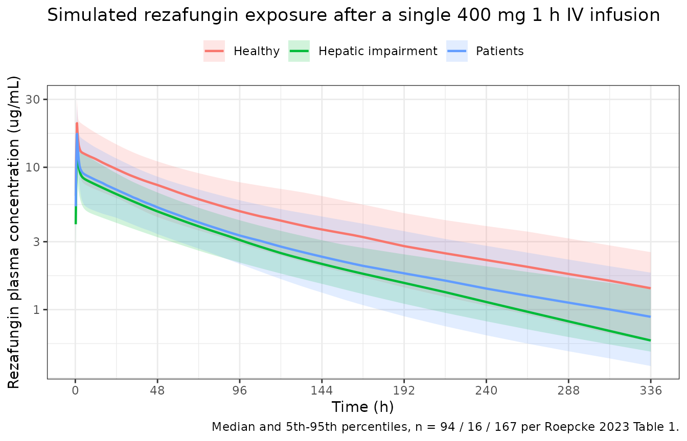
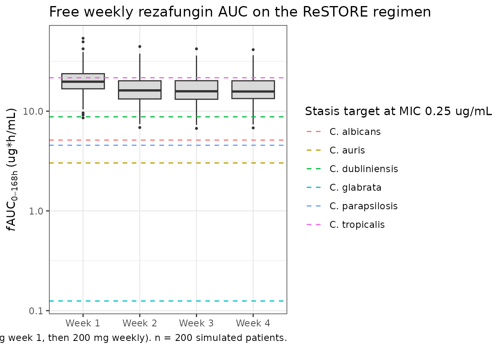
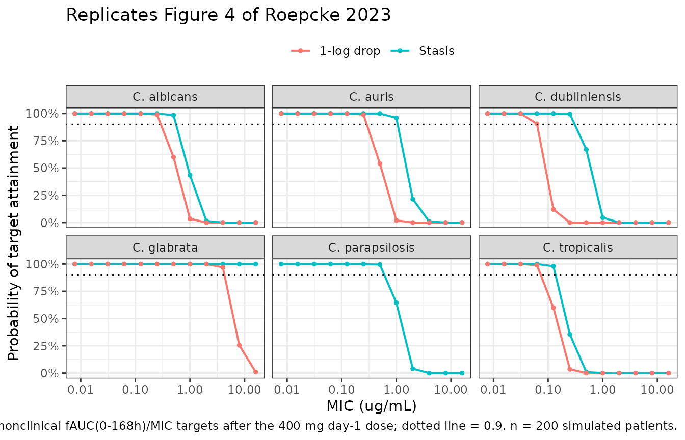

# Rezafungin (Roepcke 2023)

## Model and source

- Citation: Roepcke S, Passarell J, Walker H, Flanagan S. Population
  pharmacokinetic modeling and target attainment analyses of rezafungin
  for the treatment of candidemia and invasive candidiasis. Antimicrob
  Agents Chemother. 2023;67(12):e00916-23. <doi:10.1128/aac.00916-23>
- Description: Three-compartment population PK model for rezafungin
  after weekly IV infusion in healthy subjects, hepatically impaired
  subjects, and patients with candidemia and/or invasive candidiasis
  (Roepcke 2023), with body-surface-area scaling on CL, V1, and the
  shared peripheral volume V23, a serum-albumin effect on V23, and a
  healthy-vs-diseased disease-state shift on CL and V1.
- Article: [Antimicrob Agents Chemother
  2023;67(12):e00916-23](https://doi.org/10.1128/aac.00916-23)
- Supplement: `aac.00916-23-s0001.docx` (Fig. S1, Fig. S2, Table S1),
  distributed with the open-access article

## Population

Rezafungin is a chemically and metabolically stable echinocandin whose
long half-life (roughly 130-150 h) supports once-weekly intravenous
dosing rather than the daily infusion required by the earlier
echinocandins. Roepcke 2023 pooled 2,512 plasma concentration records
from 277 subjects across seven studies: five Phase 1 studies in healthy
subjects and in subjects with hepatic impairment (CD101.IV.1.01, .1.02,
.1.06, .1.07, .1.15), the Phase 2 STRIVE trial (CD101.IV.2.03;
NCT02734862), and the Phase 3 ReSTORE trial (CD101.IV.3.05;
NCT03667690). Doses ranged from 50 to 1,400 mg, all given as intravenous
infusions (1 h for the 50-400 mg regimens; 1.5 h for 600 mg and a
divided 1.5 h + 2 h infusion for 1,400 mg; supplement Table S1).

The analysis population comprised 94 healthy subjects, 16 uninfected
subjects with moderate or severe hepatic impairment, and 167 patients
with candidemia and/or invasive candidiasis. Age ranged from 20 to 89
years (median 53); 60.6% were male; 76.5% were White, 10.1% Asian, and
9.7% Black or African American. Median body weight was 74.7 kg
(34.0-154.5 kg) and median BMI 26.4 kg/m^2 (13.7-64.4). The patient
cohort was in part critically ill, which Roepcke 2023 offers as the
explanation for its markedly lower serum albumin (median 2.7 g/dL,
versus 4.5 g/dL in healthy subjects) and its older age. Fifty-four
percent of patients (91/167) had some degree of renal impairment and 16
(9.6%) required dialysis; neither creatinine clearance nor age was
retained as a covariate. Baseline demographics are Roepcke 2023 Table 1;
study designs and dosing regimens are supplement Table S1.

The structural model is a three-compartment model with zero-order IV
input into the central compartment and first-order elimination. During
model development the two peripheral volumes V2 and V3 were found to
have very similar typical estimates and highly correlated individual
random effects, so they were collapsed into a **single shared volume
parameter V23** carrying a single eta; only the two intercompartmental
clearances Q2 (0.236 L/h) and Q3 (12.4 L/h) distinguish the two
peripheral compartments. Interindividual variability was retained on CL,
V1, and V23 as a full 3x3 covariance block, with a proportional
(constant coefficient of variation) residual error model.

The same information is available programmatically via
`readModelDb("Roepcke_2023_rezafungin")()$population`.

## Source trace

Every numeric value in `ini()` carries an in-file comment pointing to
its Roepcke 2023 source location. The table below collects them in one
place for review.

| Equation / parameter | Value | Source location |
|----|----|----|
| `lcl` (CL) | 0.328 L/h | Table 2, “Central clearance (L/h)” (2.77 %RSE) |
| `lvc` (V1) | 17.7 L | Table 2, “Central volume (L)” (3.96 %RSE) |
| `lvp` (V23) | 19.1 L | Table 2, “Peripheral volume 1 and 2 (L)” (2.41 %RSE) |
| `lq` (Q2) | 0.236 L/h | Table 2, “Distribution clearance 1 (L/h)” (5.38 %RSE) |
| `lq2` (Q3) | 12.4 L/h | Table 2, “Distribution clearance 2 (L/h)” (4.37 %RSE) |
| `e_bsa_cl` | 0.882 | Table 2, “Exponent of (BSA/1.9) for CL” (16.4 %RSE) |
| `e_bsa_vc` | 1.56 | Table 2, “Exponent of (BSA/1.9) for V1” (9.47 %RSE) |
| `e_bsa_vp` | 1.17 | Table 2, “Exponent of (BSA/1.9) for V23” (14.9 %RSE) |
| `e_alb_vp` | -0.708 | Table 2 “Exponent of (ALB/3.2) for V23” (11.4 %RSE); sign from the Table 2 footnote-a equation |
| `e_dis_healthy_cl` | -0.276 | Table 2, “Proportional shift in CL for healthy” (9.25 %RSE); sign from footnote a |
| `e_dis_healthy_vc` | -0.222 | Table 2, “Proportional shift in V1 for healthy” (18.1 %RSE); sign from footnote a |
| `etalcl` variance | 0.088949 | Table 2, 30.5 %CV on CL (13.7 %RSE) via `omega^2 = log(CV^2 + 1)` |
| `etalvc` variance | 0.132235 | Table 2, 37.6 %CV on V1 (14.7 %RSE) via `omega^2 = log(CV^2 + 1)` |
| `etalvp` variance | 0.082362 | Table 2, 29.3 %CV on V23 (18.9 %RSE) via `omega^2 = log(CV^2 + 1)` |
| `cov(etalcl, etalvc)` | 0.0560 | Table 2, cov(IIV in V1, IIV in CL) (17.3 %RSE) |
| `cov(etalcl, etalvp)` | 0.0619 | Table 2, cov(IIV in V23, IIV in CL) (18.8 %RSE) |
| `cov(etalvc, etalvp)` | 0.0373 | Table 2, cov(IIV in V23, IIV in V1) (38.8 %RSE) |
| `propSd` | 0.0974 | Table 2, residual variability 0.00949 = 9.74 %CV (9.34 %RSE) |
| Covariate equations for CL, V1, V23 | n/a | Table 2 footnote a |
| Three-compartment ODE structure | n/a | Results, “Final PK model”; Discussion paragraph 1 |
| Free fraction 2.6% | n/a | Materials and Methods, “Target attainment simulation methodology” |
| PK/PD targets by species | n/a | Table 4 |

**Covariate equations reproduced verbatim from Table 2 footnote a:**

``` math
\mathrm{CL} = 0.328 \times \left(\frac{\mathrm{BSA}}{1.9}\right)^{0.882} \times \left(1 + (-0.276) \times I_{healthy}\right)
```
``` math
\mathrm{V1} = 17.7 \times \left(\frac{\mathrm{BSA}}{1.9}\right)^{1.56} \times \left(1 + (-0.222) \times I_{healthy}\right)
```
``` math
\mathrm{V23} = 19.1 \times \left(\frac{\mathrm{BSA}}{1.9}\right)^{1.17} \times \left(\frac{\mathrm{ALB}}{3.2}\right)^{-0.708}
```

where $`I_{healthy}`$ is 1 for healthy subjects who are neither infected
nor hepatically impaired and 0 otherwise. This maps directly onto the
canonical `DIS_HEALTHY` column with no re-expression, so the typical
values 0.328 L/h and 17.7 L are the **diseased-state** reference.

**IIV variance derivation.** Roepcke 2023 Methods states an exponential
random-effect model “assuming a log normal distribution of each of the
parameters”, so the log-scale variance is `omega^2 = log(CV^2 + 1)`.
This choice is verifiable rather than assumed: back-computing each
correlation as `cov / sqrt(var_i * var_j)` from the three variances and
the three published covariances reproduces the correlation coefficients
quoted in Table 2 footnotes b-d (0.516, 0.723, 0.357) to three decimal
places, which the naive `omega^2 = CV^2` convention does not.

``` r

cv  <- c(CL = 0.305, V1 = 0.376, V23 = 0.293)      # Roepcke 2023 Table 2
om2 <- log(1 + cv^2)
omega <- matrix(
  c(om2[["CL"]],  0.0560,       0.0619,
    0.0560,       om2[["V1"]],  0.0373,
    0.0619,       0.0373,       om2[["V23"]]),
  nrow = 3, dimnames = list(names(cv), names(cv))
)
round(om2, 6)
#>       CL       V1      V23 
#> 0.088949 0.132235 0.082362
# Reproduces Table 2 footnotes b-d: 0.516, 0.723, 0.357
round(cov2cor(omega)[lower.tri(omega)], 3)
#> [1] 0.516 0.723 0.357
# Positive definite, so the block is safe for rxode2's Cholesky sampler
all(eigen(omega, only.values = TRUE)$values > 0)
#> [1] TRUE
```

## Virtual cohort

Original observed data are not publicly available. The cohorts below
mirror the Roepcke 2023 Table 1 baseline distributions of the two
retained continuous covariates (BSA and serum albumin) within each
health-status stratum, sampled from normal distributions matched to the
published per-stratum mean and SD and clamped to the published
per-stratum range. Each stratum is sized at its actual study N (94
healthy, 16 hepatically impaired, 167 patients) so the simulated groups
line up one-for-one with Roepcke 2023 Table 3; all three are at or below
the 200-per-arm cap.

Note the covariate encoding: hepatically impaired subjects belong to the
model’s **diseased** category (`DIS_HEALTHY = 0`) together with the
candidemia / invasive candidiasis patients. Only the healthy stratum
carries `DIS_HEALTHY = 1`.

``` r

set.seed(20231128)

dose_ld_mg  <- 400   # loading dose, Roepcke 2023 target-attainment regimen
infusion_h  <- 1     # supplement Table S1: 400 mg infused IV over 1 hour

# Roepcke 2023 Table 1: mean (SD) and (min, max) per stratum.
strata <- tibble::tribble(
  ~cohort,                ~n,   ~dis_healthy, ~bsa_mean, ~bsa_sd, ~bsa_lo, ~bsa_hi, ~alb_mean, ~alb_sd, ~alb_lo, ~alb_hi,
  "Healthy",              94L,  1L,           1.91,      0.19,    1.5,     2.5,     4.47,      0.25,    3.8,     5.1,
  "Hepatic impairment",   16L,  0L,           2.13,      0.24,    1.8,     2.7,     3.71,      0.60,    2.6,     4.7,
  "Patients",             167L, 0L,           1.86,      0.30,    1.2,     2.7,     2.63,      0.66,    1.2,     4.6
)

# Clamped normal draw: keeps the published mean/SD while respecting the
# published min/max of each stratum.
draw_clamped <- function(n, mean, sd, lo, hi) {
  pmin(pmax(stats::rnorm(n, mean, sd), lo), hi)
}

make_subjects <- function(cohort, n, dis_healthy, bsa_mean, bsa_sd, bsa_lo, bsa_hi,
                          alb_mean, alb_sd, alb_lo, alb_hi, id_offset) {
  tibble(
    id          = id_offset + seq_len(n),
    cohort      = cohort,
    DIS_HEALTHY = dis_healthy,
    BSA         = draw_clamped(n, bsa_mean, bsa_sd, bsa_lo, bsa_hi),
    # Canonical ALB is SI g/L; Table 1 reports US-convention g/dL.
    ALB         = draw_clamped(n, alb_mean, alb_sd, alb_lo, alb_hi) * 10
  )
}

id_offsets <- c(0L, cumsum(strata$n)[-nrow(strata)])
subjects <- do.call(
  bind_rows,
  Map(
    make_subjects,
    strata$cohort, strata$n, strata$dis_healthy,
    strata$bsa_mean, strata$bsa_sd, strata$bsa_lo, strata$bsa_hi,
    strata$alb_mean, strata$alb_sd, strata$alb_lo, strata$alb_hi,
    id_offsets
  )
)
stopifnot(!anyDuplicated(subjects$id), nrow(subjects) == 277L)

# Observation grid: dense through the 1 h infusion and the distribution
# phase, then out to 8 weeks so the terminal phase (t1/2 ~ 145 h) is well
# characterised for the half-life estimate.
obs_times <- sort(unique(c(
  seq(0, 2, by = 0.25),
  seq(2, 12, by = 0.5),
  seq(12, 48, by = 2),
  seq(48, 168, by = 6),
  seq(168, 1344, by = 24)
)))
stopifnot(168 %in% obs_times)

dose_rows <- subjects |>
  mutate(time = 0, evid = 1L, amt = dose_ld_mg, cmt = "central",
         rate = dose_ld_mg / infusion_h)

obs_rows <- subjects |>
  tidyr::expand_grid(time = obs_times) |>
  mutate(evid = 0L, amt = 0, cmt = "central", rate = 0)

events <- bind_rows(dose_rows, obs_rows) |>
  arrange(id, time, desc(evid))

stopifnot(!anyDuplicated(unique(events[, c("id", "time", "evid")])))
```

## Simulation

``` r

mod <- readModelDb("Roepcke_2023_rezafungin")

sim <- rxode2::rxSolve(
  mod,
  events = events,
  keep   = c("cohort", "DIS_HEALTHY", "BSA", "ALB")
) |> as.data.frame()
#> ℹ parameter labels from comments will be replaced by 'label()'

# rxSolve has been observed to silently drop subjects; assert the count.
stopifnot(dplyr::n_distinct(sim$id) == nrow(subjects))
```

### Typical-value parameter check

Before any NCA, confirm that the packaged `model()` block reproduces the
Table 2 footnote-a equations exactly, at the reference covariate values
(BSA = 1.9 m^2, ALB = 3.2 g/dL) and at the worked example Roepcke 2023
gives in Results, “Clinical relevance”: doubling BSA from 1.3 to 2.6 m^2
raises CL from 0.235 to 0.433 L/h, and healthy subjects have 27.6% lower
CL.

``` r

check_subjects <- tibble(
  id          = 1:4,
  cohort      = c("ref diseased", "ref healthy", "BSA 1.3", "BSA 2.6"),
  DIS_HEALTHY = c(0L, 1L, 0L, 0L),
  BSA         = c(1.9, 1.9, 1.3, 2.6),
  ALB         = 32                       # 3.2 g/dL in canonical SI g/L
)

check_events <- bind_rows(
  check_subjects |>
    mutate(time = 0, evid = 1L, amt = dose_ld_mg, cmt = "central",
           rate = dose_ld_mg / infusion_h),
  check_subjects |>
    tidyr::expand_grid(time = c(0.5, 1, 2)) |>
    mutate(evid = 0L, amt = 0, cmt = "central", rate = 0)
) |>
  arrange(id, time, desc(evid))

typical <- rxode2::rxSolve(
  rxode2::zeroRe(mod), events = check_events,
  keep = c("cohort", "DIS_HEALTHY", "BSA", "ALB"),
  # omega = NA is load-bearing, not decorative: rxSolve reuses the previous
  # solve's omega, so a zeroRe() call that follows a population solve
  # silently re-samples etas and returns individual, not typical, values.
  omega = NA
) |>
  as.data.frame() |>
  group_by(cohort) |>
  summarise(CL = first(cl), V1 = first(vc), V23 = first(vp), .groups = "drop") |>
  mutate(Vss = V1 + 2 * V23)   # Table 3 footnote b: V1 + both peripherals
#> ℹ parameter labels from comments will be replaced by 'label()'
#> Warning: multi-subject simulation without without 'omega'

typical |>
  mutate(across(where(is.numeric), ~ signif(.x, 4))) |>
  dplyr::rename("Scenario" = cohort, "CL (L/h)" = CL, "V1 (L)" = V1,
                "V23 (L)" = V23, "Vss (L)" = Vss) |>
  knitr::kable(
    caption = paste(
      "Typical-value parameters at the Table 2 reference covariates.",
      "Expected from Roepcke 2023: CL 0.328 and V1 17.7 at the diseased",
      "reference; CL 0.237 and V1 13.8 for healthy (-27.6% / -22.2%);",
      "CL 0.235 at BSA 1.3 and 0.433 at BSA 2.6."
    )
  )
```

| Scenario     | CL (L/h) | V1 (L) | V23 (L) | Vss (L) |
|:-------------|---------:|-------:|--------:|--------:|
| BSA 1.3      |   0.2347 |  9.792 |   12.25 |   34.30 |
| BSA 2.6      |   0.4325 | 28.870 |   27.57 |   84.01 |
| ref diseased |   0.3280 | 17.700 |   19.10 |   55.90 |
| ref healthy  |   0.2375 | 13.770 |   19.10 |   51.97 |

Typical-value parameters at the Table 2 reference covariates. Expected
from Roepcke 2023: CL 0.328 and V1 17.7 at the diseased reference; CL
0.237 and V1 13.8 for healthy (-27.6% / -22.2%); CL 0.235 at BSA 1.3 and
0.433 at BSA 2.6. {.table}

## PKNCA validation

Roepcke 2023 Table 3 reports AUC(0-168h), Cmax, Cmin,168h, CL, Vss, and
half-life after a single 400 mg dose, stratified by health status. These
were derived by numerical integration of dense profiles simulated from
the individual empirical Bayes estimates and the individual dosing
histories (Materials and Methods, final paragraph of the population PK
section), so they are the natural validation target for a re-simulation
from the published fixed and random effects.

AUC(0-168h) is computed as `auclast` over the interval \[0, 168 h\];
Cmin,168h is `clast.obs` over the same interval (the profile declines
monotonically after Cmax, so the last concentration in the week is the
trough). Half-life is taken from a separate \[0, Inf) interval so
PKNCA’s automatic terminal-slope selection sees the full 8-week grid.

``` r

sim_nca <- sim |>
  dplyr::filter(!is.na(Cc)) |>
  dplyr::select(id, time, Cc, cohort)

# Guarantee a time = 0 record per subject (IV bolus/infusion pre-dose = 0).
sim_nca <- bind_rows(
  sim_nca,
  sim_nca |> dplyr::distinct(id, cohort) |> mutate(time = 0, Cc = 0)
) |>
  dplyr::distinct(id, cohort, time, .keep_all = TRUE) |>
  arrange(id, cohort, time)

conc_obj <- PKNCA::PKNCAconc(sim_nca, Cc ~ time | cohort + id)

dose_df  <- events |>
  dplyr::filter(evid == 1) |>
  dplyr::select(id, time, amt, cohort)
dose_obj <- PKNCA::PKNCAdose(dose_df, amt ~ time | cohort + id)

intervals <- data.frame(
  start      = c(0,   0),
  end        = c(168, Inf),
  cmax       = c(TRUE,  FALSE),
  tmax       = c(TRUE,  FALSE),
  auclast    = c(TRUE,  FALSE),
  clast.obs  = c(TRUE,  FALSE),
  half.life  = c(FALSE, TRUE)
)

nca_res <- PKNCA::pk.nca(PKNCA::PKNCAdata(conc_obj, dose_obj, intervals = intervals))
```

Model-derived CL and Vss are read directly off the simulated individual
parameters rather than from NCA, matching the way Roepcke 2023 Table 3
footnote b defines them (“individual clearance parameters were
model-based estimates”; Vss is “the sum of the individual model-based
estimates of the central and the peripheral volumes of distribution”).

``` r

model_params <- sim |>
  group_by(cohort, id) |>
  summarise(CL = first(cl), Vss = first(vc) + 2 * first(vp), .groups = "drop") |>
  group_by(cohort) |>
  summarise(
    `CL (L/h)`  = exp(mean(log(CL))),
    `Vss (L)`   = exp(mean(log(Vss))),
    .groups = "drop"
  )

published_params <- tibble::tribble(
  ~cohort,               ~`CL (L/h)`, ~`Vss (L)`,
  "Healthy",             0.229,       42.312,
  "Hepatic impairment",  0.336,       56.279,
  "Patients",            0.328,       62.434
)

model_params |>
  left_join(published_params, by = "cohort", suffix = c(" simulated", " published")) |>
  mutate(across(where(is.numeric), ~ signif(.x, 4))) |>
  knitr::kable(
    caption = paste(
      "Model-based CL and Vss (geometric means) versus Roepcke 2023 Table 3.",
      "Vss = V1 + V2 + V3, and because V2 = V3 = V23 in this model,",
      "Vss = V1 + 2 x V23."
    )
  )
```

| cohort | CL (L/h) simulated | Vss (L) simulated | CL (L/h) published | Vss (L) published |
|:---|---:|---:|---:|---:|
| Healthy | 0.2359 | 45.00 | 0.229 | 42.31 |
| Hepatic impairment | 0.3872 | 66.45 | 0.336 | 56.28 |
| Patients | 0.3344 | 62.04 | 0.328 | 62.43 |

Model-based CL and Vss (geometric means) versus Roepcke 2023 Table 3.
Vss = V1 + V2 + V3, and because V2 = V3 = V23 in this model, Vss = V1 +
2 x V23. {.table}

### Comparison against published NCA

Roepcke 2023 Table 3 reports geometric means;
[`ncaComparisonTable()`](https://nlmixr2.github.io/nlmixr2lib/reference/ncaComparisonTable.md)
summarises the simulated per-subject values by their median, which for a
log-normal distribution is the geometric mean.

``` r

published <- tibble::tribble(
  ~cohort,               ~cmax,  ~auclast,  ~clast.obs, ~half.life,
  "Healthy",             21.725, 1070.513,  3.247,      143.368,
  "Hepatic impairment",  17.061,  778.250,  2.113,      132.827,
  "Patients",            17.715,  752.507,  2.097,      149.458
)

cmp <- nlmixr2lib::ncaComparisonTable(
  simulated     = nca_res,
  reference     = published,
  by            = "cohort",
  units         = c(cmax = "ug/mL", auclast = "ug*h/mL",
                    clast.obs = "ug/mL", half.life = "h"),
  tolerance_pct = 20
)

knitr::kable(
  cmp,
  caption = paste(
    "Simulated vs. Roepcke 2023 Table 3 after a single 400 mg 1 h IV",
    "infusion. auclast = AUC(0-168h); clast.obs = Cmin,168h.",
    "* differs from the reference by >20%."
  ),
  align = c("l", "l", "r", "r", "r")
)
```

| NCA parameter      | cohort             | Reference | Simulated | % diff |
|:-------------------|:-------------------|----------:|----------:|-------:|
| Cmax (ug/mL)       | Healthy            |      21.7 |      20.4 |  -6.0% |
| Cmax (ug/mL)       | Hepatic impairment |      17.1 |      13.7 | -19.9% |
| Cmax (ug/mL)       | Patients           |      17.7 |      17.2 |  -3.1% |
| Clast (ug/mL)      | Healthy            |      3.25 |      3.23 |  -0.4% |
| Clast (ug/mL)      | Hepatic impairment |      2.11 |      1.79 | -15.5% |
| Clast (ug/mL)      | Patients           |       2.1 |      2.03 |  -3.2% |
| AUClast (ug\*h/mL) | Healthy            |      1070 |      1080 |  +1.3% |
| AUClast (ug\*h/mL) | Hepatic impairment |       778 |       680 | -12.6% |
| AUClast (ug\*h/mL) | Patients           |       753 |       728 |  -3.3% |
| t½ (h)             | Healthy            |       143 |       152 |  +6.1% |
| t½ (h)             | Hepatic impairment |       133 |       158 | +18.9% |
| t½ (h)             | Patients           |       149 |       163 |  +8.9% |

Simulated vs. Roepcke 2023 Table 3 after a single 400 mg 1 h IV
infusion. auclast = AUC(0-168h); clast.obs = Cmin,168h. \* differs from
the reference by \>20%. {.table}

## Replicate published figures

### Concentration-time profiles by health status

Roepcke 2023 Figure 1 is a goodness-of-fit panel against the observed
data, which are not public, so it cannot be replicated directly. The
equivalent model-level statement is the simulated concentration-time
profile by health status, which shows the exposure ordering Table 3
reports: healthy subjects have the lowest clearance and therefore the
highest exposure, while patients and hepatically impaired subjects
overlap.

``` r

sim |>
  # Plot-only window: drop the pre-dose zero so the log y-axis is defined,
  # and stop at 2 weeks. The PKNCA input below is filtered separately and
  # deliberately keeps its time = 0 record.
  dplyr::filter(!is.na(Cc), dplyr::between(time, 0.25, 336)) |>
  group_by(cohort, time) |>
  summarise(
    Q05 = quantile(Cc, 0.05), Q50 = quantile(Cc, 0.50),
    Q95 = quantile(Cc, 0.95), .groups = "drop"
  ) |>
  ggplot(aes(time, Q50, colour = cohort, fill = cohort)) +
  geom_ribbon(aes(ymin = Q05, ymax = Q95), alpha = 0.18, colour = NA) +
  geom_line(linewidth = 0.8) +
  scale_x_continuous(breaks = seq(0, 336, by = 48)) +
  scale_y_log10() +
  labs(
    x = "Time (h)", y = "Rezafungin plasma concentration (ug/mL)",
    colour = NULL, fill = NULL,
    title = "Simulated rezafungin exposure after a single 400 mg 1 h IV infusion",
    caption = "Median and 5th-95th percentiles, n = 94 / 16 / 167 per Roepcke 2023 Table 1."
  ) +
  theme_bw() +
  theme(legend.position = "top")
```



### Figure 5 – weekly free AUC on the Phase 3 regimen

Roepcke 2023 Figure 5 shows boxplots of *f*AUC(0-168h) by week in
patients given the ReSTORE regimen: 400 mg in week 1 followed by 200 mg
weekly for three further weeks. Free concentrations use the 2.6% free
fraction the paper adopted (Materials and Methods, target-attainment
section).

``` r

set.seed(20230730)

n_pta <- 200L   # 200-per-arm cap; Roepcke 2023 used 100 x 1,000 virtual patients
pta_subjects <- make_subjects(
  cohort = "Patients", n = n_pta, dis_healthy = 0L,
  bsa_mean = 1.86, bsa_sd = 0.30, bsa_lo = 1.2, bsa_hi = 2.7,
  alb_mean = 2.63, alb_sd = 0.66, alb_lo = 1.2, alb_hi = 4.6,
  id_offset = 0L
)

dose_times <- c(0, 168, 336, 504)          # weekly
dose_amts  <- c(400, 200, 200, 200)        # 400 mg LD then 200 mg weekly

pta_dose_rows <- pta_subjects |>
  tidyr::expand_grid(tibble(time = dose_times, amt = dose_amts)) |>
  mutate(evid = 1L, cmt = "central", rate = amt / infusion_h)

week_offsets <- c(0, 0.25, 0.5, 0.75, 1, 1.5, 2, 3, 4, 6, 8, 12,
                  24, 48, 72, 96, 120, 144, 168)
pta_obs_times <- sort(unique(as.vector(outer(week_offsets, dose_times, `+`))))
pta_obs_times <- pta_obs_times[pta_obs_times <= 672]

pta_obs_rows <- pta_subjects |>
  tidyr::expand_grid(time = pta_obs_times) |>
  mutate(evid = 0L, amt = 0, cmt = "central", rate = 0)

pta_events <- bind_rows(pta_dose_rows, pta_obs_rows) |>
  arrange(id, time, desc(evid))

sim_pta <- rxode2::rxSolve(
  mod, events = pta_events, keep = c("cohort", "DIS_HEALTHY", "BSA", "ALB")
) |> as.data.frame()
stopifnot(dplyr::n_distinct(sim_pta$id) == n_pta)

# Guard against the same omega-reuse trap in the other direction: a
# population solve that follows a zeroRe() solve can silently come back
# without IIV. Individual CL should carry roughly the published 30.5 %CV.
cl_i <- vapply(split(sim_pta$cl, sim_pta$id), function(z) z[1], numeric(1))
stopifnot(stats::sd(cl_i) / mean(cl_i) > 0.15)
```

``` r

f_unbound <- 0.026   # Roepcke 2023: 2.6% free fraction (97.4% protein bound)

pta_nca <- sim_pta |>
  dplyr::filter(!is.na(Cc)) |>
  dplyr::select(id, time, Cc, cohort) |>
  dplyr::distinct(id, cohort, time, .keep_all = TRUE) |>
  arrange(id, time)

pta_conc <- PKNCA::PKNCAconc(pta_nca, Cc ~ time | cohort + id)
pta_dose <- PKNCA::PKNCAdose(
  pta_events |> dplyr::filter(evid == 1) |> dplyr::select(id, time, amt, cohort),
  amt ~ time | cohort + id
)

weekly_intervals <- data.frame(
  start   = dose_times,
  end     = dose_times + 168,
  auclast = TRUE
)

weekly_res <- PKNCA::pk.nca(
  PKNCA::PKNCAdata(pta_conc, pta_dose, intervals = weekly_intervals)
)

weekly <- as.data.frame(weekly_res) |>
  dplyr::filter(PPTESTCD == "auclast") |>
  mutate(
    week  = factor(match(start, dose_times), labels = paste("Week", 1:4)),
    fAUC  = PPORRES * f_unbound
  )
```

``` r

# Replicates Figure 5 of Roepcke 2023: fAUC(0-168h) by week, 400 mg week 1
# then 200 mg weekly. Reference lines are the Table 4 stasis fAUC/MIC
# targets evaluated at MIC = 0.25 ug/mL (see note below the figure).
mic_ref <- 0.25
targets <- tibble::tribble(
  ~species,             ~stasis, ~one_log,
  "C. albicans",        20.5,    37.2,
  "C. glabrata",         0.5,     2.94,
  "C. parapsilosis",    18.2,    NA_real_,
  "C. auris",           12.1,    38.4,
  "C. tropicalis",      86.5,   148.9,
  "C. dubliniensis",    35.1,   228.3
)

ggplot(weekly, aes(week, fAUC)) +
  geom_boxplot(fill = "grey85", outlier.size = 0.6) +
  geom_hline(
    data = targets |> mutate(y = stasis * mic_ref),
    aes(yintercept = y, colour = species), linetype = "dashed"
  ) +
  scale_y_log10() +
  labs(
    x = NULL, y = expression(italic(f) * "AUC"[0-168*h] ~ "(ug*h/mL)"),
    colour = "Stasis target at MIC 0.25 ug/mL",
    title = "Free weekly rezafungin AUC on the ReSTORE regimen",
    caption = paste(
      "Replicates Figure 5 of Roepcke 2023 (400 mg week 1, then 200 mg",
      "weekly). n = 200 simulated patients."
    )
  ) +
  theme_bw() +
  theme(legend.position = "right")
```



Roepcke 2023 draws its Figure 5 reference lines at the *f*AUC needed for
stasis at each species’ MIC90; the MIC90 values live in the Figure 4 bar
charts and are not tabulated, so the lines above are drawn instead at a
single common MIC of 0.25 ug/mL, the value the paper quotes as the *C.
albicans* and *C. auris* breakpoint. The figure reproduces the paper’s
qualitative message: week-1 exposure (400 mg) is roughly twice the
steady 200 mg weekly exposure, and weeks 2-4 are stable.

### Figure 4 – probability of PK/PD target attainment

Roepcke 2023 Figure 4 reports the probability of attaining the
nonclinical *f*AUC(0-168h)/MIC targets of Table 4 after the 400 mg day-1
dose.

The comparison has to be posed carefully. The paper defines its
breakpoint as “the highest **clinically relevant** MIC value with a
probability of PK/PD target attainment of at least 0.9” – the search is
capped by the observed surveillance MIC distribution drawn as the bars
of Figure 4, which is not tabulated anywhere in the article. The
published breakpoints are therefore a *lower bound* on the PTA crossing
point, not the crossing point itself, and a simulated crossing that
lands above the published breakpoint is agreement, not disagreement. The
testable claim is the one the paper’s Results actually makes – “the
simulated probabilities of target attainment … were \>90% at MIC values
\<= *x*” – so the check below evaluates simulated PTA **at** each
published MIC and asks whether it clears 90%.

``` r

fauc_wk1 <- weekly |> dplyr::filter(week == "Week 1") |> dplyr::pull(fAUC)

targets_long <- targets |>
  tidyr::pivot_longer(c(stasis, one_log), names_to = "target", values_to = "ratio") |>
  dplyr::filter(!is.na(ratio)) |>
  mutate(target = ifelse(target == "stasis", "Stasis", "1-log drop"))

pta_of <- function(ratio, mic) mapply(function(r, m) mean(fauc_wk1 / m >= r), ratio, mic)

# MICs quoted in Roepcke 2023 Results, "Target attainment simulations".
# The paper writes 0.06 for the CLSI doubling-series value 0.0625.
published_bp <- tibble::tribble(
  ~species,          ~target,      ~mic_reported, ~mic_clsi,
  "C. albicans",     "Stasis",     "0.25",        0.25,
  "C. albicans",     "1-log drop", "0.25",        0.25,
  "C. glabrata",     "Stasis",     "4",           4,
  "C. glabrata",     "1-log drop", "4",           4,
  "C. parapsilosis", "Stasis",     "0.5",         0.5,
  "C. auris",        "Stasis",     "0.25",        0.25,
  "C. auris",        "1-log drop", "0.25",        0.25,
  "C. tropicalis",   "Stasis",     "0.06",        0.0625,
  "C. tropicalis",   "1-log drop", "0.06",        0.0625,
  "C. dubliniensis", "Stasis",     "0.06",        0.0625,
  "C. dubliniensis", "1-log drop", "0.06",        0.0625
)

mic_grid <- 2^seq(-7, 4)   # 0.0078 to 16 ug/mL

pta <- tidyr::expand_grid(targets_long, mic = mic_grid) |>
  mutate(pta = pta_of(ratio, mic))

crossing <- pta |>
  dplyr::filter(pta >= 0.9) |>
  group_by(species, target) |>
  summarise(crossing = max(mic), .groups = "drop")

published_bp |>
  left_join(targets_long, by = c("species", "target")) |>
  mutate(`Simulated PTA at that MIC` = pta_of(ratio, mic_clsi)) |>
  left_join(crossing, by = c("species", "target")) |>
  mutate(
    `Clears 90%?`                = ifelse(`Simulated PTA at that MIC` >= 0.9, "yes", "NO"),
    `Simulated PTA at that MIC`  = paste0(round(100 * `Simulated PTA at that MIC`), "%")
  ) |>
  dplyr::select(
    "Species" = species, "PK/PD target" = target,
    "Roepcke 2023 MIC (ug/mL)" = mic_reported,
    "Simulated PTA at that MIC", "Clears 90%?",
    "Simulated PTA >= 0.9 up to (ug/mL)" = crossing
  ) |>
  knitr::kable(
    caption = paste(
      "Target attainment after a single 400 mg dose. The paper claims PTA",
      ">90% at each listed MIC; the last column is the uncapped simulated",
      "crossing point, which may legitimately exceed the published",
      "breakpoint because the paper caps its search at the highest",
      "clinically relevant MIC."
    )
  )
```

| Species | PK/PD target | Roepcke 2023 MIC (ug/mL) | Simulated PTA at that MIC | Clears 90%? | Simulated PTA \>= 0.9 up to (ug/mL) |
|:---|:---|:---|:---|:---|---:|
| C. albicans | Stasis | 0.25 | 100% | yes | 0.5000 |
| C. albicans | 1-log drop | 0.25 | 99% | yes | 0.2500 |
| C. glabrata | Stasis | 4 | 100% | yes | 16.0000 |
| C. glabrata | 1-log drop | 4 | 97% | yes | 4.0000 |
| C. parapsilosis | Stasis | 0.5 | 100% | yes | 0.5000 |
| C. auris | Stasis | 0.25 | 100% | yes | 1.0000 |
| C. auris | 1-log drop | 0.25 | 99% | yes | 0.2500 |
| C. tropicalis | Stasis | 0.06 | 100% | yes | 0.1250 |
| C. tropicalis | 1-log drop | 0.06 | 99% | yes | 0.0625 |
| C. dubliniensis | Stasis | 0.06 | 100% | yes | 0.2500 |
| C. dubliniensis | 1-log drop | 0.06 | 90% | yes | 0.0625 |

Target attainment after a single 400 mg dose. The paper claims PTA \>90%
at each listed MIC; the last column is the uncapped simulated crossing
point, which may legitimately exceed the published breakpoint because
the paper caps its search at the highest clinically relevant MIC.
{.table}

``` r

ggplot(pta, aes(mic, pta, colour = target)) +
  geom_line(linewidth = 0.7) +
  geom_point(size = 1) +
  geom_hline(yintercept = 0.9, linetype = "dotted") +
  scale_x_log10() +
  scale_y_continuous(labels = function(x) paste0(100 * x, "%"), limits = c(0, 1)) +
  facet_wrap(~species) +
  labs(
    x = "MIC (ug/mL)", y = "Probability of target attainment",
    colour = NULL,
    title = "Replicates Figure 4 of Roepcke 2023",
    caption = paste(
      "PTA of the Table 4 nonclinical fAUC(0-168h)/MIC targets after the",
      "400 mg day-1 dose; dotted line = 0.9. n = 200 simulated patients."
    )
  ) +
  theme_bw() +
  theme(legend.position = "top")
```



## Assumptions and deviations

- **BSA and albumin distributions are reconstructed, not observed.** The
  virtual cohorts sample both covariates from independent normal
  distributions matched to the Roepcke 2023 Table 1 per-stratum mean and
  SD and clamped to the published per-stratum range. The real cohort’s
  BSA and albumin are correlated with each other and with health status,
  and both are skewed (Table 1 medians differ from means, particularly
  for the patient stratum). Simulated exposure spread is therefore an
  approximation of, not a reproduction of, the published spread.
- **The hepatic-impairment stratum agrees least well, as expected.** Its
  simulated Cmax, AUC, and half-life sit 13-19% from Roepcke 2023 Table
  3 while the healthy and patient strata land within about 6%. That
  stratum has only 16 subjects and the widest relative gap between the
  Table 1 mean and median (BSA 2.13 vs 2.10 m^2; albumin 3.71 vs 3.70
  g/dL with SD 0.60), so a symmetric normal draw around the mean
  reproduces its covariate distribution least faithfully. All 12
  comparisons remain inside the 20% tolerance.
- **BSA formula is unspecified in the source.** Roepcke 2023 tabulates
  BSA as a baseline characteristic but never states whether it was
  computed by DuBois, Mosteller, or Haycock. The model consumes BSA as a
  supplied covariate column, so the choice does not affect the packaged
  model; it does affect how a user should derive `BSA` for their own
  data.
- **Sign of the three covariate coefficients comes from the Table 2
  footnote-a equations, not the Table 2 body.** Table 2 lists
  `Exponent of (ALB/3.2) for V23` as 0.708 and the two disease-state
  shifts as 0.276 and 0.222, all unsigned; footnote a prints them as
  `-0.708`, `1 + (-0.276) x I_healthy`, and `1 + (-0.222) x I_healthy`.
  The negative orientation is independently corroborated by Table 3 (the
  low-albumin patient stratum has the larger Vss) and by the Results
  sentence “healthy subjects had a 27.6% lower CL”.
- **`Vss` is `V1 + 2 x V23`.** Table 3 footnote b defines the individual
  Vss as the sum of the central and the peripheral volumes. Because
  Roepcke 2023 collapsed V2 and V3 into one shared parameter, both
  peripheral compartments contribute V23, so Vss = V1 + 2 x V23. Using
  `V1 + V23` reproduces only about two-thirds of the published Vss and
  is wrong.
- **Cohort size for target attainment is 200, not 100,000.** Roepcke
  2023 simulated 100 trials of 1,000 virtual patients each by resampling
  covariate vectors from the observed Phase 2 / Phase 3 distributions.
  This vignette uses 200 simulated patients with parametrically sampled
  covariates, per the 200-per-arm cap. PTA estimates therefore carry
  Monte Carlo noise of roughly +/-3 percentage points, which can move a
  crossing point by one doubling dilution near the 0.9 threshold.
- **The published MIC breakpoints cannot be reproduced as crossing
  points.** Roepcke 2023 defines the breakpoint as the highest
  *clinically relevant* MIC with PTA \>= 0.9, capping the search at the
  observed surveillance MIC distribution plotted as the bars of
  Figure 4. Those MIC distributions are not tabulated in the article or
  its supplement, so the cap cannot be applied here. The published
  breakpoints are consequently lower bounds, and the validation above
  tests the paper’s actual claim (PTA \>= 90% at each reported MIC)
  rather than equality of crossing points. The uncapped simulated
  crossing exceeds the published breakpoint for several stasis targets,
  which is consistent with, not contradictory to, the paper.
- **Figure 5 reference lines use a single MIC of 0.25 ug/mL.** The
  paper’s reference lines are drawn at each species’ MIC90, which
  appears only in the Figure 4 bar charts and is not tabulated, so it
  could not be transcribed.
- **The Phase 2 STRIVE Group 1 regimen (400 mg weekly) is not
  simulated.** Only the ReSTORE / STRIVE Group 2 regimen (400 mg loading
  dose then 200 mg weekly) is reproduced, matching the regimen Roepcke
  2023 carried into its target-attainment analysis.
- **Covariates screened but not retained** (age, weight, BMI, sex, serum
  creatinine, creatinine clearance, ALT, AST, APACHE score) are
  documented in the model file’s `covariatesDataExcluded` list for
  provenance. They are not referenced in `model()` because Roepcke 2023
  did not retain them.
- **No non-paper-derived parameter values.** Every value in `ini()`
  comes from Roepcke 2023 Table 2 or its footnote a; no author
  correspondence, figure digitisation, or upstream-model carry-over was
  needed.
