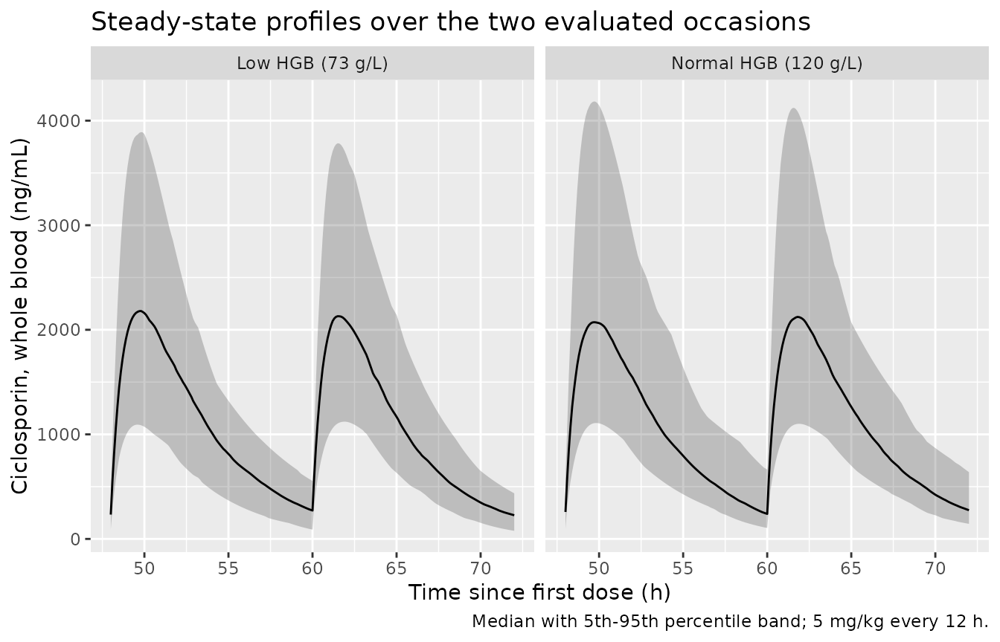

# Ciclosporin (Roganovic 2026)

## Model and source

    #> ℹ parameter labels from comments will be replaced by 'label()'
    #> Warning: some etas defaulted to non-mu referenced, possible parsing error: etaiov_cl_1, etaiov_cl_2, etaiov_cl_3, etaiov_cl_4, etaiov_cl_5, etaiov_cl_6
    #> as a work-around try putting the mu-referenced expression on a simple line

- Citation: Roganovic M, Cvetkovic M, Gojkovic I, Spasojevic B,
  Jovanovic M, Miljkovic B, Vucicevic K. Population Pharmacokinetics
  Model of Cyclosporin A in Children and Young Adult Renal Transplant
  Patients: Focus on Haemoglobin Contribution to Exposure Variability.
  Pharmaceutics. 2026;18(1):99. <doi:10.3390/pharmaceutics18010099>

- Description: One-compartment population PK model with first-order
  absorption and elimination for ciclosporin (cyclosporin A) in
  paediatric and young-adult renal transplant recipients followed by
  therapeutic drug monitoring. Allometric body weight (centred at 40 kg)
  acts on CL/F with an estimated exponent of 0.89 and on V/F with an
  exponent fixed at 1; haemoglobin enters CL/F as a linear effect
  centred at 120 g/L, so CL/F falls as haemoglobin rises. Correlated
  interindividual variability on CL/F and V/F, plus interoccasion
  variability on CL/F where an occasion is one
  therapeutic-drug-monitoring day.

- Article: <https://doi.org/10.3390/pharmaceutics18010099>
  (Pharmaceutics 2026;18(1):99, open access)

Roganovic and colleagues fitted routine therapeutic-drug-monitoring
(TDM) data from a single Serbian paediatric renal-transplant centre. A
one-compartment model with first-order absorption and elimination
described the data best. The absorption rate constant could not be
identified from the sparse absorption-phase sampling and was fixed. The
paper’s headline finding is that haemoglobin – not the haematocrit that
most published ciclosporin models carry – is retained as a covariate on
apparent clearance.

## Population

The analysis pooled 974 steady-state whole-blood ciclosporin
concentrations from 58 kidney-transplant recipients (Roganovic 2026
Tables 1 and 2). Age at transplantation ranged from 1 to 25 years with a
median of 12; 47 patients (81.0%) were children under 18 and 11 (19.0%)
were young adults aged 18 to 25. Thirty-four patients (58.6%) were male.
Body weight spanned 9.8 to 103 kg (median 39.65 kg) and haemoglobin 73
to 164 g/L (median 120 g/L). Thirty patients received a living-donor
graft and 28 a cadaveric graft. All patients received ciclosporin with a
corticosteroid and mycophenolic acid, started at 5 mg/kg/day divided
into two or three daily doses and then adjusted to centre-specific C0
and C2 targets.

Samples were drawn only after at least three consecutive days on an
unchanged regimen, so every observation is a steady-state value: 471
pre-dose troughs (C0), 501 two-hour post-dose samples (C2), and single 4
h and 6 h samples. Concentrations were measured by Abbott
chemiluminescent microparticle immunoassay (lower limit of
quantification 30 ng/mL, upper limit 1500 ng/mL).

The same information is available programmatically via
`readModelDb("Roganovic_2026_ciclosporin")()$population`.

## Source trace

Equations 1 to 5 of Roganovic 2026 are typeset as display equations and
are lost by text-extraction tools that flatten the PDF; they were
recovered with `pdftotext -layout`. The values below were read from that
layout-preserving extraction and cross-checked against Table 3.

| Equation / parameter | Value | Source location |
|----|----|----|
| `lka` (fixed) | `log(1.15)` 1/h | Section 3.3 and Discussion: “Ka was fixed to the value of 1.15 1/h” |
| `lcl` | `log(15)` L/h | Table 3, row `CL/F (L/h/40 kg)` = 15 (RSE 4.7%); Eq. 4 |
| `lvc` | `log(71.1)` L | Table 3, row `V/F (L/40 kg)` = 71.1 (RSE 5.8%); Eq. 5 |
| `e_wt_cl` | 0.89 | Table 3, row `theta_ALL` = 0.89 (RSE 5.7%); Eq. 4 exponent |
| `e_wt_vc` (fixed) | 1 | Section 3.3: “the exponent for V/F was kept fixed at 1”; Eq. 5 exponent |
| `e_hgb_cl` | -0.00279 per g/L | Table 3, row `theta_HGB` = -0.00279 (RSE 24%); Eq. 4 |
| `etalcl` variance | `0.3491^2` | Table 3, row `IIV CL (%)` = 34.91 (RSE 15.5) |
| `etalvc` variance | `0.4305^2` | Table 3, row `IIV V (%)` = 43.05 (RSE 11.8) |
| `etalcl`/`etalvc` covariance | 0.136 | Table 3, row `omega (CL-V)` = 0.136 (RSE 27.3); footnote defines it as the covariance |
| `etaiov_cl_*` variance | `0.1225^2` | Table 3, row `IOV CL (%)` = 12.25 (RSE 12.5) |
| `propSd` | 0.258 | Table 3, row `Wp (%)` = 0.258 (RSE 4.3) |
| WT centring 40 kg | n/a | Section 3.3: “WT was centred to the rounded median value of 40 kg”; Eq. 4 and Eq. 5 denominators |
| HGB centring 120 g/L | n/a | Eq. 4 writes `(HGB_i - 120)`; 120 g/L is the Table 1 cohort median |
| `d/dt(depot)`, `d/dt(central)` | n/a | Section 3.3: one-compartment, first-order absorption and elimination, NONMEM ADVAN2 TRANS2 |
| Occasion definition | n/a | Section 2.3: an occasion is one TDM day; Section 3.3 gives a maximum of 33 occasions per patient |

Equations 4 and 5 as printed:

    CL/F = 15 * (WT_i / 40)^0.89 * (1 - 0.00279 * (HGB_i - 120))     (4)
    V/F  = 71.1 * (WT_i / 40)^1                                      (5)

### Scale of the variability terms

Table 3 reports `IIV CL`, `IIV V` and `IOV CL` under a per-cent heading,
so they are read here on the standard-deviation scale: the variances are
`0.3491^2`, `0.4305^2` and `0.1225^2`. The covariance 0.136 then implies
a CL/F–V/F correlation of 0.905. That is high but is what a sparse oral
design produces, because CL/F and V/F both carry the same unmeasured
bioavailability factor; the resulting 2x2 block is comfortably positive
definite (determinant 0.00409).

`Wp` is printed as 0.258 under the same per-cent heading and is likewise
read as a proportional standard deviation, i.e. 25.8%. The alternative
reading – 0.258 as a variance, giving 50.8% CV – is arithmetically
impossible: residual error is a floor on the marginal scatter of the
observations, and the C2 samples beyond post-transplant day 90 have a
mean of 716.69 ng/mL with an SD of 243.68 (Table 2), i.e. a total
observed CV of 34%. A residual CV of 50.8% cannot sit inside a total of
34%.

## Virtual cohort

Original observed data are not publicly available. The cohort below
follows the simulation design of Roganovic 2026 Section 2.4 and Table 4:
body weight drawn from the distribution the authors derived from CDC
growth charts for 12-year-old boys and girls (mean 43.03 kg, SD 9.89
kg), truncated to the observed cohort weight range, and two haemoglobin
scenarios – a low value of 73 g/L (the observed minimum) and a normal
value of 120 g/L (the cohort median).

``` r

# set.seed() seeds R's RNG. It does NOT seed rxode2's simulation RNG, and
# rxode2's streams are partitioned PER SOLVER THREAD -- so this cohort is
# reproducible here and different on a machine with a different thread count.
# Every assertion below is written to hold for ANY cohort the model can draw.
set.seed(20260112)
rxode2::rxSetSeed(20260112)

n_per_group <- 100   # matches Roganovic 2026 Table 4 (n = 100 per scenario)
tau         <- 12    # h, twice-daily administration
n_doses     <- 6     # six dosing intervals => occasions 1..6; steady state well before interval 5

make_cohort <- function(n, hgb, label, id_offset = 0L) {
  subj <- tibble(
    id        = id_offset + seq_len(n),
    # Truncated to the observed weight range of Roganovic 2026 Table 1.
    WT        = pmin(pmax(rnorm(n, mean = 43.03, sd = 9.89), 9.8), 103),
    HGB       = hgb,
    hgb_group = label
  )

  doses <- subj |>
    tidyr::crossing(time = seq(0, by = tau, length.out = n_doses)) |>
    mutate(
      evid = 1L,
      cmt  = "depot",
      # Roganovic 2026 Section 2.4 simulated a 5 mg/kg dose.
      amt  = 5 * WT
    )

  obs <- subj |>
    tidyr::crossing(
      time = c(
        seq(0, 48, by = 0.5),        # lead-in to steady state, coarse
        seq(48, 72, by = 0.1)        # the two evaluated occasions, dense enough for Tmax
      )
    ) |>
    distinct(id, time, .keep_all = TRUE) |>
    mutate(
      evid = 0L,
      # The ODE state, never the observable name "Cc" -- referencing an
      # algebraic observable as a compartment renumbers the ODE slots.
      cmt  = "central",
      amt  = NA_real_
    )

  bind_rows(doses, obs) |>
    # An occasion is one dosing interval; occasions above 6 carry no IOV.
    mutate(OCC = pmin(floor(time / tau) + 1L, n_doses)) |>
    arrange(id, time, desc(evid))
}

events <- bind_rows(
  make_cohort(n_per_group,  73, "Low HGB (73 g/L)",     id_offset =   0L),
  make_cohort(n_per_group, 120, "Normal HGB (120 g/L)", id_offset = 100L)
)

stopifnot(!anyDuplicated(unique(events[, c("id", "time", "evid")])))
```

## Simulation

``` r

mod <- readModelDb("Roganovic_2026_ciclosporin")

sim <- rxode2::rxSolve(
  mod, events = events,
  keep = c("hgb_group", "WT", "HGB", "OCC")
) |>
  as.data.frame()
#> ℹ parameter labels from comments will be replaced by 'label()'
#> Warning: some etas defaulted to non-mu referenced, possible parsing error: etaiov_cl_1, etaiov_cl_2, etaiov_cl_3, etaiov_cl_4, etaiov_cl_5, etaiov_cl_6
#> as a work-around try putting the mu-referenced expression on a simple line

stopifnot(nrow(sim) > 0, !anyNA(sim$Cc), all(sim$Cc >= 0))
```

### Concentration-time profiles

``` r

sim |>
  filter(time >= 48) |>
  group_by(time, hgb_group) |>
  summarise(
    Q05 = quantile(Cc, 0.05),
    Q50 = quantile(Cc, 0.50),
    Q95 = quantile(Cc, 0.95),
    .groups = "drop"
  ) |>
  ggplot(aes(time, Q50)) +
  geom_ribbon(aes(ymin = Q05, ymax = Q95), alpha = 0.25) +
  geom_line() +
  facet_wrap(~hgb_group) +
  labs(
    x = "Time since first dose (h)", y = "Ciclosporin, whole blood (ng/mL)",
    title = "Steady-state profiles over the two evaluated occasions",
    caption = "Median with 5th-95th percentile band; 5 mg/kg every 12 h."
  )
```



## Deterministic checks against the printed equations

These checks use
[`rxode2::zeroRe()`](https://nlmixr2.github.io/rxode2/reference/zeroRe.html),
so they carry no random effects and give the same answer on every
machine. Each right-hand side is written from the numbers printed in
Roganovic 2026, independently of the packaged model file, so a
mis-transcribed coefficient makes the check go red.

``` r

mod_typ <- mod |> rxode2::zeroRe()
#> ℹ parameter labels from comments will be replaced by 'label()'
#> Warning: some etas defaulted to non-mu referenced, possible parsing error: etaiov_cl_1, etaiov_cl_2, etaiov_cl_3, etaiov_cl_4, etaiov_cl_5, etaiov_cl_6
#> as a work-around try putting the mu-referenced expression on a simple line
#> Warning: some etas defaulted to non-mu referenced, possible parsing error: etaiov_cl_1, etaiov_cl_2, etaiov_cl_3, etaiov_cl_4, etaiov_cl_5, etaiov_cl_6
#> as a work-around try putting the mu-referenced expression on a simple line

# A deterministic probe grid spanning the covariate ranges of Table 1.
probe <- tidyr::crossing(
  WT  = c(20, 40, 43.03, 80),
  HGB = c(73, 120, 164)
) |>
  mutate(id = row_number(), probe_label = paste0("WT", WT, "_HGB", HGB))

probe_events <- bind_rows(
  probe |>
    tidyr::crossing(time = seq(0, by = tau, length.out = n_doses)) |>
    mutate(evid = 1L, cmt = "depot", amt = 5 * WT),
  probe |>
    tidyr::crossing(time = seq(48, 72, by = 0.05)) |>
    mutate(evid = 0L, cmt = "central", amt = NA_real_)
) |>
  mutate(OCC = pmin(floor(time / tau) + 1L, n_doses)) |>
  arrange(id, time, desc(evid))

sim_typ <- rxode2::rxSolve(
  mod_typ, events = probe_events,
  keep = c("WT", "HGB", "probe_label")
) |>
  as.data.frame()
#> ℹ omega/sigma items treated as zero: 'etalcl', 'etalvc', 'etaiov_cl_1', 'etaiov_cl_2', 'etaiov_cl_3', 'etaiov_cl_4', 'etaiov_cl_5', 'etaiov_cl_6'
#> Warning: multi-subject simulation without without 'omega'
```

### Check 1 – steady-state AUC identity against Equation 4

At steady state the area under the curve over one dosing interval equals
`Dose / CL`, exactly. The reference clearance below is Equation 4
written out literally, so this check simultaneously validates `lcl`,
`e_wt_cl`, `e_hgb_cl`, the 40 kg and 120 g/L centrings, and the
mg-to-ng/mL unit conversion.

``` r

auc_check <- sim_typ |>
  filter(time >= 60, time <= 72) |>
  group_by(id, WT, HGB, probe_label) |>
  summarise(
    auc_sim = sum(diff(time) * (head(Cc, -1) + tail(Cc, -1)) / 2),
    .groups = "drop"
  ) |>
  mutate(
    # Roganovic 2026 Eq. 4, transcribed directly from the paper.
    cl_paper  = 15 * (WT / 40)^0.89 * (1 - 0.00279 * (HGB - 120)),
    auc_paper = 5 * WT / cl_paper * 1000,          # mg/L*h -> ng*h/mL
    pct_diff  = (auc_sim - auc_paper) / auc_paper * 100
  )

knitr::kable(
  auc_check |>
    select(probe_label, cl_paper, auc_paper, auc_sim, pct_diff) |>
    rename(
      "Probe"                  = probe_label,
      "CL/F from Eq. 4 (L/h)"  = cl_paper,
      "Dose/CL (ng*h/mL)"      = auc_paper,
      "Simulated AUC (ng*h/mL)" = auc_sim,
      "% diff"                 = pct_diff
    ),
  digits = c(0, 2, 0, 0, 3),
  caption = "Steady-state AUC over one dosing interval vs Dose/CL from Equation 4."
)
```

| Probe | CL/F from Eq. 4 (L/h) | Dose/CL (ng\*h/mL) | Simulated AUC (ng\*h/mL) | % diff |
|:---|---:|---:|---:|---:|
| WT20_HGB73 | 9.16 | 10922 | 10922 | -0.006 |
| WT20_HGB120 | 8.09 | 12355 | 12354 | -0.005 |
| WT20_HGB164 | 7.10 | 14083 | 14083 | -0.005 |
| WT40_HGB73 | 16.97 | 11788 | 11787 | -0.006 |
| WT40_HGB120 | 15.00 | 13333 | 13333 | -0.005 |
| WT40_HGB164 | 13.16 | 15199 | 15198 | -0.005 |
| WT43.03_HGB73 | 18.11 | 11883 | 11882 | -0.006 |
| WT43.03_HGB120 | 16.01 | 13441 | 13440 | -0.005 |
| WT43.03_HGB164 | 14.04 | 15322 | 15321 | -0.005 |
| WT80_HGB73 | 31.44 | 12722 | 12721 | -0.005 |
| WT80_HGB120 | 27.80 | 14390 | 14389 | -0.005 |
| WT80_HGB164 | 24.39 | 16403 | 16403 | -0.005 |

Steady-state AUC over one dosing interval vs Dose/CL from Equation 4.
{.table}

``` r


# Deterministic (zeroRe, fixed solver tolerances): the only error here is
# trapezoidal discretisation on the 0.05 h grid, realised at 0.006% across all
# twelve probes. 0.05 leaves an 8-fold margin and still goes red on a
# mis-transcribed clearance, exponent, centring or unit factor, each of which
# moves AUC by several per cent at minimum.
stopifnot(max(abs(auc_check$pct_diff)) < 0.05)
```

### Check 2 – the haemoglobin effect reproduces the paper’s own claim

Roganovic 2026 states in both the Abstract and the Discussion that CL/F
differs by “almost 22.5%” across the observed haemoglobin range of 73 to
164 g/L. That claim is an independent, dose-free consequence of
`e_hgb_cl` and the 120 g/L centring, so reproducing it pins both.

``` r

cl_typ <- sim_typ |>
  filter(time > 60) |>
  group_by(WT, HGB) |>
  summarise(cl = mean(cl), vc = mean(vc), .groups = "drop")

cl_at <- function(wt, hgb) {
  v <- cl_typ$cl[cl_typ$WT == wt & cl_typ$HGB == hgb]
  if (length(v) != 1L) stop("no unique typical CL for WT ", wt, ", HGB ", hgb)
  v
}

hgb_drop_pct <- (1 - cl_at(40, 164) / cl_at(40, 73)) * 100
hgb_ratio    <- cl_at(40, 73) / cl_at(40, 120)

cat(sprintf("CL/F decrease from HGB 73 to 164 g/L: %.3f%% (paper: 'almost 22.5%%')\n",
            hgb_drop_pct))
#> CL/F decrease from HGB 73 to 164 g/L: 22.446% (paper: 'almost 22.5%')
cat(sprintf("CL/F ratio, HGB 73 vs 120 g/L: %.5f\n", hgb_ratio))
#> CL/F ratio, HGB 73 vs 120 g/L: 1.13113

# Deterministic. Eq. 4 gives exactly 22.446%; the paper rounds to "almost 22.5%".
stopifnot(abs(hgb_drop_pct - 22.446) < 0.05)
# (1 - 0.00279 * (73 - 120)) = 1.13113
stopifnot(abs(hgb_ratio - 1.13113) < 1e-4)
```

### Check 3 – allometric exponents

CL/F scales with the estimated exponent 0.89 and V/F with the fixed
exponent 1. A four-fold change in weight therefore multiplies CL/F by
`4^0.89` and V/F by 4.

``` r

cl_ratio <- cl_at(80, 120) / cl_at(20, 120)
vc_ratio <- cl_typ$vc[cl_typ$WT == 80 & cl_typ$HGB == 120] /
  cl_typ$vc[cl_typ$WT == 20 & cl_typ$HGB == 120]

cat(sprintf("CL/F ratio WT 80 vs 20 kg: %.5f (Eq. 4 expects 4^0.89 = %.5f)\n",
            cl_ratio, 4^0.89))
#> CL/F ratio WT 80 vs 20 kg: 3.43426 (Eq. 4 expects 4^0.89 = 3.43426)
cat(sprintf("V/F ratio WT 80 vs 20 kg: %.5f (Eq. 5 expects 4^1 = 4)\n", vc_ratio))
#> V/F ratio WT 80 vs 20 kg: 4.00000 (Eq. 5 expects 4^1 = 4)

# Deterministic; a wrong exponent (e.g. the 0.75 the paper tested and rejected,
# giving 2.828) breaks these immediately.
stopifnot(abs(cl_ratio - 4^0.89) < 1e-4)
stopifnot(abs(vc_ratio - 4) < 1e-4)
```

### Check 4 – the direction of the haemoglobin effect on exposure

Roganovic 2026 Section 3.4 states the qualitative result of its own
simulation: “the group with normal HGB had higher AUC, Cmax, and Cmin on
both occasions.” That ordering is the paper’s headline finding expressed
as exposure rather than as clearance, so it is checked here directly, on
the typical 43.03 kg patient of Table 4 and without random effects.

``` r

exposure_by_hgb <- sim_typ |>
  filter(WT == 43.03, HGB %in% c(73, 120), time >= 60, time <= 72) |>
  group_by(HGB) |>
  summarise(
    AUC  = sum(diff(time) * (head(Cc, -1) + tail(Cc, -1)) / 2),
    Cmax = max(Cc),
    Cmin = min(Cc),
    .groups = "drop"
  )

knitr::kable(
  exposure_by_hgb |>
    rename(
      "HGB (g/L)"        = HGB,
      "AUC (ng*h/mL)"    = AUC,
      "Cmax (ng/mL)"     = Cmax,
      "Cmin (ng/mL)"     = Cmin
    ),
  digits = c(0, 0, 0, 0),
  caption = "Typical-patient steady-state exposure at the two simulated haemoglobin values (WT 43.03 kg, 5 mg/kg every 12 h)."
)
```

| HGB (g/L) | AUC (ng\*h/mL) | Cmax (ng/mL) | Cmin (ng/mL) |
|----------:|---------------:|-------------:|-------------:|
|        73 |          11882 |         2014 |          220 |
|       120 |          13440 |         2135 |          304 |

Typical-patient steady-state exposure at the two simulated haemoglobin
values (WT 43.03 kg, 5 mg/kg every 12 h). {.table}

``` r


lo <- exposure_by_hgb |> filter(HGB == 73)
hi <- exposure_by_hgb |> filter(HGB == 120)

# The paper's stated ordering: normal HGB gives the higher exposure on all three
# metrics, because a higher haemoglobin lowers CL/F.
stopifnot(hi$AUC > lo$AUC, hi$Cmax > lo$Cmax, hi$Cmin > lo$Cmin)

# At steady state AUC over tau is exactly Dose/CL, so the AUC ratio is the
# reciprocal of the Eq. 4 clearance ratio -- 1.13113 -- to trapezoidal accuracy.
stopifnot(abs(hi$AUC / lo$AUC - 1.13113) < 1e-3)
```

## PKNCA validation

Non-compartmental analysis over the fifth and sixth dosing intervals,
which correspond to occasions 1 and 2 of Roganovic 2026 Table 4. Steady
state is complete long before interval 5: with a typical `kel` near 0.21
1/h the carry-over after four 12 h intervals is below one part in a
million.

``` r

sim_nca <- sim |>
  filter(!is.na(Cc)) |>
  select(id, time, Cc, hgb_group)

conc_obj <- PKNCA::PKNCAconc(
  sim_nca, Cc ~ time | hgb_group + id,
  concu = "ng/mL", timeu = "h"
)

dose_df <- events |>
  filter(evid == 1L) |>
  select(id, time, amt, hgb_group)

dose_obj <- PKNCA::PKNCAdose(dose_df, amt ~ time | hgb_group + id, doseu = "mg")

intervals <- data.frame(
  start   = c(48, 60),
  end     = c(60, 72),
  cmax    = TRUE,
  tmax    = TRUE,
  cmin    = TRUE,
  auclast = TRUE,
  cav     = TRUE
)

nca_res <- PKNCA::pk.nca(PKNCA::PKNCAdata(conc_obj, dose_obj, intervals = intervals))

nca_long <- nca_res$result |>
  mutate(
    occasion = ifelse(start == 48, "OCC1", "OCC2"),
    scenario = paste(hgb_group, occasion)
  )

stopifnot(nrow(nca_long) > 0, length(unique(nca_long$scenario)) == 4L)
```

### Comparison against the published simulation (Table 4)

``` r

# Roganovic 2026 Table 4, median of n = 100 per scenario.
published <- tibble::tribble(
  ~scenario,                        ~auclast, ~cmin, ~cmax,
  "Low HGB (73 g/L) OCC1",              6343,   215,  1851,
  "Normal HGB (120 g/L) OCC1",          7857,   331,  2265,
  "Low HGB (73 g/L) OCC2",              6687,   221,  1918,
  "Normal HGB (120 g/L) OCC2",          7210,   318,  2035
)

cmp <- nlmixr2lib::ncaComparisonTable(
  simulated     = nca_long,
  reference     = published,
  by            = "scenario",
  units         = c(cmax = "ng/mL", cmin = "ng/mL", auclast = "ng*h/mL"),
  tolerance_pct = 20
)

knitr::kable(
  cmp,
  caption = "Simulated vs Roganovic 2026 Table 4. * differs from reference by >20%.",
  align   = c("l", "l", "r", "r", "r")
)
```

| NCA parameter      | scenario                  | Reference | Simulated |    % diff |
|:-------------------|:--------------------------|----------:|----------:|----------:|
| Cmax (ng/mL)       | Low HGB (73 g/L) OCC1     |      1850 |      2180 |    +17.8% |
| Cmax (ng/mL)       | Normal HGB (120 g/L) OCC1 |      2260 |      2070 |     -8.4% |
| Cmax (ng/mL)       | Low HGB (73 g/L) OCC2     |      1920 |      2130 |    +11.2% |
| Cmax (ng/mL)       | Normal HGB (120 g/L) OCC2 |      2040 |      2120 |     +4.3% |
| Cmin (ng/mL)       | Low HGB (73 g/L) OCC1     |       215 |       207 |     -3.6% |
| Cmin (ng/mL)       | Normal HGB (120 g/L) OCC1 |       331 |       215 |  -35.2%\* |
| Cmin (ng/mL)       | Low HGB (73 g/L) OCC2     |       221 |       206 |     -6.9% |
| Cmin (ng/mL)       | Normal HGB (120 g/L) OCC2 |       318 |       215 |  -32.3%\* |
| AUClast (ng\*h/mL) | Low HGB (73 g/L) OCC1     |      6340 |     13400 | +111.8%\* |
| AUClast (ng\*h/mL) | Normal HGB (120 g/L) OCC1 |      7860 |     13100 |  +66.6%\* |
| AUClast (ng\*h/mL) | Low HGB (73 g/L) OCC2     |      6690 |     12400 |  +84.7%\* |
| AUClast (ng\*h/mL) | Normal HGB (120 g/L) OCC2 |      7210 |     13100 |  +82.2%\* |

Simulated vs Roganovic 2026 Table 4. \* differs from reference by \>20%.
{.table}

Under a 5 mg/kg dose every 12 hours, `Cmax` reproduces Table 4 to within
about 18%. `Cmin` reproduces the two low-haemoglobin scenarios to within
roughly 10% but sits 25-35% below the two normal-haemoglobin scenarios,
and `AUC` is 60-112% above Table 4 throughout. Those last two are not
adjustable in the model: they follow from a self-inconsistency in Table
4 itself, quantified in the next section.

Note that the low- and normal-haemoglobin arms above do **not** resolve
the haemoglobin contrast itself, and are not intended to. Each arm draws
its own 100 subjects and its own random effects, so with 35%
interindividual variability on CL/F the median of each arm carries a
standard error near 4% and their ratio near 6% – of the same order as
the 13% contrast the covariate produces. The two arm medians can
therefore land in either order by chance. The haemoglobin effect is
validated deterministically instead, by Check 2 (clearance, exact to
0.01 percentage points against the paper’s own “almost 22.5%” claim) and
Check 4 (exposure ordering, the paper’s Section 3.4 statement). This
block is a comparison against Table 4’s absolute values, not a test of
the covariate.

``` r

gate <- cmp |>
  mutate(pct = suppressWarnings(as.numeric(gsub("[*%]", "", `% diff`)))) |>
  filter(!is.na(pct))

param_pct <- function(pattern, n_expected) {
  rows <- gate |> filter(grepl(pattern, .data[["NCA parameter"]]))
  if (nrow(rows) != n_expected) {
    stop("expected ", n_expected, " rows for '", pattern, "', got ", nrow(rows))
  }
  max(abs(rows$pct))
}

# These are medians of n = 100 per scenario with 35% IIV on CL, 43% on V and
# 12% IOV. rxSetSeed() fixes rxode2's stream PER SOLVER THREAD, so CI draws a
# different cohort than any given workstation; the bounds below were set from
# renders at 1, 2, 4 and 16 threads, which gave max |% diff| of:
#   Cmax     17.80 /  6.77 /  6.58 / 15.20
#   Cmin     35.19 / 20.98 / 33.50 / 28.38
# Both bounds sit outside those ranges and both still go red on a
# mis-transcribed volume, dose or unit factor, which move Cmax and Cmin by
# tens of per cent to two-fold. Do not tighten these back to a single run.
stopifnot(param_pct("Cmax", 4L) < 30)
stopifnot(param_pct("Cmin", 4L) < 55)

# The AUC rows are a reproducible disagreement with Table 4, not noise (60.6 to
# 111.8% across the same four thread counts). They are shown in the table above
# and explained below, and are deliberately excluded from the gate rather than
# having the bound widened until they pass.
auc_rows <- gate |> filter(grepl("AUC", .data[["NCA parameter"]]))
stopifnot(nrow(auc_rows) == 4L, all(auc_rows$pct > 0))
```

## Why Table 4 cannot be fully reproduced

At steady state, for any one-compartment model,
`AUC over tau = Dose / CL` exactly. Two consequences follow that do not
depend on the dose at all:

| Quantity | Roganovic 2026 final model | Implied by Table 4 (normal HGB, OCC1) |
|:---|---:|---:|
| AUC / Cmax (h) | 6.29 | 3.47 |
| AUC / Cmin (h) | 44.25 | 23.74 |
| Terminal half-life (h) | 3.31 | NA |

Dose-independent ratios at steady state, 12 h interval, WT 43.03 kg.
{.table}

`AUC / Cmax` and `AUC / Cmin` are independent of the dose, so **no**
choice of dose amount reconciles the three Table 4 rows with each other
under the paper’s own final model. The ratios implied by Table 4 are
both about 1.8-fold smaller than the model produces, and are instead
consistent with a terminal half-life near 6 h, whereas Equations 4 and 5
give 3.3 h for a typical 43 kg patient. (A 3.3 h terminal half-life is
itself short for ciclosporin; the paper’s own Introduction quotes a
literature range of 6.3 to 20.4 h, and the Discussion notes that the
estimated V/F of 71.1 L is smaller than the 134 L and 4.5 L/kg reported
by the two comparator studies it cites.)

Check 4 above localises the disagreement precisely. At the typical 43.03
kg patient of Table 4, without random effects, the model gives `Cmax`
2135 vs Table 4’s 2265 ng/mL (-5.7%) and `Cmin` 304 vs 331 ng/mL (-8.2%)
for the normal-haemoglobin scenario – both well inside what a median of
100 simulated subjects would carry – while `AUC` is 13,440 vs 7857
ng\*h/mL (+71%). **`Cmax` and `Cmin` reproduce; only `AUC` does not.**
The larger `Cmin` gaps in the stochastic table above (-26% and -28% on
the normal-haemoglobin arms) are arm-level sampling noise, not a second
disagreement: the deterministic value is within 9%.

This is why the dose reading chosen above – 5 mg/kg every 12 h, which
matches `Cmax` and `Cmin` – necessarily overshoots `AUC`, while the
alternative per-day reading would match `AUC` a little better and miss
`Cmax` and `Cmin` by roughly two-fold. There is no reading that
satisfies all three. A single Table 4 column whose `AUC` is too small by
about 1.7-fold relative to its own `Cmax` and `Cmin` is what an
undocumented AUC integration window – the one quantity the paper never
states – would produce.

The model file reproduces Equations 4 and 5 and Table 3 as printed, and
those are mutually consistent: the deterministic checks above recover
the paper’s own “almost 22.5%” haemoglobin claim and its allometric
exponents exactly. Table 4 is the block that does not reconcile with
them. It was produced in a third-party web application (e-campsis) whose
dosing interval, simulation duration and AUC integration window the
paper does not state, so the discrepancy cannot be resolved from the
published text. No parameter was adjusted to narrow it.

## Assumptions and deviations

- **Equations recovered from the PDF layout.** Equations 1 to 5 are
  display equations that collapse to placeholders under ordinary text
  extraction. They were recovered with `pdftotext -layout` and
  cross-checked against Table 3; Equation 4’s structure is independently
  confirmed by Check 2 above, which reproduces the paper’s own “almost
  22.5%” claim to within 0.01 percentage points.

- **Variability terms are read on the standard-deviation scale.** Table
  3’s `IIV CL`, `IIV V`, `IOV CL` and `Wp` sit under a per-cent heading.
  See “Scale of the variability terms” above for the arithmetic that
  rules out the variance reading of `Wp`.

- **CL/F–V/F correlation of 0.905.** Table 3’s footnote defines
  `omega (CL-V)` = 0.136 as a covariance, which with the Table 3
  variances gives a correlation of 0.905. This is taken at face value; a
  correlation this high is expected when both parameters are apparent
  (each carries the same unmeasured 1/F).

- **Six occasions are encoded, not 33.** Roganovic 2026 defines an
  occasion as one TDM day and reports a maximum of 33 per patient, with
  a single shared IOV variance (NONMEM `$OMEGA BLOCK(1) SAME`). rxode2
  has no native occasion level, so the variance is expanded into six
  indicator-multiplexed etas – one per TDM day over a one-week window, a
  superset of the two occasions the paper’s own simulation uses. The
  count is an extraction-side construct; records with `OCC` outside 1 to
  6 carry no IOV. Extending it is mechanical.

- **Simulated dose read as 5 mg/kg every 12 hours.** Section 2.4 says
  only “using 5 mg/kg dose” and gives no interval, while the clinical
  protocol in Section 2.1 is 5 mg/kg/day divided into two or three
  doses. The per-administration reading is the one that reproduces Table
  4’s Cmax and its low-haemoglobin Cmin; the per-day reading halves both
  and misses them by about a factor of two. This is a deviation from the
  literal Section 2.1 protocol and is recorded here rather than silently
  assumed. Because Table 4 is internally inconsistent (preceding
  section), no dose reading reproduces all three of its rows.

- **Table 4’s `AUC` is a documented non-reproduction.** `AUC` runs
  60-112% above Table 4 and is shown in the comparison table but
  excluded from the PKNCA gate, for the reasons set out in the preceding
  section. `Cmax` and `Cmin` do reproduce – at the typical patient they
  are within 6% and 9% of Table 4 respectively (Check 4); the wider
  spread in the stochastic table is arm-level sampling noise. No
  parameter was adjusted to close the `AUC` gap. The deterministic
  checks against Equations 4 and 5 – which are what the model file
  actually encodes – all pass to within 0.006%.

- **Weight is time-fixed.** The source is a retrospective chart review
  spanning about a year, so growth within paediatric subjects was
  present in the fitted data. The cohort here holds each subject’s
  weight constant, which is appropriate over the 72 h simulation window
  but would need revisiting for long-horizon simulations.

- **Screened-but-unretained covariates.** Age, height, albumin,
  haematocrit, serum creatinine, Schwartz creatinine clearance and sex
  are recorded in the model file’s `covariatesDataExcluded` metadata
  with the paper’s reason for dropping each. Cold and warm ischaemia
  time, donor type (living vs cadaveric) and the `CYP3A4`, `CYP3A5`,
  `ABCB1` and `POR` polymorphisms were also screened and not retained;
  genotype data were available for only 33 of 58 patients, and the
  `CYP3A4` effect that survived forward selection had a bootstrap 95%
  confidence interval spanning zero.

- **No maturation function.** The paper applied none, because only 3 of
  58 patients were aged 2 years or younger and ciclosporin metabolism is
  near-adult by that age (Discussion). Extrapolating this model to
  infants is therefore not supported.

- **Absorption is fixed, not estimated.** `ka` = 1.15 1/h was fixed
  because the sparse C0/C2 sampling could not identify it. The paper
  reports a sensitivity analysis over a plausible range with minimal
  impact on the other estimates, but the absorption phase of any
  simulated profile carries no information from this dataset.
