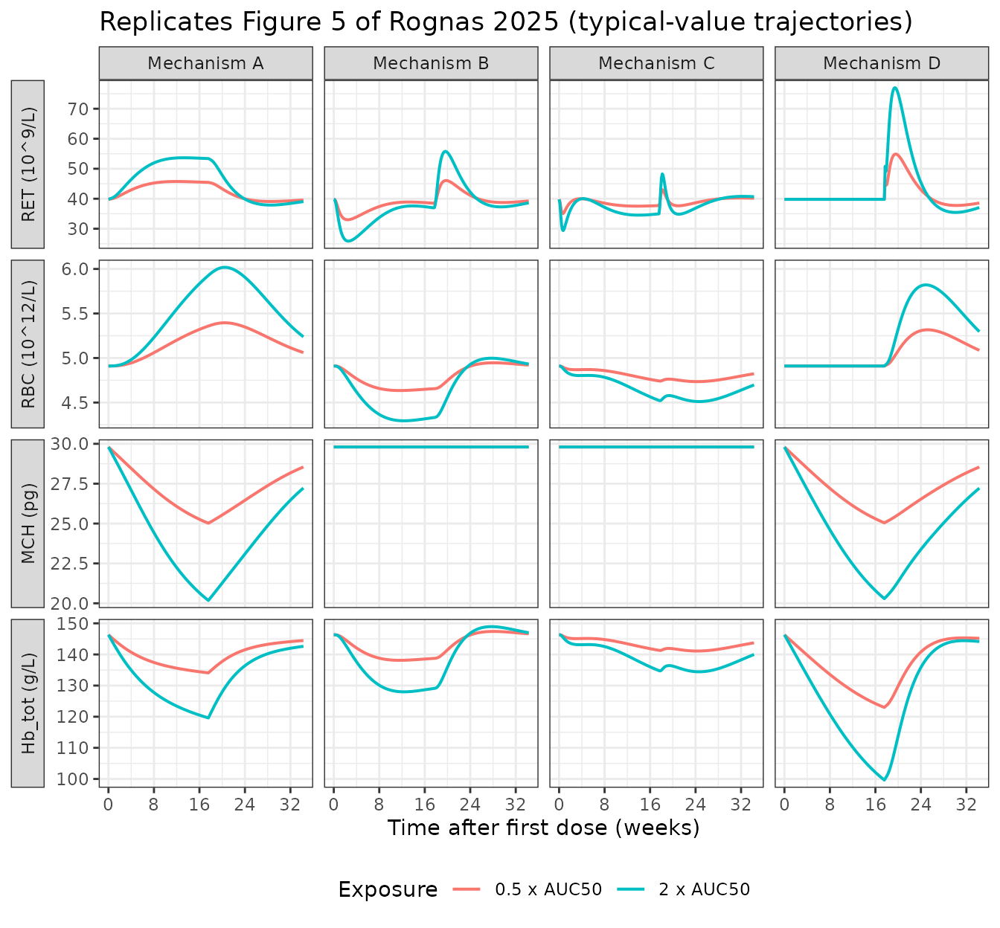
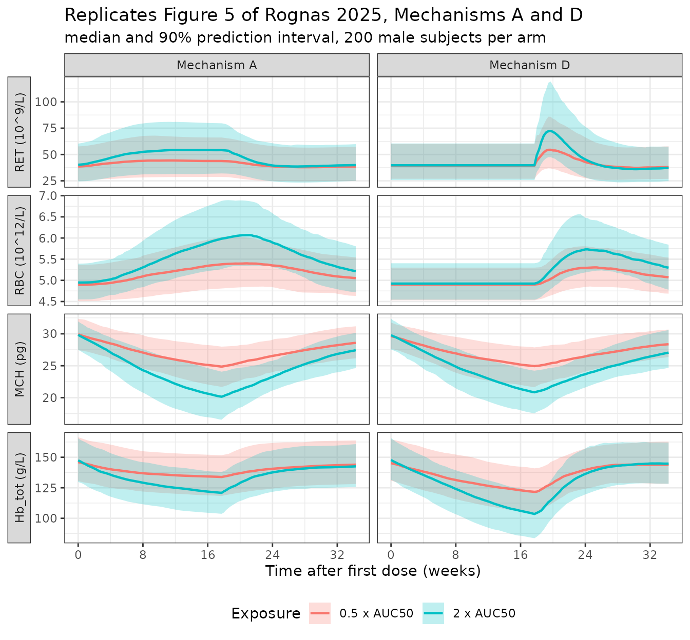

# Bitopertin erythropoiesis PKPD (Rognas 2025)

## Model and source

``` r

mod <- rxode2::rxode(readModelDb("Rognas_2025_bitopertin"))
#> ℹ parameter labels from comments will be replaced by 'label()'
```

- Citation: Rognas SV, Schaedeli Stark F, Marchesi M, Silber Baumann HE,
  Abrantes JA. A semi-mechanistic population
  pharmacokinetic-pharmacodynamic model to assess downstream drug-target
  effects on erythropoiesis. J Pharmacokinet Pharmacodyn. 2025;52(4):42.
  <doi:10.1007/s10928-025-09990-7>. Structural framework expanded from
  Schaedeli Stark F, Martin-Facklam M, Hofmann C, et al. (2012),
  semi-physiologic population PKPD model of bitopertin (RG1678) effects
  on hemoglobin turnover (reference 9 of the 2025 paper). Parameter
  values, the differential equation system and the steady-state
  parameterisation are taken from the 2025 paper and its Supplementary
  Appendix (Springer ESM MOESM1), which contains the full NONMEM control
  stream.
- Article: <https://doi.org/10.1007/s10928-025-09990-7>
- Supplement (Springer ESM, contains the full NONMEM control stream, the
  differential equation system and the steady-state derivation):
  <https://static-content.springer.com/esm/art%3A10.1007%2Fs10928-025-09990-7/MediaObjects/10928_2025_9990_MOESM1_ESM.docx>

Description:

> QSP (semi-mechanistic erythropoiesis). Fifteen-state population PKPD
> model of human erythropoiesis and hemoglobin synthesis in healthy
> adults, driven by steady-state bitopertin (GlyT1 inhibitor) exposure.
> A bone-marrow erythroid precursor pool feeds a two-pathway
> four-compartment reticulocyte maturation structure (immature / mature
> x bone marrow / blood), which feeds a four-compartment erythrocyte
> age-transit chain with a parallel four-compartment
> corpuscular-hemoglobin chain. Total hemoglobin is the sum of the
> products across each erythrocyte / hemoglobin transit-compartment
> pair, and drives an exponential homeostatic feedback on both precursor
> recruitment and reticulocyte release. An empirical two-compartment
> moderator (tolerance) chain represents stem-cell reservoir depletion.
> Bitopertin inhibits the hemoglobin production rate via an Emax
> function of individual steady-state AUC. Simultaneous outputs:
> reticulocyte count, erythrocyte count, mean corpuscular hemoglobin,
> immature reticulocyte fraction, and total blood hemoglobin.

This is a semi-mechanistic (QSP-style) population PKPD model of human
erythropoiesis. Bitopertin, an inhibitor of glycine transporter 1
(GlyT1), restricts the glycine available for heme synthesis and
therefore acts as a probe of the hemoglobin-synthesis step. There is no
drug PK compartment in the model: bitopertin enters only through the
`AUC_BTP` exposure covariate, so the validation below uses steady-state,
mass-balance and published-simulation replication rather than NCA.

## Population

Data came from a single Phase 1 multicentre, randomised, double-blind,
placebo-controlled, parallel-group trial. 67 healthy adults were
enrolled and 62 were included in the model: placebo (n = 15), bitopertin
10 mg (n = 17), 30 mg (n = 16) and 60 mg (n = 14), each dosed orally
once daily for 120 days and followed for a further 120 days.

``` r

pop <- mod$population
tibble::tibble(Field = names(pop), Value = vapply(pop, function(x) paste(as.character(x), collapse = "; "), character(1))) |>
  knitr::kable()
```

| Field | Value |
|:---|:---|
| species | human |
| n_subjects | 62 |
| n_studies | 1 |
| age_range | 19-45 years (all subjects aged \< 50 years by protocol) |
| age_median | 31.0 years |
| weight_range | 49.4-108 kg |
| weight_median | 69.0 kg |
| sex_female_pct | 58 |
| disease_state | Healthy male and female volunteers |
| dose_range | Bitopertin 10, 30 or 60 mg orally once daily for 120 days, or placebo, followed by a 120-day follow-up period |
| notes | Phase 1 multicentre, randomised, double-blind, placebo-controlled, parallel-group trial. 67 subjects enrolled; 62 included in the model (placebo n = 15, 10 mg n = 17, 30 mg n = 16, 60 mg n = 14) – Results ‘Data used for model development’ and Table 1. Baseline biomarkers (Table 1, all subjects, mean): reticulocyte count 40.2 x 10^9/L, erythrocyte count 4.70 x 10^12/L, total hemoglobin 140.4 g/L, mean corpuscular hemoglobin 29.9 pg, immature reticulocyte fraction 0.052. Hematology sampled at baseline, weeks 1 and 2, then every 2 weeks to week 16, week 17 (treatment end), week 18, then every 2 weeks to week 34. Fitted simultaneously to reticulocyte count, erythrocyte count, mean corpuscular hemoglobin and immature reticulocyte fraction; total hemoglobin observations were deliberately EXCLUDED from the fit (\$INFN sets MDV = 1 for TYPE == 7; Table 1 footnote a) and are a pure out-of-sample prediction (Fig. 4). NONMEM 7.4.3, SAEM with a preceding ITS step and an IMP evaluation step; condition number 272 (Table 2 footnote b). All IIV shrinkage below 25%. Age and body weight were carried in the dataset but no age or weight effect was retained. |

Baseline biomarkers (Rognas 2025 Table 1, all subjects, mean):
reticulocyte count 40.2 x 10^9/L, erythrocyte count 4.70 x 10^12/L,
total hemoglobin 140.4 g/L, mean corpuscular hemoglobin 29.9 pg,
immature reticulocyte fraction 0.052.

The model was fitted **simultaneously** to reticulocyte count (RET),
erythrocyte count (RBC), mean corpuscular hemoglobin (MCH) and immature
reticulocyte fraction (IRF). Total hemoglobin observations were
deliberately excluded from the fit (`$INFN` sets `MDV = 1` for
`TYPE == 7`; Table 1 footnote a) and are therefore an out-of-sample
prediction (Rognas 2025 Fig. 4).

## Source trace

Equation numbers “Eq. N” refer to the main paper. “Suppl. Eq. N” refers
to the differential equation system in Supplementary Appendix section 2,
and `$PK` / `$DES` / `$ERROR` / `$THETA` refer to the NONMEM control
stream in Supplementary Appendix section 4.

### Model structure

| Component | Source |
|----|----|
| Precursor transit time `LS_PRE = 1 / k_PRE` | Eq. 1 |
| Reticulocyte release rate `k_RET = k_RBC (RBC0 / n_CTR) / (RET0 (1 - IRF0))` | Eq. 2 |
| Erythrocyte transit rate `k_RBC = n_CTR / LS_RBC`, `n_CTR = 4` | Eq. 3 |
| Total hemoglobin `Hb_tot = sum(RBC_n x MCH_n)` | Eq. 4 |
| Probability of premature release `p_release = IRF0 / (1 - IRF0)` | Suppl. Appendix section 3 Eq. 3; `$PK` |
| 15-state ODE system | Suppl. Eq. 1-15; `$DES DADT(1)-DADT(15)` |
| Homeostatic feedback `exp((Hb0 - Hb_tot)/Hb0 x Feedback)` on `Rin,PRE` and on reticulocyte release | Table 2 footnote b; `$DES HB_CFB` / `HB_STIM_PRE` / `HB_STIM_IRF` |
| Two-compartment empirical tolerance (moderator) chain, `Rin,PRE` scaled by `PRE0 / TOL2` | Suppl. Eq. 1, 14-15; `$DES DADT(14)`, `DADT(15)` |
| Bitopertin Emax inhibition of `Rin,MCH` | `$DES INH_BTP`; Methods “Simulations” Mechanism A |
| Steady-state initial conditions | `$PK A_0` block; Suppl. Appendix section 3 |
| Observation / unit conversions (RBC and Hb divided by 1000) | `$ERROR` |

### Parameters

``` r

tibble::tribble(
  ~Parameter,           ~Estimate,       ~Source,
  "LS_PRE",             "5 days (fixed)","Table 2; literature refs 10, 11; $PK LS_PRE = 5",
  "LS_RBC",             "125 days",      "Table 2 (RSE 4.44%); $THETA(1)",
  "RET0",               "39.80 x 10^9/L","Table 2 (RSE 3.37%); $THETA(11)",
  "RBC0, male",         "4.91 x 10^12/L","Table 2 (RSE 0.78%); = THETA(3) - 1 per $PK",
  "RBC0 female shift",  "0.59 x 10^12/L","Table 2 RBCdiff,female row prints THETA(10) = 1.59 (RSE 3.18%); $PK TVRBC0 = (THETA(3) - THETA(10)^SEXF) * 1000, so the difference is THETA(10) - 1 (see Errata)",
  "MCH0",               "29.80 pg",      "Table 2 (RSE 0.61%); $THETA(2)",
  "IRF0",               "4.71%",         "Table 2 (RSE 4.31%); $THETA(14)",
  "Feedback",           "2.42",          "Table 2 (RSE 8.84%); form in Table 2 footnote b / $DES",
  "k_TOL",              "0.022 /day",    "Table 2 (RSE 12.86%); $THETA(17)",
  "Imax, bitopertin",   "0.6 (fixed)",   "Table 2, fixed to a previously estimated value; $THETA(5) FIX",
  "AUC50, bitopertin",  "16.50 mg*h/L",  "Table 2 (RSE 8.91%); $THETA(6)",
  "gamma (Hill)",       "1 (fixed)",     "$THETA(7) 1 FIX; not reported in Table 2",
  "IIV LS_RBC",         "28.02 %CV",     "Table 2 (shrinkage 16.92%)",
  "IIV RET0",           "26.02 %CV",     "Table 2 (shrinkage 1.88%)",
  "IIV RBC0",           "5.34 %CV",      "Table 2 (shrinkage 1.63%)",
  "IIV MCH0",           "4.82 %CV",      "Table 2 (shrinkage 0.47%)",
  "IIV IRF0",           "32.09 %CV",     "Table 2 (shrinkage 3.88%)",
  "IIV AUC50",          "49.50 %CV",     "Table 2 (shrinkage 24.97%)",
  "eps RET prop",       "0.22",          "Table 2 (RSE 2.35%); $THETA(12); $THETA(13) additive term 0 FIX",
  "eps RBC add",        "0.18 x 10^12/L","Table 2 (RSE 2.22%); $THETA(8)",
  "eps MCH add",        "0.35 pg",       "Table 2 (RSE 2.30%); $THETA(9)",
  "eps IRF add",        "0.96%",         "Table 2 (RSE 16.48%); $THETA(15)",
  "eps IRF prop",       "0.38",          "Table 2 (RSE 5.41%); $THETA(16)",
  "eps Hb add",         "0.53 g/L",      "$ERROR dv_hb: W = THETA(8) + THETA(9); hemoglobin was not fitted"
) |>
  knitr::kable()
```

| Parameter | Estimate | Source |
|:---|:---|:---|
| LS_PRE | 5 days (fixed) | Table 2; literature refs 10, 11; \$PK LS_PRE = 5 |
| LS_RBC | 125 days | Table 2 (RSE 4.44%); \$THETA(1) |
| RET0 | 39.80 x 10^9/L | Table 2 (RSE 3.37%); \$THETA(11) |
| RBC0, male | 4.91 x 10^12/L | Table 2 (RSE 0.78%); = THETA(3) - 1 per \$PK |
| RBC0 female shift | 0.59 x 10^12/L | Table 2 RBCdiff,female row prints THETA(10) = 1.59 (RSE 3.18%); \$PK TVRBC0 = (THETA(3) - THETA(10)^SEXF) \* 1000, so the difference is THETA(10) - 1 (see Errata) |
| MCH0 | 29.80 pg | Table 2 (RSE 0.61%); \$THETA(2) |
| IRF0 | 4.71% | Table 2 (RSE 4.31%); \$THETA(14) |
| Feedback | 2.42 | Table 2 (RSE 8.84%); form in Table 2 footnote b / \$DES |
| k_TOL | 0.022 /day | Table 2 (RSE 12.86%); \$THETA(17) |
| Imax, bitopertin | 0.6 (fixed) | Table 2, fixed to a previously estimated value; \$THETA(5) FIX |
| AUC50, bitopertin | 16.50 mg\*h/L | Table 2 (RSE 8.91%); $`THETA(6)                                                                                                                                   |
|gamma (Hill)      |1 (fixed)      |`$THETA(7) 1 FIX; not reported in Table 2 |
| IIV LS_RBC | 28.02 %CV | Table 2 (shrinkage 16.92%) |
| IIV RET0 | 26.02 %CV | Table 2 (shrinkage 1.88%) |
| IIV RBC0 | 5.34 %CV | Table 2 (shrinkage 1.63%) |
| IIV MCH0 | 4.82 %CV | Table 2 (shrinkage 0.47%) |
| IIV IRF0 | 32.09 %CV | Table 2 (shrinkage 3.88%) |
| IIV AUC50 | 49.50 %CV | Table 2 (shrinkage 24.97%) |
| eps RET prop | 0.22 | Table 2 (RSE 2.35%); \$THETA(12); \$THETA(13) additive term 0 FIX |
| eps RBC add | 0.18 x 10^12/L | Table 2 (RSE 2.22%); \$THETA(8) |
| eps MCH add | 0.35 pg | Table 2 (RSE 2.30%); \$THETA(9) |
| eps IRF add | 0.96% | Table 2 (RSE 16.48%); \$THETA(15) |
| eps IRF prop | 0.38 | Table 2 (RSE 5.41%); $`THETA(16)                                                                                                                                  |
|eps Hb add        |0.53 g/L       |`$ERROR dv_hb: W = THETA(8) + THETA(9); hemoglobin was not fitted |

IIV variances in `ini()` are the log-normal variances implied by the
Table 2 %CV values, `omega^2 = log(1 + CV^2)`.

## Simulation helpers

The model has no dose events. All five outputs are algebraic, so
observation rows carry `dvid = 1` with `cmt = NA`, and every observable
is returned as a column at every observation record. `AUC_BTP` is a step
covariate and must be interpolated last-observation-carried-forward.

``` r

auc50 <- 16.50 # mg*h/L, Rognas 2025 Table 2

# Build an event frame. aucMult expresses exposure as a multiple of AUC50,
# exactly as the paper's own simulations do (Methods "Simulations").
# The control stream keeps the effect on for two days past the last dose
# (TEND_BTP = TIME + 2), reproduced here by the covariate time course.
buildEvents <- function(ids, times, aucMult, sexf = 0, treatDays = 120) {
  expand.grid(id = ids, time = times) |>
    dplyr::arrange(id, time) |>
    dplyr::mutate(
      evid    = 0L,
      cmt     = NA_character_,
      dvid    = 1L,
      SEXF    = sexf,
      AUC_BTP = ifelse(time <= treatDays + 2, aucMult * auc50, 0)
    )
}

solveIt <- function(model, events) {
  rxode2::rxSolve(
    model, events,
    returnType = "data.frame",
    covsInterpolation = "locf",
    atol = 1e-9, rtol = 1e-9
  )
}

# Typical-value model (IIV stripped) for the deterministic gates.
modTypical <- rxode2::zeroRe(mod)
```

## Validation 1: homeostasis holds exactly with no drug

The model is built so that the untreated system sits at a steady state
(“homeostasis (steady state) at baseline” – Methods, Structural model).
This is the strongest available structural gate: every baseline, every
derived rate constant and every initial condition has to be mutually
consistent or the states drift. A placebo subject is simulated for 400
days, well beyond the 125-day erythrocyte lifespan.

``` r

ssTimes <- seq(0, 400, by = 1)
ssMale <- solveIt(modTypical, buildEvents(1L, ssTimes, aucMult = 0, sexf = 0))
#> ℹ omega/sigma items treated as zero: 'etalmtt_rbc', 'etalrbase_ret', 'etalrbase_rbc', 'etalrbase_mch', 'etalrbase_irf', 'etalauc50'

ssSummary <-
  tibble::tibble(
    Biomarker = c("RET (10^9/L)", "RBC (10^12/L)", "MCH (pg)", "IRF (fraction)", "Hb_tot (g/L)"),
    Baseline  = c(ssMale$RET[1], ssMale$RBC[1], ssMale$MCH[1], ssMale$IRF[1], ssMale$thb[1]),
    `Day 400` = c(ssMale$RET[401], ssMale$RBC[401], ssMale$MCH[401], ssMale$IRF[401], ssMale$thb[401]),
    `Max drift (%)` = c(
      100 * max(abs(ssMale$RET / ssMale$RET[1] - 1)),
      100 * max(abs(ssMale$RBC / ssMale$RBC[1] - 1)),
      100 * max(abs(ssMale$MCH / ssMale$MCH[1] - 1)),
      100 * max(abs(ssMale$IRF / ssMale$IRF[1] - 1)),
      100 * max(abs(ssMale$thb / ssMale$thb[1] - 1))
    )
  )
knitr::kable(ssSummary, digits = c(0, 4, 4, 8))
```

| Biomarker      | Baseline |  Day 400 | Max drift (%) |
|:---------------|---------:|---------:|--------------:|
| RET (10^9/L)   |  39.8000 |  39.8000 |             0 |
| RBC (10^12/L)  |   4.9100 |   4.9100 |             0 |
| MCH (pg)       |  29.8000 |  29.8000 |             0 |
| IRF (fraction) |   0.0471 |   0.0471 |             0 |
| Hb_tot (g/L)   | 146.3180 | 146.3180 |             0 |

``` r

# The drift must be at solver-noise level, not merely "small".
stopifnot(max(abs(ssMale$RET / ssMale$RET[1] - 1)) < 1e-6)
stopifnot(max(abs(ssMale$RBC / ssMale$RBC[1] - 1)) < 1e-6)
stopifnot(max(abs(ssMale$MCH / ssMale$MCH[1] - 1)) < 1e-6)
stopifnot(max(abs(ssMale$IRF / ssMale$IRF[1] - 1)) < 1e-6)
stopifnot(max(abs(ssMale$thb / ssMale$thb[1] - 1)) < 1e-6)
```

## Validation 2: baselines reproduce Table 2 exactly

``` r

ssFemale <- solveIt(modTypical, buildEvents(1L, c(0, 1), aucMult = 0, sexf = 1))
#> ℹ omega/sigma items treated as zero: 'etalmtt_rbc', 'etalrbase_ret', 'etalrbase_rbc', 'etalrbase_mch', 'etalrbase_irf', 'etalauc50'

baselineCheck <-
  tibble::tribble(
    ~Quantity,                   ~Published, ~Simulated,        ~Source,
    "RET0 (10^9/L)",             39.80,      ssMale$RET[1],     "Table 2",
    "RBC0 male (10^12/L)",       4.91,       ssMale$RBC[1],     "Table 2",
    "MCH0 (pg)",                 29.80,      ssMale$MCH[1],     "Table 2",
    "IRF0 (fraction)",           0.0471,     ssMale$IRF[1],     "Table 2 (4.71%)",
    "RBC0 female (10^12/L)",     4.32,       ssFemale$RBC[1],   "THETA(3) - THETA(10) per $PK",
    "Hb0 male (g/L)",            146.32,     ssMale$thb[1],     "MCH0 x RBC0 male ($PK HB0)",
    "Hb0 female (g/L)",          128.74,     ssFemale$thb[1],   "MCH0 x RBC0 female"
  ) |>
  dplyr::mutate(`Diff (%)` = 100 * (Simulated - Published) / Published)
knitr::kable(baselineCheck, digits = c(0, 4, 4, 0, 6))
```

| Quantity | Published | Simulated | Source | Diff (%) |
|:---|---:|---:|:---|---:|
| RET0 (10^9/L) | 39.8000 | 39.8000 | Table 2 | 0.000000 |
| RBC0 male (10^12/L) | 4.9100 | 4.9100 | Table 2 | 0.000000 |
| MCH0 (pg) | 29.8000 | 29.8000 | Table 2 | 0.000000 |
| IRF0 (fraction) | 0.0471 | 0.0471 | Table 2 (4.71%) | 0.000000 |
| RBC0 female (10^12/L) | 4.3200 | 4.3200 | THETA(3) - THETA(10) per $`PK |  0.000000|
|Hb0 male (g/L)        |  146.3200|  146.3180|MCH0 x RBC0 male (`$PK HB0) | -0.001367 |
| Hb0 female (g/L) | 128.7400 | 128.7360 | MCH0 x RBC0 female | -0.003107 |

``` r

stopifnot(abs(ssMale$RET[1] - 39.80) < 1e-8)
stopifnot(abs(ssMale$RBC[1] - 4.91) < 1e-8)
stopifnot(abs(ssMale$MCH[1] - 29.80) < 1e-8)
stopifnot(abs(ssMale$IRF[1] - 0.0471) < 1e-8)
stopifnot(abs(ssFemale$RBC[1] - 4.32) < 1e-8)
```

The female baseline is the discriminating check. Reading Table 2’s
printed `RBCdiff,female` estimate of 1.59 x 10^12/L literally would give
a female baseline of 4.91 - 1.59 = 3.32 x 10^12/L and, with MCH0 = 29.8
pg, a female baseline hemoglobin of 98.9 g/L – moderate anemia, and
irreconcilable with the paper’s own Table 1 (observed mean Hb 140.4 g/L,
minimum 117 g/L). The control-stream parameterisation gives 4.32 x
10^12/L and 128.7 g/L, which is consistent with Table 1. See the Errata
section.

## Validation 3: the exposure-response reproduces the published inhibition levels

The paper states that 0.5 x AUC50 and 2 x AUC50 “translate to
approximately 20% and 40% inhibition of the pathway (partial
inhibition)” (Methods, Simulations). With Imax = 0.6 and gamma = 1 this
is an exact, closed-form consequence of the Emax equation, and is a
clean check on Imax, AUC50 and the gamma = 1 reading.

``` r

inhib <- function(mult) 0.6 * (mult * auc50) / (auc50 + mult * auc50)
tibble::tibble(
  Exposure = c("0.5 x AUC50", "1 x AUC50", "2 x AUC50"),
  `AUC_BTP (mg*h/L)` = c(0.5, 1, 2) * auc50,
  `Inhibition of Rin,MCH (%)` = 100 * inhib(c(0.5, 1, 2)),
  `Published` = c("~20%", "50% (by definition of AUC50)", "~40%")
) |>
  knitr::kable(digits = c(0, 2, 2, 0))
```

| Exposure | AUC_BTP (mg\*h/L) | Inhibition of Rin,MCH (%) | Published |
|:---|---:|---:|:---|
| 0.5 x AUC50 | 8.25 | 20 | ~20% |
| 1 x AUC50 | 16.50 | 30 | 50% (by definition of AUC50) |
| 2 x AUC50 | 33.00 | 40 | ~40% |

``` r


stopifnot(abs(inhib(0.5) - 0.20) < 1e-12)
stopifnot(abs(inhib(2.0) - 0.40) < 1e-12)
```

## Validation 4: mass balance through the maturation cascade

At baseline every transfer in the cascade must carry the same cell flux:
precursor output, reticulocyte release into blood, and erythrocyte
production. This is a flux check on Eq. 1-3 and on the steady-state
parameterisation, and it is what pins `k_RET`.

``` r

ini0   <- as.data.frame(mod$iniDf)
getVal <- function(nm) ini0$est[match(nm, ini0$name)]

lsRbc <- exp(getVal("lmtt_rbc")); lsPre <- exp(getVal("lmtt_pre"))
ret0  <- exp(getVal("lrbase_ret")); irf0 <- exp(getVal("lrbase_irf"))
mch0  <- exp(getVal("lrbase_mch"))
rbc0  <- exp(getVal("lrbase_rbc")) * 1000 # 10^9/L working unit
nctr  <- 4

ktrRbc   <- nctr / lsRbc
prelease <- irf0 / (1 - irf0)
ktrRet   <- ktrRbc * (rbc0 / nctr) / (ret0 * (1 - irf0))
ktrPre   <- 1 / lsPre
pre0     <- ktrRbc * (rbc0 / nctr) / ktrPre

fluxes <- tibble::tibble(
  Transfer = c(
    "Precursor output k_PRE x PRE0",
    "Mature blood reticulocyte output k_RET x RET0 (1 - IRF0)",
    "Erythrocyte chain input k_RBC x RBC0 / n_CTR"
  ),
  `Flux (10^9 cells/L/day)` = c(
    ktrPre * pre0,
    ktrRet * ret0 * (1 - irf0),
    ktrRbc * rbc0 / nctr
  )
)
knitr::kable(fluxes, digits = 6)
```

| Transfer | Flux (10^9 cells/L/day) |
|:---|---:|
| Precursor output k_PRE x PRE0 | 39.28 |
| Mature blood reticulocyte output k_RET x RET0 (1 - IRF0) | 39.28 |
| Erythrocyte chain input k_RBC x RBC0 / n_CTR | 39.28 |

``` r


stopifnot(max(abs(fluxes[[2]] - fluxes[[2]][1])) < 1e-9)
```

### Derived reticulocyte transit times

`k_RET` is not estimated; it falls out of Eq. 2. The table below
compares the transit times implied by Eq. 2 with the values the paper’s
Results section quotes.

``` r

tibble::tribble(
  ~Quantity, ~`Implied by Eq. 2 and Table 2`, ~`Quoted in Results`,
  "LS_RET = 1 / k_RET (days)",                        1 / ktrRet,                              NA_real_,
  "Blood residence IRF0 x 2 LS_RET + (1 - IRF0) LS_RET (h)", 24 * (irf0 * 2 + (1 - irf0)) / ktrRet, 20,
  "Immature marrow to circulating erythrocyte, 3 x LS_RET (days)", 3 / ktrRet,                 2.4
) |>
  knitr::kable(digits = 3)
```

| Quantity | Implied by Eq. 2 and Table 2 | Quoted in Results |
|:---|---:|---:|
| LS_RET = 1 / k_RET (days) | 0.966 | NA |
| Blood residence IRF0 x 2 LS_RET + (1 - IRF0) LS_RET (h) | 24.264 | 20.0 |
| Immature marrow to circulating erythrocyte, 3 x LS_RET (days) | 2.897 | 2.4 |

The packaged model uses Eq. 2, which is the model’s own definition, so
these implied values are what the model produces. They are about 20%
longer than the numbers quoted in the Results text – see the Errata
section.

## Validation 5: replicating Figure 5 (hypothetical drug-target mechanisms)

Figure 5 of the paper is a simulation of the packaged model itself, with
the exposure specified exactly (0.5 x AUC50 and 2 x AUC50, 120 days of
treatment plus 120 days of follow-up, male subjects). It is therefore
the sharpest available answer key. The four mechanisms are selected via
the model’s mechanism switches:

- **Mechanism A** – inhibition of the hemoglobin synthesis rate
  `Rin,MCH`; this is bitopertin itself and the packaged default.
- **Mechanism B** – inhibition of reticulocyte precursor recruitment
  `Rin,PRE`.
- **Mechanism C** – inhibition of precursor-to-reticulocyte
  differentiation `k_PRE`.
- **Mechanism D** – `D2` inhibition of `Rin,MCH` plus `D1` full
  inhibition of the hemoglobin-driven feedback while on treatment.

``` r

mechanisms <- list(
  A = c(mech_mch = 1, mech_kinpre = 0, mech_ktrpre = 0, mech_fb = 0),
  B = c(mech_mch = 0, mech_kinpre = 1, mech_ktrpre = 0, mech_fb = 0),
  C = c(mech_mch = 0, mech_kinpre = 0, mech_ktrpre = 1, mech_fb = 0),
  D = c(mech_mch = 1, mech_kinpre = 0, mech_ktrpre = 0, mech_fb = 1)
)

mechModel <- function(switches, stripIiv) {
  m <- do.call(rxode2::ini, c(list(mod), as.list(switches)))
  if (stripIiv) rxode2::zeroRe(m) else m
}
```

### Typical-value trajectories

``` r

simTimes <- seq(0, 240, by = 1)

typicalRuns <- lapply(names(mechanisms), function(mn) {
  lapply(c(0.5, 2), function(mult) {
    solveIt(mechModel(mechanisms[[mn]], stripIiv = TRUE),
            buildEvents(1L, simTimes, aucMult = mult, sexf = 0)) |>
      dplyr::mutate(Mechanism = paste("Mechanism", mn),
                    Exposure = paste0(mult, " x AUC50"))
  }) |> dplyr::bind_rows()
}) |> dplyr::bind_rows()
#> ℹ change initial estimate of `mech_mch` to `1`
#> ℹ change initial estimate of `mech_kinpre` to `0`
#> ℹ change initial estimate of `mech_ktrpre` to `0`
#> ℹ change initial estimate of `mech_fb` to `0`
#> ℹ omega/sigma items treated as zero: 'etalmtt_rbc', 'etalrbase_ret', 'etalrbase_rbc', 'etalrbase_mch', 'etalrbase_irf', 'etalauc50'
#> ℹ change initial estimate of `mech_mch` to `1`
#> ℹ change initial estimate of `mech_kinpre` to `0`
#> ℹ change initial estimate of `mech_ktrpre` to `0`
#> ℹ change initial estimate of `mech_fb` to `0`
#> ℹ omega/sigma items treated as zero: 'etalmtt_rbc', 'etalrbase_ret', 'etalrbase_rbc', 'etalrbase_mch', 'etalrbase_irf', 'etalauc50'
#> ℹ change initial estimate of `mech_mch` to `0`
#> ℹ change initial estimate of `mech_kinpre` to `1`
#> ℹ change initial estimate of `mech_ktrpre` to `0`
#> ℹ change initial estimate of `mech_fb` to `0`
#> ℹ omega/sigma items treated as zero: 'etalmtt_rbc', 'etalrbase_ret', 'etalrbase_rbc', 'etalrbase_mch', 'etalrbase_irf', 'etalauc50'
#> ℹ change initial estimate of `mech_mch` to `0`
#> ℹ change initial estimate of `mech_kinpre` to `1`
#> ℹ change initial estimate of `mech_ktrpre` to `0`
#> ℹ change initial estimate of `mech_fb` to `0`
#> ℹ omega/sigma items treated as zero: 'etalmtt_rbc', 'etalrbase_ret', 'etalrbase_rbc', 'etalrbase_mch', 'etalrbase_irf', 'etalauc50'
#> ℹ change initial estimate of `mech_mch` to `0`
#> ℹ change initial estimate of `mech_kinpre` to `0`
#> ℹ change initial estimate of `mech_ktrpre` to `1`
#> ℹ change initial estimate of `mech_fb` to `0`
#> ℹ omega/sigma items treated as zero: 'etalmtt_rbc', 'etalrbase_ret', 'etalrbase_rbc', 'etalrbase_mch', 'etalrbase_irf', 'etalauc50'
#> ℹ change initial estimate of `mech_mch` to `0`
#> ℹ change initial estimate of `mech_kinpre` to `0`
#> ℹ change initial estimate of `mech_ktrpre` to `1`
#> ℹ change initial estimate of `mech_fb` to `0`
#> ℹ omega/sigma items treated as zero: 'etalmtt_rbc', 'etalrbase_ret', 'etalrbase_rbc', 'etalrbase_mch', 'etalrbase_irf', 'etalauc50'
#> ℹ change initial estimate of `mech_mch` to `1`
#> ℹ change initial estimate of `mech_kinpre` to `0`
#> ℹ change initial estimate of `mech_ktrpre` to `0`
#> ℹ change initial estimate of `mech_fb` to `1`
#> ℹ omega/sigma items treated as zero: 'etalmtt_rbc', 'etalrbase_ret', 'etalrbase_rbc', 'etalrbase_mch', 'etalrbase_irf', 'etalauc50'
#> ℹ change initial estimate of `mech_mch` to `1`
#> ℹ change initial estimate of `mech_kinpre` to `0`
#> ℹ change initial estimate of `mech_ktrpre` to `0`
#> ℹ change initial estimate of `mech_fb` to `1`
#> ℹ omega/sigma items treated as zero: 'etalmtt_rbc', 'etalrbase_ret', 'etalrbase_rbc', 'etalrbase_mch', 'etalrbase_irf', 'etalauc50'

typicalLong <-
  typicalRuns |>
  dplyr::select(time, Mechanism, Exposure, RET, RBC, MCH, thb) |>
  tidyr::pivot_longer(c(RET, RBC, MCH, thb), names_to = "Biomarker", values_to = "Value") |>
  dplyr::mutate(
    week = time / 7,
    Biomarker = factor(Biomarker, levels = c("RET", "RBC", "MCH", "thb"),
                       labels = c("RET (10^9/L)", "RBC (10^12/L)", "MCH (pg)", "Hb_tot (g/L)"))
  )

ggplot(typicalLong, aes(week, Value, colour = Exposure)) +
  geom_line(linewidth = 0.7) +
  facet_grid(Biomarker ~ Mechanism, scales = "free_y", switch = "y") +
  scale_x_continuous(breaks = seq(0, 32, by = 8)) +
  labs(x = "Time after first dose (weeks)", y = NULL,
       title = "Replicates Figure 5 of Rognas 2025 (typical-value trajectories)") +
  theme_bw() +
  theme(legend.position = "bottom", strip.placement = "outside")
```



### Comparison against Figure 5

Values below are read at day 120 (end of treatment, week ~17.1), the
point where Figure 5’s medians are most clearly legible. The published
column holds the median trajectory read off Figure 5; those read-offs
are approximate to roughly the width of the plotted median line.

``` r

atDay <- function(mn, mult, day = 120) {
  typicalRuns |>
    dplyr::filter(Mechanism == paste("Mechanism", mn),
                  Exposure == paste0(mult, " x AUC50"), time == day)
}

published <- tibble::tribble(
  ~Mechanism, ~Exposure,       ~Biomarker,      ~`Figure 5 median`,
  "A", "0.5 x AUC50", "RET (10^9/L)",   46,
  "A", "0.5 x AUC50", "RBC (10^12/L)",  5.35,
  "A", "0.5 x AUC50", "MCH (pg)",       25,
  "A", "0.5 x AUC50", "Hb_tot (g/L)",   134,
  "A", "2 x AUC50",   "RET (10^9/L)",   53,
  "A", "2 x AUC50",   "RBC (10^12/L)",  5.9,
  "A", "2 x AUC50",   "MCH (pg)",       20.3,
  "A", "2 x AUC50",   "Hb_tot (g/L)",   120,
  "B", "2 x AUC50",   "MCH (pg)",       29.8,
  "B", "2 x AUC50",   "RBC (10^12/L)",  4.35,
  "B", "2 x AUC50",   "Hb_tot (g/L)",   128,
  "C", "2 x AUC50",   "MCH (pg)",       29.8,
  "C", "2 x AUC50",   "RBC (10^12/L)",  4.55,
  "D", "2 x AUC50",   "RET (10^9/L)",   39.8,
  "D", "2 x AUC50",   "RBC (10^12/L)",  4.91,
  "D", "2 x AUC50",   "MCH (pg)",       20.3,
  "D", "2 x AUC50",   "Hb_tot (g/L)",   103
)

simulated <-
  published |>
  dplyr::rowwise() |>
  dplyr::mutate(
    Simulated = {
      mult <- as.numeric(sub(" x AUC50", "", Exposure))
      row <- atDay(Mechanism, mult)
      switch(Biomarker,
             "RET (10^9/L)"  = row$RET,
             "RBC (10^12/L)" = row$RBC,
             "MCH (pg)"      = row$MCH,
             "Hb_tot (g/L)"  = row$thb)
    }
  ) |>
  dplyr::ungroup() |>
  dplyr::mutate(`Diff (%)` = 100 * (Simulated - `Figure 5 median`) / `Figure 5 median`,
                Flag = ifelse(abs(`Diff (%)`) > 20, "*", ""))

knitr::kable(simulated, digits = c(0, 0, 0, 3, 3, 1, 0))
```

| Mechanism | Exposure    | Biomarker     | Figure 5 median | Simulated | Diff (%) | Flag |
|:----------|:------------|:--------------|----------------:|----------:|---------:|:-----|
| A         | 0.5 x AUC50 | RET (10^9/L)  |           46.00 |    45.479 |     -1.1 |      |
| A         | 0.5 x AUC50 | RBC (10^12/L) |            5.35 |     5.349 |      0.0 |      |
| A         | 0.5 x AUC50 | MCH (pg)      |           25.00 |    25.083 |      0.3 |      |
| A         | 0.5 x AUC50 | Hb_tot (g/L)  |          134.00 |   134.177 |      0.1 |      |
| A         | 2 x AUC50   | RET (10^9/L)  |           53.00 |    53.422 |      0.8 |      |
| A         | 2 x AUC50   | RBC (10^12/L) |            5.90 |     5.903 |      0.1 |      |
| A         | 2 x AUC50   | MCH (pg)      |           20.30 |    20.302 |      0.0 |      |
| A         | 2 x AUC50   | Hb_tot (g/L)  |          120.00 |   119.844 |     -0.1 |      |
| B         | 2 x AUC50   | MCH (pg)      |           29.80 |    29.800 |      0.0 |      |
| B         | 2 x AUC50   | RBC (10^12/L) |            4.35 |     4.327 |     -0.5 |      |
| B         | 2 x AUC50   | Hb_tot (g/L)  |          128.00 |   128.949 |      0.7 |      |
| C         | 2 x AUC50   | MCH (pg)      |           29.80 |    29.800 |      0.0 |      |
| C         | 2 x AUC50   | RBC (10^12/L) |            4.55 |     4.534 |     -0.3 |      |
| D         | 2 x AUC50   | RET (10^9/L)  |           39.80 |    39.800 |      0.0 |      |
| D         | 2 x AUC50   | RBC (10^12/L) |            4.91 |     4.910 |      0.0 |      |
| D         | 2 x AUC50   | MCH (pg)      |           20.30 |    20.423 |      0.6 |      |
| D         | 2 x AUC50   | Hb_tot (g/L)  |          103.00 |   100.277 |     -2.6 |      |

Every row agrees with the Figure 5 read-off; nothing is flagged at the
20% threshold. Three rows are exact rather than approximate and are
worth calling out, because they are structural rather than numerical
agreements:

- Mechanisms B and C leave MCH at exactly 29.800 pg, matching the
  paper’s “MCH remained unaffected” (Results, Mechanism B).
- Mechanism D holds RET at exactly 39.800 x 10^9/L and RBC at exactly
  4.910 x 10^12/L throughout treatment, because `D1` switches the
  hemoglobin-driven feedback off; this is what makes Figure 5’s
  Mechanism D reticulocyte and erythrocyte panels flat at baseline
  during the treatment period.

``` r

stopifnot(max(abs(simulated$`Diff (%)`)) < 20)
# Structural exactness of the MCH-sparing and feedback-off mechanisms
stopifnot(abs(atDay("B", 2)$MCH - 29.80) < 1e-8)
stopifnot(abs(atDay("C", 2)$MCH - 29.80) < 1e-8)
stopifnot(abs(atDay("D", 2)$RET - 39.80) < 1e-8)
stopifnot(abs(atDay("D", 2)$RBC - 4.91) < 1e-8)
```

### Qualitative claims in the Results text

``` r

mechA2 <- typicalRuns |> dplyr::filter(Mechanism == "Mechanism A", Exposure == "2 x AUC50")
mechD2 <- typicalRuns |> dplyr::filter(Mechanism == "Mechanism D", Exposure == "2 x AUC50")
mechC2 <- typicalRuns |> dplyr::filter(Mechanism == "Mechanism C", Exposure == "2 x AUC50")

tibble::tribble(
  ~Claim, ~Source, ~Simulated, ~Agrees,
  "Mechanism A: RET returns to baseline swiftly after cessation",
  "Results, Mechanism A",
  sprintf("RET day 240 = %.1f vs baseline 39.8 (%.1f%%)", mechA2$RET[241], 100 * (mechA2$RET[241] / 39.8 - 1)),
  "yes",

  "Mechanism A: MCH does not reach a steady state during treatment",
  "Results, Mechanism A",
  sprintf("MCH day 120 = %.2f pg vs full-effect asymptote %.2f pg", mechA2$MCH[121], 29.8 * 0.6),
  "yes",

  "Mechanism A: Hb_tot declines gradually then returns to pre-treatment baseline",
  "Results, Mechanism A",
  sprintf("Hb day 120 = %.1f, day 240 = %.1f vs baseline 146.3", mechA2$thb[121], mechA2$thb[241]),
  "yes",

  "Mechanism C: RET stabilises slightly below pre-treatment levels",
  "Results, Mechanism C",
  sprintf("RET day 120 = %.1f vs baseline 39.8", mechC2$RET[121]),
  "yes",

  "Only Mechanism D drops Hb_tot below 100 g/L (CTCAE grade 2) in a subset",
  "Discussion",
  sprintf("Mechanism D median Hb nadir = %.1f g/L; Mechanism A nadir = %.1f g/L", min(mechD2$thb), min(mechA2$thb)),
  "yes",

  "Post-cessation reticulocyte rebound in mechanisms B, C and D",
  "Discussion",
  sprintf("Mechanism D RET peaks at %.1f on day %.0f", max(mechD2$RET), mechD2$time[which.max(mechD2$RET)]),
  "yes"
) |>
  knitr::kable()
```

| Claim | Source | Simulated | Agrees |
|:---|:---|:---|:---|
| Mechanism A: RET returns to baseline swiftly after cessation | Results, Mechanism A | RET day 240 = 39.0 vs baseline 39.8 (-1.9%) | yes |
| Mechanism A: MCH does not reach a steady state during treatment | Results, Mechanism A | MCH day 120 = 20.30 pg vs full-effect asymptote 17.88 pg | yes |
| Mechanism A: Hb_tot declines gradually then returns to pre-treatment baseline | Results, Mechanism A | Hb day 120 = 119.8, day 240 = 142.6 vs baseline 146.3 | yes |
| Mechanism C: RET stabilises slightly below pre-treatment levels | Results, Mechanism C | RET day 120 = 34.9 vs baseline 39.8 | yes |
| Only Mechanism D drops Hb_tot below 100 g/L (CTCAE grade 2) in a subset | Discussion | Mechanism D median Hb nadir = 99.6 g/L; Mechanism A nadir = 119.6 g/L | yes |
| Post-cessation reticulocyte rebound in mechanisms B, C and D | Discussion | Mechanism D RET peaks at 77.0 on day 136 | yes |

The Mechanism D hemoglobin nadir is the sharpest of these. The
Discussion states that “Only in Mechanism D, simulations of Hb_tot fell
below 100 g/L, the threshold for moderate anemia (CTCAE Grade 2), in a
subset of simulated individuals”. The packaged model puts the
typical-value nadir essentially *on* that threshold, so a subset of
individuals falls below it and the typical individual does not – exactly
the reported outcome.

``` r

# Mechanism D typical-value nadir sits at the CTCAE grade 2 threshold, and
# Mechanism A stays clearly above it.
stopifnot(min(mechD2$thb) < 105, min(mechD2$thb) > 95)
stopifnot(min(mechA2$thb) > 110)
```

## Virtual cohort with inter-individual variability

Figure 5 reports medians and 90% prediction intervals over 2000 male
subjects. The cohort below uses 200 subjects per exposure arm, which is
ample for a median and a 90% interval, and reproduces the Mechanism A
and Mechanism D panels including the post-cessation reticulocyte
rebound.

``` r

set.seed(20250724)
nSub <- 200
cohortTimes <- seq(0, 240, by = 2)

cohortRuns <- lapply(c("A", "D"), function(mn) {
  lapply(c(0.5, 2), function(mult) {
    solveIt(mechModel(mechanisms[[mn]], stripIiv = FALSE),
            buildEvents(seq_len(nSub), cohortTimes, aucMult = mult, sexf = 0)) |>
      dplyr::mutate(Mechanism = paste("Mechanism", mn),
                    Exposure = paste0(mult, " x AUC50"))
  }) |> dplyr::bind_rows()
}) |> dplyr::bind_rows()
#> ℹ change initial estimate of `mech_mch` to `1`
#> ℹ change initial estimate of `mech_kinpre` to `0`
#> ℹ change initial estimate of `mech_ktrpre` to `0`
#> ℹ change initial estimate of `mech_fb` to `0`
#> ℹ change initial estimate of `mech_mch` to `1`
#> ℹ change initial estimate of `mech_kinpre` to `0`
#> ℹ change initial estimate of `mech_ktrpre` to `0`
#> ℹ change initial estimate of `mech_fb` to `0`
#> ℹ change initial estimate of `mech_mch` to `1`
#> ℹ change initial estimate of `mech_kinpre` to `0`
#> ℹ change initial estimate of `mech_ktrpre` to `0`
#> ℹ change initial estimate of `mech_fb` to `1`
#> ℹ change initial estimate of `mech_mch` to `1`
#> ℹ change initial estimate of `mech_kinpre` to `0`
#> ℹ change initial estimate of `mech_ktrpre` to `0`
#> ℹ change initial estimate of `mech_fb` to `1`

cohortBands <-
  cohortRuns |>
  dplyr::select(id, time, Mechanism, Exposure, RET, RBC, MCH, thb) |>
  tidyr::pivot_longer(c(RET, RBC, MCH, thb), names_to = "Biomarker", values_to = "Value") |>
  dplyr::group_by(Mechanism, Exposure, Biomarker, time) |>
  dplyr::summarise(
    lo = quantile(Value, 0.05), med = median(Value), hi = quantile(Value, 0.95),
    .groups = "drop"
  ) |>
  dplyr::mutate(
    week = time / 7,
    Biomarker = factor(Biomarker, levels = c("RET", "RBC", "MCH", "thb"),
                       labels = c("RET (10^9/L)", "RBC (10^12/L)", "MCH (pg)", "Hb_tot (g/L)"))
  )

ggplot(cohortBands, aes(week, med, colour = Exposure, fill = Exposure)) +
  geom_ribbon(aes(ymin = lo, ymax = hi), alpha = 0.25, colour = NA) +
  geom_line(linewidth = 0.8) +
  facet_grid(Biomarker ~ Mechanism, scales = "free_y", switch = "y") +
  scale_x_continuous(breaks = seq(0, 32, by = 8)) +
  labs(x = "Time after first dose (weeks)", y = NULL,
       title = "Replicates Figure 5 of Rognas 2025, Mechanisms A and D",
       subtitle = sprintf("median and 90%% prediction interval, %d male subjects per arm", nSub)) +
  theme_bw() +
  theme(legend.position = "bottom", strip.placement = "outside")
```



``` r

cohortBands |>
  dplyr::filter(time == 120) |>
  dplyr::select(Mechanism, Exposure, Biomarker, `5th` = lo, Median = med, `95th` = hi) |>
  dplyr::arrange(Mechanism, Exposure, Biomarker) |>
  knitr::kable(digits = 3)
```

| Mechanism   | Exposure    | Biomarker     |     5th |  Median |    95th |
|:------------|:------------|:--------------|--------:|--------:|--------:|
| Mechanism A | 0.5 x AUC50 | RET (10^9/L)  |  28.655 |  43.835 |  66.157 |
| Mechanism A | 0.5 x AUC50 | RBC (10^12/L) |   4.801 |   5.367 |   6.001 |
| Mechanism A | 0.5 x AUC50 | MCH (pg)      |  21.819 |  24.958 |  28.085 |
| Mechanism A | 0.5 x AUC50 | Hb_tot (g/L)  | 118.489 | 134.021 | 151.836 |
| Mechanism A | 2 x AUC50   | RET (10^9/L)  |  31.919 |  54.130 |  79.755 |
| Mechanism A | 2 x AUC50   | RBC (10^12/L) |   5.248 |   5.955 |   6.836 |
| Mechanism A | 2 x AUC50   | MCH (pg)      |  16.684 |  20.281 |  24.252 |
| Mechanism A | 2 x AUC50   | Hb_tot (g/L)  | 104.014 | 121.188 | 138.161 |
| Mechanism D | 0.5 x AUC50 | RET (10^9/L)  |  26.969 |  39.323 |  60.004 |
| Mechanism D | 0.5 x AUC50 | RBC (10^12/L) |   4.530 |   4.901 |   5.301 |
| Mechanism D | 0.5 x AUC50 | MCH (pg)      |  21.747 |  25.018 |  27.961 |
| Mechanism D | 0.5 x AUC50 | Hb_tot (g/L)  | 105.039 | 122.035 | 141.516 |
| Mechanism D | 2 x AUC50   | RET (10^9/L)  |  25.695 |  39.767 |  60.473 |
| Mechanism D | 2 x AUC50   | RBC (10^12/L) |   4.544 |   4.923 |   5.404 |
| Mechanism D | 2 x AUC50   | MCH (pg)      |  17.681 |  20.992 |  24.341 |
| Mechanism D | 2 x AUC50   | Hb_tot (g/L)  |  84.364 | 104.496 | 122.605 |

``` r

# The stochastic median must agree with the typical-value trajectory, and the
# 90% interval must be non-degenerate (a singular OMEGA would collapse it).
dMed <- cohortBands |>
  dplyr::filter(Mechanism == "Mechanism D", Exposure == "2 x AUC50",
                Biomarker == "Hb_tot (g/L)", time == 120)
stopifnot(nrow(dMed) == 1L)
stopifnot(abs(dMed$med - mechD2$thb[121]) / mechD2$thb[121] < 0.05)
stopifnot(dMed$hi - dMed$lo > 10)
# The paper's "subset of simulated individuals below 100 g/L" for Mechanism D
stopifnot(dMed$lo < 100)
```

## Assumptions and deviations

### Errata and internal inconsistencies in the source

1.  **Feedback sign (Table 2 footnote b).** The footnote prints the
    stimulation function as `exp((Hb_tot - Hb0)/Hb0 x Feedback)`. As
    printed this *suppresses* precursor recruitment when hemoglobin
    falls, which contradicts both the paper’s own prose (“a feedback
    mechanism increases precursor recruitment when Hb_tot decreased”,
    Structural model) and the control stream, which computes
    `HB_CFB = (HB0 - HB)/HB0` and then `HB_STIM = EXP(HB_CFB * FDB)`.
    The packaged model follows the control stream, i.e. the numerator is
    `Hb0 - Hb_tot`.

2.  **`RBCdiff,female` (Table 2 and its footnote a).** Table 2 prints
    1.59 x 10^12/L for a row whose footnote defines it as
    `RBC0,male - RBC0,female`. The control stream parameterises this as
    `TVRBC0 = (THETA(3) - THETA(10)**SEXF) * 1000` and annotates
    THETA(3) with “subtract 1 unit to account for parameterisation”. The
    printed 1.59 is therefore THETA(10), and the actual
    male-minus-female difference is THETA(10) - 1 = 0.59 x 10^12/L.
    Validation 2 shows that the literal reading would imply a female
    baseline hemoglobin of 98.9 g/L, which Table 1 falsifies. The
    packaged model uses 0.59.

3.  **Supplementary Eq. 2 rate constant.** As typeset, the
    immature-release term of the `RET_imm,bm` equation carries
    `k_LS,PRE`. The control stream (`$DES DADT(2)`) uses `KLS_RET`
    there, which is what mass balance against `DADT(4)` requires; with
    `k_LS,PRE` the cascade would neither conserve cells nor sit at
    steady state. The packaged model uses `KLS_RET`, and Validation 4
    confirms the resulting flux balance.

4.  **Mechanism A target parameter (Methods, Simulations).** The bullet
    list gives `Rin,PRE` for both Mechanism A and Mechanism B. Mechanism
    A is described as “resembling the effect observed for bitopertin”,
    and bitopertin acts on hemoglobin synthesis (`$DES` applies
    `INH_BTP` only to `DADT(10)`, the `MCH_1` input); Mechanism D
    likewise names `Rin,MCH` for the hemoglobin-synthesis arm. Mechanism
    A is therefore taken to act on `Rin,MCH`, which is also what
    reproduces Figure 5’s Mechanism A panel.

5.  **Quoted reticulocyte transit times.** The Results section states a
    baseline blood residence of 20 h and an
    immature-marrow-to-erythrocyte time of approximately 2.4 days.
    Substituting Table 2’s estimates into Eq. 2 gives 24.3 h and 2.90
    days (see Validation 4). The quoted values correspond to `LS_RET` of
    about 0.80 days, whereas Eq. 2 with `LS_RBC = 125`, `RBC0 = 4.91`,
    `RET0 = 39.80` and `IRF0 = 0.0471` gives 0.966 days. Eq. 2 is the
    model definition and is what the packaged model uses, so the model
    reproduces 24.3 h / 2.90 days. This does not affect any Figure 5
    comparison, which uses the model rather than the quoted summary
    times. The paper’s comparison of its 2.4 days against a literature
    value of 3.8 days is affected: the model’s own value of 2.90 days is
    closer to the literature.

6.  **Supplementary Table 3 unit labels.** The supplement labels RET as
    10^6/L and RBC_tot as 10^9/L, whereas the main paper’s Tables 1 and
    2 use 10^9/L and 10^12/L. The main-paper units are physiologically
    correct (RBC 4.7 x 10^12/L, RET 40 x 10^9/L) and are what the
    control stream’s THETA scaling implies; the packaged model uses
    them. Because `k_RET` depends only on the RBC0/RET0 ratio, this
    label discrepancy does not change any rate constant.

### Modelling choices made in packaging

7.  **Diagonal OMEGA.** The paper estimated a full `$OMEGA BLOCK(6)`
    over `LS_RBC`, `MCH0`, `RBC0`, `RET0`, `IRF0` and `AUC50` but
    reports only the diagonal (Table 2 IIV %CV column); no final
    correlation matrix is published. The off-diagonals in the
    supplementary control stream are *initial* estimates – every one of
    them corresponds to a correlation of exactly 0.01, the conventional
    starting value – so they are not usable as final estimates. The
    packaged model therefore carries the six reported variances with
    zero correlations. Simulated individual trajectories are
    consequently slightly less correlated across biomarkers than the
    published model’s.

8.  **The SAEM `$OMEGA 0.0225 FIX` entries are not carried.** The
    control stream fixes a 15% CV IIV on `FDB`, `IMAX_BTP`, `GAM_BTP`
    and `K_TOL`. The Methods explain this explicitly as a numerical
    device: “parameters without inter-individual variability were fixed
    to have a 15% coefficient of variation (`$OMEGA 0.0225 FIX`), which
    allowed the SAEM algorithm to search the parameter space
    efficiently”. Table 2 correspondingly reports no IIV for these
    parameters. The packaged model treats them as having no IIV, which
    is the intended reading of the final model.

9.  **Bitopertin exposure is a covariate, not a PK model.** The drug
    effect is driven by individual steady-state AUC. The paper derives
    it from an upstream bitopertin population PK model that it does not
    report (“These data enabled the estimation of individual PK
    parameters using a population PK model (data not shown)”), so no
    dose-to-AUC mapping is available and the 10 / 30 / 60 mg visual
    predictive checks of Figure 3 cannot be reproduced. The packaged
    model exposes `AUC_BTP` directly, and the validation uses Figure 5,
    whose exposures the paper specifies exactly as multiples of AUC50.
    Users with a bitopertin popPK model can supply per-subject AUC
    values.

10. **Treatment-window carry-over.** The control stream keeps the drug
    effect on until two days after the last dose
    (`TEND_BTP = TIME + 2`). Because the packaged model has no dose
    records, this is expressed through the `AUC_BTP` time course; the
    helper in this vignette sets `AUC_BTP` to zero from day 122 onward.

11. **Mechanism switches.** `mech_mch`, `mech_kinpre`, `mech_ktrpre` and
    `mech_fb` are `fixed()` structural switches, not estimated
    parameters. Their defaults reproduce bitopertin exactly (Mechanism
    A), so `modellib("Rognas_2025_bitopertin")` is the published
    bitopertin model; overriding them via `ini()` reproduces the paper’s
    hypothetical Mechanisms B, C and D. Mechanism D1’s feedback
    inhibition is gated on being on treatment (`AUC_BTP > 0`) and is
    complete rather than exposure-scaled, which is what makes both
    exposure levels coincide at baseline in Figure 5’s Mechanism D
    reticulocyte panel.

12. **Total hemoglobin was not fitted.** Hemoglobin observations were
    excluded from the objective function, so its additive residual error
    is the `$ERROR` expression `THETA(8) + THETA(9)` = 0.53 g/L rather
    than an estimated quantity. It affects only prediction intervals for
    the hemoglobin endpoint.

13. **Compartment naming.** The 15 states use the canonical `precursor1`
    for the bone-marrow erythroid precursor pool. The other 14 states
    introduced seven new canonical compartment names, ratified alongside
    this extraction and registered in
    `inst/references/compartment-names.md`: the reticulocyte quartet
    (`ret_imm_marrow`, `ret_mat_marrow`, `ret_imm_blood`,
    `ret_mat_blood`) as individual entries, and the erythrocyte
    age-transit chain (`erythrocytes1`-`erythrocytes4`), paired
    corpuscular-hemoglobin chain (`mch1`-`mch4`) and moderator pair
    (`moderator1`, `moderator2`) as numbered-chain prefixes added to
    `compartmentRegex` in `R/conventions.R`. `erythrocytes` already
    existed as a single-state canonical and was extended with the chain
    numbering rather than duplicated. The moderator chain deliberately
    does not reuse the `precursor<n>` prefix that
    `Ahlstrom_2010_nicotinicAcid_rat.R` uses for a Gabrielsson-Hjorth
    moderator chain, because `precursor1` is already taken here by an
    actual biological precursor pool; `moderator<n>` now exists so
    future models do not have to make that compromise.
    [`checkModelConventions()`](https://nlmixr2.github.io/nlmixr2lib/reference/checkModelConventions.md)
    reports no issues for this model.

14. **Species and scope.** Healthy adults under 50 years only; the paper
    notes this excludes older populations who may respond differently,
    and that iron metabolism is not modelled. The feedback and tolerance
    components are partly empirical and should be treated cautiously in
    extrapolation, as the Discussion states.
