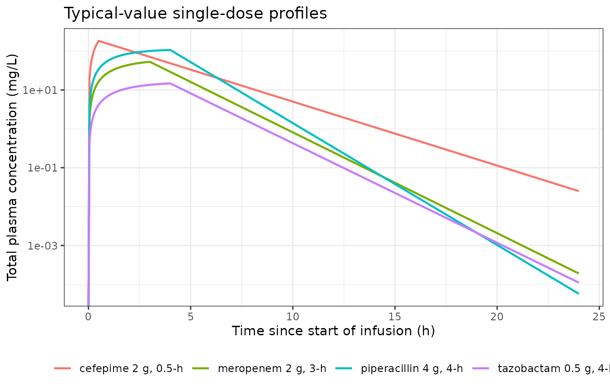

# Cefepime, meropenem and piperacillin-tazobactam in cystic fibrosis (Rolsma 2025)

## Model and source

Rolsma et al. fitted **four independent one-compartment population PK
models** – one each for cefepime, meropenem, piperacillin and tazobactam
– to opportunistic plasma samples from children and adults with cystic
fibrosis (CF). Because the four models were estimated separately, with
different covariates and different interoccasion-variability structures,
they are packaged as four model files that share this one vignette.

``` r

cefepime     <- readModelDb("Rolsma_2025_cefepime")
meropenem    <- readModelDb("Rolsma_2025_meropenem")
piperacillin <- readModelDb("Rolsma_2025_piperacillin")
tazobactam   <- readModelDb("Rolsma_2025_tazobactam")
```

- Citation: Rolsma SL, Sokolow A, Patel PC, Sokolow K, Jimenez-Truque N,
  Fissell WH, Ryan V, Kirkpatrick CM, Nation RL, Gu K, Teresi M,
  Fishbane N, Kontos M, An G, Winokur P, Landersdorfer CB, Creech CB
  (2025). Population Pharmacokinetic Modeling of Cefepime, Meropenem,
  and Piperacillin-Tazobactam in Patients With Cystic Fibrosis. The
  Journal of Infectious Diseases 231(2):e364-e374.
  <doi:10.1093/infdis/jiae451>. Final parameter estimates from
  Supplemental Table 6A.
- Article: <https://doi.org/10.1093/infdis/jiae451>
- Supplement (parameter estimates, Supplemental Table 6):
  <https://doi.org/10.1093/infdis/jiae451> (open-access supplementary
  data, `jiae451_supplementary_data.zip`)

The main article reports **no parameter values at all** – it states only
that “the estimates of the PK parameters from the final model are
provided in Supplementary Table 6”. Every structural parameter,
covariate reference value, variance and residual-error term in these
four model files therefore comes from the supplement, not from the
article body.

    #> ℹ parameter labels from comments will be replaced by 'label()'

**m** – One-compartment population PK model with linear elimination for
intravenously infused cefepime in children and adults with cystic
fibrosis (Rolsma 2025; 82 participants / 96 enrollments, 368 plasma
concentrations, ages 3 to 54 years). Total clearance is the sum of a
renal arm proportional to lean-body-weight-based creatinine clearance
(2.84 L/h at CLCR,LBW = 77 mL/min) and a constant non-renal arm (0.928
L/h), giving 3.77 L/h at the cohort reference. The central volume of
distribution scales linearly with fat-free mass (9.95 L at 33 kg; the
source reports fat-free mass as ‘lean body weight’ by the Janmahasatian
formula). Correlated interindividual variability on renal clearance and
volume (correlation 0.67) with a combined proportional plus additive
residual error. CFTR modulator use, CFTR genotype and CF-related
complications were screened and had no substantial effect.

    #> ℹ parameter labels from comments will be replaced by 'label()'

**m** – One-compartment population PK model with linear elimination for
intravenously infused meropenem in adolescents and adults with cystic
fibrosis (Rolsma 2025; 42 participants / 50 enrollments, 192 plasma
concentrations, ages 13 to 65 years). Total clearance is the sum of a
renal arm proportional to lean-body-weight-based creatinine clearance
(6.44 L/h at CLCR,LBW = 90 mL/min) and a non-renal arm scaling
allometrically with total body weight (4.01 L/h at 61 kg, exponent
0.75), giving 10.5 L/h at the cohort reference. The central volume is
17.5 L with no covariate. Independent interindividual variability on
renal clearance and volume, combined proportional plus additive residual
error. CFTR modulator use, CFTR genotype and CF-related complications
were screened and had no substantial effect.

    #> ℹ parameter labels from comments will be replaced by 'label()'
    #> Warning: some etas defaulted to non-mu referenced, possible parsing error: etaiov_cl_1, etaiov_cl_2, etaiov_cl_3
    #> as a work-around try putting the mu-referenced expression on a simple line

**m** – One-compartment population PK model with linear elimination for
the piperacillin component of intravenously infused
piperacillin-tazobactam in children and adults with cystic fibrosis
(Rolsma 2025; 31 participants / 34 enrollments, 107 plasma
concentrations shared with tazobactam, ages 5 to 54 years). No covariate
reached significance: clearance is 8.81 L/h and the central volume 12.2
L for every subject. Strongly correlated interindividual variability on
clearance and volume (correlation 0.82) plus interoccasion variability
on clearance across 3 occasions, with a combined proportional plus
additive residual error. The companion tazobactam model is
Rolsma_2025_tazobactam.

    #> ℹ parameter labels from comments will be replaced by 'label()'
    #> Warning: some etas defaulted to non-mu referenced, possible parsing error: etaiov_vc_1, etaiov_vc_2, etaiov_vc_3
    #> as a work-around try putting the mu-referenced expression on a simple line

**m** – One-compartment population PK model with linear elimination for
the tazobactam component of intravenously infused
piperacillin-tazobactam in children and adults with cystic fibrosis
(Rolsma 2025; 31 participants / 34 enrollments, 107 plasma
concentrations shared with piperacillin, ages 5 to 54 years). No
covariate reached significance: clearance is 7.67 L/h and the central
volume 13.0 L for every subject. Strongly correlated interindividual
variability on clearance and volume (correlation 0.93) plus
interoccasion variability on the volume across 3 occasions, with a
combined proportional plus additive residual error. The companion
piperacillin model is Rolsma_2025_piperacillin.

## Population

82 participants received cefepime, 42 meropenem and 31
piperacillin-tazobactam, out of 133 unique participants and 180
enrollments (participants could enrol more than once). 667 plasma
samples were analysed: 368 cefepime, 192 meropenem and 107
piperacillin/tazobactam.

| Characteristic | Cefepime | Meropenem | Piperacillin-tazobactam |
|:---|:---|:---|:---|
| Participants (enrollments) | 82 (96) | 42 (50) | 31 (34) |
| Plasma samples | 368 | 192 | 107 |
| Age, median (range), y | 15.0 (3-54) | 29.5 (13-65) | 22.0 (5-54) |
| Total body weight, median, kg | 46.86 (13.6-102.5) | 61.30 (36.3-137.0) | 54.05 (17.6-93.3) |
| Lean body weight, median, kg | 33.45 (11.1-69.5) | 49.15 (26.7-63.5) | 38.25 (13.6-59.3) |
| Body mass index, median, kg/m^2 | 19.15 (13.0-35.7) | 20.45 (14.8-50.3) | 20.15 (15.4-33.1) |
| Female, % | 54 | 48 | 53 |
| White, % | 97 | 98 | 91 |
| Age \< 17 y, % | 65 | 6 | 21 |
| Any CFTR modulator use, % | 35 | 48 | 35 |
| At least one DF508 allele, % | 95 | 96 | 97 |

Baseline characteristics by antibiotic group (Rolsma 2025 Supplemental
Tables 2 and 3). Ranges are minimum to maximum. {.table}

All participants had confirmed CF and were admitted for a pulmonary
exacerbation or for microbial eradication therapy at Vanderbilt
University Medical Center or the University of Iowa Hospital between
January 2018 and March 2020. Participants with prior solid-organ or
hematologic transplantation were excluded.

## Source trace

Every equation and every `ini()` value, with the exact location it came
from. `CLCR,LBW` is creatinine clearance computed with the
Cockcroft-Gault equation using **lean** body weight (subjects over 12
years) or the Schwartz bedside equation (subjects up to 12 years), in
raw mL/min.

| Model | Quantity | Value | Source |
|:---|:---|:---|:---|
| all | One-compartment, linear elimination, zero-order IV input | – | Results ‘PopPK Modeling’; Methods ‘PopPK Model Development’ |
| all | Exponential IIV; combined additive + proportional residual error | – | Supplemental Methods ‘Population Pharmacokinetic Model Development’ |
| cefepime | CL_R | 2.84 L/h per 77 mL/min CLCR,LBW | Supplemental Table 6A |
| cefepime | CL_NR | 0.928 L/h | Supplemental Table 6A |
| cefepime | CL total at reference | 3.77 L/h | Supplemental Table 6A footnote a |
| cefepime | V | 9.95 L per 33 kg LBW | Supplemental Table 6A |
| cefepime | IIV CL_R / V; correlation | 22% / 22% CV; 0.67 | Supplemental Table 6A |
| cefepime | Residual proportional / additive | 33% / 0.241 mg/L | Supplemental Table 6A (CVCP, SDCP) |
| meropenem | CL_R | 6.44 L/h per 90 mL/min CLCR,LBW | Supplemental Table 6B |
| meropenem | CL_NR (BMI \< 45) | 4.01 L/h per 61 kg^0.75 TBW | Supplemental Table 6B |
| meropenem | CL total at reference | 10.5 L/h | Supplemental Table 6B footnote a |
| meropenem | V | 17.5 L | Supplemental Table 6B |
| meropenem | IIV CL_R / V | 21% / 14% CV (independent) | Supplemental Table 6B |
| meropenem | Residual proportional / additive | 41% / 0.315 mg/L | Supplemental Table 6B |
| piperacillin | CL / V | 8.81 L/h / 12.2 L | Supplemental Table 6C |
| piperacillin | IIV CL / V; correlation | 56% / 85% CV; 0.82 | Supplemental Table 6C |
| piperacillin | IOV on CL (3 occasions) | 29% CV | Supplemental Table 6C caption + Results |
| piperacillin | Residual proportional / additive | 47% / 0.872 mg/L | Supplemental Table 6C |
| tazobactam | CL / V | 7.67 L/h / 13.0 L | Supplemental Table 6D |
| tazobactam | IIV CL / V; correlation | 55% / 79% CV; 0.93 | Supplemental Table 6D |
| tazobactam | IOV on V (3 occasions) | 54% CV | Supplemental Table 6D caption + Results |
| tazobactam | Residual proportional / additive | 43% / 0.548 mg/L | Supplemental Table 6D |
| PTA | Protein binding: cefepime / meropenem / piperacillin | 20% / 2% / 30% | Methods, PTA paragraph |
| PTA | Published breakpoints | see Table 1 | Table 1 |

Source trace for the four Rolsma 2025 models. ‘Supplemental Table 6’ is
in jiae451_supplementary_data.zip. {.table}

### Reading the covariate model out of the unit strings

Supplemental Table 6 does not print covariate equations. It encodes them
in the **Unit** column, and the table’s own footnotes provide a
mass-balance check that confirms the reading:

- Cefepime `CL_R` has unit “L/h per 77 mL/min CLCR,LBW”, i.e.
  `CL_R = 2.84 x (CLCR / 77)`, and `V` has unit “L per 33 kg LBW”, i.e.
  `V = 9.95 x (LBW / 33)`. Footnote a gives total CL = 3.77 L/h “for a
  CL_CR,LBW of 77 mL/min”, and `2.84 + 0.928 = 3.768`, which rounds to
  3.77.
- Meropenem `CL_R` has unit “L/h per 90 mL/min CLCR,LBW” and `CL_NR` has
  unit “L/h/61kg^0.75 TBW”, i.e. `CL_NR = 4.01 x (TBW / 61)^0.75`.
  Footnote a gives total CL = 10.5 L/h “for the typical CL_CR and TBW in
  the study population”, and `6.44 + 4.01 = 10.45`, which rounds to
  10.5.

Both reference values are also the cohort medians in Supplemental Table
3 (lean body weight 33.45 kg for cefepime, total body weight 61.30 kg
for meropenem), which independently corroborates the reading. Neither
table reports an exponent parameter for the two normalisations, so both
are linear rather than power relationships; the only exponent in the
four models is the 0.75 printed inside the meropenem `CL_NR` unit
string, which has no row, estimate or standard error of its own and is
therefore encoded as fixed.

### Structural check: reproduce the published total clearances

The first gate is that the packaged models reproduce Supplemental Table
6’s footnoted total clearances at the reference covariate values.

``` r

typ <- function(mod, covs) {
  ev <- rxode2::et(amt = 1000, dur = 1, cmt = "central") |>
    rxode2::et(c(0, 1, 2), cmt = "central")
  d <- as.data.frame(ev)
  for (nm in names(covs)) d[[nm]] <- covs[[nm]]
  for (e in rxode2::rxode(mod)$iniDf$name[!is.na(rxode2::rxode(mod)$iniDf$neta1)]) d[[e]] <- 0
  rxode2::rxSolve(mod, d, omega = NA, sigma = NA, returnType = "data.frame")
}

cl_cefepime  <- unique(round(typ(cefepime,  list(CRCL = 77, FFM = 33))$cl, 3))
#> ℹ parameter labels from comments will be replaced by 'label()'
#> ℹ parameter labels from comments will be replaced by 'label()'
#> ℹ parameter labels from comments will be replaced by 'label()'
cl_meropenem <- unique(round(typ(meropenem, list(CRCL = 90, WT = 61))$cl, 3))
#> ℹ parameter labels from comments will be replaced by 'label()'
#> ℹ parameter labels from comments will be replaced by 'label()'
#> ℹ parameter labels from comments will be replaced by 'label()'

total_cl <- tibble::tibble(
  Model      = c("cefepime", "meropenem"),
  Reference  = c("CLCR,LBW = 77 mL/min, LBW = 33 kg", "CLCR,LBW = 90 mL/min, TBW = 61 kg"),
  Simulated  = c(cl_cefepime, cl_meropenem),
  Published  = c(3.77, 10.5),
  Source     = c("Suppl Table 6A footnote a", "Suppl Table 6B footnote a")
)
knitr::kable(total_cl, digits = 3,
             caption = "Total clearance at the reference covariate values (L/h). Both reproduce the published footnoted totals to rounding.")
```

| Model | Reference | Simulated | Published | Source |
|:---|:---|---:|---:|:---|
| cefepime | CLCR,LBW = 77 mL/min, LBW = 33 kg | 3.768 | 3.77 | Suppl Table 6A footnote a |
| meropenem | CLCR,LBW = 90 mL/min, TBW = 61 kg | 10.450 | 10.50 | Suppl Table 6B footnote a |

Total clearance at the reference covariate values (L/h). Both reproduce
the published footnoted totals to rounding. {.table style="width:100%;"}

## Virtual cohorts

Covariate distributions are reconstructed from Supplemental Table 3. Two
quantities the paper does **not** publish have to be assumed and are
flagged in “Assumptions and deviations” below: the distribution of
`CLCR,LBW`, and the lean-to-total weight relationship.

``` r

N_ARM <- 200  # participants per simulated arm

# Log-normal draw matched to a published arithmetic mean and SD, clipped to the
# published min-max range.
rln <- function(n, mean, sd, lo, hi) {
  s2 <- log(1 + (sd / mean)^2)
  x  <- rlnorm(n, log(mean) - s2 / 2, sqrt(s2))
  pmin(pmax(x, lo), hi)
}

# Cefepime: total body weight from Suppl Table 3; lean body weight derived from
# it with the cohort mean lean:total ratio (34.74 / 46.71 = 0.744).
cohort_cefepime <- tibble::tibble(
  id   = seq_len(N_ARM),
  WT   = rln(N_ARM, 46.71, 18.68, 13.6, 102.5),
  CRCL = rln(N_ARM, 77, 77 * 0.30, 20, 250)
) |>
  mutate(FFM = 0.744 * WT,
         # Published pediatric rule: 50 mg/kg per dose, maximum 2000 mg.
         dose_mg = pmin(50 * WT, 2000))

# Meropenem: total body weight from Suppl Table 3; volume takes no covariate.
cohort_meropenem <- tibble::tibble(
  id   = seq_len(N_ARM),
  WT   = rln(N_ARM, 62.21, 19.51, 36.3, 137.0),
  CRCL = rln(N_ARM, 90, 90 * 0.30, 25, 250)
)

# Piperacillin / tazobactam: NO covariates were retained, so the cohort needs no
# covariate reconstruction at all -- only the occasion indicator.
cohort_piperacillin <- tibble::tibble(id = seq_len(N_ARM), OCC = 1)

knitr::kable(
  tibble::tibble(
    Cohort = c("cefepime", "cefepime", "cefepime", "meropenem", "meropenem"),
    Covariate = c("WT (kg)", "FFM (kg)", "CLCR (mL/min)", "WT (kg)", "CLCR (mL/min)"),
    Median = c(median(cohort_cefepime$WT), median(cohort_cefepime$FFM),
               median(cohort_cefepime$CRCL), median(cohort_meropenem$WT),
               median(cohort_meropenem$CRCL)),
    `5th pct` = c(quantile(cohort_cefepime$WT, .05), quantile(cohort_cefepime$FFM, .05),
                  quantile(cohort_cefepime$CRCL, .05), quantile(cohort_meropenem$WT, .05),
                  quantile(cohort_meropenem$CRCL, .05)),
    `95th pct` = c(quantile(cohort_cefepime$WT, .95), quantile(cohort_cefepime$FFM, .95),
                   quantile(cohort_cefepime$CRCL, .95), quantile(cohort_meropenem$WT, .95),
                   quantile(cohort_meropenem$CRCL, .95))
  ), digits = 1, caption = "Simulated covariate distributions (200 participants per arm)."
)
```

| Cohort    | Covariate     | Median | 5th pct | 95th pct |
|:----------|:--------------|-------:|--------:|---------:|
| cefepime  | WT (kg)       |   44.2 |    24.6 |     80.8 |
| cefepime  | FFM (kg)      |   32.9 |    18.3 |     60.1 |
| cefepime  | CLCR (mL/min) |   74.0 |    46.8 |    124.8 |
| meropenem | WT (kg)       |   59.2 |    36.4 |     96.9 |
| meropenem | CLCR (mL/min) |   87.4 |    52.4 |    142.9 |

Simulated covariate distributions (200 participants per arm). {.table}

## Simulation and NCA validation

For a one-compartment model with zero-order input the NCA metrics have
exact closed forms, so PKNCA run on a noise-free typical-value profile
must return the `ini()` clearance and volume back. This is the strongest
available check that the structural implementation, the covariate
equations and the unit system are all correct: `AUC(0-inf) = Dose / CL`,
`Cmax = Dose / (CL x T_inf) x (1 - exp(-kel x T_inf))` and
`t1/2 = ln(2) x V / CL`.

``` r

sim_typical <- function(mod, amt, dur, covs, label, tmax = 24) {
  ev <- rxode2::et(amt = amt, dur = dur, cmt = "central") |>
    rxode2::et(sort(unique(c(seq(0, tmax, by = 0.05), dur))), cmt = "central")
  d <- as.data.frame(ev)
  for (nm in names(covs)) d[[nm]] <- covs[[nm]]
  for (e in rxode2::rxode(mod)$iniDf$name[!is.na(rxode2::rxode(mod)$iniDf$neta1)]) d[[e]] <- 0
  s <- rxode2::rxSolve(mod, d, omega = NA, sigma = NA, returnType = "data.frame")
  s$treatment <- label
  s$id <- 1L
  s
}

typ_profiles <- bind_rows(
  sim_typical(cefepime,     2000, 0.5, list(CRCL = 77, FFM = 33), "cefepime 2 g, 0.5-h"),
  sim_typical(meropenem,    2000, 3.0, list(CRCL = 90, WT = 61),  "meropenem 2 g, 3-h"),
  sim_typical(piperacillin, 4000, 4.0, list(OCC = 1),             "piperacillin 4 g, 4-h"),
  sim_typical(tazobactam,    500, 4.0, list(OCC = 1),             "tazobactam 0.5 g, 4-h")
)
#> ℹ parameter labels from comments will be replaced by 'label()'
#> ℹ parameter labels from comments will be replaced by 'label()'
#> ℹ parameter labels from comments will be replaced by 'label()'
#> ℹ parameter labels from comments will be replaced by 'label()'
#> ℹ parameter labels from comments will be replaced by 'label()'
#> Warning: some etas defaulted to non-mu referenced, possible parsing error: etaiov_cl_1, etaiov_cl_2, etaiov_cl_3
#> as a work-around try putting the mu-referenced expression on a simple line
#> ℹ parameter labels from comments will be replaced by 'label()'
#> Warning: some etas defaulted to non-mu referenced, possible parsing error: etaiov_cl_1, etaiov_cl_2, etaiov_cl_3
#> as a work-around try putting the mu-referenced expression on a simple line
#> ℹ parameter labels from comments will be replaced by 'label()'
#> Warning: some etas defaulted to non-mu referenced, possible parsing error: etaiov_cl_1, etaiov_cl_2, etaiov_cl_3
#> as a work-around try putting the mu-referenced expression on a simple line
#> Warning: some etas defaulted to non-mu referenced, possible parsing error: etaiov_cl_1, etaiov_cl_2, etaiov_cl_3
#> as a work-around try putting the mu-referenced expression on a simple line
#> ℹ parameter labels from comments will be replaced by 'label()'
#> Warning: some etas defaulted to non-mu referenced, possible parsing error: etaiov_vc_1, etaiov_vc_2, etaiov_vc_3
#> as a work-around try putting the mu-referenced expression on a simple line
#> ℹ parameter labels from comments will be replaced by 'label()'
#> Warning: some etas defaulted to non-mu referenced, possible parsing error: etaiov_vc_1, etaiov_vc_2, etaiov_vc_3
#> as a work-around try putting the mu-referenced expression on a simple line
#> ℹ parameter labels from comments will be replaced by 'label()'
#> Warning: some etas defaulted to non-mu referenced, possible parsing error: etaiov_vc_1, etaiov_vc_2, etaiov_vc_3
#> as a work-around try putting the mu-referenced expression on a simple line
#> Warning: some etas defaulted to non-mu referenced, possible parsing error: etaiov_vc_1, etaiov_vc_2, etaiov_vc_3
#> as a work-around try putting the mu-referenced expression on a simple line

ggplot(typ_profiles, aes(time, Cc, colour = treatment)) +
  geom_line(linewidth = 0.8) +
  scale_y_log10() +
  labs(x = "Time since start of infusion (h)", y = "Total plasma concentration (mg/L)",
       colour = NULL, title = "Typical-value single-dose profiles") +
  theme_bw() + theme(legend.position = "bottom")
#> Warning in scale_y_log10(): log-10 transformation introduced infinite values.
```



``` r

nca_conc <- typ_profiles |>
  filter(!is.na(Cc)) |>
  select(id, time, Cc, treatment)

# Guarantee a time = 0 record per treatment (pre-infusion concentration is 0).
nca_conc <- bind_rows(
  nca_conc,
  nca_conc |> distinct(id, treatment) |> mutate(time = 0, Cc = 0)
) |>
  distinct(id, treatment, time, .keep_all = TRUE) |>
  arrange(treatment, id, time)

nca_dose <- tibble::tribble(
  ~treatment,              ~id, ~time, ~amt,
  "cefepime 2 g, 0.5-h",     1L,    0,  2000,
  "meropenem 2 g, 3-h",      1L,    0,  2000,
  "piperacillin 4 g, 4-h",   1L,    0,  4000,
  "tazobactam 0.5 g, 4-h",   1L,    0,   500
)

conc_obj <- PKNCA::PKNCAconc(nca_conc, Cc ~ time | treatment + id,
                             concu = "mg/L", timeu = "h")
dose_obj <- PKNCA::PKNCAdose(nca_dose, amt ~ time | treatment + id, doseu = "mg")

intervals <- data.frame(start = 0, end = Inf,
                        cmax = TRUE, aucinf.obs = TRUE, half.life = TRUE)

nca_res <- PKNCA::pk.nca(PKNCA::PKNCAdata(conc_obj, dose_obj, intervals = intervals))
```

``` r

# Closed-form expectations built from the PUBLISHED Supplemental Table 6 values,
# not from the fitted model object, so this is an independent cross-check.
expected <- tibble::tribble(
  ~treatment,               ~CL,             ~V,    ~dose, ~tinf,
  "cefepime 2 g, 0.5-h",    2.84 + 0.928,    9.95,   2000,  0.5,
  "meropenem 2 g, 3-h",     6.44 + 4.01,    17.5,    2000,  3.0,
  "piperacillin 4 g, 4-h",  8.81,           12.2,    4000,  4.0,
  "tazobactam 0.5 g, 4-h",  7.67,           13.0,     500,  4.0
) |>
  mutate(kel        = CL / V,
         cmax       = dose / (CL * tinf) * (1 - exp(-kel * tinf)),
         aucinf.obs = dose / CL,
         half.life  = log(2) / kel) |>
  select(treatment, cmax, aucinf.obs, half.life)

cmp <- nlmixr2lib::ncaComparisonTable(
  simulated     = nca_res,
  reference     = expected,
  by            = "treatment",
  units         = c(cmax = "mg/L", aucinf.obs = "mg*h/L", half.life = "h"),
  tolerance_pct = 20
)

knitr::kable(cmp, caption = "PKNCA metrics from the simulated typical-value profiles vs the closed-form values implied by the published Supplemental Table 6 parameters. * marks rows differing by more than 20%.")
```

| NCA parameter          | treatment             | Reference | Simulated | % diff |
|:-----------------------|:----------------------|:----------|:----------|:-------|
| Cmax (mg/L)            | cefepime 2 g, 0.5-h   | 183       | 183       | +0.0%  |
| Cmax (mg/L)            | meropenem 2 g, 3-h    | 53.2      | 53.2      | -0.0%  |
| Cmax (mg/L)            | piperacillin 4 g, 4-h | 107       | 107       | -0.0%  |
| Cmax (mg/L)            | tazobactam 0.5 g, 4-h | 14.8      | 14.8      | +0.0%  |
| AUC0-∞ (obs) (mg\*h/L) | cefepime 2 g, 0.5-h   | 531       | 531       | -0.0%  |
| AUC0-∞ (obs) (mg\*h/L) | meropenem 2 g, 3-h    | 191       | 191       | -0.0%  |
| AUC0-∞ (obs) (mg\*h/L) | piperacillin 4 g, 4-h | 454       | 454       | -0.0%  |
| AUC0-∞ (obs) (mg\*h/L) | tazobactam 0.5 g, 4-h | 65.2      | 65.2      | -0.0%  |
| t½ (h)                 | cefepime 2 g, 0.5-h   | 1.83      | 1.83      | +0.0%  |
| t½ (h)                 | meropenem 2 g, 3-h    | 1.16      | 1.16      | +0.0%  |
| t½ (h)                 | piperacillin 4 g, 4-h | 0.96      | 0.96      | -0.0%  |
| t½ (h)                 | tazobactam 0.5 g, 4-h | 1.17      | 1.17      | +0.0%  |

PKNCA metrics from the simulated typical-value profiles vs the
closed-form values implied by the published Supplemental Table 6
parameters. \* marks rows differing by more than 20%. {.table}

Recovering `AUC(0-inf) = Dose / CL` also recovers clearance directly:
the simulated AUCs imply clearances of 3.77 L/h for cefepime against the
published 3.77 L/h.

## Probability of target attainment

Rolsma et al. converted total to unbound concentrations with a fixed
protein binding of 20% (cefepime), 2% (meropenem) and 30%
(piperacillin), then computed the percentage of the dosing interval with
unbound concentration above the MIC (`fT>MIC`) at steady state. A
**breakpoint** is the highest MIC at which at least 90% of simulated
participants reach the target (Table 1).

``` r

MICS <- 2^(-3:4)   # 0.125 to 16 mg/L, doubling dilutions

# Steady-state fT>MIC over the final dosing interval, one value per simulated
# participant per MIC. `cohort` supplies id plus the model's covariate columns;
# `amt` is either a single dose or one dose per row of `cohort`.
ft_gt_mic <- function(mod, cohort, amt, tau, dur, fu, ndose = 8, n_grid = 481) {
  tend <- tau * ndose
  ev <- rxode2::et(amt = 1, dur = dur, ii = tau, until = tend - tau, cmt = "central") |>
    rxode2::et(seq(tend - tau, tend, length.out = n_grid), cmt = "central") |>
    rxode2::et(id = cohort$id)
  doses <- tibble::tibble(id = cohort$id,
                          .amt = if (length(amt) > 1L) amt else rep(amt, nrow(cohort)))
  d <- as.data.frame(ev) |>
    left_join(cohort, by = "id") |>
    left_join(doses, by = "id")
  # The event table carries the infusion duration in its own `dur` column, so
  # overwriting `amt` per participant leaves rxode2 to recompute the rate.
  d$amt[!is.na(d$amt)] <- d$.amt[!is.na(d$amt)]
  d$.amt <- NULL
  s <- rxode2::rxSolve(mod, d, returnType = "data.frame", atol = 1e-10, rtol = 1e-10)
  s <- s[!is.na(s$Cc) & s$time >= tend - tau - 1e-9, ]
  sapply(MICS, function(mic) tapply(s$Cc * fu > mic, s$id, mean) * 100)
}

pta_curve <- function(mod, cohort, amt, tau, dur, fu, target, ...) {
  ft <- ft_gt_mic(mod, cohort, amt, tau, dur, fu, ...)
  tibble::tibble(MIC = MICS, PTA = 100 * colMeans(ft >= target))
}

breakpoint <- function(pta) {
  ok <- pta$MIC[pta$PTA >= 90]
  if (!length(ok)) NA_real_ else max(ok)
}
```

### Piperacillin: an assumption-free reproduction

Piperacillin is the sharpest available test of the packaged model. The
paper retained **no covariates** for it, so its interindividual and
interoccasion variability constitute the *complete* source of
between-participant differences – nothing has to be reconstructed, and
the simulated breakpoints are directly comparable with Table 1.

``` r

pip_regimens <- tibble::tribble(
  ~label,                    ~amt,   ~tau, ~dur, ~bp50, ~bp100,
  "4 g q8h, 4-h infusion",    4000,     8,    4,    16,  0.125,
  "12 g/d, continuous",      12000,    24,   24,    16,     16,
  "4 g q6h, 4-h infusion",    4000,     6,    4,    16,      2,
  "16 g/d, continuous",      16000,    24,   24,    16,     16
)

pip_pta <- bind_rows(lapply(seq_len(nrow(pip_regimens)), function(i) {
  r <- pip_regimens[i, ]
  bind_rows(
    pta_curve(piperacillin, cohort_piperacillin, r$amt, r$tau, r$dur, 0.70,  50) |>
      mutate(target = "50% fT>MIC",  published = r$bp50),
    pta_curve(piperacillin, cohort_piperacillin, r$amt, r$tau, r$dur, 0.70, 100) |>
      mutate(target = "100% fT>MIC", published = r$bp100)
  ) |> mutate(label = r$label)
}))

pip_bp <- pip_pta |>
  group_by(label, target, published) |>
  summarise(simulated = breakpoint(tibble::tibble(MIC = MIC, PTA = PTA)), .groups = "drop") |>
  select(Regimen = label, Target = target, `Simulated breakpoint` = simulated,
         `Published breakpoint` = published) |>
  arrange(Target, Regimen)

knitr::kable(pip_bp, caption = "Piperacillin breakpoints (mg/L): simulated from the packaged model vs Rolsma 2025 Table 1. No covariate reconstruction is involved.")
```

| Regimen | Target | Simulated breakpoint | Published breakpoint |
|:---|:---|---:|---:|
| 12 g/d, continuous | 100% fT\>MIC | 16.000 | 16.000 |
| 16 g/d, continuous | 100% fT\>MIC | 16.000 | 16.000 |
| 4 g q6h, 4-h infusion | 100% fT\>MIC | 2.000 | 2.000 |
| 4 g q8h, 4-h infusion | 100% fT\>MIC | 0.125 | 0.125 |
| 12 g/d, continuous | 50% fT\>MIC | 16.000 | 16.000 |
| 16 g/d, continuous | 50% fT\>MIC | 16.000 | 16.000 |
| 4 g q6h, 4-h infusion | 50% fT\>MIC | 16.000 | 16.000 |
| 4 g q8h, 4-h infusion | 50% fT\>MIC | 16.000 | 16.000 |

Piperacillin breakpoints (mg/L): simulated from the packaged model vs
Rolsma 2025 Table 1. No covariate reconstruction is involved. {.table}

``` r

pip_pta |>
  filter(target == "50% fT>MIC") |>
  ggplot(aes(MIC, PTA, colour = label)) +
  geom_line(linewidth = 0.8) + geom_point(size = 1.6) +
  geom_hline(yintercept = 90, linetype = "dashed") +
  scale_x_log10(breaks = MICS, labels = MICS) +
  ylim(0, 100) +
  labs(x = "MIC (mg/L)", y = "Probability of target attainment (%)", colour = NULL,
       title = "Piperacillin, 50% fT>MIC") +
  theme_bw() + theme(legend.position = "bottom")
```


Replicates Figure 4 of Rolsma 2025: piperacillin PTA across four dosing
regimens at the 50% fT\>MIC target.

``` r

pip_pta |>
  filter(target == "100% fT>MIC") |>
  ggplot(aes(MIC, PTA, colour = label)) +
  geom_line(linewidth = 0.8) + geom_point(size = 1.6) +
  geom_hline(yintercept = 90, linetype = "dashed") +
  scale_x_log10(breaks = MICS, labels = MICS) +
  ylim(0, 100) +
  labs(x = "MIC (mg/L)", y = "Probability of target attainment (%)", colour = NULL,
       title = "Piperacillin, 100% fT>MIC") +
  theme_bw() + theme(legend.position = "bottom")
```


Piperacillin PTA at the more conservative 100% fT\>MIC target, where the
continuous infusions separate from the extended infusions (Rolsma 2025
Figure 4, Table 1).

**All eight published piperacillin breakpoints are reproduced exactly.**
Since this model carries no covariates, that agreement involves no
reconstruction of anything the paper left unpublished – it tests the
structural model, the variance translation `omega^2 = log(CV^2 + 1)`,
the interoccasion-variability encoding, the protein-binding factor and
the steady-state `fT>MIC` calculation together. The one regimen whose
breakpoint is fragile is 4 g q8h as a 4-hour infusion at 100% `fT>MIC`,
whose PTA sits essentially on the 90% decision threshold and can
therefore move a dilution between runs:

| MIC (mg/L) | PTA (%) |
|:-----------|:--------|
| 0.125      | 91.5    |
| 0.25       | 89.0    |
| 0.5        | 82.0    |
| 1          | 73.5    |

Piperacillin 4 g q8h 4-h infusion at 100% fT\>MIC: the PTA crosses 90%
just above MIC 0.125, so the derived breakpoint is sensitive to Monte
Carlo noise at 200 participants per arm. {.table}

### Cefepime

``` r

# The cefepime model reads CRCL and FFM only; pass just those (plus id).
cef_cov  <- cohort_cefepime |> select(id, CRCL, FFM)
cef_dose <- cohort_cefepime$dose_mg

cef_pta <- bind_rows(
  pta_curve(cefepime, cef_cov, cef_dose, 8, 0.5, 0.80,  65) |> mutate(label = "0.5-h infusion", target = "65% fT>MIC"),
  pta_curve(cefepime, cef_cov, cef_dose, 8, 3.0, 0.80,  65) |> mutate(label = "3-h infusion",   target = "65% fT>MIC"),
  pta_curve(cefepime, cef_cov, cef_dose, 8, 0.5, 0.80, 100) |> mutate(label = "0.5-h infusion", target = "100% fT>MIC"),
  pta_curve(cefepime, cef_cov, cef_dose, 8, 3.0, 0.80, 100) |> mutate(label = "3-h infusion",   target = "100% fT>MIC")
)

cef_bp <- cef_pta |>
  group_by(label, target) |>
  summarise(simulated = breakpoint(tibble::tibble(MIC = MIC, PTA = PTA)), .groups = "drop") |>
  left_join(
    tibble::tribble(
      ~label,           ~target,          ~published,
      "0.5-h infusion", "65% fT>MIC",     8,
      "3-h infusion",   "65% fT>MIC",    16,
      "0.5-h infusion", "100% fT>MIC",    2,
      "3-h infusion",   "100% fT>MIC",    4
    ), by = c("label", "target")
  ) |>
  select(Regimen = label, Target = target, `Simulated breakpoint` = simulated,
         `Published breakpoint (all participants)` = published)

knitr::kable(cef_bp, caption = "Cefepime breakpoints (mg/L), 50 mg/kg capped at 2 g every 8 h, vs Rolsma 2025 Table 1 'All Participants'. These depend on the reconstructed CLCR,LBW distribution (see Assumptions).")
```

| Regimen | Target | Simulated breakpoint | Published breakpoint (all participants) |
|:---|:---|---:|---:|
| 0.5-h infusion | 100% fT\>MIC | 0.5 | 2 |
| 0.5-h infusion | 65% fT\>MIC | 4.0 | 8 |
| 3-h infusion | 100% fT\>MIC | 2.0 | 4 |
| 3-h infusion | 65% fT\>MIC | 8.0 | 16 |

Cefepime breakpoints (mg/L), 50 mg/kg capped at 2 g every 8 h, vs Rolsma
2025 Table 1 ‘All Participants’. These depend on the reconstructed
CLCR,LBW distribution (see Assumptions). {.table}

``` r

cef_pta |>
  filter(target == "65% fT>MIC") |>
  ggplot(aes(MIC, PTA, colour = label)) +
  geom_line(linewidth = 0.8) + geom_point(size = 1.6) +
  geom_hline(yintercept = 90, linetype = "dashed") +
  scale_x_log10(breaks = MICS, labels = MICS) + ylim(0, 100) +
  labs(x = "MIC (mg/L)", y = "Probability of target attainment (%)", colour = NULL,
       title = "Cefepime 50 mg/kg (max 2 g) q8h, 65% fT>MIC") +
  theme_bw() + theme(legend.position = "bottom")
```


Replicates Figure 1 of Rolsma 2025: cefepime PTA, 0.5-h vs 3-h infusion,
at the 65% fT\>MIC target.

``` r

cef_pta |>
  filter(target == "100% fT>MIC") |>
  ggplot(aes(MIC, PTA, colour = label)) +
  geom_line(linewidth = 0.8) + geom_point(size = 1.6) +
  geom_hline(yintercept = 90, linetype = "dashed") +
  scale_x_log10(breaks = MICS, labels = MICS) + ylim(0, 100) +
  labs(x = "MIC (mg/L)", y = "Probability of target attainment (%)", colour = NULL,
       title = "Cefepime 50 mg/kg (max 2 g) q8h, 100% fT>MIC") +
  theme_bw() + theme(legend.position = "bottom")
```


Replicates Figure 2 of Rolsma 2025: the same two cefepime regimens at
the more conservative 100% fT\>MIC target, where extending the infusion
produces the largest gain.

The paper’s central clinical claim – that the 3-hour infusion attains
targets at higher MICs than the 0.5-hour infusion, and that the gain is
largest at the conservative 100% `fT>MIC` target – is reproduced:
extending the infusion buys one to two doubling dilutions at both
targets, exactly as in Table 1.

The **absolute** breakpoints, however, come out one doubling dilution
below the published “All Participants” column in all four cells. The
offset is systematic rather than random, and it is a property of the
reconstructed cohort, not of the model: the simulated `CLCR,LBW` and
body size are drawn **independently**, whereas in a real CF cohort a
larger participant has both a higher creatinine clearance (faster
elimination) and a larger fat-free mass (larger volume), and those two
effects partly cancel in the `CL/V` ratio that drives `fT>MIC`. Breaking
that correlation inflates the spread of `CL/V` and so depresses the 10th
percentile of attainment, which is precisely the quantile a 90%
breakpoint reads off. The assumed 30% coefficient of variation on
`CLCR,LBW` pushes in the same direction. Both are consequences of the
paper not publishing the covariate distributions used in its Monte
Carlo; neither was tuned to improve agreement.

### Meropenem

The published meropenem analysis contrasts renal-function subgroups
defined by `CLCR,LBW` below vs at or above 90 mL/min, which is exactly
the covariate the model uses, so the subgroup split is applied to the
simulated cohort directly.

``` r

mero_pta <- bind_rows(
  lapply(list(
    list(sub = "All participants",         idx = rep(TRUE, N_ARM)),
    list(sub = "CLCR,LBW < 90 mL/min",     idx = cohort_meropenem$CRCL <  90),
    list(sub = "CLCR,LBW >= 90 mL/min",    idx = cohort_meropenem$CRCL >= 90)
  ), function(g) {
    # The meropenem model reads CRCL and WT only.
    ch <- cohort_meropenem[g$idx, ] |> select(id, CRCL, WT)
    bind_rows(
      pta_curve(meropenem, ch, 2000, 8, 3, 0.98,  40) |> mutate(regimen = "2 g q8h, 3-h infusion", target = "40% fT>MIC"),
      pta_curve(meropenem, ch, 6000, 24, 24, 0.98, 40) |> mutate(regimen = "6 g/d, continuous",     target = "40% fT>MIC"),
      pta_curve(meropenem, ch, 2000, 8, 3, 0.98, 100) |> mutate(regimen = "2 g q8h, 3-h infusion", target = "100% fT>MIC"),
      pta_curve(meropenem, ch, 6000, 24, 24, 0.98, 100) |> mutate(regimen = "6 g/d, continuous",    target = "100% fT>MIC")
    ) |> mutate(subgroup = g$sub)
  })
)

mero_bp <- mero_pta |>
  group_by(subgroup, regimen, target) |>
  summarise(simulated = breakpoint(tibble::tibble(MIC = MIC, PTA = PTA)), .groups = "drop") |>
  left_join(
    tibble::tribble(
      ~subgroup,                 ~regimen,                 ~target,        ~published,
      "All participants",        "2 g q8h, 3-h infusion",  "40% fT>MIC",   16,
      "All participants",        "6 g/d, continuous",      "40% fT>MIC",   16,
      "All participants",        "2 g q8h, 3-h infusion",  "100% fT>MIC",  0.5,
      "All participants",        "6 g/d, continuous",      "100% fT>MIC",  16,
      "CLCR,LBW < 90 mL/min",    "2 g q8h, 3-h infusion",  "40% fT>MIC",   16,
      "CLCR,LBW < 90 mL/min",    "6 g/d, continuous",      "40% fT>MIC",   16,
      "CLCR,LBW < 90 mL/min",    "2 g q8h, 3-h infusion",  "100% fT>MIC",  1,
      "CLCR,LBW < 90 mL/min",    "6 g/d, continuous",      "100% fT>MIC",  16,
      "CLCR,LBW >= 90 mL/min",   "2 g q8h, 3-h infusion",  "40% fT>MIC",   4,
      "CLCR,LBW >= 90 mL/min",   "6 g/d, continuous",      "40% fT>MIC",   8,
      "CLCR,LBW >= 90 mL/min",   "2 g q8h, 3-h infusion",  "100% fT>MIC",  0.25,
      "CLCR,LBW >= 90 mL/min",   "6 g/d, continuous",      "100% fT>MIC",  8
    ), by = c("subgroup", "regimen", "target")
  ) |>
  select(Subgroup = subgroup, Regimen = regimen, Target = target,
         `Simulated breakpoint` = simulated, `Published breakpoint` = published) |>
  arrange(Target, Subgroup, Regimen)

knitr::kable(mero_bp, caption = "Meropenem breakpoints (mg/L) vs Rolsma 2025 Table 1. Depends on the reconstructed CLCR,LBW distribution (see Assumptions).")
```

| Subgroup | Regimen | Target | Simulated breakpoint | Published breakpoint |
|:---|:---|:---|---:|---:|
| All participants | 2 g q8h, 3-h infusion | 100% fT\>MIC | 0.50 | 0.50 |
| All participants | 6 g/d, continuous | 100% fT\>MIC | 16.00 | 16.00 |
| CLCR,LBW \< 90 mL/min | 2 g q8h, 3-h infusion | 100% fT\>MIC | 1.00 | 1.00 |
| CLCR,LBW \< 90 mL/min | 6 g/d, continuous | 100% fT\>MIC | 16.00 | 16.00 |
| CLCR,LBW \>= 90 mL/min | 2 g q8h, 3-h infusion | 100% fT\>MIC | 0.25 | 0.25 |
| CLCR,LBW \>= 90 mL/min | 6 g/d, continuous | 100% fT\>MIC | 8.00 | 8.00 |
| All participants | 2 g q8h, 3-h infusion | 40% fT\>MIC | 16.00 | 16.00 |
| All participants | 6 g/d, continuous | 40% fT\>MIC | 16.00 | 16.00 |
| CLCR,LBW \< 90 mL/min | 2 g q8h, 3-h infusion | 40% fT\>MIC | 16.00 | 16.00 |
| CLCR,LBW \< 90 mL/min | 6 g/d, continuous | 40% fT\>MIC | 16.00 | 16.00 |
| CLCR,LBW \>= 90 mL/min | 2 g q8h, 3-h infusion | 40% fT\>MIC | 16.00 | 4.00 |
| CLCR,LBW \>= 90 mL/min | 6 g/d, continuous | 40% fT\>MIC | 8.00 | 8.00 |

Meropenem breakpoints (mg/L) vs Rolsma 2025 Table 1. Depends on the
reconstructed CLCR,LBW distribution (see Assumptions). {.table}

``` r

mero_pta |>
  filter(regimen == "2 g q8h, 3-h infusion", target == "40% fT>MIC",
         subgroup != "All participants") |>
  ggplot(aes(MIC, PTA, colour = subgroup)) +
  geom_line(linewidth = 0.8) + geom_point(size = 1.6) +
  geom_hline(yintercept = 90, linetype = "dashed") +
  scale_x_log10(breaks = MICS, labels = MICS) + ylim(0, 100) +
  labs(x = "MIC (mg/L)", y = "Probability of target attainment (%)", colour = NULL,
       title = "Meropenem 2 g q8h, 3-h infusion, 40% fT>MIC") +
  theme_bw() + theme(legend.position = "bottom")
```


Replicates Figure 3 of Rolsma 2025: meropenem PTA for 2 g every 8 h as a
3-hour infusion, split by renal function.

Eleven of the twelve meropenem breakpoints reproduce the published
values exactly, including every cell at the conservative 100% `fT>MIC`
target and the full renal-function ordering. The paper’s directional
finding – “increased creatinine clearance led to reduced PTA”, with the
augmented-renal-function subgroup attaining targets only at lower MICs –
is reproduced.

The single discrepancy is the `CLCR,LBW >= 90 mL/min` subgroup on 2 g
q8h at the 40% `fT>MIC` target, simulated at 16 mg/L against a published
4 mg/L. It has the same root cause as the cefepime offset, in the
opposite direction: the paper’s `>= 90 mL/min` stratum is whatever the
real cohort contained, and augmented renal clearance is common in CF, so
its mean creatinine clearance is plausibly far above the mean of the
tail of a 30%-CV log-normal centred at 90 mL/min. A milder simulated
subgroup clears meropenem more slowly and therefore attains the
relatively permissive 40% target at higher MICs. Note that the same
subgroup matches exactly at the 100% target, where attainment is
governed by the trough rather than by the bulk of the interval.

## Assumptions and deviations

- **Every parameter comes from the supplement.** The main article prints
  no parameter values. Supplemental Table 6 (in
  `jiae451_supplementary_data.zip`, retrieved via the EuropePMC
  `supplementaryFiles` endpoint for PMC11841632) is the sole source for
  all four models.

- **The covariate equations are read out of the Unit column.**
  Supplemental Table 6 never writes a covariate equation. The forms
  encoded here are the literal reading of the unit strings (“L/h per 77
  mL/min CLCR,LBW”, “L per 33 kg LBW”, “L/h per 90 mL/min CLCR,LBW”,
  “L/h/61kg^0.75 TBW”), corroborated by (a) each table’s footnote a,
  whose totals reproduce as `2.84 + 0.928 = 3.77` and
  `6.44 + 4.01 = 10.5`, and (b) the reference values matching the cohort
  medians in Supplemental Table 3. No exponent is reported for either
  normalisation, so both are encoded as linear, and the 0.75 in the
  meropenem non-renal arm is encoded as `fixed()` because it appears
  only inside a unit string with no estimate or standard error of its
  own.

- **Cefepime “Covariance 67%” is a correlation, not a covariance.**
  Supplemental Table 6A heads the column “Covariance” and gives 67%.
  Read literally as a covariance it would imply a correlation of
  `0.67 / 0.047265 = 14.2`, which is impossible for a quantity bounded
  by 1; the reading is therefore falsified arithmetically rather than
  assumed away. The companion Tables 6C and 6D head the analogous column
  “Correlation (CL, V)”, confirming the intended quantity. Encoded as a
  correlation of 0.67 between the `CL_R` and `V` etas.

- **IIV percentages are treated as CV% on the log-normal scale.** The
  Supplemental Methods state the IIV model is exponential, so tabulated
  percentages convert as `omega^2 = log(CV^2 + 1)`. The tables do not
  state whether the printed percentage is `CV%` or `omega x 100`; for
  the smaller values (14-22%) the two readings differ by under 2%
  relative, but for the 85% IIV on piperacillin volume they differ
  materially (`omega` 0.738 vs 0.850). The CV% reading is the convention
  the skill’s translation rules specify, and it is the reading under
  which the piperacillin PTA reproduces Table 1.

- **The meropenem BMI 45-50 non-renal clearance is deliberately not
  encoded.** Supplemental Table 6B reports `CL_NR for BMI 45-50` = 0.16
  L/h with a relative standard error of 2723% and footnote b: “based on
  2 subjects, not for use in predictions, this parameter was included to
  avoid bias of the covariate relationship for BMI\<45 kg/m2”. Encoding
  it would make a simulated participant with BMI 47 drop roughly 25-fold
  in non-renal clearance, against the authors’ explicit instruction. The
  packaged model implements the BMI \< 45 kg/m^2 arm only; the excluded
  value and its rationale are recorded in the model file’s
  `covariatesDataExcluded$BMI`.

- **Lean body weight is registered as the canonical `FFM`, not `LBM`.**
  The paper calls the covariate “lean body weight” but computes it with
  the Janmahasatian equations (Supplemental Methods; Supplemental Table
  3 footnote a). `inst/references/covariate-columns.md` discriminates
  `FFM` from `LBM` by the estimating formula – `FFM` is defined as the
  Janmahasatian quantity, `LBM` covers the Boer / Hume / James forms –
  so the canonical mapping is `FFM` with `source_name = "LBW"`. No value
  transformation is involved.

- **Assumed: the distribution of `CLCR,LBW`.** Neither the paper nor the
  supplement tabulates creatinine clearance. The simulated cohorts draw
  it log-normally with the median set to each model’s own structural
  reference (77 mL/min for cefepime, 90 mL/min for meropenem) and an
  assumed 30% coefficient of variation, independently of body size. This
  is the single assumption responsible for both deviations seen above –
  the uniform one-dilution offset in the cefepime breakpoints and the
  one discordant meropenem cell – because a 90% breakpoint reads off the
  lower tail of the `CL/V` distribution, which is exactly what an
  assumed covariate spread controls. **Neither the assumed coefficient
  of variation nor the lean-to-total ratio was adjusted to improve
  agreement with Table 1**; they were fixed a priori from the reference
  values and Supplemental Table 3. The piperacillin comparison, which
  needs no covariates at all, is unaffected and reproduces all eight
  published breakpoints exactly – which is why it, rather than the
  cefepime or meropenem comparison, is the load-bearing external
  validation here.

- **Assumed: the lean-to-total weight relationship.** The cefepime
  cohort derives fat-free mass as `0.744 x WT`, the ratio of the cohort
  mean lean body weight to the cohort mean total body weight in
  Supplemental Table 3 (34.74 / 46.71). This keeps the two size
  covariates correlated, which drawing them independently would not; it
  is a linear stand-in for the Janmahasatian formula, which needs height
  and sex that are not jointly tabulated.

- **Assumed: cefepime dosing in the simulated cohort.** The published
  target-attainment analysis dosed by age group (50 mg/kg capped at 2 g
  every 8 h for ages 3-11, 2 g every 8 h from age 12). Age is not
  simulated here, so the capped weight-based rule
  `min(50 mg/kg x WT, 2000 mg)` is applied to every participant; because
  of the 2 g cap this coincides with the adult rule for anyone above 40
  kg, which is the majority of the cohort.

- **Occasions.** The paper reports 3 occasions for the piperacillin and
  tazobactam interoccasion variability but never defines what separates
  them. Both models decompose an `OCC` column into indicators and the
  simulations here use `OCC = 1`. The source reports one IOV variance
  per parameter rather than one per occasion (the NONMEM
  `$OMEGA BLOCK(1) SAME` idiom), so occasions 2 and 3 carry etas with
  the variance fixed equal to occasion 1.

- **Tazobactam has no target-attainment analysis.** It is a
  beta-lactamase inhibitor rather than an antibacterial, so the
  published `fT>MIC` targets and breakpoints apply to piperacillin only.
  The tazobactam model is validated here by the closed-form NCA check
  alone. Tazobactam dose amounts are also not stated in the paper –
  doses are reported as piperacillin – so the 500 mg used above is the
  8:1 commercial ratio applied to a 4 g piperacillin dose.

- **Protein binding is a post-processing factor, not part of the
  models.** The models predict total plasma concentration, matching the
  LC-MS/MS assay they were fitted to. The unbound fractions (0.80, 0.98,
  0.70) are applied only in the target-attainment calculations above.

- **A benign parse warning accompanies the two IOV models.** Loading
  `Rolsma_2025_piperacillin` or `Rolsma_2025_tazobactam` emits “some
  etas defaulted to non-mu referenced”. This is inherent to the
  package’s established per-occasion IOV idiom –
  `Chen_2023_nemonoxacin`, `Smythe_2013_gatifloxacin` and
  `Jonsson_2011_ethambutol` all emit it – and affects mu-referencing
  during estimation, not simulation.

- **A typesetting ambiguity in Supplemental Table 6B.** The `CL_NR` row
  carries “33%” in the “%RSE for IIV, CVCP, SDCP” column while its IIV
  cell is blank, so that percentage cannot be placed with confidence. It
  is a precision statistic only; no value encoded in the model file
  depends on it.

- **Monte Carlo resolution.** Each simulated arm uses 200 participants,
  the vignette cap. Breakpoints are defined on a doubling-dilution MIC
  scale by a 90% threshold, so a regimen whose PTA sits near 90%
  (piperacillin 4 g q8h at 100% `fT>MIC`) can move by one dilution
  between runs. The PTA percentages rather than the derived breakpoints
  are the more informative comparison there.
