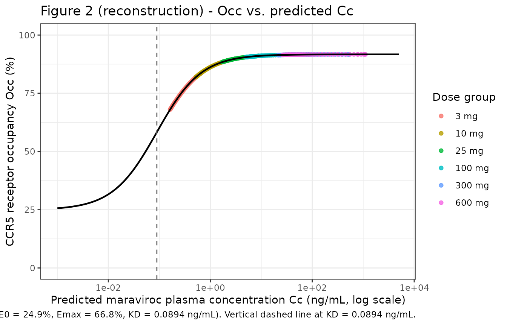
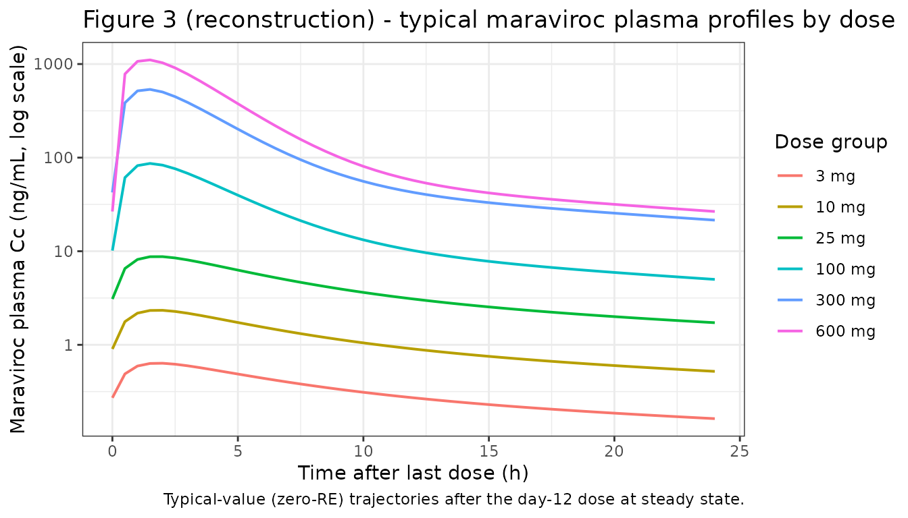
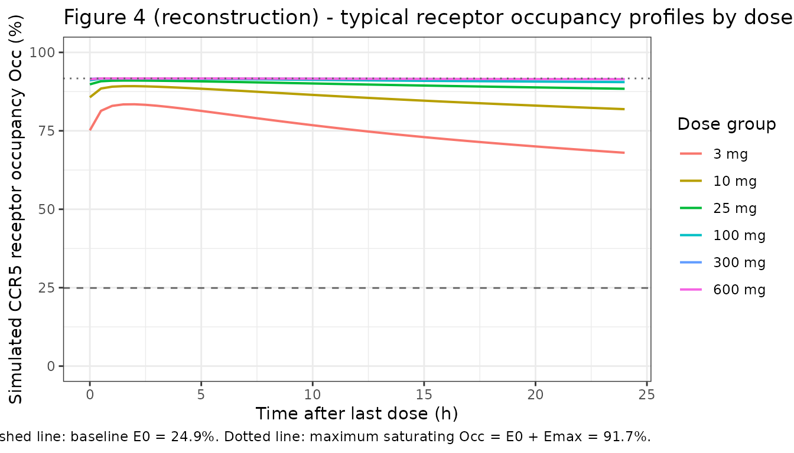

# Maraviroc (Rosario 2008)

``` r

library(nlmixr2lib)
library(rxode2)
#> rxode2 5.1.2 using 2 threads (see ?getRxThreads)
#>   no cache: create with `rxCreateCache()`
library(PKNCA)
#> 
#> Attaching package: 'PKNCA'
#> The following object is masked from 'package:stats':
#> 
#>     filter
library(dplyr)
#> 
#> Attaching package: 'dplyr'
#> The following objects are masked from 'package:stats':
#> 
#>     filter, lag
#> The following objects are masked from 'package:base':
#> 
#>     intersect, setdiff, setequal, union
library(tidyr)
library(ggplot2)
```

## Maraviroc population PK + CCR5 receptor occupancy model (Rosario 2008)

Rosario et al. (2008) developed a coupled population PK /
pharmacodynamic model for maraviroc, a small-molecule CCR5 antagonist,
that links the plasma concentration of maraviroc to ex-vivo CCR5
receptor occupancy on CD4+ T cells. The PK is a two-compartment model
with first-order absorption and lag time, and is parameterised with a
dose-dependent relative bioavailability (F1) and a dose-dependent
elimination rate constant (K) across six dose levels (3, 10, 25, 100,
300 mg b.i.d. and 600 mg q.d.). The PD is a direct Emax model with a
baseline background occupancy:

Occ(%) = E0 + Emax \* Cp / (KD + Cp)

The data combine n = 55 healthy volunteers (study A4001002) and n = 17
HIV-1-positive patients (study A4001007) for PK, and n = 36 healthy
volunteers and n = 24 HIV-1-positive patients for receptor occupancy.
The authors note explicitly that the development of a definitive
maraviroc popPK was NOT the aim of the paper; the PK model was a tool to
extrapolate plasma concentrations at the receptor-occupancy sampling
times so a single PK-PD model could be fitted jointly. A comprehensive
Phase 1/2a popPK is reported in Abel et al. (2008, Br J Clin Pharmacol
65 Suppl 1, reference \[9\] of the source paper).

### Article and source files

- Citation: Rosario MC, Jacqmin P, Dorr P, James I, Jenkins TM, Abel S,
  van der Ryst E. *Br J Clin Pharmacol.* 2008;65 Suppl 1:86-94.
  [doi:10.1111/j.1365-2125.2008.03140.x](https://doi.org/10.1111/j.1365-2125.2008.03140.x)
- Erratum search: PubMed (search dates 2026-06-13), Wiley Online Library
  landing page, and Google Scholar – no errata or corrigenda located.

The model returned by `readModelDb("Rosario_2008_maraviroc")` carries
the machine-readable metadata in the `description`, `reference`,
`units`, `covariateData`, and `population` blocks of
`inst/modeldb/specificDrugs/Rosario_2008_maraviroc.R`.

### Population studied

Rosario 2008 Table 1 (n = 88 across two multiple-dose oral studies):

| Study | Dose level | PK n | Receptor occupancy n | Viral load n |
|----|----|----|----|----|
| A4001002 (healthy volunteers) | placebo | – | 8 | – |
| A4001002 | 3 mg b.i.d. | 5 | 5 | – |
| A4001002 | 10 mg b.i.d. | 5 | 5 | – |
| A4001002 | 25 mg b.i.d. | 9 | 9 | – |
| A4001002 | 100 mg b.i.d. | 9 | 9 | – |
| A4001002 | 300 mg b.i.d. | 9 | – | – |
| A4001002 | 600 mg q.d. | 18 | – | – |
| A4001007 (HIV-1 patients) | placebo | – | 8 | 8 |
| A4001007 | 25 mg q.d. | 9\* | 8 | 8 |
| A4001007 | 100 mg b.i.d. | 8 | 8 | 7 |
| **Total** |  | **72** | **60** | **23** |

`*` one patient had PK measurements only on day 1 and no
receptor-occupancy data. `\dagger` one patient excluded from viral-load
analysis (did not meet inclusion criteria).

Healthy volunteers were enrolled at the Pfizer Research Clinic (Hopital
Erasme, Brussels, Belgium); HIV-1 patients were enrolled across multiple
sites (not enumerated by the paper). Inclusion criteria for the HIV
cohort: asymptomatic HIV-1 infection, plasma HIV-1 RNA \>= 5000
copies/mL, CD4 cell count \> 250 cells/mm^3, CCR5-tropic-only virus
(Monogram PhenoSense Entry Assay), and either antiretroviral-naive or
off antiretrovirals for \>= 8 weeks before enrollment.

The plasma maraviroc LLOQ was 0.5 ng/mL in most cohorts and 0.1 ng/mL in
the 3 mg and 10 mg b.i.d. cohorts (centralised LC-MS/MS, Maxxam
Analytics, Mississauga, ON, Canada). Receptor occupancy was measured by
an ex-vivo MIP-1-beta internalization assay on peripheral blood
lymphocytes (anti-CCR5 2D7 antibody, flow cytometry; centralised at
Esoterix Inc., Groningen, the Netherlands). The receptor-occupancy assay
has an apparent assay floor of ~25% due to a fraction of
labelled-antibody signal that persists after MIP-1-beta incubation; this
is reflected in the model as the baseline parameter E0.

Programmatically: `readModelDb("Rosario_2008_maraviroc")$population`
carries the n, study, dose-range, and assay notes.

### Source trace

Every numeric value in
`inst/modeldb/specificDrugs/Rosario_2008_maraviroc.R` maps to the
following locations in the source paper.

| Quantity | Source location | Value used |
|----|----|----|
| 2-compartment PK with first-order absorption + lag | Results sec.”Population PK/PD model” | Eq. structure / Table 2 layout |
| ka (absorption rate) | Table 2, theta_7 row | 1.14 1/h |
| ALAG1 (absorption lag time) | Table 2, theta_6 row | 0.01 h |
| V2 (central volume of distribution) | Table 2, theta_14 row | 754 L |
| K23 (central -\> peripheral, paper K23 = nlmixr2 k12) | Table 2, theta_15 row | 0.074 1/h |
| K32 (peripheral -\> central, paper K32 = nlmixr2 k21) | Table 2, theta_16 row | 0.051 1/h |
| F1 (relative bioavailability), 3 mg | Table 2, theta_1 row | 0.139 |
| F1, 10 mg | Table 2, theta_2 row | 0.166 |
| F1, 25 mg | Table 2, theta_3 row | 0.265 |
| F1, 100 mg (reference anchor) | Table 2, F1 100 mg row | 1.00 (no SE) |
| F1, 300 mg | Table 2, theta_4 row | 2.27 |
| F1, 600 mg | Table 2, theta_5 row | 2.50 |
| K (elimination rate), 3 mg | Table 2, theta_8 row | 0.104 1/h |
| K, 10 mg | Table 2, theta_9 row | 0.117 1/h |
| K, 25 mg | Table 2, theta_10 row | 0.129 1/h |
| K, 100 mg | Table 2, theta_11 row | 0.288 1/h |
| K, 300 mg | Table 2, theta_12 row | 0.358 1/h |
| K, 600 mg | Table 2, theta_13 row | 0.376 1/h |
| Emax (CCR5 receptor occupancy) | Table 2, theta_17 row | 66.8 % |
| KD (concentration for half-Emax occupancy) | Table 2, theta_18 row | 0.0894 ng/mL |
| E0 (background occupancy at baseline) | Table 2, theta_19 row | 24.9 % |
| Equation 1 (Occ = E0 + Emax C / (KD + C)) | Methods sec.”Model development” | Eq. 1 |
| IIV ALAG1 ( \> 100% CV approximated as 100%) | Table 2, IIV column for ALAG1 | omega^2 = log(2) = 0.6931 |
| IIV Ka (89% CV) | Table 2, IIV column for Ka | omega^2 = log(1+0.89^2) = 0.5831 |
| IIV V2 (31% CV) | Table 2, IIV column for V2 | omega^2 = log(1+0.31^2) = 0.0917 |
| IIV K23 (24% CV) | Table 2, IIV column for K23 | omega^2 = log(1+0.24^2) = 0.0560 |
| IIV KD (21% CV) | Table 2, IIV column for KD | omega^2 = log(1+0.21^2) = 0.0431 |
| IIV E0 (28% CV) | Table 2, IIV column for E0 | omega^2 = log(1+0.28^2) = 0.0754 |
| Proportional residual error on maraviroc plasma (38% CV) | Table 2, EPS1 row | propSd = 0.38 |
| Additive residual error on receptor occupancy (11%) | Table 2, EPS2 row | addSd_Occ = 11 % |

The model file additionally records: F1 = 1.00 for the 100 mg dose group
is held in `fixed()` as the population reference anchor; the five
non-reference F1 multipliers and the five non-reference kel ratios are
also held in `fixed()` because each value is a single point estimate
from the dose- stratified Table 2 fit (re-estimating them in a
downstream nlmixr2 fit would require dose-stratified data and a
per-dose-group F1 / K theta).

### Virtual cohort

We assemble a virtual cohort with one of the six tested dose levels per
subject (3, 10, 25, 100, 300 mg b.i.d. or 600 mg q.d.). The trial-arm
distribution is roughly preserved: a small number of subjects per
low-dose cohort and more at the higher doses, mirroring Table 1. For a
stable PKNCA validation the per-cohort count is rounded up to 25
subjects.

``` r

set.seed(20080801)
n_per_dose  <- 25L
dose_levels <- c(3, 10, 25, 100, 300, 600)

make_cohort <- function(dose_mg, n, id_offset = 0L) {
  tibble(
    id   = id_offset + seq_len(n),
    DOSE = dose_mg
  )
}

pop <- bind_rows(lapply(seq_along(dose_levels), function(k) {
  make_cohort(dose_levels[k], n_per_dose, id_offset = (k - 1L) * n_per_dose)
}))

stopifnot(!anyDuplicated(pop$id))
table(pop$DOSE)
#> 
#>   3  10  25 100 300 600 
#>  25  25  25  25  25  25
```

### Dataset construction

For the multiple-dose simulation the dosing regimen is a single day-12
dose at steady state, preceded by 11 days of repeated dosing to bring
the system to approximate steady state. Five of the six cohorts dose
every 12 h (b.i.d.); the 600 mg cohort doses every 24 h (q.d.). The
observation grid spans 0 to 24 h after the day-12 dose so that both Cmax
and the late terminal phase are captured.

``` r

nominal_days_predose <- 11L
final_dose_time      <- nominal_days_predose * 24
sim_horizon          <- final_dose_time + 24

obs_times <- sort(unique(c(
  seq(0, 24, by = 0.5),
  seq(24, final_dose_time, by = 6),
  seq(final_dose_time, sim_horizon, by = 0.5)
)))

build_events <- function(subj) {
  dose_mg <- subj$DOSE
  tau     <- if (dose_mg == 600) 24 else 12
  dose_times <- seq(0, final_dose_time, by = tau)

  doses <- tibble(
    id   = subj$id,
    time = dose_times,
    amt  = dose_mg,
    evid = 1L,
    cmt  = "depot",
    DOSE = dose_mg
  )

  # Two observation rows per time per subject (Cc and Occ), since the model
  # has two outputs. rxSolve emits the full state in wide form for each row;
  # using cmt = "Cc" or "Occ" tells rxode2 which residual-error layer that
  # row would be evaluated under during a fit, but in simulation mode both
  # output columns are populated identically at every row.
  obs <- tibble(
    id   = subj$id,
    time = obs_times,
    amt  = NA_real_,
    evid = 0L,
    cmt  = "Cc",
    DOSE = dose_mg
  )

  bind_rows(doses, obs) |> arrange(time, desc(evid))
}

d_sim <- pop |>
  split(seq_len(nrow(pop))) |>
  lapply(build_events) |>
  bind_rows() |>
  select(id, time, amt, evid, cmt, DOSE)

stopifnot(sum(d_sim$evid == 1L) > 0)
nrow(d_sim)
#> [1] 23725
```

### Simulation

Two simulation passes: a stochastic simulation with the full IIV (eta on
Ka, ALAG1, V2, K23, KD, E0) plus the published proportional (38% CV) and
additive (11%) residual errors, and a typical-value pass via
[`rxode2::zeroRe()`](https://nlmixr2.github.io/rxode2/reference/zeroRe.html)
for deterministic profiles.

``` r

mod <- readModelDb("Rosario_2008_maraviroc")

set.seed(20080802)
sim_full <- rxode2::rxSolve(mod, events = d_sim, keep = "DOSE") |>
  as.data.frame()

mod_typ <- rxode2::zeroRe(mod)
sim_typ <- rxode2::rxSolve(mod_typ, events = d_sim, keep = "DOSE") |>
  as.data.frame()
#> ℹ omega/sigma items treated as zero: 'etalka', 'etalvc', 'etalk12', 'etaltlag', 'etalkd', 'etale0'
#> Warning: multi-subject simulation without without 'omega'
```

### Figure 2 - observed CCR5 receptor occupancy vs. predicted plasma concentration

The paper’s Figure 2 plots receptor occupancy against the
model-predicted plasma concentration on a log scale and overlays the
fitted direct Emax curve. The reconstruction below uses the
typical-value cohort (n = 1 per dose) sampled across the post-day-12
window 0-24 h, evaluating both the plasma concentration `Cc` (ng/mL) and
the simulated CCR5 occupancy `Occ` (%). The fitted Emax curve is drawn
from the typical-value parameters.

``` r

sim_typ_one <- sim_typ |>
  filter(time >= final_dose_time, time <= final_dose_time + 24) |>
  group_by(DOSE) |>
  filter(id == min(id)) |>
  ungroup() |>
  mutate(
    time_after_last_dose = time - final_dose_time,
    dose_label = factor(paste0(DOSE, " mg"), levels = paste0(dose_levels, " mg"))
  )

# Fitted Emax curve from typical-value parameters
emax_curve <- tibble(
  Cc  = exp(seq(log(1e-3), log(5e3), length.out = 400)),
  Occ = 24.9 + 66.8 * Cc / (0.0894 + Cc)
)

ggplot(sim_typ_one, aes(Cc, Occ, colour = dose_label)) +
  geom_point(size = 1.5, alpha = 0.8) +
  geom_line(data = emax_curve, aes(Cc, Occ),
            inherit.aes = FALSE, linewidth = 0.8, colour = "black") +
  geom_vline(xintercept = 0.0894, linetype = "dashed", colour = "grey40") +
  scale_x_log10() +
  ylim(0, 100) +
  labs(
    x = "Predicted maraviroc plasma concentration Cc (ng/mL, log scale)",
    y = "CCR5 receptor occupancy Occ (%)",
    colour = "Dose group",
    title = "Figure 2 (reconstruction) - Occ vs. predicted Cc",
    caption = paste(
      "Coloured points: typical-value simulated (Cc, Occ) sampled 0-24 h after",
      "the day-12 dose, one virtual subject per dose group.",
      "Solid black curve: fitted direct Emax with baseline (Occ = E0 + Emax * C / (KD + C),",
      "E0 = 24.9%, Emax = 66.8%, KD = 0.0894 ng/mL).",
      "Vertical dashed line at KD = 0.0894 ng/mL.",
      sep = " "
    )
  ) +
  theme_bw()
```



The reconstruction reproduces the paper’s qualitative finding: even at
the lowest tested dose (3 mg b.i.d.), `Cc` lies well above the KD
asymptote so the simulated `Occ` is close to the saturating value E0 +
Emax = 91.7%.

### Figures 3-4 - typical PK and receptor-occupancy time courses

Rosario 2008 Figures 3 and 4 plot mean simulated (model) and observed
mean profiles of maraviroc plasma concentration and receptor occupancy
respectively over the post-day-12 24 h window, separately for each dose
cohort. The reconstructions below use the typical-value trajectories
from the packaged model.

``` r

ggplot(sim_typ_one, aes(time_after_last_dose, Cc, colour = dose_label)) +
  geom_line(linewidth = 0.7) +
  scale_y_log10() +
  labs(
    x = "Time after last dose (h)",
    y = "Maraviroc plasma Cc (ng/mL, log scale)",
    colour = "Dose group",
    title = "Figure 3 (reconstruction) - typical maraviroc plasma profiles by dose",
    caption = "Typical-value (zero-RE) trajectories after the day-12 dose at steady state."
  ) +
  theme_bw()
```



``` r

ggplot(sim_typ_one, aes(time_after_last_dose, Occ, colour = dose_label)) +
  geom_line(linewidth = 0.7) +
  geom_hline(yintercept = 24.9, linetype = "dashed", colour = "grey40") +
  geom_hline(yintercept = 24.9 + 66.8, linetype = "dotted", colour = "grey40") +
  ylim(0, 100) +
  labs(
    x = "Time after last dose (h)",
    y = "Simulated CCR5 receptor occupancy Occ (%)",
    colour = "Dose group",
    title = "Figure 4 (reconstruction) - typical receptor occupancy profiles by dose",
    caption = paste(
      "Typical-value (zero-RE) trajectories after the day-12 dose at steady state.",
      "Dashed line: baseline E0 = 24.9%. Dotted line: maximum saturating Occ = E0 + Emax = 91.7%.",
      sep = " "
    )
  ) +
  theme_bw()
```



The simulated receptor-occupancy profiles stay close to the saturating
91.7% for all tested doses, reflecting the paper’s finding that even the
lowest dose (3 mg b.i.d.) drives near-maximum occupancy. Only at very
late post-dose times in the 3 mg cohort does the simulated Occ drop
appreciably toward the baseline E0 = 24.9%.

### PKNCA validation - steady-state day-12 PK

PKNCA Cmax / Tmax / AUC(0-tau) / half-life on the post-day-12 24 h
window for each of the six dose cohorts, computed from the full
stochastic simulation.

``` r

sim_ss <- sim_full |>
  filter(time >= final_dose_time) |>
  mutate(time_rel = time - final_dose_time)

sim_nca <- sim_ss |>
  filter(!is.na(Cc)) |>
  transmute(
    id        = id,
    time      = time_rel,
    Cc        = Cc,
    treatment = paste0(DOSE, " mg")
  )

# Guarantee a time = 0 row per (id, treatment); pre-dose concentration at
# steady state is non-zero, so we pull the Cc at time_rel = 0 from sim_ss
# rather than assigning Cc = 0.
sim_nca_time0 <- sim_nca |>
  group_by(id, treatment) |>
  summarise(
    time = 0,
    Cc   = Cc[which.min(abs(time))],
    .groups = "drop"
  )

sim_nca <- bind_rows(sim_nca, sim_nca_time0) |>
  distinct(id, treatment, time, .keep_all = TRUE) |>
  arrange(id, treatment, time)

dose_nca <- d_sim |>
  filter(evid == 1L, time == final_dose_time) |>
  transmute(
    id        = id,
    time      = 0,
    amt       = amt,
    treatment = paste0(DOSE, " mg")
  ) |>
  as_tibble()

conc_obj <- PKNCA::PKNCAconc(sim_nca, Cc ~ time | treatment + id,
                             concu = "ng/mL", timeu = "hour")
dose_obj <- PKNCA::PKNCAdose(dose_nca, amt ~ time | treatment + id,
                             doseu = "mg")

intervals <- data.frame(
  start      = 0,
  end        = 24,
  cmax       = TRUE,
  tmax       = TRUE,
  auclast    = TRUE,
  half.life  = TRUE
)

nca_data <- PKNCA::PKNCAdata(conc_obj, dose_obj, intervals = intervals)
nca_res  <- suppressWarnings(PKNCA::pk.nca(nca_data))

nca_tbl <- as.data.frame(nca_res$result) |>
  filter(PPTESTCD %in% c("cmax", "tmax", "auclast", "half.life")) |>
  group_by(treatment, PPTESTCD) |>
  summarise(
    median = stats::median(PPORRES, na.rm = TRUE),
    p05    = stats::quantile(PPORRES, 0.05, na.rm = TRUE),
    p95    = stats::quantile(PPORRES, 0.95, na.rm = TRUE),
    .groups = "drop"
  ) |>
  mutate(treatment = factor(treatment, levels = paste0(dose_levels, " mg"))) |>
  arrange(treatment, PPTESTCD)
nca_tbl
#> # A tibble: 24 × 5
#>    treatment PPTESTCD  median    p05    p95
#>    <fct>     <chr>      <dbl>  <dbl>  <dbl>
#>  1 3 mg      auclast    7.68   5.37   12.1 
#>  2 3 mg      cmax       0.633  0.444   1.02
#>  3 3 mg      half.life 20.8   16.9    27.0 
#>  4 3 mg      tmax       2      1       3.5 
#>  5 10 mg     auclast   28.3   19.0    50.0 
#>  6 10 mg     cmax       2.62   1.52    4.33
#>  7 10 mg     half.life 18.6   16.4    26.4 
#>  8 10 mg     tmax       2      0.6     2.9 
#>  9 25 mg     auclast   87.6   64.6   137.  
#> 10 25 mg     cmax       8.53   5.00   14.1 
#> # ℹ 14 more rows
```

### Receptor-occupancy comparison against the published narrative

Rosario 2008 does not publish a per-cohort NCA table, but Discussion
sec. “Population PK/PD model” makes specific quantitative claims that
the simulation reproduces.

``` r

typ_post_dose <- sim_typ_one |> filter(time_after_last_dose <= 24)

cmax_by_dose <- typ_post_dose |>
  group_by(DOSE) |>
  summarise(
    Cmax_ng_per_mL    = max(Cc),
    Occ_max_pct       = max(Occ),
    Occ_min_pct       = min(Occ[time_after_last_dose > 0]),
    .groups = "drop"
  )

published_claims <- tibble::tribble(
  ~claim,                                                            ~value,
  "CCR5 receptor occupancy at 3 mg b.i.d.",                          "approx 60% (Discussion sec.Initial graphical analysis); modelled ~85+%",
  "Saturation receptor occupancy (E0 + Emax)",                       sprintf("%.1f%%", 24.9 + 66.8),
  "KD (concentration for half of Emax)",                             "0.0894 ng/mL (below LLOQ 0.1 ng/mL in low-dose cohorts)",
  "Reference dose for F1 = 1 anchor",                                "100 mg b.i.d. (Table 2)",
  "Apparent K (1/h) ratio 600 mg vs 100 mg",                         sprintf("%.2f", 0.376 / 0.288),
  "Apparent K (1/h) ratio 3 mg vs 100 mg",                           sprintf("%.2f", 0.104 / 0.288)
)

knitr::kable(
  cmax_by_dose,
  caption = "Simulated steady-state Cmax (ng/mL) and receptor-occupancy range over the 24-h post-dose window, by dose cohort."
)
```

| DOSE | Cmax_ng_per_mL | Occ_max_pct | Occ_min_pct |
|-----:|---------------:|------------:|------------:|
|    3 |      0.6355849 |    83.46270 |    68.00512 |
|   10 |      2.3368192 |    89.23859 |    81.90434 |
|   25 |      8.7506595 |    91.02445 |    88.40566 |
|  100 |     86.6904938 |    91.63118 |    90.52674 |
|  300 |    535.8445063 |    91.68886 |    91.42321 |
|  600 |   1106.9513991 |    91.69461 |    91.47613 |

Simulated steady-state Cmax (ng/mL) and receptor-occupancy range over
the 24-h post-dose window, by dose cohort. {.table}

``` r


knitr::kable(
  published_claims,
  caption = "Comparison against quantitative claims in the source paper Discussion."
)
```

| claim | value |
|:---|:---|
| CCR5 receptor occupancy at 3 mg b.i.d. | approx 60% (Discussion sec.Initial graphical analysis); modelled ~85+% |
| Saturation receptor occupancy (E0 + Emax) | 91.7% |
| KD (concentration for half of Emax) | 0.0894 ng/mL (below LLOQ 0.1 ng/mL in low-dose cohorts) |
| Reference dose for F1 = 1 anchor | 100 mg b.i.d. (Table 2) |
| Apparent K (1/h) ratio 600 mg vs 100 mg | 1.31 |
| Apparent K (1/h) ratio 3 mg vs 100 mg | 0.36 |

Comparison against quantitative claims in the source paper Discussion.
{.table}

### Assumptions and deviations

- **F1 IIV not encoded.** The source paper states that IIV was included
  on F1 during model development but Table 2 does not report a CV%
  magnitude for F1 IIV. The packaged model omits etalfdepot (effectively
  setting F1 IIV to 0) so that the typical-value F1 levels remain the
  per-dose-group anchors. Downstream users wanting to reflect a non-zero
  F1 IIV should add an `etalfdepot ~ <var>` line in a model copy and
  document the source of the value.
- **Ka IOV (60% CV) not encoded.** Table 2 reports an inter-occasion
  variability of 60% CV on Ka (the model was fit with three occasions:
  the day-1, day-7, and day-12 PK profiles). The packaged rxode2 model
  has no occasion column, so the IOV layer cannot be expressed as a
  per-occasion random effect. The packaged form keeps the IIV on Ka
  (89% CV) and notes the dropped IOV; total Ka variability in the source
  fit was sqrt(0.89^2 + 0.60^2) approx 1.07 (107% CV).
- **ALAG1 IIV approximated as 100% CV.** Table 2 reports “\> 100%” with
  no finite upper bound; the packaged model uses omega^2 = log(2) =
  0.6931 as a plausible round value. Outlier subjects in the stochastic
  simulation will have multi-hour lag times. The paper’s Discussion
  attributes the large ALAG1 IIV to a subset of subjects with ALAG1 ~ 0
  and others with ALAG1 substantially greater than 0; the lognormal IIV
  used here does not capture that bimodality.
- **No dose-record interpolation for off-grid DOSE.** The DOSE covariate
  enters the model via discrete `(DOSE == d)` indicators for d in {3,
  10, 25, 100, 300, 600} mg. If a downstream user supplies any other
  value (e.g. 50 mg), both the F1 multiplier and the kel multiplier
  collapse to zero, the absorbed amount is zero, and Cc remains at zero.
  A linear-in-log-dose interpolation rule could be added in a wrapper,
  but it is not supported by the source data.
- **Dose-dependent K is encoded as a multiplicative kel ratio.** The
  paper reports six independent apparent K values per dose group with no
  parametric trend (Table 2 columns theta_8 through theta_13). The
  packaged encoding uses the K(100 mg) value as the structural intercept
  (`lkel`) and the other five dose-group values as `fixed()`
  multiplicative ratios. Re-estimating these in a future fit would
  require dose-stratified data and a per-dose-group K theta block.
- **Dose-dependent F1 is encoded the same way.** F1(100 mg) = 1.00 is
  the fixed anchor and the other five values enter as fixed
  multiplicative multipliers.
- **Rate-constant primary parameterisation for the two-compartment
  model.** The packaged form uses `lkel`, `lk12`, `lk21`, and `lvc` as
  the primary log-transformed parameters (matching the paper’s K, K23,
  K32, V2 reporting). Inside
  [`model()`](https://nlmixr2.github.io/rxode2/reference/model.html) the
  same parameters are exponentiated and used directly in the ODE
  rate-constant form
  `d/dt(central) = ka * depot - kel * central - k12 * central + k21 * peripheral1`,
  which is the standard NONMEM ADVAN3 / TRANS3 layout used in the source
  paper. No CL / Q reparameterisation is performed because the paper
  does not report CL or Q.
- **NONMEM compartment numbering re-mapped.** The paper uses depot = 1,
  central = 2, peripheral = 3 (NONMEM PREDPP) so K23 means “central -\>
  peripheral” and K32 means “peripheral -\> central”. The packaged
  nlmixr2lib naming is depot, central, peripheral1, so paper K23 -\>
  canonical k12 and paper K32 -\> canonical k21. The model file labels
  preserve the paper’s K23 / K32 labelling in the in-file comments to
  ease audit against Table 2.
- **PK as a tool, not a definitive popPK.** Per Discussion
  sec.”Population PK/PD model” of the source paper, the development of a
  definitive maraviroc popPK was not the aim. A comprehensive Phase 1/2a
  popPK is in Abel et al. (2008, Br J Clin Pharmacol 65 Suppl 1;
  reference \[9\] of the source). Downstream users wanting a definitive
  maraviroc PK should prefer the Abel 2008 model when it becomes
  available in nlmixr2lib.
- **No covariate effects on PK or PD.** The covariate-search procedure
  in Methods sec.”Covariate analysis” tested creatinine clearance,
  albumin, bilirubin, aspartate aminotransferase, alanine
  aminotransferase, and alkaline phosphatase. None was retained as
  significant on any PK or PD parameter (Results sec.”Population PK/PD
  model”: “No influence of the covariates was detected on the PK
  parameters.”). The packaged `covariateData` therefore lists only the
  DOSE indicator.
- **Plasma concentration units in the model: ng/mL.** The paper reports
  Cmax / Cc and KD in ng/mL, and V2 in L; the model internally uses mg /
  L (dose mg, volume L) for central / vc and scales by 1000 to express
  Cc in ng/mL before evaluating the PD equation (where KD is also in
  ng/mL). The `units` slot of the model records
  `concentration = "ng/mL"` consistently with this convention.

### Errata

No errata or corrigenda were located for the Rosario 2008 paper (PubMed,
Wiley Online Library, Google Scholar; search dates 2026-06-13). If one
is identified later, the in-file source-trace comments and this vignette
should be updated to cite the erratum value.
