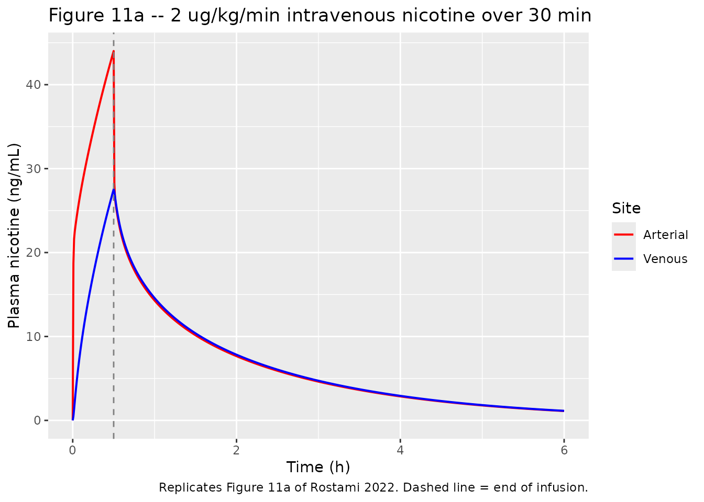
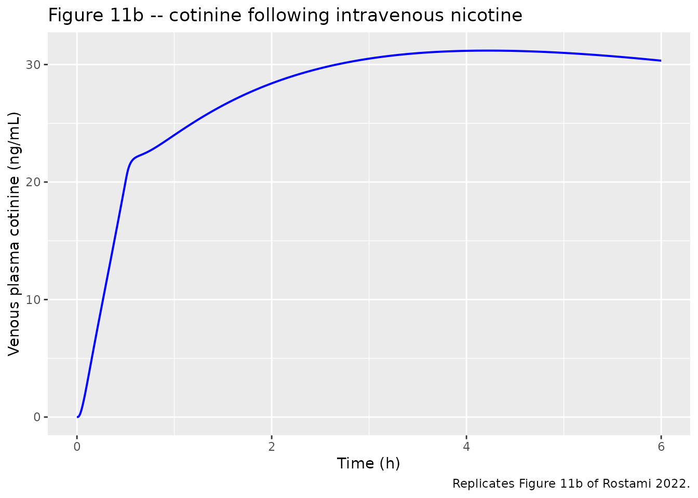
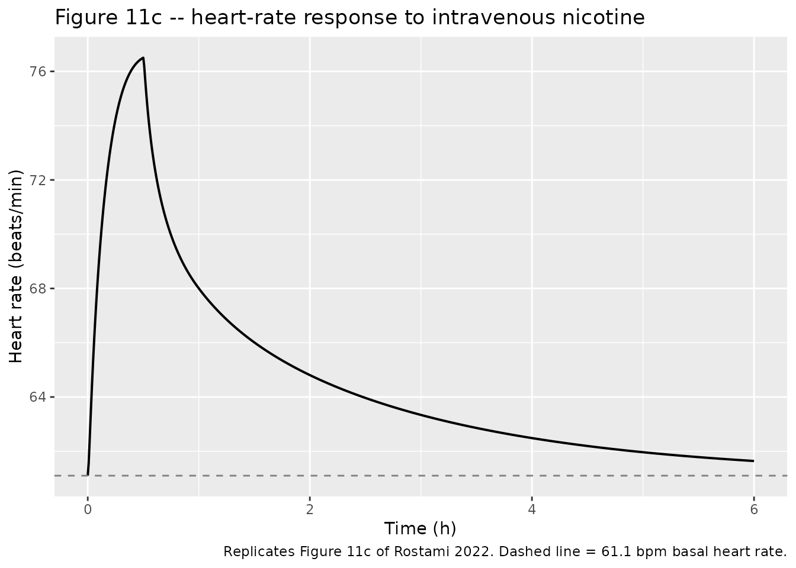
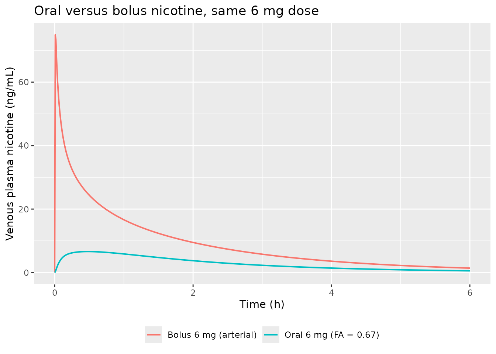

# Nicotine whole-body PBPK (Rostami 2022)

## Model and source

- Citation: Rostami AA, Campbell JL, Pithawalla YB, Pourhashem H,
  Muhammad-Kah RS, Sarkar MA, Liu J, McKinney WJ, Gentry R, Gogova M.
  (2022). A comprehensive physiologically based pharmacokinetic (PBPK)
  model for nicotine in humans from using nicotine-containing products
  with different routes of exposure. Sci Rep 12:1091.
  <doi:10.1038/s41598-022-05108-y>. PMCID PMC8776883. Author Correction
  Sci Rep 12:2436, <doi:10.1038/s41598-022-06693-8> (bibliography fix
  only, no parameter impact). Whole-body disposition structure and
  chemical parameters trace to Robinson DE, Balter NJ, Schwartz
  SL (1992) J Pharmacokinet Biopharm 20:591-609 and Teeguarden JG et
  al. (2013) Regul Toxicol Pharmacol 65:12-28.

- Description: PBPK (whole-body, MCSim/deSolve). Nicotine, cotinine and
  nicotine glucuronide disposition in humans, the parent nicotine PBPK
  model of Rostami 2022 in its originally published parameterization
  (Robinson / Teeguarden lineage). Carries eleven flow-limited nicotine
  tissues plus a nicotine-driven heart-rate feedback on cardiac output,
  a five-tissue cotinine sub-model and a one-compartment
  nicotine-glucuronide sub-model. Two administration routes are
  reproducible from the published sources and are implemented: an
  intravenous infusion directly into arterial blood (the paper’s own
  primary validation, Figure 11) and a first-order oral /
  gastrointestinal input with bioavailability. Deterministic
  typical-value model: the sources report no between-subject variability
  and no residual-error model. The four product-specific routes of the
  paper (conventional cigarette, ENDS, vapor inhaler and smokeless
  tobacco) are NOT implemented because their respiratory-tract
  deposition fractions and buccal / airway permeation coefficients are
  unreported zero placeholders in the published MCSim listing and are
  tabulated in no available source; see the vignette Errata. This is the
  un-adjusted parent of the Salehi 2025 nicotine-pouch model, which
  halved the hepatic and urinary clearances and rebuilt the buccal
  front-end.

- Article: <https://doi.org/10.1038/s41598-022-05108-y>

- Author Correction (bibliography only):
  <https://doi.org/10.1038/s41598-022-06693-8>

Rostami 2022 is a whole-body physiologically based pharmacokinetic
(PBPK) model for nicotine and its metabolites cotinine and nicotine
glucuronide in humans. It extends the Robinson 1992 and Teeguarden 2013
nicotine models with buccal-cavity and respiratory-tract compartments so
that product-specific uptake from cigarettes, ENDS, a vapor inhaler and
smokeless tobacco can be simulated. The whole-body disposition core, the
nicotine-driven heart-rate feedback on cardiac output, and the cotinine
and glucuronide sub-models are the reusable, fully specified part of
that work, and are what this extraction implements.

This is the **original, un-adjusted parent** of the Salehi 2025
nicotine-pouch model (also in this package): Salehi 2025 later halved
the four hepatic and urinary clearances and rebuilt the buccal front-end
as a fitted diffusion chain. This model keeps the clearances at their
originally published Rostami / Robinson values.

## Population

The model is a deterministic mechanistic structure, not a fit to
individual data. Its reference adult is 73.0 kg (Rostami 2022 Table 1);
physiological volumes and flows are fractions of that body weight, drawn
from ICRP and (for the buccal and airway tissues) Corley et al. Chemical
parameters – partition coefficients, clearances, the metabolite split
and the heart-rate feedback – come from Robinson 1992 and Teeguarden
2013 (Rostami 2022 Table 2).

``` r

str(ui$population)
#> List of 7
#>  $ species      : chr "human"
#>  $ age_range    : chr "adults"
#>  $ weight_median: chr "73.0 kg (Rostami 2022 Table 1 reference adult)"
#>  $ disease_state: chr "healthy adults; validation cohorts are habitual tobacco users"
#>  $ dose_range   : chr "intravenous nicotine 2 ug/kg/min over 30 min (Figure 11 validation arm); oral nicotine (first-order gastrointes"| __truncated__
#>  $ regions      : chr "United States"
#>  $ notes        : chr "The PBPK model is not fitted to individual-level data; it is a mechanistic structural model with parameters ado"| __truncated__
```

## Source trace

Every `ini()` entry in
`inst/modeldb/specificDrugs/Rostami_2022_nicotine_pbpk.R` carries an
in-file comment naming its source location. The table below collects
them.

| Equation / parameter | Value | Source location |
|----|----|----|
| Whole-body flow-limited disposition | n/a | Rostami 2022 Figure 10; supplementary MCSim listing |
| Nicotine metabolism split (cotinine / glucuronide / other) | n/a | Rostami 2022 supplementary MCSim listing |
| Heart-rate feedback `EOUT = HRO + S*Cv/(1 + CANT/CANT50)` | n/a | Rostami 2022 supplementary MCSim listing (Teeguarden et al.) |
| `KA1` (oral / GI absorption rate) | 1.34 /h | Rostami 2022 Table 2 (KA) |
| `FA` (oral bioavailability) | 0.67 | Rostami 2022 Table 2 |
| Hepatic / urinary clearances | `CLMC` 2.70, `CLKC` 0.42, `CLLMC` 0.14, `CLKMC` 0.025 | Rostami 2022 Table 2 |
| `FNC` (fraction to cotinine) | 0.80 | Rostami 2022 Table 2 |
| `FNG`, `VGDC`, `GCLC` (glucuronide sub-model) | 0.10, 1.0, 0.1 | Rostami 2022 supplementary MCSim listing |
| Tissue volumes and blood flows | see `ini()` | Rostami 2022 Table 1 |
| Surface areas and epithelial widths | see `ini()` | Rostami 2022 Table 1 |
| Partition coefficients (nicotine, cotinine) | see `ini()` | Rostami 2022 Table 2 |
| Tissue binding `BMLURC`, `BMHRC`, `KBLU`, `KBH` | 0.00235, 0.00427, 0, 0 | Rostami 2022 supplementary MCSim listing |
| Heart-rate feedback `SPD`, `KANT`, `CANT50` | 933.66, 1.6617, 0.0152 | Rostami 2022 Table 2 |
| Cotinine / glucuronide molecular weights | 178, 338 | Rostami 2022 supplementary MCSim listing (hard-coded literals) |

## Simulation setup

The model is deterministic: Rostami 2022 reports neither between-subject
variability nor a residual-error model, so there are no `eta` terms and
every arm below is a single typical-value profile. Two administration
routes are reproducible from the published sources and are exercised
here: an intravenous infusion into arterial blood, and an oral dose into
the gastrointestinal compartment.

## Replicate published figures

### Figure 11 – intravenous nicotine infusion

Figure 11 is the paper’s own primary validation and the one arm that
needs no dosimetry or permeation front-end, because nicotine is injected
directly into arterial blood. Subjects received 2 ug/kg/min for 30 min
(Rostami 2022, Results, “nicotine PK profile from intravenous
administration”). Figure 11a,b show arterial (red) and venous (blue)
nicotine and cotinine; Figure 11c shows the change in heart rate.

``` r

mod <- readModelDb("Rostami_2022_nicotine_pbpk")

wt <- 73 # Rostami 2022 Table 1 reference adult
iv_dose <- 2e-3 * wt * 30 # 2 ug/kg/min for 30 min, in mg

ev_iv <- rxode2::et(amt = iv_dose, dur = 0.5, cmt = "a_arterial") |>
  rxode2::et(seq(0, 6, by = 1 / 120), cmt = "a_venous")

sim_iv <- rxode2::rxSolve(mod, ev_iv, params = c(WT = wt),
                          atol = 1e-10, rtol = 1e-8) |>
  as.data.frame() |>
  dplyr::filter(!duplicated(time))

sim_iv |>
  dplyr::select(time, Venous = Cc, Arterial = Cart) |>
  tidyr::pivot_longer(-time, names_to = "Site", values_to = "conc") |>
  ggplot(aes(time, conc, colour = Site)) +
  geom_line(linewidth = 0.7) +
  geom_vline(xintercept = 0.5, linetype = "dashed", colour = "grey50") +
  scale_colour_manual(values = c(Arterial = "red", Venous = "blue")) +
  labs(x = "Time (h)", y = "Plasma nicotine (ng/mL)",
       title = "Figure 11a -- 2 ug/kg/min intravenous nicotine over 30 min",
       caption = paste("Replicates Figure 11a of Rostami 2022.",
                       "Dashed line = end of infusion."))
```



``` r

# Figure 11b: the cotinine metabolite rises slowly over hours.
ggplot(sim_iv, aes(time, Cc_cot)) +
  geom_line(linewidth = 0.7, colour = "blue") +
  labs(x = "Time (h)", y = "Venous plasma cotinine (ng/mL)",
       title = "Figure 11b -- cotinine following intravenous nicotine",
       caption = "Replicates Figure 11b of Rostami 2022.")
```



``` r

# Figure 11c: nicotine transiently raises heart rate above its 61.1 bpm basal.
ggplot(sim_iv, aes(time, HR)) +
  geom_line(linewidth = 0.7) +
  geom_hline(yintercept = 61.1, linetype = "dashed", colour = "grey50") +
  labs(x = "Time (h)", y = "Heart rate (beats/min)",
       title = "Figure 11c -- heart-rate response to intravenous nicotine",
       caption = paste("Replicates Figure 11c of Rostami 2022.",
                       "Dashed line = 61.1 bpm basal heart rate."))
```



``` r

# Structural signatures of Figure 11, asserted rather than eyeballed:
#  - arterial runs above venous DURING the infusion and they converge after it
#    (Figure 11a; the paper notes arterial over-prediction in the first minutes);
#  - the heart rate rises above basal during exposure and relaxes back toward it
#    (Figure 11c);
#  - cotinine is the slow metabolite: it peaks well after nicotine (its peak is
#    hours in, not during the 30 min infusion) and is still near that plateau at
#    6 h, the flat-topped signature of Figure 11b.
during <- dplyr::filter(sim_iv, time > 0.05, time <= 0.5)
after  <- dplyr::filter(sim_iv, time >= 2)
cot_tmax <- sim_iv$time[which.max(sim_iv$Cc_cot)]
stopifnot(
  nrow(during) > 0, nrow(after) > 0,
  all(during$Cart > during$Cc),
  max(abs(after$Cart - after$Cc) / after$Cc) < 0.05,
  max(sim_iv$HR) > 61.1,
  dplyr::last(sim_iv$HR) < max(sim_iv$HR),
  cot_tmax > 1,
  dplyr::last(sim_iv$Cc_cot) > 0.9 * max(sim_iv$Cc_cot)
)
c(
  venous_peak_ng_mL   = round(max(sim_iv$Cc), 2),
  arterial_peak_ng_mL = round(max(sim_iv$Cart), 2),
  heart_rate_peak_bpm = round(max(sim_iv$HR), 1),
  cotinine_6h_ng_mL   = round(dplyr::last(sim_iv$Cc_cot), 2)
)
#>   venous_peak_ng_mL arterial_peak_ng_mL heart_rate_peak_bpm   cotinine_6h_ng_mL 
#>               27.54               44.01               76.50               30.33
```

### Oral nicotine

The oral route (Rostami 2022 Table 2: `FA` = 0.67, `KA` = 1.34 /h) is a
first-order gastrointestinal uptake of the bioavailable fraction
directly into the liver. It is shown here for a single 6 mg oral dose to
demonstrate the first- pass metabolism the whole-body model captures:
the oral profile peaks later and lower than the same dose given
intravenously.

``` r

oral_dose <- 6 # mg
ev_oral <- rxode2::et(amt = oral_dose, cmt = "a_gut", time = 0) |>
  rxode2::et(seq(0, 6, by = 1 / 120), cmt = "a_venous")
sim_oral <- rxode2::rxSolve(mod, ev_oral, params = c(WT = wt),
                            atol = 1e-10, rtol = 1e-8) |>
  as.data.frame() |>
  dplyr::filter(!duplicated(time))

ev_ivc <- rxode2::et(amt = oral_dose, cmt = "a_arterial", time = 0) |>
  rxode2::et(seq(0, 6, by = 1 / 120), cmt = "a_venous")
sim_ivc <- rxode2::rxSolve(mod, ev_ivc, params = c(WT = wt),
                           atol = 1e-10, rtol = 1e-8) |>
  as.data.frame() |>
  dplyr::filter(!duplicated(time))

dplyr::bind_rows(
  sim_oral |> dplyr::transmute(time, Cc, route = "Oral 6 mg (FA = 0.67)"),
  sim_ivc  |> dplyr::transmute(time, Cc, route = "Bolus 6 mg (arterial)")
) |>
  ggplot(aes(time, Cc, colour = route)) +
  geom_line(linewidth = 0.7) +
  labs(x = "Time (h)", y = "Venous plasma nicotine (ng/mL)", colour = NULL,
       title = "Oral versus bolus nicotine, same 6 mg dose") +
  theme(legend.position = "bottom")
```



``` r

# Oral first-order absorption with FA < 1 must peak later and lower than the
# same dose given directly to blood.
tmax_oral <- sim_oral$time[which.max(sim_oral$Cc)]
tmax_iv   <- sim_ivc$time[which.max(sim_ivc$Cc)]
stopifnot(
  tmax_oral > tmax_iv,
  max(sim_oral$Cc) < max(sim_ivc$Cc)
)
c(
  oral_tmax_h = round(tmax_oral, 3),
  oral_cmax_ng_mL = round(max(sim_oral$Cc), 2)
)
#>     oral_tmax_h oral_cmax_ng_mL 
#>           0.483           6.620
```

## PKNCA validation

Rostami 2022 reports the intravenous PK graphically (Figure 11) and
gives no numeric NCA table, so the block below computes NCA on the
simulated intravenous profile to characterise it and to confirm the
exposure is finite and well-behaved, rather than to compare against a
published number.

``` r

sim_nca <- sim_iv |>
  dplyr::filter(!is.na(Cc)) |>
  dplyr::mutate(id = 1L) |>
  dplyr::select(id, time, Cc)

# Guarantee a time = 0 row; pre-dose nicotine is 0 by construction.
sim_nca <- dplyr::bind_rows(
  sim_nca,
  sim_nca |> dplyr::distinct(id) |> dplyr::mutate(time = 0, Cc = 0)
) |>
  dplyr::distinct(id, time, .keep_all = TRUE) |>
  dplyr::arrange(id, time)

conc_obj <- PKNCA::PKNCAconc(sim_nca, Cc ~ time | id)

dose_df <- data.frame(id = 1L, time = 0, amt = iv_dose)
dose_obj <- PKNCA::PKNCAdose(dose_df, amt ~ time | id)

intervals <- data.frame(
  start = 0, end = 6,
  cmax = TRUE, tmax = TRUE, auclast = TRUE, aucinf.obs = TRUE, half.life = TRUE
)

nca_res <- PKNCA::pk.nca(PKNCA::PKNCAdata(conc_obj, dose_obj,
                                          intervals = intervals))

as.data.frame(nca_res) |>
  dplyr::select(PPTESTCD, PPORRES) |>
  dplyr::mutate(PPORRES = round(PPORRES, 3)) |>
  dplyr::rename("NCA parameter" = PPTESTCD, "Value" = PPORRES) |>
  knitr::kable(caption = paste("NCA of the simulated 2 ug/kg/min 30 min",
                               "intravenous nicotine profile (venous plasma)."))
```

| NCA parameter       |   Value |
|:--------------------|--------:|
| auclast             |  41.976 |
| cmax                |  27.542 |
| tmax                |   0.500 |
| tlast               |   6.000 |
| clast.obs           |   1.144 |
| lambda.z            |   0.477 |
| r.squared           |   1.000 |
| adj.r.squared       |   1.000 |
| lambda.z.time.first |   2.175 |
| lambda.z.time.last  |   6.000 |
| lambda.z.n.points   | 460.000 |
| clast.pred          |   1.134 |
| half.life           |   1.454 |
| span.ratio          |   2.631 |
| aucinf.obs          |  44.375 |

NCA of the simulated 2 ug/kg/min 30 min intravenous nicotine profile
(venous plasma). {.table}

``` r

# Sanity guards: the venous nicotine exposure is finite and positive, and the
# terminal half-life is in the few-hours range reported for nicotine.
nca_wide <- as.data.frame(nca_res) |>
  dplyr::select(PPTESTCD, PPORRES) |>
  tidyr::pivot_wider(names_from = PPTESTCD, values_from = PPORRES)
stopifnot(
  is.finite(nca_wide$auclast), nca_wide$auclast > 0,
  nca_wide$half.life > 0.5, nca_wide$half.life < 6
)
```

## Assumptions and deviations

### Scope – the four product-specific routes are not implemented

Rostami 2022’s headline contribution is product-specific uptake from
cigarettes, ENDS, a vapor inhaler and smokeless tobacco. Every one of
those routes reaches the blood through a respiratory-tract or buccal
permeation model whose inputs are **not reported in any available
source**:

- The aerosol and vapor routes need per-compartment deposition fractions
  (`DEPFRACBUC` / `DEPFRACCA` / `DEPFRACTA` / `DEPFRACPU`) and
  respiratory mass-transfer coefficients. All are `0` placeholders in
  the published MCSim listing; the paper attributes them to Adrian 2006,
  Asgharian 2011 and Corley 2012 (none open access) and, being outputs
  of an unpublished CFD model, they are tabulated nowhere. The main text
  (“about 95% of retained cigarette nicotine is absorbed in the lower
  respiratory tract”) and the example figures give different splits and
  never the four-way vector the code requires.
- The buccal permeation model needs a nicotine tissue diffusivity
  (attributed to Adrian et al.) that the paper does not print, and the
  code’s diffusion coefficients `DIFFMU` and `DIFFTI` are `0`
  placeholders.

These are reporting gaps that no further source can close, so the
product arms are omitted rather than guessed at. The reproducible
whole-body disposition core and the two administration routes that do
not depend on the missing permeation inputs – intravenous and oral – are
implemented in full. (The Salehi 2025 model in this package reaches the
buccal route by **re-fitting** an effective diffusivity and tissue
thickness against clinical pouch data; that is Salehi’s contribution,
not a value published by Rostami.)

The parent model’s parallel perfused-lung and nasal compartments are
likewise dropped: their blood-flow fractions `QLNGC` and `QNC` are
absent from Table 1 (whose fractions already sum to ~1.0) and are `0` in
the code, so both are mathematically inert. The buccal,
conducting-airway and transitional-airway **perfused** compartments are
retained, because their flows (`QBUC`, `QCAC`, `QTAC`) are part of the
cardiac-output partition; with no dosimetry input they simply
equilibrate with arterial blood.

### Errata and known inconsistencies in the source

**`CLM` is assigned twice in the published MCSim listing.** The code
reads `CLM = CLMC*pow(BW,0.75)` and then, four lines later,
`CLM = CLMC*BW`. MCSim’s generated C keeps the last assignment, so
hepatic metabolic clearance is linear in body weight while every other
clearance is allometric. The model reproduces the as-coded (linear)
reading; at the 73 kg reference weight the two readings differ only in
how clearance scales to other body weights.

**Fat uses a multiplication where every other tissue divides.** The
listing has `CVF = CF*PF` against `CVM = CM/PM`, `CVL = CL/PL`, and so
on. Fat is 25.8% of body weight, so this is not cosmetic. It is
reproduced as coded, consistent with the sibling Salehi 2025 extraction,
where testing against a published AUC key confirmed the as-coded reading
fits better than the “corrected” `CF/PF` form.

**`FNC` conflicts between the table and the code.** Rostami 2022 Table 2
gives 0.80 (citing Robinson et al.); the MCSim listing carries 0.72. The
published table value is adopted. This is immaterial to nicotine itself
– `FNC` only splits already-metabolized nicotine between cotinine and
other routes and does not enter nicotine’s own kinetics – but it does
shift the cotinine sub-model by about 10%.

### Unreported values

- **No between-subject variability and no residual-error model** are
  reported, so none is encoded. The model is deterministic typical-value
  only.
- **Nicotine molecular weight** is declared as a `0` placeholder in the
  published MCSim listing (whose `.in` input files were never published)
  and is set here to the physical constant 162.23 g/mol. Cotinine and
  glucuronide use the listing’s own hard-coded literals of 178 and 338
  g/mol.
- **The intravenous validation cohort’s body weight** is not restated
  where the profile is shown; the Table 1 reference adult of 73.0 kg is
  used. The delivered dose scales with body weight (2 ug/kg/min), so
  this sets the absolute concentration level but not the shape of the
  profile.
