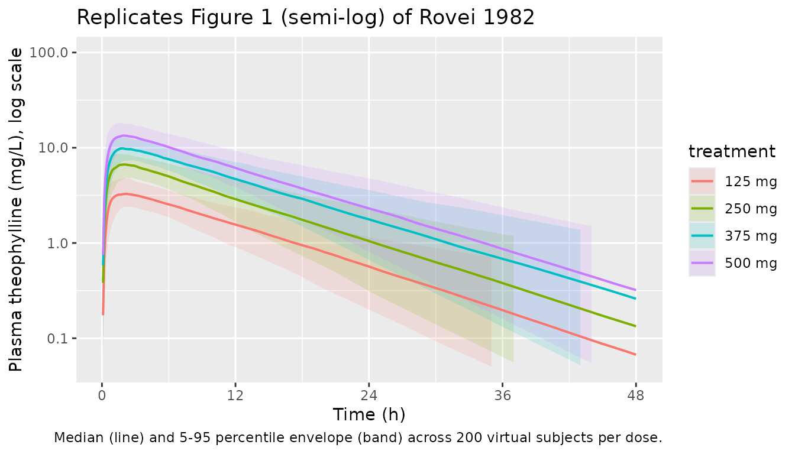
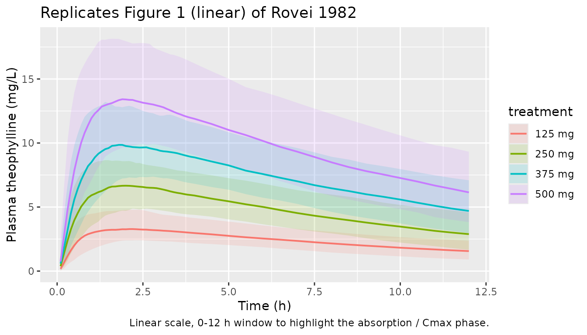
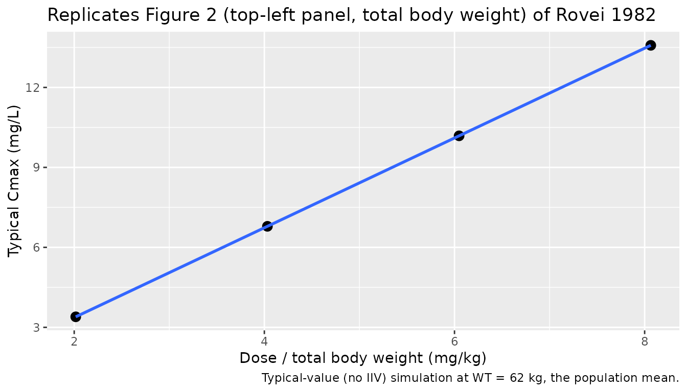

# Theophylline (Rovei 1982)

## Model and source

- Citation: Rovei V, Chanoine F, Strolin Benedetti M. Pharmacokinetics
  of theophylline: a dose-range study. Br J Clin Pharmacol.
  1982;14(6):769-778. <doi:10.1111/j.1365-2125.1982.tb02035.x>
- Description: One-compartment oral PK model for theophylline tablets
  (Rovei 1982): first-order absorption with lag time in healthy adult
  volunteers across single oral doses of 125-500 mg.
- Article: [Br J Clin Pharmacol
  1982;14(6):769-778](https://doi.org/10.1111/j.1365-2125.1982.tb02035.x)

## Population

Eight healthy adult Caucasian volunteers (4 male, 4 female), age 22-35
years (mean 29 +/- SD 4), total body weight 48-77 kg (mean 62 +/- 9),
lean body weight 33-65 kg (mean 50 +/- 11), all non-smokers on a
xanthine-free diet with normal blood pressure (BP 120/80 mmHg), heart
rate (65 +/- 8 bpm), hepatic function (SGOT 10 u/l, SGPT 10 +/- 1 u/l,
alkaline phosphatase 28 +/- 5 u/l), and renal function (creatinine
clearance 119 +/- 8 mL/min). Each subject received single oral 125, 250,
375 and 500 mg doses of theophylline tablets (Theodel) in a 4-period
cross-over with at least a 2 week washout (Rovei 1982 Table 1, Methods
page 770, Results page 772).

The same information is available programmatically via
`readModelDb("Rovei_1982_theophylline")$population`.

## Source trace

Per-parameter origin is recorded as an in-file comment next to each
[`ini()`](https://nlmixr2.github.io/rxode2/reference/ini.html) entry in
`inst/modeldb/specificDrugs/Rovei_1982_theophylline.R`. The table below
collects them for review.

| Equation / parameter | Value | Source location |
|----|----|----|
| `llag` (lag time) | `log(0.09)` h | Table 3 page 774: across-dose mean of t_lag column (0.11, 0.09, 0.09, 0.07 h at 125/250/375/500 mg). Paper text “tlag = lag-time (h)” page 771. |
| `lka` (absorption rate) | `log(1.73)` 1/h | Table 3 page 774: ka = ln(2)/t_abs with across-dose mean t_abs = 0.40 h (0.31, 0.44, 0.29, 0.55). Paper text “t_abs = half life of the absorption phase” page 771. |
| `lcl` (apparent CL) | `log(2.94)` L/h | Table 3 page 774: across-dose mean CL = 0.042 L/h/kg. Reference WT = 70 kg implies CL = 0.042 \* 70 = 2.94 L/h. |
| `lvc` (apparent Vc) | `log(35.7)` L | Table 3 page 774: across-dose mean Vd = 0.51 L/kg. Reference WT = 70 kg implies Vc = 0.51 \* 70 = 35.7 L. |
| `etallag` IIV | `log(1 + 0.50^2)` | Table 3 page 774: t_lag range 0-0.21 h across doses; CV approximated at 50%. |
| `etalka` IIV | `log(1 + 0.50^2)` | Table 3 page 774: t_abs range 0.07-1.37 h across doses; paper text page 773 “high intraindividual and interindividual variations of the rate of absorption”; CV approximated at 50%. |
| `etalcl` IIV | `log(1 + 0.25^2)` | Results page 773: CL = 0.041 +/- 0.007 to 0.043 +/- 0.012 L/h/kg across doses; CV ~17-28%, rounded to 25%. |
| `etalvc` IIV | `log(1 + 0.14^2)` | Results page 773: Vd = 0.46 +/- 0.07 to 0.54 +/- 0.07 L/kg across doses; CV ~13-15%, rounded to 14%. |
| `propSd` | `0.10` (10%) | Not reported in paper; default proportional residual error chosen for simulation. HPLC assay recovery 85 +/- 5% (Methods page 771-772) supports \< 10% measurement CV. |
| Structure | n/a | One-compartment open model with first-order absorption and lag time, fit by Gauss-Newton iteration with 1/y^2 weighting (G-PHARM, Gomeni & Gomeni 1978). Pharmacokinetics page 771. |
| `(WT/70)^1` scaling | n/a | Linear (exponent 1) body-weight scaling on CL and Vc to reproduce the paper’s per-kg parameterization. |

## Virtual cohort

Original observed data are not publicly available. The cohort below
approximates the Rovei 1982 Table 1 demographics: 4 male / 4 female
adults aged 22-35 years, body weight 48-77 kg (mean 62 +/- 9 kg), all
subjects receiving each of the four dose levels in a balanced
cross-over. The simulation expands the trial to 200 virtual subjects per
dose to give a well-resolved median + percentile envelope.

``` r

set.seed(19821101) # paper accepted 1982-07-19; published Br J Clin Pharmacol 1982 issue 14(6)

n_per_dose <- 200L
doses <- c(125, 250, 375, 500)

make_cohort <- function(dose, n, id_offset = 0L) {
  tibble(
    id        = id_offset + seq_len(n),
    WT        = pmin(pmax(rnorm(n, mean = 62, sd = 9), 48), 77),
    treatment = factor(sprintf("%d mg", dose), levels = sprintf("%d mg", doses)),
    dose_mg   = dose
  )
}

cohort <- bind_rows(lapply(seq_along(doses), function(i) {
  make_cohort(dose = doses[i], n = n_per_dose, id_offset = (i - 1L) * n_per_dose)
}))
```

``` r

obs_times <- sort(unique(c(
  seq(0, 4, by = 0.1),                # dense around absorption / Cmax
  seq(4.5, 12, by = 0.5),
  seq(13, 48, by = 1)
)))

dose_rows <- cohort |>
  mutate(time = 0, amt = dose_mg, cmt = "depot", evid = 1L)

obs_rows <- cohort |>
  tidyr::crossing(time = obs_times) |>
  mutate(amt = 0, cmt = NA_character_, evid = 0L)

events <- bind_rows(dose_rows, obs_rows) |>
  select(id, time, amt, cmt, evid, WT, treatment, dose_mg) |>
  arrange(id, time, desc(evid))

stopifnot(!anyDuplicated(unique(events[, c("id", "time", "evid")])))
```

## Simulation

``` r

mod <- rxode2::rxode2(readModelDb("Rovei_1982_theophylline"))
sim <- rxode2::rxSolve(mod, events = events, keep = c("WT", "treatment", "dose_mg"))
```

Typical-value (no IIV) simulation for the published-Cmax comparison:

``` r

mod_typ <- mod |> rxode2::zeroRe()
typ_cohort <- tibble(id = seq_along(doses), WT = 62, treatment = factor(sprintf("%d mg", doses), levels = sprintf("%d mg", doses)), dose_mg = doses)
typ_doses <- typ_cohort |> mutate(time = 0, amt = dose_mg, cmt = "depot", evid = 1L)
typ_obs   <- typ_cohort |> tidyr::crossing(time = obs_times) |> mutate(amt = 0, cmt = NA_character_, evid = 0L)
typ_events <- bind_rows(typ_doses, typ_obs) |>
  select(id, time, amt, cmt, evid, WT, treatment, dose_mg) |>
  arrange(id, time, desc(evid))
sim_typ <- rxode2::rxSolve(mod_typ, events = typ_events, keep = c("WT", "treatment", "dose_mg"))
#> ℹ omega/sigma items treated as zero: 'etallag', 'etalka', 'etalcl', 'etalvc'
#> Warning: multi-subject simulation without without 'omega'
```

## Replicate published figures

### Figure 1 – Mean plasma concentration vs. time (semi-log and linear)

Figure 1 of Rovei 1982 plots the mean plasma theophylline concentration
vs. time across the 8 subjects for each of the four dose levels
(semi-log on the top panel, linear on the bottom). The cohort summary
below reproduces that shape, with the 5-50-95 percentile envelope across
simulated subjects and the typical-value line overlaid.

``` r

sim_summary <- sim |>
  filter(!is.na(Cc), Cc > 0) |>
  group_by(time, treatment) |>
  summarise(
    Q05 = quantile(Cc, 0.05),
    Q50 = quantile(Cc, 0.50),
    Q95 = quantile(Cc, 0.95),
    .groups = "drop"
  )

ggplot(sim_summary, aes(time, Q50, colour = treatment, fill = treatment)) +
  geom_ribbon(aes(ymin = Q05, ymax = Q95), alpha = 0.15, colour = NA) +
  geom_line(linewidth = 0.7) +
  scale_y_log10(limits = c(0.05, 100)) +
  scale_x_continuous(breaks = seq(0, 48, by = 12)) +
  labs(x = "Time (h)", y = "Plasma theophylline (mg/L), log scale",
    title = "Replicates Figure 1 (semi-log) of Rovei 1982",
    caption = paste("Median (line) and 5-95 percentile envelope (band) across", n_per_dose, "virtual subjects per dose."))
#> Warning: Removed 34 rows containing missing values or values outside the scale range
#> (`geom_ribbon()`).
```



``` r

ggplot(sim_summary |> filter(time <= 12), aes(time, Q50, colour = treatment, fill = treatment)) +
  geom_ribbon(aes(ymin = Q05, ymax = Q95), alpha = 0.15, colour = NA) +
  geom_line(linewidth = 0.7) +
  labs(x = "Time (h)", y = "Plasma theophylline (mg/L)",
    title = "Replicates Figure 1 (linear) of Rovei 1982",
    caption = "Linear scale, 0-12 h window to highlight the absorption / Cmax phase.")
```



### Figure 2 – Cmax and AUC linearity vs. dose

Figure 2 of Rovei 1982 shows that Cmax and AUC scale linearly with dose
(per total body weight, mg/kg). The simulated typical-value Cmax across
doses preserves this proportionality.

``` r

cmax_typ <- sim_typ |>
  filter(!is.na(Cc)) |>
  group_by(treatment, dose_mg, WT) |>
  summarise(Cmax = max(Cc), .groups = "drop") |>
  mutate(dose_per_kg = dose_mg / WT)

ggplot(cmax_typ, aes(dose_per_kg, Cmax)) +
  geom_point(size = 3) +
  geom_smooth(method = "lm", se = FALSE, formula = y ~ x) +
  labs(x = "Dose / total body weight (mg/kg)", y = "Typical Cmax (mg/L)",
    title = "Replicates Figure 2 (top-left panel, total body weight) of Rovei 1982",
    caption = "Typical-value (no IIV) simulation at WT = 62 kg, the population mean.")
```



## PKNCA validation

Compute single-dose NCA parameters using `PKNCA` per dose group. The
treatment grouping variable (`treatment`) is placed before `id` in the
formula so per-dose summaries can be compared to the paper.

``` r

sim_nca <- sim |>
  filter(!is.na(Cc), Cc > 0) |>
  select(id, time, Cc, treatment)

conc_obj <- PKNCA::PKNCAconc(as.data.frame(sim_nca), Cc ~ time | treatment + id)

dose_df <- events |>
  filter(evid == 1) |>
  select(id, time, amt, treatment) |>
  as.data.frame()

dose_obj <- PKNCA::PKNCAdose(dose_df, amt ~ time | treatment + id)

intervals <- data.frame(
  start      = 0,
  end        = 48,
  cmax       = TRUE,
  tmax       = TRUE,
  aucinf.obs = TRUE,
  half.life  = TRUE
)

nca_data <- PKNCA::PKNCAdata(conc_obj, dose_obj, intervals = intervals)
nca_res  <- suppressMessages(PKNCA::pk.nca(nca_data))
#> Warning: Requesting an AUC range starting (0) before the first measurement
#> (0.2) is not allowed
#> Warning: Requesting an AUC range starting (0) before the first measurement (0.1) is not allowed
#> Requesting an AUC range starting (0) before the first measurement (0.1) is not allowed
#> Requesting an AUC range starting (0) before the first measurement (0.1) is not allowed
#> Requesting an AUC range starting (0) before the first measurement (0.1) is not allowed
#> Requesting an AUC range starting (0) before the first measurement (0.1) is not allowed
#> Warning: Requesting an AUC range starting (0) before the first measurement (0.2) is not allowed
#> Requesting an AUC range starting (0) before the first measurement (0.2) is not allowed
#> Warning: Requesting an AUC range starting (0) before the first measurement
#> (0.1) is not allowed
#> Warning: Requesting an AUC range starting (0) before the first measurement
#> (0.2) is not allowed
#> Warning: Requesting an AUC range starting (0) before the first measurement (0.1) is not allowed
#> Requesting an AUC range starting (0) before the first measurement (0.1) is not allowed
#> Warning: Requesting an AUC range starting (0) before the first measurement
#> (0.3) is not allowed
#> Warning: Requesting an AUC range starting (0) before the first measurement (0.1) is not allowed
#> Requesting an AUC range starting (0) before the first measurement (0.1) is not allowed
#> Warning: Requesting an AUC range starting (0) before the first measurement
#> (0.2) is not allowed
#> Warning: Requesting an AUC range starting (0) before the first measurement (0.1) is not allowed
#> Requesting an AUC range starting (0) before the first measurement (0.1) is not allowed
#> Requesting an AUC range starting (0) before the first measurement (0.1) is not allowed
#> Warning: Requesting an AUC range starting (0) before the first measurement
#> (0.2) is not allowed
#> Warning: Requesting an AUC range starting (0) before the first measurement (0.1) is not allowed
#> Requesting an AUC range starting (0) before the first measurement (0.1) is not allowed
#> Requesting an AUC range starting (0) before the first measurement (0.1) is not allowed
#> Requesting an AUC range starting (0) before the first measurement (0.1) is not allowed
#> Warning: Requesting an AUC range starting (0) before the first measurement (0.2) is not allowed
#> Requesting an AUC range starting (0) before the first measurement (0.2) is not allowed
#> Warning: Requesting an AUC range starting (0) before the first measurement (0.1) is not allowed
#> Requesting an AUC range starting (0) before the first measurement (0.1) is not allowed
#> Warning: Requesting an AUC range starting (0) before the first measurement
#> (0.2) is not allowed
#> Warning: Requesting an AUC range starting (0) before the first measurement
#> (0.1) is not allowed
#> Warning: Requesting an AUC range starting (0) before the first measurement
#> (0.2) is not allowed
#> Warning: Requesting an AUC range starting (0) before the first measurement (0.1) is not allowed
#> Requesting an AUC range starting (0) before the first measurement (0.1) is not allowed
#> Requesting an AUC range starting (0) before the first measurement (0.1) is not allowed
#> Requesting an AUC range starting (0) before the first measurement (0.1) is not allowed
#> Warning: Requesting an AUC range starting (0) before the first measurement (0.2) is not allowed
#> Requesting an AUC range starting (0) before the first measurement (0.2) is not allowed
#> Warning: Requesting an AUC range starting (0) before the first measurement (0.3) is not allowed
#> Requesting an AUC range starting (0) before the first measurement (0.3) is not allowed
#> Warning: Requesting an AUC range starting (0) before the first measurement
#> (0.1) is not allowed
#> Warning: Requesting an AUC range starting (0) before the first measurement
#> (0.2) is not allowed
#> Warning: Requesting an AUC range starting (0) before the first measurement (0.1) is not allowed
#> Requesting an AUC range starting (0) before the first measurement (0.1) is not allowed
#> Requesting an AUC range starting (0) before the first measurement (0.1) is not allowed
#> Requesting an AUC range starting (0) before the first measurement (0.1) is not allowed
#> Requesting an AUC range starting (0) before the first measurement (0.1) is not allowed
#> Requesting an AUC range starting (0) before the first measurement (0.1) is not allowed
#> Requesting an AUC range starting (0) before the first measurement (0.1) is not allowed
#> Warning: Requesting an AUC range starting (0) before the first measurement (0.2) is not allowed
#> Requesting an AUC range starting (0) before the first measurement (0.2) is not allowed
#> Warning: Requesting an AUC range starting (0) before the first measurement
#> (0.3) is not allowed
#> Warning: Requesting an AUC range starting (0) before the first measurement
#> (0.1) is not allowed
#> Warning: Requesting an AUC range starting (0) before the first measurement
#> (0.3) is not allowed
#> Warning: Requesting an AUC range starting (0) before the first measurement
#> (0.2) is not allowed
#> Warning: Requesting an AUC range starting (0) before the first measurement
#> (0.1) is not allowed
#> Warning: Requesting an AUC range starting (0) before the first measurement
#> (0.2) is not allowed
#> Warning: Requesting an AUC range starting (0) before the first measurement (0.1) is not allowed
#> Requesting an AUC range starting (0) before the first measurement (0.1) is not allowed
#> Warning: Requesting an AUC range starting (0) before the first measurement
#> (0.2) is not allowed
#> Warning: Requesting an AUC range starting (0) before the first measurement
#> (0.1) is not allowed
#> Warning: Requesting an AUC range starting (0) before the first measurement (0.2) is not allowed
#> Requesting an AUC range starting (0) before the first measurement (0.2) is not allowed
#> Requesting an AUC range starting (0) before the first measurement (0.2) is not allowed
#> Warning: Requesting an AUC range starting (0) before the first measurement
#> (0.1) is not allowed
#> Warning: Requesting an AUC range starting (0) before the first measurement
#> (0.2) is not allowed
#> Warning: Requesting an AUC range starting (0) before the first measurement
#> (0.3) is not allowed
#> Warning: Requesting an AUC range starting (0) before the first measurement
#> (0.2) is not allowed
#> Warning: Requesting an AUC range starting (0) before the first measurement
#> (0.1) is not allowed
#> Warning: Requesting an AUC range starting (0) before the first measurement (0.2) is not allowed
#> Requesting an AUC range starting (0) before the first measurement (0.2) is not allowed
#> Requesting an AUC range starting (0) before the first measurement (0.2) is not allowed
#> Warning: Requesting an AUC range starting (0) before the first measurement
#> (0.1) is not allowed
#> Warning: Requesting an AUC range starting (0) before the first measurement
#> (0.2) is not allowed
#> Warning: Requesting an AUC range starting (0) before the first measurement (0.1) is not allowed
#> Requesting an AUC range starting (0) before the first measurement (0.1) is not allowed
#> Requesting an AUC range starting (0) before the first measurement (0.1) is not allowed
#> Warning: Requesting an AUC range starting (0) before the first measurement
#> (0.2) is not allowed
#> Warning: Requesting an AUC range starting (0) before the first measurement
#> (0.1) is not allowed
#> Warning: Requesting an AUC range starting (0) before the first measurement (0.2) is not allowed
#> Requesting an AUC range starting (0) before the first measurement (0.2) is not allowed
#> Warning: Requesting an AUC range starting (0) before the first measurement
#> (0.4) is not allowed
#> Warning: Requesting an AUC range starting (0) before the first measurement (0.1) is not allowed
#> Requesting an AUC range starting (0) before the first measurement (0.1) is not allowed
#> Requesting an AUC range starting (0) before the first measurement (0.1) is not allowed
#> Warning: Requesting an AUC range starting (0) before the first measurement
#> (0.2) is not allowed
#> Warning: Requesting an AUC range starting (0) before the first measurement (0.1) is not allowed
#> Requesting an AUC range starting (0) before the first measurement (0.1) is not allowed
#> Requesting an AUC range starting (0) before the first measurement (0.1) is not allowed
#> Requesting an AUC range starting (0) before the first measurement (0.1) is not allowed
#> Requesting an AUC range starting (0) before the first measurement (0.1) is not allowed
#> Warning: Requesting an AUC range starting (0) before the first measurement
#> (0.2) is not allowed
#> Warning: Requesting an AUC range starting (0) before the first measurement
#> (0.1) is not allowed
#> Warning: Requesting an AUC range starting (0) before the first measurement (0.2) is not allowed
#> Requesting an AUC range starting (0) before the first measurement (0.2) is not allowed
#> Requesting an AUC range starting (0) before the first measurement (0.2) is not allowed
#> Warning: Requesting an AUC range starting (0) before the first measurement (0.1) is not allowed
#> Requesting an AUC range starting (0) before the first measurement (0.1) is not allowed
#> Requesting an AUC range starting (0) before the first measurement (0.1) is not allowed
#> Requesting an AUC range starting (0) before the first measurement (0.1) is not allowed
#> Warning: Requesting an AUC range starting (0) before the first measurement (0.2) is not allowed
#> Requesting an AUC range starting (0) before the first measurement (0.2) is not allowed
#> Warning: Requesting an AUC range starting (0) before the first measurement (0.1) is not allowed
#> Requesting an AUC range starting (0) before the first measurement (0.1) is not allowed
#> Requesting an AUC range starting (0) before the first measurement (0.1) is not allowed
#> Requesting an AUC range starting (0) before the first measurement (0.1) is not allowed
#> Requesting an AUC range starting (0) before the first measurement (0.1) is not allowed
#> Warning: Requesting an AUC range starting (0) before the first measurement (0.2) is not allowed
#> Requesting an AUC range starting (0) before the first measurement (0.2) is not allowed
#> Requesting an AUC range starting (0) before the first measurement (0.2) is not allowed
#> Warning: Requesting an AUC range starting (0) before the first measurement (0.1) is not allowed
#> Requesting an AUC range starting (0) before the first measurement (0.1) is not allowed
#> Warning: Requesting an AUC range starting (0) before the first measurement (0.2) is not allowed
#> Requesting an AUC range starting (0) before the first measurement (0.2) is not allowed
#> Requesting an AUC range starting (0) before the first measurement (0.2) is not allowed
#> Requesting an AUC range starting (0) before the first measurement (0.2) is not allowed
#> Requesting an AUC range starting (0) before the first measurement (0.2) is not allowed
#> Warning: Requesting an AUC range starting (0) before the first measurement (0.1) is not allowed
#> Requesting an AUC range starting (0) before the first measurement (0.1) is not allowed
#> Requesting an AUC range starting (0) before the first measurement (0.1) is not allowed
#> Warning: Requesting an AUC range starting (0) before the first measurement
#> (0.3) is not allowed
#> Warning: Requesting an AUC range starting (0) before the first measurement
#> (0.2) is not allowed
#> Warning: Requesting an AUC range starting (0) before the first measurement (0.1) is not allowed
#> Requesting an AUC range starting (0) before the first measurement (0.1) is not allowed
#> Warning: Requesting an AUC range starting (0) before the first measurement
#> (0.2) is not allowed
#> Warning: Requesting an AUC range starting (0) before the first measurement
#> (0.1) is not allowed
#> Warning: Requesting an AUC range starting (0) before the first measurement (0.2) is not allowed
#> Requesting an AUC range starting (0) before the first measurement (0.2) is not allowed
#> Requesting an AUC range starting (0) before the first measurement (0.2) is not allowed
#> Warning: Requesting an AUC range starting (0) before the first measurement
#> (0.1) is not allowed
#> Warning: Requesting an AUC range starting (0) before the first measurement
#> (0.2) is not allowed
#> Warning: Requesting an AUC range starting (0) before the first measurement (0.1) is not allowed
#> Requesting an AUC range starting (0) before the first measurement (0.1) is not allowed
#> Requesting an AUC range starting (0) before the first measurement (0.1) is not allowed
#> Requesting an AUC range starting (0) before the first measurement (0.1) is not allowed
#> Requesting an AUC range starting (0) before the first measurement (0.1) is not allowed
#> Requesting an AUC range starting (0) before the first measurement (0.1) is not allowed
#> Requesting an AUC range starting (0) before the first measurement (0.1) is not allowed
#> Warning: Requesting an AUC range starting (0) before the first measurement
#> (0.2) is not allowed
#> Warning: Requesting an AUC range starting (0) before the first measurement
#> (0.1) is not allowed
#> Warning: Requesting an AUC range starting (0) before the first measurement
#> (0.2) is not allowed
#> Warning: Requesting an AUC range starting (0) before the first measurement (0.1) is not allowed
#> Requesting an AUC range starting (0) before the first measurement (0.1) is not allowed
#> Warning: Requesting an AUC range starting (0) before the first measurement (0.2) is not allowed
#> Requesting an AUC range starting (0) before the first measurement (0.2) is not allowed
#> Requesting an AUC range starting (0) before the first measurement (0.2) is not allowed
#> Warning: Requesting an AUC range starting (0) before the first measurement (0.1) is not allowed
#> Requesting an AUC range starting (0) before the first measurement (0.1) is not allowed
#> Warning: Requesting an AUC range starting (0) before the first measurement (0.2) is not allowed
#> Requesting an AUC range starting (0) before the first measurement (0.2) is not allowed
#> Warning: Requesting an AUC range starting (0) before the first measurement (0.1) is not allowed
#> Requesting an AUC range starting (0) before the first measurement (0.1) is not allowed
#> Warning: Requesting an AUC range starting (0) before the first measurement (0.2) is not allowed
#> Requesting an AUC range starting (0) before the first measurement (0.2) is not allowed
#> Requesting an AUC range starting (0) before the first measurement (0.2) is not allowed
#> Warning: Requesting an AUC range starting (0) before the first measurement (0.1) is not allowed
#> Requesting an AUC range starting (0) before the first measurement (0.1) is not allowed
#> Warning: Requesting an AUC range starting (0) before the first measurement
#> (0.2) is not allowed
#> Warning: Requesting an AUC range starting (0) before the first measurement (0.1) is not allowed
#> Requesting an AUC range starting (0) before the first measurement (0.1) is not allowed
#> Warning: Requesting an AUC range starting (0) before the first measurement (0.2) is not allowed
#> Requesting an AUC range starting (0) before the first measurement (0.2) is not allowed
#> Requesting an AUC range starting (0) before the first measurement (0.2) is not allowed
#> Requesting an AUC range starting (0) before the first measurement (0.2) is not allowed
#> Warning: Requesting an AUC range starting (0) before the first measurement (0.1) is not allowed
#> Requesting an AUC range starting (0) before the first measurement (0.1) is not allowed
#> Requesting an AUC range starting (0) before the first measurement (0.1) is not allowed
#> Requesting an AUC range starting (0) before the first measurement (0.1) is not allowed
#> Requesting an AUC range starting (0) before the first measurement (0.1) is not allowed
#> Requesting an AUC range starting (0) before the first measurement (0.1) is not allowed
#> Requesting an AUC range starting (0) before the first measurement (0.1) is not allowed
#> Requesting an AUC range starting (0) before the first measurement (0.1) is not allowed
#> Requesting an AUC range starting (0) before the first measurement (0.1) is not allowed
#> Warning: Requesting an AUC range starting (0) before the first measurement (0.2) is not allowed
#> Requesting an AUC range starting (0) before the first measurement (0.2) is not allowed
#> Requesting an AUC range starting (0) before the first measurement (0.2) is not allowed
#> Warning: Requesting an AUC range starting (0) before the first measurement (0.1) is not allowed
#> Requesting an AUC range starting (0) before the first measurement (0.1) is not allowed
#> Requesting an AUC range starting (0) before the first measurement (0.1) is not allowed
#> Warning: Requesting an AUC range starting (0) before the first measurement (0.2) is not allowed
#> Requesting an AUC range starting (0) before the first measurement (0.2) is not allowed
#> Requesting an AUC range starting (0) before the first measurement (0.2) is not allowed
#> Requesting an AUC range starting (0) before the first measurement (0.2) is not allowed
#> Warning: Requesting an AUC range starting (0) before the first measurement (0.1) is not allowed
#> Requesting an AUC range starting (0) before the first measurement (0.1) is not allowed
#> Requesting an AUC range starting (0) before the first measurement (0.1) is not allowed
#> Requesting an AUC range starting (0) before the first measurement (0.1) is not allowed
#> Warning: Requesting an AUC range starting (0) before the first measurement
#> (0.2) is not allowed
#> Warning: Requesting an AUC range starting (0) before the first measurement (0.1) is not allowed
#> Requesting an AUC range starting (0) before the first measurement (0.1) is not allowed
#> Warning: Requesting an AUC range starting (0) before the first measurement
#> (0.2) is not allowed
#> Warning: Requesting an AUC range starting (0) before the first measurement (0.1) is not allowed
#> Requesting an AUC range starting (0) before the first measurement (0.1) is not allowed
#> Warning: Requesting an AUC range starting (0) before the first measurement (0.2) is not allowed
#> Requesting an AUC range starting (0) before the first measurement (0.2) is not allowed
#> Warning: Requesting an AUC range starting (0) before the first measurement
#> (0.1) is not allowed
#> Warning: Requesting an AUC range starting (0) before the first measurement
#> (0.2) is not allowed
#> Warning: Requesting an AUC range starting (0) before the first measurement (0.1) is not allowed
#> Requesting an AUC range starting (0) before the first measurement (0.1) is not allowed
#> Requesting an AUC range starting (0) before the first measurement (0.1) is not allowed
#> Warning: Requesting an AUC range starting (0) before the first measurement
#> (0.2) is not allowed
#> Warning: Requesting an AUC range starting (0) before the first measurement (0.1) is not allowed
#> Requesting an AUC range starting (0) before the first measurement (0.1) is not allowed
#> Requesting an AUC range starting (0) before the first measurement (0.1) is not allowed
#> Warning: Requesting an AUC range starting (0) before the first measurement
#> (0.2) is not allowed
#> Warning: Requesting an AUC range starting (0) before the first measurement
#> (0.1) is not allowed
#> Warning: Requesting an AUC range starting (0) before the first measurement (0.2) is not allowed
#> Requesting an AUC range starting (0) before the first measurement (0.2) is not allowed
#> Requesting an AUC range starting (0) before the first measurement (0.2) is not allowed
#> Warning: Requesting an AUC range starting (0) before the first measurement (0.1) is not allowed
#> Requesting an AUC range starting (0) before the first measurement (0.1) is not allowed
#> Requesting an AUC range starting (0) before the first measurement (0.1) is not allowed
#> Requesting an AUC range starting (0) before the first measurement (0.1) is not allowed
#> Warning: Requesting an AUC range starting (0) before the first measurement (0.2) is not allowed
#> Requesting an AUC range starting (0) before the first measurement (0.2) is not allowed
#> Warning: Requesting an AUC range starting (0) before the first measurement (0.1) is not allowed
#> Requesting an AUC range starting (0) before the first measurement (0.1) is not allowed
#> Requesting an AUC range starting (0) before the first measurement (0.1) is not allowed
#> Requesting an AUC range starting (0) before the first measurement (0.1) is not allowed
#> Requesting an AUC range starting (0) before the first measurement (0.1) is not allowed
#> Requesting an AUC range starting (0) before the first measurement (0.1) is not allowed
#> Requesting an AUC range starting (0) before the first measurement (0.1) is not allowed
#> Warning: Requesting an AUC range starting (0) before the first measurement
#> (0.2) is not allowed
#> Warning: Requesting an AUC range starting (0) before the first measurement (0.1) is not allowed
#> Requesting an AUC range starting (0) before the first measurement (0.1) is not allowed
#> Requesting an AUC range starting (0) before the first measurement (0.1) is not allowed
#> Requesting an AUC range starting (0) before the first measurement (0.1) is not allowed
#> Warning: Requesting an AUC range starting (0) before the first measurement
#> (0.2) is not allowed
#> Warning: Requesting an AUC range starting (0) before the first measurement
#> (0.1) is not allowed
#> Warning: Requesting an AUC range starting (0) before the first measurement
#> (0.2) is not allowed
#> Warning: Requesting an AUC range starting (0) before the first measurement
#> (0.1) is not allowed
#> Warning: Requesting an AUC range starting (0) before the first measurement (0.2) is not allowed
#> Requesting an AUC range starting (0) before the first measurement (0.2) is not allowed
#> Requesting an AUC range starting (0) before the first measurement (0.2) is not allowed
#> Warning: Requesting an AUC range starting (0) before the first measurement
#> (0.1) is not allowed
#> Warning: Requesting an AUC range starting (0) before the first measurement (0.2) is not allowed
#> Requesting an AUC range starting (0) before the first measurement (0.2) is not allowed
#> Requesting an AUC range starting (0) before the first measurement (0.2) is not allowed
#> Warning: Requesting an AUC range starting (0) before the first measurement (0.1) is not allowed
#> Requesting an AUC range starting (0) before the first measurement (0.1) is not allowed
#> Warning: Requesting an AUC range starting (0) before the first measurement (0.2) is not allowed
#> Requesting an AUC range starting (0) before the first measurement (0.2) is not allowed
#> Requesting an AUC range starting (0) before the first measurement (0.2) is not allowed
#> Requesting an AUC range starting (0) before the first measurement (0.2) is not allowed
#> Warning: Requesting an AUC range starting (0) before the first measurement (0.1) is not allowed
#> Requesting an AUC range starting (0) before the first measurement (0.1) is not allowed
#> Requesting an AUC range starting (0) before the first measurement (0.1) is not allowed
#> Warning: Requesting an AUC range starting (0) before the first measurement
#> (0.3) is not allowed
#> Warning: Requesting an AUC range starting (0) before the first measurement (0.2) is not allowed
#> Requesting an AUC range starting (0) before the first measurement (0.2) is not allowed
#> Requesting an AUC range starting (0) before the first measurement (0.2) is not allowed
#> Warning: Requesting an AUC range starting (0) before the first measurement (0.1) is not allowed
#> Requesting an AUC range starting (0) before the first measurement (0.1) is not allowed
#> Warning: Requesting an AUC range starting (0) before the first measurement (0.2) is not allowed
#> Requesting an AUC range starting (0) before the first measurement (0.2) is not allowed
#> Warning: Requesting an AUC range starting (0) before the first measurement
#> (0.1) is not allowed
#> Warning: Requesting an AUC range starting (0) before the first measurement (0.2) is not allowed
#> Requesting an AUC range starting (0) before the first measurement (0.2) is not allowed
#> Warning: Requesting an AUC range starting (0) before the first measurement (0.1) is not allowed
#> Requesting an AUC range starting (0) before the first measurement (0.1) is not allowed
#> Warning: Requesting an AUC range starting (0) before the first measurement (0.2) is not allowed
#> Requesting an AUC range starting (0) before the first measurement (0.2) is not allowed
#> Warning: Requesting an AUC range starting (0) before the first measurement (0.1) is not allowed
#> Requesting an AUC range starting (0) before the first measurement (0.1) is not allowed
#> Requesting an AUC range starting (0) before the first measurement (0.1) is not allowed
#> Requesting an AUC range starting (0) before the first measurement (0.1) is not allowed
#> Requesting an AUC range starting (0) before the first measurement (0.1) is not allowed
#> Warning: Requesting an AUC range starting (0) before the first measurement
#> (0.2) is not allowed
#> Warning: Requesting an AUC range starting (0) before the first measurement (0.1) is not allowed
#> Requesting an AUC range starting (0) before the first measurement (0.1) is not allowed
#> Requesting an AUC range starting (0) before the first measurement (0.1) is not allowed
#> Warning: Requesting an AUC range starting (0) before the first measurement
#> (0.2) is not allowed
#> Warning: Requesting an AUC range starting (0) before the first measurement
#> (0.3) is not allowed
#> Warning: Requesting an AUC range starting (0) before the first measurement (0.1) is not allowed
#> Requesting an AUC range starting (0) before the first measurement (0.1) is not allowed
#> Warning: Requesting an AUC range starting (0) before the first measurement
#> (0.2) is not allowed
#> Warning: Requesting an AUC range starting (0) before the first measurement (0.1) is not allowed
#> Requesting an AUC range starting (0) before the first measurement (0.1) is not allowed
#> Requesting an AUC range starting (0) before the first measurement (0.1) is not allowed
#> Requesting an AUC range starting (0) before the first measurement (0.1) is not allowed
#> Requesting an AUC range starting (0) before the first measurement (0.1) is not allowed
#> Warning: Requesting an AUC range starting (0) before the first measurement
#> (0.2) is not allowed
#> Warning: Requesting an AUC range starting (0) before the first measurement
#> (0.1) is not allowed
#> Warning: Requesting an AUC range starting (0) before the first measurement (0.2) is not allowed
#> Requesting an AUC range starting (0) before the first measurement (0.2) is not allowed
#> Warning: Requesting an AUC range starting (0) before the first measurement
#> (0.3) is not allowed
#> Warning: Requesting an AUC range starting (0) before the first measurement
#> (0.2) is not allowed
#> Warning: Requesting an AUC range starting (0) before the first measurement
#> (0.1) is not allowed
#> Warning: Requesting an AUC range starting (0) before the first measurement
#> (0.2) is not allowed
#> Warning: Requesting an AUC range starting (0) before the first measurement (0.1) is not allowed
#> Requesting an AUC range starting (0) before the first measurement (0.1) is not allowed
#> Requesting an AUC range starting (0) before the first measurement (0.1) is not allowed
#> Requesting an AUC range starting (0) before the first measurement (0.1) is not allowed
#> Requesting an AUC range starting (0) before the first measurement (0.1) is not allowed
#> Warning: Requesting an AUC range starting (0) before the first measurement
#> (0.2) is not allowed
#> Warning: Requesting an AUC range starting (0) before the first measurement (0.1) is not allowed
#> Requesting an AUC range starting (0) before the first measurement (0.1) is not allowed
#> Requesting an AUC range starting (0) before the first measurement (0.1) is not allowed
#> Requesting an AUC range starting (0) before the first measurement (0.1) is not allowed
#> Requesting an AUC range starting (0) before the first measurement (0.1) is not allowed
#> Warning: Requesting an AUC range starting (0) before the first measurement
#> (0.2) is not allowed
#> Warning: Requesting an AUC range starting (0) before the first measurement
#> (0.1) is not allowed
#> Warning: Requesting an AUC range starting (0) before the first measurement
#> (0.2) is not allowed
#> Warning: Requesting an AUC range starting (0) before the first measurement
#> (0.1) is not allowed
#> Warning: Requesting an AUC range starting (0) before the first measurement
#> (0.2) is not allowed
#> Warning: Requesting an AUC range starting (0) before the first measurement
#> (0.3) is not allowed
#> Warning: Requesting an AUC range starting (0) before the first measurement (0.1) is not allowed
#> Requesting an AUC range starting (0) before the first measurement (0.1) is not allowed
#> Warning: Requesting an AUC range starting (0) before the first measurement
#> (0.2) is not allowed
#> Warning: Requesting an AUC range starting (0) before the first measurement
#> (0.1) is not allowed
#> Warning: Requesting an AUC range starting (0) before the first measurement (0.2) is not allowed
#> Requesting an AUC range starting (0) before the first measurement (0.2) is not allowed
#> Warning: Requesting an AUC range starting (0) before the first measurement
#> (0.1) is not allowed
#> Warning: Requesting an AUC range starting (0) before the first measurement (0.2) is not allowed
#> Requesting an AUC range starting (0) before the first measurement (0.2) is not allowed
#> Warning: Requesting an AUC range starting (0) before the first measurement (0.1) is not allowed
#> Requesting an AUC range starting (0) before the first measurement (0.1) is not allowed
#> Requesting an AUC range starting (0) before the first measurement (0.1) is not allowed
#> Warning: Requesting an AUC range starting (0) before the first measurement
#> (0.2) is not allowed
#> Warning: Requesting an AUC range starting (0) before the first measurement
#> (0.1) is not allowed
#> Warning: Requesting an AUC range starting (0) before the first measurement
#> (0.2) is not allowed
#> Warning: Requesting an AUC range starting (0) before the first measurement (0.1) is not allowed
#> Requesting an AUC range starting (0) before the first measurement (0.1) is not allowed
#> Requesting an AUC range starting (0) before the first measurement (0.1) is not allowed
#> Requesting an AUC range starting (0) before the first measurement (0.1) is not allowed
#> Warning: Requesting an AUC range starting (0) before the first measurement
#> (0.2) is not allowed
#> Warning: Requesting an AUC range starting (0) before the first measurement
#> (0.1) is not allowed
#> Warning: Requesting an AUC range starting (0) before the first measurement
#> (0.2) is not allowed
#> Warning: Requesting an AUC range starting (0) before the first measurement (0.1) is not allowed
#> Requesting an AUC range starting (0) before the first measurement (0.1) is not allowed
#> Warning: Requesting an AUC range starting (0) before the first measurement
#> (0.2) is not allowed
#> Warning: Requesting an AUC range starting (0) before the first measurement (0.1) is not allowed
#> Requesting an AUC range starting (0) before the first measurement (0.1) is not allowed
#> Requesting an AUC range starting (0) before the first measurement (0.1) is not allowed
#> Warning: Requesting an AUC range starting (0) before the first measurement
#> (0.4) is not allowed
#> Warning: Requesting an AUC range starting (0) before the first measurement (0.1) is not allowed
#> Requesting an AUC range starting (0) before the first measurement (0.1) is not allowed
#> Requesting an AUC range starting (0) before the first measurement (0.1) is not allowed
#> Requesting an AUC range starting (0) before the first measurement (0.1) is not allowed
#> Requesting an AUC range starting (0) before the first measurement (0.1) is not allowed
#> Requesting an AUC range starting (0) before the first measurement (0.1) is not allowed
#> Requesting an AUC range starting (0) before the first measurement (0.1) is not allowed
#> Warning: Requesting an AUC range starting (0) before the first measurement
#> (0.3) is not allowed
#> Warning: Requesting an AUC range starting (0) before the first measurement (0.1) is not allowed
#> Requesting an AUC range starting (0) before the first measurement (0.1) is not allowed
#> Requesting an AUC range starting (0) before the first measurement (0.1) is not allowed
#> Warning: Requesting an AUC range starting (0) before the first measurement (0.2) is not allowed
#> Requesting an AUC range starting (0) before the first measurement (0.2) is not allowed
#> Warning: Requesting an AUC range starting (0) before the first measurement (0.1) is not allowed
#> Requesting an AUC range starting (0) before the first measurement (0.1) is not allowed
#> Warning: Requesting an AUC range starting (0) before the first measurement (0.2) is not allowed
#> Requesting an AUC range starting (0) before the first measurement (0.2) is not allowed
#> Warning: Requesting an AUC range starting (0) before the first measurement
#> (0.1) is not allowed
#> Warning: Requesting an AUC range starting (0) before the first measurement (0.2) is not allowed
#> Requesting an AUC range starting (0) before the first measurement (0.2) is not allowed
#> Requesting an AUC range starting (0) before the first measurement (0.2) is not allowed
#> Warning: Requesting an AUC range starting (0) before the first measurement
#> (0.1) is not allowed
#> Warning: Requesting an AUC range starting (0) before the first measurement (0.2) is not allowed
#> Requesting an AUC range starting (0) before the first measurement (0.2) is not allowed
#> Warning: Requesting an AUC range starting (0) before the first measurement
#> (0.3) is not allowed
#> Warning: Requesting an AUC range starting (0) before the first measurement (0.1) is not allowed
#> Requesting an AUC range starting (0) before the first measurement (0.1) is not allowed
#> Requesting an AUC range starting (0) before the first measurement (0.1) is not allowed
#> Requesting an AUC range starting (0) before the first measurement (0.1) is not allowed
#> Requesting an AUC range starting (0) before the first measurement (0.1) is not allowed
#> Warning: Requesting an AUC range starting (0) before the first measurement
#> (0.2) is not allowed
#> Warning: Requesting an AUC range starting (0) before the first measurement
#> (0.1) is not allowed
#> Warning: Requesting an AUC range starting (0) before the first measurement (0.2) is not allowed
#> Requesting an AUC range starting (0) before the first measurement (0.2) is not allowed
#> Warning: Requesting an AUC range starting (0) before the first measurement
#> (0.1) is not allowed
#> Warning: Requesting an AUC range starting (0) before the first measurement
#> (0.2) is not allowed
#> Warning: Requesting an AUC range starting (0) before the first measurement (0.1) is not allowed
#> Requesting an AUC range starting (0) before the first measurement (0.1) is not allowed
#> Warning: Requesting an AUC range starting (0) before the first measurement
#> (0.2) is not allowed
#> Warning: Requesting an AUC range starting (0) before the first measurement (0.1) is not allowed
#> Requesting an AUC range starting (0) before the first measurement (0.1) is not allowed
#> Requesting an AUC range starting (0) before the first measurement (0.1) is not allowed
#> Warning: Requesting an AUC range starting (0) before the first measurement (0.2) is not allowed
#> Requesting an AUC range starting (0) before the first measurement (0.2) is not allowed
#> Warning: Requesting an AUC range starting (0) before the first measurement (0.1) is not allowed
#> Requesting an AUC range starting (0) before the first measurement (0.1) is not allowed
#> Requesting an AUC range starting (0) before the first measurement (0.1) is not allowed
#> Requesting an AUC range starting (0) before the first measurement (0.1) is not allowed
#> Warning: Requesting an AUC range starting (0) before the first measurement
#> (0.3) is not allowed
#> Warning: Requesting an AUC range starting (0) before the first measurement
#> (0.5) is not allowed
#> Warning: Requesting an AUC range starting (0) before the first measurement
#> (0.2) is not allowed
#> Warning: Requesting an AUC range starting (0) before the first measurement
#> (0.1) is not allowed
#> Warning: Requesting an AUC range starting (0) before the first measurement (0.2) is not allowed
#> Requesting an AUC range starting (0) before the first measurement (0.2) is not allowed
#> Warning: Requesting an AUC range starting (0) before the first measurement (0.1) is not allowed
#> Requesting an AUC range starting (0) before the first measurement (0.1) is not allowed
#> Requesting an AUC range starting (0) before the first measurement (0.1) is not allowed
#> Requesting an AUC range starting (0) before the first measurement (0.1) is not allowed
#> Requesting an AUC range starting (0) before the first measurement (0.1) is not allowed
#> Warning: Requesting an AUC range starting (0) before the first measurement
#> (0.3) is not allowed
#> Warning: Requesting an AUC range starting (0) before the first measurement (0.1) is not allowed
#> Requesting an AUC range starting (0) before the first measurement (0.1) is not allowed
#> Requesting an AUC range starting (0) before the first measurement (0.1) is not allowed
#> Requesting an AUC range starting (0) before the first measurement (0.1) is not allowed
#> Warning: Requesting an AUC range starting (0) before the first measurement (0.2) is not allowed
#> Requesting an AUC range starting (0) before the first measurement (0.2) is not allowed
#> Warning: Requesting an AUC range starting (0) before the first measurement (0.1) is not allowed
#> Requesting an AUC range starting (0) before the first measurement (0.1) is not allowed
#> Warning: Requesting an AUC range starting (0) before the first measurement
#> (0.2) is not allowed
#> Warning: Requesting an AUC range starting (0) before the first measurement (0.1) is not allowed
#> Requesting an AUC range starting (0) before the first measurement (0.1) is not allowed
#> Requesting an AUC range starting (0) before the first measurement (0.1) is not allowed
#> Requesting an AUC range starting (0) before the first measurement (0.1) is not allowed
#> Warning: Requesting an AUC range starting (0) before the first measurement (0.2) is not allowed
#> Requesting an AUC range starting (0) before the first measurement (0.2) is not allowed
#> Warning: Requesting an AUC range starting (0) before the first measurement
#> (0.1) is not allowed
#> Warning: Requesting an AUC range starting (0) before the first measurement
#> (0.2) is not allowed
#> Warning: Requesting an AUC range starting (0) before the first measurement
#> (0.1) is not allowed
#> Warning: Requesting an AUC range starting (0) before the first measurement
#> (0.2) is not allowed
#> Warning: Requesting an AUC range starting (0) before the first measurement
#> (0.1) is not allowed
#> Warning: Requesting an AUC range starting (0) before the first measurement
#> (0.3) is not allowed
#> Warning: Requesting an AUC range starting (0) before the first measurement
#> (0.1) is not allowed
#> Warning: Requesting an AUC range starting (0) before the first measurement
#> (0.2) is not allowed
#> Warning: Requesting an AUC range starting (0) before the first measurement
#> (0.1) is not allowed
#> Warning: Requesting an AUC range starting (0) before the first measurement
#> (0.3) is not allowed
#> Warning: Requesting an AUC range starting (0) before the first measurement (0.1) is not allowed
#> Requesting an AUC range starting (0) before the first measurement (0.1) is not allowed
#> Requesting an AUC range starting (0) before the first measurement (0.1) is not allowed
#> Requesting an AUC range starting (0) before the first measurement (0.1) is not allowed
#> Warning: Requesting an AUC range starting (0) before the first measurement
#> (0.2) is not allowed
#> Warning: Requesting an AUC range starting (0) before the first measurement (0.1) is not allowed
#> Requesting an AUC range starting (0) before the first measurement (0.1) is not allowed
#> Requesting an AUC range starting (0) before the first measurement (0.1) is not allowed
#> Requesting an AUC range starting (0) before the first measurement (0.1) is not allowed
#> Warning: Requesting an AUC range starting (0) before the first measurement
#> (0.2) is not allowed
#> Warning: Requesting an AUC range starting (0) before the first measurement (0.1) is not allowed
#> Requesting an AUC range starting (0) before the first measurement (0.1) is not allowed
#> Requesting an AUC range starting (0) before the first measurement (0.1) is not allowed
#> Requesting an AUC range starting (0) before the first measurement (0.1) is not allowed
#> Warning: Requesting an AUC range starting (0) before the first measurement
#> (0.2) is not allowed
#> Warning: Requesting an AUC range starting (0) before the first measurement (0.1) is not allowed
#> Requesting an AUC range starting (0) before the first measurement (0.1) is not allowed
#> Warning: Requesting an AUC range starting (0) before the first measurement (0.2) is not allowed
#> Requesting an AUC range starting (0) before the first measurement (0.2) is not allowed
#> Warning: Requesting an AUC range starting (0) before the first measurement (0.1) is not allowed
#> Requesting an AUC range starting (0) before the first measurement (0.1) is not allowed
#> Requesting an AUC range starting (0) before the first measurement (0.1) is not allowed
#> Requesting an AUC range starting (0) before the first measurement (0.1) is not allowed
#> Requesting an AUC range starting (0) before the first measurement (0.1) is not allowed
#> Warning: Requesting an AUC range starting (0) before the first measurement
#> (0.2) is not allowed
#> Warning: Requesting an AUC range starting (0) before the first measurement (0.1) is not allowed
#> Requesting an AUC range starting (0) before the first measurement (0.1) is not allowed
#> Requesting an AUC range starting (0) before the first measurement (0.1) is not allowed
#> Warning: Requesting an AUC range starting (0) before the first measurement (0.2) is not allowed
#> Requesting an AUC range starting (0) before the first measurement (0.2) is not allowed
#> Requesting an AUC range starting (0) before the first measurement (0.2) is not allowed
#> Requesting an AUC range starting (0) before the first measurement (0.2) is not allowed
#> Warning: Requesting an AUC range starting (0) before the first measurement
#> (0.1) is not allowed
#> Warning: Requesting an AUC range starting (0) before the first measurement
#> (0.2) is not allowed
#> Warning: Requesting an AUC range starting (0) before the first measurement (0.1) is not allowed
#> Requesting an AUC range starting (0) before the first measurement (0.1) is not allowed
#> Requesting an AUC range starting (0) before the first measurement (0.1) is not allowed
#> Warning: Requesting an AUC range starting (0) before the first measurement
#> (0.2) is not allowed
#> Warning: Requesting an AUC range starting (0) before the first measurement
#> (0.1) is not allowed
#> Warning: Requesting an AUC range starting (0) before the first measurement
#> (0.2) is not allowed
#> Warning: Requesting an AUC range starting (0) before the first measurement (0.1) is not allowed
#> Requesting an AUC range starting (0) before the first measurement (0.1) is not allowed
#> Warning: Requesting an AUC range starting (0) before the first measurement (0.2) is not allowed
#> Requesting an AUC range starting (0) before the first measurement (0.2) is not allowed
#> Warning: Requesting an AUC range starting (0) before the first measurement
#> (0.1) is not allowed
#> Warning: Requesting an AUC range starting (0) before the first measurement
#> (0.3) is not allowed
#> Warning: Requesting an AUC range starting (0) before the first measurement
#> (0.6) is not allowed
#> Warning: Requesting an AUC range starting (0) before the first measurement (0.1) is not allowed
#> Requesting an AUC range starting (0) before the first measurement (0.1) is not allowed
#> Requesting an AUC range starting (0) before the first measurement (0.1) is not allowed
#> Warning: Requesting an AUC range starting (0) before the first measurement
#> (0.2) is not allowed
#> Warning: Requesting an AUC range starting (0) before the first measurement
#> (0.1) is not allowed
#> Warning: Requesting an AUC range starting (0) before the first measurement
#> (0.2) is not allowed
#> Warning: Requesting an AUC range starting (0) before the first measurement
#> (0.1) is not allowed
#> Warning: Requesting an AUC range starting (0) before the first measurement
#> (0.2) is not allowed
#> Warning: Requesting an AUC range starting (0) before the first measurement
#> (0.1) is not allowed
#> Warning: Requesting an AUC range starting (0) before the first measurement
#> (0.3) is not allowed
#> Warning: Requesting an AUC range starting (0) before the first measurement
#> (0.2) is not allowed
#> Warning: Requesting an AUC range starting (0) before the first measurement (0.1) is not allowed
#> Requesting an AUC range starting (0) before the first measurement (0.1) is not allowed
#> Warning: Requesting an AUC range starting (0) before the first measurement (0.2) is not allowed
#> Requesting an AUC range starting (0) before the first measurement (0.2) is not allowed
#> Warning: Requesting an AUC range starting (0) before the first measurement
#> (0.3) is not allowed
#> Warning: Requesting an AUC range starting (0) before the first measurement (0.2) is not allowed
#> Requesting an AUC range starting (0) before the first measurement (0.2) is not allowed
#> Warning: Requesting an AUC range starting (0) before the first measurement (0.1) is not allowed
#> Requesting an AUC range starting (0) before the first measurement (0.1) is not allowed
#> Warning: Requesting an AUC range starting (0) before the first measurement (0.2) is not allowed
#> Requesting an AUC range starting (0) before the first measurement (0.2) is not allowed
#> Requesting an AUC range starting (0) before the first measurement (0.2) is not allowed
#> Warning: Requesting an AUC range starting (0) before the first measurement
#> (0.1) is not allowed
#> Warning: Requesting an AUC range starting (0) before the first measurement
#> (0.2) is not allowed
#> Warning: Requesting an AUC range starting (0) before the first measurement
#> (0.1) is not allowed
#> Warning: Requesting an AUC range starting (0) before the first measurement (0.2) is not allowed
#> Requesting an AUC range starting (0) before the first measurement (0.2) is not allowed
#> Warning: Requesting an AUC range starting (0) before the first measurement
#> (0.1) is not allowed
#> Warning: Requesting an AUC range starting (0) before the first measurement (0.2) is not allowed
#> Requesting an AUC range starting (0) before the first measurement (0.2) is not allowed
#> Requesting an AUC range starting (0) before the first measurement (0.2) is not allowed
#> Warning: Requesting an AUC range starting (0) before the first measurement
#> (0.1) is not allowed
#> Warning: Requesting an AUC range starting (0) before the first measurement
#> (0.2) is not allowed
#> Warning: Requesting an AUC range starting (0) before the first measurement (0.1) is not allowed
#> Requesting an AUC range starting (0) before the first measurement (0.1) is not allowed
#> Warning: Requesting an AUC range starting (0) before the first measurement (0.2) is not allowed
#> Requesting an AUC range starting (0) before the first measurement (0.2) is not allowed
#> Requesting an AUC range starting (0) before the first measurement (0.2) is not allowed
#> Warning: Requesting an AUC range starting (0) before the first measurement (0.1) is not allowed
#> Requesting an AUC range starting (0) before the first measurement (0.1) is not allowed
#> Requesting an AUC range starting (0) before the first measurement (0.1) is not allowed
#> Warning: Requesting an AUC range starting (0) before the first measurement
#> (0.2) is not allowed
#> Warning: Requesting an AUC range starting (0) before the first measurement
#> (0.3) is not allowed
#> Warning: Requesting an AUC range starting (0) before the first measurement (0.1) is not allowed
#> Requesting an AUC range starting (0) before the first measurement (0.1) is not allowed
#> Warning: Requesting an AUC range starting (0) before the first measurement
#> (0.2) is not allowed
#> Warning: Requesting an AUC range starting (0) before the first measurement (0.1) is not allowed
#> Requesting an AUC range starting (0) before the first measurement (0.1) is not allowed
#> Requesting an AUC range starting (0) before the first measurement (0.1) is not allowed
#> Requesting an AUC range starting (0) before the first measurement (0.1) is not allowed
#> Warning: Requesting an AUC range starting (0) before the first measurement (0.2) is not allowed
#> Requesting an AUC range starting (0) before the first measurement (0.2) is not allowed
#> Warning: Requesting an AUC range starting (0) before the first measurement
#> (0.1) is not allowed
#> Warning: Requesting an AUC range starting (0) before the first measurement
#> (0.2) is not allowed
#> Warning: Requesting an AUC range starting (0) before the first measurement
#> (0.1) is not allowed
#> Warning: Requesting an AUC range starting (0) before the first measurement
#> (0.2) is not allowed
#> Warning: Requesting an AUC range starting (0) before the first measurement
#> (0.1) is not allowed
#> Warning: Requesting an AUC range starting (0) before the first measurement
#> (0.2) is not allowed
#> Warning: Requesting an AUC range starting (0) before the first measurement (0.1) is not allowed
#> Requesting an AUC range starting (0) before the first measurement (0.1) is not allowed
#> Requesting an AUC range starting (0) before the first measurement (0.1) is not allowed
#> Requesting an AUC range starting (0) before the first measurement (0.1) is not allowed
#> Warning: Requesting an AUC range starting (0) before the first measurement (0.2) is not allowed
#> Requesting an AUC range starting (0) before the first measurement (0.2) is not allowed
#> Warning: Requesting an AUC range starting (0) before the first measurement (0.1) is not allowed
#> Requesting an AUC range starting (0) before the first measurement (0.1) is not allowed
#> Requesting an AUC range starting (0) before the first measurement (0.1) is not allowed
#> Requesting an AUC range starting (0) before the first measurement (0.1) is not allowed
#> Requesting an AUC range starting (0) before the first measurement (0.1) is not allowed
#> Requesting an AUC range starting (0) before the first measurement (0.1) is not allowed
#> Requesting an AUC range starting (0) before the first measurement (0.1) is not allowed
#> Requesting an AUC range starting (0) before the first measurement (0.1) is not allowed
#> Requesting an AUC range starting (0) before the first measurement (0.1) is not allowed
#> Warning: Requesting an AUC range starting (0) before the first measurement (0.2) is not allowed
#> Requesting an AUC range starting (0) before the first measurement (0.2) is not allowed
#> Warning: Requesting an AUC range starting (0) before the first measurement
#> (0.1) is not allowed
#> Warning: Requesting an AUC range starting (0) before the first measurement
#> (0.2) is not allowed
#> Warning: Requesting an AUC range starting (0) before the first measurement (0.1) is not allowed
#> Requesting an AUC range starting (0) before the first measurement (0.1) is not allowed
#> Requesting an AUC range starting (0) before the first measurement (0.1) is not allowed
#> Warning: Requesting an AUC range starting (0) before the first measurement (0.2) is not allowed
#> Requesting an AUC range starting (0) before the first measurement (0.2) is not allowed
#> Warning: Requesting an AUC range starting (0) before the first measurement
#> (0.3) is not allowed
#> Warning: Requesting an AUC range starting (0) before the first measurement (0.2) is not allowed
#> Requesting an AUC range starting (0) before the first measurement (0.2) is not allowed
#> Warning: Requesting an AUC range starting (0) before the first measurement (0.1) is not allowed
#> Requesting an AUC range starting (0) before the first measurement (0.1) is not allowed
#> Requesting an AUC range starting (0) before the first measurement (0.1) is not allowed
#> Warning: Requesting an AUC range starting (0) before the first measurement
#> (0.2) is not allowed
#> Warning: Requesting an AUC range starting (0) before the first measurement (0.1) is not allowed
#> Requesting an AUC range starting (0) before the first measurement (0.1) is not allowed
#> Requesting an AUC range starting (0) before the first measurement (0.1) is not allowed
#> Requesting an AUC range starting (0) before the first measurement (0.1) is not allowed
#> Requesting an AUC range starting (0) before the first measurement (0.1) is not allowed
#> Requesting an AUC range starting (0) before the first measurement (0.1) is not allowed
#> Warning: Requesting an AUC range starting (0) before the first measurement
#> (0.2) is not allowed
#> Warning: Requesting an AUC range starting (0) before the first measurement
#> (0.3) is not allowed
#> Warning: Requesting an AUC range starting (0) before the first measurement
#> (0.1) is not allowed
#> Warning: Requesting an AUC range starting (0) before the first measurement
#> (0.2) is not allowed
#> Warning: Requesting an AUC range starting (0) before the first measurement (0.1) is not allowed
#> Requesting an AUC range starting (0) before the first measurement (0.1) is not allowed
#> Warning: Requesting an AUC range starting (0) before the first measurement
#> (0.3) is not allowed
#> Warning: Requesting an AUC range starting (0) before the first measurement
#> (0.2) is not allowed
#> Warning: Requesting an AUC range starting (0) before the first measurement
#> (0.1) is not allowed
#> Warning: Requesting an AUC range starting (0) before the first measurement
#> (0.3) is not allowed
#> Warning: Requesting an AUC range starting (0) before the first measurement (0.1) is not allowed
#> Requesting an AUC range starting (0) before the first measurement (0.1) is not allowed
#> Warning: Requesting an AUC range starting (0) before the first measurement
#> (0.2) is not allowed
#> Warning: Requesting an AUC range starting (0) before the first measurement
#> (0.1) is not allowed
#> Warning: Requesting an AUC range starting (0) before the first measurement
#> (0.2) is not allowed
#> Warning: Requesting an AUC range starting (0) before the first measurement
#> (0.1) is not allowed
#> Warning: Requesting an AUC range starting (0) before the first measurement (0.2) is not allowed
#> Requesting an AUC range starting (0) before the first measurement (0.2) is not allowed
#> Requesting an AUC range starting (0) before the first measurement (0.2) is not allowed
#> Requesting an AUC range starting (0) before the first measurement (0.2) is not allowed
#> Requesting an AUC range starting (0) before the first measurement (0.2) is not allowed
#> Warning: Requesting an AUC range starting (0) before the first measurement
#> (0.1) is not allowed
#> Warning: Requesting an AUC range starting (0) before the first measurement
#> (0.2) is not allowed
#> Warning: Requesting an AUC range starting (0) before the first measurement (0.1) is not allowed
#> Requesting an AUC range starting (0) before the first measurement (0.1) is not allowed
#> Requesting an AUC range starting (0) before the first measurement (0.1) is not allowed
#> Warning: Requesting an AUC range starting (0) before the first measurement (0.2) is not allowed
#> Requesting an AUC range starting (0) before the first measurement (0.2) is not allowed
#> Warning: Requesting an AUC range starting (0) before the first measurement (0.1) is not allowed
#> Requesting an AUC range starting (0) before the first measurement (0.1) is not allowed
#> Requesting an AUC range starting (0) before the first measurement (0.1) is not allowed
#> Warning: Requesting an AUC range starting (0) before the first measurement
#> (0.2) is not allowed
#> Warning: Requesting an AUC range starting (0) before the first measurement
#> (0.3) is not allowed
#> Warning: Requesting an AUC range starting (0) before the first measurement
#> (0.2) is not allowed
#> Warning: Requesting an AUC range starting (0) before the first measurement (0.1) is not allowed
#> Requesting an AUC range starting (0) before the first measurement (0.1) is not allowed
#> Requesting an AUC range starting (0) before the first measurement (0.1) is not allowed
#> Warning: Requesting an AUC range starting (0) before the first measurement
#> (0.2) is not allowed
#> Warning: Requesting an AUC range starting (0) before the first measurement
#> (0.1) is not allowed
#> Warning: Requesting an AUC range starting (0) before the first measurement (0.2) is not allowed
#> Requesting an AUC range starting (0) before the first measurement (0.2) is not allowed
#> Warning: Requesting an AUC range starting (0) before the first measurement (0.1) is not allowed
#> Requesting an AUC range starting (0) before the first measurement (0.1) is not allowed
#> Requesting an AUC range starting (0) before the first measurement (0.1) is not allowed
#> Warning: Requesting an AUC range starting (0) before the first measurement (0.2) is not allowed
#> Requesting an AUC range starting (0) before the first measurement (0.2) is not allowed
#> Warning: Requesting an AUC range starting (0) before the first measurement (0.1) is not allowed
#> Requesting an AUC range starting (0) before the first measurement (0.1) is not allowed
#> Requesting an AUC range starting (0) before the first measurement (0.1) is not allowed
#> Requesting an AUC range starting (0) before the first measurement (0.1) is not allowed
#> Requesting an AUC range starting (0) before the first measurement (0.1) is not allowed
#> Requesting an AUC range starting (0) before the first measurement (0.1) is not allowed
#> Requesting an AUC range starting (0) before the first measurement (0.1) is not allowed
#> Requesting an AUC range starting (0) before the first measurement (0.1) is not allowed
#> Requesting an AUC range starting (0) before the first measurement (0.1) is not allowed
#> Requesting an AUC range starting (0) before the first measurement (0.1) is not allowed
#> Warning: Requesting an AUC range starting (0) before the first measurement
#> (0.2) is not allowed
#> Warning: Requesting an AUC range starting (0) before the first measurement
#> (0.1) is not allowed
#> Warning: Requesting an AUC range starting (0) before the first measurement
#> (0.2) is not allowed
#> Warning: Requesting an AUC range starting (0) before the first measurement (0.1) is not allowed
#> Requesting an AUC range starting (0) before the first measurement (0.1) is not allowed
#> Requesting an AUC range starting (0) before the first measurement (0.1) is not allowed
#> Requesting an AUC range starting (0) before the first measurement (0.1) is not allowed
#> Requesting an AUC range starting (0) before the first measurement (0.1) is not allowed
#> Warning: Requesting an AUC range starting (0) before the first measurement
#> (0.2) is not allowed
#> Warning: Requesting an AUC range starting (0) before the first measurement
#> (0.1) is not allowed
#> Warning: Requesting an AUC range starting (0) before the first measurement
#> (0.3) is not allowed
#> Warning: Requesting an AUC range starting (0) before the first measurement (0.1) is not allowed
#> Requesting an AUC range starting (0) before the first measurement (0.1) is not allowed
#> Requesting an AUC range starting (0) before the first measurement (0.1) is not allowed
#> Requesting an AUC range starting (0) before the first measurement (0.1) is not allowed
#> Requesting an AUC range starting (0) before the first measurement (0.1) is not allowed
#> Requesting an AUC range starting (0) before the first measurement (0.1) is not allowed
#> Warning: Requesting an AUC range starting (0) before the first measurement (0.2) is not allowed
#> Requesting an AUC range starting (0) before the first measurement (0.2) is not allowed
#> Warning: Requesting an AUC range starting (0) before the first measurement
#> (0.1) is not allowed
#> Warning: Requesting an AUC range starting (0) before the first measurement
#> (0.2) is not allowed
#> Warning: Requesting an AUC range starting (0) before the first measurement
#> (0.1) is not allowed
#> Warning: Requesting an AUC range starting (0) before the first measurement
#> (0.2) is not allowed
#> Warning: Requesting an AUC range starting (0) before the first measurement (0.1) is not allowed
#> Requesting an AUC range starting (0) before the first measurement (0.1) is not allowed
#> Requesting an AUC range starting (0) before the first measurement (0.1) is not allowed
#> Requesting an AUC range starting (0) before the first measurement (0.1) is not allowed
#> Requesting an AUC range starting (0) before the first measurement (0.1) is not allowed
#> Warning: Requesting an AUC range starting (0) before the first measurement (0.2) is not allowed
#> Requesting an AUC range starting (0) before the first measurement (0.2) is not allowed
#> Warning: Requesting an AUC range starting (0) before the first measurement (0.1) is not allowed
#> Requesting an AUC range starting (0) before the first measurement (0.1) is not allowed
#> Requesting an AUC range starting (0) before the first measurement (0.1) is not allowed
#> Requesting an AUC range starting (0) before the first measurement (0.1) is not allowed
#> Warning: Requesting an AUC range starting (0) before the first measurement (0.2) is not allowed
#> Requesting an AUC range starting (0) before the first measurement (0.2) is not allowed
#> Requesting an AUC range starting (0) before the first measurement (0.2) is not allowed
#> Warning: Requesting an AUC range starting (0) before the first measurement
#> (0.1) is not allowed
#> Warning: Requesting an AUC range starting (0) before the first measurement
#> (0.2) is not allowed
#> Warning: Requesting an AUC range starting (0) before the first measurement (0.1) is not allowed
#> Requesting an AUC range starting (0) before the first measurement (0.1) is not allowed
#> Requesting an AUC range starting (0) before the first measurement (0.1) is not allowed
#> Requesting an AUC range starting (0) before the first measurement (0.1) is not allowed
#> Requesting an AUC range starting (0) before the first measurement (0.1) is not allowed
#> Requesting an AUC range starting (0) before the first measurement (0.1) is not allowed
#> Warning: Requesting an AUC range starting (0) before the first measurement
#> (0.2) is not allowed
#> Warning: Requesting an AUC range starting (0) before the first measurement
#> (0.1) is not allowed
#> Warning: Requesting an AUC range starting (0) before the first measurement
#> (0.2) is not allowed
#> Warning: Requesting an AUC range starting (0) before the first measurement
#> (0.1) is not allowed
#> Warning: Requesting an AUC range starting (0) before the first measurement (0.2) is not allowed
#> Requesting an AUC range starting (0) before the first measurement (0.2) is not allowed
#> Requesting an AUC range starting (0) before the first measurement (0.2) is not allowed
#> Requesting an AUC range starting (0) before the first measurement (0.2) is not allowed
#> Warning: Requesting an AUC range starting (0) before the first measurement
#> (0.1) is not allowed
#> Warning: Requesting an AUC range starting (0) before the first measurement
#> (0.2) is not allowed
#> Warning: Requesting an AUC range starting (0) before the first measurement (0.1) is not allowed
#> Requesting an AUC range starting (0) before the first measurement (0.1) is not allowed
#> Requesting an AUC range starting (0) before the first measurement (0.1) is not allowed
#> Warning: Requesting an AUC range starting (0) before the first measurement
#> (0.2) is not allowed
#> Warning: Requesting an AUC range starting (0) before the first measurement (0.1) is not allowed
#> Requesting an AUC range starting (0) before the first measurement (0.1) is not allowed
#> Warning: Requesting an AUC range starting (0) before the first measurement (0.2) is not allowed
#> Requesting an AUC range starting (0) before the first measurement (0.2) is not allowed
#> Warning: Requesting an AUC range starting (0) before the first measurement
#> (0.1) is not allowed
#> Warning: Requesting an AUC range starting (0) before the first measurement (0.2) is not allowed
#> Requesting an AUC range starting (0) before the first measurement (0.2) is not allowed
#> Warning: Requesting an AUC range starting (0) before the first measurement
#> (0.1) is not allowed
#> Warning: Requesting an AUC range starting (0) before the first measurement
#> (0.2) is not allowed
#> Warning: Requesting an AUC range starting (0) before the first measurement (0.1) is not allowed
#> Requesting an AUC range starting (0) before the first measurement (0.1) is not allowed
#> Warning: Requesting an AUC range starting (0) before the first measurement
#> (0.2) is not allowed
#> Warning: Requesting an AUC range starting (0) before the first measurement
#> (0.1) is not allowed
#> Warning: Requesting an AUC range starting (0) before the first measurement (0.2) is not allowed
#> Requesting an AUC range starting (0) before the first measurement (0.2) is not allowed
#> Warning: Requesting an AUC range starting (0) before the first measurement
#> (0.1) is not allowed
#> Warning: Requesting an AUC range starting (0) before the first measurement
#> (0.2) is not allowed
#> Warning: Requesting an AUC range starting (0) before the first measurement (0.1) is not allowed
#> Requesting an AUC range starting (0) before the first measurement (0.1) is not allowed
#> Warning: Requesting an AUC range starting (0) before the first measurement (0.2) is not allowed
#> Requesting an AUC range starting (0) before the first measurement (0.2) is not allowed
#> Requesting an AUC range starting (0) before the first measurement (0.2) is not allowed
#> Warning: Requesting an AUC range starting (0) before the first measurement (0.1) is not allowed
#> Requesting an AUC range starting (0) before the first measurement (0.1) is not allowed
#> Warning: Requesting an AUC range starting (0) before the first measurement
#> (0.2) is not allowed
#> Warning: Requesting an AUC range starting (0) before the first measurement (0.1) is not allowed
#> Requesting an AUC range starting (0) before the first measurement (0.1) is not allowed
#> Warning: Requesting an AUC range starting (0) before the first measurement (0.2) is not allowed
#> Requesting an AUC range starting (0) before the first measurement (0.2) is not allowed
#> Requesting an AUC range starting (0) before the first measurement (0.2) is not allowed
#> Requesting an AUC range starting (0) before the first measurement (0.2) is not allowed
#> Requesting an AUC range starting (0) before the first measurement (0.2) is not allowed
#> Requesting an AUC range starting (0) before the first measurement (0.2) is not allowed
#> Warning: Requesting an AUC range starting (0) before the first measurement
#> (0.1) is not allowed
#> Warning: Requesting an AUC range starting (0) before the first measurement (0.2) is not allowed
#> Requesting an AUC range starting (0) before the first measurement (0.2) is not allowed
#> Warning: Requesting an AUC range starting (0) before the first measurement (0.1) is not allowed
#> Requesting an AUC range starting (0) before the first measurement (0.1) is not allowed
#> Warning: Requesting an AUC range starting (0) before the first measurement
#> (0.2) is not allowed
#> Warning: Requesting an AUC range starting (0) before the first measurement
#> (0.1) is not allowed
#> Warning: Requesting an AUC range starting (0) before the first measurement
#> (0.4) is not allowed
#> Warning: Requesting an AUC range starting (0) before the first measurement
#> (0.2) is not allowed
#> Warning: Requesting an AUC range starting (0) before the first measurement (0.1) is not allowed
#> Requesting an AUC range starting (0) before the first measurement (0.1) is not allowed
#> Requesting an AUC range starting (0) before the first measurement (0.1) is not allowed
#> Requesting an AUC range starting (0) before the first measurement (0.1) is not allowed
#> Warning: Requesting an AUC range starting (0) before the first measurement (0.2) is not allowed
#> Requesting an AUC range starting (0) before the first measurement (0.2) is not allowed
#> Warning: Requesting an AUC range starting (0) before the first measurement (0.1) is not allowed
#> Requesting an AUC range starting (0) before the first measurement (0.1) is not allowed
#> Warning: Requesting an AUC range starting (0) before the first measurement (0.2) is not allowed
#> Requesting an AUC range starting (0) before the first measurement (0.2) is not allowed
#> Warning: Requesting an AUC range starting (0) before the first measurement (0.1) is not allowed
#> Requesting an AUC range starting (0) before the first measurement (0.1) is not allowed
#> Requesting an AUC range starting (0) before the first measurement (0.1) is not allowed
#> Warning: Requesting an AUC range starting (0) before the first measurement
#> (0.2) is not allowed
#> Warning: Requesting an AUC range starting (0) before the first measurement
#> (0.1) is not allowed
#> Warning: Requesting an AUC range starting (0) before the first measurement
#> (0.2) is not allowed
#> Warning: Requesting an AUC range starting (0) before the first measurement
#> (0.1) is not allowed
#> Warning: Requesting an AUC range starting (0) before the first measurement
#> (0.2) is not allowed
#> Warning: Requesting an AUC range starting (0) before the first measurement
#> (0.5) is not allowed
#> Warning: Requesting an AUC range starting (0) before the first measurement (0.1) is not allowed
#> Requesting an AUC range starting (0) before the first measurement (0.1) is not allowed
#> Warning: Requesting an AUC range starting (0) before the first measurement
#> (0.2) is not allowed
#> Warning: Requesting an AUC range starting (0) before the first measurement (0.1) is not allowed
#> Requesting an AUC range starting (0) before the first measurement (0.1) is not allowed
#> Requesting an AUC range starting (0) before the first measurement (0.1) is not allowed
#> Requesting an AUC range starting (0) before the first measurement (0.1) is not allowed
#> Requesting an AUC range starting (0) before the first measurement (0.1) is not allowed
#> Warning: Requesting an AUC range starting (0) before the first measurement
#> (0.2) is not allowed
#> Warning: Requesting an AUC range starting (0) before the first measurement (0.1) is not allowed
#> Requesting an AUC range starting (0) before the first measurement (0.1) is not allowed
#> Warning: Requesting an AUC range starting (0) before the first measurement
#> (0.2) is not allowed
#> Warning: Requesting an AUC range starting (0) before the first measurement
#> (0.1) is not allowed
#> Warning: Requesting an AUC range starting (0) before the first measurement
#> (0.3) is not allowed
#> Warning: Requesting an AUC range starting (0) before the first measurement
#> (0.1) is not allowed
#> Warning: Requesting an AUC range starting (0) before the first measurement
#> (0.2) is not allowed
#> Warning: Requesting an AUC range starting (0) before the first measurement (0.1) is not allowed
#> Requesting an AUC range starting (0) before the first measurement (0.1) is not allowed
#> Warning: Requesting an AUC range starting (0) before the first measurement
#> (0.2) is not allowed
#> Warning: Requesting an AUC range starting (0) before the first measurement
#> (0.1) is not allowed
#> Warning: Requesting an AUC range starting (0) before the first measurement (0.2) is not allowed
#> Requesting an AUC range starting (0) before the first measurement (0.2) is not allowed
#> Warning: Requesting an AUC range starting (0) before the first measurement
#> (0.3) is not allowed
#> Warning: Requesting an AUC range starting (0) before the first measurement
#> (0.1) is not allowed
#> Warning: Requesting an AUC range starting (0) before the first measurement
#> (0.2) is not allowed
#> Warning: Requesting an AUC range starting (0) before the first measurement
#> (0.1) is not allowed
#> Warning: Requesting an AUC range starting (0) before the first measurement
#> (0.2) is not allowed
#> Warning: Requesting an AUC range starting (0) before the first measurement (0.1) is not allowed
#> Requesting an AUC range starting (0) before the first measurement (0.1) is not allowed
#> Requesting an AUC range starting (0) before the first measurement (0.1) is not allowed
#> Warning: Requesting an AUC range starting (0) before the first measurement
#> (0.2) is not allowed
#> Warning: Requesting an AUC range starting (0) before the first measurement (0.1) is not allowed
#> Requesting an AUC range starting (0) before the first measurement (0.1) is not allowed
#> Warning: Requesting an AUC range starting (0) before the first measurement
#> (0.2) is not allowed
#> Warning: Requesting an AUC range starting (0) before the first measurement (0.1) is not allowed
#> Requesting an AUC range starting (0) before the first measurement (0.1) is not allowed
#> Warning: Requesting an AUC range starting (0) before the first measurement
#> (0.2) is not allowed
#> Warning: Requesting an AUC range starting (0) before the first measurement (0.1) is not allowed
#> Requesting an AUC range starting (0) before the first measurement (0.1) is not allowed
#> Warning: Requesting an AUC range starting (0) before the first measurement (0.2) is not allowed
#> Requesting an AUC range starting (0) before the first measurement (0.2) is not allowed
#> Warning: Requesting an AUC range starting (0) before the first measurement (0.1) is not allowed
#> Requesting an AUC range starting (0) before the first measurement (0.1) is not allowed
#> Warning: Requesting an AUC range starting (0) before the first measurement
#> (0.2) is not allowed
#> Warning: Requesting an AUC range starting (0) before the first measurement (0.1) is not allowed
#> Requesting an AUC range starting (0) before the first measurement (0.1) is not allowed
#> Warning: Requesting an AUC range starting (0) before the first measurement
#> (0.2) is not allowed
#> Warning: Requesting an AUC range starting (0) before the first measurement
#> (0.1) is not allowed
#> Warning: Requesting an AUC range starting (0) before the first measurement
#> (0.2) is not allowed
#> Warning: Requesting an AUC range starting (0) before the first measurement (0.1) is not allowed
#> Requesting an AUC range starting (0) before the first measurement (0.1) is not allowed
#> Warning: Requesting an AUC range starting (0) before the first measurement
#> (0.2) is not allowed
#> Warning: Requesting an AUC range starting (0) before the first measurement
#> (0.1) is not allowed
#> Warning: Requesting an AUC range starting (0) before the first measurement
#> (0.2) is not allowed
#> Warning: Requesting an AUC range starting (0) before the first measurement (0.1) is not allowed
#> Requesting an AUC range starting (0) before the first measurement (0.1) is not allowed
#> Warning: Requesting an AUC range starting (0) before the first measurement
#> (0.2) is not allowed
#> Warning: Requesting an AUC range starting (0) before the first measurement
#> (0.1) is not allowed
#> Warning: Requesting an AUC range starting (0) before the first measurement
#> (0.2) is not allowed
#> Warning: Requesting an AUC range starting (0) before the first measurement (0.1) is not allowed
#> Requesting an AUC range starting (0) before the first measurement (0.1) is not allowed
#> Warning: Requesting an AUC range starting (0) before the first measurement
#> (0.3) is not allowed
nca_summary <- summary(nca_res)
knitr::kable(nca_summary, caption = "Simulated NCA parameters by dose group (median +/- 5/95 percentile across virtual subjects).")
```

| start | end | treatment | N | cmax | tmax | half.life | aucinf.obs |
|---:|---:|:---|:---|:---|:---|:---|:---|
| 0 | 48 | 125 mg | 200 | 3.40 \[21.6\] | 1.90 \[0.800, 5.00\] | 8.67 \[2.72\] | NC |
| 0 | 48 | 250 mg | 200 | 6.78 \[17.4\] | 1.90 \[0.700, 5.00\] | 8.46 \[2.72\] | NC |
| 0 | 48 | 375 mg | 200 | 10.0 \[18.8\] | 2.00 \[0.800, 5.50\] | 8.97 \[2.69\] | NC |
| 0 | 48 | 500 mg | 200 | 13.7 \[19.1\] | 1.90 \[0.900, 4.50\] | 8.75 \[2.60\] | NC |

Simulated NCA parameters by dose group (median +/- 5/95 percentile
across virtual subjects). {.table}

### Comparison against published NCA

Rovei 1982 Table 3 reports per-dose mean Cmax, tmax, AUC and elimination
half-life across the 8 subjects. The side-by-side comparison below uses
the typical-value (no IIV) simulation at the population mean weight (62
kg) so the comparison is against the paper’s reported population-mean
point estimates.

``` r

nca_typ <- sim_typ |>
  filter(!is.na(Cc)) |>
  group_by(treatment, dose_mg) |>
  summarise(
    sim_Cmax_mgL = max(Cc),
    sim_tmax_h   = time[which.max(Cc)],
    .groups = "drop"
  )

paper_table3 <- tibble(
  treatment    = factor(sprintf("%d mg", doses), levels = sprintf("%d mg", doses)),
  paper_Cmax   = c(4.1, 8.0, 9.3, 15.1),
  paper_tmax   = c(1.6, 1.8, 1.6, 2.0),
  paper_AUC    = c(52, 106.1, 161, 210),
  paper_t_half = c(8.6, 8.1, NA, 8.8) # 375 mg t_half range only quoted as 7.0-11.3
)

cmp <- nca_typ |> left_join(paper_table3, by = "treatment")
knitr::kable(cmp, digits = 2,
  caption = "Simulated typical-value Cmax / Tmax (WT = 62 kg) vs. Rovei 1982 Table 3 mean Cmax / tmax / AUC / t_half across 8 subjects.")
```

| treatment | dose_mg | sim_Cmax_mgL | sim_tmax_h | paper_Cmax | paper_tmax | paper_AUC | paper_t_half |
|:---|---:|---:|---:|---:|---:|---:|---:|
| 125 mg | 125 | 3.39 | 1.9 | 4.1 | 1.6 | 52.0 | 8.6 |
| 250 mg | 250 | 6.79 | 1.9 | 8.0 | 1.8 | 106.1 | 8.1 |
| 375 mg | 375 | 10.18 | 1.9 | 9.3 | 1.6 | 161.0 | NA |
| 500 mg | 500 | 13.58 | 1.9 | 15.1 | 2.0 | 210.0 | 8.8 |

Simulated typical-value Cmax / Tmax (WT = 62 kg) vs. Rovei 1982 Table 3
mean Cmax / tmax / AUC / t_half across 8 subjects. {.table}

The simulated typical-value Cmax is within ~20% of the paper’s Table 3
mean Cmax across all four doses (3.4 vs 4.1; 6.8 vs 8.0; 10.2 vs 9.3;
13.6 vs 15.1 mg/L). The slight under-prediction at low doses is
consistent with the paper’s reported variability across 8 subjects
(Table 3 ranges) and with the deterministic typical-value simulation not
reproducing the per-subject distribution of Vd values that drive Cmax.
Tmax (2 h simulated vs 1.6-2.0 h paper) and elimination half-life (8.4 h
derived vs 8.1-8.8 h paper Table 3) match closely.

## Assumptions and deviations

- **Source is a classical PK study, not a population PK fit.** Rovei
  1982 describes individual subject fits to a one-compartment open model
  with Gauss-Newton iteration, then summarizes the eight individual
  parameter estimates as means and ranges (Table 3) and means +/- SDs
  (Results page 773 narrative). The parameter values in
  [`ini()`](https://nlmixr2.github.io/rxode2/reference/ini.html) are the
  across-dose means; IIV omegas are approximated from the inter-subject
  SD/mean (CV) reported for each dose. These are not formal
  nonlinear-mixed-effect omega estimates.
- **Across-dose pooling.** The paper concludes (page 773) that t_lag,
  t_abs, t_max, t_beta, CL, CL_R, Vd and F are not modified by dose
  (ANOVA at four doses, 8 subjects each), so the per-dose values from
  Table 3 are pooled to a single typical value for each parameter.
- **Reference body weight.** The paper reports CL and Vd in L/h/kg and
  L/kg (per body weight). The model adopts a 70 kg reference for CL and
  Vc (a common adult reference) and applies linear (exponent = 1) WT
  scaling to reproduce the paper’s per-kg parameterization. At the
  population mean weight 62 kg, the model yields CL = 2.60 L/h and Vc =
  31.6 L, equivalent to the paper’s 0.042 L/h/kg and 0.51 L/kg.
- **Bioavailability F = 1.** The paper reports total urinary recovery
  (theophylline + 3-MX + 1-MU + 1,3-DMU) of 70-90% of the dose (Results
  pages 772-773) and concludes “the virtually complete recovery from
  urine of the given dose after each administration indicates the good
  absorption of the drug” (Discussion page 775). The CL reported in
  Table 3 is CL = F \* Dose / AUC (page 771). The model assumes F = 1
  throughout, so `lcl` is exposed as apparent oral clearance CL/F.
- **Residual error not reported.** Rovei 1982 does not publish a
  residual error model. The vignette uses a 10% proportional residual
  error as a conservative simulation-only default. HPLC assay recovery
  was reported as 85 +/- 5% (Methods page 771-772), suggesting an
  analytical CV below 10% on top of any model misspecification.
- **IIV on absorption parameters approximate.** t_abs ranged 0.07-1.37 h
  across subjects (Table 3, 500 mg dose); t_lag ranged 0-0.21 h. The
  paper describes “high intraindividual and interindividual variations
  of the rate of absorption” (page 773). Using a 50% CV for both
  `etalka` and `etallag` reproduces the order-of-magnitude variability
  observed but is not a formally fitted estimate.
- **Paper reports a “t_lag” half-life.** Table 3’s row label reads
  “t_lag (h)” but the paper text on page 771 defines
  `tlag = lag-time (h)`, not a half-life of a delay process. The model
  interprets the value as a lag time and applies it via `lag(depot)`.
- **Paper does not report formal covariate models.** No covariate
  effects on CL, Vc, ka or lag are claimed in the source (the paper’s
  ANOVA tested dose effects only). WT is included as a covariate solely
  to reproduce the per-kg parameterization; AGE, SEX, and other
  demographic variables are not used in the model.
