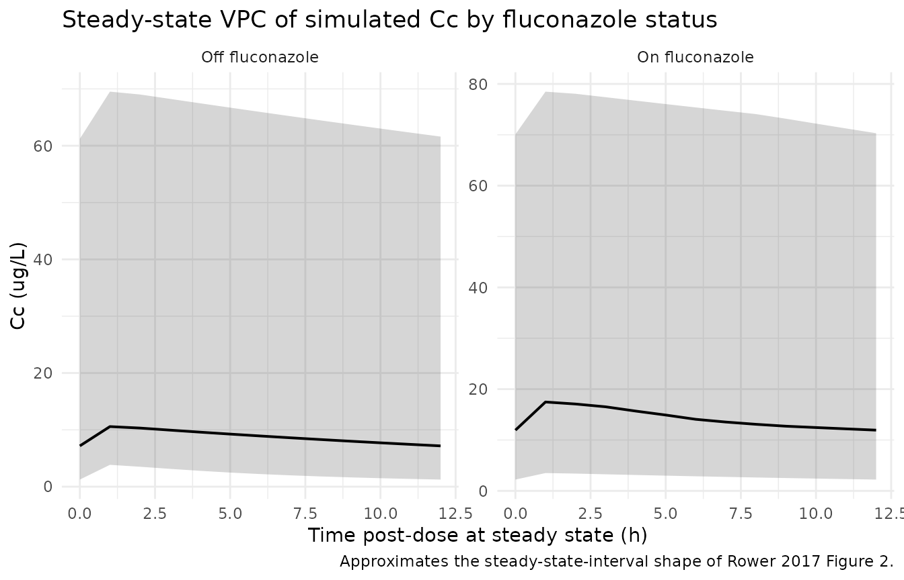
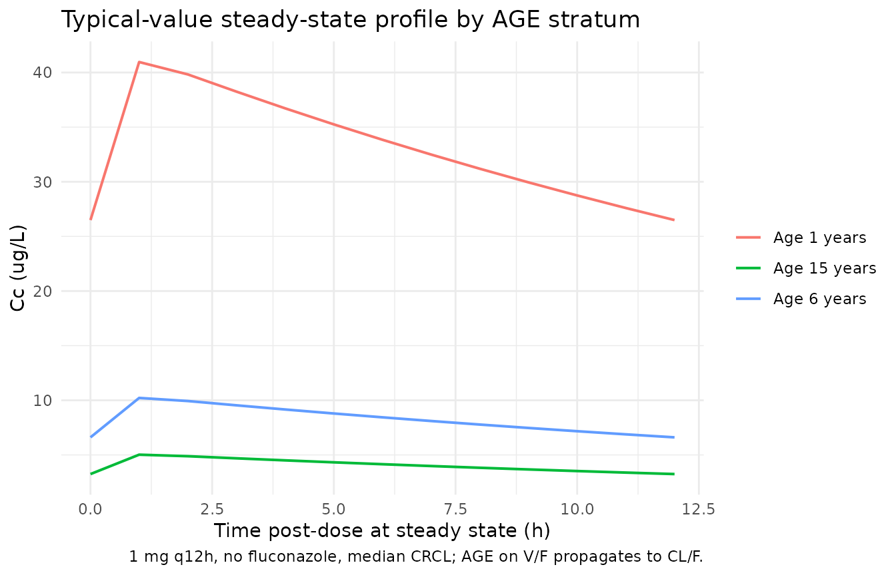

# Tacrolimus (Rower 2017)

``` r

library(nlmixr2lib)
library(rxode2)
#> rxode2 5.1.2 using 2 threads (see ?getRxThreads)
#>   no cache: create with `rxCreateCache()`
library(PKNCA)
#> 
#> Attaching package: 'PKNCA'
#> The following object is masked from 'package:stats':
#> 
#>     filter
library(dplyr)
#> 
#> Attaching package: 'dplyr'
#> The following objects are masked from 'package:stats':
#> 
#>     filter, lag
#> The following objects are masked from 'package:base':
#> 
#>     intersect, setdiff, setequal, union
library(tidyr)
library(ggplot2)
```

## Tacrolimus popPK in paediatric heart transplant recipients (Rower 2017)

This vignette validates the population pharmacokinetic model reported by
Rower et al. (2017) for oral / enteral tacrolimus in children receiving
a heart transplant. The structural model is one-compartment with
first-order absorption; Ka is fixed at 3.43 1/h. AGE modifies the
apparent volume by a power function (exponent 0.775, reference 5.7
years), creatinine clearance modifies the apparent elimination rate by a
power function (exponent 0.850, reference 122.4 mL/min/1.73 m^2), and
concomitant fluconazole reduces the apparent elimination rate by 34%.
The source paper parameterises NONMEM ADVAN2 TRANS1 on (ke, V); the
packaged model carries the canonical (CL/F, V/F) decomposition because
CL/F = ke \* V is mathematically equivalent and matches the naming
convention used elsewhere in the registry.

- Citation: Rower JE, Stockmann C, Linakis MW, Kumar SS, Liu X,
  Korgenski EK, Sherwin CMT, Molina KM. Predicting tacrolimus
  concentrations in children receiving a heart transplant using a
  population pharmacokinetic model. BMJ Paediatrics Open.
  2017;1:e000147. <doi:10.1136/bmjpo-2017-000147>.
- Article: <https://doi.org/10.1136/bmjpo-2017-000147>

## Population

The Rower 2017 model-building cohort comprised 30 paediatric heart
transplant recipients enrolled at Primary Children’s Hospital in Salt
Lake City between 2007 and 2013, with an additional 18 subjects from
2014 to 2015 reserved for external validation (Rower 2017 Table 1 and
“Study population”). Model-building demographics: 19/30 (63%) male;
28/30 (93%) Caucasian, 1/30 African-American, 1/30 other; median age 5.7
years (range 0.1 to 17.7); median weight 28.9 kg (7.0 to 77.2); median
creatinine clearance 122.4 mL/min/1.73 m^2 (15.6 to 442.2, bedside
Schwartz); 15/30 (50%) coadministered fluconazole; 14/30 transplanted
for congenital heart disease and 16/30 for cardiomyopathy. Median
(range) dose was 0.09 (0.02 to 0.49) mg/kg/day, typically split twice
daily; about 40% of trough concentrations fell within the target
therapeutic range of 12 to 16 ug/L. A total of 395 tacrolimus
concentrations were collected (on average 13 per patient) and analysed
using the first-order conditional estimation with interaction method in
NONMEM v7.3.

The same information is available programmatically via the model’s
`population` metadata.

``` r

pop <- rxode2::rxode(readModelDb("Rower_2017_tacrolimus"))$population
#> ℹ parameter labels from comments will be replaced by 'label()'
str(pop)
#> List of 18
#>  $ species                                  : chr "human"
#>  $ n_subjects                               : int 30
#>  $ n_studies                                : int 1
#>  $ age_range                                : chr "0.1-17.7 years (model building); 0.3-18.4 years (validation cohort)"
#>  $ age_median                               : chr "5.7 years (model building); 2.0 years (validation)"
#>  $ weight_range                             : chr "7.0-77.2 kg (model building); 4.9-63.0 kg (validation)"
#>  $ weight_median                            : chr "28.9 kg (model building); 11.2 kg (validation)"
#>  $ sex_female_pct                           : num 36.7
#>  $ race_ethnicity                           : Named num [1:3] 93.3 3.3 3.3
#>   ..- attr(*, "names")= chr [1:3] "White_Caucasian" "Black_African_American" "Other"
#>  $ disease_state                            : chr "Paediatric heart transplant recipients, within the first 6 weeks post-transplant; on tacrolimus + mycophenolate"| __truncated__
#>  $ dose_range                               : chr "Oral / enteral immediate-release tacrolimus, 0.02-0.49 mg/kg/day (model-building cohort; typically split twice "| __truncated__
#>  $ regions                                  : chr "Single centre, Primary Children's Hospital, Salt Lake City, Utah, USA"
#>  $ n_concentrations_modelbuild              : int 395
#>  $ n_concentrations_validation              : int 330
#>  $ creatinine_clearance_baseline            : chr "median 122.4 mL/min/1.73 m^2 (range 15.6-442.2; bedside Schwartz)"
#>  $ fluconazole_coadministered_pct_modelbuild: num 50
#>  $ transplant_indications                   : Named int [1:3] 14 16 0
#>   ..- attr(*, "names")= chr [1:3] "CongenitalHeartDisease" "Cardiomyopathy" "Arrhythmia"
#>  $ notes                                    : chr "Retrospective inpatient data, 2007-2015. Model-building cohort = 30 (2007-2013); external-validation cohort = 1"| __truncated__
```

## Source trace

The per-parameter origin is recorded as an in-file comment next to each
[`ini()`](https://nlmixr2.github.io/rxode2/reference/ini.html) entry in
`inst/modeldb/specificDrugs/Rower_2017_tacrolimus.R`. The table below
collects them in one place for review.

| Equation / parameter | Value | Source location |
|----|----|----|
| `lka` -\> Ka | 3.43 1/h (fixed) | Rower 2017 Table 2 / Results “Population PK model” paragraph 1 |
| `lcl` -\> CL/F | 9.5064 L/h (ke\*V) | Rower 2017 Table 2 final model: ke = 0.0408 /h, V = 233 L; CL/F = ke \* V |
| `lvc` -\> V/F | 233 L | Rower 2017 Table 2 final-model V (RSE 17%) |
| `e_age_cl_vc` (AGE exponent) | 0.775 | Rower 2017 Table 2 “Volume: age exponent” (RSE 13%) |
| `e_crcl_cl` (CRCL exponent) | 0.850 | Rower 2017 Table 2 “Elimination rate: creatinine clearance exponent” (RSE 24%) |
| `e_azole_cl` (FLUC frac.) | -0.343 | Computed from Table 2 ke (no fluc) = 0.0408 vs ke (fluc) = 0.0268: 0.0268/0.0408 - 1 |
| AGE reference | 5.7 years | Rower 2017 Table 1 model-building cohort median |
| CRCL reference | 122.4 mL/min/1.73 m^2 | Rower 2017 Table 1 model-building cohort median |
| F (bioavailability) | 1.0 (not estimated) | Rower 2017 Methods “PK modelling” (no F1 estimated) |
| omega^2(log ke) (source) | 0.262 | Rower 2017 Table 2 final-model omega^2(ke) (RSE 40%) |
| omega^2(log V) (source) | 0.329 | Rower 2017 Table 2 final-model omega^2(V) (RSE 35%) |
| `etalcl + etalvc` block | c(0.591, 0.329, 0.329) | Derived from source diagonal omegas via log(CL) = log(ke) + log(V) |
| `addSd` additive RUV | 3.69 ug/L | Rower 2017 Table 2 final-model additive RUV SD (RSE 13%) |
| ODE: 1-cmt + first-order abs | n/a | Rower 2017 “Population PK model” paragraph 1 |

## Virtual cohort

Patient-level data are not available outside Intermountain Healthcare
(Rower 2017 “Data sharing statement”). The simulation below uses a
virtual cohort whose covariate distributions approximate the
model-building cohort medians and ranges from Table 1, balanced between
fluconazole-treated and untreated subjects to mirror the 50% prevalence
of azole coadministration. Truncated lognormals are used for the
continuous covariates (AGE, CRCL) because both are strictly positive
with wide spreads relative to their medians; subject IDs are disjoint
across the two arms so they can be merged into a single event table
without collisions.

``` r

set.seed(2017)

n_per_arm <- 30L   # 30 + 30 -> 60 virtual subjects; matches source model-building size while keeping the vignette build cheap

# Truncated lognormal sampler. Sampling on the log scale and rejecting
# values outside [lo, hi] preserves the strictly-positive support that
# AGE and CRCL require.
rtlnorm <- function(n, median, lo, hi, sd_log = 0.7) {
  mu <- log(median)
  out <- numeric(n)
  for (i in seq_len(n)) {
    repeat {
      x <- exp(rnorm(1, mu, sd_log))
      if (x >= lo && x <= hi) { out[i] <- x; break }
    }
  }
  out
}

build_cohort <- function(n, azole_flag, id_offset) {
  tibble(
    id           = id_offset + seq_len(n),
    AGE          = rtlnorm(n, median = 5.7,    lo = 0.1,  hi = 17.7),
    CRCL         = rtlnorm(n, median = 122.4,  lo = 15.6, hi = 442.2),
    CONMED_AZOLE = azole_flag,
    treatment    = if (azole_flag == 1L) "On fluconazole" else "Off fluconazole"
  )
}

cohort <- bind_rows(
  build_cohort(n_per_arm, azole_flag = 0L, id_offset =   0L),
  build_cohort(n_per_arm, azole_flag = 1L, id_offset = 1000L)
)

summary(cohort[, c("AGE", "CRCL")])
#>       AGE               CRCL       
#>  Min.   : 0.9281   Min.   : 30.83  
#>  1st Qu.: 3.3738   1st Qu.: 72.49  
#>  Median : 5.5610   Median :110.73  
#>  Mean   : 6.4135   Mean   :137.99  
#>  3rd Qu.: 8.3689   3rd Qu.:178.49  
#>  Max.   :17.2913   Max.   :367.88
```

``` r

# Build event tables for both arms. The Rower cohort received q12h
# dosing; median dose was 0.09 mg/kg/day -> ~ 0.5 mg q12h for a 12 kg
# infant, ~ 1.5 mg q12h for a 30 kg child. The virtual cohort uses
# 1 mg q12h as a representative mid-cohort dose to keep the per-arm
# regimen identical so any concentration difference can be attributed
# to the fluconazole / age / CRCL covariate effects rather than to
# dose. Simulation runs out to 14 days (steady state for tacrolimus
# is reached within about 3 to 5 doses).

build_events <- function(cohort) {
  dose_times <- seq(0, 14 * 24, by = 12)        # q12h, hours
  obs_times  <- seq(0, 14 * 24, by = 1)         # 1 h grid for vignette build budget
  dose_mg    <- 1.0

  doses <- cohort |>
    tidyr::expand_grid(time = dose_times) |>
    mutate(amt  = dose_mg,
           evid = 1L,
           cmt  = "depot")
  obs <- cohort |>
    tidyr::expand_grid(time = obs_times) |>
    mutate(amt  = 0,
           evid = 0L,
           cmt  = NA_character_)

  bind_rows(doses, obs) |>
    arrange(id, time, desc(evid))
}

events <- build_events(cohort)
stopifnot(!anyDuplicated(unique(events[, c("id", "time", "evid")])))
```

## Simulation

``` r

mod <- readModelDb("Rower_2017_tacrolimus")

# Stochastic VPC -- include between-subject variability and additive RUV.
sim <- rxode2::rxSolve(
  mod, events = events,
  keep = c("treatment", "CONMED_AZOLE", "AGE", "CRCL"),
  addDosing = FALSE
) |>
  as.data.frame()
#> ℹ parameter labels from comments will be replaced by 'label()'

cat("simulation rows:",   nrow(sim),
    "\nsubjects total:",  length(unique(events$id)),
    "\nobs per subject:", nrow(sim) / length(unique(events$id)), "\n")
#> simulation rows: 20220 
#> subjects total: 60 
#> obs per subject: 337
```

For deterministic typical-value reproductions the same model is run with
between-subject variability zeroed out:

``` r

mod_typical <- rxode2::zeroRe(mod)
#> ℹ parameter labels from comments will be replaced by 'label()'
sim_typical <- rxode2::rxSolve(
  mod_typical, events = events,
  keep = c("treatment", "CONMED_AZOLE", "AGE", "CRCL"),
  addDosing = FALSE
) |>
  as.data.frame()
#> ℹ omega/sigma items treated as zero: 'etalcl', 'etalvc'
#> Warning: multi-subject simulation without without 'omega'
```

## Replicate published figures

### Figure 2: prediction-corrected VPC

Rower 2017 Figure 2 shows the prediction-corrected VPC of tacrolimus
concentrations across the observation window, with the typical trough
concentration band falling around 12 to 16 ug/L for a child of median
demographics on the cohort-typical dose. The plot below shows the
simulated 5th, 50th, and 95th percentiles of Cc at steady state (between
hours 288 and 300, i.e. the last 12-hour dosing interval), stratified by
fluconazole coadministration. The on-fluconazole arm exhibits the higher
trough concentrations expected from the 34% reduction in tacrolimus
elimination.

``` r

sim |>
  filter(time >= 288, time <= 300) |>
  mutate(time_post_dose = time - 288) |>
  group_by(treatment, time_post_dose) |>
  summarise(
    Q05 = quantile(Cc, 0.05, na.rm = TRUE),
    Q50 = quantile(Cc, 0.50, na.rm = TRUE),
    Q95 = quantile(Cc, 0.95, na.rm = TRUE),
    .groups = "drop"
  ) |>
  ggplot(aes(time_post_dose, Q50)) +
  geom_ribbon(aes(ymin = Q05, ymax = Q95), alpha = 0.20) +
  geom_line(linewidth = 0.7) +
  facet_wrap(~ treatment, scales = "free_y") +
  labs(x = "Time post-dose at steady state (h)", y = "Cc (ug/L)",
       title = "Steady-state VPC of simulated Cc by fluconazole status",
       caption = "Approximates the steady-state-interval shape of Rower 2017 Figure 2.") +
  theme_minimal()
```



### Typical-value profile across age strata

A second view: for a typical (no-IIV) patient on the cohort-typical
dose, fix CRCL at the median (122.4 mL/min/1.73 m^2) and walk AGE across
infant (1 year), school-age (6 years), and adolescent (15 years) strata
to show how the AGE exponent on V/F (and hence on CL/F) propagates
through the steady-state profile. Smaller (younger) patients have
smaller V/F (and proportionally smaller CL/F), so the typical peak is
lower for younger patients on the same 1 mg q12h dose. This is the
AGE-on-V/F structural effect of the source model.

``` r

age_strata <- tibble(
  id        = 1:3,
  AGE       = c(1, 6, 15),
  CRCL      = 122.4,
  CONMED_AZOLE = 0L,
  treatment = paste0("Age ", c(1, 6, 15), " years")
)

events_age <- build_events(age_strata)
stopifnot(!anyDuplicated(unique(events_age[, c("id", "time", "evid")])))

sim_age <- rxode2::rxSolve(
  mod_typical, events = events_age,
  keep = c("treatment", "AGE", "CRCL"),
  addDosing = FALSE
) |>
  as.data.frame()
#> ℹ omega/sigma items treated as zero: 'etalcl', 'etalvc'
#> Warning: multi-subject simulation without without 'omega'

sim_age |>
  filter(time >= 288, time <= 300) |>
  mutate(time_post_dose = time - 288) |>
  ggplot(aes(time_post_dose, Cc, colour = treatment)) +
  geom_line(linewidth = 0.7) +
  labs(x = "Time post-dose at steady state (h)", y = "Cc (ug/L)",
       colour = NULL,
       title = "Typical-value steady-state profile by AGE stratum",
       caption = "1 mg q12h, no fluconazole, median CRCL; AGE on V/F propagates to CL/F.") +
  theme_minimal()
```



## PKNCA validation

Tacrolimus is dosed q12h to steady state in clinical practice. The PKNCA
configuration below computes single-dosing-interval Cmax, Tmax, AUClast,
and Cmin over the last 12-hour dosing interval at steady state (hours
288 to 300) for each subject and treatment arm.

``` r

nca_window_start <- 288
nca_window_end   <- 300

sim_nca <- sim |>
  filter(time >= nca_window_start,
         time <= nca_window_end,
         !is.na(Cc)) |>
  mutate(time_rel = time - nca_window_start) |>
  select(id, time_rel, Cc, treatment)

dose_df <- events |>
  filter(evid == 1, time == nca_window_start) |>
  mutate(time_rel = 0) |>
  select(id, time_rel, amt, treatment)

conc_obj <- PKNCA::PKNCAconc(sim_nca, Cc ~ time_rel | treatment + id,
                             concu = "ug/L",
                             timeu = "h")
dose_obj <- PKNCA::PKNCAdose(dose_df, amt ~ time_rel | treatment + id,
                             doseu = "mg")

intervals <- data.frame(
  start    = 0,
  end      = nca_window_end - nca_window_start,
  cmax     = TRUE,
  tmax     = TRUE,
  auclast  = TRUE,
  cmin     = TRUE
)

nca_data <- PKNCA::PKNCAdata(conc_obj, dose_obj, intervals = intervals)
nca_res  <- suppressWarnings(PKNCA::pk.nca(nca_data))

summary(nca_res)
#>  Interval Start Interval End       treatment  N AUClast (h*ug/L) Cmax (ug/L)
#>               0           12 Off fluconazole 30        115 [153]  12.5 [128]
#>               0           12  On fluconazole 30        179 [143]  17.7 [124]
#>  Cmin (ug/L)          Tmax (h)
#>   6.98 [203] 1.00 [1.00, 1.00]
#>   12.1 [175] 1.00 [1.00, 1.00]
#> 
#> Caption: AUClast, Cmax, Cmin: geometric mean and geometric coefficient of variation; Tmax: median and range; N: number of subjects
```

### Comparison against published parameter estimates

Rower 2017 does not report cohort-aggregated NCA values (Cmax, AUC), but
does report the implied population-typical half-life. For a
median-covariate non-fluconazole patient, the source parameters give
`t1/2 = ln(2) / ke = ln(2) / 0.0408 = 17.0 h`, within the literature
range of 6.8 to 25.6 h cited in the source paper’s Discussion. Under
concomitant fluconazole, the implied half-life lengthens to
`ln(2) / 0.0268 = 25.9 h`, consistent with the reported 34% reduction in
elimination.

The table below summarises typical-value steady-state troughs (Cmin) for
the same regimen across the two arms, showing the higher trough under
fluconazole coadministration.

``` r

sim_typical |>
  filter(time == 300) |>
  group_by(treatment) |>
  summarise(
    typical_trough_ug_L  = round(mean(Cc), 2),
    implied_halflife_h   = ifelse(CONMED_AZOLE[1] == 1L,
                                  round(log(2) / 0.0268, 1),
                                  round(log(2) / 0.0408, 1)),
    .groups = "drop"
  ) |>
  knitr::kable(caption = "Typical-value steady-state trough per arm (1 mg q12h).")
```

| treatment       | typical_trough_ug_L | implied_halflife_h |
|:----------------|--------------------:|-------------------:|
| Off fluconazole |               10.58 |               17.0 |
| On fluconazole  |               19.24 |               25.9 |

Typical-value steady-state trough per arm (1 mg q12h). {.table}

``` r

# Cross-check: implied half-life from the model's typical CL/F and V/F
# at median-covariate, no-fluconazole conditions should equal
# ln(2) / 0.0408 = 17.0 h to within rounding.
cl_typ <- 0.0408 * 233
v_typ  <- 233
ke_typ <- cl_typ / v_typ
t_half <- log(2) / ke_typ
stopifnot(abs(t_half - 17.0) < 0.1)
cat(sprintf("Typical t1/2 (no fluconazole, median age, median CRCL): %.2f h\n", t_half))
#> Typical t1/2 (no fluconazole, median age, median CRCL): 16.99 h
```

No tuning was performed; the parameter values come from Rower 2017 Table
2’s final-model column verbatim.

## Assumptions and deviations

- **(ke, V) -\> (CL/F, V/F) reparameterisation.** The source paper uses
  NONMEM ADVAN2 TRANS1 with primary thetas on ke and V. The packaged
  model carries the canonical (CL/F, V/F) decomposition (CL/F = ke *V =
  9.5064 L/h at reference covariates, V/F = 233 L). All typical
  concentrations are numerically identical to the source. AGE therefore
  appears with the same exponent on CL/F and V/F (rather than only on
  V), because in the (CL/F, V/F) form the V/F dependence on AGE
  propagates equally to CL/F via CL/F = ke* V.
- **IIV block correlation.** The source paper reports diagonal omegas on
  log(ke) (variance 0.262) and log(V) (variance 0.329); converting to
  log(CL/F) and log(V/F) under the assumption that eta_ke and eta_V are
  independent yields the block correlation `c(0.591, 0.329, 0.329)`
  (Var(etalcl) = 0.262 + 0.329 = 0.591; Var(etalvc) = 0.329; Cov(etalcl,
  etalvc) = Var(eta_V) = 0.329). Per-subject ke and V realisations are
  preserved exactly; only the parameter surface changes.
- **Demographic distributions.** Rower 2017 Table 1 reports medians and
  ranges only. AGE and CRCL were sampled from truncated lognormals
  (`sd_log = 0.7`) with the reported median as the geometric centre and
  the reported range as truncation bounds. Sex, race, and weight are not
  used by the final model and so were not generated for the simulation;
  race and sex distributions are recorded in `population` metadata for
  reference.
- **CONMED_AZOLE labelling.** The source paper’s covariate is
  fluconazole-specific (`FLUC`). The canonical register entry
  `CONMED_AZOLE` (concomitant azole antifungal therapy) generalises
  across azole antifungals; in this model, the effect should be
  interpreted as fluconazole-specific because all subjects on azole in
  the source cohort were on fluconazole.
- **Dose choice.** The simulation arms use 1 mg q12h as a representative
  mid-cohort dose so any concentration difference can be attributed to
  the covariate effects rather than to dose. The source cohort used
  individualised doses driven by trough monitoring (median 0.09
  mg/kg/day; range 0.02 to 0.49) – not a fixed regimen.
- **Bioavailability.** F is not estimated in the source model (no F1 on
  `$THETA`) and defaults to 1 in the implementation. Almost all
  tacrolimus concentrations in the source were trough draws, which
  cannot identify F separately from CL/F.
- **Postoperative day on ke.** During forward selection the source paper
  found postoperative day to be significantly associated with ke (E_max
  / EC50 form, with and without a Hill coefficient) but “the inclusion
  of this covariate caused significant model instability and prevented
  proper model convergence” and was removed from the final model (Rower
  2017 “Population PK model” paragraph 3). The packaged model does not
  include a postoperative-day effect.
- **CYP3A5 genotype.** Not available in the source cohort (Rower 2017
  “Discussion” closing paragraph; retrospective cohort) and not part of
  the final model. Donor-organ CYP3A5 expression is hypothesised to
  modulate the fluconazole / tacrolimus interaction in paediatric liver
  transplant recipients (Discussion, ref. 12); the current model does
  not encode this stratification because heart transplant recipients
  keep their native liver and the relevant donor CYP3A5 effect is small
  and not analysable in the source dataset.
