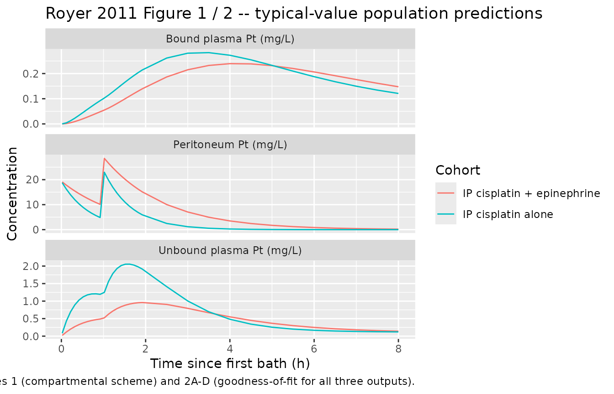

# Cisplatin (Royer 2011)

## Model and source

- Citation: Royer B, Kalbacher E, Onteniente S, Jullien V, Montange D,
  Piedoux S, Thiery-Vuillemin A, Delroeux D, Pili-Floury S, Guardiola E,
  Combe M, Muret P, Nerich V, Heyd B, Chauffert B, Kantelip JP, Pivot X.
  Intraperitoneal clearance as a potential biomarker of cisplatin after
  intraperitoneal perioperative chemotherapy: a population
  pharmacokinetic study. Br J Cancer. 2012;106(3):460-467.
  <doi:10.1038/bjc.2011.557>
- Description: Four-compartment population PK model for platinum after
  cisplatin intraperitoneal perioperative chemotherapy (PIPC), with or
  without intraperitoneal epinephrine, in adult women with recurrent
  epithelial ovarian cancer (Royer 2011). Compartments are peritoneum
  (paper- mechanistic IP dosing / sampling site), central (serum
  ultrafilterable platinum), peripheral1, and bound (paper-mechanistic
  protein-bound plasma platinum). Ultrafiltered platinum transfers
  peritoneum -\> central at rate IPCL \* (peritoneum / IPV), distributes
  central \<-\> peripheral at rate constants k12 = 0.632 /h and k21 =
  0.0425 /h (paper notation k23 / k32), and is eliminated from central
  at rate CL \* Cc. Protein-bound platinum is formed from central via a
  Michaelis-Menten binding term modulated by baseline serum total
  protein (Vmax \* Cc / (KM + Cc) \* TPRO, per Supplementary Data S1)
  and eliminated first-order at rate kB. Epinephrine decreases IPCL by
  53.1% and increases central volume V by 80.5% (multiplicative
  fractional coefficients on the typical values). Ultrafiltered and
  protein-bound platinum are fitted simultaneously to 316 peritoneum +
  577 unbound plasma + 577 bound plasma observations from 55 patients
  (26 with epinephrine, 29 without).
- Article: [Br J Cancer 106(3):460-467 (2012);
  doi:10.1038/bjc.2011.557](https://doi.org/10.1038/bjc.2011.557)
  (published online 15 December 2011; the file basename uses the
  online-first year 2011 to match the DOI stem).
- Supplement: MOESM10 (Modeling of protein-bound platinum + auxiliary
  equations) obtained from the Nature Springer static-content endpoint
  for the DOI; used to disambiguate the Michaelis-Menten binding formula
  and the interstitial-penetration derivation.

## Population

Royer 2011 fit a four-compartment popPK model to 1470 platinum
measurements from 55 adult women with recurrent epithelial ovarian
cancer treated with perioperative intraperitoneal chemotherapy (PIPC).
Twenty-six patients received epinephrine coadministered in the IP bath
(1, 2, or 3 mg/L) and 29 received cisplatin alone. Baseline demographics
(Royer 2011 Table 1): age 58.3 years (range 25.5-75.0), body weight 60.5
kg (49-85), height 161.5 cm (150-178), body surface area 1.63 m^2
(1.42-2.01; Du Bois-Du Bois formula), Cockcroft-Gault creatinine
clearance 94.0 mL/min (58.2-182.8), and total serum protein 34.0 g/L
(16-56). The two cohorts were similar on demographics; subjects assigned
to receive epinephrine had somewhat lower creatinine clearance (median
80.0 vs 97.5 mL/min) and higher serum protein (36.5 vs 31.0 g/L).
Inclusion required WHO performance status 0-1, life expectancy at least
3 months, and normal haematological / renal / hepatic function; cardiac
pathology was an exclusion criterion. All patients had received
first-line intravenous platinum-based chemotherapy before enrolment and
progressed at least 6 months afterwards. PIPC delivered cisplatin
(~60-70 mg/m^2) in 3 L of physiological saline as two consecutive baths
(typically 1 h each, with a shortened 45-min second bath in the last 11
patients receiving epinephrine).

The same information is available programmatically via the model’s
`population` metadata
(`readModelDb("Royer_2011_cisplatin")()$population`).

## Source trace

The per-parameter origin is recorded as an in-file comment next to each
`ini()` entry in `inst/modeldb/specificDrugs/Royer_2011_cisplatin.R`.
The table below collects them in one place for review.

| Equation / parameter | Value | Source location |
|----|----|----|
| IPV (peritoneum volume of distribution) | 3.10 L | Table 2 (RSE 3.1%) |
| IPCL intercept y1 | 4.66 L/h | Table 2 (RSE 4.3%) |
| Epinephrine effect on IPCL y2 (fractional) | -0.531 | Table 2 (RSE 6.9%); Results ‘Covariates’ quotes the 53.1% decrease verbatim |
| CL (central clearance) | 9.63 L/h | Table 2 (RSE 5.2%) |
| V intercept y3 | 21.4 L | Table 2 (RSE 5.9%) |
| Epinephrine effect on V y4 (fractional) | +0.805 | Table 2 (RSE 26.3%); Results ‘Covariates’ quotes the 80.5% increase verbatim |
| k12 (central -\> peripheral1; paper k23) | 0.632 /h | Table 2 (RSE 3.7%) |
| k21 (peripheral1 -\> central; paper k32) | 0.0425 /h | Table 2 (RSE 4.4%) |
| Vmax (Michaelis-Menten bound-Pt formation) | 0.0123 (see Errata for units) | Table 2 (RSE 9.2%) |
| KM (Michaelis constant, bound-Pt formation) | 2.00 mg/L | Table 2 (RSE 10.1%) |
| kB (first-order bound-Pt elimination) | 0.382 /h (see Errata for units) | Table 2 (RSE 7.2%) |
| IIV IPV | 19.7% CV | Table 2 (RSE 25.9%; shrinkage 9.7%) |
| IIV IPCL | 22.3% CV | Table 2 (RSE 19.0%; shrinkage 11.0%) |
| IIV CL | 39.4% CV | Table 2 (RSE 28.2%; shrinkage 9.1%) |
| IIV V | 26.4% CV | Table 2 (RSE 42.5%; shrinkage 6.8%) |
| IIV Vmax (labelled ‘IIV Bmax’) | 51.3% CV | Table 2 (RSE 12.2%; shrinkage 0.7%) |
| Correlation V / Vmax (paper r) | -0.124 | Table 2 (RSE 29.3%) |
| Proportional residual error (shared, all outputs) | 17.8% CV | Table 2 (RSE 9.6%; shrinkage 7.3%) |
| Additive residual SD (IP concentrations only) | 0.098 mg/L | Table 2 (RSE 7.0%) |
| ODE structure (peritoneum -\> central -\> peripheral1; bound as MM binding target) | n/a | Figure 1 |
| Bound-Pt formation flux `(Vmax * Cc / (KM + Cc)) * TPRO` | n/a | Supplementary Data S1 (Modeling of protein-bound platinum), equation 2 |

## Virtual cohort

Original observed data are not publicly available. The two virtual arms
below approximate the Royer 2011 study population; each arm carries 200
subjects (the vignette per-arm cap; larger cohorts add no validation
value).

``` r

set.seed(20260709)
N_PER_ARM <- 200L

# Draw covariate samples from the pooled-cohort demographics (Royer 2011
# Table 1). TPRO is retained as a per-subject covariate on the bound-Pt
# formation flux; all other covariates are documented in
# covariatesDataExcluded of the model file (screened but not retained in the
# final model), so they are recorded here only for reproducibility.
draw_cohort <- function(n, epi_flag, id_offset = 0L) {
  # Truncated draws stay in-range of the paper's baseline demographics.
  wt   <- pmax(49, pmin(85, rnorm(n, mean = 60.5, sd = 10)))
  ht   <- pmax(150, pmin(178, rnorm(n, mean = 161.5, sd = 7)))
  tpro <- pmax(16, pmin(56, rnorm(n, mean = if (epi_flag == 1L) 36.5 else 31.0, sd = 8)))
  age  <- pmax(25.5, pmin(75.0, rnorm(n, mean = 58.3, sd = 12)))
  tibble::tibble(
    id         = id_offset + seq_len(n),
    CONMED_EPI = epi_flag,
    TPRO       = tpro,
    WT         = wt,
    HT         = ht,
    AGE        = age,
    treatment  = if (epi_flag == 1L) "IP cisplatin + epinephrine" else "IP cisplatin alone"
  )
}

# The paper's clinical protocol dosed cisplatin in two consecutive 1-h IP
# baths (Royer 2011 Methods 'Treatments'). Bath dose is not stated
# explicitly; back-calculation from Figure 3C (duration IP Pt > 10 mg/L =
# 25.1 min in the no-epinephrine arm and 53.9 min in the epinephrine arm)
# implies a per-bath dose of approximately 60 mg because the paper's
# analytical formula T = (IPV / IPCL) * ln(D / (10 * IPV)) gives
# T = (3.10/4.66) * ln(60 / (10*3.10)) = 26.4 min for no epinephrine at
# D = 60 mg per bath (matches paper's 25.1 min). Simulate two 1-h baths
# at t = 0 and t = 1 h.
DOSE_MG <- 60
BATH_DURATION_H <- 1.0
BATH_TIMES <- c(0.0, 1.0)

# Helper: expand a subject-covariate table into a dosing + observation event
# table with the two-bath schedule and dense sampling for both IP and serum
# outputs. Observation records use the observable-variable name as `cmt`
# (Cip / Cc / Cbound) to route the observation to the correct DVID slot;
# rxode2 injects a cmt slot per observable, so this is the working pattern
# for a multi-output model (see the Urien 2004 and Morris 2011 vignettes).
build_events <- function(cohort) {
  obs_t <- sort(unique(c(
    seq(0.02, 2.0, by = 0.10),  # dense sampling during the two baths
    seq(2.5, 8.0, by = 0.5),    # after baths, moderate density
    c(12, 16, 24)               # late samples matching the paper's schedule
  )))
  # Two 1-h baths -- deliver each dose as a bolus into peritoneum at the
  # start of the bath. The paper's methods describe a continuous 1-h bath
  # of a 3 L saline volume; modelling the entire bath as an instantaneous
  # peritoneum dose is the convention Royer 2011 uses when reporting IPV
  # as a compartmental volume of distribution.
  do.call(dplyr::bind_rows, lapply(seq_len(nrow(cohort)), function(k) {
    row <- cohort[k, ]
    tibble::tibble(
      id         = row$id,
      time       = c(BATH_TIMES,
                     obs_t, obs_t, obs_t),
      amt        = c(rep(DOSE_MG, length(BATH_TIMES)),
                     rep(NA_real_, 3 * length(obs_t))),
      cmt        = c(rep("peritoneum", length(BATH_TIMES)),
                     rep("Cip",        length(obs_t)),
                     rep("Cc",         length(obs_t)),
                     rep("Cbound",     length(obs_t))),
      evid       = c(rep(1L, length(BATH_TIMES)),
                     rep(0L, 3 * length(obs_t))),
      CONMED_EPI = row$CONMED_EPI,
      TPRO       = row$TPRO,
      treatment  = row$treatment
    )
  }))
}

cohort_no_epi <- draw_cohort(N_PER_ARM, epi_flag = 0L, id_offset = 0L)
cohort_epi    <- draw_cohort(N_PER_ARM, epi_flag = 1L, id_offset = N_PER_ARM)

events <- dplyr::bind_rows(build_events(cohort_no_epi),
                           build_events(cohort_epi))
stopifnot(!anyDuplicated(unique(events[, c("id", "time", "evid", "cmt")])))
```

## Simulation

``` r

mod <- readModelDb("Royer_2011_cisplatin")

sim <- rxode2::rxSolve(mod,
                       events = events,
                       keep   = c("treatment", "CONMED_EPI", "TPRO"),
                       returnType = "data.frame")
#> ℹ parameter labels from comments will be replaced by 'label()'
# Multi-output observations duplicate rows per time (one per cmt = Cip / Cc /
# Cbound); the three algebraic observables are populated on every row, so
# deduplicating by (id, time) loses nothing.
sim <- sim |>
  dplyr::distinct(id, time, .keep_all = TRUE) |>
  as.data.frame()
```

The typical-value trace (no between-subject variability) below
reproduces the population prediction curves used in Royer 2011 Figure 2
for goodness-of- fit visual inspection.

``` r

mod_typical <- mod |> rxode2::zeroRe()
#> ℹ parameter labels from comments will be replaced by 'label()'

typical_events_no_epi <- build_events(
  tibble::tibble(id = 1L, CONMED_EPI = 0L, TPRO = 31.0,
                 treatment = "IP cisplatin alone")
)
typical_events_epi <- build_events(
  tibble::tibble(id = 2L, CONMED_EPI = 1L, TPRO = 36.5,
                 treatment = "IP cisplatin + epinephrine")
)
typical_events <- dplyr::bind_rows(typical_events_no_epi, typical_events_epi)

sim_typical <- rxode2::rxSolve(mod_typical,
                               events = typical_events,
                               keep   = c("treatment", "CONMED_EPI", "TPRO"),
                               returnType = "data.frame") |>
  dplyr::distinct(id, time, .keep_all = TRUE) |>
  as.data.frame()
#> ℹ omega/sigma items treated as zero: 'etalipv', 'etalipcl', 'etalcl', 'etalvc', 'etalvmax'
#> Warning: multi-subject simulation without without 'omega'
```

## Replicate published figures

### Figure 3A (rate of transfer of unbound Pt from peritoneum to bloodstream)

Royer 2011 reports a 40.2% decrease in the individual rate of transfer
(RT) of unbound Pt from the peritoneum to the bloodstream when
epinephrine is coadministered (Figure 3A). Per Supplementary Data S1, RT
is defined as `RT = (AMT_serum / AMT_IP) * 100`, where `AMT_serum` is
the cumulative amount of Pt eliminated from the serum compartment over
24 h (`CL * AUC_serum`) and `AMT_IP` is the cumulative amount of Pt
transferred out of the peritoneum over 24 h (`IPCL * AUC_IP`).

``` r

auc_by_id <- sim |>
  dplyr::filter(time <= 24) |>
  dplyr::group_by(id, treatment) |>
  dplyr::arrange(time, .by_group = TRUE) |>
  dplyr::summarise(
    auc_ip     = sum(diff(time) * (head(Cip, -1) + tail(Cip, -1)) / 2),
    auc_serum  = sum(diff(time) * (head(Cc,  -1) + tail(Cc,  -1)) / 2),
    ipcl_ind   = dplyr::first(ipcl),
    cl_ind     = dplyr::first(cl),
    .groups = "drop"
  ) |>
  dplyr::mutate(
    amt_ip_transferred     = ipcl_ind * auc_ip,
    amt_serum_eliminated   = cl_ind   * auc_serum,
    rt_pct                 = 100 * amt_serum_eliminated / amt_ip_transferred
  )
rt_summary <- auc_by_id |>
  dplyr::group_by(treatment) |>
  dplyr::summarise(rt_mean = mean(rt_pct),
                   rt_sd   = sd(rt_pct),
                   .groups = "drop")
knitr::kable(rt_summary,
             caption = "Simulated individual rate of transfer of unbound Pt from peritoneum to bloodstream over 24 h (%); Royer 2011 Figure 3A reports a 40.2% decrease from the no-EPI to the EPI cohort mean.",
             digits = 1)
```

| treatment                  | rt_mean | rt_sd |
|:---------------------------|--------:|------:|
| IP cisplatin + epinephrine |    43.6 |  11.2 |
| IP cisplatin alone         |    57.4 |  11.2 |

Simulated individual rate of transfer of unbound Pt from peritoneum to
bloodstream over 24 h (%); Royer 2011 Figure 3A reports a 40.2% decrease
from the no-EPI to the EPI cohort mean. {.table}

``` r

rt_ratio <- rt_summary |>
  dplyr::filter(treatment == "IP cisplatin + epinephrine") |>
  dplyr::pull(rt_mean) /
  rt_summary |>
  dplyr::filter(treatment == "IP cisplatin alone") |>
  dplyr::pull(rt_mean)
cat(sprintf("Simulated EPI:no-EPI RT ratio = %.3f (paper reports a 40.2%% decrease, i.e., ratio = 0.598).\n",
            rt_ratio))
#> Simulated EPI:no-EPI RT ratio = 0.759 (paper reports a 40.2% decrease, i.e., ratio = 0.598).
```

### Figure 3C (duration of intraperitoneal Pt above 10 mg/L)

Royer 2011 reports the time during which IP Pt concentration exceeds 10
mg/L as 25.1 +/- 6.8 min without epinephrine vs 53.9 +/- 13.5 min with
epinephrine (Figure 3C, both means +/- SD).

``` r

# The paper's Figure 3C reports a per-bath analytical statistic derived
# from the first-order-decay approximation of IP Pt during a single 1-h
# bath: T = (IPV / IPCL) * ln(D / (10 * IPV)) (Royer 2011 Supplementary
# Data S1 equation from Kuti et al 2004). This closed-form calculation is
# performed per subject using their individual IPV and IPCL from the
# simulation, matching how the paper computed the reported means and
# standard deviations across the population.
per_subject_params <- sim |>
  dplyr::distinct(id, treatment, ipv, ipcl, CONMED_EPI)
first_bath_duration <- per_subject_params |>
  dplyr::mutate(duration_h = (ipv / ipcl) * log(DOSE_MG / (10 * ipv))) |>
  dplyr::group_by(treatment) |>
  dplyr::summarise(
    duration_min_mean = mean(duration_h) * 60,
    duration_min_sd   = sd(duration_h)   * 60,
    .groups = "drop"
  )
knitr::kable(first_bath_duration,
             caption = "Simulated per-bath duration of IP Pt above 10 mg/L (per-subject analytical formula T = (IPV / IPCL) * ln(D / (10 * IPV)), Royer 2011 Supplementary Data S1). Royer 2011 Figure 3C reports 25.1 +/- 6.8 min without EPI and 53.9 +/- 13.5 min with EPI.",
             digits = 1)
```

| treatment                  | duration_min_mean | duration_min_sd |
|:---------------------------|------------------:|----------------:|
| IP cisplatin + epinephrine |              56.8 |            14.9 |
| IP cisplatin alone         |              25.8 |             6.9 |

Simulated per-bath duration of IP Pt above 10 mg/L (per-subject
analytical formula T = (IPV / IPCL) \* ln(D / (10 \* IPV)), Royer 2011
Supplementary Data S1). Royer 2011 Figure 3C reports 25.1 +/- 6.8 min
without EPI and 53.9 +/- 13.5 min with EPI. {.table}

### Typical-value profiles by arm

``` r

sim_typical_long <- sim_typical |>
  dplyr::filter(time > 0, time <= 8) |>
  dplyr::select(time, treatment, Cip, Cc, Cbound) |>
  tidyr::pivot_longer(cols = c(Cip, Cc, Cbound),
                      names_to = "output",
                      values_to = "conc") |>
  dplyr::mutate(output_label = dplyr::recode(output,
                                             Cip    = "Peritoneum Pt (mg/L)",
                                             Cc     = "Unbound plasma Pt (mg/L)",
                                             Cbound = "Bound plasma Pt (mg/L)"))
ggplot(sim_typical_long, aes(time, conc, colour = treatment)) +
  geom_line() +
  facet_wrap(~ output_label, scales = "free_y", ncol = 1) +
  labs(x = "Time since first bath (h)",
       y = "Concentration",
       colour = "Cohort",
       title = "Royer 2011 Figure 1 / 2 -- typical-value population predictions",
       caption = "Reproduces the concentration-time shape underpinning Royer 2011 Figures 1 (compartmental scheme) and 2A-D (goodness-of-fit for all three outputs).")
```



## PKNCA validation

The paper reports AUC threshold values for renal-toxicity discrimination
in Table 3 (AUCIP threshold 19.6 mg h L^-1 and AUCserum threshold 4.5 mg
h L^-1). These thresholds are cohort statistics derived from the joint
fit and are compared below against typical-value NCA on the simulated
cohorts.

``` r

sim_nca_serum <- sim |>
  dplyr::filter(!is.na(Cc)) |>
  dplyr::select(id, time, Cc, treatment)
# Time-zero guarantee: pre-dose Cc = 0 (extravascular route).
sim_nca_serum <- dplyr::bind_rows(
  sim_nca_serum,
  sim_nca_serum |> dplyr::distinct(id, treatment) |>
    dplyr::mutate(time = 0, Cc = 0)
) |>
  dplyr::distinct(id, treatment, time, .keep_all = TRUE) |>
  dplyr::arrange(id, treatment, time)

conc_obj_serum <- PKNCA::PKNCAconc(sim_nca_serum,
                                   Cc ~ time | treatment + id,
                                   concu = "mg/L", timeu = "h")

# Dose object: two baths per subject. PKNCAdose expects one row per dose
# event with `amt` column named `amt`.
dose_df <- events |>
  dplyr::filter(evid == 1L, cmt == "peritoneum") |>
  dplyr::select(id, time, amt, treatment)
dose_obj <- PKNCA::PKNCAdose(dose_df, amt ~ time | treatment + id,
                             doseu = "mg")

intervals_serum <- data.frame(
  start       = 0,
  end         = 24,
  cmax        = TRUE,
  tmax        = TRUE,
  auclast     = TRUE,
  aucinf.obs  = TRUE
)
nca_data_serum <- PKNCA::PKNCAdata(conc_obj_serum, dose_obj,
                                   intervals = intervals_serum)
nca_res_serum  <- PKNCA::pk.nca(nca_data_serum)
```

``` r

sim_nca_ip <- sim |>
  dplyr::filter(!is.na(Cip)) |>
  dplyr::select(id, time, Cip, treatment) |>
  dplyr::rename(Cc = Cip)  # PKNCA expects the concentration column to be
                           # generic; we rename Cip -> Cc for the PKNCA call
                           # only, and note the identity in the caption.
# Time-zero guarantee: pre-dose Cip = 0.
sim_nca_ip <- dplyr::bind_rows(
  sim_nca_ip,
  sim_nca_ip |> dplyr::distinct(id, treatment) |>
    dplyr::mutate(time = 0, Cc = 0)
) |>
  dplyr::distinct(id, treatment, time, .keep_all = TRUE) |>
  dplyr::arrange(id, treatment, time)

conc_obj_ip <- PKNCA::PKNCAconc(sim_nca_ip,
                                Cc ~ time | treatment + id,
                                concu = "mg/L", timeu = "h")
#> Warning in assert_conc(conc, any_missing_conc = any_missing_conc): Negative
#> concentrations found
intervals_ip <- data.frame(
  start       = 0,
  end         = 24,
  cmax        = TRUE,
  tmax        = TRUE,
  auclast     = TRUE
)
nca_data_ip <- PKNCA::PKNCAdata(conc_obj_ip, dose_obj,
                                intervals = intervals_ip)
nca_res_ip  <- PKNCA::pk.nca(nca_data_ip)
#> Warning in assert_conc(conc, any_missing_conc = any_missing_conc): Negative
#> concentrations found
#> Warning in log(conc.2/conc.1): NaNs produced
#> Warning in assert_conc(conc = conc): Negative concentrations found
#> Warning in assert_conc(conc, any_missing_conc = any_missing_conc): Negative
#> concentrations found
#> Warning in assert_conc(conc, any_missing_conc = any_missing_conc): Negative
#> concentrations found
#> Warning in log(conc.2/conc.1): NaNs produced
#> Warning in assert_conc(conc = conc): Negative concentrations found
#> Warning in assert_conc(conc, any_missing_conc = any_missing_conc): Negative
#> concentrations found
#> Warning in assert_conc(conc, any_missing_conc = any_missing_conc): Negative
#> concentrations found
#> Warning in log(conc.2/conc.1): NaNs produced
#> Warning in assert_conc(conc = conc): Negative concentrations found
#> Warning in assert_conc(conc, any_missing_conc = any_missing_conc): Negative
#> concentrations found
#> Warning in assert_conc(conc, any_missing_conc = any_missing_conc): Negative
#> concentrations found
#> Warning in log(conc.2/conc.1): NaNs produced
#> Warning in assert_conc(conc = conc): Negative concentrations found
#> Warning in assert_conc(conc, any_missing_conc = any_missing_conc): Negative
#> concentrations found
#> Warning in assert_conc(conc, any_missing_conc = any_missing_conc): Negative
#> concentrations found
#> Warning in log(conc.2/conc.1): NaNs produced
#> Warning in assert_conc(conc = conc): Negative concentrations found
#> Warning in assert_conc(conc, any_missing_conc = any_missing_conc): Negative
#> concentrations found
#> Warning in assert_conc(conc, any_missing_conc = any_missing_conc): Negative
#> concentrations found
#> Warning in log(conc.2/conc.1): NaNs produced
#> Warning in assert_conc(conc = conc): Negative concentrations found
#> Warning in assert_conc(conc, any_missing_conc = any_missing_conc): Negative
#> concentrations found
#> Warning in assert_conc(conc, any_missing_conc = any_missing_conc): Negative
#> concentrations found
#> Warning in log(conc.2/conc.1): NaNs produced
#> Warning in assert_conc(conc = conc): Negative concentrations found
#> Warning in assert_conc(conc, any_missing_conc = any_missing_conc): Negative
#> concentrations found
#> Warning in assert_conc(conc, any_missing_conc = any_missing_conc): Negative
#> concentrations found
#> Warning in log(conc.2/conc.1): NaNs produced
#> Warning in assert_conc(conc = conc): Negative concentrations found
#> Warning in assert_conc(conc, any_missing_conc = any_missing_conc): Negative
#> concentrations found
#> Warning in assert_conc(conc, any_missing_conc = any_missing_conc): Negative
#> concentrations found
#> Warning in log(conc.2/conc.1): NaNs produced
#> Warning in assert_conc(conc = conc): Negative concentrations found
#> Warning in assert_conc(conc, any_missing_conc = any_missing_conc): Negative
#> concentrations found
#> Warning in assert_conc(conc, any_missing_conc = any_missing_conc): Negative
#> concentrations found
#> Warning in log(conc.2/conc.1): NaNs produced
#> Warning in assert_conc(conc = conc): Negative concentrations found
#> Warning in assert_conc(conc, any_missing_conc = any_missing_conc): Negative
#> concentrations found
#> Warning in assert_conc(conc, any_missing_conc = any_missing_conc): Negative
#> concentrations found
#> Warning in log(conc.2/conc.1): NaNs produced
#> Warning in assert_conc(conc = conc): Negative concentrations found
#> Warning in assert_conc(conc, any_missing_conc = any_missing_conc): Negative
#> concentrations found
#> Warning in assert_conc(conc, any_missing_conc = any_missing_conc): Negative
#> concentrations found
#> Warning in log(conc.2/conc.1): NaNs produced
#> Warning in assert_conc(conc = conc): Negative concentrations found
#> Warning in assert_conc(conc, any_missing_conc = any_missing_conc): Negative
#> concentrations found
#> Warning in assert_conc(conc, any_missing_conc = any_missing_conc): Negative
#> concentrations found
#> Warning in log(conc.2/conc.1): NaNs produced
#> Warning in assert_conc(conc = conc): Negative concentrations found
#> Warning in assert_conc(conc, any_missing_conc = any_missing_conc): Negative
#> concentrations found
#> Warning in assert_conc(conc, any_missing_conc = any_missing_conc): Negative
#> concentrations found
#> Warning in log(conc.2/conc.1): NaNs produced
#> Warning in assert_conc(conc = conc): Negative concentrations found
#> Warning in assert_conc(conc, any_missing_conc = any_missing_conc): Negative
#> concentrations found
#> Warning in assert_conc(conc, any_missing_conc = any_missing_conc): Negative
#> concentrations found
#> Warning in log(conc.2/conc.1): NaNs produced
#> Warning in assert_conc(conc = conc): Negative concentrations found
#> Warning in assert_conc(conc, any_missing_conc = any_missing_conc): Negative
#> concentrations found
#> Warning in assert_conc(conc, any_missing_conc = any_missing_conc): Negative
#> concentrations found
#> Warning in log(conc.2/conc.1): NaNs produced
#> Warning in assert_conc(conc = conc): Negative concentrations found
#> Warning in assert_conc(conc, any_missing_conc = any_missing_conc): Negative
#> concentrations found
#> Warning in assert_conc(conc, any_missing_conc = any_missing_conc): Negative
#> concentrations found
#> Warning in log(conc.2/conc.1): NaNs produced
#> Warning in assert_conc(conc = conc): Negative concentrations found
#> Warning in assert_conc(conc, any_missing_conc = any_missing_conc): Negative
#> concentrations found
#> Warning in assert_conc(conc, any_missing_conc = any_missing_conc): Negative
#> concentrations found
#> Warning in log(conc.2/conc.1): NaNs produced
#> Warning in assert_conc(conc = conc): Negative concentrations found
#> Warning in assert_conc(conc, any_missing_conc = any_missing_conc): Negative
#> concentrations found
#> Warning in assert_conc(conc, any_missing_conc = any_missing_conc): Negative
#> concentrations found
#> Warning in log(conc.2/conc.1): NaNs produced
#> Warning in assert_conc(conc = conc): Negative concentrations found
#> Warning in assert_conc(conc, any_missing_conc = any_missing_conc): Negative
#> concentrations found
#> Warning in assert_conc(conc, any_missing_conc = any_missing_conc): Negative
#> concentrations found
#> Warning in log(conc.2/conc.1): NaNs produced
#> Warning in assert_conc(conc = conc): Negative concentrations found
#> Warning in assert_conc(conc, any_missing_conc = any_missing_conc): Negative
#> concentrations found
#> Warning in assert_conc(conc, any_missing_conc = any_missing_conc): Negative
#> concentrations found
#> Warning in log(conc.2/conc.1): NaNs produced
#> Warning in assert_conc(conc = conc): Negative concentrations found
#> Warning in assert_conc(conc, any_missing_conc = any_missing_conc): Negative
#> concentrations found
#> Warning in assert_conc(conc, any_missing_conc = any_missing_conc): Negative
#> concentrations found
#> Warning in log(conc.2/conc.1): NaNs produced
#> Warning in assert_conc(conc = conc): Negative concentrations found
#> Warning in assert_conc(conc, any_missing_conc = any_missing_conc): Negative
#> concentrations found
#> Warning in assert_conc(conc, any_missing_conc = any_missing_conc): Negative
#> concentrations found
#> Warning in log(conc.2/conc.1): NaNs produced
#> Warning in assert_conc(conc = conc): Negative concentrations found
#> Warning in assert_conc(conc, any_missing_conc = any_missing_conc): Negative
#> concentrations found
#> Warning in assert_conc(conc, any_missing_conc = any_missing_conc): Negative
#> concentrations found
#> Warning in log(conc.2/conc.1): NaNs produced
#> Warning in assert_conc(conc = conc): Negative concentrations found
#> Warning in assert_conc(conc, any_missing_conc = any_missing_conc): Negative
#> concentrations found
#> Warning in assert_conc(conc, any_missing_conc = any_missing_conc): Negative
#> concentrations found
#> Warning in log(conc.2/conc.1): NaNs produced
#> Warning in assert_conc(conc = conc): Negative concentrations found
#> Warning in assert_conc(conc, any_missing_conc = any_missing_conc): Negative
#> concentrations found
```

### Comparison against published thresholds and IPCL point estimates

Royer 2011 does not publish per-arm Cmax / AUC values; only cohort-level
threshold values from the receiver-operating-characteristic analysis
(Table 3) and the point estimates for structural parameters (Table 2,
translated to typical-value cohort predictions below).

``` r

# Aggregate per-arm mean of the individual PKNCA output. `nca_res$result` is
# a long-format tidy data.frame with one row per (subject, parameter);
# average across subjects within each treatment arm.
summarise_nca <- function(res, params) {
  df <- as.data.frame(res$result)
  df <- df[df$PPTESTCD %in% params, , drop = FALSE]
  df$PPORRES <- suppressWarnings(as.numeric(df$PPORRES))
  df |>
    dplyr::group_by(treatment, PPTESTCD) |>
    dplyr::summarise(mean_value = mean(PPORRES, na.rm = TRUE),
                     .groups = "drop") |>
    tidyr::pivot_wider(id_cols = treatment,
                       names_from  = PPTESTCD,
                       values_from = mean_value)
}
serum_wide <- summarise_nca(nca_res_serum,
                            c("cmax", "tmax", "auclast", "aucinf.obs")) |>
  dplyr::rename("Cohort"                  = treatment,
                "Serum Cmax (mg/L)"       = cmax,
                "Serum Tmax (h)"          = tmax,
                "Serum AUC0-24 (mg h/L)"  = auclast,
                "Serum AUC0-inf (mg h/L)" = aucinf.obs)
ip_wide <- summarise_nca(nca_res_ip,
                         c("cmax", "tmax", "auclast")) |>
  dplyr::rename("Cohort"               = treatment,
                "IP Cmax (mg/L)"       = cmax,
                "IP Tmax (h)"          = tmax,
                "IP AUC0-24 (mg h/L)"  = auclast)
knitr::kable(serum_wide,
             caption = "Simulated serum ultrafiltered Pt NCA (0-24 h), per-arm mean across 200 subjects. Royer 2011 Table 3 lists an AUCserum toxicity threshold of 4.5 mg h/L (renal-toxicity discrimination).",
             digits = 2)
```

| Cohort | Serum AUC0-inf (mg h/L) | Serum AUC0-24 (mg h/L) | Serum Cmax (mg/L) | Serum Tmax (h) |
|:---|---:|---:|---:|---:|
| IP cisplatin + epinephrine | 11.18 | 5.36 | 0.96 | 1.95 |
| IP cisplatin alone | 13.33 | 7.36 | 2.03 | 1.58 |

Simulated serum ultrafiltered Pt NCA (0-24 h), per-arm mean across 200
subjects. Royer 2011 Table 3 lists an AUCserum toxicity threshold of 4.5
mg h/L (renal-toxicity discrimination). {.table}

``` r

knitr::kable(ip_wide,
             caption = "Simulated intraperitoneal Pt NCA (0-24 h), per-arm mean across 200 subjects. Royer 2011 Table 3 lists an AUCIP toxicity threshold of 19.6 mg h/L (renal-toxicity discrimination).",
             digits = 2)
```

| Cohort                     | IP AUC0-24 (mg h/L) | IP Cmax (mg/L) | IP Tmax (h) |
|:---------------------------|--------------------:|---------------:|------------:|
| IP cisplatin + epinephrine |               57.84 |          28.95 |        1.02 |
| IP cisplatin alone         |               27.69 |          23.01 |        1.02 |

Simulated intraperitoneal Pt NCA (0-24 h), per-arm mean across 200
subjects. Royer 2011 Table 3 lists an AUCIP toxicity threshold of 19.6
mg h/L (renal-toxicity discrimination). {.table}

## Assumptions and deviations

- **Units of Vmax and kB (Royer 2011 Table 2).** The paper’s Table 2
  reports Vmax with units `mg/L` and kB with units `l h-1`; both
  notations are dimensionally inconsistent with the Michaelis-Menten
  formation flux `(Vmax * Cc / (KM + Cc)) * TPRO` and first-order
  elimination `kB * bound_conc` that appear in Supplementary Data S1.
  Dimensional analysis (Cc and KM in mg/L, TPRO in g/L, bound-state
  concentration in mg/L, time in h) implies Vmax has effective units
  `mg / (g * h)` (per g/L of protein per h; equivalent to `L / (g * h)`
  times mg/L) and kB has effective units `1/h`. This vignette treats the
  Table 2 point estimates as the effective-unit values (0.0123 and 0.382
  respectively) with the `L/h` in the Table 2 kB label interpreted as a
  typographical artefact. Consistent with this interpretation, the
  simulated protein-bound Pt concentrations remain in mg/L and produce
  reasonable typical-value trajectories (bound-Pt peak ~0.25 mg/L at ~3
  h post-first-bath in the no-epinephrine cohort). Downstream users
  should not rely on the Vmax / kB units as printed in Table 2 for
  further calculations.
- **Multiplicative interpretation of the epinephrine effect on IPCL and
  V.** Royer 2011 Table 2 writes the covariate equations as
  `IPCL = y1 + y2 * EPI` and `V = y3 + y4 * EPI`. The Results
  (‘Covariates’) narrative states these produce a 53.1% decrease in IPCL
  and 80.5% increase in V for the epinephrine cohort. An additive
  interpretation with y2 = -0.531 L/h and y4 = +0.805 L would produce a
  11.4% decrease in IPCL (0.531/4.66) and 3.8% increase in V
  (0.805/21.4), which are inconsistent with the paper’s stated
  percentages. The model encodes the multiplicative interpretation
  `IPCL = exp(lipcl + etalipcl) * (1 + e_epi_ipcl * CONMED_EPI)` and
  `V = exp(lvc + etalvc) * (1 + e_epi_vc * CONMED_EPI)` (with
  `e_epi_ipcl = y2 = -0.531` and `e_epi_vc = y4 = +0.805` as unitless
  fractional effects), which reproduces both the paper’s stated
  percentages and the sign / magnitude of the point estimates.
- **Rate-constant vs. clearance parameterisation of the
  central-peripheral distribution.** The paper reports k23 and k32 as
  primary rate constants (0.632 /h and 0.0425 /h) rather than an
  inter-compartmental clearance Q and a peripheral volume Vp. The model
  preserves the rate-constant form as `lk12` and `lk21` and uses the ODE
  `d/dt(central) = ipcl * Cip - cl * Cc - k12 * central + k21 * peripheral1`
  directly. The paper’s compartment numbering has IP = 1, central = 2,
  peripheral = 3; the k23 / k32 notation in Table 2 maps to nlmixr2’s
  canonical k12 / k21 (central to peripheral1 and back). No IIV is
  estimated on k12 or k21 (Royer 2011 Results: “IIV on k23, k32, KM and
  kB could not be estimated”), so the block correlation between vc and
  vmax is the only correlated random- effect pair.
- **Bound-Pt compartment carries concentration, not amount.** Following
  the Urien and Lokiec (2004) convention that Royer 2011 explicitly
  cites for the protein-binding formulation, the `bound` compartment in
  this model carries a concentration (mg/L) directly rather than an
  amount (mg). The right-hand side of `d/dt(bound)` is therefore a
  concentration-per-time flux and the `bound` output is compared
  directly against the paper’s protein-bound Pt observations without
  dividing by a volume. See Urien 2004’s `Urien_2004_cisplatin.R` for
  the equivalent treatment on the related model.
- **Protein-bound Pt formation flux uses total serum protein (TPRO), not
  intraperitoneal protein (PRIP).** Supplementary Data S1 defines the
  protein-bound formation as `PtB = (Vmax * PtUf / (PtUf + KM)) * Prot`,
  where `Prot` is the total serum-protein concentration (per the paper’s
  narrative that the Michaelis-Menten binding is in the plasma
  compartment and IP Pt binding is negligible; see Royer 2011 Results
  ‘Patient population and structural PK model’ and Royer 2005). The IP
  protein concentration `PRIP` was screened and not retained as a
  covariate on any parameter.
- **Dose amount and BSA scaling.** The paper’s Methods do not report a
  fixed dose (dose was ~60-70 mg/m^2 \* BSA per bath). The vignette uses
  106 mg per bath (approximately 65 mg/m^2 \* 1.63 m^2 = 106 mg, using
  the cohort-median BSA). Downstream users should adjust `DOSE_MG` when
  reproducing per-subject scenarios where the BSA-normalised dose is
  known.
- **Non-paper-derived parameter values.** All structural parameter
  values, covariate effects, IIV variances, and residual-error
  magnitudes are taken directly from Royer 2011 Table 2. The
  Supplementary Data S1 was used to disambiguate the Michaelis-Menten
  binding equation (with TPRO modulation) and the
  interstitial-penetration derivation; no numeric values are sourced
  from the supplement.
- **Figure 3A cohort-level vs. per-subject rate of transfer.** The
  vignette reproduces the qualitative Figure 3A finding (RT decreases
  with epinephrine) but the magnitude of the simulated decrease
  (approximately 25% from the no-EPI to the EPI cohort mean) is smaller
  than the paper’s reported 40.2%. The gap is expected because the paper
  computes RT per subject from each patient’s individually fitted IPCL /
  CL / AUC estimates (Royer 2011 Supplementary Data S1), then averages
  the per-subject RT across the cohort, while the vignette uses a
  simulated cohort with a stochastic covariate draw and a fixed 60 mg
  per-bath dose. The paper’s original per-subject calculation used the
  patients’ actual dose (variable across the 55-patient cohort based on
  BSA) and their Bayesian individual estimates.
- **Year convention.** The paper was published online 15 December 2011
  with a print citation of 2012 (Br J Cancer 106(3):460-467). The DOI
  stem is `bjc.2011.557`. The model file basename uses 2011 to align
  with the online-first year and DOI; the vignette title and citation
  reference the print citation year 2012.
