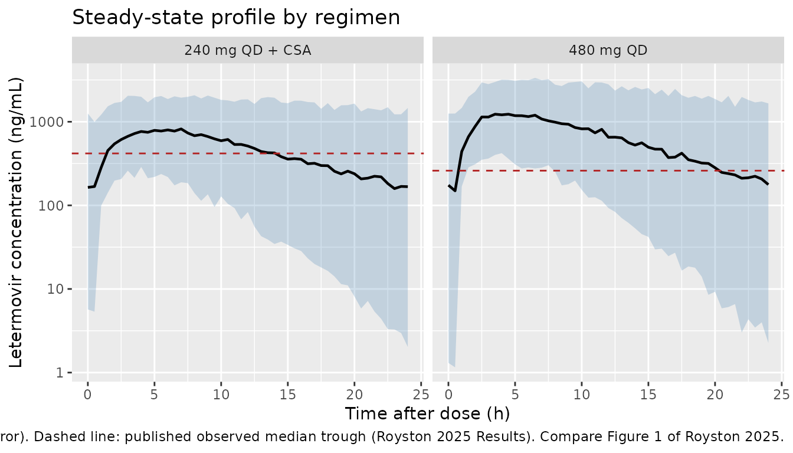

# Letermovir (Royston 2025)

## Model and source

- Citation: Royston L, Kunz C, Tonoli D, Lescuyer P, Neofytos D, Gotta V
  (2025). Population pharmacokinetic analysis of letermovir in adult
  hematopoietic cell transplant recipients. Antimicrob Agents Chemother
  69(10):e00697-25. <doi:10.1128/aac.00697-25>. Ka, Tlag and the IIV on
  Ka and V/F were fixed from the phase III model of Prohn et al. (2021)
  CPT Pharmacometrics Syst Pharmacol 10:255-267,
  <doi:10.1002/psp4.12593>, as reproduced in Royston 2025 Table 1.
- Description: One-compartment population PK model with first-order
  absorption and absorption lag time for oral letermovir in adult
  allogeneic hematopoietic cell transplant recipients, with a
  cyclosporine effect on apparent oral clearance and inter-occasion
  variability on CL/F
- Article: <https://doi.org/10.1128/aac.00697-25>
- Upstream phase III model (source of the fixed Ka, Tlag and their IIV):
  Prohn et al. (2021) <https://doi.org/10.1002/psp4.12593>

Royston 2025 is a short-form post hoc pharmacometric analysis of a
prospective therapeutic drug monitoring study in allogeneic
hematopoietic cell transplant (HCT) recipients receiving oral letermovir
as primary cytomegalovirus prophylaxis. The paper makes two claims: (1)
the industry-sponsored phase III model of Prohn 2021 substantially
over-predicts real-world letermovir concentrations, and (2) a simplified
one-compartment model refitted to the real-world data describes them
much better (AIC 4,830 -\> 3,739).

This vignette packages and validates the **adjusted real-world model** –
the model the authors themselves fitted, reported in the right-hand
column of Table 1. The phase III comparator model is *not* packaged
here; see [Assumptions and deviations](#assumptions-and-deviations) for
why.

## Population

``` r

pop <- rxode2::rxode(readModelDb("Royston_2025_letermovir"))$population
#> ℹ parameter labels from comments will be replaced by 'label()'
#> Warning: some etas defaulted to non-mu referenced, possible parsing error: etaiov_cl_1, etaiov_cl_2, etaiov_cl_3, etaiov_cl_4, etaiov_cl_5, etaiov_cl_6, etaiov_cl_7, etaiov_cl_8
#> as a work-around try putting the mu-referenced expression on a simple line
str(pop)
#> List of 7
#>  $ species      : chr "human"
#>  $ n_subjects   : num 40
#>  $ n_studies    : num 1
#>  $ disease_state: chr "adult CMV-seropositive allogeneic hematopoietic cell transplant recipients receiving primary CMV prophylaxis"
#>  $ dose_range   : chr "480 mg orally once daily, or 240 mg orally once daily when coadministered with cyclosporine"
#>  $ regions      : chr "Switzerland (University Hospitals of Geneva)"
#>  $ notes        : chr "Post hoc pharmacometric analysis of a prospective observational therapeutic drug monitoring study conducted bet"| __truncated__
```

Forty adult CMV-seropositive allogeneic HCT recipients received primary
CMV prophylaxis with oral letermovir between 1 March 2020 and 20 April
2021 at the University Hospitals of Geneva, dosed once daily at 480 mg,
or at 240 mg when coadministered with cyclosporine (6 of the 40
patients). The analysis pooled 296 plasma concentrations: 217 trough
samples drawn 24 +/- 2 h post-dose and 79 non-trough samples.

This short-form publication does not tabulate baseline demographics;
age, weight and sex distributions are reported in the parent study
(Royston 2022, <https://doi.org/10.1128/aac.00657-22>). Because the
final model in Table 1 carries no demographic covariates, the absence of
those distributions does not affect the simulations below.

## Source trace

Every `ini()` entry in
`inst/modeldb/specificDrugs/Royston_2025_letermovir.R` carries an
in-file comment naming its origin. They are collected here for review.
All values come from the **“Adjusted model estimate from
one-compartmental model fitted to real-world data”** column of Royston
2025 Table 1 unless noted.

| Equation / parameter | Value | Source location |
|----|----|----|
| `lka` (fixed) | `log(0.15)` 1/h | Table 1, Ka row: “0.15 (fixed)” – fixed from the Prohn 2021 phase III model |
| `ltlag` (fixed) | `log(0.674)` h | Table 1, Tlag row: “0.674 (fixed)” – fixed from Prohn 2021 |
| `lcl` | `log(26.5)` L/h | Table 1, CL/F row: 26.5 (RSE 12.6%) |
| `lvc` | `log(115.2)` L | Table 1, V/F row: 115.2 (RSE 12%) |
| `e_csa_cl` | `-0.38` | Table 1, fCSA row: -0.38 (RSE 69.5%) |
| `etalka` (fixed) | `0.72^2` | Table 1, Ka row `[0.72 (fixed)]`; footnote a: SD of log-transformed parameter |
| `etalvc` (fixed) | `0.23^2` | Table 1, V/F row `[0.23 (fixed)]`; footnote a |
| `etalcl` | `0.58^2` | Table 1, CL/F row `[IIV 0.58 (RSE 17%)]`; footnote a |
| `etaiov_cl_1..8` | `0.62^2` | Table 1, CL/F row `[IOV 0.62 (RSE 7%)]`; footnote a |
| `propSd` | `0.29` | Table 1, “Residual error (%/ug/L)” row: “29%/-” (proportional only, no additive term) |
| `d/dt(depot)`, `d/dt(central)`, `alag(depot)` | n/a | Results: “simplified one-compartment with fixed absorption rate and lag time”; Discussion: “Simplifications to an oral one-compartment model appear justified given the lack of bi-phasic decline during 24-h dosing intervals (Fig. 1)” |
| `cl <- ... * exp(e_csa_cl * CONMED_CSA)` | n/a | Results: CL/F “reduced by 32% with cyclosporin”; see the falsifier note below |

### Why the cyclosporine effect is exponential, not linear

Table 1 reports `fCSA = -0.38`, but the Results text states that CL/F is
*“reduced by 32% with cyclosporin”*. Those two numbers pin the
functional form exactly:

``` r

c(exponential = 1 - exp(-0.38), linear = 0.38)
#> exponential      linear 
#>   0.3161386   0.3800000
```

`1 - exp(-0.38)` is 31.6%, which rounds to the quoted 32%; a linear
`1 - 0.38` form would have been quoted as 38%. The
multiplicative-on-log-scale form is therefore the one the authors
fitted, and it is also Monolix’s standard parameterization for a
categorical covariate on a log-normally distributed parameter. (The
Discussion separately restates the raw coefficient as “-38%”, which is
the coefficient value, not the back-transformed effect.)

## Virtual cohort

Original observed data are not publicly available. Two arms of 200
virtual subjects each reproduce the study’s two regimens. The final
model carries no demographic covariates, so the only subject-level
inputs are the cyclosporine indicator and the occasion index.

Each subject receives 8 consecutive once-daily doses, one per occasion
(`OCC = 1..8`), matching the paper’s treatment of each patient visit as
a separate occasion. A trough sample is drawn at the end of every dosing
interval, and the final interval is additionally sampled densely for
NCA.

Note that the sample at `time = 168 h` serves twice over: it is occasion
7’s end-of-interval trough *and*, because the 0.674 h absorption lag
leaves the concentration continuous across a dose, it is also occasion
8’s time-zero concentration. Everything downstream is therefore keyed
off `time` rather than off a recomputed occasion index, which would have
to classify that row as one or the other.

``` r

set.seed(20250822)

n_per_arm <- 200L
n_occ <- 8L
tau <- 24
t_last <- tau * (n_occ - 1L)  # dose time opening the final interval

make_arm <- function(n, dose, csa, label, id_offset = 0L) {
  ids <- id_offset + seq_len(n)

  doses <- tidyr::expand_grid(id = ids, time = tau * (seq_len(n_occ) - 1L)) |>
    dplyr::mutate(
      amt = dose, evid = 1L, cmt = "depot",
      OCC = as.integer(time / tau) + 1L
    )

  # Trough samples: end of every dosing interval. The sample ending occasion k
  # coincides with the dose opening occasion k+1; sorting evid = 0 ahead of
  # evid = 1 makes it a pre-dose sample, which is what the paper drew. The
  # covariate OCC on that row is k, so it is eliminated under occasion k's CL/F.
  troughs <- tidyr::expand_grid(id = ids, time = tau * seq_len(n_occ)) |>
    dplyr::mutate(OCC = as.integer(time / tau))

  # Dense grid over the final dosing interval only, for NCA and the profile.
  dense <- tidyr::expand_grid(id = ids, time = seq(t_last, tau * n_occ, by = 0.5)) |>
    dplyr::mutate(OCC = n_occ)

  obs <- dplyr::bind_rows(troughs, dense) |>
    dplyr::distinct(id, time, .keep_all = TRUE) |>
    dplyr::mutate(amt = NA_real_, evid = 0L, cmt = "central")

  dplyr::bind_rows(doses, obs) |>
    dplyr::mutate(CONMED_CSA = csa, treatment = label, dose_mg = dose) |>
    dplyr::arrange(id, time, evid)
}

events <- dplyr::bind_rows(
  make_arm(n_per_arm, 480, 0L, "480 mg QD", id_offset = 0L),
  make_arm(n_per_arm, 240, 1L, "240 mg QD + CSA", id_offset = n_per_arm)
)

stopifnot(!anyDuplicated(events[, c("id", "time", "evid")]))
stopifnot(length(unique(events$id)) == 2L * n_per_arm)
```

## Simulation

``` r

mod <- readModelDb("Royston_2025_letermovir")

sim <- rxode2::rxSolve(
  mod,
  events = events,
  keep = c("treatment", "CONMED_CSA", "OCC", "dose_mg"),
  addDosing = FALSE
) |>
  as.data.frame() |>
  dplyr::mutate(
    is_trough = time > 0 & abs(time %% tau) < 1e-8,
    in_last = time >= t_last,
    tad_last = time - t_last
  )
#> ℹ parameter labels from comments will be replaced by 'label()'
#> Warning: some etas defaulted to non-mu referenced, possible parsing error: etaiov_cl_1, etaiov_cl_2, etaiov_cl_3, etaiov_cl_4, etaiov_cl_5, etaiov_cl_6, etaiov_cl_7, etaiov_cl_8
#> as a work-around try putting the mu-referenced expression on a simple line
#> Warning: some etas defaulted to non-mu referenced, possible parsing error: etaiov_cl_1, etaiov_cl_2, etaiov_cl_3, etaiov_cl_4, etaiov_cl_5, etaiov_cl_6, etaiov_cl_7, etaiov_cl_8
#> as a work-around try putting the mu-referenced expression on a simple line

stopifnot(nrow(sim) > 0, !anyNA(sim$Cc), all(sim$Cc >= 0))
# Every subject must contribute one trough per occasion.
stopifnot(all(table(sim$id[sim$is_trough]) == n_occ))
```

`Cc` is the individual prediction and carries no residual error; the
`sim` column adds the 29% proportional residual error. Comparisons
against *observed* concentrations below use `sim`, because the published
troughs are measured values that include assay error. Structural checks
use `Cc`.

``` r

stopifnot("sim" %in% names(sim))
```

A typical-value companion simulation, with every random effect zeroed,
is used below for the deterministic checks.

``` r

mod_typical <- rxode2::zeroRe(rxode2::rxode(mod))
#> ℹ parameter labels from comments will be replaced by 'label()'
#> Warning: some etas defaulted to non-mu referenced, possible parsing error: etaiov_cl_1, etaiov_cl_2, etaiov_cl_3, etaiov_cl_4, etaiov_cl_5, etaiov_cl_6, etaiov_cl_7, etaiov_cl_8
#> as a work-around try putting the mu-referenced expression on a simple line
#> Warning: some etas defaulted to non-mu referenced, possible parsing error: etaiov_cl_1, etaiov_cl_2, etaiov_cl_3, etaiov_cl_4, etaiov_cl_5, etaiov_cl_6, etaiov_cl_7, etaiov_cl_8
#> as a work-around try putting the mu-referenced expression on a simple line

sim_typ <- rxode2::rxSolve(
  mod_typical,
  events |> dplyr::filter(id %in% c(1L, 1L + n_per_arm)),
  keep = c("treatment", "dose_mg"), addDosing = FALSE
) |>
  as.data.frame() |>
  dplyr::mutate(is_trough = time > 0 & abs(time %% tau) < 1e-8,
                in_last = time >= t_last,
                tad_last = time - t_last)
#> Warning: some etas defaulted to non-mu referenced, possible parsing error: etaiov_cl_1, etaiov_cl_2, etaiov_cl_3, etaiov_cl_4, etaiov_cl_5, etaiov_cl_6, etaiov_cl_7, etaiov_cl_8
#> as a work-around try putting the mu-referenced expression on a simple line
#> ℹ omega/sigma items treated as zero: 'etalcl', 'etalka', 'etalvc', 'etaiov_cl_1', 'etaiov_cl_2', 'etaiov_cl_3', 'etaiov_cl_4', 'etaiov_cl_5', 'etaiov_cl_6', 'etaiov_cl_7', 'etaiov_cl_8'
#> Warning: multi-subject simulation without without 'omega'
```

## Steady state

At the typical value the model is flip-flop: `ka` (0.15 1/h, half-life
4.6 h) is slower than `kel` (CL/F divided by V/F, 0.23 1/h), so the
terminal phase is absorption-limited with a 4.6 h half-life against a 24
h dosing interval. Accumulation is correspondingly slight, which is what
makes the paper’s treatment of “each patient visit as an occasion at
steady state” reasonable.

``` r

typ_accum <- sim_typ |>
  dplyr::filter(is_trough) |>
  dplyr::mutate(occ = as.integer(time / tau)) |>
  dplyr::select(treatment, occ, Cc) |>
  dplyr::mutate(trough_ng_mL = 1000 * Cc) |>
  dplyr::select(-Cc) |>
  tidyr::pivot_wider(names_from = occ, values_from = trough_ng_mL)

knitr::kable(typ_accum, digits = 1,
             caption = "Typical-value trough by occasion (ng/mL).")
```

| treatment       |     1 |     2 |     3 |     4 |     5 |     6 |     7 |     8 |
|:----------------|------:|------:|------:|------:|------:|------:|------:|------:|
| 480 mg QD       | 199.6 | 205.9 | 206.1 | 206.1 | 206.1 | 206.1 | 206.1 | 206.1 |
| 240 mg QD + CSA | 202.6 | 212.9 | 213.3 | 213.3 | 213.3 | 213.3 | 213.3 | 213.3 |

Typical-value trough by occasion (ng/mL). {.table}

``` r


# Accumulation, and confirmation that the plateau is genuinely reached.
typ_ratio <- sim_typ |>
  dplyr::filter(is_trough) |>
  dplyr::group_by(treatment) |>
  dplyr::summarise(
    accumulation_occ8_over_occ1 = Cc[time == tau * n_occ] / Cc[time == tau],
    plateau_occ8_over_occ4 = Cc[time == tau * n_occ] / Cc[time == tau * 4],
    .groups = "drop"
  )
knitr::kable(typ_ratio, digits = 5,
             caption = "Typical-value accumulation and plateau ratios.")
```

| treatment       | accumulation_occ8_over_occ1 | plateau_occ8_over_occ4 |
|:----------------|----------------------------:|-----------------------:|
| 240 mg QD + CSA |                     1.05297 |                      1 |
| 480 mg QD       |                     1.03249 |                      1 |

Typical-value accumulation and plateau ratios. {.table}

``` r


# A single-exponential approximation using the absorption-limited terminal rate.
# It under-states the 240 mg + CSA arm because there kel (0.157) sits very close
# to ka (0.15), so the second exponential still contributes at trough.
c(single_exponential_approximation = 1 / (1 - exp(-0.15 * tau)))
#> single_exponential_approximation 
#>                         1.028091

# Total accumulation over eight occasions is under 6% in both arms ...
stopifnot(all(typ_ratio$accumulation_occ8_over_occ1 > 1.02),
          all(typ_ratio$accumulation_occ8_over_occ1 < 1.06))
# ... and the trough is flat to within 0.1% from occasion 4 onward, so the
# final interval is unambiguously at steady state.
stopifnot(all(abs(typ_ratio$plateau_occ8_over_occ4 - 1) < 1e-3))
```

That tidy picture holds only near the centre of the population. IIV on
CL/F and V/F, plus an inter-occasion SD of 0.62 on CL/F, spread `kel`
widely, and subjects in the low-clearance tail have `kel < ka` and
accumulate materially across occasions. The paper’s per-occasion
steady-state approximation is therefore good for a typical patient and
progressively weaker in that tail – worth knowing before reusing this
model for an accumulation question.

``` r

kel_dist <- sim |>
  dplyr::filter(in_last, OCC == n_occ) |>
  dplyr::group_by(id) |>
  dplyr::summarise(kel = dplyr::first(kel), .groups = "drop")

round(quantile(log(2) / kel_dist$kel, c(0, 0.05, 0.5, 0.95, 1)), 2)
#>    0%    5%   50%   95%  100% 
#>  0.36  0.84  3.18 14.69 55.86
```

## Replicate published figures

``` r

# Replicates Figure 1 of Royston 2025: letermovir concentrations on a
# time-after-dose scale, by regimen. Royston 2025 plots the real-world
# observations against the phase III model's expected profile; here the ribbon
# is the adjusted (real-world) model's own prediction interval, and the dashed
# line marks the published observed median trough for each regimen.
published_trough <- tibble::tribble(
  ~treatment,         ~median, ~q1,  ~q3,
  "480 mg QD",         260,     123,  518,
  "240 mg QD + CSA",   418,     235,  945
)

sim |>
  dplyr::filter(in_last) |>
  dplyr::group_by(treatment, tad_last) |>
  dplyr::summarise(
    Q05 = 1000 * quantile(sim, 0.05),
    Q50 = 1000 * quantile(sim, 0.50),
    Q95 = 1000 * quantile(sim, 0.95),
    .groups = "drop"
  ) |>
  ggplot(aes(tad_last, Q50)) +
  geom_ribbon(aes(ymin = Q05, ymax = Q95), alpha = 0.25, fill = "steelblue") +
  geom_line(linewidth = 0.8) +
  geom_hline(
    data = published_trough,
    aes(yintercept = median), linetype = "dashed", colour = "firebrick"
  ) +
  facet_wrap(~treatment) +
  scale_y_log10() +
  labs(
    x = "Time after dose (h)", y = "Letermovir concentration (ng/mL)",
    title = "Steady-state profile by regimen",
    caption = paste(
      "Adjusted-model prediction interval (5th-50th-95th percentile, with",
      "residual error). Dashed line: published observed median trough",
      "(Royston 2025 Results). Compare Figure 1 of Royston 2025."
    )
  )
```



## PKNCA validation

NCA runs on the final dosing interval, rebased so time 0 is the dose
opening that interval. The `time = 168 h` sample supplies the time-zero
concentration directly, so no zero is imputed.

``` r

nca_conc <- sim |>
  dplyr::filter(in_last, !is.na(Cc)) |>
  dplyr::select(id, time = tad_last, Cc, treatment) |>
  dplyr::arrange(id, treatment, time)

# A real time-zero record must already be present (steady-state pre-dose
# concentration), not an imputed zero.
stopifnot(all(tapply(nca_conc$time, nca_conc$id, min) == 0))
stopifnot(all(nca_conc$Cc[nca_conc$time == 0] > 0))

conc_obj <- PKNCA::PKNCAconc(nca_conc, Cc ~ time | treatment + id)

dose_df <- events |>
  dplyr::filter(evid == 1, time == t_last) |>
  dplyr::mutate(time = 0) |>
  dplyr::select(id, time, amt, treatment)

dose_obj <- PKNCA::PKNCAdose(dose_df, amt ~ time | treatment + id)

intervals <- data.frame(
  start = 0, end = tau,
  cmax = TRUE, tmax = TRUE, auclast = TRUE, cav = TRUE
)

nca_res <- PKNCA::pk.nca(PKNCA::PKNCAdata(conc_obj, dose_obj,
                                          intervals = intervals))
```

`ctrough` is read directly off the solved profile rather than requested
from PKNCA. The quantity the paper reports is the measured 24 h
post-dose concentration, which includes residual error, and PKNCA’s
`cmin` is not that value here – the absorption lag means the
within-interval minimum sits at `tad = 0.674 h`, appreciably below the
end-of-interval concentration.

``` r

# Pool troughs across all eight occasions, matching the paper's pooling of 217
# trough samples across visits. Uses `sim` (with residual error) because the
# published values are measured concentrations.
ctrough_obs <- sim |>
  dplyr::filter(is_trough) |>
  dplyr::transmute(id, treatment, PPTESTCD = "ctrough", PPORRES = 1000 * sim)

# Confirm the interior-minimum trap is real for this model, per subject.
cmin_vs_ctrough <- sim |>
  dplyr::filter(in_last) |>
  dplyr::group_by(treatment, id) |>
  dplyr::summarise(
    cmin = min(Cc),
    ctrough = Cc[tad_last == tau],
    tmin_h = tad_last[which.min(Cc)],
    .groups = "drop"
  ) |>
  dplyr::group_by(treatment) |>
  dplyr::summarise(
    cmin_ng_mL = 1000 * median(cmin),
    ctrough_ng_mL = 1000 * median(ctrough),
    pct_below = 100 * median((ctrough - cmin) / ctrough),
    median_tmin_h = median(tmin_h),
    .groups = "drop"
  )

knitr::kable(
  cmin_vs_ctrough, digits = c(0, 1, 1, 1, 3),
  caption = "Interior minimum vs end-of-interval concentration, per subject."
)
```

| treatment       | cmin_ng_mL | ctrough_ng_mL | pct_below | median_tmin_h |
|:----------------|-----------:|--------------:|----------:|--------------:|
| 240 mg QD + CSA |       89.7 |         176.9 |       8.1 |           0.5 |
| 480 mg QD       |       93.0 |         178.6 |      12.2 |           0.5 |

Interior minimum vs end-of-interval concentration, per subject. {.table}

``` r


# The minimum sits at the end of the absorption lag, not at the end of the
# interval, so substituting cmin would have understated the published trough.
stopifnot(all(cmin_vs_ctrough$pct_below > 5))
stopifnot(all(abs(cmin_vs_ctrough$median_tmin_h - 0.674) < 0.3))
```

### Comparison against published NCA

Royston 2025 reports observed median (IQR) trough concentrations for
each regimen. It reports no observed Cmax, AUC or half-life for the
real-world data, so `ctrough` is the only directly comparable quantity.

``` r

sim_long <- dplyr::bind_rows(
  as.data.frame(nca_res$result) |>
    dplyr::select(treatment, PPTESTCD, PPORRES),
  ctrough_obs |> dplyr::select(treatment, PPTESTCD, PPORRES)
)

published <- tibble::tribble(
  ~treatment,        ~ctrough,
  "480 mg QD",        260,
  "240 mg QD + CSA",  418
)

cmp <- nlmixr2lib::ncaComparisonTable(
  simulated = sim_long,
  reference = published,
  by = "treatment",
  params = "ctrough",
  units = c(ctrough = "ng/mL"),
  tolerance_pct = 20
)

knitr::kable(
  cmp,
  caption = paste(
    "Simulated vs published observed median trough concentration.",
    "* differs from reference by >20%."
  ),
  align = c("l", "l", "r", "r", "r")
)
```

| NCA parameter   | treatment       | Reference | Simulated |   % diff |
|:----------------|:----------------|----------:|----------:|---------:|
| Ctrough (ng/mL) | 480 mg QD       |       260 |       178 | -31.6%\* |
| Ctrough (ng/mL) | 240 mg QD + CSA |       418 |       179 | -57.1%\* |

Simulated vs published observed median trough concentration. \* differs
from reference by \>20%. {.table}

``` r

med <- sim |>
  dplyr::filter(is_trough) |>
  dplyr::group_by(treatment) |>
  dplyr::summarise(
    median_ng_mL = 1000 * median(sim),
    q1_ng_mL = 1000 * quantile(sim, 0.25),
    q3_ng_mL = 1000 * quantile(sim, 0.75),
    .groups = "drop"
  )
knitr::kable(med, digits = 1,
             caption = "Simulated pooled trough distribution by regimen (ng/mL).")
```

| treatment       | median_ng_mL | q1_ng_mL | q3_ng_mL |
|:----------------|-------------:|---------:|---------:|
| 240 mg QD + CSA |        179.4 |     52.5 |    465.7 |
| 480 mg QD       |        177.9 |     46.6 |    507.7 |

Simulated pooled trough distribution by regimen (ng/mL). {.table}

``` r


# The 480 mg arm's simulated median must fall inside the published IQR
# (123-518 ng/mL).
med_480 <- med$median_ng_mL[med$treatment == "480 mg QD"]
stopifnot(med_480 > 123, med_480 < 518)
```

Both arms simulate below their published median: the 480 mg arm by
1.46-fold (though comfortably inside the published IQR of 123-518
ng/mL), and the 240 mg + cyclosporine arm by 2.33-fold. Neither is tuned
away. Two distinct things are going on, and they are worth separating.

**The level.** The typical-value trough is 206 ng/mL at 480 mg, but the
*median of the simulated population* is lower still, near 178. That gap
is not a bug: the trough is a non-linear function of three random
effects, and `etalka` in particular carries a fixed IIV of 0.72 on the
log scale – a roughly four-fold spread in absorption rate either side of
the median. Since a slower `ka` flattens the profile and a faster one
deepens the trough, the median of the resulting distribution sits below
the trough of the median subject. The same mechanism widens the
simulated IQR well beyond the published one.

**The separation between arms.** The model predicts almost identical
troughs for the two regimens, because halving the dose and cutting CL/F
by 32% nearly cancel. The published data instead show the cyclosporine
arm *higher* than the 480 mg arm (418 vs 260 ng/mL). Recovering that
ordering requires a much larger cyclosporine effect than the one fitted:

``` r

# Coefficient implied by the published trough ratio, if trough scales as
# Dose / (CL/F): (240 / (26.5 * exp(b))) / (480 / 26.5) = 418 / 260.
implied_b <- log(0.5 * 260 / 418)
se_b <- 0.695 * 0.38  # RSE 69.5% of the point estimate
c(
  implied = implied_b,
  fitted = -0.38,
  ci_low = -0.38 - 1.96 * se_b,
  ci_high = -0.38 + 1.96 * se_b
)
#>   implied    fitted    ci_low   ci_high 
#> -1.167947 -0.380000 -0.897636  0.137636
```

The implied coefficient sits just outside the lower end of the fitted
effect’s approximate 95% confidence interval – which is precisely the
imprecision the authors flag, calling for work to “enhance confidence in
the magnitude of decreased oral clearance with cyclosporin (estimated in
this analysis to -38% with however large RSE)”. That arm holds only 6 of
the 40 patients, its published IQR spans a four-fold range (235-945
ng/mL), and the authors explicitly describe their covariate findings as
“hypothesis-generating rather than as confirmed predictors”. The
discrepancy is a property of the published model, faithfully reproduced,
not of this implementation.

Note also that the exponential-versus-linear question settled above does
not explain the gap: a linear `1 - 0.38` reading moves the cyclosporine
arm up by only about a fifth, still far short of 418 ng/mL.

## Structural identity checks

### Exact identity on the typical-value ladder

With the random effects zeroed, every occasion shares one CL/F, the
profile reaches true steady state, and `AUC over tau = Dose / (CL/F)`
holds exactly.

``` r

typ_check <- sim_typ |>
  dplyr::filter(in_last) |>
  dplyr::group_by(treatment, dose_mg) |>
  dplyr::summarise(
    cl = dplyr::last(cl),
    auc_trapz = sum(diff(tad_last) *
                      (utils::head(Cc, -1) + utils::tail(Cc, -1)) / 2),
    .groups = "drop"
  ) |>
  dplyr::mutate(
    auc_expected = dose_mg / cl,
    pct_diff = 100 * (auc_trapz - auc_expected) / auc_expected
  )

knitr::kable(typ_check, digits = 4,
             caption = "Typical-value AUC over tau vs Dose/(CL/F).")
```

| treatment       | dose_mg |      cl | auc_trapz | auc_expected | pct_diff |
|:----------------|--------:|--------:|----------:|-------------:|---------:|
| 240 mg QD + CSA |     240 | 18.1223 |   13.2456 |      13.2433 |   0.0172 |
| 480 mg QD       |     480 | 26.5000 |   18.1177 |      18.1132 |   0.0250 |

Typical-value AUC over tau vs Dose/(CL/F). {.table}

``` r


# Only the 0.5 h trapezoidal grid separates the two; the identity is exact.
stopifnot(max(abs(typ_check$pct_diff)) < 0.5)

# The typical CL/F values are exactly the published ones.
stopifnot(
  abs(typ_check$cl[typ_check$treatment == "480 mg QD"] - 26.5) < 1e-6,
  abs(typ_check$cl[typ_check$treatment == "240 mg QD + CSA"] -
        26.5 * exp(-0.38)) < 1e-6
)
```

### Exact per-subject mass balance

`AUC = Dose / (CL/F)` is a *steady-state* identity, and with an
inter-occasion SD of 0.62 on CL/F no individual profile is at a single
steady state: the drug carried into the final interval was eliminated
under occasion 7’s clearance while the interval itself runs on occasion
8’s. Asserting the steady-state form per subject would be testing an
identity this model does not satisfy – across these 400 subjects the
carried-over amount ranges from -104% to +67% of the dose, so the naive
form is off by a median of 5.9% and by as much as 104%.

The identity that *does* hold per subject, exactly and without any
steady-state assumption, is mass balance over the interval: everything
that goes in either leaves via clearance or is still in the body at the
end.

    (CL/F) * AUC_tau = Dose - [ (depot + central)_end - (depot + central)_start ]

``` r

mass_balance <- sim |>
  dplyr::filter(in_last) |>
  dplyr::arrange(id, tad_last) |>
  dplyr::group_by(id, treatment, dose_mg) |>
  dplyr::summarise(
    # The tad_last == 0 row carries OCC = 7 (it is occasion 7's trough), so
    # take the clearance governing this interval from the end of it.
    cl = dplyr::last(cl),
    auc = sum(diff(tad_last) *
                (utils::head(Cc, -1) + utils::tail(Cc, -1)) / 2),
    d_state = (dplyr::last(depot) + dplyr::last(central)) -
      (dplyr::first(depot) + dplyr::first(central)),
    .groups = "drop"
  ) |>
  dplyr::mutate(
    auc_expected = (dose_mg - d_state) / cl,
    pct_diff = 100 * (auc - auc_expected) / auc_expected
  )

stopifnot(nrow(mass_balance) == 2L * n_per_arm)
summary(mass_balance$pct_diff)
#>     Min.  1st Qu.   Median     Mean  3rd Qu.     Max. 
#> -0.00572  0.01097  0.02814  0.05339  0.06860  1.20026

# Exact up to trapezoidal error on the 0.5 h grid.
stopifnot(median(abs(mass_balance$pct_diff)) < 0.1)
stopifnot(max(abs(mass_balance$pct_diff)) < 2)
```

For contrast, the same subjects scored against the steady-state form the
carry-over invalidates:

``` r

naive <- mass_balance |>
  dplyr::mutate(pct_naive = 100 * (auc - dose_mg / cl) / (dose_mg / cl))

c(
  massbalance_median_abs_pct = median(abs(naive$pct_diff)),
  naive_median_abs_pct = median(abs(naive$pct_naive)),
  naive_max_abs_pct = max(abs(naive$pct_naive))
)
#> massbalance_median_abs_pct       naive_median_abs_pct 
#>                 0.02814218                 5.85686523 
#>          naive_max_abs_pct 
#>               103.54975084
```

``` r

cl_by_id <- sim |>
  dplyr::filter(in_last, OCC == n_occ) |>
  dplyr::group_by(id, treatment, dose_mg) |>
  dplyr::summarise(cl = dplyr::first(cl), n_cl = dplyr::n_distinct(cl),
                   .groups = "drop")

# CL/F must be constant within the final occasion.
stopifnot(all(cl_by_id$n_cl == 1L))
```

``` r

# The cyclosporine effect multiplies CL/F by exp(-0.38).
cl_ratio <- cl_by_id |>
  dplyr::group_by(treatment) |>
  dplyr::summarise(median_cl = median(cl), .groups = "drop")

observed_ratio <-
  cl_ratio$median_cl[cl_ratio$treatment == "240 mg QD + CSA"] /
  cl_ratio$median_cl[cl_ratio$treatment == "480 mg QD"]

c(observed = observed_ratio, expected = exp(-0.38))
#>  observed  expected 
#> 0.7448585 0.6838614

# Both arms draw from the same eta distribution, so the median CL/F ratio
# converges on exp(-0.38); 200 subjects per arm leaves some sampling noise.
stopifnot(abs(observed_ratio - exp(-0.38)) < 0.08)
```

``` r

# IOV is the dominant variance component: the pooled SD of log CL/F must exceed
# the IIV SD of 0.58 and approach sqrt(0.58^2 + 0.62^2) = 0.849.
sd_pooled <- sim |>
  dplyr::filter(is_trough, treatment == "480 mg QD") |>
  dplyr::summarise(sd_log_cl = sd(log(cl))) |>
  dplyr::pull(sd_log_cl)

c(pooled_sd = sd_pooled, expected = sqrt(0.58^2 + 0.62^2), iiv_only = 0.58)
#> pooled_sd  expected  iiv_only 
#> 0.7931829 0.8489994 0.5800000
stopifnot(sd_pooled > 0.58, abs(sd_pooled - sqrt(0.58^2 + 0.62^2)) < 0.1)
```

## Assumptions and deviations

- **The phase III comparator model is not packaged.** Royston 2025 Table
  1 reproduces the Prohn 2021 phase III model in its left-hand column,
  but that column is internally inconsistent as printed: it gives
  `CL = 4.8 L/h`, `F = 0.85` and `CL/F = 31.9 L/h (calculated)`, yet
  `4.8 / 0.85 = 5.6`, not 31.9. The tabulated
  `fCSA = -0.258 (calculated)` likewise cannot be recovered from the
  tabulated `CL`, `CL_CSA`, `F` and `F_CSA`: those give a 72% *increase*
  in CL/F with cyclosporine, not the 26% decrease reported. A third,
  independent check disagrees with both: the paper’s own phase III
  simulations predict a median trough of 480 ng/mL at 480 mg and 1,104
  ng/mL at 240 mg with cyclosporine, i.e. a 4.6-fold *higher*
  dose-normalised exposure with cyclosporine, which implies a log
  coefficient near -1.5 rather than -0.258. The three readings of the
  same column cannot be reconciled, so no single self-consistent
  parameter set can be recovered from it. Table 1’s heading further
  restricts that column to “non-asian subjects”, so the phase III model
  carries at least one covariate that the table does not tabulate. A
  runnable phase III model must therefore be extracted from the primary,
  Prohn et al. (2021) <https://doi.org/10.1002/psp4.12593>, not from
  this table. No phase III parameters were used here except `Ka`, `Tlag`
  and their IIV, which Royston 2025 fixed into its own model, which the
  adjusted-model column reports independently, and which are unaffected
  by the inconsistency.
- **Number of occasions.** The paper treats “each patient visit as an
  occasion at steady state” but does not report how many visits each
  patient had. The model file implements eight occasions (`OCC = 1..8`),
  chosen to cover the observed sampling density of 296 observations
  across 40 patients (~7.4 per patient). This is an implementation cap,
  not a paper value; extending it means adding further `etaiov_cl_<n>`
  entries. All occasions share the single published IOV variance, so the
  cap affects only how many distinct occasions can be simulated, never
  the variance itself.
- **The IOV etas are not mu-referenced.** rxode2 has no `| occ` IOV
  level, so the occasion effect is carried as a sum of
  indicator-weighted etas (`oc1 * etaiov_cl_1 + ...`) rather than as a
  single term added directly to `lcl`. Every solve therefore emits
  `some etas defaulted to non-mu referenced` for
  `etaiov_cl_1`..`etaiov_cl_8`. The warning is expected and does not
  affect simulation, which is what this vignette does and what the
  library ships the model for; it means only that a future *estimation*
  run would not get nlmixr2’s mu-referencing speed-ups on the IOV terms.
- **Screened covariates are documented, not implemented.** Royston 2025
  reports univariable associations between CL/F and body weight, age,
  serum albumin, vomiting, acute GvHD, prednisone and posaconazole use,
  but tabulates no regression coefficient for any of them, and none
  entered the final model in Table 1. Those with an existing canonical
  column name are recorded in the model file’s `covariatesDataExcluded`
  list so the provenance of the covariate screen is preserved without
  implying an implementable effect; the remainder (vomiting, nausea,
  diarrhea, acute GvHD, posaconazole and pantoprazole use, days since
  letermovir start, infectious complications, and measured cyclosporin
  concentration) are named in a comment above that list rather than
  given entries, so that no new canonical column is minted for an effect
  that cannot be implemented. The paper itself describes these
  associations as “hypothesis-generating rather than as confirmed
  predictors”.
- **The cyclosporine effect applies to CL/F only.** No cyclosporine
  effect on V/F is reported, so V/F is shared between arms.
- **Baseline demographics are not reproduced.** The short-form paper
  does not tabulate age, weight or sex. Since the final model carries no
  demographic covariates, the virtual cohort needs none.
- **Supplementary material was not available.** Fig. S1
  (`AAC00697-25-S0001.docx`) holds residual diagnostics for both models.
  Its caption confirms it contains goodness-of-fit plots only, no
  parameter values, so its absence does not affect the extraction.
- **Concentration units.** The model works in mg and L, so `Cc` is in
  ug/mL. The paper reports concentrations in ng/mL; this vignette
  multiplies by 1000 wherever it compares against published values.
