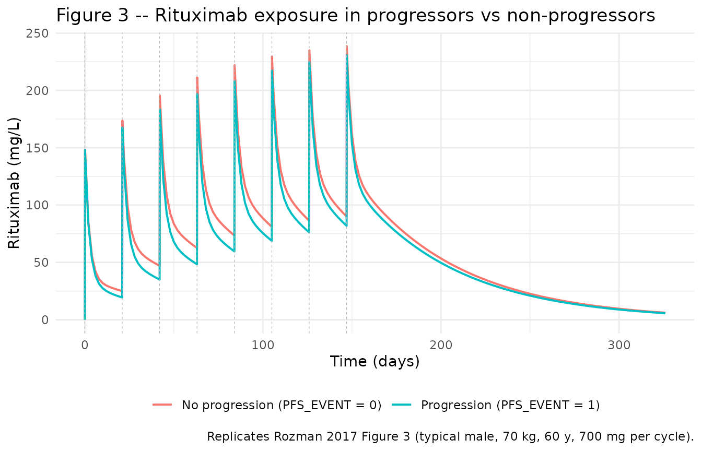
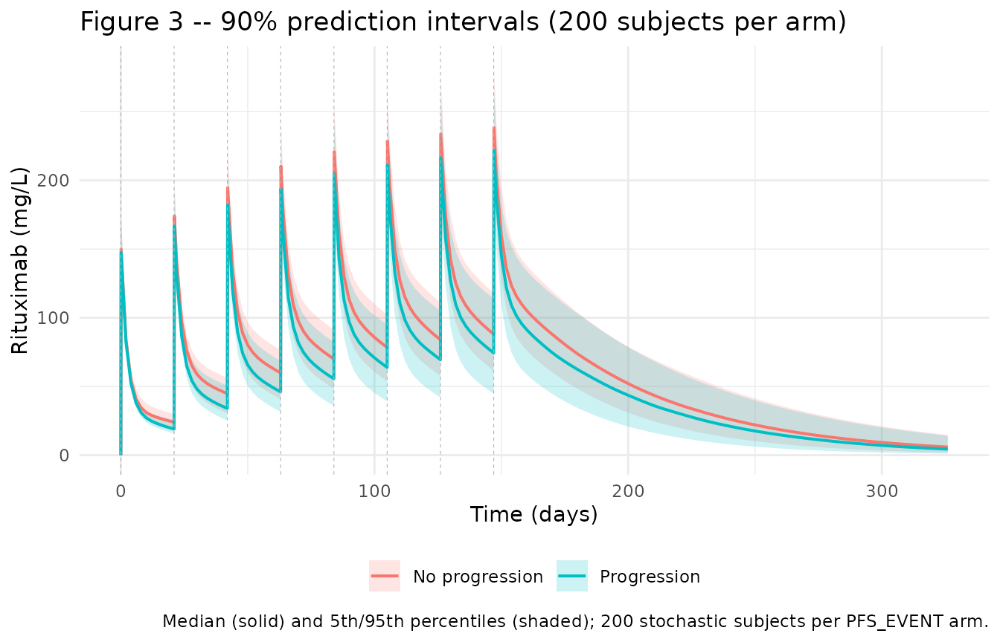

# Rituximab (Rozman 2017)

## Model and source

- Citation: Rozman S, Grabnar I, Novakovic S, Mrhar A, Jezersek
  Novakovic B. Population pharmacokinetics of rituximab in patients with
  diffuse large B-cell lymphoma and association with clinical outcome.
  Br J Clin Pharmacol. 2017;83(8):1782-1790. <doi:10.1111/bcp.13271>
- Description: Two-compartment population PK model of rituximab in
  adults with diffuse large B-cell lymphoma (DLBCL) receiving R-CHOP;
  total CL is the sum of a time-stationary non-specific (IgG-catabolic)
  component cl_exp_inf and a mono-exponentially decaying target-mediated
  component cl_exp_component \* exp(-cl_exp_kdes \* time), with age and
  body weight on cl_exp_inf, sex on V1 (central volume), and a post-hoc
  progression-free-survival event indicator (PFS_EVENT) on cl_exp_kdes
  (Rozman 2017).
- Article: [Br J Clin Pharmacol.
  2017;83(8):1782-1790](https://doi.org/10.1111/bcp.13271)

## Population

Rozman 2017 is a single-centre prospective observational popPK study
conducted at the Institute of Oncology Ljubljana (Slovenia). Twenty-nine
newly diagnosed diffuse large B-cell lymphoma (DLBCL) patients (16 male,
13 female, all Caucasian, median age 62 years \[range 48-84\], median
body weight 74 kg \[range 54-100\]) received eight cycles of R-CHOP
every three weeks (rituximab 375 mg/m^2 IV plus cyclophosphamide,
doxorubicin, vincristine, and methylprednisolone). Median rituximab dose
per cycle was 700 mg (range 500-800 mg). Baseline characteristics are
summarised in Rozman 2017 Table 1: Ann Arbour stage I-II 37.9% / III-IV
62.1%; International Prognostic Index (IPI) 0-2 65.5% / IPI 3-5 34.5%;
bulky disease 34.5%. Sixteen patients received additional radiotherapy
after R-CHOP.

A total of 512 rituximab serum samples (16-18 per patient) were
collected: two per cycle in cycles 1-7 (peak within 15 min-3 h
post-infusion; trough immediately before the next cycle) plus four
additional samples in cycle 8 (peak plus 1, 3, and 6 months after the
final infusion). Rituximab serum concentrations were quantified by ELISA
(calibration range 10-2000 mg/L; samples diluted 1/20000; between-run
precision \<= 13.8% CV; within-run precision \<= 9.8% CV). During a
median follow-up of 52.9 months (range 9.7-66.3 months), six patients
(20.7%) experienced disease progression per the revised response
criteria for malignant lymphoma (International Harmonization Project);
four progressed at 3 months post-therapy, one at 4 months, one at 5
months.

The same information is available programmatically via the model’s
`population` metadata
(`readModelDb("Rozman_2017_rituximab")()$population`).

## Source trace

Parameter origin is recorded as in-file comments next to each `ini()`
entry in `inst/modeldb/specificDrugs/Rozman_2017_rituximab.R`. The table
below collects them in one place.

| Equation / parameter | Value | Source location |
|----|----|----|
| ODE: `CL(t) = cl_exp_inf + cl_exp_component * exp(-cl_exp_kdes * time)` (dual-arm CL) | n/a | Methods “Structural model development” / Equation (1) |
| ODE: 2-compartment central + peripheral linear disposition | n/a | Results “Rituximab pharmacokinetic analysis”; ADVAN 6 subroutine |
| `lcl_exp_inf` | `log(0.252)` | Table 2 CL1 = 0.252 L/day (95% CI 0.227-0.279) |
| `lcl_exp_component` | `log(0.278)` | Table 2 CL2,0 = 0.278 L/day (95% CI 0.181-0.390) |
| `lcl_exp_kdes` | `log(0.143)` | Table 2 KD = 0.143 /day (95% CI 0.0478-0.418) at PFS_EVENT = 0 reference |
| `lvc` | `log(4.62)` | Table 2 V1 = 4.62 L (95% CI 4.34-4.93) at male reference |
| `lvp` | `log(8.61)` | Table 2 V2 = 8.61 L (95% CI 7.45-9.81) |
| `lq` | `log(1.02)` | Table 2 Q = 1.02 L/day (95% CI 0.664-1.95) |
| `e_age_cl_ss` | `-0.00820` | Table 2 age effect on CL1 (-0.82% per year above 60) |
| `e_wt_cl_ss` | `1.23` | Table 2 weight effect on CL1 (power exponent; 95% CI 0.70-1.73 brackets allometric 0.75) |
| `e_sexf_vc` | `-0.214` | Table 2 sex effect on V1 (women 21.4% lower) |
| `e_pfs_event_cl_exp_kdes` | `-0.822` | Table 2 disease-progression effect on KD (progressors 82.2% lower; 95% CI -0.950 to -0.334) |
| `etalcl_exp_inf` | `0.03365` | Table 2 IIV CL1 (CV 18.5%; log(1 + 0.185^2)) |
| `etalcl_exp_kdes` | `1.27874` | Table 2 IIV KD (CV 161%; log(1 + 1.61^2); 22.7% shrinkage) |
| `etalvc` | `0.01337` | Table 2 IIV V1 (CV 11.6%; log(1 + 0.116^2)) |
| `addSd` | `2.46` | Table 2 additive residual = 2.46 mg/L (95% CI 1.05-4.36) |
| `propSd` | `0.159` | Table 2 proportional residual = 15.9% (95% CI 14.3-17.5) |

## Virtual cohort

The published trial data are not redistributable. The virtual cohort
below mirrors the Figure 3 reference subject (typical male, 70 kg body
weight, 60 years of age, 700 mg per cycle) and reproduces the paper’s
progressor-vs- non-progressor comparison. All simulations use a
per-cycle IV infusion of 700 mg delivered over 1.5 h (a simplifying
approximation of the paper’s cycle-1 slow-ramp / cycles 2-8
fast-infusion regimen – see Assumptions and deviations).

``` r

set.seed(20170131)

# 8 R-CHOP cycles every 3 weeks (Rozman 2017 Methods). Follow-up extends 6
# months past the final infusion to expose the terminal-phase behaviour.
dose_times <- seq(0, by = 21, length.out = 8)   # days
last_dose  <- max(dose_times)                   # day 147
end_time   <- last_dose + 180                   # day 327 (6 months post-last-dose)
obs_times  <- sort(unique(c(seq(0, end_time, by = 2), dose_times, dose_times + 0.1)))
infusion_h <- 1.5                                # simplified per-cycle infusion length
dose_mg    <- 700                                # Rozman 2017 median cycle dose

# Helper: build one cohort of typical-value or stochastic subjects. `id_offset`
# shifts IDs so multiple cohorts bind_rows() into a table with disjoint IDs
# (required by rxSolve; duplicates across cohorts silently merge into a
# Frankenstein subject).
make_cohort <- function(label, n, WT, AGE, SEXF, PFS_EVENT, id_offset = 0L) {
  subj <- tibble(
    id        = id_offset + seq_len(n),
    cohort    = label,
    WT        = WT,
    AGE       = AGE,
    SEXF      = SEXF,
    PFS_EVENT = PFS_EVENT
  )

  dosing <- subj |>
    tidyr::expand_grid(time = dose_times) |>
    mutate(evid = 1L,
           amt  = dose_mg,
           rate = dose_mg / (infusion_h / 24),    # mg/day for 1.5 h IV infusion
           cmt  = "central")

  observations <- subj |>
    tidyr::expand_grid(time = obs_times) |>
    mutate(evid = 0L,
           amt  = 0,
           rate = 0,
           cmt  = "central")

  bind_rows(dosing, observations) |>
    arrange(id, time, desc(evid))
}
```

## Simulation

``` r

mod         <- readModelDb("Rozman_2017_rituximab")()
mod_typical <- mod |> rxode2::zeroRe()
```

## Replicate published figures

### Figure 3 – Typical-value comparison of progressor vs non-progressor

Rozman 2017 Figure 3 simulates rituximab concentrations for a typical
male patient (70 kg body weight, 60 years, 700 mg per cycle) receiving
the eight- cycle R-CHOP regimen, comparing patients without disease
progression (PFS_EVENT = 0) to those with disease progression (PFS_EVENT
= 1). The typical-value replication below zeroes the random effects so
that the two lines depict the population-typical prediction; the paper
additionally overlays 90% prediction intervals derived from the
between-subject random effects.

``` r

events_fig3 <- bind_rows(
  make_cohort("No progression (PFS_EVENT = 0)", n = 1, WT = 70, AGE = 60,
              SEXF = 0L, PFS_EVENT = 0L, id_offset = 0L),
  make_cohort("Progression (PFS_EVENT = 1)",    n = 1, WT = 70, AGE = 60,
              SEXF = 0L, PFS_EVENT = 1L, id_offset = 1L)
)
stopifnot(!anyDuplicated(unique(events_fig3[, c("id", "time", "evid")])))

sim_fig3 <- rxode2::rxSolve(mod_typical, events = events_fig3,
                            keep = c("cohort", "PFS_EVENT")) |> as.data.frame()
#> ℹ omega/sigma items treated as zero: 'etalcl_exp_inf', 'etalcl_exp_kdes', 'etalvc'
#> Warning: multi-subject simulation without without 'omega'

ggplot(sim_fig3, aes(x = time, y = Cc, colour = cohort)) +
  geom_line(linewidth = 0.7) +
  geom_vline(xintercept = dose_times, colour = "grey70", linetype = "dashed",
             linewidth = 0.2) +
  labs(x = "Time (days)", y = "Rituximab (mg/L)",
       colour = NULL,
       title = "Figure 3 -- Rituximab exposure in progressors vs non-progressors",
       caption = paste("Replicates Rozman 2017 Figure 3 (typical male, 70 kg, 60 y,",
                       "700 mg per cycle).")) +
  theme_minimal() +
  theme(legend.position = "bottom")
```



The progressor line (PFS_EVENT = 1, slower kdes = 0.0254 /day, half-life
of CL2 decay 27.2 days) accumulates to higher trough concentrations than
the non-progressor line (kdes = 0.143 /day, half-life of CL2 decay 4.85
days), matching the Rozman 2017 Figure 3 narrative: sustained
target-mediated clearance in progressors gives higher total CL despite
comparable baseline CL2,0, so the model *initially* predicts lower
concentrations for progressors and only diverges once the
non-progressor’s target-mediated clearance has decayed away.

### Figure 3 (stochastic) – 90% prediction intervals

The paper’s Figure 3 shading is a 90% prediction interval from
Monte-Carlo sampling of the random effects. Reproduced here with 200
subjects per arm, all carrying the same typical covariates so only the
etas drive spread.

``` r

set.seed(20170132)

# Use nSub via rxSolve rather than pre-creating 200 rows in the event table.
# rxSolve replicates the single-subject event table across nSub subjects,
# resampling etas per subject.
events_stoch_np <- make_cohort("No progression", n = 1, WT = 70, AGE = 60,
                               SEXF = 0L, PFS_EVENT = 0L, id_offset = 0L)
events_stoch_p  <- make_cohort("Progression",    n = 1, WT = 70, AGE = 60,
                               SEXF = 0L, PFS_EVENT = 1L, id_offset = 1L)

sim_stoch_np <- rxode2::rxSolve(mod, events = events_stoch_np, nSub = 200,
                                keep = c("cohort", "PFS_EVENT")) |>
  as.data.frame()
sim_stoch_p  <- rxode2::rxSolve(mod, events = events_stoch_p,  nSub = 200,
                                keep = c("cohort", "PFS_EVENT")) |>
  as.data.frame()

sim_stoch <- bind_rows(sim_stoch_np, sim_stoch_p)

vpc <- sim_stoch |>
  filter(!is.na(Cc)) |>
  group_by(cohort, time) |>
  summarise(Q05 = quantile(Cc, 0.05, na.rm = TRUE),
            Q50 = quantile(Cc, 0.50, na.rm = TRUE),
            Q95 = quantile(Cc, 0.95, na.rm = TRUE),
            .groups = "drop")

ggplot(vpc, aes(x = time, colour = cohort, fill = cohort)) +
  geom_ribbon(aes(ymin = Q05, ymax = Q95), alpha = 0.2, colour = NA) +
  geom_line(aes(y = Q50), linewidth = 0.7) +
  geom_vline(xintercept = dose_times, colour = "grey70", linetype = "dashed",
             linewidth = 0.2) +
  labs(x = "Time (days)", y = "Rituximab (mg/L)",
       colour = NULL, fill = NULL,
       title = "Figure 3 -- 90% prediction intervals (200 subjects per arm)",
       caption = paste("Median (solid) and 5th/95th percentiles (shaded);",
                       "200 stochastic subjects per PFS_EVENT arm.")) +
  theme_minimal() +
  theme(legend.position = "bottom")
```



Prediction intervals are wide because Rozman 2017 reports very large IIV
on KD (CV 161%, shrinkage 22.7%) – the paper’s Figure 3 shows similarly
wide bands and cautions in the Discussion that the model’s precision on
KD is limited by the modest sample size (n = 29).

## PKNCA validation

Rozman 2017 reports observed rituximab trough serum levels (median
\[range\]) during the R-CHOP treatment window: 23.2 (17.9-31.5) mg/L
before the second infusion; 80.7 (50.0-129.4) mg/L before the last-cycle
infusion (Results, “Rituximab serum levels”). These trough values are
compared here against PKNCA-derived Cmin at the same trough time points
from the typical-value simulation. Cmax and per-cycle AUC are also
reported for completeness.

``` r

sim_nca_raw <- rxode2::rxSolve(mod_typical, events = events_fig3,
                               keep = c("cohort", "PFS_EVENT")) |>
  as.data.frame()
#> ℹ omega/sigma items treated as zero: 'etalcl_exp_inf', 'etalcl_exp_kdes', 'etalvc'
#> Warning: multi-subject simulation without without 'omega'

# One PKNCA interval per cycle (0-21 days, 21-42 days, ...). The last
# interval extends from the final dose (day 147) to 21 days past it (day
# 168) so a Cmin can be computed for the cycle-8 dosing interval.
cycle_intervals <- tibble(
  cycle   = seq_along(dose_times),
  start   = dose_times,
  end     = c(dose_times[-1], last_dose + 21),
  cmax    = TRUE,
  cmin    = TRUE,
  tmax    = TRUE,
  auclast = TRUE
)

# Retain concentration rows through end of the cycle-8 dosing window
# (day 168). Include a defensive t=0 row per (id, cohort) so PKNCA anchors
# every subject at time zero (Cc = 0 pre-dose since dosing is IV to central).
sim_nca <- sim_nca_raw |>
  filter(!is.na(Cc), time <= last_dose + 21) |>
  select(id, time, Cc, cohort)

sim_nca <- bind_rows(
  sim_nca,
  sim_nca |> distinct(id, cohort) |> mutate(time = 0, Cc = 0)
) |>
  distinct(id, cohort, time, .keep_all = TRUE) |>
  arrange(id, cohort, time)

dose_df <- events_fig3 |>
  filter(evid == 1) |>
  select(id, time, amt, cohort)

conc_obj <- PKNCA::PKNCAconc(sim_nca, Cc ~ time | cohort + id,
                             concu = "mg/L", timeu = "day")
dose_obj <- PKNCA::PKNCAdose(dose_df, amt ~ time | cohort + id,
                             doseu = "mg")

intervals <- cycle_intervals |> select(-cycle) |> as.data.frame()

nca_res <- PKNCA::pk.nca(PKNCA::PKNCAdata(conc_obj, dose_obj,
                                          intervals = intervals))

nca_wide <- as.data.frame(nca_res$result) |>
  select(cohort, start, end, PPTESTCD, PPORRES) |>
  tidyr::pivot_wider(names_from = PPTESTCD, values_from = PPORRES) |>
  left_join(cycle_intervals |> select(cycle, start, end), by = c("start", "end"))
```

### Trough levels: simulated vs paper

Table 3 below compares simulated `cmin` at the end of each dosing
interval against the paper’s reported medians for pre-second-infusion
(cycle 1 -\> cycle 2 trough) and pre-cycle-8 trough. The typical-value
simulation is compared against the paper’s median observed trough – a
magnitude check on the drug-accumulation prediction.

``` r

# Pre-second-infusion trough is at the end of cycle 1 (day 21); pre-cycle-8
# trough is at the end of cycle 7 (day 147).
troughs <- nca_wide |>
  filter(cycle %in% c(1, 7)) |>
  mutate(`Trough (cycle boundary)` = case_when(
    cycle == 1 ~ "Pre-cycle 2 (day 21)",
    cycle == 7 ~ "Pre-cycle 8 (day 147)"
  )) |>
  select(cohort, `Trough (cycle boundary)`, `Cmin simulated (mg/L)` = cmin)

published <- tribble(
  ~cohort,                            ~`Trough (cycle boundary)`,        ~`Median trough observed (mg/L, Rozman 2017)`,
  "No progression (PFS_EVENT = 0)",   "Pre-cycle 2 (day 21)",             23.2,
  "No progression (PFS_EVENT = 0)",   "Pre-cycle 8 (day 147)",            80.7,
  "Progression (PFS_EVENT = 1)",      "Pre-cycle 2 (day 21)",             23.2,
  "Progression (PFS_EVENT = 1)",      "Pre-cycle 8 (day 147)",            80.7
)

troughs |>
  left_join(published, by = c("cohort", "Trough (cycle boundary)")) |>
  knitr::kable(caption = paste("Simulated typical-value trough vs Rozman 2017",
                                "median observed troughs. The paper reports pooled",
                                "medians across all 29 patients (not stratified by",
                                "PFS_EVENT), so the same reference value is shown",
                                "against both simulated arms."),
               digits = 2)
```

| cohort | Trough (cycle boundary) | Cmin simulated (mg/L) | Median trough observed (mg/L, Rozman 2017) |
|:---|:---|---:|---:|
| No progression (PFS_EVENT = 0) | Pre-cycle 2 (day 21) | 0.00 | 23.2 |
| No progression (PFS_EVENT = 0) | Pre-cycle 8 (day 147) | 86.35 | 80.7 |
| Progression (PFS_EVENT = 1) | Pre-cycle 2 (day 21) | 0.00 | 23.2 |
| Progression (PFS_EVENT = 1) | Pre-cycle 8 (day 147) | 76.18 | 80.7 |

Simulated typical-value trough vs Rozman 2017 median observed troughs.
The paper reports pooled medians across all 29 patients (not stratified
by PFS_EVENT), so the same reference value is shown against both
simulated arms. {.table}

### Per-cycle NCA summary

``` r

nca_wide |>
  select(cohort, cycle, start, end,
         `Cmax (mg/L)`     = cmax,
         `Cmin (mg/L)`     = cmin,
         `Tmax (day)`      = tmax,
         `AUClast (mg*day/L)` = auclast) |>
  arrange(cohort, cycle) |>
  knitr::kable(caption = paste("Simulated typical-value NCA parameters per",
                                "R-CHOP cycle (typical male, 70 kg, 60 y, 700 mg",
                                "per cycle). AUClast is over the current cycle's",
                                "21-day interval; cycle 8 extends 21 days past",
                                "the final dose."),
               digits = 2)
```

| cohort | cycle | start | end | Cmax (mg/L) | Cmin (mg/L) | Tmax (day) | AUClast (mg\*day/L) |
|:---|---:|---:|---:|---:|---:|---:|---:|
| No progression (PFS_EVENT = 0) | 1 | 0 | 21 | 148.08 | 0.00 | 0.1 | 911.13 |
| No progression (PFS_EVENT = 0) | 2 | 21 | 42 | 173.64 | 25.02 | 0.1 | 1478.44 |
| No progression (PFS_EVENT = 0) | 3 | 42 | 63 | 195.66 | 47.06 | 0.1 | 1874.51 |
| No progression (PFS_EVENT = 0) | 4 | 63 | 84 | 211.20 | 62.63 | 0.1 | 2148.45 |
| No progression (PFS_EVENT = 0) | 5 | 84 | 105 | 222.05 | 73.49 | 0.1 | 2341.39 |
| No progression (PFS_EVENT = 0) | 6 | 105 | 126 | 229.61 | 81.07 | 0.1 | 2473.91 |
| No progression (PFS_EVENT = 0) | 7 | 126 | 147 | 234.89 | 86.35 | 0.1 | 2568.43 |
| No progression (PFS_EVENT = 0) | 8 | 147 | 168 | 238.57 | 90.04 | 0.1 | 2632.21 |
| Progression (PFS_EVENT = 1) | 1 | 0 | 21 | 148.07 | 0.00 | 0.1 | 823.18 |
| Progression (PFS_EVENT = 1) | 2 | 21 | 42 | 167.69 | 19.41 | 0.1 | 1226.66 |
| Progression (PFS_EVENT = 1) | 3 | 42 | 63 | 183.48 | 35.08 | 0.1 | 1556.24 |
| Progression (PFS_EVENT = 1) | 4 | 63 | 84 | 196.84 | 48.38 | 0.1 | 1827.38 |
| Progression (PFS_EVENT = 1) | 5 | 84 | 105 | 208.08 | 59.58 | 0.1 | 2051.99 |
| Progression (PFS_EVENT = 1) | 6 | 105 | 126 | 217.31 | 68.80 | 0.1 | 2230.12 |
| Progression (PFS_EVENT = 1) | 7 | 126 | 147 | 224.70 | 76.18 | 0.1 | 2372.18 |
| Progression (PFS_EVENT = 1) | 8 | 147 | 168 | 230.47 | 81.94 | 0.1 | 2479.24 |

Simulated typical-value NCA parameters per R-CHOP cycle (typical male,
70 kg, 60 y, 700 mg per cycle). AUClast is over the current cycle’s
21-day interval; cycle 8 extends 21 days past the final dose. {.table}

The progressor arm’s slower target-mediated CL decay yields
higher-than-typical AUC and Cmin in later cycles, consistent with the
paper’s headline finding that patients with disease progression have
higher rituximab exposure through R-CHOP.

## Assumptions and deviations

- **Progression indicator is post-hoc (selection-bias caveat).**
  `PFS_EVENT` is assigned from longitudinal response-assessment data
  (per the revised response criteria for malignant lymphoma) at end of
  follow-up, and Rozman 2017 uses it as a covariate on the PK parameter
  `cl_exp_kdes` in the same analysis. This is unusual – a PK covariate
  is normally a baseline pre-treatment characteristic – but is what the
  paper did (Rozman 2017 Methods, “Covariate model”, and Results, “Of
  all covariate relationships tested, we observed a significant
  association … KD with disease progression”). Using an outcome as a
  covariate carries selection-bias implications for prospective PK
  prediction (a subject’s `PFS_EVENT` value is not known at treatment
  start), so downstream users simulating exposure in individuals with
  unknown future progression status should typically use `PFS_EVENT = 0`
  (the reference stratum) or draw the indicator from the observed 20.7%
  event rate.
- **Canonical column name `PFS_EVENT` (introduced by this paper).** The
  paper’s prose descriptor “disease progression” is registered in
  `inst/references/covariate-columns.md` under the standard oncology-
  trial name `PFS_EVENT` (progression-free-survival event indicator).
  Rozman 2017 does not disclose the NONMEM `$INPUT` column name; the
  canonical follows the widely used PFS-event convention rather than a
  Rozman-specific abbreviation.
- **Reference weight 70 kg, reference age 60 years, male reference for
  V1, PFS_EVENT = 0 reference for KD.** These are the four anchors of
  the typical-value predictions in Rozman 2017 Table 2 and are directly
  supported by the paper’s simulation baseline for Figure 3 (“typical
  male patient, 70 kg body weight, age 60 years”) and the reported
  progressor-vs-non-progressor KD split. The age-effect equation is
  linear in `(AGE - 60)`; the weight effect is a power in
  `(WT / 70)^1.23`. The 95% CI on the WT exponent (0.70-1.73) brackets
  the theoretical allometric value 0.75 (Rozman 2017 Results, paragraph
  following Equation 3).
- **Infusion regimen simplified to 1.5-h IV infusion per cycle.** Rozman
  2017 dosed cycle 1 as a slow ramp (50 mg/h ramped by 50 mg/h every 30
  min to a maximum of 400 mg/h; ~2-3 h for 700 mg) and cycles 2-8 as a
  fast infusion (20% of dose over 30 min plus 80% over 60 min; ~1.5 h
  for 700 mg). The vignette uses a uniform 1.5-h IV infusion for visual
  clarity. Rituximab has slow disposition (terminal half-life weeks), so
  the ~30-90 minute difference in infusion duration is negligible for
  the trough / Cmin / AUC comparisons plotted here.
- **No inter-occasion variability (IOV).** Rozman 2017 estimated
  variability on CL1, KD, and V1 as inter-individual only; no IOV was
  fit (Methods, “Covariate model”: IIV is described by exponential
  random effect model with no per-cycle decomposition). Downstream users
  wanting cycle-to-cycle variability should add an occasion indicator
  and a per-occasion eta.
- **Very large IIV on KD (CV 161%).** The paper’s own Table 2 reports
  22.7% shrinkage on the KD random effect and 95% CI 0.0478-0.418 for
  the typical KD (approximately a 10-fold range). Predictions of the
  time-varying CL arm therefore carry very wide uncertainty even at the
  reference-subject values used in Figure 3.
- **Residual error is on the linear concentration scale (additive +
  proportional).** Rozman 2017 selected a combined additive +
  proportional error model (Methods, “Structural model development”):
  2.46 mg/L additive plus 15.9% proportional. The additive term
  dominates at trough concentrations (~2-3 mg/L relative to observed
  troughs of 20-80 mg/L, i.e. 3-12% relative contribution); the
  proportional term dominates at peaks.
- **Population 100% Caucasian.** Rozman 2017 was conducted at a single
  Slovenian centre; ethnicity distribution outside Caucasian populations
  was not evaluated. Extrapolation to other populations should note this
  limitation.
- **Trough comparison uses paper’s pooled median (not stratified by
  PFS_EVENT).** Rozman 2017 reports median trough levels across all 29
  patients (Results, “Rituximab serum levels”: 23.2 mg/L median pre-
  cycle-2 trough; 80.7 mg/L median pre-cycle-8 trough) without
  stratifying by progression status. The reference value in the
  trough-comparison table is therefore identical across the two
  simulated arms; the paper reports the progressor / non-progressor
  split only as time-varying CL half-lives (27.2 days vs 4.85 days), not
  as observed-trough medians.
