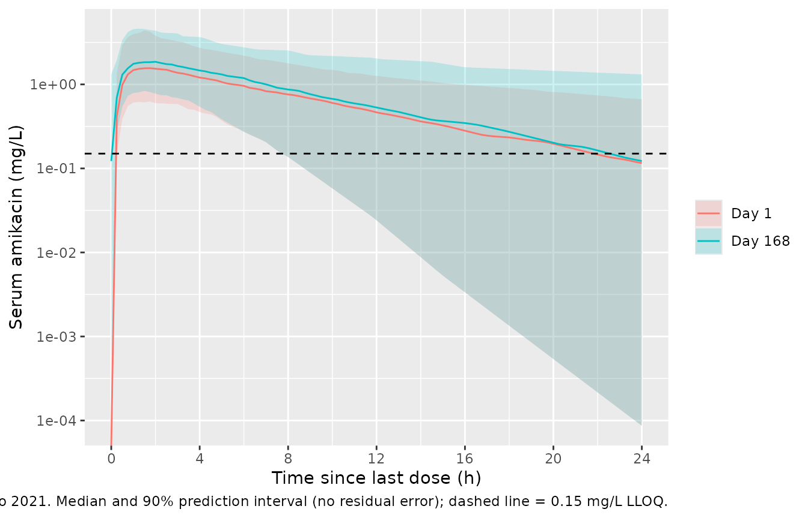

# Amikacin liposome inhalation suspension (Rubino 2021)

## Model and source

- Citation: Rubino CM, Onufrak NJ, van Ingen J, Griffith DE, Bhavnani
  SM, Yuen DW, Mange KC, Winthrop KL. Population Pharmacokinetic
  Evaluation of Amikacin Liposome Inhalation Suspension in Patients with
  Treatment-Refractory Nontuberculous Mycobacterial Lung Disease. Eur J
  Drug Metab Pharmacokinet. 2021;46(2):277-287.
  <doi:10.1007/s13318-020-00669-7>. Correction: Eur J Drug Metab
  Pharmacokinet. 2021. <doi:10.1007/s13318-021-00687-z> (corrects the
  Figure 2 x-axis labels and a figure cross-reference only; no model
  value is affected). The structural model, zero-order lung input and
  additive residual-error form are carried from the cystic fibrosis
  model it was based on: Okusanya OO, Bhavnani SM, Hammel JP, Forrest A,
  Bulik CC, Ambrose PG, Gupta R. Antimicrob Agents Chemother.
  2014;58(9):5005-5015. <doi:10.1128/AAC.02421-13>.
- Description: One-compartment population PK model for amikacin in serum
  after once-daily nebulised amikacin liposome inhalation suspension
  (ALIS) 590 mg in adults with treatment-refractory nontuberculous
  mycobacterial (NTM) lung disease (Rubino 2021). Zero-order nebulised
  input into a lung absorption compartment, first-order absorption from
  lung to serum, and linear apparent clearance CLt/F from an apparent
  central volume Vc/F; a urine compartment accumulates the renally
  excreted amount at the true renal clearance CLr (allometrically scaled
  by body weight to a 51 kg reference), so the serum concentration and
  the cumulative urine amount were fit simultaneously and the systemic
  bioavailability is implied by CLr / (CLt/F).
- Article: <https://doi.org/10.1007/s13318-020-00669-7>
- Correction (Figure 2 axis labels only):
  <https://doi.org/10.1007/s13318-021-00687-z>
- Base model (cystic fibrosis, Okusanya 2014):
  <https://doi.org/10.1128/AAC.02421-13>

Amikacin liposome inhalation suspension (ALIS, ARIKAYCE) is nebulised
once daily at 590 mg. Rubino 2021 pooled the serum (and, in TR02-112,
urine) data of the phase 2 TR02-112 and phase 3 CONVERT pharmacokinetic
substudies and refit the model previously developed in cystic fibrosis
(Okusanya 2014) without changing its structure: a zero-order nebulised
input into a lung absorption compartment, first-order transfer to serum,
linear elimination at the apparent clearance CLt/F, and a urine
compartment that accumulates the renally excreted amount at the renal
clearance CLr (Figure 1). Because CLt/F and Vc/F are apparent while CLr
is fitted to urine amounts, the ratio CLr / (CLt/F) is the fraction of
the nebulised dose that is recovered unchanged in urine, i.e. the
systemic bioavailability for a drug that is cleared almost entirely by
the kidney.

## Population

The analysis population (Table 1) comprised 53 adults with
treatment-refractory nontuberculous mycobacterial (NTM) lung disease: 14
from TR02-112 (all White, all female; USA and Canada) and 39 from
CONVERT (28 Japanese and 11 White; USA and Japan). The median age was 63
years (range 20-84), 84.9% were female, the median body weight was 52.6
kg (33.8-80 kg), and the median eGFR was 88.3 mL/min/1.73 m^2
(57.4-140). Sputum was persistently culture-positive for *Mycobacterium
avium* complex (both studies) or *M. abscessus* (TR02-112) after at
least 6 months of guideline-based therapy. 491 serum concentrations (89
below the 0.15 mg/L LLOQ, handled by the Beal M3 method) and 23 urine
collections (TR02-112 only) were analysed.

The same information is available programmatically via
`readModelDb("Rubino_2021_amikacin")()$population`.

## Source trace

| Equation / parameter | Value | Source location |
|----|----|----|
| `lcl` (CLt/F) | 34.29 L/h | Table 2 |
| `lvc` (Vc/F) | 272.6 L | Table 2 |
| `lka` (ka) | 1.866 1/h | Table 2 |
| `lcl_renal` (CLr at 51 kg) | 1.931 L/h | Table 2, ‘CLr coefficient’ and footnote |
| `e_wt_cl_renal` | 0.75 (fixed) | Table 2, ‘CLr WTKG power’ (no %SEM) and footnote equation |
| `etalcl` | 71.82 %CV | Table 2 |
| `etalvc` | 65.09 %CV | Table 2 |
| `etalka` | 40.30 %CV | Table 2 |
| `etalcl_renal` | 30.24 %CV | Table 2 |
| `addSd` (serum) | 0.615 mg/L | Table 2, ‘Residual error (serum)’; additive form from Methods 2.3 and Okusanya 2014 |
| `addSd_Aurine` (urine) | 14.0 mg | Table 2, ‘Residual error (urine)’; additive form as above |
| `CLr = 1.931 * (WT/51)^0.75` | n/a | Table 2 footnote |
| Lung -\> serum -\> urine structure, zero-order lung input | n/a | Figure 1; Methods 2.3 |
| `d/dt(urine) = CLr * Cc` | n/a | Methods 2.3 (‘Amikacin in urine was modeled as accumulating in the urine compartment after clearance from the central compartment’) |

Table 2 also lists ‘CLr = 1.990 L/h’ with no standard error. It is the
population mean renal clearance across the analysed patients implied by
the weight equation (1.931 x (WT/51)^0.75 evaluated at a weight near the
cohort mean), not a separate parameter, so it is not encoded.

## Structural checks (typical patient, 51 kg)

``` r

mod <- readModelDb("Rubino_2021_amikacin")
mod_typ <- rxode2::zeroRe(mod)
#> ℹ parameter labels from comments will be replaced by 'label()'

dose <- 590
tau <- 24
n_days <- 168
t_ss <- (n_days - 1) * tau

ev_typ <- rxode2::et(amt = dose, cmt = "depot", dur = 0.25, ii = tau, addl = n_days - 1) |>
  rxode2::et(c(seq(0, 24, by = 0.02), seq(t_ss, t_ss + tau, by = 0.02)), cmt = "central") |>
  as.data.frame() |>
  mutate(WT = 51, dvid = ifelse(evid == 0, 1L, NA_integer_))

typ <- rxode2::rxSolve(mod_typ, ev_typ,
  useLinCmt = FALSE, returnType = "data.frame",
  rtol = 1e-10, atol = 1e-12, maxsteps = 1e6
)
#> ℹ omega/sigma items treated as zero: 'etalcl', 'etalvc', 'etalka', 'etalcl_renal'

trap <- function(t, y) sum(diff(t) * (head(y, -1) + tail(y, -1)) / 2)
typ_ss <- typ |> filter(time >= t_ss)
typ_d1 <- typ |> filter(time <= tau)

auc_ss <- trap(typ_ss$time, typ_ss$Cc)
fe_ss <- (max(typ_ss$Aurine) - min(typ_ss$Aurine)) / dose
thalf <- log(2) * 272.6 / 34.29

typ_tab <- tibble::tribble(
  ~Quantity, ~Simulated, ~Expected,
  "AUC0-24 at steady state (mg*h/L)", auc_ss, dose / 34.29,
  "Fraction of dose in urine per interval at steady state (%)", 100 * fe_ss, 100 * 1.931 / 34.29,
  "Cmax day 1 (mg/L)", max(typ_d1$Cc), NA,
  "Cmax steady state (mg/L)", max(typ_ss$Cc), NA,
  "AUC0-24 day 1 (mg*h/L)", trap(typ_d1$time, typ_d1$Cc), NA,
  "Elimination half-life ln2*Vc/CL (h)", thalf, 5.48
)
knitr::kable(typ_tab, digits = 3, caption = paste(
  "Typical-value checks. The steady-state rows are closed-form identities",
  "(AUC = Dose/(CLt/F); urine recovery = CLr/(CLt/F)); the half-life row compares",
  "with the median post hoc half-life of Table 3."
))
```

| Quantity | Simulated | Expected |
|:---|---:|---:|
| AUC0-24 at steady state (mg\*h/L) | 17.206 | 17.206 |
| Fraction of dose in urine per interval at steady state (%) | 5.631 | 5.631 |
| Cmax day 1 (mg/L) | 1.780 | NA |
| Cmax steady state (mg/L) | 1.878 | NA |
| AUC0-24 day 1 (mg\*h/L) | 16.291 | NA |
| Elimination half-life ln2\*Vc/CL (h) | 5.510 | 5.480 |

Typical-value checks. The steady-state rows are closed-form identities
(AUC = Dose/(CLt/F); urine recovery = CLr/(CLt/F)); the half-life row
compares with the median post hoc half-life of Table 3. {.table}

``` r


stopifnot(
  # Closed-form identities: both sides use the same parameters, so the only
  # difference is integration error (measured ~1e-7 with the tolerances above).
  abs(auc_ss / (dose / 34.29) - 1) < 1e-4,
  abs(fe_ss / (1.931 / 34.29) - 1) < 1e-4,
  # Typical half-life vs the Table 3 median of the post hoc half-lives (5.48 h).
  abs(thalf / 5.48 - 1) < 0.02
)
```

The implied systemic bioavailability, `CLr / (CLt/F)` = 1.931 / 34.29 =
5.6% for a 51 kg patient, agrees with the paper’s conclusion that less
than 10% of the nebulised dose reaches the systemic circulation.

## Virtual cohort

Observed data are not public. The cohort below draws body weight from a
log-normal distribution centred on the Table 1 median (52.6 kg) and
rejects draws outside the observed 33.8-80 kg range (redrawing, not
clamping, so the weight distribution is not piled up at the limits).
Weight is the only covariate in the model. All patients receive ALIS 590
mg once daily for 168 days (the approximately 6-month time point of
Table 3).

``` r

set.seed(20210301)
n_sub <- 200

draw_wt <- function(n) {
  out <- numeric(0)
  while (length(out) < n) {
    x <- exp(rnorm(2 * n, log(52.6), 0.2))
    out <- c(out, x[x >= 33.8 & x <= 80])
  }
  out[seq_len(n)]
}

subj <- tibble(id = seq_len(n_sub), WT = draw_wt(n_sub))

obs_times <- c(seq(0, 24, by = 0.25), seq(t_ss, t_ss + tau, by = 0.25))

events <- bind_rows(
  subj |> mutate(
    time = 0, amt = dose, evid = 1L, cmt = "depot", dur = 0.25,
    ii = tau, addl = n_days - 1L, dvid = NA_integer_
  ),
  tidyr::crossing(subj, time = obs_times) |> mutate(
    amt = NA_real_, evid = 0L, cmt = "central", dur = NA_real_,
    ii = NA_real_, addl = NA_integer_, dvid = 1L
  )
) |>
  arrange(id, time, desc(evid))

stopifnot(!anyDuplicated(events[, c("id", "time", "evid")]))
```

## Simulation

``` r

rxode2::rxSetSeed(20210301)
sim <- rxode2::rxSolve(mod, events,
  keep = "WT", useLinCmt = FALSE,
  returnType = "data.frame", maxsteps = 1e6
)
#> ℹ parameter labels from comments will be replaced by 'label()'

# Concentration and cumulative-urine predictions without residual error,
# separated into the day-1 and day-168 dosing intervals and re-based to time
# after dose.
sim_int <- sim |>
  filter(time <= tau | time >= t_ss) |>
  mutate(
    period = ifelse(time <= tau, "Day 1", "Day 168"),
    tad = ifelse(period == "Day 1", time, time - t_ss)
  )
```

## Replicate published figures

Figure 2 of the paper plots the observed serum concentrations against
time since the last dose. The simulated median and 90% prediction
interval of the individual predictions over one dosing interval on day 1
and on day 168 cover the same range: peaks around 1-6 mg/L within the
first few hours and troughs near or below the 0.15 mg/L LLOQ by 24 h.

``` r

sim_int |>
  group_by(period, tad) |>
  summarise(
    Q05 = quantile(Cc, 0.05), Q50 = median(Cc), Q95 = quantile(Cc, 0.95),
    .groups = "drop"
  ) |>
  ggplot(aes(tad, Q50, colour = period, fill = period)) +
  geom_ribbon(aes(ymin = Q05, ymax = Q95), alpha = 0.2, colour = NA) +
  geom_line() +
  geom_hline(yintercept = 0.15, linetype = "dashed") +
  scale_y_log10() +
  scale_x_continuous(breaks = seq(0, 24, 4)) +
  labs(
    x = "Time since last dose (h)", y = "Serum amikacin (mg/L)",
    colour = NULL, fill = NULL,
    caption = paste(
      "Compare with Figure 2 of Rubino 2021. Median and 90% prediction interval",
      "(no residual error); dashed line = 0.15 mg/L LLOQ."
    )
  )
#> Warning in scale_y_log10(): log-10 transformation introduced infinite values.
#> log-10 transformation introduced infinite values.
#> log-10 transformation introduced infinite values.
#> log-10 transformation introduced infinite values.
```



## PKNCA validation

Table 3 of the paper reports the median model-derived Cmax and AUC0-24
on day 1 and at approximately 6 months (all 53 patients). PKNCA is run
on each dosing interval of the virtual cohort with the period as the
grouping variable.

``` r

sim_nca <- sim_int |>
  filter(!is.na(Cc)) |>
  select(id, period, tad, Cc)

# Day 1 starts at zero concentration; the day-168 interval has its own
# pre-dose (trough) record at tad = 0 from the observation grid.
sim_nca <- bind_rows(
  sim_nca,
  sim_nca |> distinct(id, period) |> filter(period == "Day 1") |> mutate(tad = 0, Cc = 0)
) |>
  distinct(id, period, tad, .keep_all = TRUE) |>
  arrange(id, period, tad)

dose_df <- sim_nca |>
  distinct(id, period) |>
  mutate(tad = 0, amt = dose)

conc_obj <- PKNCA::PKNCAconc(sim_nca, Cc ~ tad | period + id, concu = "mg/L", timeu = "h")
dose_obj <- PKNCA::PKNCAdose(dose_df, amt ~ tad | period + id, doseu = "mg")
intervals <- data.frame(start = 0, end = 24, cmax = TRUE, tmax = TRUE, auclast = TRUE)
nca_res <- PKNCA::pk.nca(PKNCA::PKNCAdata(conc_obj, dose_obj, intervals = intervals))
```

### Comparison against published NCA

``` r

published <- tibble::tribble(
  ~period, ~cmax, ~auclast,
  "Day 1", 1.70, 15.8,
  "Day 168", 1.81, 16.7
)

cmp <- nlmixr2lib::ncaComparisonTable(
  simulated = nca_res,
  reference = published,
  by = "period",
  units = c(cmax = "mg/L", auclast = "mg*h/L"),
  tolerance_pct = 20
)
knitr::kable(cmp, caption = paste(
  "Median simulated vs. published (Rubino 2021 Table 3, total N = 53) Cmax and",
  "AUC0-24. Day 168 corresponds to the paper's approximately 6-month column.",
  "* differs from reference by >20%."
))
```

| NCA parameter     | period  | Reference | Simulated | % diff |
|:------------------|:--------|:----------|:----------|:-------|
| Cmax (mg/L)       | Day 1   | 1.7       | 1.63      | -4.4%  |
| Cmax (mg/L)       | Day 168 | 1.81      | 1.89      | +4.7%  |
| AUClast (mg\*h/L) | Day 1   | 15.8      | 15.7      | -0.4%  |
| AUClast (mg\*h/L) | Day 168 | 16.7      | 17.5      | +5.1%  |

Median simulated vs. published (Rubino 2021 Table 3, total N = 53) Cmax
and AUC0-24. Day 168 corresponds to the paper’s approximately 6-month
column. \* differs from reference by \>20%. {.table}

``` r


sim_med <- as.data.frame(nca_res$result) |>
  filter(PPTESTCD %in% c("cmax", "auclast")) |>
  group_by(period, PPTESTCD) |>
  summarise(med = median(PPORRES), .groups = "drop") |>
  left_join(
    published |> pivot_longer(-period, names_to = "PPTESTCD", values_to = "ref"),
    by = c("period", "PPTESTCD")
  )
stopifnot(
  nrow(sim_med) == 4L,
  # Cohort medians: a mis-transcribed CL, V or dose moves these by tens of
  # percent. The steady-state AUC median is Dose / median(CLt/F) and is
  # almost cohort-independent; the others carry sampling noise of a few percent.
  all(abs(sim_med$med / sim_med$ref - 1) < 0.15)
)
```

The simulated medians reproduce the published medians closely. The
paper’s values are medians of the empirical Bayes estimates of the 53
analysed patients, which are shrunk towards the typical value, so the
published ranges (Cmax 0.465-6.87 mg/L, AUC0-24 4.16-55.6 mg\*h/L) are
expected to be narrower than a simulated cohort’s tails; only the
centres are compared.

## Urinary recovery

Table S2 of the paper reports the percentage of the dose excreted
unchanged in urine over the 24 h after the day-1, day-84 and day-168
doses in TR02-112 (White women, median weight 65.2 kg).

``` r

fe <- sim_int |>
  group_by(id, period) |>
  summarise(fe_pct = 100 * (max(Aurine) - min(Aurine)) / dose, .groups = "drop")

fe_tab <- fe |>
  group_by(period) |>
  summarise(
    "Simulated median (%)" = median(fe_pct),
    "Simulated 5th-95th percentile (%)" = sprintf(
      "%.2f-%.2f", quantile(fe_pct, 0.05), quantile(fe_pct, 0.95)
    ),
    .groups = "drop"
  ) |>
  mutate(
    "Observed median, range (%)" = c("3.25 (2.71-8.95), n = 6", "8.42 (0.72-22.6), n = 11")
  ) |>
  rename(Period = period)
knitr::kable(fe_tab, digits = 2, caption = paste(
  "Percentage of the 590 mg dose excreted unchanged in urine over 24 h.",
  "Observed values from Rubino 2021 Table S2 (TR02-112)."
))
```

| Period | Simulated median (%) | Simulated 5th-95th percentile (%) | Observed median, range (%) |
|:---|---:|:---|:---|
| Day 1 | 5.08 | 1.71-13.88 | 3.25 (2.71-8.95), n = 6 |
| Day 168 | 5.88 | 1.83-19.54 | 8.42 (0.72-22.6), n = 11 |

Percentage of the 590 mg dose excreted unchanged in urine over 24 h.
Observed values from Rubino 2021 Table S2 (TR02-112). {.table}

``` r


stopifnot(
  # The model has no time dependency, so both intervals centre on
  # CLr / (CLt/F); the centre must sit inside the observed day-1 to day-168
  # spread of medians (3.25-8.42%).
  all(tapply(fe$fe_pct, fe$period, median) > 3.25),
  all(tapply(fe$fe_pct, fe$period, median) < 8.42)
)
```

The observed median recovery rose from 3.25% on day 1 to 8.42% on day
168 in the small TR02-112 urine subset, while the model (which has no
time-varying bioavailability) places both intervals at about 5-6%,
between the two observed medians; the paper also reports the
model-derived exposure as differing by less than 10% between day 1 and 6
months.

## Assumptions and deviations

- **IIV scale.** Table 2 reports inter-individual variability as %CV of
  an exponential (log-normal) model without stating the
  back-transformation. The variances were computed as
  `omega^2 = log(CV^2 + 1)`; the alternative reading `omega = CV` would
  give variances of 0.516, 0.424, 0.162 and 0.091 (instead of 0.416,
  0.353, 0.150 and 0.088) for CLt/F, Vc/F, ka and CLr. No published
  quantity discriminates between them (the Table 3 ranges come from
  shrunk post hoc estimates).
- **Residual error form.** Table 2 gives one residual-error value for
  serum (0.615) and one for urine (14.0) without naming the model.
  Methods 2.3 states that residual variability was initially described
  with an additive model and that separate models were used for serum
  and urine, and the cystic fibrosis model on which this analysis is
  based used separate additive error models for serum and urine
  (Okusanya 2014, Methods). The values are therefore encoded as additive
  standard deviations in mg/L (serum) and mg (urine amount).
- **Apparent frame.** CLt/F and Vc/F are apparent parameters and the
  full nebulised dose enters the lung compartment (bioavailability is
  not a separate parameter). The urine compartment is filled at the true
  renal clearance CLr times the serum concentration and is not
  subtracted from the central compartment, whose total loss is already
  CLt/F (dotted arrow in Figure 1). Individual bioavailability is
  therefore `CLr / (CLt/F)` under the assumption, standard for amikacin,
  that elimination is almost entirely renal.
- **Urine collections.** The paper collected urine over 0-24 h after the
  dose; the Okusanya 2014 base model emptied the urine compartment at
  the end of each collection interval. The packaged `urine` state is
  cumulative from the start of the simulation, so the amount over a
  collection interval is the difference in `Aurine` across it (as done
  above) or the state must be reset in the event table.
- **Nebulisation duration.** The analysis used each patient’s recorded
  nebulisation start and end times. The simulations here use a 15-minute
  zero-order input; Okusanya 2014 reports 2-5 minutes per 140 mg (about
  8-21 minutes for 590 mg). With ka = 1.87 1/h the duration has little
  effect on Cmax or AUC.
- **Race.** Japanese and White patients had similar exposures and the
  model has no race covariate; the virtual cohort is described by weight
  only.
- **Inter-occasion variability** was not estimated (Methods 2.3), and
  sputum concentrations were not modelled, so neither is part of this
  model.
