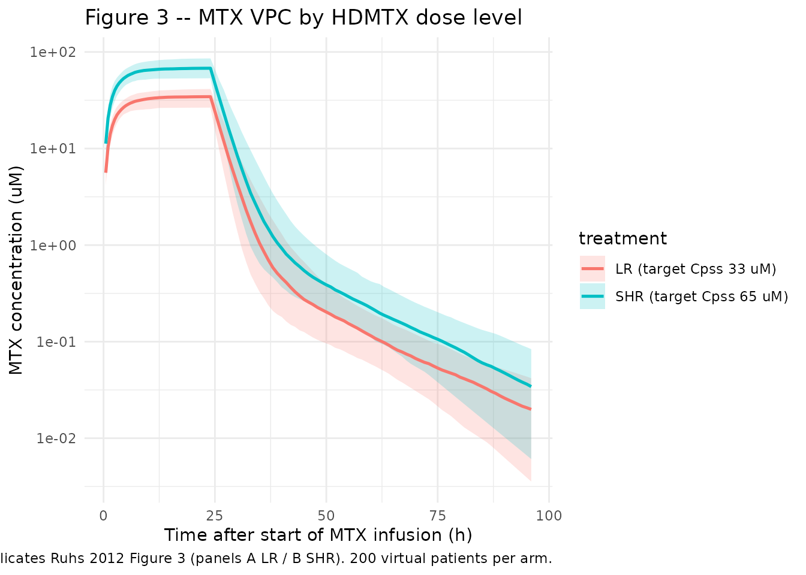
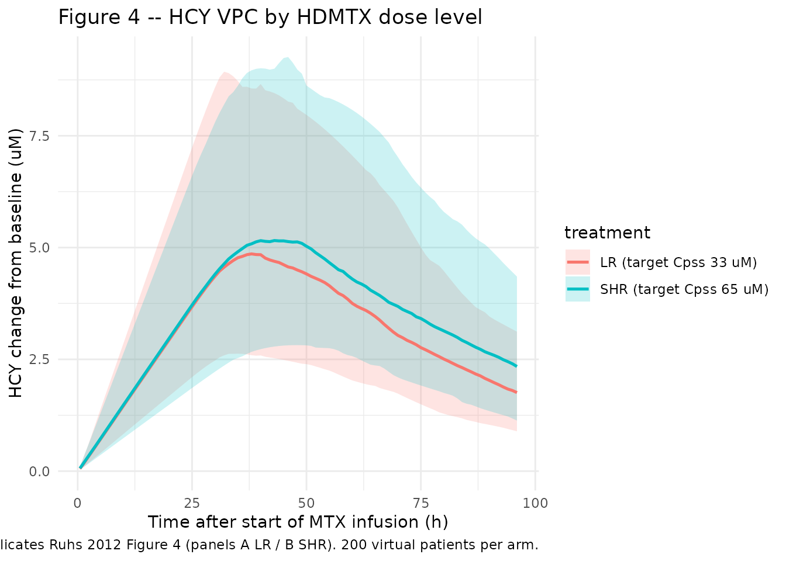

# Methotrexate (Ruhs 2012)

## Model and source

- Citation: Ruhs H, Becker A, Drescher A, Panetta JC, Pui CH, Relling
  MV, Jaehde U. Population PK/PD Model of Homocysteine Concentrations
  after High-Dose Methotrexate Treatment in Patients with Acute
  Lymphoblastic Leukemia. *PLoS ONE.* 2012;7(9):e46015.
  <doi:%5B10.1371/journal.pone.0046015>\](<https://doi.org/10.1371/journal.pone.0046015>).
- Article (open access): <https://doi.org/10.1371/journal.pone.0046015>
- Drug: methotrexate (high-dose IV); homocysteine as PD biomarker.

The integrated PK/PD model couples a two-compartment population PK model
for methotrexate (MTX) to a single-compartment indirect response model
for homocysteine (HCY). MTX inhibits the HCY elimination rate constant
kout via an inverse Emax function (Emax fixed to 1); the typical HCY
baseline depends linearly on age (Ruhs 2012 Table 2 / Figure 2).

## Population

The model was developed using data from 494 children with newly
diagnosed acute lymphoblastic leukemia enrolled in the Total Therapy XV
study at St. Jude Children’s Research Hospital (Memphis TN) and Cook
Children’s Medical Center (Fort Worth TX). The cohort was split 2:1 into
an index dataset (331 patients, 6722 MTX concentrations + 2567 HCY
concentrations) and an external evaluation dataset (163 patients).
Children received 4-hour or 24-hour MTX infusions during the window
phase (1000 mg/m^2) followed by HDMTX consolidation cycles
individualized to target an MTX steady-state plasma concentration of 33
uM (LR; ~2500 mg/m^2 median) or 65 uM (SHR; ~5000 mg/m^2 median). The
same metadata is exposed programmatically via
`readModelDb("Ruhs_2012_methotrexate")$population`.

``` r

mod_fn <- readModelDb("Ruhs_2012_methotrexate")
mod    <- rxode2::rxode(mod_fn)
#> ℹ parameter labels from comments will be replaced by 'label()'
str(mod$population)
#> List of 20
#>  $ species       : chr "human"
#>  $ n_subjects    : int 494
#>  $ n_index       : int 331
#>  $ n_evaluation  : int 163
#>  $ n_centres     : int 2
#>  $ n_mtx_obs     : int 6722
#>  $ n_hcy_obs     : int 2567
#>  $ age_range     : chr "1.03-18.85 years"
#>  $ age_median    : chr "5.42 years (index dataset)"
#>  $ weight_range  : chr "7.8-160.1 kg"
#>  $ weight_median : chr "22.0 kg (index dataset)"
#>  $ bsa_range     : chr "0.40-2.97 m^2"
#>  $ bsa_median    : chr "0.83 m^2"
#>  $ creat_range   : chr "0.1-1.2 mg/dL"
#>  $ sex_female_pct: num 42.9
#>  $ race_ethnicity: logi NA
#>  $ disease_state : chr "Newly diagnosed acute lymphoblastic leukemia (ALL); low-risk (LR) and standard/high-risk (SHR) subgroups strati"| __truncated__
#>  $ dose_range    : chr "Window therapy: 1000 mg/m^2 over 4 h (1 g/m^2) or over 24 h (200 mg/m^2 IV bolus followed by 800 mg/m^2 over 24"| __truncated__
#>  $ regions       : chr "USA (St. Jude Children's Research Hospital, Memphis TN; Cook Children's Medical Center, Fort Worth TX)"
#>  $ notes         : chr "Demographics from Ruhs 2012 Table 1. The PK model was developed on the index dataset (331 patients) and externa"| __truncated__
str(mod$covariateData)
#> List of 4
#>  $ BSA      :List of 6
#>   ..$ description       : chr "Body surface area"
#>   ..$ units             : chr "m^2"
#>   ..$ type              : chr "continuous"
#>   ..$ reference_category: NULL
#>   ..$ notes             : chr "Linear multiplicative scaling on CL, V1, Q, V2 (theta values in Table 2 are reported per m^2 BSA; the implicit "| __truncated__
#>   ..$ source_name       : chr "BSA"
#>  $ CREAT    :List of 6
#>   ..$ description       : chr "Measured serum creatinine"
#>   ..$ units             : chr "mg/dL"
#>   ..$ type              : chr "continuous"
#>   ..$ reference_category: NULL
#>   ..$ notes             : chr "Patient's measured serum creatinine (Ruhs 2012 Table 1: median 0.4 mg/dL, range 0.1-1.2). Enters the model only"| __truncated__
#>   ..$ source_name       : chr "CCR"
#>  $ CREAT_REF:List of 6
#>   ..$ description       : chr "Age- and gender-adjusted reference serum creatinine"
#>   ..$ units             : chr "mg/dL"
#>   ..$ type              : chr "continuous"
#>   ..$ reference_category: NULL
#>   ..$ notes             : chr "Externally-computed expected normal SCR for the individual (denoted CCR,adj in Ruhs 2012). The paper cites its "| __truncated__
#>   ..$ source_name       : chr "CCR,adj"
#>  $ AGE      :List of 6
#>   ..$ description       : chr "Age at study entry"
#>   ..$ units             : chr "years"
#>   ..$ type              : chr "continuous"
#>   ..$ reference_category: NULL
#>   ..$ notes             : chr "Time-fixed at study entry. Enters the model only as a linear additive effect on the typical HCY baseline: HCYBL"| __truncated__
#>   ..$ source_name       : chr "AGE"
```

## Source trace

The per-parameter origin is recorded as an inline comment next to each
`ini()` entry in `inst/modeldb/specificDrugs/Ruhs_2012_methotrexate.R`.
The table below collects them in one place for review. All parameter
values come from Ruhs 2012 Table 2 unless otherwise noted.

| Equation / parameter | Value | Source location |
|----|----|----|
| `lcl` – MTX CL (per m^2 BSA) | log(6.68) L/h/m^2 | Table 2 theta_CL = 6.68 |
| `lvc` – MTX V1 (per m^2 BSA) | log(18.6) L/m^2 | Table 2 theta_V1 = 18.6 |
| `lq` – MTX Q (per m^2 BSA) | log(0.161) L/h/m^2 | Table 2 theta_Q = 0.161 |
| `lvp` – MTX V2 (per m^2 BSA) | log(3.09) L/m^2 | Table 2 theta_V2 = 3.09 |
| `e_creat_cl` | 0.314 | Table 2 theta_CR; Eq. 1 power on (CCR,adj / CCR) |
| `lhcybl` – HCY baseline at age 0 y | log(4.88) uM | Table 2 theta_BL = 4.88 (linear-age intercept) |
| `lkout` – HCY kout | log(0.027) 1/h | Table 2 theta_kout = 0.027 |
| `lec50` – MTX EC50 for HCY inhibition | log(0.648) uM | Table 2 theta_EC50 = 0.648 |
| `emax` – max fractional inhibition (FIXED) | 1 | Table 2 theta_Emax (fixed); Methods Eq. 3 |
| `e_age_hcybl` – linear age effect on HCY baseline | 0.116 uM/year | Table 2 theta_BL,AGE = 0.116 |
| `etalcl` IIV variance | 0.02089 | Table 2 CL IIV 14.53% CV; omega^2 = log(1 + CV^2) |
| `etalvc` IIV variance | 0.03199 | Table 2 V1 IIV 18.03% CV |
| `etalq` IIV variance | 0.12584 | Table 2 Q IIV 36.61% CV |
| `etalhcybl` IIV variance | 0.03528 | Table 2 HCYBL IIV 18.95% CV |
| `etalkout` IIV variance | 0.10472 | Table 2 kout IIV 33.23% CV |
| `etalec50` IIV variance | 0.25285 | Table 2 EC50 IIV 53.63% CV |
| `propSd` – MTX prop. residual SD | 0.235 | Table 2 PK exponential error (small-sigma equivalent) |
| `addSd_HCY` – HCY add. residual SD | 0.911 uM | Table 2 PD additive error |
| `propSd_HCY` – HCY prop. residual SD | 0.165 | Table 2 PD exponential error (small-sigma equivalent) |
| `CL = theta_CL * BSA * (CREAT_REF / CREAT)^theta_CR` | n/a | Equation 1 |
| `d/dt(central), d/dt(peripheral1)` | n/a | Figure 2 (PK scheme) |
| Steady-state HCYBL = kin / kout | n/a | Equation 2 |
| `d/dt(effect) = kin - kout * (1 - Emax * Cc/(EC50+Cc)) * effect` | n/a | Equation 3 (inverse Emax inhibition) |

The conversion from MTX amount (mg) to MTX concentration (uM) uses MW =
454.44 g/mol baked into the model (`MW_MTX`); EC50 and HCY are reported
by the paper in uM and the model preserves those units.

## Virtual cohort

The original observed data are not publicly available. The simulations
below use virtual populations whose covariate distributions approximate
the published trial demographics (Ruhs 2012 Table 1). For the
renal-function factor, `CREAT_REF` is set equal to `CREAT` so the factor
evaluates to 1 (no adjustment) – the paper’s reference \[23\] formula
for the age- and gender-adjusted reference SCR is not reproduced in the
main text. See the Assumptions and deviations section below.

``` r

set.seed(20120925L)  # Ruhs 2012 publication date

# A typical pediatric ALL patient: age 5 years, BSA ~0.83 m^2 (Table 1
# medians). MTX doses follow the published Cpss-targeted regimen:
# LR target 33 uM, SHR target 65 uM, both as a 24-hour IV infusion with
# the loading-then-maintenance split simplified to a uniform 24-h infusion.
n_per_arm <- 200L

make_arm <- function(n, dose_mg_per_m2, treatment, id_offset = 0L) {
  ids <- id_offset + seq_len(n)
  bsa     <- pmax(0.4, pmin(2.97, rlnorm(n, log(0.83),   0.40)))   # m^2
  age     <- pmax(1.0, pmin(18.9, rlnorm(n, log(5.42),   0.55)))   # years
  creat   <- pmax(0.1, pmin(1.2,  rlnorm(n, log(0.4),    0.30)))   # mg/dL
  total_dose_mg <- dose_mg_per_m2 * bsa
  infusion_h    <- 24
  rate_mg_per_h <- total_dose_mg / infusion_h

  cov_df <- data.frame(id = ids, BSA = bsa, AGE = age,
                       CREAT = creat, CREAT_REF = creat)
  dose_rows <- data.frame(
    id   = ids,
    time = 0,
    amt  = total_dose_mg,
    rate = rate_mg_per_h,
    evid = 1L,
    cmt  = "central"
  ) |> merge(cov_df, by = "id", sort = FALSE)

  # One cmt = "Cc" observation per (id, time); the rxSolve output
  # carries both Cc and HCY columns at every observation time.
  obs_times <- c(seq(0, 24, by = 0.5), seq(25, 96, by = 1))
  obs_rows <- expand.grid(id = ids, time = obs_times) |>
    transform(amt = 0, rate = 0, evid = 0L, cmt = "Cc") |>
    merge(cov_df, by = "id", sort = FALSE)

  rows <- rbind(dose_rows, obs_rows)
  rows <- rows[order(rows$id, rows$time, rows$evid), ]
  rows$treatment <- treatment
  rows
}

events <- bind_rows(
  make_arm(n_per_arm, dose_mg_per_m2 = 2500, treatment = "LR (target Cpss 33 uM)",
           id_offset = 0L),
  make_arm(n_per_arm, dose_mg_per_m2 = 5000, treatment = "SHR (target Cpss 65 uM)",
           id_offset = n_per_arm)
)
stopifnot(!anyDuplicated(unique(events[, c("id", "time", "evid")])))
```

## Simulation

``` r

sim <- rxode2::rxSolve(
  mod_fn, events = events,
  keep = c("treatment", "BSA", "AGE", "CREAT", "CREAT_REF"),
  returnType = "data.frame"
)
#> ℹ parameter labels from comments will be replaced by 'label()'
```

## Replicate Figure 3 (MTX VPC)

Reproduce the visual predictive check of MTX concentration vs. time, by
treatment arm. Ruhs 2012 Figure 3 panels A and B show the 90% prediction
interval of 10000 simulations for dose levels of 2500 +/- 20 mg/m^2 and
5000 +/- 20 mg/m^2.

``` r

mtx_vpc <- sim |>
  filter(time > 0) |>
  group_by(time, treatment) |>
  summarise(
    Q05 = quantile(Cc, 0.05, na.rm = TRUE),
    Q50 = quantile(Cc, 0.50, na.rm = TRUE),
    Q95 = quantile(Cc, 0.95, na.rm = TRUE),
    .groups = "drop"
  )

ggplot(mtx_vpc, aes(time, Q50, group = treatment, colour = treatment, fill = treatment)) +
  geom_ribbon(aes(ymin = Q05, ymax = Q95), alpha = 0.20, colour = NA) +
  geom_line(linewidth = 0.9) +
  scale_y_log10() +
  labs(x = "Time after start of MTX infusion (h)",
       y = "MTX concentration (uM)",
       title = "Figure 3 -- MTX VPC by HDMTX dose level",
       caption = "Replicates Ruhs 2012 Figure 3 (panels A LR / B SHR). 200 virtual patients per arm.") +
  theme_minimal()
```



## Replicate Figure 4 (HCY change from baseline)

Ruhs 2012 Figure 4 shows the VPC for HCY change from baseline,
stratified by LR / SHR risk group. The vertical scale is HCY minus the
individual baseline, so a positive deviation indicates MTX-driven
accumulation.

``` r

sim_hcy <- sim |>
  group_by(id) |>
  mutate(HCY_baseline = HCY[time == 0][1],
         HCY_delta    = HCY - HCY_baseline) |>
  ungroup() |>
  filter(time > 0)

hcy_vpc <- sim_hcy |>
  group_by(time, treatment) |>
  summarise(
    Q05 = quantile(HCY_delta, 0.05, na.rm = TRUE),
    Q50 = quantile(HCY_delta, 0.50, na.rm = TRUE),
    Q95 = quantile(HCY_delta, 0.95, na.rm = TRUE),
    .groups = "drop"
  )

ggplot(hcy_vpc, aes(time, Q50, group = treatment, colour = treatment, fill = treatment)) +
  geom_ribbon(aes(ymin = Q05, ymax = Q95), alpha = 0.20, colour = NA) +
  geom_line(linewidth = 0.9) +
  labs(x = "Time after start of MTX infusion (h)",
       y = "HCY change from baseline (uM)",
       title = "Figure 4 -- HCY VPC by HDMTX dose level",
       caption = "Replicates Ruhs 2012 Figure 4 (panels A LR / B SHR). 200 virtual patients per arm.") +
  theme_minimal()
```



## PKNCA validation (MTX)

PKNCA computes Cmax, Tmax, AUC, and half-life on the MTX concentration
profile for each subject within each treatment arm.

``` r

sim_nca <- sim |>
  filter(!is.na(Cc)) |>
  select(id, time, Cc, treatment)

conc_obj <- PKNCA::PKNCAconc(sim_nca, Cc ~ time | treatment + id)

dose_df <- events |>
  filter(evid == 1) |>
  select(id, time, amt, treatment)

dose_obj <- PKNCA::PKNCAdose(dose_df, amt ~ time | treatment + id)

intervals <- data.frame(
  start       = 0,
  end         = 96,
  cmax        = TRUE,
  tmax        = TRUE,
  aucinf.obs  = TRUE,
  half.life   = TRUE
)

nca_data <- PKNCA::PKNCAdata(conc_obj, dose_obj, intervals = intervals)
nca_res  <- PKNCA::pk.nca(nca_data)

nca_summary <- summary(nca_res)
knitr::kable(nca_summary, caption = "Simulated MTX NCA parameters by HDMTX dose group.")
```

| start | end | treatment | N | cmax | tmax | half.life | aucinf.obs |
|---:|---:|:---|:---|:---|:---|:---|:---|
| 0 | 96 | LR (target Cpss 33 uM) | 200 | 33.8 \[14.9\] | 24.0 \[24.0, 24.0\] | 14.8 \[4.98\] | 819 \[15.1\] |
| 0 | 96 | SHR (target Cpss 65 uM) | 200 | 68.3 \[13.9\] | 24.0 \[24.0, 24.0\] | 15.1 \[5.37\] | 1650 \[14.1\] |

Simulated MTX NCA parameters by HDMTX dose group. {.table}

## Comparison against published HCY summaries

Ruhs 2012 Results (page 2) reports median HCY Cmax and AUC over baseline
for each risk subgroup. The simulation below approximates the
without-folinate scenario from the paper’s Effect of Folinate Rescue
section (median tmax of HCY reached at 15 hours after the end of MTX
infusion in the LR group; 19.3 hours in the SHR group without folinate).

``` r

hcy_summary <- sim_hcy |>
  group_by(id, treatment) |>
  summarise(
    HCY_max_delta   = max(HCY_delta, na.rm = TRUE),
    HCY_max_total   = max(HCY,       na.rm = TRUE),
    HCY_auc_overBL  = sum((pmax(0, HCY_delta[-1]) + pmax(0, HCY_delta[-length(HCY_delta)])) / 2 *
                          diff(time)),
    .groups = "drop"
  ) |>
  group_by(treatment) |>
  summarise(
    median_HCY_max   = median(HCY_max_total),
    p05_HCY_max      = quantile(HCY_max_total, 0.05),
    p95_HCY_max      = quantile(HCY_max_total, 0.95),
    median_HCY_AUC   = median(HCY_auc_overBL),
    p05_HCY_AUC      = quantile(HCY_auc_overBL, 0.05),
    p95_HCY_AUC      = quantile(HCY_auc_overBL, 0.95),
    .groups = "drop"
  )

knitr::kable(hcy_summary, caption = "Simulated HCY Cmax (uM, total concentration) and AUC over baseline (uM*h) by HDMTX dose group; 90% prediction interval (5th / 95th percentile).")
```

| treatment | median_HCY_max | p05_HCY_max | p95_HCY_max | median_HCY_AUC | p05_HCY_AUC | p95_HCY_AUC |
|:---|---:|---:|---:|---:|---:|---:|
| LR (target Cpss 33 uM) | 10.76256 | 7.129635 | 17.15573 | 301.7009 | 169.5669 | 524.7031 |
| SHR (target Cpss 65 uM) | 10.87453 | 7.490848 | 16.46455 | 333.5324 | 202.6401 | 571.0168 |

Simulated HCY Cmax (uM, total concentration) and AUC over baseline
(uM\*h) by HDMTX dose group; 90% prediction interval (5th / 95th
percentile). {.table}

The published medians from Ruhs 2012 (without folinate):

| Subgroup | Cmax HCY (uM) | 90% PI Cmax | AUC over baseline (uM\*h) | 90% PI AUC |
|----------|---------------|-------------|---------------------------|------------|
| LR       | 9.37          | 5.73-15.77  | 1615                      | 951-2765   |
| SHR      | 10.70         | 6.37-17.84  | 2107                      | 1207-3510  |

Differences from the simulation reflect cohort-composition choices made
for this vignette (200 vs 1000 patients; CREAT_REF set equal to CREAT;
simplified 24-hour infusion vs the paper’s load-and-maintain split). The
structural levels and dose-ordering (SHR \> LR for both Cmax and AUC)
reproduce the qualitative claims in Ruhs 2012 Discussion.

## Assumptions and deviations

- **MTX mg dose to uM concentration conversion.** The model accepts MTX
  dosing in mg into the central compartment and converts the central
  compartment amount to a uM observation via
  `(central / vc) * 1000 / MW_MTX` (`MW_MTX = 454.44` g/mol), so that
  EC50 and HCY remain in the published uM units.
  [`checkModelConventions()`](https://nlmixr2.github.io/nlmixr2lib/reference/checkModelConventions.md)
  emits a dimensional-incompatibility WARN between `units$dosing` (`mg`)
  and `units$concentration` (`umol/L`); this is expected and is
  preserved by design, matching the pattern in
  `Ahn_2014_parathyroidHormone.R`.
- **NONMEM exponential error converted to nlmixr2 proportional error.**
  Ruhs 2012 Table 2 reports an MTX exponential residual SD = 0.235 (PK)
  and a combined HCY additive 0.911 uM + exponential 0.165 (PD). The
  model encodes these as `Cc ~ prop(propSd)` and
  `HCY ~ prop(propSd_HCY) + add(addSd_HCY)` with the proportional SD set
  equal to the NONMEM exponential SD. This is the standard small-sigma
  equivalent of NONMEM’s exponential error model (Y = F \* exp(EPS) ~= F
  \* (1 + EPS) for small EPS); at sigma = 0.235 the implied %CV differs
  by ~3% between the two parameterisations, and at sigma = 0.165 the
  difference is ~1.4%, both negligible for simulation. The combined
  `add() + lnorm()` form is not natively supported as a simulation-time
  residual error model in nlmixr2 (only as additive + proportional), so
  the small-sigma equivalent is used in the packaged model.
- **CREAT_REF set equal to CREAT.** The paper’s renal-function factor on
  CL uses an age- and gender-adjusted reference SCR (CCR,adj) computed
  per the cited reference \[23\] (a maturation-dependent
  Schwartz-derived formula). The main paper text does not give the
  explicit formula. In this vignette `CREAT_REF` is set equal to `CREAT`
  so the factor evaluates to 1 and the population-typical CL applies.
  Users with patient-level data should compute `CREAT_REF` externally
  per the paper’s reference \[23\] before passing the data to
  `rxSolve()`. See `inst/references/covariate-columns.md` (entry
  `CREAT_REF`) for the canonical convention.
- **Linear BSA scaling.** Ruhs 2012 reports PK parameters per m^2 BSA
  without fitting an exponent on BSA, i.e. the implicit BSA exponent
  is 1. The model file applies `* BSA` to CL, V1, Q, V2 directly. For
  paediatric patients with BSA much smaller than 1 m^2 the linear
  scaling assumption is conservative relative to a fractional-power
  allometric scaling.
- **IOV not encoded.** The paper estimated interoccasion variability
  (IOV) on CL (17.15% CV) and HCYBL (23.83% CV) across the window phase
  and the four consolidation HDMTX administrations. nlmixr2 does not
  have a first-class IOV construct; the packaged model encodes only the
  between-subject IIV. Users wanting to simulate occasion-aware data can
  add an occasion-indexed eta on `lcl` and `lhcybl` following the
  standard nlmixr2 IOV pattern; the variances to use are
  `log(1 + 0.1715^2) = 0.02906` and `log(1 + 0.2383^2) = 0.05541`.
- **Linear age effect on HCY baseline.** The model uses
  `HCYBL_tv = theta_BL + theta_BL,AGE * AGE` with log-normal IIV applied
  to the typical value. The paper does not explicitly state whether IIV
  is on the additive sum or only on the intercept; the typical-value
  formulation follows the standard NONMEM popPK convention for
  additive-then-multiplicative parameterization.
- **Inverse Emax interpretation.** Ruhs 2012 describes Emax as ‘the
  remaining fraction to which kout will be reduced at the maximal effect
  of MTX.’ The numerics in the Discussion section (‘HCY elimination rate
  (kout) was reduced to 1.93 and 0.99% of the baseline kout,
  respectively’ at the LR and SHR Cpss targets) match the conventional
  inverse-Emax form `kout' = kout * (1 - Emax * Cc / (EC50 + Cc))` with
  Emax = 1, which is the form encoded in the model file. The wording in
  the paper is somewhat ambiguous on the precise interpretation of Emax;
  the math is unambiguous given the reported residual-kout fractions.
- **No folinate rescue.** The model represents the unrescued PK/PD
  coupling only. The paper’s folinate simulations were performed by
  simplifying Equation 3 (removing the MTX inhibition term during the
  rescue window), which is straightforward to add as a post-hoc
  time-conditional in the user’s own `model()` extension if needed; the
  unrescued model is the structural reference and is encoded here.
- **Race / ethnicity not reported.** Ruhs 2012 Table 1 does not break
  down race/ethnicity, so the cohort here does not encode race
  indicators.
