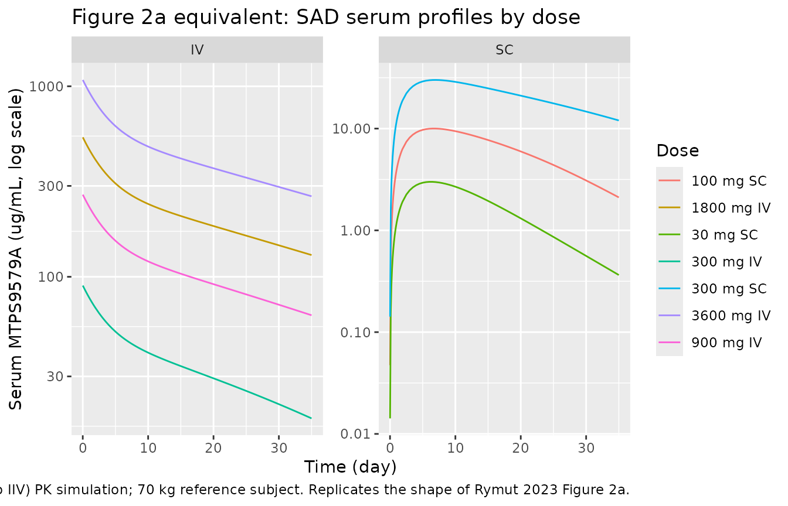
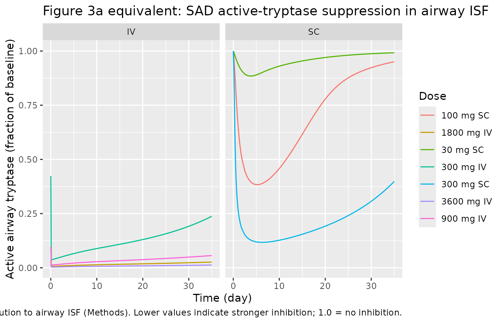
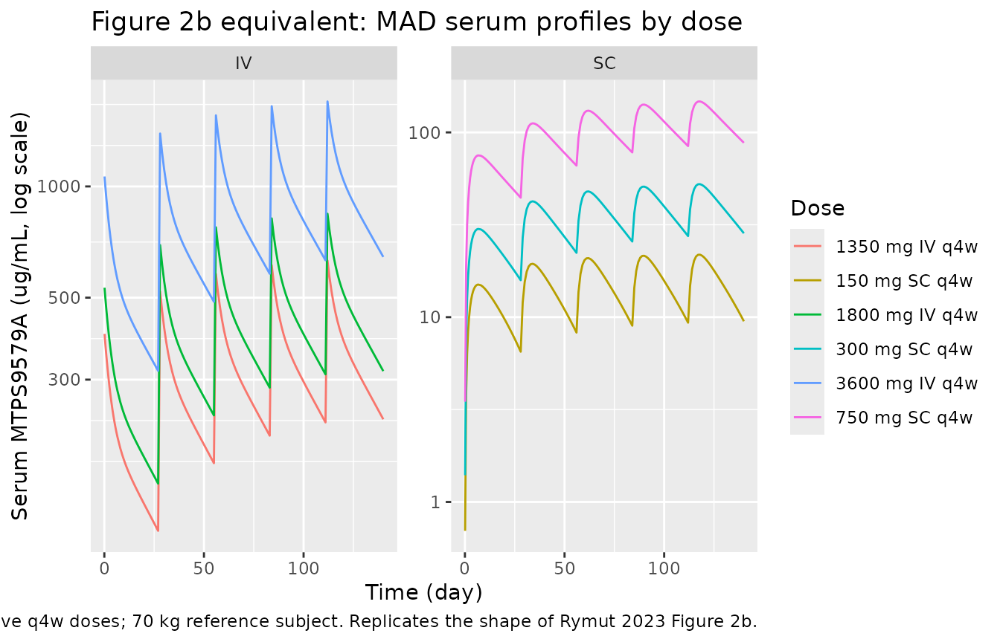
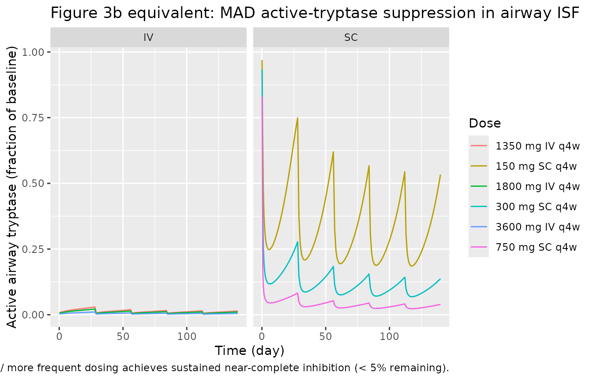

# Anti-tryptase MTPS9579A (Rymut 2023)

``` r

library(nlmixr2lib)
library(rxode2)
#> rxode2 5.1.2 using 2 threads (see ?getRxThreads)
#>   no cache: create with `rxCreateCache()`
library(dplyr)
#> 
#> Attaching package: 'dplyr'
#> The following objects are masked from 'package:stats':
#> 
#>     filter, lag
#> The following objects are masked from 'package:base':
#> 
#>     intersect, setdiff, setequal, union
library(tidyr)
library(ggplot2)
library(PKNCA)
#> 
#> Attaching package: 'PKNCA'
#> The following object is masked from 'package:stats':
#> 
#>     filter
```

## MTPS9579A serum + airway mechanistic PK/PD model

MTPS9579A is a humanized IgG4 monoclonal antibody that inhibits the
serine protease tryptase by binding both monomeric tryptase (the
predominant form in serum) and active tetrameric tryptase (the
predominant form in the airway) with sub-nanomolar affinity and rapidly
disrupting the active tetramer into inactive monomers. Rymut et
al. (2023) developed a two-layer mechanistic population PK/PD model from
a Phase 1 healthy-subject study (n = 106) and applied it prospectively
to forecast active-tryptase suppression in adults with
moderate-to-severe asthma:

1.  A **systemic two-compartment quasi-equilibrium (QE) target-mediated
    drug-disposition (TMDD) model** in NONMEM 7.4.3 (SAEM) fits the
    serum MTPS9579A and serum total-tryptase data jointly with body
    weight as an allometric covariate on linear CL and central volume
    (Table 1, Text S1; OFV = 7593.39).
2.  A **mechanistic airway-tissue compartment** layered on top of the
    systemic model receives free mAb and mAb-monomer complex from
    circulation via lymph flow with vascular reflection coefficients
    (Text S2 mrgsolve). In the airway interstitial fluid (ISF), tryptase
    is secreted as the active tetramer, spontaneously dissociates into
    inactive monomers, and is rapidly disrupted when bound by MTPS9579A
    (kbreak); free mAb binds both tetramer and monomer with the same KD.

The packaged model combines both layers into a single nine-state ODE
system with the systemic parameters estimated and the airway parameters
fixed from physiological literature and a healthy-subject visual fit of
the upper-airway biodistribution coefficient at 3% (Methods + Figure 4 +
Figure S2).

- Citation: Rymut SM, Henderson LM, Poon V, Staton TL, Cai F, Sukumaran
  S, Rhee H, Owen R, Ramanujan S, Yoshida K. A mechanistic PK/PD model
  to enable dose selection of the potent anti-tryptase antibody
  (MTPS9579A) in patients with moderate-to-severe asthma. Clin Transl
  Sci. 2023;16(4):694-703. <doi:10.1111/cts.13483>
- Article: <https://doi.org/10.1111/cts.13483>

## Population

The model-building dataset is a Phase 1 single + multiple ascending dose
study of MTPS9579A in 106 healthy adults (Methods):

- Single-ascending-dose (SAD) cohorts: 30, 100, 300 mg SC and 300, 900,
  1800, 3600 mg IV (single dose).
- Multiple-ascending-dose (MAD) cohorts: 150, 300, 750 mg SC and 1350,
  1800, 3600 mg IV every 4 weeks (q4w).
- Body weight: 49.9-113.3 kg (SAD) and 47.1-97.7 kg (MAD); reference 70
  kg in the allometric model.

Prospective simulations of moderate-to-severe asthma used an independent
observational cohort of n = 15 adults (mean age 42.7 years, 100% White,
26.7% female; Table S1) whose nasosorption samples established the
elevated baseline-tryptase constants (serum total tryptase 10 ng/mL vs 7
ng/mL in healthy; nasal active tryptase 4 ng/mL vs 0.4 ng/mL in healthy;
nasal total tryptase 140 ng/mL vs 12 ng/mL in healthy; Figure 5). These
observational data did not contribute to parameter estimation.

The same metadata is available programmatically through
`readModelDb("Rymut_2023_anti_tryptase")$population`.

## Source trace

Per-parameter origin is recorded as in-file comments next to each
[`ini()`](https://nlmixr2.github.io/rxode2/reference/ini.html) entry in
`inst/modeldb/specificDrugs/Rymut_2023_anti_tryptase.R`. The table
collects them for review.

| Equation / parameter | Value (paper) | Value (file) | Source |
|----|----|----|----|
| `lka` (SC absorption rate) | 0.239 1/day | log(0.239) 1/day | Table 1 |
| `lcl` (linear clearance at 70 kg) | 0.128 L/day | log(0.128) L/day | Table 1 |
| `lvc` (central volume V2 at 70 kg) | 3.33 L | log(3.33) L | Table 1 |
| `lq` (inter-compartmental clearance) | 0.408 L/day | log(0.408) L/day | Table 1 |
| `lvp` (peripheral volume V3) | 2.28 L | log(2.28) L | Table 1 |
| `lfdepot` (SC bioavailability Fsc) | 0.661 | log(0.661) | Table 1 |
| `lkss` (QE dissociation constant Kss = KD) | 0.0448 nM | log(0.0448) nM | Table 1 |
| `lbase` (baseline total serum tryptase) | 0.223 nM | log(0.223) nM | Table 1 |
| `lkdeg` (tryptase degradation rate) | 20.7 1/day | log(20.7) 1/day | Table 1 |
| `lclint` (internalisation clearance of mAb-tryptase complex) | 0.398 L/day | log(0.398) L/day | Table 1 |
| `e_wt_cl` (allometric exponent of WT/70 on CL) | 0.820 (RSE 23%) | 0.820 | Table 1 |
| `e_wt_vc` (allometric exponent of WT/70 on Vc) | 0.808 (RSE 18%) | 0.808 | Table 1 |
| `etalka` | omega^2 = 0.214 | 0.214 | Table 1 |
| `etalcl + etalvc` BLOCK(2) | var_CL = 0.0809, cov = 0.0342, var_Vc = 0.0387 | c(0.0809, 0.0342, 0.0387) | Table 1 + Text S1 |
| `etalbase` | omega^2 = 0.197 | 0.197 | Table 1 |
| `etalkdeg` | omega^2 = 0.103 | 0.103 | Table 1 |
| `etalclint` | omega^2 = 0.135 | 0.135 | Table 1 |
| `propSd` (proportional residual on serum MTPS9579A) | 0.103 | 0.103 | Table 1 |
| `addSd` (additive residual on serum MTPS9579A; thetarized with SIGMA = 1) | 2.72 nM (NONMEM units) | 2.72 \* 155 / 1000 = 0.4216 ug/mL | Table 1 (unit-converted) |
| `propSd_TotalSerumTryptase` | 0.245 | 0.245 | Table 1 |
| `kp_free` / `kp_bound` (biodistribution coefficient to airway ISF) | 3% (visual best fit) | fixed(0.03) | Methods + Figure 4 + Figure S2 |
| `refl_lymph` (lymphatic reflection coefficient) | 0.2 | fixed(0.2) | Table S2 (Shah and Betts 2012) |
| `klf_tissue` (ISF lymph turnover) | 1.2 1/h | fixed(1.2 \* 24) 1/day | Table S2; Methods (0.2% of 182 L/h / 0.3 L) |
| `bl_tryptase_isf` (baseline ISF total tryptase, healthy) | 40 ng/mL | fixed(40) ng/mL | Table S2 |
| `kel_tryp_isf` (tryptase elim rate; t1/2 = 2 h) | 8.31 1/day | fixed(log(2)/(2/24)) | Methods + Table S2 |
| `kdiss_tet_isf` (spontaneous tetramer dissociation; t1/2 = 30 min) | 33 1/day | fixed(log(2)/(0.5/24)) | Methods (also Table S2 by terminal half-life) |
| `sum_kel_isf` / `f_tet_isf` (precomputed kel + kdiss and kel/(kel+kdiss)) | derived | fixed (numeric) | Rate-balance partition (Text S2) |
| `kbreak_tet` (mAb-induced tetramer disruption; t1/2 = 1 min) | 1000 1/day | fixed(1000) | Methods + Table S2 |
| `kel_mono_ab` (monomer-mAb complex elim; t1/2 = 100 h) | log(2)/(100/24) 1/day | fixed(log(2)/(100/24)) | Table S2 (assumed) |
| `kon_isf` (mAb-tryptase association rate) | 7.62e5 1/M/s | fixed(7.62e5/1e9\*86400) 1/nM/day | Table S2 (in vitro) |
| `kd_isf` (equilibrium dissociation constant in ISF) | 0.0448 nM (= serum Kss) | fixed(0.0448) | Table S2 (4.88e-11 M) and Table 1 |
| `mw_ab` / `mw_mono` / `mw_tet` | 155 / 32 / 128 ug/nmol | fixed | Text S2 mrgsolve constants |
| Eq. d/dt(central) = ka \* depot + Q \* (peripheral1/Vp) - Q \* cfree - CL \* cfree - CLint \* total_target \* cfree / (Kss + cfree) | n/a | n/a | Text S1 NONMEM \$DES |
| Eq. d/dt(total_target) = ksyn - kdeg \* total_target - (CLint/Vc - kdeg) \* cfree \* total_target / (Kss + cfree) | n/a | n/a | Text S1 NONMEM \$DES |
| Eq. d/dt(mab_isf) = klf \* (1 - refl_free) \* cfree - klf \* (1 - refl_lymph) \* mab_isf - kon \* mab_isf \* (target_isf + monomer_isf) + koff \* (complex_isf + complex_monomer_isf) | n/a | n/a | Text S2 mrgsolve \$ODE |
| Eq. d/dt(target_isf) = vin_tryp - kel \* target_isf - kdiss \* target_isf - kon \* mab_isf \* target_isf + koff \* complex_isf | n/a | n/a | Text S2 mrgsolve \$ODE |
| Eq. d/dt(complex_isf) = kon \* mab_isf \* target_isf - koff \* complex_isf - kbreak \* complex_isf | n/a | n/a | Text S2 mrgsolve \$ODE |
| Eq. d/dt(monomer_isf) = -kel \* monomer_isf - kon \* mab_isf \* monomer_isf + koff \* complex_monomer_isf + 3 \* kbreak \* complex_isf + 4 \* kdiss \* target_isf | n/a | n/a | Text S2 mrgsolve \$ODE |
| Eq. d/dt(complex_monomer_isf) = kon \* mab_isf \* monomer_isf - koff \* complex_monomer_isf + kbreak \* complex_isf - kel_mono_ab \* complex_monomer_isf + klf \* (1 - refl_bound) \* cbound - klf \* (1 - refl_lymph) \* complex_monomer_isf | n/a | n/a | Text S2 mrgsolve \$ODE |
| QE-TMDD free drug quadratic: cfree = 1/2 \* ((ctot - total_target - Kss) + sqrt((ctot - total_target - Kss)^2 + 4 \* Kss \* ctot)) | n/a | n/a | Text S1 NONMEM \$DES |

## Virtual cohort and simulation

The published Phase 1 subject-level concentration data are not publicly
available; the simulation below reproduces the typical-value PK/PD
trajectories of Figure 2 (serum) and Figure 3 (airway active tryptase)
at the body-weight reference (70 kg). Between-subject variability is
zeroed out via
[`rxode2::zeroRe()`](https://nlmixr2.github.io/rxode2/reference/zeroRe.html)
so each dose level is represented by its typical-value response.

``` r

mod <- rxode2::rxode(readModelDb("Rymut_2023_anti_tryptase"))
#> ℹ parameter labels from comments will be replaced by 'label()'
mod_t <- rxode2::zeroRe(mod)
```

``` r

# Helper: build a single-cohort event table (one dose level, one route).
# Dosing into cmt = "depot" for SC; cmt = "central" for IV. Sample times
# in days. WT is supplied as a covariate column.
make_cohort <- function(dose_mg, route = c("SC", "IV"), n_doses = 1L,
                        ii_days = 28, sample_grid,
                        wt_kg = 70, id_offset = 0L) {
  route <- match.arg(route)
  cmt_dose <- if (route == "SC") "depot" else "central"
  dose_times <- seq(0, by = ii_days, length.out = n_doses)
  dose_rows <- data.frame(
    id   = id_offset + 1L,
    time = dose_times,
    amt  = dose_mg,
    evid = 1,
    cmt  = cmt_dose,
    WT   = wt_kg,
    dose_mg  = dose_mg,
    route    = route,
    n_doses  = n_doses,
    treatment = sprintf("%d mg %s%s", dose_mg, route,
                        if (n_doses > 1) " q4w" else "")
  )
  obs_rows <- data.frame(
    id   = id_offset + 1L,
    time = sample_grid,
    amt  = 0,
    evid = 0,
    cmt  = "Cc",
    WT   = wt_kg,
    dose_mg  = dose_mg,
    route    = route,
    n_doses  = n_doses,
    treatment = sprintf("%d mg %s%s", dose_mg, route,
                        if (n_doses > 1) " q4w" else "")
  )
  dplyr::bind_rows(dose_rows, obs_rows)
}
```

### Single-dose SAD simulation (Figure 2a + Figure 3a)

``` r

sad_doses_sc <- list(c(30, "SC"), c(100, "SC"), c(300, "SC"))
sad_doses_iv <- list(c(300, "IV"), c(900, "IV"), c(1800, "IV"), c(3600, "IV"))
sad_doses    <- c(sad_doses_sc, sad_doses_iv)

# Observation grid: dense up to 35 days post first dose to mirror Figure 2a/3a
sad_grid <- c(seq(0.01, 2, by = 0.1), seq(2.5, 35, by = 0.5))

sad_events <- dplyr::bind_rows(lapply(seq_along(sad_doses), function(i) {
  d <- sad_doses[[i]]
  make_cohort(dose_mg = as.numeric(d[1]), route = d[2], n_doses = 1L,
              sample_grid = sad_grid, id_offset = (i - 1L) * 1L)
}))

# rxSolve treats id as the subject key; the multi-cohort id_offset above
# ensures distinct subject ids per dose group so concentrations are not
# inadvertently summed.
stopifnot(!anyDuplicated(unique(sad_events[, c("id", "time", "evid")])))

sad_sim <- rxode2::rxSolve(
  mod_t, events = sad_events,
  keep = c("dose_mg", "route", "treatment")
) |> as.data.frame()
#> ℹ omega/sigma items treated as zero: 'etalka', 'etalcl', 'etalvc', 'etalbase', 'etalkdeg', 'etalclint'
#> Warning: multi-subject simulation without without 'omega'

# Serum MTPS9579A (Figure 2a). Use log y to match the published scale.
ggplot(sad_sim,
       aes(time, pmax(Cc, 1e-3), colour = treatment)) +
  geom_line() +
  scale_y_log10() +
  facet_wrap(~ route, scales = "free_y") +
  labs(x = "Time (day)", y = "Serum MTPS9579A (ug/mL, log scale)",
       title = "Figure 2a equivalent: SAD serum profiles by dose",
       colour = "Dose",
       caption = "Typical-value (no IIV) PK simulation; 70 kg reference subject. Replicates the shape of Rymut 2023 Figure 2a.")
```



``` r

# Active airway tryptase (Figure 3a) -- relative to baseline.
ggplot(sad_sim,
       aes(time, ActiveAirwayTryptase, colour = treatment)) +
  geom_line() +
  facet_wrap(~ route) +
  labs(x = "Time (day)", y = "Active airway tryptase (fraction of baseline)",
       title = "Figure 3a equivalent: SAD active-tryptase suppression in airway ISF",
       colour = "Dose",
       caption = "Kp = 3% biodistribution to airway ISF (Methods). Lower values indicate stronger inhibition; 1.0 = no inhibition.")
```



### Multiple-dose MAD simulation (Figure 2b + Figure 3b)

``` r

mad_doses <- list(
  c(150,  "SC"), c(300,  "SC"), c(750,  "SC"),
  c(1350, "IV"), c(1800, "IV"), c(3600, "IV")
)

# Five q4w doses over 140 days, dense sampling to capture the full multiple-
# dose accumulation envelope used in Rymut 2023 Figure 2b / Figure 3b.
mad_grid <- c(seq(0.1, 7, by = 0.5), seq(8, 140, by = 1))

mad_events <- dplyr::bind_rows(lapply(seq_along(mad_doses), function(i) {
  d <- mad_doses[[i]]
  make_cohort(dose_mg = as.numeric(d[1]), route = d[2], n_doses = 5L,
              ii_days = 28, sample_grid = mad_grid,
              id_offset = (i - 1L) * 1L)
}))
stopifnot(!anyDuplicated(unique(mad_events[, c("id", "time", "evid")])))

mad_sim <- rxode2::rxSolve(
  mod_t, events = mad_events,
  keep = c("dose_mg", "route", "treatment")
) |> as.data.frame()
#> ℹ omega/sigma items treated as zero: 'etalka', 'etalcl', 'etalvc', 'etalbase', 'etalkdeg', 'etalclint'
#> Warning: multi-subject simulation without without 'omega'

ggplot(mad_sim,
       aes(time, pmax(Cc, 1e-3), colour = treatment)) +
  geom_line() +
  scale_y_log10() +
  facet_wrap(~ route, scales = "free_y") +
  labs(x = "Time (day)", y = "Serum MTPS9579A (ug/mL, log scale)",
       title = "Figure 2b equivalent: MAD serum profiles by dose",
       colour = "Dose",
       caption = "Five q4w doses; 70 kg reference subject. Replicates the shape of Rymut 2023 Figure 2b.")
```



``` r

ggplot(mad_sim,
       aes(time, ActiveAirwayTryptase, colour = treatment)) +
  geom_line() +
  facet_wrap(~ route) +
  labs(x = "Time (day)", y = "Active airway tryptase (fraction of baseline)",
       title = "Figure 3b equivalent: MAD active-tryptase suppression in airway ISF",
       colour = "Dose",
       caption = "Higher / more frequent dosing achieves sustained near-complete inhibition (< 5% remaining).")
```



## Comparison against published Table 2

Rymut 2023 Table 2 reports model-based percentage inhibition of active
airway tryptase at the steady-state trough concentration for adults with
moderate-to-severe asthma. The asthma scenario differs from the healthy
fit in two ways: the baseline ISF total tryptase is 3.5x larger (40
ng/mL healthy -\> 140 ng/mL asthma per Figure 5b) and the baseline serum
tryptase is 1.5x larger (0.223 nM -\> 0.335 nM per Figure 5c, Methods).
Both are overrideable parameters on the loaded model.

``` r

# Override baseline tryptase to the asthma values per Methods + Figure 5b/5c.
# `bl_tryptase_isf` is the airway baseline (ng/mL). `lbase` is the systemic
# baseline (log nM); 1.5x = log(0.223 * 1.5) = log(0.3345). rxSolve replaces
# the entire parameter vector when `params` is supplied, so we start from the
# typical-value theta of mod_t and overwrite only the two asthma-specific
# baselines.
asthma_pars <- mod_t$theta
asthma_pars["bl_tryptase_isf"] <- 140
asthma_pars["lbase"]           <- log(0.223 * 1.5)

# Build a single 5-dose q4w regimen per Table 2 row; sample trough only
# at the start of cycle 5 (day 112, just before the cycle-5 dose).
table2_doses <- list(
  c(300,  "SC"), c(600,  "SC"),
  c(900,  "IV"), c(1800, "IV"), c(3600, "IV")
)

trough_grid <- c(seq(0.1, 7, by = 1), seq(28, 140, by = 1))
table2_events <- dplyr::bind_rows(lapply(seq_along(table2_doses), function(i) {
  d <- table2_doses[[i]]
  make_cohort(dose_mg = as.numeric(d[1]), route = d[2], n_doses = 5L,
              ii_days = 28, sample_grid = trough_grid,
              id_offset = (i - 1L) * 1L)
}))
stopifnot(!anyDuplicated(unique(table2_events[, c("id", "time", "evid")])))

# Apply parameter overrides through rxSolve(..., params = ...).
table2_sim <- rxode2::rxSolve(
  mod_t, events = table2_events,
  params = asthma_pars,
  keep = c("dose_mg", "route", "treatment")
) |> as.data.frame()
#> ℹ omega/sigma items treated as zero: 'etalka', 'etalcl', 'etalvc', 'etalbase', 'etalkdeg', 'etalclint'
#> Warning: multi-subject simulation without without 'omega'

# Trough = lowest ActiveAirwayTryptase in the final dosing interval (days 112-140).
trough <- table2_sim |>
  dplyr::filter(time >= 112, time <= 140) |>
  dplyr::group_by(treatment) |>
  dplyr::summarise(
    trough_active_frac = min(ActiveAirwayTryptase, na.rm = TRUE),
    .groups = "drop"
  ) |>
  dplyr::mutate(
    pct_inhibition_sim   = 100 * (1 - trough_active_frac),
    pct_inhibition_paper = c(`300 mg SC q4w` = 79.2, `600 mg SC q4w` = 94.0,
                             `900 mg IV q4w` = 97.6, `1800 mg IV q4w` = 98.9,
                             `3600 mg IV q4w` = 99.5)[treatment]
  ) |>
  dplyr::select(treatment, pct_inhibition_paper, pct_inhibition_sim)
knitr::kable(trough, digits = 2,
             caption = "Steady-state active-tryptase inhibition (%) in asthma at the lowest concentration of dosing interval 5; simulated values vs Rymut 2023 Table 2 (no-exacerbation column).")
```

| treatment      | pct_inhibition_paper | pct_inhibition_sim |
|:---------------|---------------------:|-------------------:|
| 1800 mg IV q4w |                 98.9 |              99.56 |
| 300 mg SC q4w  |                 79.2 |              90.41 |
| 3600 mg IV q4w |                 99.5 |              99.78 |
| 600 mg SC q4w  |                 94.0 |              96.60 |
| 900 mg IV q4w  |                 97.6 |              99.08 |

Steady-state active-tryptase inhibition (%) in asthma at the lowest
concentration of dosing interval 5; simulated values vs Rymut 2023 Table
2 (no-exacerbation column). {.table}

## PKNCA validation

Run PKNCA on the simulated serum MTPS9579A SAD profiles for non-
compartmental confirmation that the structural disposition matches
typical mAb behaviour (slow CL, two-compartment back-extrapolated
half-life on the order of weeks at supra-saturation doses).

``` r

sad_nca_input <- sad_sim |>
  dplyr::filter(!is.na(Cc))

conc_obj <- PKNCA::PKNCAconc(
  sad_nca_input,
  Cc ~ time | treatment + id
)

dose_df <- sad_events |>
  dplyr::filter(evid == 1) |>
  dplyr::select(id, time, amt, treatment)

dose_obj <- PKNCA::PKNCAdose(dose_df, amt ~ time | treatment + id)

intervals <- data.frame(
  start      = 0,
  end        = 35,
  cmax       = TRUE,
  tmax       = TRUE,
  auclast    = TRUE,
  half.life  = TRUE
)

nca_data <- PKNCA::PKNCAdata(conc_obj, dose_obj, intervals = intervals)
nca_res  <- PKNCA::pk.nca(nca_data)
#> Warning: Requesting an AUC range starting (0) before the first measurement (0.01) is not allowed
#> Requesting an AUC range starting (0) before the first measurement (0.01) is not allowed
#> Requesting an AUC range starting (0) before the first measurement (0.01) is not allowed
#> Requesting an AUC range starting (0) before the first measurement (0.01) is not allowed
#> Requesting an AUC range starting (0) before the first measurement (0.01) is not allowed
#> Requesting an AUC range starting (0) before the first measurement (0.01) is not allowed
#> Requesting an AUC range starting (0) before the first measurement (0.01) is not allowed
nca_summary <- as.data.frame(nca_res$result) |>
  dplyr::select(treatment, PPTESTCD, PPORRES) |>
  tidyr::pivot_wider(names_from = PPTESTCD, values_from = PPORRES)
knitr::kable(nca_summary, digits = 3,
             caption = "Simulated SAD NCA parameters by dose / route (typical-value PK; 0-35 day window).")
```

| treatment | auclast | cmax | tmax | tlast | lambda.z | r.squared | adj.r.squared | lambda.z.time.first | lambda.z.time.last | lambda.z.n.points | clast.pred | half.life | span.ratio |
|:---|---:|---:|---:|---:|---:|---:|---:|---:|---:|---:|---:|---:|---:|
| 100 mg SC | NA | 10.009 | 6.50 | 35 | 0.077 | 1 | 1 | 30.0 | 35 | 11 | 2.111 | 9.046 | 0.553 |
| 1800 mg IV | NA | 539.672 | 0.01 | 35 | 0.024 | 1 | 1 | 14.0 | 35 | 43 | 130.030 | 29.494 | 0.712 |
| 30 mg SC | NA | 2.996 | 6.50 | 35 | 0.085 | 1 | 1 | 17.5 | 35 | 36 | 0.366 | 8.142 | 2.149 |
| 300 mg IV | NA | 89.945 | 0.01 | 35 | 0.034 | 1 | 1 | 30.0 | 35 | 11 | 18.083 | 20.204 | 0.247 |
| 300 mg SC | NA | 30.052 | 7.00 | 35 | 0.041 | 1 | 1 | 31.5 | 35 | 8 | 12.026 | 17.007 | 0.206 |
| 3600 mg IV | NA | 1079.344 | 0.01 | 35 | 0.023 | 1 | 1 | 14.5 | 35 | 42 | 264.319 | 30.488 | 0.672 |
| 900 mg IV | NA | 269.836 | 0.01 | 35 | 0.025 | 1 | 1 | 12.5 | 35 | 46 | 62.900 | 27.650 | 0.814 |

Simulated SAD NCA parameters by dose / route (typical-value PK; 0-35 day
window). {.table}

## Assumptions and deviations

- **Biodistribution coefficient (Kp).** Rymut 2023 chose Kp = 3% as the
  visual best fit across SAD + MAD cohorts (Figure S2) and the observed
  nasal-lining-fluid:serum concentration ratio (Figure 4). The same Kp
  is used for free mAb and for the mAb-tryptase complex per Methods. The
  packaged model exposes `kp_free` and `kp_bound` as overrideable fixed
  parameters; users may rerun simulations at 1% or 10% (Figure S2) by
  passing alternate values via `rxSolve`’s
  `params = list(kp_free = 0.01, kp_bound = 0.01)` argument.

- **Asthma scenario via parameter overrides.** The fit cohort is
  healthy. To simulate adults with moderate-to-severe asthma the user
  overrides the two baseline-tryptase constants per Methods

  - Figure 5: `bl_tryptase_isf = 140` (airway total tryptase, ng/mL) and
    `lbase = log(0.223 * 1.5) = log(0.3345)` (systemic total tryptase,
    log nM). This is the recipe used to reproduce Table 2; no additional
    re-fitting was performed by the paper authors.

- **Exacerbation scenarios.** Rymut 2023 Table 2 columns 2-4 (10x, 100x,
  1000x tryptase) simulate an acute exacerbation by transiently scaling
  the tetramer production rate. The packaged model does not embed a
  time-window covariate for the exacerbation; users implement the
  scenario by overriding `bl_tryptase_isf` to the scaled value for the
  duration of the exacerbation window (e.g. via a time- varying
  covariate in the event table).

- **Active tryptase has no residual error.** The paper reports active
  airway tryptase only through visual comparison of model prediction vs
  nasosorption observations (Figure 3, Figure S2); the fit was not
  stochastic in this output. The packaged model emits
  `ActiveAirwayTryptase` as a derived ratio (no `~` error term) so that
  downstream users see a deterministic typical-value trajectory.

- **Unit conversion of the additive serum-mAb residual error.** The
  NONMEM TMDD model worked internally in nM (the dose AMT column was
  pre-converted from mg to nmol so that A(2)/V2 = Kss = Base units were
  aligned; Text S1 confirms Kss = 0.0448 nM and Base = 0.223 nM). The
  packaged model reports Cc in ug/mL to match Rymut 2023 Figure 2; the
  additive residual `addSd = 2.72` nM in the NONMEM output is therefore
  converted to ug/mL as `2.72 * 155 / 1000 = 0.4216` using mAb MW 155
  kDa (Text S2). The proportional residual `propSd = 0.103` and the
  serum total tryptase residual `propSd_TotalSerumTryptase = 0.245` are
  unitless fractions and transfer unchanged.

- **Convention deviations (compartments).** Three compartment names
  (`mab_isf`, `monomer_isf`, `complex_monomer_isf`) are not in the
  pre-existing `nlmixr2lib::compartments` register; they were added to
  `R/conventions.R` in this PR with rationale notes. The mAb- monomer
  complex and the free monomer in the ISF do not fit the pre-existing
  `target_<loc>` / `complex_<loc>` pattern because this model carries
  the target in two distinct oligomeric forms (active tetramer +
  inactive monomer) each with its own bound- complex state.

- **Convention deviations (parameter names).** The mechanistic
  parameters (`kss`, `kdeg`, `clint`, `base`, `kp_free`, `kp_bound`,
  `refl_lymph`, `klf_tissue`, `bl_tryptase_isf`, `kel_tryp_isf`,
  `kdiss_tet_isf`, `sum_kel_isf`, `f_tet_isf`, `kbreak_tet`,
  `kel_mono_ab`, `kon_isf`, `kd_isf`, `mw_ab`, `mw_mono`, `mw_tet`) are
  paper-named and may surface as convention warnings; they follow the
  same pattern used by `Hayashi_2007_omalizumab.R`,
  `PerezRuixo_2025_posdinemab.R`, and
  `Papachristos_2020_bevacizumab_qss.R`.

- **rxode2 parser workaround.** The rxode2 mu-reference parser flags
  `<ini_param> + <ini_param>` arithmetic in
  [`model()`](https://nlmixr2.github.io/rxode2/reference/model.html) as
  a between- subject-variability block declaration even when the line
  uses `<-`. The aggregate rate constants `sum_kel_isf` (=
  `kel + kdiss`) and the rate-balance fraction `f_tet_isf` (=
  `kel / (kel + kdiss)`) are therefore precomputed as fixed numerics in
  [`ini()`](https://nlmixr2.github.io/rxode2/reference/ini.html) rather
  than being assembled at simulation time from the two component rates.
  The numeric values are identical; the parameterisation is split only
  to bypass the parser ambiguity.
