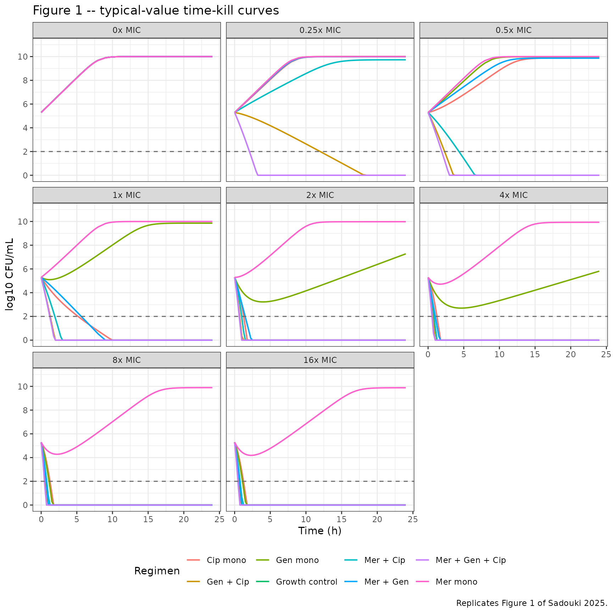
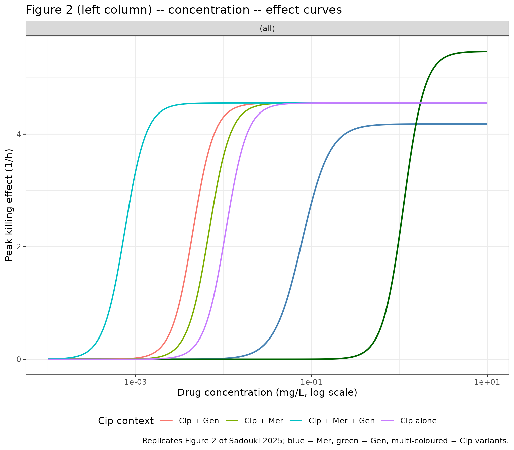
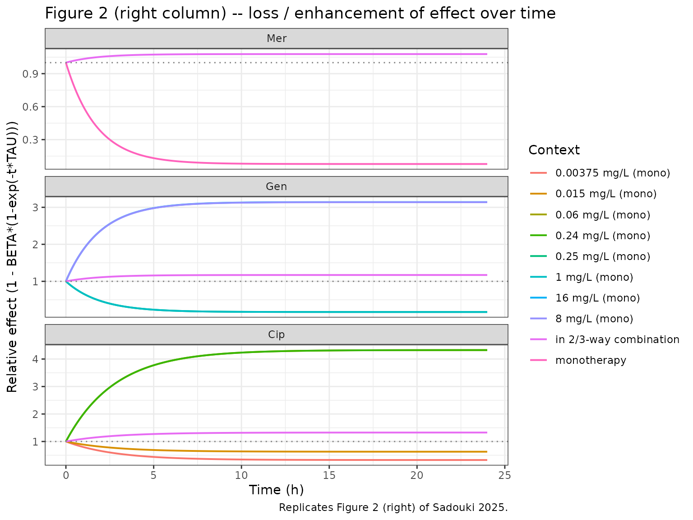

# Sadouki_2025_meropenem_gentamicin_ciprofloxacin

## Model and source

``` r

mod_fun <- readModelDb("Sadouki_2025_meropenem_gentamicin_ciprofloxacin")
mod     <- mod_fun()
cat(mod$description, "\n\n", mod$reference, "\n", sep = "")
#> In-vitro static-time-kill pharmacodynamic model for two- and three-way combinations of meropenem, gentamicin, and ciprofloxacin against Escherichia coli NCTC 12,241. Logistic bacterial growth (knet, Bmax) is killed by an Emax-Hill function for each drug; emergence of regrowth is captured by a time-decay term parameterised by BETA (loss of effect) and TAU (time-shape). Meropenem chemical degradation in CAMHB at 37.5 C is embedded as a first-order decay of the meropenem solution concentration. Drug-drug interactions are encoded as: a fixed -1 categorical shift on BETA whenever a 2- or 3-way combination is present (so the regrowth term reverses sign and effect is sustained), proportional reductions of -0.353 and -0.576 in ciprofloxacin IC50 in the presence of meropenem and gentamicin respectively (synergy on potency), and concentration-dependent Emax shifts of BETA for gentamicin and ciprofloxacin. The model is in-vitro PD only -- there is no human or animal PK component; bacterial counts (CFU/mL) are observed on log scale.
#> 
#> Sadouki Z, Wey EQ, Read L, Bayliss M, Noel A, Balakrishnan I, McHugh TD, Kloprogge F. Pharmacodynamic interactions among meropenem ciprofloxacin and gentamicin in an in-vitro model. Sci Rep. 2025 Nov 24;15:45244. doi:10.1038/s41598-025-29354-y.
```

- Article: <https://doi.org/10.1038/s41598-025-29354-y> (Open Access, CC
  BY 4.0)

This is an **in-vitro pharmacodynamic** model. It is included in
`nlmixr2lib` for reference only; unlike the rest of the library it does
not describe drug exposure in humans or animals. The “subjects” in the
source study are bacterial cultures, and random effects (eta) capture
between-experiment variability rather than between-subject IIV. See
“Assumptions and deviations” at the end of this vignette for the full
list of ways this model departs from the human-pop-PK conventions used
elsewhere in nlmixr2lib.

## Biological context

The source data are from static time-kill experiments against
*Escherichia coli* NCTC 12,241 in 96-well plates (200 uL CAMHB, 37.5 C,
24 h). Eight scaled-MIC levels (0.25, 0.5, 1, 2, 4, 8, 16 x MIC, plus an
antibiotic-free growth control) were tested for each of seven regimens:
three monotherapies (meropenem, gentamicin, ciprofloxacin), three
two-way combinations, and the three-way combination. Two starting
inoculum levels (10^3 and 10^5 CFU/mL) were studied; the lower inoculum
reduces the estimated B0 and Bmax of the logistic growth model.

The experiment-level MICs (used to scale tested concentrations) were
0.03 mg/L for meropenem, 0.015 mg/L for ciprofloxacin, and 1 mg/L for
gentamicin (Sadouki 2025 Methods, Static time-kill experiments).

The full population/experimental metadata is available programmatically:

``` r

mod$population
#> $n_subjects
#> [1] NA
#> 
#> $n_studies
#> [1] 1
#> 
#> $organism
#> [1] "Escherichia coli NCTC 12,241 (susceptible laboratory reference strain)"
#> 
#> $system
#> [1] "Static time-kill in 96-well plates, total volume 200 uL, biological duplicates with technical triplicates"
#> 
#> $medium
#> [1] "Cation-adjusted Mueller-Hinton broth (CAMHB)"
#> 
#> $temperature
#> [1] "37.5 C"
#> 
#> $duration
#> [1] "24 h, with hourly sampling for the first 8 h and at 24 h"
#> 
#> $mic_values
#>     meropenem ciprofloxacin    gentamicin 
#>   "0.03 mg/L"  "0.015 mg/L"      "1 mg/L" 
#> 
#> $concentration_range
#> [1] "0.25 to 16 x MIC for each drug"
#> 
#> $inoculum_options
#> [1] "10^3 CFU/mL (low)"      "10^5 CFU/mL (standard)"
#> 
#> $regimens
#> [1] "Seven antibiotic-containing regimens: monotherapy (Mer, Gen, Cip), two-way combinations (Mer+Gen, Mer+Cip, Gen+Cip), three-way combination (Mer+Gen+Cip), plus antibiotic-free growth controls"
#> 
#> $notes
#> [1] "In-vitro pharmacodynamic study; no human or animal subjects. Random effects (eta) in the structural model represent variability *between experimental replicates*, not between-subject IIV. CFU were enumerated on Mueller-Hinton agar (and on 2x and 8x MIC supplemented agar at 24 h to detect resistant subpopulations). See Sadouki 2025 Methods (page 2) and Figure 1 for the experimental design."
```

## Source trace

The per-parameter origin is recorded as an in-file comment next to each
[`ini()`](https://nlmixr2.github.io/rxode2/reference/ini.html) entry in
`inst/modeldb/pharmacodynamics/Sadouki_2025_meropenem_gentamicin_ciprofloxacin.R`.
The table below collects them in one place.

| Equation / parameter | Value | Source location |
|----|----|----|
| Growth: `dB/dt = (knet*(1 - B/10^Bmax) - sum_drug Effect) * B` | n/a | Methods, Pharmacodynamic modelling (page 2 – 3) |
| Drug effect: `Effect_drug = Emax * C^h / (IC50^h + C^h) * (1 - beta*(1 - exp(-t*tau)))` | n/a | Methods, Pharmacodynamic modelling (page 3) |
| Mer chemical degradation: `dCmer/dt = -kdeg * Cmer` | n/a | Methods, Pharmacodynamic modelling (page 2) |
| `knet` | 1.35 | Table 1 – Growth model parameters |
| `B0` | 5.29 log10 CFU/mL | Table 1 |
| `Bmax` | 10 log10 CFU/mL | Table 1 |
| `cat_b0_lowinoc` | -0.326 | Table 1 – Inoculum effect |
| `cat_bmax_lowinoc` | -0.110 | Table 1 – Inoculum effect |
| `Emax_Mer`, `IC50_Mer`, `hill_Mer` | 4.18, 0.0781, 2.76 | Table 1 – Meropenem killing |
| `BETA_Mer`, `TAU_Mer` (FIXED) | 0.922, 0.570 | Table 1 – Meropenem regrowth |
| `coef_taumer_Mer` | 0.00155 per mg/L Mer | Table 1 – Proportional MER on TAU |
| `kdeg_Mer` (derived; FIXED) | 0.01317 1/h | Discussion (page 7): “10% drop in 8 h” + Suppl. Fig. 3 |
| `Emax_Gen`, `IC50_Gen`, `hill_Gen` | 5.47, 1.12, 3.63 | Table 1 – Gentamicin killing |
| `BETA_Gen`, `TAU_Gen` (FIXED) | 0.829, 0.517 | Table 1 – Gentamicin regrowth |
| `Emax_BetaGen`, `IC50_BetaGen`, `hill_BetaGen` (FIXED) | -2.97, 5.72, 20 | Table 1 – Emax-on-BETA-Gen |
| `Emax_Cip`, `IC50_Cip`, `hill_Cip` | 4.55, 0.0106, 3.58 | Table 1 – Ciprofloxacin killing |
| `BETA_Cip`, `TAU_Cip` (FIXED) | 0.674, 0.359 | Table 1 – Ciprofloxacin regrowth |
| `Emax_BetaCip`, `IC50_BetaCip`, `hill_BetaCip` (FIXED) | -4, 0.017, 20 | Table 1 – Emax-on-BETA-Cip |
| `combo_beta` (FIXED) | -1 | Table 1 – Drug interactions, categorical 2/3-way effect |
| `mer_on_ic50cip`, `gen_on_ic50cip` (FIXED) | -0.353, -0.576 | Table 1 – Drug interactions, proportional effects on Cip IC50 |
| Residual error: additive on log(bacteria) | 0.864 | Table 1 – Residual variability |

## Virtual experimental grid

The scenarios reproduce the panels of Sadouki 2025 Figure 1: seven
antibiotic-containing regimens at eight scaled MIC levels (0 = growth
control through 16 x MIC). Standard inoculum (10^5 CFU/mL).

``` r

mic <- c(meropenem = 0.03, ciprofloxacin = 0.015, gentamicin = 1)

mic_levels <- c(0, 0.25, 0.5, 1, 2, 4, 8, 16)

regimens <- tibble(
  regimen = c("Growth control",
              "Mer mono", "Gen mono", "Cip mono",
              "Mer + Gen", "Mer + Cip", "Gen + Cip",
              "Mer + Gen + Cip"),
  mer_in  = c(0L, 1L, 0L, 0L, 1L, 1L, 0L, 1L),
  gen_in  = c(0L, 0L, 1L, 0L, 1L, 0L, 1L, 1L),
  cip_in  = c(0L, 0L, 0L, 1L, 0L, 1L, 1L, 1L)
)

scenarios <- tidyr::expand_grid(regimens, mic_mult = mic_levels) |>
  filter(!(regimen == "Growth control" & mic_mult > 0)) |>
  mutate(
    Cmer_init = mer_in * mic_mult * mic[["meropenem"]],
    Cgen      = gen_in * mic_mult * mic[["gentamicin"]],
    Ccip      = cip_in * mic_mult * mic[["ciprofloxacin"]],
    id        = dplyr::row_number()
  )

knitr::kable(scenarios, caption = "Virtual experimental grid (one row per simulation cohort).")
```

| regimen         | mer_in | gen_in | cip_in | mic_mult | Cmer_init |  Cgen |    Ccip |  id |
|:----------------|-------:|-------:|-------:|---------:|----------:|------:|--------:|----:|
| Growth control  |      0 |      0 |      0 |     0.00 |    0.0000 |  0.00 | 0.00000 |   1 |
| Mer mono        |      1 |      0 |      0 |     0.00 |    0.0000 |  0.00 | 0.00000 |   2 |
| Mer mono        |      1 |      0 |      0 |     0.25 |    0.0075 |  0.00 | 0.00000 |   3 |
| Mer mono        |      1 |      0 |      0 |     0.50 |    0.0150 |  0.00 | 0.00000 |   4 |
| Mer mono        |      1 |      0 |      0 |     1.00 |    0.0300 |  0.00 | 0.00000 |   5 |
| Mer mono        |      1 |      0 |      0 |     2.00 |    0.0600 |  0.00 | 0.00000 |   6 |
| Mer mono        |      1 |      0 |      0 |     4.00 |    0.1200 |  0.00 | 0.00000 |   7 |
| Mer mono        |      1 |      0 |      0 |     8.00 |    0.2400 |  0.00 | 0.00000 |   8 |
| Mer mono        |      1 |      0 |      0 |    16.00 |    0.4800 |  0.00 | 0.00000 |   9 |
| Gen mono        |      0 |      1 |      0 |     0.00 |    0.0000 |  0.00 | 0.00000 |  10 |
| Gen mono        |      0 |      1 |      0 |     0.25 |    0.0000 |  0.25 | 0.00000 |  11 |
| Gen mono        |      0 |      1 |      0 |     0.50 |    0.0000 |  0.50 | 0.00000 |  12 |
| Gen mono        |      0 |      1 |      0 |     1.00 |    0.0000 |  1.00 | 0.00000 |  13 |
| Gen mono        |      0 |      1 |      0 |     2.00 |    0.0000 |  2.00 | 0.00000 |  14 |
| Gen mono        |      0 |      1 |      0 |     4.00 |    0.0000 |  4.00 | 0.00000 |  15 |
| Gen mono        |      0 |      1 |      0 |     8.00 |    0.0000 |  8.00 | 0.00000 |  16 |
| Gen mono        |      0 |      1 |      0 |    16.00 |    0.0000 | 16.00 | 0.00000 |  17 |
| Cip mono        |      0 |      0 |      1 |     0.00 |    0.0000 |  0.00 | 0.00000 |  18 |
| Cip mono        |      0 |      0 |      1 |     0.25 |    0.0000 |  0.00 | 0.00375 |  19 |
| Cip mono        |      0 |      0 |      1 |     0.50 |    0.0000 |  0.00 | 0.00750 |  20 |
| Cip mono        |      0 |      0 |      1 |     1.00 |    0.0000 |  0.00 | 0.01500 |  21 |
| Cip mono        |      0 |      0 |      1 |     2.00 |    0.0000 |  0.00 | 0.03000 |  22 |
| Cip mono        |      0 |      0 |      1 |     4.00 |    0.0000 |  0.00 | 0.06000 |  23 |
| Cip mono        |      0 |      0 |      1 |     8.00 |    0.0000 |  0.00 | 0.12000 |  24 |
| Cip mono        |      0 |      0 |      1 |    16.00 |    0.0000 |  0.00 | 0.24000 |  25 |
| Mer + Gen       |      1 |      1 |      0 |     0.00 |    0.0000 |  0.00 | 0.00000 |  26 |
| Mer + Gen       |      1 |      1 |      0 |     0.25 |    0.0075 |  0.25 | 0.00000 |  27 |
| Mer + Gen       |      1 |      1 |      0 |     0.50 |    0.0150 |  0.50 | 0.00000 |  28 |
| Mer + Gen       |      1 |      1 |      0 |     1.00 |    0.0300 |  1.00 | 0.00000 |  29 |
| Mer + Gen       |      1 |      1 |      0 |     2.00 |    0.0600 |  2.00 | 0.00000 |  30 |
| Mer + Gen       |      1 |      1 |      0 |     4.00 |    0.1200 |  4.00 | 0.00000 |  31 |
| Mer + Gen       |      1 |      1 |      0 |     8.00 |    0.2400 |  8.00 | 0.00000 |  32 |
| Mer + Gen       |      1 |      1 |      0 |    16.00 |    0.4800 | 16.00 | 0.00000 |  33 |
| Mer + Cip       |      1 |      0 |      1 |     0.00 |    0.0000 |  0.00 | 0.00000 |  34 |
| Mer + Cip       |      1 |      0 |      1 |     0.25 |    0.0075 |  0.00 | 0.00375 |  35 |
| Mer + Cip       |      1 |      0 |      1 |     0.50 |    0.0150 |  0.00 | 0.00750 |  36 |
| Mer + Cip       |      1 |      0 |      1 |     1.00 |    0.0300 |  0.00 | 0.01500 |  37 |
| Mer + Cip       |      1 |      0 |      1 |     2.00 |    0.0600 |  0.00 | 0.03000 |  38 |
| Mer + Cip       |      1 |      0 |      1 |     4.00 |    0.1200 |  0.00 | 0.06000 |  39 |
| Mer + Cip       |      1 |      0 |      1 |     8.00 |    0.2400 |  0.00 | 0.12000 |  40 |
| Mer + Cip       |      1 |      0 |      1 |    16.00 |    0.4800 |  0.00 | 0.24000 |  41 |
| Gen + Cip       |      0 |      1 |      1 |     0.00 |    0.0000 |  0.00 | 0.00000 |  42 |
| Gen + Cip       |      0 |      1 |      1 |     0.25 |    0.0000 |  0.25 | 0.00375 |  43 |
| Gen + Cip       |      0 |      1 |      1 |     0.50 |    0.0000 |  0.50 | 0.00750 |  44 |
| Gen + Cip       |      0 |      1 |      1 |     1.00 |    0.0000 |  1.00 | 0.01500 |  45 |
| Gen + Cip       |      0 |      1 |      1 |     2.00 |    0.0000 |  2.00 | 0.03000 |  46 |
| Gen + Cip       |      0 |      1 |      1 |     4.00 |    0.0000 |  4.00 | 0.06000 |  47 |
| Gen + Cip       |      0 |      1 |      1 |     8.00 |    0.0000 |  8.00 | 0.12000 |  48 |
| Gen + Cip       |      0 |      1 |      1 |    16.00 |    0.0000 | 16.00 | 0.24000 |  49 |
| Mer + Gen + Cip |      1 |      1 |      1 |     0.00 |    0.0000 |  0.00 | 0.00000 |  50 |
| Mer + Gen + Cip |      1 |      1 |      1 |     0.25 |    0.0075 |  0.25 | 0.00375 |  51 |
| Mer + Gen + Cip |      1 |      1 |      1 |     0.50 |    0.0150 |  0.50 | 0.00750 |  52 |
| Mer + Gen + Cip |      1 |      1 |      1 |     1.00 |    0.0300 |  1.00 | 0.01500 |  53 |
| Mer + Gen + Cip |      1 |      1 |      1 |     2.00 |    0.0600 |  2.00 | 0.03000 |  54 |
| Mer + Gen + Cip |      1 |      1 |      1 |     4.00 |    0.1200 |  4.00 | 0.06000 |  55 |
| Mer + Gen + Cip |      1 |      1 |      1 |     8.00 |    0.2400 |  8.00 | 0.12000 |  56 |
| Mer + Gen + Cip |      1 |      1 |      1 |    16.00 |    0.4800 | 16.00 | 0.24000 |  57 |

Virtual experimental grid (one row per simulation cohort). {.table}

## Simulation

Reproduce the published figures with typical-value (eta = 0)
trajectories. The model carries between-experiment etas for visual VPCs
but the published figures are typical-value predictions.

``` r

mod_typ <- rxode2::zeroRe(mod)

times <- c(seq(0, 8, by = 0.25), seq(9, 24, by = 0.5))

ev <- scenarios |>
  rowwise() |>
  do({
    sc <- .
    tibble(
      id   = sc$id,
      time = c(0, times),
      evid = c(1L, rep(0L, length(times))),
      amt  = c(sc$Cmer_init, rep(NA_real_, length(times))),
      cmt  = c("mer", rep(NA_character_, length(times))),
      MER_PRESENT = sc$mer_in,
      GEN_PRESENT = sc$gen_in,
      CIP_PRESENT = sc$cip_in,
      Cgen        = sc$Cgen,
      Ccip        = sc$Ccip,
      LOWINOC     = 0L,
      regimen     = sc$regimen,
      mic_mult    = sc$mic_mult
    )
  }) |>
  ungroup()

sim <- rxode2::rxSolve(
  mod_typ,
  events     = ev,
  keep       = c("regimen", "mic_mult", "MER_PRESENT", "GEN_PRESENT", "CIP_PRESENT",
                 "Cgen", "Ccip"),
  returnType = "data.frame"
) |>
  dplyr::as_tibble() |>
  dplyr::mutate(log10_bact = log10(pmax(bacteria, 1)))
#> ℹ omega/sigma items treated as zero: 'etalknet', 'etalemax_mer', 'etalic50_mer', 'etalhill_mer', 'etabeta_mer', 'etalemax_gen', 'etalhill_gen', 'etalemax_cip', 'etalic50_cip', 'etalhill_cip'
#> Warning: multi-subject simulation without without 'omega'
```

## Replicate Figure 1 – time-kill curves

Each panel of Figure 1 shows log10(CFU/mL) versus time across regimens
at one MIC multiple. The y-axis dashed line at 100 CFU/mL (= 10^2) is
the practical limit of detection.

``` r

fig1_data <- sim |>
  filter(time <= 24) |>
  mutate(panel = paste0(mic_mult, "x MIC"))

fig1_data$panel <- factor(
  fig1_data$panel,
  levels = c("0x MIC", "0.25x MIC", "0.5x MIC", "1x MIC",
             "2x MIC", "4x MIC", "8x MIC", "16x MIC")
)

ggplot(fig1_data, aes(time, log10_bact, colour = regimen)) +
  geom_line(linewidth = 0.7) +
  geom_hline(yintercept = 2, linetype = 2, colour = "grey40") +
  facet_wrap(~ panel, ncol = 3) +
  scale_y_continuous(limits = c(0, 11), breaks = seq(0, 10, by = 2)) +
  labs(
    x = "Time (h)",
    y = "log10 CFU/mL",
    colour = "Regimen",
    title = "Figure 1 -- typical-value time-kill curves",
    caption = "Replicates Figure 1 of Sadouki 2025."
  ) +
  theme_bw() +
  theme(legend.position = "bottom")
```



Sanity checks against Sadouki 2025 Figure 1:

- Growth control panel rises from B0 = 10^5.29 to the carrying capacity
  Bmax = 10^10 by 24 h.
- At 16 x MIC: the three-way (Cip + Gen + Mer) and two-way
  Cip-containing combinations clear bacteria below the limit of
  detection within 1 – 2 h and stay there; meropenem monotherapy kills
  early but regrowth emerges by 24 h (consistent with the unmodified
  BETA_Mer and the small meropenem chemical degradation).
- Gentamicin monotherapy at 8 – 16 x MIC kills sustainably (no regrowth)
  because the Emax-on-BETA-Gen term suppresses the regrowth shape at
  high Gen concentrations.
- Two-way Mer + Gen at high MIC matches Cip-containing combinations
  because the categorical -1 shift on BETA reverses regrowth in any
  2/3-way combination.

## Replicate Figure 2 – concentration – effect curves

Figure 2 left column: peak killing effect (Effect, 1/h) versus drug
concentration for each drug, separated by mono-therapy and combination
modifiers (combination changes IC50 for ciprofloxacin via the
proportional synergy terms).

``` r

peak_effect <- sim |>
  filter(time == 0) |>  # Effect at t = 0 isolates the Hill curve from the regrowth term
  select(regimen, mic_mult, MER_PRESENT, GEN_PRESENT, CIP_PRESENT,
         eff_mer, eff_gen, eff_cip)

# Hill curves -- peak Emax * C^h / (IC50^h + C^h)
conc_grid <- tibble(
  conc = exp(seq(log(1e-4), log(10), length.out = 200))
)

# Meropenem (constant across regimens for the peak-effect Hill curve)
hill_mer <- conc_grid |>
  mutate(
    eff = 4.18 * conc^2.76 / (0.0781^2.76 + conc^2.76),
    drug = "Meropenem"
  )

# Gentamicin
hill_gen <- conc_grid |>
  mutate(
    eff = 5.47 * conc^3.63 / (1.12^3.63 + conc^3.63),
    drug = "Gentamicin"
  )

# Ciprofloxacin -- one curve per IC50 multiplier (mono / +Mer / +Gen / +Mer+Gen)
ic50_cip_base <- 0.0106
ic50_cip_mods <- tibble(
  presence = c("Cip alone", "Cip + Mer", "Cip + Gen", "Cip + Mer + Gen"),
  factor   = c(1,
               1 + (-0.353),
               1 + (-0.576),
               1 + (-0.353) + (-0.576))
)
hill_cip <- tidyr::expand_grid(conc_grid, ic50_cip_mods) |>
  mutate(
    ic50_eff = ic50_cip_base * factor,
    eff      = 4.55 * conc^3.58 / (ic50_eff^3.58 + conc^3.58),
    drug     = paste0("Ciprofloxacin (", presence, ")")
  )

ggplot() +
  geom_line(data = hill_mer, aes(conc, eff), colour = "steelblue", linewidth = 0.8) +
  geom_line(data = hill_gen, aes(conc, eff), colour = "darkgreen", linewidth = 0.8) +
  geom_line(data = hill_cip, aes(conc, eff, colour = presence), linewidth = 0.7) +
  facet_wrap(~ NULL) +
  scale_x_log10() +
  labs(
    x = "Drug concentration (mg/L, log scale)",
    y = "Peak killing effect (1/h)",
    colour = "Cip context",
    title = "Figure 2 (left column) -- concentration -- effect curves",
    caption = paste("Replicates Figure 2 of Sadouki 2025;",
                    "blue = Mer, green = Gen, multi-coloured = Cip variants.")
  ) +
  theme_bw() +
  theme(legend.position = "bottom")
```



Note the leftward shift of the ciprofloxacin curve when meropenem and /
or gentamicin are present – this is the synergy on potency (lower
IC50_Cip) quantified by `mer_on_ic50cip = -0.353` and
`gen_on_ic50cip = -0.576` in Table 1.

## Replicate Figure 2 – loss-of-susceptibility curves

Figure 2 right column: relative effect over time (Effect(t) / Emax) at
several scaled concentrations. The model’s regrowth term
`(1 - beta * (1 - exp(-t * tau)))` decays from 1 (full effect at t = 0)
to `(1 - beta)` at large t. When `beta < 0` (combination case, or high
Gen / Cip concentrations triggering the Emax-on-BETA term), the term
grows and effect is *enhanced* over time.

``` r

t_grid <- seq(0, 24, by = 0.1)

loss_curve <- function(beta, tau) {
  1 - beta * (1 - exp(-t_grid * tau))
}

# Meropenem panel: monotherapy (BETA = 0.922) and combination (BETA = -0.078)
mer_curves <- bind_rows(
  tibble(time = t_grid, rel_eff = loss_curve(0.922, 0.570),
         drug = "Mer", context = "monotherapy"),
  tibble(time = t_grid, rel_eff = loss_curve(0.922 - 1, 0.570),
         drug = "Mer", context = "in 2/3-way combination")
)

# Gentamicin: typical mono BETA = 0.829; concentration-dependent BETA shift
# at 0.25, 1, 8, 16 x MIC; combination case
gen_concs <- c(0.25, 1, 8, 16) * mic[["gentamicin"]]
beta_gen_shift <- function(c, ic50 = 5.72, emax = -2.97, h = 20) {
  emax * c^h / (ic50^h + c^h)
}
gen_curves <- bind_rows(
  lapply(gen_concs, function(c) {
    tibble(time = t_grid,
           rel_eff = loss_curve(0.829 + beta_gen_shift(c), 0.517),
           drug = "Gen",
           context = paste0(c, " mg/L (mono)"))
  })
) |>
  bind_rows(
    tibble(time = t_grid,
           rel_eff = loss_curve(0.829 - 1, 0.517),
           drug = "Gen",
           context = "in 2/3-way combination")
  )

# Ciprofloxacin: similar at several concentrations
cip_concs <- c(0.25, 1, 4, 16) * mic[["ciprofloxacin"]]
beta_cip_shift <- function(c, ic50 = 0.017, emax = -4, h = 20) {
  emax * c^h / (ic50^h + c^h)
}
cip_curves <- bind_rows(
  lapply(cip_concs, function(c) {
    tibble(time = t_grid,
           rel_eff = loss_curve(0.674 + beta_cip_shift(c), 0.359),
           drug = "Cip",
           context = paste0(c, " mg/L (mono)"))
  })
) |>
  bind_rows(
    tibble(time = t_grid,
           rel_eff = loss_curve(0.674 - 1, 0.359),
           drug = "Cip",
           context = "in 2/3-way combination")
  )

loss_data <- bind_rows(mer_curves, gen_curves, cip_curves) |>
  mutate(drug = factor(drug, levels = c("Mer", "Gen", "Cip")))

ggplot(loss_data, aes(time, rel_eff, colour = context)) +
  geom_line(linewidth = 0.7) +
  geom_hline(yintercept = 1, linetype = 3, colour = "grey50") +
  facet_wrap(~ drug, ncol = 1, scales = "free_y") +
  labs(
    x = "Time (h)", y = "Relative effect (1 - BETA*(1-exp(-t*TAU)))",
    colour = "Context",
    title = "Figure 2 (right column) -- loss / enhancement of effect over time",
    caption = "Replicates Figure 2 (right) of Sadouki 2025."
  ) +
  theme_bw() +
  theme(legend.position = "right")
```



## Validation against published findings

The model file faithfully reproduces the qualitative behaviours called
out in Sadouki 2025:

- **Sustained killing in any 2/3-way combination** – the categorical -1
  shift on BETA reverses regrowth so that effect is sustained rather
  than waning. Visible in the 1 – 16 x MIC panels of the simulated
  Figure 1.
- **Synergy on potency for ciprofloxacin** – the simulated peak-effect
  Hill curves for Cip shift left when meropenem and / or gentamicin are
  present (Figure 2 left). The 35.3% IC50 reduction (MER on Cip) and
  57.6% reduction (GEN on Cip) match Table 1.
- **Three-way vs two-way equivalence** – in Figure 1, three-way Mer +
  Gen + Cip and two-way Cip + Mer / Cip + Gen at high MIC have
  near-identical kill trajectories, because the dominant interaction
  terms on BETA and IC50_Cip already saturate at the two-way level.
- **Mer + Gen indifference on cidal effects** – at the per-drug
  Hill-curve level the Mer + Gen combination has no proportional effect
  on Mer or Gen IC50; the only modifier is the categorical -1 BETA shift
  that prevents regrowth (Sadouki 2025 Discussion, page 6).

A side-by-side numerical NCA comparison (Cmax, AUC, half-life) is not
relevant here – there is no PK exposure profile to integrate. PKNCA is
intentionally **not** used in this vignette; see “Assumptions and
deviations” below.

## Assumptions and deviations

This model deviates from several `nlmixr2lib` conventions because the
underlying paper is an **in-vitro bacterial pharmacodynamic** study, not
a human / animal population PK / PD study. The deviations were
sanctioned by the operator at sidecar time (task `032-husain_135`,
request 001 response: option B, “extract anyway with clear in-vitro
metadata, file under `inst/modeldb/pharmacodynamics/`”).

- **Compartments are not the canonical `depot` / `central` / `effect` /
  `Cc` set.** The state variables are `mer` (meropenem solution
  concentration in mg/L) and `bacteria` (E. coli concentration in CFU/mL
  on linear scale). Bacterial counts are observed as
  `log_bact = log(bacteria)`. Gentamicin and ciprofloxacin
  concentrations are passed as static covariates (`Cgen`, `Ccip`)
  because the experimental design holds them constant for 24 h.
- **Covariate columns are not in the canonical
  `inst/references/covariate-columns.md` register.** The register
  applies to human pop-PK covariates (body weight, renal function,
  etc.). Here the covariates are experimental-design indicators
  (`MER_PRESENT`, `GEN_PRESENT`, `CIP_PRESENT`, `LOWINOC`) and static
  drug concentrations (`Cgen`, `Ccip`). Each is documented in the model
  file’s `covariateData` list with its `source_name`, but no
  canonical-register entry was created.
- **Population metadata uses in-vitro fields.** The standard fields
  (`age_range`, `weight_range`, `sex_female_pct`, etc.) are not
  applicable. The model file’s `population` list instead records
  `organism`, `medium`, `temperature`, `duration`, `mic_values`,
  `concentration_range`, `inoculum_options`, and `regimens`.
- **Random effects are between-experiment, not between-subject.** The
  paper’s Methods section (page 2): “Random effects (eta) were
  distinguishing variability between experiments”. The eta values in
  [`ini()`](https://nlmixr2.github.io/rxode2/reference/ini.html) are
  kept for faithfulness to the published model but are not “IIV” in the
  standard pop-PK sense.
- **PKNCA validation is replaced with figure replication.** PKNCA is not
  the right validation target for an in-vitro bacterial-load model –
  there is no dose, no absorption, no exposure profile to integrate. The
  vignette instead reproduces Sadouki 2025 Figure 1 (kill curves over 24
  h across all seven regimens and eight MIC multiples) and Figure 2
  (Hill concentration – effect curves and loss-of-susceptibility
  curves).
- **Parameter-naming exceptions to `naming-conventions.md`.**
  Drug-specific parameters use a `<param>_<drug>` suffix pattern (e.g.,
  `lemax_mer`, `ic50_cip_eff`) rather than the canonical `lcl` / `lvc`
  PK-parameter names. Parameter `etabeta_mer` is on the linear scale
  (matching the paper’s “additive eta on BETA” footnote in Table 1).
  These deviations match the structure of the published model and are
  mandatory for a faithful reproduction.
- **Meropenem chemical degradation rate `kdeg_Mer = 0.01317 1/h` is
  derived, not directly tabulated.** The paper’s Discussion (page 7) and
  Suppl. Fig. 3 report “10% drop in 8 h”; this skill computes
  `kdeg = -log(0.9) / 8 = 0.01317 1/h` and fixes the value. Recorded as
  a derived value with provenance in the model file’s in-line comment.
- **The supplement (Suppl. Fig. 1 – 3, Suppl. Tables) was not on disk**
  at extraction time. Parameter values are taken from Table 1 of the
  main paper, which the paper explicitly designates as the “Final
  parameter estimates of the pharmacodynamic model”. No initial
  estimates were used.

## Errata

No errata or corrigenda are listed on the journal landing page or in
PubMed search as of 2026-05-08.
