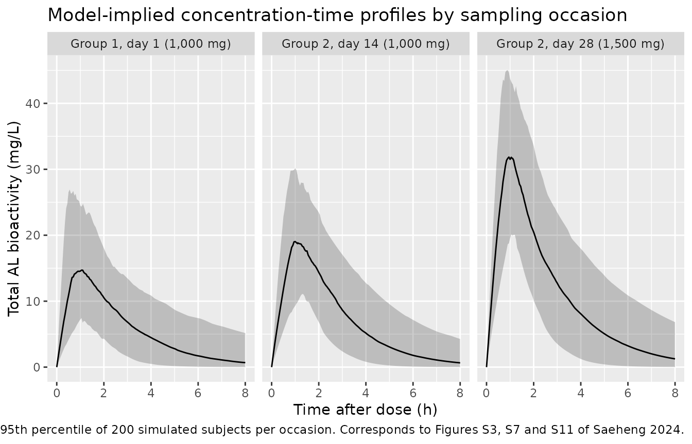

# Atractylodes lancea in advanced intrahepatic cholangiocarcinoma (Saeheng 2024)

## Model and source

Saeheng 2024 fitted the **same** structural model – one compartment,
zero-order absorption without delay, linear clearance – separately to
three sampling occasions, and reported the three parameter sets in
Tables 1, 2 and 3. The library therefore carries three model files that
share this vignette.

| Model | Source table | Occasion |
|----|----|----|
| `Saeheng_2024_atractylodesLancea_group1day1` | Table 1 | Group 1, day 1 (first 1,000 mg dose) |
| `Saeheng_2024_atractylodesLancea_group2day14` | Table 2 | Group 2, day 14 (end of the 1,000 mg lead-in) |
| `Saeheng_2024_atractylodesLancea_group2day28` | Table 3 | Group 2, day 28 (end of the 1,500 mg step) |

- Citation: Saeheng T, Karbwang J, Na-Bangchang K.
  Population-pharmacokinetic/pharmacodynamic model of atractylodes
  lancea (Thunb.) DC. administration in patients with advanced-stage
  intrahepatic cholangiocarcinoma: a dosage prediction. BMC Complement
  Med Ther. 2024;24(1):384. <doi:10.1186/s12906-024-04618-8>.
- Description (Group 1, day 1): One-compartment population PK model with
  zero-order absorption (no lag) and linear clearance for total
  Atractylodes lancea (Thunb.) DC. bioactivity in patients with
  advanced-stage intrahepatic cholangiocarcinoma (Saeheng 2024, Table
  1). This file holds the Group 1 day-1 fit: the first once-daily 1,000
  mg dose of the capsule formulation of standardized AL extract
  (CMC-AL). Saeheng 2024 reported three separate fits of the same
  structural model to three different occasions – Group 1 day 1, Group 2
  day 14 and Group 2 day 28 – carried here as three model files sharing
  one vignette; see also
  modellib(‘Saeheng_2024_atractylodesLancea_group2day14’) and
  modellib(‘Saeheng_2024_atractylodesLancea_group2day28’). Volume and
  clearance are apparent (V/F, CL/F): CMC-AL is dosed orally and no
  bioavailability term was estimated. The analyte is total AL
  bioactivity, a bioassay-derived aggregate of the extract’s active
  constituents, not a single molecular entity. None of the screened
  covariates (sex, age, weight, height) improved the model.
  Between-subject variability is lognormal on Tk0, V/F and CL/F;
  residual error is combined additive plus proportional.
- Article: <https://doi.org/10.1186/s12906-024-04618-8>
- Trial registration: TCTR20210129007
  (<https://www.thaiclinicaltrials.org>)

The drug is CMC-AL, a capsule formulation of a standardized extract of
*Atractylodes lancea* (Thunb.) DC. The analyte is **total AL
bioactivity**, a bioassay-derived aggregate of the extract’s active
constituents rather than a single molecular entity, so `V/F` and `CL/F`
are apparent parameters of that aggregate. Saeheng 2024 also developed a
pop-PK model for atractylodin (a single active constituent) but reported
no parameters for it and did not use it for dose prediction, so it is
not carried here.

## Population

Data come from the Group 1 and Group 2 arms of a single-centre,
open-label, randomized, controlled phase 2A trial in patients with
advanced-stage intrahepatic cholangiocarcinoma (iCCA) at Sakhon Na-Kon
Hospital, Thailand (TCTR20210129007). Group 1 (n = 15) received 1,000 mg
CMC-AL once daily (9 capsules) for 90 days. Group 2 (n = 16) received an
escalating regimen: 1,000 mg once daily for 14 days, then 1,500 mg once
daily for 14 days, then 2,000 mg once daily for 62 days. Group 3 (n =
16) was a standard-supportive-care control arm and contributed no PK.
All arms received standard supportive care.

Plasma was sampled at 0, 0.25, 0.5, 1, 1.5, 2, 2.5, 3, 4, 5, 6 and 8 h
post-dose: on day 1 for Group 1, and on days 14 and 28 for Group 2. None
of the screened covariates (sex, age, weight, height) improved the
model, so the final model has no covariate terms; the screen is recorded
in each model file’s `covariatesDataExcluded` metadata.

Saeheng 2024 does **not** tabulate baseline demographics (age, weight,
sex, height) for the PK cohort – those are reported in the parent phase
2A trial publication (its reference \[8\]). The `population` metadata
therefore carries the design facts only.

``` r

readModelDb("Saeheng_2024_atractylodesLancea_group1day1")()$population$notes
#> [1] "Group 1 arm of a single-centre, open-label, randomized, controlled phase 2A trial (TCTR20210129007). Fifteen patients were randomized to Group 1 (Saeheng 2024 Results). Plasma sampling on day 1 at 0, 0.25, 0.5, 1, 1.5, 2, 2.5, 3, 4, 5, 6 and 8 h post-dose (Saeheng 2024 Methods, 'Pharmacokinetic study'). Baseline demographics (age, weight, sex, height) are not tabulated in this paper; they are reported in the parent phase 2A trial publication (reference [8]). Fitted in MonolixSuite 2023R1 by SAEM."
```

## Source trace

Every `ini()` entry carries an in-file comment naming its source cell in
Saeheng 2024. They are collected here for review.

| Equation / parameter | Group 1 day 1 (Table 1) | Group 2 day 14 (Table 2) | Group 2 day 28 (Table 3) |
|----|----|----|----|
| `ld1` = log(Tk0), zero-order absorption duration (h) | 0.85 (RSE 17.3%) | 1.11 (RSE 11.2%) | 0.95 (RSE 9.10%) |
| `lvc` = log(V/F) (L) | 42.82 (RSE 11.3%) | 32.57 (RSE 8.89%) | 32 (RSE 7.85%) |
| `lcl` = log(CL/F) (L/h) | 20.9 (RSE 16.1%) | 17.2 (RSE 11.8%) | 16.13 (RSE 10.7%) |
| `etald1` variance | 0.51^2 (Omega_Tk0) | 0.35^2 (Omega_Tk0) | 0.28^2 (Omega_Tk0) |
| `etalvc` variance | log(1 + 0.3082^2), from the printed %CV – see Errata | log(1 + 0.273^2), from the printed %CV – see Errata | 0.25^2 (Omega_V) |
| `etalcl` variance | 0.54^2 (Omega_Cl) | 0.44^2 (Omega_Cl) | 0.38^2 (Omega_Cl) |
| `addSd` (mg/L) | a = 0.36 (RSE 28.4%) | a = 1.39 (RSE 24.0%) | a = 2.21 (RSE 19.2%) |
| `propSd` (fraction) | b = 0.32 (RSE 11.8%) | b = 0.17 (RSE 19.3%) | b = 0.084 (RSE 29.6%) |
| `d/dt(central) <- -kel * central`, `dur(central) <- d1` | Results: “One compartmental model with zero-order absorption (without delay) and linear clearance best characterized the pop-PK properties of total bioactivity of AL” | same | same |
| `Cc <- central / vc` | Methods, “Criteria for optimal dosage regimens” (Cmax cut-offs quoted in mg/L) | same | same |
| Cmax cut-offs 32.39 / 21.42 mg/L | Methods, “Criteria for optimal dosage regimens” | – | – |
| Published MC outcome percentages | Results, “Tumor progression” and “Deaths” | – | – |

## Virtual cohort

Original observed data are not publicly available. Each occasion is
reproduced with a virtual cohort of 200 subjects dosed on the schedule
that applied to that occasion, and sampled over the 0-8 h window the
protocol used. The model has no covariates, so no covariate distribution
has to be assumed.

``` r

set.seed(20240384)

N_PER_ARM <- 200L

# Protocol sampling times (Methods, "Pharmacokinetic study").
protocol_times <- c(0, 0.25, 0.5, 1, 1.5, 2, 2.5, 3, 4, 5, 6, 8)

# Dense grid for the closed-form NCA gate; the union keeps the protocol times
# available for the population NCA. The typical Tk0 of each occasion (0.85,
# 1.11, 0.95 h) is added so PKNCA can land exactly on the analytic Tmax.
obs_times <- sort(unique(c(seq(0, 8, by = 0.05), protocol_times, 0.85, 1.11, 0.95)))

# Build one occasion: `dose_times` / `dose_amts` give the full dosing history in
# absolute hours; `occasion_time` is the absolute time of the dose being
# sampled. `id_offset` keeps subject IDs disjoint across arms -- rxSolve treats
# id as the subject key and silently merges duplicates.
make_occasion <- function(occasion, n, dose_times, dose_amts, occasion_time,
                          id_offset = 0L) {
  ids <- id_offset + seq_len(n)
  doses <- tidyr::expand_grid(id = ids, k = seq_along(dose_times)) |>
    dplyr::mutate(
      time = dose_times[k],
      amt  = dose_amts[k],
      evid = 1L,
      rate = -2      # use the modelled dur(central) for the zero-order input
    ) |>
    dplyr::select(-k)
  obs <- tidyr::expand_grid(id = ids, time = occasion_time + obs_times) |>
    dplyr::mutate(amt = NA_real_, evid = 0L, rate = 0)
  dplyr::bind_rows(doses, obs) |>
    dplyr::mutate(
      cmt      = "central",       # the ODE state, never the observable "Cc"
      occasion = occasion,
      occasion_time = occasion_time,
      dose_mg  = dose_amts[length(dose_amts)]
    ) |>
    dplyr::arrange(id, time, dplyr::desc(evid))
}

# Group 1: single 1,000 mg dose, sampled on day 1.
ev_g1d1 <- make_occasion(
  "Group 1, day 1 (1,000 mg)", N_PER_ARM,
  dose_times = 0, dose_amts = 1000, occasion_time = 0, id_offset = 0L
)

# Group 2 day 14: 14 daily 1,000 mg doses; day-14 dose is at t = 13 * 24 h.
g2_lead_times <- seq(0, by = 24, length.out = 14)
ev_g2d14 <- make_occasion(
  "Group 2, day 14 (1,000 mg)", N_PER_ARM,
  dose_times = g2_lead_times, dose_amts = rep(1000, 14),
  occasion_time = 13 * 24, id_offset = 200L
)

# Group 2 day 28: the 1,000 mg lead-in followed by 14 daily 1,500 mg doses;
# day-28 dose is at t = 27 * 24 h.
g2_step_times <- seq(14 * 24, by = 24, length.out = 14)
ev_g2d28 <- make_occasion(
  "Group 2, day 28 (1,500 mg)", N_PER_ARM,
  dose_times = c(g2_lead_times, g2_step_times),
  dose_amts  = c(rep(1000, 14), rep(1500, 14)),
  occasion_time = 27 * 24, id_offset = 400L
)

events <- dplyr::bind_rows(ev_g1d1, ev_g2d14, ev_g2d28)
stopifnot(!anyDuplicated(unique(events[, c("id", "time", "evid")])))
```

## Simulation

Each occasion is solved with its own parameter set, then the three
results are stacked. A separate typical-value (deterministic) solve
backs the closed-form NCA gate below.

``` r

occasion_model <- c(
  "Group 1, day 1 (1,000 mg)"  = "Saeheng_2024_atractylodesLancea_group1day1",
  "Group 2, day 14 (1,000 mg)" = "Saeheng_2024_atractylodesLancea_group2day14",
  "Group 2, day 28 (1,500 mg)" = "Saeheng_2024_atractylodesLancea_group2day28"
)

solve_occasion <- function(occ, typical) {
  # Read a fresh copy per solve: zeroRe() mutates the model object it is given.
  mod <- readModelDb(occasion_model[[occ]])
  ev  <- events |> dplyr::filter(occasion == occ)
  if (typical) {
    # One representative subject: with the etas zeroed every subject is
    # identical, and a single profile is what the closed-form gate needs.
    ev <- ev |> dplyr::filter(id == min(id))
    # omega = NA is required in addition to zeroRe(): rxode2 otherwise re-samples
    # etas once a stochastic solve has run in the same session.
    out <- rxode2::rxSolve(rxode2::zeroRe(mod), events = ev, omega = NA,
                           keep = c("occasion", "occasion_time", "dose_mg"))
  } else {
    out <- rxode2::rxSolve(mod, events = ev,
                           keep = c("occasion", "occasion_time", "dose_mg"))
  }
  out <- as.data.frame(out)
  # rxSolve drops the id column for a single-subject solve; restore it so the
  # downstream PKNCA grouping works for both branches.
  if (!"id" %in% names(out)) out$id <- ev$id[[1]]
  out
}

sim_pop <- dplyr::bind_rows(lapply(names(occasion_model), solve_occasion,
                                   typical = FALSE)) |>
  dplyr::mutate(tad = time - occasion_time)
#> ℹ parameter labels from comments will be replaced by 'label()'
#> ℹ parameter labels from comments will be replaced by 'label()'
#> ℹ parameter labels from comments will be replaced by 'label()'

sim_typ <- dplyr::bind_rows(lapply(names(occasion_model), solve_occasion,
                                   typical = TRUE)) |>
  dplyr::mutate(tad = time - occasion_time)
#> ℹ parameter labels from comments will be replaced by 'label()'
#> ℹ parameter labels from comments will be replaced by 'label()'
#> ℹ parameter labels from comments will be replaced by 'label()'
```

## Replicate published figures

Saeheng 2024 shows the per-occasion concentration-time profiles and
their visual predictive checks in Supplementary Figures S1-S12
(Additional File 1), which are not reproduced numerically in the article
text. The panels below are the model-implied equivalents of Figures S3,
S7 and S11 (the VPCs for Group 1 day 1, Group 2 day 14 and Group 2 day
28).

``` r

sim_pop |>
  dplyr::filter(!is.na(Cc)) |>
  dplyr::group_by(occasion, tad) |>
  dplyr::summarise(
    Q05 = quantile(Cc, 0.05),
    Q50 = quantile(Cc, 0.50),
    Q95 = quantile(Cc, 0.95),
    .groups = "drop"
  ) |>
  ggplot(aes(tad, Q50)) +
  geom_ribbon(aes(ymin = Q05, ymax = Q95), alpha = 0.25) +
  geom_line() +
  facet_wrap(~occasion) +
  labs(
    x = "Time after dose (h)", y = "Total AL bioactivity (mg/L)",
    title = "Model-implied concentration-time profiles by sampling occasion",
    caption = paste("Median and 5th-95th percentile of 200 simulated subjects per occasion.",
                    "Corresponds to Figures S3, S7 and S11 of Saeheng 2024.")
  )
```



## PKNCA validation

### Closed-form gate on the typical-value profiles

For a one-compartment model with a zero-order input of duration `d1` and
no accumulation, NCA parameters have exact closed forms: `Tmax = d1`,
`Cmax = (D / (d1 * CL)) * (1 - exp(-kel * d1))`, `AUC(0-inf) = D / CL`,
and `t1/2 = log(2) / kel`. Terminal half-lives here are 1.3-1.4 h
against a 24 h dosing interval, so the accumulation contribution to Cmax
is below 1e-5 of the peak and the single-dose forms apply on days 14 and
28 as well; the accumulation ratio is checked numerically below. PKNCA
run on the typical-value profile must reproduce these values – this is a
strict check of the packaged implementation, not a tuned comparison.

``` r

# Accumulation ratio actually observed in the simulated typical profiles: the
# pre-dose (trough) concentration relative to the same occasion's peak.
sim_typ |>
  dplyr::group_by(occasion) |>
  dplyr::summarise(
    `Cmax (mg/L)`        = max(Cc),
    `Pre-dose Cc (mg/L)` = Cc[tad == 0],
    `Trough / Cmax`      = Cc[tad == 0] / max(Cc),
    .groups = "drop"
  ) |>
  knitr::kable(digits = c(0, 3, 8, 8),
               caption = "Accumulation is negligible: the pre-dose concentration on days 14 and 28 is a vanishing fraction of the peak.")
```

| occasion                   | Cmax (mg/L) | Pre-dose Cc (mg/L) | Trough / Cmax |
|:---------------------------|------------:|-------------------:|--------------:|
| Group 1, day 1 (1,000 mg)  |      19.115 |         0.00000000 |      0.00e+00 |
| Group 2, day 14 (1,000 mg) |      23.232 |         0.00013071 |      5.63e-06 |
| Group 2, day 28 (1,500 mg) |      37.248 |         0.00033511 |      9.00e-06 |

Accumulation is negligible: the pre-dose concentration on days 14 and 28
is a vanishing fraction of the peak. {.table}

``` r

nca_frame <- function(dat) {
  out <- dat |>
    dplyr::filter(!is.na(Cc)) |>
    dplyr::select(id, tad, Cc, occasion, dose_mg)
  # Guarantee a tad = 0 row per (id, occasion); pre-dose Cc = 0 is correct for
  # an extravascular first dose and negligible on days 14 / 28.
  dplyr::bind_rows(
    out,
    out |> dplyr::distinct(id, occasion, dose_mg) |>
      dplyr::mutate(tad = 0, Cc = 0)
  ) |>
    dplyr::distinct(id, occasion, tad, .keep_all = TRUE) |>
    dplyr::arrange(occasion, id, tad)
}

nca_intervals <- data.frame(
  start = 0, end = Inf,
  cmax = TRUE, tmax = TRUE, aucinf.obs = TRUE, half.life = TRUE
)

run_nca <- function(conc_df) {
  dose_df <- conc_df |>
    dplyr::distinct(id, occasion, dose_mg) |>
    dplyr::mutate(time = 0, amt = dose_mg)
  PKNCA::pk.nca(PKNCA::PKNCAdata(
    PKNCA::PKNCAconc(conc_df, Cc ~ tad | occasion + id),
    PKNCA::PKNCAdose(dose_df, amt ~ time | occasion + id),
    intervals = nca_intervals
  ))
}

nca_typ <- run_nca(nca_frame(sim_typ))
```

``` r

closed_form <- tibble::tribble(
  ~occasion,                     ~d1,   ~vc,    ~cl,    ~dose,
  "Group 1, day 1 (1,000 mg)",   0.85,  42.82,  20.90,  1000,
  "Group 2, day 14 (1,000 mg)",  1.11,  32.57,  17.20,  1000,
  "Group 2, day 28 (1,500 mg)",  0.95,  32.00,  16.13,  1500
) |>
  dplyr::mutate(
    kel        = cl / vc,
    cmax       = (dose / (d1 * cl)) * (1 - exp(-kel * d1)),
    tmax       = d1,
    aucinf.obs = dose / cl,
    half.life  = log(2) / kel
  ) |>
  dplyr::select(occasion, cmax, tmax, aucinf.obs, half.life)

nlmixr2lib::ncaComparisonTable(
  simulated = nca_typ,
  reference = closed_form,
  by        = "occasion",
  units     = c(cmax = "mg/L", tmax = "h", aucinf.obs = "mg*h/L", half.life = "h"),
  tolerance_pct = 20
) |>
  knitr::kable(
    digits  = 3,
    caption = "Typical-value PKNCA output vs. the exact closed-form solution of the packaged model. * marks a >20% difference."
  )
```

| NCA parameter          | occasion                   | Reference | Simulated | % diff |
|:-----------------------|:---------------------------|:----------|:----------|:-------|
| Cmax (mg/L)            | Group 1, day 1 (1,000 mg)  | 19.1      | 19.1      | -0.0%  |
| Cmax (mg/L)            | Group 2, day 14 (1,000 mg) | 23.2      | 23.2      | +0.0%  |
| Cmax (mg/L)            | Group 2, day 28 (1,500 mg) | 37.2      | 37.2      | +0.0%  |
| Tmax (h)               | Group 1, day 1 (1,000 mg)  | 0.85      | 0.85      | +0.0%  |
| Tmax (h)               | Group 2, day 14 (1,000 mg) | 1.11      | 1.11      | +0.0%  |
| Tmax (h)               | Group 2, day 28 (1,500 mg) | 0.95      | 0.95      | +0.0%  |
| AUC0-∞ (obs) (mg\*h/L) | Group 1, day 1 (1,000 mg)  | 47.8      | 47.8      | -0.0%  |
| AUC0-∞ (obs) (mg\*h/L) | Group 2, day 14 (1,000 mg) | 58.1      | 58.1      | -0.0%  |
| AUC0-∞ (obs) (mg\*h/L) | Group 2, day 28 (1,500 mg) | 93        | 93        | -0.0%  |
| t½ (h)                 | Group 1, day 1 (1,000 mg)  | 1.42      | 1.42      | -0.0%  |
| t½ (h)                 | Group 2, day 14 (1,000 mg) | 1.31      | 1.31      | -0.0%  |
| t½ (h)                 | Group 2, day 28 (1,500 mg) | 1.38      | 1.38      | -0.0%  |

Typical-value PKNCA output vs. the exact closed-form solution of the
packaged model. \* marks a \>20% difference. {.table
style="width:100%;"}

### Population NCA on the protocol sampling times

Restricting the simulated cohort to the 12 protocol sampling times gives
the NCA a study-realistic design. Saeheng 2024 reports no NCA table, so
these values are descriptive rather than a comparison target; note that
the sparse grid puts Tmax on the nearest protocol time (1 h) rather than
on the true Tk0.

``` r

nca_pop <- sim_pop |>
  dplyr::filter(tad %in% protocol_times) |>
  nca_frame() |>
  run_nca()

as.data.frame(nca_pop) |>
  dplyr::filter(PPTESTCD %in% c("cmax", "tmax", "aucinf.obs", "half.life")) |>
  dplyr::group_by(occasion, PPTESTCD) |>
  dplyr::summarise(
    Median = median(PPORRES, na.rm = TRUE),
    `5th`  = quantile(PPORRES, 0.05, na.rm = TRUE),
    `95th` = quantile(PPORRES, 0.95, na.rm = TRUE),
    .groups = "drop"
  ) |>
  tidyr::pivot_longer(c(Median, `5th`, `95th`)) |>
  tidyr::pivot_wider(names_from = PPTESTCD, values_from = value) |>
  dplyr::rename(
    "Occasion"          = occasion,
    "Statistic"         = name,
    "Cmax (mg/L)"       = cmax,
    "Tmax (h)"          = tmax,
    "AUC0-inf (mg*h/L)" = aucinf.obs,
    "t1/2 (h)"          = half.life
  ) |>
  knitr::kable(digits = 2,
               caption = "Simulated population NCA on the protocol sampling grid (200 subjects per occasion).")
```

| Occasion | Statistic | AUC0-inf (mg\*h/L) | Cmax (mg/L) | t1/2 (h) | Tmax (h) |
|:---|:---|---:|---:|---:|---:|
| Group 1, day 1 (1,000 mg) | Median | 47.54 | 16.17 | 1.43 | 1.0 |
| Group 1, day 1 (1,000 mg) | 5th | 20.70 | 9.50 | 0.59 | 0.5 |
| Group 1, day 1 (1,000 mg) | 95th | 111.74 | 28.49 | 4.08 | 2.0 |
| Group 2, day 14 (1,000 mg) | Median | 58.34 | 20.62 | 1.35 | 1.0 |
| Group 2, day 14 (1,000 mg) | 5th | 26.90 | 13.16 | 0.59 | 1.0 |
| Group 2, day 14 (1,000 mg) | 95th | 115.80 | 30.15 | 2.75 | 2.0 |
| Group 2, day 28 (1,500 mg) | Median | 89.78 | 32.86 | 1.43 | 1.0 |
| Group 2, day 28 (1,500 mg) | 5th | 46.09 | 23.04 | 0.64 | 0.5 |
| Group 2, day 28 (1,500 mg) | 95th | 173.91 | 43.71 | 3.17 | 1.5 |

Simulated population NCA on the protocol sampling grid (200 subjects per
occasion). {.table}

## Reproducing the published dose-selection simulations

This is the paper’s principal quantitative result. Saeheng 2024 ran
Monte-Carlo simulations of once-daily regimens of 1,000-3,000 mg and
classified a simulated patient using the total-AL-bioactivity Cmax
cut-offs quoted in Methods, “Criteria for optimal dosage regimens”: Cmax
\>= 32.39 mg/L for inhibition of tumour progression, and Cmax \>= 21.42
mg/L for prevention of death. The published proportions are in Results,
“Tumor progression” and “Deaths” (100% adherence, 3-month course).

The paper does not say which of its three parameter sets drove the
simulations. Reproducing all three shows that only the **Group 1, day
1** fit lands in the published range, so that is the set used here.

``` r

mc_doses <- c(1000, 1500, 2000, 2500, 3000)
MC_PER_ARM <- 200L

# Three daily doses, Cmax taken over the final interval. With t1/2 ~ 1.4 h
# against a 24 h interval this is indistinguishable from the 3-month steady
# state used in the paper (see the accumulation check above).
mc_events <- dplyr::bind_rows(lapply(seq_along(mc_doses), function(k) {
  D   <- mc_doses[k]
  ids <- 1000L + (k - 1L) * MC_PER_ARM + seq_len(MC_PER_ARM)
  doses <- tidyr::expand_grid(id = ids, time = c(0, 24, 48)) |>
    dplyr::mutate(amt = D, evid = 1L, rate = -2)
  obs <- tidyr::expand_grid(id = ids,
                            time = 48 + sort(unique(c(seq(0, 8, by = 0.05),
                                                      protocol_times)))) |>
    dplyr::mutate(amt = NA_real_, evid = 0L, rate = 0)
  dplyr::bind_rows(doses, obs) |>
    dplyr::mutate(cmt = "central", dose_mg = D,
                  regimen = paste0(format(D, big.mark = ","), " mg once daily")) |>
    dplyr::arrange(id, time, dplyr::desc(evid))
}))
stopifnot(!anyDuplicated(unique(mc_events[, c("id", "time", "evid")])))
```

``` r

CUT_PROGRESSION <- 32.39   # mg/L, Methods "Criteria for optimal dosage regimens"
CUT_DEATH       <- 21.42   # mg/L, same

# The paper does not say whether its simulated Cmax is the individual's
# predicted peak or a simulated *measured* peak (Simulx simulates observations
# through the residual-error model by default). Both readings are carried:
#   cmax_pred -- max of Cc  (IPRED), the true individual peak;
#   cmax_obs  -- max of sim (residual error included) restricted to the 12
#                protocol sampling times, i.e. a measured Cmax under the
#                study's own sampling design.
mc_outcomes <- function(model_name) {
  s <- as.data.frame(rxode2::rxSolve(readModelDb(model_name), events = mc_events,
                                     keep = c("dose_mg", "regimen")))
  s |>
    dplyr::filter(!is.na(Cc)) |>
    dplyr::mutate(tad = time - 48) |>
    dplyr::group_by(regimen, dose_mg, id) |>
    dplyr::summarise(
      cmax_pred = max(Cc),
      cmax_obs  = max(sim[tad %in% protocol_times]),
      .groups   = "drop"
    ) |>
    dplyr::group_by(regimen, dose_mg) |>
    dplyr::summarise(
      progression_pred = 100 * mean(cmax_pred < CUT_PROGRESSION),
      death_pred       = 100 * mean(cmax_pred < CUT_DEATH),
      progression_obs  = 100 * mean(cmax_obs  < CUT_PROGRESSION),
      death_obs        = 100 * mean(cmax_obs  < CUT_DEATH),
      .groups = "drop"
    ) |>
    dplyr::mutate(model = model_name)
}

set.seed(384)
mc_all <- dplyr::bind_rows(lapply(unname(occasion_model), mc_outcomes))
#> ℹ parameter labels from comments will be replaced by 'label()'
#> ℹ parameter labels from comments will be replaced by 'label()'
#> ℹ parameter labels from comments will be replaced by 'label()'
```

``` r

published <- tibble::tribble(
  ~dose_mg, ~pub_progression, ~pub_death,
  1000,     96,               66,
  1500,     83,               50,
  2000,     55,               29,
  2500,     27,               12,
  3000,     12,                3
)

mc_all |>
  dplyr::filter(model == "Saeheng_2024_atractylodesLancea_group1day1") |>
  dplyr::left_join(published, by = "dose_mg") |>
  dplyr::arrange(dose_mg) |>
  dplyr::select(regimen, pub_progression, progression_pred, progression_obs,
                pub_death, death_pred, death_obs) |>
  dplyr::rename(
    "Regimen"                     = regimen,
    "Progression, published %"    = pub_progression,
    "Progression, pred. Cmax %"   = progression_pred,
    "Progression, obs. Cmax %"    = progression_obs,
    "Mortality, published %"      = pub_death,
    "Mortality, pred. Cmax %"     = death_pred,
    "Mortality, obs. Cmax %"      = death_obs
  ) |>
  knitr::kable(
    digits  = 1,
    caption = paste("Reproduction of Saeheng 2024 Results ('Tumor progression', 'Deaths') using the",
                    "Group 1 day-1 parameter set, 200 virtual patients per dose arm,",
                    "and the published Cmax cut-offs (32.39 and 21.42 mg/L).",
                    "'pred. Cmax' uses the individual predicted peak; 'obs. Cmax' uses a",
                    "residual-error-included peak on the 12 protocol sampling times.")
  )
```

| Regimen | Progression, published % | Progression, pred. Cmax % | Progression, obs. Cmax % | Mortality, published % | Mortality, pred. Cmax % | Mortality, obs. Cmax % |
|:---|---:|---:|---:|---:|---:|---:|
| 1,000 mg once daily | 96 | 99.0 | 94.0 | 66 | 72.5 | 65.5 |
| 1,500 mg once daily | 83 | 71.5 | 63.5 | 50 | 16.5 | 24.5 |
| 2,000 mg once daily | 55 | 38.0 | 34.0 | 29 | 5.0 | 8.0 |
| 2,500 mg once daily | 27 | 15.0 | 15.0 | 12 | 1.0 | 2.0 |
| 3,000 mg once daily | 12 | 5.0 | 7.5 | 3 | 0.0 | 0.0 |

Reproduction of Saeheng 2024 Results (‘Tumor progression’, ‘Deaths’)
using the Group 1 day-1 parameter set, 200 virtual patients per dose
arm, and the published Cmax cut-offs (32.39 and 21.42 mg/L). ‘pred.
Cmax’ uses the individual predicted peak; ‘obs. Cmax’ uses a
residual-error-included peak on the 12 protocol sampling times. {.table}

The packaged model reproduces the **direction** of the published
dose-response and matches the 1,000 mg anchor closely (published 96%
progression / 66% mortality; simulated 94% / 66% on the observed-Cmax
reading). It does **not** reproduce the published intermediate-dose
proportions: at 1,500-2,500 mg the simulation is 10-35 percentage points
more optimistic than published under either reading, and the gap is
largest for mortality.

The reason is structural rather than a transcription problem. The
published curves are much shallower than a Cmax-threshold rule can be on
this model: over a 3-fold dose range (1,000 to 3,000 mg) the published
mortality falls only from 66% to 3%, whereas a fixed cut-off applied to
a lognormal Cmax distribution with the model’s variability falls far
faster, because tripling the dose triples every individual’s Cmax.
Matching the published shallowness would require a Cmax distribution far
wider than the reported IIV and residual error imply. Nothing has been
tuned to close the gap; the discrepancy is reported as found and noted
in Assumptions and deviations below.

``` r

mc_all |>
  dplyr::left_join(published, by = "dose_mg") |>
  dplyr::mutate(model = sub("^Saeheng_2024_atractylodesLancea_", "", model)) |>
  dplyr::select(dose_mg, model, progression_obs, pub_progression) |>
  tidyr::pivot_wider(names_from = model, values_from = progression_obs) |>
  dplyr::arrange(dose_mg) |>
  dplyr::rename(
    "Dose (mg once daily)"    = dose_mg,
    "Published progression %" = pub_progression
  ) |>
  knitr::kable(
    digits  = 1,
    caption = paste("Tumour-progression percentage by parameter set (observed-Cmax reading).",
                    "All three agree at 1,000 mg; the sets separate at higher doses, where only",
                    "the Group 1 day-1 fit stays near the published values. The day-14 and",
                    "day-28 fits give markedly higher exposure and therefore far less predicted",
                    "progression.")
  )
```

| Dose (mg once daily) | Published progression % | group1day1 | group2day14 | group2day28 |
|---:|---:|---:|---:|---:|
| 1000 | 96 | 94.0 | 92.5 | 97.0 |
| 1500 | 83 | 63.5 | 58.0 | 41.5 |
| 2000 | 55 | 34.0 | 19.5 | 9.0 |
| 2500 | 27 | 15.0 | 5.0 | 2.0 |
| 3000 | 12 | 7.5 | 1.0 | 0.0 |

Tumour-progression percentage by parameter set (observed-Cmax reading).
All three agree at 1,000 mg; the sets separate at higher doses, where
only the Group 1 day-1 fit stays near the published values. The day-14
and day-28 fits give markedly higher exposure and therefore far less
predicted progression. {.table}

## Assumptions and deviations

- **`Omega_V` in Tables 1 and 2 is printed on the wrong scale.** Every
  other random-effect row in the paper is a Monolix log-scale SD,
  consistent with the printed `%CV` column via
  `CV = sqrt(exp(omega^2) - 1)`. The `Omega_V` *Value* and *S.E.* cells
  of Table 1 (13.2, 4.25) and Table 2 (8.89, 2.44) are not: as log-scale
  SDs they would imply CVs of ~1e40% and ~1e19%, against printed CVs of
  30.82% and 27.3%. They are instead SDs of `V` on the **linear** scale
  (13.2 / 42.82 = 30.83%; 8.89 / 32.57 = 27.29%), and their `%RSE` cells
  are self-consistent on that scale too (4.25 / 13.2 = 32.2%; 2.44 /
  8.89 = 27.4%). Table 2’s 8.89 is also the number printed as `V_pop`’s
  `%RSE` two rows above, consistent with a transcription slip. Table 3’s
  `Omega_V` (0.25) follows the log-scale convention like everything
  else. Because the paper’s Methods state that “the distribution of
  pharmacokinetic parameters was normal in a logarithmic scale”, the
  model files use log-scale omegas recovered from the self-consistent
  `%CV` column, `omega = sqrt(log(1 + CV^2))`: 0.3012 for Table 1 and
  0.2681 for Table 2. Both readings imply the same practical variability
  (~31% and ~27% CV on `V/F`), so the choice is not material.
- **Combined residual-error variance form.** Saeheng 2024 reports
  Monolix `a` and `b` error-model parameters but does not state whether
  the `combined1` (`sd = a + b*f`) or `combined2`
  (`sd = sqrt(a^2 + (b*f)^2)`) form was used. rxode2’s default
  `combined2` form is used, matching the existing library precedent
  (`Chen_2024_febuxostat`). At the observed concentrations the two forms
  differ by up to ~30% in residual SD on day 28, where the additive term
  is largest; the structural parameters are unaffected.
- **Which parameter set drove the Monte-Carlo simulations is not
  stated.** Saeheng 2024 refers only to “the final pop-PK (1000 virtual
  patients) model”. The comparison above shows the Group 1 day-1 fit is
  the only one of the three close to the published outcome percentages,
  so it is used for the dose-selection reproduction.
- **The published dose-selection percentages are only partly
  reproducible.** The packaged model plus the published Cmax cut-offs
  matches the 1,000 mg outcomes closely and reproduces the direction of
  the dose-response, but is 10-35 percentage points more optimistic than
  published at 1,500-2,500 mg under both the predicted-Cmax and
  observed-Cmax readings. The published curves are shallower than a
  fixed Cmax threshold applied to this model’s Cmax distribution can
  produce. The paper does not report the Cmax distributions its
  simulations generated, nor whether the Cmax used was a predicted or a
  simulated-observed value, so the source of the gap cannot be resolved
  from the article alone. No parameter was adjusted to reduce it.
- **The Cmax cut-off values are not derived in this paper.** The 32.39
  mg/L and 21.42 mg/L thresholds are cited to Saeheng 2024’s reference
  \[9\]; they are used here exactly as printed and are not part of the
  model files.
- **PK cohort size.** Methods states “The pharmacokinetic study was
  conducted in 32 patients”, but Results assigns 15 patients to Group 1
  and 16 to Group 2 (31 dosed patients; Group 3 was an untreated control
  arm). The `population` metadata records the per-arm counts from
  Results.
- **Baseline demographics are not in this paper.** Age, weight, sex and
  height distributions are reported in the parent phase 2A trial
  publication (Saeheng 2024 reference \[8\]) and are not reproduced
  here; the virtual cohorts therefore carry no covariates, which is
  faithful because the final model retained none.
- **Dosing-history simplification in the dose-selection simulation.**
  The paper simulated a 3-month (and 1-year) course. Three daily doses
  are simulated here because the terminal half-life (1.3-1.4 h) is far
  shorter than the 24 h interval, making the pre-dose concentration
  under 1e-5 of the peak; the accumulation check chunk shows this
  numerically. The paper’s own finding that extending administration
  from 3 months to 1 year left the outcome percentages unchanged is
  consistent with this.
- **Patient-adherence scenarios are not reproduced.** Saeheng 2024 also
  reports 80%, 50% and 20% adherence scenarios. Adherence is a
  dosing-compliance assumption rather than a model parameter, so it is
  out of scope for the model file; the 100%-adherence column is the one
  reproduced.
- **Supplementary Figures S1-S12 and Table S1** (Additional File 1) were
  not on disk for this extraction. They hold goodness-of-fit / VPC
  figures and the OFV / AIC / BIC / BICc model-selection statistics – no
  parameter values – so no `ini()` entry depends on them.
- **Atractylodin sub-model not carried.** Saeheng 2024 states that a
  pop-PK model was also developed for atractylodin but reports no
  parameters for it and did not use it for dose prediction, so there is
  nothing to extract.
