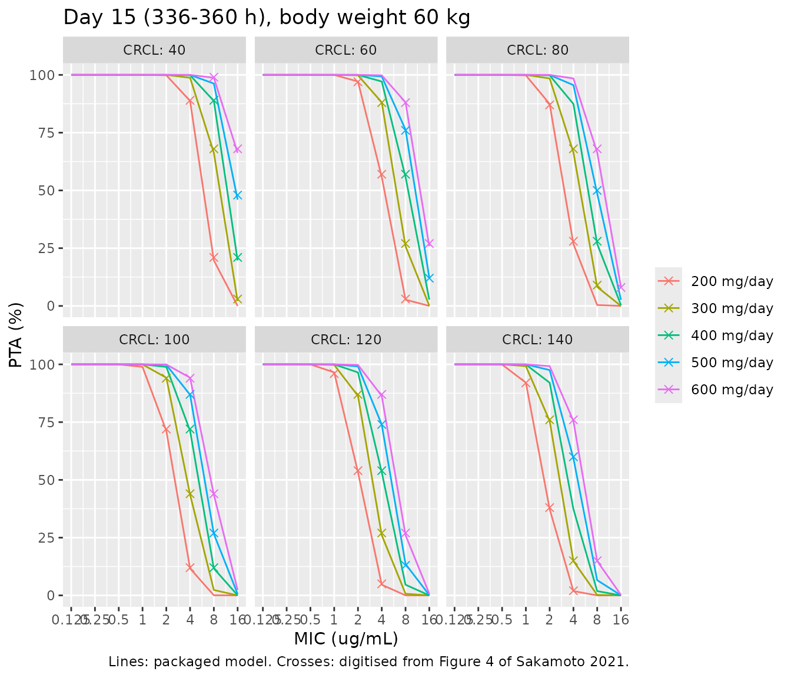
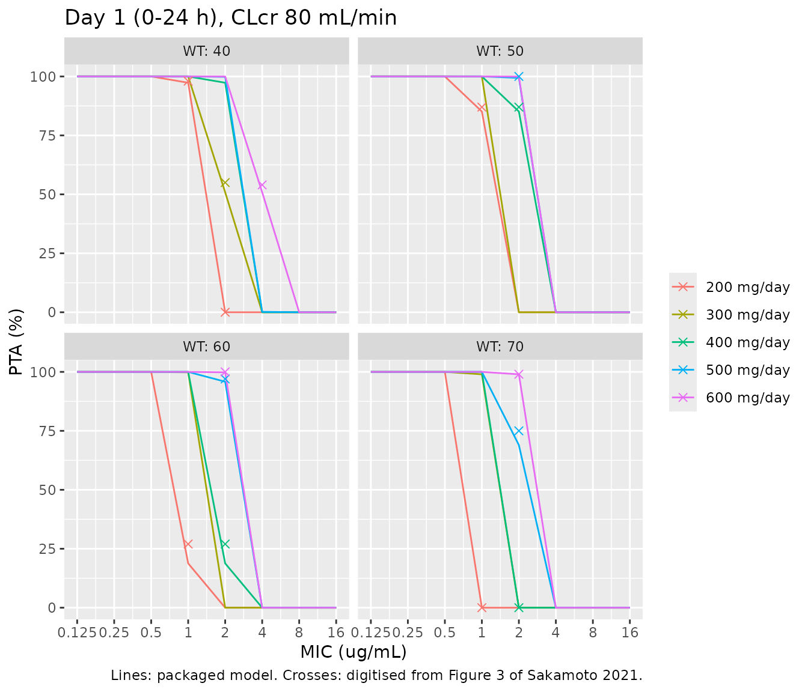
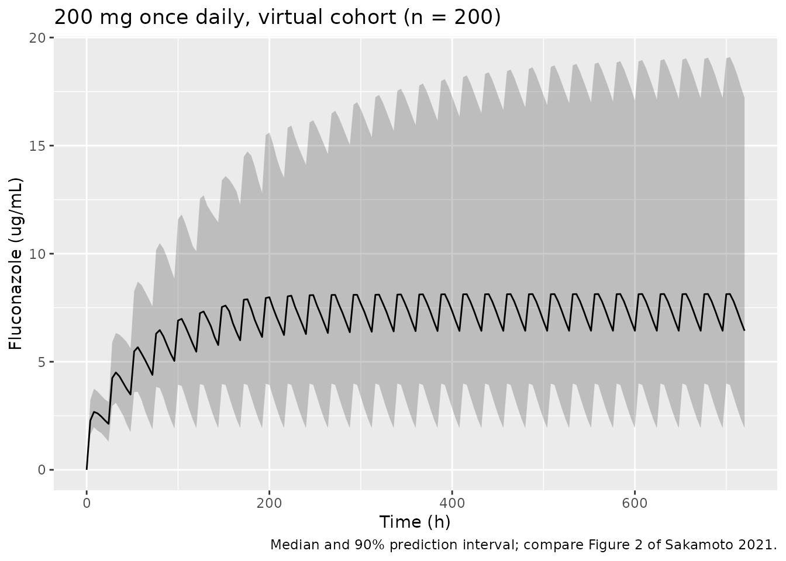

# Fluconazole (Sakamoto 2021)

## Model and source

- Citation: Sakamoto Y, Isono H, Enoki Y, Taguchi K, Miyazaki T,
  Kunimoto H, Koike H, Hagihara M, Matsumoto K, Nakajima H, Sahashi Y,
  Matsumoto K. Population Pharmacokinetic Analysis and Dosing
  Optimization of Prophylactic Fluconazole in Japanese Patients with
  Hematological Malignancy. J Fungi (Basel). 2021;7(11):975.
  <doi:10.3390/jof7110975>.

- Description: One-compartment population PK model with first-order oral
  absorption and first-order elimination for prophylactic oral
  fluconazole in Japanese adults with hematological malignancy receiving
  chemotherapy or hematopoietic stem cell transplantation. Apparent
  clearance scales as a power of Cockcroft-Gault creatinine clearance
  (normalized to 5.2 L/h) and apparent volume as a power of body weight
  (normalized to 57.6 kg); log-normal between-subject variability on
  clearance only.

- Article (open access): <https://doi.org/10.3390/jof7110975>

Sakamoto 2021 fitted a one-compartment model with first-order oral
absorption to prophylactic fluconazole concentrations from Japanese
adults with hematological malignancy, then used Monte Carlo simulation
to find the doses that reach a free-drug target of fAUC/MIC = 50
(protein binding 12%) with at least 90% probability of target attainment
(PTA). Apparent clearance scales with Cockcroft-Gault creatinine
clearance and apparent volume with body weight:

- CL/F (L/h) = 1.03 x (CLcr / 5.2)^1.05 x e^0.16, with CLcr in L/h
- V/F (L) = 62.3 x (WT / 57.6)^1.06
- ka = 0.34 /h

The model takes `CRCL` in mL/min (the unit of the paper’s Table 1) and
converts it to L/h internally (`CRCL * 0.06`).

## Population

Fifty-four adults (31 male / 23 female) admitted to Yokohama City
University Hospital between November 2018 and March 2020 for
chemotherapy (38) or hematopoietic stem cell transplantation (16), all
receiving 200 mg oral fluconazole once daily as antifungal prophylaxis
(Methods 2.2-2.3, Table 1). Median age 53 years (20-77), body weight
57.6 kg (39.8-99.1), BSA 1.62 m^2, Cockcroft-Gault CLcr 87.1 mL/min
(31.1-193.6). Diagnoses were mostly non-Hodgkin lymphoma (28) and
AML/MDS (10). One to four samples per patient were drawn at trough, 2, 4
or 12 h post-dose; 119 of 125 concentrations were analysed. The model
was estimated in Phoenix NLME (FOCE-ELS).

The same information is available programmatically:

``` r

str(readModelDb("Sakamoto_2021_fluconazole")()$population)
#> List of 15
#>  $ species       : chr "human"
#>  $ n_subjects    : int 54
#>  $ n_studies     : int 1
#>  $ n_observations: int 119
#>  $ age_range     : chr "20-77 years"
#>  $ age_median    : chr "53 years"
#>  $ weight_range  : chr "39.8-99.1 kg"
#>  $ weight_median : chr "57.6 kg"
#>  $ sex_female_pct: num 42.6
#>  $ race_ethnicity: Named num 100
#>   ..- attr(*, "names")= chr "Asian"
#>  $ disease_state : chr "Hematological malignancy receiving chemotherapy (38) or hematopoietic stem cell transplantation (autologous PBS"| __truncated__
#>  $ dose_range    : chr "200 mg oral fluconazole once daily (prophylaxis); all patients"
#>  $ regions       : chr "Japan (Yokohama City University Hospital, single centre)"
#>  $ renal_function: chr "Cockcroft-Gault CLcr median 87.1 mL/min (range 31.1-193.6); eGFRcre median 69.2 mL/min/1.73 m^2 (range 31.6-157.5) (Table 1)."
#>  $ notes         : chr "Demographics from Table 1 (31 male / 23 female). Enrolment November 2018 to March 2020; age >= 16 years; critic"| __truncated__
```

## Source trace

| Equation / parameter | Value | Source location |
|----|----|----|
| `lka` | log(0.34) /h | Table 2, ka |
| `lcl` | log(1.03) L/h | Table 2, theta1 |
| `e_crcl_cl` | 1.05 | Table 2, theta2 (printed with unit ‘(L/h)’; it is an exponent) |
| `lvc` | log(62.3) L | Table 2, theta3 |
| `e_wt_vc` | 1.06 | Table 2, theta4 (printed with unit ‘(L)’; it is an exponent) |
| `exp(0.16)` factor on CL/F | 1.17 | Table 2, CL/F equation ‘x e^0.16’; see next section |
| `etalcl` | 0.16 (variance) | Back-solved from the paper’s PTA simulations (Figures 3-4); see next section |
| `propSd`, `addSd` | fixed(0) | Not reported (Methods 2.5 lists the error models tested; Table 2 gives none) |
| CLcr normalisation 5.2 L/h | – | Results 3.3 (‘normalized to the population median of 5.2 L/h’); Table 2 footnote (CLcr in L/h) |
| WT normalisation 57.6 kg | – | Results 3.3; Table 1 median |
| `d/dt(depot)`, `d/dt(central)` | – | Methods 2.5 / Table 2 title: one compartment, first-order input, first-order elimination |
| `Cc <- central / vc` | mg/L | Concentrations reported in ug/mL (= mg/L); doses in mg |

## The `x e^0.16` term in the CL/F equation

Table 2 prints the clearance model as
`CL/F (L/h) = theta1 x (CLcr/5.2)^theta2 x e^0.16` and reports no
variability term anywhere else. Two readings are possible:

- **(A)** `e^0.16` is a typesetting of `e^eta` with omega^2 = 0.16, and
  the typical clearance is `theta1 x (CLcr/5.2)^theta2` (1.04 L/h at the
  median CLcr).
- **(B)** `e^0.16` is a literal factor on the typical clearance (1.03 x
  e^0.16 = 1.21 L/h at the median CLcr), with between-subject
  variability on top.

The paper’s own numbers arbitrate. Results 3.3 and the Discussion give
the model’s median CL/F as 1.2 L/h, which is reading (B) and not (A).
More decisively, the paper’s Monte Carlo PTA curves at steady state
(Figure 4) depend on clearance alone, so they can be inverted for the
median and spread of the clearance the authors simulated. Fitting those
curves (digitised by the maintainers, 55 points over six CLcr panels)
gives a median shifted by a factor of exp(0.170) from
`theta1 x (CLcr/5.2)^theta2` and a log-scale SD of 0.383 (omega^2 =
0.147). The model therefore keeps the literal `exp(0.16)` factor and
uses omega^2 = 0.16 on CL/F, with no variability on V/F or ka (Table 2
lists none, and the steep Day-1 PTA curves of Figure 3 leave no room for
any). The check below re-derives this deterministically.

``` r

# Digitised from Figure 4 (Day 15, BW 60 kg): PTA (%) at fAUC/MIC >= 50.
fig4 <- tibble::tribble(
  ~crcl, ~dose, ~mic, ~pta,
  40, 200, 4, 89, 40, 200, 8, 21, 40, 300, 8, 68, 40, 300, 16, 3,
  40, 400, 8, 89, 40, 400, 16, 21, 40, 500, 16, 48, 40, 600, 8, 99,
  40, 600, 16, 68, 60, 200, 2, 97, 60, 200, 4, 57, 60, 200, 8, 3,
  60, 300, 4, 88, 60, 300, 8, 27, 60, 400, 8, 57, 60, 500, 8, 76,
  60, 500, 16, 12, 60, 600, 8, 88, 60, 600, 16, 27, 80, 200, 2, 87,
  80, 200, 4, 28, 80, 300, 4, 68, 80, 300, 8, 9, 80, 400, 8, 28,
  80, 500, 8, 50, 80, 600, 8, 68, 80, 600, 16, 8, 100, 200, 2, 72,
  100, 200, 4, 12, 100, 300, 2, 94, 100, 300, 4, 44, 100, 400, 4, 72,
  100, 400, 8, 12, 100, 500, 4, 87, 100, 500, 8, 27, 100, 600, 4, 94,
  100, 600, 8, 44, 120, 200, 1, 96, 120, 200, 2, 54, 120, 200, 4, 5,
  120, 300, 2, 87, 120, 300, 4, 27, 120, 400, 4, 54, 120, 500, 4, 74,
  120, 500, 8, 13, 120, 600, 4, 87, 120, 600, 8, 27, 140, 200, 1, 92,
  140, 200, 2, 38, 140, 200, 4, 2, 140, 300, 2, 76, 140, 300, 4, 15,
  140, 500, 4, 60, 140, 600, 4, 76, 140, 600, 8, 15
)

# At steady state fAUC0-tau = 0.88 * Dose / CL, so with log-normal CL the PTA is
# closed form: P(CL <= 0.88 * Dose / (50 * MIC)).
pta_ss <- function(d, factor, sd) {
  tv <- 1.03 * (d$crcl * 0.06 / 5.2)^1.05 * factor
  100 * pnorm((log(0.88 * d$dose / (50 * d$mic)) - log(tv)) / sd)
}
rmse <- function(p) sqrt(mean((p - fig4$pta)^2))
readings <- tibble::tibble(
  reading = c(
    "(B) factor exp(0.16), omega^2 = 0.16 (packaged)",
    "(A) no factor, omega^2 = 0.16",
    "no factor, omega = 0.16 (SD)",
    "factor exp(0.16), omega = 0.16 (SD)"
  ),
  rmse_pct_points = c(
    rmse(pta_ss(fig4, exp(0.16), 0.4)),
    rmse(pta_ss(fig4, 1, 0.4)),
    rmse(pta_ss(fig4, 1, 0.16)),
    rmse(pta_ss(fig4, exp(0.16), 0.16))
  )
)
free_fit <- optim(
  c(0, log(0.3)),
  function(p) rmse(pta_ss(fig4, exp(p[1]), exp(p[2])))
)
knitr::kable(readings, digits = 1,
             caption = "RMSE (percentage points) between each reading and the digitised Figure 4 PTA values.")
```

| reading                                           | rmse_pct_points |
|:--------------------------------------------------|----------------:|
| \(B\) factor exp(0.16), omega^2 = 0.16 (packaged) |             2.5 |
| \(A\) no factor, omega^2 = 0.16                   |            12.4 |
| no factor, omega = 0.16 (SD)                      |            19.7 |
| factor exp(0.16), omega = 0.16 (SD)               |            13.9 |

RMSE (percentage points) between each reading and the digitised Figure 4
PTA values. {.table}

``` r

c(log_median_shift = free_fit$par[1], omega_sd = exp(free_fit$par[2]),
  omega_sq = exp(2 * free_fit$par[2]))
#> log_median_shift         omega_sd         omega_sq 
#>        0.1701227        0.3832905        0.1469116

# Deterministic (closed form, no random numbers). The packaged reading sits at
# the digitisation noise floor; every other reading is several-fold worse.
stopifnot(
  readings$rmse_pct_points[1] < 4,
  min(readings$rmse_pct_points[-1]) > 3 * readings$rmse_pct_points[1],
  abs(free_fit$par[1] - 0.16) < 0.03,
  abs(exp(2 * free_fit$par[2]) - 0.16) < 0.03
)
```

## Deterministic PTA replication (Table 3, Figures 3-4)

Because the only random effect is on CL/F and every daily AUC decreases
monotonically with it, the PTA for a scenario is
`pnorm(eta_star / omega)`, where `eta_star` is the value of `etalcl` at
which fAUC/MIC equals 50. The chunk below solves the packaged model on a
grid of fixed `etalcl` values for each of the paper’s 24 body-weight x
CLcr scenarios and five daily doses, computes the daily AUCs with PKNCA,
and interpolates `eta_star`. No random numbers are drawn, so the result
is identical on every machine.

``` r

mod <- readModelDb("Sakamoto_2021_fluconazole")
omega_cl <- sqrt(0.16)
eta_nodes <- seq(-3, 3, by = 0.5)

windows <- c(0, 168, 336) # Day 1, Day 8, Day 15 dosing intervals
obs_times <- sort(unique(c(outer(windows, seq(0, 24, by = 1), "+"))))

scen <- tidyr::expand_grid(
  dose = c(200, 300, 400, 500, 600),
  WT = c(40, 50, 60, 70),
  CRCL = c(40, 60, 80, 100, 120, 140),
  etalcl = eta_nodes
) |>
  dplyr::mutate(id = dplyr::row_number())

dose_rows <- scen |>
  dplyr::mutate(time = 0, amt = dose, evid = 1L, ii = 24, addl = 14L, cmt = "depot")
obs_rows <- scen |>
  tidyr::expand_grid(time = obs_times) |>
  dplyr::mutate(amt = 0, evid = 0L, ii = 0, addl = 0L, cmt = "central")
events <- dplyr::bind_rows(dose_rows, obs_rows) |>
  dplyr::arrange(id, time, dplyr::desc(evid)) |>
  as.data.frame()
stopifnot(!anyDuplicated(events[, c("id", "time", "evid")]))

# The per-subject `etalcl` data column supplies the fixed eta value; zeroRe()
# removes the omega so that no eta is drawn (rxode2 then warns that a
# multi-subject simulation has no omega, which is intended here).
sim_grid <- withCallingHandlers(
  rxode2::rxSolve(
    rxode2::zeroRe(mod), events = events,
    keep = c("WT", "CRCL", "etalcl"),
    returnType = "data.frame"
  ),
  warning = function(w) {
    if (grepl("without 'omega'", conditionMessage(w))) invokeRestart("muffleWarning")
  }
)
#> ℹ omega/sigma items treated as zero: 'etalcl'
stopifnot(isTRUE(all.equal(
  sim_grid$cl[sim_grid$time == 0],
  with(scen, 1.03 * exp(etalcl) * exp(0.16) * (CRCL * 0.06 / 5.2)^1.05)
)))
```

``` r

# `keep = "dose"` is not carried through rxSolve, so the dose label comes from
# the scenario table by subject id (one row per id).
conc_grid <- sim_grid |>
  dplyr::filter(!is.na(Cc)) |>
  dplyr::mutate(treatment = paste0(scen$dose[match(id, scen$id)], " mg/day")) |>
  dplyr::select(id, time, Cc, treatment)
dose_grid <- events |>
  dplyr::filter(evid == 1) |>
  dplyr::mutate(treatment = paste0(dose, " mg/day")) |>
  dplyr::select(id, time, amt, ii, addl, treatment)
dose_grid <- dose_grid[rep(seq_len(nrow(dose_grid)), each = 15), ] |>
  dplyr::group_by(id) |>
  dplyr::mutate(time = time + 24 * (dplyr::row_number() - 1)) |>
  dplyr::ungroup() |>
  dplyr::select(id, time, amt, treatment)

intervals_grid <- data.frame(start = windows, end = windows + 24, auclast = TRUE)

# One PKNCA call per dose level keeps each call small.
nca_grid <- lapply(split(seq_len(nrow(conc_grid)), conc_grid$treatment), function(i) {
  trt <- conc_grid$treatment[i[1]]
  conc_obj <- PKNCA::PKNCAconc(conc_grid[i, ], Cc ~ time | treatment + id)
  dose_obj <- PKNCA::PKNCAdose(dose_grid[dose_grid$treatment == trt, ],
                               amt ~ time | treatment + id)
  as.data.frame(PKNCA::pk.nca(PKNCA::PKNCAdata(conc_obj, dose_obj,
                                                intervals = intervals_grid)))
}) |>
  dplyr::bind_rows() |>
  dplyr::filter(PPTESTCD == "auclast") |>
  dplyr::select(id, start, auc = PPORRES) |>
  dplyr::left_join(scen, by = "id")

# eta_star: the etalcl at which fAUC/MIC = 50, by interpolation of log(fAUC)
# (smooth and monotone in etalcl). PTA = P(eta <= eta_star).
mics <- c(0.125, 0.25, 0.5, 1, 2, 4, 8, 16)
pta_tab <- nca_grid |>
  dplyr::mutate(day = c(`0` = 1, `168` = 8, `336` = 15)[as.character(start)]) |>
  dplyr::group_by(dose, WT, CRCL, day) |>
  dplyr::reframe(
    mic = mics,
    eta_star = sapply(mics, function(m) {
      f <- log(0.88 * auc[order(etalcl)]) - log(50 * m)
      e <- sort(etalcl)
      if (all(f > 0)) Inf else if (all(f < 0)) -Inf else stats::approx(f, e, xout = 0)$y
    })
  ) |>
  dplyr::mutate(pta = 100 * pnorm(eta_star / omega_cl))
```

### Table 3: breakpoint MICs

Table 3 marks each MIC with “+” when PTA \>= 90%. The breakpoint MIC
(largest “+”) is transcribed below for all 144 dose x weight x CLcr x
day cells and compared with the packaged model.

``` r

bp_pub <- tidyr::expand_grid(
  dose = c(200, 400), WT = c(40, 50, 60, 70),
  CRCL = c(40, 60, 80, 100, 120, 140), day = c(1, 8, 15)
) |>
  dplyr::mutate(
    bp_paper = dplyr::case_when(
      day == 1 & WT == 40 & CRCL <= 100 ~ 1,
      day == 1 & WT == 50 & CRCL <= 60 ~ 1,
      day == 1 ~ 0.5,
      CRCL <= 60 ~ 2,
      TRUE ~ 1
    ) * ifelse(dose == 400, 2, 1)
  )

bp_sim <- pta_tab |>
  dplyr::filter(dose %in% c(200, 400)) |>
  dplyr::group_by(dose, WT, CRCL, day) |>
  dplyr::summarise(bp_model = max(c(0, mic[pta >= 90])), .groups = "drop")

bp_cmp <- dplyr::left_join(bp_pub, bp_sim, by = c("dose", "WT", "CRCL", "day"))
agree <- mean(bp_cmp$bp_paper == bp_cmp$bp_model)
bp_cmp |>
  dplyr::filter(bp_paper != bp_model) |>
  dplyr::rename("Dose (mg/day)" = dose, "BW (kg)" = WT, "CLcr (mL/min)" = CRCL,
                "Day" = day, "Breakpoint, paper" = bp_paper,
                "Breakpoint, model" = bp_model) |>
  knitr::kable(caption = sprintf(
    "Cells where the model's breakpoint MIC differs from Table 3 (%d of %d cells agree).",
    sum(bp_cmp$bp_paper == bp_cmp$bp_model), nrow(bp_cmp)))
```

| Dose (mg/day) | BW (kg) | CLcr (mL/min) | Day | Breakpoint, paper | Breakpoint, model |
|---------------|---------|---------------|-----|-------------------|-------------------|

Cells where the model’s breakpoint MIC differs from Table 3 (144 of 144
cells agree). {.table}

``` r


# Deterministic (fixed eta grid, no random numbers), so every cell must agree.
# The closest cell to the 90% threshold is about 2 percentage points away,
# far outside the ODE integration error.
stopifnot(agree == 1)
```

### Figure 4: steady-state PTA by CLcr

``` r

pta_tab |>
  dplyr::filter(day == 15, WT == 60) |>
  dplyr::mutate(dose = factor(paste(dose, "mg/day"), levels = paste(c(200, 300, 400, 500, 600), "mg/day"))) |>
  ggplot(aes(mic, pta, colour = dose)) +
  geom_line() +
  geom_point(data = fig4 |> dplyr::rename(CRCL = crcl) |>
               dplyr::mutate(dose = factor(paste(dose, "mg/day"), levels = paste(c(200, 300, 400, 500, 600), "mg/day"))),
             shape = 4, size = 2) +
  facet_wrap(~CRCL, labeller = label_both) +
  scale_x_log10(breaks = mics, labels = mics) +
  labs(x = "MIC (ug/mL)", y = "PTA (%)", colour = NULL,
       title = "Day 15 (336-360 h), body weight 60 kg",
       caption = "Lines: packaged model. Crosses: digitised from Figure 4 of Sakamoto 2021.")
```



``` r


fig4_model <- fig4 |>
  dplyr::rename(CRCL = crcl) |>
  dplyr::left_join(pta_tab |> dplyr::filter(day == 15, WT == 60),
                   by = c("CRCL", "dose", "mic"))
fig4_rmse <- sqrt(mean((fig4_model$pta.y - fig4_model$pta.x)^2))
fig4_rmse
#> [1] 0.8315027
stopifnot(fig4_rmse < 5)
```

### Figure 3: Day-1 PTA by body weight

``` r

fig3 <- tibble::tribble(
  ~WT, ~dose, ~mic, ~pta,
  40, 200, 1, 98, 40, 200, 2, 0, 40, 300, 2, 55, 40, 600, 4, 54,
  50, 200, 1, 87, 50, 400, 2, 87, 50, 500, 2, 100,
  60, 200, 1, 27, 60, 400, 2, 27, 60, 500, 2, 97, 60, 600, 2, 100,
  70, 200, 1, 0, 70, 400, 2, 0, 70, 500, 2, 75, 70, 600, 2, 99
)
pta_tab |>
  dplyr::filter(day == 1, CRCL == 80) |>
  dplyr::mutate(dose = factor(paste(dose, "mg/day"), levels = paste(c(200, 300, 400, 500, 600), "mg/day"))) |>
  ggplot(aes(mic, pta, colour = dose)) +
  geom_line() +
  geom_point(data = fig3 |> dplyr::mutate(dose = factor(paste(dose, "mg/day"), levels = paste(c(200, 300, 400, 500, 600), "mg/day"))),
             shape = 4, size = 2) +
  facet_wrap(~WT, labeller = label_both) +
  scale_x_log10(breaks = mics, labels = mics) +
  labs(x = "MIC (ug/mL)", y = "PTA (%)", colour = NULL,
       title = "Day 1 (0-24 h), CLcr 80 mL/min",
       caption = "Lines: packaged model. Crosses: digitised from Figure 3 of Sakamoto 2021.")
```



``` r


fig3_model <- fig3 |>
  dplyr::left_join(pta_tab |> dplyr::filter(day == 1, CRCL == 80),
                   by = c("WT", "dose", "mic"))
fig3_rmse <- sqrt(mean((fig3_model$pta.y - fig3_model$pta.x)^2))
fig3_rmse
#> [1] 3.712401
stopifnot(fig3_rmse < 6)
```

### Table 4: maintenance-dose nomogram

Table 4 recommends a maintenance dose per CLcr band so that PTA \>= 90%
at a target MIC of 2 ug/mL. The check evaluates each band at its upper
CLcr edge (the worst case in the band) and body weight 60 kg on Day 15:
the recommended dose should attain the target and the next-lower 100-mg
step should not.

``` r

nomogram <- tibble::tibble(
  band = c("40-60", "60-80", "80-100", "100-120", "120-140"),
  CRCL = c(60, 80, 100, 120, 140),
  recommended = c(200, 300, 300, 400, 400)
)
t4 <- nomogram |>
  dplyr::left_join(
    pta_tab |> dplyr::filter(day == 15, WT == 60, mic == 2) |>
      dplyr::select(CRCL, dose, pta),
    by = "CRCL", relationship = "many-to-many"
  ) |>
  dplyr::group_by(band, CRCL, recommended) |>
  dplyr::summarise(
    pta_recommended = pta[dose == recommended],
    pta_one_step_lower = if (any(dose == recommended - 100)) pta[dose == recommended - 100] else NA_real_,
    .groups = "drop"
  ) |>
  dplyr::arrange(CRCL)
t4 |>
  dplyr::rename("CLcr band (mL/min)" = band, "Evaluated at CLcr" = CRCL,
                "Recommended (mg/day)" = recommended,
                "PTA at recommended (%)" = pta_recommended,
                "PTA 100 mg lower (%)" = pta_one_step_lower) |>
  knitr::kable(digits = 1, caption = "Day-15 PTA at MIC 2 ug/mL, body weight 60 kg.")
```

| CLcr band (mL/min) | Evaluated at CLcr | Recommended (mg/day) | PTA at recommended (%) | PTA 100 mg lower (%) |
|:---|---:|---:|---:|---:|
| 40-60 | 60 | 200 | 97.1 | NA |
| 60-80 | 80 | 300 | 98.5 | 87.4 |
| 80-100 | 100 | 300 | 94.2 | 71.3 |
| 100-120 | 120 | 400 | 96.5 | 86.3 |
| 120-140 | 140 | 400 | 92.1 | 75.5 |

Day-15 PTA at MIC 2 ug/mL, body weight 60 kg. {.table}

``` r

stopifnot(
  all(t4$pta_recommended >= 90),
  all(t4$pta_one_step_lower < 90, na.rm = TRUE)
)
```

The loading-dose half of Table 4 is checked the same way on Day 1, at
the upper edge of each body-weight band (50, 60 and 70 kg) and each CLcr
band. The 700 mg cell (60-70 kg, 120-140 mL/min) is outside the
simulated dose range.

``` r

loading <- tibble::tribble(
  ~WT, ~CRCL, ~recommended,
  50, 60, 400, 50, 80, 500, 50, 100, 500, 50, 120, 500, 50, 140, 600,
  60, 60, 500, 60, 80, 500, 60, 100, 500, 60, 120, 600, 60, 140, 600,
  70, 60, 500, 70, 80, 600, 70, 100, 600, 70, 120, 600
)
day1_mic2 <- pta_tab |>
  dplyr::filter(day == 1, mic == 2) |>
  dplyr::select(WT, CRCL, dose, pta)
t4_load <- loading |>
  dplyr::left_join(day1_mic2 |> dplyr::rename(recommended = dose, pta_recommended = pta),
                   by = c("WT", "CRCL", "recommended")) |>
  dplyr::left_join(day1_mic2 |> dplyr::mutate(recommended = dose + 100) |>
                     dplyr::select(WT, CRCL, recommended, pta_one_step_lower = pta),
                   by = c("WT", "CRCL", "recommended"))
t4_load |>
  dplyr::rename("BW (kg)" = WT, "CLcr (mL/min)" = CRCL,
                "Recommended loading (mg)" = recommended,
                "PTA at recommended (%)" = pta_recommended,
                "PTA 100 mg lower (%)" = pta_one_step_lower) |>
  knitr::kable(digits = 1, caption = "Day-1 PTA at MIC 2 ug/mL at the upper edge of each nomogram cell.")
```

| BW (kg) | CLcr (mL/min) | Recommended loading (mg) | PTA at recommended (%) | PTA 100 mg lower (%) |
|---:|---:|---:|---:|---:|
| 50 | 60 | 400 | 96.1 | 0.0 |
| 50 | 80 | 500 | 99.4 | 85.1 |
| 50 | 100 | 500 | 96.9 | 66.6 |
| 50 | 120 | 500 | 92.2 | 50.4 |
| 50 | 140 | 600 | 96.6 | 84.3 |
| 60 | 60 | 500 | 99.4 | 46.8 |
| 60 | 80 | 500 | 95.8 | 18.8 |
| 60 | 100 | 500 | 88.5 | 7.5 |
| 60 | 120 | 600 | 96.5 | 74.8 |
| 60 | 140 | 600 | 92.5 | 61.0 |
| 70 | 60 | 500 | 90.4 | 0.0 |
| 70 | 80 | 600 | 99.0 | 69.0 |
| 70 | 100 | 600 | 95.5 | 49.0 |
| 70 | 120 | 600 | 89.9 | 28.5 |

Day-1 PTA at MIC 2 ug/mL at the upper edge of each nomogram cell.
{.table}

``` r


# Deterministic. Two cells (60 kg / 100 mL/min, 88.5%; 70 kg / 120 mL/min,
# 89.9%) fall just short of 90% at the band's upper corner; the paper's
# stochastic simulation and its exact evaluation points within each band are
# not reported, so those two are recorded as borderline, not failures. Every
# next-lower dose clearly fails, so no cell is over-dosed.
stopifnot(
  sum(t4_load$pta_recommended >= 90) == 12,
  all(t4_load$pta_recommended >= 88),
  all(t4_load$pta_one_step_lower < 90)
)
```

## Virtual cohort and concentration-time profile

Figure 2 of the paper is a prediction- and variability-corrected VPC of
the observed data, which are not public. The chunk below simulates 200
virtual patients on the study regimen (200 mg once daily for 30 days)
with body weight and CLcr drawn to match the Table 1 medians and ranges,
and shows the 5th, 50th and 95th percentiles. The simulated median
plateaus near 6.4 ug/mL with a 95th percentile near 17 ug/mL at steady
state, within the range spanned by the median (about 5-10 ug/mL) and
upper (about 15-35 ug/mL) lines of Figure 2.

``` r

set.seed(2021)
n_sub <- 200
cohort <- tibble::tibble(
  id = seq_len(n_sub),
  WT = pmin(pmax(rlnorm(n_sub, log(57.6), 0.2), 39.8), 99.1),
  CRCL = pmin(pmax(rlnorm(n_sub, log(87.1), 0.35), 31.1), 193.6)
)
ev_vpc <- rxode2::et(amt = 200, ii = 24, addl = 29, cmt = "depot") |>
  rxode2::et(seq(0, 720, by = 4), cmt = "central") |>
  as.data.frame() |>
  dplyr::select(-dplyr::any_of("id"))
ev_vpc <- tidyr::expand_grid(id = cohort$id, ev_vpc) |>
  dplyr::left_join(cohort, by = "id") |>
  as.data.frame()

rxode2::rxSetSeed(2021)
sim_vpc <- rxode2::rxSolve(mod, events = ev_vpc, keep = c("WT", "CRCL"),
                           returnType = "data.frame")

sim_vpc |>
  dplyr::filter(!is.na(Cc)) |>
  dplyr::group_by(time) |>
  dplyr::summarise(
    Q05 = quantile(Cc, 0.05), Q50 = quantile(Cc, 0.5), Q95 = quantile(Cc, 0.95),
    .groups = "drop"
  ) |>
  ggplot(aes(time, Q50)) +
  geom_ribbon(aes(ymin = Q05, ymax = Q95), alpha = 0.25) +
  geom_line() +
  labs(x = "Time (h)", y = "Fluconazole (ug/mL)",
       title = "200 mg once daily, virtual cohort (n = 200)",
       caption = "Median and 90% prediction interval; compare Figure 2 of Sakamoto 2021.")
```



## PKNCA validation

The paper does not report NCA parameters, so there is no published NCA
table to compare against. The steady-state AUC over a dosing interval
must equal Dose / (CL/F) for every subject, which PKNCA checks against
each simulated subject’s own clearance. The paper’s Results also state a
median CL/F of 1.2 L/h for the final model; at the cohort median CLcr
the packaged typical value is 1.03 x (87.1 x 0.06 / 5.2)^1.05 x e^0.16.

``` r

conc_vpc <- sim_vpc |>
  dplyr::filter(!is.na(Cc)) |>
  dplyr::mutate(treatment = "200 mg QD") |>
  dplyr::select(id, time, Cc, treatment)
dose_vpc <- tidyr::expand_grid(id = cohort$id, time = seq(0, 29 * 24, by = 24)) |>
  dplyr::mutate(amt = 200, treatment = "200 mg QD")
nca_vpc <- PKNCA::pk.nca(PKNCA::PKNCAdata(
  PKNCA::PKNCAconc(conc_vpc, Cc ~ time | treatment + id),
  PKNCA::PKNCAdose(dose_vpc, amt ~ time | treatment + id),
  intervals = data.frame(start = c(0, 672), end = c(24, 696),
                         cmax = TRUE, tmax = TRUE, auclast = TRUE)
))
summary(nca_vpc)
#>  start end treatment   N     auclast        cmax              tmax
#>      0  24 200 mg QD 200 53.3 [20.4] 2.70 [19.6] 8.00 [4.00, 12.0]
#>    672 696 200 mg QD 200  175 [60.7] 8.24 [52.3] 8.00 [4.00, 8.00]
#> 
#> Caption: auclast, cmax: geometric mean and geometric coefficient of variation; tmax: median and range; N: number of subjects

auc_ss <- as.data.frame(nca_vpc) |>
  dplyr::filter(PPTESTCD == "auclast", start == 672) |>
  dplyr::left_join(sim_vpc |> dplyr::distinct(id, cl), by = "id") |>
  dplyr::mutate(ratio = PPORRES / (200 / cl))

typical_cl <- 1.03 * (87.1 * 0.06 / 5.2)^1.05 * exp(0.16)
typical_cl
#> [1] 1.215063

# Day 29 is at steady state for all but the slowest-clearing subjects
# (t1/2 = log(2) * V / CL, up to ~100 h at low CLcr and high weight), and the
# 4-h grid under-reads the peak, so assert on the centre and a robust quantile.
stopifnot(
  abs(median(auc_ss$ratio) - 1) < 0.03,
  quantile(abs(auc_ss$ratio - 1), 0.9) < 0.1,
  abs(typical_cl - 1.2) < 0.05
)
```

## Assumptions and deviations

- **`x e^0.16` read as a literal factor, and omega^2 = 0.16 on CL/F.**
  Table 2 prints no variance for any random effect; the only candidate
  number is the `0.16` in the clearance equation. The maintainers
  encoded the factor literally and set the CL/F variance to 0.16 because
  this is the only reading that reproduces the paper’s own outputs: the
  Results’ median CL/F of 1.2 L/h, the Figure 4 and Figure 3 PTA curves,
  all 144 breakpoint cells of Table 3, the maintenance half of the Table
  4 nomogram, and 12 of 14 loading-dose cells (the other two sit at
  88.5% and 89.9%, just under the 90% threshold) (checks above). It is
  likely that the authors’ estimation model was reading (A) and that the
  `e^0.16` factor was carried into their simulation and the reported
  median by mistake; a user who wants reading (A) can remove the factor
  with
  `mod |> rxode2::model(cl <- exp(lcl + etalcl) * (CRCL * 0.06 / 5.2)^e_crcl_cl)`.
  Reading (A) gives a clearance about 15% lower and correspondingly
  higher exposure.
- **No IIV on V/F or ka.** Table 2 reports none, and the Day-1 PTA
  curves (which depend mostly on V/F) fall from about 100% to 0% within
  one MIC doubling, which leaves no room for appreciable variability on
  V/F.
- **Residual error not reported.** The paper tested additive,
  proportional and combined models but reports neither the chosen form
  nor its magnitude. Both components are encoded and fixed to zero, so
  simulated `Cc` is the individual prediction, as in the paper’s PTA
  analysis.
- **Units of theta2 and theta4.** Table 2 prints `(L/h)` and `(L)`
  against the two covariate exponents; they are unitless power
  exponents.
- **CLcr units.** Table 1 reports CLcr in mL/min, while the Table 2
  footnote states the equation uses CLcr in L/h normalised to 5.2 L/h
  (87.1 mL/min x 0.06 = 5.23 L/h). The model takes `CRCL` in mL/min and
  converts it.
- **Protein binding.** fAUC uses the paper’s unbound fraction of 0.88
  (12% protein binding, Methods 2.6).
- **Figure digitisation.** Figure 3 and Figure 4 PTA values were
  digitised by the maintainers from the published figures (about +/-3
  percentage points).
- **Virtual cohort.** Body weight and CLcr were drawn log-normally
  around the Table 1 medians and truncated to the Table 1 ranges; the
  paper does not give their distributions.
- No erratum or correction notice for this article was found (checked
  2026-09-29).
