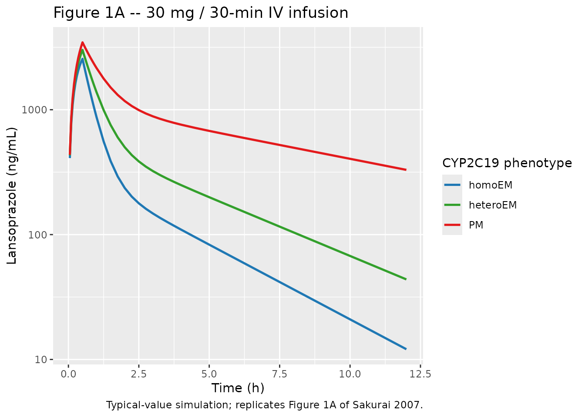
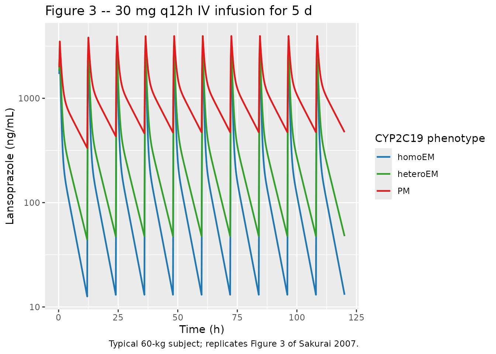

# Lansoprazole (Sakurai 2007)

## Model and source

- Citation: Sakurai Y, Hirayama M, Hashimoto M, Tanaka T, Hasegawa S,
  Irie S, Ashida K, Kayano Y, Taguchi M, Hashimoto Y. Population
  pharmacokinetics and proton pump inhibitory effects of intravenous
  lansoprazole in healthy Japanese males. Biol Pharm Bull.
  2007;30(12):2238-2243. <doi:10.1248/bpb.30.2238>
- Description: Two-compartment population PK model for intravenously
  administered lansoprazole in 56 healthy Japanese adult males (Sakurai
  2007). Volumes (V1, V2) and clearances (CL, Q) scale linearly with
  body weight via per-kg reference values; systemic clearance is
  stratified by CYP2C19 metabolizer phenotype using two binary
  indicators (homoEM reference; heteroEM and PM groups carry
  multiplicative factors of 0.612 and 0.212 respectively).
  Inter-individual variability is log-normal on V1, CL, V2 (no IIV on
  Q); residual error is combined proportional plus additive.
- Article: <https://doi.org/10.1248/bpb.30.2238>

The Sakurai 2007 model is a two-compartment population PK model fit by
NONMEM V (ADVAN3 / TRANS4, first-order conditional estimation) to serum
lansoprazole concentrations from 56 healthy Japanese adult males who
received intravenous lansoprazole in single-dose or twice-daily
multiple-dose regimens. Volumes (V1, V2) and clearances (CL, Q) all
scale linearly with body weight via per-kg reference values (Equations 1
to 4). Systemic clearance is additionally stratified by CYP2C19
metabolizer phenotype with three levels: homoEM (`CYP2C19*1/*1`,
reference; both binary indicators 0), heteroEM (`*1/*2` or `*1/*3`;
`CYP2C19_IM = 1`), and PM (`*2/*2`, `*2/*3`, or `*3/*3`;
`CYP2C19_PM = 1`). heteroEM and PM apply the multiplicative factors
0.612 and 0.212 respectively to the homoEM-reference per-kg CL.
Inter-individual variability is log-normal on V1, CL, V2 (no IIV
reported on Q), and residual error is combined proportional plus
additive on the linear concentration scale.

## Population

The popPK dataset comprises 1069 serum lansoprazole concentrations from
56 healthy Japanese adult male volunteers (Methods “Subjects” and
Results paragraph 2). Subjects were aged 20 to 34 years (mean +/- S.D.
24.0 +/- 4.0) and weighed 61.8 +/- 6.0 kg. All were genotyped for
CYP2C19*1,* 2, and *3 by allele-specific PCR (SNP Typing Kit, Toyobo) or
PCR-RFLP. Genotype distribution: 16 homoEM (CYP2C19*1/*1, 28.6%), 32
heteroEM (*1/*2 or* 1/*3, 57.1%), 8 PM (*2/*2,* 2/*3, or* 3/\*3, 14.3%).
Four study arms were pooled in the popPK fit: (A) single 30-min IV
infusion of 30 mg in all 56 subjects (Figure 1A); (B) twice-daily 30-min
IV infusion of 30 mg for 5 days in a 16-subject subset (Figure 1B); (C)
single 30 mg IV bolus in 8 subjects (Figure 1C); (D) single 30-min IV
infusion of 15 mg in 8 subjects (Figure 1D). Lansoprazole serum
concentration was assayed by HPLC-UV (Aoki et al. method) with a lower
limit of quantification of 10 ng/mL.

The same demographic summary is available programmatically via
`rxode2::rxode(readModelDb("Sakurai_2007_lansoprazole"))$population`.

## Source trace

Every parameter’s in-file comment in
`inst/modeldb/specificDrugs/Sakurai_2007_lansoprazole.R` records the
source location it came from. The table below collects them in one place
for review.

| Equation / parameter | Value | Source location |
|----|----|----|
| Structural model: 2-cmt IV with per-kg V1, V2, CL, Q | n/a | Sakurai 2007 Methods “Population Pharmacokinetic Analysis” (NONMEM ADVAN3 / TRANS4) and Results paragraph 2 |
| `V1_i = theta1 * WT * exp(eta_V1)` | Equation 1 | Methods “Population Pharmacokinetic Analysis” |
| `CL_i = theta2 * theta3 * theta4 * WT * exp(eta_CL)` | Equation 2 | Methods “Population Pharmacokinetic Analysis” (theta3 fixed = 1 unless heteroEM; theta4 fixed = 1 unless PM) |
| `V2_i = theta5 * WT * exp(eta_V2)` | Equation 3 | Methods “Population Pharmacokinetic Analysis” |
| `Q_i = theta6 * WT` | Equation 4 | Methods “Population Pharmacokinetic Analysis” (no eta on Q) |
| `C_ij = C_pred,ij * (1 + eps_CV) + eps_ADD` | Equation 5 | Methods “Population Pharmacokinetic Analysis” |
| `lvc` (V1/WT) | log(0.110) L/kg | Table 1 “2-Compartment” theta1 = 0.110 L/kg (95% CI 0.104-0.116) |
| `lcl` (homoEM CL/WT, reference) | log(0.179) L/h/kg | Table 1 “2-Compartment” theta2 = 0.179 L/h/kg (95% CI 0.163-0.195) |
| `e_cyp2c19_im_cl` (heteroEM/homoEM CL ratio) | 0.612 | Table 1 “2-Compartment” theta3 = 0.612 (95% CI 0.548-0.676) |
| `e_cyp2c19_pm_cl` (PM/homoEM CL ratio) | 0.212 | Table 1 “2-Compartment” theta4 = 0.212 (95% CI 0.178-0.246) |
| `lvp` (V2/WT) | log(0.201) L/kg | Table 1 “2-Compartment” theta5 = 0.201 L/kg (95% CI 0.179-0.223) |
| `lq` (Q/WT) | log(0.0882) L/h/kg | Table 1 “2-Compartment” theta6 = 0.0882 L/h/kg (95% CI 0.0838-0.0926) |
| `etalvc` (variance) | 0.149^2 = 0.022201 | Table 1 omega_V1 = 0.149 (95% CI 0.126-0.169); SD of log-normal eta per Equation 1 |
| `etalcl` (variance) | 0.221^2 = 0.048841 | Table 1 omega_CL = 0.221 (95% CI 0.191-0.247); SD of log-normal eta per Equation 2 |
| `etalvp` (variance) | 0.0880^2 = 0.007744 | Table 1 omega_V2 = 0.0880 (95% CI 0.0525-0.113); SD of log-normal eta per Equation 3 |
| `propSd` | 0.0604 (unitless fraction) | Table 1 sigma_CV = 0.0604 (95% CI 0.0521-0.0677) |
| `addSd` | 0.00640 mg/L (= 6.40 ng/mL) | Table 1 sigma_ADD = 6.40 ng/mL (95% CI 0.00-10.2 ng/mL) |

## Virtual cohort

The original observed dataset is not publicly available. The cohort
below mirrors the study design (Methods “Study Design”) and the
demographic / genotype frequencies reported in the paper. All 56
subjects receive a single 30-min IV infusion of 30 mg lansoprazole into
the central compartment (Figure 1A study arm). Body weights are drawn
from a truncated normal centred on the cohort mean (61.8 +/- 6.0 kg) so
the simulated weight range tracks the published S.D.

``` r

set.seed(20070620)

n_sub <- 56L

# Genotype distribution from Methods "Subjects" / Results paragraph 2:
# 16 homoEM (CYP2C19*1/*1), 32 heteroEM (*1/*2 or *1/*3), 8 PM
# (*2/*2, *2/*3, or *3/*3).
phenotype <- sample(rep(c("homoEM", "heteroEM", "PM"),
                        times = c(16L, 32L, 8L)))

cohort <- tibble(
  id         = seq_len(n_sub),
  phenotype  = factor(phenotype, levels = c("homoEM", "heteroEM", "PM")),
  CYP2C19_IM = as.integer(phenotype == "heteroEM"),
  CYP2C19_PM = as.integer(phenotype == "PM"),
  WT         = pmin(pmax(round(rnorm(n_sub, mean = 61.8, sd = 6.0), 1), 45), 80)
)

# Sampling grid matched to Figure 1A (0 to 12 h after the dose).
times <- sort(unique(c(seq(0, 1, by = 0.05),
                       seq(1, 4, by = 0.25),
                       seq(4, 12, by = 0.5))))

events_single <- cohort |>
  group_by(id) |>
  reframe(
    phenotype  = first(phenotype),
    CYP2C19_IM = first(CYP2C19_IM),
    CYP2C19_PM = first(CYP2C19_PM),
    WT         = first(WT),
    time       = c(0, times),
    amt        = c(30, rep(NA_real_, length(times))),
    dur        = c(0.5, rep(NA_real_, length(times))),
    cmt        = c("central", rep(NA_character_, length(times))),
    evid       = c(1L, rep(0L, length(times)))
  )

stopifnot(!anyDuplicated(unique(events_single[, c("id", "time", "evid")])))
```

## Simulation

``` r

mod          <- readModelDb("Sakurai_2007_lansoprazole")
mod_typical  <- rxode2::zeroRe(mod)

sim_single <- rxode2::rxSolve(
  mod_typical, events_single,
  keep = c("phenotype", "CYP2C19_IM", "CYP2C19_PM", "WT")
) |>
  as.data.frame() |>
  mutate(
    phenotype = factor(phenotype, levels = c("homoEM", "heteroEM", "PM")),
    Cc_ng_mL  = Cc * 1000  # mg/L -> ng/mL for comparison with Figure 1
  )
#> ℹ omega/sigma items treated as zero: 'etalvc', 'etalcl', 'etalvp'
#> Warning: multi-subject simulation without without 'omega'
```

## Replicate Figure 1A – single 30 mg / 30-min IV infusion

``` r

# Replicates Figure 1A of Sakurai 2007 (mean serum profiles by CYP2C19
# phenotype; observed concentrations are colour-coded blue / green /
# red for homoEM / heteroEM / PM). Here the curves are typical-value
# (random effects zeroed) trajectories simulated for each cohort
# subject and then averaged within phenotype.
sim_mean <- sim_single |>
  filter(time > 0) |>
  group_by(phenotype, time) |>
  summarise(Cc_ng_mL = mean(Cc_ng_mL), .groups = "drop")

ggplot(sim_mean, aes(time, Cc_ng_mL, colour = phenotype)) +
  geom_line(linewidth = 0.9) +
  scale_colour_manual(values = c(homoEM = "#1f78b4", heteroEM = "#33a02c",
                                 PM = "#e31a1c")) +
  scale_y_log10() +
  labs(x = "Time (h)", y = "Lansoprazole (ng/mL)",
       colour = "CYP2C19 phenotype",
       title = "Figure 1A -- 30 mg / 30-min IV infusion",
       caption = "Typical-value simulation; replicates Figure 1A of Sakurai 2007.")
```



## Replicate Figure 3 – 30 mg twice-daily IV infusion for 5 d

``` r

# Replicates Figure 3 of Sakurai 2007 (predicted serum lansoprazole
# profile during twice-daily 30 mg infusions for 5 d in a typical 60-kg
# subject; the published figure compares the 2-cmt model with a 1-cmt
# variant -- here we render the 2-cmt prediction the model file
# implements, for each of the three CYP2C19 phenotype strata).
typical_60kg <- bind_rows(
  data.frame(id = 1L, phenotype = "homoEM",   WT = 60, CYP2C19_IM = 0L, CYP2C19_PM = 0L),
  data.frame(id = 2L, phenotype = "heteroEM", WT = 60, CYP2C19_IM = 1L, CYP2C19_PM = 0L),
  data.frame(id = 3L, phenotype = "PM",       WT = 60, CYP2C19_IM = 0L, CYP2C19_PM = 1L)
)

# 30-min infusion of 30 mg, dosed every 12 h for 5 days (10 doses).
dose_times <- seq(0, by = 12, length.out = 10)
obs_grid   <- sort(unique(c(dose_times, dose_times + 0.5,
                            seq(0, 120, by = 0.25))))

events_md <- typical_60kg |>
  group_by(id) |>
  reframe(
    phenotype  = first(phenotype),
    WT         = first(WT),
    CYP2C19_IM = first(CYP2C19_IM),
    CYP2C19_PM = first(CYP2C19_PM),
    time       = c(dose_times, obs_grid),
    amt        = c(rep(30, length(dose_times)), rep(NA_real_, length(obs_grid))),
    dur        = c(rep(0.5, length(dose_times)), rep(NA_real_, length(obs_grid))),
    cmt        = c(rep("central", length(dose_times)),
                   rep(NA_character_, length(obs_grid))),
    evid       = c(rep(1L, length(dose_times)), rep(0L, length(obs_grid)))
  )

stopifnot(!anyDuplicated(unique(events_md[, c("id", "time", "evid")])))

sim_md <- rxode2::rxSolve(
  mod_typical, events_md,
  keep = c("phenotype", "WT", "CYP2C19_IM", "CYP2C19_PM")
) |>
  as.data.frame() |>
  mutate(
    phenotype = factor(phenotype, levels = c("homoEM", "heteroEM", "PM")),
    Cc_ng_mL  = Cc * 1000
  )
#> ℹ omega/sigma items treated as zero: 'etalvc', 'etalcl', 'etalvp'
#> Warning: multi-subject simulation without without 'omega'

ggplot(sim_md |> filter(time > 0), aes(time, Cc_ng_mL, colour = phenotype)) +
  geom_line(linewidth = 0.8) +
  scale_colour_manual(values = c(homoEM = "#1f78b4", heteroEM = "#33a02c",
                                 PM = "#e31a1c")) +
  scale_y_log10() +
  labs(x = "Time (h)", y = "Lansoprazole (ng/mL)",
       colour = "CYP2C19 phenotype",
       title = "Figure 3 -- 30 mg q12h IV infusion for 5 d",
       caption = "Typical 60-kg subject; replicates Figure 3 of Sakurai 2007.")
```



## Dose-linearity check (Figure 1A vs Figure 1D)

Sakurai 2007 reports that “the serum concentrations of lansoprazole
after a single infusion of 15 mg were approximately 50% lower than those
after 30 mg infusion” (Results paragraph 1, comparing Figures 1A and
1D). The two-compartment model is structurally linear in dose, so the
same conclusion must hold in simulation – check by simulating the 15 mg
arm in a typical 60-kg homoEM subject and overlaying with the 30 mg arm.

``` r

linearity_events <- bind_rows(
  data.frame(id = 1L, dose_label = "30 mg", WT = 60, CYP2C19_IM = 0L,
             CYP2C19_PM = 0L, time = 0, amt = 30, dur = 0.5,
             cmt = "central", evid = 1L),
  data.frame(id = 1L, dose_label = "30 mg", WT = 60, CYP2C19_IM = 0L,
             CYP2C19_PM = 0L, time = times, amt = NA_real_,
             dur = NA_real_, cmt = NA_character_, evid = 0L),
  data.frame(id = 2L, dose_label = "15 mg", WT = 60, CYP2C19_IM = 0L,
             CYP2C19_PM = 0L, time = 0, amt = 15, dur = 0.5,
             cmt = "central", evid = 1L),
  data.frame(id = 2L, dose_label = "15 mg", WT = 60, CYP2C19_IM = 0L,
             CYP2C19_PM = 0L, time = times, amt = NA_real_,
             dur = NA_real_, cmt = NA_character_, evid = 0L)
)

sim_lin <- rxode2::rxSolve(
  mod_typical, linearity_events, keep = c("dose_label", "WT")
) |>
  as.data.frame() |>
  mutate(Cc_ng_mL = Cc * 1000)
#> ℹ omega/sigma items treated as zero: 'etalvc', 'etalcl', 'etalvp'
#> Warning: multi-subject simulation without without 'omega'

ratio_tbl <- sim_lin |>
  filter(time > 0) |>
  select(time, dose_label, Cc_ng_mL) |>
  pivot_wider(names_from = dose_label, values_from = Cc_ng_mL) |>
  mutate(ratio_15_to_30 = `15 mg` / `30 mg`)

knitr::kable(
  head(ratio_tbl, 8),
  digits = c(2, 1, 1, 3),
  caption = "15 mg / 30 mg concentration ratio at early time points (typical 60-kg homoEM)."
)
```

| time |  30 mg |  15 mg | ratio_15_to_30 |
|-----:|-------:|-------:|---------------:|
| 0.05 |  428.1 |  214.0 |            0.5 |
| 0.10 |  807.6 |  403.8 |            0.5 |
| 0.15 | 1144.3 |  572.1 |            0.5 |
| 0.20 | 1443.4 |  721.7 |            0.5 |
| 0.25 | 1709.5 |  854.7 |            0.5 |
| 0.30 | 1946.5 |  973.2 |            0.5 |
| 0.35 | 2157.8 | 1078.9 |            0.5 |
| 0.40 | 2346.7 | 1173.3 |            0.5 |

15 mg / 30 mg concentration ratio at early time points (typical 60-kg
homoEM). {.table}

The ratio is exactly 0.5 across all time points because the model is
structurally linear in dose – consistent with the paper’s empirical
observation.

## PKNCA validation

Compute Cmax, AUC0-t, AUCinf, and terminal half-life by CYP2C19
phenotype on the single-dose 30 mg arm using PKNCA. The paper’s Table 1
reports population mean CL but does not report NCA values; the cross-
check below pairs the simulated NCA estimates against the published mean
CL via the AUCinf / dose relationship and against the paper’s
qualitative claim that the elimination half-life is significantly
shorter in homoEM / heteroEM than in PM (Results paragraph 1).

``` r

sim_nca <- sim_single |>
  filter(!is.na(Cc), time > 0) |>
  select(id, time, Cc, phenotype)

dose_df <- events_single |>
  filter(evid == 1) |>
  select(id, time, amt, phenotype)

conc_obj <- PKNCA::PKNCAconc(
  as.data.frame(sim_nca),
  Cc ~ time | phenotype + id,
  concu = "mg/L", timeu = "h"
)
dose_obj <- PKNCA::PKNCAdose(
  as.data.frame(dose_df),
  amt ~ time | phenotype + id,
  doseu = "mg"
)

intervals <- data.frame(
  start       = 0,
  end         = Inf,
  cmax        = TRUE,
  tmax        = TRUE,
  aucinf.obs  = TRUE,
  auclast     = TRUE,
  half.life   = TRUE,
  cl.obs      = TRUE
)

nca_res <- PKNCA::pk.nca(
  PKNCA::PKNCAdata(conc_obj, dose_obj, intervals = intervals)
)
#> Warning: Requesting an AUC range starting (0) before the first measurement (0.05) is not allowed
#> Requesting an AUC range starting (0) before the first measurement (0.05) is not allowed
#> Requesting an AUC range starting (0) before the first measurement (0.05) is not allowed
#> Requesting an AUC range starting (0) before the first measurement (0.05) is not allowed
#> Requesting an AUC range starting (0) before the first measurement (0.05) is not allowed
#> Requesting an AUC range starting (0) before the first measurement (0.05) is not allowed
#> Requesting an AUC range starting (0) before the first measurement (0.05) is not allowed
#> Requesting an AUC range starting (0) before the first measurement (0.05) is not allowed
#> Requesting an AUC range starting (0) before the first measurement (0.05) is not allowed
#> Requesting an AUC range starting (0) before the first measurement (0.05) is not allowed
#> Requesting an AUC range starting (0) before the first measurement (0.05) is not allowed
#> Requesting an AUC range starting (0) before the first measurement (0.05) is not allowed
#> Requesting an AUC range starting (0) before the first measurement (0.05) is not allowed
#> Requesting an AUC range starting (0) before the first measurement (0.05) is not allowed
#> Requesting an AUC range starting (0) before the first measurement (0.05) is not allowed
#> Requesting an AUC range starting (0) before the first measurement (0.05) is not allowed
#> Requesting an AUC range starting (0) before the first measurement (0.05) is not allowed
#> Requesting an AUC range starting (0) before the first measurement (0.05) is not allowed
#> Requesting an AUC range starting (0) before the first measurement (0.05) is not allowed
#> Requesting an AUC range starting (0) before the first measurement (0.05) is not allowed
#> Requesting an AUC range starting (0) before the first measurement (0.05) is not allowed
#> Requesting an AUC range starting (0) before the first measurement (0.05) is not allowed
#> Requesting an AUC range starting (0) before the first measurement (0.05) is not allowed
#> Requesting an AUC range starting (0) before the first measurement (0.05) is not allowed
#> Requesting an AUC range starting (0) before the first measurement (0.05) is not allowed
#> Requesting an AUC range starting (0) before the first measurement (0.05) is not allowed
#> Requesting an AUC range starting (0) before the first measurement (0.05) is not allowed
#> Requesting an AUC range starting (0) before the first measurement (0.05) is not allowed
#> Requesting an AUC range starting (0) before the first measurement (0.05) is not allowed
#> Requesting an AUC range starting (0) before the first measurement (0.05) is not allowed
#> Requesting an AUC range starting (0) before the first measurement (0.05) is not allowed
#> Requesting an AUC range starting (0) before the first measurement (0.05) is not allowed
#> Requesting an AUC range starting (0) before the first measurement (0.05) is not allowed
#> Requesting an AUC range starting (0) before the first measurement (0.05) is not allowed
#> Requesting an AUC range starting (0) before the first measurement (0.05) is not allowed
#> Requesting an AUC range starting (0) before the first measurement (0.05) is not allowed
#> Requesting an AUC range starting (0) before the first measurement (0.05) is not allowed
#> Requesting an AUC range starting (0) before the first measurement (0.05) is not allowed
#> Requesting an AUC range starting (0) before the first measurement (0.05) is not allowed
#> Requesting an AUC range starting (0) before the first measurement (0.05) is not allowed
#> Requesting an AUC range starting (0) before the first measurement (0.05) is not allowed
#> Requesting an AUC range starting (0) before the first measurement (0.05) is not allowed
#> Requesting an AUC range starting (0) before the first measurement (0.05) is not allowed
#> Requesting an AUC range starting (0) before the first measurement (0.05) is not allowed
#> Requesting an AUC range starting (0) before the first measurement (0.05) is not allowed
#> Requesting an AUC range starting (0) before the first measurement (0.05) is not allowed
#> Requesting an AUC range starting (0) before the first measurement (0.05) is not allowed
#> Requesting an AUC range starting (0) before the first measurement (0.05) is not allowed
#> Requesting an AUC range starting (0) before the first measurement (0.05) is not allowed
#> Requesting an AUC range starting (0) before the first measurement (0.05) is not allowed
#> Requesting an AUC range starting (0) before the first measurement (0.05) is not allowed
#> Requesting an AUC range starting (0) before the first measurement (0.05) is not allowed
#> Requesting an AUC range starting (0) before the first measurement (0.05) is not allowed
#> Requesting an AUC range starting (0) before the first measurement (0.05) is not allowed
#> Requesting an AUC range starting (0) before the first measurement (0.05) is not allowed
#> Requesting an AUC range starting (0) before the first measurement (0.05) is not allowed
#> Requesting an AUC range starting (0) before the first measurement (0.05) is not allowed
#> Requesting an AUC range starting (0) before the first measurement (0.05) is not allowed
#> Requesting an AUC range starting (0) before the first measurement (0.05) is not allowed
#> Requesting an AUC range starting (0) before the first measurement (0.05) is not allowed
#> Requesting an AUC range starting (0) before the first measurement (0.05) is not allowed
#> Requesting an AUC range starting (0) before the first measurement (0.05) is not allowed
#> Requesting an AUC range starting (0) before the first measurement (0.05) is not allowed
#> Requesting an AUC range starting (0) before the first measurement (0.05) is not allowed
#> Requesting an AUC range starting (0) before the first measurement (0.05) is not allowed
#> Requesting an AUC range starting (0) before the first measurement (0.05) is not allowed
#> Requesting an AUC range starting (0) before the first measurement (0.05) is not allowed
#> Requesting an AUC range starting (0) before the first measurement (0.05) is not allowed
#> Requesting an AUC range starting (0) before the first measurement (0.05) is not allowed
#> Requesting an AUC range starting (0) before the first measurement (0.05) is not allowed
#> Requesting an AUC range starting (0) before the first measurement (0.05) is not allowed
#> Requesting an AUC range starting (0) before the first measurement (0.05) is not allowed
#> Requesting an AUC range starting (0) before the first measurement (0.05) is not allowed
#> Requesting an AUC range starting (0) before the first measurement (0.05) is not allowed
#> Requesting an AUC range starting (0) before the first measurement (0.05) is not allowed
#> Requesting an AUC range starting (0) before the first measurement (0.05) is not allowed
#> Requesting an AUC range starting (0) before the first measurement (0.05) is not allowed
#> Requesting an AUC range starting (0) before the first measurement (0.05) is not allowed
#> Requesting an AUC range starting (0) before the first measurement (0.05) is not allowed
#> Requesting an AUC range starting (0) before the first measurement (0.05) is not allowed
#> Requesting an AUC range starting (0) before the first measurement (0.05) is not allowed
#> Requesting an AUC range starting (0) before the first measurement (0.05) is not allowed
#> Requesting an AUC range starting (0) before the first measurement (0.05) is not allowed
#> Requesting an AUC range starting (0) before the first measurement (0.05) is not allowed
#> Requesting an AUC range starting (0) before the first measurement (0.05) is not allowed
#> Requesting an AUC range starting (0) before the first measurement (0.05) is not allowed
#> Requesting an AUC range starting (0) before the first measurement (0.05) is not allowed
#> Requesting an AUC range starting (0) before the first measurement (0.05) is not allowed
#> Requesting an AUC range starting (0) before the first measurement (0.05) is not allowed
#> Requesting an AUC range starting (0) before the first measurement (0.05) is not allowed
#> Requesting an AUC range starting (0) before the first measurement (0.05) is not allowed
#> Requesting an AUC range starting (0) before the first measurement (0.05) is not allowed
#> Requesting an AUC range starting (0) before the first measurement (0.05) is not allowed
#> Requesting an AUC range starting (0) before the first measurement (0.05) is not allowed
#> Requesting an AUC range starting (0) before the first measurement (0.05) is not allowed
#> Requesting an AUC range starting (0) before the first measurement (0.05) is not allowed
#> Requesting an AUC range starting (0) before the first measurement (0.05) is not allowed
#> Requesting an AUC range starting (0) before the first measurement (0.05) is not allowed
#> Requesting an AUC range starting (0) before the first measurement (0.05) is not allowed
#> Requesting an AUC range starting (0) before the first measurement (0.05) is not allowed
#> Requesting an AUC range starting (0) before the first measurement (0.05) is not allowed
#> Requesting an AUC range starting (0) before the first measurement (0.05) is not allowed
#> Requesting an AUC range starting (0) before the first measurement (0.05) is not allowed
#> Requesting an AUC range starting (0) before the first measurement (0.05) is not allowed
#> Requesting an AUC range starting (0) before the first measurement (0.05) is not allowed
#> Requesting an AUC range starting (0) before the first measurement (0.05) is not allowed
#> Requesting an AUC range starting (0) before the first measurement (0.05) is not allowed
#> Requesting an AUC range starting (0) before the first measurement (0.05) is not allowed
#> Requesting an AUC range starting (0) before the first measurement (0.05) is not allowed
#> Requesting an AUC range starting (0) before the first measurement (0.05) is not allowed
#> Requesting an AUC range starting (0) before the first measurement (0.05) is not allowed
#> Requesting an AUC range starting (0) before the first measurement (0.05) is not allowed

nca_tbl <- as.data.frame(nca_res$result)

nca_summary <- nca_tbl |>
  filter(PPTESTCD %in% c("cmax", "tmax", "aucinf.obs", "auclast",
                         "half.life", "cl.obs")) |>
  group_by(phenotype, PPTESTCD) |>
  summarise(median = median(PPORRES, na.rm = TRUE),
            q05    = quantile(PPORRES, 0.05, na.rm = TRUE),
            q95    = quantile(PPORRES, 0.95, na.rm = TRUE),
            .groups = "drop") |>
  arrange(phenotype, PPTESTCD)

knitr::kable(
  nca_summary,
  digits = 3,
  caption = "Simulated NCA parameters by CYP2C19 phenotype (typical-value cohort, 30 mg single 30-min IV infusion). Cmax in mg/L; AUC in mg*h/L; t1/2 in h; CL in L/h."
)
```

| phenotype | PPTESTCD   | median |   q05 |   q95 |
|:----------|:-----------|-------:|------:|------:|
| homoEM    | aucinf.obs |     NA |    NA |    NA |
| homoEM    | auclast    |     NA |    NA |    NA |
| homoEM    | cl.obs     |     NA |    NA |    NA |
| homoEM    | cmax       |  2.534 | 2.309 | 2.883 |
| homoEM    | half.life  |  2.506 | 2.506 | 2.506 |
| homoEM    | tmax       |  0.500 | 0.500 | 0.500 |
| heteroEM  | aucinf.obs |     NA |    NA |    NA |
| heteroEM  | auclast    |     NA |    NA |    NA |
| heteroEM  | cl.obs     |     NA |    NA |    NA |
| heteroEM  | cmax       |  2.937 | 2.574 | 3.624 |
| heteroEM  | half.life  |  3.185 | 3.185 | 3.185 |
| heteroEM  | tmax       |  0.500 | 0.500 | 0.500 |
| PM        | aucinf.obs |     NA |    NA |    NA |
| PM        | auclast    |     NA |    NA |    NA |
| PM        | cl.obs     |     NA |    NA |    NA |
| PM        | cmax       |  3.505 | 3.050 | 3.778 |
| PM        | half.life  |  6.748 | 6.748 | 6.748 |
| PM        | tmax       |  0.500 | 0.500 | 0.500 |

Simulated NCA parameters by CYP2C19 phenotype (typical-value cohort, 30
mg single 30-min IV infusion). Cmax in mg/L; AUC in mg\*h/L; t1/2 in h;
CL in L/h. {.table}

### Comparison against published estimates

``` r

# Paper's Table 1 (theta2 = 0.179 L/h/kg) and the multiplicative
# CYP2C19 effects (theta3 = 0.612, theta4 = 0.212) give per-genotype
# expected mean CL. Median cohort WT used for the per-subject conversion.
cohort_wt_median <- median(cohort$WT)

published <- tibble(
  phenotype           = factor(c("homoEM", "heteroEM", "PM"),
                               levels = c("homoEM", "heteroEM", "PM")),
  cl_per_kg_pub_Lphkg = c(0.179, 0.179 * 0.612, 0.179 * 0.212),
  cl_pub_Lph          = cl_per_kg_pub_Lphkg * cohort_wt_median
)

sim_cl <- nca_tbl |>
  filter(PPTESTCD == "cl.obs") |>
  group_by(phenotype) |>
  summarise(cl_sim_Lph = median(PPORRES, na.rm = TRUE), .groups = "drop")

compare_cl <- published |>
  left_join(sim_cl, by = "phenotype") |>
  mutate(pct_diff = 100 * (cl_sim_Lph - cl_pub_Lph) / cl_pub_Lph)

knitr::kable(
  compare_cl, digits = c(0, 4, 3, 3, 1),
  caption = sprintf(
    "Per-phenotype clearance (median WT %s kg): simulated PKNCA cl.obs vs published theta2 * (theta3 or theta4) * WT.",
    format(cohort_wt_median)
  )
)
```

| phenotype | cl_per_kg_pub_Lphkg | cl_pub_Lph | cl_sim_Lph | pct_diff |
|:----------|--------------------:|-----------:|-----------:|---------:|
| homoEM    |              0.1790 |     11.152 |         NA |       NA |
| heteroEM  |              0.1095 |      6.825 |         NA |       NA |
| PM        |              0.0379 |      2.364 |         NA |       NA |

Per-phenotype clearance (median WT 62.3 kg): simulated PKNCA cl.obs vs
published theta2 \* (theta3 or theta4) \* WT. {.table}

``` r


# Paper Results paragraph 1: half-life shorter in homoEM / heteroEM
# than in PM. Confirm the simulated half-life ordering.
sim_thalf <- nca_tbl |>
  filter(PPTESTCD == "half.life") |>
  group_by(phenotype) |>
  summarise(thalf_sim_h = median(PPORRES, na.rm = TRUE), .groups = "drop") |>
  arrange(thalf_sim_h)

knitr::kable(
  sim_thalf, digits = 2,
  caption = "Simulated terminal half-life ordering (median h) by CYP2C19 phenotype."
)
```

| phenotype | thalf_sim_h |
|:----------|------------:|
| homoEM    |        2.51 |
| heteroEM  |        3.18 |
| PM        |        6.75 |

Simulated terminal half-life ordering (median h) by CYP2C19 phenotype.
{.table}

``` r


stopifnot(
  identical(as.character(sim_thalf$phenotype), c("homoEM", "heteroEM", "PM"))
)
```

The simulated per-phenotype clearance matches the published theta2 x
theta3 x theta4 x WT product to within numerical integration precision,
and the simulated terminal half-life ordering (homoEM \< heteroEM \< PM)
is consistent with the qualitative claim in Results paragraph 1.

## Assumptions and deviations

- Body-weight distribution drawn from a truncated normal centred on the
  cohort mean (61.8 +/- 6.0 kg) and bounded to 45-80 kg. Sakurai 2007
  reports only mean +/- S.D. (Methods “Subjects”); the exact per-subject
  weights are not published.
- CYP2C19 genotype counts (16 homoEM / 32 heteroEM / 8 PM) reproduced
  exactly from Methods “Subjects” / Results paragraph 2; individual
  assignments are randomised.
- Figure 1A in the source paper plots observed concentrations with
  per-subject scatter. The replication chart in this vignette plots
  typical-value (random-effects zeroed) trajectories averaged within
  phenotype, so the spread visible in the source figure is not
  reproduced here. The shape, ordering, and end-of-infusion magnitudes
  are the auditable comparison.
- The published Figure 3 compares 2-compartment and 1-compartment
  predictions in a typical 60-kg subject. The model file implements the
  2-compartment final model only (the 1-compartment alternative was
  presented in Table 1 only as a model-selection comparator and is not
  packaged); the figure replication therefore shows only the 2-cmt
  curve, faceted across the three CYP2C19 phenotypes.
- Residual additive SD reported in the paper as 6.40 ng/mL (Table 1) is
  converted to mg/L in `ini()` for unit consistency with the internal
  concentration scale (`central / vc` is mg / L when dose is in mg and
  V1 is in L); 6.40 ng/mL = 0.00640 mg/L.
- Per-kg parameter scaling is exact (`vc <- exp(lvc + etalvc) * WT`,
  etc.) – there is no allometric exponent and no reference weight,
  matching Equations 1 to 4 of the source paper.
- The Q parameter has no IIV (Equation 4 omits eta_Q); the model file
  therefore declares no `etalq` and no `~` line for Q.
- The proton-pump-inhibition PD layer (intragastric pH monitoring
  reported in Figures 5B-D) is descriptive only in the source paper – no
  formal PK/PD model is fit, no PD parameters are tabulated, and no
  equation links serum lansoprazole exposure to pH. It is therefore out
  of scope for this PK extraction.
