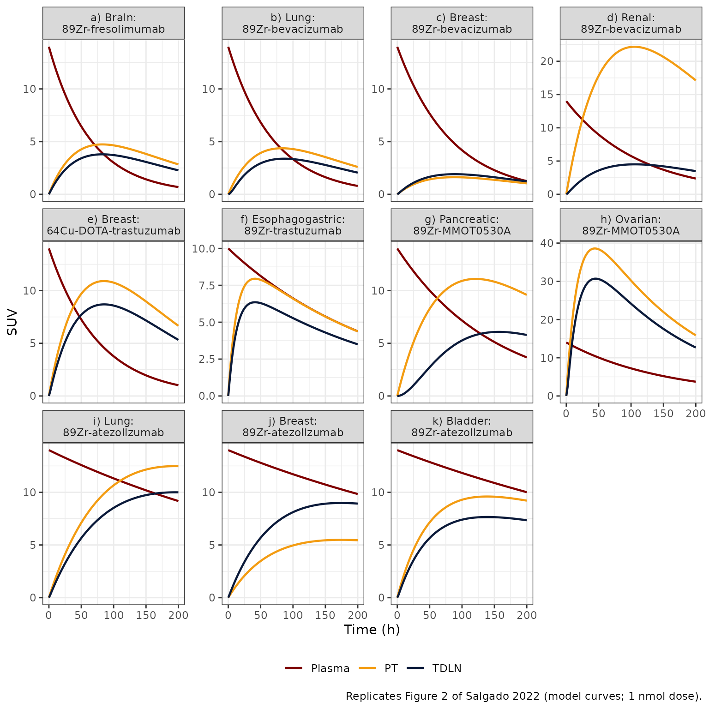
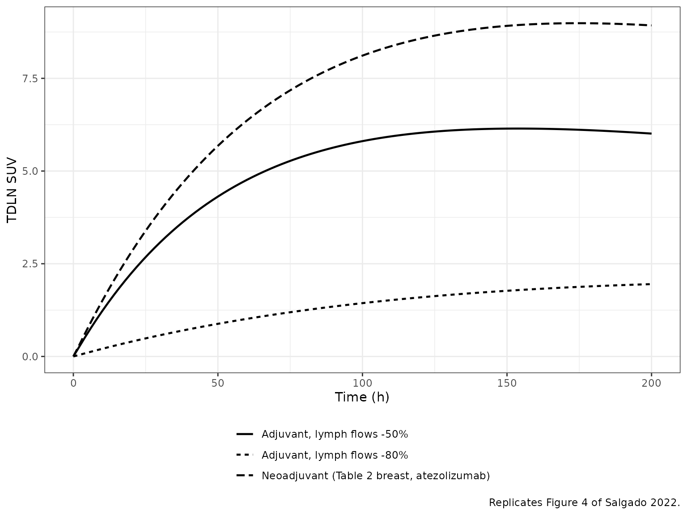
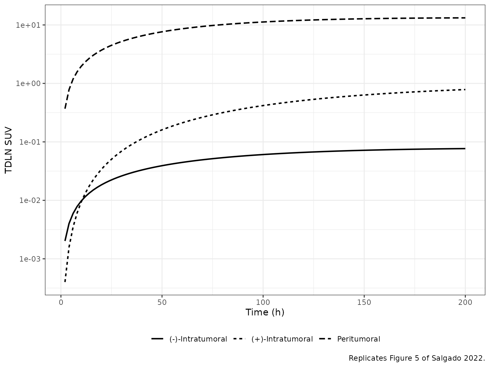
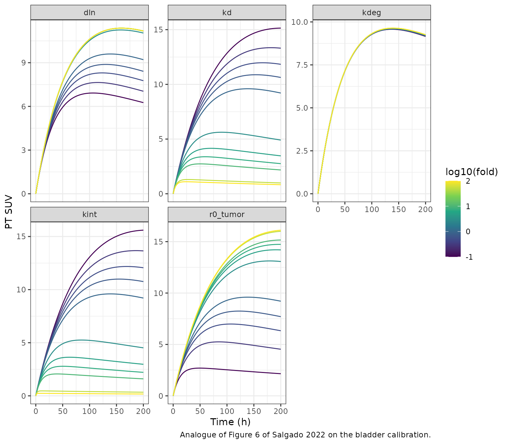

# Antibody tumor-to-lymph-node PBPK (Salgado 2022)

## Model and source

- Citation: Salgado E, Cao Y. A Physiologically Based Pharmacokinetic
  Framework for Quantifying Antibody Distribution Gradients from Tumors
  to Tumor-Draining Lymph Nodes. Antibodies (Basel). 2022;11(2):28.
  <doi:10.3390/antib11020028>. Calibration data digitized by the authors
  from Bensch F et al., Nat Med 2018;24:1852-1858.
- Article: [Antibodies (Basel)
  2022;11(2):28](https://doi.org/10.3390/antib11020028) (open access)

Salgado and Cao built a proof-of-concept minimal physiologically based
pharmacokinetic (PBPK) model of how a therapeutic antibody distributes
from plasma into an organ-specific primary tumor (PT) and on to its
tumor-draining lymph node (TDLN). They calibrated the same structural
model separately to eleven antibody / tumor pairs, using immuno-PET
standardized uptake values (SUV) digitized from eight published imaging
studies, and then used the calibrated model to explore metastasis,
surgical resection, and tumor-induced inflammation.

Each calibration is packaged as its own model; all eleven share the same
`model()` block and differ only in the Table 1 / Table 2 parameter
values.

``` r

models <- tibble::tribble(
  ~panel, ~model,                                          ~label,
  "a",    "Salgado_2022_fresolimumab_glioblastoma_pbpk",   "a) Brain: 89Zr-fresolimumab",
  "b",    "Salgado_2022_bevacizumab_nsclc_pbpk",           "b) Lung: 89Zr-bevacizumab",
  "c",    "Salgado_2022_bevacizumab_breast_pbpk",          "c) Breast: 89Zr-bevacizumab",
  "d",    "Salgado_2022_bevacizumab_renal_pbpk",           "d) Renal: 89Zr-bevacizumab",
  "e",    "Salgado_2022_trastuzumab_breast_pbpk",          "e) Breast: 64Cu-DOTA-trastuzumab",
  "f",    "Salgado_2022_trastuzumab_esophagogastric_pbpk", "f) Esophagogastric: 89Zr-trastuzumab",
  "g",    "Salgado_2022_MMOT0530A_pancreatic_pbpk",        "g) Pancreatic: 89Zr-MMOT0530A",
  "h",    "Salgado_2022_MMOT0530A_ovarian_pbpk",           "h) Ovarian: 89Zr-MMOT0530A",
  "i",    "Salgado_2022_atezolizumab_nsclc_pbpk",          "i) Lung: 89Zr-atezolizumab",
  "j",    "Salgado_2022_atezolizumab_breast_pbpk",         "j) Breast: 89Zr-atezolizumab",
  "k",    "Salgado_2022_atezolizumab_bladder_pbpk",        "k) Bladder: 89Zr-atezolizumab"
)
mods <- lapply(models$model, readModelDb)
names(mods) <- models$panel
knitr::kable(models |> dplyr::rename("Figure 2 panel" = panel, "Model" = model, "Tumor: tracer" = label))
```

| Figure 2 panel | Model | Tumor: tracer |
|:---|:---|:---|
| a | Salgado_2022_fresolimumab_glioblastoma_pbpk | a\) Brain: 89Zr-fresolimumab |
| b | Salgado_2022_bevacizumab_nsclc_pbpk | b\) Lung: 89Zr-bevacizumab |
| c | Salgado_2022_bevacizumab_breast_pbpk | c\) Breast: 89Zr-bevacizumab |
| d | Salgado_2022_bevacizumab_renal_pbpk | d\) Renal: 89Zr-bevacizumab |
| e | Salgado_2022_trastuzumab_breast_pbpk | e\) Breast: 64Cu-DOTA-trastuzumab |
| f | Salgado_2022_trastuzumab_esophagogastric_pbpk | f\) Esophagogastric: 89Zr-trastuzumab |
| g | Salgado_2022_MMOT0530A_pancreatic_pbpk | g\) Pancreatic: 89Zr-MMOT0530A |
| h | Salgado_2022_MMOT0530A_ovarian_pbpk | h\) Ovarian: 89Zr-MMOT0530A |
| i | Salgado_2022_atezolizumab_nsclc_pbpk | i\) Lung: 89Zr-atezolizumab |
| j | Salgado_2022_atezolizumab_breast_pbpk | j\) Breast: 89Zr-atezolizumab |
| k | Salgado_2022_atezolizumab_bladder_pbpk | k\) Bladder: 89Zr-atezolizumab |

## Population

The model was calibrated to published group-mean (+/- SD) SUV time
courses, not to individual patients, so no subject count or demographic
table applies. The eleven calibration data sets (Salgado 2022 Section
2.2 and Figure 2) are 89Zr-fresolimumab in recurrent high-grade glioma
(den Hollander 2015); 89Zr-bevacizumab in non-small-cell lung cancer
(Bahce 2014), primary breast cancer (Gaykema 2013) and renal cell
carcinoma (Oosting 2015); 64Cu-DOTA-trastuzumab in HER2-positive breast
cancer (Tamura 2013); 89Zr-trastuzumab in esophagogastric cancer
(O’Donoghue 2018); 89Zr-MMOT0530A (anti-mesothelin) in pancreatic and
ovarian cancer (Lamberts 2016); and 89Zr-atezolizumab (anti-PD-L1) in
non-small-cell lung, breast and bladder cancer (Bensch 2018). Each
model’s `population` metadata names its source study
(`readModelDb("<model>")()$population`).

## Model structure

The ODEs are Salgado 2022 Appendix A, Eqs. A1-A5. With `C` denoting
total antibody concentration, `Cf` the free antibody concentration,
`R_T` the total target concentration and `AR` the antibody-target
complex:

- Plasma (A1):
  `Vp dCp/dt = Input - (1 - sigma_V) Lorgan Cp - CLp Cp + Leff Cf2 FcRnb2`
- PT interstitium (A2):
  `VISF,PT dC_PT/dt = (1 - sigma_V) Lorgan Cp - (1 - sigma_L) Laff Cf1 FcRnb1 - kint AR_PT VISF,PT`
- PT target (A3):
  `dR_T,PT/dt = ksyn,PT - kdeg (R_T,PT - AR_PT) - kint AR_PT`, initial
  value R01
- TDLN interstitium (A4):
  `VISF,TDLN dC_TDLN/dt = (1 - sigma_L) Laff Cf1 FcRnb1 - Leff Cf2 FcRnb2 - kint AR_TDLN VISF,TDLN`
- TDLN target (A5):
  `dR_T,TDLN/dt = ksyn,TDLN - kdeg (R_T,TDLN - AR_TDLN) - kint AR_TDLN`,
  initial value R02
- Free antibody (A6, A7):
  `Cf = 0.5 ((C - R_T - Kd) + sqrt((C - R_T - Kd)^2 + 4 C Kd))`
- Complex (A8, A9): `AR = R_T Cf / (Kd + Cf)`
- Lymphatic FcRn salvage (A10):
  `FcRnb = 0.418 + ([FcRn] / (Cf + Kd,FcRn + [FcRn]))^dln`

The packaged models use `central` (plasma, nmol), `is_tumor` (PT
interstitium, nmol), `lnode` (TDLN interstitium, nmol), and
`total_target_tumor` / `total_target_lnode` (nM). Outputs are the total
antibody concentrations `Cc`, `Ctumor` and `Clnode` (nM). Doses are in
nmol.

### Target synthesis: the printed term versus the steady-state term

Eqs. A3 and A5 as printed use the baseline concentration R01 (R02)
itself as the zero-order synthesis term, with the same R01 (R02) as
initial condition. With `kdeg = 0.01 1/h` that is not a steady state:
the total target would climb toward `R01 / kdeg`, 100-fold above
baseline. The Figure 1 caption names the synthesis rate `ksyn`, and the
steady-state form `ksyn = kdeg * R01` reproduces the Figure 2
calibration curves, whereas the literal form does not. The packaged
models therefore use `ksyn = kdeg * R0`. The chunk below re-solves the
pancreatic calibration (Figure 2g) both ways at a 1 nmol dose.

SUV is computed as `C (nM) * 70 L / dose (nmol)` (Appendix F with a 70 L
whole-body volume; see Assumptions).

``` r

suv_volume <- 70 # L; whole-body volume used to convert nM to SUV (see Assumptions)

# One-subject event table: an IV bolus into central, then observation rows
# keyed by dvid (the model has three declared endpoints, none of them a state).
make_events <- function(dose, times) {
  dplyr::bind_rows(
    data.frame(id = 1L, time = 0, evid = 1L, amt = dose, cmt = "central", dvid = NA_integer_),
    data.frame(id = 1L, time = times, evid = 0L, amt = NA_real_, cmt = NA_character_, dvid = 1L)
  )
}

simulate_suv <- function(mod, dose = 1, times = seq(0, 200, by = 2), params = NULL) {
  sim <- rxode2::rxSolve(mod, events = make_events(dose, times), params = params, useLinCmt = FALSE) |>
    as.data.frame()
  data.frame(
    time = sim$time,
    Plasma = sim$Cc * suv_volume / dose,
    PT = sim$Ctumor * suv_volume / dose,
    TDLN = sim$Clnode * suv_volume / dose
  )
}
```

``` r

ui_panc <- rxode2::rxode(mods[["g"]])
ui_panc_literal <- ui_panc |>
  rxode2::model(ksyn_tumor <- r0_tumor) |>
  rxode2::model(ksyn_lnode <- r0_lnode)
syn <- dplyr::bind_rows(
  simulate_suv(ui_panc) |> dplyr::mutate(form = "ksyn = kdeg * R0 (packaged)"),
  simulate_suv(ui_panc_literal) |> dplyr::mutate(form = "ksyn = R0 (as printed)")
)
syn_tab <- syn |>
  dplyr::filter(time %in% c(50, 100, 150, 200)) |>
  dplyr::select(form, time, PT, TDLN)
knitr::kable(syn_tab, digits = 2, caption = "Pancreatic calibration (Figure 2g): PT and TDLN SUV under the two synthesis forms. Figure 2g shows the TDLN curve rising to about 6 by 150-200 h.")
```

| form                         | time |    PT | TDLN |
|:-----------------------------|-----:|------:|-----:|
| ksyn = kdeg \* R0 (packaged) |   50 |  8.27 | 2.73 |
| ksyn = kdeg \* R0 (packaged) |  100 | 10.92 | 5.27 |
| ksyn = kdeg \* R0 (packaged) |  150 | 10.84 | 6.07 |
| ksyn = kdeg \* R0 (packaged) |  200 |  9.59 | 5.79 |
| ksyn = R0 (as printed)       |   50 |  8.28 | 0.16 |
| ksyn = R0 (as printed)       |  100 | 10.94 | 0.24 |
| ksyn = R0 (as printed)       |  150 | 10.87 | 0.26 |
| ksyn = R0 (as printed)       |  200 |  9.62 | 0.25 |

Pancreatic calibration (Figure 2g): PT and TDLN SUV under the two
synthesis forms. Figure 2g shows the TDLN curve rising to about 6 by
150-200 h. {.table}

``` r


tdln_150 <- syn |> dplyr::filter(time == 150)
stopifnot(
  # Figure 2g TDLN reads about 6 at 150 h. The packaged form lands within 20%;
  # the printed form is about 25-fold lower.
  abs(tdln_150$TDLN[tdln_150$form == "ksyn = kdeg * R0 (packaged)"] / 6 - 1) < 0.2,
  tdln_150$TDLN[tdln_150$form == "ksyn = R0 (as printed)"] < 1
)
```

## Source trace

Every `ini()` value carries an in-file comment pointing to its source.
All eleven models share the parameters in the first table; the second
table lists the organ- and antibody-specific values (Salgado 2022 Tables
1 and 2).

| Parameter | Value | Source |
|----|----|----|
| `sigma_l` (sigma_L) | 0.2 (fixed) | Table 1 footnote (ref 27) |
| `l_aff` (Laff) | 0.004 L/h (fixed) | Table 1 footnote (ref 28) |
| `l_eff` (Leff) | 0.004 L/h (fixed) | Table 1 footnote (ref 28) |
| `lv_lnode` (VISF,TDLN) | log(0.0000584 L) (fixed) | Table 1 footnote (ref 28) |
| `fcrn` (\[FcRn\]) | 40000 nM = 40 uM (fixed) | Table 1 footnote (ref 29) |
| `f_fcrn_base` (Base) | 0.418 (fixed) | Appendix B (ref 47) |
| `kdeg` | 0.01 1/h (fixed) | Table 2 footnote |
| `kint` | 0.01 1/h (fixed) | Table 2 footnote |
| `propSd`, `propSd_Ctumor`, `propSd_Clnode` | 0 (fixed) | not reported; deterministic model |
| ODEs `central`, `is_tumor`, `total_target_tumor`, `lnode`, `total_target_lnode` | n/a | Appendix A Eqs. A1-A5 (synthesis term: see above) |
| `cf_tumor`, `cf_lnode` | n/a | Appendix A Eqs. A6, A7 |
| `complex_tumor`, `complex_lnode` | n/a | Appendix A Eqs. A8, A9 |
| `fcrnb_tumor`, `fcrnb_lnode` | n/a | Appendix A Eq. A10; Appendix B Eqs. A11-A15 |

``` r

param_names <- c(
  "sigma_v", "l_organ", "v_isf_tumor", "lvc", "r0_tumor", "r0_lnode",
  "kd", "kd_fcrn", "dln", "lcl"
)
ptab <- lapply(seq_len(nrow(models)), function(i) {
  ini <- rxode2::rxode(mods[[i]])$iniDf
  est <- stats::setNames(ini$est, ini$name)[param_names]
  data.frame(
    panel = models$panel[i],
    sigma_V = est[["sigma_v"]],
    Lorgan = est[["l_organ"]],
    VISF_PT = est[["v_isf_tumor"]],
    Vp = exp(est[["lvc"]]),
    R01 = est[["r0_tumor"]],
    R02 = est[["r0_lnode"]],
    Kd = est[["kd"]],
    Kd_FcRn = est[["kd_fcrn"]],
    dln = est[["dln"]],
    CLp = exp(est[["lcl"]])
  )
}) |>
  dplyr::bind_rows()
ptab |>
  dplyr::rename(
    "Panel" = panel, "sigma_V" = sigma_V, "Lorgan (L/h)" = Lorgan,
    "VISF,PT (L)" = VISF_PT, "Vp (L)" = Vp, "R01 (nM)" = R01, "R02 (nM)" = R02,
    "Kd (nM)" = Kd, "Kd,FcRn (nM)" = Kd_FcRn, "dln" = dln, "CLp (L/h)" = CLp
  ) |>
  knitr::kable(caption = "Organ- and antibody-specific parameters as packaged (Salgado 2022 Table 1: sigma_V, Lorgan, VISF,PT, Vp; Table 2: R01, R02, Kd, Kd,FcRn, dln, CLp).")
```

| Panel | sigma_V | Lorgan (L/h) | VISF,PT (L) | Vp (L) | R01 (nM) | R02 (nM) | Kd (nM) | Kd,FcRn (nM) | dln | CLp (L/h) |
|:---|---:|---:|---:|---:|---:|---:|---:|---:|---:|---:|
| a | 0.94 | 0.050 | 0.2650 | 5 | 1 | 1.0 | 1.700 | 2400 | 19 | 0.0750 |
| b | 0.85 | 0.012 | 0.1750 | 5 | 10 | 10.0 | 0.058 | 2400 | 21 | 0.0700 |
| c | 0.95 | 0.008 | 0.1120 | 5 | 1 | 1.5 | 0.058 | 2400 | 20 | 0.0600 |
| d | 0.97 | 0.082 | 0.0600 | 5 | 10 | 2.5 | 0.058 | 2400 | 21 | 0.0420 |
| e | 0.65 | 0.008 | 0.1120 | 5 | 100 | 100.0 | 5.000 | 774 | 61 | 0.0630 |
| f | 0.95 | 0.007 | 0.0050 | 7 | 30 | 30.0 | 5.000 | 774 | 63 | 0.0288 |
| g | 0.87 | 0.004 | 0.0290 | 5 | 1000 | 1000.0 | 0.500 | 2400 | 21 | 0.0330 |
| h | 0.95 | 0.004 | 0.0010 | 5 | 24 | 24.0 | 0.500 | 2400 | 24 | 0.0330 |
| i | 0.80 | 0.012 | 0.1750 | 5 | 7 | 7.0 | 0.430 | 2400 | 21 | 0.0083 |
| j | 0.90 | 0.008 | 0.1120 | 5 | 1 | 2.5 | 0.430 | 2400 | 20 | 0.0083 |
| k | 0.86 | 0.001 | 0.0084 | 5 | 11 | 11.0 | 0.430 | 2400 | 24 | 0.0083 |

Organ- and antibody-specific parameters as packaged (Salgado 2022 Table
1: sigma_V, Lorgan, VISF,PT, Vp; Table 2: R01, R02, Kd, Kd,FcRn, dln,
CLp). {.table}

## Replicate Figure 2: calibration in eleven tumor / TDLN pairs

The doses given in the source imaging studies are not restated in
Salgado 2022. The simulations below use a 1 nmol tracer dose; the model
is nearly dose-proportional in SUV terms at tracer doses (see the
dose-sensitivity table further down), so the SUV curves are insensitive
to this choice except for the high-affinity, small-volume ovarian and
renal calibrations.

``` r

fig2 <- lapply(seq_len(nrow(models)), function(i) {
  simulate_suv(mods[[i]]) |> dplyr::mutate(label = models$label[i], panel = models$panel[i])
}) |>
  dplyr::bind_rows() |>
  tidyr::pivot_longer(c(Plasma, PT, TDLN), names_to = "site", values_to = "SUV")

ggplot(fig2, aes(time, SUV, colour = site)) +
  geom_line(linewidth = 0.8) +
  facet_wrap(~label, scales = "free_y", ncol = 4, labeller = label_wrap_gen(24)) +
  scale_colour_manual(values = c(Plasma = "#7f0000", PT = "#f39c12", TDLN = "#0b1a3a")) +
  labs(x = "Time (h)", y = "SUV", colour = NULL, caption = "Replicates Figure 2 of Salgado 2022 (model curves; 1 nmol dose).") +
  theme_bw() +
  theme(legend.position = "bottom")
```



The table compares the simulated maximum SUV over 0-200 h with the
maximum of the model curves in Figure 2, read off the published figure
by the maintainers (readings are approximate, about +/- 0.5 SUV).

``` r

fig2_published <- tibble::tribble(
  ~panel, ~PT_pub, ~TDLN_pub,
  "a",     5.0,     4.2,
  "b",     4.6,     3.9,
  "c",     1.7,     2.7,
  "d",    21.0,     6.0,
  "e",    11.2,     8.9,
  "f",    13.8,    11.3,
  "g",    11.2,     6.0,
  "h",    18.0,    16.5,
  "i",    13.4,    11.8,
  "j",     7.0,    11.3,
  "k",    12.8,    10.4
)
fig2_cmp <- fig2 |>
  dplyr::group_by(panel, site) |>
  dplyr::summarise(SUVmax = max(SUV), .groups = "drop") |>
  tidyr::pivot_wider(names_from = site, values_from = SUVmax) |>
  dplyr::left_join(fig2_published, by = "panel") |>
  dplyr::mutate(
    PT_pct = 100 * (PT / PT_pub - 1),
    TDLN_pct = 100 * (TDLN / TDLN_pub - 1)
  )
stopifnot(nrow(fig2_cmp) == 11, !anyNA(fig2_cmp$PT_pct))
fig2_cmp |>
  dplyr::select(panel, PT, PT_pub, PT_pct, TDLN, TDLN_pub, TDLN_pct) |>
  dplyr::rename(
    "Panel" = panel,
    "PT SUVmax (sim)" = PT, "PT SUVmax (Fig. 2)" = PT_pub, "PT diff (%)" = PT_pct,
    "TDLN SUVmax (sim)" = TDLN, "TDLN SUVmax (Fig. 2)" = TDLN_pub, "TDLN diff (%)" = TDLN_pct
  ) |>
  knitr::kable(digits = 1, caption = "Simulated versus published (Figure 2 model curve) maximum SUV over 0-200 h.")
```

| Panel | PT SUVmax (sim) | PT SUVmax (Fig. 2) | PT diff (%) | TDLN SUVmax (sim) | TDLN SUVmax (Fig. 2) | TDLN diff (%) |
|:---|---:|---:|---:|---:|---:|---:|
| a | 4.7 | 5.0 | -5.3 | 3.8 | 4.2 | -9.7 |
| b | 4.4 | 4.6 | -5.0 | 3.4 | 3.9 | -13.4 |
| c | 1.6 | 1.7 | -4.5 | 1.9 | 2.7 | -29.3 |
| d | 22.2 | 21.0 | 5.6 | 4.5 | 6.0 | -24.9 |
| e | 10.9 | 11.2 | -2.6 | 8.7 | 8.9 | -2.3 |
| f | 7.9 | 13.8 | -42.4 | 6.4 | 11.3 | -43.8 |
| g | 11.1 | 11.2 | -0.8 | 6.1 | 6.0 | 1.3 |
| h | 38.6 | 18.0 | 114.4 | 30.7 | 16.5 | 86.0 |
| i | 12.5 | 13.4 | -6.9 | 10.0 | 11.8 | -15.3 |
| j | 5.5 | 7.0 | -21.6 | 9.0 | 11.3 | -20.5 |
| k | 9.6 | 12.8 | -25.0 | 7.7 | 10.4 | -26.4 |

Simulated versus published (Figure 2 model curve) maximum SUV over 0-200
h. {.table}

``` r


# Deterministic model: these are solver-exact numbers, not cohort statistics.
# Seven calibrations reproduce the published PT curve maximum within 10%
# (measured: -8% to +6%); the gate is set at 15%. Panels f, h, j and k are
# known deviations discussed below and are not gated.
good_pt <- c("a", "b", "c", "d", "e", "g", "i")
stopifnot(all(abs(fig2_cmp$PT_pct[fig2_cmp$panel %in% good_pt]) < 15))
# Plasma SUV at time zero equals the whole-body-to-plasma volume ratio.
p0 <- fig2 |> dplyr::filter(time == 0, site == "Plasma")
stopifnot(all(abs(p0$SUV - suv_volume / ptab$Vp[match(p0$panel, ptab$panel)]) < 1e-6))
```

Agreement is close for the PT in seven of the eleven calibrations and
for the plasma curves throughout (the plasma SUV starts at 70/Vp = 14,
or 10 for the esophagogastric calibration with Vp = 7 L, as in Figure
2). The known deviations are:

- **Esophagogastric (panel f)**: the simulated PT and TDLN peaks are
  about 40% below the published curves at any tracer dose, although the
  plasma curve matches. With VISF,PT = 0.005 L the simulated PT
  concentration is close to the plasma concentration, so a PT SUV of
  13-14 is not reachable with the printed Table 1 / Table 2 values for
  this row.
- **Ovarian (panel h)**: the simulated PT and TDLN SUVs depend strongly
  on dose, because the tiny interstitial volume (0.001 L) holds a
  saturable target pool. The published curves (rapid rise to a peak near
  15 h, then a decline paralleling plasma) resemble the simulation at
  doses of roughly 50-100 nmol, where the target is saturated; the dose
  used for the calibration is not reported.
- **Atezolizumab breast and bladder (panels j, k)** and the TDLN of the
  bevacizumab breast and renal calibrations (panels c, d) run 20-30%
  below the published curves; the PT:TDLN gradient (the quantity the
  paper studies) is preserved.

``` r

dose_sens <- lapply(seq_len(nrow(models)), function(i) {
  lapply(c(1, 10, 100), function(d) {
    s <- simulate_suv(mods[[i]], dose = d)
    data.frame(panel = models$panel[i], dose = d, PT = max(s$PT), TDLN = max(s$TDLN))
  }) |>
    dplyr::bind_rows()
}) |>
  dplyr::bind_rows() |>
  tidyr::pivot_wider(names_from = dose, values_from = c(PT, TDLN), names_sep = " SUVmax, dose (nmol) ")
dose_sens |>
  dplyr::rename("Panel" = panel) |>
  knitr::kable(digits = 1, caption = "Maximum PT and TDLN SUV over 0-200 h at 1, 10 and 100 nmol.")
```

| Panel | PT SUVmax, dose (nmol) 1 | PT SUVmax, dose (nmol) 10 | PT SUVmax, dose (nmol) 100 | TDLN SUVmax, dose (nmol) 1 | TDLN SUVmax, dose (nmol) 10 | TDLN SUVmax, dose (nmol) 100 |
|:---|---:|---:|---:|---:|---:|---:|
| a | 4.7 | 4.7 | 4.8 | 3.8 | 3.8 | 3.9 |
| b | 4.4 | 4.4 | 4.4 | 3.4 | 3.4 | 3.9 |
| c | 1.6 | 1.6 | 1.4 | 1.9 | 2.0 | 1.5 |
| d | 22.2 | 22.1 | 14.0 | 4.5 | 4.8 | 7.4 |
| e | 10.9 | 10.9 | 10.9 | 8.7 | 8.7 | 8.9 |
| f | 7.9 | 7.8 | 6.6 | 6.4 | 6.3 | 5.5 |
| g | 11.1 | 11.1 | 11.1 | 6.1 | 6.1 | 6.1 |
| h | 38.6 | 34.2 | 14.0 | 30.7 | 28.2 | 13.1 |
| i | 12.5 | 12.4 | 11.4 | 10.0 | 10.4 | 10.0 |
| j | 5.5 | 5.1 | 4.1 | 9.0 | 8.2 | 4.4 |
| k | 9.6 | 9.2 | 5.8 | 7.7 | 7.5 | 5.3 |

Maximum PT and TDLN SUV over 0-200 h at 1, 10 and 100 nmol. {.table}

## Replicate Figure 4: surgical resection

Figure 4 contrasts the TDLN SUV before surgery (neoadjuvant setting)
with the residual TDLN after resection of the primary tumor (adjuvant
setting). Appendix D (Table A1) parameterizes the resected case on the
atezolizumab breast calibration with R01 = 0.001 nM, R02 = 2.5 nM and
dln = 5, and the text reduces the local lymph flows (Lorgan and Laff) by
50% and 80%.

``` r

brA <- mods[["j"]]
brA_ini <- stats::setNames(rxode2::rxode(brA)$iniDf$est, rxode2::rxode(brA)$iniDf$name)
resected <- c(r0_tumor = 0.001, r0_lnode = 2.5, dln = 5)
fig4 <- dplyr::bind_rows(
  simulate_suv(brA) |> dplyr::mutate(scenario = "Neoadjuvant (Table 2 breast, atezolizumab)"),
  simulate_suv(brA, params = c(resected, l_organ = 0.5 * brA_ini[["l_organ"]], l_aff = 0.5 * brA_ini[["l_aff"]])) |>
    dplyr::mutate(scenario = "Adjuvant, lymph flows -50%"),
  simulate_suv(brA, params = c(resected, l_organ = 0.2 * brA_ini[["l_organ"]], l_aff = 0.2 * brA_ini[["l_aff"]])) |>
    dplyr::mutate(scenario = "Adjuvant, lymph flows -80%")
)
ggplot(fig4, aes(time, TDLN, linetype = scenario)) +
  geom_line(linewidth = 0.8) +
  labs(x = "Time (h)", y = "TDLN SUV", linetype = NULL, caption = "Replicates Figure 4 of Salgado 2022.") +
  theme_bw() +
  theme(legend.position = "bottom", legend.direction = "vertical")
```



``` r


fig4_200 <- fig4 |>
  dplyr::filter(time == 200) |>
  dplyr::select(scenario, TDLN) |>
  dplyr::mutate(Fig4 = c(10.5, 8.8, 4.0))
fig4_200 |>
  dplyr::rename("Scenario" = scenario, "TDLN SUV at 200 h (sim)" = TDLN, "TDLN SUV at 200 h (Fig. 4, read)" = Fig4) |>
  knitr::kable(digits = 1)
```

| Scenario | TDLN SUV at 200 h (sim) | TDLN SUV at 200 h (Fig. 4, read) |
|:---|---:|---:|
| Neoadjuvant (Table 2 breast, atezolizumab) | 8.9 | 10.5 |
| Adjuvant, lymph flows -50% | 6.0 | 8.8 |
| Adjuvant, lymph flows -80% | 2.0 | 4.0 |

``` r

stopifnot(
  fig4_200$TDLN[1] > fig4_200$TDLN[2],
  fig4_200$TDLN[2] > fig4_200$TDLN[3]
)
```

The simulation reproduces the direction and ordering of Figure 4
(surgery lowers TDLN exposure, more so for the larger lymph-flow loss)
but predicts a larger reduction than the figure shows (about 30% and 80%
versus about 15% and 60% read from the figure). The paper does not state
which parameter set the neoadjuvant curve used or whether Leff was also
reduced, so the published magnitudes could not be pinned down.

## Replicate Figure 5: peri- and intra-tumoral TDLNs

Appendix E (Tables A2 and A3) defines three TDLN networks on the
64Cu-DOTA- trastuzumab breast calibration: a peritumoral node with
ten-fold increased afferent lymph flow, a tumor-positive (+)
intratumoral node with collapsed lymphatics, and a tumor-negative (-)
intratumoral node with no target (R02 = 0). The values are used exactly
as printed, including the CLp column.

``` r

brT <- mods[["e"]]
appE_common <- c(sigma_v = 0.87, l_organ = 0.008, v_isf_tumor = 0.1122, lvc = log(5),
                 r0_tumor = 500, kd = 5, kd_fcrn = 2400, dln = 5)
fig5 <- dplyr::bind_rows(
  simulate_suv(brT, params = c(appE_common, l_aff = 0.04, l_eff = 0.004, r0_lnode = 100, lcl = log(0.004))) |>
    dplyr::mutate(scenario = "Peritumoral"),
  simulate_suv(brT, params = c(appE_common, l_aff = 0.00001, l_eff = 0.00001, r0_lnode = 100, lcl = log(0.00001))) |>
    dplyr::mutate(scenario = "(+)-Intratumoral"),
  simulate_suv(brT, params = c(appE_common, l_aff = 0.004, l_eff = 0.004, r0_lnode = 0, lcl = log(0.004))) |>
    dplyr::mutate(scenario = "(-)-Intratumoral")
)
ggplot(fig5[fig5$TDLN > 0, ], aes(time, TDLN, linetype = scenario)) +
  geom_line(linewidth = 0.8) +
  scale_y_log10() +
  labs(x = "Time (h)", y = "TDLN SUV", linetype = NULL, caption = "Replicates Figure 5 of Salgado 2022.") +
  theme_bw() +
  theme(legend.position = "bottom")
```



``` r


fig5_200 <- fig5 |> dplyr::filter(time == 200) |> dplyr::select(scenario, TDLN)
knitr::kable(fig5_200 |> dplyr::rename("Scenario" = scenario, "TDLN SUV at 200 h" = TDLN), digits = 3)
```

| Scenario         | TDLN SUV at 200 h |
|:-----------------|------------------:|
| Peritumoral      |            13.216 |
| (+)-Intratumoral |             0.785 |
| (-)-Intratumoral |             0.077 |

``` r

peri <- fig5_200$TDLN[fig5_200$scenario == "Peritumoral"]
pos <- fig5_200$TDLN[fig5_200$scenario == "(+)-Intratumoral"]
neg <- fig5_200$TDLN[fig5_200$scenario == "(-)-Intratumoral"]
# Figure 5 (log scale) separates the three networks by roughly an order of
# magnitude each: peritumoral about 8-15, (+) about 0.6, (-) about 0.04-0.08.
stopifnot(pos / peri < 0.1, neg / pos < 0.2, pos > 0.3, pos < 1.5)
```

Figure 5 is reproduced in ordering and order of magnitude: the (+)
intratumoral node settles near SUV 0.7 and the (-) intratumoral node
below 0.1, as in the figure. The published peritumoral curve rises
faster (to about 15 within a day) than the simulation does.

## Figure 6: sensitivity of the PT profile to key parameters

Figure 6 varies R01/R02, dln, Kd, kint and kdeg from 0.1- to 100-fold.
The paper does not state which calibration underlies the figure, so the
atezolizumab bladder calibration (panel k) is used here to check the
direction of each effect stated in Section 3.5: the PT profile rises
with R01/R02 and dln, falls with Kd and kint, and is insensitive to
kdeg.

``` r

bl <- mods[["k"]]
bl_ini <- stats::setNames(rxode2::rxode(bl)$iniDf$est, rxode2::rxode(bl)$iniDf$name)
folds <- c(0.1, 0.3, 0.5, 0.7, 1, 3, 5, 7, 10, 50, 100)
sens_par <- c("r0_tumor", "dln", "kd", "kint", "kdeg")
fig6 <- lapply(sens_par, function(p) {
  lapply(folds, function(f) {
    pp <- stats::setNames(f * bl_ini[[p]], p)
    simulate_suv(bl, params = pp) |> dplyr::mutate(parameter = p, fold = f)
  }) |>
    dplyr::bind_rows()
}) |>
  dplyr::bind_rows()
ggplot(fig6, aes(time, PT, group = fold, colour = log10(fold))) +
  geom_line() +
  facet_wrap(~parameter, scales = "free_y") +
  scale_colour_viridis_c(name = "log10(fold)") +
  labs(x = "Time (h)", y = "PT SUV", caption = "Analogue of Figure 6 of Salgado 2022 on the bladder calibration.") +
  theme_bw()
```



``` r


pt200 <- fig6 |> dplyr::filter(time == 200)
at <- function(p, f) pt200$PT[pt200$parameter == p & pt200$fold == f]
sens_tab <- data.frame(
  parameter = sens_par,
  fold_0.1 = vapply(sens_par, at, numeric(1), f = 0.1),
  fold_1 = vapply(sens_par, at, numeric(1), f = 1),
  fold_10 = vapply(sens_par, at, numeric(1), f = 10)
)
sens_tab |>
  dplyr::rename("Parameter" = parameter, "PT SUV 200 h, 0.1x" = fold_0.1, "1x" = fold_1, "10x" = fold_10) |>
  knitr::kable(digits = 2, row.names = FALSE)
```

| Parameter | PT SUV 200 h, 0.1x |   1x |   10x |
|:----------|-------------------:|-----:|------:|
| r0_tumor  |               2.15 | 9.21 | 15.16 |
| dln       |               6.26 | 9.21 | 11.18 |
| kd        |              15.14 | 9.21 |  2.18 |
| kint      |              15.60 | 9.21 |  1.60 |
| kdeg      |               9.16 | 9.21 |  9.25 |

``` r

stopifnot(
  at("r0_tumor", 10) > at("r0_tumor", 1), at("r0_tumor", 1) > at("r0_tumor", 0.1),
  at("dln", 10) > at("dln", 1),
  at("kd", 10) < at("kd", 1), at("kd", 1) < at("kd", 0.1),
  at("kint", 10) < at("kint", 1), at("kint", 1) < at("kint", 0.1),
  # kdeg: Section 3.5 calls it 'not a sensitive model parameter'
  abs(at("kdeg", 10) / at("kdeg", 0.1) - 1) < 0.25
)
```

## PKNCA: plasma disposition

Plasma is a single pool cleared by CLp, with a fraction of the dose
diverted into the tumor and TDLN, where some of it is internalized with
its target rather than returning to plasma. The plasma AUC therefore
sits at or below Dose / CLp; the shortfall is largest (about 20%) for
the atezolizumab lung calibration, whose low CLp lets the tumor influx
compete with systemic clearance. For most calibrations the terminal
half-life is close to ln(2) Vp / CLp. Two exceptions follow from the
structure: in the brain calibration (panel a) the large tumor
interstitium (0.265 L) drains back to plasma slowly through the lymph
and sets a longer terminal phase, and in the atezolizumab lung
calibration (panel i) internalization in the tumor adds to CLp and
shortens it.

``` r

nca_times <- c(0, 1, 2, 4, 8, 12, 24, 48, 72, 96, 120, 168, 240, 336, 504, 672, 1008, 1344, 2016)
pk <- lapply(seq_len(nrow(models)), function(i) {
  ev <- make_events(1, nca_times)
  sim <- rxode2::rxSolve(mods[[i]], events = ev, useLinCmt = FALSE) |> as.data.frame()
  data.frame(id = i, panel = models$panel[i], time = sim$time, Cc = sim$Cc)
}) |>
  dplyr::bind_rows()
stopifnot(!anyNA(pk$Cc), all(pk$Cc > 0))
dose_df <- data.frame(id = seq_len(nrow(models)), panel = models$panel, time = 0, amt = 1)

conc_obj <- PKNCA::PKNCAconc(pk |> dplyr::filter(!is.na(Cc)), Cc ~ time | panel + id)
dose_obj <- PKNCA::PKNCAdose(dose_df, amt ~ time | panel + id, route = "intravascular")
intervals <- data.frame(start = 0, end = Inf, cmax = TRUE, aucinf.obs = TRUE, half.life = TRUE)
nca_res <- PKNCA::pk.nca(PKNCA::PKNCAdata(conc_obj, dose_obj, intervals = intervals))

nca_tab <- as.data.frame(nca_res$result) |>
  dplyr::filter(PPTESTCD %in% c("cmax", "aucinf.obs", "half.life")) |>
  dplyr::select(panel, PPTESTCD, PPORRES) |>
  tidyr::pivot_wider(names_from = PPTESTCD, values_from = PPORRES) |>
  dplyr::left_join(ptab |> dplyr::select(panel, Vp, CLp), by = "panel") |>
  dplyr::mutate(
    auc_ratio = aucinf.obs * CLp / 1,
    thalf_closed = log(2) * Vp / CLp
  )
nca_tab |>
  dplyr::select(panel, cmax, aucinf.obs, auc_ratio, half.life, thalf_closed) |>
  dplyr::rename(
    "Panel" = panel, "Cmax (nM)" = cmax, "AUC0-inf (nM*h)" = aucinf.obs,
    "AUC x CLp / Dose" = auc_ratio, "t1/2 (h, PKNCA)" = half.life,
    "ln(2) Vp / CLp (h)" = thalf_closed
  ) |>
  knitr::kable(digits = 3, caption = "PKNCA plasma NCA after a 1 nmol IV dose.")
```

| Panel | Cmax (nM) | AUC0-inf (nM\*h) | AUC x CLp / Dose | t1/2 (h, PKNCA) | ln(2) Vp / CLp (h) |
|:---|---:|---:|---:|---:|---:|
| a | 0.200 | 13.141 | 0.986 | 87.146 | 46.210 |
| b | 0.200 | 13.930 | 0.975 | 53.894 | 49.511 |
| c | 0.200 | 16.569 | 0.994 | 65.248 | 57.762 |
| d | 0.200 | 22.520 | 0.946 | 78.643 | 82.518 |
| e | 0.200 | 15.261 | 0.961 | 63.585 | 55.012 |
| f | 0.143 | 34.673 | 0.999 | 168.336 | 168.473 |
| g | 0.200 | 29.834 | 0.985 | 103.406 | 105.022 |
| h | 0.200 | 30.268 | 0.999 | 104.968 | 105.022 |
| i | 0.200 | 95.054 | 0.789 | 330.422 | 417.559 |
| j | 0.200 | 114.733 | 0.952 | 399.381 | 417.559 |
| k | 0.200 | 119.467 | 0.992 | 414.281 | 417.559 |

PKNCA plasma NCA after a 1 nmol IV dose. {.table style="width:100%;"}

``` r

stopifnot(
  # Cmax at time zero is Dose / Vp exactly.
  all(abs(nca_tab$cmax - 1 / nca_tab$Vp) < 1e-6),
  # AUC x CLp / Dose is the fraction of the dose eliminated by CLp; the rest
  # is internalized in the tumor and TDLN, so the ratio cannot exceed 1. A
  # 1-h-step trapezoid to 20000 h gives 0.79 (atezolizumab NSCLC: low CLp and
  # a large tumor influx) to 1.00 (ovarian, esophagogastric).
  all(nca_tab$auc_ratio < 1.01), all(nca_tab$auc_ratio > 0.7)
)
```

No NCA results are published for these immuno-PET calibrations, so there
is no published-versus-simulated NCA table.

## Assumptions and deviations

- **Target synthesis term.** Eqs. A3 and A5 print the baseline target
  concentration (R01, R02) as the synthesis rate. The packaged models
  use `ksyn = kdeg * R0`, which keeps the target at its baseline before
  dosing and reproduces Figure 2; the printed form drives total target
  up to 100-fold over baseline and misses Figure 2 (shown above for the
  pancreatic calibration).
- **SUV conversion.** Appendix F defines SUV as concentration at the
  target site times whole-body volume divided by the injected dose,
  without stating the whole-body volume. A volume of 70 L reproduces the
  published plasma SUV at time zero (about 14 for Vp = 5 L and about 10
  for Vp = 7 L). The tumor and TDLN SUVs use the interstitial-fluid
  concentration of total (free plus bound) antibody, which reproduces
  the published PT curves.
- **Dose.** The calibration doses of the source imaging studies are not
  given in Salgado 2022. The figures use a 1 nmol tracer dose; the
  dose-sensitivity table shows where this matters.
- **Free-antibody root.** Eqs. A6 and A7 are coded in the algebraically
  identical rationalized form when `C - R_T - Kd < 0`, to avoid
  round-off near time zero; the values are unchanged.
- **Fixed versus calibrated parameters.** The paper lists sigma_V, R01,
  R02, Kd, dln and CLp as the organ- and antibody-specific calibrated
  parameters but cites literature sources for Kd and Kd,FcRn. sigma_V,
  R01, R02, dln and CLp are therefore left unfixed and every literature
  or physiological value (including Kd) is wrapped in `fixed()`. No
  standard errors were reported.
- **No variability.** The model was calibrated to group means; there is
  no between-subject or residual variability, and the residual-error
  parameters are fixed to zero.
- **Single channel.** Eq. A1 sums over tumor / TDLN channels when
  metastases are added. The lung-metastasis channels of Figure 3a-b and
  the target densities of Figure 3c-d are not reported, so only the
  single-channel (primary tumor) models are packaged and Figure 3 is not
  reproduced.
- **Appendix E CLp column.** Table A3 prints CLp = 0.004, 0.00001 and
  0.004 L/h for the three TDLN networks, which equal the Laff values of
  Table A2 and differ from the 0.063 L/h of the trastuzumab breast
  calibration. They are used as printed.
- **Literature check.** No correction notice for Salgado 2022 was found
  in Europe PMC or in the Crossref record of the DOI as of 2026-10-01.
