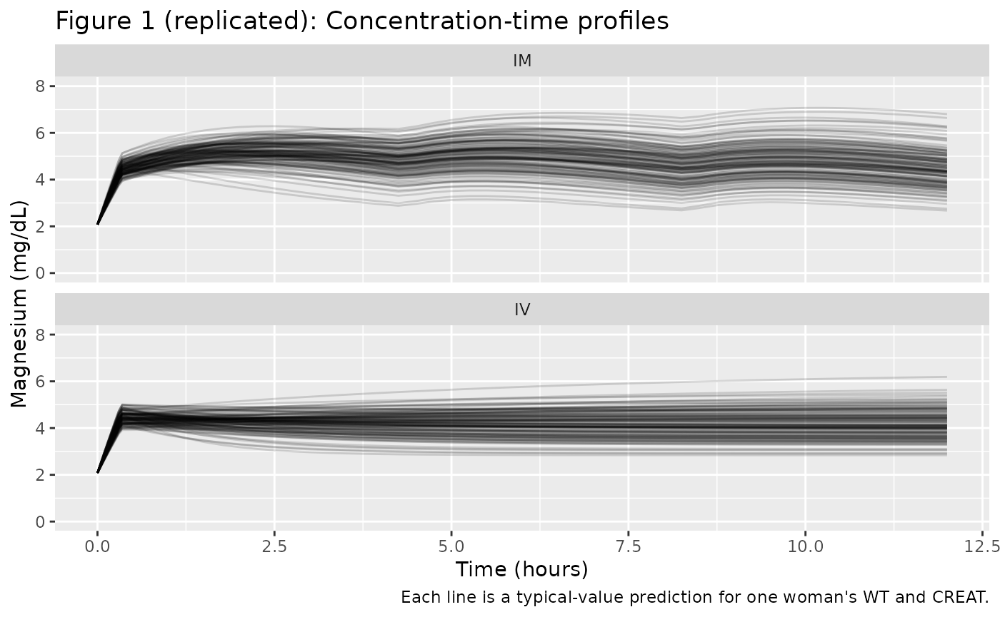
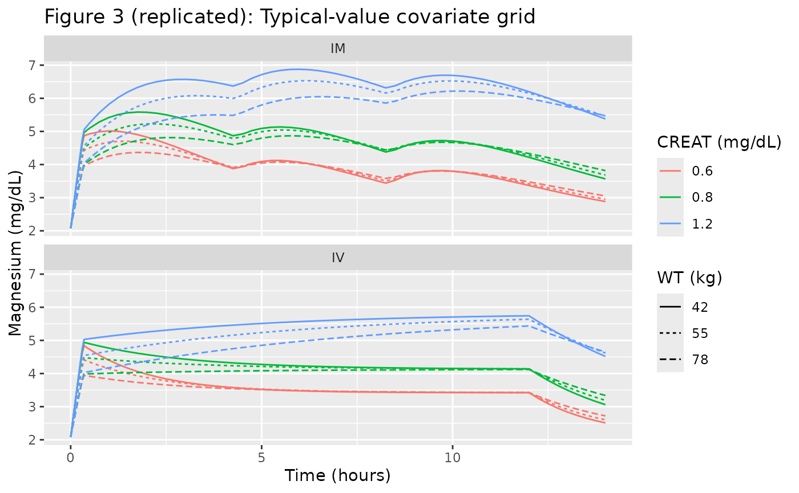
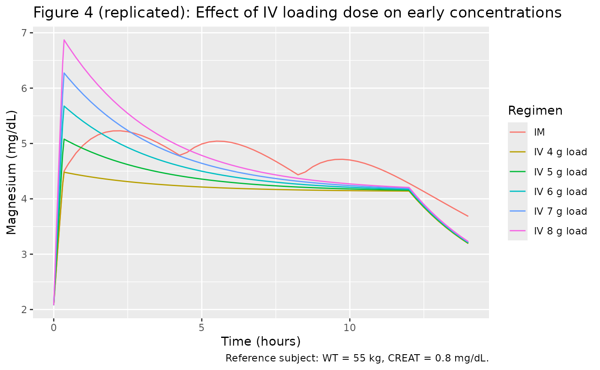

# MagnesiumSulfate (Salinger 2013)

## Model and source

- Citation: Salinger DH, Mundle S, Regi A, Bracken H, Winikoff B, Vicini
  P, Easterling T. Magnesium sulphate for prevention of eclampsia: are
  intramuscular and intravenous regimens equivalent? A population
  pharmacokinetic study. BJOG 2013;120:894-900.
  <doi:10.1111/1471-0528.12222>
- Description: One-compartment population PK model of magnesium sulphate
  (MgSO4-7H2O) with first-order intramuscular absorption, IV dosing into
  the central compartment, and an endogenous baseline magnesium term
  added to the administered drug, in pregnant women with pre-eclampsia
  (Salinger 2013).
- Article: <https://doi.org/10.1111/1471-0528.12222>

## Population

Salinger 2013 fit a one-compartment model to 258 sparse magnesium
concentrations (one sample per woman) drawn during a randomised trial of
intramuscular vs intravenous MgSO4-7H2O regimens for the prevention of
eclampsia (NCT00666133). The trial enrolled 300 pre-eclamptic women at
two low-resource Indian obstetric hospitals (GMC-Nagpur and
CMC-Vellore); after exclusions, the PK analysis included 126 women in
the intravenous arm and 132 women in the intramuscular arm. Salinger
2013 Table 1 reports baseline characteristics: age 18-41 years (mean
~24-25), maternal weight 39-94 kg (mean 55.6-57.3 kg), and gestational
age 23-41 weeks (mean ~34). Serum creatinine values were not tabulated
but the Results section reports the study 5th, 50th, and 95th
percentiles as 0.6, 0.8, and 1.2 mg/dL (45.8, 61.0, 91.5 umol/L).

The same information is available programmatically via
`rxode2::rxode(readModelDb("Salinger_2013_magnesiumSulfate"))$population`.

## Source trace

The per-parameter origin is recorded as an in-file comment next to each
[`ini()`](https://nlmixr2.github.io/rxode2/reference/ini.html) entry in
`inst/modeldb/specificDrugs/Salinger_2013_magnesiumSulfate.R`. The table
below collects them in one place.

| Equation / parameter | Value | Source location |
|----|----|----|
| `lcl` (CL) | 4.81 L/h (= 48.1 dL/h) | Salinger 2013 Table 2 |
| `lvc` (V) | 15.6 L (= 156 dL) | Salinger 2013 Table 2 |
| `lka` (KA) | 0.317 1/h | Salinger 2013 Table 2 |
| `lfdepot` (F, IM) | 0.862 (86.2%) | Salinger 2013 Table 2 |
| `lbl` (BL) | 20.8 mg/L (= 0.85 mmol/L = 2.08 mg/dL) | Salinger 2013 Table 2 |
| `e_wt_vc` (theta_1) | 0.692 | Salinger 2013 Table 2 |
| `e_creat_cl` (theta_2) | 1.48 | Salinger 2013 Table 2 |
| `propSd` | 0.229 (22.9% CV) | Salinger 2013 Table 2 |
| V_i = V \* (WT_i/55)^theta_1 | n/a | Salinger 2013 Table 2 footnote |
| CL_i = CL \* (0.8/CREAT_i)^theta_2 | n/a | Salinger 2013 Table 2 footnote |
| Cc = central/V + BL (additive baseline) | n/a | Salinger 2013 Methods (paragraph 6) |
| One-compartment model with first-order IM absorption | n/a | Salinger 2013 Methods (paragraph 5) |

## Virtual cohort

The validation cohort uses the maternal weight distribution reported in
Salinger 2013 Table 1 (truncated normal, mean 56 kg, SD 11.3 kg, range
39-94) and a creatinine distribution chosen so its 5th, 50th, and 95th
percentiles match the paper-stated 0.6, 0.8, and 1.2 mg/dL respectively
(log-normal, log-mean log(0.8), log-SD chosen to match the spread).

``` r

set.seed(295L)
n_per_arm <- 130L

sample_wt <- function(n) {
  wt <- rnorm(n * 4, mean = 56, sd = 11.3)
  wt <- wt[wt >= 39 & wt <= 94]
  head(wt, n)
}

# Log-SD chosen so quantile(LogNormal(log(0.8), sd_log), c(.05, .95))
# brackets ~0.6 and ~1.2 mg/dL.
sample_creat <- function(n) {
  sd_log <- log(1.2 / 0.6) / (2 * qnorm(0.95))
  rlnorm(n, meanlog = log(0.8), sdlog = sd_log)
}

cohort_iv <- tibble(
  id   = seq_len(n_per_arm),
  WT   = sample_wt(n_per_arm),
  CREAT = sample_creat(n_per_arm),
  arm  = "IV"
)
cohort_im <- tibble(
  id   = n_per_arm + seq_len(n_per_arm),
  WT   = sample_wt(n_per_arm),
  CREAT = sample_creat(n_per_arm),
  arm  = "IM"
)
cohort <- dplyr::bind_rows(cohort_iv, cohort_im)
```

The model uses dose units of mg of elemental magnesium; below we convert
all MgSO4-7H2O grams to mg Mg via the factor
`mg_per_g_mgso4 <- 24.305 / 246.47 * 1000`.

``` r

mg_per_g_mgso4 <- 24.305 / 246.47 * 1000   # 98.61 mg Mg per gram MgSO4-7H2O
iv_load_mg     <- 4 * mg_per_g_mgso4       # 394.4 mg Mg loading
iv_load_dur    <- 20 / 60                  # 20-min IV infusion
iv_load_rate   <- iv_load_mg / iv_load_dur # mg Mg per hour during loading
iv_maint_rate  <- 1 * mg_per_g_mgso4       # 1 g/h MgSO4-7H2O = 98.6 mg Mg/h
iv_maint_dur   <- 12 - iv_load_dur         # rest of the 12-h window
iv_maint_amt   <- iv_maint_rate * iv_maint_dur

im_load_mg     <- 10 * mg_per_g_mgso4      # 10 g IM loading after IV bolus
im_dose_mg     <- 5  * mg_per_g_mgso4      # 5 g IM every 4 h
```

``` r

times_obs <- c(seq(0, 0.5, by = 0.05), seq(0.75, 14, by = 0.25))

obs_rows <- function(c) {
  c |>
    tidyr::expand_grid(time = times_obs) |>
    dplyr::mutate(evid = 0L, amt = 0, rate = 0, cmt = "Cc")
}

iv_dose_rows <- cohort_iv |>
  dplyr::mutate(time = 0, evid = 1L, amt = iv_load_mg,
                rate = iv_load_rate, cmt = "central") |>
  dplyr::bind_rows(
    cohort_iv |>
      dplyr::mutate(time = iv_load_dur, evid = 1L, amt = iv_maint_amt,
                    rate = iv_maint_rate, cmt = "central")
  )

im_dose_rows <- cohort_im |>
  dplyr::mutate(time = 0, evid = 1L, amt = iv_load_mg,
                rate = iv_load_rate, cmt = "central") |>
  dplyr::bind_rows(
    cohort_im |>
      dplyr::mutate(time = iv_load_dur, evid = 1L, amt = im_load_mg,
                    rate = 0, cmt = "depot")
  ) |>
  dplyr::bind_rows(
    cohort_im |>
      dplyr::mutate(time = iv_load_dur + 4, evid = 1L, amt = im_dose_mg,
                    rate = 0, cmt = "depot")
  ) |>
  dplyr::bind_rows(
    cohort_im |>
      dplyr::mutate(time = iv_load_dur + 8, evid = 1L, amt = im_dose_mg,
                    rate = 0, cmt = "depot")
  )

events <- dplyr::bind_rows(
  obs_rows(cohort_iv),
  obs_rows(cohort_im),
  iv_dose_rows,
  im_dose_rows
) |>
  dplyr::arrange(id, time, dplyr::desc(evid))

stopifnot(!anyDuplicated(unique(events[, c("id", "time", "evid")])))
```

## Simulation

``` r

mod <- readModelDb("Salinger_2013_magnesiumSulfate")
mod_typical <- rxode2::zeroRe(mod)
#> Warning: No omega parameters in the model
sim <- rxode2::rxSolve(mod_typical, events = events,
                       keep = c("WT", "CREAT", "arm"))
#> Warning: multi-subject simulation without without 'omega'
```

The model has no inter-individual variability (Salinger 2013 explicitly
did not estimate it);
[`zeroRe()`](https://nlmixr2.github.io/rxode2/reference/zeroRe.html)
additionally suppresses the proportional residual error so the curves
represent typical-value predictions for each subject’s covariate vector.

## Replicate published figures

### Figure 1: Concentration vs time, by arm

Figure 1 of Salinger 2013 overlays the base PK model fit on the observed
concentration-time profile for each randomisation arm. Below we plot the
typical-value (covariate-driven) curves for the virtual cohort.

``` r

sim_long <- sim |>
  dplyr::filter(time <= 12.1) |>
  dplyr::mutate(Cc_mgdl = Cc / 10)   # mg/L -> mg/dL

ggplot(sim_long, aes(time, Cc_mgdl, group = id)) +
  geom_line(alpha = 0.15) +
  facet_wrap(~ arm, ncol = 1) +
  labs(x = "Time (hours)", y = "Magnesium (mg/dL)",
       title = "Figure 1 (replicated): Concentration-time profiles",
       caption = "Each line is a typical-value prediction for one woman's WT and CREAT.") +
  ylim(0, 8)
```



### Figure 3: Profiles spanning the covariate range

Figure 3 of Salinger 2013 shows simulated typical curves for nine
“hypothetical women” representing the 5th, 50th, and 95th centiles of
weight (42, 55, 78 kg in the IM arm; 46, 61, 92 kg of weight
contour-paired with creatinine 0.6, 0.8, 1.2 mg/dL in the IV arm). The
grid below reproduces the same idea on a 3-by-3 grid.

``` r

grid <- tidyr::expand_grid(
  WT    = c(42, 55, 78),
  CREAT = c(0.6, 0.8, 1.2),
  arm   = c("IV", "IM")
) |>
  dplyr::mutate(id = dplyr::row_number())

grid_iv <- grid |> dplyr::filter(arm == "IV")
grid_im <- grid |> dplyr::filter(arm == "IM")

grid_obs <- grid |>
  tidyr::expand_grid(time = times_obs) |>
  dplyr::mutate(evid = 0L, amt = 0, rate = 0, cmt = "Cc")

grid_iv_dose <- grid_iv |>
  dplyr::mutate(time = 0, evid = 1L, amt = iv_load_mg,
                rate = iv_load_rate, cmt = "central") |>
  dplyr::bind_rows(
    grid_iv |>
      dplyr::mutate(time = iv_load_dur, evid = 1L, amt = iv_maint_amt,
                    rate = iv_maint_rate, cmt = "central")
  )
grid_im_dose <- grid_im |>
  dplyr::mutate(time = 0, evid = 1L, amt = iv_load_mg,
                rate = iv_load_rate, cmt = "central") |>
  dplyr::bind_rows(
    grid_im |>
      dplyr::mutate(time = iv_load_dur, evid = 1L, amt = im_load_mg,
                    rate = 0, cmt = "depot")
  ) |>
  dplyr::bind_rows(
    grid_im |>
      dplyr::mutate(time = iv_load_dur + 4, evid = 1L, amt = im_dose_mg,
                    rate = 0, cmt = "depot")
  ) |>
  dplyr::bind_rows(
    grid_im |>
      dplyr::mutate(time = iv_load_dur + 8, evid = 1L, amt = im_dose_mg,
                    rate = 0, cmt = "depot")
  )

grid_events <- dplyr::bind_rows(grid_obs, grid_iv_dose, grid_im_dose) |>
  dplyr::arrange(id, time, dplyr::desc(evid))

sim_grid <- rxode2::rxSolve(mod_typical, events = grid_events,
                            keep = c("WT", "CREAT", "arm"))
#> Warning: multi-subject simulation without without 'omega'

ggplot(sim_grid, aes(time, Cc / 10,
                     colour = factor(CREAT), linetype = factor(WT))) +
  geom_line() +
  facet_wrap(~ arm, ncol = 1) +
  labs(x = "Time (hours)", y = "Magnesium (mg/dL)",
       colour = "CREAT (mg/dL)", linetype = "WT (kg)",
       title = "Figure 3 (replicated): Typical-value covariate grid")
```



### Figure 4: Higher IV loading doses

Figure 4 of Salinger 2013 simulates the IV regimen with the loading dose
increased from 4 g to 5, 6, 7, and 8 g of MgSO4-7H2O, asking which
loading dose makes the IV early-time profile resemble the IM profile.
Here we reproduce the same set of loading-dose comparators for the
reference subject.

``` r

ref_subject <- tibble(WT = 55, CREAT = 0.8)
load_doses_g <- c(4, 5, 6, 7, 8)

build_iv_at_load <- function(load_g, id_offset) {
  amt_load <- load_g * mg_per_g_mgso4
  rate_load <- amt_load / iv_load_dur
  ev <- ref_subject |>
    dplyr::mutate(id = id_offset + 1L, regimen = sprintf("IV %g g load", load_g))
  ev_obs <- ev |>
    tidyr::expand_grid(time = times_obs) |>
    dplyr::mutate(evid = 0L, amt = 0, rate = 0, cmt = "Cc")
  ev_dose <- ev |>
    dplyr::mutate(time = 0, evid = 1L, amt = amt_load,
                  rate = rate_load, cmt = "central") |>
    dplyr::bind_rows(
      ev |>
        dplyr::mutate(time = iv_load_dur, evid = 1L, amt = iv_maint_amt,
                      rate = iv_maint_rate, cmt = "central")
    )
  dplyr::bind_rows(ev_obs, ev_dose)
}

build_im_ref <- function(id_offset) {
  ev <- ref_subject |>
    dplyr::mutate(id = id_offset + 1L, regimen = "IM")
  ev_obs <- ev |>
    tidyr::expand_grid(time = times_obs) |>
    dplyr::mutate(evid = 0L, amt = 0, rate = 0, cmt = "Cc")
  ev_dose <- ev |>
    dplyr::mutate(time = 0, evid = 1L, amt = iv_load_mg,
                  rate = iv_load_rate, cmt = "central") |>
    dplyr::bind_rows(
      ev |>
        dplyr::mutate(time = iv_load_dur, evid = 1L, amt = im_load_mg,
                      rate = 0, cmt = "depot")
    ) |>
    dplyr::bind_rows(
      ev |>
        dplyr::mutate(time = iv_load_dur + 4, evid = 1L, amt = im_dose_mg,
                      rate = 0, cmt = "depot")
    ) |>
    dplyr::bind_rows(
      ev |>
        dplyr::mutate(time = iv_load_dur + 8, evid = 1L, amt = im_dose_mg,
                      rate = 0, cmt = "depot")
    )
  dplyr::bind_rows(ev_obs, ev_dose)
}

load_events <- dplyr::bind_rows(
  lapply(seq_along(load_doses_g), function(i) build_iv_at_load(load_doses_g[i], i - 1L))
) |>
  dplyr::bind_rows(build_im_ref(length(load_doses_g))) |>
  dplyr::arrange(id, time, dplyr::desc(evid))

stopifnot(!anyDuplicated(unique(load_events[, c("id", "time", "evid")])))

sim_load <- rxode2::rxSolve(mod_typical, events = load_events,
                            keep = c("WT", "CREAT", "regimen"))
#> Warning: multi-subject simulation without without 'omega'

ggplot(sim_load |> dplyr::filter(time <= 14),
       aes(time, Cc / 10, colour = regimen)) +
  geom_line() +
  labs(x = "Time (hours)", y = "Magnesium (mg/dL)",
       colour = "Regimen",
       title = "Figure 4 (replicated): Effect of IV loading dose on early concentrations",
       caption = "Reference subject: WT = 55 kg, CREAT = 0.8 mg/dL.")
```



## PKNCA validation

The Salinger 2013 paper does not publish a side-by-side NCA table – the
analysis is wholly population-PK based. To exercise PKNCA on the
packaged model, we compute Cmax, Tmax, and AUC over the 12-hour
treatment window for each arm of the virtual cohort. The PKNCA
computations are run on the *administered* magnesium (`Cc - bl`) so that
classical NCA estimands are not contaminated by the endogenous baseline;
the published 0.85 mmol/L (= 2.08 mg/dL = 20.8 mg/L) is subtracted
before PKNCA.

``` r

sim_admin <- sim |>
  dplyr::filter(!is.na(Cc), time <= 12) |>
  dplyr::mutate(Cc_admin = pmax(Cc - 20.8, 0)) |>
  dplyr::select(id, time, Cc_admin, arm)

dose_df <- events |>
  dplyr::filter(evid == 1) |>
  dplyr::group_by(id) |>
  dplyr::summarise(time = min(time), amt = sum(amt), .groups = "drop") |>
  dplyr::left_join(cohort |> dplyr::select(id, arm), by = "id")

conc_obj <- PKNCA::PKNCAconc(sim_admin, Cc_admin ~ time | arm + id,
                             concu = "mg/L", timeu = "h")
dose_obj <- PKNCA::PKNCAdose(dose_df, amt ~ time | arm + id,
                             doseu = "mg")

intervals <- data.frame(
  start    = 0,
  end      = 12,
  cmax     = TRUE,
  tmax     = TRUE,
  auclast  = TRUE,
  cav      = TRUE
)

nca_res <- PKNCA::pk.nca(PKNCA::PKNCAdata(conc_obj, dose_obj,
                                          intervals = intervals))
nca_summary <- summary(nca_res)
knitr::kable(nca_summary,
             caption = "Simulated NCA parameters (administered Mg only) for the IV and IM arms over the 12-hour treatment window.")
```

| Interval Start | Interval End | arm | N | AUClast (h\*mg/L) | Cmax (mg/L) | Tmax (h) | Cav (mg/L) |
|---:|---:|:---|:---|:---|:---|:---|:---|
| 0 | 12 | IM | 130 | 322 \[24.3\] | 32.0 \[16.1\] | 2.25 \[0.350, 10.2\] | 26.8 \[24.3\] |
| 0 | 12 | IV | 130 | 245 \[24.8\] | 25.2 \[13.2\] | 0.350 \[0.350, 12.0\] | 20.4 \[24.8\] |

Simulated NCA parameters (administered Mg only) for the IV and IM arms
over the 12-hour treatment window. {.table}

### Comparison against published narrative

Salinger 2013 reports two checks the simulation can be measured against:

1.  The IV and IM arms reach comparable steady-state magnesium
    concentrations by 12-14 hours (Figure 1, “At steady state, magnesium
    concentrations in the intramuscular and intravenous groups were
    comparable”). The simulated total Cc (administered + baseline) at 12
    h in the reference subject should sit near 4 mg/dL (~40 mg/L) in
    both arms.
2.  The IV arm peak concentration immediately after the IV loading dose
    is substantially lower than the IM arm peak (post-IV-loading + IM
    bolus), motivating the paper’s recommendation that a higher IV
    loading dose be considered.

``` r

ss_iv <- sim |>
  dplyr::filter(arm == "IV", abs(time - 12) < 1e-6) |>
  dplyr::summarise(median_mgdl = median(Cc / 10),
                   q05         = quantile(Cc / 10, 0.05),
                   q95         = quantile(Cc / 10, 0.95))

ss_im <- sim |>
  dplyr::filter(arm == "IM", abs(time - 12) < 1e-6) |>
  dplyr::summarise(median_mgdl = median(Cc / 10),
                   q05         = quantile(Cc / 10, 0.05),
                   q95         = quantile(Cc / 10, 0.95))

knitr::kable(
  dplyr::bind_rows(IV = ss_iv, IM = ss_im, .id = "arm"),
  digits = 2,
  caption = "Total magnesium concentration (mg/dL) at t = 12 h across the virtual cohort, by arm."
)
```

| arm | median_mgdl |  q05 |  q95 |
|:----|------------:|-----:|-----:|
| IV  |        4.10 | 3.29 | 5.20 |
| IM  |        4.37 | 3.28 | 5.86 |

Total magnesium concentration (mg/dL) at t = 12 h across the virtual
cohort, by arm. {.table}

The Salinger 2013 IV-arm Figure 1B model curve at 12 h sits near 3.5-4
mg/dL; the IM-arm curve sits in the same range with the addition of a
post-bolus oscillation around the 4-hour IM dosing schedule.

## Assumptions and deviations

- **No inter-individual variability is included** because Salinger 2013
  explicitly did not estimate it (single sample per woman). All
  variability in the published Figure 1 box plots is collapsed onto the
  proportional residual error term (`propSd = 0.229`) and the covariate
  effects on V (WT) and CL (CREAT). The vignette therefore uses
  [`rxode2::zeroRe()`](https://nlmixr2.github.io/rxode2/reference/zeroRe.html)
  to produce typical-value predictions; the box-and-whisker spread in
  Salinger 2013 Figure 1 cannot be reproduced from this model alone.
- **Dose units.** The published parameter estimates implicitly require
  that doses be entered in mg of elemental magnesium (Mg), not in mg of
  MgSO4-7H2O. The vignette and model file convert administered
  MgSO4-7H2O grams to mg Mg by multiplying by 24.305/246.47 = 0.0986 (1
  g MgSO4-7H2O = 98.6 mg Mg). Users supplying their own event tables
  must apply the same conversion or rescale CL and V accordingly.
- **Creatinine distribution** was not tabulated in Salinger 2013 Table
  1; the vignette samples `CREAT` from a log-normal whose 5th, 50th, and
  95th percentiles match the paper-stated 0.6, 0.8, and 1.2 mg/dL. The
  shape between those percentiles is an assumption.
- **Sampling-time grid.** The vignette uses a denser observation grid
  than the trial’s actual single-sample-per-subject design. This is a
  visualisation choice for typical-value curves; it does not affect the
  underlying parameter values.
- **Endogenous baseline.** The model adds a fixed BL = 20.8 mg/L to the
  administered concentration. Salinger 2013 estimates BL as a
  population-typical value with 3.2% standard error; per-subject
  baseline variability is folded into the residual error and is not
  separable.
- **PKNCA on administered Mg only.** Classical NCA estimands (Cmax, AUC,
  Tmax) are computed on `Cc - BL` so the endogenous baseline does not
  inflate AUC over the 12-hour window; this matches the convention used
  in baseline-subtraction PK analyses for endogenous compounds.
