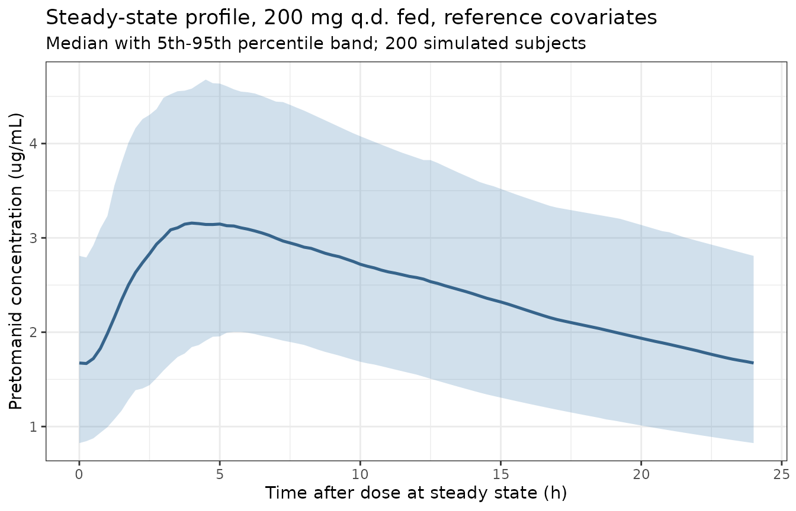
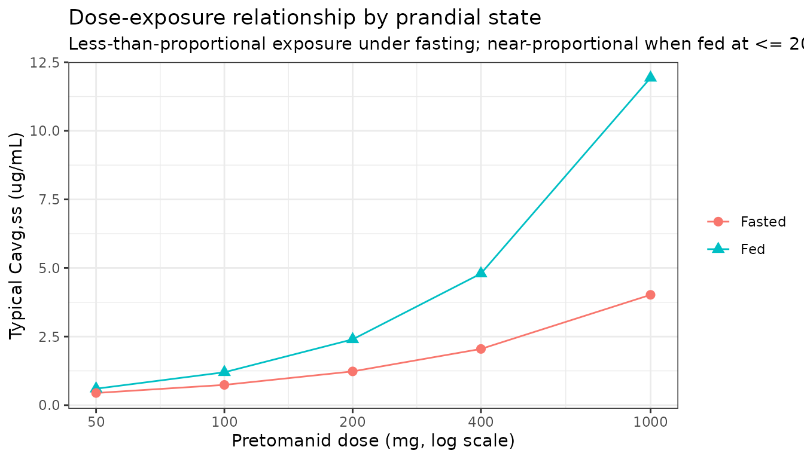

# Pretomanid (Salinger 2019)

``` r

ui <- rxode2::rxode(readModelDb("Salinger_2019_pretomanid"))
#> ℹ parameter labels from comments will be replaced by 'label()'
#> Warning: some etas defaulted to non-mu referenced, possible parsing error: etae_dose_fdepot, etalmtt, etalfdepot, etaiov_lfdepot_1, etaiov_lcl_1, etaiov_lfdepot_2, etaiov_lcl_2, etaiov_lfdepot_3, etaiov_lcl_3
#> as a work-around try putting the mu-referenced expression on a simple line
```

## Model and source

- Citation: Salinger DH, Subramoney V, Everitt D, Nedelman JR.
  Population pharmacokinetics of the antituberculosis agent pretomanid.
  Antimicrob Agents Chemother. 2019;63(10):e00907-19.
  <doi:10.1128/AAC.00907-19>
- Description: One-compartment population PK model with
  three-transit-compartment absorption for pretomanid in healthy
  subjects and subjects with drug-sensitive, multidrug-resistant or
  extensively drug-resistant pulmonary tuberculosis

Pretomanid is a nitroimidazooxazine antituberculosis agent. Salinger
2019 pooled 14 studies from the development programme – six phase 1, six
phase 2 and two phase 3 – into a single population PK analysis of 17,725
concentrations from 1,054 subjects, spanning healthy volunteers and
patients with drug-sensitive (DS), multidrug-resistant (MDR) and
extensively drug-resistant (XDR) pulmonary tuberculosis, dosed as
monotherapy or in combination regimens for up to 6 months.

The structural model is a **one-compartment disposition model with a
three-compartment transit absorption chain feeding a first-order
absorption compartment**. At any given dose the model is linear in both
absorption and clearance, but the *rate* of absorption and the *extent*
of bioavailability both change with dose. The chain is (supplemental
Table S3 `$MODEL`, Figure S2):

    dose --> transit1 --> transit2 --> transit3 --> depot --> central --> eliminated
               ktr         ktr          ktr          ka        kel

`ktr = 3 / MTT`, so `MTT` is the mean transit time through the three
`ktr`-governed compartments and the total mean absorption time is
`MTT + 1/KA` – the quantity Salinger 2019 tabulates in supplemental
Table S4. Note that `depot` is the source control stream’s `ABS`
compartment and sits *downstream* of the transit chain; **oral doses
enter `transit1`**, which is why the model file declares
`dosing <- "transit1"`.

``` r

cat("ODE states:", paste(ui$state, collapse = " -> "), "\n")
#> ODE states: transit1 -> transit2 -> transit3 -> depot -> central
cat("Observation:", paste(ui$predDf$var, collapse = ", "), "\n")
#> Observation: Cc
cat("Solved-model (linCmt) path used:", ui$props$linCmt, "\n")
#> Solved-model (linCmt) path used: FALSE
# A cl/vc pair can make rxode2 discard explicit ODEs in favour of an analytic
# solution; this model must keep its transit chain, so assert the ODE path.
stopifnot(isFALSE(ui$props$linCmt), length(ui$state) == 5L)
```

## Population

``` r

pop <- ui$population
tibble::tibble(Field = names(pop), Value = vapply(pop, function(x) paste(if (!is.null(names(x))) paste0(names(x), " ", x) else x, collapse = "; "), character(1))) |>
  knitr::kable(caption = "Population metadata (Salinger 2019 Results 'Data'; Tables S1 and S2).")
```

| Field | Value |
|:---|:---|
| species | human |
| n_subjects | 1054 |
| n_studies | 14 |
| n_observations | 17725 |
| age_range | 18-77 years |
| age_median | 27 years (healthy subjects), 31 years (subjects with tuberculosis) |
| weight_range | 29-121 kg |
| weight_median | 75 kg (healthy subjects), 53 kg (subjects with tuberculosis) |
| sex_female_pct | 35 |
| race_ethnicity | Black 58.4; Caucasian 14.8; Other 26.8 |
| disease_state | healthy subjects and subjects with drug-sensitive, multidrug-resistant, treatment-intolerant or non-responsive multidrug-resistant, or extensively drug-resistant pulmonary tuberculosis; 24% of subjects with tuberculosis were HIV-positive |
| dose_range | 50-1500 mg single oral dose; 100-1000 mg once daily for 7 days to 6 months |
| regions | North America (all healthy subjects); sub-Saharan Africa (\> 95% of subjects with tuberculosis) |
| co_medication | pretomanid given as monotherapy or with bedaquiline, clofazimine, moxifloxacin, linezolid and/or pyrazinamide; antiretrovirals including efavirenz and lopinavir/ritonavir in HIV-positive subjects |
| notes | Six phase 1, six phase 2 and two phase 3 studies (Salinger 2019 Results ‘Data’; per-study detail in Table S1, covariate summary in Table S2). Table S2 tabulates 1056 subjects against the 1054 quoted in Results; the Results figure is used here. Renal function: more than 99% of subjects had normal or only mildly impaired renal function by eGFR. |

Population metadata (Salinger 2019 Results ‘Data’; Tables S1 and S2).
{.table}

Salinger 2019 Table S2 tabulates 1,056 subjects while Results quotes
1,054; the Results figure is carried in the model metadata. All healthy
subjects were from North America and none was HIV-positive; more than
95% of the subjects with tuberculosis were from sub-Saharan Africa and
24% of them were HIV-positive.

## Source trace

Every fixed-effect and random-effect value in the model file carries an
in-file comment naming its source location. The table below is the
consolidated view. `$THETA` / `$OMEGA` / `$SIGMA` in the supplemental
control file (Table S3) hold **initial** estimates only – for example
`$THETA` 2 is 3.2 against a final 3.30 L/h – so every value below is
taken from **Table 1** (final estimates), with Table S3 supplying the
functional *form* in which each value enters.

| Quantity | Model parameter | Value | Source |
|:---|:---|:---|:---|
| First-order absorption rate constant | lka | 1.38 1/h | Table 1 ‘KA, h-1’ |
| Mean transit time | lmtt | 1.25 h | Table 1 ‘MTT, h’ |
| Clearance, first arm | lcl | 3.30 L/h | Table 1 ‘CL, liters/h’ |
| Clearance, day-5 arm | lcl_late | 3.30 + 0.175 L/h | Table 1 ‘CL’ + ‘SS CL, liters/h’ |
| First clearance breakpoint | ltclchange | 96 h (day 5) | Table S3 `SSD` conditional |
| Clearance, Nix-TB week-6 arm | lcl_late2 | 3.30 + 0.175 + 0.466 L/h | Table 1 + ‘CL NIX WK \>= 6, liters/h’ |
| Second clearance breakpoint | ltclchange2 | 1008 h (week 6) | Table S3 `SSWK6` conditional |
| Central volume | lvc | 90.4 L | Table 1 ‘V2, liters’ |
| Relative bioavailability reference | lfdepot | 1 (fixed) | Table 1 ‘F1 (fixed)’ |
| Allometric exponents | e_wt_cl, e_wt_vc | 0.75, 1 (fixed) | Table 1 ‘CL ~ WT’, ‘V2 ~ WT’ |
| Food effect on F1 / KA / MTT | e_fed_fdepot, e_fed_ka, e_fed_mtt | 0.513, 0.482, 0.311 | Table 1 ‘~ FASTED’ rows |
| Dose effects | e_dose_fdepot, e_dose_ka, e_dose_mtt, e_dose_vc | -0.264, -0.128, -0.155, 0.111 | Table 1 ‘~ DOSE’ rows |
| Fed 1000 mg F1 effect | e_dose_1000mg_fdepot | -0.00302 | Table 1 ‘F1 ~ FED&1,000 mg’ |
| Regimen-partner effects | e_moxifloxacin\_*, e\_*\_pyrazinamide\_*, e_bedaquiline\_* | 0.925, 1.25, 0.967, 0.733, 1.32 | Table 1 ‘MOX’, ‘MOX \* PZA’, ‘BDQ \* MOX \* PZA’ rows |
| Antiretroviral effects | e_efv_cl, e_efv_fdepot, e_lpv_cl, e_cyp3a4_ind_cl | 2.17, 1.24, 1.14, 1.35 | Table 1 ‘EFV’, ‘LPVR’, ‘INDUC’ rows |
| HIV effects | e_hiv_pos_cl, e_hiv_pos_fdepot | 0.842, 0.789 | Table 1 ‘CL ~ HIV’, ‘F1 ~ HIV’ |
| Sex effect | e_sexf_cl | 0.837 | Table 1 ‘CL ~ FEMALE’ |
| Disease-state effects | e_dis_healthy_cl, e_dis_tb_mdr_cl, e_dis_tb_mdr_vc, e_dis_tb_xdr_strict_vc | 1.16, 1.15, 1.44, 1.75 | Table 1 ‘HS’, ‘MDR’, ‘XDR’ rows |
| Laboratory effects | e_tbili_fdepot, e_alb_cl | 0.0880, 0.200 | Table 1 ‘TBIL (ref = 5)’, ‘ALB (ref = 35)’ |
| Study effects | e_study_nixtb_fdepot, e_study_nc005_ka, e_study_nc005_mtt | 1.54, 0.186, 6.95e-07 | Table 1 ‘NIX’, ‘NC5’ rows |
| Random-effect modifiers | e_study_nixtb_etalfdepot, e_study_nc003_etalmtt | 0.919, -0.645 | Table 1 ‘F1 Var ~ NIX’, ‘MTT Var ~ NC3’ |
| Box-Cox shapes | boxcox_lcl\_*, boxcox_lvc\_* | 1.36 / 2.78, 9.55 / 26.0 | Table 1 ‘Box-Cox’ rows |
| IIV variances | etalcl, etalvc, etalka + etalmtt + etalfdepot, etae_dose_fdepot | 0.0373, 0.00892, 3x3 block, 0.0274 | Table 1 ‘OMEGA matrix terms’ |
| IOV variances | etaiov_lfdepot_k + etaiov_lcl_k | 0.0412, 0.0101, 0.0185 | Table 1 ‘IOC’ rows; Table S3 `$OMEGA BLOCK(2) SAME` |
| Residual error | propSd, powExp, addSd | sqrt(0.548), 0.795, sqrt(11.5) | Table 1 error rows; Table S3 `$ERROR` |

Source trace. Final estimates come from Table 1; supplemental Table S3
(final model control file) supplies the functional form. {.table}

## Reference subject and covariate scenarios

Salinger 2019 defines a reference subject for its simulations (Results,
‘Model application’): a 55 kg, male, HIV-negative, DS-TB subject with
baseline total bilirubin 5 umol/L and albumin 35 g/L, given 200 mg
pretomanid once daily, alone, in the fed condition, to steady state.

``` r

reference <- list(
  WT = 55, FED = 1, DOSE_PRETOMANID_MG = 200, SEXF = 0, DIS_HEALTHY = 0,
  DIS_TB_MDR = 0, DIS_TB_XDR_STRICT = 0, HIV_POS = 0,
  CONMED_EFV = 0, CONMED_LPV = 0, CONMED_CYP3A4_IND = 0,
  CONMED_MOXIFLOXACIN = 0, CONMED_PYRAZINAMIDE = 0, CONMED_BEDAQUILINE = 0,
  ALB = 35, TBILI = 5,
  STUDY_NC003 = 0, STUDY_NC005 = 0, STUDY_NIXTB = 0,
  OOC1 = 1, OOC2 = 0, OOC3 = 0
)
stopifnot(setequal(names(reference), ui$allCovs))
```

## Typical-value reproduction of the published simulation summary

Supplemental Table S4 summarises simulated steady-state exposure for 23
covariate scenarios. That is the most complete numerical target the
paper offers, so it is the primary gate here. The comparison below is
**deterministic**: random effects are zeroed with
[`rxode2::zeroRe()`](https://nlmixr2.github.io/rxode2/reference/zeroRe.html),
so each row is the model’s typical-value prediction for that covariate
combination, compared against the paper’s published *median*.

Because the random effects on clearance and volume are Box-Cox
transformed and strongly right-skewed, a published median is not
identical to a typical value – the two differ by a small, reproducible
structural offset rather than by simulation noise. The bounds asserted
below are therefore tight, but not zero.

``` r

tv <- rxode2::zeroRe(ui)
#> Warning: some etas defaulted to non-mu referenced, possible parsing error: etae_dose_fdepot, etalmtt, etalfdepot, etaiov_lfdepot_1, etaiov_lcl_1, etaiov_lfdepot_2, etaiov_lcl_2, etaiov_lfdepot_3, etaiov_lcl_3
#> as a work-around try putting the mu-referenced expression on a simple line

# Solve one covariate scenario to steady state and return both the individual
# parameters and the exposure metrics over the final dosing interval.
solve_scenario <- function(overrides = list(), ndays = 70) {
  cv <- utils::modifyList(reference, overrides)
  tau <- 24
  last_dose <- (ndays - 1) * tau
  ev <- rxode2::et(amt = cv$DOSE_PRETOMANID_MG, cmt = "transit1",
                   ii = tau, until = last_dose) |>
    # Observations sit on the ODE state `central`, never on the algebraic
    # observable `Cc`: naming an observable in `cmt` would auto-inject a
    # compartment slot and renumber the transit chain.
    rxode2::et(seq(last_dose, last_dose + tau, by = 0.25), cmt = "central")
  d <- as.data.frame(ev)
  for (nm in names(cv)) d[[nm]] <- cv[[nm]]
  s <- rxode2::rxSolve(tv, d, returnType = "data.frame",
                       atol = 1e-8, rtol = 1e-8)
  obs <- s[!is.na(s$Cc), ]
  obs$tau <- obs$time - last_dose
  # ug/mL to match the paper's units; the model returns ng/mL.
  cc <- obs$Cc / 1000
  list(
    cl = utils::tail(s$cl, 1), vc = utils::tail(s$vc, 1),
    f1 = utils::tail(s$fdepot, 1), ka = utils::tail(s$ka, 1),
    mtt = utils::tail(s$mtt, 1),
    cavg = sum(diff(obs$tau) * (utils::head(cc, -1) + utils::tail(cc, -1)) / 2) / 24,
    cmax = max(cc), ctau = cc[which.min(abs(obs$tau - 24))],
    tmax = obs$tau[which.max(cc)]
  )
}
```

``` r

scenarios <- tibble::tribble(
  ~scenario,                ~overrides,                                                                      ~cavg, ~ctau, ~cmax, ~thalf, ~clf,  ~vcf,  ~mat,
  "Reference",              list(),                                                                          2.4,   1.6,   3.2,   18,     3.5,   92,    2.1,
  "Fasted",                 list(FED = 0),                                                                   1.2,   0.82,  1.6,   18,     6.8,   180,   2.1,
  "Dose: 100 mg",           list(DOSE_PRETOMANID_MG = 100),                                                  1.2,   0.79,  1.6,   17,     3.5,   86,    2.1,
  "Dose: 400 mg",           list(DOSE_PRETOMANID_MG = 400),                                                  4.7,   3.3,   6.2,   20,     3.6,   100,   2.1,
  "WT: 35 kg",              list(WT = 35),                                                                   3.3,   2.2,   4.6,   17,     2.5,   61,    2.1,
  "WT: 75 kg",              list(WT = 75),                                                                   1.9,   1.3,   2.5,   20,     4.4,   130,   2.1,
  "WT: 100 kg",             list(WT = 100),                                                                  1.5,   1.1,   2.0,   21,     5.4,   170,   2.1,
  "Female",                 list(SEXF = 1),                                                                  2.9,   2.1,   3.7,   22,     2.9,   93,    2.2,
  "Healthy",                list(DIS_HEALTHY = 1),                                                           2.0,   1.3,   2.9,   16,     4.1,   95,    2.1,
  "MDR-TB not in Nix-TB",   list(DIS_TB_MDR = 1),                                                            2.1,   1.5,   2.6,   23,     4.0,   130,   2.1,
  "HIV+",                   list(HIV_POS = 1),                                                               2.2,   1.6,   2.8,   22,     3.8,   120,   2.1,
  "HIV+ & EFV",             list(HIV_POS = 1, CONMED_EFV = 1),                                               1.3,   0.60,  2.1,   10,     6.6,   95,    2.1,
  "HIV+ & LPVr",            list(HIV_POS = 1, CONMED_LPV = 1),                                               1.9,   1.3,   2.5,   19,     4.3,   120,   2.2,
  "Regimen: PaM",           list(CONMED_MOXIFLOXACIN = 1),                                                   2.4,   1.7,   3.2,   19,     3.5,   94,    2.2,
  "Regimen: PaMZ",          list(CONMED_MOXIFLOXACIN = 1, CONMED_PYRAZINAMIDE = 1),                          3.1,   2.4,   3.8,   26,     2.7,   100,   2.2,
  "TBIL: 10 umol/L",        list(TBILI = 10),                                                                2.5,   1.7,   3.4,   18,     3.4,   88,    2.1,
  "ALB: 45 g/L",            list(ALB = 45),                                                                  2.3,   1.5,   3.1,   18,     3.6,   93,    2.2,
  "Dose: 100 mg; fasted",   list(DOSE_PRETOMANID_MG = 100, FED = 0),                                         0.74,  0.48,  0.99,  17,     5.6,   140,   2.0,
  "Extreme low exposure",   list(WT = 100, FED = 0, DIS_TB_MDR = 1, HIV_POS = 1, CONMED_EFV = 1),            0.36,  0.22,  0.50,  15,     23,    480,   2.1,
  "WT: 35 kg; female",      list(WT = 35, SEXF = 1),                                                         4.0,   2.8,   5.2,   20,     2.1,   60,    2.2
)

fitted <- lapply(scenarios$overrides, solve_scenario)
#> ℹ omega/sigma items treated as zero: 'etae_dose_fdepot', 'etalcl', 'etalvc', 'etalka', 'etalmtt', 'etalfdepot', 'etaiov_lfdepot_1', 'etaiov_lcl_1', 'etaiov_lfdepot_2', 'etaiov_lcl_2', 'etaiov_lfdepot_3', 'etaiov_lcl_3'
#> ℹ omega/sigma items treated as zero: 'etae_dose_fdepot', 'etalcl', 'etalvc', 'etalka', 'etalmtt', 'etalfdepot', 'etaiov_lfdepot_1', 'etaiov_lcl_1', 'etaiov_lfdepot_2', 'etaiov_lcl_2', 'etaiov_lfdepot_3', 'etaiov_lcl_3'
#> ℹ omega/sigma items treated as zero: 'etae_dose_fdepot', 'etalcl', 'etalvc', 'etalka', 'etalmtt', 'etalfdepot', 'etaiov_lfdepot_1', 'etaiov_lcl_1', 'etaiov_lfdepot_2', 'etaiov_lcl_2', 'etaiov_lfdepot_3', 'etaiov_lcl_3'
#> ℹ omega/sigma items treated as zero: 'etae_dose_fdepot', 'etalcl', 'etalvc', 'etalka', 'etalmtt', 'etalfdepot', 'etaiov_lfdepot_1', 'etaiov_lcl_1', 'etaiov_lfdepot_2', 'etaiov_lcl_2', 'etaiov_lfdepot_3', 'etaiov_lcl_3'
#> ℹ omega/sigma items treated as zero: 'etae_dose_fdepot', 'etalcl', 'etalvc', 'etalka', 'etalmtt', 'etalfdepot', 'etaiov_lfdepot_1', 'etaiov_lcl_1', 'etaiov_lfdepot_2', 'etaiov_lcl_2', 'etaiov_lfdepot_3', 'etaiov_lcl_3'
#> ℹ omega/sigma items treated as zero: 'etae_dose_fdepot', 'etalcl', 'etalvc', 'etalka', 'etalmtt', 'etalfdepot', 'etaiov_lfdepot_1', 'etaiov_lcl_1', 'etaiov_lfdepot_2', 'etaiov_lcl_2', 'etaiov_lfdepot_3', 'etaiov_lcl_3'
#> ℹ omega/sigma items treated as zero: 'etae_dose_fdepot', 'etalcl', 'etalvc', 'etalka', 'etalmtt', 'etalfdepot', 'etaiov_lfdepot_1', 'etaiov_lcl_1', 'etaiov_lfdepot_2', 'etaiov_lcl_2', 'etaiov_lfdepot_3', 'etaiov_lcl_3'
#> ℹ omega/sigma items treated as zero: 'etae_dose_fdepot', 'etalcl', 'etalvc', 'etalka', 'etalmtt', 'etalfdepot', 'etaiov_lfdepot_1', 'etaiov_lcl_1', 'etaiov_lfdepot_2', 'etaiov_lcl_2', 'etaiov_lfdepot_3', 'etaiov_lcl_3'
#> ℹ omega/sigma items treated as zero: 'etae_dose_fdepot', 'etalcl', 'etalvc', 'etalka', 'etalmtt', 'etalfdepot', 'etaiov_lfdepot_1', 'etaiov_lcl_1', 'etaiov_lfdepot_2', 'etaiov_lcl_2', 'etaiov_lfdepot_3', 'etaiov_lcl_3'
#> ℹ omega/sigma items treated as zero: 'etae_dose_fdepot', 'etalcl', 'etalvc', 'etalka', 'etalmtt', 'etalfdepot', 'etaiov_lfdepot_1', 'etaiov_lcl_1', 'etaiov_lfdepot_2', 'etaiov_lcl_2', 'etaiov_lfdepot_3', 'etaiov_lcl_3'
#> ℹ omega/sigma items treated as zero: 'etae_dose_fdepot', 'etalcl', 'etalvc', 'etalka', 'etalmtt', 'etalfdepot', 'etaiov_lfdepot_1', 'etaiov_lcl_1', 'etaiov_lfdepot_2', 'etaiov_lcl_2', 'etaiov_lfdepot_3', 'etaiov_lcl_3'
#> ℹ omega/sigma items treated as zero: 'etae_dose_fdepot', 'etalcl', 'etalvc', 'etalka', 'etalmtt', 'etalfdepot', 'etaiov_lfdepot_1', 'etaiov_lcl_1', 'etaiov_lfdepot_2', 'etaiov_lcl_2', 'etaiov_lfdepot_3', 'etaiov_lcl_3'
#> ℹ omega/sigma items treated as zero: 'etae_dose_fdepot', 'etalcl', 'etalvc', 'etalka', 'etalmtt', 'etalfdepot', 'etaiov_lfdepot_1', 'etaiov_lcl_1', 'etaiov_lfdepot_2', 'etaiov_lcl_2', 'etaiov_lfdepot_3', 'etaiov_lcl_3'
#> ℹ omega/sigma items treated as zero: 'etae_dose_fdepot', 'etalcl', 'etalvc', 'etalka', 'etalmtt', 'etalfdepot', 'etaiov_lfdepot_1', 'etaiov_lcl_1', 'etaiov_lfdepot_2', 'etaiov_lcl_2', 'etaiov_lfdepot_3', 'etaiov_lcl_3'
#> ℹ omega/sigma items treated as zero: 'etae_dose_fdepot', 'etalcl', 'etalvc', 'etalka', 'etalmtt', 'etalfdepot', 'etaiov_lfdepot_1', 'etaiov_lcl_1', 'etaiov_lfdepot_2', 'etaiov_lcl_2', 'etaiov_lfdepot_3', 'etaiov_lcl_3'
#> ℹ omega/sigma items treated as zero: 'etae_dose_fdepot', 'etalcl', 'etalvc', 'etalka', 'etalmtt', 'etalfdepot', 'etaiov_lfdepot_1', 'etaiov_lcl_1', 'etaiov_lfdepot_2', 'etaiov_lcl_2', 'etaiov_lfdepot_3', 'etaiov_lcl_3'
#> ℹ omega/sigma items treated as zero: 'etae_dose_fdepot', 'etalcl', 'etalvc', 'etalka', 'etalmtt', 'etalfdepot', 'etaiov_lfdepot_1', 'etaiov_lcl_1', 'etaiov_lfdepot_2', 'etaiov_lcl_2', 'etaiov_lfdepot_3', 'etaiov_lcl_3'
#> ℹ omega/sigma items treated as zero: 'etae_dose_fdepot', 'etalcl', 'etalvc', 'etalka', 'etalmtt', 'etalfdepot', 'etaiov_lfdepot_1', 'etaiov_lcl_1', 'etaiov_lfdepot_2', 'etaiov_lcl_2', 'etaiov_lfdepot_3', 'etaiov_lcl_3'
#> ℹ omega/sigma items treated as zero: 'etae_dose_fdepot', 'etalcl', 'etalvc', 'etalka', 'etalmtt', 'etalfdepot', 'etaiov_lfdepot_1', 'etaiov_lcl_1', 'etaiov_lfdepot_2', 'etaiov_lcl_2', 'etaiov_lfdepot_3', 'etaiov_lcl_3'
#> ℹ omega/sigma items treated as zero: 'etae_dose_fdepot', 'etalcl', 'etalvc', 'etalka', 'etalmtt', 'etalfdepot', 'etaiov_lfdepot_1', 'etaiov_lcl_1', 'etaiov_lfdepot_2', 'etaiov_lcl_2', 'etaiov_lfdepot_3', 'etaiov_lcl_3'

pct <- function(sim, pub) 100 * (sim - pub) / pub
compare <- scenarios |>
  mutate(
    cavg_sim  = vapply(fitted, function(x) x$cavg, numeric(1)),
    ctau_sim  = vapply(fitted, function(x) x$ctau, numeric(1)),
    cmax_sim  = vapply(fitted, function(x) x$cmax, numeric(1)),
    thalf_sim = vapply(fitted, function(x) log(2) * x$vc / x$cl, numeric(1)),
    clf_sim   = vapply(fitted, function(x) x$cl / x$f1, numeric(1)),
    vcf_sim   = vapply(fitted, function(x) x$vc / x$f1, numeric(1)),
    mat_sim   = vapply(fitted, function(x) x$mtt + 1 / x$ka, numeric(1)),
    d_cavg = pct(cavg_sim, cavg), d_ctau = pct(ctau_sim, ctau),
    d_cmax = pct(cmax_sim, cmax), d_thalf = pct(thalf_sim, thalf),
    d_clf  = pct(clf_sim, clf),   d_vcf  = pct(vcf_sim, vcf),
    d_mat  = pct(mat_sim, mat)
  )

compare |>
  select(scenario, cavg_sim, cavg, d_cavg, clf_sim, clf, d_clf, thalf_sim, thalf, d_thalf) |>
  rename("Scenario" = scenario, "Cavg,ss sim" = cavg_sim, "Cavg,ss pub" = cavg,
         "% diff" = d_cavg, "CL/F1 sim" = clf_sim, "CL/F1 pub" = clf,
         "% diff " = d_clf, "t1/2 sim" = thalf_sim, "t1/2 pub" = thalf,
         "% diff  " = d_thalf) |>
  knitr::kable(digits = c(0, 3, 2, 1, 3, 2, 1, 1, 0, 1),
               caption = "Replicates Table S4 of Salinger 2019: Cavg,ss (ug/mL), apparent oral clearance CL/F1 (L/h) and terminal half-life (h). Simulated values are typical-value predictions; published values are cohort medians.")
```

| Scenario | Cavg,ss sim | Cavg,ss pub | % diff | CL/F1 sim | CL/F1 pub | % diff | t1/2 sim | t1/2 pub | % diff |
|:---|---:|---:|---:|---:|---:|---:|---:|---:|---:|
| Reference | 2.398 | 2.40 | -0.1 | 3.475 | 3.5 | -0.7 | 18.0 | 18 | 0.2 |
| Fasted | 1.230 | 1.20 | 2.5 | 6.774 | 6.8 | -0.4 | 18.0 | 18 | 0.2 |
| Dose: 100 mg | 1.199 | 1.20 | -0.1 | 3.475 | 3.5 | -0.7 | 16.7 | 17 | -1.8 |
| Dose: 400 mg | 4.796 | 4.70 | 2.0 | 3.475 | 3.6 | -3.5 | 19.5 | 20 | -2.6 |
| WT: 35 kg | 3.366 | 3.30 | 2.0 | 2.476 | 2.5 | -1.0 | 16.1 | 17 | -5.3 |
| WT: 75 kg | 1.900 | 1.90 | 0.0 | 4.385 | 4.4 | -0.3 | 19.5 | 20 | -2.6 |
| WT: 100 kg | 1.532 | 1.50 | 2.1 | 5.441 | 5.4 | 0.8 | 20.9 | 21 | -0.3 |
| Female | 2.865 | 2.90 | -1.2 | 2.909 | 2.9 | 0.3 | 21.5 | 22 | -2.1 |
| Healthy | 2.067 | 2.00 | 3.4 | 4.031 | 4.1 | -1.7 | 15.5 | 16 | -2.8 |
| MDR-TB not in Nix-TB | 2.085 | 2.10 | -0.7 | 3.996 | 4.0 | -0.1 | 22.6 | 23 | -1.8 |
| HIV+ | 2.247 | 2.20 | 2.1 | 3.708 | 3.8 | -2.4 | 21.4 | 22 | -2.7 |
| HIV+ & EFV | 1.284 | 1.30 | -1.2 | 6.490 | 6.6 | -1.7 | 9.9 | 10 | -1.3 |
| HIV+ & LPVr | 1.971 | 1.90 | 3.7 | 4.228 | 4.3 | -1.7 | 18.8 | 19 | -1.1 |
| Regimen: PaM | 2.480 | 2.40 | 3.3 | 3.360 | 3.5 | -4.0 | 18.6 | 19 | -1.9 |
| Regimen: PaMZ | 3.130 | 3.10 | 1.0 | 2.663 | 2.7 | -1.4 | 25.4 | 26 | -2.2 |
| TBIL: 10 umol/L | 2.549 | 2.50 | 2.0 | 3.269 | 3.4 | -3.8 | 18.0 | 18 | 0.2 |
| ALB: 45 g/L | 2.281 | 2.30 | -0.8 | 3.654 | 3.6 | 1.5 | 17.1 | 18 | -4.7 |
| Dose: 100 mg; fasted | 0.739 | 0.74 | -0.2 | 5.641 | 5.6 | 0.7 | 16.7 | 17 | -1.8 |
| Extreme low exposure | 0.366 | 0.36 | 1.6 | 22.779 | 23.0 | -1.0 | 14.3 | 15 | -4.3 |
| WT: 35 kg; female | 4.021 | 4.00 | 0.5 | 2.072 | 2.1 | -1.3 | 19.2 | 20 | -3.8 |

Replicates Table S4 of Salinger 2019: Cavg,ss (ug/mL), apparent oral
clearance CL/F1 (L/h) and terminal half-life (h). Simulated values are
typical-value predictions; published values are cohort medians. {.table}

| Scenario | Cmax,ss sim | Cmax,ss pub | % diff | C24h,ss sim | C24h,ss pub | % diff | V2/F1 sim | V2/F1 pub | % diff | MTT+1/KA sim | MTT+1/KA pub |
|:---|---:|---:|---:|---:|---:|---:|---:|---:|---:|---:|---:|
| Reference | 3.299 | 3.20 | 3.1 | 1.576 | 1.60 | -1.5 | 90.4 | 92 | -1.7 | 1.97 | 2.1 |
| Fasted | 1.630 | 1.60 | 1.9 | 0.807 | 0.82 | -1.6 | 176.2 | 180 | -2.1 | 1.89 | 2.1 |
| Dose: 100 mg | 1.694 | 1.60 | 5.9 | 0.758 | 0.79 | -4.1 | 83.7 | 86 | -2.7 | 1.91 | 2.1 |
| Dose: 400 mg | 6.430 | 6.20 | 3.7 | 3.267 | 3.30 | -1.0 | 97.6 | 100 | -2.4 | 2.04 | 2.1 |
| WT: 35 kg | 4.793 | 4.60 | 4.2 | 2.094 | 2.20 | -4.8 | 57.5 | 61 | -5.7 | 1.97 | 2.1 |
| WT: 75 kg | 2.557 | 2.50 | 2.3 | 1.292 | 1.30 | -0.6 | 123.3 | 130 | -5.2 | 1.97 | 2.1 |
| WT: 100 kg | 2.022 | 2.00 | 1.1 | 1.071 | 1.10 | -2.6 | 164.4 | 170 | -3.3 | 1.97 | 2.1 |
| Female | 3.755 | 3.70 | 1.5 | 2.026 | 2.10 | -3.5 | 90.4 | 93 | -2.8 | 1.97 | 2.2 |
| Healthy | 2.978 | 2.90 | 2.7 | 1.262 | 1.30 | -2.9 | 90.4 | 95 | -4.8 | 1.97 | 2.1 |
| MDR-TB not in Nix-TB | 2.701 | 2.60 | 3.9 | 1.499 | 1.50 | 0.0 | 130.2 | 130 | 0.1 | 1.97 | 2.1 |
| HIV+ | 2.949 | 2.80 | 5.3 | 1.585 | 1.60 | -0.9 | 114.6 | 120 | -4.5 | 1.97 | 2.1 |
| HIV+ & EFV | 2.213 | 2.10 | 5.4 | 0.567 | 0.60 | -5.5 | 92.4 | 95 | -2.7 | 1.97 | 2.1 |
| HIV+ & LPVr | 2.680 | 2.50 | 7.2 | 1.319 | 1.30 | 1.5 | 114.6 | 120 | -4.5 | 1.97 | 2.2 |
| Regimen: PaM | 3.379 | 3.20 | 5.6 | 1.654 | 1.70 | -2.7 | 90.4 | 94 | -3.8 | 1.97 | 2.2 |
| Regimen: PaMZ | 3.944 | 3.80 | 3.8 | 2.340 | 2.40 | -2.5 | 97.7 | 100 | -2.3 | 1.97 | 2.2 |
| TBIL: 10 umol/L | 3.506 | 3.40 | 3.1 | 1.675 | 1.70 | -1.5 | 85.1 | 88 | -3.4 | 1.97 | 2.1 |
| ALB: 45 g/L | 3.185 | 3.10 | 2.7 | 1.464 | 1.50 | -2.4 | 90.4 | 93 | -2.8 | 1.97 | 2.2 |
| Dose: 100 mg; fasted | 1.008 | 0.99 | 1.8 | 0.465 | 0.48 | -3.1 | 135.9 | 140 | -2.9 | 1.81 | 2.0 |
| Extreme low exposure | 0.518 | 0.50 | 3.6 | 0.213 | 0.22 | -3.2 | 471.6 | 480 | -1.8 | 1.89 | 2.1 |
| WT: 35 kg; female | 5.430 | 5.20 | 4.4 | 2.719 | 2.80 | -2.9 | 57.5 | 60 | -4.1 | 1.97 | 2.2 |

Replicates Table S4 of Salinger 2019: Cmax,ss and C24h,ss (ug/mL),
apparent volume V2/F1 (L) and mean total absorption time MTT + 1/KA (h).
{.table}

``` r

# Deterministic typical-value vs published median. A mis-transcribed clearance,
# volume, dose, unit or covariate coefficient moves these by tens of percent;
# the bounds below sit well inside that while admitting the typical-value
# versus median offset created by the Box-Cox random effects.
stopifnot(
  max(abs(compare$d_cavg))  < 10,
  max(abs(compare$d_ctau))  < 12,
  max(abs(compare$d_cmax))  < 12,
  max(abs(compare$d_clf))   < 10,
  max(abs(compare$d_vcf))   < 12,
  max(abs(compare$d_thalf)) < 12,
  max(abs(compare$d_mat))   < 15
)
# Confirm the gate had rows to test (a zero-row comparison would pass vacuously).
stopifnot(nrow(compare) == 20L, !anyNA(compare$d_cavg))
cat("20 scenarios; worst |% difference| across all seven metrics:",
    round(max(abs(c(compare$d_cavg, compare$d_ctau, compare$d_cmax,
                    compare$d_clf, compare$d_vcf, compare$d_thalf,
                    compare$d_mat))), 1), "%\n")
#> 20 scenarios; worst |% difference| across all seven metrics: 10.2 %
```

The reference row is reproduced by hand arithmetic as well, which pins
the units and the day-5 clearance step simultaneously:

``` r

cl_ss <- 3.30 + 0.175 # L/h, Table 1 'CL' + 'SS CL'
stopifnot(
  # Cavg,ss = Dose / (CL * tau) = 200 / (3.475 * 24) = 2.40 ug/mL (Table S4)
  abs(200 / (cl_ss * 24) - 2.4) < 0.01,
  # terminal t1/2 = ln(2) * V2 / CL = ln(2) * 90.4 / 3.475 = 18.0 h (Table S4)
  abs(log(2) * 90.4 / cl_ss - 18) < 0.1
)
```

## The two clearance breakpoints

Salinger 2019 builds clearance as a three-level piecewise-constant
function of time on treatment: an initial arm, a step at study day 5
present in every multiple-dose study, and – for Nix-TB subjects only – a
further step-up at week 6. The supplemental control stream writes this
additively inside one logarithm,
`LOG(THETA(2) + SSD*THETA(11) + SSWK6*THETA(38))`, so the model file
stores the two later arms as sums and records each published increment
in its source-trace comment.

``` r

cv <- utils::modifyList(reference,
  list(DIS_TB_MDR = 1, STUDY_NIXTB = 1, CONMED_BEDAQUILINE = 1))
ev <- rxode2::et(amt = 200, cmt = "transit1", ii = 24, until = 69 * 24) |>
  rxode2::et(c(1, 95, 97, 1007, 1009, 1500), cmt = "central")
d <- as.data.frame(ev)
for (nm in names(cv)) d[[nm]] <- cv[[nm]]
steps <- rxode2::rxSolve(tv, d, returnType = "data.frame")
#> ℹ omega/sigma items treated as zero: 'etae_dose_fdepot', 'etalcl', 'etalvc', 'etalka', 'etalmtt', 'etalfdepot', 'etaiov_lfdepot_1', 'etaiov_lcl_1', 'etaiov_lfdepot_2', 'etaiov_lcl_2', 'etaiov_lfdepot_3', 'etaiov_lcl_3'
steps <- steps[!is.na(steps$Cc), c("time", "cl")]
# Expected arms for this Nix-TB subject: base / day-5 / week-6, each scaled by
# the 1.15-fold drug-resistant-TB effect.
steps$expected <- c(3.30, 3.30, 3.475, 3.475, 3.941, 3.941) * 1.15
steps |>
  rename("Time after first dose (h)" = time, "CL simulated (L/h)" = cl,
         "CL expected (L/h)" = expected) |>
  knitr::kable(digits = c(0, 4, 4),
               caption = "Piecewise-constant clearance in a Nix-TB subject. Breakpoints at 96 h (study day 5) and 1008 h (week 6).")
```

| Time after first dose (h) | CL simulated (L/h) | CL expected (L/h) |
|--------------------------:|-------------------:|------------------:|
|                         1 |             3.7950 |            3.7950 |
|                        95 |             3.7950 |            3.7950 |
|                        97 |             3.9963 |            3.9962 |
|                      1007 |             3.9963 |            3.9962 |
|                      1009 |             4.5322 |            4.5322 |
|                      1500 |             4.5322 |            4.5322 |

Piecewise-constant clearance in a Nix-TB subject. Breakpoints at 96 h
(study day 5) and 1008 h (week 6). {.table}

``` r

# These are exact algebra, not a numerical approximation, so assert exactly.
stopifnot(max(abs(steps$cl - steps$expected)) < 1e-8)
```

## Study-specific scenarios

Three of Table S4’s rows exercise the study-specific structure: the
NC-005 absorption terms, and the Nix-TB bioavailability plus week-6
clearance step. These carry the model’s most extreme Box-Cox shape
parameters (26.0 on volume inside Nix-TB), and the paper’s own summary
statistics for them are pathological – Table S4 reports a mean half-life
of 3.9e+96 h for the TI/NR MDR row – so a published *median* sits
further from the typical value here than in any other row. They are
gated separately, with wider bounds and the reason recorded.

``` r

study_scen <- tibble::tribble(
  ~scenario, ~overrides, ~cavg, ~cmax, ~clf, ~tmax, ~mat,
  "BPaMZ & MDR-TB & NC-005",
    list(DIS_TB_MDR = 1, STUDY_NC005 = 1, CONMED_BEDAQUILINE = 1,
         CONMED_MOXIFLOXACIN = 1, CONMED_PYRAZINAMIDE = 1), 2.5, 2.9, 3.3, 6.5, 3.8,
  "TI/NR MDR-TB in Nix-TB",
    list(DIS_TB_MDR = 1, STUDY_NIXTB = 1, CONMED_BEDAQUILINE = 1), 2.7, 3.4, 3.0, 4.5, 2.2,
  "XDR-TB in Nix-TB",
    list(DIS_TB_MDR = 1, DIS_TB_XDR_STRICT = 1, STUDY_NIXTB = 1,
         CONMED_BEDAQUILINE = 1), 2.7, 3.3, 3.2, 4.5, 2.2
)
study_fit <- lapply(study_scen$overrides, solve_scenario)
#> ℹ omega/sigma items treated as zero: 'etae_dose_fdepot', 'etalcl', 'etalvc', 'etalka', 'etalmtt', 'etalfdepot', 'etaiov_lfdepot_1', 'etaiov_lcl_1', 'etaiov_lfdepot_2', 'etaiov_lcl_2', 'etaiov_lfdepot_3', 'etaiov_lcl_3'
#> ℹ omega/sigma items treated as zero: 'etae_dose_fdepot', 'etalcl', 'etalvc', 'etalka', 'etalmtt', 'etalfdepot', 'etaiov_lfdepot_1', 'etaiov_lcl_1', 'etaiov_lfdepot_2', 'etaiov_lcl_2', 'etaiov_lfdepot_3', 'etaiov_lcl_3'
#> ℹ omega/sigma items treated as zero: 'etae_dose_fdepot', 'etalcl', 'etalvc', 'etalka', 'etalmtt', 'etalfdepot', 'etaiov_lfdepot_1', 'etaiov_lcl_1', 'etaiov_lfdepot_2', 'etaiov_lcl_2', 'etaiov_lfdepot_3', 'etaiov_lcl_3'
study_cmp <- study_scen |>
  mutate(
    cavg_sim = vapply(study_fit, function(x) x$cavg, numeric(1)),
    cmax_sim = vapply(study_fit, function(x) x$cmax, numeric(1)),
    clf_sim  = vapply(study_fit, function(x) x$cl / x$f1, numeric(1)),
    tmax_sim = vapply(study_fit, function(x) x$tmax, numeric(1)),
    mat_sim  = vapply(study_fit, function(x) x$mtt + 1 / x$ka, numeric(1))
  )
study_cmp |>
  select(scenario, cavg_sim, cavg, cmax_sim, cmax, clf_sim, clf, tmax_sim, tmax, mat_sim, mat) |>
  rename("Scenario" = scenario, "Cavg,ss sim" = cavg_sim, "Cavg,ss pub" = cavg,
         "Cmax,ss sim" = cmax_sim, "Cmax,ss pub" = cmax, "CL/F1 sim" = clf_sim,
         "CL/F1 pub" = clf, "Tmax sim" = tmax_sim, "Tmax pub" = tmax,
         "MTT+1/KA sim" = mat_sim, "MTT+1/KA pub" = mat) |>
  knitr::kable(digits = c(0, 3, 2, 3, 2, 3, 2, 2, 1, 2, 1),
               caption = "Replicates the three study-specific rows of Table S4 (Salinger 2019). Tmax and MTT + 1/KA are in h, concentrations in ug/mL, CL/F1 in L/h.")
```

| Scenario | Cavg,ss sim | Cavg,ss pub | Cmax,ss sim | Cmax,ss pub | CL/F1 sim | CL/F1 pub | Tmax sim | Tmax pub | MTT+1/KA sim | MTT+1/KA pub |
|:---|---:|---:|---:|---:|---:|---:|---:|---:|---:|---:|
| BPaMZ & MDR-TB & NC-005 | 2.577 | 2.5 | 2.954 | 2.9 | 3.234 | 3.3 | 6.5 | 6.5 | 3.90 | 3.8 |
| TI/NR MDR-TB in Nix-TB | 2.832 | 2.7 | 3.788 | 3.4 | 2.943 | 3.0 | 4.0 | 4.5 | 1.97 | 2.2 |
| XDR-TB in Nix-TB | 2.832 | 2.7 | 3.609 | 3.3 | 2.943 | 3.2 | 4.0 | 4.5 | 1.97 | 2.2 |

Replicates the three study-specific rows of Table S4 (Salinger 2019).
Tmax and MTT + 1/KA are in h, concentrations in ug/mL, CL/F1 in L/h.
{.table style="width:100%;"}

``` r


stopifnot(
  max(abs(pct(study_cmp$cavg_sim, study_cmp$cavg))) < 12,
  max(abs(pct(study_cmp$cmax_sim, study_cmp$cmax))) < 18,
  max(abs(pct(study_cmp$clf_sim,  study_cmp$clf)))  < 12,
  max(abs(pct(study_cmp$mat_sim,  study_cmp$mat)))  < 12
)
```

The NC-005 row is the sharpest single confirmation that the absorption
model has been transcribed correctly. Salinger 2019 Results (‘Tmax’)
reports that median Tmax was 4.25 h under reference conditions and
varied by only +/- 0.25 h in every examined condition **except study
NC-005, where it was 6.5 h** – an anomaly the authors called “suspected
to be spurious” but could not reject because the study had no samples
between 4 and 8 h post-dose. The model reproduces that value:

``` r

nc005 <- study_cmp[study_cmp$scenario == "BPaMZ & MDR-TB & NC-005", ]
stopifnot(nrow(nc005) == 1L)
ref_tmax <- solve_scenario()$tmax
#> ℹ omega/sigma items treated as zero: 'etae_dose_fdepot', 'etalcl', 'etalvc', 'etalka', 'etalmtt', 'etalfdepot', 'etaiov_lfdepot_1', 'etaiov_lcl_1', 'etaiov_lfdepot_2', 'etaiov_lcl_2', 'etaiov_lfdepot_3', 'etaiov_lcl_3'
cat("NC-005 simulated steady-state Tmax:", nc005$tmax_sim, "h (published 6.5 h)\n")
#> NC-005 simulated steady-state Tmax: 6.5 h (published 6.5 h)
cat("Reference simulated steady-state Tmax:", ref_tmax, "h (published 4.25 h)\n")
#> Reference simulated steady-state Tmax: 4 h (published 4.25 h)
# Both are read off the same quarter-hour grid the paper used, so a quarter-hour
# tolerance is the resolution of the comparison itself.
stopifnot(abs(nc005$tmax_sim - 6.5) <= 0.25, abs(ref_tmax - 4.25) <= 0.5)
```

That late peak comes entirely from the NC-005 absorption *rate* effect
(`e_study_nc005_ka` = 0.186, giving `KA` = 0.257 1/h and `1/KA` = 3.9
h), not from the transit chain – see the Errata below on the `MTT ~ NC5`
boundary estimate.

## Virtual cohort and steady-state NCA

The cohort below is 200 reference subjects, the per-arm cap for
validation vignettes. Random effects are drawn by rxode2, including the
interoccasion effects on bioavailability and clearance for occasion 1.

``` r

# rxSetSeed()/set.seed() cannot make this cohort identical across machines:
# rxode2 partitions its RNG streams per solver thread, so a 2-core CI runner
# and a 16-thread workstation draw different cohorts from identical source.
# Every assertion below is therefore written on the centre of the distribution
# or on robust quantiles -- never on an extreme, a sign, or an exact zero.
rxode2::rxSetSeed(20190923)
n_sub <- 200L
tau <- 24
ndays <- 28
last_dose <- (ndays - 1) * tau
```

``` r

dose_ev <- rxode2::et(amt = 200, cmt = "transit1", ii = tau, until = last_dose)
# Sparse sampling while accumulation completes, dense sampling over the final
# dosing interval so Cmax / Tmax / AUC are resolved. A grid too coarse around
# Tmax understates AUC by several percent.
obs_times <- sort(unique(c(seq(0, last_dose, by = 6),
                           seq(last_dose, last_dose + tau, by = 0.25))))
ev1 <- as.data.frame(rxode2::et(dose_ev) |> rxode2::et(obs_times, cmt = "central"))
# Replicate the schedule across subjects explicitly. `nSub` is ignored when the
# event table already carries an `id` column, which `as.data.frame(et(...))`
# always adds, so the cohort would silently collapse to one subject.
ev1$id <- NULL
events <- ev1[rep(seq_len(nrow(ev1)), times = n_sub), , drop = FALSE]
events$id <- rep(seq_len(n_sub), each = nrow(ev1))
for (nm in names(reference)) events[[nm]] <- reference[[nm]]
events$treatment <- "200 mg q.d. fed"
events <- events[order(events$id, events$time), ]

sim <- rxode2::rxSolve(ui, events, keep = "treatment",
                       returnType = "data.frame")
if (is.null(sim$id)) sim$id <- 1L
cat("simulated rows:", nrow(sim), "subjects:", dplyr::n_distinct(sim$id), "\n")
#> simulated rows: 41000 subjects: 200
stopifnot(dplyr::n_distinct(sim$id) == n_sub, all(sim$Cc[!is.na(sim$Cc)] >= 0))
```

``` r

ss <- sim |>
  filter(!is.na(Cc), time >= last_dose) |>
  mutate(tad = time - last_dose, conc = Cc / 1000)
bands <- ss |>
  group_by(tad) |>
  summarise(p05 = quantile(conc, 0.05), p50 = median(conc),
            p95 = quantile(conc, 0.95), .groups = "drop")
ggplot(bands, aes(x = tad)) +
  geom_ribbon(aes(ymin = p05, ymax = p95), alpha = 0.25, fill = "steelblue") +
  geom_line(aes(y = p50), linewidth = 0.9, colour = "steelblue4") +
  labs(x = "Time after dose at steady state (h)",
       y = "Pretomanid concentration (ug/mL)",
       title = "Steady-state profile, 200 mg q.d. fed, reference covariates",
       subtitle = "Median with 5th-95th percentile band; 200 simulated subjects") +
  theme_bw()
```



In the spirit of Figure 1 of Salinger 2019 (prediction-corrected visual
predictive checks) this shows the median and the 5th-95th percentile
envelope; it is an illustrative steady-state envelope rather than a
reproduction of the paper’s pcVPC, which requires the original
observations.

``` r

# PKNCA input filter is `!is.na(Cc)` ONLY -- adding `time > 0` or `Cc > 0`
# would drop the time-zero anchor and trigger the "AUC range starting before
# the first measurement" warning for every subject.
conc_df <- sim |>
  filter(!is.na(Cc)) |>
  transmute(id, time, Cc = Cc / 1000, treatment)
# Guarantee a time-zero row per subject; pre-dose Cc = 0 is correct for an
# extravascular dose.
conc_df <- conc_df |>
  bind_rows(conc_df |> distinct(id, treatment) |> mutate(time = 0, Cc = 0)) |>
  distinct(id, treatment, time, .keep_all = TRUE) |>
  arrange(id, time)

dose_df <- events |>
  filter(evid == 1) |>
  select(id, time, amt, treatment)
stopifnot(dplyr::n_distinct(dose_df$id) == n_sub)

conc_obj <- PKNCA::PKNCAconc(conc_df, Cc ~ time | treatment + id,
                             concu = "ug/mL", timeu = "h")
dose_obj <- PKNCA::PKNCAdose(dose_df, amt ~ time | treatment + id,
                             doseu = "mg")
intervals <- data.frame(
  start = last_dose, end = last_dose + tau,
  cmax = TRUE, tmax = TRUE, cav = TRUE, auclast = TRUE
)
nca <- PKNCA::pk.nca(PKNCA::PKNCAdata(conc_obj, dose_obj, intervals = intervals))
nca_res <- as.data.frame(nca)
stopifnot(nrow(nca_res) > 0)
```

### Comparison against the published simulation summary

Table S4’s Reference row reports the median, 10th and 90th percentiles
across the paper’s simulated cohort. The cohort statistics below are
compared against it; `tmax` is reported on the paper’s quarter-hour
grid.

``` r

per_sub <- nca_res |>
  filter(PPTESTCD %in% c("cmax", "tmax", "cav")) |>
  select(id, PPTESTCD, PPORRES) |>
  tidyr::pivot_wider(names_from = PPTESTCD, values_from = PPORRES)

# C24h,ss is read straight off the dense grid at exactly 24 h after the final
# dose. PKNCA's `ctrough` is anchored differently and returns NA for this
# interval, and the trough needs no interpolation here because the simulation
# grid lands on the interval end exactly.
c24h <- sim |>
  filter(!is.na(Cc), time == last_dose + tau) |>
  transmute(id, ctau = Cc / 1000)
stopifnot(nrow(c24h) == n_sub)
per_sub <- left_join(per_sub, c24h, by = "id")
stopifnot(nrow(per_sub) == n_sub,
          !anyNA(per_sub$cav), !anyNA(per_sub$cmax),
          !anyNA(per_sub$tmax), !anyNA(per_sub$ctau))

published_ref <- tibble::tribble(
  ~metric, ~median_pub, ~p10_pub, ~p90_pub,
  "Cavg,ss (ug/mL)", 2.4, 1.6,  3.5,
  "Cmax,ss (ug/mL)", 3.2, 2.2,  4.6,
  "C24h,ss (ug/mL)", 1.6, 0.93, 2.6,
  "Tmax,ss (h)",     4.2, 2.8,  7.2
)
sim_stats <- tibble::tibble(
  metric = published_ref$metric,
  median_sim = c(median(per_sub$cav), median(per_sub$cmax),
                 median(per_sub$ctau), median(per_sub$tmax)),
  p10_sim = c(quantile(per_sub$cav, 0.10), quantile(per_sub$cmax, 0.10),
              quantile(per_sub$ctau, 0.10), quantile(per_sub$tmax, 0.10)),
  p90_sim = c(quantile(per_sub$cav, 0.90), quantile(per_sub$cmax, 0.90),
              quantile(per_sub$ctau, 0.90), quantile(per_sub$tmax, 0.90))
)
ref_cmp <- published_ref |>
  left_join(sim_stats, by = "metric") |>
  mutate(pct_median = pct(median_sim, median_pub))
ref_cmp |>
  select(metric, median_sim, median_pub, pct_median, p10_sim, p10_pub, p90_sim, p90_pub) |>
  rename("Metric" = metric, "Median sim" = median_sim, "Median pub" = median_pub,
         "% diff (median)" = pct_median, "10th sim" = p10_sim, "10th pub" = p10_pub,
         "90th sim" = p90_sim, "90th pub" = p90_pub) |>
  knitr::kable(digits = c(0, 3, 2, 1, 3, 2, 3, 2),
               caption = "Replicates the Reference row of Table S4 (Salinger 2019) from a 200-subject simulated cohort.")
```

| Metric | Median sim | Median pub | % diff (median) | 10th sim | 10th pub | 90th sim | 90th pub |
|:---|---:|---:|---:|---:|---:|---:|---:|
| Cavg,ss (ug/mL) | 2.454 | 2.4 | 2.2 | 1.577 | 1.60 | 3.428 | 3.5 |
| Cmax,ss (ug/mL) | 3.244 | 3.2 | 1.4 | 2.209 | 2.20 | 4.538 | 4.6 |
| C24h,ss (ug/mL) | 1.674 | 1.6 | 4.6 | 0.949 | 0.93 | 2.493 | 2.6 |
| Tmax,ss (h) | 4.250 | 4.2 | 1.2 | 2.750 | 2.80 | 7.025 | 7.2 |

Replicates the Reference row of Table S4 (Salinger 2019) from a
200-subject simulated cohort. {.table style="width:100%;"}

``` r

# Assertions on the CENTRE of a simulated cohort, which is stable across
# cohorts and thread counts. A mis-transcribed dose, clearance, volume or unit
# moves the median by tens of percent.
stopifnot(all(abs(ref_cmp$pct_median) < 20))
# Spread: the paper's Reference row reports a 32% CV on Cavg,ss. Assert the
# ORDER of magnitude of the spread rather than a tight bound, because it is
# unclear from the paper whether its simulation carried the interoccasion
# random effects that this model draws.
cv_cavg <- 100 * sd(per_sub$cav) / mean(per_sub$cav)
cat("simulated Cavg,ss CV%:", round(cv_cavg, 1), "(paper reports 32%)\n")
#> simulated Cavg,ss CV%: 28.3 (paper reports 32%)
stopifnot(cv_cavg > 15, cv_cavg < 60)
```

## Dose and food effects

Cross-arm comparisons are made on typical values rather than on a
cohort: rxode2 draws independent random effects per subject ID, so two
arms in one event table are two *different* virtual populations and a
dose- or food-effect ratio computed across them would carry that
difference as noise.

``` r

arms <- tidyr::expand_grid(dose = c(50, 100, 200, 400, 1000), fed = c(1, 0))
arms$res <- lapply(seq_len(nrow(arms)), function(i) {
  solve_scenario(list(DOSE_PRETOMANID_MG = arms$dose[i], FED = arms$fed[i]))
})
#> ℹ omega/sigma items treated as zero: 'etae_dose_fdepot', 'etalcl', 'etalvc', 'etalka', 'etalmtt', 'etalfdepot', 'etaiov_lfdepot_1', 'etaiov_lcl_1', 'etaiov_lfdepot_2', 'etaiov_lcl_2', 'etaiov_lfdepot_3', 'etaiov_lcl_3'
#> ℹ omega/sigma items treated as zero: 'etae_dose_fdepot', 'etalcl', 'etalvc', 'etalka', 'etalmtt', 'etalfdepot', 'etaiov_lfdepot_1', 'etaiov_lcl_1', 'etaiov_lfdepot_2', 'etaiov_lcl_2', 'etaiov_lfdepot_3', 'etaiov_lcl_3'
#> ℹ omega/sigma items treated as zero: 'etae_dose_fdepot', 'etalcl', 'etalvc', 'etalka', 'etalmtt', 'etalfdepot', 'etaiov_lfdepot_1', 'etaiov_lcl_1', 'etaiov_lfdepot_2', 'etaiov_lcl_2', 'etaiov_lfdepot_3', 'etaiov_lcl_3'
#> ℹ omega/sigma items treated as zero: 'etae_dose_fdepot', 'etalcl', 'etalvc', 'etalka', 'etalmtt', 'etalfdepot', 'etaiov_lfdepot_1', 'etaiov_lcl_1', 'etaiov_lfdepot_2', 'etaiov_lcl_2', 'etaiov_lfdepot_3', 'etaiov_lcl_3'
#> ℹ omega/sigma items treated as zero: 'etae_dose_fdepot', 'etalcl', 'etalvc', 'etalka', 'etalmtt', 'etalfdepot', 'etaiov_lfdepot_1', 'etaiov_lcl_1', 'etaiov_lfdepot_2', 'etaiov_lcl_2', 'etaiov_lfdepot_3', 'etaiov_lcl_3'
#> ℹ omega/sigma items treated as zero: 'etae_dose_fdepot', 'etalcl', 'etalvc', 'etalka', 'etalmtt', 'etalfdepot', 'etaiov_lfdepot_1', 'etaiov_lcl_1', 'etaiov_lfdepot_2', 'etaiov_lcl_2', 'etaiov_lfdepot_3', 'etaiov_lcl_3'
#> ℹ omega/sigma items treated as zero: 'etae_dose_fdepot', 'etalcl', 'etalvc', 'etalka', 'etalmtt', 'etalfdepot', 'etaiov_lfdepot_1', 'etaiov_lcl_1', 'etaiov_lfdepot_2', 'etaiov_lcl_2', 'etaiov_lfdepot_3', 'etaiov_lcl_3'
#> ℹ omega/sigma items treated as zero: 'etae_dose_fdepot', 'etalcl', 'etalvc', 'etalka', 'etalmtt', 'etalfdepot', 'etaiov_lfdepot_1', 'etaiov_lcl_1', 'etaiov_lfdepot_2', 'etaiov_lcl_2', 'etaiov_lfdepot_3', 'etaiov_lcl_3'
#> ℹ omega/sigma items treated as zero: 'etae_dose_fdepot', 'etalcl', 'etalvc', 'etalka', 'etalmtt', 'etalfdepot', 'etaiov_lfdepot_1', 'etaiov_lcl_1', 'etaiov_lfdepot_2', 'etaiov_lcl_2', 'etaiov_lfdepot_3', 'etaiov_lcl_3'
#> ℹ omega/sigma items treated as zero: 'etae_dose_fdepot', 'etalcl', 'etalvc', 'etalka', 'etalmtt', 'etalfdepot', 'etaiov_lfdepot_1', 'etaiov_lcl_1', 'etaiov_lfdepot_2', 'etaiov_lcl_2', 'etaiov_lfdepot_3', 'etaiov_lcl_3'
arms <- arms |>
  mutate(cavg = vapply(res, function(x) x$cavg, numeric(1)),
         f1 = vapply(res, function(x) x$f1, numeric(1)),
         state = ifelse(fed == 1, "Fed", "Fasted"))
ggplot(arms, aes(x = dose, y = cavg, colour = state, shape = state)) +
  geom_line() + geom_point(size = 2.5) +
  scale_x_log10(breaks = c(50, 100, 200, 400, 1000)) +
  labs(x = "Pretomanid dose (mg, log scale)", y = "Typical Cavg,ss (ug/mL)",
       colour = NULL, shape = NULL,
       title = "Dose-exposure relationship by prandial state",
       subtitle = "Less-than-proportional exposure under fasting; near-proportional when fed at <= 200 mg") +
  theme_bw()
```



``` r

fed <- arms |> filter(fed == 1) |> arrange(dose)
fasted <- arms |> filter(fed == 0) |> arrange(dose)
# Salinger 2019 Abstract and Results: bioavailability in the fasted condition is
# "about half" that in the fed condition, and relative bioavailability decreases
# with increasing dose when fasted but NOT for doses <= 200 mg when fed.
ratio_200 <- fasted$f1[fasted$dose == 200] / fed$f1[fed$dose == 200]
cat("fasted:fed F1 ratio at 200 mg:", round(ratio_200, 3), "(Table 1: 0.513)\n")
#> fasted:fed F1 ratio at 200 mg: 0.513 (Table 1: 0.513)
stopifnot(abs(ratio_200 - 0.513) < 0.01)
# Fed F1 is flat at and below 200 mg (the dose term is gated on the fasted state
# and the 1000 mg fed indicator).
stopifnot(max(abs(fed$f1[fed$dose <= 200] - 1)) < 1e-8)
# Fasted F1 falls monotonically with dose; this is exact algebra, not a cohort.
stopifnot(all(diff(fasted$f1) < 0))
# Dose-normalised exposure therefore falls with dose when fasted.
dn <- fasted$cavg / fasted$dose
stopifnot(all(diff(dn) < 0), dn[length(dn)] / dn[1] < 0.75)
```

## Assumptions, deviations and errata

- **Concentration units are ng/mL.** Salinger 2019 tabulates exposures
  in ug/mL, but the residual-error magnitudes are calibrated to a
  dataset in ng/mL: an additive error variance of 11.5 is an SD of 3.39,
  which is implausible against a 2.4 ug/mL average concentration and
  sensible against 2,400 ng/mL. The model therefore computes
  `Cc <- 1000 * central / vc` (mg/L to ng/mL) and declares
  `concentration = "ng/mL"`. Every comparison in this vignette converts
  to ug/mL to match the paper’s tables.

- **`MTT ~ NC5` is a boundary estimate, carried as published.** Table 1
  reports 6.95e-07 for this effect, which enters the model through a
  logarithm and so drives the mean transit time to about 1e-06 h in
  study NC-005 – an effectively instantaneous transit chain. Two
  independent checks confirm the reading rather than a transcription
  error. First, the reported confidence interval (-0.0350 to 0.0350)
  brackets zero, which is impossible for a positive parameter entering
  through a logarithm and is the signature of a parameter pinned at a
  boundary where the covariance step is meaningless. Second, Table S4
  gives a median `MTT + 1/KA` of 3.8 h for the NC-005 row while `1/KA`
  alone is 3.9 h, leaving no room for a transit delay. Setting
  `STUDY_NC005 = 1` therefore produces a transit rate constant near
  3e+06 1/h; this solves, but users should expect the chain to behave as
  a pass-through.

- **The two later clearance arms are stored as sums.** Table 1 reports
  the day-5 and Nix-TB week-6 clearance terms as additive increments
  (0.175 and 0.466 L/h) rather than as attained clearances, because the
  control stream writes them inside a single logarithm. `lcl_late` and
  `lcl_late2` name attained levels, so they hold 3.475 and 3.941 L/h;
  each in-file comment records the published increment and its
  confidence interval, which the summed level does not have.

- **The clearance breakpoints are structural, not estimated.**
  `ltclchange` (96 h) and `ltclchange2` (1008 h) are `fixed()` because
  the source defines them by a study-day / study-week conditional rather
  than fitting them.

- **The day-5 step is keyed to time after the first dose, not to study
  membership.** The source sets its steady-state indicator for study
  numbers 2, 5, 7, 10 and every patient study (\> 100) from study day 5
  onward – that enumeration is exactly the set of multiple-dose studies.
  The model uses `tafd() >= 96`, which reproduces the source for any
  repeated-dose regimen. A *single*-dose simulation followed beyond 96 h
  will apply the step even though no multiple-dose study contributed
  such a record; single-dose simulations should be read over the first
  96 h.

- **The fasted F1 dose slope carries the random effect, per the control
  stream.** Salinger 2019 Materials and Methods says “a random effect on
  the dose effect for fed subjects also significantly improved model
  fit”, but Table S3 multiplies `ETA(1)` by `FASTED`, and both Table 1
  and the ETA shrinkage footnote label the term “dose/fasted”. The
  control stream and the two tables agree, so the fasted reading is used
  and the Methods sentence is treated as a slip.

- **`FED` is the canonical covariate; the source column is `FASTED`.**
  Every prandial effect is applied as `e_..._..^(1 - FED)`, following
  the `Goel_2016_Sonidegib.R` precedent. The estimates are unchanged:
  they are fasted-versus-fed ratios either way.

- **Interoccasion variability needs a study-specific occasion column.**
  Occasions are defined per contributing study from trial length and
  sampling schedule (Table S1) – weeks 2 / 8 / 16 for Nix-TB, days 1-7 /
  8-13 / 14-29 for the longer phase 1 studies, and so on. `OOC1` /
  `OOC2` / `OOC3` must be assembled per Table S1; this vignette
  simulates occasion 1 only.

- **The `W` line in the source `$ERROR` block has a typo that does not
  affect the fit.** Table S3 computes the weight for individual weighted
  residuals as
  `W = SQRT(IPRED**(2*THETA(17))*SIGMA(1,1)**2 + SIGMA(2,2)**2)`, using
  `THETA(17)` (the moxifloxacin clearance effect) where the error power
  is `THETA(10)`, and squaring variances that are already variances. `W`
  feeds only the `IWRES` diagnostic, never `Y`, so the published
  parameter estimates are unaffected. The model implements the `Y` line,
  which correctly uses `THETA(10)`.

- **Residual error is a power plus additive model.** Table S3’s
  `Y = IPRED + EPS(1)*(IPRED + 1e-04)^THETA(10) + EPS(2)` with a
  diagonal `$SIGMA` gives independent terms whose variances add, which
  is nlmixr2’s `combined2()`. The 1e-04 safeguard against `0^power` is
  omitted as numerically negligible.

- **No parameter value came from outside the paper.** Every `ini()`
  entry is from Salinger 2019 Table 1 or, for the two structural
  breakpoints, from the supplemental Table S3 control file. Nothing was
  digitised from a figure, obtained by correspondence, or carried from
  an upstream model. No erratum or corrigendum for this article was
  located.

- **Covariates screened but not retained** are recorded in the model
  file’s `covariatesDataExcluded` metadata rather than `covariateData`:
  age, BMI, creatinine clearance, eGFR, ALT, AST, race, concomitant
  clofazimine, and the NC-002 and NC-006 study indicators. More than 99%
  of subjects had normal or only mildly impaired renal function, and
  less than 1% of parent drug was excreted in urine in two mass-balance
  studies.

- **Published medians versus typical values.** Table S4 reports medians
  over a simulated cohort; the primary gate in this vignette is
  deterministic. The random effects on clearance and volume are Box-Cox
  transformed and strongly right-skewed, so the two differ by a small
  reproducible offset. The three study-specific rows are gated
  separately because the Nix-TB Box-Cox shape of 26.0 makes that offset
  much larger – the paper’s own mean half-life for the TI/NR MDR row is
  3.9e+96 h.
