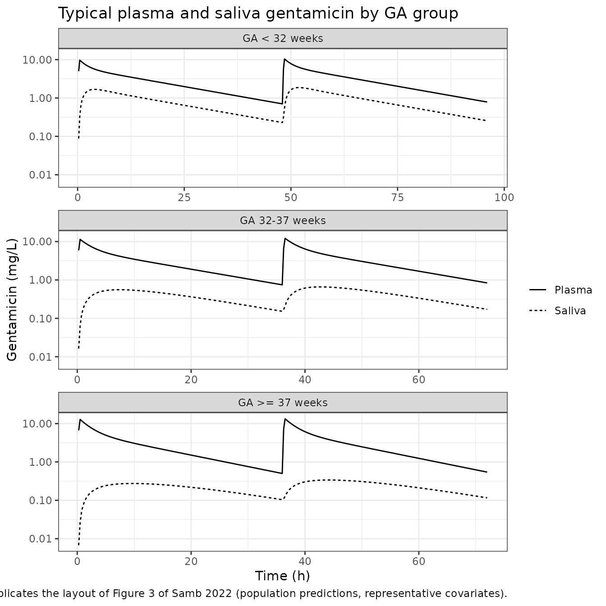
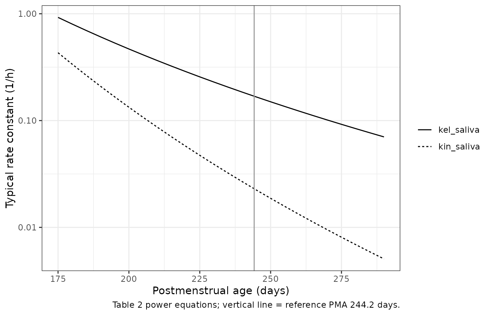
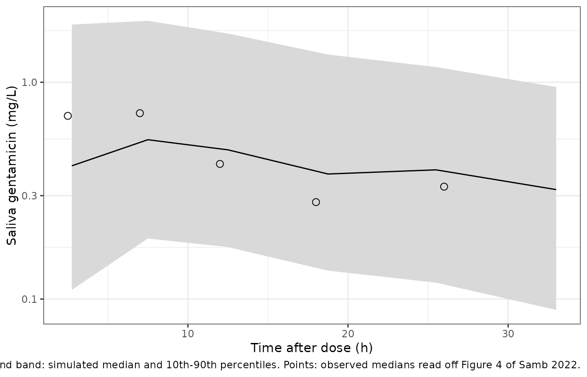

# Gentamicin in plasma and saliva of neonates (Samb 2022)

## Model and source

- Citation: Samb A, Kruizinga M, Tallahi Y, van Esdonk M, van Heel W,
  Driessen G, Bijleveld Y, Stuurman R, Cohen A, van Kaam A, de Haan TR,
  Mathot R. Saliva as a sampling matrix for therapeutic drug monitoring
  of gentamicin in neonates: A prospective population pharmacokinetic
  and simulation study. Br J Clin Pharmacol. 2022;88(4):1845-1855.
  <doi:10.1111/bcp.15105>. Plasma layer: Fuchs A, Guidi M, Giannoni E,
  et al. Population pharmacokinetic study of gentamicin in a large
  cohort of premature and term neonates. Br J Clin Pharmacol.
  2014;78(5):1090-1101. <doi:10.1111/bcp.12444>.
- Description: Integrated plasma-saliva population PK model for
  intravenous gentamicin in preterm and term neonates (Samb 2022).
  Plasma is the Fuchs 2014 two-compartment neonatal model with every
  parameter held fixed (allometric weight scaling on CL/Q and Vc/Vp,
  linear centred effects of gestational age on CL and Vc, postnatal age
  on CL and concomitant dopamine on CL). A saliva compartment is
  appended as a driven, non-depleting hypothetical effect compartment:
  first-order transfer from central (kin_saliva = 0.023 1/h) and
  first-order loss from saliva (kel_saliva = 0.169 1/h), with the
  salivary concentration read on the central volume. Both saliva rate
  constants fall steeply with postmenstrual age (power exponents -8.8
  and -5.1 referenced to 244.2 days), so gentamicin appears far more
  readily in the saliva of premature neonates. IIV on kel_saliva only
  (38% CV); log-scale (exponential) residual error on saliva (49.7%).
- Article: <https://doi.org/10.1111/bcp.15105> (open access, PMC9298055)

Samb et al. measured gentamicin in saliva swabs from 54 preterm and term
neonates and asked whether saliva could replace heel-lance plasma
sampling for therapeutic drug monitoring (TDM). They kept plasma on the
published Fuchs 2014 neonatal model with every parameter fixed (also
packaged on its own as `Fuchs_2014_gentamicin`) and added one saliva
compartment. That compartment is filled from central at rate
`kin_saliva` (the paper’s k13) and emptied at rate `kel_saliva` (k30).
It does not draw mass out of plasma. Postmenstrual age (PMA) has a
strong negative effect on both saliva rate constants, so gentamicin
reaches saliva far more readily in premature neonates.

## Population

Fifty-four neonates were enrolled between October 2018 and March 2020 at
the Emma Children’s Hospital (Amsterdam UMC) and the Juliana Children’s
Hospital (The Hague); 60 had been planned, and the SARS-CoV-2 pandemic
ended the study early. Table 1 of the paper gives the demographics:
57.4% male; gestational age (GA) median 34.8 weeks (range 24.3-41.7),
with 21 neonates below 32 weeks, 13 at 32-37 weeks and 20 at or above 37
weeks; postnatal age (PNA) median 1.5 days (0.3-6.8); PMA median 244.2
days (170.5-294.2); current weight median 2.4 kg (0.7-4.3). Three
neonates had perinatal asphyxia treated with controlled hypothermia.
Each dose was a 0.5 h intravenous infusion: 5 mg/kg every 48 h (GA \< 32
weeks), 5 mg/kg every 36 h (32-37 weeks), and 4 mg/kg every 24 h
(Amsterdam) or 5 mg/kg every 36 h (The Hague) at or above 37 weeks.

Of 267 saliva swabs, 194 were analysed (73 had too little volume or were
contaminated with blood), and 27 of the 194 were below the 0.056 mg/L
LLOQ. The plasma data were 97 routine TDM concentrations.

The same information is available programmatically via
`rxode2::rxode(readModelDb("Samb_2022_gentamicin"))$population`.

## Source trace

Every `ini()` value carries an in-file comment naming its source. This
table collects them in one place.

| Equation / parameter | Value | Source location |
|----|----|----|
| `lcl` (CL, fixed) | 0.089 L/h | Table S1 theta_CL (Fuchs 2014) |
| `lvc` (Vc, fixed) | 0.908 L | Table S1 theta_Vc |
| `lq` (Q, fixed) | 0.157 L/h | Table S1 theta_Q |
| `lvp` (Vp, fixed) | 0.56 L | Table S1 theta_Vp |
| `e_wt_cl_q`, `e_wt_vc_vp` (fixed) | 0.75, 1 | Table S1 theta_CLWT / theta_QWT, theta_VcWT / theta_VpWT |
| `e_ga_cl`, `e_ga_vc` (fixed) | 1.87, -0.922 | Table S1 theta_CLGA, theta_VcGA |
| `e_pna_cl` (fixed) | 0.054 | Table S1 theta_CLPNA |
| `e_conmed_dopa_cl` (fixed) | -0.120 | Table S1 theta_CLDOPA |
| IIV CL, IIV Vc, correlation (fixed) | 28%, 18%, 87% | Table S1 |
| `addSd`, `propSd` (fixed) | 0.1 mg/L, 18% | Table S1 residual errors |
| Plasma covariate equations | `(WT/2170 g)^theta * (1 + theta*(GA-34)/34) * (1 + theta*(PNA-1)/1) * (1 + theta*DOPA)` | Table S1 TVCL / TVVC / Q / Vp equations |
| `lkin_saliva` (k13) | 0.023 1/h | Table 2 final model (RSE 16%) |
| `lkel_saliva` (k30) | 0.169 1/h | Table 2 final model (RSE 15%) |
| `e_page_kin_saliva` | -8.8 | Table 2 theta_PMA_K13 (RSE 16%) |
| `e_page_kel_saliva` | -5.1 | Table 2 theta_PMA_K30 (RSE 28%) |
| `etalkel_saliva` | 38% CV -\> 0.1349 | Table 2 IIV k30 |
| `expSd_Csaliva` | 0.497 | Table 2 sigma_prop (log-transformed data, Results 3.4) |
| Saliva covariate equations | `k = theta * (PMA/244.2)^theta_PMA` | Equation 1 and the equations printed under Table 2; 244.2 days = Table 1 median PMA |
| Saliva compartment structure | driven, no return | Methods 2.5 and Figure 1 (dashed central-to-saliva arrow) |
| `Csaliva <- saliva / vc` | – | Not printed; see Assumptions and deviations |

## Plasma layer is the packaged Fuchs 2014 model

Samb 2022 fixed every plasma parameter at the Fuchs 2014 estimates, and
its saliva compartment does not deplete central. The typical-value
plasma profile should therefore match `Fuchs_2014_gentamicin` to solver
precision. Fuchs centres PNA by a ratio and Table S1 by a difference,
but with a 1-day reference the two forms are the same.

``` r

mod <- readModelDb("Samb_2022_gentamicin")
mod_typ <- rxode2::zeroRe(mod)
#> ℹ parameter labels from comments will be replaced by 'label()'

# Representative neonates, one per GA group of Methods 2.2. The patients in
# Figure 3 are not identified beyond their GA group, so these covariates are
# illustrative: GA and PNA inside each band, with weight interpolated from the
# GA-weight pairs Fuchs 2014 uses for its own representative patients.
fuchs_ga <- c(26, 30, 34, 37, 40)
fuchs_bw <- c(0.890, 1.080, 2.120, 2.950, 3.580)
wt_for_ga <- function(ga) stats::approx(fuchs_ga, fuchs_bw, xout = ga, rule = 2)$y

reps <- tibble::tibble(
  id = 1:3,
  group = c("GA < 32 weeks", "GA 32-37 weeks", "GA >= 37 weeks"),
  GA = c(28, 34.8, 39),
  pna_days = c(2, 1.5, 2),
  # GA >= 37 weeks: the Hague regimen, 5 mg/kg every 36 h, which is the
  # interval visible in Figure 3C
  mg_per_kg = c(5, 5, 5),
  tau = c(48, 36, 36)
) |>
  mutate(
    WT = wt_for_ga(GA),
    PNA = pna_days / 30.4375,
    PAGE = (GA * 7 + pna_days) / 30.4375,
    CONMED_DOPA = 0
  )

make_rep_events <- function(r, n_dose, t_end, dt = 0.25) {
  amt <- r$mg_per_kg * r$WT
  doses <- tibble::tibble(
    time = (seq_len(n_dose) - 1) * r$tau, amt = amt, rate = amt / 0.5,
    evid = 1L, cmt = "central", dvid = NA_integer_
  )
  obs <- tibble::tibble(
    time = seq(0, t_end, by = dt), amt = NA_real_, rate = NA_real_,
    evid = 0L, cmt = "central", dvid = 1L
  )
  bind_rows(doses, obs) |>
    mutate(
      id = r$id, GA = r$GA, PNA = r$PNA, WT = r$WT, PAGE = r$PAGE,
      CONMED_DOPA = r$CONMED_DOPA, group = r$group
    ) |>
    arrange(time, desc(evid))
}

rep_events <- bind_rows(lapply(seq_len(nrow(reps)), function(i) {
  make_rep_events(reps[i, ], n_dose = 2, t_end = 2 * reps$tau[i])
}))

rep_sim <- rxode2::rxSolve(
  mod_typ,
  events = rep_events, keep = "group",
  useLinCmt = FALSE, atol = 1e-10, rtol = 1e-10
) |>
  as.data.frame()
#> ℹ omega/sigma items treated as zero: 'etalcl', 'etalvc', 'etalkel_saliva'
#> Warning: multi-subject simulation without without 'omega'

fuchs_sim <- rxode2::rxSolve(
  rxode2::zeroRe(readModelDb("Fuchs_2014_gentamicin")),
  events = rep_events |> select(-dvid),
  atol = 1e-10, rtol = 1e-10
) |>
  as.data.frame()
#> ℹ parameter labels from comments will be replaced by 'label()'
#> ℹ omega/sigma items treated as zero: 'etalcl', 'etalvc'
#> Warning: multi-subject simulation without without 'omega'

plasma_cmp <- inner_join(
  rep_sim |> select(id, time, Cc_samb = Cc),
  fuchs_sim |> select(id, time, Cc_fuchs = Cc),
  by = c("id", "time")
) |>
  filter(Cc_fuchs > 0)

max_rel <- max(abs(plasma_cmp$Cc_samb / plasma_cmp$Cc_fuchs - 1))
max_rel
#> [1] 2.406253e-11
# Same parameters and the same ODEs on both sides, so the only difference is
# solver error.
stopifnot(nrow(plasma_cmp) > 100, max_rel < 1e-6)
```

## Replicate Figure 3: plasma and saliva in one neonate per GA group

Figure 3 of the paper shows individual fits for one neonate from each GA
group. Below are the typical-value (population) profiles for the
representative neonates defined above, over two dosing intervals.

``` r

rep_long <- rep_sim |>
  select(id, group, time, Cc, Csaliva) |>
  pivot_longer(c(Cc, Csaliva), names_to = "matrix", values_to = "conc") |>
  mutate(
    matrix = recode(matrix, Cc = "Plasma", Csaliva = "Saliva"),
    group = factor(group, levels = reps$group)
  ) |>
  filter(conc > 0)

ggplot(rep_long, aes(time, conc, linetype = matrix)) +
  geom_line() +
  scale_y_log10() +
  facet_wrap(~group, ncol = 1, scales = "free_x") +
  labs(
    x = "Time (h)", y = "Gentamicin (mg/L)", linetype = NULL,
    title = "Typical plasma and saliva gentamicin by GA group",
    caption = "Replicates the layout of Figure 3 of Samb 2022 (population predictions, representative covariates)."
  ) +
  theme_bw()
```



These are the levels read off Figure 3. They are approximate, because
the plotted neonates’ exact covariates are not published:

``` r

fig3 <- tibble::tribble(
  ~group, ~quantity, ~figure3,
  "GA < 32 weeks", "Saliva peak, 1st interval (mg/L)", 2.6,
  "GA < 32 weeks", "Saliva/plasma ratio at end of 1st interval", 0.44,
  "GA 32-37 weeks", "Saliva peak, 1st interval (mg/L)", 0.47,
  "GA 32-37 weeks", "Saliva/plasma ratio at end of 1st interval", 0.22,
  "GA >= 37 weeks", "Saliva peak, 1st interval (mg/L)", 0.27,
  "GA >= 37 weeks", "Saliva/plasma ratio at end of 1st interval", 0.27
)

first_interval <- rep_sim |>
  left_join(reps |> select(id, tau), by = "id") |>
  filter(time <= tau)

model_fig3 <- first_interval |>
  group_by(group) |>
  summarise(
    peak = max(Csaliva),
    ratio_end = Csaliva[time == max(time)] / Cc[time == max(time)],
    .groups = "drop"
  ) |>
  pivot_longer(c(peak, ratio_end), names_to = "quantity", values_to = "model") |>
  mutate(quantity = recode(
    quantity,
    peak = "Saliva peak, 1st interval (mg/L)",
    ratio_end = "Saliva/plasma ratio at end of 1st interval"
  ))

fig3_cmp <- left_join(fig3, model_fig3, by = c("group", "quantity")) |>
  mutate(ratio_model_to_figure = model / figure3)

fig3_cmp |>
  mutate(across(c(model, ratio_model_to_figure), \(x) signif(x, 3))) |>
  rename(
    "GA group" = group, "Quantity" = quantity,
    "Figure 3 (read off)" = figure3, "Model" = model,
    "Model / figure" = ratio_model_to_figure
  ) |>
  knitr::kable(caption = "Representative typical-value profiles against levels read off Figure 3.")
```

| GA group | Quantity | Figure 3 (read off) | Model | Model / figure |
|:---|:---|---:|---:|---:|
| GA \< 32 weeks | Saliva peak, 1st interval (mg/L) | 2.60 | 1.680 | 0.645 |
| GA \< 32 weeks | Saliva/plasma ratio at end of 1st interval | 0.44 | 0.325 | 0.740 |
| GA 32-37 weeks | Saliva peak, 1st interval (mg/L) | 0.47 | 0.558 | 1.190 |
| GA 32-37 weeks | Saliva/plasma ratio at end of 1st interval | 0.22 | 0.204 | 0.929 |
| GA \>= 37 weeks | Saliva peak, 1st interval (mg/L) | 0.27 | 0.275 | 1.020 |
| GA \>= 37 weeks | Saliva/plasma ratio at end of 1st interval | 0.27 | 0.208 | 0.769 |

Representative typical-value profiles against levels read off Figure 3.
{.table style="width:100%;"}

``` r


# The figure shows individual fits of unidentified neonates, so the check is
# order-of-magnitude. Reading saliva on an implied 1 L volume instead of Vc
# would put the preterm saliva curve about threefold lower, and a wrong PMA
# exponent sign would invert the ordering across groups. Either fails here.
stopifnot(
  all(fig3_cmp$ratio_model_to_figure > 0.5),
  all(fig3_cmp$ratio_model_to_figure < 2)
)
```

The structure reproduces what Figure 3 shows. Saliva peaks within a few
hours and closely follows plasma in the most premature neonate. In the
term neonate it peaks late and stays flat.

## Saliva:plasma ratio and postmenstrual age

The saliva compartment is driven by central and does not return drug to
it. So once plasma is in its terminal phase (rate `lambda_z`), the
saliva:plasma concentration ratio settles at
`kin_saliva / (kel_saliva - lambda_z)`, provided
`kel_saliva > lambda_z`. Both rate constants fall with PMA, `kin_saliva`
much faster (exponent -8.8 against -5.1). The ratio therefore drops
steeply with maturity, which is the paper’s central finding.

``` r

# Single dose, solved long enough for every non-terminal exponential to vanish,
# then compared with the closed form built from the same typical parameters.
ratio_reps <- reps |> filter(GA < 37)  # kel_saliva well above lambda_z
long_events <- bind_rows(lapply(seq_len(nrow(ratio_reps)), function(i) {
  make_rep_events(ratio_reps[i, ], n_dose = 1, t_end = 150, dt = 5)
}))
long_sim <- rxode2::rxSolve(
  mod_typ,
  events = long_events, useLinCmt = FALSE, atol = 1e-14, rtol = 1e-12
) |>
  as.data.frame()
#> ℹ omega/sigma items treated as zero: 'etalcl', 'etalvc', 'etalkel_saliva'
#> Warning: multi-subject simulation without without 'omega'

analytic <- ratio_reps |>
  mutate(
    pma_days = PAGE * 30.4375,
    cl = 0.089 * (WT / 2.170)^0.75 * (1 + 1.87 * (GA - 34) / 34) *
      (1 + 0.054 * (pna_days - 1)),
    vc = 0.908 * (WT / 2.170) * (1 - 0.922 * (GA - 34) / 34),
    q = 0.157 * (WT / 2.170)^0.75,
    vp = 0.56 * (WT / 2.170),
    k10 = cl / vc, k12 = q / vc, k21 = q / vp,
    lambda_z = 0.5 * ((k10 + k12 + k21) - sqrt((k10 + k12 + k21)^2 - 4 * k10 * k21)),
    kin_saliva = 0.023 * (pma_days / 244.2)^-8.8,
    kel_saliva = 0.169 * (pma_days / 244.2)^-5.1,
    ratio_analytic = kin_saliva / (kel_saliva - lambda_z)
  )

ratio_cmp <- long_sim |>
  filter(time == 150) |>
  transmute(id, ratio_sim = Csaliva / Cc) |>
  inner_join(analytic |> select(id, group, lambda_z, kin_saliva, kel_saliva, ratio_analytic), by = "id")

ratio_cmp |>
  mutate(across(where(is.numeric) & !id, \(x) signif(x, 4))) |>
  select(group, lambda_z, kin_saliva, kel_saliva, ratio_analytic, ratio_sim) |>
  rename(
    "GA group" = group, "lambda_z (1/h)" = lambda_z,
    "kin_saliva (1/h)" = kin_saliva, "kel_saliva (1/h)" = kel_saliva,
    "Ratio, closed form" = ratio_analytic, "Ratio, simulated at 150 h" = ratio_sim
  ) |>
  knitr::kable(caption = "Terminal-phase saliva:plasma ratio, closed form against ODE solution.")
```

| GA group | lambda_z (1/h) | kin_saliva (1/h) | kel_saliva (1/h) | Ratio, closed form | Ratio, simulated at 150 h |
|:---|---:|---:|---:|---:|---:|
| GA \< 32 weeks | 0.04502 | 0.14560 | 0.4925 | 0.3254 | 0.3254 |
| GA 32-37 weeks | 0.05853 | 0.02227 | 0.1659 | 0.2075 | 0.2075 |

Terminal-phase saliva:plasma ratio, closed form against ODE solution.
{.table}

``` r


stopifnot(all(abs(ratio_cmp$ratio_sim / ratio_cmp$ratio_analytic - 1) < 1e-3))
```

``` r

pma_grid <- tibble::tibble(pma_days = seq(175, 290, by = 5)) |>
  mutate(
    kin_saliva = 0.023 * (pma_days / 244.2)^-8.8,
    kel_saliva = 0.169 * (pma_days / 244.2)^-5.1
  ) |>
  pivot_longer(-pma_days, names_to = "parameter", values_to = "value")

ggplot(pma_grid, aes(pma_days, value, linetype = parameter)) +
  geom_line() +
  geom_vline(xintercept = 244.2, colour = "grey60") +
  scale_y_log10() +
  labs(
    x = "Postmenstrual age (days)", y = "Typical rate constant (1/h)", linetype = NULL,
    caption = "Table 2 power equations; vertical line = reference PMA 244.2 days."
  ) +
  theme_bw()
```



## Virtual cohort and comparison with the Figure 4 pcVPC

The individual data are not public. The virtual cohort mirrors Table 1,
with a few explicit assumptions. GA groups are sized in the Table 1
proportions (21:13:20, multiplied by three), and GA is uniform within
each band over the observed 24.3-41.7 week range. PNA is log-uniform on
0.3-6.8 days, which gives a median near the observed 1.5 days. Weight is
the GA-weight interpolation above with 10% log-normal scatter, and no
neonate is on dopamine. Each neonate receives two doses of their group’s
regimen (the Amsterdam regimen for GA \>= 37 weeks).

``` r

set.seed(20220415)
rxode2::rxSetSeed(20220415)

n_grp <- c(63L, 39L, 60L)  # Table 1: 21 / 13 / 20 neonates, x3
cohort <- tibble::tibble(
  group = rep(c("GA < 32 weeks", "GA 32-37 weeks", "GA >= 37 weeks"), n_grp),
  GA = c(runif(n_grp[1], 24.3, 32), runif(n_grp[2], 32, 37), runif(n_grp[3], 37, 41.7)),
  mg_per_kg = rep(c(5, 5, 4), n_grp),
  tau = rep(c(48, 36, 24), n_grp)
) |>
  mutate(
    id = row_number(),
    pna_days = exp(runif(n(), log(0.3), log(6.8))),
    WT = wt_for_ga(GA) * exp(rnorm(n(), 0, 0.1)),
    PNA = pna_days / 30.4375,
    PAGE = (GA * 7 + pna_days) / 30.4375,
    CONMED_DOPA = 0
  )

summary(cohort |> select(GA, pna_days, WT) |> mutate(PMA_days = cohort$PAGE * 30.4375))
#>        GA           pna_days            WT            PMA_days    
#>  Min.   :24.30   Min.   :0.3036   Min.   :0.7487   Min.   :171.7  
#>  1st Qu.:29.42   1st Qu.:0.6084   1st Qu.:1.1005   1st Qu.:207.1  
#>  Median :34.31   Median :1.5173   Median :2.1516   Median :242.3  
#>  Mean   :33.84   Mean   :2.1182   Mean   :2.2233   Mean   :239.0  
#>  3rd Qu.:38.21   3rd Qu.:3.3083   3rd Qu.:3.2595   3rd Qu.:270.3  
#>  Max.   :41.53   Max.   :6.3292   Max.   :4.4357   Max.   :293.1

events <- bind_rows(lapply(seq_len(nrow(cohort)), function(i) {
  make_rep_events(cohort[i, ], n_dose = 2, t_end = 2 * cohort$tau[i], dt = 0.5)
}))

sim <- rxode2::rxSolve(
  mod,
  events = events, keep = c("group", "WT"),
  useLinCmt = FALSE
) |>
  as.data.frame() |>
  left_join(cohort |> select(id, tau), by = "id") |>
  mutate(
    tad = ifelse(time >= tau, time - tau, time),
    group = factor(group, levels = reps$group)
  )
#> ℹ parameter labels from comments will be replaced by 'label()'

stopifnot(!anyNA(sim$Cc), !anyNA(sim$Csaliva))
```

Figure 4 of the paper is a prediction-corrected VPC of the saliva data
against time after the last dose. The medians below were read off its
thick observed line. The simulated medians are individual predictions
(IIV, no residual error). Prediction correction and the mixed sampling
make the comparison approximate.

``` r

fig4_obs <- tibble::tribble(
  ~tad, ~median_obs,
  2.5, 0.70,
  7, 0.72,
  12, 0.42,
  18, 0.28,
  26, 0.33
)

sim_saliva <- sim |>
  filter(tad > 0, tad <= 36) |>
  mutate(bin = cut(tad, breaks = c(0, 5, 9.5, 15, 22, 30, 36))) |>
  group_by(bin) |>
  summarise(
    tad = median(tad),
    p10 = quantile(Csaliva, 0.1), p50 = median(Csaliva), p90 = quantile(Csaliva, 0.9),
    .groups = "drop"
  )

ggplot(sim_saliva, aes(tad)) +
  geom_ribbon(aes(ymin = p10, ymax = p90), fill = "grey85") +
  geom_line(aes(y = p50)) +
  geom_point(data = fig4_obs, aes(y = median_obs), shape = 21, size = 2.5) +
  scale_y_log10() +
  labs(
    x = "Time after dose (h)", y = "Saliva gentamicin (mg/L)",
    caption = "Line and band: simulated median and 10th-90th percentiles. Points: observed medians read off Figure 4 of Samb 2022."
  ) +
  theme_bw()
```



``` r


fig4_cmp <- fig4_obs |>
  mutate(sim_median = approx(sim_saliva$tad, sim_saliva$p50, xout = tad, rule = 2)$y) |>
  mutate(ratio = sim_median / median_obs)
knitr::kable(
  fig4_cmp |>
    mutate(across(c(sim_median, ratio), \(x) signif(x, 3))) |>
    rename(
      "Time after dose (h)" = tad, "Figure 4 observed median (mg/L)" = median_obs,
      "Simulated median (mg/L)" = sim_median, "Simulated / observed" = ratio
    ),
  caption = "Simulated saliva medians against the Figure 4 observed medians."
)
```

| Time after dose (h) | Figure 4 observed median (mg/L) | Simulated median (mg/L) | Simulated / observed |
|---:|---:|---:|---:|
| 2.5 | 0.70 | 0.412 | 0.588 |
| 7.0 | 0.72 | 0.529 | 0.735 |
| 12.0 | 0.42 | 0.493 | 1.170 |
| 18.0 | 0.28 | 0.391 | 1.400 |
| 26.0 | 0.33 | 0.389 | 1.180 |

Simulated saliva medians against the Figure 4 observed medians. {.table}

``` r


# Centre of the distribution, not its tails: a saliva volume or PMA exponent
# error shifts every bin severalfold.
stopifnot(abs(log(median(fig4_cmp$ratio))) < log(1.6), all(fig4_cmp$ratio > 0.4), all(fig4_cmp$ratio < 2.5))
```

## PKNCA: first-dose exposure in plasma and saliva

The paper reports no NCA, so there is no published table to compare
against. The first dosing interval is summarised per GA group for both
matrices. The saliva:plasma AUC ratio gives the exposure-scale version
of the PMA effect.

``` r

first <- sim |> filter(time <= tau)

nca_one <- function(df, conc_col) {
  conc <- df |>
    filter(!is.na(.data[[conc_col]])) |>
    transmute(id, group, time, conc = .data[[conc_col]])
  conc <- bind_rows(conc, conc |> distinct(id, group) |> mutate(time = 0, conc = 0)) |>
    distinct(id, group, time, .keep_all = TRUE) |>
    arrange(id, group, time)
  doses <- events |>
    filter(evid == 1L, time == 0) |>
    select(id, group, time, amt) |>
    mutate(group = factor(group, levels = reps$group))
  ints <- cohort |>
    distinct(group, tau) |>
    transmute(
      group = factor(group, levels = reps$group), start = 0, end = tau,
      cmax = TRUE, tmax = TRUE, auclast = TRUE
    )
  d <- PKNCA::PKNCAdata(
    PKNCA::PKNCAconc(conc, conc ~ time | group + id),
    PKNCA::PKNCAdose(doses, amt ~ time | group + id),
    intervals = ints
  )
  as.data.frame(PKNCA::pk.nca(d))
}

nca <- bind_rows(
  nca_one(first, "Cc") |> mutate(matrix = "Plasma"),
  nca_one(first, "Csaliva") |> mutate(matrix = "Saliva")
)

nca_summary <- nca |>
  filter(PPTESTCD %in% c("cmax", "tmax", "auclast")) |>
  group_by(matrix, group, PPTESTCD) |>
  summarise(median = signif(median(PPORRES), 3), .groups = "drop") |>
  pivot_wider(names_from = PPTESTCD, values_from = median)

nca_summary |>
  select(matrix, group, cmax, tmax, auclast) |>
  rename(
    "Matrix" = matrix, "GA group" = group, "Cmax (mg/L)" = cmax,
    "Tmax (h)" = tmax, "AUC0-tau (mg*h/L)" = auclast
  ) |>
  knitr::kable(caption = "Median first-dose NCA by matrix and GA group (simulated).")
```

| Matrix | GA group        | Cmax (mg/L) | Tmax (h) | AUC0-tau (mg\*h/L) |
|:-------|:----------------|------------:|---------:|-------------------:|
| Plasma | GA \< 32 weeks  |       9.880 |     0.50 |              125.0 |
| Plasma | GA 32-37 weeks  |      11.600 |     0.50 |              102.0 |
| Plasma | GA \>= 37 weeks |      10.200 |     0.50 |               65.5 |
| Saliva | GA \< 32 weeks  |       1.410 |     3.50 |               31.5 |
| Saliva | GA 32-37 weeks  |       0.501 |     7.00 |               11.8 |
| Saliva | GA \>= 37 weeks |       0.213 |     9.75 |                4.1 |

Median first-dose NCA by matrix and GA group (simulated). {.table}

``` r


auc_ratio <- nca |>
  filter(PPTESTCD == "auclast") |>
  select(id, group, matrix, PPORRES) |>
  pivot_wider(names_from = matrix, values_from = PPORRES) |>
  mutate(sp_ratio = Saliva / Plasma) |>
  group_by(group) |>
  summarise(median_sp_auc_ratio = signif(median(sp_ratio), 3), .groups = "drop")

auc_ratio |>
  rename("GA group" = group, "Median saliva/plasma AUC0-tau" = median_sp_auc_ratio) |>
  knitr::kable(caption = "Saliva:plasma exposure ratio by GA group.")
```

| GA group        | Median saliva/plasma AUC0-tau |
|:----------------|------------------------------:|
| GA \< 32 weeks  |                        0.2590 |
| GA 32-37 weeks  |                        0.1170 |
| GA \>= 37 weeks |                        0.0612 |

Saliva:plasma exposure ratio by GA group. {.table}

``` r


# The plasma peak sits near the 8-12 mg/L clinical target band the paper
# quotes for standard dosing (Methods 2.6), and saliva exposure falls with
# maturity. Medians across 39-63 neonates per group, well clear of the bounds.
plasma_cmax <- nca_summary |> filter(matrix == "Plasma") |> pull(cmax)
stopifnot(
  all(plasma_cmax > 6), all(plasma_cmax < 16),
  auc_ratio$median_sp_auc_ratio[1] > 2 * auc_ratio$median_sp_auc_ratio[3]
)
```

## Assumptions and deviations

- **Saliva concentration is read on the central volume.** Samb 2022
  reports no saliva volume. Table 2 lists only k13, k30, the two PMA
  exponents, the residual error and the IIV, and the paper does not
  print the observation equation. Methods 2.5 calls the saliva
  compartment “similar to a hypothetical effect compartment model”, and
  the packaged model reads the saliva amount on Vc
  (`Csaliva <- saliva / vc`), as `Nguyen_2026_linezolid` does. The other
  reading, an implied 1 L scale (NONMEM’s default with no scale factor),
  is ruled out by Figure 3. It would leave the GA 32-37 week profile
  almost unchanged (Vc is about 1 L at 2.4 kg) but would put the
  saliva:plasma ratio of the most premature neonate at about 0.16.
  Figure 3A shows about 0.4, and the Vc reading gives about 0.33.
- **Sign of the PMA exponents.** The PDF typesetting drops the minus
  signs in Table 2. They are restored from the bootstrap columns (2.5th
  percentile -11.7 and -8.1, below the 97.5th percentiles -5.7 and -2.0)
  and from Results 3.4 (“a negative correlation between PMA and both the
  transport and elimination rate”). The Discussion quotes -5.5 for the
  k30 exponent, but Table 2 and Results 3.4 both give -5.1, which is
  used.
- **IIV on k30 read as a CV.** The paper does not say whether 38% is a
  CV or `sqrt(omega^2) * 100`, and its bootstrap percentile interval
  cannot tell the two apart. The packaged value is
  `log(1 + 0.38^2) = 0.1349`, the convention used for the same group’s
  `Bijleveld_2017_gentamicin` and for the plasma layer. The other
  reading gives 0.1444.
- **Saliva residual error.** “Logarithmic proportional error” on
  log-transformed data is an additive error on log(concentration),
  encoded as `lnorm(expSd_Csaliva)` with SD 0.497. The plasma residual
  error is the Fuchs 2014 combined additive + proportional model from
  Table S1, fixed. Samb 2022 also log-transformed the plasma data and
  does not say how this residual was carried on that scale. Saliva
  concentrations below the LLOQ were handled with the M3 method in
  estimation, which matters only for fitting.
- **Postmenstrual age unit.** The paper writes PMA in days. The
  canonical `PAGE` column is in months, and the model converts with
  `PMA_days = PAGE * 30.4375`. Supply `PAGE` consistent with `GA` and
  `PNA` (PMA in days = 7 \* GA + PNA in days).
- **Dopamine.** The plasma layer keeps the Fuchs 2014 dopamine effect
  on CL. Samb 2022 does not report how many neonates received dopamine,
  and the virtual cohort assumes none did.
- **Virtual cohort.** The GA, PNA and weight distributions and the
  GA-to-weight interpolation (from Fuchs 2014’s representative GA-weight
  pairs) are assumptions. The paper’s own TDM simulation cohort (n =
  3000, uniform GA) is shown only in a Supporting Information figure.
  Figure 3 and Figure 4 levels were read off the published figures by
  the maintainers.
- **Not reproduced.** The TDM target-attainment simulations (Figure 5)
  require Bayesian MAP re-estimation and a dose-adjustment rule. They
  are outside the scope of a model-library validation.
