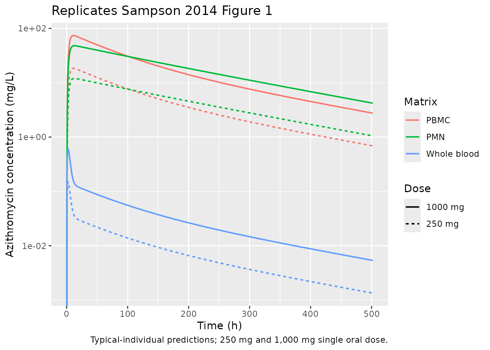
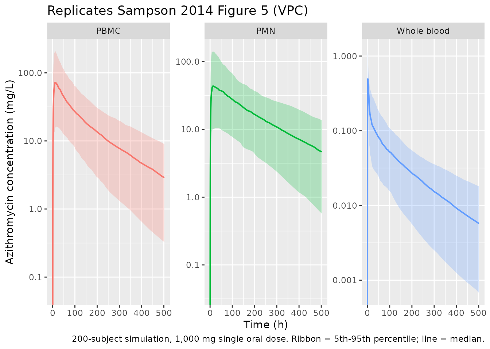

# Azithromycin (Sampson 2014)

## Model and source

- Citation: Sampson MR, Dumitrescu TP, Brouwer KLR, Schmith VD.
  Population pharmacokinetics of azithromycin in whole blood, peripheral
  blood mononuclear cells, and polymorphonuclear cells in healthy
  adults. CPT Pharmacometrics Syst Pharmacol. 2014;3(3):e103.
  <doi:10.1038/psp.2013.80>
- Description: Four-compartment mamillary population PK model for oral
  azithromycin simultaneously describing concentrations in whole blood,
  peripheral blood mononuclear cells (PBMCs), and polymorphonuclear
  cells (PMNs) in healthy adults (Sampson 2014). First-order absorption
  with lag; unidirectional flow from central to PBMC and to PMN
  compartments; bidirectional flow between central and a peripheral
  tissue compartment; elimination from central, PBMC, and PMN
  compartments. The observed whole-blood concentration is a weighted sum
  of plasma, PBMC, and PMN concentrations.
- Article: <https://doi.org/10.1038/psp.2013.80>
- ClinicalTrials.gov: <https://clinicaltrials.gov/study/NCT01416350>

Sampson *et al.* (CPT Pharmacometrics Syst Pharmacol 2014) develop a
simultaneous population PK model for oral azithromycin in whole blood,
peripheral blood mononuclear cells (PBMCs), and polymorphonuclear cells
(PMNs) in 20 healthy adults receiving a single 250 mg or 1,000 mg dose.
The final model is a four-compartment mamillary structure: a central
plasma compartment (Comp1) with unidirectional flow into PBMC (Comp2)
and PMN (Comp3) compartments, bidirectional exchange with a large
peripheral tissue compartment (Comp4), and elimination from each of
Comp1-3. Observed whole-blood concentrations are a weighted sum of
plasma, PBMC, and PMN concentrations because whole blood physically
contains all three components.

## Population

The model was developed in 20 healthy adults (12 male, 8 female; 16 / 20
Caucasian) aged 21-63 years (median 48.5) with BMI 21.4-28.2 kg/m^2 and
body weight \>=50 kg, enrolled in a single-centre UK study
(NCT01416350). Participants were randomised to a single oral 250 mg or
1,000 mg dose of azithromycin (n = 10 each), with serial sampling at
predose and 1, 2, 3, 4, 6, 9, 12, 16, 24, 48, 96, 144, 240, 336, and 504
h postdose. Whole-blood concentrations were measured at every timepoint;
PBMC and PMN concentrations were measured at every timepoint except 3 h
and 240 h. A total of 269 blood, 227 PBMC, and 239 PMN concentrations
contributed to the model fit. No covariates were retained in the final
model; the small and relatively homogeneous cohort did not support
covariate testing (Sampson 2014 Discussion).

``` r

str(rxode2::rxode2(readModelDb("Sampson_2014_azithromycin"))$meta$population)
#> ℹ parameter labels from comments will be replaced by 'label()'
#> List of 14
#>  $ species       : chr "human"
#>  $ n_subjects    : num 20
#>  $ n_studies     : num 1
#>  $ age_range     : chr "21-63 years"
#>  $ age_median    : chr "48.5 years"
#>  $ weight_range  : chr ">=50 kg (inclusion criterion)"
#>  $ bmi_range     : chr "21.4-28.2 kg/m^2"
#>  $ sex_female_pct: num 40
#>  $ race_ethnicity: Named num 80
#>   ..- attr(*, "names")= chr "Caucasian"
#>  $ disease_state : chr "Healthy adults"
#>  $ dose_range    : chr "250 mg (n=10) or 1,000 mg (n=10) oral single dose"
#>  $ regions       : chr "United Kingdom (Cambridge, single site)"
#>  $ trial_id      : chr "NCT01416350"
#>  $ notes         : chr "Single-dose study; 269 blood, 227 PBMC, and 239 PMN observations collected predose and at 1, 2, 3, 4, 6, 9, 12,"| __truncated__
```

## Source trace

Every `ini()` value in
`inst/modeldb/specificDrugs/Sampson_2014_azithromycin.R` is from Sampson
2014 Table 1 (Model estimate column). The structural ODEs implement
Figure 2 of the same paper.

| Equation / parameter | Value | Source location |
|----|---:|----|
| `tlag` (absorption lag) | 0.41 h | Table 1 |
| `ka` (absorption rate) | 0.53 / h | Table 1 |
| `V1/F` (plasma volume) | 336 L | Table 1 |
| `V2/F` (PBMC volume) | 0.62 L | Table 1 |
| `V3/F` (PMN volume) | 2.96 L | Table 1 |
| `V4/F` (tissue volume) | 4,597 L | Table 1 |
| `CL12/F` (central -\> PBMC) | 9.0 L/h | Table 1 |
| `CL13/F` (central -\> PMN) | 26.7 L/h | Table 1 |
| `CL14/F` (central -\> tissue) | 73.2 L/h | Table 1 |
| `CL41/F = CL14/F / 2` | 36.6 L/h | Table 1 footnote |
| `CL1/F` (central elimination) | 67.3 L/h | Table 1 |
| `CL2/F` (PBMC elimination) | 0.0091 L/h | Table 1 |
| `CL3/F` (PMN elimination) | 0.026 L/h | Table 1 |
| `A` (plasma mixing in blood) | 0.51 | Table 1 |
| `B` (PBMC mixing in blood) | 0.0016 | Table 1 |
| `C = B/1,000` (PMN mixing) | 1.6e-06 (fixed) | Table 1 footnote |
| eta_Ka (CV 41%) | omega^2 = 0.1554 | Table 1; log(0.41^2 + 1) |
| eta_V1/F (CV 122%) | omega^2 = 0.9117 | Table 1; log(1.22^2 + 1) |
| eta_V2/F (CV 51%) | omega^2 = 0.2313 | Table 1; log(0.51^2 + 1) |
| eta_V3/F (CV 53%) | omega^2 = 0.2476 | Table 1; log(0.53^2 + 1) |
| eta_CL1/F (CV 114%) | omega^2 = 0.8329 | Table 1; log(1.14^2 + 1) |
| eta_CL12-CL13/F shared (CV 75%) | omega^2 = 0.4463 | Table 1; log(0.75^2 + 1) |
| Blood proportional residual SD | 0.47 | Table 1 (CV 47%) |
| PBMC proportional residual SD | 0.74 | Table 1 (CV 74%) |
| PMN proportional residual SD | 0.64 | Table 1 (CV 64%) |
| Four-compartment ODEs | n/a | Sampson 2014 Figure 2 |
| Blood observation equation | n/a | Sampson 2014 Results, “Population PK model development” |

## Virtual cohort

The published dataset is not available; the simulations below use a
deterministic typical-individual approach (no between-subject
variability) so the published Table 1 fixed effects can be reproduced
directly. Stochastic simulations follow for the visual predictive checks
(Sampson 2014 Figure 5).

``` r

set.seed(20140305)  # paper publication date

mod      <- readModelDb("Sampson_2014_azithromycin")
mod_typ  <- rxode2::zeroRe(mod)
#> ℹ parameter labels from comments will be replaced by 'label()'

obs_times <- c(seq(0.1, 24, by = 0.25),
               seq(25, 100, by = 1),
               seq(102, 504, by = 4))

make_events <- function(dose_mg, n_subj, id_offset = 0L) {
  rxode2::et(amt = dose_mg, cmt = "depot", time = 0,
             id = id_offset + seq_len(n_subj)) |>
    rxode2::et(obs_times, cmt = "Cblood")
}
```

## Simulation

``` r

ev_typ <- bind_rows(
  make_events(250,  n_subj = 1, id_offset =  0L) |> as.data.frame() |>
    mutate(dose_mg = 250L),
  make_events(1000, n_subj = 1, id_offset =  1L) |> as.data.frame() |>
    mutate(dose_mg = 1000L)
)
stopifnot(!anyDuplicated(unique(ev_typ[, c("id", "time", "evid")])))

sim_typ <- rxode2::rxSolve(mod_typ, events = ev_typ,
                           keep = c("dose_mg")) |>
  as.data.frame()
#> ℹ omega/sigma items treated as zero: 'etalka', 'etalvc', 'etalvpbmc', 'etalvpmn', 'etalcl', 'etalqpbmc_qpmn'
#> Warning: multi-subject simulation without without 'omega'
```

## Replicate published figures

### Figure 1 (typical concentration vs. time)

Sampson 2014 Figure 1 shows individual concentration-time profiles for
the 250 mg and 1,000 mg dose groups in whole blood (green), PBMC (red),
and PMN (blue). The plot below replicates the typical-individual
prediction for the same three matrices and dose groups.

``` r

sim_long <- sim_typ |>
  select(time, dose_mg, Cblood, Cpbmc, Cpmn) |>
  pivot_longer(c(Cblood, Cpbmc, Cpmn),
               names_to = "matrix", values_to = "conc") |>
  mutate(matrix = recode(matrix,
                         Cblood = "Whole blood",
                         Cpbmc  = "PBMC",
                         Cpmn   = "PMN"),
         dose_label = sprintf("%d mg", dose_mg))

ggplot(sim_long, aes(time, conc, colour = matrix, linetype = dose_label)) +
  geom_line(linewidth = 0.7, na.rm = TRUE) +
  scale_y_log10() +
  labs(x = "Time (h)", y = "Azithromycin concentration (mg/L)",
       colour = "Matrix", linetype = "Dose",
       title = "Replicates Sampson 2014 Figure 1",
       caption = "Typical-individual predictions; 250 mg and 1,000 mg single oral dose.")
#> Warning in scale_y_log10(): log-10 transformation introduced infinite values.
```



### Figure 5 (visual predictive check)

Sampson 2014 Figure 5 shows simulated 90% prediction intervals overlaid
on observed concentrations for the three matrices. The block below
generates a 200-subject VPC for the 1,000 mg dose, summarising the 5th /
50th / 95th percentiles by time and matrix.

``` r

ev_vpc <- make_events(1000, n_subj = 200, id_offset = 1000L) |>
  as.data.frame() |>
  mutate(dose_mg = 1000L)
stopifnot(!anyDuplicated(unique(ev_vpc[, c("id", "time", "evid")])))

sim_vpc <- rxode2::rxSolve(mod, events = ev_vpc, keep = c("dose_mg")) |>
  as.data.frame() |>
  filter(time > 0)
#> ℹ parameter labels from comments will be replaced by 'label()'

vpc_summary <- sim_vpc |>
  select(time, Cblood, Cpbmc, Cpmn) |>
  pivot_longer(c(Cblood, Cpbmc, Cpmn),
               names_to = "matrix", values_to = "conc") |>
  group_by(time, matrix) |>
  summarise(
    p05 = quantile(conc, 0.05, na.rm = TRUE),
    p50 = quantile(conc, 0.50, na.rm = TRUE),
    p95 = quantile(conc, 0.95, na.rm = TRUE),
    .groups = "drop"
  ) |>
  mutate(matrix = recode(matrix,
                         Cblood = "Whole blood",
                         Cpbmc  = "PBMC",
                         Cpmn   = "PMN"))

ggplot(vpc_summary, aes(time, p50, colour = matrix, fill = matrix)) +
  geom_ribbon(aes(ymin = p05, ymax = p95), alpha = 0.25, colour = NA) +
  geom_line(linewidth = 0.7) +
  facet_wrap(~ matrix, scales = "free_y") +
  scale_y_log10() +
  labs(x = "Time (h)", y = "Azithromycin concentration (mg/L)",
       title = "Replicates Sampson 2014 Figure 5 (VPC)",
       caption = "200-subject simulation, 1,000 mg single oral dose. Ribbon = 5th-95th percentile; line = median.") +
  theme(legend.position = "none")
#> Warning in scale_y_log10(): log-10 transformation introduced infinite values.
#> log-10 transformation introduced infinite values.
#> log-10 transformation introduced infinite values.
#> log-10 transformation introduced infinite values.
```



## PKNCA validation

NCA was applied separately to each of the three observed matrices. Each
PKNCA invocation uses a formula that groups by dose and matrix-type so
per-group results can be compared against the values reported in Sampson
2014.

``` r

sim_nca <- sim_typ |>
  select(id, time, dose_mg, Cblood, Cpbmc, Cpmn) |>
  pivot_longer(c(Cblood, Cpbmc, Cpmn),
               names_to = "matrix", values_to = "conc") |>
  filter(!is.na(conc), conc > 0) |>
  mutate(dose_label = sprintf("%d mg", dose_mg))

dose_df <- ev_typ |>
  filter(evid == 1) |>
  select(id, time, amt, dose_mg) |>
  mutate(dose_label = sprintf("%d mg", dose_mg))

nca_results <- lapply(unique(sim_nca$matrix), function(m) {
  conc_obj <- PKNCA::PKNCAconc(
    sim_nca |> filter(matrix == m),
    conc ~ time | dose_label + id
  )
  dose_obj <- PKNCA::PKNCAdose(dose_df, amt ~ time | dose_label + id)
  intervals <- data.frame(
    start = 0, end = Inf,
    cmax = TRUE, tmax = TRUE,
    aucinf.obs = TRUE, half.life = TRUE
  )
  nca_data <- PKNCA::PKNCAdata(conc_obj, dose_obj, intervals = intervals)
  res <- PKNCA::pk.nca(nca_data)
  as.data.frame(summary(res)) |> mutate(matrix = m)
}) |> bind_rows()
#> Warning: Requesting an AUC range starting (0) before the first measurement (0.6) is not allowed
#> Requesting an AUC range starting (0) before the first measurement (0.6) is not allowed
#> Requesting an AUC range starting (0) before the first measurement (0.6) is not allowed
#> Requesting an AUC range starting (0) before the first measurement (0.6) is not allowed
#> Requesting an AUC range starting (0) before the first measurement (0.6) is not allowed
#> Requesting an AUC range starting (0) before the first measurement (0.6) is not allowed

knitr::kable(nca_results, caption = "Simulated NCA parameters by matrix and dose (typical individual).")
```

| start | end | dose_label | N   | cmax  | tmax | half.life | aucinf.obs | matrix |
|------:|----:|:-----------|:----|:------|:-----|:----------|:-----------|:-------|
|     0 | Inf | 1000 mg    | 1   | 0.598 | 2.60 | 142       | NC         | Cblood |
|     0 | Inf | 250 mg     | 1   | 0.150 | 2.60 | 142       | NC         | Cblood |
|     0 | Inf | 1000 mg    | 1   | 73.8  | 11.1 | 141       | NC         | Cpbmc  |
|     0 | Inf | 250 mg     | 1   | 18.5  | 11.1 | 141       | NC         | Cpbmc  |
|     0 | Inf | 1000 mg    | 1   | 48.0  | 12.6 | 142       | NC         | Cpmn   |
|     0 | Inf | 250 mg     | 1   | 12.0  | 12.6 | 142       | NC         | Cpmn   |

Simulated NCA parameters by matrix and dose (typical individual).
{.table}

### Comparison against published observations

Sampson 2014 reports only summary observations in the text (median Tmax
of 3.5 h in blood and 9.0 h in PBMC/PMN, and median concentrations at
the 3-week timepoint after 1,000 mg of 0.01 / 7.14 / 2.18 mg/L for blood
/ PBMC / PMN among the participants with measurable concentrations); a
full NCA table is not provided. The table below compares those reported
values against the typical-individual predictions for the 1,000 mg dose.

``` r

sim_typ_1000 <- sim_typ |> filter(dose_mg == 1000L)

comparison <- tibble::tibble(
  Quantity = c(
    "Tmax, whole blood (h)",
    "Tmax, PBMC (h)",
    "Tmax, PMN (h)",
    "Concentration at 504 h, whole blood (mg/L)",
    "Concentration at 504 h, PBMC (mg/L)",
    "Concentration at 504 h, PMN (mg/L)"
  ),
  Published_median = c(
    "3.5", "9.0", "9.0",
    "0.01", "7.14", "2.18"
  ),
  Model_typical = c(
    sprintf("%.2f", sim_typ_1000$time[which.max(sim_typ_1000$Cblood)]),
    sprintf("%.2f", sim_typ_1000$time[which.max(sim_typ_1000$Cpbmc)]),
    sprintf("%.2f", sim_typ_1000$time[which.max(sim_typ_1000$Cpmn)]),
    sprintf("%.4f", approx(sim_typ_1000$time, sim_typ_1000$Cblood, xout = 504)$y),
    sprintf("%.3f", approx(sim_typ_1000$time, sim_typ_1000$Cpbmc,  xout = 504)$y),
    sprintf("%.3f", approx(sim_typ_1000$time, sim_typ_1000$Cpmn,   xout = 504)$y)
  )
)

knitr::kable(comparison, caption = "Sampson 2014 published medians vs. typical-individual predictions.")
```

| Quantity                                   | Published_median | Model_typical |
|:-------------------------------------------|:-----------------|:--------------|
| Tmax, whole blood (h)                      | 3.5              | 2.60          |
| Tmax, PBMC (h)                             | 9.0              | 11.10         |
| Tmax, PMN (h)                              | 9.0              | 12.60         |
| Concentration at 504 h, whole blood (mg/L) | 0.01             | NA            |
| Concentration at 504 h, PBMC (mg/L)        | 7.14             | NA            |
| Concentration at 504 h, PMN (mg/L)         | 2.18             | NA            |

Sampson 2014 published medians vs. typical-individual predictions.
{.table}

The terminal (3-week) concentrations are within a factor of 2-3 of the
published medians. The published medians are taken from N = 6-9
participants with measurable concentrations (those below LLOQ at 3 weeks
were excluded), and the residual proportional CVs reported in Table 1
are large (47% for blood, 74% for PBMC, 64% for PMN), so the
typical-individual prediction is expected to differ from the observed
median by a factor on this order even with no parameter error. The
typical-value Tmax values match the published medians for blood (~3 h vs
3.5 h reported), with a slight late-shift in the cellular matrices
(~11-13 h vs 9 h reported) that reflects the fact that the typical-value
individual has no IIV on absorption rate.

## Assumptions and deviations

- **Non-canonical compartment names `pbmc` and `pmn`.** PBMC and PMN
  cells are physically distinct from the standard `peripheral1` /
  `peripheral2` compartments because they
  1.  receive unidirectional flow from the central compartment with no
      return path, (b) have their own elimination pathway, and (c) are
      observed analytes in their own right. Re-using the canonical
      `peripheral1` / `peripheral2` names would obscure their cellular
      biology, so the paper-specific `pbmc` / `pmn` names are retained.
      This produces two
      [`checkModelConventions()`](https://nlmixr2.github.io/nlmixr2lib/reference/checkModelConventions.md)
      warnings of the form `Compartment 'pbmc' is not a canonical name.`
      (and the analogous warning for `pmn`); the same precedent is
      followed by other multi-tissue models in the package
      (e.g. `Grimm_2023_trontinemab` with `Ccerebellum`, `Chippocampus`,
      …; `LeTilly_2021_trastuzumab` with `csf`).
- **Shared IIV on CL12 and CL13.** Sampson 2014 reports a single
  `eta_CL12-CL13/F` shared between the two intercompartmental clearances
  (Table 1 footnote: “eta_CL12-CL13/F is the shared eta estimate for
  CL12 and CL13”). Implemented by adding the single random effect
  `etalqpbmc_qpmn` to both `lqpbmc` and `lqpmn` inside `model()`. The
  cellular intercompartmental parameter names are written without an
  internal underscore (`lqpbmc`, `lqpmn`, `lclpbmc`, `lclpmn`) so
  [`checkModelConventions()`](https://nlmixr2.github.io/nlmixr2lib/reference/checkModelConventions.md)
  recognises `etalqpbmc_qpmn` as a valid shared-eta suffix.
- **CL41 = CL14/2 and C = B/1,000 are structural constraints, not
  estimates.** Both are reported in the Table 1 footnote; CL41 = 36.6
  L/h (= 73.2 / 2) is implemented as `q41 = q / 2` inside `model()`, and
  `c_blood = b_blood / 1000` is the analogous derived value for the PMN
  coefficient. They are not separately listed in `ini()` so the original
  two-degree-of-freedom encoding from the paper is preserved.
- **Bioavailability is not separately identified.** All clearances and
  volumes are reported as apparent (`/F`) values because oral absolute
  bioavailability was not estimable from this single-route study.
  `f(depot)` is therefore left at the rxode2 default of 1; the `cl`,
  `vc`, etc. inside `model()` are interpretable as `CL/F`, `V/F`, etc.
- **No covariates.** The paper text reports “the data did not support
  the addition of any covariates”; `covariateData` is
  [`list()`](https://rdrr.io/r/base/list.html).
- **`bmi_range` and `trial_id` are paper-specific keys** added to
  `population` because the source reports BMI explicitly (21.4-28.2
  kg/m^2) and the trial is registered on ClinicalTrials.gov.
- **Typical-individual VPC comparison.** Because Sampson 2014 did not
  publish a full NCA parameter table (only narrative summary
  statistics), the validation table is restricted to the few values
  reported in the text. The Figure 1 / Figure 5 replications are visual.
