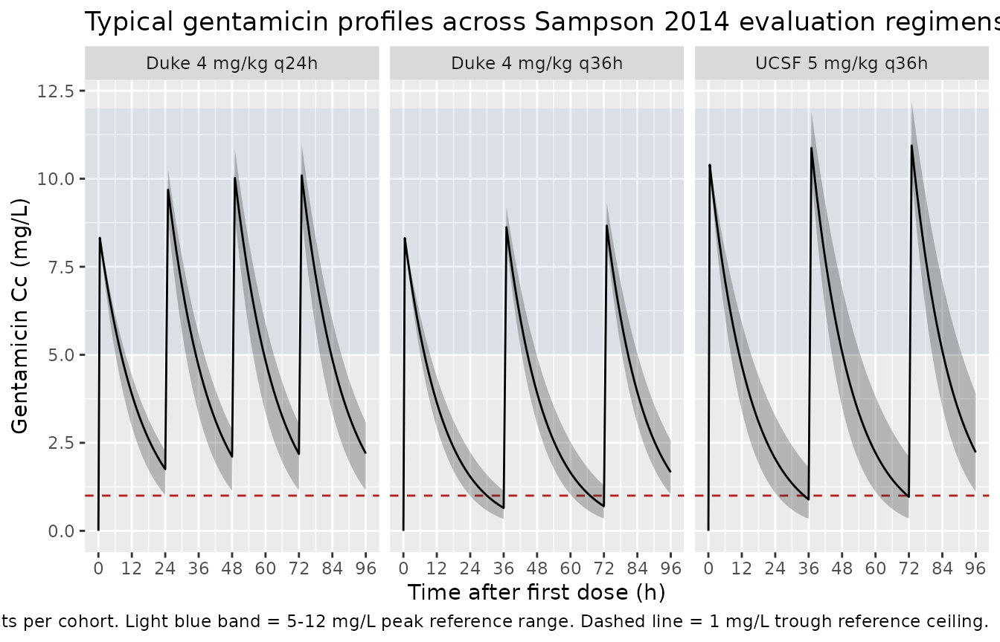

# Gentamicin in hypothermic HIE neonates (Sampson 2014)

## Model and source

- Citation: Sampson MR, Frymoyer A, Rattray B, Cotten CM, Smith B,
  Capparelli E, Bonifacio SL, Cohen-Wolkowiez M. Predictive performance
  of a gentamicin population pharmacokinetic model in neonates receiving
  full-body hypothermia. Ther Drug Monit. 2014;36(5):584-589.
- Article: <https://doi.org/10.1097/FTD.0000000000000056>
- Model origin: Frymoyer A, Lee S, Bonifacio SL, Meng L, Lucas SS,
  Guglielmo BJ, Sun Y, Verotta D. Every 36-h gentamicin dosing in
  neonates with hypoxic-ischemic encephalopathy receiving hypothermia. J
  Perinatol. 2013;33(10):778-782. <https://doi.org/10.1038/jp.2013.59>

``` r

mod_meta <- rxode2::rxode(readModelDb("Sampson_2014_gentamicin"))
#> ℹ parameter labels from comments will be replaced by 'label()'
mod_meta$description
#> [1] "One-compartment IV population PK model of gentamicin in term neonates with hypoxic-ischaemic encephalopathy undergoing whole-body hypothermia, as reported (model originally developed by Frymoyer 2013; this model file reproduces the parameter values stated by Sampson 2014 during the model's external predictive-performance evaluation). Allometric body-weight scaling on CL (fixed exponent 0.75) and linear body-weight scaling on V (exponent 1) referenced to a 3.3 kg neonate, with a power effect of serum creatinine on CL (exponent -0.566); inter-individual variability on CL only and proportional residual error."
mod_meta$reference
#> [1] "Sampson MR, Frymoyer A, Rattray B, Cotten CM, Smith B, Capparelli E, Bonifacio SL, Cohen-Wolkowiez M. Predictive performance of a gentamicin population pharmacokinetic model in neonates receiving full-body hypothermia. Ther Drug Monit. 2014;36(5):584-589. doi:10.1097/FTD.0000000000000056. Model originally developed in Frymoyer A, Lee S, Bonifacio SL, Meng L, Lucas SS, Guglielmo BJ, Sun Y, Verotta D. Every 36-h gentamicin dosing in neonates with hypoxic-ischemic encephalopathy receiving hypothermia. J Perinatol. 2013;33(10):778-782. doi:10.1038/jp.2013.59 (PMID 23553582); the present file reproduces the parameter values stated in Sampson 2014 Methods (page 585)."
mod_meta$units
#> $time
#> [1] "hour"
#> 
#> $dosing
#> [1] "mg"
#> 
#> $concentration
#> [1] "mg/L"
```

## Population

The packaged model reproduces the one-compartment IV gentamicin popPK
model originally developed by Frymoyer 2013 in 29 term neonates with
hypoxic-ischaemic encephalopathy (HIE) undergoing whole-body hypothermia
at UCSF (median gestational age 40 weeks, range 36-42; median postnatal
age 2 days, range 1-4; 47 plasma gentamicin concentrations). Sampson
2014 then evaluated the predictive performance of that model on two
external retrospective cohorts that used the same standard NICHD
hypothermia protocol (33.5 degC for 72 h initiated within 6 h of birth,
followed by 8 h of rewarming):

- **Validation A** – 18 UCSF neonates (33 samples) treated 2011-2012,
  dosed 5 mg/kg q36h. Median GA 40 weeks (38-42), median birth weight
  3.4 kg (1.9-4.0), median SCR 1.0 mg/dL (0.6-1.3) at the first sample.
- **Validation B** – 23 Duke neonates (43 samples, 76% within 96 h of
  birth) treated 2006-2008, dosed 3.5-4 mg/kg q24h or q36h. Median GA 39
  weeks (33-41), median birth weight 3.5 kg (2.5-4.6), median SCR 1.0
  mg/dL (0.4-1.9) at the first sample.

According to Sampson 2014, the model adequately predicted Validation A
concentrations (median AFE 1.1, NPDE p \> 0.05, 88% of observations
inside the 90% prediction interval) but systematically under-predicted
Validation B (median AFE 0.6, NPDE p \< 0.05, 50% inside the 90%
prediction interval). Differences in serum-creatinine assay (Jaffe vs
enzymatic) and dataset structure (initial peak + trough only vs multiple
post-therapy samples) were hypothesised as drivers of the
inter-institutional gap.

The same metadata is available programmatically via
`readModelDb("Sampson_2014_gentamicin")$population`.

## Source trace

The per-parameter origin is recorded as an in-file comment next to each
`ini()` entry in `inst/modeldb/specificDrugs/Sampson_2014_gentamicin.R`.
The table below collects them in one place for review.

| Equation / parameter | Value | Source location |
|----|----|----|
| `lcl` (log CL at BW=3.3 kg, SCR=1 mg/dL) | log(0.111) | Sampson 2014 page 585 (Frymoyer 2013 final model) |
| `lvc` (log V at BW=3.3 kg) | log(1.56) | Sampson 2014 page 585 (Frymoyer 2013 final model) |
| `e_wt_cl` (allometric exponent on CL) | 0.75 (fixed) | Sampson 2014 page 585: `(BW/3.3)^0.75` (theoretical allometry) |
| `e_wt_vc` (linear exponent on V) | 1 (fixed) | Sampson 2014 page 585: `V = 1.56 * (BW/3.3)` |
| `e_creat_cl` (power exponent of `(1/CREAT)` on CL) | 0.566 | Sampson 2014 page 585: `(1/SCR(mg/dL))^0.566` |
| IIV CL (omega^2 = log(1 + 0.161^2)) | 0.025591 (16.1% CV) | Sampson 2014 page 585: “estimate of inter-individual variability in CL was 16.1%” |
| `propSd` (proportional residual SD) | 0.162 | Sampson 2014 page 585: “residual variability (proportional error model) was 16.2%” |
| One-compartment IV PK ODE structure | n/a | Sampson 2014 page 585: “Gentamicin PK was characterized with a one-compartment model” |
| Reference body weight 3.3 kg | n/a | Sampson 2014 page 585: `(BW/3.3)` normalisation; cohort median BW 3.3 kg (Table 1) |
| Implicit reference SCR 1 mg/dL | n/a | Sampson 2014 page 585: `(1/SCR(mg/dL))^0.566` – SCR is absorbed without a reference divisor, so the factor equals 1 when SCR = 1 mg/dL |

## Virtual cohort

Original observed data from the Frymoyer 2013 development cohort and the
Sampson 2014 validation cohorts are not publicly available. The vignette
draws three virtual cohorts that span the two institutional dosing
regimens evaluated in Sampson 2014, and a typical-WT pediatric HIE
patient:

- “UCSF 5 mg/kg q36h” – Validation A regimen (BW 3.4 kg, SCR 1.0 mg/dL).
- “Duke 4 mg/kg q24h” – Validation B regimen (BW 3.5 kg, SCR 1.0 mg/dL).
- “Duke 4 mg/kg q36h” – Validation B alternate regimen (BW 3.5 kg, SCR
  1.0 mg/dL).

Body weight and serum creatinine are held constant at each cohort’s
reported median to keep the simulated typical profile visible; users
wanting full IIV / IOV / covariate variation can extend the cohort
builder.

``` r

set.seed(20260621)

n_subjects <- 100L
infusion_h <- 0.5      # 30 min infusion per standard NICU gentamicin protocol
duration_h <- 4 * 24   # 4-day window covers >= 2 doses of each regimen

regimens <- tibble::tribble(
  ~regimen,               ~wt_kg, ~creat_mg_per_dl, ~dose_mg_per_kg, ~interval_h,
  "UCSF 5 mg/kg q36h",    3.4,    1.0,              5,               36,
  "Duke 4 mg/kg q24h",    3.5,    1.0,              4,               24,
  "Duke 4 mg/kg q36h",    3.5,    1.0,              4,               36
)

obs_grid <- sort(unique(c(
  seq(0, 2, by = 0.1),                # peri-peak resolution
  seq(2, duration_h, by = 1)          # hourly through 4 days
)))

make_cohort <- function(n, regimen, wt_kg, creat_mg_per_dl,
                        dose_mg_per_kg, interval_h, id_offset = 0L) {
  ids        <- id_offset + seq_len(n)
  amt_mg     <- wt_kg * dose_mg_per_kg
  dose_times <- seq(0, duration_h - 1, by = interval_h)

  dose_rows <- tidyr::expand_grid(id = ids, time = dose_times) |>
    dplyr::mutate(
      evid    = 1L,
      cmt     = "central",
      amt     = amt_mg,
      rate    = amt_mg / infusion_h,
      WT      = wt_kg,
      CREAT   = creat_mg_per_dl,
      regimen = regimen
    )

  obs_rows <- tidyr::expand_grid(id = ids, time = obs_grid) |>
    dplyr::mutate(
      evid    = 0L,
      cmt     = "central",
      amt     = 0,
      rate    = 0,
      WT      = wt_kg,
      CREAT   = creat_mg_per_dl,
      regimen = regimen
    )

  dplyr::bind_rows(dose_rows, obs_rows) |>
    dplyr::arrange(id, time, dplyr::desc(evid))
}

events <- dplyr::bind_rows(
  Map(function(i) make_cohort(
        n_subjects,
        regimens$regimen[i],
        regimens$wt_kg[i],
        regimens$creat_mg_per_dl[i],
        regimens$dose_mg_per_kg[i],
        regimens$interval_h[i],
        id_offset = (i - 1L) * 1000L
      ),
      seq_len(nrow(regimens)))
)

stopifnot(!anyDuplicated(unique(events[, c("id", "time", "evid")])))

cat(
  "Dose rows:", sum(events$evid == 1L),
  " | Obs rows:", sum(events$evid == 0L),
  " | Subjects:", n_subjects * nrow(regimens), "\n"
)
#> Dose rows: 1000  | Obs rows: 34500  | Subjects: 300
```

## Simulation

``` r

mod <- readModelDb("Sampson_2014_gentamicin")
sim <- rxode2::rxSolve(
  mod,
  events = events,
  keep   = c("regimen", "WT", "CREAT")
) |>
  as.data.frame()
#> ℹ parameter labels from comments will be replaced by 'label()'
```

## Concentration-time profiles

Sampson 2014 reports VPCs of observed vs. simulated concentrations in
its Figure 2 across Validation A and Validation B. The figure cannot be
faithfully reproduced without the underlying observed data, but the
chunk below shows the analogous typical-value plus 5th-95th percentile
envelope for the three regimens evaluated in the paper. The envelope
illustrates the expected gentamicin exposure given the model and a
typical neonate at each regimen’s reported median demographics.

``` r

ribbon_df <- sim |>
  dplyr::filter(!is.na(Cc)) |>
  dplyr::group_by(regimen, time) |>
  dplyr::summarise(
    Q05 = quantile(Cc, 0.05, na.rm = TRUE),
    Q50 = quantile(Cc, 0.50, na.rm = TRUE),
    Q95 = quantile(Cc, 0.95, na.rm = TRUE),
    .groups = "drop"
  )

ggplot(ribbon_df, aes(time, Q50)) +
  annotate("rect", xmin = -Inf, xmax = Inf, ymin = 5, ymax = 12,
           alpha = 0.10, fill = "steelblue") +
  geom_hline(yintercept = 1, linetype = "dashed", colour = "firebrick") +
  geom_ribbon(aes(ymin = Q05, ymax = Q95), alpha = 0.30) +
  geom_line() +
  facet_wrap(~regimen, ncol = 3) +
  scale_x_continuous(breaks = seq(0, 96, 12)) +
  labs(
    x       = "Time after first dose (h)",
    y       = "Gentamicin Cc (mg/L)",
    title   = "Typical gentamicin profiles across Sampson 2014 evaluation regimens",
    caption = paste0(
      "Median (solid) and 5th-95th percentile (shaded) gentamicin profiles ",
      "across ", n_subjects, " virtual subjects per cohort. ",
      "Light blue band = 5-12 mg/L peak reference range. ",
      "Dashed line = 1 mg/L trough reference ceiling."
    )
  )
```



## PKNCA validation

Compute Cmax (peak) and Cmin (trough) per subject over the final dosing
interval in the simulation using PKNCA, grouped by `regimen`. Peak
occurs at the end of the 30-min infusion (`t = 0.5 h` after dose start);
trough occurs immediately before the next dose.

``` r

last_dose_start <- vapply(regimens$interval_h, function(int) {
  starts <- seq(0, duration_h - 1, by = int)
  max(starts[starts + int <= duration_h])
}, numeric(1))
names(last_dose_start) <- regimens$regimen
last_dose_end <- last_dose_start + regimens$interval_h
names(last_dose_end) <- regimens$regimen

sim_nca <- sim |>
  dplyr::filter(!is.na(Cc)) |>
  dplyr::group_by(regimen) |>
  dplyr::mutate(
    interval_start = last_dose_start[as.character(regimen)],
    interval_end   = last_dose_end[as.character(regimen)]
  ) |>
  dplyr::filter(time >= interval_start, time <= interval_end) |>
  dplyr::mutate(time_in_interval = time - interval_start) |>
  dplyr::ungroup() |>
  dplyr::select(id, time_in_interval, Cc, regimen)

# Defensive: guarantee a time=0 row per (id, regimen). For IV dosing the
# concentration at the start of the current interval equals the trough
# from the prior interval (not zero), but the integer-aligned obs grid
# already supplies a row at interval_start so this is typically a no-op.
sim_nca <- dplyr::bind_rows(
  sim_nca,
  sim_nca |> dplyr::distinct(id, regimen) |>
    dplyr::mutate(time_in_interval = 0, Cc = 0)
) |>
  dplyr::distinct(id, regimen, time_in_interval, .keep_all = TRUE) |>
  dplyr::arrange(id, regimen, time_in_interval)

conc_obj <- PKNCA::PKNCAconc(
  sim_nca, Cc ~ time_in_interval | regimen + id,
  concu = "mg/L", timeu = "h"
)

dose_amt <- regimens$wt_kg * regimens$dose_mg_per_kg
names(dose_amt) <- regimens$regimen

dose_df <- sim_nca |>
  dplyr::distinct(id, regimen) |>
  dplyr::mutate(
    time_in_interval = 0,
    amt              = dose_amt[as.character(regimen)]
  )

dose_obj <- PKNCA::PKNCAdose(
  dose_df, amt ~ time_in_interval | regimen + id,
  doseu = "mg"
)

intervals <- data.frame(
  start    = 0,
  end      = max(regimens$interval_h),
  cmax     = TRUE,
  cmin     = TRUE,
  tmax     = TRUE,
  auclast  = TRUE
)

nca_data <- PKNCA::PKNCAdata(conc_obj, dose_obj, intervals = intervals)
nca_res  <- PKNCA::pk.nca(nca_data)
res_tbl  <- as.data.frame(nca_res$result)
```

### Per-regimen simulated NCA summary

Sampson 2014 does not report population-mean Cmax / Cmin / AUC0-tau
tables for the evaluated regimens (its Table 2 reports AFE / AAFE and
NPDE statistics instead), so a side-by-side comparison against published
NCA values is not possible. The chunk below summarises the simulated NCA
across the three regimens for orientation against the typical peak (5-12
mg/L) and trough (\< 1 mg/L) gentamicin reference ranges used
clinically.

``` r

nca_summary <- res_tbl |>
  dplyr::filter(PPTESTCD %in% c("cmax", "cmin", "tmax", "auclast")) |>
  dplyr::group_by(regimen, PPTESTCD) |>
  dplyr::summarise(
    median = median(PPORRES, na.rm = TRUE),
    p05    = quantile(PPORRES, 0.05, na.rm = TRUE),
    p95    = quantile(PPORRES, 0.95, na.rm = TRUE),
    .groups = "drop"
  ) |>
  tidyr::pivot_wider(
    names_from  = PPTESTCD,
    values_from = c(median, p05, p95)
  )

knitr::kable(
  nca_summary,
  digits  = 2,
  caption = paste("Median (and 5th-95th percentile) simulated NCA",
                  "per regimen over the final complete dosing interval.",
                  "Concentrations in mg/L; time in h; AUClast in mg*h/L.")
)
```

| regimen | median_auclast | median_cmax | median_cmin | median_tmax | p05_auclast | p05_cmax | p05_cmin | p05_tmax | p95_auclast | p95_cmax | p95_cmin | p95_tmax |
|:---|---:|---:|---:|---:|---:|---:|---:|---:|---:|---:|---:|---:|
| Duke 4 mg/kg q24h | 125.23 | 10.09 | 2.18 | 1 | 92.63 | 8.97 | 1.15 | 1 | 150.00 | 10.99 | 3.04 | 1 |
| Duke 4 mg/kg q36h | 115.04 | 8.62 | 0.65 | 1 | 91.44 | 8.22 | 0.34 | 1 | 145.88 | 9.19 | 1.14 | 1 |
| UCSF 5 mg/kg q36h | 149.10 | 10.87 | 0.89 | 1 | 107.11 | 10.15 | 0.34 | 1 | 204.83 | 11.91 | 1.80 | 1 |

Median (and 5th-95th percentile) simulated NCA per regimen over the
final complete dosing interval. Concentrations in mg/L; time in h;
AUClast in mg\*h/L. {.table style="width:100%;"}

## Assumptions and deviations

- **No re-estimation in this paper.** Sampson 2014 evaluates the
  external predictive performance of the previously-published Frymoyer
  2013 popPK model; it does not re-fit or update any model parameter.
  The packaged model therefore carries the Frymoyer 2013 parameter
  values verbatim, as restated in Sampson 2014 Methods ‘Pharmacokinetic
  Analysis’ (page 585).
- **Validation outcome documented in metadata.** The paper reports
  adequate prediction in Validation A (UCSF) but systematic
  under-prediction in Validation B (Duke), attributed (per the
  Discussion) to differences in serum-creatinine analytical method
  (Jaffe vs enzymatic) and to data-structure differences (initial peak
  - trough only vs. multiple post-therapy samples). These caveats are
    carried in the model’s `population$validation_cohort` and `notes`
    fields; users simulating from this model in a Duke-like population
    should be aware that predictions may under-shoot observed
    concentrations by roughly 40-70%.
- **No IIV on V.** The original Frymoyer 2013 fit retained
  inter-individual variability on CL only because the small development
  dataset (29 neonates, 47 samples) could not support IIV on both
  primary parameters (Sampson 2014 Discussion: “the model only included
  inter-individual variability for one of two primary PK parameters
  (CL)”). The packaged model preserves this asymmetric structure
  verbatim; users wanting a symmetric IIV structure should fit it to
  their own data.
- **One-compartment structure.** Sampson 2014 (and Frymoyer 2013) used a
  one-compartment IV model. Other gentamicin popPK models in this
  library (Bijleveld 2016, Fuchs 2014) use two-compartment structures
  because their richer sampling schedules support a peripheral
  compartment. Users with extensively-sampled subjects may prefer one of
  those models over the Sampson 2014 / Frymoyer 2013 model.
- **Allometric exponents fixed.** The CL allometric exponent (0.75) and
  the V linear exponent (1) are reported in Sampson 2014 without
  uncertainty and are treated as fixed values per West canonical
  allometry. They are wrapped in `fixed()` in the packaged model.
- **Implicit SCR reference is 1 mg/dL.** Sampson 2014 writes the SCR
  covariate as `(1/SCR(mg/dL))^0.566` with no explicit reference
  divisor; mathematically this is equivalent to a power covariate
  centred at SCR = 1 mg/dL. The packaged model encodes the equation
  verbatim as `(1/CREAT)^e_creat_cl` where `CREAT` is in mg/dL.
- **Infusion duration set by the event table.** The model does not
  hard-code an infusion duration. The vignette uses `rate = amt / 0.5`
  to deliver each dose over 30 minutes per the standard NICU gentamicin
  protocol used in both validation institutions.
- **Body weight and serum creatinine held constant per cohort.** Both WT
  and CREAT can be time-varying in a real cohort; the vignette fixes
  each at the regimen-median to keep typical-value profiles visible.
  Users with longitudinal covariates should supply them per observation
  row in their event table; the model evaluates the covariate effect at
  the observation’s WT and CREAT values.
- **Errata not located.** A targeted search at extraction time did not
  turn up an erratum for Sampson 2014 or for Frymoyer 2013 that revises
  any of the encoded parameter values.
