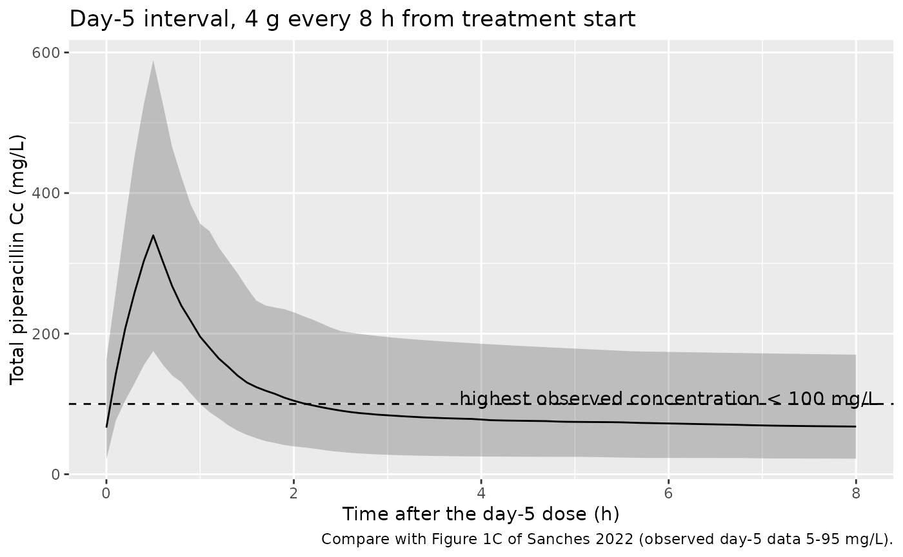
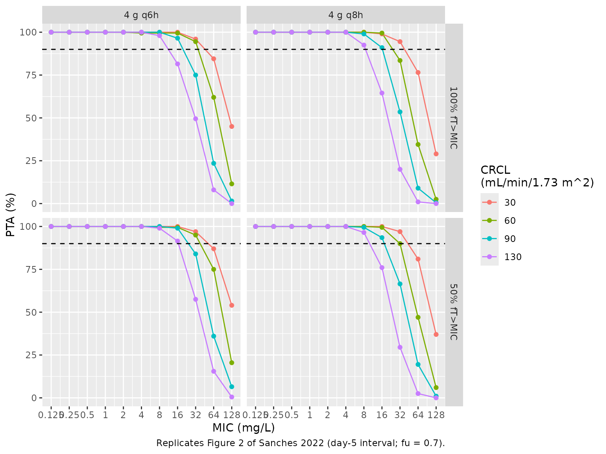

# Piperacillin (Sanches 2022)

## Model and source

- Citation: Sanches C, Alves GCS, Farkas A, da Silva SD, de Castro WV,
  Chequer FMD, Beraldi-Magalhaes F, Magalhaes IRdS, Baldoni AdO,
  Chatfield MD, Lipman J, Roberts JA, Parker SL. Population
  Pharmacokinetic Model of Piperacillin in Critically Ill Patients and
  Describing Interethnic Variation Using External Validation.
  Antibiotics (Basel). 2022;11(4):434. <doi:10.3390/antibiotics11040434>
- Description: Two-compartment IV-infusion population PK model for
  piperacillin in critically ill Brazilian adults, with clearance
  proportional to Cockcroft-Gault creatinine clearance normalised to 60
  mL/min/1.73 m^2 and distribution written as the central-to-peripheral
  and peripheral-to-central rate constants KCP and KPC. Estimated with
  the Pmetrics non-parametric adaptive grid (NPAG) algorithm; the NPAG
  marginal means are the typical values and the reported %CV values are
  carried as log-normal between-subject variability. The fitted model
  also estimated per-subject initial conditions for the day-5 sampling
  interval, which are not reported, so a simulation from treatment start
  reaches concentrations well above the paper’s observed day-5 data (see
  the vignette Assumptions and deviations) (Sanches 2022)
- Article: <https://doi.org/10.3390/antibiotics11040434> (open access)

## Population

Sanches 2022 fitted the model to 24 critically ill adults in the
intensive care unit of a medium-sized hospital in Minas Gerais, Brazil,
who were treated with piperacillin/tazobactam for a confirmed or
suspected infection (Table 1). Median age was 72 years (IQR 57-78),
median weight 69 kg (57-77), median body mass index 22 kg/m^2 (21-31),
and 9 of 24 patients (38%) were male. Median Cockcroft-Gault creatinine
clearance was 60 mL/min/1.73 m^2 (47-83). Half had sepsis, 29% received
vasoactive drugs and 33% died; median SAPS 3 was 53, SOFA 5 and MODS 3.
Patients with serum creatinine above 2 mg/dL were excluded.

Patients came from a randomised trial and received 4 g every 8 h as a
roughly 30-minute infusion, or 2 g every 6 h or 3.3 g every 4 h under an
individually designed dosing strategy. One or two plasma samples per
patient were taken within a dosing interval on day 5 of treatment, and
total piperacillin was assayed by HPLC-UV over 2.5-100 mg/L. The model
was estimated in Pmetrics 1.5.0 with the non-parametric adaptive grid
(NPAG) algorithm. It was then externally validated against 20 Australian
and 10 Indigenous Australian ICU patients.

The same information is available programmatically via
`readModelDb("Sanches_2022_piperacillin")()$population`.

## Source trace

| Equation / parameter | Value | Source location |
|----|----|----|
| Two-compartment model, linear elimination from central, KCP / KPC distribution | n/a | Section 2 (Results), first paragraph; section 4.3 step (i) |
| `CL = TVCL * (CRCL / 60)` | n/a | Section 2 (Results), first paragraph |
| `lcl` (TVCL at CRCL 60) | log(3.33) L/h | Table 2, CL mean (SD 1.24; median 3.01; CV 37%) |
| `lvc` (V) | log(10.69) L | Table 2, V mean (SD 4.50; median 9.03; CV 42%) |
| `lk12` (KCP) | log(1.15) 1/h | Table 2, KCP mean (SD 0.15; median 1.21; CV 13%) |
| `lk21` (KPC) | log(0.08) 1/h | Table 2, KPC mean (SD 0.09; median 0.03; CV 120%) |
| `etalcl`, `etalvc`, `etalk12`, `etalk21` | log(1 + CV^2) = 0.1284, 0.1625, 0.0168, 0.8920 | Table 2, %CV column |
| `addSd`, `propSd` (assay SD polynomial C0, C1) | 1 mg/L, 0.1 | Section 2: ’gamma \* (1 + 0.1\*concentration)’; section 4.3 step (ii) |
| `gammaSd` | 5 | Section 2: ‘value = 5’ |
| Residual: `SD = gamma * (C0 + C1 * C)` | n/a | Section 4.3 step (ii): ‘error = SD.gamma’ |

## Deterministic checks of the encoding

A single 4 g dose infused over 0.5 h is solved for the typical patient
at the four creatinine clearances Sanches 2022 simulated (30, 60, 90 and
130 mL/min/1.73 m^2). Two quantities are compared against closed forms
built from the paper’s printed numbers, never from model output:

- AUC from zero to infinity must equal `Dose / CL`, with
  `CL = 3.33 * CRCL / 60`.
- The terminal half-life must equal `log(2) / beta`, the slower root of
  `x^2 - (kel + KCP + KPC) x + kel * KPC = 0`. A two-compartment model
  whose peripheral compartment had been dropped would instead decay at
  `kel`, and the AUC check alone would not notice.

``` r

mod <- readModelDb("Sanches_2022_piperacillin")
mod_typical <- rxode2::zeroRe(mod)
#> ℹ parameter labels from comments will be replaced by 'label()'
#> Warning: No sigma parameters in the model

crcl_levels <- c(30, 60, 90, 130)
obs_times <- sort(unique(c(
  0,
  seq(0.05, 2, by = 0.05),
  seq(2.5, 48, by = 0.5),
  seq(50, 1500, by = 5)
)))

ev_sd <- bind_rows(lapply(seq_along(crcl_levels), function(i) {
  bind_rows(
    tibble(id = i, time = 0, evid = 1, amt = 4000, rate = 8000, cmt = "central"),
    tibble(id = i, time = obs_times, evid = 0, amt = 0, rate = 0, cmt = "central")
  ) |>
    mutate(CRCL = crcl_levels[i], treatment = paste0("CRCL ", crcl_levels[i]))
})) |>
  arrange(id, time, desc(evid))

sim_sd <- rxode2::rxSolve(
  mod_typical,
  events = ev_sd,
  keep = c("CRCL", "treatment"),
  rtol = 1e-10,
  atol = 1e-12,
  maxsteps = 1e6
) |>
  as.data.frame()
#> ℹ omega/sigma items treated as zero: 'etalcl', 'etalvc', 'etalk12', 'etalk21'
#> Warning: multi-subject simulation without without 'omega'

# The peripheral compartment must survive the solve.
stopifnot("peripheral1" %in% names(sim_sd))
stopifnot(all(sim_sd$Cc >= -1e-6 * max(sim_sd$Cc)))
```

``` r

beta_root <- function(crcl) {
  kel <- 3.33 * crcl / 60 / 10.69
  a <- kel + 1.15 + 0.08
  b <- kel * 0.08
  (a - sqrt(a^2 - 4 * b)) / 2
}

# Log-linear slope over 100-300 h, long after the distribution phase
# (alpha > 1.3 1/h at every CRCL) has died out.
hl_check <- sim_sd |>
  filter(time >= 100, time <= 300) |>
  group_by(treatment, CRCL) |>
  summarise(slope = -coef(lm(log(Cc) ~ time))[2], .groups = "drop") |>
  mutate(
    hl_sim = log(2) / slope,
    hl_closed = log(2) / beta_root(CRCL),
    hl_kel = log(2) / (3.33 * CRCL / 60 / 10.69),
    ratio = hl_sim / hl_closed
  )

hl_check |>
  select(treatment, hl_sim, hl_closed, hl_kel, ratio) |>
  rename(
    "Group" = treatment,
    "Simulated terminal t1/2 (h)" = hl_sim,
    "Closed-form log(2)/beta (h)" = hl_closed,
    "log(2)/kel, if the peripheral were lost (h)" = hl_kel,
    "Ratio" = ratio
  ) |>
  knitr::kable(digits = 3, caption = "Terminal half-life, typical patient.")
```

| Group | Simulated terminal t1/2 (h) | Closed-form log(2)/beta (h) | log(2)/kel, if the peripheral were lost (h) | Ratio |
|:---|---:|---:|---:|---:|
| CRCL 130 | 24.085 | 24.085 | 1.027 | 1 |
| CRCL 30 | 76.584 | 76.584 | 4.450 | 1 |
| CRCL 60 | 42.422 | 42.422 | 2.225 | 1 |
| CRCL 90 | 31.058 | 31.058 | 1.483 | 1 |

Terminal half-life, typical patient. {.table}

``` r


# Deterministic: same parameters on both sides, so only integrator error.
stopifnot(all(abs(hl_check$ratio - 1) < 1e-4))
```

The terminal half-life is long: about 42 h at a creatinine clearance of
60 mL/min/1.73 m^2 and 77 h at 30. This follows from the published KPC
of 0.08 1/h, which gives a peripheral volume of `V * KCP / KPC`, about
154 L, and a steady-state volume near 165 L.

## PKNCA validation

``` r

conc_df <- sim_sd |>
  filter(!is.na(Cc)) |>
  mutate(Cc = pmax(Cc, 0)) |>
  select(id, time, Cc, treatment)

dose_df <- ev_sd |>
  filter(evid == 1) |>
  select(id, time, amt, treatment)

conc_obj <- PKNCA::PKNCAconc(conc_df, Cc ~ time | treatment + id)
dose_obj <- PKNCA::PKNCAdose(dose_df, amt ~ time | treatment + id, route = "intravascular", duration = 0.5)

intervals <- data.frame(
  start = 0,
  end = Inf,
  cmax = TRUE,
  tmax = TRUE,
  aucinf.obs = TRUE,
  half.life = TRUE
)

nca_res <- PKNCA::pk.nca(PKNCA::PKNCAdata(conc_obj, dose_obj, intervals = intervals))

nca_tab <- as.data.frame(nca_res$result) |>
  filter(PPTESTCD %in% c("cmax", "tmax", "aucinf.obs", "half.life")) |>
  select(treatment, PPTESTCD, PPORRES) |>
  pivot_wider(names_from = PPTESTCD, values_from = PPORRES) |>
  mutate(
    CRCL = as.numeric(sub("CRCL ", "", treatment)),
    auc_closed = 4000 / (3.33 * CRCL / 60),
    auc_ratio = aucinf.obs / auc_closed
  )

nca_tab |>
  select(treatment, cmax, tmax, aucinf.obs, auc_closed, auc_ratio, half.life) |>
  rename(
    "Group" = treatment,
    "Cmax (mg/L)" = cmax,
    "Tmax (h)" = tmax,
    "AUC0-inf (mg*h/L)" = aucinf.obs,
    "Dose/CL (mg*h/L)" = auc_closed,
    "AUC ratio" = auc_ratio,
    "t1/2 (h)" = half.life
  ) |>
  knitr::kable(digits = 3, caption = "PKNCA, single 4 g dose over 0.5 h, typical patient.")
```

| Group | Cmax (mg/L) | Tmax (h) | AUC0-inf (mg\*h/L) | Dose/CL (mg\*h/L) | AUC ratio | t1/2 (h) |
|:---|---:|---:|---:|---:|---:|---:|
| CRCL 130 | 246.337 | 0.5 | 554.649 | 554.401 | 1 | 24.062 |
| CRCL 30 | 275.824 | 0.5 | 2402.876 | 2402.402 | 1 | 76.507 |
| CRCL 60 | 266.473 | 0.5 | 1201.597 | 1201.201 | 1 | 42.368 |
| CRCL 90 | 257.565 | 0.5 | 801.128 | 800.801 | 1 | 31.013 |

PKNCA, single 4 g dose over 0.5 h, typical patient. {.table
style="width:100%;"}

``` r


# AUC0-inf = Dose/CL for any linear model; the trapezoid on this grid is well
# inside 1%.
stopifnot(all(abs(nca_tab$auc_ratio - 1) < 0.01))
```

Sanches 2022 reports no NCA parameters, so there is no published NCA
table to compare against.

## Day-5 concentrations against the observed data

Figure 1C of Sanches 2022 is a VPC of the day-5 sampling interval. It
shows a peak cloud up to about 95 mg/L in the first two hours after the
start of the infusion and a trough plateau of roughly 5-30 mg/L. No
observed concentration exceeded 100 mg/L (Discussion, limitation (d)).
The chunk below simulates 200 virtual patients on 4 g every 8 h from the
first dose to the day-5 interval (96-104 h). Their creatinine clearances
are drawn from a log-normal with the Table 1 median of 60 mL/min/1.73
m^2 and an IQR near 47-83.

``` r

rxode2::rxSetSeed(20220324)
n_vpc <- 200
crcl_vpc <- exp(rnorm(n_vpc, log(60), log(83 / 47) / 1.349))

dose_times_q8 <- seq(0, 96, by = 8)
vpc_times <- seq(96, 104, by = 0.1)

ev_vpc <- bind_rows(lapply(seq_len(n_vpc), function(i) {
  bind_rows(
    tibble(id = i, time = dose_times_q8, evid = 1, amt = 4000, rate = 8000, cmt = "central"),
    tibble(id = i, time = vpc_times, evid = 0, amt = 0, rate = 0, cmt = "central")
  ) |>
    mutate(CRCL = crcl_vpc[i])
})) |>
  arrange(id, time, desc(evid))

sim_vpc <- rxode2::rxSolve(mod, events = ev_vpc, keep = "CRCL", maxsteps = 1e6) |>
  as.data.frame() |>
  mutate(tad = time - 96)
#> ℹ parameter labels from comments will be replaced by 'label()'

vpc_sum <- sim_vpc |>
  group_by(tad) |>
  summarise(
    Q05 = quantile(Cc, 0.05),
    Q50 = quantile(Cc, 0.50),
    Q95 = quantile(Cc, 0.95),
    .groups = "drop"
  )

ggplot(vpc_sum, aes(tad, Q50)) +
  geom_ribbon(aes(ymin = Q05, ymax = Q95), alpha = 0.25) +
  geom_line() +
  geom_hline(yintercept = 100, linetype = "dashed") +
  annotate("text", x = 6, y = 108, label = "highest observed concentration < 100 mg/L") +
  labs(
    x = "Time after the day-5 dose (h)",
    y = "Total piperacillin Cc (mg/L)",
    title = "Day-5 interval, 4 g every 8 h from treatment start",
    caption = "Compare with Figure 1C of Sanches 2022 (observed day-5 data 5-95 mg/L)."
  )
```



``` r


trough_med <- median(sim_vpc$Cc[sim_vpc$tad == 8])
frac_over_100 <- mean(sim_vpc$Cc > 100)
```

The simulated median trough at the end of the day-5 interval is 67.9
mg/L. 45% of simulated day-5 concentrations exceed 100 mg/L. Both are
well above the observed data in Figure 1C. The cause is described in
Assumptions and deviations: the fitted model estimated each patient’s
day-5 starting amounts as initial conditions rather than simulating the
preceding four days of dosing, and those estimates are not published.

## Replicate Figure 2 (probability of target attainment)

Sanches 2022 Figure 2 gives the probability that free piperacillin, with
30% protein binding, exceeds each MIC for at least 50% or 100% of a
dosing interval. It covers 4 g every 8 h (A) and every 6 h (B), each as
a 0.5 h infusion, at creatinine clearances of 30, 60, 90 and 130
mL/min/1.73 m^2. The Results describe Figure 2 as the fifth day of
treatment and section 4.5 as a steady-state interval. The simulation
below uses the day-5 interval from treatment start, 200 virtual patients
per regimen and creatinine clearance, without residual error.

``` r

rxode2::rxSetSeed(20220325)
n_arm <- 200
fu <- 0.7
mics <- 2^(-3:7)

make_pta_arm <- function(tau, crcl, id_offset) {
  dose_times <- seq(0, 96, by = tau)
  obs <- seq(96, 96 + tau, by = 0.05)
  bind_rows(lapply(seq_len(n_arm), function(i) {
    bind_rows(
      tibble(id = id_offset + i, time = dose_times, evid = 1, amt = 4000, rate = 8000, cmt = "central"),
      tibble(id = id_offset + i, time = obs, evid = 0, amt = 0, rate = 0, cmt = "central")
    )
  })) |>
    mutate(CRCL = crcl, tau = tau, regimen = paste0("4 g q", tau, "h"))
}

arms <- expand.grid(tau = c(8, 6), crcl = crcl_levels)
ev_pta <- bind_rows(lapply(seq_len(nrow(arms)), function(k) {
  make_pta_arm(arms$tau[k], arms$crcl[k], id_offset = (k - 1L) * n_arm)
})) |>
  arrange(id, time, desc(evid))
stopifnot(!anyDuplicated(ev_pta[ev_pta$evid == 1, c("id", "time")]))

sim_pta <- rxode2::rxSolve(mod, events = ev_pta, keep = c("CRCL", "tau", "regimen"), maxsteps = 1e6) |>
  as.data.frame() |>
  filter(time >= 96)

# Fraction of the interval with free concentration above the MIC, by the
# rectangle rule on the 0.05 h grid (last grid point excluded).
ft_by_id <- sim_pta |>
  group_by(id, regimen, CRCL, tau) |>
  filter(time < 96 + first(tau)) |>
  reframe(MIC = mics, ft = sapply(mics, function(m) mean(fu * Cc > m)))

pta <- ft_by_id |>
  group_by(regimen, CRCL, MIC) |>
  summarise(
    `50% fT>MIC` = 100 * mean(ft >= 0.5),
    `100% fT>MIC` = 100 * mean(ft >= 1),
    .groups = "drop"
  ) |>
  pivot_longer(c(`50% fT>MIC`, `100% fT>MIC`), names_to = "target", values_to = "PTA")
```

``` r

ggplot(pta, aes(MIC, PTA, colour = factor(CRCL))) +
  geom_line() +
  geom_point() +
  geom_hline(yintercept = 90, linetype = "dashed") +
  scale_x_log10(breaks = mics, labels = as.character(mics)) +
  facet_grid(target ~ regimen) +
  labs(
    x = "MIC (mg/L)", y = "PTA (%)", colour = "CRCL\n(mL/min/1.73 m^2)",
    caption = "Replicates Figure 2 of Sanches 2022 (day-5 interval; fu = 0.7)."
  )
```



The Figure 2 points were digitised by the maintainers. Panel A1 was read
from a 250 dpi render (about +/- 1 PTA point); the other panels at MIC 8
and 16 were read from a 110 dpi render (about +/- 2 points).

``` r

published <- tribble(
  ~regimen, ~target, ~MIC, ~CRCL, ~PTA_pub,
  "4 g q8h", "50% fT>MIC", 8, 30, 99,
  "4 g q8h", "50% fT>MIC", 8, 60, 94,
  "4 g q8h", "50% fT>MIC", 8, 90, 87,
  "4 g q8h", "50% fT>MIC", 8, 130, 74,
  "4 g q8h", "50% fT>MIC", 16, 30, 82,
  "4 g q8h", "50% fT>MIC", 16, 60, 59,
  "4 g q8h", "50% fT>MIC", 16, 90, 36,
  "4 g q8h", "50% fT>MIC", 16, 130, 14,
  "4 g q8h", "100% fT>MIC", 8, 30, 92,
  "4 g q8h", "100% fT>MIC", 8, 60, 87,
  "4 g q8h", "100% fT>MIC", 8, 90, 80,
  "4 g q8h", "100% fT>MIC", 8, 130, 61,
  "4 g q8h", "100% fT>MIC", 16, 30, 68,
  "4 g q8h", "100% fT>MIC", 16, 60, 43,
  "4 g q8h", "100% fT>MIC", 16, 90, 20,
  "4 g q8h", "100% fT>MIC", 16, 130, 5,
  "4 g q6h", "50% fT>MIC", 16, 30, 82,
  "4 g q6h", "50% fT>MIC", 16, 60, 63,
  "4 g q6h", "50% fT>MIC", 16, 90, 38,
  "4 g q6h", "50% fT>MIC", 16, 130, 15,
  "4 g q6h", "100% fT>MIC", 16, 30, 69,
  "4 g q6h", "100% fT>MIC", 16, 60, 45,
  "4 g q6h", "100% fT>MIC", 16, 90, 20,
  "4 g q6h", "100% fT>MIC", 16, 130, 5
)

cmp <- published |>
  inner_join(pta, by = c("regimen", "target", "MIC", "CRCL")) |>
  mutate(diff = PTA - PTA_pub)
stopifnot(nrow(cmp) == nrow(published))

cmp |>
  rename(
    "Regimen" = regimen,
    "Target" = target,
    "MIC (mg/L)" = MIC,
    "CRCL" = CRCL,
    "Published PTA (%)" = PTA_pub,
    "Simulated PTA (%)" = PTA,
    "Difference (points)" = diff
  ) |>
  knitr::kable(digits = 1, caption = "Figure 2 PTA: digitised published vs simulated.")
```

| Regimen | Target | MIC (mg/L) | CRCL | Published PTA (%) | Simulated PTA (%) | Difference (points) |
|:---|:---|---:|---:|---:|---:|---:|
| 4 g q8h | 50% fT\>MIC | 8 | 30 | 99 | 100.0 | 1.0 |
| 4 g q8h | 50% fT\>MIC | 8 | 60 | 94 | 100.0 | 6.0 |
| 4 g q8h | 50% fT\>MIC | 8 | 90 | 87 | 99.5 | 12.5 |
| 4 g q8h | 50% fT\>MIC | 8 | 130 | 74 | 96.5 | 22.5 |
| 4 g q8h | 50% fT\>MIC | 16 | 30 | 82 | 100.0 | 18.0 |
| 4 g q8h | 50% fT\>MIC | 16 | 60 | 59 | 99.5 | 40.5 |
| 4 g q8h | 50% fT\>MIC | 16 | 90 | 36 | 93.5 | 57.5 |
| 4 g q8h | 50% fT\>MIC | 16 | 130 | 14 | 76.0 | 62.0 |
| 4 g q8h | 100% fT\>MIC | 8 | 30 | 92 | 100.0 | 8.0 |
| 4 g q8h | 100% fT\>MIC | 8 | 60 | 87 | 100.0 | 13.0 |
| 4 g q8h | 100% fT\>MIC | 8 | 90 | 80 | 99.0 | 19.0 |
| 4 g q8h | 100% fT\>MIC | 8 | 130 | 61 | 92.5 | 31.5 |
| 4 g q8h | 100% fT\>MIC | 16 | 30 | 68 | 99.0 | 31.0 |
| 4 g q8h | 100% fT\>MIC | 16 | 60 | 43 | 99.5 | 56.5 |
| 4 g q8h | 100% fT\>MIC | 16 | 90 | 20 | 91.0 | 71.0 |
| 4 g q8h | 100% fT\>MIC | 16 | 130 | 5 | 64.5 | 59.5 |
| 4 g q6h | 50% fT\>MIC | 16 | 30 | 82 | 100.0 | 18.0 |
| 4 g q6h | 50% fT\>MIC | 16 | 60 | 63 | 99.5 | 36.5 |
| 4 g q6h | 50% fT\>MIC | 16 | 90 | 38 | 99.0 | 61.0 |
| 4 g q6h | 50% fT\>MIC | 16 | 130 | 15 | 91.5 | 76.5 |
| 4 g q6h | 100% fT\>MIC | 16 | 30 | 69 | 100.0 | 31.0 |
| 4 g q6h | 100% fT\>MIC | 16 | 60 | 45 | 99.5 | 54.5 |
| 4 g q6h | 100% fT\>MIC | 16 | 90 | 20 | 96.5 | 76.5 |
| 4 g q6h | 100% fT\>MIC | 16 | 130 | 5 | 81.5 | 76.5 |

Figure 2 PTA: digitised published vs simulated. {.table}

The simulated PTA is systematically higher than Figure 2 at the MICs
where the curves fall: median difference 34 points. This is a known
deviation and is not gated. The published curves also show almost no
difference between 4 g every 6 h and 4 g every 8 h, although the
6-hourly regimen delivers a third more drug per day. That is not
reproducible from the Table 2 point estimates under any simulation start
the maintainers tried: day 5 from treatment start, full steady state,
with or without assay noise added, and with either the mean or the
median column.

The one property of Figure 2 that the published model must reproduce is
the direction of the creatinine-clearance effect. Clearance at 130
mL/min/1.73 m^2 is 4.3 times that at 30, so attainment at MIC 16 must
fall steeply across the range:

``` r

pta_at <- function(reg, tgt, mic, crcl) {
  v <- pta$PTA[pta$regimen == reg & pta$target == tgt & pta$MIC == mic & pta$CRCL == crcl]
  if (length(v) != 1L) stop("no unique PTA row for ", reg, " / ", tgt, " / ", mic, " / ", crcl)
  v
}
drop_q8 <- pta_at("4 g q8h", "100% fT>MIC", 16, 30) - pta_at("4 g q8h", "100% fT>MIC", 16, 130)
drop_q8
#> [1] 34.5
# A 200-subject arm has a binomial SE below 3.6 points. In the Monte Carlo
# explorations the drop was about 25 points (99 -> 73) at 1000 subjects per
# arm, so 10 points is more than 3 SE clear of the model-true value. A
# clearance that ignored CRCL would give a drop near zero.
stopifnot(drop_q8 > 10)
```

## Assumptions and deviations

- **Typical values are the NPAG means.** Table 2 prints mean (SD),
  median and %CV for each parameter. The Abstract and Results quote the
  means, and the %CV column is SD/mean (1.24/3.33 = 37%, 4.50/10.69 =
  42%, 0.15/1.15 = 13%), so the means are encoded. For KPC the rounded
  values give 0.09/0.08 = 113% against the printed 120%; the printed %CV
  is used. The medians (CL 3.01 L/h, V 9.03 L, KCP 1.21 1/h, KPC 0.03
  1/h) are lower. For KPC the median is less than half the mean, a sign
  that the non-parametric marginal is far from log-normal. Re-simulating
  the paper’s own Figure 2 did not favour either column; both gave
  attainment well above the published curves.
- **Between-subject variability is a log-normal approximation.** NPAG
  estimates a discrete joint density over support points, not an omega
  matrix. Each marginal is represented by a log-normal with the printed
  %CV, `omega^2 = log(1 + CV^2)`. No correlations are published, so the
  etas are independent. Any multimodality in the NPAG density cannot be
  recovered.
- **Initial conditions are not reproduced.** Section 2 states that the
  final model included ‘initial conditions to describe the steady-state
  conditions achieved prior to the dosing interval’. Each patient’s
  starting amounts at the sampled day-5 interval were therefore
  estimated, rather than generated by simulating the preceding days of
  dosing, and the estimates are not published. The model here starts
  empty at the first dose. Combined with the long terminal half-life
  implied by KPC = 0.08 1/h (about 42 h at CRCL 60), this means a
  simulation from treatment start accumulates to day-5 concentrations
  well above the observed data. At true steady state the average total
  concentration of 4 g every 8 h is `Dose / (tau * CL)`, about 150 mg/L
  at CRCL 60, whereas no observed concentration exceeded 100 mg/L. The
  model was fitted to a single dosing interval per patient, so its
  multiple-dose predictions should be used with that caution.
- **Figure 2 is not reproduced.** See the PTA section: the simulated
  attainment exceeds the published curves, and the published
  near-equality of the 6- and 8-hourly regimens cannot be reproduced
  from the published parameters. Section 4.5 says the Monte Carlo used
  ‘different dosing regimens, BMI and a range of creatinine clearances’.
  No BMI effect is in the final model, and the simulation settings
  beyond those stated (initial conditions, noise, sampling grid) are not
  published. Table 3’s fractional target attainment was not re-simulated
  because it also requires the EUCAST MIC distribution for *P.
  aeruginosa*, which is not given in the paper.
- **Residual error.** Pmetrics weights each observation by `SD * gamma`
  with `SD = C0 + C1 * Y`, a linear sum. Here that is
  `5 * (1 + 0.1 * Y)` mg/L, encoded as `add(sdCc)` with
  `sdCc = gammaSd * (addSd + propSd * Cc)`. Pmetrics evaluates the
  polynomial on the observed concentration, whereas nlmixr2 evaluates it
  on the prediction. The PTA simulations above exclude residual error.
- **Distribution is parameterised by rate constants.** The paper
  estimates KCP and KPC directly. The model derives `q = KCP * V` and
  `vp = q / KPC` and drives the ODEs through them, which is
  algebraically identical; the terminal half-life check above confirms
  the peripheral compartment is retained.
- **Protein binding.** The 30% plasma protein binding used for the free
  concentrations is the paper’s assumption (section 4.5 and Discussion).
  It is not part of the model, which predicts total concentration.
- **Screened covariates.** Age, height, weight, sex, BMI, serum
  creatinine, sepsis, CKD-EPI eGFR, SAPS 3, MODS and SOFA were screened
  and not retained (section 4.3 step iii). Those with a canonical column
  name are documented in the model’s `covariatesDataExcluded`.
- **Virtual cohort.** Creatinine clearance in the day-5 VPC is drawn
  from a log-normal matched to the Table 1 median and IQR; the paper
  gives no distribution. The PTA arms use the paper’s fixed creatinine
  clearance values.
- No erratum or correction notice for Sanches 2022 is linked to the
  article in Europe PMC as of 2026-09-30.
