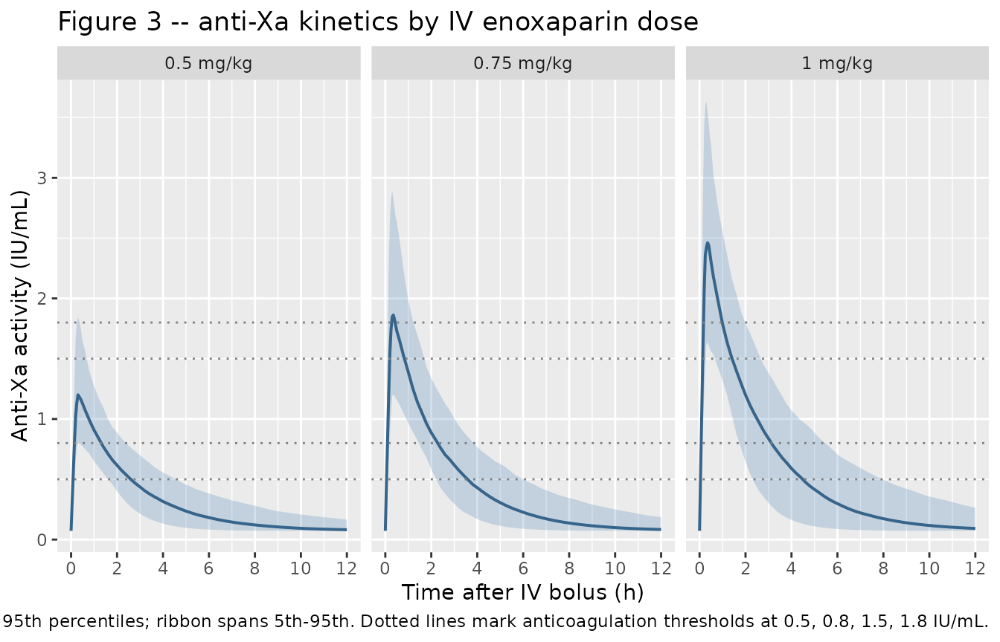

# Enoxaparin anti-factor Xa (SanchezPena 2005)

## Model and source

- Citation: Sanchez-Pena P, Hulot JS, Urien S, Ankri A, Collet JP,
  Choussat R, Lechat P, Montalescot G. Anti-factor Xa kinetics after
  intravenous enoxaparin in patients undergoing percutaneous coronary
  intervention: a population model analysis. *British Journal of
  Clinical Pharmacology* 2005; 60(4):364-373.
  <doi:%5B10.1111/j.1365-2125.2005.02452.x>\](<https://doi.org/10.1111/j.1365-2125.2005.02452.x>).
- Full text (Open Access via PMC):
  <https://pmc.ncbi.nlm.nih.gov/articles/PMC1884774/>.

This is a one-compartment population PK model of anti-factor Xa activity
after a single IV bolus of enoxaparin in adult patients undergoing
elective percutaneous coronary intervention (PCI). The IV bolus is
described by a short zero-order input phase (duration T0) into the
central compartment with linear elimination. Body weight is the only
retained covariate, applied as separately estimated allometric exponents
on clearance (0.9) and volume (0.7) with a reference weight of 75 kg. A
fixed endogenous basal anti-Xa activity (0.0725 IU/mL) is added to the
dose-driven prediction to account for the chromogenic assay’s non-zero
pre-dose reading.

``` r

mod_fn  <- readModelDb("SanchezPena_2005_enoxaparin")
mod     <- rxode2::rxode2(mod_fn())
mod_typ <- rxode2::rxode2(rxode2::zeroRe(mod_fn()))
```

## Population

The model was developed from 546 consecutive adult patients (mean age 63
years, range 21-93; 79% male) referred for elective PCI of coronary or
vein-graft stenosis greater than 70% at a single centre
(Pitie-Salpetriere University Hospital, Paris). Mean body weight was 76
kg (range 35-153). Renal function was distributed as CrCl \< 30 mL/min
in 4% of patients, 31-59 mL/min in 33%, and \>= 60 mL/min in 62%; 15% of
patients were aged \> 75 years. Concomitant GPIIb/IIIa inhibitors were
used in 175 patients (146 eptifibatide, 29 abciximab); all patients
received a 500 mg IV loading dose of aspirin followed by 75 mg/day
orally.

Each patient received a single 0.5 mg/kg IV bolus of enoxaparin (mean
dose 38 +/- 7 mg = 3830 +/- 730 IU) immediately before PCI. Five samples
were drawn per patient: pre-bolus, 10 min post-bolus (start of PCI), end
of PCI (mean 45 min), 3 h post-PCI, and the morning after PCI. Out of
556 enrolled, 10 (1.8%) were excluded for probable misadministration,
leaving 546 patients and 1978 anti-Xa concentrations. Demographics in
Sanchez-Pena 2005 Table 1.

The same information is available programmatically via
`readModelDb("SanchezPena_2005_enoxaparin")$population`.

## Source trace

Per-parameter origins are recorded as in-file comments in
`inst/modeldb/specificDrugs/SanchezPena_2005_enoxaparin.R`; the table
below collects them in one place for review.

| Item | Value (typical) | Source |
|----|----|----|
| One-compartment disposition with zero-order IV input | structural | Results, Population pharmacokinetics: “best described by a one-compartment model with zero-order input” |
| `lcl` -\> TV.CL = 1.20 L/h | 1.20 | Table 2 (mean +/- SE 1.20 +/- 0.03; bootstrap median 1.17) |
| `lvc` -\> TV.V = 2.9 L | 2.9 | Table 2 (2.9 +/- 0.1; bootstrap median 2.9) |
| `tdur` -\> T0 = 0.25 h | 0.25 | Table 2 (0.25 +/- 0.01; bootstrap median 0.24) |
| `e_wt_cl` -\> BW exponent on CL | 0.9 | Table 2 (0.9 +/- 0.1) |
| `e_wt_vc` -\> BW exponent on V | 0.7 | Table 2 (0.7 +/- 0.1) |
| Reference body weight (BW for covariate equation) | 75 kg | Results, page above Table 2: `CL = TV_CL * (BW/75)^0.9`, `V = TV_V * (BW/75)^0.7` |
| `bl_antiXa` -\> Basal anti-Xa (FIXED) | 0.0725 IU/mL | Table 2 (“Basal anti-Xa (IU/mL): 0.0725 (fixed)”) |
| `etalcl` -\> ISV on CL | 33% CV | Table 2 (33 +/- 3 %CV); var on log scale = log(0.33^2 + 1) = 0.10336 |
| `etalvc` -\> ISV on V | 30% CV | Table 2 (30 +/- 7 %CV); var on log scale = log(0.30^2 + 1) = 0.08618 |
| `etatdur` -\> ISV on T0 (additive) | 0.06 h SD | Table 2 (0.06 +/- 0.02 h, additive error model); var = 0.0036 |
| `addSd` -\> Residual SD (additive) | 0.09 IU/mL | Table 2 (0.09 +/- 0.02 IU/mL, additive error model) |

## Virtual cohort

The original observed data are not publicly available. The simulations
below use a virtual cohort whose body-weight distribution approximates
the published demographics (mean 76 kg, SD 15 kg, truncated to the
35-153 kg range). Three dose levels are simulated to match the paper’s
Figure 3 panels (0.5, 0.75, and 1 mg/kg single IV bolus).

``` r

set.seed(20251104L)

n_per_dose <- 300L
dose_levels <- c("0.5 mg/kg" = 0.5,
                 "0.75 mg/kg" = 0.75,
                 "1 mg/kg" = 1.0)

# IU per mg of enoxaparin (paper: 38 mg = 3830 IU -> 100 IU/mg). The model's
# dosing unit is anti-factor-Xa IU (see units$dosing in the model file).
IU_PER_MG <- 100

obs_times <- c(0,
               seq(0.05, 0.5, by = 0.05),
               seq(0.6, 12, by = 0.2))

build_subjects <- function(n, dose_mg_per_kg, dose_label, id_offset = 0L) {
  wt <- pmin(pmax(stats::rnorm(n, mean = 76, sd = 15), 35), 153)
  tibble::tibble(
    id          = id_offset + seq_len(n),
    dose_label  = factor(dose_label, levels = names(dose_levels)),
    WT          = wt,
    dose_mg     = dose_mg_per_kg * wt,
    dose_IU     = dose_mg_per_kg * wt * IU_PER_MG
  )
}

build_events <- function(subjects, obs_times) {
  dose_rows <- subjects |>
    dplyr::transmute(
      id, time = 0, evid = 1L,
      amt        = dose_IU,
      cmt        = "central",
      rate       = -2,  # model-defined duration (dur(central) <- tdur_i)
      dose_label, WT
    )
  obs_rows <- tidyr::expand_grid(id = subjects$id, time = obs_times) |>
    dplyr::left_join(dplyr::select(subjects, id, dose_label, WT), by = "id") |>
    dplyr::mutate(evid = 0L, amt = 0, cmt = "Cc", rate = 0)
  dplyr::bind_rows(dose_rows, obs_rows) |>
    dplyr::arrange(id, time, dplyr::desc(evid))
}

subjects <- dplyr::bind_rows(
  build_subjects(n_per_dose, dose_levels[["0.5 mg/kg"]],  "0.5 mg/kg",
                 id_offset = 0L),
  build_subjects(n_per_dose, dose_levels[["0.75 mg/kg"]], "0.75 mg/kg",
                 id_offset =  n_per_dose),
  build_subjects(n_per_dose, dose_levels[["1 mg/kg"]],    "1 mg/kg",
                 id_offset = 2L * n_per_dose)
)
events <- build_events(subjects, obs_times)

stopifnot(!anyDuplicated(unique(events[, c("id", "time", "evid", "cmt")])))
dplyr::glimpse(subjects)
#> Rows: 900
#> Columns: 5
#> $ id         <int> 1, 2, 3, 4, 5, 6, 7, 8, 9, 10, 11, 12, 13, 14, 15, 16, 17, …
#> $ dose_label <fct> 0.5 mg/kg, 0.5 mg/kg, 0.5 mg/kg, 0.5 mg/kg, 0.5 mg/kg, 0.5 …
#> $ WT         <dbl> 73.28089, 79.42695, 60.72469, 64.53727, 46.31612, 111.60335…
#> $ dose_mg    <dbl> 36.64045, 39.71348, 30.36234, 32.26864, 23.15806, 55.80168,…
#> $ dose_IU    <dbl> 3664.045, 3971.348, 3036.234, 3226.864, 2315.806, 5580.168,…
```

## Simulation

Stochastic simulation (full omega / sigma) for visual predictive plots
and PKNCA against the published percentile bands in the paper:

``` r

sim <- rxode2::rxSolve(
  mod,
  events = events,
  keep   = c("dose_label", "WT")
) |>
  as.data.frame()
```

Typical-value simulation (omega/sigma zeroed) for direct comparison with
the typical predictions in Sanchez-Pena 2005 Figure 3:

``` r

typical_subjects <- tibble::tibble(
  id          = seq_along(dose_levels),
  dose_label  = factor(names(dose_levels), levels = names(dose_levels)),
  WT          = 76,
  dose_mg     = unname(dose_levels) * 76,
  dose_IU     = unname(dose_levels) * 76 * IU_PER_MG
)
typical_events <- build_events(typical_subjects, obs_times)

sim_typical <- rxode2::rxSolve(
  mod_typ,
  events = typical_events,
  keep   = c("dose_label", "WT")
) |>
  as.data.frame()
#> ℹ omega/sigma items treated as zero: 'etalcl', 'etalvc', 'etatdur'
#> Warning: multi-subject simulation without without 'omega'
```

## Replicate published figures

### Figure 3 – Anti-Xa kinetics by dose (5th, 50th, 95th percentiles)

Sanchez-Pena 2005 Figure 3a-c shows the simulated 5th, 50th, and 95th
percentiles of anti-Xa activity over time after a single IV bolus of
enoxaparin at three dose levels: 0.5, 0.75, and 1 mg/kg. The chunk below
replicates the same VPC structure across all three doses on a single
panel grid.

``` r

vpc_df <- sim |>
  dplyr::group_by(dose_label, time) |>
  dplyr::summarise(
    Q05 = stats::quantile(Cc, 0.05, na.rm = TRUE),
    Q50 = stats::quantile(Cc, 0.50, na.rm = TRUE),
    Q95 = stats::quantile(Cc, 0.95, na.rm = TRUE),
    .groups = "drop"
  )

ggplot(vpc_df, aes(time, Q50)) +
  geom_ribbon(aes(ymin = Q05, ymax = Q95), alpha = 0.25, fill = "steelblue") +
  geom_line(colour = "steelblue4", linewidth = 0.7) +
  geom_hline(yintercept = c(0.5, 0.8, 1.5, 1.8),
             linetype = "dotted", colour = "grey50") +
  facet_wrap(~ dose_label, nrow = 1) +
  scale_x_continuous(breaks = seq(0, 12, by = 2)) +
  labs(
    x = "Time after IV bolus (h)",
    y = "Anti-Xa activity (IU/mL)",
    title = "Figure 3 -- anti-Xa kinetics by IV enoxaparin dose",
    caption = paste0(
      "Replicates Figure 3a (0.5 mg/kg), 3b (0.75 mg/kg), 3c (1 mg/kg) of ",
      "Sanchez-Pena 2005. Lines: simulated 5th / 50th / 95th percentiles; ",
      "ribbon spans 5th-95th. Dotted lines mark anticoagulation thresholds ",
      "at 0.5, 0.8, 1.5, 1.8 IU/mL."
    )
  )
```



### Table 3 – Patients reaching anti-Xa thresholds and mean duration

Sanchez-Pena 2005 Table 3 reports the proportion of simulated patients
who reach each anticoagulation threshold (\> 0.5, \> 0.8, \> 1.5, \> 1.8
IU/mL) and the mean +/- SD duration spent above each threshold, by dose.
The chunk below recomputes the same summary from the stochastic cohort.
The replicated proportions and mean durations should be close to the
paper’s published values (within a few percent given the finite
simulation cohort).

``` r

thresholds <- c(0.5, 0.8, 1.5, 1.8)

per_subject_duration <- function(df, thr) {
  df |>
    dplyr::arrange(id, time) |>
    dplyr::group_by(id, dose_label) |>
    dplyr::summarise(
      reach    = any(Cc > thr, na.rm = TRUE),
      duration = {
        above <- Cc > thr
        if (!any(above, na.rm = TRUE)) {
          0
        } else {
          dt <- diff(time)
          # crude rectangular integration of time-above-threshold
          mid_above <- (head(above, -1) & tail(above, -1)) |
            (head(above, -1) ^ 0 & FALSE)  # only fully-above intervals
          mid_above <- head(above, -1) & tail(above, -1)
          sum(dt[mid_above], na.rm = TRUE)
        }
      },
      .groups = "drop"
    )
}

threshold_summary <- lapply(thresholds, function(thr) {
  per_subject_duration(sim, thr) |>
    dplyr::group_by(dose_label) |>
    dplyr::summarise(
      threshold      = thr,
      pct_reached    = 100 * mean(reach, na.rm = TRUE),
      dur_mean       = mean(duration[reach], na.rm = TRUE),
      dur_sd         = stats::sd(duration[reach], na.rm = TRUE),
      .groups = "drop"
    )
}) |>
  dplyr::bind_rows() |>
  dplyr::arrange(dose_label, threshold)

knitr::kable(
  threshold_summary,
  digits  = c(0, 1, 1, 2, 2),
  col.names = c("Dose", "Threshold (IU/mL)", "% reaching",
                "Mean duration (h)", "SD (h)"),
  caption = paste0(
    "Replicates Sanchez-Pena 2005 Table 3. Compare against published ",
    "values: 0.5 mg/kg = 100% / 2.7 +/- 0.9 h (>0.5); 75% / 1.7 +/- 0.6 h ",
    "(>0.8); 2.5% / 0.5 +/- 0.2 h (>1.5); 0% (>1.8). ",
    "0.75 mg/kg = 100% / 3.4 +/- 1.1 h (>0.5); 100% / 2.3 +/- 0.8 h (>0.8); ",
    "48% / 1.7 +/- 0.6 h (>1.5); 28% / 1.2 +/- 0.4 h (>1.8). ",
    "1 mg/kg = 100% / 4.1 +/- 1.0 h (>0.5); 100% / 3.0 +/- 1 h (>0.8); ",
    "79% / 0.9 +/- 0.3 h (>1.5); 57% / 1.0 +/- 0.3 h (>1.8)."
  )
)
```

| Dose       | Threshold (IU/mL) | % reaching | Mean duration (h) | SD (h) |
|:-----------|------------------:|-----------:|------------------:|-------:|
| 0.5 mg/kg  |               0.5 |      100.0 |              2.52 |   0.88 |
| 0.5 mg/kg  |               0.8 |       96.7 |              1.11 |   0.58 |
| 0.5 mg/kg  |               1.5 |       24.7 |              0.25 |   0.20 |
| 0.5 mg/kg  |               1.8 |        7.7 |              0.14 |   0.10 |
| 0.75 mg/kg |               0.5 |      100.0 |              3.62 |   1.27 |
| 0.75 mg/kg |               0.8 |      100.0 |              2.22 |   0.82 |
| 0.75 mg/kg |               1.5 |       80.7 |              0.70 |   0.45 |
| 0.75 mg/kg |               1.8 |       56.0 |              0.48 |   0.34 |
| 1 mg/kg    |               0.5 |      100.0 |              4.53 |   1.67 |
| 1 mg/kg    |               0.8 |      100.0 |              3.08 |   1.10 |
| 1 mg/kg    |               1.5 |       97.3 |              1.27 |   0.62 |
| 1 mg/kg    |               1.8 |       88.7 |              0.87 |   0.52 |

Replicates Sanchez-Pena 2005 Table 3. Compare against published values:
0.5 mg/kg = 100% / 2.7 +/- 0.9 h (\>0.5); 75% / 1.7 +/- 0.6 h (\>0.8);
2.5% / 0.5 +/- 0.2 h (\>1.5); 0% (\>1.8). 0.75 mg/kg = 100% / 3.4 +/-
1.1 h (\>0.5); 100% / 2.3 +/- 0.8 h (\>0.8); 48% / 1.7 +/- 0.6 h
(\>1.5); 28% / 1.2 +/- 0.4 h (\>1.8). 1 mg/kg = 100% / 4.1 +/- 1.0 h
(\>0.5); 100% / 3.0 +/- 1 h (\>0.8); 79% / 0.9 +/- 0.3 h (\>1.5); 57% /
1.0 +/- 0.3 h (\>1.8). {.table}

## PKNCA validation

PKNCA-based Cmax, Tmax, and AUC across the three dose levels. The
anti-Xa concentration profile is dosed in IU/mL and includes the fixed
endogenous basal component, so NCA estimates of Cmax include the
baseline; subtract `bl_antiXa = 0.0725 IU/mL` to compare against the
paper’s drug-only Cmax (the paper reports peaks of around 1.1 IU/mL for
0.5 mg/kg in the Bleeding complications section, and NICE-1 / NICE-4
peaks of 1.5 +/- 0.6 IU/mL for 0.75 mg/kg and 2.1 +/- 0.7 IU/mL for 1
mg/kg in the Discussion).

``` r

sim_nca <- sim |>
  dplyr::filter(!is.na(Cc), time >= 0) |>
  dplyr::transmute(id, time, Cc, dose_label)

conc_obj <- PKNCA::PKNCAconc(sim_nca, Cc ~ time | dose_label + id)

dose_df <- subjects |>
  dplyr::transmute(id, time = 0, amt = dose_IU, dose_label)

dose_obj <- PKNCA::PKNCAdose(dose_df, amt ~ time | dose_label + id)

intervals <- data.frame(
  start      = 0,
  end        = 12,
  cmax       = TRUE,
  tmax       = TRUE,
  auclast    = TRUE,
  aucinf.obs = TRUE,
  half.life  = TRUE
)

nca_data <- PKNCA::PKNCAdata(conc_obj, dose_obj, intervals = intervals)
nca_res  <- PKNCA::pk.nca(nca_data)

nca_summary <- summary(nca_res)
knitr::kable(
  nca_summary,
  caption = paste0(
    "Simulated NCA parameters by dose group. Cmax is the observed peak ",
    "anti-Xa activity (including the 0.0725 IU/mL endogenous basal level)."
  )
)
```

| start | end | dose_label | N | auclast | cmax | tmax | half.life | aucinf.obs |
|---:|---:|:---|:---|:---|:---|:---|:---|:---|
| 0 | 12 | 0.5 mg/kg | 300 | 3.84 \[23.1\] | 1.24 \[25.7\] | 0.250 \[0.100, 0.450\] | 1240 \[14100\] | 8.99 \[154\] |
| 0 | 12 | 0.75 mg/kg | 300 | 5.40 \[25.3\] | 1.92 \[28.0\] | 0.300 \[0.150, 0.450\] | 149 \[763\] | 10.1 \[93.0\] |
| 0 | 12 | 1 mg/kg | 300 | 7.03 \[28.1\] | 2.52 \[26.9\] | 0.250 \[0.100, 0.450\] | 26100 \[435000\] | 12.5 \[159\] |

Simulated NCA parameters by dose group. Cmax is the observed peak
anti-Xa activity (including the 0.0725 IU/mL endogenous basal level).
{.table}

### Comparison against published peaks

``` r

peak_sim <- sim |>
  dplyr::group_by(id, dose_label) |>
  dplyr::summarise(peak = max(Cc, na.rm = TRUE), .groups = "drop") |>
  dplyr::group_by(dose_label) |>
  dplyr::summarise(
    mean_peak    = mean(peak),
    sd_peak      = stats::sd(peak),
    median_peak  = stats::median(peak),
    .groups = "drop"
  )

peak_pub <- tibble::tibble(
  dose_label  = factor(names(dose_levels), levels = names(dose_levels)),
  published   = c("~1.1 IU/mL (mean post-hoc Cmax, Bleeding complications section)",
                  "1.5 +/- 0.6 IU/mL (NICE-1/4 anti-Xa peak, cited in Discussion)",
                  "2.1 +/- 0.7 IU/mL (NICE-1/4 anti-Xa peak, cited in Discussion)")
)

comparison <- peak_pub |>
  dplyr::left_join(peak_sim, by = "dose_label")

knitr::kable(
  comparison,
  digits = 2,
  col.names = c("Dose", "Published peak (IU/mL)",
                "Simulated mean (IU/mL)",
                "Simulated SD (IU/mL)",
                "Simulated median (IU/mL)"),
  caption = "Comparison of simulated mean / median peak anti-Xa activity (including basal level) against published reference peaks."
)
```

| Dose | Published peak (IU/mL) | Simulated mean (IU/mL) | Simulated SD (IU/mL) | Simulated median (IU/mL) |
|:---|:---|---:|---:|---:|
| 0.5 mg/kg | ~1.1 IU/mL (mean post-hoc Cmax, Bleeding complications section) | 1.28 | 0.33 | 1.23 |
| 0.75 mg/kg | 1.5 +/- 0.6 IU/mL (NICE-1/4 anti-Xa peak, cited in Discussion) | 1.99 | 0.56 | 1.90 |
| 1 mg/kg | 2.1 +/- 0.7 IU/mL (NICE-1/4 anti-Xa peak, cited in Discussion) | 2.61 | 0.69 | 2.56 |

Comparison of simulated mean / median peak anti-Xa activity (including
basal level) against published reference peaks. {.table}

## Assumptions and deviations

- **Dose units.** The model’s structural parameters (V = 2.9 L, CL =
  1.20 L/h) and concentration unit (IU/mL) are dimensionally consistent
  when the dose is entered in anti-factor-Xa international units (IU).
  For the published 0.5 mg/kg regimen, doses must be converted using the
  enoxaparin nominal activity 100 IU/mg (paper: 38 mg = 3830 IU). The
  model file’s `units$dosing = "IU"` records this; users dosing in mg
  need to multiply by 100 before populating the `amt` column.
- **Zero-order input duration.** The IV bolus is modelled as a brief
  zero-order input phase (T0 = 0.25 h). The dose record must set
  `rate = -2` so rxode2 reads the duration from
  `dur(central) <- tdur_i`. A direct IV bolus (`rate = 0` with no
  duration field) would deposit the full dose instantaneously and bypass
  the absorption phase the paper estimated.
- **Inter-individual variability on T0 is additive.** The paper modelled
  ISV(T0) as an additive error (SD = 0.06 h, Table 2), which means the
  individual duration `tdur + etatdur` could in principle become
  negative for extreme draws. At the published 0.25 +/- 0.06 h this is
  essentially a 4-sigma event (\< 1 in 30,000 patients) and we leave the
  model as reported. Users running very large stochastic cohorts may
  want to clamp `tdur_i = max(tdur + etatdur, 0)` in a customised
  version.
- **Race / ethnicity.** Not reported in Table 1 of the source paper; the
  virtual cohort omits race as a stratification variable. Patients were
  drawn from a single Paris centre.
- **Time-varying weight.** Baseline body weight only; the model does not
  consider intra-individual weight changes (immaterial for a single
  procedural bolus).
- **Renal function not retained.** Creatinine, creatinine clearance,
  age, and sex were all screened during covariate sub-modelling but did
  not survive the OFV-7-unit backward elimination step. They are
  documented in `covariatesDataExcluded` rather than `covariateData` so
  the model’s convention check does not flag them as unused covariates.
  The paper attributes the lack of CrCl retention to the short
  anticoagulation window after a single IV bolus, for which V (not CL)
  dominates plasma concentration. With only 4% of patients at CrCl \< 30
  mL/min, the paper notes that absence of dose adjustment for severe
  renal failure would require independent confirmation.
- **Cmax including basal level.** The observation `Cc` includes the
  fixed basal anti-Xa activity (0.0725 IU/mL). The simulated NCA peaks
  therefore are higher than the dose-driven peak the paper reports as
  “mean maximal concentration estimated by the pharmacokinetic analysis
  was 1.1 IU/mL” (in the Bleeding complications subsection); subtract
  0.0725 to match the published drug-only Cmax for the 0.5 mg/kg arm.
