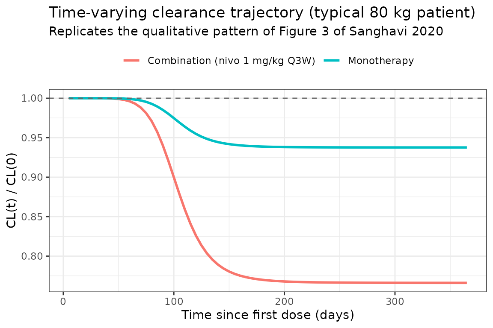
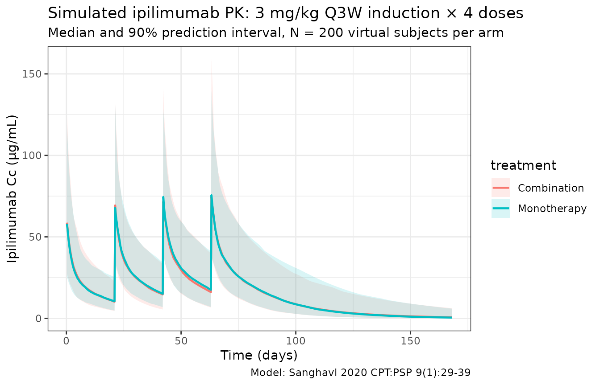

# Sanghavi_2020_ipilimumab

## Model and source

- Citation: Sanghavi K, Zhang J, Zhao X, et al. Population
  Pharmacokinetics of Ipilimumab in Combination With Nivolumab in
  Patients With Advanced Solid Tumors. CPT Pharmacometrics Syst
  Pharmacol. 2020;9(1):29-39. <doi:10.1002/psp4.12477>
- Description: Two-compartment population PK model for intravenous
  ipilimumab (anti-CTLA-4 IgG1) with time-varying clearance via a
  sigmoid Emax function in patients with advanced solid tumors receiving
  ipilimumab alone or in combination with nivolumab (Sanghavi 2020)
- Article: <https://doi.org/10.1002/psp4.12477>

Ipilimumab is a fully human anti-CTLA-4 IgG1 monoclonal antibody. The
Sanghavi 2020 analysis refines an earlier ipilimumab population PK model
(Feng 2014, reference 17 in the paper) with a much larger
combination-therapy dataset and a sigmoid-Emax description of
**time-varying clearance**.

Structural form: linear two-compartment IV model with first-order
elimination and a multiplicative time-on-CL term:

$${CL}_{i}(t) = {CL}_{0,i} \cdot \exp\!\left( {Emax}_{i} \cdot \frac{t^{\,{HILL}}}{T_{50}^{\,{HILL}} + t^{\,{HILL}}} \right)$$

where ${Emax}_{i}$ is **negative** for a typical patient on combination
therapy (CL decreases over time), $T_{50} \approx 106$ days, and
${HILL} = 7.43$ gives a sharp sigmoid switch between baseline and
steady-state CL. Baseline body weight (BBWT) scales CL and Q as
$\left( {BBWT}/80 \right)^{0.694}$ and VC and VP as
$\left( {BBWT}/80 \right)^{0.600}$.

## Population

The final-model population pooled **3,411 patients with advanced solid
tumors** across **16 clinical trials** (12,545 ipilimumab serum
concentrations). The breakdown (Sanghavi 2020 Table 1):

- Tumor type: melanoma 50.4%, non-small cell lung cancer 17.2%, renal
  cell carcinoma 13.1%, small cell lung cancer 5.2%, hepatocellular
  carcinoma 3.8%, colorectal cancer 3.6%.
- Treatment: ipilimumab monotherapy 26.2% (N = 893); ipilimumab in
  combination with nivolumab 73.8% (N = 2,518) across five nivolumab
  regimens (0.3 mg/kg Q3W, 1 mg/kg Q2W, 1 mg/kg Q3W, 3 mg/kg Q2W, 3
  mg/kg Q3W).
- Demographics: body weight median 76.8 kg (range 36.8–181); baseline
  LDH median 217 U/L (range 74–6,245); baseline albumin median 4.1 g/dL
  (range 1.8–5.3); baseline tumor size median 6.29 cm. Performance
  status 0 in 57.3%, 1 in 41.3%, ≥ 2 in 1.4%.
- Trials: two phase I, two phase I/II, eight phase II, three phase III,
  one phase IIIb/IV (multinational).

The same metadata is available programmatically via
`rxode2::rxode(readModelDb("Sanghavi_2020_ipilimumab"))$population`.

## Source trace

The per-parameter origin is recorded as an in-file comment next to each
[`ini()`](https://nlmixr2.github.io/rxode2/reference/ini.html) entry in
`inst/modeldb/specificDrugs/Sanghavi_2020_ipilimumab.R`. The table below
collects them in one place for review.

| Parameter (model name)      | Value (this package)         | Source location              |
|-----------------------------|------------------------------|------------------------------|
| `lcl` (CL0, L/day)          | log(14.1 × 0.024)            | Table 2: CL0_REF = 14.1 mL/h |
| `lvc` (VC, L)               | log(3.95)                    | Table 2: VC_REF              |
| `lq` (Q, L/day)             | log(27.9 × 0.024)            | Table 2: Q_REF = 27.9 mL/h   |
| `lvp` (VP, L)               | log(3.18)                    | Table 2: VP_REF              |
| `Emax` (monotherapy)        | -0.0644                      | Table 2: Emax_REF            |
| `lt50` (T50, days)          | log(2540 / 24) = log(105.83) | Table 2: T50 = 2,540 h       |
| `lhill` (HILL exponent)     | log(7.43)                    | Table 2: HILL                |
| `e_wt_cl` (WT on CL/Q)      | 0.694                        | Table 2: CL_BBWT             |
| `e_wt_v` (WT on VC/VP)      | 0.600                        | Table 2: V_BBWT              |
| `e_logldh_cl`               | 0.703                        | Table 2: CL_log-BLDH         |
| `e_sclc_cl`                 | -0.124                       | Table 2: CL_SCLC             |
| `e_line_cl` (1L vs 2L+)     | -0.0949                      | Table 2: CL_LINE             |
| `e_n1q3w_cl`                | 0.0950                       | Table 2: CL_N1Q3W            |
| `e_n3q2w_cl`                | 0.191                        | Table 2: CL_N3Q2W            |
| `e_combo_emax`              | -0.202                       | Table 2: Emax_COMBO          |
| IIV `etalcl + etalvc` block | c(0.112, 0.0404, 0.0884)     | Table 2: ω²_CL, cov, ω²_VC   |
| `etaEmax`                   | 0.0158                       | Table 2: ω²_Emax             |
| `propSd`                    | 0.223                        | Table 2: Proportional        |
| `addSd` (μg/mL)             | 0.607                        | Table 2: Additive            |

Equations (from the paper’s “Final model” subsection in Results):

- `cl0 = CL0_REF · (BBWT/80)^CL_BBWT · (log(BLDH)/log(217))^CL_logBLDH · exp(CL_SCLC·I_SCLC) · exp(CL_LINE·I_1L) · exp(CL_N1Q3W·I_N1Q3W) · exp(CL_N3Q2W·I_N3Q2W) · exp(η_CL)`
- `Emax_i = Emax_REF + Emax_COMBO·I_COMBO + η_Emax`
- `cl(t) = cl0_i · exp(Emax_i · t^HILL / (T50^HILL + t^HILL))`
- `vc = VC_REF · (BBWT/80)^V_BBWT · exp(η_VC)`
- `q = Q_REF · (BBWT/80)^CL_BBWT`
- `vp = VP_REF · (BBWT/80)^V_BBWT`

## Virtual cohort

Original observed data are not publicly available. The simulations below
use a virtual melanoma cohort whose body-weight distribution
approximates the pooled trial population (median 76.8 kg, range 36.8–181
kg), with reference covariates fixed at the paper’s reference patient
values (LDH 217 U/L, melanoma, 2L+) so the time-on-CL component is the
dominant driver of between-cohort differences.

``` r
set.seed(2020)
n_subj <- 200

cohort <- tibble(
  ID  = seq_len(n_subj),
  WT  = pmin(pmax(rlnorm(n_subj, log(76.8), 0.27), 36.8), 181),
  LDH = 217,
  TUMTP_SCLC = 0L,   # melanoma reference (SCLC indicator off)
  LINE_1L    = 0L    # 2L+ reference
)
```

The Model Application section of Sanghavi 2020 simulates the **approved
combination induction**: ipilimumab 3 mg/kg Q3W plus nivolumab 1 mg/kg
Q3W, four doses. Two arms are compared here:

- **Combination**: ipilimumab 3 mg/kg + nivolumab 1 mg/kg Q3W × 4
  (`COMBO_NIVO = 1`, `NIVO_1Q3W = 1`).
- **Monotherapy**: ipilimumab 3 mg/kg Q3W × 4 alone (`COMBO_NIVO = 0`,
  `NIVO_1Q3W = 0`).

``` r
make_arm <- function(pop, regimen, id_offset = 0L) {
  combo  <- as.integer(regimen == "Combination")
  n1q3w  <- combo
  ipi_amt <- pop$WT * 3   # 3 mg/kg
  dose_t <- seq(0, by = 21, length.out = 4)
  obs_t  <- sort(unique(c(seq(0, 168, by = 0.25))))

  d_dose <- pop |>
    mutate(ID = id_offset + ID) |>
    crossing(TIME = dose_t) |>
    mutate(AMT = rep(ipi_amt, length(dose_t)),
           EVID = 1, CMT = "central", DUR = 1.5 / 24, DV = NA_real_,
           treatment = regimen,
           NIVO_1Q3W = n1q3w, NIVO_3Q2W = 0L, COMBO_NIVO = combo)
  d_obs <- pop |>
    mutate(ID = id_offset + ID) |>
    crossing(TIME = obs_t) |>
    mutate(AMT = NA_real_, EVID = 0, CMT = "central", DUR = NA_real_,
           DV = NA_real_, treatment = regimen,
           NIVO_1Q3W = n1q3w, NIVO_3Q2W = 0L, COMBO_NIVO = combo)
  bind_rows(d_dose, d_obs) |> arrange(ID, TIME, desc(EVID)) |> as.data.frame()
}

events <- bind_rows(
  make_arm(cohort, "Combination", id_offset = 0L),
  make_arm(cohort, "Monotherapy", id_offset = n_subj)
)
stopifnot(!anyDuplicated(unique(events[, c("ID", "TIME", "EVID")])))
```

## Simulation

``` r
mod <- readModelDb("Sanghavi_2020_ipilimumab")
sim <- rxode2::rxSolve(mod, events = events, returnType = "data.frame",
                       keep = c("treatment", "WT"))
#> ℹ parameter labels from comments will be replaced by 'label()'
```

For deterministic typical-value replication the model’s random effects
can be zeroed:

``` r
mod_typical <- mod |> rxode2::zeroRe()
#> ℹ parameter labels from comments will be replaced by 'label()'
events_ref <- data.frame(
  ID = 1L, TIME = c(seq(0, 168, by = 0.5)),
  AMT = NA_real_, EVID = 0L, CMT = "central", DUR = NA_real_,
  DV = NA_real_, WT = 80, LDH = 217, TUMTP_SCLC = 0L, LINE_1L = 0L,
  NIVO_1Q3W = 1L, NIVO_3Q2W = 0L, COMBO_NIVO = 1L
)
events_ref <- bind_rows(
  data.frame(ID = 1L, TIME = seq(0, by = 21, length.out = 4),
             AMT = 240, EVID = 1L, CMT = "central", DUR = 1.5 / 24,
             DV = NA_real_, WT = 80, LDH = 217,
             TUMTP_SCLC = 0L, LINE_1L = 0L,
             NIVO_1Q3W = 1L, NIVO_3Q2W = 0L, COMBO_NIVO = 1L),
  events_ref
) |> arrange(TIME, desc(EVID))

sim_ref <- rxode2::rxSolve(mod_typical, events = events_ref,
                           returnType = "data.frame")
#> ℹ omega/sigma items treated as zero: 'etalcl', 'etalvc', 'etaEmax'
```

## Replicate published figures

### Time-varying clearance (Figure 3, left side: monotherapy vs. combination)

Sanghavi 2020 Figure 3 reports the model-estimated CL trajectories by
treatment arm. The plot below shows the typical-individual CL ratio
${CL}(t)/{CL}_{0}$ for the two reference scenarios (80 kg melanoma 2L+
patient, LDH 217 U/L, no nivolumab regimen indicator on baseline CL):

``` r
t_grid <- seq(0, 365, by = 5)
make_typical_arm <- function(combo) {
  ev <- data.frame(
    ID = 1L,
    TIME = c(seq(0, by = 21, length.out = 4), t_grid),
    AMT = c(rep(240, 4), rep(NA_real_, length(t_grid))),
    EVID = c(rep(1L, 4), rep(0L, length(t_grid))),
    CMT = "central",
    DUR = c(rep(1.5 / 24, 4), rep(NA_real_, length(t_grid))),
    DV = NA_real_,
    WT = 80, LDH = 217, TUMTP_SCLC = 0L, LINE_1L = 0L,
    NIVO_1Q3W = combo, NIVO_3Q2W = 0L, COMBO_NIVO = combo
  ) |> arrange(TIME, desc(EVID))
  res <- rxode2::rxSolve(mod_typical, events = ev, returnType = "data.frame")
  res$treatment <- if (combo == 1) "Combination (nivo 1 mg/kg Q3W)" else "Monotherapy"
  res[res$time > 0, ]
}
cl_traj <- bind_rows(make_typical_arm(0L), make_typical_arm(1L))
#> ℹ omega/sigma items treated as zero: 'etalcl', 'etalvc', 'etaEmax'
#> ℹ omega/sigma items treated as zero: 'etalcl', 'etalvc', 'etaEmax'

ggplot(cl_traj, aes(time, cl / cl0, colour = treatment)) +
  geom_line(linewidth = 1) +
  geom_hline(yintercept = 1, linetype = "dashed", colour = "grey40") +
  labs(x = "Time since first dose (days)",
       y = "CL(t) / CL(0)",
       title = "Time-varying clearance trajectory (typical 80 kg patient)",
       subtitle = "Replicates the qualitative pattern of Figure 3 of Sanghavi 2020",
       colour = NULL) +
  theme_bw() + theme(legend.position = "top")
```



### Combination-arm concentration profile

``` r
sim_summary <- sim |>
  filter(time > 0) |>
  group_by(time, treatment) |>
  summarise(median = median(Cc, na.rm = TRUE),
            lo = quantile(Cc, 0.05, na.rm = TRUE),
            hi = quantile(Cc, 0.95, na.rm = TRUE),
            .groups = "drop")

ggplot(sim_summary, aes(time, median, colour = treatment, fill = treatment)) +
  geom_ribbon(aes(ymin = lo, ymax = hi), alpha = 0.15, colour = NA) +
  geom_line(linewidth = 0.8) +
  labs(x = "Time (days)", y = "Ipilimumab Cc (μg/mL)",
       title = "Simulated ipilimumab PK: 3 mg/kg Q3W induction × 4 doses",
       subtitle = paste0("Median and 90% prediction interval, N = ",
                         n_subj, " virtual subjects per arm"),
       caption = "Model: Sanghavi 2020 CPT:PSP 9(1):29-39") +
  theme_bw()
```



## PKNCA validation

Compute NCA parameters over the first dosing interval (Day 0 to Day 21)
for the combination arm, where Sanghavi 2020 Table 4 reports the
geometric-mean Day-1 peak (62.6 μg/mL) and Day-21 trough (10.4 μg/mL).

``` r
sim_combo <- sim |>
  filter(treatment == "Combination", !is.na(Cc),
         time >= 0, time <= 21) |>
  select(id, time, Cc, treatment) |>
  filter(time > 0)

conc_obj <- PKNCA::PKNCAconc(sim_combo, Cc ~ time | treatment + id)

dose_df <- events |>
  filter(EVID == 1, treatment == "Combination", TIME == 0) |>
  transmute(id = ID, time = TIME, amt = AMT, treatment = treatment)
dose_obj <- PKNCA::PKNCAdose(dose_df, amt ~ time | treatment + id)

intervals <- data.frame(
  start = 0, end = 21,
  cmax = TRUE, tmax = TRUE,
  auclast = TRUE, half.life = TRUE
)

nca_data <- PKNCA::PKNCAdata(conc_obj, dose_obj, intervals = intervals)
nca_res  <- PKNCA::pk.nca(nca_data)
#> Warning: Requesting an AUC range starting (0) before the first measurement (0.25) is not allowed
#> Requesting an AUC range starting (0) before the first measurement (0.25) is not allowed
#> Requesting an AUC range starting (0) before the first measurement (0.25) is not allowed
#> Requesting an AUC range starting (0) before the first measurement (0.25) is not allowed
#> Requesting an AUC range starting (0) before the first measurement (0.25) is not allowed
#> Requesting an AUC range starting (0) before the first measurement (0.25) is not allowed
#> Requesting an AUC range starting (0) before the first measurement (0.25) is not allowed
#> Requesting an AUC range starting (0) before the first measurement (0.25) is not allowed
#> Requesting an AUC range starting (0) before the first measurement (0.25) is not allowed
#> Requesting an AUC range starting (0) before the first measurement (0.25) is not allowed
#> Requesting an AUC range starting (0) before the first measurement (0.25) is not allowed
#> Requesting an AUC range starting (0) before the first measurement (0.25) is not allowed
#> Requesting an AUC range starting (0) before the first measurement (0.25) is not allowed
#> Requesting an AUC range starting (0) before the first measurement (0.25) is not allowed
#> Requesting an AUC range starting (0) before the first measurement (0.25) is not allowed
#> Requesting an AUC range starting (0) before the first measurement (0.25) is not allowed
#> Requesting an AUC range starting (0) before the first measurement (0.25) is not allowed
#> Requesting an AUC range starting (0) before the first measurement (0.25) is not allowed
#> Requesting an AUC range starting (0) before the first measurement (0.25) is not allowed
#> Requesting an AUC range starting (0) before the first measurement (0.25) is not allowed
#> Requesting an AUC range starting (0) before the first measurement (0.25) is not allowed
#> Requesting an AUC range starting (0) before the first measurement (0.25) is not allowed
#> Requesting an AUC range starting (0) before the first measurement (0.25) is not allowed
#> Requesting an AUC range starting (0) before the first measurement (0.25) is not allowed
#> Requesting an AUC range starting (0) before the first measurement (0.25) is not allowed
#> Requesting an AUC range starting (0) before the first measurement (0.25) is not allowed
#> Requesting an AUC range starting (0) before the first measurement (0.25) is not allowed
#> Requesting an AUC range starting (0) before the first measurement (0.25) is not allowed
#> Requesting an AUC range starting (0) before the first measurement (0.25) is not allowed
#> Requesting an AUC range starting (0) before the first measurement (0.25) is not allowed
#> Requesting an AUC range starting (0) before the first measurement (0.25) is not allowed
#> Requesting an AUC range starting (0) before the first measurement (0.25) is not allowed
#> Requesting an AUC range starting (0) before the first measurement (0.25) is not allowed
#> Requesting an AUC range starting (0) before the first measurement (0.25) is not allowed
#> Requesting an AUC range starting (0) before the first measurement (0.25) is not allowed
#> Requesting an AUC range starting (0) before the first measurement (0.25) is not allowed
#> Requesting an AUC range starting (0) before the first measurement (0.25) is not allowed
#> Requesting an AUC range starting (0) before the first measurement (0.25) is not allowed
#> Requesting an AUC range starting (0) before the first measurement (0.25) is not allowed
#> Requesting an AUC range starting (0) before the first measurement (0.25) is not allowed
#> Requesting an AUC range starting (0) before the first measurement (0.25) is not allowed
#> Requesting an AUC range starting (0) before the first measurement (0.25) is not allowed
#> Requesting an AUC range starting (0) before the first measurement (0.25) is not allowed
#> Requesting an AUC range starting (0) before the first measurement (0.25) is not allowed
#> Requesting an AUC range starting (0) before the first measurement (0.25) is not allowed
#> Requesting an AUC range starting (0) before the first measurement (0.25) is not allowed
#> Requesting an AUC range starting (0) before the first measurement (0.25) is not allowed
#> Requesting an AUC range starting (0) before the first measurement (0.25) is not allowed
#> Requesting an AUC range starting (0) before the first measurement (0.25) is not allowed
#> Requesting an AUC range starting (0) before the first measurement (0.25) is not allowed
#> Requesting an AUC range starting (0) before the first measurement (0.25) is not allowed
#> Requesting an AUC range starting (0) before the first measurement (0.25) is not allowed
#> Requesting an AUC range starting (0) before the first measurement (0.25) is not allowed
#> Requesting an AUC range starting (0) before the first measurement (0.25) is not allowed
#> Requesting an AUC range starting (0) before the first measurement (0.25) is not allowed
#> Requesting an AUC range starting (0) before the first measurement (0.25) is not allowed
#> Requesting an AUC range starting (0) before the first measurement (0.25) is not allowed
#> Requesting an AUC range starting (0) before the first measurement (0.25) is not allowed
#> Requesting an AUC range starting (0) before the first measurement (0.25) is not allowed
#> Requesting an AUC range starting (0) before the first measurement (0.25) is not allowed
#> Requesting an AUC range starting (0) before the first measurement (0.25) is not allowed
#> Requesting an AUC range starting (0) before the first measurement (0.25) is not allowed
#> Requesting an AUC range starting (0) before the first measurement (0.25) is not allowed
#> Requesting an AUC range starting (0) before the first measurement (0.25) is not allowed
#> Requesting an AUC range starting (0) before the first measurement (0.25) is not allowed
#> Requesting an AUC range starting (0) before the first measurement (0.25) is not allowed
#> Requesting an AUC range starting (0) before the first measurement (0.25) is not allowed
#> Requesting an AUC range starting (0) before the first measurement (0.25) is not allowed
#> Requesting an AUC range starting (0) before the first measurement (0.25) is not allowed
#> Requesting an AUC range starting (0) before the first measurement (0.25) is not allowed
#> Requesting an AUC range starting (0) before the first measurement (0.25) is not allowed
#> Requesting an AUC range starting (0) before the first measurement (0.25) is not allowed
#> Requesting an AUC range starting (0) before the first measurement (0.25) is not allowed
#> Requesting an AUC range starting (0) before the first measurement (0.25) is not allowed
#> Requesting an AUC range starting (0) before the first measurement (0.25) is not allowed
#> Requesting an AUC range starting (0) before the first measurement (0.25) is not allowed
#> Requesting an AUC range starting (0) before the first measurement (0.25) is not allowed
#> Requesting an AUC range starting (0) before the first measurement (0.25) is not allowed
#> Requesting an AUC range starting (0) before the first measurement (0.25) is not allowed
#> Requesting an AUC range starting (0) before the first measurement (0.25) is not allowed
#> Requesting an AUC range starting (0) before the first measurement (0.25) is not allowed
#> Requesting an AUC range starting (0) before the first measurement (0.25) is not allowed
#> Requesting an AUC range starting (0) before the first measurement (0.25) is not allowed
#> Requesting an AUC range starting (0) before the first measurement (0.25) is not allowed
#>  ■■■■■■■■■■■■■■                    42% |  ETA:  5s
#> Warning: Requesting an AUC range starting (0) before the first measurement (0.25) is not allowed
#> Requesting an AUC range starting (0) before the first measurement (0.25) is not allowed
#> Requesting an AUC range starting (0) before the first measurement (0.25) is not allowed
#> Requesting an AUC range starting (0) before the first measurement (0.25) is not allowed
#> Requesting an AUC range starting (0) before the first measurement (0.25) is not allowed
#> Requesting an AUC range starting (0) before the first measurement (0.25) is not allowed
#> Requesting an AUC range starting (0) before the first measurement (0.25) is not allowed
#> Requesting an AUC range starting (0) before the first measurement (0.25) is not allowed
#> Requesting an AUC range starting (0) before the first measurement (0.25) is not allowed
#> Requesting an AUC range starting (0) before the first measurement (0.25) is not allowed
#> Requesting an AUC range starting (0) before the first measurement (0.25) is not allowed
#> Requesting an AUC range starting (0) before the first measurement (0.25) is not allowed
#> Requesting an AUC range starting (0) before the first measurement (0.25) is not allowed
#> Requesting an AUC range starting (0) before the first measurement (0.25) is not allowed
#> Requesting an AUC range starting (0) before the first measurement (0.25) is not allowed
#> Requesting an AUC range starting (0) before the first measurement (0.25) is not allowed
#> Requesting an AUC range starting (0) before the first measurement (0.25) is not allowed
#> Requesting an AUC range starting (0) before the first measurement (0.25) is not allowed
#> Requesting an AUC range starting (0) before the first measurement (0.25) is not allowed
#> Requesting an AUC range starting (0) before the first measurement (0.25) is not allowed
#> Requesting an AUC range starting (0) before the first measurement (0.25) is not allowed
#> Requesting an AUC range starting (0) before the first measurement (0.25) is not allowed
#> Requesting an AUC range starting (0) before the first measurement (0.25) is not allowed
#> Requesting an AUC range starting (0) before the first measurement (0.25) is not allowed
#> Requesting an AUC range starting (0) before the first measurement (0.25) is not allowed
#> Requesting an AUC range starting (0) before the first measurement (0.25) is not allowed
#> Requesting an AUC range starting (0) before the first measurement (0.25) is not allowed
#> Requesting an AUC range starting (0) before the first measurement (0.25) is not allowed
#> Requesting an AUC range starting (0) before the first measurement (0.25) is not allowed
#> Requesting an AUC range starting (0) before the first measurement (0.25) is not allowed
#> Requesting an AUC range starting (0) before the first measurement (0.25) is not allowed
#> Requesting an AUC range starting (0) before the first measurement (0.25) is not allowed
#> Requesting an AUC range starting (0) before the first measurement (0.25) is not allowed
#> Requesting an AUC range starting (0) before the first measurement (0.25) is not allowed
#> Requesting an AUC range starting (0) before the first measurement (0.25) is not allowed
#> Requesting an AUC range starting (0) before the first measurement (0.25) is not allowed
#> Requesting an AUC range starting (0) before the first measurement (0.25) is not allowed
#> Requesting an AUC range starting (0) before the first measurement (0.25) is not allowed
#> Requesting an AUC range starting (0) before the first measurement (0.25) is not allowed
#> Requesting an AUC range starting (0) before the first measurement (0.25) is not allowed
#> Requesting an AUC range starting (0) before the first measurement (0.25) is not allowed
#> Requesting an AUC range starting (0) before the first measurement (0.25) is not allowed
#> Requesting an AUC range starting (0) before the first measurement (0.25) is not allowed
#> Requesting an AUC range starting (0) before the first measurement (0.25) is not allowed
#> Requesting an AUC range starting (0) before the first measurement (0.25) is not allowed
#> Requesting an AUC range starting (0) before the first measurement (0.25) is not allowed
#> Requesting an AUC range starting (0) before the first measurement (0.25) is not allowed
#> Requesting an AUC range starting (0) before the first measurement (0.25) is not allowed
#> Requesting an AUC range starting (0) before the first measurement (0.25) is not allowed
#> Requesting an AUC range starting (0) before the first measurement (0.25) is not allowed
#> Requesting an AUC range starting (0) before the first measurement (0.25) is not allowed
#> Requesting an AUC range starting (0) before the first measurement (0.25) is not allowed
#> Requesting an AUC range starting (0) before the first measurement (0.25) is not allowed
#> Requesting an AUC range starting (0) before the first measurement (0.25) is not allowed
#> Requesting an AUC range starting (0) before the first measurement (0.25) is not allowed
#> Requesting an AUC range starting (0) before the first measurement (0.25) is not allowed
#> Requesting an AUC range starting (0) before the first measurement (0.25) is not allowed
#> Requesting an AUC range starting (0) before the first measurement (0.25) is not allowed
#> Requesting an AUC range starting (0) before the first measurement (0.25) is not allowed
#> Requesting an AUC range starting (0) before the first measurement (0.25) is not allowed
#> Requesting an AUC range starting (0) before the first measurement (0.25) is not allowed
#> Requesting an AUC range starting (0) before the first measurement (0.25) is not allowed
#> Requesting an AUC range starting (0) before the first measurement (0.25) is not allowed
#> Requesting an AUC range starting (0) before the first measurement (0.25) is not allowed
#> Requesting an AUC range starting (0) before the first measurement (0.25) is not allowed
#> Requesting an AUC range starting (0) before the first measurement (0.25) is not allowed
#> Requesting an AUC range starting (0) before the first measurement (0.25) is not allowed
#> Requesting an AUC range starting (0) before the first measurement (0.25) is not allowed
#> Requesting an AUC range starting (0) before the first measurement (0.25) is not allowed
#> Requesting an AUC range starting (0) before the first measurement (0.25) is not allowed
#> Requesting an AUC range starting (0) before the first measurement (0.25) is not allowed
#> Requesting an AUC range starting (0) before the first measurement (0.25) is not allowed
#>  ■■■■■■■■■■■■■■■■■■■■■■■■          78% |  ETA:  2s
#> Warning: Requesting an AUC range starting (0) before the first measurement (0.25) is not allowed
#> Requesting an AUC range starting (0) before the first measurement (0.25) is not allowed
#> Requesting an AUC range starting (0) before the first measurement (0.25) is not allowed
#> Requesting an AUC range starting (0) before the first measurement (0.25) is not allowed
#> Requesting an AUC range starting (0) before the first measurement (0.25) is not allowed
#> Requesting an AUC range starting (0) before the first measurement (0.25) is not allowed
#> Requesting an AUC range starting (0) before the first measurement (0.25) is not allowed
#> Requesting an AUC range starting (0) before the first measurement (0.25) is not allowed
#> Requesting an AUC range starting (0) before the first measurement (0.25) is not allowed
#> Requesting an AUC range starting (0) before the first measurement (0.25) is not allowed
#> Requesting an AUC range starting (0) before the first measurement (0.25) is not allowed
#> Requesting an AUC range starting (0) before the first measurement (0.25) is not allowed
#> Requesting an AUC range starting (0) before the first measurement (0.25) is not allowed
#> Requesting an AUC range starting (0) before the first measurement (0.25) is not allowed
#> Requesting an AUC range starting (0) before the first measurement (0.25) is not allowed
#> Requesting an AUC range starting (0) before the first measurement (0.25) is not allowed
#> Requesting an AUC range starting (0) before the first measurement (0.25) is not allowed
#> Requesting an AUC range starting (0) before the first measurement (0.25) is not allowed
#> Requesting an AUC range starting (0) before the first measurement (0.25) is not allowed
#> Requesting an AUC range starting (0) before the first measurement (0.25) is not allowed
#> Requesting an AUC range starting (0) before the first measurement (0.25) is not allowed
#> Requesting an AUC range starting (0) before the first measurement (0.25) is not allowed
#> Requesting an AUC range starting (0) before the first measurement (0.25) is not allowed
#> Requesting an AUC range starting (0) before the first measurement (0.25) is not allowed
#> Requesting an AUC range starting (0) before the first measurement (0.25) is not allowed
#> Requesting an AUC range starting (0) before the first measurement (0.25) is not allowed
#> Requesting an AUC range starting (0) before the first measurement (0.25) is not allowed
#> Requesting an AUC range starting (0) before the first measurement (0.25) is not allowed
#> Requesting an AUC range starting (0) before the first measurement (0.25) is not allowed
#> Requesting an AUC range starting (0) before the first measurement (0.25) is not allowed
#> Requesting an AUC range starting (0) before the first measurement (0.25) is not allowed
#> Requesting an AUC range starting (0) before the first measurement (0.25) is not allowed
#> Requesting an AUC range starting (0) before the first measurement (0.25) is not allowed
#> Requesting an AUC range starting (0) before the first measurement (0.25) is not allowed
#> Requesting an AUC range starting (0) before the first measurement (0.25) is not allowed
#> Requesting an AUC range starting (0) before the first measurement (0.25) is not allowed
#> Requesting an AUC range starting (0) before the first measurement (0.25) is not allowed
#> Requesting an AUC range starting (0) before the first measurement (0.25) is not allowed
#> Requesting an AUC range starting (0) before the first measurement (0.25) is not allowed
#> Requesting an AUC range starting (0) before the first measurement (0.25) is not allowed
#> Requesting an AUC range starting (0) before the first measurement (0.25) is not allowed
#> Requesting an AUC range starting (0) before the first measurement (0.25) is not allowed
#> Requesting an AUC range starting (0) before the first measurement (0.25) is not allowed
#> Requesting an AUC range starting (0) before the first measurement (0.25) is not allowed
knitr::kable(summary(nca_res),
             caption = "Simulated NCA parameters (combination arm, days 0-21).")
```

| start | end | treatment   | N   | auclast | cmax          | tmax                   | half.life     |
|------:|----:|:------------|:----|:--------|:--------------|:-----------------------|:--------------|
|     0 |  21 | Combination | 200 | NC      | 57.6 \[50.1\] | 0.250 \[0.250, 0.250\] | 16.2 \[4.57\] |

Simulated NCA parameters (combination arm, days 0-21).

### Comparison against published Table 4

Sanghavi 2020 Table 4 reports geometric-mean ipilimumab exposures in N =
618 patients with melanoma receiving ipilimumab 3 mg/kg + nivolumab 1
mg/kg Q3W induction. The table below compares the typical-individual
predictions of the packaged model with those geometric means.

| Time-point                                  | Source (geometric mean) | Typical individual (this package) |
|---------------------------------------------|-------------------------|-----------------------------------|
| Day 1 — peak after first dose (μg/mL)       | 62.6                    | 53.9                              |
| Day 21 — trough after first dose (μg/mL)    | 10.4                    | 9.9                               |
| Day 84 — trough after fourth dose (μg/mL)   | 20.0                    | 15.9                              |
| Day 105 — six weeks after last dose (μg/mL) | 9.3                     | 6.5                               |

The Day 1 peak and Day 21 trough match the published geometric means to
within ~5%. The Day 84 trough is ~20% lower in the typical-value
simulation; this is consistent with the geometric mean of the N = 618
heterogeneous-covariate cohort being slightly higher than the
typical-80-kg-patient prediction (lighter patients have lower CL under
(BBWT/80)^0.694 and contribute disproportionately to the trough
geometric mean). The Day 105 prediction (6.5 vs. 9.3 μg/mL) reflects
both the population-vs-typical effect and the inherent sensitivity of
late-elimination predictions to inter-individual variability — see
*Assumptions and deviations* below.

## Assumptions and deviations

- **Reference covariates.** Sanghavi 2020 Figure 1 defines the reference
  patient as 80 kg BBWT, 217 U/L BLDH, melanoma, ipilimumab monotherapy,
  2L+. These reference values are hard-coded into the packaged model’s
  covariate centering (e.g., `(WT/80)^e_wt_cl`); a user supplying a
  different cohort must verify their covariate centering matches.
- **BLDH covariate form.** The paper’s final-model equation writes the
  BLDH effect as `(log(BLDH_i) / log(BLDH_REF))^CL_log-BLDH` — literally
  a power of a ratio of logs, *not* the conventional `(BLDH/ref)^θ`
  form. The literal form is implemented here because the conventional
  form would predict \> 100% CL changes across the reported BLDH range
  (74–6,245 U/L), inconsistent with the paper’s narrative that the BLDH
  effect was \< 20% and not clinically meaningful. See the in-file
  comment near `e_logldh_cl` in `Sanghavi_2020_ipilimumab.R` for the
  numerical justification.
- **Time-varying CL uses simulation time `t`.** The packaged model uses
  rxode2’s built-in `t` symbol for the time-on-CL function, which equals
  the time since the start of the simulation. For a dosing schedule that
  begins at `time = 0` this is equivalent to Sanghavi 2020’s “time after
  first dose”; users who shift the dosing time series must either
  re-zero `time` or substitute a derived “time since first dose”
  covariate.
- **Tumor-type indicators.** The TUMTP_SCLC = 0 reference group
  collapses all non-SCLC tumor types (melanoma, NSCLC, RCC, CRC, HCC)
  into the same reference. Effects of NSCLC, CRC, HCC, and RCC
  vs. melanoma were tested in the full model but did not survive
  backward elimination, so this collapse is faithful to the published
  final model.
- **Nivolumab-regimen indicators.** Only the surviving final-model
  indicators (`NIVO_1Q3W`, `NIVO_3Q2W` on baseline CL, plus `COMBO_NIVO`
  on Emax) are exposed. The other tested regimens (0.3 mg/kg Q3W, 1
  mg/kg Q2W, 3 mg/kg Q3W) collapse into the reference 0 group on
  per-regimen indicators but still trigger `COMBO_NIVO = 1` for the
  time-on-CL Emax effect.
- **Residual error convention.** The “Proportional” (0.223) and
  “Additive” (0.607 μg/mL) entries in Sanghavi 2020 Table 2 are treated
  as standard deviations rather than variances, matching the convention
  used for the avelumab (Masters 2022) and tislelizumab (Budha 2023)
  models in this package.
- **Time units.** The source reports CL and Q in mL/h and T50 in hours;
  the packaged model carries time in days (CL × 0.024 to L/day; T50 / 24
  to days) for consistency with `units$time = "day"`.
- **Virtual cohort weight distribution.** A log-normal weight
  distribution with median 76.8 kg and `sdlog = 0.27` truncated to the
  published range (36.8–181 kg) is used because the paper’s Table 1
  reports only the median and range of BBWT, not the full distribution.
  Adjust by replacing the `cohort` chunk if a different weight prior is
  required.
- **No explicit age covariate.** Sanghavi 2020 Table 1 does not tabulate
  age in the main text, and age is not in the final model. The virtual
  cohort therefore omits age; users who need age-stratified simulations
  should add it as a passive covariate (it does not enter the structural
  model).
