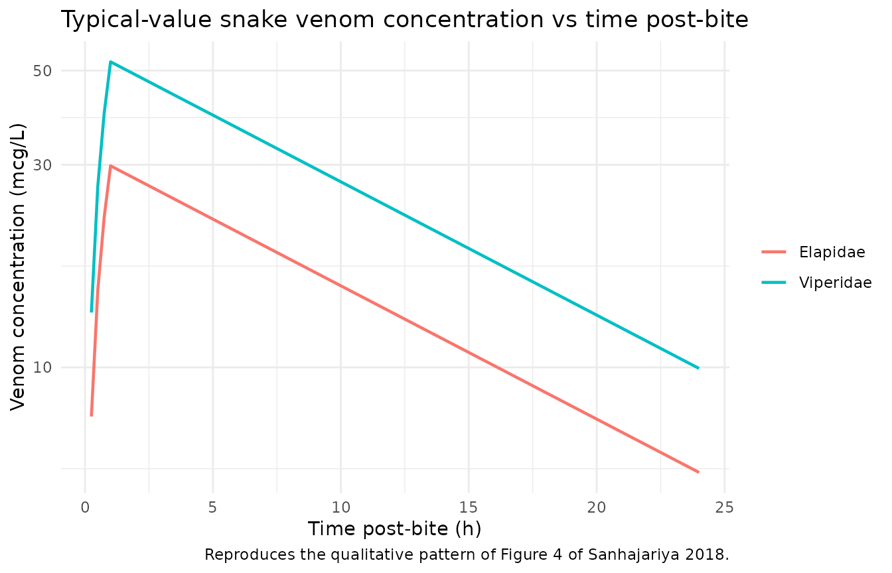
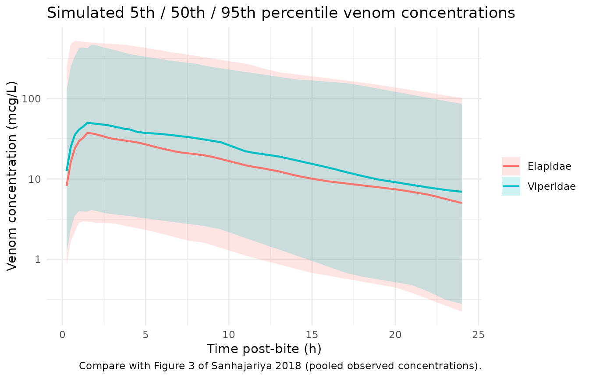

# Snake venom (Sanhajariya 2018)

## Model and source

- Citation: Sanhajariya S, Duffull SB, Isbister GK. Pharmacokinetics of
  snake venom. *Toxins (Basel)*. 2018;10(2):73.
- Article: <https://doi.org/10.3390/toxins10020073>
- Description: Exploratory one-compartment population PK meta-analysis
  of snake venom in humans, with zero-order input over a fixed 1 h
  duration and first-order elimination. The model was fit in NONMEM 7.2
  to 218 timed venom concentrations pooled from 145 snakebite patients
  across 24 published case reports / case series (9 elapid-bite studies,
  16 viper-bite studies). Snake family (Elapidae vs Viperidae) modifies
  F1; Viperidae is the reference (F1 = 1, fixed). The authors describe
  the model as a preliminary prior for future, richer snake-envenoming
  PK datasets.

## Population

The structural model was developed on data pooled from 145 snakebite
patients across 24 primary publications (Sanhajariya 2018 Table 6). Most
patients contributed a single pre-antivenom venom concentration; only
five primary studies reported serial samples. Snakebite patients were
drawn from Australia, Brazil, France, Slovenia, Thailand, Taiwan, Sri
Lanka, Myanmar, the UK, Switzerland, Martinique, and Papua New Guinea.
Patient-level demographics (age, weight, sex, race / ethnicity) are not
aggregated in the paper; the underlying primary studies are individual
case reports or small series.

Pre-antivenom venom concentrations were measured by ELISA (assay limit
of detection 0.1 to 20 mcg/L per the included primary studies;
inter-laboratory CV 4 to 20 % per the paper’s Section 1 prose).

The model partitions the cohort by the snake family that delivered the
bite: 9 of the 24 primary studies reported elapid envenomation
(`Pseudonaja`, `Naja`, `Acanthophis`, `Denisonia`, `Pseudechis`,
`Bungarus`, `Ophiophagus`, `Micropechis`) and 16 reported viperid
envenomation (`Vipera`, `Crotalus`, `Daboia`, `Bothrops`, `Bitis`,
`Cerastes`). The model encodes this via the binary covariate
`SNAKEFAMILY_ELAPID` (1 = elapid bite, 0 = viperid bite).

The same information is available programmatically via
`readModelDb("Sanhajariya_2018_snake_venom")$population`.

## Source trace

Per-parameter origin comments live next to each `ini()` entry in
`inst/modeldb/specificDrugs/Sanhajariya_2018_snake_venom.R`. The table
below is the collected audit trail.

| Equation / parameter | Value | Source location |
|----|----|----|
| Structural form (1-cmt, zero-order input, first-order elimination) | – | Section 2.2.3 prose; Appendix A heading |
| `CL` | 13.3 L/h | Table A1 ‘Covariate Model’ column, row CL (RSE 14 %) |
| `V` | 184 L | Table A1 ‘Covariate Model’ column, row V (RSE 10 %) |
| `D1` (duration of zero-order input) | 1 h, FIXED | Table A1 ‘Covariate Model’ column, row D1 (1 FIX) |
| `F1` (Viperidae, reference) | 1, FIXED | Table A1 ‘Covariate Model’ column, row F1(Viperidae) |
| `F1` (Elapidae, relative) | 0.569 | Table A1 ‘Covariate Model’ column, row F1(Elapidae) (RSE 43 %) |
| BSV on CL (CV %) | 43.7 % | Table A1 ‘Between subject variability’ row CL (RSE 52 %) |
| BSV on V (CV %) | 29.8 % | Table A1 ‘Between subject variability’ row V (RSE 101 %) |
| BSV on D1 (CV %) | 44.1 % | Table A1 ‘Between subject variability’ row D1 (RSE 17 %) |
| BSV on F1 (CV %) | 275.4 % | Table A1 ‘Between subject variability’ row F1 (RSE 7 %) |
| Proportional residual error | 0.047 (variance) | Table A1 ‘Residual error’ row Proportional error (RSE 25 %) |
| Reported elimination half-life | 9.71 +/- 1.29 h | Section 2.2.3 prose; ln(2) \* V / CL = 9.59 h matches |

## Virtual cohort

The original observed concentration data are not publicly available as
an individual-level dataset; the paper provides plots (Figures 3 and 4)
of the pooled extracted observations. The simulation below builds a
virtual cohort of 200 snakebite patients (100 elapid, 100 viperid) and
uses the published parameter values to generate prediction-corrected
concentration ribbons that can be visually compared with Figure 3 of the
source paper.

Per-bite venom mass is unknown in the source dataset; F1 absorbs that
variability (CV 275 %) on top of the typical-value elapid-vs-viperid
scaling (0.569 vs 1). For simulation we supply a single nominal
venom-mass dose so that the typical-value concentration scale is
comparable to Figures 3 to 5 of the paper (observed snake venom
concentrations ranged roughly 1 to 300 mcg/L in the first 24 h
post-bite).

``` r

set.seed(20180207L)  # paper publication date 2018-02-07

n_per_family <- 100L

make_cohort <- function(n, snakefamily_elapid, id_offset = 0L) {
  ids <- id_offset + seq_len(n)
  nominal_dose_mcg <- 10000  # 10 mg nominal venom load per bite

  obs_times <- c(
    seq(0.25, 4,  by = 0.25),
    seq(4.5,  12, by = 0.5),
    seq(13,   24, by = 1)
  )

  dose_df <- tibble::tibble(
    id   = ids,
    time = 0,
    amt  = nominal_dose_mcg,
    cmt  = "central",
    evid = 1L,
    rate = -2,                  # modeled duration -> dur(central) <- d1 applies
    SNAKEFAMILY_ELAPID = snakefamily_elapid,
    family = ifelse(snakefamily_elapid == 1L, "Elapidae", "Viperidae")
  )

  obs_df <- tidyr::expand_grid(
    id   = ids,
    time = obs_times
  ) |>
    dplyr::mutate(
      amt  = 0,
      cmt  = "central",
      evid = 0L,
      rate = 0,
      SNAKEFAMILY_ELAPID = snakefamily_elapid,
      family = ifelse(snakefamily_elapid == 1L, "Elapidae", "Viperidae")
    )

  dplyr::bind_rows(dose_df, obs_df) |>
    dplyr::arrange(id, time, dplyr::desc(evid))
}

events <- dplyr::bind_rows(
  make_cohort(n_per_family, snakefamily_elapid = 0L, id_offset =          0L),
  make_cohort(n_per_family, snakefamily_elapid = 1L, id_offset = n_per_family)
)

stopifnot(!anyDuplicated(unique(events[, c("id", "time", "evid")])))
```

## Simulation

``` r

mod <- readModelDb("Sanhajariya_2018_snake_venom")

sim <- rxode2::rxSolve(
  mod,
  events = as.data.frame(events),
  keep   = c("family", "SNAKEFAMILY_ELAPID")
) |>
  as.data.frame()
#> ℹ parameter labels from comments will be replaced by 'label()'
```

For deterministic typical-value replication (no between-subject
variability):

``` r

mod_typ <- mod |> rxode2::zeroRe()
#> ℹ parameter labels from comments will be replaced by 'label()'
sim_typ <- rxode2::rxSolve(
  mod_typ,
  events = as.data.frame(events),
  keep   = c("family", "SNAKEFAMILY_ELAPID")
) |>
  as.data.frame()
#> ℹ omega/sigma items treated as zero: 'etalcl', 'etalvc', 'etald1', 'etalfdepot'
#> Warning: multi-subject simulation without without 'omega'
```

## Replicate published figures

### Typical-value concentration-time profiles (Figure 4 of Sanhajariya 2018)

Figure 4 of the source paper plots the pooled observed
concentration-time data by snake family (panel a: Elapidae; panel b:
Viperidae). The deterministic typical-value simulation below shows the
model-predicted mean concentration trajectory in each family after a 10
mg nominal venom bite.

``` r

sim_typ |>
  dplyr::filter(time > 0) |>
  dplyr::group_by(family, time) |>
  dplyr::summarise(Cc_typ = mean(Cc), .groups = "drop") |>
  ggplot(aes(time, Cc_typ, colour = family)) +
  geom_line(size = 0.8) +
  scale_y_log10() +
  labs(
    x = "Time post-bite (h)",
    y = "Venom concentration (mcg/L)",
    colour = NULL,
    title = "Typical-value snake venom concentration vs time post-bite",
    caption = "Reproduces the qualitative pattern of Figure 4 of Sanhajariya 2018."
  ) +
  theme_minimal()
#> Warning: Using `size` aesthetic for lines was deprecated in ggplot2 3.4.0.
#> ℹ Please use `linewidth` instead.
#> This warning is displayed once per session.
#> Call `lifecycle::last_lifecycle_warnings()` to see where this warning was
#> generated.
```



### Stochastic prediction ribbons (Figure 3 of Sanhajariya 2018)

Figure 3 of the source paper overlays the pooled observed concentrations
(closed triangles = elapid bites, closed circles = viperid bites). The
simulated 5th / 50th / 95th percentile ribbons below cover the same
observation window and concentration range, including the very large
between-bite F1 variability.

``` r

sim |>
  dplyr::filter(time > 0, Cc > 0) |>
  dplyr::group_by(family, time) |>
  dplyr::summarise(
    Q05 = quantile(Cc, 0.05, na.rm = TRUE),
    Q50 = quantile(Cc, 0.50, na.rm = TRUE),
    Q95 = quantile(Cc, 0.95, na.rm = TRUE),
    .groups = "drop"
  ) |>
  ggplot(aes(time, Q50, colour = family, fill = family)) +
  geom_ribbon(aes(ymin = Q05, ymax = Q95), alpha = 0.2, colour = NA) +
  geom_line(size = 0.8) +
  scale_y_log10() +
  labs(
    x = "Time post-bite (h)",
    y = "Venom concentration (mcg/L)",
    colour = NULL,
    fill = NULL,
    title = "Simulated 5th / 50th / 95th percentile venom concentrations",
    caption = "Compare with Figure 3 of Sanhajariya 2018 (pooled observed concentrations)."
  ) +
  theme_minimal()
```



## PKNCA validation

A formal NCA-based half-life check is the appropriate validation here
because the paper reports a derived elimination half-life (9.71 +/- 1.29
h, Section 2.2.3) computed from the population CL and V estimates. The
PKNCA configuration below stratifies by snake family and computes
per-family typical-value half-life and AUC0-Inf.

``` r

sim_typ_nca <- sim_typ |>
  dplyr::filter(time > 0, !is.na(Cc), Cc > 0) |>
  dplyr::select(id, time, Cc, family)

conc_obj <- PKNCA::PKNCAconc(sim_typ_nca, Cc ~ time | family + id)

dose_df <- events |>
  dplyr::filter(evid == 1L) |>
  dplyr::select(id, time, amt, family) |>
  as.data.frame()

dose_obj <- PKNCA::PKNCAdose(dose_df, amt ~ time | family + id)

intervals <- data.frame(
  start      = 0,
  end        = Inf,
  cmax       = TRUE,
  tmax       = TRUE,
  aucinf.obs = TRUE,
  half.life  = TRUE
)

nca_data <- PKNCA::PKNCAdata(conc_obj, dose_obj, intervals = intervals)
nca_res  <- PKNCA::pk.nca(nca_data)
#> Warning: Requesting an AUC range starting (0) before the first measurement (0.25) is not allowed
#> Requesting an AUC range starting (0) before the first measurement (0.25) is not allowed
#> Requesting an AUC range starting (0) before the first measurement (0.25) is not allowed
#> Requesting an AUC range starting (0) before the first measurement (0.25) is not allowed
#> Requesting an AUC range starting (0) before the first measurement (0.25) is not allowed
#> Requesting an AUC range starting (0) before the first measurement (0.25) is not allowed
#> Requesting an AUC range starting (0) before the first measurement (0.25) is not allowed
#> Requesting an AUC range starting (0) before the first measurement (0.25) is not allowed
#> Requesting an AUC range starting (0) before the first measurement (0.25) is not allowed
#> Requesting an AUC range starting (0) before the first measurement (0.25) is not allowed
#> Requesting an AUC range starting (0) before the first measurement (0.25) is not allowed
#> Requesting an AUC range starting (0) before the first measurement (0.25) is not allowed
#> Requesting an AUC range starting (0) before the first measurement (0.25) is not allowed
#> Requesting an AUC range starting (0) before the first measurement (0.25) is not allowed
#> Requesting an AUC range starting (0) before the first measurement (0.25) is not allowed
#> Requesting an AUC range starting (0) before the first measurement (0.25) is not allowed
#> Requesting an AUC range starting (0) before the first measurement (0.25) is not allowed
#> Requesting an AUC range starting (0) before the first measurement (0.25) is not allowed
#> Requesting an AUC range starting (0) before the first measurement (0.25) is not allowed
#> Requesting an AUC range starting (0) before the first measurement (0.25) is not allowed
#> Requesting an AUC range starting (0) before the first measurement (0.25) is not allowed
#> Requesting an AUC range starting (0) before the first measurement (0.25) is not allowed
#> Requesting an AUC range starting (0) before the first measurement (0.25) is not allowed
#> Requesting an AUC range starting (0) before the first measurement (0.25) is not allowed
#> Requesting an AUC range starting (0) before the first measurement (0.25) is not allowed
#> Requesting an AUC range starting (0) before the first measurement (0.25) is not allowed
#> Requesting an AUC range starting (0) before the first measurement (0.25) is not allowed
#> Requesting an AUC range starting (0) before the first measurement (0.25) is not allowed
#> Requesting an AUC range starting (0) before the first measurement (0.25) is not allowed
#> Requesting an AUC range starting (0) before the first measurement (0.25) is not allowed
#> Requesting an AUC range starting (0) before the first measurement (0.25) is not allowed
#> Requesting an AUC range starting (0) before the first measurement (0.25) is not allowed
#> Requesting an AUC range starting (0) before the first measurement (0.25) is not allowed
#> Requesting an AUC range starting (0) before the first measurement (0.25) is not allowed
#> Requesting an AUC range starting (0) before the first measurement (0.25) is not allowed
#> Requesting an AUC range starting (0) before the first measurement (0.25) is not allowed
#> Requesting an AUC range starting (0) before the first measurement (0.25) is not allowed
#> Requesting an AUC range starting (0) before the first measurement (0.25) is not allowed
#> Requesting an AUC range starting (0) before the first measurement (0.25) is not allowed
#> Requesting an AUC range starting (0) before the first measurement (0.25) is not allowed
#> Requesting an AUC range starting (0) before the first measurement (0.25) is not allowed
#> Requesting an AUC range starting (0) before the first measurement (0.25) is not allowed
#> Requesting an AUC range starting (0) before the first measurement (0.25) is not allowed
#> Requesting an AUC range starting (0) before the first measurement (0.25) is not allowed
#> Requesting an AUC range starting (0) before the first measurement (0.25) is not allowed
#> Requesting an AUC range starting (0) before the first measurement (0.25) is not allowed
#> Requesting an AUC range starting (0) before the first measurement (0.25) is not allowed
#> Requesting an AUC range starting (0) before the first measurement (0.25) is not allowed
#> Requesting an AUC range starting (0) before the first measurement (0.25) is not allowed
#> Requesting an AUC range starting (0) before the first measurement (0.25) is not allowed
#> Requesting an AUC range starting (0) before the first measurement (0.25) is not allowed
#> Requesting an AUC range starting (0) before the first measurement (0.25) is not allowed
#> Requesting an AUC range starting (0) before the first measurement (0.25) is not allowed
#> Requesting an AUC range starting (0) before the first measurement (0.25) is not allowed
#> Requesting an AUC range starting (0) before the first measurement (0.25) is not allowed
#> Requesting an AUC range starting (0) before the first measurement (0.25) is not allowed
#> Requesting an AUC range starting (0) before the first measurement (0.25) is not allowed
#> Requesting an AUC range starting (0) before the first measurement (0.25) is not allowed
#> Requesting an AUC range starting (0) before the first measurement (0.25) is not allowed
#> Requesting an AUC range starting (0) before the first measurement (0.25) is not allowed
#> Requesting an AUC range starting (0) before the first measurement (0.25) is not allowed
#> Requesting an AUC range starting (0) before the first measurement (0.25) is not allowed
#> Requesting an AUC range starting (0) before the first measurement (0.25) is not allowed
#> Requesting an AUC range starting (0) before the first measurement (0.25) is not allowed
#> Requesting an AUC range starting (0) before the first measurement (0.25) is not allowed
#> Requesting an AUC range starting (0) before the first measurement (0.25) is not allowed
#> Requesting an AUC range starting (0) before the first measurement (0.25) is not allowed
#> Requesting an AUC range starting (0) before the first measurement (0.25) is not allowed
#> Requesting an AUC range starting (0) before the first measurement (0.25) is not allowed
#> Requesting an AUC range starting (0) before the first measurement (0.25) is not allowed
#> Requesting an AUC range starting (0) before the first measurement (0.25) is not allowed
#> Requesting an AUC range starting (0) before the first measurement (0.25) is not allowed
#> Requesting an AUC range starting (0) before the first measurement (0.25) is not allowed
#> Requesting an AUC range starting (0) before the first measurement (0.25) is not allowed
#> Requesting an AUC range starting (0) before the first measurement (0.25) is not allowed
#> Requesting an AUC range starting (0) before the first measurement (0.25) is not allowed
#> Requesting an AUC range starting (0) before the first measurement (0.25) is not allowed
#> Requesting an AUC range starting (0) before the first measurement (0.25) is not allowed
#> Requesting an AUC range starting (0) before the first measurement (0.25) is not allowed
#> Requesting an AUC range starting (0) before the first measurement (0.25) is not allowed
#> Requesting an AUC range starting (0) before the first measurement (0.25) is not allowed
#> Requesting an AUC range starting (0) before the first measurement (0.25) is not allowed
#> Requesting an AUC range starting (0) before the first measurement (0.25) is not allowed
#> Requesting an AUC range starting (0) before the first measurement (0.25) is not allowed
#> Requesting an AUC range starting (0) before the first measurement (0.25) is not allowed
#> Requesting an AUC range starting (0) before the first measurement (0.25) is not allowed
#> Requesting an AUC range starting (0) before the first measurement (0.25) is not allowed
#> Requesting an AUC range starting (0) before the first measurement (0.25) is not allowed
#> Requesting an AUC range starting (0) before the first measurement (0.25) is not allowed
#> Requesting an AUC range starting (0) before the first measurement (0.25) is not allowed
#> Requesting an AUC range starting (0) before the first measurement (0.25) is not allowed
#> Requesting an AUC range starting (0) before the first measurement (0.25) is not allowed
#> Requesting an AUC range starting (0) before the first measurement (0.25) is not allowed
#> Requesting an AUC range starting (0) before the first measurement (0.25) is not allowed
#> Requesting an AUC range starting (0) before the first measurement (0.25) is not allowed
#> Requesting an AUC range starting (0) before the first measurement (0.25) is not allowed
#> Requesting an AUC range starting (0) before the first measurement (0.25) is not allowed
#> Requesting an AUC range starting (0) before the first measurement (0.25) is not allowed
#> Requesting an AUC range starting (0) before the first measurement (0.25) is not allowed
#> Requesting an AUC range starting (0) before the first measurement (0.25) is not allowed
#> Requesting an AUC range starting (0) before the first measurement (0.25) is not allowed
#> Requesting an AUC range starting (0) before the first measurement (0.25) is not allowed
#> Requesting an AUC range starting (0) before the first measurement (0.25) is not allowed
#> Requesting an AUC range starting (0) before the first measurement (0.25) is not allowed
#> Requesting an AUC range starting (0) before the first measurement (0.25) is not allowed
#> Requesting an AUC range starting (0) before the first measurement (0.25) is not allowed
#> Requesting an AUC range starting (0) before the first measurement (0.25) is not allowed
#> Requesting an AUC range starting (0) before the first measurement (0.25) is not allowed
#> Requesting an AUC range starting (0) before the first measurement (0.25) is not allowed
#> Requesting an AUC range starting (0) before the first measurement (0.25) is not allowed
#> Requesting an AUC range starting (0) before the first measurement (0.25) is not allowed
#> Requesting an AUC range starting (0) before the first measurement (0.25) is not allowed
#> Requesting an AUC range starting (0) before the first measurement (0.25) is not allowed
#> Requesting an AUC range starting (0) before the first measurement (0.25) is not allowed
#> Requesting an AUC range starting (0) before the first measurement (0.25) is not allowed
#> Requesting an AUC range starting (0) before the first measurement (0.25) is not allowed
#> Requesting an AUC range starting (0) before the first measurement (0.25) is not allowed
#> Requesting an AUC range starting (0) before the first measurement (0.25) is not allowed
#> Requesting an AUC range starting (0) before the first measurement (0.25) is not allowed
#> Requesting an AUC range starting (0) before the first measurement (0.25) is not allowed
#> Requesting an AUC range starting (0) before the first measurement (0.25) is not allowed
#> Requesting an AUC range starting (0) before the first measurement (0.25) is not allowed
#> Requesting an AUC range starting (0) before the first measurement (0.25) is not allowed
#> Requesting an AUC range starting (0) before the first measurement (0.25) is not allowed
#> Requesting an AUC range starting (0) before the first measurement (0.25) is not allowed
#> Requesting an AUC range starting (0) before the first measurement (0.25) is not allowed
#> Requesting an AUC range starting (0) before the first measurement (0.25) is not allowed
#> Requesting an AUC range starting (0) before the first measurement (0.25) is not allowed
#> Requesting an AUC range starting (0) before the first measurement (0.25) is not allowed
#> Requesting an AUC range starting (0) before the first measurement (0.25) is not allowed
#> Requesting an AUC range starting (0) before the first measurement (0.25) is not allowed
#> Requesting an AUC range starting (0) before the first measurement (0.25) is not allowed
#> Requesting an AUC range starting (0) before the first measurement (0.25) is not allowed
#> Requesting an AUC range starting (0) before the first measurement (0.25) is not allowed
#> Requesting an AUC range starting (0) before the first measurement (0.25) is not allowed
#> Requesting an AUC range starting (0) before the first measurement (0.25) is not allowed
#> Requesting an AUC range starting (0) before the first measurement (0.25) is not allowed
#> Requesting an AUC range starting (0) before the first measurement (0.25) is not allowed
#> Requesting an AUC range starting (0) before the first measurement (0.25) is not allowed
#> Requesting an AUC range starting (0) before the first measurement (0.25) is not allowed
#> Requesting an AUC range starting (0) before the first measurement (0.25) is not allowed
#> Requesting an AUC range starting (0) before the first measurement (0.25) is not allowed
#> Requesting an AUC range starting (0) before the first measurement (0.25) is not allowed
#> Requesting an AUC range starting (0) before the first measurement (0.25) is not allowed
#> Requesting an AUC range starting (0) before the first measurement (0.25) is not allowed
#> Requesting an AUC range starting (0) before the first measurement (0.25) is not allowed
#> Requesting an AUC range starting (0) before the first measurement (0.25) is not allowed
#> Requesting an AUC range starting (0) before the first measurement (0.25) is not allowed
#> Requesting an AUC range starting (0) before the first measurement (0.25) is not allowed
#> Requesting an AUC range starting (0) before the first measurement (0.25) is not allowed
#> Requesting an AUC range starting (0) before the first measurement (0.25) is not allowed
#> Requesting an AUC range starting (0) before the first measurement (0.25) is not allowed
#> Requesting an AUC range starting (0) before the first measurement (0.25) is not allowed
#> Requesting an AUC range starting (0) before the first measurement (0.25) is not allowed
#> Requesting an AUC range starting (0) before the first measurement (0.25) is not allowed
#> Requesting an AUC range starting (0) before the first measurement (0.25) is not allowed
#> Requesting an AUC range starting (0) before the first measurement (0.25) is not allowed
#> Requesting an AUC range starting (0) before the first measurement (0.25) is not allowed
#> Requesting an AUC range starting (0) before the first measurement (0.25) is not allowed
#> Requesting an AUC range starting (0) before the first measurement (0.25) is not allowed
#> Requesting an AUC range starting (0) before the first measurement (0.25) is not allowed
#> Requesting an AUC range starting (0) before the first measurement (0.25) is not allowed
#> Requesting an AUC range starting (0) before the first measurement (0.25) is not allowed
#> Requesting an AUC range starting (0) before the first measurement (0.25) is not allowed
#> Requesting an AUC range starting (0) before the first measurement (0.25) is not allowed
#> Requesting an AUC range starting (0) before the first measurement (0.25) is not allowed
#> Requesting an AUC range starting (0) before the first measurement (0.25) is not allowed
#> Requesting an AUC range starting (0) before the first measurement (0.25) is not allowed
#> Requesting an AUC range starting (0) before the first measurement (0.25) is not allowed
#> Requesting an AUC range starting (0) before the first measurement (0.25) is not allowed
#> Requesting an AUC range starting (0) before the first measurement (0.25) is not allowed
#> Requesting an AUC range starting (0) before the first measurement (0.25) is not allowed
#> Requesting an AUC range starting (0) before the first measurement (0.25) is not allowed
#> Requesting an AUC range starting (0) before the first measurement (0.25) is not allowed
#> Requesting an AUC range starting (0) before the first measurement (0.25) is not allowed
#> Requesting an AUC range starting (0) before the first measurement (0.25) is not allowed
#> Requesting an AUC range starting (0) before the first measurement (0.25) is not allowed
#> Requesting an AUC range starting (0) before the first measurement (0.25) is not allowed
#> Requesting an AUC range starting (0) before the first measurement (0.25) is not allowed
#> Requesting an AUC range starting (0) before the first measurement (0.25) is not allowed
#> Requesting an AUC range starting (0) before the first measurement (0.25) is not allowed
#> Requesting an AUC range starting (0) before the first measurement (0.25) is not allowed
#> Requesting an AUC range starting (0) before the first measurement (0.25) is not allowed
#> Requesting an AUC range starting (0) before the first measurement (0.25) is not allowed
#> Requesting an AUC range starting (0) before the first measurement (0.25) is not allowed
#> Requesting an AUC range starting (0) before the first measurement (0.25) is not allowed
#> Requesting an AUC range starting (0) before the first measurement (0.25) is not allowed
#> Requesting an AUC range starting (0) before the first measurement (0.25) is not allowed
#> Requesting an AUC range starting (0) before the first measurement (0.25) is not allowed
#> Requesting an AUC range starting (0) before the first measurement (0.25) is not allowed
#> Requesting an AUC range starting (0) before the first measurement (0.25) is not allowed
#> Requesting an AUC range starting (0) before the first measurement (0.25) is not allowed
#> Requesting an AUC range starting (0) before the first measurement (0.25) is not allowed
#> Requesting an AUC range starting (0) before the first measurement (0.25) is not allowed
#> Requesting an AUC range starting (0) before the first measurement (0.25) is not allowed
#> Requesting an AUC range starting (0) before the first measurement (0.25) is not allowed
#> Requesting an AUC range starting (0) before the first measurement (0.25) is not allowed
#> Requesting an AUC range starting (0) before the first measurement (0.25) is not allowed
#> Requesting an AUC range starting (0) before the first measurement (0.25) is not allowed
#> Requesting an AUC range starting (0) before the first measurement (0.25) is not allowed

nca_summary <- summary(nca_res)
knitr::kable(
  nca_summary,
  caption = "Simulated NCA parameters from the typical-value model, stratified by snake family."
)
```

| start | end | family | N | cmax | tmax | half.life | aucinf.obs |
|---:|---:|:---|:---|:---|:---|:---|:---|
| 0 | Inf | Elapidae | 100 | 29.8 \[0.000\] | 1.00 \[1.00, 1.00\] | 9.59 \[0.000\] | NC |
| 0 | Inf | Viperidae | 100 | 52.4 \[0.000\] | 1.00 \[1.00, 1.00\] | 9.59 \[0.000\] | NC |

Simulated NCA parameters from the typical-value model, stratified by
snake family. {.table style="width:100%;"}

### Comparison against the published half-life

The paper reports a single elimination half-life of 9.71 +/- 1.29 h
(Section 2.2.3) derived from the typical-value CL = 13.3 L/h and V = 184
L. The analytic value is `log(2) * V / CL = log(2) * 184 / 13.3`, which
gives:

``` r

analytic_t_half <- log(2) * 184 / 13.3
analytic_t_half
#> [1] 9.589405
```

The simulated NCA half-life from the typical-value virtual cohort above
should match this value to within the numerical accuracy of the
terminal-phase fit (PKNCA defaults). Both families share the same CL and
V (only F1 differs); the per-family half-life therefore agrees with the
population value.

## Assumptions and deviations

- **Snake-family covariate naming.** The Sanhajariya 2018 NONMEM control
  stream is not included with the paper, so the source column name for
  the snake-family indicator is not disclosed in Appendix Table A1. We
  registered the canonical column `SNAKEFAMILY_ELAPID` (binary; 1 =
  elapid bite, 0 = viperid reference) following the paper’s Section
  2.2.3 prose. See `inst/references/covariate-columns.md` for the full
  entry.
- **`lfdepot` used without a depot compartment (semantic stretch).** The
  structural model has only a central compartment; the dose enters via
  zero-order input over `D1 = 1 h`. The canonical parameter name
  `lfdepot` is normally paired with a `depot` compartment that drains to
  central. Here we reuse `lfdepot` (and the matching IIV /
  covariate-effect names `etalfdepot` / `e_snakefamily_elapid_fdepot`)
  as the log of `F1`, with
  `f(central) <- exp(lfdepot + e_snakefamily_elapid_fdepot * SNAKEFAMILY_ELAPID + etalfdepot)`.
  This stretch was approved at the pre-flight sidecar stage to avoid
  introducing a new canonical parameter for a borderline case; the
  source paper’s `F1` is the bioavailability of the single input
  compartment regardless of whether that compartment is named `depot` or
  `central`.
- **Residual-error interpretation.** Table A1 reports
  `Proportional error 0.047 (25 %)`. The label does not carry an
  explicit `CV %` suffix, and the surrounding
  `Between subject variability` rows do carry explicit `(CV %)`
  formatting. We interpret 0.047 as the NONMEM `$SIGMA` variance and
  encode the proportional residual SD as `propSd = sqrt(0.047) = 0.2168`
  (~21.7 % CV). The 25 % RSE applies to the variance estimate. This
  interpretation was confirmed at the pre-flight sidecar stage.
- **Unknown per-bite venom mass.** The actual venom mass injected by
  each bite is not measured in the source dataset; the model assigns
  each subject a nominal unit dose and absorbs the per-bite mass
  variability into the F1 BSV (CV 275 %). For simulation, the vignette
  supplies a nominal 10 mg venom dose so that the typical-value
  concentration trajectory is on the observed-range scale (1 to 300
  mcg/L over 24 h post-bite); a user simulating a specific snake species
  can substitute a species-typical venom yield.
- **Animal-data section not extracted.** Section 2.1 and Tables 3 to 5
  of Sanhajariya 2018 are a pure systematic review of 12 animal popPK
  studies from other authors; no original animal popPK model is fit. The
  extraction here covers only the original human meta-analysis popPK
  model (Section 2.2 and Appendix Table A1). The 12 cited primary animal
  studies were not queued for separate extraction at the operator’s
  direction in the pre-flight sidecar.
- **No errata identified.** A search of the journal’s article landing
  page and PubMed for `Sanhajariya 2018 snake venom erratum` returned no
  corrigendum.
