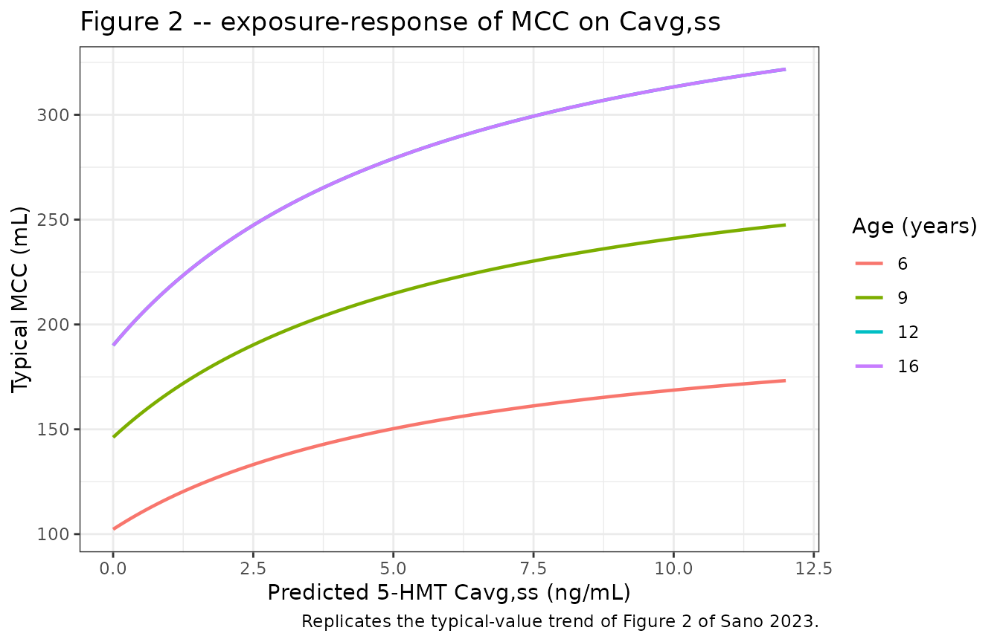
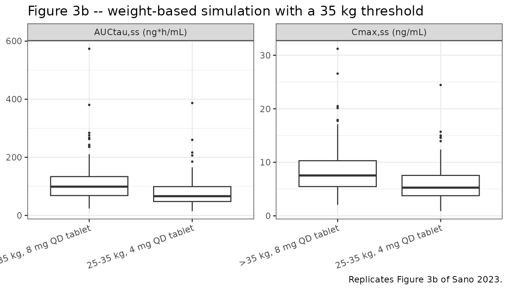
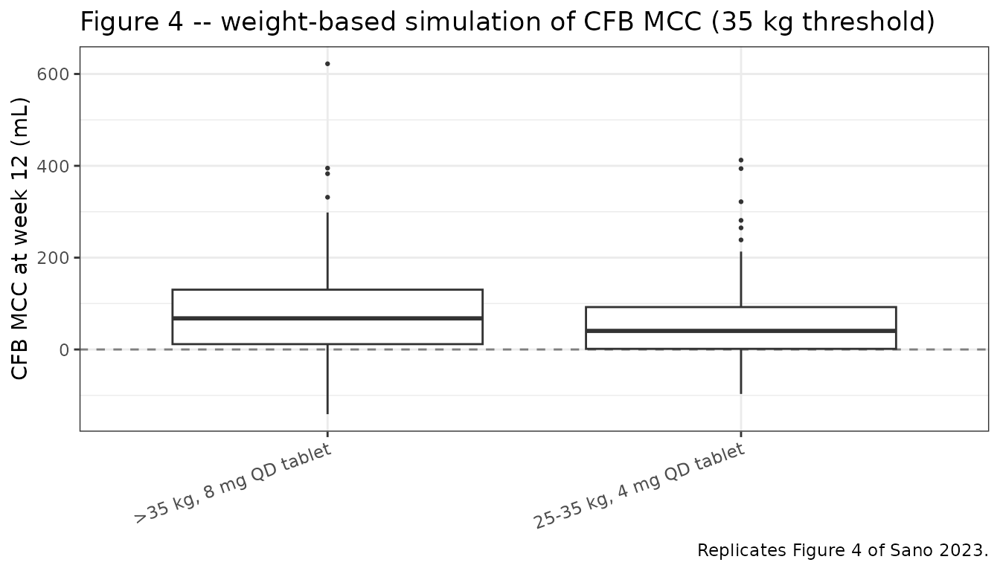

# Fesoterodine (Sano 2023)

## Model and source

Sano 2023 developed two sequentially-fitted models, packaged here as two
model files that share this vignette.

- Population PK of 5-HMT: `modellib("Sano_2023_fesoterodine")`

- Exposure-response on MCC: `modellib("Sano_2023_fesoterodine_mcc")`

- Citation: Sano Y, Shoji S, Shahin M, Sweeney K, Darekar A, Malhotra
  BK. Population Pharmacokinetic and Pharmacodynamic Modeling of
  Fesoterodine in Pediatric Patients with Neurogenic Detrusor
  Overactivity. Eur J Drug Metab Pharmacokinet. 2023 May;48(3):257-269.
  <doi:10.1007/s13318-023-00818-8>. PMID: 36892805. PMCID: PMC10175358.

- Article: <https://doi.org/10.1007/s13318-023-00818-8> (open access;
  PMCID PMC10175358)

- Supplement (Online Resources 1-12, including both NM-TRAN control
  streams): <https://doi.org/10.1007/s13318-023-00818-8> (Supplementary
  Information)

Fesoterodine is a muscarinic receptor antagonist. It is a prodrug: it is
hydrolysed by non-specific esterases to 5-hydroxymethyl tolterodine
(5-HMT), which is the active moiety and the only analyte measured. Every
concentration in this vignette is therefore a 5-HMT concentration, while
every dose is a fesoterodine dose.

The two models are independent fits to different datasets (142 patients
/ 428 concentrations for the PK; 121 patients / 242 MCC observations for
the PD), so they are packaged as two files per the library’s
replicate-the-author-structure policy. The link between them is
one-directional: the PD model consumes `CAV` (individual 5-HMT
`Cavg,ss`) computed from the PK model’s individual clearance.

## Population

The PK analysis population (Sano 2023 Table 1) pooled 142 pediatric
patients aged 6-17 years from two trials: the phase II study 1066
(NCT00857896, 21 patients with overactive bladder, roughly half with
neurogenic detrusor overactivity) and the phase III study 1047
(NCT01557244, 121 patients with symptoms of neurogenic detrusor
overactivity). Median age was 10 years (range 6-17) and median total
body weight 33.6 kg (range 11.7-85.0). The population was 47.9% female,
50.7% White / 44.4% Asian / 3.5% Black / 1.4% other, and only 3 of 142
patients (2.1%) were CYP2D6 poor metabolizers.

Study 1047 split patients by a 25 kg body-weight cutoff into two cohorts
that received different doses *and* different formulations: cohort 1
(patients over 25 kg, median weight 38 kg, median age 11) received
fesoterodine 4 or 8 mg tablets once daily, and cohort 2 (patients 25 kg
or less, median weight 22 kg, median age 7) received fesoterodine 2 or 4
mg beads-in-capsule (BIC) once daily. Formulation is therefore strongly
confounded with both body weight and dose in this dataset, which is the
single most important caveat attached to the 0.648
relative-bioavailability estimate.

The PK/PD analysis population (Sano 2023 Online Resource 11) is the
study-1047 subset: 121 patients, median age 9 years (range 6-16), median
weight 28 kg, 49.6% female, median baseline MCC 152 mL (range 16-451).
Each patient contributes exactly two MCC observations – baseline and
week 12 – for 242 records.

Sampling was sparse throughout (up to three PK samples per patient at
week 4 in study 1047), which produced substantial eta shrinkage on
`Vd/F` (42.1%) and `ka` (45.0%). The authors flag this as a caveat for
any empirical-Bayes-based diagnostic or exposure metric, including the
Online Resource 10 table this vignette validates against.

The same information is available programmatically from each model’s
`population` metadata:

``` r

str(readModelDb("Sano_2023_fesoterodine")()$population, max.level = 1)
#> List of 14
#>  $ species        : chr "human"
#>  $ n_subjects     : int 142
#>  $ n_observations : int 428
#>  $ n_studies      : int 2
#>  $ age_range      : chr "6-17 years (median 10, mean 10.1, SD 3.00)"
#>  $ weight_range   : chr "11.7-85.0 kg (median 33.6, mean 36.2, SD 16.1)"
#>  $ sex_female_pct : num 47.9
#>  $ race_ethnicity : Named num [1:4] 50.7 3.5 44.4 1.4
#>   ..- attr(*, "names")= chr [1:4] "White" "Black" "Asian" "Other"
#>  $ cyp2d6_pm_pct  : num 2.1
#>  $ formulation_pct: Named num [1:2] 64.8 35.2
#>   ..- attr(*, "names")= chr [1:2] "Tablet" "BIC"
#>  $ disease_state  : chr "Pediatric patients with overactive bladder (OAB) or neurogenic detrusor overactivity (NDO). Study 1066 enrolled"| __truncated__
#>  $ dose_range     : chr "Fesoterodine 4 mg tablet QD then 8 mg tablet QD (study 1066, 4-week periods); fesoterodine 4 or 8 mg tablet QD "| __truncated__
#>  $ regions        : chr "Multinational (NCT00857896 phase II study 1066; NCT01557244 phase III study 1047)."
#>  $ notes          : chr "Demographics from Sano 2023 Table 1 (pharmacokinetic analysis population). Sampling was sparse: study 1066 coll"| __truncated__
```

## Source trace

The per-parameter origin is recorded as an in-file comment next to each
`ini()` entry in `inst/modeldb/specificDrugs/Sano_2023_fesoterodine.R`
and `inst/modeldb/specificDrugs/Sano_2023_fesoterodine_mcc.R`. The
tables below collect them in one place.

### Population PK model (5-HMT)

| Equation / parameter | Value | Source location |
|----|----|----|
| `lcl` (CL/F) | 71.6 L/h | Table 2, “CL/F (L/h)” |
| `lvc` (Vd/F) | 68.1 L | Table 2, “Vd/F (L)” |
| `lka` (ka) | 0.0897 1/h | Table 2, “ka (1/h)” |
| `ltlag` (ALAG) | 0.285 h | Table 2, “ALAG (h)” |
| `e_wt_cl` | 0.75, FIXED | Table 2, “Effect of body weight on CL/F”; `$THETA(4) 0.75 FIX` in Online Resource 4 |
| `e_wt_vc` | 1, FIXED | Table 2, “Effect of body weight on Vd/F”; `$THETA(5) 1 FIX` in Online Resource 4 |
| `e_cyp2d6_pm_cl` | 0.546 | Table 2, “Effect of CYP2D6 metabolizer on CL/F” |
| `e_sexf_cl` | 0.862 | Table 2, “Effect of sex on CL/F” |
| `e_sexf_vc` | 0.634 | Table 2, “Effect of sex on Vd/F” |
| `lfdepot` | 0.648 | Table 2, “Effect of fesoterodine formulations on F” |
| Reference weight | 35 kg | Methods section 2.3; Online Resource 8a |
| IIV block (CL/F, Vd/F, ka) | 46.3 / 114 / 43.2 %CV; covariances 0.298, 0.0815, 0.435 | Table 2; `$OMEGA BLOCK(3)` in Online Resource 4 |
| `expSd` | 0.381 | Table 2, “sigma” (38.1 %CV on the log scale) |
| Structural equations | n/a | Equations 1-2; assembled forms in Online Resource 8a |
| Residual-error form | `ln(Y) = ln(F) + eps` | Methods section 2.5; Online Resource 8c; `$ERROR` in Online Resource 4 |

### Exposure-response model (MCC)

| Equation / parameter | Value | Source location |
|----|----|----|
| `lrbase` (BASE, age \> 12) | 190 mL | Table 3, “BASE (mL)” |
| `lec50` (EC50) | 6.22 ng/mL | Table 3, “EC50 (ng/mL)” |
| `lemax` (Emax, age \> 12) | 390 mL, FIXED | Table 3, “Emax (mL)” (“390, Fixed”); EBC rule in Methods section 2.2.3 |
| Age scaling `(AGE + 1)/13` | n/a | Equations 5-8; Online Resource 8b |
| IIV block (BASE, Emax) | 48.8 / 47.1 %CV; covariance 0.122 | Table 3; `$OMEGA BLOCK(2)` in Online Resource 5 |
| `propSd_MCC` | 0.0741 | Table 3, “sigma_PRP” (7.41 %CV) |
| `addSd_MCC` | 34.6 mL | Table 3, “sigma_ADD (mL)” |
| Emax equation | n/a | Equation 3; Online Resource 8b |
| `CAV` = `F * DOSE / (CL/F * tau)` | n/a | Equation 4 |
| Residual-error form | `Y = F * (1 + eps_PRP) + eps_ADD` | Methods section 2.4; Online Resource 8d |

Two features of Table 2 / Table 3 required interpretation and are
recorded in detail in the model files:

1.  **The `% CV` column is `sqrt(variance)`, not the log-normal
    `sqrt(exp(omega^2) - 1)`.** Under the log-normal reading, the
    reported `Vd/F`-`ka` covariance of 0.435 implies a correlation of
    1.15, which is impossible; under the sqrt-of-variance reading it is
    0.88, which is valid. The implied variances also sit on top of the
    Online Resource 4 / 5 `$OMEGA` initial estimates. Both assembled
    blocks are positive definite.
2.  **`Emax` is the maximum *attainable* MCC, not the maximum
    increment.** The drug effect is a fraction of the headroom between
    baseline MCC and the age-based expected bladder capacity ceiling. A
    naive `Emax * C / (EC50 + C)` increment form overpredicts the change
    from baseline by roughly 2.5-fold.

``` r

# Two independent checks against prose the models were not fitted to.
mcc_base <- function(age, plateau = 190) plateau * pmin((age + 1) / 13, 1)
mcc_emax <- function(age, plateau = 390) plateau * pmin((age + 1) / 13, 1)

# Discussion: "typical baseline MCC at median age (9 years) was estimated
# to be 146 mL".
round(mcc_base(9), 1)
#> [1] 146.2

# Results: 25-35 kg on 4 mg tablet QD gives a median CFB MCC of 47.8 mL at a
# median Cavg,ss of 2.83 ng/mL. Typical patient, median age 9.
round((mcc_emax(9) - mcc_base(9)) * 2.83 / (6.22 + 2.83), 1)
#> [1] 48.1
```

## Virtual cohort

Original observed data are not publicly available. The simulations below
use virtual populations whose covariate distributions approximate the
published per-cohort demographics (Sano 2023 Table 1 and Online Resource
11).

Body weight is drawn from a lognormal truncated to the observed cohort
range, and age from a normal truncated to the observed cohort range,
coupled by a Gaussian copula with rank correlation 0.75 so that older
patients are heavier. The paper does not report the joint weight-age
distribution; the copula is an assumption, and it matters because
`Cavg,ss` is driven by weight while both baseline MCC and the Emax
ceiling are driven by age.

``` r

# Truncated-inverse-CDF sampling, so no probability mass piles up on the
# range endpoints (a plain clamp would distort the median).
rtrunc_lnorm <- function(u, meanlog, sdlog, lo, hi) {
  p_lo <- plnorm(lo, meanlog, sdlog)
  p_hi <- plnorm(hi, meanlog, sdlog)
  qlnorm(p_lo + u * (p_hi - p_lo), meanlog, sdlog)
}

rtrunc_norm <- function(u, mean, sd, lo, hi) {
  p_lo <- pnorm(lo, mean, sd)
  p_hi <- pnorm(hi, mean, sd)
  qnorm(p_lo + u * (p_hi - p_lo), mean, sd)
}

# One cohort of subjects with weight and age coupled by a Gaussian copula.
make_subjects <- function(n, id_offset,
                          wt_med, wt_sdlog, wt_lo, wt_hi,
                          age_mean, age_sd, age_lo, age_hi,
                          pct_female, pct_pm, form_capsule,
                          rho = 0.75) {
  z1 <- rnorm(n)
  z2 <- rho * z1 + sqrt(1 - rho^2) * rnorm(n)
  tibble(
    id = id_offset + seq_len(n),
    WT = rtrunc_lnorm(pnorm(z1), log(wt_med), wt_sdlog, wt_lo, wt_hi),
    AGE = round(rtrunc_norm(pnorm(z2), age_mean, age_sd, age_lo, age_hi)),
    SEXF = rbinom(n, 1L, pct_female / 100),
    CYP2D6_PM = rbinom(n, 1L, pct_pm / 100),
    FORM_CAPSULE = form_capsule
  )
}

# Steady-state QD event table: 8 daily doses, then a dense observation grid
# over the final dosing interval. Observations are placed on the `central`
# ODE state -- never on the algebraic observable `Cc`.
TAU <- 24
SS_START <- 7 * TAU
SS_END <- SS_START + TAU

make_events <- function(subjects, dose_ug) {
  dosing <- subjects |>
    tidyr::crossing(time = seq(0, SS_START, by = TAU)) |>
    mutate(amt = dose_ug, evid = 1L, cmt = "depot")
  obs <- subjects |>
    tidyr::crossing(time = seq(SS_START, SS_END, by = 0.25)) |>
    mutate(amt = NA_real_, evid = 0L, cmt = "central")
  bind_rows(dosing, obs) |>
    arrange(id, time, desc(evid)) |>
    as.data.frame()
}

# Steady-state NCA over the final dosing interval. Used for both the
# Figure 3b replication and the Online Resource 10 comparison, so every
# NCA number in this vignette comes from PKNCA rather than a hand-rolled
# trapezoid.
SS_INTERVALS <- data.frame(
  start = SS_START,
  end = SS_END,
  cmax = TRUE,
  tmax = TRUE,
  cmin = TRUE,
  auclast = TRUE,
  cav = TRUE
)

run_ss_nca <- function(sim_df, events_df) {
  conc <- sim_df |>
    dplyr::filter(!is.na(Cc)) |>
    dplyr::select(id, time, Cc, treatment)
  dose <- events_df |>
    dplyr::filter(evid == 1) |>
    dplyr::select(id, time, amt, treatment)
  PKNCA::pk.nca(PKNCA::PKNCAdata(
    PKNCA::PKNCAconc(conc, Cc ~ time | treatment + id,
                     concu = "ng/mL", timeu = "h"),
    PKNCA::PKNCAdose(dose, amt ~ time | treatment + id, doseu = "ug"),
    intervals = SS_INTERVALS
  ))
}
```

``` r

set.seed(20230501)

N_ARM <- 150

# Study 1047 cohort 2 (25 kg or less): BIC formulation, median weight 22 kg,
# median age 7, 54.0% female. Sano 2023 Table 1.
coh2 <- function(n, id_offset) {
  make_subjects(
    n, id_offset,
    wt_med = 22, wt_sdlog = 0.25, wt_lo = 11.7, wt_hi = 25.0,
    age_mean = 7.64, age_sd = 1.82, age_lo = 6, age_hi = 15,
    pct_female = 54.0, pct_pm = 0, form_capsule = 1
  )
}

# Study 1047 cohort 1 (over 25 kg): tablet, median weight 38 kg, median
# age 11, 45.1% female, 2.8% CYP2D6 PM. Sano 2023 Table 1.
coh1 <- function(n, id_offset) {
  make_subjects(
    n, id_offset,
    wt_med = 38, wt_sdlog = 0.35, wt_lo = 25.1, wt_hi = 85.0,
    age_mean = 10.9, age_sd = 2.44, age_lo = 7, age_hi = 16,
    pct_female = 45.1, pct_pm = 2.8, form_capsule = 0
  )
}

arms <- list(
  list(label = "<=25 kg, 2 mg QD BIC",   subj = coh2(N_ARM,   0L), dose_ug = 2000),
  list(label = "<=25 kg, 4 mg QD BIC",   subj = coh2(N_ARM, 150L), dose_ug = 4000),
  list(label = ">25 kg, 4 mg QD tablet", subj = coh1(N_ARM, 300L), dose_ug = 4000),
  list(label = ">25 kg, 8 mg QD tablet", subj = coh1(N_ARM, 450L), dose_ug = 8000)
)

events <- bind_rows(lapply(arms, function(a) {
  make_events(a$subj, a$dose_ug) |> mutate(treatment = a$label)
}))

# Disjoint IDs across cohorts are mandatory: rxSolve treats id as the subject
# key, so a collision silently merges two subjects and sums their doses.
stopifnot(!anyDuplicated(unique(events[, c("id", "time", "evid")])))
stopifnot(length(unique(events$id)) == 4 * N_ARM)
```

Doses are supplied in **micrograms** (fesoterodine 2 mg = 2000 ug),
matching the source NM-TRAN dataset, so that `central / vc` yields ug/L
= ng/mL directly.

## Simulation

``` r

mod_pk <- readModelDb("Sano_2023_fesoterodine")

sim <- rxode2::rxSolve(
  mod_pk,
  events = events,
  keep = c("treatment", "WT", "AGE", "SEXF", "FORM_CAPSULE")
) |>
  as.data.frame()

nrow(sim)
#> [1] 58200
```

The absorption of 5-HMT in this model is **flip-flop**: `ka` (0.0897
1/h) is an order of magnitude slower than
`kel = CL/F / (Vd/F) = 1.05 1/h`, so the terminal phase is
absorption-rate-limited. This is worth checking explicitly, because it
is the feature most likely to be mis-transcribed from Table 2.

``` r

tibble(
  quantity = c("t1/2 from ka", "t1/2 from kel", "Tmax,ss"),
  model = c(
    log(2) / 0.0897,
    log(2) / (71.6 / 68.1),
    log(0.0897 / (71.6 / 68.1)) / (0.0897 - 71.6 / 68.1)
  ),
  published = c(7.73, NA, 2.55)
) |>
  mutate(across(c(model, published), \(x) round(x, 2))) |>
  knitr::kable(caption = "Flip-flop absorption checks against Sano 2023 Table 2 / Results section 3.1.")
```

| quantity      | model | published |
|:--------------|------:|----------:|
| t1/2 from ka  |  7.73 |      7.73 |
| t1/2 from kel |  0.66 |        NA |
| Tmax,ss       |  2.56 |      2.55 |

Flip-flop absorption checks against Sano 2023 Table 2 / Results section
3.1. {.table}

The published 7.73 h half-life is recovered from `ka`, not from `kel`
(which would give 0.66 h), and the published steady-state Tmax of 2.55 h
is recovered from the standard first-order-absorption expression. Both
confirm the Table 2 `ka` is correct as printed.

## Replicate published figures

### Figure 2 – exposure-response of MCC on Cavg,ss

Sano 2023 Figure 2 plots observed MCC (baseline and week 12) against
individual predicted `Cavg,ss`, stratified by treatment. The packaged
Emax model produces the underlying typical-value curve; the age scaling
makes it a family of curves rather than one.

``` r

mod_pd <- readModelDb("Sano_2023_fesoterodine_mcc")

er_curve <- tidyr::crossing(
  AGE = c(6, 9, 12, 16),
  CAV = seq(0, 12, by = 0.1)
) |>
  mutate(
    id = as.integer(factor(AGE)),
    ageScale = pmin((AGE + 1) / 13, 1),
    MCC = 190 * ageScale + (390 - 190) * ageScale * CAV / (6.22 + CAV)
  )

ggplot(er_curve, aes(CAV, MCC, colour = factor(AGE))) +
  geom_line(linewidth = 0.8) +
  labs(
    x = "Predicted 5-HMT Cavg,ss (ng/mL)",
    y = "Typical MCC (mL)",
    colour = "Age (years)",
    title = "Figure 2 -- exposure-response of MCC on Cavg,ss",
    caption = "Replicates the typical-value trend of Figure 2 of Sano 2023."
  ) +
  theme_bw()
```



Because few observations lay above `EC50` (6.22 ng/mL), the relationship
is close to linear across the observed exposure range – which is exactly
why the authors caution that `EC50` carries wide uncertainty (95% CI
4.11-10.1 ng/mL).

### Figure 3b – weight-based simulation of AUCtau,ss and Cmax,ss

Sano 2023 Figure 3b simulates exposure under the proposed weight-banded
regimen: 4 mg tablet QD for patients 25-35 kg and 8 mg tablet QD for
patients over 35 kg.

``` r

set.seed(20230502)

N_TH <- 200

# Patients 25-35 kg on 4 mg tablet QD, and patients over 35 kg on 8 mg tablet
# QD. Both are drawn from the study 1047 cohort 1 (tablet) demographics,
# restricted to the relevant weight band.
band_lo <- make_subjects(
  N_TH, 0L,
  wt_med = 30, wt_sdlog = 0.12, wt_lo = 25.0, wt_hi = 35.0,
  age_mean = 9.5, age_sd = 2.2, age_lo = 6, age_hi = 16,
  pct_female = 45.1, pct_pm = 2.8, form_capsule = 0
)
band_hi <- make_subjects(
  N_TH, 200L,
  wt_med = 48, wt_sdlog = 0.28, wt_lo = 35.01, wt_hi = 85.0,
  age_mean = 12.0, age_sd = 2.2, age_lo = 7, age_hi = 16,
  pct_female = 45.1, pct_pm = 2.8, form_capsule = 0
)

events_th <- bind_rows(
  make_events(band_lo, 4000) |> mutate(treatment = "25-35 kg, 4 mg QD tablet"),
  make_events(band_hi, 8000) |> mutate(treatment = ">35 kg, 8 mg QD tablet")
)
stopifnot(!anyDuplicated(unique(events_th[, c("id", "time", "evid")])))

sim_th <- rxode2::rxSolve(
  mod_pk,
  events = events_th,
  keep = c("treatment", "WT", "AGE")
) |>
  as.data.frame()
```

``` r

nca_th <- run_ss_nca(sim_th, events_th)

as.data.frame(nca_th$result) |>
  filter(PPTESTCD %in% c("cmax", "auclast")) |>
  mutate(metric = recode(PPTESTCD,
    cmax = "Cmax,ss (ng/mL)",
    auclast = "AUCtau,ss (ng*h/mL)"
  )) |>
  rename(value = PPORRES) |>
  ggplot(aes(treatment, value)) +
  geom_boxplot(outlier.size = 0.5) +
  facet_wrap(~metric, scales = "free_y") +
  labs(
    x = NULL, y = NULL,
    title = "Figure 3b -- weight-based simulation with a 35 kg threshold",
    caption = "Replicates Figure 3b of Sano 2023."
  ) +
  theme_bw() +
  theme(axis.text.x = element_text(angle = 20, hjust = 1))
```



### Figure 4 – weight-based simulation of change from baseline in MCC

Sano 2023 Figure 4 simulates CFB MCC at week 12 under the same
weight-banded regimen. `Cavg,ss` is computed per patient from the
individual apparent clearance using Equation 4, then supplied to the
Emax model as the `CAV` covariate; the baseline occasion uses `CAV = 0`,
which collapses the Emax term so the baseline prediction is exactly
`BASE`.

``` r

set.seed(20230503)

# Equation 4: Cavg,ss = F * DOSE / ((CL/F) * tau). The tablet arms have F = 1,
# and `cl` from the PK simulation is already the individual CL/F.
cav_tbl <- sim_th |>
  group_by(id, treatment, AGE) |>
  summarise(cl = first(cl), .groups = "drop") |>
  mutate(
    dose_ug = if_else(treatment == "25-35 kg, 4 mg QD tablet", 4000, 8000),
    CAV = dose_ug / (cl * TAU)
  )

# Two occasions per patient: baseline (CAV = 0) and week 12 (CAV = Cavg,ss).
# Both rows share an id, so they share the patient's PD random effects.
pd_events <- bind_rows(
  cav_tbl |> mutate(time = 0, CAV = 0, occasion = "baseline"),
  cav_tbl |> mutate(time = 12, occasion = "week 12")
) |>
  mutate(amt = NA_real_, evid = 0L) |>
  arrange(id, time) |>
  as.data.frame()

sim_pd <- rxode2::rxSolve(
  mod_pd,
  events = pd_events,
  keep = c("treatment", "AGE", "CAV", "occasion")
) |>
  as.data.frame()

# `sim` carries the residual error (proportional + additive); the published
# prediction intervals include it, which is why their lower bounds are negative.
cfb <- sim_pd |>
  select(id, treatment, occasion, sim) |>
  tidyr::pivot_wider(names_from = occasion, values_from = sim) |>
  mutate(cfb_mcc = `week 12` - baseline)
```

``` r

ggplot(cfb, aes(treatment, cfb_mcc)) +
  geom_hline(yintercept = 0, linetype = "dashed", colour = "grey50") +
  geom_boxplot(outlier.size = 0.5) +
  labs(
    x = NULL, y = "CFB MCC at week 12 (mL)",
    title = "Figure 4 -- weight-based simulation of CFB MCC (35 kg threshold)",
    caption = "Replicates Figure 4 of Sano 2023."
  ) +
  theme_bw() +
  theme(axis.text.x = element_text(angle = 20, hjust = 1))
```



``` r

published_fig4 <- tibble::tribble(
  ~treatment,                  ~cav_pub, ~cfb_pub, ~cfb_lo_pub, ~cfb_hi_pub,
  "25-35 kg, 4 mg QD tablet",  2.83,     47.8,     -50.8,       211,
  ">35 kg, 8 mg QD tablet",    4.06,     68.8,     -51.4,       286
)

cav_tbl |>
  group_by(treatment) |>
  summarise(cav_sim = median(CAV), .groups = "drop") |>
  left_join(
    cfb |>
      group_by(treatment) |>
      summarise(
        cfb_sim = median(cfb_mcc),
        cfb_lo_sim = quantile(cfb_mcc, 0.025),
        cfb_hi_sim = quantile(cfb_mcc, 0.975),
        .groups = "drop"
      ),
    by = "treatment"
  ) |>
  left_join(published_fig4, by = "treatment") |>
  mutate(across(where(is.numeric), \(x) round(x, 1))) |>
  select(
    treatment,
    cav_pub, cav_sim,
    cfb_pub, cfb_sim,
    cfb_lo_pub, cfb_lo_sim,
    cfb_hi_pub, cfb_hi_sim
  ) |>
  dplyr::rename(
    "Regimen" = treatment,
    "Cavg,ss published" = cav_pub,
    "Cavg,ss simulated" = cav_sim,
    "CFB MCC published" = cfb_pub,
    "CFB MCC simulated" = cfb_sim,
    "CFB 2.5% published" = cfb_lo_pub,
    "CFB 2.5% simulated" = cfb_lo_sim,
    "CFB 97.5% published" = cfb_hi_pub,
    "CFB 97.5% simulated" = cfb_hi_sim
  ) |>
  knitr::kable(
    caption = paste(
      "Median [95% prediction interval] Cavg,ss (ng/mL) and CFB MCC (mL)",
      "against the values reported in Sano 2023 Results section 3.3."
    )
  )
```

| Regimen | Cavg,ss published | Cavg,ss simulated | CFB MCC published | CFB MCC simulated | CFB 2.5% published | CFB 2.5% simulated | CFB 97.5% published | CFB 97.5% simulated |
|:---|---:|---:|---:|---:|---:|---:|---:|---:|
| 25-35 kg, 4 mg QD tablet | 2.8 | 2.8 | 47.8 | 40.4 | -50.8 | -79.1 | 211 | 239.3 |
| \>35 kg, 8 mg QD tablet | 4.1 | 4.1 | 68.8 | 67.8 | -51.4 | -76.4 | 286 | 296.7 |

Median \[95% prediction interval\] Cavg,ss (ng/mL) and CFB MCC (mL)
against the values reported in Sano 2023 Results section 3.3. {.table}

## PKNCA validation

Sano 2023 Online Resource 10 reports empirical-Bayes `Cmax,ss`,
`AUCtau,ss` and `Cavg,ss` by weight cohort and formulation for study
1047. Those are model-predicted individual exposures rather than
observed NCA, so the comparison below uses the individual prediction
`Cc` (no residual error) over the final dosing interval.

``` r

nca_res <- run_ss_nca(sim, events)
```

The NCA interval starts at the time of the final dose (168 h) and ends
one dosing interval later, and a concentration record exists at both
endpoints, so no time-zero back-extrapolation is requested.

### Comparison against published NCA

``` r

published <- tibble::tribble(
  ~treatment,               ~cmax, ~auclast, ~cav,
  "<=25 kg, 2 mg QD BIC",   2.51,  29.1,     1.21,
  "<=25 kg, 4 mg QD BIC",   5.25,  63.2,     2.64,
  ">25 kg, 4 mg QD tablet", 4.94,  59.7,     2.49,
  ">25 kg, 8 mg QD tablet", 8.64,  101,      4.22
)

cmp <- nlmixr2lib::ncaComparisonTable(
  simulated = nca_res,
  reference = published,
  by = "treatment",
  units = c(cmax = "ng/mL", auclast = "ng*h/mL", cav = "ng/mL"),
  tolerance_pct = 20
)

knitr::kable(
  cmp,
  caption = paste(
    "Simulated steady-state NCA vs the empirical-Bayes values in Sano 2023",
    "Online Resource 10 (medians). * differs from reference by >20%."
  ),
  align = c("l", "l", "r", "r", "r")
)
```

| NCA parameter      | treatment               | Reference | Simulated | % diff |
|:-------------------|:------------------------|----------:|----------:|-------:|
| Cmax (ng/mL)       | \<=25 kg, 2 mg QD BIC   |      2.51 |      2.35 |  -6.2% |
| Cmax (ng/mL)       | \<=25 kg, 4 mg QD BIC   |      5.25 |      5.34 |  +1.8% |
| Cmax (ng/mL)       | \>25 kg, 4 mg QD tablet |      4.94 |      4.38 | -11.3% |
| Cmax (ng/mL)       | \>25 kg, 8 mg QD tablet |      8.64 |      8.38 |  -3.0% |
| AUClast (ng\*h/mL) | \<=25 kg, 2 mg QD BIC   |      29.1 |        29 |  -0.4% |
| AUClast (ng\*h/mL) | \<=25 kg, 4 mg QD BIC   |      63.2 |      66.1 |  +4.6% |
| AUClast (ng\*h/mL) | \>25 kg, 4 mg QD tablet |      59.7 |      54.6 |  -8.6% |
| AUClast (ng\*h/mL) | \>25 kg, 8 mg QD tablet |       101 |       110 |  +8.7% |
| Cavg (ng/mL)       | \<=25 kg, 2 mg QD BIC   |      1.21 |      1.21 |  -0.2% |
| Cavg (ng/mL)       | \<=25 kg, 4 mg QD BIC   |      2.64 |      2.75 |  +4.3% |
| Cavg (ng/mL)       | \>25 kg, 4 mg QD tablet |      2.49 |      2.27 |  -8.7% |
| Cavg (ng/mL)       | \>25 kg, 8 mg QD tablet |      4.22 |      4.57 |  +8.4% |

Simulated steady-state NCA vs the empirical-Bayes values in Sano 2023
Online Resource 10 (medians). \* differs from reference by \>20%.
{.table style="width:100%;"}

## Assumptions and deviations

- **Joint weight-age distribution.** The paper reports weight and age
  marginals per cohort but not their joint distribution. Weight and age
  are coupled here by a Gaussian copula with rank correlation 0.75 and
  sampled by truncated inverse-CDF so no mass piles up at the range
  endpoints. This matters because `Cavg,ss` is weight-driven while both
  baseline MCC and the Emax ceiling are age-driven.
- **Weight-band demographics for Figures 3b and 4.** The paper resampled
  the actual 121 study-1047 patients. The bands here are drawn from the
  cohort 1 (tablet) demographics restricted to the relevant weight
  range, with the lognormal median and dispersion chosen to place the
  band medians near 30 kg and 48 kg. Individual band-level demographics
  are not published.
- **Prediction-interval precision.** Sano 2023 simulated 121 patients
  1000 times per arm; this vignette uses 200 patients once per arm (the
  library’s per-arm cohort cap). The medians are well determined, but
  the simulated 2.5th and 97.5th percentiles carry visible sampling
  noise relative to the published values.
- **Race and CYP2D6 phenotype.** Race is not a covariate in either model
  and is not simulated. CYP2D6 poor metabolizers are drawn at the
  published 2.8% (cohort 1) and 0% (cohort 2) prevalence; with 3 poor
  metabolizers in the whole analysis population, this covariate is
  essentially unidentified in the source data and its 0.546-fold effect
  should be read as imprecise.
- **Imprecise covariate effects retained as published.** Both sex
  effects have 95% CIs spanning the null value of 1.0 (CL/F 0.716-1.02;
  Vd/F 0.161-1.26) and `ALAG` has 45.1% RSE. They are kept because the
  authors carried them into the final model, not because they are well
  estimated.
- **Formulation is confounded with weight and dose.** BIC was given only
  to the 25-kg-or-less cohort and tablets only to the heavier cohort, so
  the 0.648 relative bioavailability cannot be cleanly separated from a
  weight or dose effect within this dataset. The authors note their
  model-predicted 64.8% is lower than the 79.9-87.9% observed by NCA in
  healthy adults, and attribute the gap to design differences and
  unknown fed/fasted state.
- **Residual error encoded as `lnorm`, not `prop`.** Online Resource 8c
  writes the residual form as `ln(Y) = ln(F) + eps`, a true log-normal.
  A 0.381 log-scale SD is a 39.5% CV, not 38.1%, so the distinction is
  material at this magnitude.
- **`% CV` read as `sqrt(variance)`.** See the Source trace section. The
  log-normal reading of Table 2 would make the reported `Vd/F`-`ka`
  covariance imply a correlation of 1.15, which is impossible.
- **`Emax` is fixed but carries IIV.** The typical value is fixed to the
  age-based expected bladder capacity, while the between-patient spread
  around it (47.1% CV) is estimated. This is encoded as
  `fixed(log(390))` with an estimated `etalemax`.
- **Age held constant over the 12-week window.** Baseline age drives
  both `BASE` and `Emax`; the paper does not advance age over follow-up,
  and neither does this vignette.
- **No non-paper-derived parameter values.** Every `ini()` value traces
  to Sano 2023 Table 2, Table 3, or Online Resources 4, 5 and 8. No
  value was digitised from a figure, supplied by correspondence, or
  carried from an upstream model.
